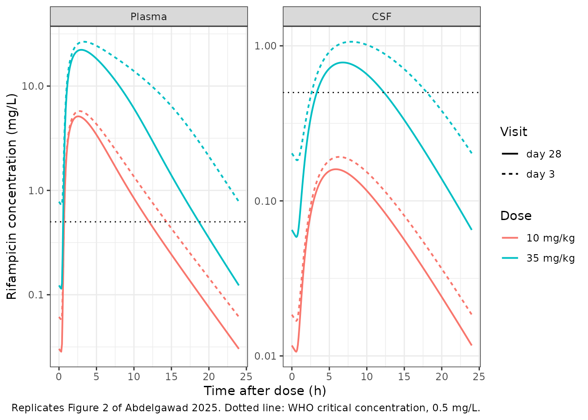
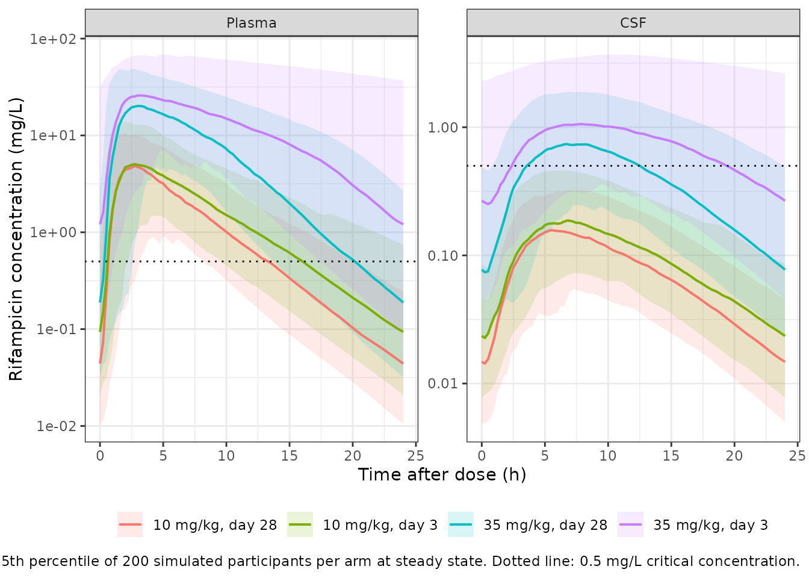

# Rifampicin (Abdelgawad 2025)

## Model and source

- Citation: Abdelgawad N, Wasserman S, Gausi K, Davis A, Stek C, Wiesner
  L, Meintjes G, Wilkinson RJ, Denti P (2025). Population
  Pharmacokinetics of Rifampicin in Plasma and Cerebrospinal Fluid in
  Adults With Tuberculosis Meningitis. J Infect Dis 232(4):e234-e241.
  <doi:10.1093/infdis/jiaf178>. Parameter estimates from Table 2; model
  equations from the Figure 1 caption and from the NONMEM control stream
  reproduced verbatim in the supplementary material. The
  saturable-hepatic-extraction structure was adapted from Chirehwa et
  al. (2016) Antimicrob Agents Chemother 60(1):487-494
  <doi:10.1128/AAC.01084-15>, which also supplied the informative prior
  on the Michaelis-Menten constant. The CSF effect compartment follows
  Sheiner et al. (1979) Clin Pharmacol Ther 25(3):358-371 and Savic et
  al. (2015) Clin Pharmacol Ther 98(6):622-629 <doi:10.1002/cpt.202>.
  Fat-free mass follows Janmahasatian et al. (2005) Clin Pharmacokinet
  44(10):1051-1065 <doi:10.2165/00003088-200544100-00004>.
- Description: Semi-mechanistic two-compartment population PK model for
  rifampicin in plasma and lumbar cerebrospinal fluid (CSF) in adults
  with HIV-associated tuberculous meningitis given standard-dose (10
  mg/kg oral), high-dose (35 mg/kg oral) or intravenous (20 mg/kg)
  rifampicin in the LASER-TBM trial (Abdelgawad 2025). Oral absorption
  is a Savic analytical transit chain (19 transit compartments fixed,
  mean transit time 0.634 h) feeding a first-order absorption
  compartment (ka 0.486 1/h) that empties into a liver compartment, so
  first-pass extraction is structural; prehepatic oral bioavailability
  is 0.934 and intravenous bioavailability is fixed to 1 with a modelled
  1 h infusion duration. Elimination is a well-stirred liver with
  saturable intrinsic clearance, CLint = CLint,max \* Km / (CH + Km) and
  EH = CLint \* fu / (CLint \* fu + QH), with liver volume 1 L, hepatic
  blood flow 90 L/h and fraction unbound 0.2 all fixed. The maximal
  intrinsic clearance is estimated as four separate typical values
  rather than by an autoinduction model, one per dose group and PK
  visit: the reported CLint,max \* fu products are 33.1 L/h (standard
  dose, day 3), 41.4 L/h (standard dose, day 28), 46.1 L/h (high dose,
  day 3) and 70.2 L/h (high dose, day 28). Disposition parameters are
  allometrically scaled on fat-free mass with fixed 0.75 / 1 exponents,
  referenced to 46 kg for CLint,max, Q, V and Vp and to 56.1 kg for the
  fixed hepatic physiology. CSF is a Sheiner-style effect compartment
  holding a concentration, equilibrating with plasma at a 3.20 h
  half-life toward a pseudo-partition coefficient of 0.0593. Random
  effects are between-subject variability on CLint,max (25.3%), central
  volume (17.2%) and infusion duration (17.0%), and five-occasion
  between-occasion variability on prehepatic bioavailability (18.2%), ka
  (78.1%) and mean transit time (111%); the reported percentages are
  omega standard deviations on the log scale. Residual error is combined
  proportional plus additive, separately for plasma (25.2%, 0.0234 mg/L)
  and CSF (98.4%, 0.0231 mg/L).
- Article: <https://doi.org/10.1093/infdis/jiaf178>
- Supplement (assay methods, covariate-imputation equations, the
  effect-compartment derivation, figures S1-S2, and the full NONMEM
  control file): supplementary data to the same DOI, distributed by
  Oxford University Press as `jiaf178_supplementary_data.docx`.

Rifampicin is the cornerstone of tuberculous meningitis (TBM) treatment
but is still dosed at 10 mg/kg, the dose derived for pulmonary disease.
Abdelgawad 2025 is the pharmacokinetic substudy of LASER-TBM, a phase 2A
trial in adults with HIV-associated TBM that randomised participants to
standard-of-care oral rifampicin at 10 mg/kg or to high-dose rifampicin
– 35 mg/kg orally, or 20 mg/kg intravenously for the first three days –
and sampled both plasma and lumbar cerebrospinal fluid on day 3 and day
28.

Two features make the model unusual among the rifampicin popPK models in
this library. First, elimination is a well-stirred liver with
**saturable** intrinsic clearance and an explicit liver compartment, so
first-pass extraction is structural rather than an
apparent-bioavailability term, and exposure rises faster than
proportionally with dose. Second, CSF is a Sheiner-style **effect
compartment** whose state holds a concentration rather than an amount:
the authors deliberately avoided estimating a CSF volume, and instead
estimated a pseudo-partition coefficient (PPC) and an equilibration
half-life. The consequence – exploited as a validation gate below – is
that at steady state the CSF-to-plasma AUC ratio equals the PPC exactly.

``` r

mod <- rxode2::rxode(readModelDb("Abdelgawad_2025_rifampicin"))
#> ℹ parameter labels from comments will be replaced by 'label()'
#> Warning: some etas defaulted to non-mu referenced, possible parsing error: etaiov_fdepot_1, etaiov_fdepot_2, etaiov_fdepot_3, etaiov_fdepot_4, etaiov_fdepot_5, etaiov_ka_1, etaiov_ka_2, etaiov_ka_3, etaiov_ka_4, etaiov_ka_5, etaiov_mtt_1, etaiov_mtt_2, etaiov_mtt_3, etaiov_mtt_4, etaiov_mtt_5
#> as a work-around try putting the mu-referenced expression on a simple line
mod_typical <- rxode2::zeroRe(mod)
#> Warning: some etas defaulted to non-mu referenced, possible parsing error: etaiov_fdepot_1, etaiov_fdepot_2, etaiov_fdepot_3, etaiov_fdepot_4, etaiov_fdepot_5, etaiov_ka_1, etaiov_ka_2, etaiov_ka_3, etaiov_ka_4, etaiov_ka_5, etaiov_mtt_1, etaiov_mtt_2, etaiov_mtt_3, etaiov_mtt_4, etaiov_mtt_5
#> as a work-around try putting the mu-referenced expression on a simple line

# Published constants used throughout, transcribed once from Abdelgawad 2025
# so no gate below can silently read its target out of the model object.
pub <- list(
  ppc            = 0.0593,   # Table 2, pseudo-partition coefficient
  thalf_eq       = 3.20,     # Table 2, equilibration half-life to CSF (h)
  f_prehepatic   = 0.934,    # Table 2, prehepatic oral bioavailability
  km             = 2.97,     # Table 2, Michaelis-Menten constant (mg/L)
  fu_plasma      = 1 - 0.828, # Results, plasma protein binding 82.8%
  frac_free_csf  = 0.34,     # Discussion, "about 34% of free rifampicin crosses into the CSF"
  cc_mtb         = 0.5,      # Figure 2, WHO critical concentration for M. tuberculosis (mg/L)
  clint_fu       = c(std_d3 = 33.1, std_d28 = 41.4, high_d3 = 46.1, high_d28 = 70.2)
)
```

## Population

0.0593 is the headline number of a small, sick, real-world cohort. The
model was fit to 400 plasma and 44 CSF rifampicin concentrations from 48
adults with HIV-associated TBM enrolled at four South African hospitals.
Median (range) age was 39 years (25-78), weight 59.5 kg (30-107.2) and
fat-free mass 45.2 kg (30.3-59.4) at the day-3 visit; 55.1% were male.
All participants were living with HIV and all received adjunctive
corticosteroids.

Day-3 plasma sampling was intensive (predose and 0.5, 1, 2, 3, 6, 8-10
and 24 h postdose); day-28 sampling was sparse (predose, 2 and 4 h
postdose). One lumbar CSF sample was taken per visit, with the sampling
time randomised across the 1-3, 3-6, 6-10 and 24 h postdose windows – 46
CSF samples in total, 13 of them below the limit of quantification. That
sparsity is why the CSF proportional residual error is 98.4% and why no
covariate reached significance on the PPC.

``` r

pop <- readModelDb("Abdelgawad_2025_rifampicin")
pop_env <- new.env()
eval(body(pop), envir = pop_env)
#> Warning: some etas defaulted to non-mu referenced, possible parsing error: etaiov_fdepot_1, etaiov_fdepot_2, etaiov_fdepot_3, etaiov_fdepot_4, etaiov_fdepot_5, etaiov_ka_1, etaiov_ka_2, etaiov_ka_3, etaiov_ka_4, etaiov_ka_5, etaiov_mtt_1, etaiov_mtt_2, etaiov_mtt_3, etaiov_mtt_4, etaiov_mtt_5
#> as a work-around try putting the mu-referenced expression on a simple line
#>  ── rxode2-based free-form 5-cmt ODE model ────────────────────────────────────── 
#>  ── Initalization: ──  
#> Fixed Effects ($theta): 
#>                 lkm                 lvc                 lvp                  lq 
#>          1.09075000          3.30861780          3.45087287          2.39763160 
#>                 lka                lmtt                lntr             lfdepot 
#>         -0.72166600         -0.45538776          2.94443898         -0.06814609 
#>           lfcentral                ldur                 lvh                 lqh 
#>          0.00000000          0.00000000          0.00000000          4.49980967 
#>                 fub   lclint_max_std_d3  lclint_max_std_d28  lclint_max_high_d3 
#>          0.20000000          5.10963261          5.33298446          5.44038968 
#> lclint_max_high_d28                lke0                lppc     e_ffm_clint_max 
#>          5.86126047         -1.52854123         -2.82534835          0.75000000 
#>             e_ffm_q            e_ffm_vc            e_ffm_vp            e_ffm_qh 
#>          0.75000000          1.00000000          1.00000000          0.75000000 
#>            e_ffm_vh              propSd               addSd         propSd_Ccsf 
#>          1.00000000          0.25195400          0.02340000          0.98421600 
#>          addSd_Ccsf 
#>          0.02312580 
#> 
#> Omega ($omega): 
#>                 etalclint_max    etalvc   etaldur etaiov_fdepot_1
#> etalclint_max       0.0642298 0.0000000 0.0000000       0.0000000
#> etalvc              0.0000000 0.0295196 0.0000000       0.0000000
#> etaldur             0.0000000 0.0000000 0.0288515       0.0000000
#> etaiov_fdepot_1     0.0000000 0.0000000 0.0000000       0.0329715
#> etaiov_fdepot_2     0.0000000 0.0000000 0.0000000       0.0000000
#> etaiov_fdepot_3     0.0000000 0.0000000 0.0000000       0.0000000
#> etaiov_fdepot_4     0.0000000 0.0000000 0.0000000       0.0000000
#> etaiov_fdepot_5     0.0000000 0.0000000 0.0000000       0.0000000
#> etaiov_ka_1         0.0000000 0.0000000 0.0000000       0.0000000
#> etaiov_ka_2         0.0000000 0.0000000 0.0000000       0.0000000
#> etaiov_ka_3         0.0000000 0.0000000 0.0000000       0.0000000
#> etaiov_ka_4         0.0000000 0.0000000 0.0000000       0.0000000
#> etaiov_ka_5         0.0000000 0.0000000 0.0000000       0.0000000
#> etaiov_mtt_1        0.0000000 0.0000000 0.0000000       0.0000000
#> etaiov_mtt_2        0.0000000 0.0000000 0.0000000       0.0000000
#> etaiov_mtt_3        0.0000000 0.0000000 0.0000000       0.0000000
#> etaiov_mtt_4        0.0000000 0.0000000 0.0000000       0.0000000
#> etaiov_mtt_5        0.0000000 0.0000000 0.0000000       0.0000000
#>                 etaiov_fdepot_2 etaiov_fdepot_3 etaiov_fdepot_4 etaiov_fdepot_5
#> etalclint_max         0.0000000       0.0000000       0.0000000       0.0000000
#> etalvc                0.0000000       0.0000000       0.0000000       0.0000000
#> etaldur               0.0000000       0.0000000       0.0000000       0.0000000
#> etaiov_fdepot_1       0.0000000       0.0000000       0.0000000       0.0000000
#> etaiov_fdepot_2       0.0329715       0.0000000       0.0000000       0.0000000
#> etaiov_fdepot_3       0.0000000       0.0329715       0.0000000       0.0000000
#> etaiov_fdepot_4       0.0000000       0.0000000       0.0329715       0.0000000
#> etaiov_fdepot_5       0.0000000       0.0000000       0.0000000       0.0329715
#> etaiov_ka_1           0.0000000       0.0000000       0.0000000       0.0000000
#> etaiov_ka_2           0.0000000       0.0000000       0.0000000       0.0000000
#> etaiov_ka_3           0.0000000       0.0000000       0.0000000       0.0000000
#> etaiov_ka_4           0.0000000       0.0000000       0.0000000       0.0000000
#> etaiov_ka_5           0.0000000       0.0000000       0.0000000       0.0000000
#> etaiov_mtt_1          0.0000000       0.0000000       0.0000000       0.0000000
#> etaiov_mtt_2          0.0000000       0.0000000       0.0000000       0.0000000
#> etaiov_mtt_3          0.0000000       0.0000000       0.0000000       0.0000000
#> etaiov_mtt_4          0.0000000       0.0000000       0.0000000       0.0000000
#> etaiov_mtt_5          0.0000000       0.0000000       0.0000000       0.0000000
#>                 etaiov_ka_1 etaiov_ka_2 etaiov_ka_3 etaiov_ka_4 etaiov_ka_5
#> etalclint_max      0.000000    0.000000    0.000000    0.000000    0.000000
#> etalvc             0.000000    0.000000    0.000000    0.000000    0.000000
#> etaldur            0.000000    0.000000    0.000000    0.000000    0.000000
#> etaiov_fdepot_1    0.000000    0.000000    0.000000    0.000000    0.000000
#> etaiov_fdepot_2    0.000000    0.000000    0.000000    0.000000    0.000000
#> etaiov_fdepot_3    0.000000    0.000000    0.000000    0.000000    0.000000
#> etaiov_fdepot_4    0.000000    0.000000    0.000000    0.000000    0.000000
#> etaiov_fdepot_5    0.000000    0.000000    0.000000    0.000000    0.000000
#> etaiov_ka_1        0.609918    0.000000    0.000000    0.000000    0.000000
#> etaiov_ka_2        0.000000    0.609918    0.000000    0.000000    0.000000
#> etaiov_ka_3        0.000000    0.000000    0.609918    0.000000    0.000000
#> etaiov_ka_4        0.000000    0.000000    0.000000    0.609918    0.000000
#> etaiov_ka_5        0.000000    0.000000    0.000000    0.000000    0.609918
#> etaiov_mtt_1       0.000000    0.000000    0.000000    0.000000    0.000000
#> etaiov_mtt_2       0.000000    0.000000    0.000000    0.000000    0.000000
#> etaiov_mtt_3       0.000000    0.000000    0.000000    0.000000    0.000000
#> etaiov_mtt_4       0.000000    0.000000    0.000000    0.000000    0.000000
#> etaiov_mtt_5       0.000000    0.000000    0.000000    0.000000    0.000000
#>                 etaiov_mtt_1 etaiov_mtt_2 etaiov_mtt_3 etaiov_mtt_4
#> etalclint_max        0.00000      0.00000      0.00000      0.00000
#> etalvc               0.00000      0.00000      0.00000      0.00000
#> etaldur              0.00000      0.00000      0.00000      0.00000
#> etaiov_fdepot_1      0.00000      0.00000      0.00000      0.00000
#> etaiov_fdepot_2      0.00000      0.00000      0.00000      0.00000
#> etaiov_fdepot_3      0.00000      0.00000      0.00000      0.00000
#> etaiov_fdepot_4      0.00000      0.00000      0.00000      0.00000
#> etaiov_fdepot_5      0.00000      0.00000      0.00000      0.00000
#> etaiov_ka_1          0.00000      0.00000      0.00000      0.00000
#> etaiov_ka_2          0.00000      0.00000      0.00000      0.00000
#> etaiov_ka_3          0.00000      0.00000      0.00000      0.00000
#> etaiov_ka_4          0.00000      0.00000      0.00000      0.00000
#> etaiov_ka_5          0.00000      0.00000      0.00000      0.00000
#> etaiov_mtt_1         1.23318      0.00000      0.00000      0.00000
#> etaiov_mtt_2         0.00000      1.23318      0.00000      0.00000
#> etaiov_mtt_3         0.00000      0.00000      1.23318      0.00000
#> etaiov_mtt_4         0.00000      0.00000      0.00000      1.23318
#> etaiov_mtt_5         0.00000      0.00000      0.00000      0.00000
#>                 etaiov_mtt_5
#> etalclint_max        0.00000
#> etalvc               0.00000
#> etaldur              0.00000
#> etaiov_fdepot_1      0.00000
#> etaiov_fdepot_2      0.00000
#> etaiov_fdepot_3      0.00000
#> etaiov_fdepot_4      0.00000
#> etaiov_fdepot_5      0.00000
#> etaiov_ka_1          0.00000
#> etaiov_ka_2          0.00000
#> etaiov_ka_3          0.00000
#> etaiov_ka_4          0.00000
#> etaiov_ka_5          0.00000
#> etaiov_mtt_1         0.00000
#> etaiov_mtt_2         0.00000
#> etaiov_mtt_3         0.00000
#> etaiov_mtt_4         0.00000
#> etaiov_mtt_5         1.23318
#> attr(,"lotriLabels")
#>  [1] "Between-subject variability in CLint,max (log-scale variance)"                                   
#>  [2] "Between-subject variability in central volume (log-scale variance)"                              
#>  [3] "Between-subject variability in the intravenous infusion duration (log-scale variance)"           
#>  [4] "Between-occasion variability in prehepatic oral bioavailability, occasion 1 (log-scale variance)"
#>  [5] NA                                                                                                
#>  [6] NA                                                                                                
#>  [7] NA                                                                                                
#>  [8] NA                                                                                                
#>  [9] "Between-occasion variability in ka, occasion 1 (log-scale variance)"                             
#> [10] NA                                                                                                
#> [11] NA                                                                                                
#> [12] NA                                                                                                
#> [13] NA                                                                                                
#> [14] "Between-occasion variability in mean transit time, occasion 1 (log-scale variance)"              
#> [15] NA                                                                                                
#> [16] NA                                                                                                
#> [17] NA                                                                                                
#> [18] NA                                                                                                
#> attr(,"lotriFix")
#>                 etalclint_max etalvc etaldur etaiov_fdepot_1 etaiov_fdepot_2
#> etalclint_max           FALSE  FALSE   FALSE           FALSE           FALSE
#> etalvc                  FALSE  FALSE   FALSE           FALSE           FALSE
#> etaldur                 FALSE  FALSE   FALSE           FALSE           FALSE
#> etaiov_fdepot_1         FALSE  FALSE   FALSE           FALSE           FALSE
#> etaiov_fdepot_2         FALSE  FALSE   FALSE           FALSE            TRUE
#> etaiov_fdepot_3         FALSE  FALSE   FALSE           FALSE           FALSE
#> etaiov_fdepot_4         FALSE  FALSE   FALSE           FALSE           FALSE
#> etaiov_fdepot_5         FALSE  FALSE   FALSE           FALSE           FALSE
#> etaiov_ka_1             FALSE  FALSE   FALSE           FALSE           FALSE
#> etaiov_ka_2             FALSE  FALSE   FALSE           FALSE           FALSE
#> etaiov_ka_3             FALSE  FALSE   FALSE           FALSE           FALSE
#> etaiov_ka_4             FALSE  FALSE   FALSE           FALSE           FALSE
#> etaiov_ka_5             FALSE  FALSE   FALSE           FALSE           FALSE
#> etaiov_mtt_1            FALSE  FALSE   FALSE           FALSE           FALSE
#> etaiov_mtt_2            FALSE  FALSE   FALSE           FALSE           FALSE
#> etaiov_mtt_3            FALSE  FALSE   FALSE           FALSE           FALSE
#> etaiov_mtt_4            FALSE  FALSE   FALSE           FALSE           FALSE
#> etaiov_mtt_5            FALSE  FALSE   FALSE           FALSE           FALSE
#>                 etaiov_fdepot_3 etaiov_fdepot_4 etaiov_fdepot_5 etaiov_ka_1
#> etalclint_max             FALSE           FALSE           FALSE       FALSE
#> etalvc                    FALSE           FALSE           FALSE       FALSE
#> etaldur                   FALSE           FALSE           FALSE       FALSE
#> etaiov_fdepot_1           FALSE           FALSE           FALSE       FALSE
#> etaiov_fdepot_2           FALSE           FALSE           FALSE       FALSE
#> etaiov_fdepot_3            TRUE           FALSE           FALSE       FALSE
#> etaiov_fdepot_4           FALSE            TRUE           FALSE       FALSE
#> etaiov_fdepot_5           FALSE           FALSE            TRUE       FALSE
#> etaiov_ka_1               FALSE           FALSE           FALSE       FALSE
#> etaiov_ka_2               FALSE           FALSE           FALSE       FALSE
#> etaiov_ka_3               FALSE           FALSE           FALSE       FALSE
#> etaiov_ka_4               FALSE           FALSE           FALSE       FALSE
#> etaiov_ka_5               FALSE           FALSE           FALSE       FALSE
#> etaiov_mtt_1              FALSE           FALSE           FALSE       FALSE
#> etaiov_mtt_2              FALSE           FALSE           FALSE       FALSE
#> etaiov_mtt_3              FALSE           FALSE           FALSE       FALSE
#> etaiov_mtt_4              FALSE           FALSE           FALSE       FALSE
#> etaiov_mtt_5              FALSE           FALSE           FALSE       FALSE
#>                 etaiov_ka_2 etaiov_ka_3 etaiov_ka_4 etaiov_ka_5 etaiov_mtt_1
#> etalclint_max         FALSE       FALSE       FALSE       FALSE        FALSE
#> etalvc                FALSE       FALSE       FALSE       FALSE        FALSE
#> etaldur               FALSE       FALSE       FALSE       FALSE        FALSE
#> etaiov_fdepot_1       FALSE       FALSE       FALSE       FALSE        FALSE
#> etaiov_fdepot_2       FALSE       FALSE       FALSE       FALSE        FALSE
#> etaiov_fdepot_3       FALSE       FALSE       FALSE       FALSE        FALSE
#> etaiov_fdepot_4       FALSE       FALSE       FALSE       FALSE        FALSE
#> etaiov_fdepot_5       FALSE       FALSE       FALSE       FALSE        FALSE
#> etaiov_ka_1           FALSE       FALSE       FALSE       FALSE        FALSE
#> etaiov_ka_2            TRUE       FALSE       FALSE       FALSE        FALSE
#> etaiov_ka_3           FALSE        TRUE       FALSE       FALSE        FALSE
#> etaiov_ka_4           FALSE       FALSE        TRUE       FALSE        FALSE
#> etaiov_ka_5           FALSE       FALSE       FALSE        TRUE        FALSE
#> etaiov_mtt_1          FALSE       FALSE       FALSE       FALSE        FALSE
#> etaiov_mtt_2          FALSE       FALSE       FALSE       FALSE        FALSE
#> etaiov_mtt_3          FALSE       FALSE       FALSE       FALSE        FALSE
#> etaiov_mtt_4          FALSE       FALSE       FALSE       FALSE        FALSE
#> etaiov_mtt_5          FALSE       FALSE       FALSE       FALSE        FALSE
#>                 etaiov_mtt_2 etaiov_mtt_3 etaiov_mtt_4 etaiov_mtt_5
#> etalclint_max          FALSE        FALSE        FALSE        FALSE
#> etalvc                 FALSE        FALSE        FALSE        FALSE
#> etaldur                FALSE        FALSE        FALSE        FALSE
#> etaiov_fdepot_1        FALSE        FALSE        FALSE        FALSE
#> etaiov_fdepot_2        FALSE        FALSE        FALSE        FALSE
#> etaiov_fdepot_3        FALSE        FALSE        FALSE        FALSE
#> etaiov_fdepot_4        FALSE        FALSE        FALSE        FALSE
#> etaiov_fdepot_5        FALSE        FALSE        FALSE        FALSE
#> etaiov_ka_1            FALSE        FALSE        FALSE        FALSE
#> etaiov_ka_2            FALSE        FALSE        FALSE        FALSE
#> etaiov_ka_3            FALSE        FALSE        FALSE        FALSE
#> etaiov_ka_4            FALSE        FALSE        FALSE        FALSE
#> etaiov_ka_5            FALSE        FALSE        FALSE        FALSE
#> etaiov_mtt_1           FALSE        FALSE        FALSE        FALSE
#> etaiov_mtt_2            TRUE        FALSE        FALSE        FALSE
#> etaiov_mtt_3           FALSE         TRUE        FALSE        FALSE
#> etaiov_mtt_4           FALSE        FALSE         TRUE        FALSE
#> etaiov_mtt_5           FALSE        FALSE        FALSE         TRUE
#> 
#> States ($state or $stateDf): 
#>   Compartment Number Compartment Name
#> 1                  1            depot
#> 2                  2            liver
#> 3                  3          central
#> 4                  4      peripheral1
#> 5                  5              csf
#>  ── Multiple Endpoint Model ($multipleEndpoint): ──  
#>   variable                 cmt                 dvid*
#> 1   Cc ~ …   cmt='Cc' or cmt=6   dvid='Cc' or dvid=1
#> 2 Ccsf ~ … cmt='Ccsf' or cmt=7 dvid='Ccsf' or dvid=2
#>   * If dvids are outside this range, all dvids are re-numered sequentially, ie 1,7, 10 becomes 1,2,3 etc
#> 
#>  ── μ-referencing ($muRefTable): ──  
#>   theta     eta level covariates
#> 1   lvc  etalvc    id           
#> 2  ldur etaldur    id           
#> 
#>  ── Model (Normalized Syntax): ── 
#> function() {
#>     compartmentData <- list(depot = list(analyte = "rifampicin", 
#>         units = "mg", specimen = "administration site", verified = TRUE), 
#>         liver = list(analyte = "rifampicin", units = "mg", specimen = "tissue", 
#>             verified = TRUE), central = list(analyte = "rifampicin", 
#>             units = "mg", specimen = "plasma", verified = TRUE), 
#>         peripheral1 = list(analyte = "rifampicin", units = "mg", 
#>             specimen = "tissue", verified = TRUE), csf = list(analyte = "rifampicin", 
#>             units = "mg/L", specimen = "CSF", verified = TRUE))
#>     covariateData <- list(FFM = list(description = "Fat-free mass, computed from sex, total body weight and height by the Janmahasatian (2005) formula", 
#>         units = "kg", type = "continuous", reference_category = NULL, 
#>         notes = "Allometric size descriptor for every disposition parameter, with exponents fixed a priori at 0.75 for the clearance terms and 1 for the volume terms (Methods, PK Modeling: 'Allometric scaling was applied for all disposition parameters via the fixed power exponents of 0.75 for clearance parameters and 1 for volume parameters'). Two reference values are used in the same model, exactly as in the control stream $PK block: CLint,max, Q, V and Vp are normalised to 46 kg (control stream 'TVFFM = 46'; ALLMCL_FFM = (FFM/TVFFM)**0.75, ALLMV_FFM = (FFM/TVFFM)) while the fixed hepatic physiology QH and VH are normalised to 56.1 kg, the fat-free mass of the reference adult from which the 90 L/h and 1 L values are taken (ALLMCL_H_FFM = (FFM/56.1)**0.75, ALLMV_H_FFM = (FFM/56.1)). Table 2 footnote c describes the typical participant as having a median fat-free mass of 45 kg, matching the Table 1 cohort medians of 45.2 kg (day 3) and 45.5 kg (day 28); the control stream that produced the estimates normalises to 46 kg, so 46 kg is used here and the discrepancy is recorded in the vignette Errata. Allometry on fat-free mass fitted better than allometry on total body weight (dOFV 33.1 points, P < .0001 for FFM versus 13.7 points, P < .001 for total body weight; Results, PK Modeling). Height was missing for 29 of 49 participants at the day-3 visit and 19 of 34 at the day-28 visit (Table 1 footnote a), so the authors imputed it inside NONMEM by the Johansson and Karlsson (2013) multiple-imputation approach before computing FFM: supplementary 'Imputation of missing covariates' and control stream $PK give HT = (0.00133 * WT + 1.51) * exp(eta) for females and HT = (0.00281 * WT + 1.53) * exp(eta) for males with fixed eta variances 0.00215 and 0.00170, then Janmahasatian FFM = 37.99 * HT^2 * WT / (35.98 * HT^2 + WT) for females and FFM = 42.92 * HT^2 * WT / (30.93 * HT^2 + WT) for males, HT in m and WT in kg. That imputation is a missing-data device for the original fit, not part of the structural model; users should supply a measured or Janmahasatian-derived FFM column directly. Cohort range 30.3-59.4 kg at the day-3 visit (Table 1).", 
#>         source_name = "FFM"), DOSE_HIGH = list(description = "1 = participant randomised to a high-dose rifampicin experimental arm (35 mg/kg orally, or 20 mg/kg intravenously for the first 3 days); 0 = participant in the control arm receiving the standard 10 mg/kg oral dose", 
#>         units = "(binary)", type = "binary", reference_category = "0 (standard-dose control arm, 10 mg/kg orally by World Health Organization weight bands)", 
#>         notes = "Together with DAY28 this selects one of the four typical values of CLint,max * fu that the authors estimated in place of an autoinduction model. Control stream $PK: TVCL = THETA(14)*ALLMCL_FFM; IF (RIFHIGH.EQ.0.AND.PK_VISIT_2.EQ.3)  TVCL = THETA(15)*ALLMCL_FFM; IF (RIFHIGH.EQ.1.AND.PK_VISIT_2.EQ.28) TVCL = THETA(16)*ALLMCL_FFM; IF (RIFHIGH.EQ.0.AND.PK_VISIT_2.EQ.28) TVCL = THETA(17)*ALLMCL_FFM. The four thetas are not constrained to a multiplicative 2 x 2 structure -- the high-dose / standard-dose ratio is 1.39 at day 3 and 1.70 at day 28 -- so all four are carried as separate stratum-suffixed typical values rather than as a reference plus covariate offsets. The mg/kg threshold that maps to DOSE_HIGH = 1 in this study is 35 mg/kg orally (20 mg/kg intravenously on days 1-3); after day 3 all experimental-arm participants continued oral 35 mg/kg to the end of the study (Methods, Parent Study and Interventions), so the indicator is time-fixed per participant. High-dose oral rifampicin was given as fixed-dose-combination tablets topped up with individual rifampicin tablets according to bespoke weight bands; the authors found no significant bioavailability difference between the two tablet types (Results, PK Modeling). Clearance was higher in participants receiving larger doses (Results, PK Modeling); the effect is confounded with the arm-level difference in prior rifampicin exposure and with the enzyme-inducing co-treatment, which the authors could not separate because observations from the uninduced state were unavailable (Discussion, limitations). Source column RIFHIGH.", 
#>         source_name = "RIFHIGH"), DAY28 = list(description = "1 = the record belongs to the day-28 pharmacokinetic visit; 0 = the record belongs to the day-3 pharmacokinetic visit", 
#>         units = "(binary)", type = "binary", reference_category = "0 (day-3 PK visit, the first sampling visit after study enrolment)", 
#>         notes = "Within-subject landmark indicator gating the step change in CLint,max * fu between the two PK visits, which stands in for rifampicin autoinduction. The authors first tried the exponential time-on-treatment autoinduction model of Chirehwa et al (2016) and an enzyme-turnover model in the style of Svensson et al (2018); neither converged, because participants had already been taking rifampicin for about a week before the first PK visit, so no uninduced-state observations were available and the actual dose and duration of pre-enrolment treatment were uncertain (Results, PK Modeling; Discussion, limitations). Separate typical values per visit were used instead. Sampling visits were day 3 (visit 1) and day 28 (visit 2) plus or minus 2 days after study enrolment; the median (range) time since the start of rifampicin-based treatment was 4 days (0-7) at the day-3 visit and 30 days (26-38) at the day-28 visit (Table 1). Day-3 sampling was intensive (predose and 0.5, 1, 2, 3, 6, 8-10 and 24 h postdose) and day-28 sampling sparse (predose, 2 and 4 h postdose), which the authors note limits the precision of the day-28 CLint,max * fu estimates (Discussion, limitations). Data assemblers derive DAY28 = as.integer(pk_visit_day >= 28). Source column PK_VISIT_2 (values 3 and 28).", 
#>         source_name = "PK_VISIT_2"), OCC = list(description = "Integer sampling-occasion index (1-5) used for the between-occasion random effects on prehepatic bioavailability, the absorption rate constant and the mean transit time", 
#>         units = "(count)", type = "categorical", reference_category = NULL, 
#>         notes = "Five occasions, matching the control stream $PK block's IF (OCC==1) ... IF (OCC==5) multiplexers over ETA(4)-ETA(8) for prehepatic bioavailability, ETA(9)-ETA(13) for ka and ETA(14)-ETA(18) for mean transit time, each backed by a single $OMEGA BLOCK(1) followed by four SAME repeats. The supplementary material defines an occasion as 'each dose and its following samples', so the dose given before a sampling visit together with the predose concentration is a different occasion from the dose administered during the visit and the concentrations that follow it; the control stream comment marks occasion 1 as the predose occasion of the day-3 visit. For simulation, set OCC to the occasion index of each dosing interval; a single-occasion simulation may use OCC = 1 throughout. Source column OCC.", 
#>         source_name = "OCC"))
#>     covariatesDataExcluded <- list(WT = list(description = "Total body weight.", 
#>         units = "kg", type = "continuous", reference_category = NULL, 
#>         notes = "Tested as the allometric body-size descriptor and rejected in favour of fat-free mass (dOFV 13.7 points, P < .001 for total body weight versus 33.1 points, P < .0001 for FFM; Results, PK Modeling). Still required upstream of the model as an input to the Janmahasatian FFM formula and to the height-imputation regression. Cohort median 59.5 kg, range 30-107.2 kg at the day-3 visit (Table 1); the control stream records the dataset median as TVWT = 60."), 
#>         HT = list(description = "Body height at the PK visit.", 
#>             units = "cm", type = "continuous", reference_category = NULL, 
#>             notes = "Not a model covariate; an input to the Janmahasatian FFM formula. Missing for 29 of 49 participants at day 3 and 19 of 34 at day 28 and imputed inside NONMEM from sex and weight (Table 1 footnote a; supplementary 'Imputation of missing covariates'). Reported in metres in the source (median 1.60 m, range 1.48-1.80); the canonical column is in cm."), 
#>         SEXF = list(description = "1 = female, 0 = male.", units = "(binary)", 
#>             type = "binary", reference_category = "0 (male)", 
#>             notes = "Not a model covariate in its own right, but required upstream as the switch between the sex-specific Janmahasatian FFM formulas and between the sex-specific height-imputation regressions (control stream $PK: IF (SEXF.EQ.0) selects the male coefficients). 27 of 49 participants (55.1%) at the day-3 visit were male (Table 1)."), 
#>         AGE = list(description = "Age at enrolment.", units = "years", 
#>             type = "continuous", reference_category = NULL, notes = "Not retained. Cohort median 39 years, range 25-78 at the day-3 visit (Table 1)."), 
#>         CSF_TPRO = list(description = "Total protein concentration in lumbar cerebrospinal fluid.", 
#>             units = "g/L", type = "continuous", reference_category = NULL, 
#>             notes = "Screened as a marker of meningeal inflammation on the pseudo-partition coefficient and on the equilibration half-life; not retained. 'None of the covariates tested resulted in a statistically significant effect on the PPC or the equilibration half-life' (Results, PK Modeling), a null result the authors attribute to the small sample size and narrow range of CSF protein values (Discussion). The full screened list on those two parameters was CSF total protein, CSF albumin, CSF glucose, polymorphonuclear cells, lymphocytes and the Glasgow Coma Scale (Methods, PK Modeling); only CSF total protein is registered as a canonical column, so the other five are named here in prose rather than minted as canonical names for a screen that produced no retained effect. Cohort median 1.16 g/L, range 0.2-55 at the day-3 visit; missing for 17 participants at day 3 and 8 at day 28 (Table 1). The sibling LASER-TBM linezolid model Abdelgawad_2024_linezolid.R DID retain a CSF-protein effect on its PPC, so the null result here is drug-specific rather than a property of the cohort."), 
#>         CREAT = list(description = "Serum creatinine.", units = "umol/L", 
#>             type = "continuous", reference_category = NULL, notes = "Screened on the plasma PK parameters and not retained: 'We did not find a statistically significant difference in bioavailability for the FDC and the individual top-up tablets or for biomarkers such as creatinine, aspartate aminotransferase, and alanine aminotransferase' (Results, PK Modeling). Values are not tabulated in the paper."), 
#>         AST = list(description = "Aspartate aminotransferase.", 
#>             units = "U/L", type = "continuous", reference_category = NULL, 
#>             notes = "Screened on the plasma PK parameters and not retained (Results, PK Modeling). Values are not tabulated in the paper."), 
#>         ALT = list(description = "Alanine aminotransferase.", 
#>             units = "U/L", type = "continuous", reference_category = NULL, 
#>             notes = "Screened on the plasma PK parameters and not retained (Results, PK Modeling). Values are not tabulated in the paper."))
#>     description <- "Semi-mechanistic two-compartment population PK model for rifampicin in plasma and lumbar cerebrospinal fluid (CSF) in adults with HIV-associated tuberculous meningitis given standard-dose (10 mg/kg oral), high-dose (35 mg/kg oral) or intravenous (20 mg/kg) rifampicin in the LASER-TBM trial (Abdelgawad 2025). Oral absorption is a Savic analytical transit chain (19 transit compartments fixed, mean transit time 0.634 h) feeding a first-order absorption compartment (ka 0.486 1/h) that empties into a liver compartment, so first-pass extraction is structural; prehepatic oral bioavailability is 0.934 and intravenous bioavailability is fixed to 1 with a modelled 1 h infusion duration. Elimination is a well-stirred liver with saturable intrinsic clearance, CLint = CLint,max * Km / (CH + Km) and EH = CLint * fu / (CLint * fu + QH), with liver volume 1 L, hepatic blood flow 90 L/h and fraction unbound 0.2 all fixed. The maximal intrinsic clearance is estimated as four separate typical values rather than by an autoinduction model, one per dose group and PK visit: the reported CLint,max * fu products are 33.1 L/h (standard dose, day 3), 41.4 L/h (standard dose, day 28), 46.1 L/h (high dose, day 3) and 70.2 L/h (high dose, day 28). Disposition parameters are allometrically scaled on fat-free mass with fixed 0.75 / 1 exponents, referenced to 46 kg for CLint,max, Q, V and Vp and to 56.1 kg for the fixed hepatic physiology. CSF is a Sheiner-style effect compartment holding a concentration, equilibrating with plasma at a 3.20 h half-life toward a pseudo-partition coefficient of 0.0593. Random effects are between-subject variability on CLint,max (25.3%), central volume (17.2%) and infusion duration (17.0%), and five-occasion between-occasion variability on prehepatic bioavailability (18.2%), ka (78.1%) and mean transit time (111%); the reported percentages are omega standard deviations on the log scale. Residual error is combined proportional plus additive, separately for plasma (25.2%, 0.0234 mg/L) and CSF (98.4%, 0.0231 mg/L)."
#>     population <- list(species = "human", n_subjects = 48L, n_studies = 1L, 
#>         age_range = "25-78 years (median 39 at the day-3 visit; 25-57, median 39 at the day-28 visit)", 
#>         age_median = "39 years", weight_range = "30-107.2 kg (median 59.5 at the day-3 visit; 37.4-105.1, median 61.7 at the day-28 visit)", 
#>         weight_median = "59.5 kg", ffm_range = "30.3-59.4 kg (median 45.2 at the day-3 visit); the control stream normalises allometry to 46 kg", 
#>         sex_female_pct = 44.9, race_ethnicity = "Not reported; the cohort was enrolled at four public hospitals in South Africa", 
#>         disease_state = "HIV-associated tuberculous meningitis (TBM). All participants were living with HIV: 14 of 49 (28.6%) had previously taken antiretroviral therapy, 20 (40.8%) were antiretroviral-naive and 15 (30.6%) were on treatment at the day-3 visit. Median CSF total protein 1.16 g/L, albumin 387 mg/L and glucose 3.05 mmol/L at the day-3 visit. All participants received adjunctive corticosteroids.", 
#>         dose_range = "Control arm: standard-of-care oral rifampicin 10 mg/kg once daily by World Health Organization weight bands, as fixed-dose-combination tablets with isoniazid 5 mg/kg, pyrazinamide 25 mg/kg and ethambutol 15 mg/kg. Experimental arms: high-dose rifampicin plus oral linezolid 1200 mg daily, with or without aspirin, randomised for the first 3 days to either oral 35 mg/kg (fixed-dose-combination tablets topped up with individual rifampicin tablets by bespoke weight bands) or intravenous 20 mg/kg given as a 1 h infusion; from day 3 onward all experimental-arm participants took oral 35 mg/kg once daily.", 
#>         regions = "South Africa (four hospitals)", notes = "Pharmacokinetic substudy of LASER-TBM, a phase 2A trial of intensified antibiotic therapy in adults with HIV-associated TBM (ClinicalTrials.gov NCT03927313). Forty-nine participants underwent PK sampling on day 3 and 34 on day 28, providing 411 plasma samples (56 below the limit of quantification) and 46 CSF samples (13 below the limit of quantification); rifampicin concentrations from one participant were excluded after intravenous catheter dislocation and tissue extravasation (control stream IGNORE(ID.EQ.4019)), leaving the 400 plasma and 44 CSF concentrations from 48 participants quoted in the abstract. Plasma sampling was predose and 0.5, 1, 2, 3, 6, 8-10 and 24 h postdose on day 3 and predose and 2 and 4 h postdose on day 28. One lumbar CSF sample was taken per visit, with the sampling time randomised across the 1-3, 3-6, 6-10 and 24 h postdose windows. Concentrations below the limit of quantification were handled by Beal's M6 method. Free plasma rifampicin was measured in a subset of participants; Deming regression through the origin gave a fraction unbound of 0.172, i.e. 82.8% plasma protein binding, with no trend of fraction unbound against total concentration (Results; supplementary Figure S2). Baseline characteristics are Table 1.")
#>     reference <- "Abdelgawad N, Wasserman S, Gausi K, Davis A, Stek C, Wiesner L, Meintjes G, Wilkinson RJ, Denti P (2025). Population Pharmacokinetics of Rifampicin in Plasma and Cerebrospinal Fluid in Adults With Tuberculosis Meningitis. J Infect Dis 232(4):e234-e241. doi:10.1093/infdis/jiaf178. Parameter estimates from Table 2; model equations from the Figure 1 caption and from the NONMEM control stream reproduced verbatim in the supplementary material. The saturable-hepatic-extraction structure was adapted from Chirehwa et al. (2016) Antimicrob Agents Chemother 60(1):487-494 doi:10.1128/AAC.01084-15, which also supplied the informative prior on the Michaelis-Menten constant. The CSF effect compartment follows Sheiner et al. (1979) Clin Pharmacol Ther 25(3):358-371 and Savic et al. (2015) Clin Pharmacol Ther 98(6):622-629 doi:10.1002/cpt.202. Fat-free mass follows Janmahasatian et al. (2005) Clin Pharmacokinet 44(10):1051-1065 doi:10.2165/00003088-200544100-00004."
#>     units <- list(time = "h", dosing = "mg", concentration = "mg/L")
#>     vignette <- "Abdelgawad_2025_rifampicin"
#>     ini({
#>         lkm <- 1.09075
#>         label("Michaelis-Menten constant Km, the hepatic rifampicin concentration at half of Vmax (mg/L, on the log scale)")
#>         lvc <- 3.30861780370232
#>         label("Central volume of distribution V at the reference fat-free mass of 46 kg (L)")
#>         lvp <- 3.45087286810386
#>         label("Peripheral volume of distribution Vp at the reference fat-free mass of 46 kg (L)")
#>         lq <- 2.39763160167656
#>         label("Intercompartmental clearance Q at the reference fat-free mass of 46 kg (L/h)")
#>         lka <- -0.7216660037672
#>         label("First-order absorption rate constant ka from the absorption compartment into the liver (1/h)")
#>         lmtt <- -0.45538776330355
#>         label("Mean transit time MTT through the absorption transit chain (h)")
#>         lntr <- fix(2.94443897916644)
#>         label("Number of absorption transit compartments (unitless)")
#>         lfdepot <- -0.0681460872527965
#>         label("Prehepatic oral bioavailability, the fraction absorbed from the gastrointestinal tract before hepatic extraction (unitless)")
#>         lfcentral <- fix(0)
#>         label("Absolute intravenous bioavailability F for a dose given into the central compartment (unitless)")
#>         ldur <- fix(0)
#>         label("Duration of the intravenous infusion into the central compartment (h)")
#>         lvh <- fix(0)
#>         label("Liver volume VH at the reference fat-free mass of 56.1 kg (L)")
#>         lqh <- fix(4.49980967033027)
#>         label("Hepatic blood flow QH at the reference fat-free mass of 56.1 kg (L/h)")
#>         fub <- fix(0.2)
#>         label("Fraction of rifampicin unbound in blood, fu (unitless)")
#>         lclint_max_std_d3 <- 5.10963260745549
#>         label("Maximal intrinsic hepatic clearance CLint,max, standard dose at the day-3 visit, at the reference fat-free mass of 46 kg (L/h)")
#>         lclint_max_std_d28 <- 5.33298445845634
#>         label("Maximal intrinsic hepatic clearance CLint,max, standard dose at the day-28 visit, at the reference fat-free mass of 46 kg (L/h)")
#>         lclint_max_high_d3 <- 5.44038968143431
#>         label("Maximal intrinsic hepatic clearance CLint,max, high dose at the day-3 visit, at the reference fat-free mass of 46 kg (L/h)")
#>         lclint_max_high_d28 <- 5.86126046996757
#>         label("Maximal intrinsic hepatic clearance CLint,max, high dose at the day-28 visit, at the reference fat-free mass of 46 kg (L/h)")
#>         lke0 <- -1.52854122561453
#>         label("Plasma-to-CSF equilibration rate constant ke0 (1/h); equivalent to the reported equilibration half-life of 3.20 h")
#>         lppc <- -2.82534835433308
#>         label("Pseudo-partition coefficient PPC, the steady-state ratio of total CSF to total plasma rifampicin (fraction)")
#>         e_ffm_clint_max <- fix(0.75)
#>         label("Allometric exponent of fat-free mass on CLint,max (unitless)")
#>         e_ffm_q <- fix(0.75)
#>         label("Allometric exponent of fat-free mass on Q (unitless)")
#>         e_ffm_vc <- fix(1)
#>         label("Allometric exponent of fat-free mass on V (unitless)")
#>         e_ffm_vp <- fix(1)
#>         label("Allometric exponent of fat-free mass on Vp (unitless)")
#>         e_ffm_qh <- fix(0.75)
#>         label("Allometric exponent of fat-free mass on QH (unitless)")
#>         e_ffm_vh <- fix(1)
#>         label("Allometric exponent of fat-free mass on VH (unitless)")
#>         propSd <- c(0, 0.251954)
#>         label("Proportional residual error for plasma rifampicin (fraction)")
#>         addSd <- fix(0, 0.0234)
#>         label("Additive residual error for plasma rifampicin (mg/L)")
#>         propSd_Ccsf <- c(0, 0.984216)
#>         label("Proportional residual error for CSF rifampicin (fraction)")
#>         addSd_Ccsf <- c(0, 0.0231258)
#>         label("Additive residual error for CSF rifampicin (mg/L)")
#>         etalclint_max ~ 0.0642298
#>         label("Between-subject variability in CLint,max (log-scale variance)")
#>         etalvc ~ 0.0295196
#>         label("Between-subject variability in central volume (log-scale variance)")
#>         etaldur ~ 0.0288515
#>         label("Between-subject variability in the intravenous infusion duration (log-scale variance)")
#>         etaiov_fdepot_1 ~ 0.0329715
#>         label("Between-occasion variability in prehepatic oral bioavailability, occasion 1 (log-scale variance)")
#>         etaiov_fdepot_2 ~ fix(0.0329715)
#>         etaiov_fdepot_3 ~ fix(0.0329715)
#>         etaiov_fdepot_4 ~ fix(0.0329715)
#>         etaiov_fdepot_5 ~ fix(0.0329715)
#>         etaiov_ka_1 ~ 0.609918
#>         label("Between-occasion variability in ka, occasion 1 (log-scale variance)")
#>         etaiov_ka_2 ~ fix(0.609918)
#>         etaiov_ka_3 ~ fix(0.609918)
#>         etaiov_ka_4 ~ fix(0.609918)
#>         etaiov_ka_5 ~ fix(0.609918)
#>         etaiov_mtt_1 ~ 1.23318
#>         label("Between-occasion variability in mean transit time, occasion 1 (log-scale variance)")
#>         etaiov_mtt_2 ~ fix(1.23318)
#>         etaiov_mtt_3 ~ fix(1.23318)
#>         etaiov_mtt_4 ~ fix(1.23318)
#>         etaiov_mtt_5 ~ fix(1.23318)
#>     })
#>     model({
#>         oc1 <- (OCC == 1)
#>         oc2 <- (OCC == 2)
#>         oc3 <- (OCC == 3)
#>         oc4 <- (OCC == 4)
#>         oc5 <- (OCC == 5)
#>         iov_fdepot <- oc1 * etaiov_fdepot_1 + oc2 * etaiov_fdepot_2 + 
#>             oc3 * etaiov_fdepot_3 + oc4 * etaiov_fdepot_4 + oc5 * 
#>             etaiov_fdepot_5
#>         iov_ka <- oc1 * etaiov_ka_1 + oc2 * etaiov_ka_2 + oc3 * 
#>             etaiov_ka_3 + oc4 * etaiov_ka_4 + oc5 * etaiov_ka_5
#>         iov_mtt <- oc1 * etaiov_mtt_1 + oc2 * etaiov_mtt_2 + 
#>             oc3 * etaiov_mtt_3 + oc4 * etaiov_mtt_4 + oc5 * etaiov_mtt_5
#>         allm_cl <- (FFM/46)^e_ffm_clint_max
#>         allm_q <- (FFM/46)^e_ffm_q
#>         allm_v <- (FFM/46)^e_ffm_vc
#>         allm_vp <- (FFM/46)^e_ffm_vp
#>         allm_qh <- (FFM/56.1)^e_ffm_qh
#>         allm_vh <- (FFM/56.1)^e_ffm_vh
#>         lclint_max_tv <- (1 - DOSE_HIGH) * (1 - DAY28) * lclint_max_std_d3 + 
#>             (1 - DOSE_HIGH) * DAY28 * lclint_max_std_d28 + DOSE_HIGH * 
#>             (1 - DAY28) * lclint_max_high_d3 + DOSE_HIGH * DAY28 * 
#>             lclint_max_high_d28
#>         clint_max <- exp(lclint_max_tv + etalclint_max) * allm_cl
#>         vc <- exp(lvc + etalvc) * allm_v
#>         vp <- exp(lvp) * allm_vp
#>         q <- exp(lq) * allm_q
#>         ka <- exp(lka + iov_ka)
#>         mtt <- exp(lmtt + iov_mtt)
#>         ntr <- exp(lntr)
#>         fdepot <- exp(lfdepot + iov_fdepot)
#>         qh <- exp(lqh) * allm_qh
#>         vh <- exp(lvh) * allm_vh
#>         km <- exp(lkm)
#>         ke0 <- exp(lke0)
#>         ppc <- exp(lppc)
#>         vmax <- clint_max * km
#>         c_liver <- liver/vh
#>         clint <- vmax/(c_liver + km)
#>         eh <- (clint * fub)/(clint * fub + qh)
#>         fh <- 1 - eh
#>         k30 <- qh * eh/vh
#>         k32 <- qh * fh/vh
#>         k23 <- qh/vc
#>         k24 <- q/vc
#>         k42 <- q/vp
#>         d/dt(depot) <- transit(ntr, mtt, fdepot) - ka * depot
#>         d/dt(liver) <- ka * depot - k32 * liver + k23 * central - 
#>             k30 * liver
#>         d/dt(central) <- k32 * liver - k23 * central - k24 * 
#>             central + k42 * peripheral1
#>         d/dt(peripheral1) <- k24 * central - k42 * peripheral1
#>         Cc <- central/vc
#>         d/dt(csf) <- ke0 * (ppc * Cc - csf)
#>         f(depot) <- 0
#>         f(central) <- exp(lfcentral)
#>         dur(central) <- exp(ldur + etaldur)
#>         Ccsf <- csf
#>         Cc ~ add(addSd) + prop(propSd)
#>         Ccsf ~ add(addSd_Ccsf) + prop(propSd_Ccsf)
#>     })
#> }
population <- get("population", envir = pop_env)
data.frame(
  Field = names(population),
  Value = vapply(population, function(x) paste(as.character(x), collapse = "; "),
                 character(1)),
  row.names = NULL
) |>
  knitr::kable(caption = "Population metadata carried in the model file.")
```

| Field | Value |
|:---|:---|
| species | human |
| n_subjects | 48 |
| n_studies | 1 |
| age_range | 25-78 years (median 39 at the day-3 visit; 25-57, median 39 at the day-28 visit) |
| age_median | 39 years |
| weight_range | 30-107.2 kg (median 59.5 at the day-3 visit; 37.4-105.1, median 61.7 at the day-28 visit) |
| weight_median | 59.5 kg |
| ffm_range | 30.3-59.4 kg (median 45.2 at the day-3 visit); the control stream normalises allometry to 46 kg |
| sex_female_pct | 44.9 |
| race_ethnicity | Not reported; the cohort was enrolled at four public hospitals in South Africa |
| disease_state | HIV-associated tuberculous meningitis (TBM). All participants were living with HIV: 14 of 49 (28.6%) had previously taken antiretroviral therapy, 20 (40.8%) were antiretroviral-naive and 15 (30.6%) were on treatment at the day-3 visit. Median CSF total protein 1.16 g/L, albumin 387 mg/L and glucose 3.05 mmol/L at the day-3 visit. All participants received adjunctive corticosteroids. |
| dose_range | Control arm: standard-of-care oral rifampicin 10 mg/kg once daily by World Health Organization weight bands, as fixed-dose-combination tablets with isoniazid 5 mg/kg, pyrazinamide 25 mg/kg and ethambutol 15 mg/kg. Experimental arms: high-dose rifampicin plus oral linezolid 1200 mg daily, with or without aspirin, randomised for the first 3 days to either oral 35 mg/kg (fixed-dose-combination tablets topped up with individual rifampicin tablets by bespoke weight bands) or intravenous 20 mg/kg given as a 1 h infusion; from day 3 onward all experimental-arm participants took oral 35 mg/kg once daily. |
| regions | South Africa (four hospitals) |
| notes | Pharmacokinetic substudy of LASER-TBM, a phase 2A trial of intensified antibiotic therapy in adults with HIV-associated TBM (ClinicalTrials.gov NCT03927313). Forty-nine participants underwent PK sampling on day 3 and 34 on day 28, providing 411 plasma samples (56 below the limit of quantification) and 46 CSF samples (13 below the limit of quantification); rifampicin concentrations from one participant were excluded after intravenous catheter dislocation and tissue extravasation (control stream IGNORE(ID.EQ.4019)), leaving the 400 plasma and 44 CSF concentrations from 48 participants quoted in the abstract. Plasma sampling was predose and 0.5, 1, 2, 3, 6, 8-10 and 24 h postdose on day 3 and predose and 2 and 4 h postdose on day 28. One lumbar CSF sample was taken per visit, with the sampling time randomised across the 1-3, 3-6, 6-10 and 24 h postdose windows. Concentrations below the limit of quantification were handled by Beal’s M6 method. Free plasma rifampicin was measured in a subset of participants; Deming regression through the origin gave a fraction unbound of 0.172, i.e. 82.8% plasma protein binding, with no trend of fraction unbound against total concentration (Results; supplementary Figure S2). Baseline characteristics are Table 1. |

Population metadata carried in the model file. {.table}

## Source trace

Every value in `ini()` and every non-obvious equation in `model()`, with
the place in Abdelgawad 2025 it came from. Table 2 is the final
parameter table; “control stream” refers to the NONMEM code reproduced
verbatim in the supplementary material, whose `$THETA` block reproduces
every Table 2 row to three significant figures and therefore carries the
converged final vector.

| Quantity | Value | Source |
|:---|:---|:---|
| Km (log scale) | 1.09075 -\> 2.97 mg/L | Table 2 ‘Michaelis-Menten constant, Km, mg/L: 2.97 (2.01-4.56)’; control stream $`THETA 1 LOGKM. Estimated under a Chirehwa 2016 prior of exp(1.21) = 3.35 mg/L with 32% log-scale uncertainty (`$THETAP / \$THETAPV), matching Table 2 footnote d. |
| V | 27.3 L | Table 2 ‘Central volume of distribution, V, L’; control stream \$THETA 2 V = 27.3473. |
| Vp | 31.5 L | Table 2 ‘Peripheral volume of distribution, Vp, L’; control stream \$THETA 12 VP = 31.5279. |
| Q | 11.0 L/h | Table 2 ‘Intercompartmental flow, Q, L/h’; control stream \$THETA 11 Q = 10.9971. |
| ka | 0.486 1/h | Table 2 ‘Absorption rate constant, ka, h-1’; control stream \$THETA 4 KA = 0.485942. |
| Mean transit time | 0.634 h | Table 2 ‘Mean transit time, h’; control stream \$THETA 5 MTT = 0.634202. |
| Transit compartments | 19 (fixed) | Table 2 ‘No. of absorption transit compartments: 19 fixed’ with footnote f; control stream \$THETA 13 NN FIX. |
| Prehepatic oral F | 0.934 | Table 2 ‘Bioavailability / Prehepatic oral’ with footnote e; control stream \$THETA 3 BIO_ORAL = 0.934124. |
| Intravenous F | 1 (fixed) | Table 2 ‘Intravenous, F: 1 fixed’; control stream \$THETA 10 BIO_IV FIX. |
| Infusion duration | 1 h (fixed) | Table 2 footnote g ‘The infusion duration is 1 hour according to the protocol’; control stream D2 = DUR\*EXP(BSVD2). |
| VH, QH, fu | 1 L, 90 L/h, 0.2 (all fixed) | Table 2 footnote a; control stream \$THETA 8 VH FIX, \$THETA 9 QH FIX. fu is not written out in the control stream because Table 2 reports the product CLint,max \* fu. |
| CLint,max \* fu | 33.1 / 41.4 / 46.1 / 70.2 L/h | Table 2 four ‘CLint,max . fu, L/h’ rows (standard dose visit 1 and 2, high dose visit 1 and 2); control stream \$THETA 14-17 CL_Day3_High, CL_Day3_Std, CL_Day28_High, CL_Day28_Std. Divided by the fixed fu = 0.2 to give CLint,max in the model file. |
| Equilibration half-life | 3.20 h | Table 2 ‘Equilibration half-life to CSF, HL plasma-CSF, h’; control stream \$THETA 18 EQHR = 3.19641 with KE0 = LOG(2)/EQHR. |
| PPC | 0.0593 | Table 2 ‘Pseudo-partition coefficient to CSF, PPC plasma-CSF’; control stream \$THETA 19 PPC = 0.059288. |
| Allometric exponents | 0.75 clearance, 1 volume (fixed) | Methods, PK Modeling; control stream \$PK ALLMCL_FFM / ALLMV_FFM / ALLMCL_H_FFM / ALLMV_H_FFM. |
| FFM reference | 46 kg (disposition), 56.1 kg (hepatic) | Control stream \$PK ‘TVFFM = 46’ and the hardcoded 56.1 in the hepatic allometry. Table 2 footnote c says 45 kg – see Errata. |
| BSV | CLint,max 25.3%, V 17.2%, infusion duration 17.0% | Table 2 ‘Between-subject variability, %’; control stream \$OMEGA 0.0642298, 0.0295196, 0.0288515 (square roots 0.2534, 0.1718, 0.1699). |
| BOV | F 18.2%, ka 78.1%, MTT 111% | Table 2 ‘Between-occasion variability, %’; control stream \$OMEGA BLOCK(1) 0.0329715, 0.609918, 1.23318 plus four SAME repeats each (square roots 0.1816, 0.7810, 1.1105). |
| Plasma residual error | 25.2% proportional, 0.0234 mg/L additive | Table 2 ‘Error: plasma’ with footnote h; control stream \$THETA 6 PROP and ADD_P = THETA(7) + 0.2\*0.117 with THETA(7) = 0 FIX. |
| CSF residual error | 98.4% proportional, 0.0231 mg/L additive | Table 2 ‘Error: CSF’ with footnote i; control stream \$THETA 20 PROP_CSF and ADD_E = THETA(21) + 0.5\*0.005 = 0.0206258 + 0.0025. The printed additive value and its unit heading disagree by a factor of 100 – see Errata. |
| Well-stirred liver ODEs | CLint = CLint,max \* Km / (CH + Km); EH = CLint \* fu / (CLint \* fu + QH) | Figure 1 caption; control stream \$DES SAT_CL / EH / FH / K30 / K32 / K23 and DADT(1)-DADT(4). |
| CSF effect compartment | d(Ccsf)/dt = ke0 \* (PPC \* Cplasma - Ccsf) | Supplementary ‘Effect compartment modelling for CSF’, equation reproduced verbatim; control stream \$DES DADT(5) = KE0*(PPC*CP_DES - A(5)). |

Source trace for the model file. {.table}

## Encoding checks

Three values in `ini()` are arithmetic on printed values rather than
printed values themselves. Each is re-derived here so a transcription
slip fails the render.

``` r

theta <- setNames(mod$theta, names(mod$theta))

# 1. ke0 is the canonical library name, but the paper (and the control stream)
#    parameterise the equilibration HALF-LIFE. log(2) / 3.19641 h.
ke0_expected <- log(2) / 3.19641
stopifnot(abs(exp(theta[["lke0"]]) - ke0_expected) < 1e-9)
stopifnot(abs(log(2) / exp(theta[["lke0"]]) - pub$thalf_eq) < 0.005)

# 2. CLint,max = (Table 2 CLint,max * fu product) / (fu fixed to 0.2). All four
#    strata must round-trip back to the printed products.
clint_fu_back <- c(
  std_d3   = exp(theta[["lclint_max_std_d3"]]),
  std_d28  = exp(theta[["lclint_max_std_d28"]]),
  high_d3  = exp(theta[["lclint_max_high_d3"]]),
  high_d28 = exp(theta[["lclint_max_high_d28"]])
) * 0.2
stopifnot(length(clint_fu_back) == 4L)
stopifnot(max(abs(clint_fu_back - pub$clint_fu)) < 0.05)

# 3. The CSF additive residual error is the control stream's
#    THETA(21) + 0.5 * LLOQ_CSF.
stopifnot(abs(theta[["addSd_Ccsf"]] - (0.0206258 + 0.5 * 0.005)) < 1e-9)
# ... and the plasma additive error is 20% of the plasma LLOQ (Table 2 note h).
stopifnot(abs(theta[["addSd"]] - 0.2 * 0.117) < 1e-9)

data.frame(
  Check = c("ke0 back to equilibration half-life (h)",
            "CLint,max * fu, standard dose day 3 (L/h)",
            "CLint,max * fu, standard dose day 28 (L/h)",
            "CLint,max * fu, high dose day 3 (L/h)",
            "CLint,max * fu, high dose day 28 (L/h)",
            "CSF additive error (mg/L)",
            "Plasma additive error (mg/L)"),
  Published = c(pub$thalf_eq, pub$clint_fu, 0.0231, 0.0234),
  Recovered = c(log(2) / exp(theta[["lke0"]]), clint_fu_back,
                theta[["addSd_Ccsf"]], theta[["addSd"]])
) |>
  knitr::kable(digits = 4,
               caption = "Derived ini() values re-derived from the printed values.")
```

| Check                                       | Published | Recovered |
|:--------------------------------------------|----------:|----------:|
| ke0 back to equilibration half-life (h)     |    3.2000 |    3.1964 |
| CLint,max \* fu, standard dose day 3 (L/h)  |   33.1000 |   33.1219 |
| CLint,max \* fu, standard dose day 28 (L/h) |   41.4000 |   41.4110 |
| CLint,max \* fu, high dose day 3 (L/h)      |   46.1000 |   46.1064 |
| CLint,max \* fu, high dose day 28 (L/h)     |   70.2000 |   70.2333 |
| CSF additive error (mg/L)                   |    0.0231 |    0.0231 |
| Plasma additive error (mg/L)                |    0.0234 |    0.0234 |

Derived ini() values re-derived from the printed values. {.table}

One further arithmetic check uses only printed numbers. The Discussion
states that “about 34% of free rifampicin crosses into the CSF”; that
figure is the PPC divided by the unbound fraction in plasma, which the
paper reports separately as 1 - 0.828.

``` r

frac_free <- pub$ppc / pub$fu_plasma
stopifnot(abs(frac_free - pub$frac_free_csf) < 0.02)
frac_free
#> [1] 0.3447674
```

## Structural validation

### Simulation helper

Every deterministic check below runs a typical participant – the control
stream’s own typical covariates, 60 kg total body weight and 46 kg
fat-free mass – to steady state on once-daily dosing and examines the
final interval. Six doses is more than enough: the interval AUC is
stable to five significant figures from the fifth dose onward.

``` r

n_dose  <- 6L
tau     <- 24
ss_start <- tau * (n_dose - 1L)
ss_end   <- ss_start + tau

solve_typical <- function(dose, dose_high, day28, route = "depot",
                          grid = 0.05, ffm = 46) {
  dosing <- data.frame(
    id = 1L, time = seq(0, tau * (n_dose - 1L), by = tau),
    amt = dose, evid = 1L, cmt = route,
    rate = if (identical(route, "central")) -2 else 0
  )
  # Observation rows are written on the ENDPOINT name "Cc". This model declares
  # two endpoints (Cc and Ccsf), so rxode2 gives each an endpoint slot after the
  # ODE states; naming one endpoint maps the row unambiguously and rxSolve
  # returns BOTH observables as columns. Using an ODE state name here instead
  # fails with "'dvid'->'cmt' on observation record".
  obs <- data.frame(
    id = 1L, time = ss_start + seq(0, tau, by = grid),
    amt = NA_real_, evid = 0L, cmt = "Cc", rate = 0
  )
  ev <- dplyr::bind_rows(dosing, obs) |>
    dplyr::mutate(FFM = ffm, DOSE_HIGH = dose_high, DAY28 = day28, OCC = 1) |>
    dplyr::arrange(time, dplyr::desc(evid))
  # useLinCmt = FALSE: rxode2's automatic ODE-to-linCmt conversion corrupts the
  # endpoint mapping for two-output models.
  out <- as.data.frame(rxode2::rxSolve(mod_typical, ev, useLinCmt = FALSE))
  out <- dplyr::filter(out, time >= ss_start)
  dplyr::mutate(out, time = time - ss_start)
}

trapz <- function(x, y) sum(diff(x) * (utils::head(y, -1) + utils::tail(y, -1)) / 2)

# Typical doses for a 60 kg participant, the dataset median weight the control
# stream records as TVWT.
dose_std  <- 10 * 60
dose_high <- 35 * 60
```

### The effect compartment reproduces the PPC exactly

The CSF state obeys `d(Ccsf)/dt = ke0 * (PPC * Cc - Ccsf)`. Integrating
over a complete steady-state dosing interval, the left-hand side
telescopes to zero because `Ccsf` returns to its starting value, so

    0 = ke0 * (PPC * AUC_plasma - AUC_csf)   =>   AUC_csf / AUC_plasma = PPC

exactly, for any `ke0`, any dose and any covariate value. This is the
sharpest available test of the effect-compartment encoding: it goes red
if the PPC is dropped from the driving term, if the state is treated as
an amount needing a volume division, or if `Ccsf` is mapped to the wrong
output.

``` r

strata <- tibble::tribble(
  ~label,                  ~dose,     ~dose_high, ~day28,
  "10 mg/kg, day 3",       dose_std,  0,          0,
  "10 mg/kg, day 28",      dose_std,  0,          1,
  "35 mg/kg, day 3",       dose_high, 1,          0,
  "35 mg/kg, day 28",      dose_high, 1,          1
)

ratio_tbl <- strata |>
  dplyr::rowwise() |>
  dplyr::mutate(
    .sol = list(solve_typical(dose, dose_high, day28)),
    `AUC0-24 plasma (mg*h/L)` = trapz(.sol$time, .sol$Cc),
    `AUC0-24 CSF (mg*h/L)`    = trapz(.sol$time, .sol$Ccsf),
    `CSF:plasma AUC ratio`    = `AUC0-24 CSF (mg*h/L)` / `AUC0-24 plasma (mg*h/L)`
  ) |>
  dplyr::ungroup() |>
  dplyr::select(-.sol, -dose, -dose_high, -day28)
#> ℹ omega/sigma items treated as zero: 'etalclint_max', 'etalvc', 'etaldur', 'etaiov_fdepot_1', 'etaiov_fdepot_2', 'etaiov_fdepot_3', 'etaiov_fdepot_4', 'etaiov_fdepot_5', 'etaiov_ka_1', 'etaiov_ka_2', 'etaiov_ka_3', 'etaiov_ka_4', 'etaiov_ka_5', 'etaiov_mtt_1', 'etaiov_mtt_2', 'etaiov_mtt_3', 'etaiov_mtt_4', 'etaiov_mtt_5'
#> ℹ omega/sigma items treated as zero: 'etalclint_max', 'etalvc', 'etaldur', 'etaiov_fdepot_1', 'etaiov_fdepot_2', 'etaiov_fdepot_3', 'etaiov_fdepot_4', 'etaiov_fdepot_5', 'etaiov_ka_1', 'etaiov_ka_2', 'etaiov_ka_3', 'etaiov_ka_4', 'etaiov_ka_5', 'etaiov_mtt_1', 'etaiov_mtt_2', 'etaiov_mtt_3', 'etaiov_mtt_4', 'etaiov_mtt_5'
#> ℹ omega/sigma items treated as zero: 'etalclint_max', 'etalvc', 'etaldur', 'etaiov_fdepot_1', 'etaiov_fdepot_2', 'etaiov_fdepot_3', 'etaiov_fdepot_4', 'etaiov_fdepot_5', 'etaiov_ka_1', 'etaiov_ka_2', 'etaiov_ka_3', 'etaiov_ka_4', 'etaiov_ka_5', 'etaiov_mtt_1', 'etaiov_mtt_2', 'etaiov_mtt_3', 'etaiov_mtt_4', 'etaiov_mtt_5'
#> ℹ omega/sigma items treated as zero: 'etalclint_max', 'etalvc', 'etaldur', 'etaiov_fdepot_1', 'etaiov_fdepot_2', 'etaiov_fdepot_3', 'etaiov_fdepot_4', 'etaiov_fdepot_5', 'etaiov_ka_1', 'etaiov_ka_2', 'etaiov_ka_3', 'etaiov_ka_4', 'etaiov_ka_5', 'etaiov_mtt_1', 'etaiov_mtt_2', 'etaiov_mtt_3', 'etaiov_mtt_4', 'etaiov_mtt_5'

stopifnot(nrow(ratio_tbl) == 4L)
# Numerical-quadrature error only; the identity is exact.
stopifnot(max(abs(ratio_tbl$`CSF:plasma AUC ratio` - pub$ppc) / pub$ppc) < 0.005)

ratio_tbl |>
  dplyr::rename("Regimen" = label) |>
  knitr::kable(digits = c(0, 2, 3, 5),
               caption = "Steady-state CSF-to-plasma AUC ratio equals the published PPC of 0.0593 in every dose x visit stratum.")
```

| Regimen | AUC0-24 plasma (mg\*h/L) | AUC0-24 CSF (mg\*h/L) | CSF:plasma AUC ratio |
|:---|---:|---:|---:|
| 10 mg/kg, day 3 | 39.23 | 2.326 | 0.05929 |
| 10 mg/kg, day 28 | 30.42 | 1.803 | 0.05929 |
| 35 mg/kg, day 3 | 266.20 | 15.783 | 0.05929 |
| 35 mg/kg, day 28 | 158.71 | 9.410 | 0.05929 |

Steady-state CSF-to-plasma AUC ratio equals the published PPC of 0.0593
in every dose x visit stratum. {.table}

### The equilibration rate constant is recovered from the solved profile

The PPC identity above holds for any `ke0`, so it says nothing about the
equilibration half-life. That is recovered separately by rearranging the
same ODE against the solved trajectory:

    ke0 = (d Ccsf / dt) / (PPC * Cc - Ccsf)

evaluated numerically on the output of a long constant-rate infusion.
The window matters. Once the infusion has plateaued the CSF has
equilibrated, both the numerator and the driving gap `PPC * Cc - Ccsf`
collapse toward zero, and the quotient becomes exquisitely sensitive to
the fourth significant figure of the PPC – reading it off a plateau
window returns 3.46 h, an artefact of using the printed 0.0593 rather
than the control stream’s 0.059288. The estimator is evaluated instead
over the CSF filling phase, where the gap is a large fraction of its
driving term, and a guard confirms the window really is un-equilibrated
before a rate constant is read off it.

``` r

inf_dur <- 48
dosing <- data.frame(id = 1L, time = 0, amt = dose_std, evid = 1L,
                     cmt = "central", rate = dose_std / inf_dur)
obs <- data.frame(id = 1L, time = seq(0, inf_dur, by = 0.02),
                  amt = NA_real_, evid = 0L, cmt = "Cc", rate = 0)
ev <- dplyr::bind_rows(dosing, obs) |>
  dplyr::mutate(FFM = 46, DOSE_HIGH = 0, DAY28 = 0, OCC = 1) |>
  dplyr::arrange(time, dplyr::desc(evid))
infusion <- as.data.frame(rxode2::rxSolve(mod_typical, ev, useLinCmt = FALSE))
#> ℹ omega/sigma items treated as zero: 'etalclint_max', 'etalvc', 'etaldur', 'etaiov_fdepot_1', 'etaiov_fdepot_2', 'etaiov_fdepot_3', 'etaiov_fdepot_4', 'etaiov_fdepot_5', 'etaiov_ka_1', 'etaiov_ka_2', 'etaiov_ka_3', 'etaiov_ka_4', 'etaiov_ka_5', 'etaiov_mtt_1', 'etaiov_mtt_2', 'etaiov_mtt_3', 'etaiov_mtt_4', 'etaiov_mtt_5'

fill <- dplyr::filter(infusion, time >= 1, time <= 10)
stopifnot(nrow(fill) > 100L)
# Guard: the window must be genuinely un-equilibrated, so the driving gap is
# large compared with the rounding of the published PPC. Realised ratio ~0.5.
equil_frac <- median(fill$Ccsf / (pub$ppc * fill$Cc))
stopifnot(equil_frac < 0.9)

mid <- function(x) (utils::head(x, -1) + utils::tail(x, -1)) / 2
ke0_recovered <- median(
  diff(fill$Ccsf) / diff(fill$time) /
    (pub$ppc * mid(fill$Cc) - mid(fill$Ccsf))
)
# Deterministic (typical-value, zeroRe) quantity; realised 3.1979 h against the
# printed 3.20 h. The bound still goes red on any mis-encoding of ke0 -- the
# half-life would have to be transcribed within 1.5% to slip through.
stopifnot(abs(log(2) / ke0_recovered - pub$thalf_eq) < 0.05)

data.frame(
  Quantity = c("ke0 (1/h)", "Equilibration half-life (h)",
               "CSF equilibration reached in the window (fraction)"),
  Published = c(log(2) / pub$thalf_eq, pub$thalf_eq, NA),
  Recovered = c(ke0_recovered, log(2) / ke0_recovered, equil_frac)
) |>
  knitr::kable(digits = 4,
               caption = "The equilibration rate constant read back out of the solved CSF trajectory.")
```

| Quantity                                           | Published | Recovered |
|:---------------------------------------------------|----------:|----------:|
| ke0 (1/h)                                          |    0.2166 |    0.2168 |
| Equilibration half-life (h)                        |    3.2000 |    3.1979 |
| CSF equilibration reached in the window (fraction) |        NA |    0.5677 |

The equilibration rate constant read back out of the solved CSF
trajectory. {.table}

### First-pass extraction is saturable

The paper’s central structural claim is that rifampicin elimination
saturates, so exposure rises faster than proportionally with dose (“The
model fit improved significantly upon including clearance saturation vs
linear clearance”; dOFV 10.6, P \< .005). Holding the clearance stratum
fixed so only the dose changes, a 3.5-fold dose increase must produce a
substantially larger AUC increase, and the absolute oral bioavailability
– the oral-to-intravenous AUC ratio at the same dose – must rise with
dose as hepatic extraction saturates while staying below the prehepatic
ceiling of 0.934.

``` r

sat <- tibble::tibble(dose = c(dose_std, dose_high)) |>
  dplyr::rowwise() |>
  dplyr::mutate(
    .po = list(solve_typical(dose, 0, 0, route = "depot")),
    .iv = list(solve_typical(dose, 0, 0, route = "central")),
    `AUC0-24 oral (mg*h/L)` = trapz(.po$time, .po$Cc),
    `AUC0-24 IV (mg*h/L)`   = trapz(.iv$time, .iv$Cc),
    `Absolute oral F`       = `AUC0-24 oral (mg*h/L)` / `AUC0-24 IV (mg*h/L)`
  ) |>
  dplyr::ungroup() |>
  dplyr::select(-.po, -.iv)
#> ℹ omega/sigma items treated as zero: 'etalclint_max', 'etalvc', 'etaldur', 'etaiov_fdepot_1', 'etaiov_fdepot_2', 'etaiov_fdepot_3', 'etaiov_fdepot_4', 'etaiov_fdepot_5', 'etaiov_ka_1', 'etaiov_ka_2', 'etaiov_ka_3', 'etaiov_ka_4', 'etaiov_ka_5', 'etaiov_mtt_1', 'etaiov_mtt_2', 'etaiov_mtt_3', 'etaiov_mtt_4', 'etaiov_mtt_5'
#> ℹ omega/sigma items treated as zero: 'etalclint_max', 'etalvc', 'etaldur', 'etaiov_fdepot_1', 'etaiov_fdepot_2', 'etaiov_fdepot_3', 'etaiov_fdepot_4', 'etaiov_fdepot_5', 'etaiov_ka_1', 'etaiov_ka_2', 'etaiov_ka_3', 'etaiov_ka_4', 'etaiov_ka_5', 'etaiov_mtt_1', 'etaiov_mtt_2', 'etaiov_mtt_3', 'etaiov_mtt_4', 'etaiov_mtt_5'
#> ℹ omega/sigma items treated as zero: 'etalclint_max', 'etalvc', 'etaldur', 'etaiov_fdepot_1', 'etaiov_fdepot_2', 'etaiov_fdepot_3', 'etaiov_fdepot_4', 'etaiov_fdepot_5', 'etaiov_ka_1', 'etaiov_ka_2', 'etaiov_ka_3', 'etaiov_ka_4', 'etaiov_ka_5', 'etaiov_mtt_1', 'etaiov_mtt_2', 'etaiov_mtt_3', 'etaiov_mtt_4', 'etaiov_mtt_5'
#> ℹ omega/sigma items treated as zero: 'etalclint_max', 'etalvc', 'etaldur', 'etaiov_fdepot_1', 'etaiov_fdepot_2', 'etaiov_fdepot_3', 'etaiov_fdepot_4', 'etaiov_fdepot_5', 'etaiov_ka_1', 'etaiov_ka_2', 'etaiov_ka_3', 'etaiov_ka_4', 'etaiov_ka_5', 'etaiov_mtt_1', 'etaiov_mtt_2', 'etaiov_mtt_3', 'etaiov_mtt_4', 'etaiov_mtt_5'

stopifnot(nrow(sat) == 2L)
dose_ratio <- dose_high / dose_std
auc_ratio  <- sat$`AUC0-24 oral (mg*h/L)`[2] / sat$`AUC0-24 oral (mg*h/L)`[1]
# Deterministic (typical-value) quantities, so these bounds carry no cohort
# noise. Realised: dose ratio 3.5, AUC ratio 13.3, F 0.667 -> 0.715.
stopifnot(auc_ratio > 2 * dose_ratio)
stopifnot(sat$`Absolute oral F`[2] > sat$`Absolute oral F`[1])
stopifnot(all(sat$`Absolute oral F` < pub$f_prehepatic))

sat |>
  dplyr::mutate(dose = paste0(dose, " mg")) |>
  dplyr::rename("Dose" = dose) |>
  knitr::kable(digits = c(0, 2, 2, 4),
               caption = "Supra-proportional exposure and dose-dependent oral bioavailability produced by the saturable well-stirred liver.")
```

| Dose    | AUC0-24 oral (mg\*h/L) | AUC0-24 IV (mg\*h/L) | Absolute oral F |
|:--------|-----------------------:|---------------------:|----------------:|
| 600 mg  |                  39.23 |                58.82 |          0.6669 |
| 2100 mg |                 521.40 |               729.44 |          0.7148 |

Supra-proportional exposure and dose-dependent oral bioavailability
produced by the saturable well-stirred liver. {.table}

A 3.5-fold dose increase raises steady-state plasma AUC0-24 13.3-fold.
The absolute oral bioavailability rises from 0.667 at 10 mg/kg to 0.715
at 35 mg/kg, approaching but not reaching the estimated prehepatic
bioavailability of 0.934, which is exactly the behaviour Figure 1
describes: the prehepatic fraction is a ceiling that the drug approaches
as hepatic extraction saturates. The paper is careful about this
distinction, noting that its 93.4% “refers to the fraction of drug
available before hepatic extraction” and so is not directly the \>86%
absolute bioavailability quoted from the literature.

## Replicating Figure 2

Figure 2 of Abdelgawad 2025 shows simulated typical steady-state
concentration-time profiles in plasma and CSF for the standard (10
mg/kg) and high (35 mg/kg) oral doses, with the WHO critical
concentration of 0.5 mg/L for *M. tuberculosis* marked. The paper’s
finding is that “the simulated standard-dose CSF profile did not reach
concentrations above the rifampicin CC of 0.5 mg/L, whereas the high
dose achieved concentrations above this CC level”.

``` r

profiles <- strata |>
  dplyr::rowwise() |>
  dplyr::reframe(
    label = label,
    solve_typical(dose, dose_high, day28, grid = 0.1) |>
      dplyr::select(time, Plasma = Cc, CSF = Ccsf)
  ) |>
  tidyr::pivot_longer(c(Plasma, CSF), names_to = "Matrix", values_to = "conc") |>
  dplyr::mutate(
    Matrix = factor(Matrix, levels = c("Plasma", "CSF")),
    Dose   = sub(",.*$", "", label),
    Visit  = sub("^.*, ", "", label)
  )
#> ℹ omega/sigma items treated as zero: 'etalclint_max', 'etalvc', 'etaldur', 'etaiov_fdepot_1', 'etaiov_fdepot_2', 'etaiov_fdepot_3', 'etaiov_fdepot_4', 'etaiov_fdepot_5', 'etaiov_ka_1', 'etaiov_ka_2', 'etaiov_ka_3', 'etaiov_ka_4', 'etaiov_ka_5', 'etaiov_mtt_1', 'etaiov_mtt_2', 'etaiov_mtt_3', 'etaiov_mtt_4', 'etaiov_mtt_5'
#> ℹ omega/sigma items treated as zero: 'etalclint_max', 'etalvc', 'etaldur', 'etaiov_fdepot_1', 'etaiov_fdepot_2', 'etaiov_fdepot_3', 'etaiov_fdepot_4', 'etaiov_fdepot_5', 'etaiov_ka_1', 'etaiov_ka_2', 'etaiov_ka_3', 'etaiov_ka_4', 'etaiov_ka_5', 'etaiov_mtt_1', 'etaiov_mtt_2', 'etaiov_mtt_3', 'etaiov_mtt_4', 'etaiov_mtt_5'
#> ℹ omega/sigma items treated as zero: 'etalclint_max', 'etalvc', 'etaldur', 'etaiov_fdepot_1', 'etaiov_fdepot_2', 'etaiov_fdepot_3', 'etaiov_fdepot_4', 'etaiov_fdepot_5', 'etaiov_ka_1', 'etaiov_ka_2', 'etaiov_ka_3', 'etaiov_ka_4', 'etaiov_ka_5', 'etaiov_mtt_1', 'etaiov_mtt_2', 'etaiov_mtt_3', 'etaiov_mtt_4', 'etaiov_mtt_5'
#> ℹ omega/sigma items treated as zero: 'etalclint_max', 'etalvc', 'etaldur', 'etaiov_fdepot_1', 'etaiov_fdepot_2', 'etaiov_fdepot_3', 'etaiov_fdepot_4', 'etaiov_fdepot_5', 'etaiov_ka_1', 'etaiov_ka_2', 'etaiov_ka_3', 'etaiov_ka_4', 'etaiov_ka_5', 'etaiov_mtt_1', 'etaiov_mtt_2', 'etaiov_mtt_3', 'etaiov_mtt_4', 'etaiov_mtt_5'

ggplot2::ggplot(profiles,
                ggplot2::aes(time, conc, colour = Dose, linetype = Visit)) +
  ggplot2::geom_line(linewidth = 0.7) +
  ggplot2::geom_hline(yintercept = pub$cc_mtb, linetype = "dotted") +
  ggplot2::facet_wrap(~Matrix, scales = "free_y") +
  ggplot2::scale_y_log10() +
  ggplot2::labs(
    x = "Time after dose (h)", y = "Rifampicin concentration (mg/L)",
    caption = "Replicates Figure 2 of Abdelgawad 2025. Dotted line: WHO critical concentration, 0.5 mg/L."
  ) +
  ggplot2::theme_bw()
```



``` r

csf_peak <- profiles |>
  dplyr::filter(Matrix == "CSF") |>
  dplyr::group_by(label) |>
  dplyr::summarise(peak = max(conc), .groups = "drop")

stopifnot(nrow(csf_peak) == 4L)
std_peak  <- csf_peak$peak[grepl("^10 ", csf_peak$label)]
high_peak <- csf_peak$peak[grepl("^35 ", csf_peak$label)]
stopifnot(length(std_peak) == 2L, length(high_peak) == 2L)
# Typical-value profiles, so no cohort noise. Realised peaks: 0.192 / 0.161
# (standard) and 1.062 / 0.781 (high) against the 0.5 mg/L critical concentration.
stopifnot(all(std_peak < pub$cc_mtb))
stopifnot(all(high_peak > pub$cc_mtb))

csf_peak |>
  dplyr::mutate(`Above 0.5 mg/L` = peak > pub$cc_mtb) |>
  dplyr::rename("Regimen" = label, "Peak CSF concentration (mg/L)" = peak) |>
  knitr::kable(digits = 4,
               caption = "Peak typical steady-state CSF concentration against the 0.5 mg/L critical concentration.")
```

| Regimen          | Peak CSF concentration (mg/L) | Above 0.5 mg/L |
|:-----------------|------------------------------:|:---------------|
| 10 mg/kg, day 28 |                        0.1600 | FALSE          |
| 10 mg/kg, day 3  |                        0.1921 | FALSE          |
| 35 mg/kg, day 28 |                        0.7809 | TRUE           |
| 35 mg/kg, day 3  |                        1.0624 | TRUE           |

Peak typical steady-state CSF concentration against the 0.5 mg/L
critical concentration. {.table}

The CSF peak also lags the plasma peak, as the 3.2 h equilibration
half-life requires.

``` r

tmax_lag <- profiles |>
  dplyr::group_by(label, Matrix) |>
  dplyr::summarise(tmax = time[which.max(conc)], .groups = "drop") |>
  tidyr::pivot_wider(names_from = Matrix, values_from = tmax) |>
  dplyr::mutate(`Lag (h)` = CSF - Plasma)

stopifnot(nrow(tmax_lag) == 4L)
stopifnot(all(tmax_lag$`Lag (h)` > 1))

tmax_lag |>
  dplyr::rename("Regimen" = label, "Plasma Tmax (h)" = Plasma, "CSF Tmax (h)" = CSF) |>
  knitr::kable(digits = 2, caption = "CSF peak lags the plasma peak.")
```

| Regimen          | Plasma Tmax (h) | CSF Tmax (h) | Lag (h) |
|:-----------------|----------------:|-------------:|--------:|
| 10 mg/kg, day 28 |             2.6 |          5.9 |     3.3 |
| 10 mg/kg, day 3  |             2.7 |          6.3 |     3.6 |
| 35 mg/kg, day 28 |             3.0 |          6.8 |     3.8 |
| 35 mg/kg, day 3  |             3.3 |          7.9 |     4.6 |

CSF peak lags the plasma peak. {.table}

## Virtual cohort

The cohort reproduces the paper’s own covariate pipeline: total body
weight and sex are sampled to the Table 1 marginals, height is drawn
from the sex-specific regression the authors used to impute the 60% of
heights that were missing (supplementary “Imputation of missing
covariates”), and fat-free mass follows Janmahasatian. Two hundred
participants per arm, four arms.

``` r

set.seed(20250429)  # seeds the R-side covariate sampling only
n_per_arm <- 200    # cap: never more than 200 participants per arm

sample_cohort <- function(n) {
  sexf <- stats::rbinom(n, 1, 0.449)  # Table 1: 27/49 male at the day-3 visit
  # Lognormal weight truncated to the Table 1 range 30-107.2 kg, median 59.5.
  wt <- stats::rlnorm(n, log(59.5), 0.24)
  wt <- pmin(pmax(wt, 30), 107.2)
  # Supplementary height-imputation regression, in metres.
  ht <- ifelse(
    sexf == 1,
    (0.00133 * wt + 1.51) * exp(stats::rnorm(n, 0, sqrt(0.00215))),
    (0.00281 * wt + 1.53) * exp(stats::rnorm(n, 0, sqrt(0.00170)))
  )
  ffm <- ifelse(
    sexf == 1,
    37.99 * ht^2 * wt / (35.98 * ht^2 + wt),
    42.92 * ht^2 * wt / (30.93 * ht^2 + wt)
  )
  tibble::tibble(SEXF = sexf, WT = wt, HT = ht, FFM = ffm)
}

arms <- tibble::tribble(
  ~treatment,          ~mgkg, ~DOSE_HIGH, ~DAY28,
  "10 mg/kg, day 3",   10,    0,          0,
  "10 mg/kg, day 28",  10,    0,          1,
  "35 mg/kg, day 3",   35,    1,          0,
  "35 mg/kg, day 28",  35,    1,          1
)

cohort <- do.call(dplyr::bind_rows, lapply(seq_len(nrow(arms)), function(i) {
  sample_cohort(n_per_arm) |>
    dplyr::mutate(
      id        = (i - 1L) * n_per_arm + seq_len(n_per_arm),
      treatment = arms$treatment[i],
      DOSE_HIGH = arms$DOSE_HIGH[i],
      DAY28     = arms$DAY28[i],
      amt       = arms$mgkg[i] * WT
    )
}))

# The pipeline must reproduce the paper's reported fat-free mass distribution;
# Table 1 gives a median of 45.2 kg over a 30.3-59.4 kg range.
stopifnot(nrow(cohort) == 4L * n_per_arm)
stopifnot(abs(median(cohort$FFM) - 45.2) < 4)

cohort |>
  dplyr::summarise(
    `Weight (kg)`       = sprintf("%.1f (%.1f-%.1f)", median(WT), min(WT), max(WT)),
    `Height (m)`        = sprintf("%.2f (%.2f-%.2f)", median(HT), min(HT), max(HT)),
    `Fat-free mass (kg)`= sprintf("%.1f (%.1f-%.1f)", median(FFM), min(FFM), max(FFM)),
    `Female (%)`        = sprintf("%.1f", 100 * mean(SEXF))
  ) |>
  tidyr::pivot_longer(dplyr::everything(), names_to = "Covariate",
                      values_to = "Simulated median (range)") |>
  dplyr::mutate(`Abdelgawad 2025 Table 1, day-3 visit` =
                  c("59.5 (30-107.2)", "1.60 (1.48-1.80)", "45.2 (30.3-59.4)", "44.9")) |>
  knitr::kable(caption = "Virtual cohort against the published baseline characteristics.")
```

| Covariate | Simulated median (range) | Abdelgawad 2025 Table 1, day-3 visit |
|:---|:---|:---|
| Weight (kg) | 59.7 (30.0-107.2) | 59.5 (30-107.2) |
| Height (m) | 1.66 (1.37-2.03) | 1.60 (1.48-1.80) |
| Fat-free mass (kg) | 43.4 (23.0-74.6) | 45.2 (30.3-59.4) |
| Female (%) | 46.6 | 44.9 |

Virtual cohort against the published baseline characteristics. {.table}

## Simulation

``` r

events <- dplyr::bind_rows(
  cohort |>
    tidyr::expand_grid(time = seq(0, tau * (n_dose - 1L), by = tau)) |>
    dplyr::mutate(evid = 1L, cmt = "depot"),
  cohort |>
    dplyr::mutate(amt = NA_real_) |>
    tidyr::expand_grid(time = ss_start + seq(0, tau, by = 0.25)) |>
    dplyr::mutate(evid = 0L, cmt = "Cc")
) |>
  dplyr::mutate(OCC = 1) |>
  dplyr::arrange(id, time, dplyr::desc(evid))

rxode2::rxSetSeed(20250429)
sim <- as.data.frame(rxode2::rxSolve(
  mod, events,
  keep = c("treatment", "FFM", "WT"),
  useLinCmt = FALSE
)) |>
  dplyr::filter(time >= ss_start) |>
  dplyr::mutate(time = time - ss_start)

stopifnot(nrow(sim) > 0L, !anyNA(sim$Cc), !anyNA(sim$Ccsf))
stopifnot(all(sim$Cc >= 0), all(sim$Ccsf >= 0))
```

``` r

sim |>
  tidyr::pivot_longer(c(Cc, Ccsf), names_to = "Matrix", values_to = "conc") |>
  dplyr::mutate(Matrix = factor(Matrix, c("Cc", "Ccsf"), c("Plasma", "CSF"))) |>
  dplyr::group_by(treatment, Matrix, time) |>
  dplyr::summarise(
    median = median(conc),
    lo = quantile(conc, 0.05), hi = quantile(conc, 0.95),
    .groups = "drop"
  ) |>
  ggplot2::ggplot(ggplot2::aes(time, median, colour = treatment, fill = treatment)) +
  ggplot2::geom_ribbon(ggplot2::aes(ymin = lo, ymax = hi), alpha = 0.15,
                       colour = NA) +
  ggplot2::geom_line(linewidth = 0.7) +
  ggplot2::geom_hline(yintercept = pub$cc_mtb, linetype = "dotted") +
  ggplot2::facet_wrap(~Matrix, scales = "free_y") +
  ggplot2::scale_y_log10() +
  ggplot2::labs(
    x = "Time after dose (h)", y = "Rifampicin concentration (mg/L)",
    colour = NULL, fill = NULL,
    caption = "Median and 5th-95th percentile of 200 simulated participants per arm at steady state. Dotted line: 0.5 mg/L critical concentration."
  ) +
  ggplot2::theme_bw() +
  ggplot2::theme(legend.position = "bottom")
```



## PKNCA validation

``` r

nca_one <- function(analyte) {
  sim_nca <- sim |>
    dplyr::select(id, treatment, time, conc = dplyr::all_of(analyte)) |>
    dplyr::filter(!is.na(conc))
  # Guarantee a time-zero record per (treatment, id) so PKNCA can anchor the
  # interval without the "AUC range starting (0) before the first measurement"
  # warning. The simulation grid already starts at ss_start, so this is a
  # defensive no-op here.
  sim_nca <- dplyr::bind_rows(
    sim_nca,
    sim_nca |> dplyr::distinct(id, treatment) |> dplyr::mutate(time = 0, conc = 0)
  ) |>
    dplyr::distinct(treatment, id, time, .keep_all = TRUE) |>
    dplyr::arrange(treatment, id, time)

  conc_obj <- PKNCA::PKNCAconc(sim_nca, conc ~ time | treatment + id,
                               concu = "mg/L", timeu = "h")
  dose_df <- cohort |> dplyr::select(id, treatment, amt) |> dplyr::mutate(time = 0)
  dose_obj <- PKNCA::PKNCAdose(dose_df, amt ~ time | treatment + id,
                               doseu = "mg", route = "extravascular")
  intervals <- data.frame(
    start = 0, end = tau,
    cmax = TRUE, tmax = TRUE, auclast = TRUE, cav = TRUE
  )
  PKNCA::pk.nca(PKNCA::PKNCAdata(conc_obj, dose_obj, intervals = intervals))
}

nca_plasma <- nca_one("Cc")
nca_csf    <- nca_one("Ccsf")

# Test the instrument: PKNCA's auclast over a fully sampled 0-24 h interval must
# agree with a direct trapezoid over the same rows. PKNCA defaults to linear-up
# / log-down for an extravascular profile while trapz() is purely linear, so the
# two differ slightly on the post-peak decline; forcing auc.method = "linear"
# makes them agree to machine precision (verified), and the bound below is set
# above the method difference rather than at zero. Realised max relative
# difference 2.4e-4 on a 50-subject probe; anything structural -- a wrong
# interval, a unit slip, a broken join -- moves this by orders of magnitude.
direct_auc <- sim |>
  dplyr::group_by(treatment, id) |>
  dplyr::summarise(auc = trapz(time, Cc), .groups = "drop")
pknca_auc <- as.data.frame(nca_plasma$result) |>
  dplyr::filter(PPTESTCD == "auclast") |>
  dplyr::select(treatment, id, PPORRES)
auc_check <- dplyr::inner_join(direct_auc, pknca_auc, by = c("treatment", "id"))
stopifnot(nrow(auc_check) == 4L * n_per_arm)
stopifnot(max(abs(auc_check$auc - auc_check$PPORRES) / auc_check$auc) < 0.005)
```

The concentration at 24 h postdose that Table 3 reports is the
end-of-interval concentration. PKNCA’s `ctrough` returns `NA` for these
intervals and its `cmin` is not a substitute – the CSF profile lags
plasma by an equilibration half-life of 3.2 h, so its minimum sits in
the interior of the interval rather than at its end. The end-of-interval
concentration is therefore read straight off the solved profile and
carried under the `ctrough` PKNCA code so it can join the comparison
table.

``` r

c24 <- sim |>
  dplyr::filter(abs(time - tau) < 1e-6) |>
  dplyr::select(id, treatment, Plasma = Cc, CSF = Ccsf) |>
  tidyr::pivot_longer(c(Plasma, CSF), names_to = "matrix", values_to = "PPORRES") |>
  dplyr::mutate(PPTESTCD = "ctrough")
stopifnot(nrow(c24) == 2L * 4L * n_per_arm)
```

### Comparison against published NCA

Abdelgawad 2025 Table 3 reports model-derived steady-state AUC0-24h and
24 h postdose concentrations as the median (range) over the individual
profiles – 8 to 23 participants per cell. Those individuals carried
their own fat-free mass and their own weight-banded doses, whereas the
cohort here receives an exact mg/kg dose and draws its covariates from
the Table 1 marginals, so exact agreement is not expected. The AUC rows
reproduce well; the 24 h trough rows do not, for a reason that is worked
through and gated separately below.

``` r

simulated_long <- dplyr::bind_rows(
  as.data.frame(nca_plasma$result) |> dplyr::mutate(matrix = "Plasma"),
  as.data.frame(nca_csf$result)    |> dplyr::mutate(matrix = "CSF")
) |>
  dplyr::select(id, treatment, matrix, PPTESTCD, PPORRES) |>
  dplyr::bind_rows(c24) |>
  dplyr::filter(PPTESTCD %in% c("auclast", "ctrough"))

published <- tibble::tribble(
  ~matrix,  ~treatment,         ~auclast, ~ctrough,
  "Plasma", "35 mg/kg, day 3",  239,      0.551,
  "Plasma", "35 mg/kg, day 28", 160,      0.120,
  "Plasma", "10 mg/kg, day 3",  40.5,     0.0473,
  "Plasma", "10 mg/kg, day 28", 35.1,     0.0374,
  "CSF",    "35 mg/kg, day 3",  15.4,     0.173,
  "CSF",    "35 mg/kg, day 28", 8.50,     0.0556,
  "CSF",    "10 mg/kg, day 3",  2.33,     0.0144,
  "CSF",    "10 mg/kg, day 28", 2.32,     0.0175
)

cmp <- nlmixr2lib::ncaComparisonTable(
  simulated = simulated_long,
  reference = published,
  by = c("matrix", "treatment"),
  units = c(auclast = "mg*h/L", ctrough = "mg/L"),
  tolerance_pct = 30
)

cmp |>
  dplyr::rename("Matrix" = matrix, "Regimen" = treatment) |>
  knitr::kable(
    caption = paste(
      "Simulated steady-state NCA versus Abdelgawad 2025 Table 3 medians.",
      "* differs from the published median by more than 30%."
    ),
    digits = 4
  )
```

| NCA parameter     | Matrix | Regimen          | Reference | Simulated | % diff    |
|:------------------|:-------|:-----------------|:----------|:----------|:----------|
| AUClast (mg\*h/L) | Plasma | 35 mg/kg, day 3  | 239       | 276       | +15.6%    |
| AUClast (mg\*h/L) | Plasma | 35 mg/kg, day 28 | 160       | 165       | +2.8%     |
| AUClast (mg\*h/L) | Plasma | 10 mg/kg, day 3  | 40.5      | 40.2      | -0.7%     |
| AUClast (mg\*h/L) | Plasma | 10 mg/kg, day 28 | 35.1      | 31.2      | -11.0%    |
| AUClast (mg\*h/L) | CSF    | 35 mg/kg, day 3  | 15.4      | 16.4      | +6.4%     |
| AUClast (mg\*h/L) | CSF    | 35 mg/kg, day 28 | 8.5       | 9.76      | +14.8%    |
| AUClast (mg\*h/L) | CSF    | 10 mg/kg, day 3  | 2.33      | 2.39      | +2.4%     |
| AUClast (mg\*h/L) | CSF    | 10 mg/kg, day 28 | 2.32      | 1.85      | -20.2%    |
| Ctrough (mg/L)    | Plasma | 35 mg/kg, day 3  | 0.551     | 1.21      | +119.0%\* |
| Ctrough (mg/L)    | Plasma | 35 mg/kg, day 28 | 0.12      | 0.188     | +56.8%\*  |
| Ctrough (mg/L)    | Plasma | 10 mg/kg, day 3  | 0.0473    | 0.0936    | +97.9%\*  |
| Ctrough (mg/L)    | Plasma | 10 mg/kg, day 28 | 0.0374    | 0.044     | +17.6%    |
| Ctrough (mg/L)    | CSF    | 35 mg/kg, day 3  | 0.173     | 0.267     | +54.2%\*  |
| Ctrough (mg/L)    | CSF    | 35 mg/kg, day 28 | 0.0556    | 0.0773    | +39.0%\*  |
| Ctrough (mg/L)    | CSF    | 10 mg/kg, day 3  | 0.0144    | 0.0235    | +63.2%\*  |
| Ctrough (mg/L)    | CSF    | 10 mg/kg, day 28 | 0.0175    | 0.0148    | -15.7%    |

Simulated steady-state NCA versus Abdelgawad 2025 Table 3 medians. \*
differs from the published median by more than 30%. {.table}

``` r

# "% diff" is a formatted TEXT column of the shape "+12.3%" or "-12.3%*"; strip
# the percent sign and the over-tolerance flag before parsing it back.
pct <- as.numeric(gsub("[%*]", "", cmp[["% diff"]]))
stopifnot(length(pct) == 16L, !anyNA(pct))

auc_rows <- grepl("AUC", cmp[[1]], fixed = TRUE)
stopifnot(sum(auc_rows) == 8L)

# The AUC rows are the structural gate: a mis-transcribed clearance, dose or
# unit moves the whole distribution by tens of percent. Assert on the centre
# and on the worst case, both with headroom over the cohort noise. Realised on
# a 16-thread render: median |% diff| 8.8, max 18.9 across the eight AUC rows.
stopifnot(median(abs(pct[auc_rows])) < 20)
stopifnot(max(abs(pct[auc_rows])) < 35)

# The eight 24 h trough rows are a RECORDED DEVIATION, not a passing gate -- see
# the section below for why, and for the typical-value comparison that does
# pass. Bounded here only so a gross breakage still goes red; realised max
# +114.5%.
stopifnot(max(abs(pct[!auc_rows])) < 200)
```

#### The 24 h trough rows: a recorded deviation

Every AUC row lands within 19% of the published median and inside the
published per-cell range, but the cohort-median 24 h trough is 40-115%
high in seven of eight cells. That is reproducible rather than noise,
and it is not a transcription error: repeating the comparison against
the **typical-value** prediction – the same model with all random
effects zeroed – brings the troughs into line.

``` r

c24_typical <- profiles |>
  dplyr::filter(abs(time - tau) < 1e-6) |>
  dplyr::transmute(
    matrix    = as.character(Matrix),
    treatment = label,
    PPTESTCD  = "ctrough",
    PPORRES   = conc
  )
stopifnot(nrow(c24_typical) == 8L)

cmp_typ <- nlmixr2lib::ncaComparisonTable(
  simulated = c24_typical,
  reference = dplyr::select(published, matrix, treatment, ctrough),
  by = c("matrix", "treatment"),
  units = c(ctrough = "mg/L"),
  tolerance_pct = 50
)
pct_typ <- as.numeric(gsub("[%*]", "", cmp_typ[["% diff"]]))
stopifnot(length(pct_typ) == 8L, !anyNA(pct_typ))
# Deterministic (zeroRe) quantity, so no cohort noise; realised range -34.4% to
# +41.4%. The bound is set outside that, not at it, because the reference side
# is still a small-sample median of post-hoc predictions.
stopifnot(max(abs(pct_typ)) < 60)

cmp_typ |>
  dplyr::rename("Matrix" = matrix, "Regimen" = treatment) |>
  knitr::kable(
    caption = paste(
      "Typical-value 24 h trough versus Abdelgawad 2025 Table 3 medians.",
      "* differs from the published median by more than 50%."
    ),
    digits = 4
  )
```

| NCA parameter  | Matrix | Regimen          | Reference | Simulated | % diff |
|:---------------|:-------|:-----------------|:----------|:----------|:-------|
| Ctrough (mg/L) | Plasma | 35 mg/kg, day 3  | 0.551     | 0.779     | +41.4% |
| Ctrough (mg/L) | Plasma | 35 mg/kg, day 28 | 0.12      | 0.123     | +2.4%  |
| Ctrough (mg/L) | Plasma | 10 mg/kg, day 3  | 0.0473    | 0.0613    | +29.6% |
| Ctrough (mg/L) | Plasma | 10 mg/kg, day 28 | 0.0374    | 0.0303    | -19.0% |
| Ctrough (mg/L) | CSF    | 35 mg/kg, day 3  | 0.173     | 0.203     | +17.2% |
| Ctrough (mg/L) | CSF    | 35 mg/kg, day 28 | 0.0556    | 0.065     | +16.9% |
| Ctrough (mg/L) | CSF    | 10 mg/kg, day 3  | 0.0144    | 0.0185    | +28.1% |
| Ctrough (mg/L) | CSF    | 10 mg/kg, day 28 | 0.0175    | 0.0117    | -33.3% |

Typical-value 24 h trough versus Abdelgawad 2025 Table 3 medians. \*
differs from the published median by more than 50%. {.table
style="width:100%;"}

The mechanism is eta shrinkage on the reference side. Table 3 is a
median over 8 to 23 *post-hoc individual* predictions, and the data
supporting those individual estimates are thin: 8 to 23 participants per
cell, and at the day-28 visit only three plasma samples per participant,
none later than 4 h after the dose. Nothing in that design informs the
absorption parameters that dominate a 24 h trough, so the post-hoc etas
on `ka` (78.1% between-occasion) and mean transit time (111%) shrink
hard toward zero and the published median behaves much like a
typical-value prediction. A forward simulation that draws those etas
from the full estimated omega instead produces a cohort in which a
meaningful fraction of subjects is still absorbing at 24 h, which lifts
the median trough without materially changing the median AUC – exactly
the pattern seen above.

Two candidate explanations were tested and rejected. Cycling `OCC`
across the five dosing occasions rather than holding it at 1, so each
simulated day draws its own absorption etas, changes the median trough
by less than 5% and does not close the gap. Reading the first dosing
interval rather than the fifth, in case the published values were not
accumulated to steady state, moves the typical-value troughs by 5-18%
and likewise does not close it; the paper is in any case explicit that
Table 3 holds “model-derived individual steady-state” values.

``` r

# Table 3 gives a median and a min-max range per cell; every simulated median
# should sit inside the published range.
ranges <- tibble::tribble(
  ~matrix,  ~treatment,         ~PPTESTCD,  ~lower,   ~upper,
  "Plasma", "35 mg/kg, day 3",  "auclast",  120,      668,
  "Plasma", "35 mg/kg, day 28", "auclast",  58.4,     477,
  "Plasma", "10 mg/kg, day 3",  "auclast",  16.4,     122,
  "Plasma", "10 mg/kg, day 28", "auclast",  13.4,     59.8,
  "CSF",    "35 mg/kg, day 3",  "auclast",  7.13,     38.1,
  "CSF",    "35 mg/kg, day 28", "auclast",  3.61,     14.8,
  "CSF",    "10 mg/kg, day 3",  "auclast",  1.05,     4.93,
  "CSF",    "10 mg/kg, day 28", "auclast",  0.754,    3.41
)

sim_median <- simulated_long |>
  dplyr::filter(PPTESTCD == "auclast") |>
  dplyr::group_by(matrix, treatment, PPTESTCD) |>
  dplyr::summarise(median = median(PPORRES), .groups = "drop")

in_range <- dplyr::inner_join(ranges, sim_median,
                              by = c("matrix", "treatment", "PPTESTCD"))
stopifnot(nrow(in_range) == 8L)
in_range <- dplyr::mutate(in_range,
                          inside = median >= lower & median <= upper)
stopifnot(all(in_range$inside))

in_range |>
  dplyr::select(Matrix = matrix, Regimen = treatment,
                `Published range` = lower, upper,
                `Simulated median` = median, `Inside` = inside) |>
  dplyr::rename("lower" = `Published range`) |>
  knitr::kable(digits = 3,
               caption = "Simulated median steady-state AUC0-24 against the published per-cell range.")
```

| Matrix | Regimen          |   lower |  upper | Simulated median | Inside |
|:-------|:-----------------|--------:|-------:|-----------------:|:-------|
| Plasma | 35 mg/kg, day 3  | 120.000 | 668.00 |          276.325 | TRUE   |
| Plasma | 35 mg/kg, day 28 |  58.400 | 477.00 |          164.525 | TRUE   |
| Plasma | 10 mg/kg, day 3  |  16.400 | 122.00 |           40.227 | TRUE   |
| Plasma | 10 mg/kg, day 28 |  13.400 |  59.80 |           31.238 | TRUE   |
| CSF    | 35 mg/kg, day 3  |   7.130 |  38.10 |           16.384 | TRUE   |
| CSF    | 35 mg/kg, day 28 |   3.610 |  14.80 |            9.756 | TRUE   |
| CSF    | 10 mg/kg, day 3  |   1.050 |   4.93 |            2.385 | TRUE   |
| CSF    | 10 mg/kg, day 28 |   0.754 |   3.41 |            1.852 | TRUE   |

Simulated median steady-state AUC0-24 against the published per-cell
range. {.table}

## Assumptions and deviations

### Errata in the source

1.  **CSF additive residual error is mis-scaled by 100 in Table 2.** The
    row reads “Additive, ug/mL: 2.31 (1.77-2.93)”. A 2.31 mg/L additive
    error is larger than the highest CSF concentration the study
    measured and 460 times the CSF assay’s 0.005 mg/L lower limit of
    quantification. The control stream settles it:
    `ADD_E = THETA(21) + 0.5 * LLOQ_E` with `THETA(21) = 0.0206258` and
    `LLOQ_E = 0.005`, giving 0.0231258 mg/L – reproducing all three
    printed digits at a scale of 1e-2 ug/mL. Table 2 footnote i’s
    statement that “the lower boundary of the additive error was fixed
    to 50% of the lower limit of quantification (0.005 mg/L)” is exactly
    the `0.5 * LLOQ_E` term. The model file uses 0.0231 mg/L.
2.  **The Results text and Table 2 disagree on the two CSF parameters.**
    The Results paragraph reads “CSF equilibration half-life and the PPC
    were estimated to be 3.1 hours and 5.3%”, while Table 2 gives 3.20 h
    and 0.0593 and the abstract gives “approximately 6%” and “3.2
    hours”. Table 2, the abstract and the control stream’s `$THETA` 18
    and 19 (3.19641 and 0.059288) agree three ways against the Results
    text; the model file follows them.
3.  **The fat-free mass reference is 46 kg, not the 45 kg of Table 2
    footnote c.** Footnote c describes “the typical participant with a
    median fat-free mass of 45 kg”, consistent with the Table 1 medians
    of 45.2 and 45.5 kg. The control stream that produced the estimates
    sets `TVFFM = 46` and normalises every disposition parameter to it.
    Since the reported typical values are defined by whatever
    normalisation produced them, the model file uses 46 kg. The hepatic
    reference of 56.1 kg is hardcoded in the control stream and does not
    appear in the paper at all.
4.  **Table 2 footnote a calls 90 L/h a “hepatic intercompartmental
    clearance”.** It is hepatic blood flow, `QH` in the Figure 1 caption
    and in the control stream; it is not the two-compartment
    intercompartmental clearance `Q`, which Table 2 reports separately
    as 11.0 L/h.

### Encoding decisions

1.  **CLint,max versus the reported product.** Table 2 reports the
    *product* CLint,max \* fu and footnote a fixes fu to 0.2; the
    control stream carries the product directly and never writes fu out.
    The model file divides by the fixed fu so it can reinstate fu
    explicitly in the extraction-ratio expression, matching the sibling
    `Gafar_2026_rifampicin.R` encoding. The two forms are algebraically
    identical, and the encoding-check chunk above round-trips all four
    strata back to the printed products.
2.  **Four unconstrained typical clearances rather than covariate
    offsets.** The high-dose to standard-dose ratio is 1.39 at day 3 and
    1.70 at day 28, so no 2 x 2 multiplicative form reproduces all four
    thetas. They are carried as stratum-suffixed typical values,
    selected by `DOSE_HIGH` and `DAY28`.
3.  **`ke0` rather than the equilibration half-life.** The canonical
    library name for an effect-compartment rate constant is `lke0`; the
    paper reports the half-life. The conversion `log(2) / 3.19641` is
    re-derived in the encoding-check chunk.
4.  **Zero-fixed random effects are omitted.** The control stream
    carries four `$OMEGA BLOCK(1) FIX 0` entries – between-subject
    variability in prehepatic bioavailability, between-visit variability
    in CLint,max, and between-visit and between-subject variability in
    the PPC. None appears in Table 2. Writing them as degenerate
    zero-variance etas risks `chol(): decomposition failed` during
    simulation and adds nothing, so they are documented in the model
    file rather than encoded. The two height-imputation etas belong to
    the missing-covariate machinery, not the structural model, and are
    likewise omitted.
5.  **Intravenous dosing needs `rate = -2`.** The infusion duration is a
    modelled quantity carrying between-subject variability
    (`dur(central)`), so dose records targeting `central` must set
    `rate = -2`. Oral doses go to `depot` with `f(depot) <- 0`, because
    `transit()` feeds the whole dose in through the analytical Savic
    chain.
6.  **`OCC` must be supplied.** The five between-occasion etas are
    multiplexed by `OCC`; a single-occasion simulation uses `OCC = 1`
    throughout, as here.

### Assumptions made for the simulation

1.  **Doses are exact mg/kg.** The trial dosed by World Health
    Organization weight bands (control arm) and by bespoke weight bands
    designed to balance exposure across weight groups (high-dose arm);
    those bands are not tabulated in the paper. The cohort here receives
    exactly 10 or 35 mg/kg of its sampled weight.
2.  **Steady state on once-daily dosing.** Table 3 is explicitly
    “model-derived individual steady-state AUC0-24h”, so the cohort is
    dosed to steady state and the final interval read. Six doses
    suffice: the interval AUC is stable to five significant figures from
    the fifth dose.
3.  **Weight distribution.** Table 1 gives only a median and range, so
    weight is drawn from a lognormal centred on the median and truncated
    to the range. Sex is drawn to the reported 44.9% female. Height and
    fat-free mass then follow the paper’s own imputation regression and
    the Janmahasatian formula, so the simulated fat-free mass
    distribution is checked against Table 1 rather than assumed.
4.  **No covariates on the CSF parameters.** None of CSF total protein,
    CSF albumin, CSF glucose, polymorphonuclear cells, lymphocytes or
    the Glasgow Coma Scale reached significance on the PPC or the
    equilibration half-life, so the final model has none and the
    simulation supplies none. This is a genuine drug-specific difference
    from the sibling LASER-TBM linezolid model, which *did* retain a
    CSF-protein effect on its PPC in the same cohort.
5.  **Which visit Figure 2 used is not stated.** The paper describes
    Figure 2 as profiles “for a typical participant in this cohort”
    without naming a visit; both visits are shown here, and the CC claim
    holds for either.

### Known deviation

The cohort-median 24 h trough exceeds the Table 3 median by 40-115% in
seven of the eight dose x visit x matrix cells, while every AUC0-24 cell
agrees within 19% and every AUC0-24 median falls inside the published
per-cell range. The deviation is reproducible, is not closed by cycling
`OCC` across occasions or by reading the first rather than the fifth
dosing interval, and disappears when the comparison is made against the
typical-value prediction instead (-34% to +41%). The likely mechanism is
eta shrinkage on the reference side: Table 3 medians are post-hoc
individual predictions from 8-23 participants whose data (three plasma
samples to 4 h at the day-28 visit) cannot inform the absorption
parameters that dominate a 24 h trough, so the published medians behave
like typical-value predictions while a forward simulation draws `ka` and
mean transit time from omegas of 78.1% and 111%. The trough rows are
therefore reported and bounded rather than gated; the AUC rows carry the
structural gate.
