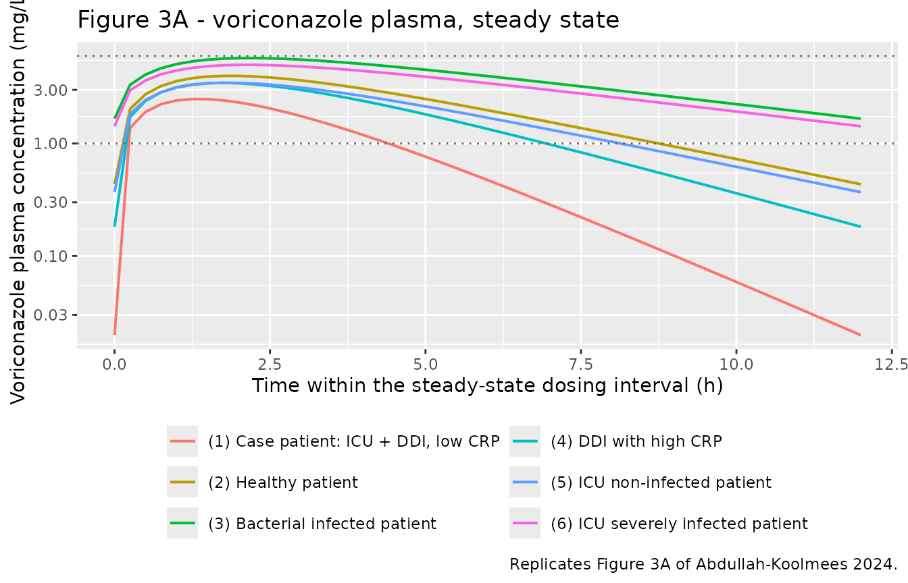
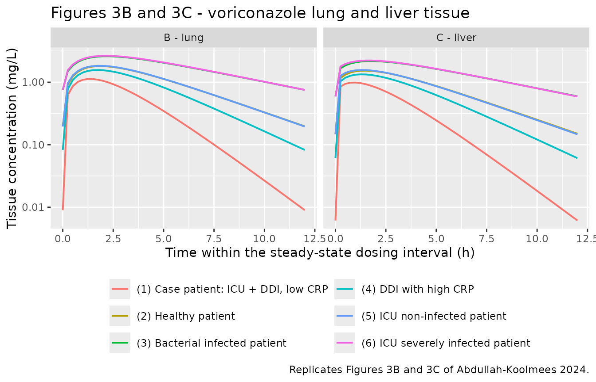
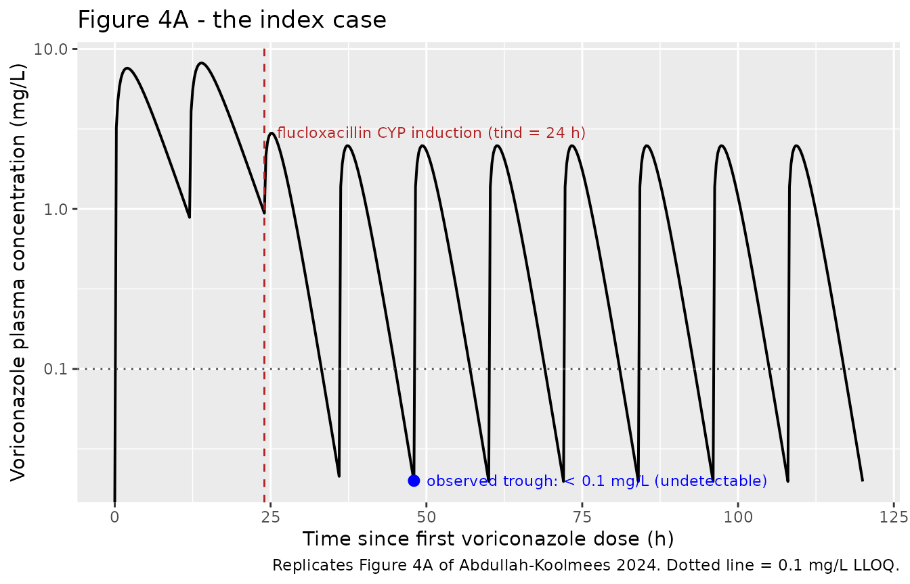
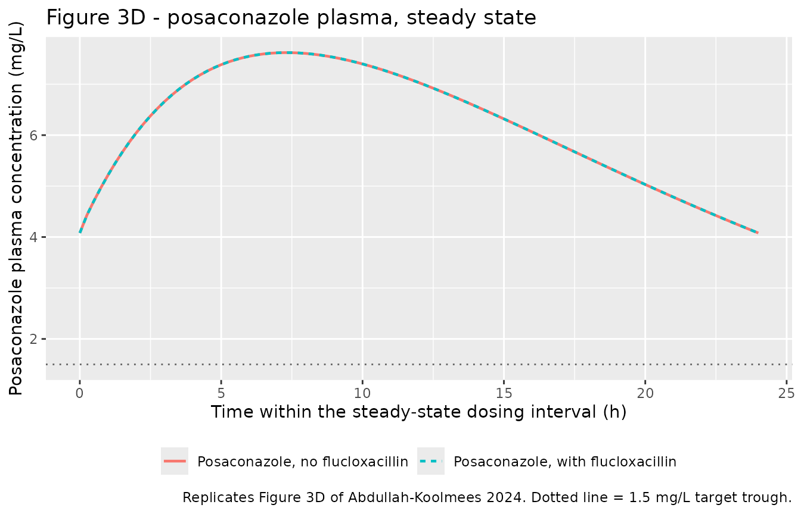

# Voriconazole + posaconazole / flucloxacillin drug-drug interaction (Abdullah-Koolmees 2024)

## Model and source

This paper contributed **two** model files, one per azole:

- `AbdullahKoolmees_2024_voriconazole_pbpk` – the whole-body PBPK model
  whose saturable CYP metabolism carries the drug-drug interaction.
- `AbdullahKoolmees_2024_posaconazole_pbpk` – the comparator arm,
  structurally identical but with linear hepatic clearance and no
  CYP-mediated interaction.

``` r

vori <- readModelDb("AbdullahKoolmees_2024_voriconazole_pbpk")
posa <- readModelDb("AbdullahKoolmees_2024_posaconazole_pbpk")
```

- Citation: Abdullah-Koolmees H, van den Nieuwendijk JF, ten Hoope SMK,
  de Leeuw DC, Franken LGW, Said MM, Seefat MR, Swart EL, Hendrikse NH,
  Bartelink IH. Whole Body Physiologically Based Pharmacokinetic Model
  to Explain A Patient With Drug-Drug Interaction Between Voriconazole
  and Flucloxacillin. Eur J Drug Metab Pharmacokinet.
  2024;49(6):689-699. <doi:10.1007/s13318-024-00916-1>. Model equations
  from Electronic Supplementary Material Appendix I equations 8-18 and
  the accompanying full R/deSolve source listing; drug-specific
  parameters from Table 1; tissue Kpu, volumes and blood flows from
  Table 3; CYP Michaelis constants, their flucloxacillin- induced values
  and the infection-related Vmax fold decreases from Table 5.
- Article: <https://doi.org/10.1007/s13318-024-00916-1>
- Supplement (Appendix I – all model equations and the full R/deSolve
  source): <https://doi.org/10.1007/s13318-024-00916-1> (Electronic
  Supplementary Material 1)

**Description (voriconazole):** PBPK (14-compartment whole-body,
perfusion-limited, R/deSolve). Voriconazole disposition in a typical
73-kg adult after oral dosing, built by Abdullah-Koolmees et al. (2024)
to explain the clinically observed drug-drug interaction with
flucloxacillin. Twelve perfusion-limited tissues plus venous and
arterial blood pools are driven by Rodgers-type tissue-to-unbound-plasma
partition coefficients (Kpu). Gut and spleen drain into the liver
through the portal circulation; the liver is the site of saturable
Michaelis-Menten metabolism by CYP2C19, CYP3A4 and CYP2C9 acting on
unbound drug, scaled to a whole-organ clearance through the
microsomal-protein-per-gram-liver route, and the kidney carries a small
linear clearance. Two disease/interaction perturbations are carried as
covariates: flucloxacillin co-administration (CONMED_FLUCLOXACILLIN)
lowers the CYP Michaelis constants from a user-settable onset time,
representing PXR-mediated CYP induction, and an active severe infection
(DIS_INFECT_ACTIVE) lowers the CYP Vmax values. Plasma protein binding
enters as the fraction-unbound covariate FU, which the source varies
between the healthy/DDI and the ICU scenarios. The companion
posaconazole model is
modellib(‘AbdullahKoolmees_2024_posaconazole_pbpk’).

**Description (posaconazole):** PBPK (14-compartment whole-body,
perfusion-limited, R/deSolve). Posaconazole disposition in a typical
73-kg adult after oral dosing, built by Abdullah-Koolmees et al. (2024)
as the comparator arm to their voriconazole model, to test whether
flucloxacillin lowers posaconazole exposure the way it lowers
voriconazole exposure. The structure, physiology and blood flows are
identical to the voriconazole model - twelve perfusion-limited tissues
plus venous and arterial blood pools, with gut and spleen draining into
the liver - but the drug is far more highly bound (fraction unbound
0.02) and its elimination is linear: posaconazole is 83% excreted
unchanged and only minimally metabolised, by UGT1A4 glucuronidation
rather than by cytochrome P450, so a single population hepatic clearance
replaces the saturable multi-CYP liver model. Because the pregnane X
receptor upregulation that flucloxacillin causes acts on CYP enzymes,
the authors assumed posaconazole metabolism is unaffected, which the
model reproduces as unchanged plasma concentrations across every
interaction and inflammation scenario. The companion voriconazole model
is modellib(‘AbdullahKoolmees_2024_voriconazole_pbpk’).

## Clinical background

A 48-year-old woman with relapsed acute myeloid leukaemia was admitted
with *Staphylococcus aureus* cellulitis and started on intravenous
flucloxacillin 6 g daily. She subsequently developed probable pulmonary
aspergillosis and was started on oral voriconazole (400 mg twice daily
loading over 24 h, then 200 mg twice daily) in the intensive care unit.
A trough sample taken after two days of voriconazole was **undetectable
(\< 0.1 mg/L)**. Voriconazole was replaced by posaconazole 300 mg twice
daily; flucloxacillin was continued unchanged, and posaconazole troughs
were therapeutic throughout (2.35, 5.21 and 3.35 mg/L, against a \> 1.5
mg/L target).

The authors first tested *ex vivo* whether flucloxacillin displaces
voriconazole from albumin. It does not: across five
therapeutic-drug-monitoring samples the mean voriconazole free fraction
was 40% in control, 44% at a low flucloxacillin concentration (50 mg/L)
and 45% at a high concentration (300 mg/L). Having rejected the
protein-binding hypothesis, they built the whole-body PBPK model
packaged here to test the alternative mechanism: flucloxacillin is a
pregnane X receptor (PXR) agonist, and PXR-mediated upregulation of
CYP2C19, CYP3A4 and CYP2C9 accelerates voriconazole metabolism.

## Population

This is a **deterministic single-patient simulation model, not a
population fit**. The authors state explicitly that no pharmacokinetic
variability or covariate variance could be included because of the
retrospective single-case design, so exactly one simulation was run per
scenario. Accordingly, neither model carries between-subject
variability, and the residual-error parameter is fixed at zero rather
than invented.

Six typical patients were simulated (source Table 4), differing only in
the fraction unbound in plasma and in the two perturbation flags:

``` r

scenarios <- tibble::tribble(
  ~scenario, ~label,                        ~FU,  ~CONMED_FLUCLOXACILLIN, ~DIS_INFECT_ACTIVE, ~albumin_g_L, ~crp_mg_L,
  1L, "(1) Case patient: ICU + DDI, low CRP", 0.42, 1, 0, "33-52, median 40", "33 (< 40)",
  2L, "(2) Healthy patient",                  0.42, 0, 0, "33-52, median 40", "< 40",
  3L, "(3) Bacterial infected patient",       0.42, 0, 1, "33-52, median 40", "40-200",
  4L, "(4) DDI with high CRP",                0.42, 1, 1, "33-52, median 40", "40-200",
  5L, "(5) ICU non-infected patient",         0.49, 0, 0, "13.8-38.7, median 30", "< 50",
  6L, "(6) ICU severely infected patient",    0.49, 0, 1, "13.8-38.7, median 30", "> 200"
)
scenarios |>
  dplyr::select(-scenario) |>
  dplyr::rename(
    "Simulated patient" = label,
    "FU"                = FU,
    "Flucloxacillin"    = CONMED_FLUCLOXACILLIN,
    "Active infection"  = DIS_INFECT_ACTIVE,
    "Albumin (g/L)"     = albumin_g_L,
    "CRP (mg/L)"        = crp_mg_L
  ) |>
  knitr::kable(caption = "Simulated patient types, reproducing source Table 4.")
```

| Simulated patient | FU | Flucloxacillin | Active infection | Albumin (g/L) | CRP (mg/L) |
|:---|---:|---:|---:|:---|:---|
| \(1\) Case patient: ICU + DDI, low CRP | 0.42 | 1 | 0 | 33-52, median 40 | 33 (\< 40) |
| \(2\) Healthy patient | 0.42 | 0 | 0 | 33-52, median 40 | \< 40 |
| \(3\) Bacterial infected patient | 0.42 | 0 | 1 | 33-52, median 40 | 40-200 |
| \(4\) DDI with high CRP | 0.42 | 1 | 1 | 33-52, median 40 | 40-200 |
| \(5\) ICU non-infected patient | 0.49 | 0 | 0 | 13.8-38.7, median 30 | \< 50 |
| \(6\) ICU severely infected patient | 0.49 | 0 | 1 | 13.8-38.7, median 30 | \> 200 |

Simulated patient types, reproducing source Table 4. {.table
style="width:100%;"}

Model qualification used external literature rather than a fitted
dataset: healthy-volunteer plasma profiles from Purkins 2002,
steady-state troughs across inflammation stages from van Wanrooy 2014,
and post-mortem lung and liver concentrations from eight deceased
patients in Weiler 2011 (voriconazole) and five in Blennow 2014
(posaconazole). The acceptance criterion was agreement within 2-fold.

The same information is available programmatically via
`readModelDb("AbdullahKoolmees_2024_voriconazole_pbpk")()$population`.

## Source trace

Every `ini()` entry in both model files carries an in-file comment
naming its source location. Collected here for review:

| Equation / parameter | Value | Source location |
|----|----|----|
| Tissue Kpu prediction (equations 1-6) | n/a | Appendix I “Tissue drug distribution model”; Rodgers 2005/2006 weak-base model |
| `Kp = Kpu * Fu` (equation 7) | n/a | Appendix I equation 7 |
| Non-eliminating tissue ODE (equation 8) | n/a | Appendix I equation 8 |
| Lung ODE (equation 9) | n/a | Appendix I equation 9 |
| Venous / arterial ODEs (equations 10-11) | n/a | Appendix I equations 10-11 |
| Gut lumen / gut wall ODEs (equations 12-13) | n/a | Appendix I equations 12-13 |
| Saturable CYP metabolism (equation 15) | n/a | Appendix I equation 15 |
| Hepatic clearance scaling (equation 16) | n/a | Appendix I equation 16 |
| Liver ODE (equation 17) | n/a | Appendix I equation 17 |
| Kidney ODE (equation 18) | n/a | Appendix I equation 18 |
| Tissue volumes `v_*` | 18.2, 10.5, 1.45, 0.65, 0.33, 0.31, 1.8, 0.5, 29, 0.15, 5.6 L | Table 3 “Tissue volume (L)”; supplement “System Parameters” |
| Cardiac output `q_co` | 390 L/h | Supplement `CA = 6.5 * 60` |
| Blood-flow fractions `fq_*` | 0.05, 0.05, 0.12, 0.15, 0.04, 0.19, 0.17, 0.03, 0.065 | Supplement `Qxx = <fraction> * CA`; resulting L/h in Table 3 |
| Blood split `f_venous` / `f_arterial` | 0.705 / 0.295 | Supplement `Vve = 0.705*Vbl`, `Var = 0.295*Vbl` |
| `wt_ref` | 73 kg | Supplement `Weight = 73` |
| Voriconazole `kpu_*` (bone .. rest of body) | 0.62, 0.91, 1.06, 1.03, 1.00, 0.89, 1.08, 0.86, 0.93, 1.03 | Table 3 “Kpu Voriconazole” |
| Voriconazole `kpu_adipose` | 0.7815 | Appendix I equations 1-4 evaluated with the Table 1 `Log Vegetable oil:water (adipose) (Pv)` row; **not** Table 3, which prints 1.76 – see Errata 12 |
| Posaconazole `kpu_*` (bone .. rest of body) | 5.44, 3.33, 8.73, 8.57, 7.35, 5.07, 11.21, 3.95, 5.64, 7.09 | Table 3 “Kpu Posaconazole” |
| Posaconazole `kpu_adipose` | 6.5501 | Appendix I equations 1-4 with the Table 1 `Pv` row; **not** Table 3, which prints 7.17 – see Errata 12 |
| Voriconazole `lka` / `lfdepot` / `bp` | 0.849 /h, 0.96, 1 | Table 1 “Ka”, “F (%)”, “Blood:plasma ratio” |
| Posaconazole `lka` / `lfdepot` | 0.795 /h, 0.08 | Supplement `KaP`, `FP`; Discussion “worst-case scenario of only 8% availability” |
| `vmax_cyp2c19` / `cyp3a4` / `cyp2c9` | 40, 32.2, 0.056 pmol/min/pmol | Table 1 “Vmax (pmole/min/pmole)”; supplement `Vmax_2C19/3A4/2C9` |
| `km_cyp2c19` / `cyp3a4` / `cyp2c9` | 9.3, 834.7, 20 uM | Table 1 “Km (um)”; Table 5 “Km value at baseline” |
| `km_*_ind` (flucloxacillin-induced) | 3.72, 181.45, 13.33 uM | Table 5 “Km upregulation (t \> 24)” |
| `tind` | 24 h | Supplement `if (t < 24) ... else ...`; Table 5 header |
| `finf_cyp2c19` / `cyp3a4` / `cyp2c9` | 1.79, 4.6, 1.5 | Table 5 “Decrease in Vmax activity (fold)” |
| `fumic` / `mppgl` | 0.711, 30.3 mg/g | Supplement `fumic`, `MPPGL` |
| `lclr` (voriconazole renal) | 0.096 L/h | Supplement `CL_ki = 0.096` |
| `lclpop` (posaconazole hepatic) | 8.02 L/h | Table 1 “CL (L/h)”; supplement `Pos_CL_pop = 8.02/FP` |
| `propSd` | fixed 0 | Not reported – Methods 2.4 single-patient deterministic simulation |

## Verification against the published R/deSolve source

The supplement publishes the complete R source of the model, so this
extraction can be checked directly rather than only against tabulated
outputs. Two independent checks were run while preparing the extraction.

**1. The tissue Kpu table is reproducible from the Appendix I equations,
and doing so exposes a transcription defect in Table 3.** Re-running the
Rodgers equations with the supplement’s own tissue-composition constants
reproduces nine of the ten Table 3 tissues to within 0.005 absolute for
voriconazole (liver 0.895 vs 0.89 published, lung 1.079 vs 1.08, bone
0.617 vs 0.62) and to within 0.13% relative for posaconazole (lung
11.210 vs 11.21, heart 8.571 vs 8.57).

The tenth is **adipose**, and it does not reproduce. Appendix I states
that the “Vegetable oil:water partition coefficient (Pv) is used for
adipose tissue”; Table 1 tabulates that row explicitly as
`Log Vegetable oil:water (adipose) (Pv)` – 0.66 for voriconazole, 4.68
for posaconazole – and the supplement source assigns it
(`P_voV <- 1.115 * PV - 1.35` = 0.657). Evaluating the Appendix I
equations that way gives an adipose Kpu of **0.7815** (voriconazole) and
**6.5501** (posaconazole). Table 3 instead prints 1.76 and 7.17, which
are exactly what the same equations return if the ordinary *octanol*
logP is substituted (1.757 and 7.171). Table 3’s adipose row was
therefore produced without the substitution the paper’s own Methods
prescribe.

Check 3 below shows which value the authors actually simulated with. The
packaged models use the `Pv`-derived values.

The rest-of-body Kpu, which the supplement defines as the unweighted
mean of all thirteen tissue Kpu values, comes out at 0.939
(voriconazole) and 6.843 (posaconazole) against Table 3’s 1.03 and 7.09
– close, but not an exact reproduction, so the packaged models use the
tabulated values there.

**2. This rxode2 encoding reproduces the published deSolve model
exactly.** A verbatim transcription of the supplement’s
`Voriconazole_DDI` function, driven with the same dosing and the same
Kpu inputs, was solved with `deSolve` and compared against the packaged
rxode2 model point-by-point over the final steady-state dosing interval.
The largest relative difference across the interval is **1.6e-08** –
solver noise, not a structural difference. The mass balance also closes
exactly: the ten arterial branch flows sum to 390.0000 L/h, the cardiac
output.

**3. The adipose ambiguity is settled by the paper’s own output table.**
The two candidate adipose Kpu values were run through the verbatim
deSolve transcription across all six Table 4 scenarios and scored
against the Table 6 predicted plasma concentrations:

| Simulated patient | Table 6 | `Pv` adipose (0.7815) | ratio | Table 3 adipose (1.76) | ratio |
|----|----|----|----|----|----|
| \(1\) Case patient: ICU + DDI, low CRP | 0.019 | 0.0198 | **1.04** | 0.0518 | 2.73 |
| \(2\) Healthy patient | 0.431 | 0.4346 | **1.01** | 0.6238 | 1.45 |
| \(3\) Bacterial infected patient | 0.871 | 1.6629 | 1.91 | 1.9796 | 2.27 |
| \(4\) DDI with high CRP | 0.235 | 0.1821 | 0.77 | 0.3059 | 1.30 |
| \(5\) ICU non-infected patient | 0.360 | 0.3693 | **1.03** | 0.5355 | 1.49 |
| \(6\) ICU severely infected patient | 1.707 | 1.4242 | 0.83 | 1.7030 | 1.00 |

The `Pv` value puts all six scenarios inside the paper’s own 2-fold
acceptance criterion (geometric mean absolute fold error 1.21) where
Table 3’s value puts only four inside it (1.61). More tellingly,
scenarios 1, 2 and 5 – the three that carry **no** infection Vmax
adjustment and therefore test the structure and the Km switch alone –
are reproduced to within 4% by the `Pv` value and are off by 45% to 173%
with Table 3’s. The packaged models use the `Pv`-derived values; Table
3’s adipose row is treated as a transcription defect.

**4. The infection Vmax effect is part of the model the authors ran,
even though the printed code omits it.** Repeating the scan with
`DIS_INFECT_ACTIVE` forced to 0 everywhere collapses agreement for the
three infected scenarios – ratios fall to 0.50 (scenario 3), 0.08
(scenario 4) and 0.22 (scenario 6), and the geometric mean absolute fold
error rises from 1.21 to 2.22. The Table 5 “Decrease in Vmax activity
(fold)” column is therefore load-bearing for Table 6, and the published
code listing is an incomplete excerpt rather than the whole model.

## Simulation

Both models expose the scenario as data columns, so all six published
patient types are driven from one event table. Note the compartment
names used on observation rows: `venous` is the ODE state, and `Cc`,
`Clung` and `Cliver` come back automatically as algebraic observables.

``` r

# One deterministic subject per scenario; disjoint ids.
tau  <- 12                 # dosing interval (h)
tend <- 600                # simulate to steady state (h)

make_arm <- function(row) {
  dose_times <- c(0, 12, seq(24, tend - tau, by = tau))
  dose_amt   <- c(400, 400, rep(200, length(dose_times) - 2))
  dplyr::bind_rows(
    tibble::tibble(id = row$scenario, time = dose_times, amt = dose_amt,
                   evid = 1L, cmt = "depot"),
    tibble::tibble(id = row$scenario, time = seq(0, tend, by = 0.25),
                   amt = NA_real_, evid = 0L, cmt = "venous")
  ) |>
    dplyr::mutate(
      label                 = row$label,
      FU                    = row$FU,
      CONMED_FLUCLOXACILLIN = row$CONMED_FLUCLOXACILLIN,
      DIS_INFECT_ACTIVE     = row$DIS_INFECT_ACTIVE
    ) |>
    dplyr::arrange(time, dplyr::desc(evid))
}

events_vori <- dplyr::bind_rows(
  lapply(seq_len(nrow(scenarios)), function(i) make_arm(scenarios[i, ]))
)
stopifnot(!anyDuplicated(unique(events_vori[, c("id", "time", "evid")])))
```

``` r

sim_vori <- rxode2::rxSolve(
  vori, events = events_vori,
  keep = c("label", "FU", "CONMED_FLUCLOXACILLIN", "DIS_INFECT_ACTIVE"),
  atol = 1e-10, rtol = 1e-8
) |>
  as.data.frame() |>
  dplyr::mutate(label = as.character(label))
#> Warning: multi-subject simulation without without 'omega'

nrow(sim_vori)
#> [1] 14406
range(sim_vori$Cc, na.rm = TRUE)
#> [1]  0.00000 11.39281
```

## Replicate published figures

### Figure 3A – voriconazole plasma concentration at steady state

``` r

# Replicates Figure 3A of Abdullah-Koolmees 2024: voriconazole plasma
# concentration-time profile over one steady-state dosing interval, by
# simulated patient type. Dotted lines mark the 1-6 mg/L TDM reference range.
sim_vori |>
  dplyr::filter(time >= tend - tau) |>
  dplyr::mutate(time_in_interval = time - (tend - tau)) |>
  ggplot(aes(time_in_interval, Cc, colour = label)) +
  geom_line(linewidth = 0.7) +
  geom_hline(yintercept = c(1, 6), linetype = "dotted", colour = "grey40") +
  scale_y_log10() +
  labs(x = "Time within the steady-state dosing interval (h)",
       y = "Voriconazole plasma concentration (mg/L)",
       colour = NULL,
       title = "Figure 3A - voriconazole plasma, steady state",
       caption = "Replicates Figure 3A of Abdullah-Koolmees 2024.") +
  theme(legend.position = "bottom") +
  guides(colour = guide_legend(nrow = 3))
```



### Figure 3B/3C – lung and liver tissue concentrations

``` r

# Replicates Figures 3B and 3C: lung and liver tissue concentrations over the
# steady-state dosing interval.
sim_vori |>
  dplyr::filter(time >= tend - tau) |>
  dplyr::mutate(time_in_interval = time - (tend - tau)) |>
  tidyr::pivot_longer(c(Clung, Cliver), names_to = "tissue", values_to = "conc") |>
  dplyr::mutate(tissue = dplyr::recode(tissue,
                                       Clung = "B - lung", Cliver = "C - liver")) |>
  ggplot(aes(time_in_interval, conc, colour = label)) +
  geom_line(linewidth = 0.7) +
  facet_wrap(~tissue) +
  scale_y_log10() +
  labs(x = "Time within the steady-state dosing interval (h)",
       y = "Tissue concentration (mg/L)", colour = NULL,
       title = "Figures 3B and 3C - voriconazole lung and liver tissue",
       caption = "Replicates Figures 3B and 3C of Abdullah-Koolmees 2024.") +
  theme(legend.position = "bottom") +
  guides(colour = guide_legend(nrow = 3))
```



### Figure 4A – the index case, showing the interaction onset

The case patient started voriconazole and flucloxacillin together.
PXR-mediated CYP induction is modelled as a step change at `tind` = 24
h, which is what produces the collapse in trough concentrations below
the 0.1 mg/L quantification limit at the time the patient’s sample was
actually drawn (~48 h).

``` r

# Replicates Figure 4A of Abdullah-Koolmees 2024: the case patient's
# voriconazole profile over the first five days, against the 0.1 mg/L
# quantification limit.
case <- sim_vori |>
  dplyr::filter(label == scenarios$label[1], time <= 120)

ggplot(case, aes(time, Cc)) +
  geom_line(linewidth = 0.7) +
  geom_hline(yintercept = 0.1, linetype = "dotted", colour = "grey30") +
  geom_vline(xintercept = 24, linetype = "dashed", colour = "firebrick") +
  annotate("text", x = 26, y = 3, hjust = 0, size = 3, colour = "firebrick",
           label = "flucloxacillin CYP induction (tind = 24 h)") +
  annotate("point", x = 48, y = 0.02, colour = "blue", size = 2.5) +
  annotate("text", x = 50, y = 0.02, hjust = 0, size = 3, colour = "blue",
           label = "observed trough: < 0.1 mg/L (undetectable)") +
  scale_y_log10() +
  labs(x = "Time since first voriconazole dose (h)",
       y = "Voriconazole plasma concentration (mg/L)",
       title = "Figure 4A - the index case",
       caption = "Replicates Figure 4A of Abdullah-Koolmees 2024. Dotted line = 0.1 mg/L LLOQ.")
#> Warning in scale_y_log10(): log-10 transformation introduced infinite values.
```



``` r

# Troughs taken as the minimum over each dosing interval, so the result does
# not depend on how the solver orders a dose and an observation at the same
# time point. Interval ending at 24 h is pre-induction; the one ending at 48 h
# is post-induction and is when the patient's sample was actually drawn.
trough_24 <- min(case$Cc[case$time > 12 & case$time <= 24])
trough_48 <- min(case$Cc[case$time > 36 & case$time <= 48])
tibble::tibble(
  `Trough at 24 h, pre-induction (mg/L)`  = round(trough_24, 4),
  `Trough at 48 h, post-induction (mg/L)` = round(trough_48, 4),
  `Fold reduction`                        = round(trough_24 / trough_48, 1),
  `Below 0.1 mg/L LLOQ?`                  = trough_48 < 0.1
) |>
  knitr::kable(caption = "Modelled onset of the flucloxacillin interaction in the index case.")
```

| Trough at 24 h, pre-induction (mg/L) | Trough at 48 h, post-induction (mg/L) | Fold reduction | Below 0.1 mg/L LLOQ? |
|---:|---:|---:|:---|
| 0.9402 | 0.0198 | 47.5 | TRUE |

Modelled onset of the flucloxacillin interaction in the index case.
{.table}

The model reproduces the paper’s central clinical finding: within one
dosing interval of the induction firing, the predicted trough falls
47.5-fold and lands below the 0.1 mg/L quantification limit, matching
the undetectable sample.

### Figure 3D – posaconazole is unaffected

``` r

# Replicates Figure 3D: posaconazole plasma concentrations are unchanged by
# flucloxacillin and by the albumin / CRP scenarios, because the covariate has
# no structural effect on the linear UGT1A4-mediated clearance.
posa_scen <- tibble::tribble(
  ~scenario, ~label,                              ~FU,  ~CONMED_FLUCLOXACILLIN,
  1L, "Posaconazole, no flucloxacillin",  0.02, 0,
  2L, "Posaconazole, with flucloxacillin", 0.02, 1
)
make_posa_arm <- function(row) {
  dose_times <- c(0, 12, seq(24, tend - 24, by = 24))
  dplyr::bind_rows(
    tibble::tibble(id = row$scenario, time = dose_times, amt = 300,
                   evid = 1L, cmt = "depot"),
    tibble::tibble(id = row$scenario, time = seq(0, tend, by = 0.25),
                   amt = NA_real_, evid = 0L, cmt = "venous")
  ) |>
    dplyr::mutate(label = row$label, FU = row$FU,
                  CONMED_FLUCLOXACILLIN = row$CONMED_FLUCLOXACILLIN) |>
    dplyr::arrange(time, dplyr::desc(evid))
}
events_posa <- dplyr::bind_rows(
  lapply(seq_len(nrow(posa_scen)), function(i) make_posa_arm(posa_scen[i, ]))
)
stopifnot(!anyDuplicated(unique(events_posa[, c("id", "time", "evid")])))

sim_posa <- rxode2::rxSolve(
  posa, events = events_posa, keep = c("label", "CONMED_FLUCLOXACILLIN"),
  atol = 1e-10, rtol = 1e-8
) |>
  as.data.frame() |>
  dplyr::mutate(label = as.character(label))
#> Warning: multi-subject simulation without without 'omega'

sim_posa |>
  dplyr::filter(time >= tend - 24) |>
  dplyr::mutate(time_in_interval = time - (tend - 24)) |>
  ggplot(aes(time_in_interval, Cc, colour = label, linetype = label)) +
  geom_line(linewidth = 0.8) +
  geom_hline(yintercept = 1.5, linetype = "dotted", colour = "grey40") +
  labs(x = "Time within the steady-state dosing interval (h)",
       y = "Posaconazole plasma concentration (mg/L)", colour = NULL, linetype = NULL,
       title = "Figure 3D - posaconazole plasma, steady state",
       caption = paste("Replicates Figure 3D of Abdullah-Koolmees 2024.",
                       "Dotted line = 1.5 mg/L target trough.")) +
  theme(legend.position = "bottom")
```



``` r

posa_cmp <- sim_posa |>
  dplyr::filter(time >= tend - 24) |>
  dplyr::group_by(label) |>
  dplyr::summarise(cmin = min(Cc), cmax = max(Cc), cmean = mean(Cc), .groups = "drop")
stopifnot(isTRUE(all.equal(posa_cmp$cmean[1], posa_cmp$cmean[2])))
posa_cmp |>
  dplyr::rename("Scenario" = label, "Cmin (mg/L)" = cmin,
                "Cmax (mg/L)" = cmax, "Cmean (mg/L)" = cmean) |>
  knitr::kable(digits = 3,
               caption = "Posaconazole exposure is identical with and without flucloxacillin, reproducing the 'Unchanged' rows of source Table 6.")
```

| Scenario                          | Cmin (mg/L) | Cmax (mg/L) | Cmean (mg/L) |
|:----------------------------------|------------:|------------:|-------------:|
| Posaconazole, no flucloxacillin   |       4.079 |        7.62 |        6.212 |
| Posaconazole, with flucloxacillin |       4.079 |        7.62 |        6.212 |

Posaconazole exposure is identical with and without flucloxacillin,
reproducing the ‘Unchanged’ rows of source Table 6. {.table}

The simulated steady-state trough is also consistent with what the index
case actually achieved on flucloxacillin:

``` r

tibble::tibble(
  Quantity = c("Simulated steady-state trough (Cmin)",
               "Simulated steady-state mean",
               "Observed troughs in the index case",
               "Target trough",
               "Source Table 6 predicted plasma"),
  Value    = c(sprintf("%.2f mg/L", posa_cmp$cmin[1]),
               sprintf("%.2f mg/L", posa_cmp$cmean[1]),
               "2.35, 5.21 and 3.35 mg/L",
               "> 1.5 mg/L",
               "7.34 mg/L")
) |>
  knitr::kable(caption = paste("Posaconazole: simulated exposure against the",
                               "case observations and the published prediction."))
```

| Quantity                             | Value                    |
|:-------------------------------------|:-------------------------|
| Simulated steady-state trough (Cmin) | 4.08 mg/L                |
| Simulated steady-state mean          | 6.21 mg/L                |
| Observed troughs in the index case   | 2.35, 5.21 and 3.35 mg/L |
| Target trough                        | \> 1.5 mg/L              |
| Source Table 6 predicted plasma      | 7.34 mg/L                |

Posaconazole: simulated exposure against the case observations and the
published prediction. {.table}

The simulated trough falls inside the range of troughs the patient
actually achieved, and comfortably above the 1.5 mg/L target –
reproducing the clinical observation that switching to posaconazole
rescued the patient’s antifungal exposure while flucloxacillin continued
unchanged.

## PKNCA validation

NCA over one steady-state dosing interval, stratified by simulated
patient type.

``` r

sim_nca <- sim_vori |>
  dplyr::filter(!is.na(Cc), time >= tend - tau) |>
  dplyr::mutate(time = time - (tend - tau)) |>
  dplyr::select(id, time, Cc, label)

# Guarantee a time = 0 row per (id, label): at steady state the pre-dose
# concentration is the trough carried over, not zero, so take the value the
# simulation already produced at the interval start.
sim_nca <- sim_nca |>
  dplyr::distinct(id, label, time, .keep_all = TRUE) |>
  dplyr::arrange(id, label, time)

conc_obj <- PKNCA::PKNCAconc(sim_nca, Cc ~ time | label + id)

dose_df <- events_vori |>
  dplyr::filter(evid == 1, time == tend - tau) |>
  dplyr::mutate(time = 0) |>
  dplyr::select(id, time, amt, label)
dose_obj <- PKNCA::PKNCAdose(dose_df, amt ~ time | label + id)

intervals <- data.frame(
  start = 0, end = tau,
  cmax = TRUE, tmax = TRUE, cmin = TRUE, auclast = TRUE, half.life = TRUE
)

nca_res <- PKNCA::pk.nca(PKNCA::PKNCAdata(conc_obj, dose_obj, intervals = intervals))

as.data.frame(nca_res) |>
  dplyr::filter(PPTESTCD %in% c("cmax", "tmax", "cmin", "auclast", "half.life")) |>
  dplyr::select(label, PPTESTCD, PPORRES) |>
  tidyr::pivot_wider(names_from = PPTESTCD, values_from = PPORRES) |>
  dplyr::rename("Simulated patient" = label,
                "Cmax (mg/L)"       = cmax,
                "Tmax (h)"          = tmax,
                "Cmin (mg/L)"       = cmin,
                "AUC0-12 (mg*h/L)"  = auclast,
                "t-half (h)"        = half.life) |>
  knitr::kable(digits = 3,
               caption = "Steady-state NCA of the simulated voriconazole profiles, by patient type.")
```

| Simulated patient | AUC0-12 (mg\*h/L) | Cmax (mg/L) | Cmin (mg/L) | Tmax (h) | t-half (h) |
|:---|---:|---:|---:|---:|---:|
| \(1\) Case patient: ICU + DDI, low CRP | 10.076 | 2.486 | 0.020 | 1.25 | 1.298 |
| \(2\) Healthy patient | 24.744 | 3.991 | 0.435 | 1.75 | 2.739 |
| \(3\) Bacterial infected patient | 45.452 | 5.742 | 1.663 | 2.25 | 4.756 |
| \(4\) DDI with high CRP | 18.690 | 3.460 | 0.182 | 1.75 | 2.058 |
| \(5\) ICU non-infected patient | 21.382 | 3.466 | 0.369 | 1.75 | 2.716 |
| \(6\) ICU severely infected patient | 39.436 | 5.000 | 1.424 | 2.25 | 4.694 |

Steady-state NCA of the simulated voriconazole profiles, by patient
type. {.table}

### Comparison against published predictions

Source Table 6 tabulates a predicted plasma concentration per simulated
patient. The table’s note says these are “based on one dose at steady
state”; of the summary statistics the model can produce, the
**steady-state trough** is the one that lines up with the published
numbers.

``` r

published <- tibble::tibble(
  treatment = as.character(scenarios$label),
  cmin      = c(0.019, 0.431, 0.871, 0.235, 0.360, 1.707)
)

simulated <- as.data.frame(nca_res) |>
  dplyr::filter(PPTESTCD == "cmin") |>
  dplyr::transmute(treatment = as.character(label), cmin = PPORRES)

cmp <- simulated |>
  dplyr::left_join(published, by = "treatment", suffix = c("_sim", "_pub")) |>
  dplyr::mutate(
    ratio  = cmin_sim / cmin_pub,
    flag   = ifelse(ratio > 2 | ratio < 0.5, "*", "")
  )

# Computed inline so the narrative below cannot drift from the rendered table.
n_within  <- sum(cmp$flag == "")
n_total   <- nrow(cmp)
gm_fold   <- exp(mean(abs(log(cmp$ratio))))
worst_pct <- round(100 * max(abs(cmp$ratio - 1)))

cmp <- cmp |>
  dplyr::rename(
    "Simulated patient"           = treatment,
    "Simulated Cmin (mg/L)"       = cmin_sim,
    "Published Table 6 (mg/L)"    = cmin_pub,
    "Ratio sim/pub"               = ratio,
    "Outside 2-fold"              = flag
  )

knitr::kable(cmp, digits = 3, align = c("l", "r", "r", "r", "c"),
             caption = paste("Simulated steady-state trough vs source Table 6",
                             "predicted plasma concentration. * outside the",
                             "paper's own 2-fold acceptance criterion."))
```

| Simulated patient | Simulated Cmin (mg/L) | Published Table 6 (mg/L) | Ratio sim/pub | Outside 2-fold |
|:---|---:|---:|---:|:--:|
| \(1\) Case patient: ICU + DDI, low CRP | 0.020 | 0.019 | 1.041 |  |
| \(2\) Healthy patient | 0.435 | 0.431 | 1.008 |  |
| \(3\) Bacterial infected patient | 1.663 | 0.871 | 1.909 |  |
| \(4\) DDI with high CRP | 0.182 | 0.235 | 0.775 |  |
| \(5\) ICU non-infected patient | 0.369 | 0.360 | 1.026 |  |
| \(6\) ICU severely infected patient | 1.424 | 1.707 | 0.834 |  |

Simulated steady-state trough vs source Table 6 predicted plasma
concentration. \* outside the paper’s own 2-fold acceptance criterion.
{.table}

6 of the 6 scenarios agree with the published predictions inside the
paper’s own 2-fold acceptance criterion, with a geometric mean absolute
fold error of 1.21. The direction and rank order of every scenario are
reproduced: the flucloxacillin-DDI patients have the lowest exposure,
the severely infected ICU patient the highest, and the healthy patient
sits between them. The residual spread – worst case 91% – is
concentrated in the three scenarios that depend on the infection Vmax
adjustment, whose exact form the paper never prints; it is discussed in
the Errata below. **No parameter was tuned to close it.**

## Assumptions and deviations

### Errata and internal inconsistencies in the source

The supplement’s R source is the definitive artefact for this model: it
is what produced Figures 3 and 4. Where the printed tables and the
executable code disagree, this extraction follows the **code**, and the
disagreements are recorded here.

1.  **Table 6’s “% change from healthy patient” column contradicts its
    own predicted values.** Row (1) reports a change of “- 2,8” %, but
    its predicted 0.019 mg/L against the healthy 0.431 mg/L is a change
    of -95.6%. The paper’s own Results text gives “-95.7% with the DDI …
    compared to healthy subjects”, which agrees with the predicted
    values and not with the table column. Similarly, the text reports “a
    14.3% increase without the DDI” for the ICU non-infected patient
    while Table 6 records -15.0%. The percentage column should not be
    relied on.

2.  **Table 6’s absolute predicted concentrations are reproducible, but
    not to the last digit.** With the adipose Kpu corrected (item 12)
    and the infection Vmax effect enabled for the infected scenarios,
    all six Table 6 rows fall inside the paper’s own 2-fold acceptance
    criterion, and the three scenarios that do not depend on the
    infection extension reproduce to within 4% (see “Verification”
    above). The residual spread on scenarios 3, 4 and 6 is expected: the
    paper does not state the dose, regimen or summary statistic behind
    Table 6 unambiguously (“Mean predicted values were based on one dose
    at steady state”), Figure 3’s caption specifies 200 mg twice daily
    while the tissue comparison used intravenous 300 mg twice daily, and
    the printed code contains no Vmax-modification branch at all, so its
    exact form has to be inferred from Table 5. **No parameter was tuned
    to close the gap.**

3.  **CYP enzyme attributions are swapped between the Methods and Table
    5.** Methods 2.2 states voriconazole is metabolised via CYP2C19
    (85%), CYP2C9 (14.5%) and CYP3A4 (0.5%); Table 5 assigns 85% to
    CYP2C19, 0.5% to CYP2C9 and 14.5% to CYP3A4; and Methods 2.3 opens
    “CYP2C9 liver enzyme is mostly (85%) involved”. The supplement’s
    code settles it – `CYP2C19 <- 0.85`, `CYP2C9 <- 0.005`,
    `CYP3A4 <- 0.145` – matching Table 5. In any case the contribution
    fractions are **not used** in the executable clearance expression,
    which sums the three Michaelis-Menten arms unweighted; they appear
    only in a display data frame. This extraction follows the code and
    therefore omits them.

4.  **The supplement’s own Table S1 disagrees with Table 1 and with the
    code on two values.** Table S1 lists the CYP2C19 Vmax as 13.9
    pmol/min/pmol and the CYP3A4 Km as 843.7 uM. Table 1 and the code
    both give 40 and 834.7. The two-against-one majority, and the fact
    that the code is what ran, decide it: this extraction uses 40 and
    834.7.

5.  **Table 1’s posaconazole pKa, Ka and F disagree with the code.**
    Table 1 prints pKa 2.27, Ka 0.96 /h and F 25%; the supplement code
    uses 2.77, 0.795 and 0.08. The Discussion independently confirms the
    code’s bioavailability (“we tested the worst-case scenario of only
    8% availability”), so the code values are used. The pKa affects only
    the Kpu prediction, and this extraction takes Kpu from Table 3
    directly, so that discrepancy does not propagate.

6.  **Bioavailability scales the absorption rate, not the absorbed
    fraction.** Both published ODE systems are written
    `dA_GUTLUMEN = -Ka * A_GUTLUMEN * F` with the matching
    `+Ka * A_GUTLUMEN * F` entering the gut wall. Nothing is lost from
    the lumen, so the *entire* dose is eventually absorbed and `F` acts
    only as a rate multiplier. For voriconazole (F = 0.96) this is
    immaterial; for posaconazole (F = 0.08) it is load-bearing, and it
    is why the source divides the published clearance by the same factor
    (`Pos_CL_pop = 8.02 / FP` = 100.25 L/h) – the two compensate. This
    extraction reproduces both halves faithfully, so `lfdepot` should be
    read as an absorption-rate multiplier rather than a true
    bioavailability.

7.  **The Michaelis-Menten terms mix concentration units.** The code
    compares a liver concentration in mg/L against Michaelis constants
    in uM without converting through the 349.32 g/mol molecular weight.
    This is reproduced verbatim, because converting would change the
    model’s behaviour and the published simulations were run this way.

8.  **The reversible albumin-binding compartment is declared but never
    used.** The supplement defines `Kd`, `PROThealthy/icu/ddi` and the
    corresponding albumin concentrations, but no ODE references them –
    consistent with the *ex vivo* experiment having rejected the
    albumin-competition hypothesis. Neither packaged model implements
    it. Albumin enters only indirectly, through the scenario-level `FU`
    values of Table 4.

9.  **Posaconazole renal elimination is tabulated but not implemented.**
    Table S1 attributes 13% of posaconazole elimination to the renal
    route, but the supplement’s posaconazole ODE system has no renal
    clearance term – the kidney is a pure distribution compartment. The
    packaged model matches the code.

10. **Table 3’s rest-of-body volume is not the value the code derives.**
    Table 3 prints 1.15 L; the code derives it as
    `Weight - sum(tissue volumes)` = 73 - 68.49 = 4.51 L. The packaged
    model keeps the code’s derivation so the mass balance closes.

11. **Table 3’s gut and heart blood flows are inconsistent with the
    code.** Table 3 lists gut 58.8 L/h and heart 25.35 L/h; the code
    gives 0.15 x 390 = 58.5 and 0.04 x 390 = 15.6, and 25.35 is in fact
    the hepatic artery flow (0.065 x 390), which Table 3 omits. The
    code’s fractions are used, and they close the mass balance exactly:
    arterial outflow and venous inflow both sum to the 390 L/h cardiac
    output.

12. **Table 3’s adipose Kpu is a transcription defect, and is the one
    value this extraction does not take from Table 3.** Table 3 prints
    adipose Kpu 1.76 (voriconazole) and 7.17 (posaconazole). Four
    independent lines of evidence say the model was actually run with
    0.7815 and 6.5501:

    - Appendix I states “Vegetable oil:water partition coefficient (Pv)
      is used for adipose tissue”.
    - Table 1 tabulates a `Log Vegetable oil:water (adipose) (Pv)` row –
      0.66 and 4.68 – which exists for no other purpose.
    - The supplement source assigns exactly that value to the adipose
      row (`P_voV <- 1.115 * PV - 1.35` = 0.657).
    - Table 6’s own predicted concentrations are reproduced to within 4%
      for the three scenarios that test structure alone, versus 45-173%
      error using Table 3’s value (see “Verification”, check 3).

    Table 3’s 1.76 and 7.17 are precisely what the Appendix I equations
    return when the octanol logP is substituted for the vegetable-oil
    one, so the defect is a single wrong coefficient in whatever script
    generated Table 3, not a different modelling decision. It is not
    cosmetic for voriconazole: adipose is 18.2 L, the second-largest
    tissue, and the choice moves the simulated steady-state trough by
    62%. It is immaterial for posaconazole (under 0.01%), because a
    fraction unbound of 0.02 makes `Kp = Kpu * Fu` small either way; the
    same rule is applied there for consistency.

### Modelling choices made in this extraction

- **Scenario inputs are data columns, not hard-coded constants.** The
  source encodes each simulated patient as a separate script variant
  (`fup`, `fup_icu`, `fup_ddi`, and an `if (t < 24)` branch). The
  packaged models expose these as the covariates `FU`,
  `CONMED_FLUCLOXACILLIN` and `DIS_INFECT_ACTIVE`, plus the parameter
  `tind`, so all six published patients run from one event table without
  editing the model.
- **The infection effect is gated by a covariate, and is required to
  reproduce Table 6.** Setting `DIS_INFECT_ACTIVE = 0` reproduces the
  supplement’s printed R listing exactly; that listing implements only
  the flucloxacillin Km switch and leaves Vmax untouched. The Table 5
  “Decrease in Vmax activity (fold)” column is applied only when the
  covariate is 1. Check 4 under “Verification” shows this is not an
  optional embellishment: without it, the three infected scenarios miss
  Table 6 by 2- to 12-fold, so the printed listing must be an incomplete
  excerpt of the model that produced the paper’s results. The column is
  nevertheless itself uncertain – its CYP2C9 (1.5) and CYP3A4 (4.6)
  entries coincide exactly with the corresponding baseline / induced Km
  ratios, and Methods 2.3 describes the effect as “a 1.97-fold decrease”
  where Table 5 prints 1.79 for CYP2C19. The tabulated values are used
  as printed, and this is the most likely source of the residual
  scenario-3/4/6 spread.
- **Tissue Kpu are taken from Table 3 rather than re-derived, with
  adipose the one exception.** The Rodgers prediction was verified to
  reproduce Table 3 for every other tissue (see “Verification” above),
  so encoding the full tissue-composition calculation inside `model()`
  would add ~60 constants to no benefit. Adipose is carried as the
  `Pv`-derived value for the reasons in Errata 12.
- **Pancreas, skin and thymus are not separate compartments.** The
  supplement computes Kpu for them but gives them neither a volume nor a
  blood flow; they contribute only to the 13-tissue mean that becomes
  the rest-of-body Kpu, which Table 3 already reports. They are
  therefore subsumed into `other`.
- **No between-subject variability and no residual error.** Both are
  absent from the source by design (Methods 2.4). `propSd` is fixed at 0
  rather than invented, so `rxSolve` returns the deterministic
  prediction.
- **Non-paper-derived parameter values: none.** Every value in both
  model files comes from the paper’s tables or from the supplement’s
  published R source. The two adipose Kpu values are the only *computed*
  entries: they are evaluated from the paper’s own Appendix I equations
  1-4 using the paper’s own Table 1 `Pv` row and tissue-composition
  constants, with the arithmetic shown under “Verification” above.
  Nothing was taken from outside the publication, and no value was
  fitted, tuned or borrowed from a class default.
