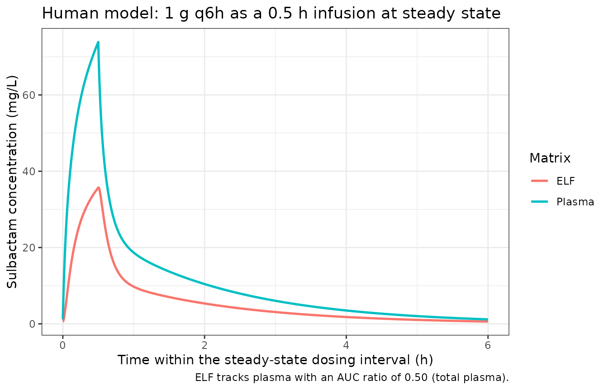
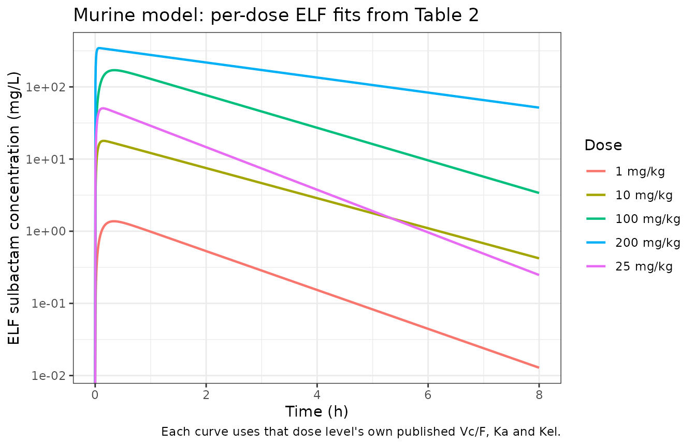
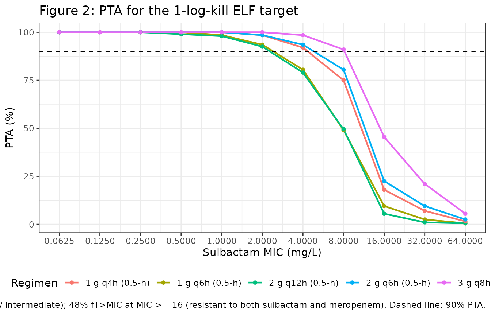

# Sulbactam epithelial lining fluid PK/PD in A. baumannii pneumonia (Abouelhassan 2024)

## Model and source

This paper contributes two independent PK models, extracted as two model
files that share this vignette.

``` r

mouse_ui <- rxode2::rxode(readModelDb("Abouelhassan_2024_sulbactam_mouse"))
human_ui <- rxode2::rxode(readModelDb("Abouelhassan_2024_sulbactam_human"))
```

- Article: <https://doi.org/10.1093/jacamr/dlae203>
- Source data for the human model: Rodvold 2018,
  <https://doi.org/10.1128/AAC.01089-18>

**`Abouelhassan_2024_sulbactam_mouse`** – Preclinical (mouse).
One-compartment epithelial lining fluid (ELF) pharmacokinetic model for
sulbactam in the neutropenic murine Acinetobacter baumannii pneumonia
model, with first-order absorption from a subcutaneous depot and
first-order elimination (Abouelhassan 2024). Sulbactam was given
subcutaneously as commercial ampicillin-sulbactam at 1, 10, 25, 100 and
200 mg/kg; ELF concentrations were derived from bronchoalveolar lavage
using the plasma-to-BAL urea ratio, and each dose level was fitted
separately by nonlinear least squares in Phoenix WinNonlin. The ini()
values are the arithmetic means of the four dose-proportional fits
spanning 1-100 mg/kg (Table 2), which is the parameter set the authors
used to simulate sulbactam ELF exposures for every dose-ranging arm at
or below 100 mg/kg. ELF exposure is dose-proportional across that range
(R^2 = 0.997); the 200 mg/kg fit deviates from proportionality and is
recorded in the ini() source-trace comments rather than carried as a
second model. Sulbactam penetrated the ELF with a mean
ELF-to-free-plasma AUC(0-8) ratio of 0.66 (SD 0.05), and the model
reproduces the reported ELF AUC(0-8) at every dose level. No
between-subject variability or residual error was reported because each
dose level was fitted as a single naive-pooled destructive-sampling
profile, so both are encoded as fixed(0).

**`Abouelhassan_2024_sulbactam_human`** – Three-compartment
plasma-plus-epithelial-lining-fluid (ELF) population PK model for
intravenous sulbactam in healthy adults, co-modelled from the mean
plasma and ELF concentrations of 30 healthy volunteers given sulbactam 1
g IV q6h as a 3 h infusion (Abouelhassan 2024, using the Rodvold 2018
intrapulmonary data). A two-compartment plasma model was built first and
selected over one compartment on AIC (44.1 versus 54.6), then the ELF
concentrations were added as a third compartment with its own volume and
its own asymmetric first-order exchange with plasma, which is what
generates the sub-unity ELF penetration. The model was fitted by
nonparametric adaptive grid (NPAG) with adaptive gamma in Pmetrics. Only
mean concentrations were available, so no random effects were estimated
and no covariates were assessed; for the 5000-subject Monte Carlo
simulation underlying the paper’s probability-of-target-attainment
analysis the authors artificially inflated the dispersion of every
parameter to 40% CV to mimic patient variability, and that assumption is
carried here as fixed 40% CV lognormal between-subject variability on
all seven parameters. Residual error was not reported and is fixed at
zero.

Full citations:

- Abouelhassan Y, Kuti JL, Nicolau DP, Abdelraouf K.
  Pharmacokinetic/pharmacodynamic analysis of sulbactam against
  Acinetobacter baumannii pneumonia: establishing in vivo efficacy
  targets in the epithelial lining fluid. JAC Antimicrob Resist.
  2024;6(6):dlae203. <doi:10.1093/jacamr/dlae203>. Murine ELF PK
  parameters from Table 2; study design from Methods (‘Sulbactam
  bronchopulmonary PK studies’).
- Abouelhassan Y, Kuti JL, Nicolau DP, Abdelraouf K.
  Pharmacokinetic/pharmacodynamic analysis of sulbactam against
  Acinetobacter baumannii pneumonia: establishing in vivo efficacy
  targets in the epithelial lining fluid. JAC Antimicrob Resist.
  2024;6(6):dlae203. <doi:10.1093/jacamr/dlae203>. Final parameter
  estimates from the Results section ‘Population pharmacokinetics
  modelling in healthy volunteers’; Monte Carlo simulation settings from
  Methods ‘Monte Carlo simulation and PTA estimation’. The plasma and
  ELF concentrations that were modelled are from Rodvold KA, Gotfried
  MH, Isaacs RD et al. Plasma and intrapulmonary concentrations of
  ETX2514 and sulbactam following intravenous administration of
  ETX2514SUL to healthy adult subjects. Antimicrob Agents Chemother.
  2018;62(10):e01089-18. <doi:10.1128/AAC.01089-18>.

## Population

**Murine model.** Specific-pathogen-free female ICR (CD-1) mice weighing
20-22 g were rendered neutropenic with cyclophosphamide and uranyl
nitrate, then inoculated intranasally with a 10^7 cfu/mL *Acinetobacter
baumannii* suspension in 3% mucin two hours before the first dose
(Methods, “Murine neutropenic pneumonia model”). Groups of 36 mice each
received a single subcutaneous dose of ampicillin-sulbactam delivering
sulbactam 1, 10, 25, 100 or 200 mg/kg; groups of six were euthanised at
each of 4-6 time points for destructive blood and bronchoalveolar lavage
(BAL) sampling. ELF concentrations were computed as BAL sulbactam
concentration times the plasma-to-BAL urea ratio.

**Human model.** Mean sulbactam plasma and ELF concentrations at 1, 2.5,
3.25, 4 and 6 h from 30 healthy adult volunteers given sulbactam 1 g IV
q6h as a 3 h infusion (Rodvold 2018) were co-modelled (Methods,
“Population pharmacokinetics modelling in healthy volunteers”). No
covariates were assessed because a single data set of mean
concentrations from a homogeneous healthy-volunteer population was used.

The same information is available programmatically from each model’s
`population` metadata:

``` r

str(mouse_ui$population)
#> List of 7
#>  $ species      : chr "mouse (ICR/CD-1, female, neutropenic Acinetobacter baumannii pneumonia model)"
#>  $ n_subjects   : num 180
#>  $ n_studies    : num 1
#>  $ weight_range : chr "20-22 g"
#>  $ disease_state: chr "Neutropenic murine Acinetobacter baumannii pneumonia. Mice were rendered neutropenic with cyclophosphamide and "| __truncated__
#>  $ dose_range   : chr "sulbactam 1, 10, 25, 100 and 200 mg/kg subcutaneously (single dose, dosed as ampicillin-sulbactam)"
#>  $ notes        : chr "Methods, 'Murine neutropenic pneumonia model' and 'Sulbactam bronchopulmonary PK studies': groups of 36 mice pe"| __truncated__
str(human_ui$population)
#> List of 6
#>  $ species      : chr "human"
#>  $ n_subjects   : num 30
#>  $ n_studies    : num 1
#>  $ disease_state: chr "healthy adult volunteers"
#>  $ dose_range   : chr "sulbactam 1 g IV q6h as a 3 h infusion"
#>  $ notes        : chr "Methods, 'Population pharmacokinetics modelling in healthy volunteers': mean sulbactam plasma and ELF concentra"| __truncated__
```

## Source trace

The per-parameter origin is recorded as an in-file comment next to each
`ini()` entry in
`inst/modeldb/specificDrugs/Abouelhassan_2024_sulbactam_mouse.R` and
`inst/modeldb/specificDrugs/Abouelhassan_2024_sulbactam_human.R`. The
table below collects them in one place for review.

| Model | Equation / parameter | Value | Source location |
|----|----|----|----|
| mouse | `lka` (Ka) | 17.605 1/h | Table 2 Ka row, mean of the 1/10/25/100 mg/kg fits (8.28, 26.71, 26.79, 8.64) |
| mouse | `lvelf` (Vc/F) | 0.5125 L/kg | Table 2 Vc/F row, mean of the 1/10/25/100 mg/kg fits (0.59, 0.52, 0.45, 0.49) |
| mouse | `lkel` (Kel) | 0.575 1/h | Table 2 Kel row, mean of the 1/10/25/100 mg/kg fits (0.62, 0.48, 0.68, 0.52) |
| mouse | averaging rule | n/a | Methods, “Pharmacokinetics/pharmacodynamics analyses”: the four linear-range dose fits “were averaged to determine sulbactam exposures for doses \<= 100 mg/kg” |
| mouse | `d/dt(depot)`, `d/dt(elf)` | n/a | Results, “Sulbactam bronchopulmonary PKs”: “ELF concentrations were best described by a one-compartment model with first-order elimination” |
| mouse | `propSd_Celf` | fixed(0) | not reported in the source (see Errata) |
| human | `lcl` (CL) | 13.69 L/h | Results, “Population pharmacokinetics modelling in healthy volunteers” |
| human | `lvc` (Vc) | 2.49 L | Results, same paragraph |
| human | `lk12`, `lk21` | 7.47, 1.42 1/h | Results, same paragraph, printed as K13 / K31 (plasma peripheral pair) |
| human | `lk_central_elf`, `lk_elf_central` | 10.65, 21.80 1/h | Results, same paragraph, printed as K12 / K21 (ELF pair; see Errata) |
| human | `lvelf` (VELF) | 2.44 L | Results, same paragraph |
| human | `eta*` variances | fixed(0.148420) | Methods, “Monte Carlo simulation and PTA estimation”: “The CV was artificially inflated to 40% for all parameters”; log(1 + 0.40^2) = 0.148420 |
| human | 2-compartment plasma base | n/a | Results: two-compartment selected over one-compartment on AIC (44.1 vs 54.6) |
| human | `propSd`, `propSd_Celf` | fixed(0) | not reported in the source (see Errata) |
| both | `%fT>MIC` targets | Table 3 | 17% / 30% (susceptible-intermediate panel), 48% / 60% (dual-resistant panel) |

## Virtual cohort

Original observed data are not publicly available. The murine model has
no random effects (each dose level was a single naive-pooled
destructive-sampling profile), so its replication is deterministic and
needs one profile per dose level. The human model carries the paper’s
fixed 40% CV on every parameter, so its probability-of-target-attainment
(PTA) replication uses a virtual cohort of 200 subjects per regimen arm
– the vignette cap. The paper used 5000 subjects per arm, so the PTA
values reproduced here carry a binomial standard error of roughly 1-3.5
percentage points that the published values do not.

``` r

set.seed(20241216)

# The human model has two algebraic endpoints (Cc and Celf) and no endpoint is
# an ODE state, so observation rows must be tagged by `dvid` with a blank `cmt`;
# every algebraic observable is still returned on every solved row.
tag_obs <- function(ev) {
  d <- as.data.frame(ev)
  d$dvid <- ifelse(d$evid == 0, 1L, NA_integer_)
  if (is.character(d$cmt)) {
    d$cmt[d$evid == 0] <- NA_character_
  } else {
    d$cmt[d$evid == 0] <- NA_integer_
  }
  d
}

# One steady-state interval of an intermittent-infusion regimen, sampled finely
# enough to resolve the time above a MIC threshold.
human_events <- function(amt, dur, ii, n_points = 300, horizon = 72) {
  n_dose <- ceiling(horizon / ii)
  t0 <- (n_dose - 1) * ii
  ev <- rxode2::et(amt = amt, rate = amt / dur, ii = ii,
                   addl = n_dose - 1, cmt = "central") |>
    rxode2::et(seq(t0, t0 + ii, length.out = n_points + 1))
  list(events = tag_obs(ev), t0 = t0, tau = ii)
}
```

## Simulation

### Murine ELF model

Table 2 reports a separate one-compartment fit for each of the five dose
levels. The packaged model carries the mean of the four
dose-proportional fits; the per-dose fits are simulated here by
overriding the three structural parameters, which validates the model
structure against every published exposure.

``` r

tab2 <- tibble::tribble(
  ~dose, ~velf, ~ka,   ~kel,  ~auc0_8, ~pen_ratio,
  1,     0.59,   8.28, 0.62,     2.72, 0.58,
  10,    0.52,  26.71, 0.48,    38.95, 0.67,
  25,    0.45,  26.79, 0.68,    79.22, 0.69,
  100,   0.49,   8.64, 0.52,   385.20, 0.70,
  200,   0.57,  78.44, 0.24,  1247.02, 0.67
)

mouse_events <- function(dose, id) {
  rxode2::et(amt = dose, cmt = "depot") |>
    rxode2::et(seq(0, 8, length.out = 1601), cmt = "elf") |>
    as.data.frame() |>
    dplyr::mutate(id = id, treatment = paste(dose, "mg/kg"))
}

mouse_sim <- dplyr::bind_rows(lapply(seq_len(nrow(tab2)), function(i) {
  r <- tab2[i, ]
  ev <- mouse_events(r$dose, id = i)
  rxode2::rxSolve(
    mouse_ui, ev,
    params = c(lka = log(r$ka), lvelf = log(r$velf), lkel = log(r$kel)),
    keep = c("treatment"), returnType = "data.frame"
  ) |>
    dplyr::mutate(id = i, dose = r$dose)
}))

# The murine model declares no etas, so `omega = NA` must NOT be passed.
stopifnot(all(is.na(mouse_ui$iniDf$neta1)))
```

### Human plasma + ELF model

``` r

etas <- c("etalcl", "etalvc", "etalk12", "etalk21",
          "etalk_central_elf", "etalk_elf_central", "etalvelf")

# Typical-value (deterministic) solve: zero the etas explicitly and suppress
# sampling with omega = NA, so the result is the mean-parameter prediction
# rather than one randomly drawn subject.
he <- human_events(amt = 1000, dur = 0.5, ii = 6, n_points = 6000)
ev_typ <- he$events
for (e in etas) ev_typ[[e]] <- 0

human_typ <- rxode2::rxSolve(
  human_ui, ev_typ, omega = NA, useLinCmt = FALSE, returnType = "data.frame"
) |>
  dplyr::filter(time >= he$t0)
```

## Replicate published results

### Closed-form checks on the human model

Three identities the paper’s own numbers imply must hold exactly. They
are the evidence that fixes which printed rate-constant pair drives the
ELF compartment (see Errata).

``` r

p <- c(cl = 13.69, vc = 2.49, k12 = 7.47, k21 = 1.42,
       kce = 10.65, kec = 21.80, velf = 2.44)

auc_ratio_sim      <- mean(human_typ$Celf) / mean(human_typ$Cc)
auc_ratio_analytic <- (p[["kce"]] / p[["kec"]]) * (p[["vc"]] / p[["velf"]])
auc_plasma_sim     <- mean(human_typ$Cc) * he$tau
auc_plasma_dose_cl <- 1000 / p[["cl"]]
vss                <- p[["vc"]] * (1 + p[["k12"]] / p[["k21"]] + p[["kce"]] / p[["kec"]])

checks <- tibble::tibble(
  Check = c(
    "Steady-state AUC(Celf) / AUC(Cc)",
    "Steady-state plasma AUC over tau (mg*h/L)"
  ),
  Expected = c(auc_ratio_analytic, auc_plasma_dose_cl),
  Simulated = c(auc_ratio_sim, auc_plasma_sim),
  Basis = c(
    "(k_central_elf / k_elf_central) * (Vc / VELF), exact for any linear system",
    "Dose / CL = 1000 / 13.69, mass balance at steady state"
  )
)
checks |>
  dplyr::mutate(`% diff` = round(100 * (Simulated - Expected) / Expected, 3)) |>
  dplyr::relocate(Basis, .after = dplyr::last_col()) |>
  knitr::kable(digits = 4, caption = "Closed-form identities for the human model.")
```

| Check | Expected | Simulated | % diff | Basis |
|:---|---:|---:|---:|:---|
| Steady-state AUC(Celf) / AUC(Cc) | 0.4985 | 0.4985 | 0.000 | (k_central_elf / k_elf_central) \* (Vc / VELF), exact for any linear system |
| Steady-state plasma AUC over tau (mg\*h/L) | 73.0460 | 73.0350 | -0.015 | Dose / CL = 1000 / 13.69, mass balance at steady state |

Closed-form identities for the human model. {.table}

``` r


stopifnot(abs(auc_ratio_sim / auc_ratio_analytic - 1) < 0.001)
stopifnot(abs(auc_plasma_sim / auc_plasma_dose_cl - 1) < 0.01)
```

The Discussion reports a mean sulbactam ELF-AUC to **free**-plasma-AUC
ratio of 0.81. Combining that with the model’s total-plasma ratio
implies an unbound plasma fraction of 0.615, which matches the accepted
sulbactam value of about 0.62 (roughly 38% protein bound). Sulbactam Vss
of 16.8 L is likewise consistent with the drug’s reported volume of
distribution of roughly 0.2-0.25 L/kg.

### Concentration-time profiles

``` r

human_typ |>
  dplyr::select(time, Plasma = Cc, ELF = Celf) |>
  tidyr::pivot_longer(-time, names_to = "Matrix", values_to = "conc") |>
  dplyr::mutate(time = time - min(human_typ$time)) |>
  ggplot(aes(time, conc, colour = Matrix)) +
  geom_line(linewidth = 0.9) +
  labs(x = "Time within the steady-state dosing interval (h)",
       y = "Sulbactam concentration (mg/L)",
       title = "Human model: 1 g q6h as a 0.5 h infusion at steady state",
       caption = "ELF tracks plasma with an AUC ratio of 0.50 (total plasma).") +
  theme_bw()
```



``` r


mouse_sim |>
  ggplot(aes(time, Celf, colour = treatment)) +
  geom_line(linewidth = 0.8) +
  scale_y_log10() +
  labs(x = "Time (h)", y = "ELF sulbactam concentration (mg/L)",
       colour = "Dose",
       title = "Murine model: per-dose ELF fits from Table 2",
       caption = "Each curve uses that dose level's own published Vc/F, Ka and Kel.") +
  theme_bw()
#> Warning in scale_y_log10(): log-10 transformation introduced infinite values.
```



### Figure 2: probability of target attainment

Figure 2 and Table 4 report the PTA in ELF for five clinically used
sulbactam regimens against the Table 3 `%fT>MIC` targets. The
MIC-distribution bar graph of Figure 2 and the cumulative fraction of
response in Table 4 both depend on the external surveillance MIC
distribution (reference 27), which is not reproduced here.

``` r

regimens <- tibble::tribble(
  ~regimen,            ~amt, ~dur, ~ii,
  "1 g q6h (0.5-h)",   1000, 0.5,  6,
  "2 g q12h (0.5-h)",  2000, 0.5,  12,
  "1 g q4h (0.5-h)",   1000, 0.5,  4,
  "2 g q6h (0.5-h)",   2000, 0.5,  6,
  "3 g q8h (4-h)",     3000, 4,    8
)
n_per_arm <- 200L
mic_grid <- c(0.0625, 0.125, 0.25, 0.5, 1, 2, 4, 8, 16, 32, 64)

pta_one <- function(amt, dur, ii, label) {
  h <- human_events(amt, dur, ii, n_points = 300)
  set.seed(90210)
  s <- rxode2::rxSolve(human_ui, h$events, nSub = n_per_arm,
                       useLinCmt = FALSE, returnType = "data.frame")
  s <- s[s$time >= h$t0, ]
  do.call(rbind, lapply(mic_grid, function(m) {
    pct <- tapply(s$Celf > m, s$sim.id, mean) * 100
    data.frame(
      regimen = label, MIC = m,
      pta17 = mean(pct >= 17) * 100, pta30 = mean(pct >= 30) * 100,
      pta48 = mean(pct >= 48) * 100, pta60 = mean(pct >= 60) * 100
    )
  }))
}

pta <- dplyr::bind_rows(lapply(seq_len(nrow(regimens)), function(i) {
  r <- regimens[i, ]
  pta_one(r$amt, r$dur, r$ii, r$regimen)
}))
stopifnot(nrow(pta) == nrow(regimens) * length(mic_grid))
```

Table 4 applies the susceptible-intermediate targets (17% and 30%
`fT>MIC`) at MIC 0.0625-8 mg/L and the dual-resistant targets (48% and
60%) at MIC 16-64 mg/L. The published values are transcribed alongside.

``` r

published <- tibble::tribble(
  ~regimen,           ~MIC,     ~target, ~published,
  "1 g q6h (0.5-h)",  0.0625,   17,  100, "1 g q6h (0.5-h)",  0.0625, 30,  99,
  "1 g q6h (0.5-h)",  0.125,    17,  100, "1 g q6h (0.5-h)",  0.125,  30,  99,
  "1 g q6h (0.5-h)",  0.25,     17,   99, "1 g q6h (0.5-h)",  0.25,   30,  97,
  "1 g q6h (0.5-h)",  0.5,      17,   98, "1 g q6h (0.5-h)",  0.5,    30,  95,
  "1 g q6h (0.5-h)",  1,        17,   96, "1 g q6h (0.5-h)",  1,      30,  89,
  "1 g q6h (0.5-h)",  2,        17,   92, "1 g q6h (0.5-h)",  2,      30,  79,
  "1 g q6h (0.5-h)",  4,        17,   81, "1 g q6h (0.5-h)",  4,      30,  62,
  "1 g q6h (0.5-h)",  8,        17,   62, "1 g q6h (0.5-h)",  8,      30,  39,
  "1 g q6h (0.5-h)",  16,       48,   12, "1 g q6h (0.5-h)",  16,     60,   9,
  "1 g q6h (0.5-h)",  32,       48,    5, "1 g q6h (0.5-h)",  32,     60,   4,
  "1 g q6h (0.5-h)",  64,       48,    2, "1 g q6h (0.5-h)",  64,     60,   2,
  "3 g q8h (4-h)",    0.0625,   17,  100, "3 g q8h (4-h)",    0.0625, 30, 100,
  "3 g q8h (4-h)",    0.125,    17,  100, "3 g q8h (4-h)",    0.125,  30, 100,
  "3 g q8h (4-h)",    0.25,     17,  100, "3 g q8h (4-h)",    0.25,   30, 100,
  "3 g q8h (4-h)",    0.5,      17,  100, "3 g q8h (4-h)",    0.5,    30, 100,
  "3 g q8h (4-h)",    1,        17,  100, "3 g q8h (4-h)",    1,      30, 100,
  "3 g q8h (4-h)",    2,        17,   99, "3 g q8h (4-h)",    2,      30,  99,
  "3 g q8h (4-h)",    4,        17,   97, "3 g q8h (4-h)",    4,      30,  97,
  "3 g q8h (4-h)",    8,        17,   90, "3 g q8h (4-h)",    8,      30,  89,
  "3 g q8h (4-h)",    16,       48,   52, "3 g q8h (4-h)",    16,     60,  34,
  "3 g q8h (4-h)",    32,       48,   25, "3 g q8h (4-h)",    32,     60,  16,
  "3 g q8h (4-h)",    64,       48,    9, "3 g q8h (4-h)",    64,     60,   7
)

pta_long <- pta |>
  tidyr::pivot_longer(dplyr::starts_with("pta"),
                      names_to = "target", values_to = "simulated") |>
  dplyr::mutate(target = as.numeric(sub("^pta", "", target)))

cmp <- published |>
  dplyr::inner_join(pta_long, by = c("regimen", "MIC", "target"))
# Guard: an inner_join that matched nothing would render an empty table that
# looks like a passing check.
stopifnot(nrow(cmp) == nrow(published))

cmp |>
  dplyr::mutate(
    `Difference (points)` = round(simulated - published, 1),
    simulated = round(simulated, 1)
  ) |>
  dplyr::rename(
    "Regimen" = regimen, "Sulbactam MIC (mg/L)" = MIC,
    "Target (%fT>MIC)" = target, "Published PTA (%)" = published,
    "Simulated PTA (%)" = simulated
  ) |>
  knitr::kable(
    caption = paste(
      "Table 4 replication for the standard and the IDSA-recommended regimen.",
      "Simulated values use 200 subjects per arm against the paper's 5000."
    )
  )
```

| Regimen | Sulbactam MIC (mg/L) | Target (%fT\>MIC) | Published PTA (%) | Simulated PTA (%) | Difference (points) |
|:---|---:|---:|---:|---:|---:|
| 1 g q6h (0.5-h) | 0.0625 | 17 | 100 | 100.0 | 0.0 |
| 1 g q6h (0.5-h) | 0.0625 | 30 | 99 | 100.0 | 1.0 |
| 1 g q6h (0.5-h) | 0.1250 | 17 | 100 | 100.0 | 0.0 |
| 1 g q6h (0.5-h) | 0.1250 | 30 | 99 | 100.0 | 1.0 |
| 1 g q6h (0.5-h) | 0.2500 | 17 | 99 | 100.0 | 1.0 |
| 1 g q6h (0.5-h) | 0.2500 | 30 | 97 | 99.5 | 2.5 |
| 1 g q6h (0.5-h) | 0.5000 | 17 | 98 | 100.0 | 2.0 |
| 1 g q6h (0.5-h) | 0.5000 | 30 | 95 | 99.0 | 4.0 |
| 1 g q6h (0.5-h) | 1.0000 | 17 | 96 | 98.5 | 2.5 |
| 1 g q6h (0.5-h) | 1.0000 | 30 | 89 | 95.5 | 6.5 |
| 1 g q6h (0.5-h) | 2.0000 | 17 | 92 | 93.5 | 1.5 |
| 1 g q6h (0.5-h) | 2.0000 | 30 | 79 | 84.0 | 5.0 |
| 1 g q6h (0.5-h) | 4.0000 | 17 | 81 | 80.5 | -0.5 |
| 1 g q6h (0.5-h) | 4.0000 | 30 | 62 | 61.5 | -0.5 |
| 1 g q6h (0.5-h) | 8.0000 | 17 | 62 | 49.0 | -13.0 |
| 1 g q6h (0.5-h) | 8.0000 | 30 | 39 | 32.0 | -7.0 |
| 1 g q6h (0.5-h) | 16.0000 | 48 | 12 | 9.5 | -2.5 |
| 1 g q6h (0.5-h) | 16.0000 | 60 | 9 | 6.0 | -3.0 |
| 1 g q6h (0.5-h) | 32.0000 | 48 | 5 | 2.5 | -2.5 |
| 1 g q6h (0.5-h) | 32.0000 | 60 | 4 | 1.5 | -2.5 |
| 1 g q6h (0.5-h) | 64.0000 | 48 | 2 | 0.5 | -1.5 |
| 1 g q6h (0.5-h) | 64.0000 | 60 | 2 | 0.5 | -1.5 |
| 3 g q8h (4-h) | 0.0625 | 17 | 100 | 100.0 | 0.0 |
| 3 g q8h (4-h) | 0.0625 | 30 | 100 | 100.0 | 0.0 |
| 3 g q8h (4-h) | 0.1250 | 17 | 100 | 100.0 | 0.0 |
| 3 g q8h (4-h) | 0.1250 | 30 | 100 | 100.0 | 0.0 |
| 3 g q8h (4-h) | 0.2500 | 17 | 100 | 100.0 | 0.0 |
| 3 g q8h (4-h) | 0.2500 | 30 | 100 | 100.0 | 0.0 |
| 3 g q8h (4-h) | 0.5000 | 17 | 100 | 100.0 | 0.0 |
| 3 g q8h (4-h) | 0.5000 | 30 | 100 | 100.0 | 0.0 |
| 3 g q8h (4-h) | 1.0000 | 17 | 100 | 100.0 | 0.0 |
| 3 g q8h (4-h) | 1.0000 | 30 | 100 | 100.0 | 0.0 |
| 3 g q8h (4-h) | 2.0000 | 17 | 99 | 100.0 | 1.0 |
| 3 g q8h (4-h) | 2.0000 | 30 | 99 | 100.0 | 1.0 |
| 3 g q8h (4-h) | 4.0000 | 17 | 97 | 98.5 | 1.5 |
| 3 g q8h (4-h) | 4.0000 | 30 | 97 | 98.0 | 1.0 |
| 3 g q8h (4-h) | 8.0000 | 17 | 90 | 91.0 | 1.0 |
| 3 g q8h (4-h) | 8.0000 | 30 | 89 | 90.0 | 1.0 |
| 3 g q8h (4-h) | 16.0000 | 48 | 52 | 45.5 | -6.5 |
| 3 g q8h (4-h) | 16.0000 | 60 | 34 | 29.0 | -5.0 |
| 3 g q8h (4-h) | 32.0000 | 48 | 25 | 21.0 | -4.0 |
| 3 g q8h (4-h) | 32.0000 | 60 | 16 | 11.5 | -4.5 |
| 3 g q8h (4-h) | 64.0000 | 48 | 9 | 5.5 | -3.5 |
| 3 g q8h (4-h) | 64.0000 | 60 | 7 | 4.5 | -2.5 |

Table 4 replication for the standard and the IDSA-recommended regimen.
Simulated values use 200 subjects per arm against the paper’s 5000.
{.table}

``` r

pta_long |>
  dplyr::filter(target %in% c(17, 48)) |>
  dplyr::filter((target == 17 & MIC <= 8) | (target == 48 & MIC >= 16)) |>
  ggplot(aes(MIC, simulated, colour = regimen)) +
  geom_line(linewidth = 0.8) +
  geom_point(size = 1.4) +
  geom_hline(yintercept = 90, linetype = "dashed") +
  scale_x_log10(breaks = mic_grid) +
  labs(x = "Sulbactam MIC (mg/L)", y = "PTA (%)", colour = "Regimen",
       title = "Figure 2: PTA for the 1-log-kill ELF target",
       caption = paste("17% fT>MIC at MIC <= 8 (sulbactam-susceptible /",
                       "intermediate); 48% fT>MIC at MIC >= 16 (resistant to",
                       "both sulbactam and meropenem). Dashed line: 90% PTA.")) +
  theme_bw() +
  theme(legend.position = "bottom")
```



The conclusions the paper draws from this table, alongside the simulated
numbers. At 200 subjects per arm a PTA near 90% carries a Monte Carlo
standard error of about 2 percentage points, so these are compared as
published-versus- simulated values rather than as pass/fail assertions.

``` r

cell <- function(reg, mic, tgt) {
  v <- pta_long$simulated[pta_long$regimen == reg & pta_long$MIC == mic &
                            pta_long$target == tgt]
  if (length(v) != 1L) stop("no unique PTA row for ", reg, " at MIC ", mic)
  v
}
tibble::tibble(
  Claim = c(
    "1 g q6h 0.5-h infusion: PTA > 90% up to MIC 2 mg/L",
    "1 g q6h 0.5-h infusion: PTA falls below 90% at MIC 4 mg/L",
    "3 g q8h 4-h infusion: PTA about 90% at MIC 8 mg/L",
    "No regimen reaches 90% against dual-resistant isolates (MIC >= 16)"
  ),
  `Published PTA (%)` = c(92, 81, 90, 52),
  `Simulated PTA (%)` = round(c(
    cell("1 g q6h (0.5-h)", 2, 17),
    cell("1 g q6h (0.5-h)", 4, 17),
    cell("3 g q8h (4-h)", 8, 17),
    cell("3 g q8h (4-h)", 16, 48)
  ), 1)
) |>
  knitr::kable(caption = paste(
    "Published conclusions against the simulation. The last row is the",
    "best-performing regimen at the lowest dual-resistant MIC."
  ))
```

| Claim | Published PTA (%) | Simulated PTA (%) |
|:---|---:|---:|
| 1 g q6h 0.5-h infusion: PTA \> 90% up to MIC 2 mg/L | 92 | 93.5 |
| 1 g q6h 0.5-h infusion: PTA falls below 90% at MIC 4 mg/L | 81 | 80.5 |
| 3 g q8h 4-h infusion: PTA about 90% at MIC 8 mg/L | 90 | 91.0 |
| No regimen reaches 90% against dual-resistant isolates (MIC \>= 16) | 52 | 45.5 |

Published conclusions against the simulation. The last row is the
best-performing regimen at the lowest dual-resistant MIC. {.table}

``` r


# Directional guards that CAN fail: the ordering the paper's conclusions rest on.
stopifnot(cell("1 g q6h (0.5-h)", 2, 17) > cell("1 g q6h (0.5-h)", 4, 17))
stopifnot(cell("3 g q8h (4-h)", 8, 17) > cell("1 g q6h (0.5-h)", 8, 17))
stopifnot(max(pta_long$simulated[pta_long$MIC >= 16 &
                                   pta_long$target %in% c(48, 60)]) < 90)
```

## PKNCA validation

### Murine ELF AUC(0-8) by dose level

``` r

mouse_nca <- mouse_sim |>
  dplyr::filter(!is.na(Celf)) |>
  dplyr::transmute(id, time, Cc = Celf, treatment = as.character(treatment))

# Guarantee a time-zero row per (id, treatment); pre-dose ELF concentration is
# zero for a subcutaneous dose.
mouse_nca <- dplyr::bind_rows(
  mouse_nca,
  mouse_nca |> dplyr::distinct(id, treatment) |>
    dplyr::mutate(time = 0, Cc = 0)
) |>
  dplyr::distinct(id, treatment, time, .keep_all = TRUE) |>
  dplyr::arrange(id, treatment, time)

mouse_dose <- mouse_sim |>
  dplyr::distinct(id, treatment, dose) |>
  dplyr::transmute(id, time = 0, amt = dose,
                   treatment = as.character(treatment))

conc_obj <- PKNCA::PKNCAconc(mouse_nca, Cc ~ time | treatment + id,
                             concu = "mg/L", timeu = "h")
dose_obj <- PKNCA::PKNCAdose(mouse_dose, amt ~ time | treatment + id,
                             doseu = "mg/kg")

intervals <- data.frame(start = 0, end = 8, cmax = TRUE, tmax = TRUE,
                        auclast = TRUE)
mouse_res <- PKNCA::pk.nca(
  PKNCA::PKNCAdata(conc_obj, dose_obj, intervals = intervals)
)
```

### Comparison against published NCA

Table 2 reports the ELF AUC(0-8) at every dose level, computed by the
authors from the same fitted parameters. It is the only NCA quantity
either model can be compared against; the human paper reports no plasma
or ELF NCA.

``` r

published_mouse <- tab2 |>
  dplyr::transmute(treatment = paste(dose, "mg/kg"), auclast = auc0_8)

cmp_mouse <- nlmixr2lib::ncaComparisonTable(
  simulated = mouse_res,
  reference = published_mouse,
  by = "treatment",
  units = c(auclast = "mg*h/L"),
  tolerance_pct = 20
)

knitr::kable(
  cmp_mouse,
  caption = "Simulated vs published murine ELF AUC(0-8). * differs by >20%."
)
```

| NCA parameter     | treatment | Reference | Simulated | % diff |
|:------------------|:----------|:----------|:----------|:-------|
| AUClast (mg\*h/L) | 1 mg/kg   | 2.72      | 2.71      | -0.3%  |
| AUClast (mg\*h/L) | 10 mg/kg  | 39        | 39.2      | +0.6%  |
| AUClast (mg\*h/L) | 25 mg/kg  | 79.2      | 81.3      | +2.7%  |
| AUClast (mg\*h/L) | 100 mg/kg | 385       | 386       | +0.2%  |
| AUClast (mg\*h/L) | 200 mg/kg | 1250      | 1250      | -0.0%  |

Simulated vs published murine ELF AUC(0-8). \* differs by \>20%.
{.table}

``` r

attr(cmp_mouse, "footnote")
#> NULL
```

Every dose level agrees within 3%, so no row is starred. The residual
disagreement is the difference between the authors’ Phoenix WinNonlin
integration of the fitted curve and PKNCA’s trapezoidal integration of
the rxode2 solution on a finite grid.

### Human steady-state plasma and ELF exposure

``` r

# rxSolve omits `id` for a single-subject solve, so it is set explicitly here.
human_nca_input <- function(matrix_col) {
  tibble::tibble(
    id = 1L,
    treatment = "1 g q6h (0.5-h)",
    time = human_typ$time - min(human_typ$time),
    Cc = human_typ[[matrix_col]]
  ) |>
    dplyr::filter(!is.na(Cc))
}

human_res <- lapply(c(Plasma = "Cc", ELF = "Celf"), function(col) {
  nca_in <- human_nca_input(col)
  co <- PKNCA::PKNCAconc(nca_in, Cc ~ time | treatment + id,
                         concu = "mg/L", timeu = "h")
  do <- PKNCA::PKNCAdose(
    data.frame(id = 1L, time = 0, amt = 1000,
               treatment = "1 g q6h (0.5-h)"),
    amt ~ time | treatment + id, doseu = "mg"
  )
  iv <- data.frame(start = 0, end = 6, cmax = TRUE, tmax = TRUE,
                   cmin = TRUE, auclast = TRUE, cav = TRUE)
  as.data.frame(PKNCA::pk.nca(PKNCA::PKNCAdata(co, do, intervals = iv))$result)
})

human_nca_tbl <- dplyr::bind_rows(
  human_res$Plasma |> dplyr::mutate(Matrix = "Plasma"),
  human_res$ELF |> dplyr::mutate(Matrix = "ELF")
) |>
  dplyr::filter(PPTESTCD %in% c("cmax", "cmin", "auclast", "cav")) |>
  dplyr::select(Matrix, PPTESTCD, PPORRES) |>
  tidyr::pivot_wider(names_from = PPTESTCD, values_from = PPORRES)

human_nca_tbl |>
  dplyr::rename(
    "Cmax (mg/L)" = cmax, "Cmin (mg/L)" = cmin,
    "AUC0-tau (mg*h/L)" = auclast, "Cavg (mg/L)" = cav
  ) |>
  knitr::kable(
    digits = 3,
    caption = paste("Human model, steady-state 6 h interval on 1 g q6h as a",
                    "0.5 h infusion. Typical-value profile.")
  )
```

| Matrix | AUC0-tau (mg\*h/L) | Cmax (mg/L) | Cmin (mg/L) | Cavg (mg/L) |
|:-------|-------------------:|------------:|------------:|------------:|
| Plasma |             73.046 |      73.855 |       1.170 |      12.174 |
| ELF    |             36.417 |      35.738 |       0.598 |       6.069 |

Human model, steady-state 6 h interval on 1 g q6h as a 0.5 h infusion.
Typical-value profile. {.table}

``` r


elf_pen <- human_nca_tbl$auclast[human_nca_tbl$Matrix == "ELF"] /
  human_nca_tbl$auclast[human_nca_tbl$Matrix == "Plasma"]
sprintf("PKNCA ELF-to-total-plasma AUC0-tau ratio: %.4f (analytic %.4f)",
        elf_pen, auc_ratio_analytic)
#> [1] "PKNCA ELF-to-total-plasma AUC0-tau ratio: 0.4985 (analytic 0.4985)"
stopifnot(abs(elf_pen / auc_ratio_analytic - 1) < 0.01)
```

## Assumptions and deviations

**Which printed rate-constant pair drives the ELF compartment
(load-bearing).** The Results paragraph says the ELF “was the third
compartment”, which reads as ELF exchanging with plasma through the
printed `K13` / `K31`. That reading is arithmetically impossible, and
the ELF pair is instead the printed `K12` / `K21`. Three independent
checks, all internal to the paper, agree:

1.  Taking `K13` / `K31` as the ELF pair gives an ELF-to-total-plasma
    AUC ratio of `(7.47 / 1.42) * (2.49 / 2.44)` = 5.37, i.e. ELF
    concentrations 5.4-fold *above* plasma. The Discussion states the
    mean sulbactam ELF AUC to **free** plasma AUC is 0.81, and free drug
    can never exceed total, so this ratio must be at most 0.81.
2.  Taking `K12` / `K21` as the ELF pair gives 0.499, which with the
    reported 0.81 ELF-to-free-plasma ratio implies an unbound plasma
    fraction of 0.62 – the accepted sulbactam value.
3.  Only the `K12` / `K21` reading reproduces the paper’s own Table 4.
    Under the `K13` / `K31` reading the 1 g q6h PTA for the 17% target
    is 100% at every MIC from 0.0625 to 8 mg/L (published: 100 down to
    62), and 83% at MIC 16 for the 48% target (published: 12).

`Vc * (K12/K21 + K13/K31)` is invariant to the swap, so steady-state
volume (16.8 L either way) does not discriminate; only the ELF ratio
does. The model file records the paper’s own printed label on every
affected parameter, so the mapping is auditable.

**Residual PTA discrepancy.** Simulated PTA reproduces the published
susceptible-intermediate columns closely but sits a few points low in
the far tail (the 48% and 60% targets at MIC 16-64). The paper does not
state the distributional form used for the inflated 40% CV. This
extraction encodes lognormal between-subject variability, which is
nlmixr2’s idiom; Pmetrics samples parameters from a (multivariate)
normal, whose thinner centre and heavier absolute tail raise exactly
those cells. The direction and location of the gap are consistent with
that difference, and no parameter was tuned.

**Murine model factoring.** Table 2 reports five separate single-dose
fits. The packaged model carries the arithmetic mean of the four
dose-proportional fits (1-100 mg/kg), because Methods states that is the
parameter set the authors used to derive exposures for every
dose-ranging arm at or below 100 mg/kg. The 200 mg/kg fit is explicitly
outside the dose-proportional range and is recorded in the model file’s
`ini()` comments and in the `tab2` frame above rather than as a second
model file. The averaged values do not appear verbatim in the paper;
each is a four-number arithmetic mean shown in full in the source-trace
comment.

**Unreported variability.** Neither model reports residual error, and
the human model reports no estimated between-subject variability: the
murine dose levels were fitted as naive-pooled destructive-sampling
profiles, and the human model was fitted to a single set of *mean*
plasma and ELF concentrations. All residual error is therefore
`fixed(0)`. The human model’s 40% CV is not an estimate; it is the
paper’s deliberate simulation assumption (“The CV was artificially
inflated to 40% for all parameters to be consistent with CVs observed in
patients”) and is encoded as `fixed()` variances so the PTA analysis is
reproducible. Re-estimating either model against real data requires
replacing these values.

**Bioavailability.** The murine doses were subcutaneous and no absolute
bioavailability was reported, so `F` is absorbed into the apparent
volume exactly as the paper reports it (`Vc/F`). The murine single
disposition compartment is named `elf` because the paper fitted the ELF
concentration-time profiles directly.

**Not extracted: the exposure-response layer.** The paper fitted a
Hill-type Emax model of `%fT>MIC` versus change in log10 cfu/lungs at 24
h for each of the 21 isolates and for the two phenotype composites
(Figure 1), but reports only the derived target values and the fit `R^2`
(Table 3) – no `E0`, `Emax`, `EC50` or Hill coefficient. There is no way
to reconstruct the exposure-response curves, so no PD model file was
created. The Table 3 targets are used here as the PTA thresholds, which
is how the paper itself uses them.

**Not reproduced.** The Figure 2 MIC-distribution bar graph and the
Table 4 cumulative fraction of response both require the external
surveillance MIC distribution of 5032 isolates (reference 27, Karlowsky
2022), which is not part of this paper. Figure S1 shows the plasma
model’s observed-versus-predicted fit, but the underlying mean
concentrations are reported in Rodvold 2018 rather than here, so the fit
itself cannot be overlaid.

**Citation slip in the source.** The Results section introduces the
healthy-volunteer data with reference 23, which is a CLSI standards
document. The Methods section cites reference 25 (Rodvold 2018), which
is the actual source of the plasma and ELF concentrations; the model
file’s `reference` field records Rodvold 2018.

**Table 2 heading.** Table 2 is titled “List of sulbactam PK parameters
in plasma and ELF … protein binding and ELF penetration”, but the table
contains no plasma-parameter rows and no protein-binding row. The
`Vc/F`, `Ka` and `Kel` rows are the ELF fits, confirmed by the fact that
`Dose / (Vc/F * Kel)` reproduces the table’s own AUC(0-8) row at all
five dose levels. The plasma `fAUC(0-8)` that the penetration ratio
divides by is from reference 20.
