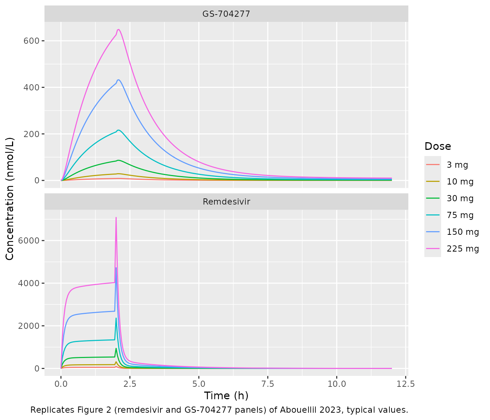
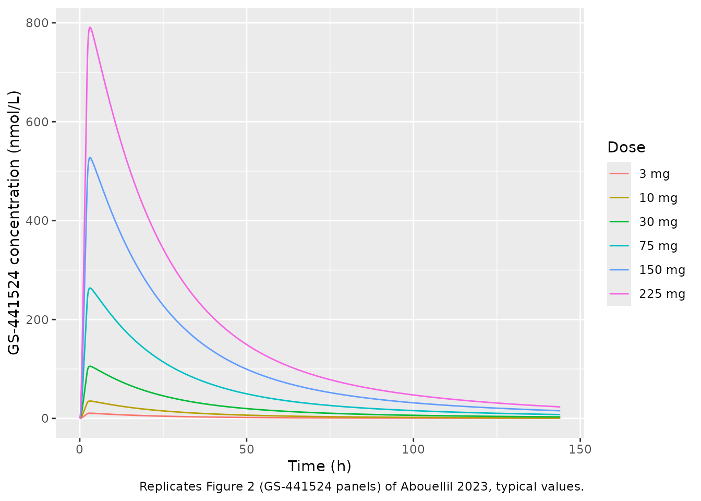
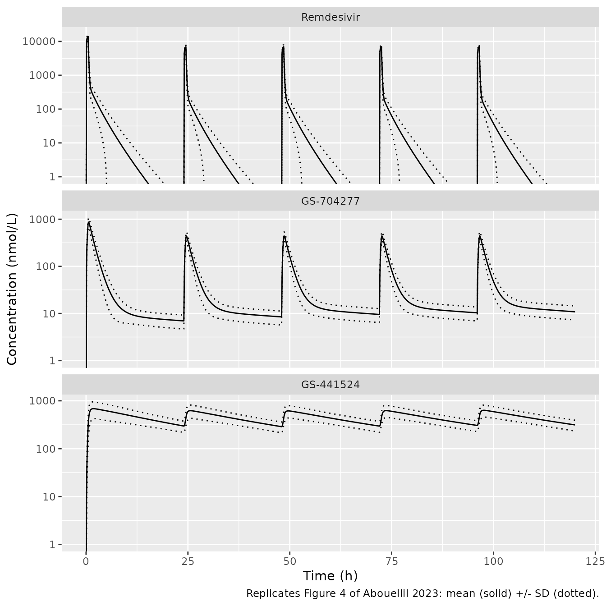

# Remdesivir (Abouellil 2023)

## Model and source

- Citation: Abouellil A, Bilal M, Taubert M, Fuhr U. A population
  pharmacokinetic model of remdesivir and its major metabolites based on
  published mean values from healthy subjects. Naunyn Schmiedebergs Arch
  Pharmacol. 2023;396(1):73-82. <doi:10.1007/s00210-022-02292-6>
- Description: Six-compartment population PK model for intravenous
  remdesivir and its two plasma metabolites GS-704277 and GS-441524 in
  healthy adults (Abouellil 2023). Each analyte has a central and a
  peripheral compartment. Remdesivir is converted to GS-704277 from both
  of its compartments (central to central, and peripheral to
  peripheral); GS-704277 is converted to GS-441524 from its central
  compartment only; each analyte is also eliminated from its central
  compartment. States are molar amounts (umol), so doses must be
  supplied in umol of remdesivir. Fitted in Monolix to digitised MEAN
  concentration profiles of the Gilead single-ascending-dose study, so
  the random effects are between-dose-cohort, not between-subject,
  variability.
- Article (open access): <https://doi.org/10.1007/s00210-022-02292-6>
- Supplementary material (Figures S1-S4; no parameter tables):
  <https://doi.org/10.1007/s00210-022-02292-6>

Remdesivir is an intravenous prodrug. Plasma esterases convert it to the
alanine intermediate GS-704277, which is cleaved to the nucleoside
monophosphate and dephosphorylated to the nucleoside GS-441524, the
long-lived circulating metabolite (Abouellil 2023 Figure S1). Abouellil
2023 fitted all three plasma analytes at once. Each analyte has two
compartments. Metabolism runs remdesivir -\> GS-704277 -\> GS-441524
between the central compartments, and there is a second remdesivir -\>
GS-704277 conversion between the peripheral compartments (Figure 1).

## Population

The data were mean concentration-time profiles from the Gilead phase I
single-ascending-dose study of remdesivir in healthy volunteers
(Humeniuk et al. 2020), digitised from that publication. Six cohorts
received a single 2-h intravenous infusion of 3, 10, 30, 75, 150 or 225
mg. Subjects were healthy men and non-pregnant, non-lactating women aged
18-55 years with a body mass index of 18-30 kg/m^2 (Methods). Abouellil
2023 reports no per-cohort sample size, sex split or other demographics;
the Discussion notes the cohort had “a focus on a Hispanic population”.
The study also included once-daily 1-h infusions for 7 and 14 days, but
the model was fitted to the single-dose cohorts only (Table 2 caption).

Because each cohort contributed one mean profile per analyte, the random
effects in Table 2 measure how the mean profiles vary between dose
cohorts, not how individuals vary (Methods: “the obtained variability of
fixed parameters reflects inter-cohort variabilities rather than
inter-individual variability”). The authors note in the Discussion that
between-patient variability is probably much larger. They tried to apply
the model to a patient with renal impairment and it failed.

## Source trace

| Model element | Value | Source |
|----|----|----|
| Structure: 2 compartments per analyte, sequential metabolism, elimination from each central compartment | – | Table 1 (ODEs); Figure 1; Results paragraph 1 |
| Peripheral remdesivir -\> peripheral GS-704277 conversion | – | Table 1 (RDV and GS-704277 peripheral equations); Figure 1 caption |
| `lcl` (remdesivir CL) | 18.1 L/h | Table 2 |
| `lvc` (remdesivir Vc) | 4.89 L | Table 2 |
| `lvp` (remdesivir Vp) | 46.5 L | Table 2 |
| `lq` (remdesivir Q) | 13.2 L/h | Table 2 |
| `lcl_form_gs704277_central` (CLmc GS-704277) | 16.9 L/h | Table 2, ‘Central formation clearance’, GS-704277 column |
| `lcl_form_gs704277_peripheral1` (CLmp GS-704277) | 18.9 L/h | Table 2, ‘Peripheral formation clearance’, GS-704277 column |
| `lcl_gs704277` | 36.9 L/h | Table 2 |
| `lvc_gs704277` | 96.4 L | Table 2 |
| `lvp_gs704277` | 8.64 L | Table 2 |
| `lq_gs704277` | 0.12 L/h | Table 2 |
| `lcl_form_gs441524` (CLmc GS-441524) | 50.5 L/h | Table 2, ‘Central formation clearance’, GS-441524 column |
| `lcl_gs441524` | 4.74 L/h | Table 2 |
| `lvc_gs441524` | 26.2 L | Table 2 |
| `lvp_gs441524` | 66.2 L | Table 2 |
| `lq_gs441524` | 55 L/h | Table 2 |
| `etalcl` | SD 0.39 (variance 0.1521) | Table 2 (SD in parentheses) |
| `etalcl_form_gs704277_central` | SD 0.25 (variance 0.0625) | Table 2 |
| `etalcl_form_gs704277_peripheral1` | SD 0.53 (variance 0.2809) | Table 2 |
| `etalcl_gs704277` | SD 0.31 (variance 0.0961) | Table 2 |
| `etalcl_form_gs441524` | SD 0.27 (variance 0.0729) | Table 2 |
| `etalvc_gs441524` | SD 0.71 (variance 0.5041) | Table 2 |
| `etalvp_gs441524` | SD 0.24 (variance 0.0576) | Table 2 |
| Log-normal random effects, `log(theta_i) = log(theta_pop) + eta_i` | – | Methods equation |
| Residual error: proportional (remdesivir), combined (GS-704277), proportional (GS-441524) | magnitudes not reported, held at 0 | Results paragraph 4; Methods error-model equation |
| Saline flush: 4% of the dose given as a bolus at the end of the 2-h infusion | – | Methods (dosing-record design, not part of `model()`) |
| Concentration scale nmol/L; molar 1:1 transfer between moieties | – | Figures 2 and 4 axes; Table 1 (no molecular-weight factor) |

## Model structure and units

``` r

mod <- rxode2::rxode2(readModelDb("Abouellil_2023_remdesivir"))
#> ℹ parameter labels from comments will be replaced by 'label()'
mod_typ <- rxode2::zeroRe(mod)
```

The model’s states hold molar amounts (umol). Abouellil 2023 Figures 2
and 4 plot every analyte in nmol/L, and the Table 1 equations move
material between moieties as clearance x concentration with no
molecular-weight factor, so the model runs in molar space. Doses in mg
are converted to umol with the remdesivir molecular weight of 602.58
g/mol (the paper does not print it). The observation variables `Cc`,
`Cc_gs704277` and `Cc_gs441524` are in nmol/L.

``` r

mw_rdv <- 602.58
mg_to_umol <- function(mg) mg / mw_rdv * 1000

# Single-ascending-dose design of the fitted study: a 2-h infusion of 96% of
# the dose followed by 4% as a bolus at the end of the infusion, which is how
# Abouellil 2023 Methods represent the saline flush.
sad_events <- function(dose_mg, obs_times, flush = TRUE) {
  amt <- mg_to_umol(dose_mg)
  ev <- if (flush) {
    rxode2::et(amt = 0.96 * amt, dur = 2, cmt = "central") |>
      rxode2::et(amt = 0.04 * amt, time = 2, cmt = "central")
  } else {
    rxode2::et(amt = amt, dur = 2, cmt = "central")
  }
  # Three endpoints are declared, so observation rows must name one of them;
  # every observable is returned on every row regardless.
  rxode2::et(ev, obs_times, cmt = "Cc")
}

sad_times <- sort(unique(c(seq(0, 2, by = 0.05), 2 + 1e-4,
                           seq(2.05, 12, by = 0.05), seq(12, 144, by = 0.5))))
sad_doses <- c(3, 10, 30, 75, 150, 225)
```

Observation rows carry `cmt = "Cc"`. With three declared endpoints, an
observation row on an ODE state is rejected by rxode2. `Cc` already has
its own endpoint slot, so naming it adds no compartment and does not
renumber the ODE states. The guard below checks this: the dose must land
in `central`.

``` r

sad <- dplyr::bind_rows(lapply(sad_doses, function(d) {
  out <- as.data.frame(rxode2::rxSolve(mod_typ, sad_events(d, sad_times),
                                       returnType = "data.frame"))
  out$dose_mg <- d
  out
}))
#> ℹ omega/sigma items treated as zero: 'etalcl', 'etalcl_form_gs704277_central', 'etalcl_form_gs704277_peripheral1', 'etalcl_gs704277', 'etalcl_form_gs441524', 'etalvc_gs441524', 'etalvp_gs441524'
#> ℹ omega/sigma items treated as zero: 'etalcl', 'etalcl_form_gs704277_central', 'etalcl_form_gs704277_peripheral1', 'etalcl_gs704277', 'etalcl_form_gs441524', 'etalvc_gs441524', 'etalvp_gs441524'
#> ℹ omega/sigma items treated as zero: 'etalcl', 'etalcl_form_gs704277_central', 'etalcl_form_gs704277_peripheral1', 'etalcl_gs704277', 'etalcl_form_gs441524', 'etalvc_gs441524', 'etalvp_gs441524'
#> ℹ omega/sigma items treated as zero: 'etalcl', 'etalcl_form_gs704277_central', 'etalcl_form_gs704277_peripheral1', 'etalcl_gs704277', 'etalcl_form_gs441524', 'etalvc_gs441524', 'etalvp_gs441524'
#> ℹ omega/sigma items treated as zero: 'etalcl', 'etalcl_form_gs704277_central', 'etalcl_form_gs704277_peripheral1', 'etalcl_gs704277', 'etalcl_form_gs441524', 'etalvc_gs441524', 'etalvp_gs441524'
#> ℹ omega/sigma items treated as zero: 'etalcl', 'etalcl_form_gs704277_central', 'etalcl_form_gs704277_peripheral1', 'etalcl_gs704277', 'etalcl_form_gs441524', 'etalvc_gs441524', 'etalvp_gs441524'
sad$dose <- factor(paste(sad$dose_mg, "mg"), levels = paste(sad_doses, "mg"))

stopifnot(
  # The infusion fills `central` (state 1), not an injected endpoint slot.
  all(sad$central[sad$time == 1] > 0),
  # Each moiety's central state has no dose of its own and starts at zero.
  all(sad$central_gs704277[sad$time == 0] == 0),
  all(sad$central_gs441524[sad$time == 0] == 0)
)
```

## Steady-state check of the ODE wiring

During a long constant-rate infusion of remdesivir the model has a
closed-form steady state. The remdesivir peripheral compartment loses
drug only by conversion to GS-704277. GS-704277 formed in its peripheral
compartment must come back to its central compartment before it can be
eliminated. GS-441524 is formed only from central GS-704277. So, for
infusion rate R (umol/h):

- `Cc_ss = R / (CL + CLmc + Q * CLmp / (Q + CLmp))`,
  `Cp_ss = Q * Cc_ss / (Q + CLmp)`
- `C704_ss = (CLmc * Cc_ss + CLmp * Cp_ss) / (CL_704 + CLm_441)`
- `C441_ss = CLm_441 * C704_ss / CL_441`

The check uses typical values and a solve against its own closed form,
so the two sides differ only by numerical error and a tight tolerance is
correct.

``` r

p <- exp(c(
  cl = log(18.1), vc = log(4.89), vp = log(46.5), q = log(13.2),
  clmc = log(16.9), clmp = log(18.9),
  cl704 = log(36.9), clm441 = log(50.5), cl441 = log(4.74)
))
rate <- 10 # umol/h
cc_ss <- rate / (p[["cl"]] + p[["clmc"]] + p[["q"]] * p[["clmp"]] / (p[["q"]] + p[["clmp"]]))
cp_ss <- p[["q"]] * cc_ss / (p[["q"]] + p[["clmp"]])
c704_ss <- (p[["clmc"]] * cc_ss + p[["clmp"]] * cp_ss) / (p[["cl704"]] + p[["clm441"]])
c441_ss <- p[["clm441"]] * c704_ss / p[["cl441"]]

ss_ev <- rxode2::et(amt = rate * 2000, rate = rate, cmt = "central") |>
  rxode2::et(1500, cmt = "Cc")
ss <- as.data.frame(rxode2::rxSolve(mod_typ, ss_ev, returnType = "data.frame",
                                    atol = 1e-10, rtol = 1e-10))
#> ℹ omega/sigma items treated as zero: 'etalcl', 'etalcl_form_gs704277_central', 'etalcl_form_gs704277_peripheral1', 'etalcl_gs704277', 'etalcl_form_gs441524', 'etalvc_gs441524', 'etalvp_gs441524'
ss_tab <- data.frame(
  analyte = c("remdesivir", "GS-704277", "GS-441524"),
  closed_form_nM = 1000 * c(cc_ss, c704_ss, c441_ss),
  simulated_nM = c(ss$Cc, ss$Cc_gs704277, ss$Cc_gs441524)
)
ss_tab$rel_diff <- ss_tab$simulated_nM / ss_tab$closed_form_nM - 1
knitr::kable(ss_tab, digits = c(0, 3, 3, 8))
```

| analyte    | closed_form_nM | simulated_nM | rel_diff |
|:-----------|---------------:|-------------:|---------:|
| remdesivir |        233.798 |      233.798 |        0 |
| GS-704277  |         65.998 |       65.998 |        0 |
| GS-441524  |        703.147 |      703.147 |        0 |

``` r

stopifnot(all(abs(ss_tab$rel_diff) < 1e-5))
```

## Single-dose profiles (replicates Figure 2 of Abouellil 2023)

Figure 2 overlays each cohort’s own empirical-Bayes fit on that cohort’s
mean data. The curves below are the population typical values, with
every between-cohort random effect at zero.

``` r

sad |>
  dplyr::filter(time <= 12) |>
  tidyr::pivot_longer(c(Cc, Cc_gs704277), names_to = "analyte", values_to = "conc") |>
  dplyr::mutate(analyte = dplyr::recode(analyte, Cc = "Remdesivir",
                                        Cc_gs704277 = "GS-704277")) |>
  ggplot(aes(time, conc, colour = dose)) +
  geom_line() +
  facet_wrap(~analyte, ncol = 1, scales = "free_y") +
  labs(x = "Time (h)", y = "Concentration (nmol/L)", colour = "Dose",
       caption = "Replicates Figure 2 (remdesivir and GS-704277 panels) of Abouellil 2023, typical values.")
```



``` r

sad |>
  ggplot(aes(time, Cc_gs441524, colour = dose)) +
  geom_line() +
  labs(x = "Time (h)", y = "GS-441524 concentration (nmol/L)", colour = "Dose",
       caption = "Replicates Figure 2 (GS-441524 panels) of Abouellil 2023, typical values.")
```



The typical-value peaks are close to the Figure 2 panels. At 225 mg the
remdesivir plateau is 3898 nmol/L and the end-of-infusion spike from the
flush bolus reaches 7086 nmol/L. GS-704277 peaks at 649 nmol/L and
GS-441524 at 791 nmol/L. Figure 2 shows about 3500-4000, 7000, 680 and
850 nmol/L for these four values (read by eye).

## Clinical regimen (replicates Figure 4 of Abouellil 2023)

Abouellil 2023 simulated 256 subjects on the licensed regimen: 200 mg as
a 30-min infusion on day 1, then 100 mg as a 30-min infusion daily on
days 2-5. The simulation sampled the between-cohort random effects
(Results: “The simulation used the previously generated population
parameters of fixed effects, the standard deviation of the random
effects, and error model estimates”). The cohort below uses 200 virtual
subjects. The model has no covariates, so the only thing that varies
between subjects is the sampled random effects.

``` r

rxode2::rxSetSeed(20230101)
n_sub <- 200
clin_times <- sort(unique(c(seq(0, 120, by = 0.1), 0.5 + 24 * 0:4)))
clin_ev <- rxode2::et(amt = mg_to_umol(200), dur = 0.5, cmt = "central") |>
  rxode2::et(amt = mg_to_umol(100), dur = 0.5, time = 24 * 1:4, cmt = "central") |>
  rxode2::et(clin_times, cmt = "Cc") |>
  rxode2::et(id = seq_len(n_sub))
clin <- as.data.frame(rxode2::rxSolve(mod, clin_ev, returnType = "data.frame"))
clin$treatment <- "200 mg LD + 100 mg QD"
stopifnot(!anyNA(clin$Cc), !anyNA(clin$Cc_gs704277), !anyNA(clin$Cc_gs441524),
          length(unique(clin$id)) == n_sub)
```

``` r

clin |>
  tidyr::pivot_longer(c(Cc, Cc_gs704277, Cc_gs441524), names_to = "analyte",
                      values_to = "conc") |>
  dplyr::group_by(analyte, time) |>
  dplyr::summarise(mean = mean(conc), sd = sd(conc), .groups = "drop") |>
  dplyr::mutate(
    analyte = factor(dplyr::recode(analyte, Cc = "Remdesivir",
                                   Cc_gs704277 = "GS-704277",
                                   Cc_gs441524 = "GS-441524"),
                     levels = c("Remdesivir", "GS-704277", "GS-441524")),
    # The pre-dose row is exactly zero; floor it for the log axis.
    mean = pmax(mean, 1e-3), lo = pmax(mean - sd, 1e-3), hi = mean + sd
  ) |>
  ggplot(aes(time, mean)) +
  geom_line() +
  geom_line(aes(y = lo), linetype = "dotted") +
  geom_line(aes(y = hi), linetype = "dotted") +
  scale_y_log10() +
  coord_cartesian(ylim = c(1, NA)) +
  facet_wrap(~analyte, ncol = 1, scales = "free_y") +
  labs(x = "Time (h)", y = "Concentration (nmol/L)",
       caption = "Replicates Figure 4 of Abouellil 2023: mean (solid) +/- SD (dotted).")
```



Figure 4 cuts each panel off at the assay LLOQ, and the remdesivir panel
adds a fraction-of-censored-observations trace. The LLOQ values come
from the source study and are not printed in Abouellil 2023, so neither
the cut-off nor the censored-fraction trace is reproduced here. The
figure above is drawn down to 1 nmol/L.

## Non-compartmental analysis

PKNCA is run on the simulated cohort, once per analyte. The intervals
are the first dosing interval (0-24 h, after the 200 mg loading dose)
and the last (96-120 h, after the fifth dose).

``` r

nca_one <- function(col, label) {
  conc <- clin |>
    dplyr::filter(!is.na(.data[[col]])) |>
    dplyr::transmute(id, time, treatment, conc = .data[[col]])
  dose <- data.frame(id = rep(seq_len(n_sub), each = 5), time = 24 * 0:4,
                     amt = rep(c(200, 100, 100, 100, 100), n_sub),
                     treatment = "200 mg LD + 100 mg QD")
  o_conc <- PKNCA::PKNCAconc(conc, conc ~ time | treatment + id)
  o_dose <- PKNCA::PKNCAdose(dose, amt ~ time | treatment + id)
  intervals <- data.frame(start = c(0, 96), end = c(24, 120),
                          cmax = TRUE, tmax = TRUE, auclast = TRUE)
  res <- PKNCA::pk.nca(PKNCA::PKNCAdata(o_conc, o_dose, intervals = intervals))
  out <- as.data.frame(res)
  out$analyte <- label
  out
}
nca <- dplyr::bind_rows(
  nca_one("Cc", "Remdesivir"),
  nca_one("Cc_gs704277", "GS-704277"),
  nca_one("Cc_gs441524", "GS-441524")
)
nca |>
  dplyr::group_by(analyte, start, end, PPTESTCD) |>
  dplyr::summarise(mean = mean(PPORRES), sd = sd(PPORRES),
                   median = median(PPORRES), .groups = "drop") |>
  dplyr::mutate(interval = paste0(start, "-", end, " h")) |>
  dplyr::select(analyte, interval, PPTESTCD, mean, sd, median) |>
  dplyr::rename("Analyte" = analyte, "Interval" = interval,
                "Parameter" = PPTESTCD, "Mean" = mean, "SD" = sd,
                "Median" = median) |>
  knitr::kable(digits = 2)
```

| Analyte    | Interval | Parameter |     Mean |      SD |   Median |
|:-----------|:---------|:----------|---------:|--------:|---------:|
| GS-441524  | 0-24 h   | auclast   | 11187.15 | 3649.09 | 10816.55 |
| GS-441524  | 0-24 h   | cmax      |   712.99 |  269.45 |   673.42 |
| GS-441524  | 0-24 h   | tmax      |     2.16 |    1.06 |     2.00 |
| GS-441524  | 96-120 h | auclast   | 10999.13 | 2765.58 | 11087.36 |
| GS-441524  | 96-120 h | cmax      |   645.18 |  180.81 |   637.21 |
| GS-441524  | 96-120 h | tmax      |     1.86 |    0.70 |     1.75 |
| GS-704277  | 0-24 h   | auclast   |  1639.53 |  472.83 |  1605.80 |
| GS-704277  | 0-24 h   | cmax      |   868.45 |  193.23 |   875.24 |
| GS-704277  | 0-24 h   | tmax      |     0.62 |    0.04 |     0.60 |
| GS-704277  | 96-120 h | auclast   |  1030.14 |  282.09 |  1025.64 |
| GS-704277  | 96-120 h | cmax      |   444.44 |   97.49 |   449.07 |
| GS-704277  | 96-120 h | tmax      |     0.62 |    0.04 |     0.60 |
| Remdesivir | 0-24 h   | auclast   |  7775.45 | 1664.18 |  7789.74 |
| Remdesivir | 0-24 h   | cmax      | 13958.69 | 2426.69 | 14143.83 |
| Remdesivir | 0-24 h   | tmax      |     0.50 |    0.00 |     0.50 |
| Remdesivir | 96-120 h | auclast   |  3887.77 |  832.15 |  3894.87 |
| Remdesivir | 96-120 h | cmax      |  6979.36 | 1213.36 |  7071.92 |
| Remdesivir | 96-120 h | tmax      |     0.50 |    0.00 |     0.50 |

## Comparison against the published simulation results

The Results section reports the cohort-mean Cmax (between-dose SD) after
the 200 mg loading dose. The values are 13.7 umol/L (2.39) for
remdesivir, 807 nmol/L (173) for GS-704277 and 726 nmol/L (240) for
GS-441524. It also reports a GS-441524 Cmax of 645.5 nmol/L (17.57)
after the subsequent 100 mg doses. The simulated values below are cohort
means of the per-subject PKNCA Cmax, so they are directly comparable.

``` r

sim_cmax <- nca |>
  dplyr::filter(PPTESTCD == "cmax") |>
  dplyr::mutate(group = dplyr::case_when(
    start == 0 ~ paste(analyte, "after the 200 mg loading dose"),
    TRUE ~ paste(analyte, "after the fifth (100 mg) dose")
  )) |>
  dplyr::group_by(group) |>
  dplyr::summarise(cmax = mean(PPORRES), .groups = "drop")

ref_cmax <- data.frame(
  group = c("Remdesivir after the 200 mg loading dose",
            "GS-704277 after the 200 mg loading dose",
            "GS-441524 after the 200 mg loading dose",
            "GS-441524 after the fifth (100 mg) dose"),
  cmax = c(13700, 807, 726, 645.5)
)
cmp <- nlmixr2lib::ncaComparisonTable(
  sim_cmax |> dplyr::filter(group %in% ref_cmax$group),
  ref_cmax, by = "group", units = c(cmax = "nmol/L")
)
knitr::kable(cmp)
```

| NCA parameter | group | Reference | Simulated | % diff |
|:---|:---|:---|:---|:---|
| Cmax (nmol/L) | Remdesivir after the 200 mg loading dose | 13700 | 14000 | +1.9% |
| Cmax (nmol/L) | GS-704277 after the 200 mg loading dose | 807 | 868 | +7.6% |
| Cmax (nmol/L) | GS-441524 after the 200 mg loading dose | 726 | 713 | -1.8% |
| Cmax (nmol/L) | GS-441524 after the fifth (100 mg) dose | 646 | 645 | -0.0% |

``` r


pct <- (sim_cmax$cmax[match(ref_cmax$group, sim_cmax$group)] / ref_cmax$cmax - 1) * 100
stopifnot(
  # Cohort means of 200 subjects; a wrong volume, clearance or molar
  # conversion shifts these by far more than the 15% allowed.
  all(abs(pct) < 15)
)
```

All four simulated means are within 8% of the published values. The
GS-704277 loading-dose Cmax is the largest difference (+7.6%). The
typical-value GS-704277 Cmax is also above the published mean, so the
gap is not only a matter of which 256 subjects were sampled. The paper
gives no more detail on its simulation, so the gap is recorded here
rather than explained; it is well inside the 20% flag threshold.

### Saline flush in the clinical simulation

The 4% end-of-infusion bolus represents the saline flush in the fitted
2-h infusion study. The clinical-regimen simulation above leaves it out.
The reported loading-dose remdesivir Cmax of 13.7 umol/L matches the
simulation without the flush. With the flush, the bolus lands in a 4.89
L central volume at the moment of peak concentration and raises the
typical Cmax by about 2.7 umol/L:

``` r

ld <- function(flush) {
  amt <- mg_to_umol(200)
  ev <- if (flush) {
    rxode2::et(amt = 0.96 * amt, dur = 0.5, cmt = "central") |>
      rxode2::et(amt = 0.04 * amt, time = 0.5, cmt = "central")
  } else {
    rxode2::et(amt = amt, dur = 0.5, cmt = "central")
  }
  out <- as.data.frame(rxode2::rxSolve(
    mod_typ, rxode2::et(ev, seq(0, 3, by = 0.01), cmt = "Cc"),
    returnType = "data.frame"
  ))
  max(out$Cc)
}
flush_tab <- data.frame(
  design = c("No flush (used above)", "4% end-of-infusion bolus"),
  typical_cmax_umol_L = c(ld(FALSE), ld(TRUE)) / 1000
)
#> ℹ omega/sigma items treated as zero: 'etalcl', 'etalcl_form_gs704277_central', 'etalcl_form_gs704277_peripheral1', 'etalcl_gs704277', 'etalcl_form_gs441524', 'etalvc_gs441524', 'etalvp_gs441524'
#> ℹ omega/sigma items treated as zero: 'etalcl', 'etalcl_form_gs704277_central', 'etalcl_form_gs704277_peripheral1', 'etalcl_gs704277', 'etalcl_form_gs441524', 'etalvc_gs441524', 'etalvp_gs441524'
flush_tab |>
  dplyr::rename("Design" = design,
                "Typical remdesivir Cmax (umol/L)" = typical_cmax_umol_L) |>
  knitr::kable(digits = 2)
```

| Design                   | Typical remdesivir Cmax (umol/L) |
|:-------------------------|---------------------------------:|
| No flush (used above)    |                            13.96 |
| 4% end-of-infusion bolus |                            16.12 |

## Assumptions and deviations

- **Residual error magnitudes are not reported.** The Results name the
  selected error models (proportional for remdesivir, combined for
  GS-704277, proportional for GS-441524). Neither the paper nor the
  supplement gives their values. All four residual parameters are held
  at zero, so simulations have no residual noise. Fit the model to your
  own data before using it to simulate observed concentrations.
- **Random effects are between-cohort, not between-subject.** They are
  variances of the Table 2 SDs (Monolix reports the SD of each random
  effect). Simulating individuals with them gives a spread of
  cohort-mean profiles. It will understate the spread of individual
  patients’ profiles, as the authors point out.
- **Molar units and molecular weight.** The model is in umol and nmol/L,
  as Figures 2 and 4 and the molar 1:1 transfer in Table 1 imply. The
  mg-to-umol conversion uses MW 602.58 g/mol for remdesivir, which the
  paper does not print. Each metabolite’s clearance and volume are
  apparent with respect to the unknown fraction of the upstream flux
  that appears as that metabolite in plasma.
- **Saline flush is a dosing-record feature.** It is represented in the
  event table (96% infused, 4% bolus at the end of the infusion) for the
  2-h single-dose study, and left out of the 30-min clinical regimen.
  The reported clinical-regimen remdesivir Cmax supports leaving it out
  there.
- **Assay LLOQs are not available**, so the censored-fraction trace of
  Figure 4 is not reproduced.
- **GS-441524 half-life.** The Results report a simulated GS-441524
  half-life of 29.36 h after repeated 100 mg doses, without saying which
  window it was fitted over. They also report a regression-based
  terminal half-life of 20 h from the single-dose data. The model’s
  terminal phase depends on the window (GS-441524 has a 66.2 L
  peripheral compartment), so no half-life gate is applied.

## Errata and discrepancies in the source

- Table 1, parts of the Methods and the Results text print the
  intermediate metabolite as “GS-774277”. Table 2, Figure 1, the
  Abstract and the supplement (Figure S1) give GS-704277, the correct
  Gilead code. This model uses GS-704277.
- Table 1’s GS-704277 central-compartment equation has an unbalanced
  parenthesis (“- CL_GS-774277 x Cc_GS-774277)”); the term is read as
  the GS-704277 elimination outflow.
