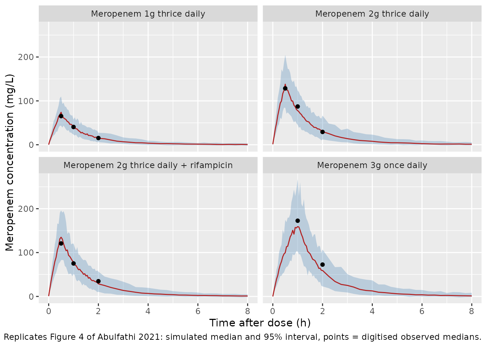

# Meropenem (Abulfathi 2021)

## Model and source

    #> ℹ parameter labels from comments will be replaced by 'label()'

- Citation: Abulfathi AA, de Jager V, van Brakel E, Reuter H, Gupte N,
  Vanker N, Barnes GL, Nuermberger E, Dorman SE, Diacon AH, Dooley KE,
  Svensson EM. The Population Pharmacokinetics of Meropenem in Adult
  Patients With Rifampicin-Sensitive Pulmonary Tuberculosis. Front
  Pharmacol. 2021;12:637618. <doi:10.3389/fphar.2021.637618>

- Description: Two-compartment population PK model for intravenous
  meropenem in South African adults with rifampicin-sensitive pulmonary
  tuberculosis (COMRADE trial; Abulfathi 2021). Allometric scaling on
  all disposition parameters with total body weight (reference 70 kg;
  fixed exponents 0.75 on CL and Q, 1 on V1 and V2) and a power effect
  of weight-standardised Cockcroft-Gault creatinine clearance (CRCL \*
  70 / WT, reference 115 mL/min) on CL; combined additive + proportional
  residual error.

- Article: <https://doi.org/10.3389/fphar.2021.637618>

Abulfathi and colleagues characterised the population pharmacokinetics
of intravenous meropenem, which is being investigated for repurposing
against tuberculosis, in adults with rifampicin-sensitive pulmonary
tuberculosis enrolled in the phase 2 COMRADE trial. A two-compartment
model with allometric weight scaling on all disposition parameters and a
power effect of weight-standardised creatinine clearance on clearance
described the data. Concomitant rifampicin and age had no significant
effect on clearance.

## Population

Sixty South African adults were randomised; the 49 who completed
intensive pharmacokinetic sampling on day 14 form the analysis
population (Abulfathi 2021 Table 1). Median age was 36.0 years (range
20.0-62.7), 24.5% were female, 32.7% were Black and 67.3% of mixed Asian
ancestry, and 22.4% were HIV-positive. Median body weight was 52.7 kg
(range 39.3-76.3; no patient was obese) and median Cockcroft-Gault
creatinine clearance was 115 mL/min (range 57.7-203). Participants
received meropenem for 14 days in one of four arms: 2 g over 0.5 h every
8 h with oral rifampicin 20 mg/kg once daily (MACR2X3, n = 12), 2 g over
0.5 h every 8 h (MAC2X3, n = 13), 1 g over 0.5 h every 8 h (MAC1X3, n =
12), or 3 g over 1 h once daily (MAC3X1, n = 12). All arms also received
oral amoxicillin/clavulanate with each meropenem dose. Samples were
taken pre-dose and at 0.5, 1, 1.5, 2, 3, 4, 6 and 8 h after the day-14
dose; 404 of 441 concentrations were analysed (LLOQ 0.5 mg/L).

The same information is available programmatically via
`readModelDb("Abulfathi_2021_meropenem")()$population`.

## Source trace

The per-parameter origin is recorded as an in-file comment next to each
`ini()` entry in
`inst/modeldb/specificDrugs/Abulfathi_2021_meropenem.R`. The covariate
equations are printed in NONMEM syntax in the footnote of Abulfathi 2021
Table 2.

| Equation / parameter | Value | Source location |
|----|----|----|
| `lcl` (CL, L/h per 70 kg) | log(11.8) | Table 2 |
| `lvc` (V1, L per 70 kg) | log(14.2) | Table 2 |
| `lq` (Q, L/h per 70 kg) | log(3.26) | Table 2 |
| `lvp` (V2, L per 70 kg) | log(3.12) | Table 2 |
| `e_wt_cl_q` | 0.75 (fixed) | Results; Table 2 footnote (`TVCL`, `TVQ`) |
| `e_wt_vc_vp` | 1 (fixed) | Results; Table 2 footnote (`TVV1`, `TVV2`) |
| `e_crcl_cl` | 0.416 | Table 2 (‘Creatinine clearance on CL’); footnote `THETA(7)` |
| `etalcl` | log(0.20^2 + 1) = 0.0392 | Table 2 (20 %CV); footnote b (`%CV = SQRT(EXP(OMEGA)-1)*100`) |
| `etalvc` | log(0.131^2 + 1) = 0.0170 | Table 2 (13.1 %CV) |
| `etalvp` | log(1.06^2 + 1) = 0.7531 | Table 2 (106 %CV) |
| `propSd` | 0.178 | Table 2 (‘Proportional residual error’) |
| `addSd` | 1.16 mg/L | Table 2 (‘Additive residual error’) |
| `cl = CL * (WT/70)^0.75 * ((CRCL*70/WT)/115)^0.416` | n/a | Table 2 footnote `TVCL` |
| `vc = V1 * WT/70`, `q = Q * (WT/70)^0.75`, `vp = V2 * WT/70` | n/a | Table 2 footnote `TVV1`, `TVQ`, `TVV2` |
| Two-compartment ODEs with elimination from central | n/a | Figure 2 (structural schema) |

## Deterministic checks of the covariate model

The reference subject (70 kg, creatinine clearance 115 mL/min, so the
weight-standardised value is also 115 mL/min) must have the published
typical clearance of 11.8 L/h. The Discussion also states that “in a 70
kg patient with severe renal impairment (CLCR of 5-30 ml/min), about a
40-70% reduction in meropenem doses would be required”, which follows
from the ratio of clearances.

``` r

mod <- readModelDb("Abulfathi_2021_meropenem")
mod_typical <- rxode2::zeroRe(mod)
#> ℹ parameter labels from comments will be replaced by 'label()'

cl_at <- function(wt, crcl) {
  ev <- data.frame(id = 1, time = 0, evid = 0, cmt = "central", WT = wt, CRCL = crcl)
  rxode2::rxSolve(mod_typical, ev, returnType = "data.frame")$cl
}

cl_ref <- cl_at(70, 115)
#> ℹ omega/sigma items treated as zero: 'etalcl', 'etalvc', 'etalvp'
renal <- tibble::tibble(
  CRCL = c(5, 30, 115),
  cl = vapply(CRCL, function(x) cl_at(70, x), numeric(1)),
  reduction_pct = 100 * (1 - cl / cl_ref)
)
#> ℹ omega/sigma items treated as zero: 'etalcl', 'etalvc', 'etalvp'
#> ℹ omega/sigma items treated as zero: 'etalcl', 'etalvc', 'etalvp'
#> ℹ omega/sigma items treated as zero: 'etalcl', 'etalvc', 'etalvp'
knitr::kable(renal, digits = 2, caption = "Typical CL for a 70 kg patient by creatinine clearance.")
```

| CRCL |    cl | reduction_pct |
|-----:|------:|--------------:|
|    5 |  3.20 |         72.87 |
|   30 |  6.75 |         42.82 |
|  115 | 11.80 |          0.00 |

Typical CL for a 70 kg patient by creatinine clearance. {.table}

``` r


stopifnot(
  abs(cl_ref / 11.8 - 1) < 1e-8,
  # Paper: 'about a 40-70% reduction' across CLCR 5-30 mL/min.
  renal$reduction_pct[renal$CRCL == 30] > 35, renal$reduction_pct[renal$CRCL == 30] < 50,
  renal$reduction_pct[renal$CRCL == 5] > 65, renal$reduction_pct[renal$CRCL == 5] < 80
)
```

The model gives a 43% reduction at 30 mL/min and a 73% reduction at 5
mL/min, in line with the paper’s “about 40-70%”.

## Typical-value profiles against the observed medians of Figure 4

Figure 4 of the paper overlays the observed median concentration (solid
red line) for each arm on day 14. The maintainers digitised that line
from the figure image at 0.5, 1 and 2 h after the dose. The table below
compares it with the typical-value prediction for a subject at the
population median weight (52.7 kg) and creatinine clearance (115 mL/min)
after 14 days of dosing. The two are not the same quantity (a median of
12-13 observed patients versus one typical subject), so the check is a
structural one: a mis-transcribed clearance, volume, dose or unit moves
every point by tens of percent.

``` r

arms <- tibble::tribble(
  ~arm,                          ~amt, ~dur, ~tau,
  "Meropenem 1g thrice daily",   1000, 0.5,  8,
  "Meropenem 2g thrice daily",   2000, 0.5,  8,
  "Meropenem 2g thrice daily + rifampicin", 2000, 0.5, 8,
  "Meropenem 3g once daily",     3000, 1.0,  24
)
day14 <- 13 * 24 # start of the day-14 dosing interval (h)

make_events <- function(ids, wt, crcl, arm_row, obs_times) {
  n_dose <- 14 * 24 / arm_row$tau
  subj <- tibble::tibble(id = ids, WT = wt, CRCL = crcl, arm = arm_row$arm)
  doses <- subj |>
    tidyr::crossing(time = (seq_len(n_dose) - 1) * arm_row$tau) |>
    dplyr::mutate(
      evid = 1L, cmt = "central", amt = arm_row$amt,
      rate = arm_row$amt / arm_row$dur, dose_time = time
    ) |>
    dplyr::filter(time <= day14)
  obs <- subj |>
    tidyr::crossing(tad = obs_times) |>
    dplyr::mutate(
      time = day14 + tad, evid = 0L, cmt = "central",
      amt = NA_real_, rate = NA_real_
    ) |>
    dplyr::select(-tad)
  dplyr::bind_rows(doses, obs) |>
    dplyr::select(id, time, evid, cmt, amt, rate, WT, CRCL, arm) |>
    dplyr::arrange(id, time, dplyr::desc(evid))
}

ev_typ <- dplyr::bind_rows(lapply(seq_len(nrow(arms)), function(i) {
  make_events(i, 52.7, 115, arms[i, ], obs_times = seq(0, 8, by = 0.05))
}))
sim_typ <- rxode2::rxSolve(mod_typical, ev_typ, keep = "arm", returnType = "data.frame") |>
  dplyr::mutate(tad = time - day14)
#> ℹ omega/sigma items treated as zero: 'etalcl', 'etalvc', 'etalvp'
#> Warning: multi-subject simulation without without 'omega'

# Observed medians digitised from Figure 4 (solid red line), mg/L.
fig4_obs <- tibble::tribble(
  ~arm,                                     ~tad, ~obs_median,
  "Meropenem 1g thrice daily",               0.5,  65.3,
  "Meropenem 1g thrice daily",               1.0,  40.5,
  "Meropenem 1g thrice daily",               2.0,  15.3,
  "Meropenem 2g thrice daily",               0.5, 128.5,
  "Meropenem 2g thrice daily",               1.0,  87.2,
  "Meropenem 2g thrice daily",               2.0,  29.2,
  "Meropenem 2g thrice daily + rifampicin",  0.5, 120.8,
  "Meropenem 2g thrice daily + rifampicin",  1.0,  75.2,
  "Meropenem 2g thrice daily + rifampicin",  2.0,  34.7,
  "Meropenem 3g once daily",                 1.0, 172.6,
  "Meropenem 3g once daily",                 2.0,  72.6
)

cmp_typ <- fig4_obs |>
  dplyr::left_join(
    sim_typ |> dplyr::mutate(tad = round(tad, 2)) |> dplyr::select(arm, tad, Cc),
    by = c("arm", "tad")
  ) |>
  dplyr::mutate(pct_diff = 100 * (Cc / obs_median - 1))
stopifnot(nrow(cmp_typ) == nrow(fig4_obs), !anyNA(cmp_typ$Cc))

cmp_typ |>
  dplyr::rename(
    "Arm" = arm, "Time after dose (h)" = tad,
    "Observed median, Fig. 4 (mg/L)" = obs_median,
    "Typical-value Cc (mg/L)" = Cc, "Difference (%)" = pct_diff
  ) |>
  knitr::kable(digits = 1, caption = "Typical-value prediction versus digitised observed medians (Figure 4).")
```

| Arm | Time after dose (h) | Observed median, Fig. 4 (mg/L) | Typical-value Cc (mg/L) | Difference (%) |
|:---|---:|---:|---:|---:|
| Meropenem 1g thrice daily | 0.5 | 65.3 | 70.4 | 7.8 |
| Meropenem 1g thrice daily | 1.0 | 40.5 | 40.3 | -0.5 |
| Meropenem 1g thrice daily | 2.0 | 15.3 | 15.8 | 3.5 |
| Meropenem 2g thrice daily | 0.5 | 128.5 | 140.9 | 9.6 |
| Meropenem 2g thrice daily | 1.0 | 87.2 | 80.6 | -7.6 |
| Meropenem 2g thrice daily | 2.0 | 29.2 | 31.7 | 8.5 |
| Meropenem 2g thrice daily + rifampicin | 0.5 | 120.8 | 140.9 | 16.6 |
| Meropenem 2g thrice daily + rifampicin | 1.0 | 75.2 | 80.6 | 7.2 |
| Meropenem 2g thrice daily + rifampicin | 2.0 | 34.7 | 31.7 | -8.7 |
| Meropenem 3g once daily | 1.0 | 172.6 | 165.6 | -4.1 |
| Meropenem 3g once daily | 2.0 | 72.6 | 60.4 | -16.8 |

Typical-value prediction versus digitised observed medians (Figure 4).
{.table}

``` r


# Deterministic solve, so the bounds are not cohort-dependent. Measured median
# difference +3.5%, largest |difference| 16.8% (3 g arm at 2 h). The residual
# gap is the typical subject versus a 12-13 patient observed median.
stopifnot(
  abs(median(cmp_typ$pct_diff)) < 10,
  max(abs(cmp_typ$pct_diff)) < 25
)
```

## Virtual cohort

Observed data are not publicly available. The virtual cohort draws body
weight and creatinine clearance independently from log-normal
distributions matched to the Table 1 medians and interquartile ranges.
Values outside the observed ranges are redrawn rather than clipped. Each
arm has 100 subjects.

``` r

set.seed(20210629)
rtrunc_lnorm <- function(n, median, q1, q3, lo, hi) {
  sdlog <- (log(q3) - log(q1)) / (2 * qnorm(0.75))
  out <- numeric(0)
  while (length(out) < n) {
    x <- rlnorm(n, log(median), sdlog)
    out <- c(out, x[x >= lo & x <= hi])
  }
  out[seq_len(n)]
}

n_per_arm <- 100
events <- dplyr::bind_rows(lapply(seq_len(nrow(arms)), function(i) {
  ids <- (i - 1) * n_per_arm + seq_len(n_per_arm)
  make_events(
    ids,
    wt = rtrunc_lnorm(n_per_arm, 52.7, 47.5, 57.1, 39.3, 76.3),
    crcl = rtrunc_lnorm(n_per_arm, 115, 94.3, 137, 57.7, 203),
    arms[i, ],
    obs_times = c(seq(0, 2, by = 0.05), seq(2.25, 8, by = 0.25),
                  if (arms$tau[i] == 24) seq(9, 24, by = 1))
  )
}))
stopifnot(!anyDuplicated(unique(events[, c("id", "time", "evid")])))
```

## Simulation

``` r

rxode2::rxSetSeed(20210629)
sim <- rxode2::rxSolve(mod, events = events, keep = c("arm", "WT", "CRCL"),
                       returnType = "data.frame") |>
  dplyr::mutate(tad = time - day14)
#> ℹ parameter labels from comments will be replaced by 'label()'
```

## Replicate Figure 4 (visual predictive check)

The simulated 2.5th, 50th and 97.5th percentiles include residual error
(the `sim` column). The points are the observed medians digitised from
Figure 4.

``` r

sim |>
  dplyr::filter(tad <= 8) |>
  dplyr::group_by(arm, tad) |>
  dplyr::summarise(
    lo = quantile(sim, 0.025), med = median(sim), hi = quantile(sim, 0.975),
    .groups = "drop"
  ) |>
  ggplot(aes(tad, med)) +
  geom_ribbon(aes(ymin = lo, ymax = hi), fill = "steelblue", alpha = 0.3) +
  geom_line(colour = "firebrick") +
  geom_point(data = fig4_obs, aes(tad, obs_median), inherit.aes = FALSE) +
  facet_wrap(~arm) +
  labs(
    x = "Time after dose (h)", y = "Meropenem concentration (mg/L)",
    caption = paste(
      "Replicates Figure 4 of Abulfathi 2021: simulated median and 95% interval,",
      "points = digitised observed medians."
    )
  )
```



## PKNCA validation

Non-compartmental analysis of the day-14 dosing interval (individual
predictions, no residual error). The paper reports no NCA table, so the
check here is internal: at steady state the dosing-interval AUC must
equal dose / CL for each simulated subject.

``` r

sim_nca <- sim |>
  dplyr::filter(!is.na(Cc)) |>
  dplyr::mutate(time = tad) |>
  dplyr::select(id, time, Cc, arm)
# The day-14 observation grid starts at the dose time (time after dose 0), so
# every subject already carries the time-zero record PKNCA needs.
stopifnot(all(tapply(sim_nca$time, sim_nca$id, min) == 0))

dose_df <- events |>
  dplyr::filter(evid == 1, time == day14) |>
  dplyr::mutate(time = 0) |>
  dplyr::select(id, time, amt, arm)

conc_obj <- PKNCA::PKNCAconc(sim_nca, Cc ~ time | arm + id)
dose_obj <- PKNCA::PKNCAdose(dose_df, amt ~ time | arm + id)
intervals <- dplyr::bind_rows(
  data.frame(start = 0, end = 8, arm = arms$arm[arms$tau == 8],
             cmax = TRUE, tmax = TRUE, auclast = TRUE, cmin = TRUE),
  data.frame(start = 0, end = 24, arm = arms$arm[arms$tau == 24],
             cmax = TRUE, tmax = TRUE, auclast = TRUE, cmin = TRUE)
)
nca_res <- PKNCA::pk.nca(PKNCA::PKNCAdata(conc_obj, dose_obj, intervals = intervals))

nca_wide <- as.data.frame(nca_res$result) |>
  dplyr::select(id, arm, PPTESTCD, PPORRES) |>
  tidyr::pivot_wider(names_from = PPTESTCD, values_from = PPORRES)

nca_wide |>
  dplyr::group_by(arm) |>
  dplyr::summarise(
    cmax = median(cmax), tmax = median(tmax),
    auclast = median(auclast), cmin = median(cmin), .groups = "drop"
  ) |>
  dplyr::rename(
    "Arm" = arm, "Cmax (mg/L)" = cmax, "Tmax (h)" = tmax,
    "AUCtau (mg*h/L)" = auclast, "Cmin (mg/L)" = cmin
  ) |>
  knitr::kable(digits = 2, caption = "Median simulated day-14 NCA by arm.")
```

| Arm | Cmax (mg/L) | Tmax (h) | AUCtau (mg\*h/L) | Cmin (mg/L) |
|:---|---:|---:|---:|---:|
| Meropenem 1g thrice daily | 71.72 | 0.5 | 94.86 | 0.33 |
| Meropenem 2g thrice daily | 137.25 | 0.5 | 188.51 | 0.87 |
| Meropenem 2g thrice daily + rifampicin | 137.55 | 0.5 | 187.90 | 0.73 |
| Meropenem 3g once daily | 164.26 | 1.0 | 289.32 | 0.00 |

Median simulated day-14 NCA by arm. {.table}

``` r

cl_ind <- sim |>
  dplyr::filter(tad == 0) |>
  dplyr::distinct(id, cl)
auc_chk <- nca_wide |>
  dplyr::left_join(cl_ind, by = "id") |>
  dplyr::left_join(dose_df |> dplyr::select(id, amt), by = "id") |>
  dplyr::mutate(pct_diff = 100 * (auclast * cl / amt - 1))
stopifnot(nrow(auc_chk) == 4 * n_per_arm, !anyNA(auc_chk$pct_diff))
summary(auc_chk$pct_diff)
#>      Min.   1st Qu.    Median      Mean   3rd Qu.      Max. 
#> -0.048316 -0.011322 -0.004460 -0.004957  0.002549  0.017004

# Trapezoidal error on a 0.05 h grid around the infusion peak; the two sides
# use the same drawn parameters, so the gap is numerical (measured: median
# -0.004%, all subjects within 0.05%). A wrong dose, unit or clearance breaks
# this by far more than the bounds.
stopifnot(
  abs(median(auc_chk$pct_diff)) < 0.5,
  max(abs(auc_chk$pct_diff)) < 1
)
```

## Assumptions and deviations

- **Residual error scale.** Table 2 lists the proportional error as
  “0.178” under a “(%)” header and the additive error as “1.16” in mg/L.
  Both are taken as standard deviations (17.8% and 1.16 mg/L), since a
  variance would carry squared units. The paper does not print the error
  equation. The combined error is encoded in nlmixr2’s default
  additive-plus-proportional form (variances summed).
- **Creatinine clearance.** `CRCL` is the raw Cockcroft-Gault creatinine
  clearance in mL/min, not the BSA-normalised mL/min/1.73 m^2 form of
  the canonical column. The model divides it by weight/70 internally,
  exactly as in the Table 2 footnote (`CLCR*70/WTKG`). Users must supply
  the raw value.
- **Virtual cohort.** Weight and creatinine clearance are drawn
  independently, although Cockcroft-Gault clearance correlates with
  weight. Age, sex and serum creatinine are not needed by the final
  model.
- **Rifampicin arm.** The final model has no rifampicin effect, so the
  MACR2X3 and MAC2X3 arms share the same simulated exposure
  distribution.
- **Figure 4 targets.** The observed medians were digitised by the
  maintainers from the published Figure 4 image (pixel coordinates
  calibrated to the axis ticks). Precision is about +/- 2 mg/L.
- **Supplement.** The supplementary data sheet (eligibility criteria,
  bioanalytical method, individual fits and residual diagnostics) could
  not be retrieved. The article states it contains no model parameters;
  all values come from the main text and Table 2.
- No erratum or correction notice was found for this article (checked
  2026-09-28).
