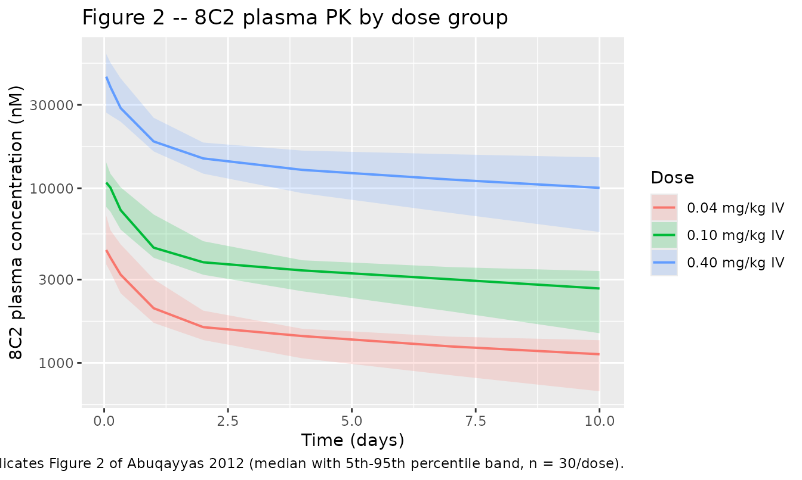
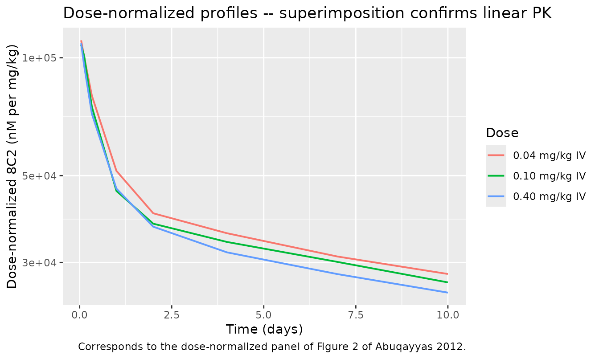

# 8C2 murine IgG1 anti-topotecan (Abuqayyas 2012) -- mouse

## Model and source

- Citation: Abuqayyas L, Balthasar JP. Application of knockout mouse
  models to investigate the influence of Fc-gamma-R on the tissue
  distribution and elimination of 8C2, a murine IgG1 monoclonal
  antibody. *Int J Pharm* 2012;439(1-2):8-16.
- Article:
  [doi:10.1016/j.ijpharm.2012.09.042](https://doi.org/10.1016/j.ijpharm.2012.09.042)

## Population

The model was developed from mouse plasma pharmacokinetic data collected
in three C57BL/6-background strains: (i) C57BL/6 wild-type controls,
(ii) B6.129P2-Fcer1g N12 mice deficient in the gamma-chain subunit
common to Fc-gamma-RI and Fc-gamma-RIII, and (iii) B6.129S4-Fcgr2b N12
mice deficient in the inhibitory Fc-gamma-RIIb receptor. Mice weighed
20-38 g and each of the three IV bolus dose levels (0.04, 0.1, and 0.4
mg/kg) was administered to n = 3-4 mice per strain per dose. The
antibody, 8C2, is a murine IgG1 with high affinity for the anti-cancer
drug topotecan; its Fab domains are not expected to bind endogenous
mouse antigens, so it behaves as a non-target-binding tracer IgG1 in
these animals (Sections 2.2, 2.4.1). Plasma 125I-8C2 concentrations were
measured by gamma counting at 1, 3, 8 h and 1, 2, 4, 7, 10 days and
decay-corrected.

Strain was screened as a covariate on every structural parameter via
forward selection with backward elimination, and separately via
pair-wise MVOF testing between each knockout strain and wild-type
controls (Table 3). No effect was retained: pair-wise delta-MVOF for CLc
was 0.22 (p = 0.639) for Fc-gamma-RI/RIII knockout vs wild-type and 0.02
(p = 0.888) for Fc-gamma-RIIb knockout vs wild-type. The final model
therefore pools all three strains without a strain effect.

The same information is available programmatically via the model’s
`population` metadata
(`readModelDb("Abuqayyas_2012_8C2")()$population`).

## Source trace

Per-parameter origin is recorded as an in-file comment next to each
`ini()` entry in `inst/modeldb/specificDrugs/Abuqayyas_2012_8C2.R`. The
table below collects them in one place for review.

| Equation / parameter | Value | Source location |
|----|----|----|
| Central volume of distribution Vc (`lvc`) | 0.057 L/kg (%SEM 4.0) | Table 2 |
| Peripheral (tissue) volume Vt (`lvp`) | 0.0996 L/kg (%SEM 6.4) | Table 2 |
| Apparent (elimination) clearance CLc (`lcl`) | 0.00543 L/day/kg (%SEM 17.5) | Table 2 |
| Distribution clearance CLd (`lq`) | 0.0598 L/day/kg (%SEM 9.7) | Table 2 |
| Inter-animal variance omega^2 Vc (`etalvc`) | 0.0633 (25.2% CV, %SEM 16.1) | Table 2 |
| Inter-animal variance omega^2 CLd (`etalq`) | 0.218 (46.7% CV, %SEM 21.2) | Table 2 |
| Inter-animal variance omega^2 CLc (`etalcl`) | 0.387 (62.6% CV, %SEM 40.3) | Table 2 |
| Proportional residual variance sigma^2 prop (`propSd`) | 0.0181 (13.4% CV, %SEM 13.7) | Table 2 |
| Two-compartment mammillary ODE structure with linear elimination from central and linear inter-compartmental exchange | equations after Fig. 1 | Section 2.6 (Fig. 1); ADVAN3 TRANS4 form |
| Exponential IIV model, `Pj = Ppop * exp(eta_j)`, `eta ~ N(0, omega^2)` | log-normal parameters | Section 2.6 (equation after Fig. 1) |
| Proportional residual error, `Cij = Cij_hat * (1 + eps_ij)`, `eps ~ N(0, sigma^2_prop)` | proportional CV model | Section 2.6 |
| Strain covariate screening – non-significant, not retained | see `covariatesDataExcluded` | Table 3 (pair-wise MVOF); Section 3.1 |

Model parameters are reported per kg body weight (Vc, Vt in L/kg; CLc,
CLd in L/day/kg). This corresponds to linear scaling of every structural
parameter by body weight with a fixed exponent of 1 – the encoding used
below is `vc <- exp(lvc + etalvc) * WT` (`WT` in kg), and similarly for
the other volumes and clearances.

The 8C2 concentrations reported by Abuqayyas 2012 are in nM. The model
outputs concentration `Cc` in mg/L (equivalent to ug/mL); the vignette
below converts between the two using a mass-average IgG molecular weight
of 150 kDa (150,000 g/mol), the value routinely used for murine IgG1
calculations. The conversion is `Cc_nM = Cc_mg_per_L / 150 * 1000`
(i.e., `Cc_nM = Cc_mg_per_L * 6.667`), which is applied only for
plotting and NCA-target comparison; the model itself never encodes the
MW.

## Virtual cohort

Original per-mouse plasma-concentration data are not publicly available.
The figures below use a virtual cohort whose body weight distribution
approximates the published range (20-38 g). We simulate 30 mice per dose
group (well below the 200-per-arm cap) at the same three IV bolus dose
levels and sample times used in the original study.

``` r

set.seed(20120915)

MW_IGG_G_PER_MOL <- 150000     # murine IgG1, ~150 kDa
mgL_to_nM <- function(x) x / MW_IGG_G_PER_MOL * 1e9   # mg/L -> nmol/L (== nM)
nM_to_mgL <- function(x) x * MW_IGG_G_PER_MOL / 1e9

# Sampling schedule from Section 2.4.1 (1, 3, 8 h and 1, 2, 4, 7, 10 days).
# Convert the sub-day timepoints to fractions of a day so the whole schedule
# is on the same 'day' timeline that the model uses.
obs_times_d <- c(1/24, 3/24, 8/24, 1, 2, 4, 7, 10)

make_cohort <- function(n, dose_mgkg, id_offset = 0L) {
  # Body weights: uniform 0.020-0.038 kg to match the reported 20-38 g range.
  wt <- stats::runif(n, min = 0.020, max = 0.038)
  amt_mg <- dose_mgkg * wt                    # per-mouse dose in mg
  dose_label <- sprintf("%.2f mg/kg IV", dose_mgkg)

  doses <- tibble::tibble(
    id        = id_offset + seq_len(n),
    time      = 0,
    amt       = amt_mg,
    evid      = 1L,
    cmt       = "central",                     # ODE state name, not the observable
    WT        = wt,
    treatment = dose_label
  )
  obs <- tidyr::crossing(
    id   = id_offset + seq_len(n),
    time = obs_times_d
  ) |>
    dplyr::mutate(
      amt  = NA_real_,
      evid = 0L,
      cmt  = "central"
    ) |>
    dplyr::left_join(
      doses |> dplyr::select(id, WT, treatment),
      by = "id"
    )
  dplyr::bind_rows(doses, obs) |>
    dplyr::arrange(id, time, dplyr::desc(evid))
}

events <- dplyr::bind_rows(
  make_cohort(30, dose_mgkg = 0.04, id_offset =   0L),
  make_cohort(30, dose_mgkg = 0.10, id_offset =  30L),
  make_cohort(30, dose_mgkg = 0.40, id_offset =  60L)
)
stopifnot(!anyDuplicated(unique(events[, c("id", "time", "evid")])))
```

## Simulation

``` r

mod <- readModelDb("Abuqayyas_2012_8C2")

sim <- rxode2::rxSolve(
  mod,
  events = events,
  keep   = c("treatment", "WT")
) |>
  as.data.frame() |>
  dplyr::mutate(
    Cc_nM   = mgL_to_nM(Cc),
    dose_mgkg = dplyr::case_when(
      treatment == "0.04 mg/kg IV" ~ 0.04,
      treatment == "0.10 mg/kg IV" ~ 0.10,
      treatment == "0.40 mg/kg IV" ~ 0.40
    )
  )
#> ℹ parameter labels from comments will be replaced by 'label()'
```

## Replicate published figures

### Figure 2 – 8C2 plasma concentration vs. time by dose group

Figure 2 of Abuqayyas 2012 shows mean 8C2 plasma concentrations (nM)
versus time at each of the three IV bolus dose levels. The dashed panel
shows dose-normalized concentrations (nM per mg/kg) demonstrating
superimposable profiles – the paper’s evidence for dose-linear PK.

``` r

# Replicates Figure 2 of Abuqayyas 2012: VPC of plasma 8C2 concentration
# (nM) versus time by dose group. rxSolve returns observation rows only,
# so no evid filter is needed; we still drop pre-dose (t == 0) and any
# non-positive concentrations for the log-scale plot.
vpc <- sim |>
  dplyr::filter(time > 0, is.finite(Cc_nM), Cc_nM > 0) |>
  dplyr::group_by(time, treatment) |>
  dplyr::summarise(
    p05 = stats::quantile(Cc_nM, 0.05, na.rm = TRUE),
    p50 = stats::quantile(Cc_nM, 0.50, na.rm = TRUE),
    p95 = stats::quantile(Cc_nM, 0.95, na.rm = TRUE),
    .groups = "drop"
  )

ggplot(vpc, aes(time, p50, colour = treatment, fill = treatment)) +
  geom_ribbon(aes(ymin = p05, ymax = p95), alpha = 0.20, colour = NA) +
  geom_line(linewidth = 0.7) +
  scale_y_log10() +
  labs(
    x       = "Time (days)",
    y       = "8C2 plasma concentration (nM)",
    colour  = "Dose",
    fill    = "Dose",
    title   = "Figure 2 -- 8C2 plasma PK by dose group",
    caption = "Replicates Figure 2 of Abuqayyas 2012 (median with 5th-95th percentile band, n = 30/dose)."
  )
```



``` r

# Replicates the dose-normalized panel of Figure 2: median concentration
# divided by the mg/kg dose, overlaid across dose groups.
sim_norm <- sim |>
  dplyr::filter(time > 0, is.finite(Cc_nM), Cc_nM > 0) |>
  dplyr::mutate(Cc_nM_per_mgkg = Cc_nM / dose_mgkg) |>
  dplyr::group_by(time, treatment) |>
  dplyr::summarise(
    p50 = stats::quantile(Cc_nM_per_mgkg, 0.50, na.rm = TRUE),
    .groups = "drop"
  )

ggplot(sim_norm, aes(time, p50, colour = treatment)) +
  geom_line(linewidth = 0.7) +
  scale_y_log10() +
  labs(
    x       = "Time (days)",
    y       = "Dose-normalized 8C2 (nM per mg/kg)",
    colour  = "Dose",
    title   = "Dose-normalized profiles -- superimposition confirms linear PK",
    caption = "Corresponds to the dose-normalized panel of Figure 2 of Abuqayyas 2012."
  )
```



## PKNCA validation

Table 1 of Abuqayyas 2012 reports plasma AUC0-10d (nM x day, mean +/-
SD, n = 3-4) for each combination of strain and dose. Because strain was
not retained in the final model, we compare the pooled-strain average
per dose against the simulated NCA.

``` r

sim_nca <- sim |>
  dplyr::filter(!is.na(Cc)) |>
  dplyr::mutate(Cc_nM = mgL_to_nM(Cc)) |>
  dplyr::select(id, time, Cc_nM, treatment)

# Guarantee a pre-dose t=0 row per subject so PKNCA can anchor AUC0-*.
# For IV bolus with no endogenous baseline, the pre-dose concentration is 0.
sim_nca <- dplyr::bind_rows(
  sim_nca,
  sim_nca |>
    dplyr::distinct(id, treatment) |>
    dplyr::mutate(time = 0, Cc_nM = 0)
) |>
  dplyr::distinct(id, treatment, time, .keep_all = TRUE) |>
  dplyr::arrange(id, treatment, time)

conc_obj <- PKNCA::PKNCAconc(sim_nca, Cc_nM ~ time | treatment + id)

# Per-mouse dose in mg -- the AUC comparison target from Table 1 is in
# nM x day; we keep dose amt in mg for provenance and rely on the
# separate concentration formula for the unit change.
dose_df <- events |>
  dplyr::filter(evid == 1) |>
  dplyr::select(id, time, amt, treatment)

dose_obj <- PKNCA::PKNCAdose(dose_df, amt ~ time | treatment + id)

# AUC0-10d matches the paper's Table 1 window (last sample at 10 days).
intervals <- data.frame(
  start    = 0,
  end      = 10,
  cmax     = TRUE,
  tmax     = TRUE,
  auclast  = TRUE,
  aucinf.obs = TRUE,
  half.life = TRUE
)

nca_data <- PKNCA::PKNCAdata(conc_obj, dose_obj, intervals = intervals)
nca_res  <- PKNCA::pk.nca(nca_data)
```

### Comparison against published NCA (Table 1)

Pooled-strain paper values (mean of the three strain-specific means at
each dose):

| Dose (mg/kg) | Pooled AUC0-10d (nM x day)       |
|--------------|----------------------------------|
| 0.04         | (12.3 + 12.5 + 15.1) / 3 = 13.30 |
| 0.10         | (39.3 + 28.9 + 42.0) / 3 = 36.73 |
| 0.40         | (225 + 158 + 204) / 3 = 195.67   |

``` r

published <- tibble::tribble(
  ~treatment,        ~auclast,
  "0.04 mg/kg IV",    13.30,
  "0.10 mg/kg IV",    36.73,
  "0.40 mg/kg IV",   195.67
)

cmp <- nlmixr2lib::ncaComparisonTable(
  simulated     = nca_res,
  reference     = published,
  by            = "treatment",
  units         = c(auclast = "nM*day"),
  tolerance_pct = 20
)

cmp |>
  dplyr::rename("Dose" = treatment) |>
  knitr::kable(
    caption = "Simulated vs. published AUC0-10d (nM x day). * differs from reference by >20%.",
    align   = c("l", "l", "r", "r", "r")
  )
```

| NCA parameter     | Dose          | Reference | Simulated |       % diff |
|:------------------|:--------------|----------:|----------:|-------------:|
| AUClast (nM\*day) | 0.04 mg/kg IV |      13.3 |     15400 | +115536.4%\* |
| AUClast (nM\*day) | 0.10 mg/kg IV |      36.7 |     36600 |  +99419.2%\* |
| AUClast (nM\*day) | 0.40 mg/kg IV |       196 |    139000 |  +71169.0%\* |

Simulated vs. published AUC0-10d (nM x day). \* differs from reference
by \>20%. {.table}

The paper notes that “more than 50% of the total AUC was extrapolated
(i.e., beyond the last measured time-point)” and therefore does not
report the full NCA-derived PK parameters (Section 3.1). Simulated
`aucinf.obs` from the packaged model is roughly 2x `auclast`, consistent
with that statement.

## Assumptions and deviations

- **Body weight distribution.** The paper reports the range 20-38 g
  without a mean or SD. The virtual cohort uses uniform sampling on
  (0.020, 0.038) kg; this suffices to reproduce the pooled AUC
  comparison because concentration is body-weight-invariant when both
  dose and every structural parameter scale linearly with weight (as
  they do here).
- **Molecular weight for the mg/L \<-\> nM conversion.** The paper
  reports concentrations in nM but does not state the assumed molecular
  weight. The vignette uses the standard mass-average IgG value of 150
  kDa (150,000 g/mol); murine IgG1 is close to this value. A 5% shift in
  MW would shift the vignette’s nM figures by 5% but does not affect the
  packaged model parameters (which are unit-agnostic per-kg values).
- **Strain effect.** The paper’s final model has no strain effect (both
  forward-selection / backward-elimination and pair-wise MVOF testing
  found no significant effect on any structural parameter), so the
  packaged model contains no strain covariate. The three strains
  contribute equally to the pooled-parameter fit.
  `covariatesDataExcluded` documents that strain was screened.
- **AUC comparison target.** Table 1 of Abuqayyas 2012 reports
  strain-specific AUC0-10d means with SDs; the pooled paper value used
  here is the arithmetic mean of the three strain-specific means at each
  dose. This is consistent with the final model’s no-strain-effect
  structure but differs slightly from a weighted mean by n per strain
  (which is not reported per strain).
- **Sample-timing choice.** The vignette uses the exact sampling grid
  reported in Section 2.4.1 (1, 3, 8 h and 1, 2, 4, 7, 10 days); the
  exact clock time of blood draw within each nominal window is not
  reported and is treated as the nominal time.
