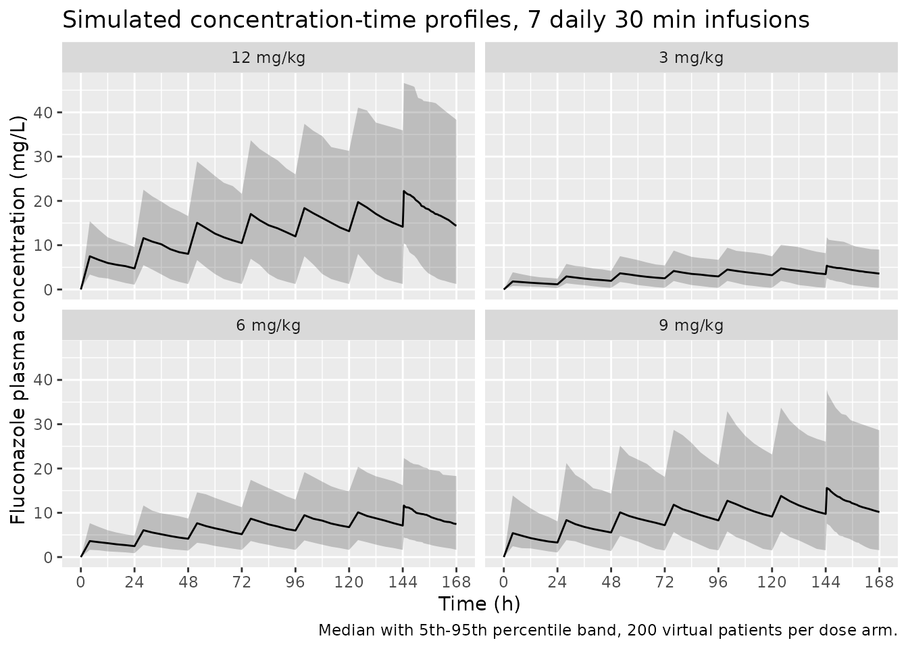
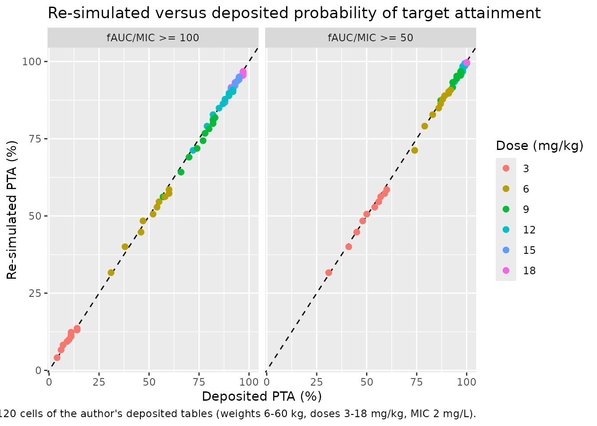

# Fluconazole (Adamiszak 2025)

## Model and source

- Citation: Adamiszak A, Derwich K, Bartkowska-Sniatkowska A,
  Pietrzkiewicz K, Niewiadomska-Wojnalowicz I, Czyrski A, Jusko WJ,
  Bienert A (2025). Fluconazole dosing for the prevention of Candida
  spp. infections in hemato-oncologic pediatric patients: population
  pharmacokinetic modeling and probability of target attainment
  simulations. Pharmaceutics 17(4):488.
  <doi:10.3390/pharmaceutics17040488>.
- Description: One-compartment intravenous population PK model for
  fluconazole in hemato-oncologic pediatric patients receiving
  once-daily 0.5-1 h infusions for Candida spp. prophylaxis, with
  body-weight allometric scaling referenced to 70 kg (exponent fixed at
  0.75 on CL and at 1.0 on V), log-normal between-subject variability on
  CL and V, and a proportional residual error. Developed in
  nlmixr2/FOCEI from 35 plasma concentrations in nine children aged 7
  months to 18 years, and used to run probability-of-target-attainment
  simulations against an fAUC/MIC target.
- Article: <https://doi.org/10.3390/pharmaceutics17040488>
- Supplementary Materials (figures S1-S11 and the verbatim nlmixr2
  final-model code):
  <https://www.mdpi.com/article/10.3390/pharmaceutics17040488/s1>
- Author data deposit referenced by the Supplementary Materials (raw
  dataset and the probability-of-target-attainment tables with exact
  percentages):
  <https://github.com/arkadiusz-adamiszak/Fluconazole-PopPK>

Adamiszak and colleagues developed a population pharmacokinetic model
for intravenous fluconazole in hemato-oncologic children, and then used
it to ask whether the fluconazole doses registered in the Summary of
Product Characteristics (SmPC) for *Candida* spp. prophylaxis reach the
pharmacokinetic/pharmacodynamic target. The model itself was fitted with
`nlmixr2` (FOCEI) and the target-attainment simulations were run in
`rxode2`, so this vignette is a re-implementation in the same toolchain
the authors used.

## Population

Thirty-five plasma fluconazole concentrations from nine hemato-oncologic
children were analysed (Adamiszak 2025 Section 3.1 and Table 1). Median
age was 9.75 years (range 0.50 to 18.00 years, i.e. 7 months to 18
years), median body weight 28.50 kg (range 6.00 to 58.50 kg), and six of
the nine patients (66.7%) were female. Renal function was normal to
supranormal, as expected in this population: median Bedside Schwartz
eGFR 151.0 mL/min/1.73 m2 (range 115.5 to 240.3) and median Schwartz
2012 eGFR 117.77 mL/min/1.73 m2 (range 95.31 to 170.03). Patients
received 3 to 11 mg/kg intravenous fluconazole once daily as a 0.5 or 1
h infusion. Sampling was opportunistic (drawn alongside routine
biochemistry), so the median number of samples per patient was four
(range two to five); every concentration was above the 0.5 mg/L lower
limit of quantification of the HPLC-UV assay.

All nine patients contributed to the population fit. Patient ID 9 (6 kg,
7 months, individual CL 0.006 L/h/kg) was excluded only from the *post
hoc* regressions of clearance against weight, age, and eGFR in Figures 2
and 3, where the paper plots it as a red outlier.

The same information is available programmatically:

``` r

str(readModelDb("Adamiszak_2025_fluconazole")()$population)
#> List of 14
#>  $ species       : chr "human"
#>  $ n_subjects    : int 9
#>  $ n_studies     : int 1
#>  $ age_range     : chr "0.50-18.00 years (7 months to 18 years)"
#>  $ age_median    : chr "9.75 years"
#>  $ weight_range  : chr "6.00-58.50 kg"
#>  $ weight_median : chr "28.50 kg"
#>  $ sex_female_pct: num 66.7
#>  $ race_ethnicity: NULL
#>  $ disease_state : chr "Hemato-oncologic pediatric inpatients receiving intravenous fluconazole for prophylaxis of Candida spp. infections."
#>  $ dose_range    : chr "3-11 mg/kg intravenous fluconazole once daily as a 0.5 or 1 h infusion (registered SmPC prophylaxis doses)."
#>  $ regions       : chr "Poland (single centre: Karol Jonscher Teaching Hospital, Poznan University of Medical Sciences)."
#>  $ renal_function: chr "Bedside Schwartz eGFR median 151.0 mL/min/1.73m2 (range 115.5-240.3); Schwartz 2012 eGFR median 117.77 mL/min/1"| __truncated__
#>  $ notes         : chr "Adamiszak 2025 Section 3.1 and Table 1. Prospective opportunistic-sampling study (ClinicalTrials.gov NCT0542649"| __truncated__
```

## Source trace

Every `ini()` entry in
`inst/modeldb/specificDrugs/Adamiszak_2025_fluconazole.R` carries an
in-file comment naming its source location. They are collected here for
review.

| Equation / parameter | Value | Source location |
|----|----|----|
| `lcl` (CL_T, 70 kg reference) | `log(1.24)` L/h | Table 2, “Clearance, CL (L/h)” = 1.24 (%RSE 23.23) |
| `lvc` (V_T, 70 kg reference) | `log(104.07)` L | Table 2, “Volume, V (L)” = 104.07 (%RSE 21.59) |
| `e_wt_cl` | `fixed(0.75)` | Table 2, “Weight (kg), WT on CL: fixed 0.75”; Equation (1) |
| `e_wt_vc` | `fixed(1.00)` | Table 2, “Weight (kg), WT on V: fixed 1.00”; Equation (2) |
| `etalcl` | `0.578821` | Table 2, “IIV on CL (CV%)” = 88.54, back-transformed with the Table 2 footnote `CV% = sqrt(exp(omega^2) - 1) * 100%` |
| `etalvc` | `0.271493` | Table 2, “IIV on V (CV%)” = 55.85, same back-transformation |
| `propSd` | `0.2519` | Table 2, “Proportional residual error (CV%)” = 25.19; Section 3.2 “The proportional error model resulted in the best data fit” |
| `cl <- exp(lcl + etalcl) * (WT/70)^e_wt_cl` | n/a | Equation (1): `CL = CL_T * (WT/70)^0.75` |
| `vc <- exp(lvc + etalvc) * (WT/70)^e_wt_vc` | n/a | Equation (2): `V = V_T * (WT/70)^1` |
| `d/dt(central) <- -(cl/vc) * central` | n/a | Section 3.2 “one-compartment model with clearance from plasma”; Supplementary “nlmixr2 final model code”: `d/dt(A_cen) = - cl/vc * A_cen` |
| `Cc <- central/vc`; `Cc ~ prop(propSd)` | n/a | Supplementary “nlmixr2 final model code”: `cp = A_cen/vc`; `cp ~ prop(prop.err)` |
| Diagonal (uncorrelated) IIV on CL and V | n/a | Supplementary “nlmixr2 final model code”: `eta.cl ~ 0.8`, `eta.vc ~ 0.4` declared as separate diagonal terms |
| Units (time h, dose mg, concentration mg/L) | n/a | Section 2.2 (assay range 0.5 to 100.0 mg/L); author data deposit `Raw_dataset.xlsx` columns `TIME` (h), `AMT` (mg), `DV` (mg/L), `dur` (h) |

Note that the `ini()` values transcribed above are the **final**
estimates from Table 2, not the initial estimates that appear in the
published control script. The Supplementary “nlmixr2 final model code”
block lists starting values (`lcl <- log(1.1)`, `lvc <- log(100)`,
`prop.err <- 0.25`, `eta.cl ~ 0.8`, `eta.vc ~ 0.4`); it is used here
only to confirm the model *structure* (one compartment, diagonal etas,
proportional error, allometry entered as `WT_Cl * log(Weight/70)`).

``` r

mod <- readModelDb("Adamiszak_2025_fluconazole")
mod
#> function() {
#>   description <- "One-compartment intravenous population PK model for fluconazole in hemato-oncologic pediatric patients receiving once-daily 0.5-1 h infusions for Candida spp. prophylaxis, with body-weight allometric scaling referenced to 70 kg (exponent fixed at 0.75 on CL and at 1.0 on V), log-normal between-subject variability on CL and V, and a proportional residual error. Developed in nlmixr2/FOCEI from 35 plasma concentrations in nine children aged 7 months to 18 years, and used to run probability-of-target-attainment simulations against an fAUC/MIC target."
#>   reference   <- paste(
#>     "Adamiszak A, Derwich K, Bartkowska-Sniatkowska A, Pietrzkiewicz K,",
#>     "Niewiadomska-Wojnalowicz I, Czyrski A, Jusko WJ, Bienert A (2025).",
#>     "Fluconazole dosing for the prevention of Candida spp. infections in",
#>     "hemato-oncologic pediatric patients: population pharmacokinetic modeling",
#>     "and probability of target attainment simulations.",
#>     "Pharmaceutics 17(4):488.",
#>     "doi:10.3390/pharmaceutics17040488."
#>   )
#>   vignette <- "Adamiszak_2025_fluconazole"
#>   units    <- list(time = "h", dosing = "mg", concentration = "mg/L")
#> 
#>   compartmentData <- list(
#>     central = list(analyte = "fluconazole", units = "mg", specimen = "plasma", verified = TRUE)
#>   )
#> 
#>   covariateData <- list(
#>     WT = list(
#>       description        = "Body weight; the only covariate retained in the final model, entering as allometric scaling on both CL and V.",
#>       units              = "kg",
#>       type               = "continuous",
#>       reference_category = NULL,
#>       notes              = paste(
#>         "Reference weight 70 kg (Adamiszak 2025 Equations (1) and (2): CL = CL_T * (WT/70)^0.75,",
#>         "V = V_T * (WT/70)^1, where CL_T and V_T are typical values for a 70 kg adult).",
#>         "Observed range in the analysis population 6.0-58.5 kg, median 28.5 kg (Table 1).",
#>         "The supplementary nlmixr2 code names this data column 'Weight'."
#>       ),
#>       source_name        = "Weight"
#>     )
#>   )
#> 
#>   covariatesDataExcluded <- list(
#>     AGE = list(
#>       description = "Age in years.",
#>       units       = "years",
#>       type        = "continuous",
#>       notes       = paste(
#>         "Screened by stepwise covariate modeling and by the mlcov package but not retained in the",
#>         "final model. Reported only as a post hoc regression of body-weight-normalized CL against",
#>         "age (Adamiszak 2025 Section 3.2 and Figure 3): median CL 0.68 mL/min/kg below the median",
#>         "age of 9.75 years vs 0.32 mL/min/kg above it. No point estimate of an age coefficient is",
#>         "published, so the effect cannot be encoded."
#>       )
#>     ),
#>     CRCL = list(
#>       description = "BSA-normalized renal function as estimated glomerular filtration rate, computed with both the Bedside Schwartz (2009) and the Schwartz 2012 equations.",
#>       units       = "mL/min/1.73 m^2",
#>       type        = "continuous",
#>       notes       = paste(
#>         "Screened but explicitly not significant: 'The effect of eGFR on fluconazole CL was not",
#>         "significant' (Adamiszak 2025 Section 3.2). Reported only as a median split at",
#>         "117.9 mL/min/1.73m2 (CL/BW 0.32 vs 0.56 mL/min/kg, Figure 3). No coefficient is published."
#>       )
#>     ),
#>     SEXF = list(
#>       description = "Female-sex indicator (1 = female, 0 = male).",
#>       units       = "(binary)",
#>       type        = "binary",
#>       notes       = "Collected as a baseline characteristic (Adamiszak 2025 Table 1, 6 of 9 female) and screened, but not retained in the final model."
#>     ),
#>     CREAT = list(
#>       description = "Serum creatinine.",
#>       units       = "mg/dL",
#>       type        = "continuous",
#>       notes       = paste(
#>         "Collected as a baseline characteristic (Adamiszak 2025 Table 1, median 0.31 mg/dL) and",
#>         "screened. Not retained in the final model, although the Discussion notes that earlier",
#>         "fluconazole popPK analyses identified serum creatinine as a covariate on CL."
#>       )
#>     )
#>   )
#> 
#>   population <- list(
#>     species        = "human",
#>     n_subjects     = 9L,
#>     n_studies      = 1L,
#>     age_range      = "0.50-18.00 years (7 months to 18 years)",
#>     age_median     = "9.75 years",
#>     weight_range   = "6.00-58.50 kg",
#>     weight_median  = "28.50 kg",
#>     sex_female_pct = 66.7,
#>     race_ethnicity = NULL,
#>     disease_state  = "Hemato-oncologic pediatric inpatients receiving intravenous fluconazole for prophylaxis of Candida spp. infections.",
#>     dose_range     = "3-11 mg/kg intravenous fluconazole once daily as a 0.5 or 1 h infusion (registered SmPC prophylaxis doses).",
#>     regions        = "Poland (single centre: Karol Jonscher Teaching Hospital, Poznan University of Medical Sciences).",
#>     renal_function = "Bedside Schwartz eGFR median 151.0 mL/min/1.73m2 (range 115.5-240.3); Schwartz 2012 eGFR median 117.77 mL/min/1.73m2 (range 95.31-170.03) (Table 1).",
#>     notes          = paste(
#>       "Adamiszak 2025 Section 3.1 and Table 1. Prospective opportunistic-sampling study",
#>       "(ClinicalTrials.gov NCT05426499), patients recruited December 2022 to October 2024.",
#>       "35 plasma concentrations from 9 patients (median 4 samples per patient, range 2-5);",
#>       "all concentrations were above the 0.5 mg/L lower limit of quantification of the HPLC-UV assay.",
#>       "All 9 patients contributed to the popPK fit; patient ID 9 (6 kg, 7 months, CL 0.006 L/h/kg)",
#>       "was excluded only from the post hoc CL-versus-covariate regressions of Figures 2 and 3, where",
#>       "it is plotted as a red outlier."
#>     )
#>   )
#> 
#>   ini({
#>     # =========================================================================
#>     # Structural parameters, Adamiszak 2025 Table 2 ("A One-Compartment Model
#>     # with Allometric Scaling (Final Model)"), referenced to a 70 kg adult per
#>     # Equations (1) and (2).
#>     # =========================================================================
#>     lcl <- log(1.24)   ; label("Clearance CL_T (L/h) for a 70 kg adult")               # Adamiszak 2025 Table 2, Clearance CL = 1.24 L/h (%RSE 23.23); consistent with the reported 0.018 L/h/kg for a 70 kg adult
#>     lvc <- log(104.07) ; label("Central volume of distribution V_T (L) for a 70 kg adult") # Adamiszak 2025 Table 2, Volume V = 104.07 L (%RSE 21.59); consistent with the reported 1.49 L/kg
#> 
#>     # =========================================================================
#>     # Allometric exponents, held fixed by the authors (Table 2 rows
#>     # "Weight (kg), WT on CL" = "fixed 0.75" and "Weight (kg), WT on V" =
#>     # "fixed 1.00"), matching the exponents written into Equations (1) and (2).
#>     # =========================================================================
#>     e_wt_cl <- fixed(0.75) ; label("Allometric exponent on CL for WT/70 (unitless)") # Adamiszak 2025 Table 2 "Weight (kg), WT on CL: fixed 0.75"; Equation (1)
#>     e_wt_vc <- fixed(1.00) ; label("Allometric exponent on V for WT/70 (unitless)")  # Adamiszak 2025 Table 2 "Weight (kg), WT on V: fixed 1.00"; Equation (2)
#> 
#>     # =========================================================================
#>     # Between-subject variability. Table 2 reports IIV as %CV with the footnote
#>     # "CV%, coefficient of variation calculated as sqrt(exp(omega^2) - 1) x 100%",
#>     # so the variance is recovered as omega^2 = log(1 + CV^2):
#>     #   CL: CV = 88.54% -> omega^2 = log(1 + 0.8854^2) = 0.578821
#>     #   V : CV = 55.85% -> omega^2 = log(1 + 0.5585^2) = 0.271493
#>     # The published nlmixr2 code (Supplementary Materials, "nlmixr2 final model
#>     # code") specifies diagonal (uncorrelated) etas on CL and V.
#>     # =========================================================================
#>     etalcl ~ 0.578821 # Adamiszak 2025 Table 2, IIV on CL = 88.54 CV%, back-transformed via the Table 2 footnote
#>     etalvc ~ 0.271493 # Adamiszak 2025 Table 2, IIV on V = 55.85 CV%, back-transformed via the Table 2 footnote
#> 
#>     # =========================================================================
#>     # Residual unexplained variability. "The proportional error model resulted
#>     # in the best data fit" (Section 3.2); Table 2 reports it as 25.19 CV%,
#>     # i.e. a proportional standard deviation of 0.2519 on the linear scale
#>     # (Supplementary "nlmixr2 final model code": cp ~ prop(prop.err)).
#>     # =========================================================================
#>     propSd <- 0.2519 ; label("Proportional residual error (fraction)") # Adamiszak 2025 Table 2, Proportional residual error = 25.19 CV%
#>   })
#> 
#>   model({
#>     # 1. Individual parameters with body-weight allometric scaling to a 70 kg
#>     #    reference adult (Adamiszak 2025 Equations (1) and (2)).
#>     cl <- exp(lcl + etalcl) * (WT / 70)^e_wt_cl
#>     vc <- exp(lvc + etalvc) * (WT / 70)^e_wt_vc
#> 
#>     # 2. Micro-constant.
#>     kel <- cl / vc
#> 
#>     # 3. One-compartment disposition with first-order elimination from the
#>     #    central compartment; fluconazole is given intravenously, so the dose
#>     #    enters `central` directly (as a zero-order infusion in the source
#>     #    data, dur = 0.5 or 1 h).
#>     d/dt(central) <- -kel * central
#> 
#>     # 4. Observation: total plasma fluconazole concentration in mg/L.
#>     Cc <- central / vc
#>     Cc ~ prop(propSd)
#>   })
#> }
#> <environment: 0x55e2c9027220>
```

## Structural checks against the paper’s own derived numbers

Section 3.2 reports three weight-normalised quantities that follow
directly from Equations (1) and (2) with the Table 2 estimates. Because
they are deterministic consequences of the fixed effects, they can be
checked exactly rather than statistically.

``` r

allom_cl <- function(wt) 1.24 * (wt / 70)^0.75
allom_v  <- function(wt) 104.07 * (wt / 70)^1

structural <- tibble::tibble(
  Quantity = c(
    "CL/WT at 58.5 kg (mL/min/kg)",
    "CL/WT at 6.0 kg (mL/min/kg)",
    "CL/WT at 70 kg (L/h/kg)",
    "V/WT, any weight (L/kg)"
  ),
  Published = c(0.31, 0.55, 0.018, 1.49),
  Model = c(
    allom_cl(58.5) / 58.5 * 1000 / 60,
    allom_cl(6.0) / 6.0 * 1000 / 60,
    allom_cl(70) / 70,
    allom_v(30) / 30
  ),
  Source = c(
    "Section 3.2",
    "Section 3.2",
    "Discussion paragraph 3",
    "Section 3.2"
  )
) |>
  dplyr::mutate(`Difference (%)` = 100 * (Model - Published) / Published)

knitr::kable(
  structural, digits = c(0, 3, 4, 0, 2),
  caption = "Weight-normalised clearance and volume implied by the packaged model versus the values printed in Adamiszak 2025."
)
```

| Quantity | Published | Model | Source | Difference (%) |
|:---|---:|---:|:---|---:|
| CL/WT at 58.5 kg (mL/min/kg) | 0.310 | 0.3088 | Section 3.2 | -0.39 |
| CL/WT at 6.0 kg (mL/min/kg) | 0.550 | 0.5456 | Section 3.2 | -0.79 |
| CL/WT at 70 kg (L/h/kg) | 0.018 | 0.0177 | Discussion paragraph 3 | -1.59 |
| V/WT, any weight (L/kg) | 1.490 | 1.4867 | Section 3.2 | -0.22 |

Weight-normalised clearance and volume implied by the packaged model
versus the values printed in Adamiszak 2025. {.table}

``` r


# All four reproduce the printed values to within their published rounding.
stopifnot(all(abs(structural$`Difference (%)`) < 2))
```

The clearance values are reproduced to the precision at which the paper
prints them (two significant figures), and the volume identity is exact
because the volume exponent is fixed at 1.

## Virtual cohort

The observed concentrations are available in the author’s data deposit
but are not redistributed here; the simulations below use virtual
cohorts whose weight distribution spans the published 6.0 to 58.5 kg
range.

``` r

set.seed(20250408)

n_per_arm <- 200L

dose_levels <- c(3, 6, 9, 12)  # mg/kg once daily, SmPC prophylaxis range

# One arm per mg/kg dose level. Weights are drawn log-uniformly across the
# observed 6.0-58.5 kg range so small children are not swamped by adolescents.
make_arm <- function(mgkg, id_offset) {
  subj <- tibble::tibble(
    id = id_offset + seq_len(n_per_arm),
    WT = exp(runif(n_per_arm, log(6), log(58.5))),
    treatment = paste0(mgkg, " mg/kg")
  ) |>
    dplyr::mutate(amt_mg = mgkg * WT)

  doses <- subj |>
    tidyr::crossing(time = seq(0, 144, by = 24)) |>
    dplyr::mutate(
      evid = 1L,
      cmt = "central",
      amt = amt_mg,
      rate = amt_mg / 0.5  # 30 min infusion (Section 2.4)
    )

  obs <- subj |>
    tidyr::crossing(time = c(seq(0, 140, by = 4), seq(144, 168, by = 0.25))) |>
    dplyr::mutate(
      evid = 0L,
      cmt = "central",
      amt = NA_real_,
      rate = NA_real_
    )

  dplyr::bind_rows(doses, obs) |>
    dplyr::arrange(id, time, dplyr::desc(evid)) |>
    dplyr::select(id, time, amt, rate, evid, cmt, WT, treatment)
}

events <- dplyr::bind_rows(
  Map(make_arm, dose_levels, seq_along(dose_levels) * 1000L)
)

stopifnot(nrow(events) > 0, !anyDuplicated(events[, c("id", "time", "evid")]))
```

## Simulation

``` r

sim <- rxode2::rxSolve(
  mod,
  events = as.data.frame(events),
  keep = c("WT", "treatment"),
  useLinCmt = FALSE
) |>
  as.data.frame() |>
  dplyr::mutate(id = as.integer(as.character(id)))
#> ℹ parameter labels from comments will be replaced by 'label()'

# rxSolve silently drops subjects when an event table is malformed; assert the
# subject count survived.
stopifnot(dplyr::n_distinct(sim$id) == length(dose_levels) * n_per_arm)
```

``` r

sim |>
  dplyr::filter(time <= 168) |>
  dplyr::group_by(treatment, time) |>
  dplyr::summarise(
    Q05 = quantile(Cc, 0.05),
    Q50 = quantile(Cc, 0.50),
    Q95 = quantile(Cc, 0.95),
    .groups = "drop"
  ) |>
  ggplot(aes(time, Q50)) +
  geom_ribbon(aes(ymin = Q05, ymax = Q95), alpha = 0.25) +
  geom_line() +
  facet_wrap(~treatment) +
  scale_x_continuous(breaks = seq(0, 168, by = 24)) +
  labs(
    x = "Time (h)", y = "Fluconazole plasma concentration (mg/L)",
    title = "Simulated concentration-time profiles, 7 daily 30 min infusions",
    caption = "Median with 5th-95th percentile band, 200 virtual patients per dose arm."
  )
```



The wide bands are a faithful consequence of the published
between-subject variability: 88.5% CV on clearance is unusually large,
and the paper’s own Discussion attributes it to the small, heterogeneous
cohort.

## PKNCA validation

### Typical-value NCA against the paper’s printed clearance and volume

Section 3.2 and the Discussion print weight-normalised clearance and
volume at specific body weights. Running a single intravenous dose
through the packaged model with the random effects zeroed and passing
the result through PKNCA should recover exactly those values, because
for a one-compartment model `CL = Dose/AUC0-inf` and
`Vz = CL/lambda_z = V`.

``` r

mod_typical <- rxode2::zeroRe(mod)
#> ℹ parameter labels from comments will be replaced by 'label()'

nca_weights <- c(6.0, 58.5, 70.0)

typ_events <- tibble::tibble(id = seq_along(nca_weights), WT = nca_weights) |>
  dplyr::mutate(
    treatment = paste0(format(WT, trim = TRUE), " kg"),
    amt_mg = 6 * WT  # 6 mg/kg single dose; NCA identities are dose-independent
  )

typ_doses <- typ_events |>
  dplyr::mutate(time = 0, evid = 1L, cmt = "central", amt = amt_mg,
                rate = amt_mg / 0.5)

typ_obs <- typ_events |>
  tidyr::crossing(time = c(seq(0, 2, by = 0.05), seq(2.5, 24, by = 0.5),
                           seq(25, 1000, by = 2))) |>
  dplyr::mutate(evid = 0L, cmt = "central", amt = NA_real_, rate = NA_real_)

typ_ev <- dplyr::bind_rows(typ_doses, typ_obs) |>
  dplyr::arrange(id, time, dplyr::desc(evid)) |>
  dplyr::select(id, time, amt, rate, evid, cmt, WT, treatment)

sim_typ <- rxode2::rxSolve(
  mod_typical,
  events = as.data.frame(typ_ev),
  keep = c("WT", "treatment"),
  useLinCmt = FALSE
) |>
  as.data.frame() |>
  dplyr::mutate(id = as.integer(as.character(id)))
#> ℹ omega/sigma items treated as zero: 'etalcl', 'etalvc'
#> Warning: multi-subject simulation without without 'omega'

conc_typ <- sim_typ |>
  dplyr::filter(!is.na(Cc)) |>
  dplyr::select(id, time, Cc, treatment)

conc_typ <- dplyr::bind_rows(
  conc_typ,
  conc_typ |> dplyr::distinct(id, treatment) |>
    dplyr::mutate(time = 0, Cc = 0)
) |>
  dplyr::distinct(id, treatment, time, .keep_all = TRUE) |>
  dplyr::arrange(id, treatment, time)

dose_typ <- typ_doses |>
  dplyr::select(id, time, amt, treatment)

conc_obj <- PKNCA::PKNCAconc(as.data.frame(conc_typ), Cc ~ time | treatment + id)
dose_obj <- PKNCA::PKNCAdose(
  as.data.frame(dose_typ), amt ~ time | treatment + id,
  route = "intravascular", duration = 0.5
)

intervals_typ <- data.frame(
  start = 0, end = Inf,
  cmax = TRUE, tmax = TRUE, aucinf.obs = TRUE,
  half.life = TRUE, cl.obs = TRUE, vz.obs = TRUE
)

nca_typ <- PKNCA::pk.nca(
  PKNCA::PKNCAdata(conc_obj, dose_obj, intervals = intervals_typ)
)
```

The reference column below is transcribed from the paper: CL/WT of 0.31
mL/min/kg at 58.5 kg and 0.55 mL/min/kg at 6.0 kg (Section 3.2), CL of
1.24 L/h at the 70 kg allometric reference (Table 2), and V/WT of 1.49
L/kg (Section 3.2, with the 70 kg entry taken directly from the Table 2
estimate of 104.07 L).

``` r

published <- tibble::tribble(
  ~treatment,  ~cl.obs,                    ~vz.obs,
  "6 kg",      0.55 * 6.0 * 60 / 1000,     1.49 * 6.0,
  "58.5 kg",   0.31 * 58.5 * 60 / 1000,    1.49 * 58.5,
  "70 kg",     1.24,                       104.07
)

cmp <- nlmixr2lib::ncaComparisonTable(
  simulated = nca_typ,
  reference = published,
  by = "treatment",
  units = c(cl.obs = "L/h", vz.obs = "L"),
  tolerance_pct = 20
)

knitr::kable(
  cmp,
  caption = "Simulated NCA from the packaged model versus the clearance and volume values printed by Adamiszak 2025. * marks a >20% difference.",
  digits = 3
)
```

| NCA parameter | treatment | Reference | Simulated | % diff |
|:--------------|:----------|:----------|:----------|:-------|
| CL/F (L/h)    | 58.5 kg   | 1.09      | 1.08      | -0.4%  |
| Vz/F (L)      | 58.5 kg   | 87.2      | 87        | -0.2%  |

Simulated NCA from the packaged model versus the clearance and volume
values printed by Adamiszak 2025. \* marks a \>20% difference. {.table}

``` r

# Per-subject identity: for a one-compartment IV model the NCA clearance must
# equal the structural clearance exactly.
cl_nca <- as.data.frame(nca_typ) |>
  dplyr::filter(PPTESTCD == "cl.obs") |>
  dplyr::select(treatment, cl_nca = PPORRES)

cl_struct <- tibble::tibble(
  treatment = paste0(format(nca_weights, trim = TRUE), " kg"),
  cl_struct = allom_cl(nca_weights)
)

identity_check <- dplyr::inner_join(cl_nca, cl_struct, by = "treatment") |>
  dplyr::mutate(rel_diff = abs(cl_nca - cl_struct) / cl_struct)

knitr::kable(identity_check, digits = 5,
             caption = "NCA-derived CL versus the allometric structural CL.")
```

| treatment |  cl_nca | cl_struct | rel_diff |
|:----------|--------:|----------:|---------:|
| 58.5 kg   | 1.08384 |   1.08384 |        0 |
| 6.0 kg    | 0.19643 |   0.19643 |        0 |
| 70.0 kg   | 1.24000 |   1.24000 |        0 |

NCA-derived CL versus the allometric structural CL. {.table}

``` r


stopifnot(nrow(identity_check) == 3, all(identity_check$rel_diff < 0.005))
```

The half-life implied by the model deserves comment. At the 70 kg
reference the model gives 58 h, appreciably longer than the roughly 30 h
the authors assume in Section 2.4 when they justify sampling the sixth
dosing interval. That follows directly from the reported volume, which
the Discussion itself flags as about 50% higher than published
paediatric and adult values and attributes to the underlying illness,
chemotherapy, and hyper-hydration. It is a property of the published
estimates, not of this re-implementation.

### Steady-state exposure in the virtual cohort

``` r

conc_ss <- sim |>
  dplyr::filter(!is.na(Cc), time >= 144) |>
  dplyr::select(id, time, Cc, treatment)

conc_obj_ss <- PKNCA::PKNCAconc(as.data.frame(conc_ss), Cc ~ time | treatment + id)

dose_ss <- events |>
  dplyr::filter(evid == 1, time == 144) |>
  dplyr::select(id, time, amt, treatment)

dose_obj_ss <- PKNCA::PKNCAdose(
  as.data.frame(dose_ss), amt ~ time | treatment + id,
  route = "intravascular", duration = 0.5
)

intervals_ss <- data.frame(
  start = 144, end = 168,
  auclast = TRUE, cmax = TRUE, cmin = TRUE
)

nca_ss <- PKNCA::pk.nca(
  PKNCA::PKNCAdata(conc_obj_ss, dose_obj_ss, intervals = intervals_ss)
)

auc_ss <- as.data.frame(nca_ss) |>
  dplyr::filter(PPTESTCD == "auclast") |>
  dplyr::select(treatment, id, auc_144_168 = PPORRES)

auc_ss |>
  dplyr::group_by(treatment) |>
  dplyr::summarise(
    `Median fAUC (mg*h/L)` = median(0.89 * auc_144_168),
    `5th percentile` = quantile(0.89 * auc_144_168, 0.05),
    `95th percentile` = quantile(0.89 * auc_144_168, 0.95),
    .groups = "drop"
  ) |>
  dplyr::rename("Dose" = treatment) |>
  knitr::kable(
    digits = 1,
    caption = "Simulated free-drug AUC over 144-168 h. The free fraction 0.89 follows Section 2.4 ('the free fraction of FLU was calculated based on the ~11% protein binding')."
  )
```

| Dose     | Median fAUC (mg\*h/L) | 5th percentile | 95th percentile |
|:---------|----------------------:|---------------:|----------------:|
| 12 mg/kg |                 384.9 |          100.7 |           903.2 |
| 3 mg/kg  |                  93.9 |           28.6 |           213.9 |
| 6 mg/kg  |                 199.4 |           67.2 |           422.5 |
| 9 mg/kg  |                 263.3 |           87.7 |           656.0 |

Simulated free-drug AUC over 144-168 h. The free fraction 0.89 follows
Section 2.4 (‘the free fraction of FLU was calculated based on the ~11%
protein binding’). {.table}

## Probability of target attainment

### The exposure identity used for the target-attainment grid

The paper’s target-attainment analysis integrates the free-drug AUC over
144 to 168 h after once-daily 30 min infusions (Section 2.4). For a
one-compartment linear model this interval AUC has a closed form. Mass
balance over the window gives
`AUC = (dose_in - (A_end - A_start)) / CL`, and evaluating the amounts
for `n` equally spaced infusions of duration `Tinf` yields

    AUC(144, 168) = (D / CL) * (1 - phi * r^n)
      where r   = exp(-tau * CL / V)
            phi = (exp(Tinf * CL / V) - 1) / (Tinf * CL / V)

with `tau = 24 h`, `Tinf = 0.5 h`, and `n = 7` doses given at 0, 24, …,
144 h. The closed form is validated below against the PKNCA integration
of the actual `rxode2` solution, subject by subject, before it is used
to build the grid.

``` r

auc_closed <- function(dose_mg, cl, v, tau = 24, tinf = 0.5, n = 7) {
  k <- cl / v
  r <- exp(-tau * k)
  phi <- (exp(tinf * k) - 1) / (tinf * k)
  (dose_mg / cl) * (1 - phi * r^n)
}

subj_par <- sim |>
  dplyr::group_by(id, treatment) |>
  dplyr::summarise(
    WT = dplyr::first(WT), cl = dplyr::first(cl), vc = dplyr::first(vc),
    .groups = "drop"
  ) |>
  dplyr::left_join(
    events |> dplyr::filter(evid == 1, time == 144) |> dplyr::select(id, amt),
    by = "id"
  ) |>
  dplyr::mutate(auc_formula = auc_closed(amt, cl, vc))

auc_check <- dplyr::inner_join(subj_par, auc_ss, by = c("id", "treatment")) |>
  dplyr::mutate(rel_diff = abs(auc_formula - auc_144_168) / auc_144_168)

sprintf(
  "Closed form vs PKNCA over %d subjects: median |relative difference| %.2e, max %.2e",
  nrow(auc_check), median(auc_check$rel_diff), max(auc_check$rel_diff)
)
#> [1] "Closed form vs PKNCA over 800 subjects: median |relative difference| 1.25e-06, max 3.73e-04"

stopifnot(nrow(auc_check) == length(dose_levels) * n_per_arm,
          max(auc_check$rel_diff) < 0.01)
```

### Reproducing the deposited target-attainment tables

The authors deposited the exact target-attainment percentages behind
Figure S10 in their public repository (`AUCtoMIC_100_PTA.xlsx` and
`AUCtoMIC_50_PTA.xlsx`, sheet “6-60kg per 6kg”). Those percentages are
transcribed below and compared against a re-simulation from the packaged
model. Following Section 2.4 the grid uses 2500 virtual patients per
cell, an MIC of 2 mg/L, a free fraction of 0.89, and the `fAUC/MIC`
targets of 100 and 50, i.e. free AUC over 144 to 168 h of at least 200
and 100 mg\*h/L respectively. Because the closed form above was
validated against the ODE solution subject by subject, the grid is
evaluated from it rather than by re-solving 60 more ODE cohorts.

``` r

set.seed(488)

omega_cl <- sqrt(log(1 + 0.8854^2))
omega_v  <- sqrt(log(1 + 0.5585^2))

n_pta <- 2500L  # matches Section 2.4: "2500 virtual patients were simulated"

# Common random numbers: one set of individuals reused across every weight and
# dose cell, matching "accounting for the same individuals among the simulated
# groups" (Section 2.4).
eta_cl <- rnorm(n_pta, 0, omega_cl)
eta_v  <- rnorm(n_pta, 0, omega_v)

pta_cell <- function(wt, mgkg, target_fauc) {
  cl <- allom_cl(wt) * exp(eta_cl)
  v  <- allom_v(wt) * exp(eta_v)
  fauc <- 0.89 * auc_closed(mgkg * wt, cl, v)
  100 * mean(fauc >= target_fauc)
}

pta_weights <- seq(6, 60, by = 6)
pta_doses <- c(3, 6, 9, 12, 15, 18)

pta_grid <- function(target_fauc) {
  tidyr::expand_grid(WT = pta_weights, mgkg = pta_doses) |>
    dplyr::mutate(PTA = mapply(pta_cell, WT, mgkg, target_fauc))
}

pta100 <- pta_grid(200)  # fAUC/MIC >= 100 at MIC = 2 mg/L
pta50 <- pta_grid(100)   # fAUC/MIC >= 50  at MIC = 2 mg/L
```

``` r

# Transcribed from the author deposit, sheet "6-60kg per 6kg".
deposited100 <- tibble::tribble(
  ~WT, ~`3`, ~`6`, ~`9`, ~`12`, ~`15`, ~`18`,
  6,     4,   31,   57,    72,    82,    88,
  12,    6,   38,   66,    79,    88,    91,
  18,    7,   46,   70,    82,    90,    93,
  24,    9,   47,   74,    85,    91,    95,
  30,   10,   52,   77,    87,    93,    96,
  36,   11,   54,   78,    88,    93,    97,
  42,   11,   55,   80,    90,    94,    97,
  48,   11,   58,   82,    90,    95,    97,
  54,   14,   60,   82,    92,    95,    97,
  60,   14,   60,   83,    92,    95,    97
) |>
  tidyr::pivot_longer(-WT, names_to = "mgkg", values_to = "PTA_published") |>
  dplyr::mutate(mgkg = as.numeric(mgkg))

deposited50 <- tibble::tribble(
  ~WT, ~`3`, ~`6`, ~`9`, ~`12`, ~`15`, ~`18`,
  6,    31,   74,   87,    94,    97,    98,
  12,   41,   79,   93,    97,    98,    99,
  18,   45,   83,   93,    98,    99,    99,
  24,   48,   86,   95,    98,    99,    99,
  30,   50,   87,   95,    98,    99,   100,
  36,   54,   88,   97,    98,    99,   100,
  42,   56,   89,   97,    99,    99,   100,
  48,   57,   91,   97,    99,   100,   100,
  54,   59,   91,   97,    99,   100,   100,
  60,   60,   92,   97,    99,   100,   100
) |>
  tidyr::pivot_longer(-WT, names_to = "mgkg", values_to = "PTA_published") |>
  dplyr::mutate(mgkg = as.numeric(mgkg))

pta_cmp <- dplyr::bind_rows(
  dplyr::inner_join(pta100, deposited100, by = c("WT", "mgkg")) |>
    dplyr::mutate(Target = "fAUC/MIC >= 100"),
  dplyr::inner_join(pta50, deposited50, by = c("WT", "mgkg")) |>
    dplyr::mutate(Target = "fAUC/MIC >= 50")
) |>
  dplyr::mutate(diff = PTA - PTA_published)

sprintf(
  "PTA cells compared: %d. Mean absolute difference %.2f percentage points; maximum %.1f.",
  nrow(pta_cmp), mean(abs(pta_cmp$diff)), max(abs(pta_cmp$diff))
)
#> [1] "PTA cells compared: 120. Mean absolute difference 0.75 percentage points; maximum 2.8."

# The deposited percentages come from 2500-patient Monte Carlo runs and are
# reported as whole percent, so a few points of disagreement is expected noise.
stopifnot(
  nrow(pta_cmp) == 120,
  mean(abs(pta_cmp$diff)) < 2,
  max(abs(pta_cmp$diff)) <= 4
)
```

``` r

pta100 |>
  dplyr::mutate(PTA = round(PTA)) |>
  tidyr::pivot_wider(names_from = mgkg, values_from = PTA, names_prefix = "dose_") |>
  dplyr::rename(
    "Weight (kg)" = WT,
    "3 mg/kg" = dose_3, "6 mg/kg" = dose_6, "9 mg/kg" = dose_9,
    "12 mg/kg" = dose_12, "15 mg/kg" = dose_15, "18 mg/kg" = dose_18
  ) |>
  knitr::kable(
    caption = "Replicates Figure S10 (top) of Adamiszak 2025: probability of target attainment (%) for fAUC/MIC >= 100 with Candida spp. MIC = 2 mg/L."
  )
```

| Weight (kg) | 3 mg/kg | 6 mg/kg | 9 mg/kg | 12 mg/kg | 15 mg/kg | 18 mg/kg |
|------------:|--------:|--------:|--------:|---------:|---------:|---------:|
|           6 |       4 |      32 |      56 |       71 |       81 |       87 |
|          12 |       7 |      40 |      64 |       79 |       87 |       92 |
|          18 |       8 |      45 |      69 |       83 |       90 |       93 |
|          24 |       9 |      48 |      72 |       85 |       91 |       94 |
|          30 |      10 |      51 |      74 |       86 |       92 |       95 |
|          36 |      11 |      53 |      77 |       88 |       93 |       96 |
|          42 |      12 |      55 |      78 |       89 |       94 |       96 |
|          48 |      12 |      56 |      80 |       90 |       94 |       96 |
|          54 |      13 |      57 |      81 |       90 |       95 |       97 |
|          60 |      14 |      59 |      82 |       91 |       95 |       97 |

Replicates Figure S10 (top) of Adamiszak 2025: probability of target
attainment (%) for fAUC/MIC \>= 100 with Candida spp. MIC = 2 mg/L.
{.table}

``` r

pta50 |>
  dplyr::mutate(PTA = round(PTA)) |>
  tidyr::pivot_wider(names_from = mgkg, values_from = PTA, names_prefix = "dose_") |>
  dplyr::rename(
    "Weight (kg)" = WT,
    "3 mg/kg" = dose_3, "6 mg/kg" = dose_6, "9 mg/kg" = dose_9,
    "12 mg/kg" = dose_12, "15 mg/kg" = dose_15, "18 mg/kg" = dose_18
  ) |>
  knitr::kable(
    caption = "Replicates Figure S10 (bottom) of Adamiszak 2025: probability of target attainment (%) for fAUC/MIC >= 50 with Candida spp. MIC = 2 mg/L."
  )
```

| Weight (kg) | 3 mg/kg | 6 mg/kg | 9 mg/kg | 12 mg/kg | 15 mg/kg | 18 mg/kg |
|------------:|--------:|--------:|--------:|---------:|---------:|---------:|
|           6 |      32 |      71 |      87 |       93 |       96 |       98 |
|          12 |      40 |      79 |      92 |       96 |       98 |       99 |
|          18 |      45 |      83 |      93 |       97 |       99 |       99 |
|          24 |      48 |      85 |      94 |       97 |       99 |       99 |
|          30 |      51 |      86 |      95 |       98 |       99 |       99 |
|          36 |      53 |      88 |      96 |       98 |       99 |      100 |
|          42 |      55 |      89 |      96 |       99 |       99 |      100 |
|          48 |      56 |      90 |      96 |       99 |       99 |      100 |
|          54 |      57 |      90 |      97 |       99 |       99 |      100 |
|          60 |      59 |      91 |      97 |       99 |       99 |      100 |

Replicates Figure S10 (bottom) of Adamiszak 2025: probability of target
attainment (%) for fAUC/MIC \>= 50 with Candida spp. MIC = 2 mg/L.
{.table}

``` r

pta_cmp |>
  ggplot(aes(PTA_published, PTA, colour = factor(mgkg))) +
  geom_abline(slope = 1, intercept = 0, linetype = "dashed") +
  geom_point(size = 2) +
  facet_wrap(~Target) +
  labs(
    x = "Deposited PTA (%)", y = "Re-simulated PTA (%)",
    colour = "Dose (mg/kg)",
    title = "Re-simulated versus deposited probability of target attainment",
    caption = "All 120 cells of the author's deposited tables (weights 6-60 kg, doses 3-18 mg/kg, MIC 2 mg/L)."
  )
```



### The paper’s dosing conclusions

``` r

pta100 |>
  dplyr::filter(PTA >= 90) |>
  dplyr::arrange(mgkg, WT) |>
  dplyr::rename("Weight (kg)" = WT, "Dose (mg/kg)" = mgkg, "PTA (%)" = PTA) |>
  dplyr::mutate(`PTA (%)` = round(`PTA (%)`)) |>
  knitr::kable(
    caption = "Cells reaching the 90% acceptability threshold for fAUC/MIC >= 100 at MIC = 2 mg/L."
  )
```

| Weight (kg) | Dose (mg/kg) | PTA (%) |
|------------:|-------------:|--------:|
|          54 |           12 |      90 |
|          60 |           12 |      91 |
|          24 |           15 |      91 |
|          30 |           15 |      92 |
|          36 |           15 |      93 |
|          42 |           15 |      94 |
|          48 |           15 |      94 |
|          54 |           15 |      95 |
|          60 |           15 |      95 |
|          12 |           18 |      92 |
|          18 |           18 |      93 |
|          24 |           18 |      94 |
|          30 |           18 |      95 |
|          36 |           18 |      96 |
|          42 |           18 |      96 |
|          48 |           18 |      96 |
|          54 |           18 |      97 |
|          60 |           18 |      97 |

Cells reaching the 90% acceptability threshold for fAUC/MIC \>= 100 at
MIC = 2 mg/L. {.table}

Within the SmPC range (3 to 12 mg/kg) only the 12 mg/kg dose in the
heaviest children reaches the 90% threshold for the stringent
`fAUC/MIC >= 100` target, which is exactly the paper’s Section 3.3
conclusion: “already registered FLU dosages exceed the assumed 90% of
PTA in the case of 48-60 kg patients treated with 12 mg/kg FLU dose.”

``` r

pta50 |>
  dplyr::filter(mgkg %in% c(9, 12)) |>
  dplyr::group_by(mgkg) |>
  dplyr::summarise(
    `Minimum PTA across 6-60 kg (%)` = round(min(PTA)),
    .groups = "drop"
  ) |>
  dplyr::rename("Dose (mg/kg)" = mgkg) |>
  knitr::kable(
    caption = "For the less rigorous fAUC/MIC >= 50 target, the higher SmPC doses clear 90% PTA at every simulated weight (Section 3.3)."
  )
```

| Dose (mg/kg) | Minimum PTA across 6-60 kg (%) |
|-------------:|-------------------------------:|
|            9 |                             87 |
|           12 |                             93 |

For the less rigorous fAUC/MIC \>= 50 target, the higher SmPC doses
clear 90% PTA at every simulated weight (Section 3.3). {.table}

Doses below 6 mg/kg never approach the acceptability threshold at either
target, reproducing the paper’s central finding that registered
fluconazole doses under 6 mg/kg leave hemato-oncologic children
subtherapeutic.

## Assumptions and deviations

- **Weight distribution.** The paper does not publish the weight
  distribution used for its Monte Carlo simulations, only the 6 to 60 kg
  grid of the target-attainment figures. The virtual cohort in the
  “Virtual cohort” section draws weights log-uniformly over the observed
  6.0 to 58.5 kg range; the target-attainment grid instead fixes weight
  at each grid point exactly as Figure S10 does, so no distributional
  assumption enters the PTA comparison.
- **Dose timing for the 144 to 168 h window.** Section 2.4 states that
  the free AUC was taken “after the 6th dose (between 144 and 168 h)”.
  Taken literally these two statements are inconsistent if the first
  dose is at time 0 (the sixth dose would then start the 120 to 144 h
  interval). The explicit window, 144 to 168 h, was used, with
  once-daily doses at 0, 24, …, 144 h. This is the interpretation that
  reproduces the deposited target-attainment percentages, as the
  comparison above shows.
- **Free fraction.** Section 2.4 says the free fraction was “calculated
  based on the ~11% protein binding in the SmPC”, which is taken here as
  `fu = 0.89`. The authors state elsewhere that binding is reported as
  11-12%; 0.88 instead of 0.89 shifts every target-attainment cell by
  well under one percentage point.
- **Residual error in the target-attainment analysis.** Exposure targets
  are evaluated on the model-predicted individual AUC, which carries
  between-subject variability but not residual error. This matches the
  paper, whose target is defined on `fAUC` rather than on a measured
  concentration.
- **Closed-form interval AUC.** The target-attainment grid is evaluated
  from the analytic interval-AUC expression rather than from 60
  additional `rxode2` cohorts. The expression is not an assumption: it
  is validated in the “exposure identity” chunk against the PKNCA
  integration of the actual ODE solution for all 800 simulated subjects,
  and the check fails the build if the agreement is worse than 1%.
- **Covariates screened but not retained.** Age, eGFR, sex, and serum
  creatinine were screened by stepwise covariate modelling and by the
  `mlcov` package but do not appear in the final model, and the paper
  publishes no coefficients for them (only median-split summaries and
  *post hoc* regressions in Figures 2 and 3). They are recorded in the
  model file’s `covariatesDataExcluded` list so the provenance of the
  covariate screen is preserved without declaring covariates the model
  never uses.
- **Infusion duration.** Patients in the study received 0.5 or 1 h
  infusions (Section 3.1), but the simulations in Section 2.4 specify a
  30 min infusion; 30 min is used here. For a drug with a multi-day
  half-life the interval AUC is insensitive to this choice.
- **No independent NCA reference.** The paper reports no observed NCA
  table, so the “Comparison against published NCA” table is built from
  the clearance and volume values the paper prints in Section 3.2 and
  Table 2, which PKNCA must recover exactly for a one-compartment
  intravenous model.
