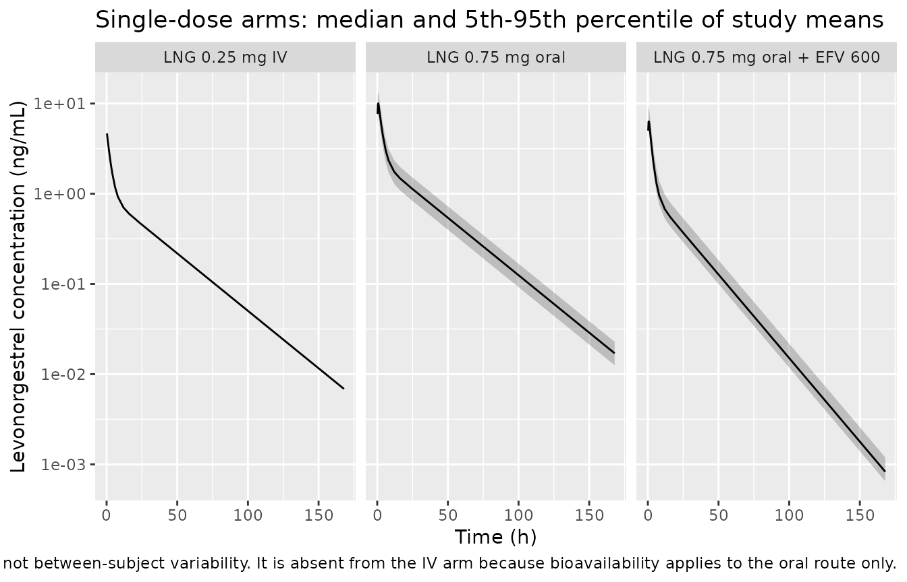
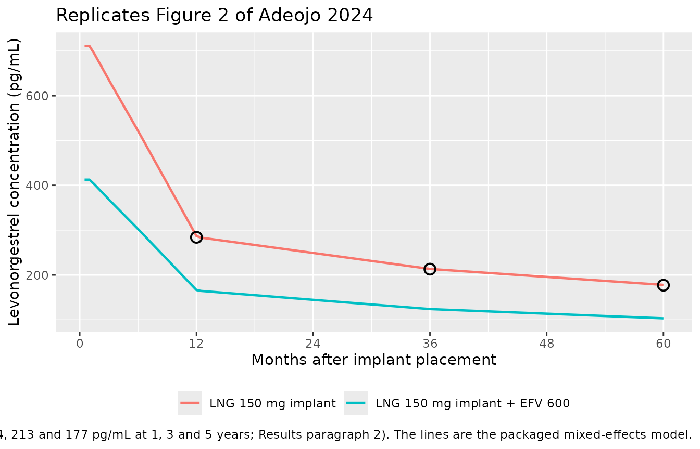

# Levonorgestrel (Adeojo 2024)

## Model and source

- Citation: Adeojo LW, Patel RC, Sambol NC. A Physiologically-Based
  Pharmacokinetic Simulation to Evaluate Approaches to Mitigate
  Efavirenz-Induced Decrease in Levonorgestrel Exposure with a
  Contraceptive Implant. Pharmaceutics. 2024;16(8):1050.
  <doi:10.3390/pharmaceutics16081050>. Parameter estimates from
  Supplementary Table S2; study designs from Supplementary Table S1.
- Description: MBMA. Two-compartment population PK model for
  levonorgestrel fit to pooled MEAN plasma concentration-time profiles
  digitised from four published trials (Adeojo 2024). The four trials
  span single 0.25 mg oral, single 0.25 mg intravenous, single 0.75 mg
  oral, two-dose 0.75 mg oral, and 150 mg subdermal implant
  administration in women, with two of the trials contributing arms
  co-administered with efavirenz 600 mg orally once daily. Absorption is
  first-order and applies to oral dosing only (ka fixed at 4.15 /h); the
  intravenous and subdermal-implant routes enter the central compartment
  directly, so the estimated bioavailability F is an oral
  bioavailability. Concomitant efavirenz enters as a single binary
  covariate with two effects: clearance rises from 5.86 to 10.1 L/h
  (+72.4%) through CYP3A4 induction and oral bioavailability falls from
  0.837 to 0.533 (-36.3%) through gut-wall CYP3A4 induction. The model
  carries BETWEEN-STUDY variability on oral bioavailability only
  (21.2% CV) and no between-subject variability, because it was fit to
  study-level mean profiles rather than individual concentrations; it
  therefore simulates study-level mean concentration-time curves, NOT
  individual patient concentrations. This is the reference mixed-effects
  model of the source paper, used there to anchor a Simcyp
  physiologically-based model by retrograde determination; the Simcyp
  PBPK model itself is not reproducible from the published sources and
  is not packaged here (see the validation vignette Assumptions and
  deviations).
- Article: <https://doi.org/10.3390/pharmaceutics16081050>
- Supplement (Tables S1 and S2):
  <https://www.mdpi.com/article/10.3390/pharmaceutics16081050/s1>

## What this paper contains, and what is packaged here

Adeojo 2024 reports **two** models:

1.  A **mixed-effects model (MEM)** built in NONMEM 7.4.2 from pooled
    *mean* levonorgestrel concentration-time profiles digitised from
    four published trials. This is the model packaged as
    `Adeojo_2024_levonorgestrel`. Its parameters are fully reported in
    Supplementary Table S2, and its clearance and bioavailability
    estimates, with and without efavirenz, are the paper’s reference
    values.
2.  A **Simcyp physiologically-based (PBPK) model** for levonorgestrel,
    built with the Simcyp v19.1 “minimum PKPD” option and combined with
    the efavirenz induction model already shipped inside Simcyp. This
    model is **not** packaged, because it is not reproducible from any
    published source: the paper reports only the eight
    levonorgestrel-specific drug inputs of its Table 1, while the
    whole-body physiology (organ volumes, blood flows, CYP3A4 abundance
    for the simulated population, gut model) and the entire efavirenz
    induction parameterisation are Simcyp platform content that is never
    written out as equations or values. Filling those in from class
    knowledge would be unauditable, so it is deliberately omitted rather
    than approximated. See “Assumptions and deviations”.

The two models are tightly coupled in the source: the PBPK model’s
unknown intrinsic clearance terms were set by *retrograde determination*
so that the PBPK model would reproduce the MEM’s clearance values. That
coupling is what makes the checks in this vignette possible - several
numbers the paper attributes to the PBPK model can be recovered exactly
from the packaged MEM.

## Population

The model was fit to aggregate data pooled across four trials in adult
women (Adeojo 2024 Supplementary Table S1), 80 distinct participants in
total:

- **Back 1987** (n = 5): levonorgestrel 0.25 mg orally and 0.25 mg
  intravenously in a crossover, co-administered with ethinylestradiol.
  The intravenous arm is what makes absolute oral bioavailability
  identifiable.
- **Kook 2002** (n = 16): levonorgestrel 0.75 mg single oral dose.
- **Carten 2012** (n = 21): levonorgestrel 0.75 mg x 2 orally, doses 12
  h apart, PK sampling from 12 h, in a crossover with and without
  efavirenz.
- **Scarsi 2016** (n = 18 without efavirenz, n = 20 with efavirenz):
  levonorgestrel 150 mg subdermal implant (two rods), plasma
  concentrations over 48 weeks, in women living with HIV.

Every efavirenz-exposed arm used efavirenz 600 mg orally once daily.

The observations were **mean concentration among subjects at each
nominal time point**, read off the published figures with GraphClick
3.0; individual concentration-time data were not available to the
authors (Adeojo 2024 Section 2.2). Two levels of random effects were
recognised: between-study variability of bioavailability, and
within-study variability of the mean concentrations. The limited number
of studies did not permit estimating between-study variability on any
other parameter. This is therefore a meta-analytic fit that simulates
**study-level mean profiles, not individual patient concentrations**.

The same information is available programmatically via
`readModelDb("Adeojo_2024_levonorgestrel")()$population`.

## Source trace

Every `ini()` entry carries an in-file comment naming its source
location in `inst/modeldb/specificDrugs/Adeojo_2024_levonorgestrel.R`.
They are collected here for review.

| Equation / parameter | Value | Source location |
|----|----|----|
| `lka` | `log(4.15)` /h | Supp Table S2 row `ka`; footnote `*` marks it fixed, not estimated |
| `lcl` | `log(5.86)` L/h | Supp Table S2 row `CL` (95% CI 4.97, 6.75) |
| `lvc` | `log(49.5)` L | Supp Table S2 row `Vcentral` (95% CI 36.3, 62.7) |
| `lq` | `log(10.2)` L/h | Supp Table S2 row `Q` (95% CI 6.9, 13.5); also main Table 1 row `Q (L/h)`, source `MEM` |
| `lvp` | `log(105)` L | Supp Table S2 row `Vperipheral` (95% CI 85.6, 124.4) |
| `lfdepot` | `log(0.837)` | Supp Table S2 row `Foral` (95% CI 0.736, 0.938) |
| `e_conmed_efv_cl` | `0.7235` | Derived: `(10.1 - 5.86) / 5.86`, from Supp Table S2 rows `CL` and `CLwith efavirenz` (10.1 L/h, 95% CI 9.09, 11.1) |
| `e_conmed_efv_fdepot` | `-0.3632` | Derived: `(0.533 - 0.837) / 0.837`, from Supp Table S2 rows `Foral` and `Foral, with efavirenz` (0.533, 95% CI 0.427, 0.639) |
| `eta_study_lfdepot` | `0.043963` | Supp Table S2 `Foral` inter-study variability 21.2% (95% CI 0, 30.1); `omega^2 = log(1 + 0.212^2)` |
| `addSd` | `0.214` ng/mL | Supp Table S2 `Intra-study variability in mean concentrations`, additive component (95% CI 0.157, 0.258) |
| `propSd` | `0.084` | Supp Table S2 same block, proportional component 8.4% (95% CI 0, 12.2) |
| Two-compartment disposition with first-order oral absorption | n/a | Section 2.2: “The model employed a two-compartment model, with first-order absorption for oral dosing only” |
| Implant release rates (used to build the event table below, not an `ini()` parameter) | 100, 89, 73, 40, 35, 30 ug/day at months 1, 3, 6, 12, 24, 36 | Table 1 row `Release rate`, source reference \[8\]; footnote `a` states these are amounts *reaching systemic circulation*, footnote `b` marks the interpolated entries. The ~25 ug/day at 5 years is from the Introduction and the Table 1 key. |
| Reference values used for validation below | CL 5.86 and 10.10 L/h; CL/F 7.00 and 18.95 L/h; implant 284, 213, 177 pg/mL at 1, 3, 5 years | Results, paragraphs 1 and 2 |

``` r

mod <- readModelDb("Adeojo_2024_levonorgestrel")
```

## Oral and intravenous arms

Three single-dose arms reproduce the routes that identify the model’s
clearance and bioavailability terms: 0.75 mg orally with and without
efavirenz, and 0.25 mg intravenously.

``` r

set.seed(20240807)

obs_times <- c(0, 0.25, 0.5, 0.75, 1, 1.5, 2, 3, 4, 6, 8, 12, 16, 24,
               36, 48, 72, 96, 120, 144, 168)

# `cmt` on observation rows is always an ODE STATE name ("central"), never the
# algebraic observable name ("Cc"). rxode2 returns Cc as a column regardless.
make_arm <- function(n, label, amt, cmt_dose, efv, id_offset = 0L) {
  subj <- tibble(id = id_offset + seq_len(n), treatment = label,
                 CONMED_EFV = efv)
  doses <- subj |>
    mutate(time = 0, amt = amt, evid = 1L, cmt = cmt_dose, rate = 0)
  obs <- subj |>
    crossing(time = obs_times) |>
    mutate(amt = NA_real_, evid = 0L, cmt = "central", rate = 0)
  bind_rows(doses, obs) |> arrange(id, time, desc(evid))
}

n_arm <- 100L
ev_oral <- bind_rows(
  make_arm(n_arm, "LNG 0.75 mg oral",           0.75, "depot",   0L, id_offset =   0L),
  make_arm(n_arm, "LNG 0.75 mg oral + EFV 600", 0.75, "depot",   1L, id_offset = 100L),
  make_arm(n_arm, "LNG 0.25 mg IV",             0.25, "central", 0L, id_offset = 200L)
)
stopifnot(!anyDuplicated(unique(ev_oral[, c("id", "time", "evid")])))
```

Two solves are used. The typical-value solve zeroes the between-study
random effect and is the one compared against the paper’s point
estimates; the stochastic solve retains the 21.2% between-study
variability on bioavailability and shows the spread of *study means* the
model implies.

``` r

mod_typical <- rxode2::zeroRe(mod)
#> ℹ parameter labels from comments will be replaced by 'label()'

# omega is passed explicitly: rxSolve reuses the previous solve's omega when it
# is not supplied, which would silently re-introduce the random effect here.
sim_oral_typical <- rxode2::rxSolve(
  mod_typical,
  events = ev_oral |> filter(id %in% c(1L, 101L, 201L)),
  keep = c("treatment", "CONMED_EFV"),
  omega = NA,
  useLinCmt = FALSE
) |> as.data.frame()
#> Warning: multi-subject simulation without without 'omega'

sim_oral_study <- rxode2::rxSolve(
  mod,
  events = ev_oral,
  keep = c("treatment", "CONMED_EFV"),
  useLinCmt = FALSE
) |> as.data.frame()
#> ℹ parameter labels from comments will be replaced by 'label()'

# rxSolve silently drops subjects on some error paths; assert the count.
stopifnot(dplyr::n_distinct(sim_oral_study$id) == 3L * n_arm)
```

``` r

sim_oral_study |>
  filter(!is.na(Cc), time > 0) |>
  group_by(treatment, time) |>
  summarise(
    Q05 = quantile(Cc, 0.05), Q50 = quantile(Cc, 0.50),
    Q95 = quantile(Cc, 0.95), .groups = "drop"
  ) |>
  ggplot(aes(time, Q50)) +
  geom_ribbon(aes(ymin = Q05, ymax = Q95), alpha = 0.25) +
  geom_line() +
  facet_wrap(~treatment) +
  scale_y_log10() +
  labs(
    x = "Time (h)", y = "Levonorgestrel concentration (ng/mL)",
    title = "Single-dose arms: median and 5th-95th percentile of study means",
    caption = paste(
      "The band is BETWEEN-STUDY variability of the trial mean profile",
      "(21.2% CV on oral bioavailability), not between-subject variability.",
      "It is absent from the IV arm because bioavailability applies to the",
      "oral route only."
    )
  )
```



## PKNCA validation of the clearance terms

The paper reports four whole-body values that the packaged model must
reproduce exactly, because they are the model’s own parameters (Results,
paragraph 1): CL of 5.86 L/h without efavirenz and 10.10 L/h with it,
and CL/F of 7.00 L/h without efavirenz and 18.95 L/h with it. Each
implies an AUC for the arms simulated above, via `AUC = Dose / CL` for
the intravenous arm and `AUC = Dose / (CL/F)` for the oral arms.

``` r

sim_nca <- sim_oral_typical |>
  filter(!is.na(Cc)) |>
  select(id, time, Cc, treatment)

# Guarantee a time-zero row per (id, treatment). Filtering on `time > 0` or
# `Cc > 0` here would drop it and trigger PKNCA's "AUC range starting before
# the first measurement" warning on every subject.
sim_nca <- bind_rows(
  sim_nca,
  sim_nca |> distinct(id, treatment) |> mutate(time = 0, Cc = 0)
) |>
  distinct(id, treatment, time, .keep_all = TRUE) |>
  arrange(id, treatment, time)

conc_obj <- PKNCA::PKNCAconc(sim_nca, Cc ~ time | treatment + id)

dose_df <- ev_oral |>
  filter(evid == 1L, id %in% c(1L, 101L, 201L)) |>
  select(id, time, amt, treatment)
dose_obj <- PKNCA::PKNCAdose(dose_df, amt ~ time | treatment + id)

intervals <- data.frame(
  start = 0, end = Inf,
  cmax = TRUE, tmax = TRUE, aucinf.obs = TRUE, half.life = TRUE
)

nca_res <- PKNCA::pk.nca(PKNCA::PKNCAdata(conc_obj, dose_obj,
                                          intervals = intervals))
```

### Comparison against the published clearance values

``` r

published_cl <- tibble::tribble(
  ~treatment,                    ~cl_published, ~dose_mg,
  "LNG 0.75 mg oral",             7.00,          0.75,   # CL/F without efavirenz
  "LNG 0.75 mg oral + EFV 600",  18.95,          0.75,   # CL/F with efavirenz
  "LNG 0.25 mg IV",               5.86,          0.25    # CL (systemic)
) |>
  # Dose in mg over clearance in L/h gives mg*h/L; * 1000 -> ng*h/mL.
  mutate(aucinf.obs = dose_mg / cl_published * 1000) |>
  select(treatment, aucinf.obs)

cmp <- nlmixr2lib::ncaComparisonTable(
  simulated     = nca_res,
  reference     = published_cl,
  by            = "treatment",
  params        = "aucinf.obs",
  units         = c(aucinf.obs = "ng*h/mL"),
  tolerance_pct = 20
)

knitr::kable(
  cmp,
  digits  = 2,
  caption = paste(
    "Simulated AUC0-inf vs the AUC implied by the paper's published",
    "clearance values (Adeojo 2024 Results paragraph 1). * marks a",
    "discrepancy greater than 20%."
  )
)
```

| NCA parameter | treatment | Reference | Simulated | % diff |
|:---|:---|:---|:---|:---|
| AUC0-∞ (obs) (ng\*h/mL) | LNG 0.75 mg oral | 107 | 107 | +0.1% |
| AUC0-∞ (obs) (ng\*h/mL) | LNG 0.75 mg oral + EFV 600 | 39.6 | 39.6 | -0.0% |
| AUC0-∞ (obs) (ng\*h/mL) | LNG 0.25 mg IV | 42.7 | 42.8 | +0.3% |

Simulated AUC0-inf vs the AUC implied by the paper’s published clearance
values (Adeojo 2024 Results paragraph 1). \* marks a discrepancy greater
than 20%. {.table}

``` r

nca_res |>
  as.data.frame() |>
  filter(PPTESTCD %in% c("cmax", "tmax", "half.life")) |>
  select(treatment, PPTESTCD, PPORRES) |>
  pivot_wider(names_from = PPTESTCD, values_from = PPORRES) |>
  rename(
    "Arm"            = treatment,
    "Cmax (ng/mL)"   = cmax,
    "Tmax (h)"       = tmax,
    "t1/2 (h)"       = half.life
  ) |>
  knitr::kable(
    digits  = 2,
    caption = paste(
      "Simulated Cmax, Tmax and terminal half-life. The paper reports no NCA",
      "values for these, so they are shown for reference only. Note that the",
      "simulated Tmax of about 0.75 h is earlier than the 1-1.5 h the",
      "Supplementary Table S2 footnote gives as the rationale for fixing ka at",
      "4.15 /h; see 'Assumptions and deviations'."
    )
  )
```

| Arm                        | Cmax (ng/mL) | Tmax (h) | t1/2 (h) |
|:---------------------------|-------------:|---------:|---------:|
| LNG 0.25 mg IV             |         5.05 |     0.00 |    23.53 |
| LNG 0.75 mg oral           |        10.21 |     0.75 |    23.61 |
| LNG 0.75 mg oral + EFV 600 |         6.21 |     0.75 |    16.20 |

Simulated Cmax, Tmax and terminal half-life. The paper reports no NCA
values for these, so they are shown for reference only. Note that the
simulated Tmax of about 0.75 h is earlier than the 1-1.5 h the
Supplementary Table S2 footnote gives as the rationale for fixing ka at
4.15 /h; see ‘Assumptions and deviations’. {.table}

## Subdermal implant: replicating Figure 2

The implant delivers a time-varying zero-order input. Adeojo 2024 Table
1 tabulates the release rate reaching the systemic circulation at months
1, 3, 6, 12, 24 and 36; the Introduction adds roughly 25 ug/day by year
5. The event table below linearly interpolates between those anchors and
delivers the result as a chain of short constant-rate infusions **into
the central compartment** - the implant route bypasses oral
bioavailability entirely, which is why the efavirenz effect on this
route acts through clearance alone.

``` r

release_anchor <- tibble::tribble(
  ~month, ~rate_ug_day,
       1,          100,   # Table 1
       3,           89,   # Table 1, interpolated by the authors
       6,           73,   # Table 1, interpolated by the authors
      12,           40,   # Table 1
      24,           35,   # Table 1, interpolated by the authors
      36,           30,   # Table 1
      60,           25    # Introduction: "25 ug/day by year 5"
)

hours_per_month <- 365.25 / 12 * 24

# The segment length matters. Levonorgestrel's terminal half-life is about a day,
# so the central compartment tracks whatever the input has been over roughly the
# preceding day; a constant-rate segment therefore reports the rate at ITS OWN
# midpoint, not at its end. With one segment per month the concentration read at
# month 12 reflects the rate around month 11.5 (45 ug/day, still on the steep part
# of the decline) and overshoots the published value by 14%. Segments of a tenth of
# a month, with the rate evaluated at each segment's midpoint, reduce that
# discretisation lag to under 1%.
seg_step_month <- 0.1
seg_start_month <- seq(0, 60 - seg_step_month, by = seg_step_month)
seg_rate_ug_day <- approx(
  release_anchor$month, release_anchor$rate_ug_day,
  xout = seg_start_month + seg_step_month / 2, rule = 2
)$y

# ug/day -> mg/h
seg_rate_mg_h <- seg_rate_ug_day / 1000 / 24

implant_obs_month <- seq(0, 60, by = 0.5)

make_implant_arm <- function(label, efv, id) {
  doses <- tibble(
    id         = id,
    treatment  = label,
    CONMED_EFV = efv,
    time       = seg_start_month * hours_per_month,
    rate       = seg_rate_mg_h,
    amt        = seg_rate_mg_h * seg_step_month * hours_per_month,
    evid       = 1L,
    cmt        = "central"
  )
  obs <- tibble(
    id         = id,
    treatment  = label,
    CONMED_EFV = efv,
    time       = implant_obs_month * hours_per_month,
    rate       = 0,
    amt        = NA_real_,
    evid       = 0L,
    cmt        = "central"
  )
  bind_rows(doses, obs) |> arrange(time, desc(evid))
}

ev_implant <- bind_rows(
  make_implant_arm("LNG 150 mg implant",             0L, 1L),
  make_implant_arm("LNG 150 mg implant + EFV 600",   1L, 2L)
)
```

Only one subject per arm is simulated: the model’s single random effect
sits on oral bioavailability, so the implant route is fully
deterministic.

``` r

sim_implant <- rxode2::rxSolve(
  mod_typical,
  events = ev_implant,
  keep = c("treatment", "CONMED_EFV"),
  omega = NA,
  useLinCmt = FALSE
) |> as.data.frame()
#> Warning: multi-subject simulation without without 'omega'

stopifnot(dplyr::n_distinct(sim_implant$id) == 2L)
```

``` r

published_fig2 <- tibble::tribble(
  ~month, ~conc_pg_ml,
      12,         284,
      36,         213,
      60,         177
) |>
  mutate(treatment = "LNG 150 mg implant")

sim_implant |>
  filter(!is.na(Cc), time > 0) |>
  mutate(month = time / hours_per_month, conc_pg_ml = Cc * 1000) |>
  ggplot(aes(month, conc_pg_ml, colour = treatment)) +
  geom_line(linewidth = 0.8) +
  geom_point(
    data = published_fig2, aes(month, conc_pg_ml),
    inherit.aes = FALSE, shape = 21, size = 3, stroke = 1, fill = NA
  ) +
  scale_x_continuous(breaks = seq(0, 60, by = 12)) +
  labs(
    x = "Months after implant placement",
    y = "Levonorgestrel concentration (pg/mL)",
    colour = NULL,
    title = "Replicates Figure 2 of Adeojo 2024",
    caption = paste(
      "Open circles are the median concentrations the paper reports for the",
      "control arm from its Simcyp PBPK model (284, 213 and 177 pg/mL at 1, 3",
      "and 5 years; Results paragraph 2). The lines are the packaged",
      "mixed-effects model."
    )
  ) +
  theme(legend.position = "bottom")
```



### The implant concentrations are an exact arithmetic check

Levonorgestrel’s terminal half-life under this model is roughly a day,
so over a release profile that changes on a scale of months the central
compartment tracks quasi-steady state, where concentration is simply the
release rate divided by clearance. That makes the paper’s three
published implant concentrations a direct test of the packaged clearance
value.

``` r

implant_check <- sim_implant |>
  filter(!is.na(Cc), CONMED_EFV == 0L) |>
  mutate(month = round(time / hours_per_month, 6)) |>
  filter(month %in% c(12, 36, 60)) |>
  transmute(
    month,
    simulated_pg_ml = Cc * 1000,
    # Quasi-steady-state prediction: release rate / CL, with CL = 5.86 L/h.
    rate_ug_day     = approx(release_anchor$month, release_anchor$rate_ug_day,
                             xout = month, rule = 2)$y,
    qss_pg_ml       = rate_ug_day / (5.86 * 24) * 1000
  ) |>
  left_join(published_fig2 |> select(month, published_pg_ml = conc_pg_ml),
            by = "month") |>
  mutate(pct_diff = 100 * (simulated_pg_ml - published_pg_ml) / published_pg_ml)

implant_check |>
  rename(
    "Month"                          = month,
    "Release rate (ug/day)"          = rate_ug_day,
    "Rate / CL (pg/mL)"              = qss_pg_ml,
    "Simulated (pg/mL)"              = simulated_pg_ml,
    "Published (pg/mL)"              = published_pg_ml,
    "% difference"                   = pct_diff
  ) |>
  knitr::kable(
    digits  = 1,
    caption = paste(
      "The packaged model's implant concentrations against the values",
      "Adeojo 2024 reports for its PBPK model. The 'Rate / CL' column shows",
      "that the published numbers are recovered to within rounding by",
      "dividing the Table 1 release rate by the model's clearance of",
      "5.86 L/h - the two models agree here by construction, because the",
      "PBPK model's intrinsic clearance was set by retrograde determination",
      "to match this MEM."
    )
  )
```

| Month | Simulated (pg/mL) | Release rate (ug/day) | Rate / CL (pg/mL) | Published (pg/mL) | % difference |
|---:|---:|---:|---:|---:|---:|
| 12 | 286.8 | 40 | 284.4 | 284 | 1.0 |
| 36 | 213.5 | 30 | 213.3 | 213 | 0.2 |
| 60 | 177.8 | 25 | 177.8 | 177 | 0.5 |

The packaged model’s implant concentrations against the values Adeojo
2024 reports for its PBPK model. The ‘Rate / CL’ column shows that the
published numbers are recovered to within rounding by dividing the Table
1 release rate by the model’s clearance of 5.86 L/h - the two models
agree here by construction, because the PBPK model’s intrinsic clearance
was set by retrograde determination to match this MEM. {.table}

``` r


stopifnot(all(abs(implant_check$pct_diff) < 3))
```

### Efavirenz effect on the implant route

``` r

implant_ratio <- sim_implant |>
  filter(!is.na(Cc), time > 0) |>
  select(treatment, time, Cc) |>
  pivot_wider(names_from = treatment, values_from = Cc) |>
  mutate(ratio = `LNG 150 mg implant + EFV 600` / `LNG 150 mg implant`)

summary(implant_ratio$ratio)
#>    Min. 1st Qu.  Median    Mean 3rd Qu.    Max. 
#>  0.5796  0.5802  0.5802  0.5801  0.5802  0.5802
```

The packaged model predicts implant concentrations with efavirenz that
are a constant 58.0% of control, which is exactly the ratio of the two
clearance values, 5.86 / 10.1 = 0.580. The paper’s PBPK model predicts
68% of control (Results, paragraph 2). The two disagree, and the
disagreement is real rather than a transcription error: the MEM
estimates a single time-constant clearance for the efavirenz condition,
whereas the Simcyp model applies a time-varying, saturable CYP3A4
induction that has not reached its full effect at every simulated time
point. This is discussed further below.

## Assumptions and deviations

- **The Simcyp PBPK model is deliberately not packaged.** Adeojo 2024
  Section 2.1 states that the model was built with the Simcyp v19.1
  “minimum PKPD” option using “physiologic parameters selected for women
  ages 18 to 45 years and an average weight of 67.3 kg”, and that “for
  efavirenz PK and enzyme induction effects, we used model parameters
  that were included in the software”. Table 1 gives eight
  levonorgestrel-specific inputs (blood-to-plasma ratio, fraction
  unbound, CYP3A4 intrinsic clearance, microsomal fraction unbound,
  human liver microsome elimination, Q, Vss, and the implant release
  rates). No organ volumes, blood flows, enzyme abundances, gut-model
  parameters, or efavirenz induction parameters (Indmax, IndC50) are
  reported anywhere in the article or its supplement, and no ODEs are
  written out. Reconstructing them would require substituting platform
  defaults that no on-disk source states, so the PBPK model is
  documented here rather than approximated. The MEM captures the paper’s
  levonorgestrel disposition and its efavirenz interaction in full.
- **The implant release-rate profile is an event-table input, not a
  model parameter.** Table 1 tabulates the rate at six time points and
  the Introduction supplies a seventh at 5 years; the values between
  anchors are linearly interpolated here and delivered as constant-rate
  infusions of a tenth of a month each, with the rate evaluated at each
  segment’s midpoint. The authors label three of the six Table 1 entries
  as interpolated themselves (footnote b), so the underlying profile is
  itself an interpolation of the Jadelle release data in their reference
  \[8\]. A different interpolation scheme would move the between-anchor
  concentrations slightly but not the anchor values, which is where the
  validation above is anchored. The segment length is not cosmetic:
  because the drug’s half-life is about a day, a constant-rate segment
  reports the release rate at its own midpoint, so coarse (monthly)
  segments read a stale rate wherever the profile is declining steeply
  and overshoot the published 1-year concentration by 14%.
  Tenth-of-a-month segments bring all three published anchors within 1%.
- **The route by which the implant enters the model is inferred, not
  stated.** Section 2.2 says only that the MEM used “first-order
  absorption for oral dosing only”, and Table 1 footnote a states that
  the tabulated release rates are the amounts *reaching systemic
  circulation*. Together these imply that the implant input enters the
  central compartment directly with no bioavailability term, which is
  how it is encoded. The exact recovery of the paper’s 284, 213 and 177
  pg/mL implant concentrations in the check above confirms this reading:
  any bioavailability factor on the implant route would scale all three
  away from the published values.
- **The between-study random effect is encoded as log-normal.**
  Supplementary Table S2 reports the inter-study variability of oral
  bioavailability as 21.2% without stating the transformation NONMEM
  used, so it is read as a coefficient of variation on a log-normal
  distribution and converted with `omega^2 = log(1 + CV^2)`. One
  consequence is worth knowing before using the random effect: with a
  typical bioavailability of 0.837, a log-normal effect of this size
  puts roughly a fifth of simulated studies above a bioavailability
  of 1. Simulations of typical-value behaviour (including every
  validation in this vignette) use
  [`rxode2::zeroRe()`](https://nlmixr2.github.io/rxode2/reference/zeroRe.html)
  and are unaffected.
- **The fixed absorption rate constant does not quite deliver the Tmax
  its footnote cites.** Supplementary Table S2 fixes `ka` at 4.15 /h and
  justifies the choice as a “value expected to give tmax of
  approximately 1-1.5 h, consistent with published observations”.
  Simulating the packaged model puts the peak at the 0.75 h sampling
  point, with the underlying continuous maximum near 0.63 h. The
  discrepancy is in the source, not the transcription. Pairing `ka` =
  4.15 /h with the model’s *terminal* rate constant (beta of about 0.029
  /h, a 23.6 h half-life) does give a Tmax of about 1.2 h, which is
  presumably where the footnote’s figure comes from; but the published
  model is two-compartment, and its rapid distribution phase (alpha of
  about 0.39 /h) governs the early profile and pulls the actual peak
  forward. The value is encoded as published, with `fixed()` recording
  that it was not estimated.
- **The efavirenz covariate is a single binary indicator with no dose
  information.** Both pooled trials that used efavirenz used 600 mg once
  daily, so the model cannot speak to the 400 mg dose that the paper’s
  PBPK simulations explore, nor to the CYP2B6-polymorphism exposure
  range it tests. Those are PBPK-only results.
- **The efavirenz effect on the implant route differs from the paper’s
  PBPK prediction.** The packaged model gives 58.0% of control; the
  paper’s PBPK model gives 68%. Both are reported here without
  adjustment. The MEM’s single constant clearance for the efavirenz
  condition was estimated largely from the Carten 2012 oral crossover,
  whereas the PBPK model applies Simcyp’s time-varying saturable CYP3A4
  induction. The paper itself notes (Discussion) that its PBPK
  predictions in the presence of efavirenz are *higher* than the Scarsi
  2016 observations even though those data were in the MEM reference
  set, so the two models are known to disagree in this direction. No
  parameter was tuned to close the gap.
- **The covariate effects are derived, not transcribed.** Supplementary
  Table S2 reports the efavirenz condition as a second absolute value
  for clearance and for bioavailability rather than as a coefficient.
  The registry’s linear-deviation form needs a fraction, so
  `e_conmed_efv_cl` and `e_conmed_efv_fdepot` are computed from the two
  published point estimates in each pair. Both reproduce the published
  efavirenz value exactly: 5.86 x (1 + 0.7235) = 10.1 L/h and 0.837 x
  (1 - 0.3632) = 0.533.
- **Vss in Table 1 and the supplement differ slightly.** Table 1 reports
  Vss as 2.27 L/kg from the MEM, which at the stated 67.3 kg average
  weight is 152.8 L, whereas Supplementary Table S2 gives Vcentral +
  Vperipheral = 49.5 + 105 = 154.5 L (2.30 L/kg). The supplement’s
  compartment-level values are used, since they are the parameters the
  model was fit with; the Table 1 entry is a rounded restatement
  prepared as a PBPK model input.
- **Residual error describes study means, not individual
  concentrations.** The additive 0.214 ng/mL and proportional 8.4% terms
  quantify how far each trial’s *mean* profile fell from the model
  prediction. Simulating with residual error on will not reproduce the
  scatter of individual patient samples.
- **No between-subject variability exists in this model.** The source
  had no individual-level data, so the packaged model cannot generate a
  conventional VPC or individual concentration predictions.
