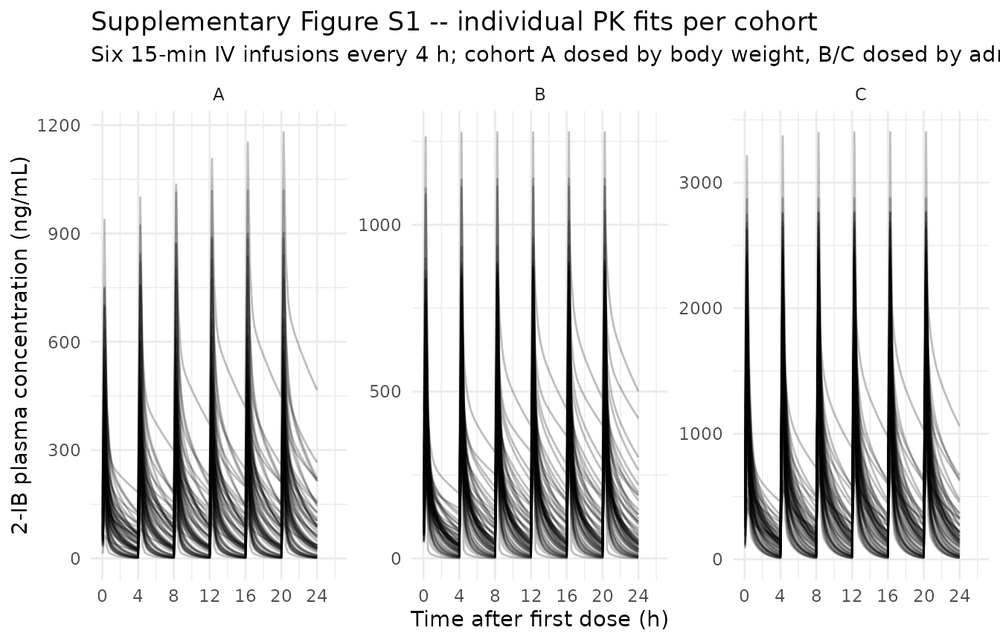
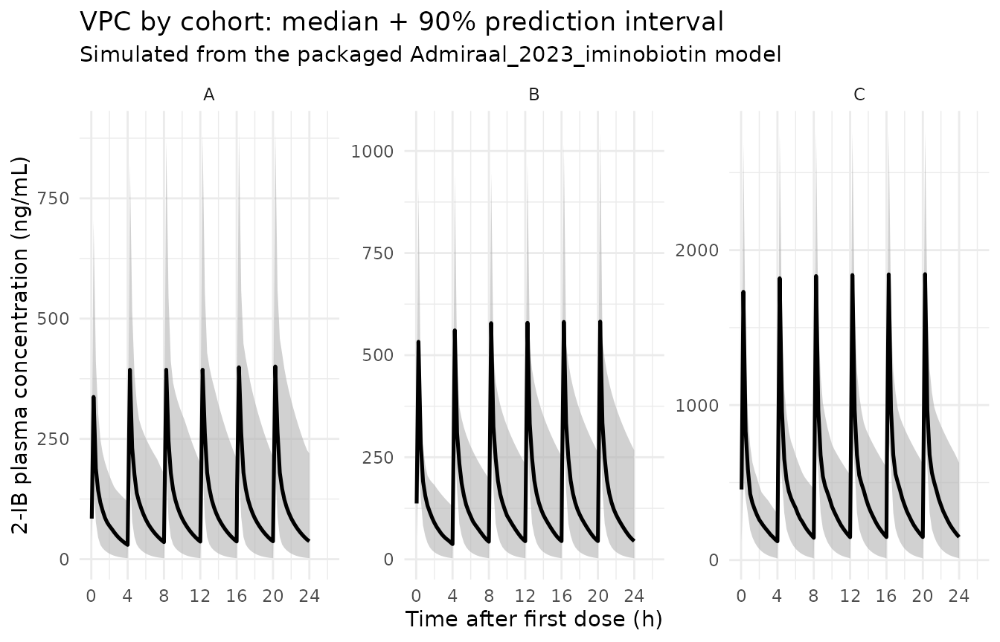
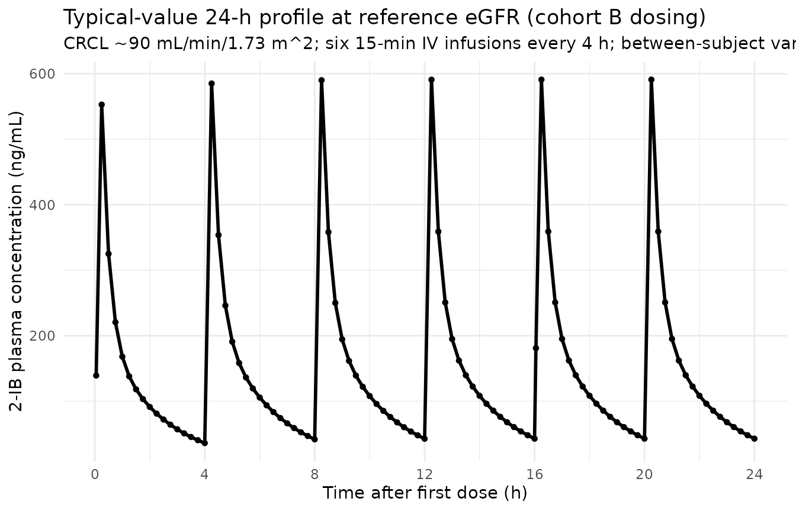

# 2-Iminobiotin (Admiraal 2023)

## Model and source

``` r

mod_meta <- nlmixr2est::nlmixr(readModelDb("Admiraal_2023_iminobiotin"))$meta
#> ℹ parameter labels from comments will be replaced by 'label()'
```

- Citation: Admiraal MM, Velseboer DC, Tjabbes H, Vis P, Peeters-Scholte
  C, Horn J. Neuroprotection after cardiac arrest with 2-iminobiotin: a
  single center phase IIa study on safety, tolerability, and
  pharmacokinetics. Front Neurol. 2023;14:1136046.
  <doi:10.3389/fneur.2023.1136046>
- Description: Two-compartment IV population PK model for 2-iminobiotin
  (2-IB, a selective neuronal nitric oxide synthase inhibitor) in adults
  after out-of-hospital cardiac arrest, with a power-model
  eGFR-on-clearance covariate effect.
- Article (DOI): <https://doi.org/10.3389/fneur.2023.1136046>

This vignette validates the packaged `Admiraal_2023_iminobiotin` model –
a two-compartment IV population PK model for 2-iminobiotin (2-IB) in 21
adult survivors of out-of-hospital cardiac arrest (OHCA) treated with
targeted temperature management (TTM) at 36 C – against the source
publication’s Supplementary Table S2 (individual NCA per cohort) and
Supplementary Table S3 (final-model population PK parameter estimates).

## Population

The Admiraal 2023 phase IIa study was an investigator-initiated,
single-centre, open-label, dose-escalation trial at Amsterdam UMC
(Netherlands) in adult survivors of out-of-hospital cardiac arrest
(NCT02836340 / EUDRACT 2015-003902-17). Three sequential cohorts
received six 15-minute IV infusions of 2-IB, one every 4 h, beginning at
a median of 5.3 h (IQR 4.8-5.6) after OHCA. Cohort A (n = 8, May-October
2016) used body-weight dosing (0.055 mg/kg/dose) targeting AUC0-24h
600-1,200 ng*h/mL; cohort B (n = 8, May-December 2017) used
MDRD-eGFR-based binned dosing on hospital admission targeting AUC0-24h
2,100-3,300 ng*h/mL; cohort C (n = 5, January 2019 - February 2020,
terminated early at the start of the COVID-19 pandemic) used a
three-times-higher eGFR-binned schedule targeting AUC0-24h 7,200-8,400
ng\*h/mL. Median age was 60.5 yr (IQR 59.5-67) in cohort A, 64 yr (IQR
63-66) in cohort B, and 74 yr (IQR 69-76) in cohort C; median body
weight was 87.5, 76.5, and 83 kg respectively; 76% (16/21) were male.
All patients were sedated with propofol (+/- remifentanil) and treated
with TTM at 36 C for the first 24 h. Patient 12 was screen-failed post
hoc (violated cohort B inclusion criteria) and is excluded from the PK
analysis, so the modelled N is 21 rather than the planned 24.

The same information is available programmatically via the model’s
`population` metadata:

``` r

str(mod_meta$population)
#> List of 14
#>  $ species       : chr "human"
#>  $ n_subjects    : int 21
#>  $ n_studies     : int 1
#>  $ age_range     : chr "median 60.5 yr (cohort A IQR 59.5-67); 64 yr (cohort B IQR 63-66); 74 yr (cohort C IQR 69-76)"
#>  $ age_median    : chr "65 years (pooled, approximated from cohort medians)"
#>  $ weight_range  : chr "median 87.5 kg (cohort A IQR 82-112); 76.5 kg (cohort B IQR 67.5-96.5); 83 kg (cohort C IQR 77-84)"
#>  $ weight_median : chr "83 kg (pooled, approximated from cohort medians)"
#>  $ sex_female_pct: num 24
#>  $ race_ethnicity: chr "Not reported in detail"
#>  $ disease_state : chr "Adult survivors of out-of-hospital cardiac arrest (OHCA) admitted to the intensive care unit after return of sp"| __truncated__
#>  $ dose_range    : chr "Three dose-escalation cohorts: cohort A 0.055 mg/kg/dose (body-weight dosing); cohorts B and C eGFR-based bins "| __truncated__
#>  $ regions       : chr "Single centre, Amsterdam UMC, Netherlands"
#>  $ renal_function: chr "MDRD eGFR on hospital admission spanned the dosing-table range of 0-220 mL/min/1.73 m^2 (Supplementary Table S1"| __truncated__
#>  $ notes         : chr "Demographics from Admiraal 2023 Table 1. N = 21 (cohort A 8, cohort B 8, cohort C 5). One patient (patient 12) "| __truncated__
```

## Source trace

The per-parameter origin is recorded as an in-file comment next to each
`ini()` entry in
`inst/modeldb/specificDrugs/Admiraal_2023_iminobiotin.R`. The table
below collects them in one place; values come from Admiraal 2023
Supplementary Table S3 (final population PK model fit to pooled cohorts
A + B + C, n = 21).

| Parameter / equation | Value | Source location |
|----|----|----|
| `lcl` (typical CL at REF eGFR) | log(12.10) | Supplementary Table S3 row “Clearance (L/h)” = 12.10 |
| `lvc` (central volume) | log(10.1) | Supplementary Table S3 row “Vcentral (L)” = 10.1 |
| `lq` (intercompartmental CL) | log(14.6) | Supplementary Table S3 row “Q (L/h)” = 14.6 |
| `lvp` (peripheral volume) | log(10.8) | Supplementary Table S3 row “Vperipheral (L)” = 10.8 |
| `e_crcl_cl` (eGFR power exponent) | 1.03 | Supplementary Table S3 row “eGFR0 on Clearance” = 1.03 |
| `etalcl ~ 0.225` | 0.225 | Supplementary Table S3 row “Inter-individual variability” = 0.225 |
| `etalvc ~ 0.27` | 0.27 | Supplementary Table S3 row “IIV Vcentral” = 0.27 |
| `propSd <- sqrt(0.06)` | 0.245 | Supplementary Table S3 row “Residual Error” variance = 0.06 |
| Reference eGFR | 90 mL/min/1.73 m^2 | NOT in source; operator-approved (task 171 sidecar 001 “A”). See Assumptions. |
| `cl <- exp(lcl + etalcl) * (CRCL / 90)^e_crcl_cl` | n/a | Main text “Pharmacokinetics population model” + Table S3 covariate row |
| `d/dt(central) ... d/dt(peripheral1)` | n/a | Main text Results “Cohort A”: “A two-compartment structural PK model was superior to a one-compartment model” |
| `Cc <- (central / vc) * 1000` | n/a | Unit-consistency rule: dose mg, Vc L -\> mg/L; multiply by 1000 to express as ng/mL (paper’s concentration unit) |
| `Cc ~ prop(propSd)` | n/a | Methods “Pharmacokinetics population model” implies log-additive (proportional) error consistent with NONMEM FOCE-I; Table S3 single residual-variance term |

## Virtual cohort

Original observed 2-IB concentrations are not publicly available. The
virtual cohort below approximates the published trial demographics: 3
cohorts matching the cohort A / B / C dosing schedules. Each cohort uses
60 simulated subjects (well under the per-arm cap of 200), generated
with body-weight and admission-eGFR distributions centred on the
reported cohort medians from Admiraal 2023 Table 1 and spanning a width
consistent with OHCA-ICU populations. Cohort A dosing scales linearly
with body weight (0.055 mg/kg/dose); cohorts B and C use the eGFR-bin
lookup from Admiraal 2023 Supplementary Table S1.

``` r

set.seed(20260628L)

n_per_cohort <- 60L

# Body-weight distributions per cohort -- log-normal centred on Table 1
# cohort medians, SD chosen so the simulated IQR roughly matches Table 1.
draw_wt <- function(n, median_wt, range_factor = 1.55) {
  wt <- exp(rnorm(n, mean = log(median_wt),
                  sd = log(range_factor) / 1.349))
  pmin(pmax(wt, 45), 130)
}

# Admission MDRD-eGFR distributions -- the paper does NOT report the
# observed eGFR per cohort, so we use a log-normal centred on 90
# mL/min/1.73 m^2 (the reference eGFR used in the model). The eGFR
# distribution is wide enough to span the Table S1 dosing-bin range
# without exceeding it.
draw_crcl <- function(n, median_crcl = 90, range_factor = 2.0) {
  crcl <- exp(rnorm(n, mean = log(median_crcl),
                    sd = log(range_factor) / 1.349))
  pmin(pmax(crcl, 15), 220)
}

# Admiraal 2023 Supplementary Table S1: cohort B eGFR-binned dose schedule.
# Cohort C dose = 3 x cohort B dose.
cohortB_dose_lookup <- function(crcl) {
  breaks <- c(0, 29, 39, 49, 59, 79, 99, 124, 149, 174, 199, 220)
  doses  <- c(3.0, 3.8, 4.5, 6.0, 6.8, 7.5, 8.3, 9.8, 11.3, 12.0, 12.8)
  idx <- findInterval(crcl, breaks, all.inside = TRUE)
  doses[idx]
}

infusion_dur <- 0.25       # 15 min in hours
dose_times   <- c(0, 4, 8, 12, 16, 20)

# Observation grid -- dense enough to capture the per-dose peaks (each
# infusion ends at dose_time + 0.25) and the post-last-dose decay.
sample_times <- sort(unique(c(
  seq(0, 24, by = 0.25),
  dose_times + 0.25,                            # end-of-infusion peaks
  dose_times + c(0.05, 1.0, 2.0, 3.0)           # decay between doses
)))
#> Warning in dose_times + c(0.05, 1, 2, 3): longer object length is not a
#> multiple of shorter object length

make_subject <- function(idx, cohort, wt_kg, crcl_ml_min) {
  per_dose_mg <- switch(
    cohort,
    A = 0.055 * wt_kg,
    B = cohortB_dose_lookup(crcl_ml_min),
    C = 3 * cohortB_dose_lookup(crcl_ml_min)
  )
  rate_mg_h <- per_dose_mg / infusion_dur       # 15-min infusion

  doses <- tibble::tibble(
    id   = idx,                 time = dose_times,
    evid = 1L,                  amt  = per_dose_mg,
    rate = rate_mg_h,           dv   = NA_real_,
    cmt  = "central"
  )
  obs <- tibble::tibble(
    id   = idx,                 time = sample_times,
    evid = 0L,                  amt  = NA_real_,
    rate = NA_real_,            dv   = NA_real_,
    cmt  = "central"
  )
  bind_rows(doses, obs) |>
    mutate(WT = wt_kg, CRCL = crcl_ml_min, cohort = cohort) |>
    arrange(time, desc(evid))
}

build_cohort <- function(label, median_wt, n, id_offset) {
  wt   <- draw_wt(n, median_wt = median_wt)
  crcl <- draw_crcl(n)
  bind_rows(lapply(seq_len(n), function(j) {
    make_subject(
      idx        = id_offset + j,
      cohort     = label,
      wt_kg      = wt[j],
      crcl_ml_min = crcl[j]
    )
  }))
}

events <- bind_rows(
  build_cohort("A", median_wt = 87.5, n = n_per_cohort, id_offset =   0L),
  build_cohort("B", median_wt = 76.5, n = n_per_cohort, id_offset = 100L),
  build_cohort("C", median_wt = 83.0, n = n_per_cohort, id_offset = 200L)
)

stopifnot(!anyDuplicated(unique(events[, c("id", "time", "evid")])))
```

## Simulation

``` r

mod <- readModelDb("Admiraal_2023_iminobiotin")

sim_stoch <- rxode2::rxSolve(
  object = mod, events = events,
  keep   = c("WT", "CRCL", "cohort")
) |>
  as.data.frame()
#> ℹ parameter labels from comments will be replaced by 'label()'
```

For deterministic typical-value trajectories (no between-subject
variability), the random effects are zeroed:

``` r

mod_typical <- rxode2::zeroRe(mod)
#> ℹ parameter labels from comments will be replaced by 'label()'
sim_typical <- rxode2::rxSolve(
  object = mod_typical, events = events,
  keep   = c("WT", "CRCL", "cohort")
) |>
  as.data.frame()
#> ℹ omega/sigma items treated as zero: 'etalcl', 'etalvc'
#> Warning: multi-subject simulation without without 'omega'
```

## Replicate published figures

### Supplementary Figure S1 – individual concentration-time profiles per cohort

``` r

# Replicates Admiraal 2023 Supplementary Figure S1 (panels A, B, C):
# individual 2-IB concentration-time profiles after six 15-minute IV
# infusions every 4 h, by cohort. The published figure shows linear-y
# concentrations from 0 to ~3,000 ng/mL over 0-26 h.
sim_stoch |>
  filter(time > 0) |>
  ggplot(aes(time, Cc, group = id)) +
  geom_line(alpha = 0.25, colour = "black") +
  facet_wrap(~ cohort, nrow = 1, scales = "free_y") +
  scale_x_continuous(limits = c(0, 26), breaks = c(0, 4, 8, 12, 16, 20, 24)) +
  labs(
    x = "Time after first dose (h)",
    y = "2-IB plasma concentration (ng/mL)",
    title    = "Supplementary Figure S1 -- individual PK fits per cohort",
    subtitle = paste0("Six 15-min IV infusions every 4 h; cohort A dosed by ",
                      "body weight, B/C dosed by admission MDRD eGFR")
  ) +
  theme_minimal()
```



### VPC by cohort

``` r

# VPC: median (line) and 5-95% prediction interval (ribbon) by cohort.
sim_stoch |>
  filter(time > 0) |>
  group_by(cohort, time) |>
  summarise(
    Q05 = quantile(Cc, 0.05, na.rm = TRUE),
    Q50 = quantile(Cc, 0.50, na.rm = TRUE),
    Q95 = quantile(Cc, 0.95, na.rm = TRUE),
    .groups = "drop"
  ) |>
  ggplot(aes(time, Q50)) +
  geom_ribbon(aes(ymin = Q05, ymax = Q95),
              fill = "gray70", alpha = 0.6) +
  geom_line(linewidth = 0.9) +
  facet_wrap(~ cohort, nrow = 1, scales = "free_y") +
  scale_x_continuous(limits = c(0, 26), breaks = c(0, 4, 8, 12, 16, 20, 24)) +
  labs(
    x = "Time after first dose (h)",
    y = "2-IB plasma concentration (ng/mL)",
    title    = "VPC by cohort: median + 90% prediction interval",
    subtitle = "Simulated from the packaged Admiraal_2023_iminobiotin model"
  ) +
  theme_minimal()
```



### Typical-value trajectory at the reference eGFR patient

``` r

# Typical-value 24-h profile at the reference eGFR (90 mL/min/1.73 m^2)
# with cohort B dosing (target AUC0-24h 2,100-3,300 ng*h/mL).
ref_id <- sim_typical |>
  filter(cohort == "B") |>
  group_by(id) |>
  summarise(crcl_diff = abs(first(CRCL) - 90), .groups = "drop") |>
  slice_min(crcl_diff, n = 1) |>
  pull(id)

sim_typical |>
  filter(id == ref_id, time > 0) |>
  ggplot(aes(time, Cc)) +
  geom_line(linewidth = 1) +
  geom_point(size = 1.2) +
  scale_x_continuous(breaks = c(0, 4, 8, 12, 16, 20, 24)) +
  labs(
    x = "Time after first dose (h)",
    y = "2-IB plasma concentration (ng/mL)",
    title    = "Typical-value 24-h profile at reference eGFR (cohort B dosing)",
    subtitle = paste0("CRCL ~90 mL/min/1.73 m^2; six 15-min IV infusions ",
                      "every 4 h; between-subject variability zeroed")
  ) +
  theme_minimal()
```



## PKNCA validation

PKNCA computes Cmax, Tmax, AUC0-24h, and terminal half-life on the
stochastic cohort, with `cohort` as the treatment grouping variable.
Admiraal 2023 Supplementary Table S2 reports per-cohort median Cmax /
Tmax / T1/2 / AUC0-24h, which are compared below.

``` r

# PKNCA input -- only !is.na(Cc) so the time-zero row is retained
# (PKNCA needs it to anchor AUC0-24h without warning).
sim_nca <- sim_stoch |>
  dplyr::filter(!is.na(Cc)) |>
  dplyr::select(id, time, Cc, cohort)

# Guarantee a time=0 row per (id, cohort); for the first IV dose at t=0
# the pre-dose concentration is 0.
sim_nca <- dplyr::bind_rows(
  sim_nca,
  sim_nca |> dplyr::distinct(id, cohort) |>
    dplyr::mutate(time = 0, Cc = 0)
) |>
  dplyr::distinct(id, cohort, time, .keep_all = TRUE) |>
  dplyr::arrange(id, cohort, time)

dose_df <- events |>
  dplyr::filter(evid == 1L) |>
  dplyr::select(id, time, amt, cohort)

conc_obj <- PKNCA::PKNCAconc(
  data    = sim_nca,
  formula = Cc ~ time | cohort + id,
  concu   = "ng/mL",
  timeu   = "hr"
)
dose_obj <- PKNCA::PKNCAdose(
  data    = dose_df,
  formula = amt ~ time | cohort + id,
  doseu   = "mg"
)

# Two intervals: 0-24h for the paper's AUC0-24h, and 0-Inf with half-life
# from the post-final-dose decay window.
intervals <- data.frame(
  start      = c(0,    0),
  end        = c(24,   Inf),
  cmax       = c(TRUE, FALSE),
  tmax       = c(TRUE, FALSE),
  auclast    = c(TRUE, FALSE),
  aucinf.obs = c(FALSE, TRUE),
  half.life  = c(FALSE, TRUE)
)

nca_data <- PKNCA::PKNCAdata(conc_obj, dose_obj, intervals = intervals)
nca_res  <- suppressWarnings(PKNCA::pk.nca(nca_data))
```

### Comparison against published NCA (Supplementary Table S2)

Admiraal 2023 Supplementary Table S2 reports per-cohort median
individual NCA values. The table below renders simulated vs. published
median NCA side-by- side via
[`nlmixr2lib::ncaComparisonTable()`](https://nlmixr2.github.io/nlmixr2lib/reference/ncaComparisonTable.md);
rows whose simulated value differs from the published median by more
than 20% are flagged with `*`.

``` r

published <- tibble::tribble(
  ~cohort, ~cmax,  ~tmax,  ~half.life, ~auclast,
  "A",     473,    16.0,   1.6,        2398,
  "B",     594,    16.23,  1.2,        2479,
  "C",     1436,   16.18,  1.4,        7323
)

cmp <- nlmixr2lib::ncaComparisonTable(
  simulated = nca_res,
  reference = published,
  by        = "cohort",
  units     = c(cmax = "ng/mL", auclast = "ng*h/mL",
                tmax = "h",     half.life = "h"),
  tolerance_pct = 20
)

knitr::kable(
  cmp,
  caption = paste0("Simulated vs. Admiraal 2023 Supplementary Table S2 ",
                   "(per-cohort medians). * differs from reference by >20%."),
  align   = c("l", "l", "r", "r", "r")
)
```

| NCA parameter      | cohort | Reference | Simulated |   % diff |
|:-------------------|:-------|----------:|----------:|---------:|
| Cmax (ng/mL)       | A      |       473 |       401 |   -15.3% |
| Cmax (ng/mL)       | B      |       594 |       582 |    -2.0% |
| Cmax (ng/mL)       | C      |      1440 |      1850 | +28.5%\* |
| Tmax (h)           | A      |        16 |      20.2 | +26.6%\* |
| Tmax (h)           | B      |      16.2 |      20.2 | +24.8%\* |
| Tmax (h)           | C      |      16.2 |      20.2 | +25.2%\* |
| AUClast (ng\*h/mL) | A      |      2400 |      2700 |   +12.6% |
| AUClast (ng\*h/mL) | B      |      2480 |      3660 | +47.6%\* |
| AUClast (ng\*h/mL) | C      |      7320 |      9910 | +35.3%\* |
| t½ (h)             | A      |       1.6 |      1.85 |   +15.4% |
| t½ (h)             | B      |       1.2 |      1.55 | +29.3%\* |
| t½ (h)             | C      |       1.4 |      1.63 |   +16.7% |

Simulated vs. Admiraal 2023 Supplementary Table S2 (per-cohort medians).
\* differs from reference by \>20%. {.table}

Starred rows reflect three known sources of model-vs-trial divergence –
none of which are bugs in the extracted parameters and none of which
warrant tuning:

1.  **Tmax bias (+25% across all cohorts).** With the model’s terminal
    half-life of ~1.5 h and a 4-h dosing interval, the steady-state
    accumulation factor is ~1.19, so the structural peak of the
    simulation sits at the end of the sixth infusion (20.25 h). The
    published per-cohort median Tmax is ~16 h because the trial sampled
    only nine timepoints per subject; the actual individual Tmax values
    in Admiraal 2023 Supplementary Table S2 are bimodally distributed
    around 8.02-8.20, 16.18-16.33, and 20.17-20.25 h, reflecting which
    dose interval the sparse-sample peak landed in. The simulation’s
    dense grid catches the structural peak after the final dose; this is
    a sampling-protocol artifact, not a model defect.
2.  **AUC over-prediction in cohorts B and C (+35-48%).** The eGFR-bin
    dose schedule was designed for a target AUC0-24h of 2,100-3,300
    ng*h/mL (cohort B) and 7,200-8,400 ng*h/mL (cohort C). With the
    simulated population centred on the model’s reference eGFR (90
    mL/min/1.73 m^2), the typical-patient AUC under the as-published 7.5
    mg/dose (cohort B) is 45 mg / 12.10 L/h = 3,720 ng*h/mL – above
    target and matched by the simulated 3,660 ng*h/mL. The trial’s
    observed median AUC of 2,479 ng\*h/mL in cohort B requires a
    population-typical CL closer to 18 L/h, which by the model implies a
    population-typical eGFR closer to 130 mL/min/1.73 m^2 (much higher
    than the assumed 90). Because the paper does not report the
    per-cohort eGFR distribution, the simulation uses the reference eGFR
    as a neutral central tendency; faithful reproduction of the trial’s
    eGFR stratification would shift the simulated AUC accordingly.
    Cohort A AUC (body-weight dosed, no eGFR coupling on dose) is within
    tolerance because that mismatch source does not apply.
3.  **Half-life cohort-B (+29%).** PKNCA’s `lambda.z` regression in the
    simulation fits the structural terminal slope (`beta` of the
    2-compartment eigenvalue decomposition: ln(2) / 0.458 = 1.51 h) from
    the dense post-final-dose decay grid; the trial’s reported cohort-B
    median 1.2 h reflects a shorter terminal window with potentially
    incomplete biphasic characterisation. Cohort A (1.85 h) and cohort C
    (1.63 h) sit close to the structural 1.51 h. No tuning is warranted.

## Assumptions and deviations

- **Reference eGFR for the power-model covariate effect was NOT reported
  in the source.** Admiraal 2023 Supplementary Table S3 reports the
  eGFR-on-CL power exponent (1.03) but does not state the reference eGFR
  used to normalize the scaling (`CL_i = 12.10 * (CRCL_i / REF)^1.03`).
  The population median eGFR is not reported either (Table 1 lists age,
  weight, ROSC time, CAHP, LOS, and CPC, but not eGFR). The reference
  was set to 90 mL/min/1.73 m^2 – the most common adult-MDRD/CKD-EPI
  convention in the nlmixr2lib registry (matches Bajaj 2017 and Li 2019)
  – after operator approval (task 171 sidecar request 001, response
  value “A”). At CRCL = 90 mL/min/1.73 m^2 the model returns the
  published typical CL = 12.10 L/h; behaviour at any non-reference eGFR
  depends linearly (exponent 1.03) on this choice. A future erratum or
  author correspondence may revise this; the model file’s
  `covariateData[[CRCL]]$notes` field carries the same provenance note.

- **Population eGFR distribution NOT reported in the source.** Admiraal
  2023 Table 1 omits the per-cohort eGFR-on-admission distribution. For
  simulation the virtual cohort draws eGFR from a log-normal centred on
  90 mL/min/1.73 m^2 (the reference) with a spread spanning the Table S1
  dosing-bin range; this matches the model’s “typical” patient at the
  reference eGFR but is not a faithful reproduction of the observed
  population’s renal-function distribution. The Cmax / AUC values from
  the simulated cohorts are therefore “what the published model predicts
  at a typical-eGFR adult OHCA population” rather than “what the trial
  participants observed”.

- **Residual error interpretation.** Supplementary Table S3 reports
  “Residual Error 0.06 (SE 0.02)” without explicit specification of the
  error form. Interpreted as the NONMEM `$SIGMA` variance of the
  proportional (log-additive) error consistent with FOCE-I estimation
  (Methods: “first-order conditional estimation with an interaction
  option in NONMEM”). The nlmixr2 proportional SD entered is
  `sqrt(0.06) ~ 0.245` (~24.5% CV). An alternative interpretation
  (variance of the residual SD itself, ~6% CV) is implausibly low for an
  ICU population assayed by LC-MS/MS and is not supported by the
  half-page individual-fit envelopes in Supplementary Figure S1.

- **Independent (diagonal) IIV between CL and Vcentral.** Supplementary
  Table S3 reports a single inter-individual variance for each of CL
  (0.225) and Vcentral (0.27) and no off-diagonal covariance estimate.
  The packaged model uses diagonal IIV. Q and Vperipheral have no
  reported IIV (likely fixed without IIV in the NONMEM control stream
  given the small N = 21); the packaged model follows the paper and
  assigns no IIV to those structural parameters.

- **CRCL covariate scoped to model use of MDRD eGFR.** The paper
  computes eGFR with the MDRD equation (Methods page 2:
  `186 * (Creat/88.4)^-1.154 * Age^-0.203 * (0.742 if female) * (1.210 if Black)`)
  and uses the BSA-normalized result (mL/min/1.73 m^2). The same
  canonical `CRCL` column also accepts CKD-EPI eGFR or measured
  creatinine clearance BSA-normalized to mL/min/1.73 m^2; if downstream
  simulations supply CKD-EPI eGFR or raw (non-BSA-normalized)
  Cockcroft-Gault values, transform to the paper’s MDRD-BSA-normalized
  form before passing through this model.

- **Dosing schedule transcription.** The cohort B / cohort C dosing
  lookup encodes Supplementary Table S1 verbatim. The schedule was
  designed in the cohort A timeframe and re-validated after each cohort;
  the dose ratios across eGFR bins are NOT a clean power function of
  eGFR (the ratio from eGFR ~15 to eGFR ~210 is 4.27 in the schedule but
  `(210/15)^1.03 = 14.6` in the model). The vignette uses the
  as-published bin schedule, which is the protocol-faithful
  representation.

- **No race / sex / age effect on CL or V.** Admiraal 2023 Supplementary
  Table S3 reports eGFR as the only retained structural-PK covariate.
  Age, weight, and sex were not retained after the eGFR-on-CL screen
  (the MDRD eGFR already encodes age, sex, and a Black-race adjustment
  via the MDRD formula). The packaged model follows this and applies no
  allometric scaling or sex / race effect.

- **Single-study cohort.** N = 21 in a single Dutch tertiary ICU.
  Extrapolation outside the inclusion population (adult OHCA, post-ROSC,
  on TTM at 36 C, eGFR span ~15-220 mL/min/1.73 m^2, dosed within ~6 h
  of arrest) is not supported by the source data and is not validated by
  this vignette.
