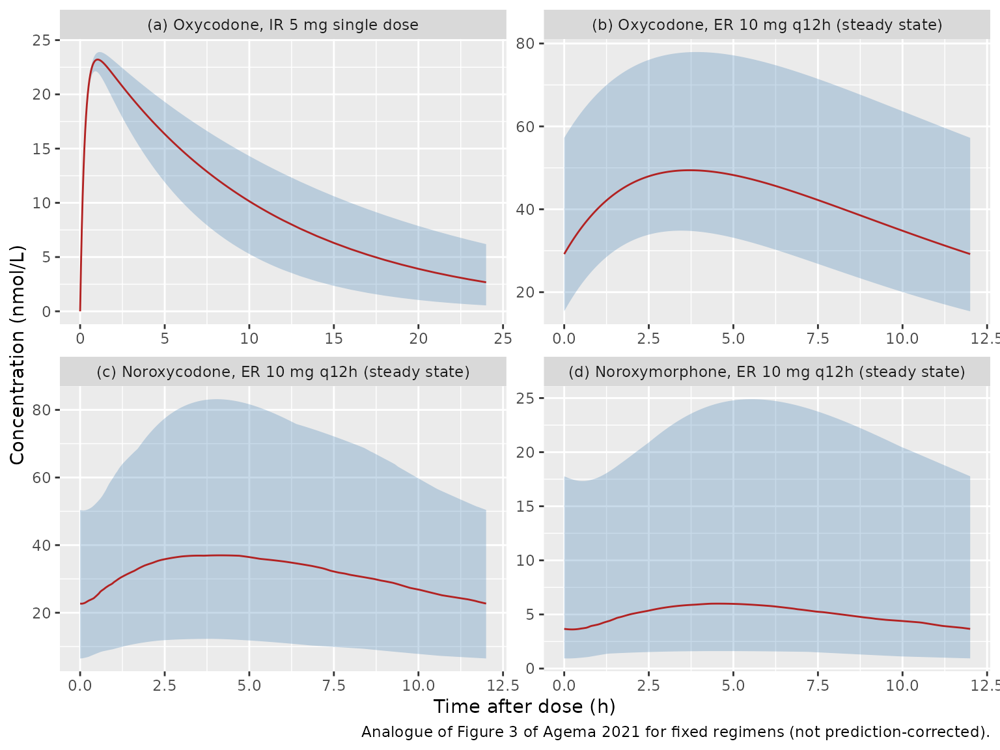

# Oxycodone, noroxycodone and noroxymorphone (Agema 2021)

## Model and source

- Citation: Agema BC, Oosten AW, Sassen SDT, Rietdijk WJR, van der Rijt
  CCD, Koch BCP, Mathijssen RHJ, Koolen SLW. Population Pharmacokinetics
  of Oxycodone and Metabolites in Patients with Cancer-Related Pain.
  Cancers (Basel). 2021;13(11):2768. <doi:10.3390/cancers13112768>
- Description: Joint one-compartment population PK model for oral
  oxycodone and its sequential N-demethylated metabolites noroxycodone
  and noroxymorphone in hospitalised adults with cancer-related pain
  (Agema 2021). Immediate- release (IR) and extended-release (ER)
  tablets are dosed into two separate first-order absorption depots
  (depot = IR, depot2 = ER); oxycodone is eliminated by a fixed
  first-order route and converted by a first-order rate constant to
  noroxycodone, which is eliminated and further converted to
  noroxymorphone. The model is parameterised in micro-rate constants and
  apparent volumes, with IIV on the two formation/elimination constants
  of noroxycodone and on noroxymorphone elimination, and no covariates.
  DOSES ARE IN MMOL OF OXYCODONE and all three concentrations are in
  nmol/L, as in the authors’ NONMEM dataset: 10 mg oxycodone (free base,
  MW 315.36 g/mol) is 0.03171 mmol.
- Article: <https://doi.org/10.3390/cancers13112768> (open access)
- Supplement: <https://www.mdpi.com/article/10.3390/cancers13112768/s1>
  (Document S1 covariate equations; Document S2 control stream of the
  final model)

Agema et al. fitted one NONMEM model jointly to plasma oxycodone and its
two N-demethylated metabolites, noroxycodone and noroxymorphone, in
hospitalised patients with cancer-related pain. Immediate-release (IR)
and extended-release (ER) tablets enter separate first-order absorption
depots. Oxycodone is removed by a fixed first-order route (`K30`) and
converted to noroxycodone (`K34`). Noroxycodone is eliminated (`K40`)
and converted to noroxymorphone (`K45`), which is then eliminated
(`K50`). Oxymorphone was measured but not modelled, because more than
half of its samples were below the limit of quantification. No covariate
was retained.

**Units.** The model is in the authors’ dataset units. Doses are in
**mmol of oxycodone** and all three concentrations are in **nmol/L**:
Document S2 scales with `S3 = V3/1000000` (“scaling from nmol/L
(observations) to mmol (dosages)”). A 10 mg tablet is entered as
`10 / 315.36 = 0.03171` mmol (see *Assumptions and deviations* for the
molecular weight).

## Population

The analysis included 28 hospitalised adults (one enrolled twice) with
moderate to severe nociceptive cancer-related pain, treated at the
Erasmus MC Cancer Institute, Rotterdam. Their median age was 62.5 years
(range 39-81) and median weight 80.0 kg (46-135); 43% were female.
Primary tumours were urogenital (32%), breast (18%), GIST or soft-tissue
sarcoma (14%), melanoma (11%) and other (25%). Median eGFR was 86.0
mL/min (37 to \>90) and median albumin 42.5 g/L. No patient had
Child-Pugh B or C liver dysfunction. There were 12 CYP2D6 extensive and
10 intermediate metabolizers (6 missing), 6 CYP3A4\*22 heterozygotes,
and 17 UGT2B7\*2 heterozygotes and 5 homozygous variants (Table 1). ER
tablets were dosed at 5-100 mg twice daily (08:00 and 20:00) and IR
tablets at 5-30 mg as needed. In all, 302 samples gave 1207
measurements, of which 29.2% were below the limit of quantification and
were handled with the M3 method.

The same information is available programmatically via
`readModelDb("Agema_2021_oxycodone")()$population`.

## Source trace

Each `ini()` value also carries its source as an in-file comment in
`inst/modeldb/specificDrugs/Agema_2021_oxycodone.R`.

| Equation / parameter | Value | Source location |
|----|----|----|
| `lka_ir` (Ka,IR, NONMEM K13) | log(3.61) 1/h | Table 2 |
| `lka_er` (Ka,ER, NONMEM K23) | log(0.329) 1/h | Table 2 (row label printed as ‘Ka, ER 23’) |
| `lvc` (V3/F) | log(619) L | Table 2 |
| `lkel` (K30) | fixed(log(0.01224)) 1/h | Table 2 prints 0.012 FIX; Document S2 `$THETA(3)` = 0.01224 FIX |
| `lkmet_noroxycod` (K34) | log(0.086) 1/h | Table 2 |
| `lvc_noroxycod` (V4/F) | fixed(log(16.3)) L | Table 2; Document S2 `$THETA(7)` |
| `lkel_noroxycod` (K40) | log(3.28) 1/h | Table 2 |
| `lkmet_noroxymor` (K45) | log(1.36) 1/h | Table 2 |
| `lvc_noroxymor` (V5/F) | fixed(log(64.1)) L | Table 2; Document S2 `$THETA(12)` |
| `lkel_noroxymor` (K50) | log(1.97) 1/h | Table 2 |
| `etalkmet_noroxycod` | 0.1200 = log(1 + 0.357^2) | Table 2, IIV K34 35.7 CV% |
| `etalkel_noroxycod` | 0.6801 = log(1 + 0.987^2) | Table 2, IIV K40 98.7 CV% |
| `etalkel_noroxymor` | 0.5113 = log(1 + 0.817^2) | Table 2, IIV K50 81.7 CV% |
| `propSd` | 0.397 | Table 2 (oxycodone additive 0 FIX) |
| `propSd_noroxycod`, `addSd_noroxycod` | 0.167, 3.34 nM | Table 2 |
| `propSd_noroxymor`, `addSd_noroxymor` | 0.156, 1.09 nM | Table 2 |
| `combined1()` error form | SD = prop \* IPRED + add | Document S2 `$ERROR`: `W = IPRED*THETA(prop) + THETA(add)`, `$SIGMA 1 FIX` |
| ODEs for `depot`, `depot2`, `central`, `central_noroxycod`, `central_noroxymor` | n/a | Document S2 `$DES`; Figure 2 |
| `Cc = 1e6 * central / vc` (and metabolites) | n/a | Document S2 `S3 = V3/1000000` (mmol dose, nmol/L observation) |

## Closed-form checks

With first-order kinetics throughout, the steady-state exposure ratios
follow directly from the parameters. Over a dosing interval,
`AUC_noroxycod / AUC_oxy = K34 * V3 / ((K40 + K45) * V4)` and
`AUC_noroxymor / AUC_oxy = (AUC_noroxycod / AUC_oxy) * K45 * V4 / (K50 * V5)`.
Oxycodone’s apparent clearance is `(K30 + K34) * V3`. The Discussion
states that “the AUC of nor-oxymorphone was eight times lower than the
AUC of oxycodone” and “the AUC of nor-oxycodone was two thirds that of
oxycodone”. Both statements are checks on the whole parameter chain that
do not depend on the dose’s molecular weight.

``` r

mod <- readModelDb("Agema_2021_oxycodone")
p <- rxode2::rxode(mod)$theta
#> ℹ parameter labels from comments will be replaced by 'label()'
k30 <- exp(p[["lkel"]])
k34 <- exp(p[["lkmet_noroxycod"]])
k40 <- exp(p[["lkel_noroxycod"]])
k45 <- exp(p[["lkmet_noroxymor"]])
k50 <- exp(p[["lkel_noroxymor"]])
v3 <- exp(p[["lvc"]])
v4 <- exp(p[["lvc_noroxycod"]])
v5 <- exp(p[["lvc_noroxymor"]])

cl_oxy <- (k30 + k34) * v3
ratio_noroxycod <- k34 * v3 / ((k40 + k45) * v4)
ratio_noroxymor <- ratio_noroxycod * k45 * v4 / (k50 * v5)
thalf_oxy <- log(2) / (k30 + k34)

closed <- tibble::tibble(
  quantity = c(
    "Oxycodone CL/F (L/h)",
    "Oxycodone half-life (h)",
    "AUC noroxycodone / AUC oxycodone",
    "AUC oxycodone / AUC noroxymorphone"
  ),
  model = c(cl_oxy, thalf_oxy, ratio_noroxycod, 1 / ratio_noroxymor),
  paper = c(NA, NA, 2 / 3, 8)
)
knitr::kable(closed, digits = 3, caption = "Closed-form typical values against the Discussion's statements.")
```

| quantity                           |  model | paper |
|:-----------------------------------|-------:|------:|
| Oxycodone CL/F (L/h)               | 60.811 |    NA |
| Oxycodone half-life (h)            |  7.056 |    NA |
| AUC noroxycodone / AUC oxycodone   |  0.704 | 0.667 |
| AUC oxycodone / AUC noroxymorphone |  8.093 | 8.000 |

Closed-form typical values against the Discussion’s statements. {.table}

``` r


stopifnot(
  # 'two thirds' is a rounded verbal statement: 0.704 vs 0.667 is 5.6%.
  abs(ratio_noroxycod / (2 / 3) - 1) < 0.10,
  # 'eight times lower': 8.09.
  abs(1 / ratio_noroxymor - 8) < 0.5
)
```

## Virtual cohort and simulation

Two regimens are simulated: a single 5 mg IR tablet, and ER 10 mg every
12 h (the median ER dose at inclusion, Table 1) for 7 days, which
reaches steady state for all three analytes (oxycodone half-life about 7
h). The model has no covariates, so the virtual patients differ only in
their random effects. Each arm has 200 patients.

``` r

mw_oxycodone <- 315.36 # g/mol, free base
mg_to_mmol <- function(mg) mg / mw_oxycodone

tau <- 12
n_er_doses <- 14
ss_start <- tau * (n_er_doses - 1)

obs_ir <- sort(unique(c(seq(0, 2, by = 0.05), seq(2, 12, by = 0.25), seq(12, 72, by = 1))))
obs_er <- sort(unique(c(seq(0, ss_start, by = 2), ss_start + seq(0, tau, by = 0.05))))

make_arm <- function(n, arm, id_offset) {
  ids <- id_offset + seq_len(n)
  if (arm == "IR 5 mg single dose") {
    dose <- tibble::tibble(id = ids, time = 0, amt = mg_to_mmol(5), cmt = "depot", evid = 1L)
    obs_times <- obs_ir
  } else {
    dose <- tidyr::expand_grid(id = ids, time = tau * (seq_len(n_er_doses) - 1)) |>
      dplyr::mutate(amt = mg_to_mmol(10), cmt = "depot2", evid = 1L)
    obs_times <- obs_er
  }
  # Observation rows sit on the oxycodone ODE state with dvid = 1 (the first
  # endpoint, Cc). The model has three endpoints, so an observation row with
  # no dvid cannot be mapped; the metabolite concentrations are still returned
  # as columns on every row.
  obs <- tidyr::expand_grid(id = ids, time = obs_times) |>
    dplyr::mutate(amt = 0, cmt = "central", evid = 0L, dvid = 1L)
  dplyr::bind_rows(dose, obs) |>
    dplyr::mutate(treatment = arm) |>
    dplyr::arrange(id, time, dplyr::desc(evid))
}

arms <- c("IR 5 mg single dose", "ER 10 mg q12h")
events_typ <- dplyr::bind_rows(
  make_arm(1, arms[1], id_offset = 0L),
  make_arm(1, arms[2], id_offset = 1L)
)
events <- dplyr::bind_rows(
  make_arm(200, arms[1], id_offset = 0L),
  make_arm(200, arms[2], id_offset = 200L)
)
stopifnot(!anyDuplicated(unique(events[, c("id", "time", "evid")])))
```

``` r

rxode2::rxSetSeed(20210602)
sim_typ <- rxode2::rxSolve(
  rxode2::zeroRe(mod),
  events = events_typ, keep = "treatment", useLinCmt = FALSE
) |>
  as.data.frame()
#> ℹ parameter labels from comments will be replaced by 'label()'
#> ℹ omega/sigma items treated as zero: 'etalkmet_noroxycod', 'etalkel_noroxycod', 'etalkel_noroxymor'
#> Warning: multi-subject simulation without without 'omega'
sim <- rxode2::rxSolve(mod, events = events, keep = "treatment", useLinCmt = FALSE) |>
  as.data.frame()
#> ℹ parameter labels from comments will be replaced by 'label()'

to_long <- function(d) {
  d |>
    dplyr::select(id, time, treatment, Cc, Cc_noroxycod, Cc_noroxymor) |>
    tidyr::pivot_longer(c(Cc, Cc_noroxycod, Cc_noroxymor), names_to = "analyte", values_to = "conc") |>
    dplyr::mutate(analyte = dplyr::recode(
      analyte,
      Cc = "Oxycodone", Cc_noroxycod = "Noroxycodone", Cc_noroxymor = "Noroxymorphone"
    ))
}
long_typ <- to_long(sim_typ)
long <- to_long(sim)
```

## Replicate published figures

Figure 3 of Agema 2021 shows prediction-corrected VPCs pooled over each
patient’s own IR / ER doses (5-100 mg) and sampling times, so it cannot
be reproduced exactly without the observed data. The panels below show
the same four views for the two fixed regimens above: the median and the
5th-95th percentile band against time after dose. They are for checking
scale and shape. The paper’s pooled medians are about 50-120 nmol/L for
oxycodone, a noroxycodone peak of about 70 nmol/L near 2-3 h after dose,
and a noroxymorphone peak of about 20 nmol/L near 4 h.

``` r

vpc <- long |>
  dplyr::filter(treatment == arms[1] | time >= ss_start) |>
  dplyr::mutate(
    tad = ifelse(treatment == arms[1], time, time - ss_start),
    panel = dplyr::case_when(
      analyte == "Oxycodone" & treatment == arms[1] ~ "(a) Oxycodone, IR 5 mg single dose",
      analyte == "Oxycodone" ~ "(b) Oxycodone, ER 10 mg q12h (steady state)",
      analyte == "Noroxycodone" & treatment == arms[2] ~ "(c) Noroxycodone, ER 10 mg q12h (steady state)",
      analyte == "Noroxymorphone" & treatment == arms[2] ~ "(d) Noroxymorphone, ER 10 mg q12h (steady state)",
      TRUE ~ NA_character_
    )
  ) |>
  dplyr::filter(!is.na(panel), tad <= 24) |>
  dplyr::group_by(panel, tad) |>
  dplyr::summarise(
    Q05 = quantile(conc, 0.05),
    Q50 = quantile(conc, 0.50),
    Q95 = quantile(conc, 0.95),
    .groups = "drop"
  )

ggplot(vpc, aes(tad, Q50)) +
  geom_ribbon(aes(ymin = Q05, ymax = Q95), fill = "steelblue", alpha = 0.3) +
  geom_line(colour = "firebrick") +
  facet_wrap(~panel, scales = "free") +
  labs(
    x = "Time after dose (h)", y = "Concentration (nmol/L)",
    caption = "Analogue of Figure 3 of Agema 2021 for fixed regimens (not prediction-corrected)."
  )
```



## PKNCA validation

PKNCA is run on the typical-value (`zeroRe()`) profiles, once per
analyte, for the IR single dose (terminal half-life) and for the last ER
interval at steady state (`AUCtau`).

``` r

run_nca <- function(d, dose_df, intervals) {
  conc <- d |>
    dplyr::filter(!is.na(conc)) |>
    dplyr::select(id, time, conc, treatment)
  conc <- dplyr::bind_rows(
    conc,
    conc |> dplyr::distinct(id, treatment) |> dplyr::mutate(time = 0, conc = 0)
  ) |>
    dplyr::distinct(id, treatment, time, .keep_all = TRUE) |>
    dplyr::arrange(id, treatment, time)
  conc_obj <- PKNCA::PKNCAconc(conc, conc ~ time | treatment + id)
  dose_obj <- PKNCA::PKNCAdose(dose_df, amt ~ time | treatment + id)
  res <- PKNCA::pk.nca(PKNCA::PKNCAdata(conc_obj, dose_obj, intervals = intervals))
  as.data.frame(res$result)
}

dose_typ <- events_typ |>
  dplyr::filter(evid == 1) |>
  dplyr::select(id, time, amt, treatment)

nca_typ <- lapply(c("Oxycodone", "Noroxycodone", "Noroxymorphone"), function(a) {
  d <- dplyr::filter(long_typ, analyte == a)
  ir <- run_nca(
    dplyr::filter(d, treatment == arms[1]),
    dplyr::filter(dose_typ, treatment == arms[1]),
    data.frame(start = 0, end = 72, cmax = TRUE, tmax = TRUE, half.life = TRUE)
  )
  er <- run_nca(
    dplyr::filter(d, treatment == arms[2]),
    dplyr::filter(dose_typ, treatment == arms[2]),
    data.frame(start = ss_start, end = ss_start + tau, auclast = TRUE, cmax = TRUE, tmax = TRUE)
  )
  dplyr::bind_rows(ir, er) |> dplyr::mutate(analyte = a)
}) |>
  dplyr::bind_rows()

nca_wide <- nca_typ |>
  dplyr::filter(PPTESTCD %in% c("cmax", "tmax", "half.life", "auclast")) |>
  dplyr::select(analyte, treatment, PPTESTCD, PPORRES) |>
  tidyr::pivot_wider(names_from = PPTESTCD, values_from = PPORRES)

nca_wide |>
  dplyr::rename(
    "Analyte" = analyte,
    "Regimen" = treatment,
    "Cmax (nmol/L)" = cmax,
    "Tmax (h)" = tmax,
    "t1/2 (h)" = half.life,
    "AUCtau (nmol*h/L)" = auclast
  ) |>
  knitr::kable(digits = 2, caption = "Typical-value NCA (PKNCA).")
```

| Analyte | Regimen | Cmax (nmol/L) | Tmax (h) | t1/2 (h) | AUCtau (nmol\*h/L) |
|:---|:---|---:|---:|---:|---:|
| Oxycodone | IR 5 mg single dose | 23.15 | 1.05 | 7.06 | NA |
| Oxycodone | ER 10 mg q12h | 51.29 | 3.75 | NA | 521.45 |
| Noroxycodone | IR 5 mg single dose | 16.07 | 1.35 | 7.06 | NA |
| Noroxycodone | ER 10 mg q12h | 36.07 | 3.95 | NA | 367.03 |
| Noroxymorphone | IR 5 mg single dose | 2.66 | 2.25 | 7.06 | NA |
| Noroxymorphone | ER 10 mg q12h | 6.30 | 4.50 | NA | 64.43 |

Typical-value NCA (PKNCA). {.table style="width:100%;"}

The paper reports no NCA table, so there is no side-by-side NCA
comparison. The checks below compare the PKNCA results with the model’s
closed forms (mass balance and exposure ratios) and with the two
exposure ratios stated in the Discussion.

``` r

get_val <- function(a, trt, code) {
  nca_typ$PPORRES[nca_typ$analyte == a & nca_typ$treatment == trt & nca_typ$PPTESTCD == code]
}
auc_oxy <- get_val("Oxycodone", arms[2], "auclast")
auc_noroxycod <- get_val("Noroxycodone", arms[2], "auclast")
auc_noroxymor <- get_val("Noroxymorphone", arms[2], "auclast")

gates <- tibble::tibble(
  check = c(
    "CL/F * AUCtau(oxycodone) / dose (mass balance)",
    "AUCtau ratio noroxycodone / oxycodone vs closed form",
    "AUCtau ratio noroxymorphone / oxycodone vs closed form",
    "Oxycodone t1/2 vs log(2) / (K30 + K34)",
    "Noroxycodone terminal t1/2 vs oxycodone (formation-rate limited)",
    "Noroxymorphone terminal t1/2 vs oxycodone (formation-rate limited)"
  ),
  value = c(
    cl_oxy * auc_oxy / 1e6 / mg_to_mmol(10),
    (auc_noroxycod / auc_oxy) / ratio_noroxycod,
    (auc_noroxymor / auc_oxy) / ratio_noroxymor,
    get_val("Oxycodone", arms[1], "half.life") / thalf_oxy,
    get_val("Noroxycodone", arms[1], "half.life") / thalf_oxy,
    get_val("Noroxymorphone", arms[1], "half.life") / thalf_oxy
  )
)
knitr::kable(gates, digits = 4, caption = "Ratios that should equal 1.")
```

| check                                                              |  value |
|:-------------------------------------------------------------------|-------:|
| CL/F \* AUCtau(oxycodone) / dose (mass balance)                    | 1.0000 |
| AUCtau ratio noroxycodone / oxycodone vs closed form               | 1.0000 |
| AUCtau ratio noroxymorphone / oxycodone vs closed form             | 1.0000 |
| Oxycodone t1/2 vs log(2) / (K30 + K34)                             | 1.0005 |
| Noroxycodone terminal t1/2 vs oxycodone (formation-rate limited)   | 1.0007 |
| Noroxymorphone terminal t1/2 vs oxycodone (formation-rate limited) | 1.0005 |

Ratios that should equal 1. {.table}

``` r


# These compare a typical-value solve with its own closed form, so the only
# difference is numerical (grid and trapezoid) error; tight bounds are correct.
stopifnot(all(abs(gates$value - 1) < 0.02))
```

The metabolite half-lives equal the parent’s because both metabolites
are eliminated much faster (`K40 + K45 = 4.64` 1/h, `K50 = 1.97` 1/h)
than oxycodone (`K30 + K34 = 0.098` 1/h). Their concentrations are
formation-rate limited and follow the parent’s terminal decline.

### Between-patient spread of metabolite exposure

In the stochastic cohort, each patient’s steady-state noroxycodone /
oxycodone exposure ratio is `K34_i * V3 / ((K40_i + K45) * V4)`. Its
median should lie close to the typical value, and its spread shows the
variability carried by the IIV on `K34` and `K40`.

``` r

auc_ind <- long |>
  dplyr::filter(treatment == arms[2], time >= ss_start) |>
  dplyr::group_by(id, analyte) |>
  dplyr::summarise(
    auc = sum(diff(time) * (head(conc, -1) + tail(conc, -1)) / 2),
    .groups = "drop"
  ) |>
  tidyr::pivot_wider(names_from = analyte, values_from = auc) |>
  dplyr::mutate(
    r_noroxycod = Noroxycodone / Oxycodone,
    r_noroxymor = Noroxymorphone / Oxycodone
  )

ratio_summary <- tibble::tibble(
  ratio = c("noroxycodone / oxycodone", "noroxymorphone / oxycodone"),
  typical = c(ratio_noroxycod, ratio_noroxymor),
  median = c(median(auc_ind$r_noroxycod), median(auc_ind$r_noroxymor)),
  p05 = c(quantile(auc_ind$r_noroxycod, 0.05), quantile(auc_ind$r_noroxymor, 0.05)),
  p95 = c(quantile(auc_ind$r_noroxycod, 0.95), quantile(auc_ind$r_noroxymor, 0.95))
)
knitr::kable(ratio_summary, digits = 3, caption = "Steady-state AUCtau ratios across 200 simulated patients (ER 10 mg q12h).")
```

| ratio                      | typical | median |   p05 |   p95 |
|:---------------------------|--------:|-------:|------:|------:|
| noroxycodone / oxycodone   |   0.704 |  0.697 | 0.202 | 1.989 |
| noroxymorphone / oxycodone |   0.124 |  0.121 | 0.030 | 0.547 |

Steady-state AUCtau ratios across 200 simulated patients (ER 10 mg
q12h). {.table}

``` r


# Centre-only gate (robust to which patients land in the tails). With
# lognormal K40 (omega^2 0.68) the median ratio sits a little below the
# typical-value ratio because 1 / (K40 + K45) is a concave transform; 25% is
# well outside that shift but far inside a transcription error in K34, K40 or V4.
stopifnot(abs(median(auc_ind$r_noroxycod) / ratio_noroxycod - 1) < 0.25)
```

## Assumptions and deviations

- **Dose molecular weight.** The dataset carried doses in mmol of
  oxycodone (Document S2), but the paper does not say which molecular
  weight converted the tablet strength in mg to mmol. The stream’s LLOQ
  constants use free-base molecular weights for the concentrations
  (0.200 ng/mL / 315.36 g/mol = 0.6342 nmol/L). This vignette therefore
  converts doses with the oxycodone free-base weight of 315.36 g/mol. If
  the authors instead converted the labelled oxycodone hydrochloride
  strength with the salt weight (351.83 g/mol), a labelled dose
  corresponds to 10.4% fewer mmol, and simulated concentrations for a
  given labelled mg dose would be 10.4% lower. The model itself takes
  mmol and does not depend on this choice. The exposure ratios in the
  closed-form checks do not depend on it either.
- **IIV covariances omitted.** Document S2 estimates a full
  `$OMEGA BLOCK(3)` on K34, K40 and K50. The paper prints only the three
  CV% values (Table 2), and the stream’s block holds initial estimates,
  so the final covariances are not available. The model encodes a
  diagonal omega matrix.
- **CV% to variance.** Table 2’s IIV CV% values are converted with
  `omega^2 = log(1 + CV^2)`. The stream’s initial `$OMEGA` values
  (0.134, 0.277 and 0.03) are too far from the published finals to
  distinguish this reading from `omega^2 = CV^2`, which would give
  0.127, 0.974 and 0.667. The two readings differ materially only for
  K40 and K50.
- **K30 precision.** Table 2 prints the fixed K30 as 0.012 1/h. The
  control stream fixes it at 0.01224 1/h, the value the final run used,
  and that value is encoded here.
- **Final estimates from Table 2.** The stream’s `$THETA` records are
  initial estimates (for example V3 566 L vs the final 619 L). Every
  estimated parameter is taken from Table 2.
- **Initial concentrations at inclusion.** Two patients had detectable
  oxycodone at inclusion. The authors set their compartment amounts from
  the first observed concentrations (the `A_0` block in Document S2).
  That is specific to the estimation dataset and is not part of the
  packaged model. Set initial conditions on `central`,
  `central_noroxycod` and `central_noroxymor` (in mmol) to reproduce it.
- **BLQ handling.** The M3 likelihood for data below the limit of
  quantification is an estimation device and is not encoded. The
  stream’s LLOQs are 0.6342, 3.318511 and 3.480561 nmol/L for oxycodone,
  noroxycodone and noroxymorphone.
- **Oxycodone additive error.** It was fixed to 0 by the authors and is
  omitted, which leaves a proportional-only error for oxycodone.
- **Excluded data.** The authors discarded all ten noroxycodone samples
  from a patient who started dexamethasone mid-study (Results 3.1). The
  model describes noroxycodone without CYP3A4 induction.
- **Errata.** No correction notice was found for this article (Europe
  PMC search, 2026-09-28).
