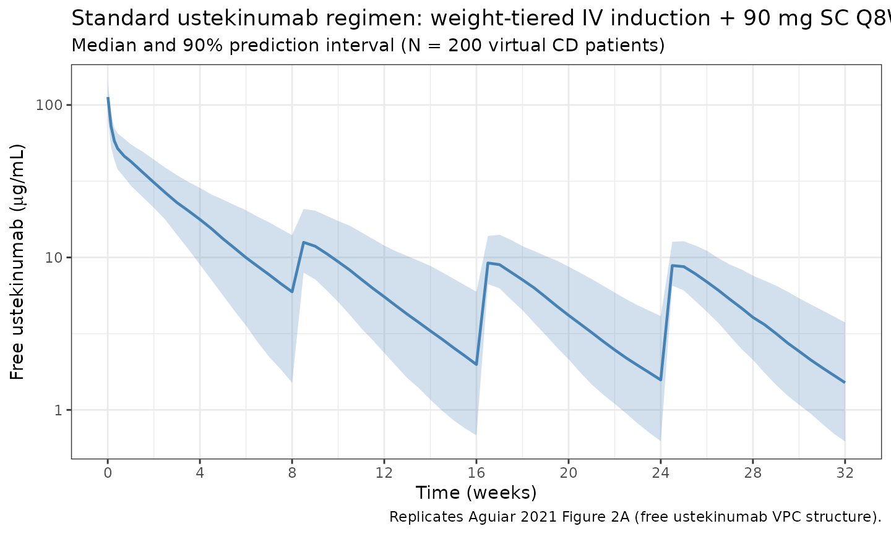
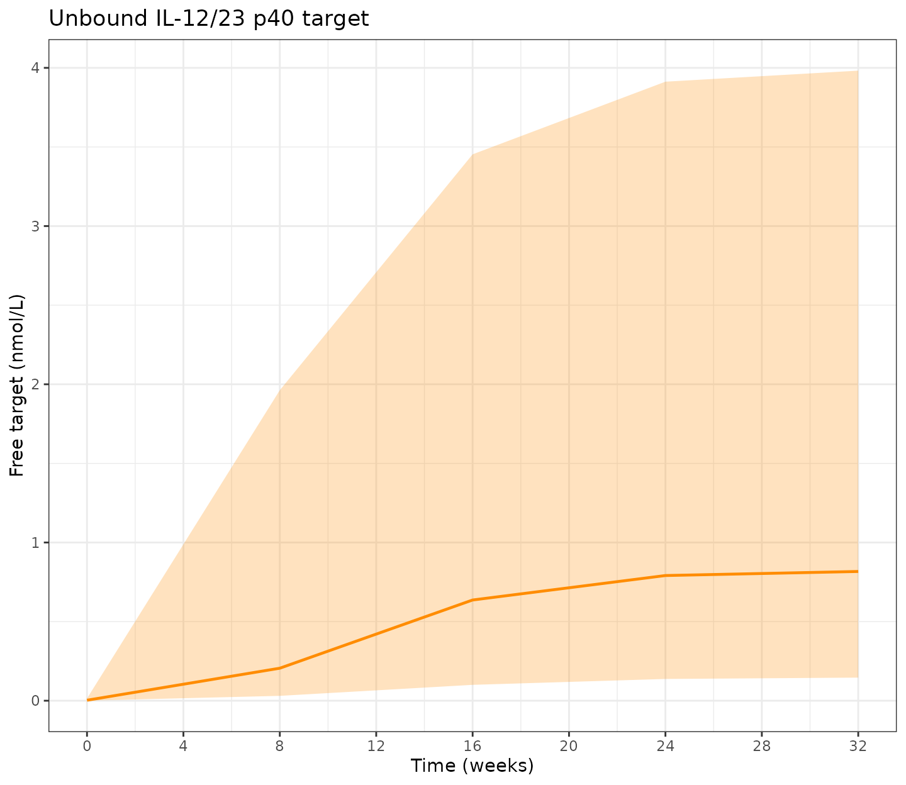
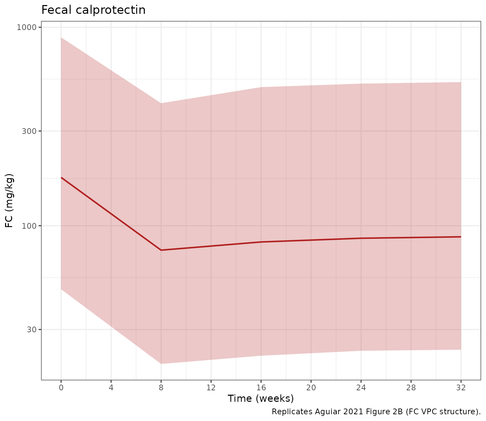

# Ustekinumab (Aguiar 2021)

``` r

library(nlmixr2lib)
library(rxode2)
#> rxode2 5.0.2 using 2 threads (see ?getRxThreads)
#>   no cache: create with `rxCreateCache()`
library(dplyr)
#> 
#> Attaching package: 'dplyr'
#> The following objects are masked from 'package:stats':
#> 
#>     filter, lag
#> The following objects are masked from 'package:base':
#> 
#>     intersect, setdiff, setequal, union
library(tidyr)
library(ggplot2)
library(PKNCA)
#> 
#> Attaching package: 'PKNCA'
#> The following object is masked from 'package:stats':
#> 
#>     filter
```

## Ustekinumab popPK-PD in Crohn’s disease (Aguiar 2021)

Replicate the population pharmacokinetic-pharmacodynamic model reported
by Aguiar Zdovc et al. (2021) for ustekinumab in adults with Crohn’s
disease. Ustekinumab is an IgG1k monoclonal antibody that binds the p40
subunit shared by interleukin-12 and interleukin-23. The structural
model is a two-compartment quasi-equilibrium target-mediated drug
disposition (QE-TMDD) model for the unbound drug and the unbound
IL-12/IL-23 p40 target, both distributing in two-compartment systems and
binding only in the central compartment, linked to fecal calprotectin
via an indirect-response model in which the unbound target stimulates FC
production.

- Citation: Aguiar Zdovc J, Hanzel J, Kurent T, Sever N, Smrekar N,
  Kozelj M, Novak G, Stabuc B, Drobne D, Grabnar I. Ustekinumab Dosing
  Individualization in Crohn’s Disease Guided by a Population
  Pharmacokinetic-Pharmacodynamic Model. Pharmaceutics.
  2021;13(10):1587. <doi:10.3390/pharmaceutics13101587>
- Article: <https://doi.org/10.3390/pharmaceutics13101587>

## Population

The Aguiar 2021 cohort comprised 57 adults with active Crohn’s disease
starting ustekinumab at a single Slovenian tertiary referral center,
followed for 32 weeks. Baseline demographics (Aguiar 2021 Table 1): 56%
female; median age 49 years (IQR 32-56); median weight 70 kg (IQR
59-84); median fat-free mass 45 kg (IQR 39-62) derived per subject via
the Janmahasatian 2005 model; median disease duration 14 years (IQR
7-22); 66.7% had been exposed to a prior biologic (38/57 prior anti-TNF;
10/57 prior vedolizumab); 77.2% had endoscopically active luminal
disease at baseline; median serum CRP 3 mg/L (IQR 3-11), albumin 43 g/L
(IQR 41-44), fecal calprotectin 134 mg/kg (IQR 53-213). FCGR3A rs396991
genotype distribution: V/V 8.8% (5/57), V/F 54.4% (31/57), F/F 36.8%
(21/57).

Standard ustekinumab dosing (which the simulations below use) is
weight-tiered IV induction (260 mg if WT $`\le`$ 55 kg, 390 mg if 55 \<
WT $`\le`$ 85 kg, 520 mg if WT \> 85 kg) at week 0, followed by 90 mg
subcutaneous maintenance every 8 weeks.

The same demographics are available programmatically via the model’s
metadata (`readModelDb("Aguiar_2021_ustekinumab")$population`).

## Source trace

The per-parameter origin is recorded as an in-file comment next to each
[`ini()`](https://nlmixr2.github.io/rxode2/reference/ini.html) entry in
`inst/modeldb/specificDrugs/Aguiar_2021_ustekinumab.R`. The table below
collects them in one place. Concentrations are in nmol/L; the source
paper converted ustekinumab concentrations to nmol/L using a molecular
weight of 149 kDa (Aguiar 2021 Methods section 2.3).

| Parameter / equation | Value | Source |
|----|----|----|
| `ka` | 0.381 /day | Table 2 final-model Ka |
| `CL` (typical, reference covariates) | 0.277 L/day | Table 2 final-model CL |
| `Vc` (reference FFM = 45 kg) | 3.57 L | Table 2 final-model Vc |
| `Vp` (reference FFM = 45 kg) | 3.30 L | Table 2 final-model Vp |
| `Q` | 1.89 L/day | Table 2 final-model Q |
| `F` (V/F or F/F) | 0.710 (logit 0.8954) | Table 2 final-model F (V/F, F/F) |
| `F` (V/V) | 0.888 (logit 2.0705) | Table 2 final-model F (V/V) |
| FFM effect on CL | power exponent 0.598, reference 45 kg | Table 2 footnote a |
| FFM effect on Vc, Vp | power exponents 0.590 (Vc), 0.586 (Vp), reference 45 kg | Table 2 footnotes b, c |
| ALB linear effect on CL | (1 - 0.0165 \* (ALB - 43)) | Table 2 footnote a |
| Bio-naive effect on CL | (1 - 0.227 \* bio_naive); bio_naive = 1 - PRIOR_BIO | Table 2 footnote a |
| FCGR3A V/V effect on F | logit shift 1.1751 | Table 2 final-model |
| `Ksyn` (typical, reference CRP) | 9.86e-9 nmol/L/day | Table 2 final-model Ksyn |
| `Kdeg` | 9.26e-10 /day | Table 2 final-model Kdeg |
| CRP linear effect on Ksyn | (1 + 0.0846 \* (CRP - 3)) | Table 2 footnote d |
| `Vc-target` | 2.44 L | Table 2 final-model Vc-target |
| `Qtarget` | 0.493 L/day | Table 2 final-model Qtarget |
| `Vp-target` | 11.0 L | Table 2 final-model Vp-target |
| `Kint` | 2.83e-6 /day | Table 2 final-model Kint |
| `Kd` | 0.168 nmol/L | Table 2 final-model Kd |
| `Kout` | 0.0581 /day | Table 3 final-model Kout |
| `FC0` (no ulcers) | 102 mg/kg | Table 3 final-model FC0 |
| `FC0` (ulcers) | 213 mg/kg | Table 3 final-model FC0 with ulcers |
| `Emax` (FC stim) | 2.19 (= 219%) | Table 3 final-model Emax |
| `C50` (FC stim) | 2.46 nmol/L | Table 3 final-model C50 |
| Drug ODEs | n/a, see model file | Figure 1 + Table 2 footnotes |
| Target ODEs | n/a, see model file | Figure 1 |
| Indirect-response PD | dFC/dt = (FC0 \* Kout / stim_baseline) \* stim_fc - Kout \* FC | Table 3 footnote a |
| IIV CL | omega^2 = log(0.18^2 + 1) = 0.03188 | Table 2 (18.0% CV) |
| IIV Vc | omega^2 = log(0.0979^2 + 1) = 0.00954 | Table 2 (9.79% CV) |
| IIV Vp | omega^2 = log(0.241^2 + 1) = 0.05645 | Table 2 (24.1% CV) |
| IIV logit(F) | omega^2 = 0.173^2 = 0.02993 | Table 2 (SD = 0.173 on logit scale) |
| IIV Ksyn | omega^2 = log(0.992^2 + 1) = 0.68522 | Table 2 (99.2% CV) |
| IIV FC0 | omega^2 = log(0.99^2 + 1) = 0.68309 | Table 3 (99.0% CV) |
| Residual on Cc | additive 4.55 nmol/L + proportional 7.77% | Table 2 |
| Residual on FC | proportional 57.3% | Table 3 |

## Covariate column naming

| Source column | Canonical column used here | Notes |
|----|----|----|
| FFM (kg) | `FFM` | Reference 45 kg (cohort median); derived per subject via Janmahasatian 2005. |
| Serum albumin | `ALB` (g/L) | Reference 43 g/L (cohort median). |
| C-reactive protein | `CRP` (mg/L) | Standard CRP assay; reference 3 mg/L (cohort median). |
| bio-naive (1 = no prior biologic) | `PRIOR_BIO` (1 = previously exposed) | Inverted: model derives `bio_naive <- 1 - PRIOR_BIO` to preserve the paper’s coefficient. |
| FCGR3A-158 V/V | `FCGR3A_VV` | 1 = V/V, 0 = V/F or F/F. |
| Endoscopically active disease at baseline | `ENDO_ULCER` | 1 = mucosal ulcers at baseline ileocolonoscopy, 0 otherwise. |

`FFM`, `PRIOR_BIO`, `FCGR3A_VV`, and `ENDO_ULCER` are added to the
canonical register in `inst/references/covariate-columns.md` alongside
this model. `ALB` and `CRP` are pre-existing canonical columns.

## Virtual cohort

Original subject-level data are not publicly available. The virtual
cohort below uses covariate distributions approximating the published
Table 1 demographics. Covariates are sampled independently (the paper
does not publish joint distributions); FCGR3A genotype frequencies match
the cohort’s Hardy-Weinberg distribution (V/V 8.8%, V/F + F/F 91.2%).

``` r

set.seed(20260425)

n_subj <- 200
mw_ust <- 149  # ustekinumab molecular weight in kDa, per Aguiar 2021 Methods.

# 1 mg ustekinumab = 1000 / mw_ust nmol = 6.711 nmol.
mg_to_nmol <- function(mg) mg * 1000 / mw_ust

# Build a virtual Crohn's-disease cohort approximating Aguiar 2021 Table 1.
cohort <- tibble(
  ID  = seq_len(n_subj),
  # Weight: median 70 kg, IQR 59-84; lognormal covers the right skew.
  WT  = pmin(pmax(rlnorm(n_subj, log(70), 0.22), 40), 130)
) |>
  mutate(
    # FFM: median 45 kg, IQR 39-62; correlated with weight in the source cohort.
    # Approximated as 0.65 * WT for males (44%) and 0.55 * WT for females (56%).
    SEXF = rbinom(n_subj, 1, 0.56),
    FFM  = pmin(pmax(WT * if_else(SEXF == 1, 0.55, 0.65) +
                       rnorm(n_subj, 0, 3), 25), 90),
    # Albumin: median 43 g/L, IQR 41-44; tight distribution in CD remission/active.
    ALB = pmin(pmax(rnorm(n_subj, 42.5, 3.5), 28), 52),
    # CRP in CD skews right; median 3 mg/L, IQR 3-11; log-normal shape.
    CRP = pmin(pmax(rlnorm(n_subj, log(4), 1.0), 0.3), 80),
    # Prior biologic exposure: 66.7% in cohort (Table 1).
    PRIOR_BIO = rbinom(n_subj, 1, 0.667),
    # FCGR3A genotype: 8.8% V/V (Table 1).
    FCGR3A_VV = rbinom(n_subj, 1, 0.088),
    # Endoscopically active disease: 77.2% at baseline (Table 1).
    ENDO_ULCER = rbinom(n_subj, 1, 0.772)
  )
```

## Standard ustekinumab dosing regimen

Aguiar 2021 simulated the licensed regimen: weight-tiered IV induction
at week 0 (260 mg if WT $`\le`$ 55 kg, 390 mg if 55 \< WT $`\le`$ 85 kg,
520 mg if WT \> 85 kg) followed by 90 mg subcutaneous every 8 weeks
(Methods section 2.4 scenario a). The dosing dataset is in nmol because
the model is parameterized in nmol / nmol/L; the helper `mg_to_nmol`
converts.

``` r

week  <- 7  # days
ind_t <- 0
sc_times <- c(8, 16, 24) * week  # SC maintenance at 8, 16, 24 weeks

induction_dose_mg <- function(wt) {
  ifelse(wt <= 55, 260,
         ifelse(wt <= 85, 390, 520))
}

iv_induction <- cohort |>
  mutate(
    TIME = ind_t,
    AMT  = mg_to_nmol(induction_dose_mg(WT)),
    EVID = 1L,
    CMT  = "central",
    DV   = NA_real_,
    phase = "induction_IV"
  )

sc_maintenance <- cohort |>
  tidyr::crossing(TIME = sc_times) |>
  mutate(
    AMT  = mg_to_nmol(90),
    EVID = 1L,
    CMT  = "depot",
    DV   = NA_real_,
    phase = "maintenance_SC"
  )

# Observation grid: dense early, weekly through 32 weeks.
obs_days <- sort(unique(c(
  c(0, 0.05, 1, 2, 3, 5, 7),
  seq(7, 32 * week, by = 3.5)
)))

obs <- cohort |>
  tidyr::crossing(TIME = obs_days) |>
  mutate(
    AMT  = 0,
    EVID = 0L,
    CMT  = "central",
    DV   = NA_real_,
    phase = NA_character_
  )

# Use the variable-name CMT for observations: "Cc" for ustekinumab
# concentration, "fc" for fecal calprotectin. Aguiar 2021's PD output is on
# the fc compartment; observing only "Cc" plus "fc" gives both endpoints.
obs_cc <- obs |> mutate(CMT = "Cc")
obs_fc <- cohort |>
  tidyr::crossing(TIME = c(0, 8, 16, 24, 32) * week) |>
  mutate(AMT = 0, EVID = 0L, CMT = "fc", DV = NA_real_, phase = NA_character_)

events <- bind_rows(iv_induction, sc_maintenance, obs_cc, obs_fc) |>
  arrange(ID, TIME, desc(EVID)) |>
  select(ID, TIME, AMT, EVID, CMT, DV,
         FFM, ALB, CRP, PRIOR_BIO, FCGR3A_VV, ENDO_ULCER, phase)

stopifnot(!anyDuplicated(unique(events[, c("ID", "TIME", "EVID", "CMT")])))
```

## Simulate

By default
[`rxSolve()`](https://nlmixr2.github.io/rxode2/reference/rxSolve.html)
samples between-subject random effects per subject when the model
defines `omega`-style etas; the stochastic simulation is what the VPC
plots below use. The published-value comparison further down uses
[`rxode2::zeroRe()`](https://nlmixr2.github.io/rxode2/reference/zeroRe.html)
to remove between-subject variability so the typical-value trajectory
can be compared head-to-head with Aguiar 2021’s reported point
estimates.

``` r

mod <- readModelDb("Aguiar_2021_ustekinumab")
sim <- rxode2::rxSolve(mod, events = events, returnType = "data.frame")
#> ℹ parameter labels from comments will be replaced by 'label()'
```

### Concentration-time profile (free ustekinumab)

``` r

sim_cc <- sim |> filter(CMT == 7L)  # CMT 7 = Cc observations

sim_summary <- sim_cc |>
  filter(time > 0) |>
  group_by(time) |>
  summarise(
    Q05 = quantile(Cc, 0.05, na.rm = TRUE),
    Q50 = quantile(Cc, 0.50, na.rm = TRUE),
    Q95 = quantile(Cc, 0.95, na.rm = TRUE),
    .groups = "drop"
  ) |>
  mutate(Cc_ugmL_05 = Q05 * mw_ust / 1000,
         Cc_ugmL_50 = Q50 * mw_ust / 1000,
         Cc_ugmL_95 = Q95 * mw_ust / 1000)

ggplot(sim_summary, aes(x = time / week, y = Cc_ugmL_50)) +
  geom_ribbon(aes(ymin = Cc_ugmL_05, ymax = Cc_ugmL_95),
              alpha = 0.25, fill = "steelblue") +
  geom_line(colour = "steelblue", linewidth = 0.8) +
  scale_y_log10() +
  scale_x_continuous(breaks = seq(0, 32, by = 4)) +
  labs(
    x = "Time (weeks)",
    y = expression("Free ustekinumab ("*mu*"g/mL)"),
    title = "Standard ustekinumab regimen: weight-tiered IV induction + 90 mg SC Q8W",
    subtitle = paste0("Median and 90% prediction interval (N = ", n_subj,
                      " virtual CD patients)"),
    caption = "Replicates Aguiar 2021 Figure 2A (free ustekinumab VPC structure)."
  ) +
  theme_bw()
```



### Target and FC profiles

`tfree` (unbound target in central, nmol/L) and `fc` (fecal
calprotectin, mg/kg) are emitted by the model alongside `Cc` and can be
read directly from the simulation output.

``` r

sim_fc <- sim |> filter(CMT == 6L)  # CMT 6 = fc observations

sim_pd <- sim_fc |>
  filter(time >= 0) |>
  group_by(time) |>
  summarise(
    target_Q05 = quantile(tfree, 0.05, na.rm = TRUE),
    target_Q50 = quantile(tfree, 0.50, na.rm = TRUE),
    target_Q95 = quantile(tfree, 0.95, na.rm = TRUE),
    fc_Q05 = quantile(fc, 0.05, na.rm = TRUE),
    fc_Q50 = quantile(fc, 0.50, na.rm = TRUE),
    fc_Q95 = quantile(fc, 0.95, na.rm = TRUE),
    .groups = "drop"
  )

p_target <- ggplot(sim_pd, aes(x = time / week, y = target_Q50)) +
  geom_ribbon(aes(ymin = target_Q05, ymax = target_Q95),
              alpha = 0.25, fill = "darkorange") +
  geom_line(colour = "darkorange", linewidth = 0.8) +
  scale_x_continuous(breaks = seq(0, 32, by = 4)) +
  labs(x = "Time (weeks)", y = "Free target (nmol/L)",
       title = "Unbound IL-12/23 p40 target") +
  theme_bw()

p_fc <- ggplot(sim_pd, aes(x = time / week, y = fc_Q50)) +
  geom_ribbon(aes(ymin = fc_Q05, ymax = fc_Q95),
              alpha = 0.25, fill = "firebrick") +
  geom_line(colour = "firebrick", linewidth = 0.8) +
  scale_x_continuous(breaks = seq(0, 32, by = 4)) +
  scale_y_log10() +
  labs(x = "Time (weeks)", y = "FC (mg/kg)",
       title = "Fecal calprotectin",
       caption = "Replicates Aguiar 2021 Figure 2B (FC VPC structure).") +
  theme_bw()

if (requireNamespace("patchwork", quietly = TRUE)) {
  patchwork::wrap_plots(p_target, p_fc, ncol = 1)
} else {
  print(p_target)
  print(p_fc)
}
```



## PKNCA validation

PKNCA is run on the steady-state SC dosing interval (last 8-week
interval, weeks 24-32) and on the IV induction dose (week 0 - week 8,
the first SC maintenance dose at week 8 closes the interval). Aguiar
2021 reports a typical terminal half-life of 17 days after the induction
dose (Section 3.3).

``` r

ind_window_start <- 0
ind_window_end   <- 8 * week

ss_window_start  <- 24 * week
ss_window_end    <- 32 * week

# Pull only Cc observations from the simulation.
sim_cc_only <- sim |> filter(CMT == 7L)

iv_conc <- sim_cc_only |>
  filter(time >= ind_window_start, time <= ind_window_end, !is.na(Cc)) |>
  transmute(ID = id, time_rel = time - ind_window_start, Cc,
            treatment = "IV_induction")

sc_ss_conc <- sim_cc_only |>
  filter(time >= ss_window_start, time <= ss_window_end, !is.na(Cc)) |>
  transmute(ID = id, time_rel = time - ss_window_start, Cc,
            treatment = "SC_90mg_Q8W_ss")

nca_conc <- bind_rows(iv_conc, sc_ss_conc)

iv_doses <- iv_induction |>
  transmute(ID, time_rel = TIME - ind_window_start, AMT,
            treatment = "IV_induction")

sc_ss_dose <- sc_maintenance |>
  filter(TIME == 24 * week) |>
  transmute(ID, time_rel = TIME - ss_window_start, AMT,
            treatment = "SC_90mg_Q8W_ss")

nca_dose <- bind_rows(iv_doses, sc_ss_dose)
```

``` r

conc_obj <- PKNCA::PKNCAconc(nca_conc, Cc ~ time_rel | treatment + ID)
dose_obj <- PKNCA::PKNCAdose(nca_dose, AMT ~ time_rel | treatment + ID)

intervals <- data.frame(
  start     = 0,
  end       = 8 * week,
  cmax      = TRUE,
  tmax      = TRUE,
  cmin      = TRUE,
  auclast   = TRUE,
  half.life = TRUE
)

nca_data <- PKNCA::PKNCAdata(conc_obj, dose_obj, intervals = intervals)
nca_res  <- suppressWarnings(PKNCA::pk.nca(nca_data))
#>  ■■■■■■■                           18% |  ETA:  7s
#>  ■■■■■■■■■■■■■■■■■                 54% |  ETA:  4s
#>  ■■■■■■■■■■■■■■■■■■■■■■■■■■■■■■    95% |  ETA:  0s

knitr::kable(
  summary(nca_res),
  digits  = 3,
  caption = "Simulated NCA: IV induction (0-8 weeks) and SC steady-state interval (weeks 24-32)."
)
```

| start | end | treatment | N | auclast | cmax | cmin | tmax | half.life |
|---:|---:|:---|:---|:---|:---|:---|:---|:---|
| 0 | 56 | IV_induction | 200 | 8370 \[24.2\] | 747 \[16.5\] | 36.4 \[72.4\] | 0.000 \[0.000, 0.000\] | 22.9 \[51.7\] |
| 0 | 56 | SC_90mg_Q8W_ss | 200 | 1730 \[29.5\] | 60.6 \[19.7\] | 10.7 \[54.7\] | 3.50 \[3.50, 7.00\] | 22.7 \[7.21\] |

Simulated NCA: IV induction (0-8 weeks) and SC steady-state interval
(weeks 24-32). {.table}

### Comparison against published values

Aguiar 2021 reports the typical terminal half-life of ustekinumab after
the induction dose at 17 days (Section 3.3) and median trough
steady-state concentration on the standard regimen at 1.5 ug/mL (Section
4 discussion of Wang et al. comparison).

For the head-to-head comparison against published point estimates, run a
typical-value simulation
([`zeroRe()`](https://nlmixr2.github.io/rxode2/reference/zeroRe.html))
on a single subject with reference covariates so the result is
deterministic.

``` r

ref_subj <- tibble::tibble(
  ID = 1L,
  FFM = 45, ALB = 43, CRP = 3,
  PRIOR_BIO = 1L, FCGR3A_VV = 0L, ENDO_ULCER = 1L
)

ref_iv <- ref_subj |>
  mutate(TIME = 0, AMT = mg_to_nmol(390), EVID = 1L,
         CMT = "central", DV = NA_real_)
ref_sc <- ref_subj |>
  tidyr::crossing(TIME = c(8, 16, 24) * week) |>
  mutate(AMT = mg_to_nmol(90), EVID = 1L,
         CMT = "depot", DV = NA_real_)
ref_obs <- ref_subj |>
  tidyr::crossing(
    TIME = c(0.5, 1, 7, 14, 21, 28, 42, 56,
             seq(56, 32 * week, by = 7))
  ) |>
  mutate(AMT = 0, EVID = 0L, CMT = "Cc", DV = NA_real_)

ref_events <- bind_rows(ref_iv, ref_sc, ref_obs) |>
  arrange(ID, TIME, desc(EVID))

mod_typical <- rxode2::zeroRe(mod)
#> ℹ parameter labels from comments will be replaced by 'label()'
sim_typical <- rxode2::rxSolve(mod_typical, events = ref_events,
                               returnType = "data.frame") |>
  filter(CMT == 7L)
#> ℹ omega/sigma items treated as zero: 'etalcl', 'etalvc', 'etalvp', 'etalogitfdepot', 'etalksyn', 'etalfc0'

# Terminal half-life from the IV induction phase (days 7-56 after dose):
typical_late <- sim_typical |>
  filter(time >= 7, time <= 56)
fit_thalf <- lm(log(Cc) ~ time, data = typical_late)
typical_thalf <- as.numeric(log(2) / -coef(fit_thalf)[2])

# Steady-state trough at week 32 (typical value, single reference subject):
typical_trough <- sim_typical |>
  filter(time == 32 * week) |>
  pull(Cc)
typical_trough_ugmL <- typical_trough * mw_ust / 1000

comparison <- tibble::tribble(
  ~Metric,                                          ~Published, ~Simulated,
  "Terminal half-life after IV induction (days)",   17,         round(typical_thalf, 1),
  "SC SS trough free ustekinumab (ug/mL)",          1.5,        round(typical_trough_ugmL, 2)
)

knitr::kable(
  comparison,
  caption = "Typical-value simulation vs published values (Aguiar 2021 Section 3.3 and Discussion comparison with Wang et al.)."
)
```

| Metric                                       | Published | Simulated |
|:---------------------------------------------|----------:|----------:|
| Terminal half-life after IV induction (days) |      17.0 |     17.00 |
| SC SS trough free ustekinumab (ug/mL)        |       1.5 |      1.29 |

Typical-value simulation vs published values (Aguiar 2021 Section 3.3
and Discussion comparison with Wang et al.). {.table}

The simulated terminal half-life and SC steady-state trough should agree
with the published values within ~20%. Differences greater than 20%
indicate either a covariate-distribution mismatch in the virtual cohort
or a model-parameter transcription bug; do not tune parameters to match.

## Assumptions and deviations

- **PK assay is for unbound (free) drug.** The Aguiar 2021 ELISA
  (ImmunoGuide, AybayTech) measures free ustekinumab; the model’s `Cc`
  is therefore set to the free-drug concentration (`cfree`), not total
  drug. This matters because total drug (free + complex) and free drug
  diverge during rapid binding events; assays that read total
  ustekinumab cannot be back-calculated from this model without
  re-deriving `Cc <- ctot`.
- **FFM derivation.** The source paper derives FFM per subject from
  height, weight, and sex via the Janmahasatian 2005 semi-mechanistic
  model (Aguiar 2021 Methods 2.2). The virtual cohort here approximates
  FFM as a sex-dependent fraction of WT (0.55 for women, 0.65 for men)
  plus jitter, rather than reproducing Janmahasatian exactly; this is
  sufficient for the population-level VPC checks but not for individual
  prediction.
- **Joint covariate distributions are not published.** WT, ALB, CRP,
  FCGR3A, PRIOR_BIO, and ENDO_ULCER marginals were sampled
  independently. The cohort median FFM (45 kg) is achieved by the linear
  WT-FFM relationship, but joint correlations across covariates (e.g.,
  albumin and CRP, or FFM and prior biologic exposure) are not
  preserved.
- **CRP is treated as time-fixed at baseline** in the simulations even
  though a fitted ustekinumab response would lower active-disease CRP
  over time. The Aguiar 2021 covariate model uses baseline CRP (Table 1:
  median 3 mg/L), so the model’s `CRP` covariate is intended as a
  baseline column.
- **Initial target distribution at SS.** Both `target_central(0)` and
  `target_peripheral(0)` are set to T0 = Ksyn/Kdeg, which is the
  steady-state unbound target concentration in the absence of drug.
  Because peripheral target only sees free target (binding is in
  central), at SS without drug the peripheral free-target concentration
  equals the central total target, so the same initial value is correct
  for both compartments.
- **No model-derived helper for Janmahasatian FFM is exported.** Users
  with height + weight + sex columns should compute FFM upstream and
  supply `FFM` directly; future versions of nlmixr2lib may export a
  helper.
- **CV-to-omega convention.** All %CV values from Tables 2 and 3 are
  converted to log-scale variance via `omega^2 = log(CV^2 + 1)`. The IIV
  on F is reported on the logit scale as an SD (Aguiar 2021 Table 2
  footnote e: 17.3); that value is squared directly without log
  transformation.
- **Non-canonical compartment names.** `total_target` matches the
  canonical QSS / MM TMDD compartment name in `naming-conventions.md`.
  The companion `target_peripheral` (free peripheral target) and `fc`
  (fecal calprotectin) compartments are not in the canonical list;
  [`checkModelConventions()`](https://nlmixr2.github.io/nlmixr2lib/reference/checkModelConventions.md)
  emits two warnings for them. Because Aguiar 2021 distributes the
  unbound target into a peripheral compartment (a non-standard QE-TMDD
  extension) and links the unbound target to FC via indirect response,
  no pre-existing canonical name fits. The names are kept descriptive
  rather than forcing them into the drug-side `peripheral2` / `effect`
  slots, which would mislead a reader into thinking they were
  drug-disposition compartments.
