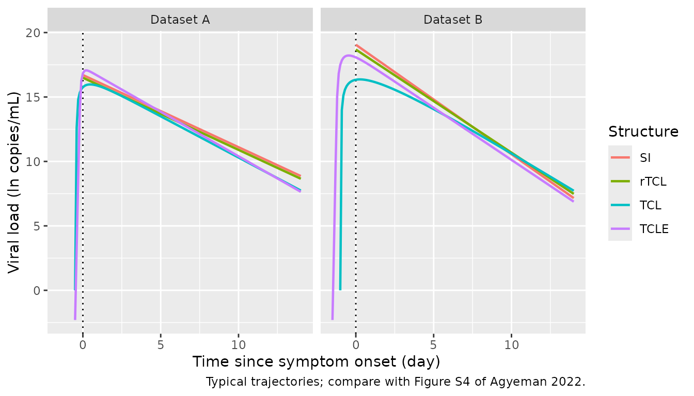

# SARS-CoV-2 viral dynamic models (Agyeman 2022)

## Model and source

- Citation: Agyeman AA, You T, Chan PLS, Lonsdale DO, Hadjichrysanthou
  C, Mahungu T, Wey EQ, Lowe DM, Lipman MCI, Breuer J, Kloprogge F,
  Standing JF. Comparative assessment of viral dynamic models for
  SARS-CoV-2 for pharmacodynamic assessment in early treatment trials.
  Br J Clin Pharmacol. 2022;88(12):5428-5433. <doi:10.1111/bcp.15518>
- Article: [Br J Clin Pharmacol
  2022;88(12):5428-5433](https://doi.org/10.1111/bcp.15518) (open
  access, PMC9538685); parameter estimates are in Supporting Information
  Tables S2 and S3.

Agyeman et al. compared four published viral dynamic model structures
for SARS-CoV-2 when fitted to Phase-II-like viral load time courses: the
slope-intercept exponential decay model (SI), the reduced
target-cell-limited model (rTCL), the target-cell-limited model (TCL)
and the TCL model with an eclipse phase (TCLE). Each structure was
fitted separately to two datasets in nlmixr 2.0.6 (SAEM), so the paper
reports eight independent fits. Each fit is a separate model in
nlmixr2lib:

| Structure | Dataset A (Gastine 2021) | Dataset B (Neant 2021) |
|----|----|----|
| SI | `Agyeman_2022_covid19_si_gastine` | `Agyeman_2022_covid19_si_neant` |
| rTCL | `Agyeman_2022_covid19_rtcl_gastine` | `Agyeman_2022_covid19_rtcl_neant` |
| TCL | `Agyeman_2022_covid19_tcl_gastine` | `Agyeman_2022_covid19_tcl_neant` |
| TCLE | `Agyeman_2022_covid19_tcle_gastine` | `Agyeman_2022_covid19_tcle_neant` |

``` r

model_names <- tidyr::expand_grid(
  structure = c("SI", "rTCL", "TCL", "TCLE"),
  dataset = c("A", "B")
) |>
  mutate(
    name = paste0(
      "Agyeman_2022_covid19_", tolower(structure), "_",
      ifelse(dataset == "A", "gastine", "neant")
    )
  )
uis <- lapply(setNames(model_names$name, model_names$name), function(nm) {
  rxode2::rxode(readModelDb(nm))
})
```

## Population

**Dataset A** comprises 252 patients with 747 viral load samples,
compiled at the patient level by the systematic review and meta-analysis
of Gastine et al. (2021). Most patients had mild disease (one death was
reported). Agyeman et al. kept only untreated patients and
upper-respiratory-tract samples.

**Dataset B** comprises 321 patients with 563 nasopharyngeal viral load
samples from the prospective French COVID cohort analysed by Neant et
al. (2021). All patients were hospitalised (conventional wards or
intensive care), 78 died during follow-up, and patients received routine
antiviral, antibiotic, antifungal or corticosteroid treatment.

Both datasets were limited to the first 14 days after symptom onset.
Age, sex and other demographics are reported in the two source
publications, not in Agyeman 2022. The same information is available
programmatically:

``` r

str(readModelDb("Agyeman_2022_covid19_si_neant")()$population[
  c("species", "n_subjects", "n_observations", "disease_state")
])
#> List of 4
#>  $ species       : chr "human"
#>  $ n_subjects    : int 321
#>  $ n_observations: int 563
#>  $ disease_state : chr "COVID-19 (SARS-CoV-2 infection) requiring hospitalisation in conventional wards or intensive care units; 78 dea"| __truncated__
```

## Source trace

Every `ini()` value carries an in-file comment naming its source. The
table collects them. Values are Table S2 (dataset A) and Table S3
(dataset B) of the Supporting Information; initial conditions are the
footnote shared by both tables; incubation periods come from the Results
text and Figures S1 and S2.

| Parameter (unit) | SI A | rTCL A | TCL A | TCLE A | SI B | rTCL B | TCL B | TCLE B |
|----|----|----|----|----|----|----|----|----|
| V(0) at symptom onset, `lrbase` (copies/mL) | 1.8e7 | 1.46e7 | \- | \- | 1.89e8 | 1.3e8 | \- | \- |
| beta, `lbeta` ((copies/mL)^-1 day^-1) | \- | 5.0e-4 | 7.06e-4 | 7.76e-5 | \- | 1.27e-3 | 1.54e-3 | 9.79e-5 |
| delta, `ldelta` (1/day) | 0.56 | 0.56 | 1.84 | 0.69 | 0.85 | 0.80 | 0.74 | 0.81 |
| rho, `lrho` (copies/mL/day per cell/mL) | \- | \- | 0.28 | 2.96e3 | \- | \- | 0.29 | 2.84e3 |
| c, `lc` (1/day) | \- | \- | 0.64 | 11.6 | \- | \- | 0.93 | 2.62 |
| gamma, `lgamma` (1/day) | \- | 1 (fixed) | \- | \- | \- | 1 (fixed) | \- | \- |
| k, `lk` (1/day) | \- | \- | \- | 9.23 | \- | \- | \- | 8.87 |
| f(0), `f0` | \- | 1 (fixed) | \- | \- | \- | 1 (fixed) | \- | \- |
| T(0), `lT0` (cells/mL) | \- | \- | 1e8 | 1.3e5 | \- | \- | 1e8 | 1.3e5 |
| I1(0), `lI10` (cells/mL) | \- | \- | \- | 1/30 | \- | \- | \- | 1/30 |
| V(0) at infection, `lV0` (copies/mL) | \- | \- | 1 | 0.1 | \- | \- | 1 | 0.1 |
| Incubation period, `tinc` (day) | \- | \- | 0.5 | 0.5 | \- | \- | 1 | 1.5 |

| Equation | Source |
|----|----|
| SI: `d/dt(virus) = -delta * virus` | Equation 1 |
| rTCL: `d/dt(target) = -beta * f * V`; `d/dt(virus) = gamma * f * V - delta * V` | Equation 2 |
| TCL: T, I, V system | Equation 3 (sign of the infection term in dI/dt corrected; see Assumptions) |
| TCLE: T, I1, I2, V system, with virion loss `beta * T * V` in dV/dt | Equation 4 (sign of the infection term in dI1/dt corrected) |
| R0 = gamma / delta (SI, rTCL); rho beta T0 / (c delta) (TCL); rho beta T0 / (delta (c + beta T0)) (TCLE) | Equations 5, 6, 7 |
| L = 1 / delta | Equation 8 |
| IIV: log-normal on every estimated parameter; residual: additive on log viral load | Section 2.3 (magnitudes not reported) |

## Known-answer check: R0 and duration of virus production

Tables S2 and S3 report the basic reproduction number R0 and the
duration of virus production L for every fit. Both are closed-form
functions of the estimated parameters (Equations 5 to 8), so recomputing
them from the packaged `ini()` values tests the transcription of every
rate constant and initial condition at once: a wrong exponent on beta or
rho moves R0 by an order of magnitude.

``` r

r0_l <- function(ui, structure) {
  th <- ui$theta
  delta <- exp(th[["ldelta"]])
  r0 <- switch(structure,
    SI = NA_real_,
    rTCL = exp(th[["lgamma"]]) / delta,
    TCL = exp(th[["lrho"]] + th[["lbeta"]] + th[["lT0"]]) /
      (exp(th[["lc"]]) * delta),
    TCLE = exp(th[["lrho"]] + th[["lbeta"]] + th[["lT0"]]) /
      (delta * (exp(th[["lc"]]) + exp(th[["lbeta"]] + th[["lT0"]])))
  )
  c(R0 = r0, L = 1 / delta)
}

reported <- tibble::tribble(
  ~structure, ~dataset, ~R0_paper, ~L_paper,
  "SI",   "A", NA,    1.79,
  "rTCL", "A", 1.79,  1.79,
  "TCL",  "A", 16787, 0.54,
  "TCLE", "A", 1995,  1.45,
  "SI",   "B", NA,    1.18,
  "rTCL", "B", 1.25,  1.25,
  "TCL",  "B", 64894, 1.35,
  "TCLE", "B", 2908,  1.23
)

chk_r0 <- model_names |>
  rowwise() |>
  mutate(
    R0_model = r0_l(uis[[name]], structure)[["R0"]],
    L_model = r0_l(uis[[name]], structure)[["L"]]
  ) |>
  ungroup() |>
  left_join(reported, by = c("structure", "dataset")) |>
  mutate(
    R0_pct_diff = 100 * (R0_model / R0_paper - 1),
    L_pct_diff = 100 * (L_model / L_paper - 1)
  )

chk_r0 |>
  select(structure, dataset, R0_paper, R0_model, R0_pct_diff,
         L_paper, L_model, L_pct_diff) |>
  dplyr::rename(
    "Structure" = structure, "Dataset" = dataset,
    "R0 (paper)" = R0_paper, "R0 (model)" = R0_model,
    "R0 diff (%)" = R0_pct_diff, "L (paper, day)" = L_paper,
    "L (model, day)" = L_model, "L diff (%)" = L_pct_diff
  ) |>
  knitr::kable(digits = 3, caption = "R0 and L recomputed from the packaged parameters vs Tables S2/S3.")
```

| Structure | Dataset | R0 (paper) | R0 (model) | R0 diff (%) | L (paper, day) | L (model, day) | L diff (%) |
|:---|:---|---:|---:|---:|---:|---:|---:|
| SI | A | NA | NA | NA | 1.79 | 1.786 | -0.239 |
| SI | B | NA | NA | NA | 1.18 | 1.176 | -0.299 |
| rTCL | A | 1.79 | 1.786 | -0.239 | 1.79 | 1.786 | -0.239 |
| rTCL | B | 1.25 | 1.250 | 0.000 | 1.25 | 1.250 | 0.000 |
| TCL | A | 16787.00 | 16786.685 | -0.002 | 0.54 | 0.543 | 0.644 |
| TCL | B | 64894.00 | 64893.926 | 0.000 | 1.35 | 1.351 | 0.100 |
| TCLE | A | 1995.00 | 1995.392 | 0.020 | 1.45 | 1.449 | -0.050 |
| TCLE | B | 2908.00 | 2907.608 | -0.013 | 1.23 | 1.235 | 0.371 |

R0 and L recomputed from the packaged parameters vs Tables S2/S3.
{.table style="width:100%;"}

``` r


# The paper's R0 and L were computed from the same parameter values printed to
# 2-3 significant figures, so the only discrepancy is the rounding of the
# printed R0 / L itself (largest: L = 1/1.84 = 0.5435 printed as 0.54, 0.6 %).
stopifnot(
  max(abs(chk_r0$R0_pct_diff), na.rm = TRUE) < 1,
  max(abs(chk_r0$L_pct_diff)) < 1
)
```

All R0 and L values reproduce the published tables to within the
rounding of the printed numbers. The rTCL dataset B R0 is printed as
1.23 in the Results text but 1.25 in Table S3; 1 / 0.80 = 1.25 agrees
with the table.

## Simulation of typical viral load trajectories

All eight models are deterministic as packaged (the paper did not report
the IIV or residual-error magnitudes; see Assumptions), so a single
subject per model gives the typical trajectory. SI and rTCL run on time
since symptom onset. TCL and TCLE run on time since infection; their
`tsymptom` output (`time - tinc`) puts all eight on the common
symptom-onset axis.

``` r

sim_one <- function(name, structure, dataset) {
  ui <- uis[[name]]
  tinc <- if (structure %in% c("TCL", "TCLE")) ui$theta[["tinc"]] else 0
  ev <- rxode2::et(seq(0, 14 + tinc, by = 0.1))
  out <- as.data.frame(rxode2::rxSolve(ui, ev, returnType = "data.frame"))
  if (!"tsymptom" %in% names(out)) out$tsymptom <- out$time
  tibble(
    structure = structure, dataset = dataset,
    tsymptom = out$tsymptom, log10_viral_load = out$log10_viral_load
  )
}

sim <- bind_rows(lapply(seq_len(nrow(model_names)), function(i) {
  sim_one(model_names$name[i], model_names$structure[i], model_names$dataset[i])
})) |>
  mutate(
    ln_viral_load = log10_viral_load * log(10),
    structure = factor(structure, levels = c("SI", "rTCL", "TCL", "TCLE")),
    dataset = paste("Dataset", dataset)
  )
#> ℹ omega/sigma items treated as zero: 'etalrbase', 'etaldelta'
#> ℹ omega/sigma items treated as zero: 'etalrbase', 'etaldelta'
#> ℹ omega/sigma items treated as zero: 'etalrbase', 'etalbeta', 'etaldelta'
#> ℹ omega/sigma items treated as zero: 'etalrbase', 'etalbeta', 'etaldelta'
#> ℹ omega/sigma items treated as zero: 'etalbeta', 'etaldelta', 'etalrho', 'etalc'
#> ℹ omega/sigma items treated as zero: 'etalbeta', 'etaldelta', 'etalrho', 'etalc'
#> ℹ omega/sigma items treated as zero: 'etalbeta', 'etaldelta', 'etalrho', 'etalc', 'etalk'
#> ℹ omega/sigma items treated as zero: 'etalbeta', 'etaldelta', 'etalrho', 'etalc', 'etalk'
stopifnot(!anyNA(sim$log10_viral_load))
```

### Typical trajectories (Figure S4)

Figure S4 of the Supporting Information shows visual predictive checks
on the natural-log scale for each structure and dataset. The plot below
shows the typical (population-prediction) trajectory of each packaged
model on the same scale; with dataset A the observed medians in Figure
S4 sit near 14 ln copies/mL over the first 4 days after symptom onset
and fall to about 7 by day 13, and with dataset B they start near 19 and
fall to about 9 by day 11. Negative times are the pre-symptomatic phase
of the TCL and TCLE models.

``` r

ggplot(sim, aes(tsymptom, ln_viral_load, colour = structure)) +
  geom_vline(xintercept = 0, linetype = "dotted") +
  geom_line(linewidth = 0.8) +
  facet_wrap(~dataset) +
  labs(
    x = "Time since symptom onset (day)",
    y = "Viral load (ln copies/mL)",
    colour = "Structure",
    caption = "Typical trajectories; compare with Figure S4 of Agyeman 2022."
  )
```



### Cross-structure agreement

The paper’s main finding is that all four structures describe each
dataset similarly and give similar viral decline. The packaged models
should therefore agree with each other over the observation window once
the initial peak has passed.

``` r

agree <- sim |>
  filter(tsymptom >= 5 - 1e-8, tsymptom <= 13 + 1e-8) |>
  mutate(tsymptom = round(tsymptom, 1)) |>
  group_by(dataset, tsymptom) |>
  summarise(
    spread_ln = max(ln_viral_load) - min(ln_viral_load),
    .groups = "drop"
  )
agree |>
  group_by(dataset) |>
  summarise(max_spread_ln = max(spread_ln), .groups = "drop") |>
  dplyr::rename("Dataset" = dataset, "Max spread, days 5-13 (ln copies/mL)" = max_spread_ln) |>
  knitr::kable(digits = 2)
```

| Dataset   | Max spread, days 5-13 (ln copies/mL) |
|:----------|-------------------------------------:|
| Dataset A |                                 1.09 |
| Dataset B |                                 0.76 |

``` r


# A transcription error in beta, rho or c (an exponent slip) shifts the
# affected model's trajectory by several ln units; between the faithfully
# transcribed structures the spread is about 1.1 ln units (dataset A) and
# 0.8 (dataset B). The model is deterministic, so this does not vary by machine.
stopifnot(max(agree$spread_ln) < 3)
```

### SI model against its closed form

The SI model has the closed-form solution
`V(t) = V(0) * exp(-delta * t)`. The solver must reproduce it.

``` r

si_ui <- uis[["Agyeman_2022_covid19_si_gastine"]]
si_out <- as.data.frame(rxode2::rxSolve(
  si_ui, rxode2::et(seq(0, 14, by = 0.5)),
  rtol = 1e-10, atol = 1e-12, returnType = "data.frame"
))
#> ℹ omega/sigma items treated as zero: 'etalrbase', 'etaldelta'
closed <- (si_ui$theta[["lrbase"]] - exp(si_ui$theta[["ldelta"]]) * si_out$time) / log(10)
# Measured ~1e-9 under LSODA at these tolerances.
stopifnot(max(abs(si_out$log10_viral_load - closed)) < 1e-6)
```

## NCA

The models describe untreated natural-history viral load with no dosing,
so there is no exposure for PKNCA to summarise and the paper reports no
NCA metrics. Validation relies on the closed-form R0 / L reproduction
and the trajectory checks above.

## Sensitivity analysis with rho fixed

Because the TCLE fits gave implausibly large R0 values, the authors
refitted TCLE with rho fixed to 10 copies/mL/day (values marked with an
asterisk in Tables S2 and S3). These refits are a sensitivity analysis
and are not packaged as separate models. Recomputing R0 and L from the
printed refit parameters shows that the dataset A row is internally
consistent but the dataset B row is not:

``` r

rho_fix <- tibble::tribble(
  ~dataset, ~beta, ~delta, ~c, ~R0_paper, ~L_paper,
  "A", 2.28e-4, 0.43, 1.4, 22.21, 2.33,
  "B", 2.08e-4, 0.34, 2.73, 24.09, 2.44
) |>
  mutate(
    R0_recomputed = 10 * beta * 1.3e5 / (delta * (c + beta * 1.3e5)),
    L_recomputed = 1 / delta
  )
rho_fix |>
  mutate(beta = formatC(beta, format = "e", digits = 2)) |>
  dplyr::rename(
    "Dataset" = dataset, "beta" = beta, "delta (1/day)" = delta,
    "c (1/day)" = c, "R0 (paper)" = R0_paper, "L (paper, day)" = L_paper,
    "R0 (recomputed)" = R0_recomputed, "L (recomputed, day)" = L_recomputed
  ) |>
  knitr::kable(digits = 3)
```

| Dataset | beta | delta (1/day) | c (1/day) | R0 (paper) | L (paper, day) | R0 (recomputed) | L (recomputed, day) |
|:---|:---|---:|---:|---:|---:|---:|---:|
| A | 2.28e-04 | 0.43 | 1.40 | 22.21 | 2.33 | 22.207 | 2.326 |
| B | 2.08e-04 | 0.34 | 2.73 | 24.09 | 2.44 | 26.715 | 2.941 |

For dataset B the printed L of 2.44 days implies delta = 0.41/day rather
than the printed 0.34/day, and neither value reproduces the printed R0
of 24.09, so at least one entry of that column is misprinted. To use a
refit anyway, override the `ini()` values of the TCLE model (and
`lrho <- fixed(log(10))`); the incubation period used for the refits is
not reported.

## Assumptions and deviations

- **IIV and residual error not reported.** Section 2.3 states that
  log-normal random effects were estimated on every estimated parameter
  (with a full covariance matrix where the fit converged, otherwise
  diagonal) and that the residual error was additive on the
  log-transformed viral load. Neither the variances nor the residual SD
  are reported in the paper or its Supporting Information. The etas and
  `addSd` are therefore carried as `fixed(0)`, and the models produce
  typical-value trajectories only. Stochastic VPCs such as Figure S4
  cannot be reproduced.
- **Observation scale.** The paper fitted the natural log of viral load
  (Figures S3 and S4 are in ln copies/mL). The packaged models observe
  the library’s canonical `log10_viral_load`; `ln = log10 * log(10)`,
  and an additive SD on the ln scale divides by `log(10)` on the log10
  scale.
- **Sign of the infection term.** As printed, Equations 3 and 4 write
  `dI/dt = -beta*T*V - delta*I` and `dI1/dt = -beta*T*V - k*I1`, which
  would make the infected-cell populations negative. Figure 1 shows the
  infection flux moving cells from T into I (or I1), and the tabulated
  R0 values are reproduced by Equations 6 and 7 only for the standard
  target-cell-limited model with `+beta*T*V`. The models use the
  positive sign.
- **Time origin.** SI and rTCL start at symptom onset with the estimated
  viral load at onset V(0) and f(0) = 1. TCL and TCLE start at infection
  with the initial conditions in the Table S2/S3 footnote; symptom onset
  follows after the incubation period selected by the BIC sensitivity
  analysis (0.5 day for both models with dataset A; 1 day for TCL and
  1.5 days for TCLE with dataset B). The VPCs in Figure S4 confirm that
  TCL and TCLE were plotted on time since infection.
- **rTCL target-cell state.** The rTCL model tracks the fraction f of
  target cells remaining. It is stored in the `target` compartment with
  initial value 1, so `target` holds a fraction in the rTCL models and a
  cell density in the TCL and TCLE models.
- **Censoring.** Viral loads below the limit of detection were handled
  as censored observations in the fit (Section 2.3). Censoring is a
  property of the data, not of the model, and is not represented in the
  model files.
- **Treatment in dataset B.** Dataset B patients received routine
  treatment, including antivirals, which the authors did not model. The
  dataset B models describe the viral load as observed under that care.
- **rho-fixed refits** of TCLE are documented above but not packaged,
  because the paper presents them as a sensitivity analysis of R0
  plausibility rather than as final models.
