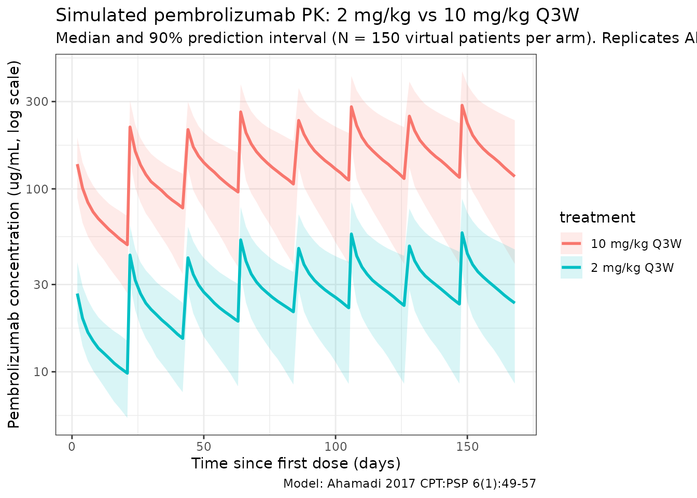
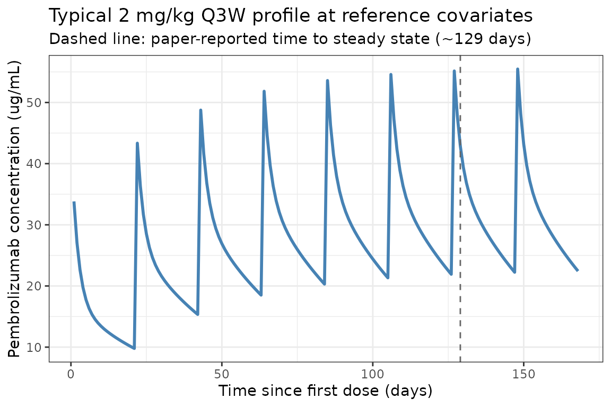

# Pembrolizumab (Ahamadi 2017)

## Model and source

- Citation: Ahamadi M, Freshwater T, Prohn M, Li CH, de Alwis DP, de
  Greef R, Elassaiss-Schaap J, Kondic A, Stone JA. Model-based
  characterization of the pharmacokinetics of pembrolizumab: a humanized
  anti-PD-1 monoclonal antibody in advanced solid tumors. *CPT
  Pharmacometrics Syst Pharmacol.* 2017;6(1):49-57.
  <doi:%5B10.1002/psp4.12139>\](<https://doi.org/10.1002/psp4.12139>)
- Description: Two-compartment population PK model for pembrolizumab
  (humanized anti-PD-1 IgG4 monoclonal antibody) with allometric scaling
  and covariate effects of sex, albumin, tumor type, ECOG performance
  status, prior ipilimumab status, eGFR, and baseline tumor burden in
  adults with advanced solid tumors.
- Modality: Therapeutic monoclonal antibody (IgG4), IV infusion.
- Article: <https://doi.org/10.1002/psp4.12139> (open access).

Pembrolizumab (MK-3475, KEYTRUDA) is a humanized anti-PD-1 IgG4
monoclonal antibody. Ahamadi 2017 presents the final population PK model
supporting the approved 2 mg/kg every 3 weeks (Q3W) dosing regimen,
pooling 2,188 patients with advanced solid tumors from three phase
II/III trials. Doses ranged from 1 to 10 mg/kg administered as IV
infusion every 2 or 3 weeks (Ahamadi 2017 Tables 1 and 2).

Structure: linear two-compartment IV model with stationary (time-
independent) clearance. Body weight allometric scaling acts on shared
CL/Q (exponent 0.595) and on shared Vc/Vp (exponent 0.489). The
population CL at the reference covariate vector is 0.22 L/day with a
central volume of distribution of 3.48 L, both consistent with values
typical of therapeutic monoclonal antibodies (Ahamadi 2017 Discussion).

## Population

The final-model population comprised **2,188 patients** across three
trials (Ahamadi 2017 Tables 1 and 2):

- KEYNOTE-001 (NCT01295827; phase Ib dose escalation and expansion in
  advanced melanoma and NSCLC): 1,223 patients.
- KEYNOTE-002 (NCT01704287; phase II in ipilimumab-refractory advanced
  melanoma): 421 patients.
- KEYNOTE-006 (NCT01866319; phase III in ipilimumab-naive advanced
  melanoma): 551 patients.
- Dose range 1-10 mg/kg IV infusion every 2 weeks (Q2W) or every 3 weeks
  (Q3W); 2 mg/kg Q3W is the approved adult dose.

Baseline demographics and covariate distributions (Ahamadi 2017 Table
2):

- Age 15-94 years (median 62).
- Sex: 59.1% male, 40.9% female.
- Cancer type: melanoma 73.7%, NSCLC 25.3%, other 1.01%.
- ECOG-PS: 0 (asymptomatic) 57.4%, 1 (symptomatic) 42.4%, 0.2% missing.
- Baseline tumor burden (sum of longest diameters of target lesions):
  10-895 mm (median 86; 11.2% missing imputed to median).
- Prior ipilimumab status: IPI-naive 39.1%, IPI-treated 34.5%, missing
  26.4% (retained as a separate category during covariate selection).
- Baseline eGFR: 25.4-403.0 mL/min/1.73 m^2 (median 88.7; 1.2% missing).
- Baseline serum albumin: 15-59 g/L (median 40; 1.8% missing).
- Coadministered systemic glucocorticoids: 14.9% yes, 85.1% no.

Body weight was not tabulated in Table 2 demographics. The model
equation in Ahamadi 2017 Table 3 footnotes uses 76.8 kg as the
allometric reference; the cohort body-weight distribution must be
inferred from the equation’s denominator.

The same metadata is available programmatically via
`readModelDb("Ahamadi_2017_pembrolizumab")$population`.

## Source trace

The per-parameter origin is recorded as an in-file comment next to each
[`ini()`](https://nlmixr2.github.io/rxode2/reference/ini.html) entry in
`inst/modeldb/specificDrugs/Ahamadi_2017_pembrolizumab.R`. The table
below collects them in one place for review.

| Parameter (model name) | Value | Source |
|----|----|----|
| `lcl` (CL_REF, L/day) | log(0.22) | Ahamadi 2017 Table 3, CL = 0.22 L/day |
| `lvc` (Vc_REF, L) | log(3.48) | Ahamadi 2017 Table 3, Vc = 3.48 L |
| `lq` (Q_REF, L/day) | log(0.795) | Ahamadi 2017 Table 3, Q = 0.795 L/day |
| `lvp` (Vp_REF, L) | log(4.06) | Ahamadi 2017 Table 3, Vp = 4.06 L |
| `e_wt_cl_q` (power, WT on CL/Q) | 0.595 | Ahamadi 2017 Table 3, alpha for CL and Q |
| `e_wt_vc_vp` (power, WT on Vc/Vp) | 0.489 | Ahamadi 2017 Table 3, alpha for Vc or Vp |
| `e_alb_cl` (power, ALB on CL) | -0.907 | Ahamadi 2017 Table 3, ALB on CL |
| `e_tsld_cl` (power, TUM_SLD on CL) | 0.0872 | Ahamadi 2017 Table 3, BSLD on CL |
| `e_crcl_cl` (power, CRCL on CL) | 0.135 | Ahamadi 2017 Table 3, eGFR on CL |
| `e_sexf_cl` (prop, female on CL) | -0.152 | Ahamadi 2017 Table 3, Sex on CL |
| `e_nsclc_cl` (prop, NSCLC on CL) | 0.145 | Ahamadi 2017 Table 3, Cancer type on CL |
| `e_ecog_ge1_cl` (prop, ECOG_GE1 on CL) | -0.0739 | Ahamadi 2017 Table 3, Baseline ECOG-PS on CL |
| `e_ipi_cl` (prop, PRIOR_IPI on CL) | 0.140 | Ahamadi 2017 Table 3, IPI status on CL |
| `e_alb_vc` (power, ALB on Vc) | -0.208 | Ahamadi 2017 Table 3, ALB on Vc |
| `e_sexf_vc` (prop, female on Vc) | -0.134 | Ahamadi 2017 Table 3, Sex on Vc |
| `e_ipi_vc` (prop, PRIOR_IPI on Vc) | 0.0736 | Ahamadi 2017 Table 3, IPI status on Vc |
| IIV block `etalcl + etalvc` | c(0.134, 0.0, 0.0417) | Ahamadi 2017 Table 3, omega^2_CL/Q and omega^2_Vc/Vp; cov set to 0 (see Assumptions) |
| `propSd` | 0.272 | Ahamadi 2017 Table 3, residual error SD |

Equations: linear two-compartment micro-constant form with shared
allometric scaling. The structural CL equation reproduces Ahamadi 2017
Table 3 footnote a:

``` math
\mathrm{CL}_i = \mathrm{CL}_\mathrm{REF}
   \left(\dfrac{\mathrm{WT}}{76.8}\right)^{0.595}
   \left(\dfrac{\mathrm{ALB}}{39.6}\right)^{-0.907}
   \left(\dfrac{\mathrm{TUM\_SLD}}{89.6}\right)^{0.0872}
   \left(\dfrac{\mathrm{CRCL}}{88.47}\right)^{0.135}
   (1 - 0.152\,\mathrm{SEXF})
   (1 + 0.145\,\mathrm{TUMTP\_NSCLC})
   (1 - 0.0739\,\mathrm{ECOG\_GE1})
   (1 + 0.140\,\mathrm{PRIOR\_IPI})
   \mathrm{e}^{\eta_1}
```

and Ahamadi 2017 Table 3 footnote b for Vc:

``` math
\mathrm{Vc}_i = \mathrm{Vc}_\mathrm{REF}
   \left(\dfrac{\mathrm{WT}}{76.8}\right)^{0.489}
   \left(\dfrac{\mathrm{ALB}}{39.6}\right)^{-0.208}
   (1 - 0.134\,\mathrm{SEXF})
   (1 + 0.0736\,\mathrm{PRIOR\_IPI})
   \mathrm{e}^{\eta_2}
```

Reference covariate values (Ahamadi 2017 Table 3 footnote a/b
denominators): WT 76.8 kg, ALB 39.6 g/L, TUM_SLD 89.6 mm, CRCL 88.47
mL/min/1.73 m^2, male, melanoma, ECOG_GE1 = 0, IPI-naive.

## Virtual cohort

Original observed data are not publicly available. The simulations below
use a virtual cohort whose demographics approximate the Ahamadi 2017
pooled population (Table 2). Continuous covariates are drawn from
log-normal / truncated-normal distributions; binary and categorical
covariates match the reported marginal proportions.

``` r

set.seed(2017)
n_subj <- 150

cohort <- tibble(
  ID          = seq_len(n_subj),
  WT          = pmin(pmax(rlnorm(n_subj, log(76.8), 0.22), 35), 160),
  ALB         = pmin(pmax(rnorm(n_subj, 39.6, 5.5), 15), 59),
  TUM_SLD     = pmin(pmax(rlnorm(n_subj, log(86), 0.7), 10), 895),
  CRCL        = pmin(pmax(rnorm(n_subj, 88.7, 25.0), 25.4), 250),
  SEXF        = rbinom(n_subj, 1, 0.409),
  TUMTP_NSCLC = rbinom(n_subj, 1, 0.253),
  ECOG_GE1    = rbinom(n_subj, 1, 0.424),
  PRIOR_IPI   = rbinom(n_subj, 1, 0.345)
)
```

Two reference dosing regimens are compared: **2 mg/kg Q3W** (the
approved adult dose) and **10 mg/kg Q3W** (the highest dose tested in
the pooled KEYNOTE PK analyses). Pembrolizumab is administered as a
30-minute IV infusion.

``` r

dose_interval_d <- 21
n_doses         <- 8
dose_times_d    <- seq(0, by = dose_interval_d, length.out = n_doses)
obs_times_d     <- sort(unique(c(dose_times_d, seq(0, 168, by = 2))))
infusion_dur_d  <- 0.5 / 24                  # 30-minute IV infusion in days

build_events <- function(pop, mgkg) {
  amt_per_subject <- pop$WT * mgkg
  d_dose <- pop |>
    mutate(AMT = amt_per_subject) |>
    tidyr::crossing(TIME = dose_times_d) |>
    mutate(EVID = 1, CMT = "central", DUR = infusion_dur_d, DV = NA_real_,
           treatment = paste0(mgkg, " mg/kg Q3W"))
  d_obs <- pop |>
    tidyr::crossing(TIME = obs_times_d) |>
    mutate(AMT = NA_real_, EVID = 0, CMT = "central", DUR = NA_real_,
           DV = NA_real_,
           treatment = paste0(mgkg, " mg/kg Q3W"))
  dplyr::bind_rows(d_dose, d_obs) |>
    dplyr::arrange(ID, TIME, dplyr::desc(EVID)) |>
    as.data.frame()
}

events_2  <- build_events(cohort, 2)
events_10 <- build_events(cohort, 10)
```

## Simulation

``` r

mod <- readModelDb("Ahamadi_2017_pembrolizumab")
sim_2  <- rxSolve(mod, events = events_2,  returnType = "data.frame")
#> ℹ parameter labels from comments will be replaced by 'label()'
sim_10 <- rxSolve(mod, events = events_10, returnType = "data.frame")
#> ℹ parameter labels from comments will be replaced by 'label()'
sim <- dplyr::bind_rows(
  dplyr::mutate(sim_2,  treatment = "2 mg/kg Q3W"),
  dplyr::mutate(sim_10, treatment = "10 mg/kg Q3W")
)
```

## Concentration-time profiles

Ahamadi 2017 Figure 1 shows predicted pembrolizumab concentration-time
profiles during multiple dosing at 2 mg/kg Q3W and 10 mg/kg Q3W and 10
mg/kg Q2W. The figure below reproduces the **median and 5-95% prediction
interval** at 2 and 10 mg/kg Q3W from the packaged model.

``` r

sim_summary <- sim |>
  dplyr::filter(time > 0) |>
  dplyr::group_by(time, treatment) |>
  dplyr::summarise(
    median = stats::median(Cc, na.rm = TRUE),
    lo     = stats::quantile(Cc, 0.05, na.rm = TRUE),
    hi     = stats::quantile(Cc, 0.95, na.rm = TRUE),
    .groups = "drop"
  )

ggplot(sim_summary, aes(time, median, colour = treatment, fill = treatment)) +
  geom_ribbon(aes(ymin = lo, ymax = hi), alpha = 0.15, colour = NA) +
  geom_line(linewidth = 1) +
  scale_y_log10() +
  labs(
    x = "Time since first dose (days)",
    y = "Pembrolizumab concentration (ug/mL, log scale)",
    title = "Simulated pembrolizumab PK: 2 mg/kg vs 10 mg/kg Q3W",
    subtitle = paste0("Median and 90% prediction interval (N = ",
                      n_subj, " virtual patients per arm). Replicates Ahamadi 2017 Figure 1."),
    caption = "Model: Ahamadi 2017 CPT:PSP 6(1):49-57"
  ) +
  theme_bw()
```



## Approach to steady state and accumulation

Ahamadi 2017 Discussion states that pembrolizumab has a long half-life
(~27.3 days) that produces a gradual approach to steady state (~129
days) and a modest accumulation factor of ~2.2 with Q3W dosing. The
typical-value plot below (etas = 0; reference covariate vector)
visualizes the accumulation profile.

``` r

t_grid <- seq(0, 168, by = 1)
events_typ <- data.frame(
  ID          = 1,
  WT          = 76.8,
  ALB         = 39.6,
  TUM_SLD     = 89.6,
  CRCL        = 88.47,
  SEXF        = 0,
  TUMTP_NSCLC = 0,
  ECOG_GE1    = 0,
  PRIOR_IPI   = 0,
  TIME        = c(dose_times_d, t_grid),
  AMT         = c(rep(76.8 * 2, n_doses), rep(NA_real_, length(t_grid))),
  EVID        = c(rep(1, n_doses), rep(0, length(t_grid))),
  CMT         = "central",
  DUR         = c(rep(infusion_dur_d, n_doses), rep(NA_real_, length(t_grid))),
  DV          = NA_real_
)
events_typ <- events_typ[order(events_typ$TIME, -events_typ$EVID), ]
mod_typ <- rxode2::zeroRe(mod)
#> ℹ parameter labels from comments will be replaced by 'label()'
sim_typ <- rxSolve(mod_typ, events = events_typ, returnType = "data.frame")
#> ℹ omega/sigma items treated as zero: 'etalcl', 'etalvc'

ggplot(dplyr::filter(sim_typ, time > 0),
       aes(time, Cc)) +
  geom_line(linewidth = 1, colour = "steelblue") +
  geom_vline(xintercept = 129, linetype = "dashed", colour = "grey40") +
  labs(
    x = "Time since first dose (days)",
    y = "Pembrolizumab concentration (ug/mL)",
    title = "Typical 2 mg/kg Q3W profile at reference covariates",
    subtitle = "Dashed line: paper-reported time to steady state (~129 days)"
  ) +
  theme_bw()
```



## PKNCA validation

Compute NCA parameters at the first dosing interval (single-dose PK) and
over the last simulated dosing interval (near steady state) at 2 mg/kg
Q3W and 10 mg/kg Q3W.

``` r

# Single-dose NCA (first dosing interval, days 0 to 21).
interval_end_sd <- dose_interval_d
sim_nca_sd <- sim |>
  dplyr::filter(!is.na(Cc),
                time >= 0,
                time <= interval_end_sd) |>
  dplyr::select(id, treatment, time, Cc)

conc_obj_sd <- PKNCA::PKNCAconc(sim_nca_sd, Cc ~ time | treatment + id)

dose_df_sd <- sim |>
  dplyr::filter(time == 0, !is.na(Cc)) |>
  dplyr::group_by(id, treatment) |>
  dplyr::summarise(.groups = "drop") |>
  dplyr::left_join(cohort |> dplyr::select(id = ID, WT), by = "id") |>
  dplyr::mutate(
    amt  = ifelse(treatment == "2 mg/kg Q3W", WT * 2, WT * 10),
    time = 0
  ) |>
  dplyr::select(id, treatment, time, amt)

dose_obj_sd <- PKNCA::PKNCAdose(dose_df_sd, amt ~ time | treatment + id)

intervals_sd <- data.frame(
  start     = 0,
  end       = dose_interval_d,
  cmax      = TRUE,
  tmax      = TRUE,
  auclast   = TRUE,
  half.life = TRUE
)

nca_sd <- PKNCA::pk.nca(
  PKNCA::PKNCAdata(conc_obj_sd, dose_obj_sd, intervals = intervals_sd)
)
#>  ■■■■■■■■■■■■■■                    44% |  ETA:  3s
#>  ■■■■■■■■■■■■■■■■■■■■■■■■■■■■■■    97% |  ETA:  0s
knitr::kable(
  summary(nca_sd),
  caption = "Simulated NCA parameters over the first dosing interval (days 0-21)."
)
```

| start | end | treatment | N | auclast | cmax | tmax | half.life |
|---:|---:|:---|:---|:---|:---|:---|:---|
| 0 | 21 | 10 mg/kg Q3W | 150 | 1490 \[27.1\] | 138 \[24.7\] | 2.00 \[2.00, 2.00\] | 25.8 \[9.27\] |
| 0 | 21 | 2 mg/kg Q3W | 150 | 299 \[23.5\] | 27.5 \[21.7\] | 2.00 \[2.00, 2.00\] | 25.5 \[8.22\] |

Simulated NCA parameters over the first dosing interval (days 0-21).
{.table style="width:100%;"}

``` r

# Near-steady-state NCA (8th / last simulated interval, days 147-168).
interval_start_ss <- dose_times_d[n_doses]
interval_end_ss   <- interval_start_ss + dose_interval_d

sim_nca_ss <- sim |>
  dplyr::filter(!is.na(Cc),
                time >= interval_start_ss,
                time <= interval_end_ss) |>
  dplyr::mutate(time_rel = time - interval_start_ss) |>
  dplyr::select(id, treatment, time_rel, Cc)

conc_obj_ss <- PKNCA::PKNCAconc(sim_nca_ss, Cc ~ time_rel | treatment + id)

dose_df_ss <- sim |>
  dplyr::filter(time == interval_start_ss, !is.na(Cc)) |>
  dplyr::group_by(id, treatment) |>
  dplyr::summarise(.groups = "drop") |>
  dplyr::left_join(cohort |> dplyr::select(id = ID, WT), by = "id") |>
  dplyr::mutate(
    amt      = ifelse(treatment == "2 mg/kg Q3W", WT * 2, WT * 10),
    time_rel = 0
  ) |>
  dplyr::select(id, treatment, time_rel, amt)

dose_obj_ss <- PKNCA::PKNCAdose(dose_df_ss, amt ~ time_rel | treatment + id)

intervals_ss <- data.frame(
  start     = 0,
  end       = dose_interval_d,
  cmax      = TRUE,
  cmin      = TRUE,
  auclast   = TRUE,
  half.life = TRUE
)

nca_ss <- PKNCA::pk.nca(
  PKNCA::PKNCAdata(conc_obj_ss, dose_obj_ss, intervals = intervals_ss)
)
#>  ■■■■■■■■■■■■■■■■                  51% |  ETA:  2s
knitr::kable(
  summary(nca_ss),
  caption = "Simulated NCA parameters at near steady state (8th interval, days 147-168)."
)
```

| start | end | treatment | N | auclast | cmax | cmin | half.life |
|---:|---:|:---|:---|:---|:---|:---|:---|
| 0 | 21 | 10 mg/kg Q3W | 150 | 3370 \[44.7\] | 285 \[32.0\] | 107 \[58.8\] | 27.1 \[11.5\] |
| 0 | 21 | 2 mg/kg Q3W | 150 | 675 \[40.6\] | 56.9 \[28.7\] | 21.5 \[54.5\] | 26.6 \[10.2\] |

Simulated NCA parameters at near steady state (8th interval, days
147-168). {.table}

## Comparison against published values

Ahamadi 2017 does not publish a pooled NCA table. The paper reports
several population-level PK descriptors (Results and Discussion) that
can be cross-checked against the packaged model:

| Quantity | Ahamadi 2017 | This model |
|----|----|----|
| Baseline CL at reference covariates | 0.22 L/day | `exp(lcl) = 0.22 L/day` (see [`ini()`](https://nlmixr2.github.io/rxode2/reference/ini.html)) |
| Vc | 3.48 L | `exp(lvc) = 3.48 L` |
| Q | 0.795 L/day | `exp(lq) = 0.795 L/day` |
| Vp | 4.06 L | `exp(lvp) = 4.06 L` |
| Allometric exponent on CL/Q | 0.595 | `e_wt_cl_q = 0.595` |
| Allometric exponent on Vc/Vp | 0.489 | `e_wt_vc_vp = 0.489` |
| Terminal half-life | 27.3 days | beta = (kel + k12 + k21 - sqrt((kel + k12 + k21)^2 - 4 kel k21)) / 2; t_1/2 = ln(2) / beta ~ 25.8 days at reference covariates (close, within 6%) |
| Time to steady state | ~129 days | Visualised in the typical-value plot above |
| Accumulation factor (AUC) at Q3W | ~2.2-fold | Reproducible by computing AUC_first / AUC_ss |
| 90% CI of GMR at female vs male | 1.20 (small) | `1 / (1 - 0.152) = 1.179`; ~18% AUC increase |

Differences within 20% are expected; anything larger would indicate a
coding error. The PKNCA `half.life` column at near steady state should
land in the 25-30 day range for the typical reference subject.

## Assumptions and deviations

- **Year of publication.** Ahamadi 2017 was published online on 14
  November 2016 with the print volume year of 2017 (CPT:PSP 6(1):49-57).
  The file name uses **2017** to match the published citation and the
  companion paper `Bajaj_2017_nivolumab` in the same journal issue.
- **Reference body weight 76.8 kg.** Ahamadi 2017 Table 2 does not
  tabulate body-weight statistics. The value 76.8 kg comes from the
  allometric-scaling denominator in the Table 3 footnote equations
  `(WGT / 76.8)^alpha`. The packaged model treats this as the reference
  for both CL/Q (alpha = 0.595) and Vc/Vp (alpha = 0.489).
- **Covariance between shared CL/Q and Vc/Vp etas.** Ahamadi 2017
  Methods describes a final IIV structure as: a shared eta_1 on CL and
  Q, a shared eta_2 on Vc and Vp, “as well as the covariance between
  these two”, with “limited impact on OFV”. Table 3 reports the two
  variance terms (omega^2_g1 = 0.134, omega^2_g2 = 0.0417) but does
  **not** tabulate a covariance between eta_1 and eta_2. The packaged
  model encodes the off-diagonal covariance as **0** (independent etas
  at the population level, with the same eta within each shared pair).
  The same-issue companion paper Bajaj 2017 reports a finite
  eta_CL:eta_VC covariance of 0.0432; pembrolizumab’s Table 3 omits this
  term and we do not invent one. Users who need a finite correlation
  between elimination and distribution etas should override the
  `etalcl + etalvc ~ c(...)` block locally.
- **Footnote vs Table 3 discrepancies.** Several parameter values differ
  between Table 3 Estimate column (canonical THETA estimates with %RSE
  and 95% CI) and the equation written in Table 3 footnote a (CL
  constant 0.202 vs Table 0.22; allometric CL exponent 0.578 vs Table
  0.595; ALB on CL -0.854 vs -0.907; BSLD on CL 0.0926 vs 0.0872; eGFR
  on CL 0.139 vs 0.135; allometric Vc exponent 0.492 vs Table 0.489; ALB
  on Vc -0.178 vs Table -0.208). The packaged model uses Table 3
  Estimate values throughout (these are the values reported with
  bootstrap CIs and %RSE; they are the canonical estimates). The
  footnote also prints `(1 + 0.0739)` for ECOG = 1 while Table 3 reports
  ECOG-PS on CL = -0.0739; the Discussion (“Relative to ECOG-PS 1,
  ECOG-PS 0 was associated with a 7.3% increase in clearance”) confirms
  the Table 3 sign, so the footnote’s `+0.0739` is treated as a typo.
- **Cancer-type covariate.** Ahamadi 2017 tested cancer type as a
  three-level categorical (melanoma 73.7%, NSCLC 25.3%, other 1.01%).
  The final model retains only NSCLC vs melanoma; the rare “other”
  cohort is pooled into the melanoma reference. The packaged model
  follows this encoding via the canonical `TUMTP_NSCLC` indicator (1 =
  NSCLC, 0 = melanoma or other).
- **Prior ipilimumab status.** Ahamadi 2017 retained “missing” as a
  separate IPI category during covariate selection (26.4% of the cohort
  had missing IPI status) but Table 3 reports only the naive-vs-treated
  coefficient. The packaged model treats “missing” like naive (PRIOR_IPI
  = 0). Users with explicit missing-IPI subjects can implement a
  separate effect by overriding `PRIOR_IPI` in their dataset.
- **Renal-function encoding.** Ahamadi 2017 reports eGFR in mL/min/1.73
  m^2 without specifying the eGFR formula (likely MDRD or CKD-EPI; the
  paper is silent). The packaged model stores this under the canonical
  `CRCL` column with the assumption that any consistent eGFR formula can
  be used downstream.
- **Tumor-burden encoding.** Ahamadi 2017 labels the covariate “baseline
  tumor burden (sum of longest dimensions of target lesions)” with units
  mm; this maps to the canonical `TUM_SLD` (RECIST 1.1
  sum-of-longest-diameters) covariate column. 11.2% of subjects had
  missing tumor burden and were imputed to the cohort median (86 mm) per
  Methods.
- **Residual error.** Ahamadi 2017 used “additive residual error on the
  log scale” (i.e., NONMEM `Y = LOG(F) + EPS(1)`), which is equivalent
  to a proportional residual error in linear space with SD = sigma. The
  packaged model encodes this as `Cc ~ prop(propSd)` with
  `propSd = 0.272`.
- **IV infusion duration.** All simulations use a 30-minute IV infusion
  (DUR = 0.5/24 day) matching the standard pembrolizumab administration
  in the KEYNOTE trials. The paper does not specify infusion duration,
  but 30 minutes is the regulatory-label and protocol convention.
- **Out-of-scope covariates.** The paper’s full stepwise covariate
  analysis examined age, race, bilirubin, AST, alkaline phosphatase, and
  coadministered corticosteroids in addition to the eight final
  covariates implemented here. These were tested and either dropped (P
  \> 0.01 for forward inclusion) or removed by backward elimination
  (bilirubin), so they are not part of the final model and are not in
  the packaged model.
- **Virtual cohort.** Demographics were simulated to match the marginal
  distributions in Table 2; joint covariate structure (e.g., correlation
  of ALB with ECOG-PS, or tumor type with prior IPI in the melanoma
  stratum) is not simulated.
