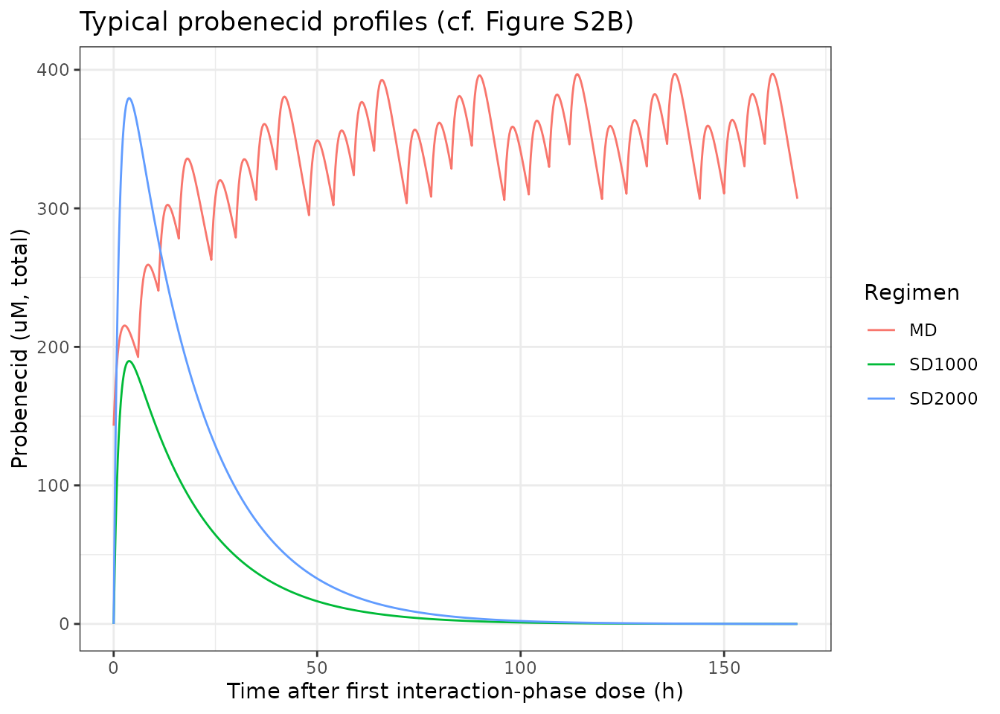
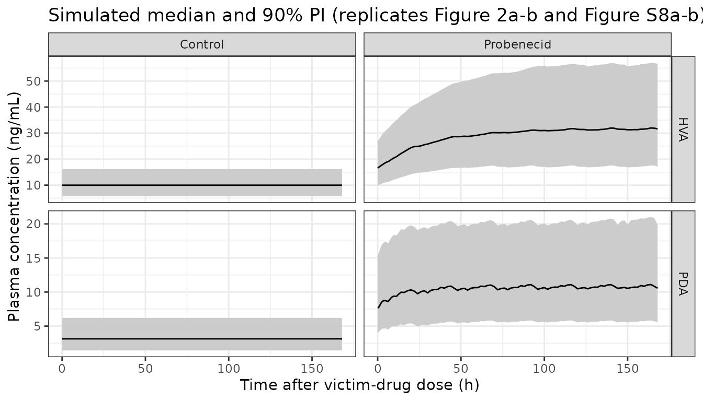
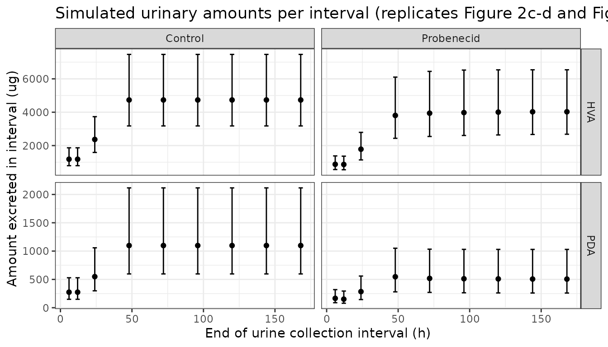
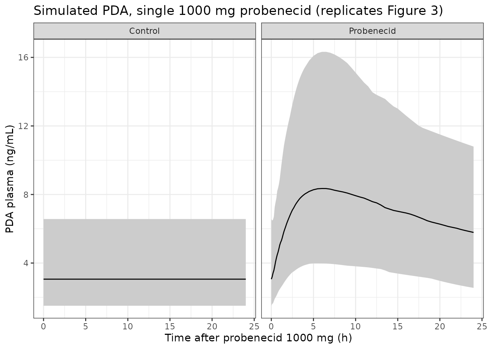
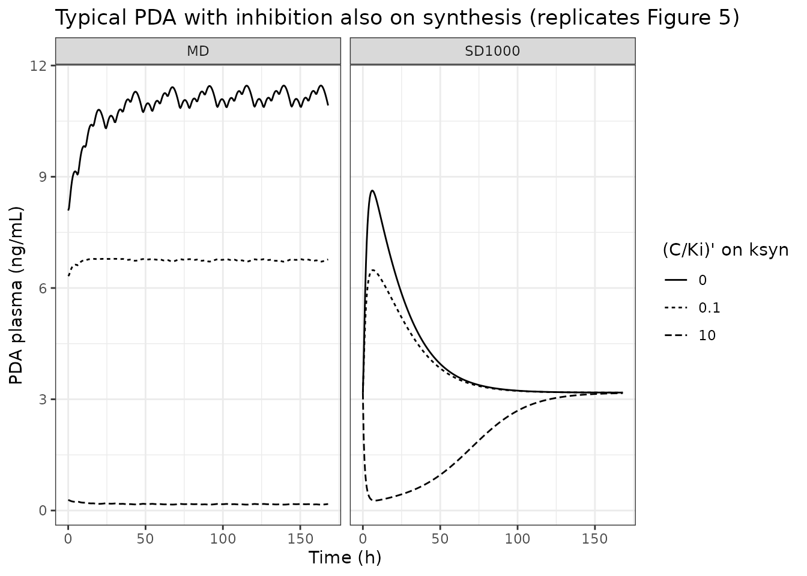

# Pyridoxic acid and homovanillic acid, OAT1/3 biomarkers (Ahmad 2021)

## Model and source

- Citation: Ahmad A, Ogungbenro K, Kunze A, Jacobs F, Snoeys J,
  Rostami-Hodjegan A, Galetin A. Population pharmacokinetic modeling and
  simulation to support qualification of pyridoxic acid as endogenous
  biomarker of OAT1/3 renal transporters. CPT Pharmacometrics Syst
  Pharmacol. 2021;10(5):467-477. <doi:10.1002/psp4.12610>. Structural
  equations from Eqs 2-3 of the main text; all parameter values from
  Table 1; clinical-study design and probenecid model structure from the
  Supplementary Material.
- Article: <https://doi.org/10.1002/psp4.12610>

Pyridoxic acid (PDA, the end product of vitamin B6 metabolism) and
homovanillic acid (HVA, a dopamine metabolite) are organic anions that
the kidney secretes through the basolateral uptake transporters OAT1 and
OAT3. Ahmad 2021 built the first population models of their synthesis
and elimination, fitting plasma concentrations and urinary amounts
simultaneously from a two-phase crossover in which six healthy women
received a victim compound alone (control phase) and then with 500 mg
probenecid every 6 h (interaction phase).

Both biomarkers use the same structure (Figure 1, Eqs 2-3): a zero-order
synthesis rate `ksyn` into a one-compartment plasma pool, renal
clearance `CLr` into a urine compartment, and nonrenal clearance `CLnr`.
Probenecid inhibits `CLr` competitively,
`CLr / (1 + C_probenecid / Ki)`, with its concentration coming from a
one-compartment first-order-absorption PK model fit in a first stage.
PDA and HVA were fit separately, each with its own `Ki` against the same
probenecid PK, so the package carries two model files that share the
probenecid block:

- `Ahmad_2021_pyridoxicAcid` – PDA, the biomarker the paper recommends.
- `Ahmad_2021_homovanillicAcid` – HVA.

``` r

mod_pda <- rxode2::rxode(readModelDb("Ahmad_2021_pyridoxicAcid"))
#> ℹ parameter labels from comments will be replaced by 'label()'
#> Warning: some etas defaulted to non-mu referenced, possible parsing error: etaiov_ksyn_1, etaiov_ksyn_2
#> as a work-around try putting the mu-referenced expression on a simple line
mod_hva <- rxode2::rxode(readModelDb("Ahmad_2021_homovanillicAcid"))
#> ℹ parameter labels from comments will be replaced by 'label()'
#> Warning: some etas defaulted to non-mu referenced, possible parsing error: etaiov_cl_renal_1, etaiov_cl_renal_2
#> as a work-around try putting the mu-referenced expression on a simple line
mod_pda
#>  ── rxode2-based free-form 4-cmt ODE model ────────────────────────────────────── 
#>  ── Initalization: ──  
#> Fixed Effects ($theta): 
#>       lksyn         lvc   lcl_renal  lcl_nonren   lki_oat13    lka_prob 
#>   4.0707347   2.2343063   2.7212954   1.1724821   3.9982007  -0.3011051 
#>    lvc_prob    lcl_prob      propSd       addSd propSd_Upda  addSd_Upda 
#>   2.7080502  -0.1984509   0.1270000   0.2130000   0.3210000  58.0000000 
#> propSd_prob  addSd_prob 
#>   0.1880000   0.0010000 
#> 
#> Omega ($omega): 
#>                etalksyn etalcl_renal etalvc_prob etalcl_prob etaiov_ksyn_1
#> etalksyn      0.0974856     0.000000     0.00000    0.000000     0.0000000
#> etalcl_renal  0.0000000     0.070319     0.00000    0.000000     0.0000000
#> etalvc_prob   0.0000000     0.000000     0.14842    0.000000     0.0000000
#> etalcl_prob   0.0000000     0.000000     0.00000    0.051546     0.0000000
#> etaiov_ksyn_1 0.0000000     0.000000     0.00000    0.000000     0.0472723
#> etaiov_ksyn_2 0.0000000     0.000000     0.00000    0.000000     0.0000000
#>               etaiov_ksyn_2
#> etalksyn          0.0000000
#> etalcl_renal      0.0000000
#> etalvc_prob       0.0000000
#> etalcl_prob       0.0000000
#> etaiov_ksyn_1     0.0000000
#> etaiov_ksyn_2     0.0472723
#> attr(,"lotriLabels")
#> [1] "Table 1, PDA IIV ksyn = 32% (SE 34%); log(1 + 0.32^2)"     
#> [2] "Table 1, PDA IIV CLr = 27% (SE 15%); log(1 + 0.27^2)"      
#> [3] "Table 1, Probenecid IIV V = 40% (SE 29%); log(1 + 0.40^2)" 
#> [4] "Table 1, Probenecid IIV CL = 23% (SE 23%); log(1 + 0.23^2)"
#> [5] "Table 1, PDA IOV ksyn = 22% (SE 57%); log(1 + 0.22^2)"     
#> [6] "Table 1, PDA IOV ksyn = 22%; shared variance, occasion 2"  
#> attr(,"lotriFix")
#>               etalksyn etalcl_renal etalvc_prob etalcl_prob etaiov_ksyn_1
#> etalksyn         FALSE        FALSE       FALSE       FALSE         FALSE
#> etalcl_renal     FALSE        FALSE       FALSE       FALSE         FALSE
#> etalvc_prob      FALSE        FALSE       FALSE       FALSE         FALSE
#> etalcl_prob      FALSE        FALSE       FALSE       FALSE         FALSE
#> etaiov_ksyn_1    FALSE        FALSE       FALSE       FALSE         FALSE
#> etaiov_ksyn_2    FALSE        FALSE       FALSE       FALSE         FALSE
#>               etaiov_ksyn_2
#> etalksyn              FALSE
#> etalcl_renal          FALSE
#> etalvc_prob           FALSE
#> etalcl_prob           FALSE
#> etaiov_ksyn_1         FALSE
#> etaiov_ksyn_2          TRUE
#> 
#> States ($state or $stateDf): 
#>   Compartment Number Compartment Name
#> 1                  1          central
#> 2                  2            urine
#> 3                  3       depot_prob
#> 4                  4     central_prob
#>  ── Multiple Endpoint Model ($multipleEndpoint): ──  
#>      variable                    cmt                    dvid*
#> 1      Cc ~ …      cmt='Cc' or cmt=5      dvid='Cc' or dvid=1
#> 2    Upda ~ …    cmt='Upda' or cmt=6    dvid='Upda' or dvid=2
#> 3 Cc_prob ~ … cmt='Cc_prob' or cmt=7 dvid='Cc_prob' or dvid=3
#>   * If dvids are outside this range, all dvids are re-numered sequentially, ie 1,7, 10 becomes 1,2,3 etc
#> 
#>  ── μ-referencing ($muRefTable): ──  
#>       theta          eta level
#> 1     lksyn     etalksyn    id
#> 2 lcl_renal etalcl_renal    id
#> 3  lvc_prob  etalvc_prob    id
#> 4  lcl_prob  etalcl_prob    id
#> 
#>  ── Model (Normalized Syntax): ── 
#> function() {
#>     compartmentData <- list(central = list(analyte = "pyridoxic acid", 
#>         units = "ug", specimen = "plasma", verified = TRUE), 
#>         urine = list(analyte = "pyridoxic acid", units = "ug", 
#>             specimen = "urine", verified = TRUE), depot_prob = list(analyte = "probenecid", 
#>             units = "umol", specimen = "administration site", 
#>             verified = TRUE), central_prob = list(analyte = "probenecid", 
#>             units = "umol", specimen = "plasma", verified = TRUE))
#>     covariateData <- list(OCC = list(description = "Study occasion (crossover phase): 1 = control phase (no probenecid), 2 = probenecid interaction phase.", 
#>         units = "(count)", type = "categorical", reference_category = "n/a -- decomposed into occasion indicators that select the per-occasion eta on ksyn", 
#>         notes = "Carries only the interoccasion variability on the PDA synthesis rate ksyn (Ahmad 2021 Table 1, IOV column; 'IOV between the two interaction phases was estimated only for ksyn'). Two occasions, one per crossover phase, separated by a 21-day washout. Set OCC = 1 throughout for single-occasion simulation; an OCC value other than 1 or 2 switches the IOV term off (typical-value occasion).", 
#>         source_name = "phase (control / probenecid)"))
#>     description <- "Coupled turnover model for the endogenous renal OAT1/OAT3 biomarker pyridoxic acid (PDA) in healthy adults (Ahmad 2021), fit simultaneously to PDA plasma concentrations and urinary amounts with and without the OAT1/3 inhibitor probenecid. PDA is produced at a zero-order synthesis rate ksyn and eliminated by renal clearance CLr (about 82% of total clearance) and nonrenal clearance CLnr into a one-compartment plasma pool; the renally cleared amount accumulates in a urine compartment. Probenecid competitively inhibits CLr through its total-plasma OAT1/3 inhibition constant Ki, driven by probenecid's own one-compartment first-order-absorption PK carried in the same file; synthesis and nonrenal clearance are unaffected. With no probenecid dosed the model sits at its steady-state baseline of about 3.2 ng/mL (typical value). Probenecid doses are given in umol (500 mg = 1752 umol)."
#>     population <- list(species = "human", n_subjects = 6L, n_studies = 1L, 
#>         age_range = "48-58 years", weight_range = "(not reported; body mass index 22-28 kg/m^2)", 
#>         sex_female_pct = 100, race_ethnicity = "Caucasian (6 of 6)", 
#>         disease_state = "Healthy volunteers. PDA was monitored as an endogenous biomarker of renal OAT1/OAT3 activity during a transporter drug-drug-interaction study.", 
#>         dose_range = "Endogenous biomarker (no exogenous PDA dose). Perpetrator: probenecid 500 mg orally at 18:00 and 23:00 on the day before the interaction phase, then 500 mg about every 6 h (07:00, 13:00, 18:00, 23:00) for 7 days.", 
#>         regions = "Europe (EudraCT 2016-003923-49)", renal_function = "CKD-EPI glomerular filtration rate 3.04-4.59 mL/min/kg (mean 3.92 mL/min/kg)", 
#>         notes = "Two-phase crossover (Willemin et al. 2021) with a 21-day washout: phase I a single dose of a Janssen victim compound alone (used as the PDA baseline), phase II the same compound co-administered with multiple-dose probenecid. 132 PDA plasma samples (66 per phase) and 108 PDA urine samples (54 per phase; intervals 0-6, 6-12, 12-24, then 24-h collections to 168 h), plus 36 probenecid plasma trough samples. The probenecid model was fit first; its individual empirical Bayes estimates were then fixed while PDA plasma and urine data from both phases were fit simultaneously in NONMEM (FOCE-I). Independently verified against the single-dose 1000 mg probenecid study of Shen et al. 2019 (n = 14).")
#>     reference <- "Ahmad A, Ogungbenro K, Kunze A, Jacobs F, Snoeys J, Rostami-Hodjegan A, Galetin A. Population pharmacokinetic modeling and simulation to support qualification of pyridoxic acid as endogenous biomarker of OAT1/3 renal transporters. CPT Pharmacometrics Syst Pharmacol. 2021;10(5):467-477. doi:10.1002/psp4.12610. Structural equations from Eqs 2-3 of the main text; all parameter values from Table 1; clinical-study design and probenecid model structure from the Supplementary Material."
#>     units <- list(time = "h", dosing = "umol", concentration = "ug/L")
#>     vignette <- "Ahmad_2021_oatBiomarkers"
#>     ini({
#>         lksyn <- 4.07073469658297
#>         label("PDA zero-order synthesis rate ksyn (ug/h)")
#>         lvc <- 2.23430625224075
#>         label("PDA volume of distribution V (L)")
#>         lcl_renal <- 2.72129542785223
#>         label("PDA renal clearance CLr (L/h)")
#>         lcl_nonren <- 1.17248213723457
#>         label("PDA nonrenal clearance CLnr (L/h)")
#>         lki_oat13 <- 3.9982007016692
#>         label("Probenecid total-plasma OAT1/3 inhibition constant Ki, PDA as probe (umol/L)")
#>         lka_prob <- -0.301105092783922
#>         label("Probenecid absorption rate constant ka (1/h)")
#>         lvc_prob <- 2.70805020110221
#>         label("Probenecid apparent volume of distribution V (L)")
#>         lcl_prob <- -0.198450938723838
#>         label("Probenecid apparent clearance CL (L/h)")
#>         propSd <- c(0, 0.127)
#>         label("Proportional residual error, PDA plasma (fraction)")
#>         addSd <- c(0, 0.213)
#>         label("Additive residual error, PDA plasma (ug/L = ng/mL)")
#>         propSd_Upda <- c(0, 0.321)
#>         label("Proportional residual error, PDA urine amount (fraction)")
#>         addSd_Upda <- c(0, 58)
#>         label("Additive residual error, PDA urine amount (ug)")
#>         propSd_prob <- c(0, 0.188)
#>         label("Proportional residual error, probenecid plasma (fraction)")
#>         addSd_prob <- fix(0, 0.001)
#>         label("Additive residual error, probenecid plasma (umol/L)")
#>         etalksyn ~ 0.0974856
#>         label("Table 1, PDA IIV ksyn = 32% (SE 34%); log(1 + 0.32^2)")
#>         etalcl_renal ~ 0.070319
#>         label("Table 1, PDA IIV CLr = 27% (SE 15%); log(1 + 0.27^2)")
#>         etalvc_prob ~ 0.14842
#>         label("Table 1, Probenecid IIV V = 40% (SE 29%); log(1 + 0.40^2)")
#>         etalcl_prob ~ 0.051546
#>         label("Table 1, Probenecid IIV CL = 23% (SE 23%); log(1 + 0.23^2)")
#>         etaiov_ksyn_1 ~ 0.0472723
#>         label("Table 1, PDA IOV ksyn = 22% (SE 57%); log(1 + 0.22^2)")
#>         etaiov_ksyn_2 ~ fix(0.0472723)
#>         label("Table 1, PDA IOV ksyn = 22%; shared variance, occasion 2")
#>     })
#>     model({
#>         oc1 <- (OCC == 1)
#>         oc2 <- (OCC == 2)
#>         iov_ksyn <- oc1 * etaiov_ksyn_1 + oc2 * etaiov_ksyn_2
#>         ksyn <- exp(lksyn + etalksyn + iov_ksyn)
#>         vc <- exp(lvc)
#>         cl_renal <- exp(lcl_renal + etalcl_renal)
#>         cl_nonren <- exp(lcl_nonren)
#>         ki_oat13 <- exp(lki_oat13)
#>         ka_prob <- exp(lka_prob)
#>         vc_prob <- exp(lvc_prob + etalvc_prob)
#>         cl_prob <- exp(lcl_prob + etalcl_prob)
#>         Cc_prob <- central_prob/vc_prob
#>         cl_renal_eff <- cl_renal/(1 + Cc_prob/ki_oat13)
#>         Cc <- central/vc
#>         d/dt(central) <- ksyn - (cl_renal_eff + cl_nonren) * 
#>             Cc
#>         d/dt(urine) <- cl_renal_eff * Cc
#>         d/dt(depot_prob) <- -ka_prob * depot_prob
#>         d/dt(central_prob) <- ka_prob * depot_prob - cl_prob/vc_prob * 
#>             central_prob
#>         central(0) <- ksyn/(cl_renal + cl_nonren) * vc
#>         Upda <- urine
#>         Cc ~ add(addSd) + prop(propSd)
#>         Upda ~ add(addSd_Upda) + prop(propSd_Upda)
#>         Cc_prob ~ add(addSd_prob) + prop(propSd_prob)
#>     })
#> }
```

Each model declares three endpoints (biomarker plasma `Cc`, cumulative
urinary amount `Upda` / `Uhva`, probenecid plasma `Cc_prob`), so rxode2
places their slots after the four ODE states. Observation records below
therefore name the endpoint (`cmt = "Cc"`): with more than one declared
endpoint, an observation on `cmt = "central"` is rejected. `Cc` already
has an endpoint slot from the model definition, so naming it injects no
new compartment and renumbers nothing, and `rxSolve()` returns every
model variable as a column regardless.

``` r

mod_pda$predDf[, c("var", "cmt", "dvid")]
#>       var cmt dvid
#> 1      Cc   5    1
#> 2    Upda   6    2
#> 3 Cc_prob   7    3
stopifnot(identical(mod_pda$state, c("central", "urine", "depot_prob", "central_prob")))
stopifnot(identical(mod_hva$state, c("central", "urine", "depot_prob", "central_prob")))
```

## Population

The model-development data (Supplementary Material, “Clinical study
design”) came from six healthy Caucasian women aged 48-58 years (BMI
22-28 kg/m^2, CKD-EPI GFR 3.04-4.59 mL/min/kg) enrolled in EudraCT
2016-003923-49 (Willemin et al. 2021). Phase I was a single dose of a
Janssen victim compound alone and served as the biomarker baseline;
after a 21-day washout, phase II gave probenecid 500 mg at 18:00 and
23:00 on the preceding day, then 500 mg at 07:00, 13:00, 18:00 and 23:00
for 7 days, with the victim compound co-administered at 07:00 on day 1.
Plasma was sampled at 0, 0.25, 1, 2, 4, 6, 8, 12, 24, 72 and 168 h and
urine collected over 0-6, 6-12, 12-24 h and then 24-h intervals to 168 h
in each phase: 132 plasma and 108 urine samples per biomarker, plus 36
probenecid trough concentrations. The PDA model was verified externally
against the single-dose 1000 mg probenecid study of Shen et al. 2019 (14
healthy volunteers).

``` r

str(mod_pda$population)
#> List of 12
#>  $ species       : chr "human"
#>  $ n_subjects    : int 6
#>  $ n_studies     : int 1
#>  $ age_range     : chr "48-58 years"
#>  $ weight_range  : chr "(not reported; body mass index 22-28 kg/m^2)"
#>  $ sex_female_pct: num 100
#>  $ race_ethnicity: chr "Caucasian (6 of 6)"
#>  $ disease_state : chr "Healthy volunteers. PDA was monitored as an endogenous biomarker of renal OAT1/OAT3 activity during a transport"| __truncated__
#>  $ dose_range    : chr "Endogenous biomarker (no exogenous PDA dose). Perpetrator: probenecid 500 mg orally at 18:00 and 23:00 on the d"| __truncated__
#>  $ regions       : chr "Europe (EudraCT 2016-003923-49)"
#>  $ renal_function: chr "CKD-EPI glomerular filtration rate 3.04-4.59 mL/min/kg (mean 3.92 mL/min/kg)"
#>  $ notes         : chr "Two-phase crossover (Willemin et al. 2021) with a 21-day washout: phase I a single dose of a Janssen victim com"| __truncated__
```

## Source trace

| Quantity | Value (PDA / HVA) | Source |
|----|----|----|
| Plasma turnover `dC/dt = (ksyn - CLr C / (1 + Cprob/Ki) - CLnr C) / V` | – | Eq. 2 |
| Urine `dU/dt = CLr C / (1 + Cprob/Ki)` | – | Eq. 3 |
| Probenecid one-compartment first-order absorption | – | Figure 1; Supplementary Material |
| `ksyn` (ug/h) | 58.6 / 212 | Table 1 |
| `V` (L) | 9.34 / 105 | Table 1 |
| `CLr` (L/h) | 15.2 / 20.4 | Table 1 |
| `CLnr` (L/h) | 3.23 / 1.29 | Table 1 |
| Probenecid total `Ki` (uM) | 54.5 / 137 | Table 1 (note: total Ki) |
| Probenecid `CL` (L/h), `V` (L), `ka` (1/h) | 0.82, 15, 0.74 | Table 1 |
| IIV `ksyn` | 32% / 27% | Table 1 |
| IIV `CLr` | 27% / 23% | Table 1 |
| IOV | `ksyn` 22% / `CLr` 5% | Table 1 |
| IIV probenecid `CL`, `V` | 23%, 40% | Table 1 |
| Plasma residual prop / add | 12.7%, 0.213 ng/mL / 17.3%, 0.001 ng/mL (fixed) | Table 1 |
| Urine residual prop / add | 32.1%, 58 ug / 26.9%, 373 ug | Table 1 |
| Probenecid residual prop / add | 18.8%, 0.001 uM (fixed) | Table 1 |
| Initial condition `C(0) = ksyn / (CLr + CLnr)` | – | Eq. 2 at steady state (baseline assumption) |

Units: biomarker amounts are in ug and concentrations in ug/L (= ng/mL),
as implied by `ksyn` in ug/h and the plasma additive error in ng/mL.
Probenecid is in umol and umol/L, as implied by `Ki` and the probenecid
additive error in uM; published mg doses are converted with the
molecular weight below.

``` r

# Probenecid molecular weight, only to convert mg doses into the umol the model
# consumes; the same value carried by the nlmixr2lib compartment register and
# the Ujihira 2025 GCDCA-S model (PubChem CID 4911 agrees to 4 significant
# figures).
MW_PROB <- 285.34
dose_umol <- function(mg) mg * 1000 / MW_PROB

# Probenecid dosing of Willemin et al. (Supplementary Material). The control
# phase starts at t = 0 (07:00); the interaction phase starts 21 days later at
# t = 504 h. Loading doses at 18:00 and 23:00 the day before, then 07:00,
# 13:00, 18:00, 23:00 for 7 days.
T2 <- 504
md_times <- c(T2 - 13, T2 - 8, as.vector(outer(c(0, 6, 11, 16), 24 * (0:6), "+")) + T2)

# One subject's event table for a two-phase crossover. OCC switches at 480 h,
# 24 h before the interaction phase: the biomarker re-equilibrates to the
# occasion-2 parameters within hours (PDA half-life ~0.35 h, HVA ~3.4 h).
design_events <- function(design = c("MD", "SD1000", "SD2000"), tobs, id = 1L) {
  design <- match.arg(design)
  dose_t <- if (design == "MD") md_times else T2
  amt <- dose_umol(c(MD = 500, SD1000 = 1000, SD2000 = 2000)[[design]])
  ev <- dplyr::bind_rows(
    data.frame(time = dose_t, amt = amt, evid = 1L, cmt = "depot_prob"),
    data.frame(time = c(tobs, T2 + tobs), amt = 0, evid = 0L, cmt = "Cc")
  )
  ev$id <- id
  ev$OCC <- ifelse(ev$time >= 480, 2L, 1L)
  dplyr::arrange(ev, time, dplyr::desc(evid))
}
cohort_events <- function(design, tobs, n) {
  dplyr::bind_rows(lapply(seq_len(n), function(i) design_events(design, tobs, i)))
}
add_phase <- function(sim) {
  sim |>
    dplyr::mutate(
      phase = ifelse(time >= 480, "Probenecid", "Control"),
      tphase = ifelse(phase == "Probenecid", time - T2, time)
    )
}
auc_trap <- function(t, y) sum(diff(t) * (head(y, -1) + tail(y, -1)) / 2)
```

## Steady-state baseline and mass balance

Without probenecid the models must hold at the analytic baseline
`Css = ksyn / (CLr + CLnr)` and excrete `fe * ksyn` per hour into urine,
with `fe = CLr / (CLr + CLnr)` equal to the 82% (PDA) and 94% (HVA)
renal fractions stated in the Results.

``` r

mod_pda0 <- rxode2::zeroRe(mod_pda)
#> Warning: some etas defaulted to non-mu referenced, possible parsing error: etaiov_ksyn_1, etaiov_ksyn_2
#> as a work-around try putting the mu-referenced expression on a simple line
mod_hva0 <- rxode2::zeroRe(mod_hva)
#> Warning: some etas defaulted to non-mu referenced, possible parsing error: etaiov_cl_renal_1, etaiov_cl_renal_2
#> as a work-around try putting the mu-referenced expression on a simple line

ev_base <- data.frame(id = 1L, time = seq(0, 168, by = 1), amt = 0, evid = 0L, cmt = "Cc", OCC = 1L)

bl <- function(m, ksyn, clr, clnr) {
  s <- rxode2::rxSolve(m, ev_base, returnType = "data.frame")
  css <- ksyn / (clr + clnr)
  fe <- clr / (clr + clnr)
  urine_col <- intersect(c("Upda", "Uhva"), names(s))
  data.frame(
    css_analytic = css,
    css_min = min(s$Cc), css_max = max(s$Cc),
    fe = fe,
    urine_168_sim = s[[urine_col]][s$time == 168],
    urine_168_analytic = 168 * ksyn * fe
  )
}
bl_tab <- dplyr::bind_rows(
  PDA = bl(mod_pda0, 58.6, 15.2, 3.23),
  HVA = bl(mod_hva0, 212, 20.4, 1.29),
  .id = "Biomarker"
)
#> ℹ omega/sigma items treated as zero: 'etalksyn', 'etalcl_renal', 'etalvc_prob', 'etalcl_prob', 'etaiov_ksyn_1', 'etaiov_ksyn_2'
#> ℹ omega/sigma items treated as zero: 'etalksyn', 'etalcl_renal', 'etalvc_prob', 'etalcl_prob', 'etaiov_cl_renal_1', 'etaiov_cl_renal_2'
knitr::kable(bl_tab, digits = 4)
```

| Biomarker | css_analytic | css_min | css_max |     fe | urine_168_sim | urine_168_analytic |
|:----------|-------------:|--------:|--------:|-------:|--------------:|-------------------:|
| PDA       |       3.1796 |  3.1796 |  3.1796 | 0.8247 |      8119.423 |           8119.423 |
| HVA       |       9.7741 |  9.7741 |  9.7741 | 0.9405 |     33497.759 |          33497.759 |

``` r


stopifnot(
  # Baseline holds flat at the analytic value (numeric ODE path, rtol 1e-6).
  all(abs(bl_tab$css_min / bl_tab$css_analytic - 1) < 1e-4),
  all(abs(bl_tab$css_max / bl_tab$css_analytic - 1) < 1e-4),
  # Renal fractions stated in the Results (82% and 94%).
  abs(bl_tab$fe[1] - 0.82) < 0.005,
  abs(bl_tab$fe[2] - 0.94) < 0.005,
  # Urinary mass balance over 168 h.
  all(abs(bl_tab$urine_168_sim / bl_tab$urine_168_analytic - 1) < 1e-3)
)
```

The typical PDA baseline is 3.18 ng/mL and the typical HVA baseline 9.77
ng/mL.

## Probenecid PK

The first-stage probenecid model: 500 mg every 6 h accumulates to an
average steady-state concentration of `Dose / (CL * tau)`, about 356 uM
(total), which with the PDA `Ki` of 54.5 uM reduces PDA renal clearance
about 7.5-fold. The single-dose 1000 mg and 2000 mg profiles correspond
to Figure S2B.

``` r

tgrid <- seq(0, 168, by = 0.25)
prob_typ <- dplyr::bind_rows(lapply(c("MD", "SD1000", "SD2000"), function(d) {
  rxode2::rxSolve(mod_pda0, design_events(d, tgrid), returnType = "data.frame") |>
    add_phase() |>
    dplyr::filter(phase == "Probenecid") |>
    dplyr::mutate(design = d)
}))
#> ℹ omega/sigma items treated as zero: 'etalksyn', 'etalcl_renal', 'etalvc_prob', 'etalcl_prob', 'etaiov_ksyn_1', 'etaiov_ksyn_2'
#> ℹ omega/sigma items treated as zero: 'etalksyn', 'etalcl_renal', 'etalvc_prob', 'etalcl_prob', 'etaiov_ksyn_1', 'etaiov_ksyn_2'
#> ℹ omega/sigma items treated as zero: 'etalksyn', 'etalcl_renal', 'etalvc_prob', 'etalcl_prob', 'etaiov_ksyn_1', 'etaiov_ksyn_2'

ggplot(prob_typ, aes(tphase, Cc_prob, colour = design)) +
  geom_line() +
  labs(x = "Time after first interaction-phase dose (h)", y = "Probenecid (uM, total)",
       colour = "Regimen", title = "Typical probenecid profiles (cf. Figure S2B)") +
  theme_bw()
```



``` r


# Steady state on day 7 (144-168 h after the first 07:00 dose).
md_ss <- prob_typ |> dplyr::filter(design == "MD", tphase >= 144, tphase <= 168)
cavg_ss <- auc_trap(md_ss$tphase, md_ss$Cc_prob) / 24
cavg_analytic <- dose_umol(500) / (0.82 * 6)
c(cavg_simulated = cavg_ss, cavg_analytic = cavg_analytic)
#> cavg_simulated  cavg_analytic 
#>       356.0478       356.1576
# The day-7 dosing is 6/5/5/8 h rather than a strict 6 h, so the 24-h average
# over a whole day (4 doses) must equal Dose/(CL*6 h) once at steady state.
stopifnot(abs(cavg_ss / cavg_analytic - 1) < 0.01)
```

## Interaction study (Figure 2)

A virtual cohort of 200 subjects goes through the two-phase crossover
with multiple-dose probenecid; plasma is sampled densely and urine is
summarised on the study’s collection intervals. Each subject’s
between-occasion eta on `ksyn` (PDA) or `CLr` (HVA) switches between the
phases.

``` r

rxode2::rxSetSeed(2021)
tdense <- sort(unique(c(seq(0, 12, by = 0.25), seq(12, 168, by = 2))))
n_sub <- 200
ev_md <- cohort_events("MD", tdense, n_sub)
sim_pda <- rxode2::rxSolve(mod_pda, ev_md, returnType = "data.frame") |> add_phase()
sim_hva <- rxode2::rxSolve(mod_hva, ev_md, returnType = "data.frame") |> add_phase()
stopifnot(!anyNA(sim_pda$Cc), !anyNA(sim_hva$Cc))
```

``` r

vpc_plasma <- dplyr::bind_rows(PDA = sim_pda, HVA = sim_hva, .id = "Biomarker") |>
  dplyr::group_by(Biomarker, phase, tphase) |>
  dplyr::summarise(
    lo = quantile(Cc, 0.05), med = median(Cc), hi = quantile(Cc, 0.95),
    .groups = "drop"
  )
ggplot(vpc_plasma, aes(tphase, med)) +
  geom_ribbon(aes(ymin = lo, ymax = hi), fill = "grey80") +
  geom_line() +
  facet_grid(Biomarker ~ phase, scales = "free_y") +
  labs(x = "Time after victim-drug dose (h)", y = "Plasma concentration (ng/mL)",
       title = "Simulated median and 90% PI (replicates Figure 2a-b and Figure S8a-b)") +
  theme_bw()
```



``` r

ubounds <- c(0, 6, 12, 24, 48, 72, 96, 120, 144, 168)
urine_int <- function(sim, ucol) {
  sim |>
    dplyr::filter(tphase %in% ubounds) |>
    dplyr::arrange(id, phase, tphase) |>
    dplyr::group_by(id, phase) |>
    dplyr::mutate(amount = .data[[ucol]] - dplyr::lag(.data[[ucol]]),
                  interval = paste0(dplyr::lag(tphase), "-", tphase)) |>
    dplyr::filter(!is.na(amount)) |>
    dplyr::ungroup()
}
uint <- dplyr::bind_rows(
  PDA = urine_int(sim_pda, "Upda"),
  HVA = urine_int(sim_hva, "Uhva"),
  .id = "Biomarker"
)
# 9 collection intervals per phase per subject.
stopifnot(nrow(uint) == 2 * 2 * n_sub * 9)
uint |>
  dplyr::group_by(Biomarker, phase, tphase) |>
  dplyr::summarise(lo = quantile(amount, 0.05), med = median(amount),
                   hi = quantile(amount, 0.95), .groups = "drop") |>
  ggplot(aes(tphase, med)) +
  geom_errorbar(aes(ymin = lo, ymax = hi), width = 3) +
  geom_point() +
  facet_grid(Biomarker ~ phase, scales = "free_y") +
  labs(x = "End of urine collection interval (h)", y = "Amount excreted in interval (ug)",
       title = "Simulated urinary amounts per interval (replicates Figure 2c-d and Figure S8c-d)") +
  theme_bw()
```



### AUC ratio and fraction transported (PKNCA)

The paper computed individual plasma `AUC0-168` in each phase and
reported interaction ratios of 2.5-5.1 (PDA) and 2.1-3.7 (HVA), with the
fraction eliminated by the inhibited transporters
`fT = 1 - AUC(control) / AUC(interaction)` (Eq. 1) of 0.59-0.81 (PDA)
and 0.53-0.73 (HVA) across the six subjects.

``` r

nca_one <- function(sim, biomarker) {
  conc <- sim |>
    dplyr::filter(!is.na(Cc)) |>
    dplyr::select(id, phase, time = tphase, Cc) |>
    dplyr::mutate(biomarker = biomarker)
  conc_obj <- PKNCA::PKNCAconc(conc, Cc ~ time | biomarker + phase + id)
  data_obj <- PKNCA::PKNCAdata(
    conc_obj,
    intervals = data.frame(start = 0, end = 168, auclast = TRUE)
  )
  as.data.frame(PKNCA::pk.nca(data_obj)) |>
    dplyr::filter(PPTESTCD == "auclast") |>
    dplyr::select(biomarker, id, phase, PPORRES) |>
    tidyr::pivot_wider(names_from = phase, values_from = PPORRES) |>
    dplyr::mutate(ratio = Probenecid / Control, fT = 1 - Control / Probenecid)
}
nca <- dplyr::bind_rows(nca_one(sim_pda, "PDA"), nca_one(sim_hva, "HVA"))
#> No dose information provided, calculations requiring dose will return NA.
#> No dose information provided, calculations requiring dose will return NA.
stopifnot(nrow(nca) == 2 * n_sub, !anyNA(nca$ratio))

# Deterministic typical-value ratio on the same design.
typ_ratio <- function(m) {
  s <- rxode2::rxSolve(rxode2::zeroRe(m), design_events("MD", tdense), returnType = "data.frame") |>
    add_phase()
  ctl <- s[s$phase == "Control", ]
  int <- s[s$phase == "Probenecid", ]
  auc_trap(int$tphase, int$Cc) / auc_trap(ctl$tphase, ctl$Cc)
}
typ <- c(PDA = typ_ratio(mod_pda), HVA = typ_ratio(mod_hva))
#> Warning: some etas defaulted to non-mu referenced, possible parsing error: etaiov_ksyn_1, etaiov_ksyn_2
#> as a work-around try putting the mu-referenced expression on a simple line
#> ℹ omega/sigma items treated as zero: 'etalksyn', 'etalcl_renal', 'etalvc_prob', 'etalcl_prob', 'etaiov_ksyn_1', 'etaiov_ksyn_2'
#> Warning: some etas defaulted to non-mu referenced, possible parsing error: etaiov_cl_renal_1, etaiov_cl_renal_2
#> as a work-around try putting the mu-referenced expression on a simple line
#> ℹ omega/sigma items treated as zero: 'etalksyn', 'etalcl_renal', 'etalvc_prob', 'etalcl_prob', 'etaiov_cl_renal_1', 'etaiov_cl_renal_2'

observed <- data.frame(
  biomarker = c("PDA", "HVA"),
  obs_ratio = c("2.5-5.1", "2.1-3.7"),
  obs_fT = c("0.59-0.81", "0.53-0.73"),
  ratio_lo = c(2.5, 2.1), ratio_hi = c(5.1, 3.7)
)
nca_summary <- nca |>
  dplyr::group_by(biomarker) |>
  dplyr::summarise(
    sim_median_ratio = median(ratio),
    sim_ratio_5_95 = sprintf("%.2f-%.2f", quantile(ratio, 0.05), quantile(ratio, 0.95)),
    sim_median_fT = median(fT),
    .groups = "drop"
  ) |>
  dplyr::mutate(typical_ratio = typ[biomarker]) |>
  dplyr::left_join(observed, by = "biomarker")

nca_summary |>
  dplyr::select(
    "Biomarker" = biomarker,
    "Typical AUC0-168 ratio" = typical_ratio,
    "Simulated median ratio" = sim_median_ratio,
    "Simulated 5-95% ratio" = sim_ratio_5_95,
    "Observed individual ratios" = obs_ratio,
    "Simulated median fT" = sim_median_fT,
    "Observed individual fT" = obs_fT
  ) |>
  knitr::kable(digits = 2)
```

| Biomarker | Typical AUC0-168 ratio | Simulated median ratio | Simulated 5-95% ratio | Observed individual ratios | Simulated median fT | Observed individual fT |
|:---|---:|---:|:---|:---|---:|:---|
| HVA | 2.90 | 2.87 | 2.32-3.58 | 2.1-3.7 | 0.65 | 0.53-0.73 |
| PDA | 3.43 | 3.41 | 1.84-6.01 | 2.5-5.1 | 0.71 | 0.59-0.81 |

``` r


stopifnot(
  # Deterministic: the typical subject sits inside the observed range.
  all(nca_summary$typical_ratio > nca_summary$ratio_lo),
  all(nca_summary$typical_ratio < nca_summary$ratio_hi),
  # Cohort centre (robust to which subjects land in the tails).
  all(nca_summary$sim_median_ratio > nca_summary$ratio_lo),
  all(nca_summary$sim_median_ratio < nca_summary$ratio_hi)
)
```

PDA is the more sensitive probe: the same probenecid exposure raises its
plasma AUC more than HVA’s because its `Ki` is 2.5-fold lower, matching
the paper’s conclusion.

## External verification (Figure 3)

The PDA model was verified against Shen et al. 2019: a single oral 1000
mg probenecid dose with PDA sampled over 24 h. The paper reports a
simulated mean PDA `AUC0-tlast` ratio of 2.29 (observed 1.95). The
deterministic typical-value ratio from this model is the gate.

``` r

t24 <- sort(unique(c(seq(0, 4, by = 0.1), seq(4, 24, by = 0.5))))
s_sd <- rxode2::rxSolve(mod_pda0, design_events("SD1000", t24), returnType = "data.frame") |>
  add_phase()
#> ℹ omega/sigma items treated as zero: 'etalksyn', 'etalcl_renal', 'etalvc_prob', 'etalcl_prob', 'etaiov_ksyn_1', 'etaiov_ksyn_2'
ratio_sd <- with(s_sd, auc_trap(tphase[phase == "Probenecid"], Cc[phase == "Probenecid"]) /
  auc_trap(tphase[phase == "Control"], Cc[phase == "Control"]))
c(typical_ratio = ratio_sd, paper_simulated_mean = 2.29, paper_observed_mean = 1.95)
#>        typical_ratio paper_simulated_mean  paper_observed_mean 
#>             2.282701             2.290000             1.950000
stopifnot(abs(ratio_sd / 2.29 - 1) < 0.03)

rxode2::rxSetSeed(2019)
sim_sd <- rxode2::rxSolve(mod_pda, cohort_events("SD1000", t24, n_sub), returnType = "data.frame") |>
  add_phase()
sim_sd |>
  dplyr::group_by(phase, tphase) |>
  dplyr::summarise(lo = quantile(Cc, 0.05), med = median(Cc), hi = quantile(Cc, 0.95), .groups = "drop") |>
  ggplot(aes(tphase, med)) +
  geom_ribbon(aes(ymin = lo, ymax = hi), fill = "grey80") +
  geom_line() +
  facet_wrap(~phase) +
  labs(x = "Time after probenecid 1000 mg (h)", y = "PDA plasma (ng/mL)",
       title = "Simulated PDA, single 1000 mg probenecid (replicates Figure 3)") +
  theme_bw()
```



## Power calculations (Figure 4)

The paper scaled the probenecid `C/Ki` ratio by a factor from 0.025 to 5
to mimic weaker or stronger OAT1/3 inhibitors, simulated each study
design, and computed the power of a paired t-test on log-transformed
plasma AUCs. The paper reports that detecting a weak inhibitor (`I/Ki` =
0.1 relative to probenecid) needs 9, 25 and 10 subjects for the
multiple-dose (500 mg every 6 h, sampling over 168 h), single 1000 mg
and single 2000 mg (sampling over 24 h) designs, and that a moderate
inhibitor (`I/Ki` = 0.25) in a single-dose design needs 9 subjects with
PDA and 17 with HVA.

Here each scenario is simulated once for 200 subjects on the study
sampling times, and the sample size for 80% power at alpha = 0.05 is
computed analytically from the mean and SD of the individual log AUC
ratios (`power.t.test(type = "paired")`) rather than by the paper’s 1000
repeated t-tests per sample size. The inhibitor-potency factor is
applied by dividing `Ki` by it, which scales `C_probenecid / Ki` exactly
as in the paper. The paper does not say whether its simulated AUCs
carried residual error, so the sample size is shown both from the
model-predicted concentrations (`Cc`) and from the simulated
observations with residual error (`sim`), taken from the same solve.

``` r

t_md <- c(0, 0.25, 1, 2, 4, 6, 8, 12, 24, 72, 168)
t_sd <- c(0, 0.25, 1, 2, 4, 6, 8, 12, 24)
n80_paired <- function(lr) {
  ceiling(stats::power.t.test(delta = mean(lr), sd = sd(lr), power = 0.8,
                              sig.level = 0.05, type = "paired")$n)
}
n_power <- function(m, ki, design, f, seed) {
  rxode2::rxSetSeed(seed)
  m_f <- m |> rxode2::ini(lki_oat13 = log(ki / f))
  tobs <- if (design == "MD") t_md else t_sd
  s <- rxode2::rxSolve(m_f, cohort_events(design, tobs, n_sub), returnType = "data.frame") |>
    add_phase()
  auc <- s |>
    dplyr::arrange(id, phase, tphase) |>
    dplyr::group_by(id, phase) |>
    dplyr::summarise(pred = auc_trap(tphase, Cc), obs = auc_trap(tphase, sim), .groups = "drop") |>
    tidyr::pivot_wider(names_from = phase, values_from = c(pred, obs))
  lr_pred <- log(auc$pred_Probenecid / auc$pred_Control)
  lr_obs <- log(auc$obs_Probenecid / auc$obs_Control)
  stopifnot(length(lr_pred) == n_sub, !anyNA(lr_pred), !anyNA(lr_obs))
  data.frame(
    design = design, f = f, gmr = exp(mean(lr_pred)),
    n80_pred = n80_paired(lr_pred), n80_obs = n80_paired(lr_obs)
  )
}
pow <- dplyr::bind_rows(
  PDA_MD_0.1 = n_power(mod_pda, 54.5, "MD", 0.1, 11),
  PDA_SD1000_0.1 = n_power(mod_pda, 54.5, "SD1000", 0.1, 12),
  PDA_SD2000_0.1 = n_power(mod_pda, 54.5, "SD2000", 0.1, 13),
  PDA_SD1000_0.25 = n_power(mod_pda, 54.5, "SD1000", 0.25, 14),
  HVA_SD1000_0.25 = n_power(mod_hva, 137, "SD1000", 0.25, 15),
  .id = "scenario"
)
#> ℹ change initial estimate of `lki_oat13` to `6.30078579466324`
#> ℹ change initial estimate of `lki_oat13` to `6.30078579466324`
#> ℹ change initial estimate of `lki_oat13` to `6.30078579466324`
#> ℹ change initial estimate of `lki_oat13` to `5.38449506278909`
#> ℹ change initial estimate of `lki_oat13` to `6.30627528694802`
pow$paper_n <- c(9, 25, 10, 9, 17)
pow$deviation <- pow$scenario == "HVA_SD1000_0.25"
pow |>
  dplyr::select(
    "Scenario" = scenario,
    "Geometric mean AUC ratio" = gmr,
    "n, predicted Cc" = n80_pred,
    "n, with residual error" = n80_obs,
    "Paper n" = paper_n,
    "Known deviation" = deviation
  ) |>
  knitr::kable(digits = 2)
```

| Scenario | Geometric mean AUC ratio | n, predicted Cc | n, with residual error | Paper n | Known deviation |
|:---|---:|---:|---:|---:|:---|
| PDA_MD_0.1 | 1.36 | 11 | 13 | 9 | FALSE |
| PDA_SD1000_0.1 | 1.20 | 24 | 27 | 25 | FALSE |
| PDA_SD2000_0.1 | 1.33 | 11 | 13 | 10 | FALSE |
| PDA_SD1000_0.25 | 1.41 | 8 | 9 | 9 | FALSE |
| HVA_SD1000_0.25 | 1.17 | 4 | 9 | 17 | TRUE |

``` r


# The required n depends on the SD of the log ratio estimated from 200 draws,
# so it carries ~10% Monte-Carlo noise (n scales with the variance). Measured
# relative differences for the PDA rows were at most 0.22 (predicted Cc) and
# 0.44 (with residual error); the gate is on the predicted-Cc column with a
# 0.5 bound, which still fails on a structural error (a mis-scaled Ki or a mg
# vs umol dose moves n several-fold). The HVA row is a documented deviation.
chk <- pow[!pow$deviation, ]
stopifnot(nrow(chk) == 4, all(abs(chk$n80_pred / chk$paper_n - 1) < 0.5))
```

The PDA sample sizes are reproduced. The HVA figure is not: the model
needs about 4 subjects (9 with residual error) where the paper reports
17. In the HVA model the only variability that differs between the two
phases of a subject is the 5% between-occasion variability on `CLr` plus
probenecid exposure, so the paired log-ratio is much tighter than for
PDA, whose 22% between-occasion variability on `ksyn` dominates. The
paper does not describe its HVA power simulation in more detail (Figure
S13), so the source of the difference could not be identified; the model
parameters themselves are as printed in Table 1.

## Hypothetical inhibition of synthesis (Figure 5)

Eq. 4 of the paper explores what would happen if the inhibitor also
reduced `ksyn`, by a factor `(C_probenecid / Ki)'` equal to 0, 0.1 or 10
times the effect on renal clearance. This is a what-if scenario, not
part of the fitted model, so it is built here by replacing the plasma
ODE and supplying the relative factor as a data column `RKSYN`.

``` r

mod_pda_ksyn <- mod_pda0 |>
  rxode2::model(d/dt(central) <- ksyn / (1 + RKSYN * Cc_prob / ki_oat13) - (cl_renal_eff + cl_nonren) * Cc)
#> ℹ add covariate `RKSYN`
#> Warning: some etas defaulted to non-mu referenced, possible parsing error: etaiov_ksyn_1, etaiov_ksyn_2
#> as a work-around try putting the mu-referenced expression on a simple line
stopifnot(identical(mod_pda_ksyn$state, mod_pda$state))

fig5 <- dplyr::bind_rows(lapply(c("MD", "SD1000"), function(d) {
  dplyr::bind_rows(lapply(c(0, 0.1, 10), function(r) {
    ev <- design_events(d, seq(0, 168, by = 0.5))
    ev$RKSYN <- r
    rxode2::rxSolve(mod_pda_ksyn, ev, returnType = "data.frame") |>
      add_phase() |>
      dplyr::filter(phase == "Probenecid") |>
      dplyr::mutate(design = d, RKSYN = r)
  }))
}))
#> ℹ omega/sigma items treated as zero: 'etalksyn', 'etalcl_renal', 'etalvc_prob', 'etalcl_prob', 'etaiov_ksyn_1', 'etaiov_ksyn_2'
#> ℹ omega/sigma items treated as zero: 'etalksyn', 'etalcl_renal', 'etalvc_prob', 'etalcl_prob', 'etaiov_ksyn_1', 'etaiov_ksyn_2'
#> ℹ omega/sigma items treated as zero: 'etalksyn', 'etalcl_renal', 'etalvc_prob', 'etalcl_prob', 'etaiov_ksyn_1', 'etaiov_ksyn_2'
#> ℹ omega/sigma items treated as zero: 'etalksyn', 'etalcl_renal', 'etalvc_prob', 'etalcl_prob', 'etaiov_ksyn_1', 'etaiov_ksyn_2'
#> ℹ omega/sigma items treated as zero: 'etalksyn', 'etalcl_renal', 'etalvc_prob', 'etalcl_prob', 'etaiov_ksyn_1', 'etaiov_ksyn_2'
#> ℹ omega/sigma items treated as zero: 'etalksyn', 'etalcl_renal', 'etalvc_prob', 'etalcl_prob', 'etaiov_ksyn_1', 'etaiov_ksyn_2'
ggplot(fig5, aes(tphase, Cc, linetype = factor(RKSYN))) +
  geom_line() +
  facet_wrap(~design, scales = "free_x") +
  labs(x = "Time (h)", y = "PDA plasma (ng/mL)", linetype = "(C/Ki)' on ksyn",
       title = "Typical PDA with inhibition also on synthesis (replicates Figure 5)") +
  theme_bw()
```



``` r


# RKSYN = 0 must reproduce the fitted model exactly.
base_md <- rxode2::rxSolve(mod_pda0, design_events("MD", seq(0, 168, by = 0.5)), returnType = "data.frame") |>
  add_phase() |>
  dplyr::filter(phase == "Probenecid")
#> ℹ omega/sigma items treated as zero: 'etalksyn', 'etalcl_renal', 'etalvc_prob', 'etalcl_prob', 'etaiov_ksyn_1', 'etaiov_ksyn_2'
f0 <- fig5 |> dplyr::filter(design == "MD", RKSYN == 0)
stopifnot(max(abs(f0$Cc / base_md$Cc - 1)) < 1e-6)
```

## Assumptions and deviations

- **IIV and IOV scale.** Table 1 reports IIV and IOV as percentages of
  exponential random effects; they are read as CV% and converted with
  `omega^2 = log(1 + CV^2)`.
- **IOV encoding.** The between-occasion variability (PDA on `ksyn`, HVA
  on `CLr`) spans the two crossover phases. It is encoded with an `OCC`
  column (1 = control, 2 = probenecid) and one eta per occasion, the
  occasion-2 eta fixed to the occasion-1 variance. Set `OCC = 1` for
  single-occasion work.
- **Total Ki.** The model uses the total-plasma `Ki` of Table 1 (54.5
  and 137 uM) against total probenecid concentration. The unbound values
  (3.4 and 8.5 uM, fraction unbound 0.062) are reported only for
  comparison with in vitro data.
- **Probenecid units.** The probenecid block runs in umol and umol/L,
  implied by `Ki` and the additive error in uM; mg doses are converted
  with a molecular weight of 285.34 g/mol, which is not printed in the
  paper. The model’s `units$dosing` is therefore umol (probenecid is the
  only dosed compound), while `units$concentration` is ug/L for the
  biomarker `Cc`.
- **Baseline.** The biomarker starts at its inhibitor-free steady state
  `ksyn / (CLr + CLnr)`; the paper does not state its initial condition,
  but its control phase was used as the steady-state baseline and it
  reports no circadian variation.
- **Urine.** `Upda` / `Uhva` is the cumulative amount excreted since
  time 0; the study’s collection-interval amounts are differences of it
  between interval end points, as done above.
- **Residual-error form.** The paper states only “combined proportional
  and additive”; the nlmixr2 default combined form is used.
- **Probenecid bioavailability.** Probenecid was dosed orally only, so
  its `CL` and `V` are apparent (`CL/F`, `V/F`) and bioavailability is 1
  in the model.
- **Power calculation.** The sample sizes are computed analytically from
  one simulated cohort per scenario rather than from the paper’s
  repeated t-tests. They reproduce the paper’s PDA sample sizes to
  within Monte-Carlo noise; the HVA single-dose figure (17 subjects in
  the paper) is not reproduced, as discussed in that section.
- **Data not reproduced.** The individual observed data (Figure 2,
  Figure S1) are not available, so the figures above show simulated
  prediction intervals only.
