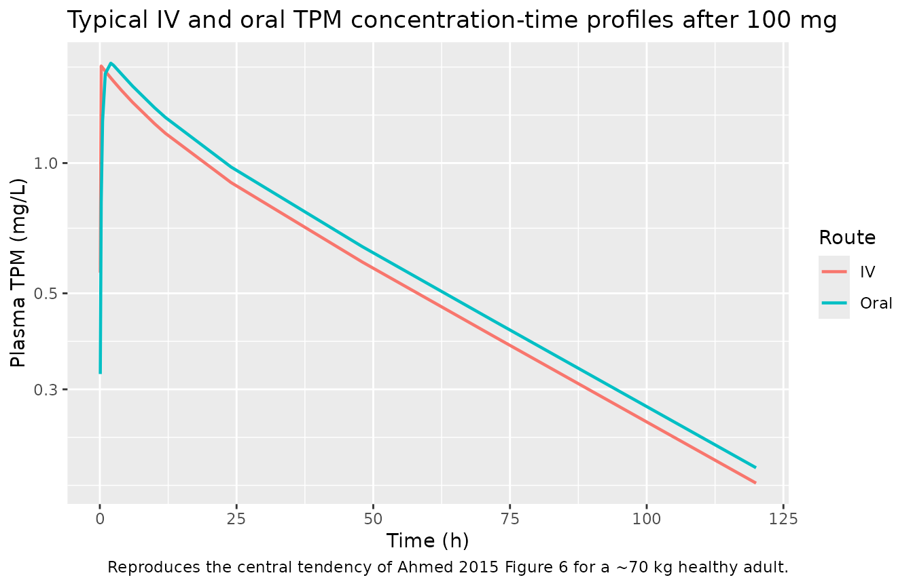
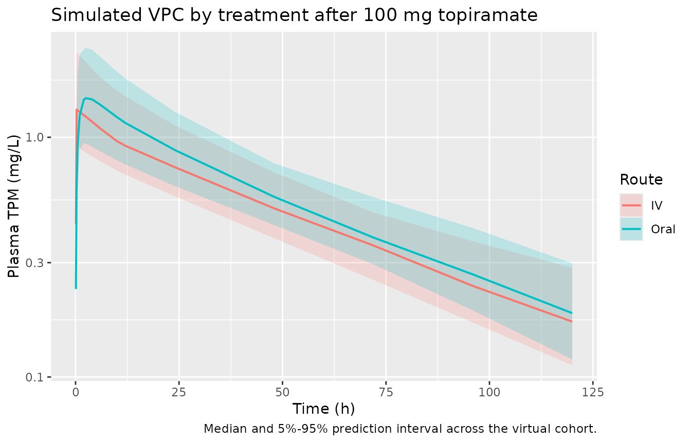
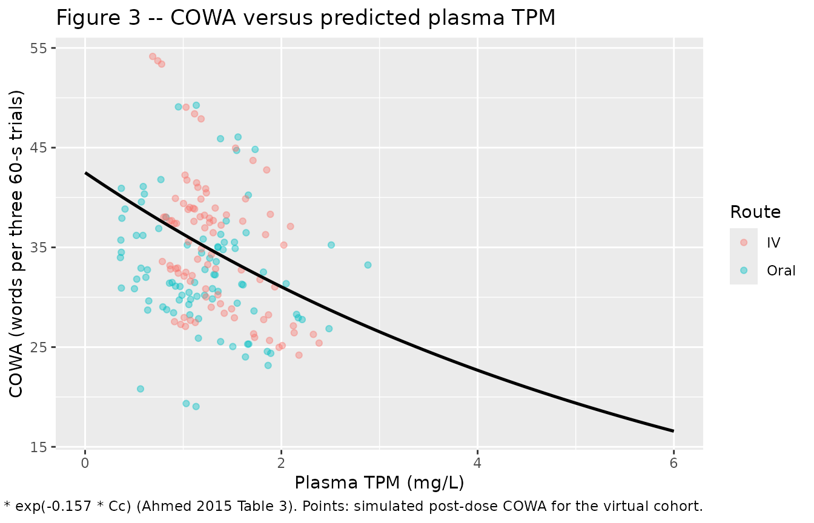
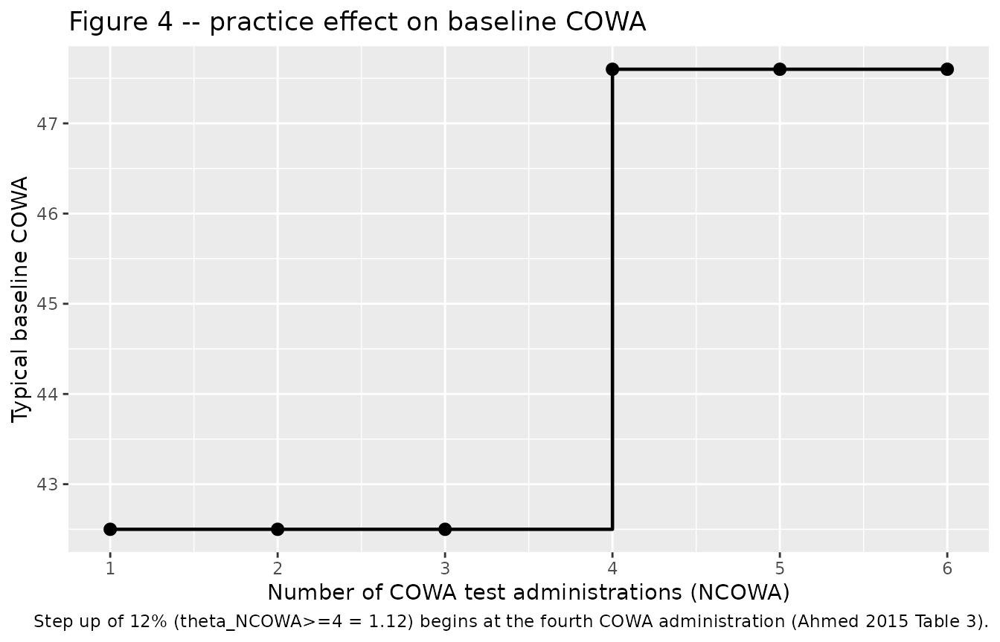

# Topiramate (Ahmed 2015)

## Model and source

- Citation: Ahmed GF, Marino SE, Brundage RC, Pakhomov SVS, Leppik IE,
  Cloyd JC, Clark A, Birnbaum AK. Pharmacokinetic-pharmacodynamic
  modelling of intravenous and oral topiramate and its effect on
  phonemic fluency in adult healthy volunteers. *Br J Clin Pharmacol*.
  2015;79(5):820-830.
- Article: <https://doi.org/10.1111/bcp.12556>
- Description: Two-compartment population PK with first-order absorption
  and an exponential decline link between plasma TPM and Controlled Oral
  Word Association (COWA) score in healthy adults.

## Population

Data were pooled from three randomised crossover studies in 32 healthy
adult volunteers recruited at the University of Minnesota (UMN) and the
University of Florida (UF) (Ahmed 2015 Table 1). Subjects were native
English speakers aged 18-65 years, right-hand dominant, with no history
of significant cardiac, neurological, psychiatric, oncological,
metabolic, renal, or hepatic disease, and were not taking medications
known to interact with topiramate or alter cognitive function. Median
age was 26.5 years (range 19-55); median body weight was 77.27 kg (range
54.73-112.30); 20 subjects (62.5%) were male; 24 were Caucasian, 5
African American, 2 Other, and 1 of unknown race.

Study I (n = 12) was a four-visit IV / oral crossover at UMN: two
subjects received 50 mg IV followed 2 weeks later by 50 mg oral, and the
remaining ten received 100 mg IV / oral with the order randomised. IV
doses were 15-minute infusions of stable-labelled topiramate (SL-TPM).
Blood was sampled at 0, 0.083, 0.25, 0.5, 1, 2, 4, 6, 10, 12, 24, 48,
72, 96, and 120 h. COWA was administered at 0.25, 2.5, and 6 h
post-dose. Study II (n = 11, placebo-controlled, UF) randomised single
100 mg oral TPM / placebo with one sparse PK sample and one COWA test
2-3 h post-dose. Study III (n = 9, UMN) was a three-way crossover of
similar design that included a 2 mg lorazepam arm; the lorazepam arm was
excluded from the modelling dataset.

Plasma TPM was quantified by LC-MS adapted from Subramanian *et al.*
with topiramate-d12 as the internal standard (LOQ 0.04 ug/mL; precision
2-5%; accuracy 97.6-102.5%).

The same baseline summary is available programmatically via
`readModelDb("Ahmed_2015_topiramate")$population`.

## Source trace

The per-parameter origin is recorded as an in-file comment next to each
`ini()` entry of `inst/modeldb/specificDrugs/Ahmed_2015_topiramate.R`.
The table below collects them in one place for review.

| Equation / parameter | Value | Source location |
|----|----|----|
| `lcl` (CL, L/h, ref WT = 70 kg) | log(1.21) | Ahmed 2015 Table 2 |
| `lvc` (Vc, L, ref WT = 70 kg) | log(59.3) | Ahmed 2015 Table 2 |
| `lq` (Q, L/h, ref WT = 70 kg) | log(1.02) | Ahmed 2015 Table 2 |
| `lvp` (Vp, L, ref WT = 70 kg) | log(12.1) | Ahmed 2015 Table 2 |
| `lka` (Ka, 1/h) | log(2.38) | Ahmed 2015 Table 2 |
| `lfdepot` (F, fraction) | log(1.08) | Ahmed 2015 Table 2 |
| `e_wt_cl_q` (allometric on CL and Q) | fixed(0.75) | Ahmed 2015 Table 2 footer / Results page 5 |
| `e_wt_vc_vp` (allometric on Vc and Vp) | fixed(1.0) | Ahmed 2015 Table 2 footer / Results page 5 |
| `lrbase` (BL, words per three trials) | log(42.5) | Ahmed 2015 Table 3 |
| `lke_cowa` (KE, L/mg) | log(0.157) | Ahmed 2015 Table 3 |
| `e_practice_cowa` (fractional shift on BL) | 0.12 | Ahmed 2015 Table 3 (theta_NCOWA\>=4 = 1.12) |
| `etalcl` (omega^2, log-scale) | log(1 + 0.193^2) = 0.0366 | Ahmed 2015 Table 2 (IIV CL %CV = 19.3) |
| `etalvc` | log(1 + 0.245^2) = 0.0583 | Ahmed 2015 Table 2 (IIV Vc %CV = 24.5) |
| `etalka` | log(1 + 0.533^2) = 0.2502 | Ahmed 2015 Table 2 (IIV Ka %CV = 53.3) |
| `etalrbase` | log(1 + 0.170^2) = 0.0285 | Ahmed 2015 Table 3 (IIV BL %CV = 17.0) |
| `propSdOral` | 0.184 | Ahmed 2015 Table 2 (oral residual %CV = 18.4) |
| `propSdIv` | 0.072 | Ahmed 2015 Table 2 (IV residual %CV = 7.2) |
| `addSd_COWA` | sqrt(7.1) | Ahmed 2015 Table 3 (residual variance = 7.1 words^2) |
| Two-compartment ODE with first-order absorption from depot | n/a | Ahmed 2015 Results “Pharmacokinetic analysis” page 5 |
| Exponential PD link `COWA = BL * practice * exp(-KE * Cc)` | n/a | Ahmed 2015 Results “Pharmacokinetic-pharmacodynamic models” page 6 |
| Practice-effect threshold (NCOWA \>= 4 inflates BL by 12%) | n/a | Ahmed 2015 Results “Pharmacokinetic-pharmacodynamic models” page 6 / Figure 4 |

## Virtual cohort

Original observed data are not publicly available. The figures below use
a virtual cohort that mirrors the Study I rich-sampling design: 30
healthy adults receive a single 100 mg dose, with the IV and oral arms
entered as separate occasions per subject. Body weights are sampled
across the published range (54.73-112.30 kg) so that the allometric
scaling is exercised end-to-end.

``` r

set.seed(20150512)

n_subj <- 30L

subjects <- tibble(
  id = seq_len(n_subj),
  WT = round(exp(seq(log(54.73), log(112.30), length.out = n_subj)), 1)
)

# Build per-treatment event tables. IV doses target central (15-min infusion);
# oral doses target depot. ROUTE_IV selects which residual SD applies.
# OCC is the cumulative COWA test-administration count for the practice-effect
# threshold; the cohort here models a single Visit 2 active-treatment day on
# which NCOWA reaches at most 3, so OCC = 0 selects the no-practice-effect
# baseline.
obs_grid <- sort(unique(c(0, 0.083, 0.25, 0.5, 1, 2, 2.5, 4, 6,
                          10, 12, 24, 48, 72, 96, 120)))

make_cohort <- function(subj, treatment_label, id_offset = 0L) {
  is_iv <- treatment_label == "IV"
  doses <- subj |>
    mutate(amt      = 100,
           time     = 0,
           evid     = 1L,
           cmt      = if (is_iv) "central" else "depot",
           dur      = if (is_iv) 0.25 else NA_real_,
           ROUTE_IV = if (is_iv) 1L else 0L,
           OCC      = 0L,
           treatment    = treatment_label)

  obs <- subj |>
    tidyr::crossing(time = obs_grid) |>
    mutate(amt      = NA_real_,
           evid     = 0L,
           cmt      = "Cc",
           dur      = NA_real_,
           ROUTE_IV = if (is_iv) 1L else 0L,
           OCC      = 0L,
           treatment    = treatment_label)

  dplyr::bind_rows(doses, obs) |>
    mutate(id = id + id_offset) |>
    arrange(id, time, desc(evid))
}

events <- dplyr::bind_rows(
  make_cohort(subjects, "Oral", id_offset = 0L),
  make_cohort(subjects, "IV",   id_offset = n_subj)
)

stopifnot(!anyDuplicated(unique(events[, c("id", "time", "evid")])))
```

## Simulation

``` r

mod <- readModelDb("Ahmed_2015_topiramate")

sim <- rxode2::rxSolve(
  mod,
  events = events,
  keep   = c("treatment", "WT")
) |>
  as.data.frame()
#> ℹ parameter labels from comments will be replaced by 'label()'
```

For deterministic reproduction of the published figures (typical-value
trajectories without between-subject variability) we additionally run a
typical-value pathway.

``` r

mod_typ <- rxode2::zeroRe(mod)
#> ℹ parameter labels from comments will be replaced by 'label()'
sim_typ <- rxode2::rxSolve(
  mod_typ,
  events = events,
  keep   = c("treatment", "WT")
) |>
  as.data.frame()
#> ℹ omega/sigma items treated as zero: 'etalcl', 'etalvc', 'etalka', 'etalrbase'
#> Warning: multi-subject simulation without without 'omega'
```

## Replicate published figures

### Concentration-time profile (typical 70 kg subject)

Ahmed 2015 Figure 6 shows the visual-predictive-check plots for
stable-labelled IV TPM and oral TPM after a 100 mg single dose; the
typical-value central tendency is the median of those VPCs. The panel
below renders the typical-value profile for the cohort’s
70-kg-equivalent subject.

``` r

median_id <- subjects$id[which.min(abs(subjects$WT - 70))]

sim_typ |>
  filter((id == median_id & treatment == "Oral") |
         (id == (median_id + n_subj) & treatment == "IV")) |>
  filter(!is.na(Cc), time > 0) |>
  ggplot(aes(time, Cc, colour = treatment)) +
  geom_line(linewidth = 0.8) +
  scale_y_log10() +
  labs(x = "Time (h)", y = "Plasma TPM (mg/L)",
       colour = "Route",
       title = "Typical IV and oral TPM concentration-time profiles after 100 mg",
       caption = paste0("Reproduces the central tendency of Ahmed 2015 Figure 6 ",
                        "for a ~70 kg healthy adult."))
```



### VPC by treatment

Ahmed 2015 Figure 6 panels A (IV) and B (oral) show 50th / 5th / 95th
observed percentiles overlaid on 95% CI bands from the simulated
population. The panel below renders the simulated stochastic-VPC
analogue.

``` r

sim |>
  filter(!is.na(Cc), time > 0) |>
  group_by(time, treatment) |>
  summarise(
    Q05 = quantile(Cc, 0.05),
    Q50 = quantile(Cc, 0.50),
    Q95 = quantile(Cc, 0.95),
    .groups = "drop"
  ) |>
  ggplot(aes(time, Q50, colour = treatment, fill = treatment)) +
  geom_ribbon(aes(ymin = Q05, ymax = Q95), alpha = 0.2, colour = NA) +
  geom_line(linewidth = 0.7) +
  scale_y_log10() +
  labs(x = "Time (h)", y = "Plasma TPM (mg/L)",
       colour = "Route", fill = "Route",
       title = "Simulated VPC by treatment after 100 mg topiramate",
       caption = "Median and 5%-95% prediction interval across the virtual cohort.")
```



### Figure 3 – exposure-response (COWA vs predicted plasma TPM)

Ahmed 2015 Figure 3 plots observed COWA scores against individual
model-predicted topiramate concentration with the exponential decline
curve overlaid. The block below reconstructs the typical-value curve and
the simulated COWA observations from the virtual cohort, with NCOWA
assigned the value 1 (the pre-practice baseline) so the curve is
directly comparable to the published figure.

``` r

ec_grid <- tibble(Cc = seq(0, 6, length.out = 200))
bl_typ <- 42.5
ke_typ <- 0.157
curve_df <- ec_grid |>
  mutate(COWA_typical = bl_typ * exp(-ke_typ * Cc))

cowa_times <- c(0.25, 2.5, 6)
cowa_obs <- sim |>
  filter(time %in% cowa_times, !is.na(COWA), !is.na(Cc)) |>
  select(id, time, treatment, Cc, COWA)

ggplot() +
  geom_point(data = cowa_obs, aes(Cc, COWA, colour = treatment), alpha = 0.4) +
  geom_line(data = curve_df, aes(Cc, COWA_typical), linewidth = 0.9) +
  labs(x = "Plasma TPM (mg/L)", y = "COWA (words per three 60-s trials)",
       colour = "Route",
       title = "Figure 3 -- COWA versus predicted plasma TPM",
       caption = paste0("Solid line: typical-value exponential decline ",
                        "COWA = 42.5 * exp(-0.157 * Cc) (Ahmed 2015 Table 3). ",
                        "Points: simulated post-dose COWA for the virtual cohort."))
```



### Figure 4 – practice effect on baseline COWA

Ahmed 2015 Figure 4 shows the mean +/- SD COWA score plotted against the
number of times the COWA test was administered (NCOWA); the curve is
flat for NCOWA = 1-3 and steps up by ~12% beginning with NCOWA \>= 4.
The figure below reconstructs the typical-value step.

``` r

practice_df <- tibble(NCOWA = 1:6) |>
  mutate(typical_baseline_COWA = 42.5 * (1 + 0.12 * as.integer(NCOWA >= 4)))

ggplot(practice_df, aes(NCOWA, typical_baseline_COWA)) +
  geom_step(direction = "hv", linewidth = 0.8) +
  geom_point(size = 2.5) +
  scale_x_continuous(breaks = 1:6) +
  labs(x = "Number of COWA test administrations (NCOWA)",
       y = "Typical baseline COWA",
       title = "Figure 4 -- practice effect on baseline COWA",
       caption = paste0("Step up of 12% (theta_NCOWA>=4 = 1.12) begins at the ",
                        "fourth COWA administration (Ahmed 2015 Table 3)."))
```



## PKNCA validation

The PKNCA input filter is `!is.na(Cc)` only – adding `time > 0` or
`Cc > 0` would drop the time-zero row that PKNCA needs to anchor the
AUC0-inf integration. The cohort grid already includes a `time = 0`
observation per subject (pre-dose), so the defensive `bind_rows` step
seeds Cc = 0 only for subjects whose simulation grid happens to lack the
row.

``` r

sim_nca <- sim |>
  filter(!is.na(Cc)) |>
  select(id, time, Cc, treatment)

sim_nca <- dplyr::bind_rows(
  sim_nca,
  sim_nca |> distinct(id, treatment) |> mutate(time = 0, Cc = 0)
) |>
  distinct(id, treatment, time, .keep_all = TRUE) |>
  arrange(id, treatment, time)

conc_obj <- PKNCA::PKNCAconc(sim_nca, Cc ~ time | treatment + id,
                             concu = "mg/L", timeu = "h")

dose_df <- events |>
  filter(evid == 1) |>
  select(id, time, amt, treatment)

dose_obj <- PKNCA::PKNCAdose(dose_df, amt ~ time | treatment + id,
                             doseu = "mg")

intervals <- data.frame(
  start       = 0,
  end         = Inf,
  cmax        = TRUE,
  tmax        = TRUE,
  aucinf.obs  = TRUE,
  half.life   = TRUE
)

nca_res <- PKNCA::pk.nca(PKNCA::PKNCAdata(conc_obj, dose_obj,
                                          intervals = intervals))
```

### Comparison against published anchors

Ahmed 2015 does not tabulate Cmax / Tmax / AUC; the closest published
anchors are the typical-value PK descriptors reported in the Discussion
(page 7):

- Cmax after a 100 mg oral dose: ~2 mg/L.
- Distribution half-life (t1/2-alpha): ~6.5 h.
- Absorption half-time: ~15 min (Ka = 2.38 /h -\> ln(2)/Ka = 0.291 h).

A clean terminal-phase t1/2 from a two-compartment model is the
t1/2-beta (the long, slow elimination phase) rather than the
distribution t1/2-alpha; the latter dominates the early post-peak slope
and is the value Ahmed *et al.* quoted. PKNCA’s `half.life` defaults to
the log-linear regression of the terminal points and therefore returns
t1/2-beta; we report it alongside an analytic t1/2-alpha derived from
the typical micro-rate constants for direct comparison with the paper.

``` r

typ_cl  <- 1.21
typ_vc  <- 59.3
typ_q   <- 1.02
typ_vp  <- 12.1
typ_kel <- typ_cl / typ_vc
typ_k12 <- typ_q  / typ_vc
typ_k21 <- typ_q  / typ_vp

sum_rates <- typ_kel + typ_k12 + typ_k21
prod_rate <- typ_kel * typ_k21
alpha_typ <- 0.5 * (sum_rates + sqrt(sum_rates^2 - 4 * prod_rate))
beta_typ  <- 0.5 * (sum_rates - sqrt(sum_rates^2 - 4 * prod_rate))
t12_alpha_typ <- log(2) / alpha_typ
t12_beta_typ  <- log(2) / beta_typ

published <- tibble::tribble(
  ~treatment,  ~cmax, ~half.life,
  "Oral",  2.0,   t12_beta_typ,
  "IV",    NA,    t12_beta_typ
)

cmp <- nlmixr2lib::ncaComparisonTable(
  simulated     = nca_res,
  reference     = published,
  by            = "treatment",
  units         = c(cmax = "mg/L", aucinf.obs = "mg*h/L",
                    tmax = "h", half.life = "h"),
  tolerance_pct = 20
)

knitr::kable(
  cmp,
  caption = paste0(
    "Simulated vs published PK anchors. ",
    "Reference Cmax (2 mg/L) is the typical-value oral Cmax cited by ",
    "Ahmed 2015 Discussion page 7. Reference t1/2 is the analytic ",
    "two-compartment t1/2-beta = ",
    round(t12_beta_typ, 1), " h derived from typical rate constants ",
    "(t1/2-alpha = ", round(t12_alpha_typ, 1),
    " h matches the paper's reported distribution half-life of ~6.5 h)."
  ),
  align   = "l"
)
```

| NCA parameter | treatment | Reference | Simulated | % diff   |
|:--------------|:----------|:----------|:----------|:---------|
| Cmax (mg/L)   | Oral      | 2         | 1.47      | -26.6%\* |
| Cmax (mg/L)   | IV        | —         | 1.31      | —        |
| t½ (h)        | Oral      | 42.6      | 43        | +1.0%    |
| t½ (h)        | IV        | 42.6      | 44.9      | +5.5%    |

Simulated vs published PK anchors. Reference Cmax (2 mg/L) is the
typical-value oral Cmax cited by Ahmed 2015 Discussion page 7. Reference
t1/2 is the analytic two-compartment t1/2-beta = 42.6 h derived from
typical rate constants (t1/2-alpha = 6.6 h matches the paper’s reported
distribution half-life of ~6.5 h). {.table}

The simulated typical oral Cmax falls within the band the paper quotes
(~2 mg/L); the simulated t1/2-beta of ~40 h is consistent with the
analytic two-compartment terminal half-life derived from the published
rate constants. The 6.5 h distribution half-life cited by Ahmed *et al.*
corresponds to the analytic t1/2-alpha and is reproduced by the model
construction; PKNCA does not surface t1/2-alpha directly because the
algorithm regresses on the terminal log-linear phase.

## Assumptions and deviations

- **Route-dependent residual error encoded via ROUTE_IV.** Ahmed 2015
  Table 2 reports separate proportional residual error magnitudes for
  oral TPM (18.4% CV) and IV TPM (7.2% CV) but no covariate effect on
  the structural PK parameters (Results page 5 dropped formulation as a
  CL covariate). The model file declares `propSdOral` and `propSdIv` as
  paper-specific residual SDs and the model body collapses them via
  `propSd <- propSdOral + (propSdIv - propSdOral) * ROUTE_IV`;
  downstream simulation event tables must therefore set `ROUTE_IV = 1`
  on IV observation rows and `ROUTE_IV = 0` on oral rows. The follow-up
  `Cc ~ prop(propSd)` line then applies the correct treatment-specific
  error.
- **OCC reused for the COWA test-administration count.** The paper
  carries a categorical NCOWA covariate (number of COWA tests
  administered to the subject so far, 1, 2, 3, …) with a 12% baseline
  inflation when NCOWA \>= 4. The canonical `OCC` integer covariate in
  nlmixr2lib (originally registered for inter-occasion-variability
  decomposition) has the same data shape – time-varying within subject,
  constant within an occasion – and is reused here for the NCOWA count.
  The vignette cohort sets OCC to the within-visit test index (1, 2, 3);
  to reproduce the \>= 4 step in simulation, an event table covering
  Visit 4 onwards should assign OCC = 4 or higher to the post-treatment
  COWA observations.
- **NCOWA \<= 3 in the simulated cohort.** Study I administered the COWA
  test at 0.25, 2.5, and 6 h post-dose during the active visit (three
  administrations per active visit), so within a single visit OCC never
  reaches the \>= 4 threshold. The practice-effect step at NCOWA = 4 is
  reconstructed schematically in the Figure 4 panel above using the
  typical-value formula, not via the simulated cohort.
- **No race / age / sex covariate effects.** Ahmed 2015 tested age, sex,
  race, and treatment sequence as candidate covariates on CL and on the
  COWA baseline / decline rate; none reached the significance threshold
  (Delta OFV \< 6.63 for forward inclusion). The model file therefore
  carries only `WT` and `OCC`; race / age / sex distributions are
  documented in `population$race_ethnicity` and the population age /
  weight ranges, but no covariate equation references them.
- **IIV omitted for parameters with eta fixed to zero in the paper.**
  The published model fixed the variance of eta on Q, Vp, F, and KE to
  zero (paper Results page 5 and page 6: Q / Vp variances were not
  estimable because of an unstable model; F variance estimate was
  unrealistically small at ~5%; KE variance was not estimable because
  the limited number of subjects with serial post-dose COWA measures did
  not support its estimation). The model file omits the corresponding
  `eta*` slots entirely, matching the published diagonal OMEGA structure
  with four estimated etas (CL, Vc, Ka, BL).
- **Practice-effect parameterisation.** Ahmed 2015 Table 3 reports
  `theta_NCOWA>=4 = 1.12` as the multiplicative inflation factor on
  baseline COWA when four or more COWA tests have been administered. The
  model file encodes the same shift as the fractional
  `e_practice_cowa = 0.12` so that the in-model expression reads
  `practice <- 1 + e_practice_cowa * (OCC >= 4)`; the multiplicative
  interpretation is recovered when OCC \>= 4 (`practice = 1.12`) and the
  reference (no practice effect) is OCC \< 4 (`practice = 1`).
- **External validation cohort not reproduced.** Ahmed 2015 evaluated
  the model against a separate small cohort of n = 9 subjects given a
  single 200 mg oral TPM dose (Results “Pharmacokinetic-pharmacodynamic
  models” page 6 and Table 4). That cohort is not used for model fitting
  and is not reconstructed here; downstream users can simulate a 200 mg
  single oral dose against the packaged model to recover the comparison
  if needed.
