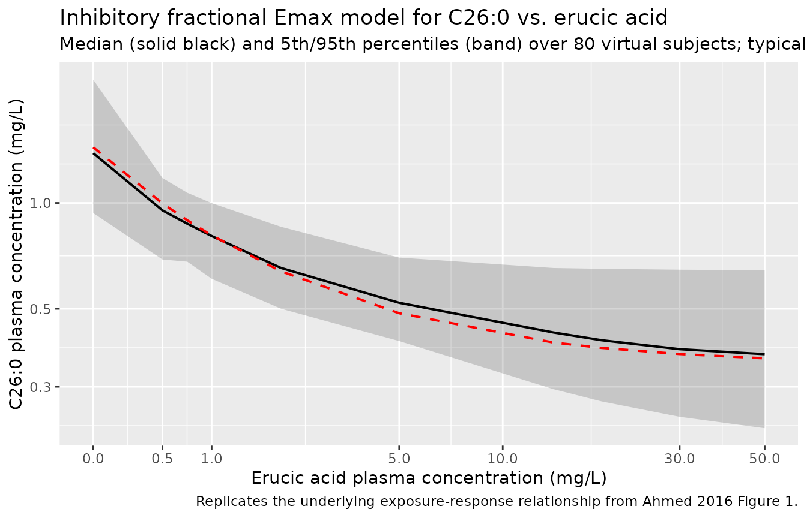

# Lorenzo's oil (Ahmed 2016)

## Model and source

- Citation: Ahmed MA, Kartha RV, Brundage RC, Cloyd J, Basu C, Carlin
  BP, Jones RO, Moser AB, Fatemi A, Raymond GV. A model-based approach
  to assess the exposure-response relationship of Lorenzo’s oil in
  adrenoleukodystrophy. Br J Clin Pharmacol. 2016 Jun;81(6):1058-1065.
  <doi:10.1111/bcp.12897>
- Description: Population pharmacodynamic model of Lorenzo’s oil effect
  on plasma C26:0 in asymptomatic boys with X-linked
  adrenoleukodystrophy: inhibitory fractional Emax model relating
  observed plasma erucic acid concentration to plasma C26:0. The paper
  does not develop a PK model for erucic acid; observed erucic acid
  plasma concentration is supplied as a time-varying covariate.
- Article: <https://doi.org/10.1111/bcp.12897>

Ahmed and colleagues studied the effect of Lorenzo’s oil (LO; a mixture
of glyceryl trierucate and glyceryl trioleate providing erucic acid
(C22:1) and oleic acid in the diet) on plasma very-long-chain saturated
fatty acid concentrations in asymptomatic boys with X-linked
adrenoleukodystrophy (X-ALD). The pharmacodynamic readout is plasma
C26:0 (hexacosanoic acid), which accumulates in X-ALD and is believed to
drive the cerebral demyelination characteristic of childhood cerebral
ALD. The structural model is a purely algebraic inhibitory fractional
Emax expression with the *observed* plasma erucic acid concentration as
predictor; the paper explicitly does **not** develop a PK model for
erucic acid (only one determination per subject per visit was available
and dosing / sampling times were not collected).

## Population

The estimation dataset comprised 2384 paired C26:0 / erucic acid plasma
observations from 104 asymptomatic X-ALD boys identified by screening
at-risk relatives at the Johns Hopkins Research Hospital between 2000
and 2014 (ClinicalTrials.gov NCT02233257). Baseline median age was 2.79
years (range 0.068-8.92) and baseline median weight 14.90 kg (range
9.40-40.60); X-ALD is X-linked and the cohort is entirely male. Mean
follow-up was 4.88 +/- 2.76 years. All participants received
approximately 2-3 mg/kg/day of Lorenzo’s oil providing 20% of caloric
intake, with platelet-mediated dose interruptions managed by temporary
substitution of glyceryl trioleate at the same dosage. Of the 103
subjects retained for the time-to-event analyses, 10 developed a brain
MRI abnormality during the observation window (Ahmed 2016 Table 1,
Results).

The same information is available programmatically via the model’s
`population` metadata
(`readModelDb("Ahmed_2016_lorenzosOil")$population`).

## Source trace

The per-parameter origin is recorded as an in-file comment next to each
`ini()` entry in `inst/modeldb/specificDrugs/Ahmed_2016_lorenzosOil.R`.
The table below consolidates the source pointers for the structural
model and the parameter estimates.

| Equation / parameter | Value | Source location |
|----|----|----|
| `C26:0 = E0 * (1 - Emax * ER / (EC50 + ER))` | n/a | Ahmed 2016 Methods, “Population PD model building” (unnumbered Emax equation, page 1060) |
| `le0` (E0) | 1.44 mg/L | Ahmed 2016 Table 2, fixed effects |
| `lemax` (Emax) | 0.76 | Ahmed 2016 Table 2, fixed effects |
| `lec50` (EC50) | 0.734 mg/L | Ahmed 2016 Table 2, fixed effects |
| BSV CV% on E0 | 31.5% | Ahmed 2016 Table 2, random effects (CV% = sqrt(exp(omega^2) - 1)) |
| BSV CV% on Emax | 6.2% | Ahmed 2016 Table 2, random effects |
| BSV CV% on EC50 | 171.3% | Ahmed 2016 Table 2, random effects |
| corr(E0, EC50) | -0.877 | Ahmed 2016 Table 2; other correlations fixed to zero (Results) |
| `propSd` | 0.276 | Ahmed 2016 Table 2 (proportional residual CV% 27.6%; footnote: CV% = sqrt(sigma^2)) |

CV%-to-variance conversion (`omega^2 = log(CV^2 + 1)`):

| Parameter | CV%   | omega^2  |
|-----------|-------|----------|
| E0        | 31.5  | 0.09464  |
| Emax      | 6.2   | 0.003836 |
| EC50      | 171.3 | 1.36998  |

Covariance entry in the (etale0, etalec50) block:
`cov = -0.877 * sqrt(0.09464 * 1.36998) = -0.31579`.

## Virtual cohort

Original observed data are not publicly available. The simulations below
build a virtual cohort whose covariate distributions approximate the
published trial demographics (Table 1) and exercise the model across the
observed erucic acid plasma concentration range.

``` r

set.seed(20260619)

n_subj <- 80L
er_grid <- c(0, 0.5, 0.734, 1, 2, 5, 13.80, 18.63, 30, 50)

events <- expand.grid(id = seq_len(n_subj), time = seq_along(er_grid)) |>
  dplyr::mutate(
    evid      = 0L,
    amt       = 0,
    cmt       = "Cc26",
    CP_ER_MGL = er_grid[time]
  )
```

## Simulation

``` r

mod <- readModelDb("Ahmed_2016_lorenzosOil")

# Stochastic VPC-style simulation with full random effects.
sim <- rxode2::rxSolve(mod, events = events, keep = c("CP_ER_MGL"))
#> ℹ parameter labels from comments will be replaced by 'label()'
```

For deterministic replication (the typical-value curve overlaid on
Figure 1), zero out the random effects:

``` r

mod_typical <- mod |> rxode2::zeroRe()
#> ℹ parameter labels from comments will be replaced by 'label()'
sim_typical <- rxode2::rxSolve(mod_typical, events = events, keep = c("CP_ER_MGL"))
#> ℹ omega/sigma items treated as zero: 'etale0', 'etalec50', 'etalemax'
#> Warning: multi-subject simulation without without 'omega'
```

## Replicate Figure 1 – pvcVPC of C26:0 vs. erucic acid

Figure 1 of Ahmed 2016 displays the prediction- and
variability-corrected VPC (pvcVPC) of C26:0 versus erucic acid plasma
concentration on a log scale, with observation percentiles overlaid on
the 95% prediction intervals derived from 1000 simulated replicates. The
pvcVPC normalisation removes between-subject variability and bin-to-bin
differences in the predictor; the cleaner deterministic relationship
from the same model (population mean as a function of ER) is shown below
alongside the stochastic 5th / 50th / 95th percentile bands across the
virtual cohort.

``` r

band <- sim |>
  dplyr::group_by(CP_ER_MGL) |>
  dplyr::summarise(
    Q05 = quantile(Cc26, 0.05, na.rm = TRUE),
    Q50 = quantile(Cc26, 0.50, na.rm = TRUE),
    Q95 = quantile(Cc26, 0.95, na.rm = TRUE),
    .groups = "drop"
  )

typical <- sim_typical |>
  dplyr::group_by(CP_ER_MGL) |>
  dplyr::summarise(Cc26 = mean(Cc26), .groups = "drop")

ggplot(band, aes(x = CP_ER_MGL)) +
  geom_ribbon(aes(ymin = Q05, ymax = Q95), alpha = 0.20) +
  geom_line(aes(y = Q50), linewidth = 0.7) +
  geom_line(data = typical, aes(y = Cc26),
            colour = "red", linetype = "dashed", linewidth = 0.7) +
  scale_x_continuous(trans = "log1p",
                     breaks = c(0, 0.5, 1, 5, 10, 30, 50)) +
  scale_y_log10() +
  labs(
    x = "Erucic acid plasma concentration (mg/L)",
    y = "C26:0 plasma concentration (mg/L)",
    title = "Inhibitory fractional Emax model for C26:0 vs. erucic acid",
    subtitle = "Median (solid black) and 5th/95th percentiles (band) over 80 virtual subjects; typical curve (red dashed)",
    caption = "Replicates the underlying exposure-response relationship from Ahmed 2016 Figure 1."
  )
```



## Key landmark predictions

The paper reports three landmark predictions in the Results /
Discussion:

- At pretreatment median ER = 0.5 mg/L, the model predicts C26:0 = 0.997
  mg/L (Ahmed 2016 Discussion).
- At median LAUCER = 13.80 mg/L (Table 1; the Discussion text mis-quotes
  this as 13.08 – the value used in the prediction below is the Table 1
  figure), the model predicts C26:0 = 0.404 mg/L.
- As ER -\> infinity, C26:0 -\> E0 \* (1 - Emax) = 1.44 \* 0.24 = 0.346
  mg/L (the asymptotic floor; Ahmed 2016 Discussion).

``` r

landmark <- data.frame(
  scenario = c("Pretreatment median ER", "Median LAUCER", "ER -> infinity"),
  ER       = c(0.5, 13.80, 1e6)
) |>
  dplyr::mutate(
    cc26_pred  = with(list(e0 = 1.44, emax = 0.76, ec50 = 0.734),
                      e0 * (1 - emax * ER / (ec50 + ER))),
    cc26_paper = c(0.997, 0.404, 1.44 * (1 - 0.76))
  )

landmark |>
  dplyr::rename(
    "Scenario"               = scenario,
    "Erucic acid (mg/L)"     = ER,
    "C26:0 predicted (mg/L)" = cc26_pred,
    "C26:0 paper (mg/L)"     = cc26_paper
  ) |>
  knitr::kable(
    digits  = 3,
    caption = "Closed-form C26:0 predictions vs. paper-stated landmark values."
  )
```

| Scenario | Erucic acid (mg/L) | C26:0 predicted (mg/L) | C26:0 paper (mg/L) |
|:---|---:|---:|---:|
| Pretreatment median ER | 5.00e-01 | 0.997 | 0.997 |
| Median LAUCER | 1.38e+01 | 0.401 | 0.404 |
| ER -\> infinity | 1.00e+06 | 0.346 | 0.346 |

Closed-form C26:0 predictions vs. paper-stated landmark values. {.table}

``` r


stopifnot(all.equal(landmark$cc26_pred, landmark$cc26_paper, tolerance = 1e-2))
```

The closed-form predictions match the paper’s narrative within rounding,
which confirms that the encoded `ini()` values reproduce the paper’s
published model.

## Assumptions and deviations

- **No PK model for erucic acid.** Ahmed 2016 explicitly states that
  only one erucic acid concentration was determined per subject per
  visit and that dosing and sampling times were not collected, so no PK
  model was developed. The nlmixr2lib model takes plasma erucic acid
  concentration as a time-varying covariate column (`CP_ER_MGL`)
  supplied by the user from observed data or from an external assumption
  (e.g. the post-treatment median of 18.63 mg/L, Table 1). Downstream
  users who need a coupled PK-PD simulation must supply their own erucic
  acid PK trajectory.

- **No ODE state.** The model is a pure algebraic biomarker expression
  with no compartment, no dose event, and no time dynamics. PKNCA-based
  NCA validation is therefore not applicable; the landmark-predictions
  table above is the closed-form check.

- **Observation variable name `Cc26` is paper-specific, not the
  canonical `Cc`.**
  `nlmixr2lib::checkModelConventions("Ahmed_2016_lorenzosOil")` raises a
  warning that the single-output observation `Cc26` is not the canonical
  `Cc` (the convention-defined drug-concentration observation name). The
  observation here is plasma C26:0 (hexacosanoic acid), a
  very-long-chain saturated fatty acid biomarker – not a drug
  concentration – and the paper-specific name is retained to keep the
  model’s output semantically honest. The same accepted deviation exists
  in `Weber_1993_remikiren.R` (output `APR`) where the observation is a
  PD endpoint rather than a drug concentration.

- **Time-to-event analyses not extracted as a separate model file.**
  Ahmed 2016 reports two parametric AFT-Weibull regressions in SAS PROC
  LIFEREG that related the per-subject time-weighted average erucic acid
  plasma concentration (LAUCER) and the per-subject time-weighted
  average C26:0 (LAUCC26:0) to the hazard of developing a brain MRI
  abnormality (Tables 3 and 4). Both associations were not statistically
  significant (P = 0.5344 and P = 0.1509 respectively) and the analyses
  use a per-subject summary statistic (LAUC) rather than a time-varying
  state, so they fall outside the scope of an nlmixr2 ODE /
  mixed-effects model. The AFT-Weibull point estimates are preserved
  here for reference:

  | Predictor | Shape (r) | Intercept (alpha) | Slope (beta, AFT) | Implied hazard ratio | Source |
  |----|----|----|----|----|----|
  | LAUCER (mg/L) | 0.744 | 6.49 | 0.05 per (mg/L) | 0.963 per (mg/L) | Ahmed 2016 Table 3 |
  | LAUCC26:0 (mg/L) | 0.828 | 8.19 | -2.59 per (mg/L) | 8.53 per (mg/L) | Ahmed 2016 Table 4 |

  Hazard ratio = exp(-beta_AFT \* shape).

- **Sex distribution.** X-ALD is X-linked and the trial enrolled only
  boys (Ahmed 2016 Methods); `population$sex_female_pct = 0`. The
  original paper does not report race / ethnicity for the cohort.

- **Erucic acid censoring rule.** The paper censored ER \> 30 mg/L in
  the time-to-event analyses (treating those values as transient peak
  post-dose concentrations rather than steady-state brain exposure
  proxies). The popPD fit used the full ER range. The packaged model
  places no upper bound on `CP_ER_MGL`; downstream users who want to
  replicate the LAUC analyses should apply the same \> 30 mg/L cap to
  their input data.
