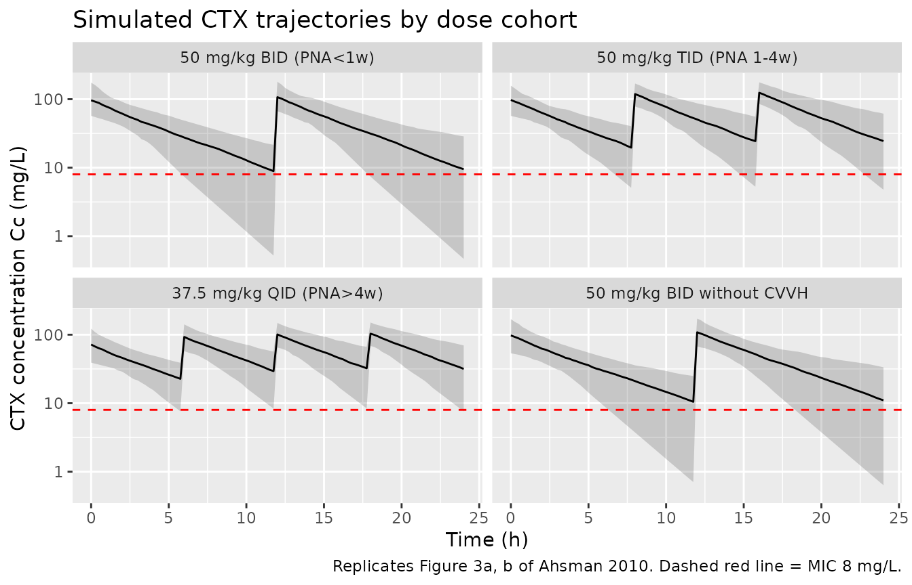
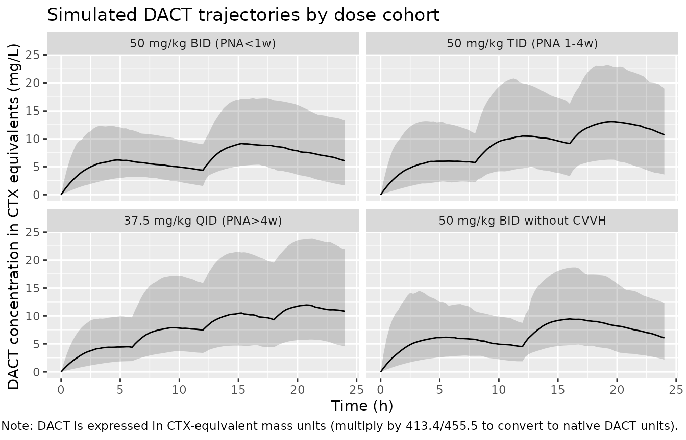

# Cefotaxime + desacetylcefotaxime (Ahsman 2010)

## Model and source

- Citation: Ahsman MJ, Wildschut ED, Tibboel D, Mathot RA.
  Pharmacokinetics of cefotaxime and desacetylcefotaxime in infants
  during extracorporeal membrane oxygenation. Antimicrob Agents
  Chemother. 2010;54(5):1734-1741. <doi:10.1128/AAC.01696-09>.
- Description: One-compartment population PK model for cefotaxime (CTX)
  and its active metabolite desacetylcefotaxime (DACT) in critically ill
  neonates and infants on extracorporeal membrane oxygenation (ECMO). IV
  bolus parent with first-order elimination; the metabolite is generated
  1:1 from parent elimination on a CTX-equivalent mass basis (the source
  paper converted observed DACT concentrations to CTX equivalents by the
  molecular weight ratio Mr_CTX / Mr_DACT = 455.5 / 413.4 before
  fitting, and assumed a conversion fraction FDACT/CTX = 1). Parent CL
  is scaled by body weight (WT) via a power model centred at 3.5 kg;
  both parent and metabolite CL include a power covariate effect of time
  after ECMO decannulation (T_POST_ECMO) centred at 100 h that is
  removed during ECMO (T_POST_ECMO = 0). Metabolite CL additionally
  includes a power covariate effect of continuous venovenous
  hemofiltration flow Q_CVVH centred at 193 mL/min that is removed when
  CVVH is not running (Q_CVVH = 0). Volumes (Vc, Vc_dact) carry no
  covariate effects.
- Article: <https://doi.org/10.1128/AAC.01696-09>

## Population

The source population is 37 critically ill neonates and infants on
extracorporeal membrane oxygenation (ECMO) at Erasmus University Medical
Center, Rotterdam (December 2006 - June 2009), contributing 392 plasma
samples (median 10 per patient, range 1-17). Baseline characteristics
from Table 1 of Ahsman 2010:

- Body weight 2.0-6.2 kg (median 3.5 kg).
- Postnatal age 0.67-199 days (median 3.3 days); gestational age 34-42
  weeks (median 37 weeks).
- Sex 18 male / 19 female.
- Primary diagnosis: meconium aspiration syndrome 46%, congenital
  diaphragmatic hernia 22%, pulmonary hypertension 14%, congenital heart
  defects 11%, other (sepsis, viral) 7%.
- ECMO modality 54% VV / 46% VA across 41 runs (4 patients had 2 runs);
  duration 16-374 h (median 108 h).
- 30 of 37 patients underwent CVVH at flow 100-350 mL/min (median 193
  mL/min); 7 had no CVVH (Q_CVVH = 0).
- Serum chemistry: albumin 21-40 g/L (median 31); serum creatinine 19-69
  umol/L (median 32).
- Survival 25 / 37.

Standard ECMO cefotaxime dosing depends on postnatal age:

- PNA \< 1 week: 50 mg/kg BID (n = 24, 65%).
- PNA 1-4 weeks: 50 mg/kg TID (n = 7, 19%).
- PNA \> 4 weeks: 37.5 mg/kg QID (n = 3, 8%).
- Off-protocol per clinician discretion: 25 mg/kg BID (n = 2) or 37.5
  mg/kg TID (n = 1).

The same information is available programmatically via the model’s
`population` metadata
(`readModelDb("Ahsman_2010_cefotaxime")$population`).

## Source trace

Every `ini()` entry in
`inst/modeldb/specificDrugs/Ahsman_2010_cefotaxime.R` carries an in-file
trailing comment pointing to its source location in the paper. The table
below collects them in one place for review.

| Equation / parameter | Value | Source location |
|----|----|----|
| `lvc` (CTX Vc, L) | 1.82 | Table 2 |
| `lcl` (CTX CL at ref WT, L/h) | 0.36 | Table 2 |
| `lvc_dact` (DACT Vc in CTX-equiv, L) | 11.0 | Table 2 |
| `lcl_dact` (DACT CL in CTX-equiv, L/h) | 1.46 | Table 2 |
| `e_wt_cl` (WT exponent on CTX CL) | 0.56 | Table 2 |
| `e_q_cvvh_cl_dact` (Q_CVVH exponent on DACT CL) | 0.72 | Table 2 |
| `e_t_post_ecmo_cl` (T_POST_ECMO exponent on CTX CL) | 0.16 | Table 2 |
| `e_t_post_ecmo_cl_dact` (T_POST_ECMO exponent on DACT CL) | 0.53 | Table 2 |
| IIV CV% CTX Vc / CL | 35.4 / 36.1 | Table 2 |
| IIV CV% DACT Vc / CL (CTX-equiv) | 59.8 / 51.4 | Table 2 |
| Proportional residual (t_dose \> 1 h) | 0.327 | Table 2 |
| Reference WT (cohort median) | 3.5 kg | Table 1 |
| Reference Q_CVVH (cohort median on CVVH) | 193 mL/min | Table 1 |
| Reference T_POST_ECMO | 100 h | Appendix |
| `d/dt(central) = -kel * central` | n/a | Appendix CTX d/dt equation |
| `d/dt(central_dact) = kel*central - kel_dact*central_dact` | n/a | Appendix DACT d/dt equation |
| Molecular-weight ratio Mr_CTX / Mr_DACT = 455.5 / 413.4 | n/a | Results, “DACT concentrations were converted to CTX equivalents” |
| FDACT/CTX = 1 (full conversion) | n/a | Table 2 footnote a |

## Virtual cohort

Original observed data are not publicly available. The simulations below
use a virtual cohort that mirrors the Table 1 dose-cohort proportions
(50 mg/kg BID, 50 mg/kg TID, 37.5 mg/kg QID) at the cohort median weight
3.5 kg. CVVH flow is set to the cohort median (193 mL/min); a subgroup
without CVVH (Q_CVVH = 0) is included to illustrate the metabolite
covariate gate. T_POST_ECMO is held at 0 throughout (the patients are on
ECMO during the entire simulated window).

``` r

set.seed(2010L)

sim_window <- 24  # hours of simulated follow-up

# Sampling grid (15-min resolution captures peak and trough)
obs_times <- seq(0, sim_window, by = 0.25)

make_cohort <- function(n, dose_mg_per_kg, dose_freq_h, label,
                        q_cvvh = 193, wt = 3.5,
                        id_offset = 0L) {
  dose_amt <- dose_mg_per_kg * wt
  dose_times <- seq(0, sim_window - dose_freq_h, by = dose_freq_h)

  ids <- id_offset + seq_len(n)
  dosing <- expand.grid(id = ids, time = dose_times) |>
    transform(
      evid = 1L,
      amt  = dose_amt,
      cmt  = "central"
    )
  obs <- expand.grid(id = ids, time = obs_times) |>
    transform(
      evid = 0L,
      amt  = NA_real_,
      cmt  = "Cc"
    )
  obs2 <- obs
  obs2$cmt <- "Cc_dact"
  out <- rbind(dosing, obs, obs2)
  out$WT          <- wt
  out$Q_CVVH      <- q_cvvh
  out$T_POST_ECMO <- 0
  out$treatment   <- label
  out[order(out$id, out$time, -out$evid), ]
}

events <- dplyr::bind_rows(
  make_cohort(200, dose_mg_per_kg = 50.0, dose_freq_h = 12, label = "50 mg/kg BID (PNA<1w)",        id_offset =    0L),
  make_cohort(200, dose_mg_per_kg = 50.0, dose_freq_h =  8, label = "50 mg/kg TID (PNA 1-4w)",      id_offset =  200L),
  make_cohort(200, dose_mg_per_kg = 37.5, dose_freq_h =  6, label = "37.5 mg/kg QID (PNA>4w)",      id_offset =  400L),
  make_cohort(200, dose_mg_per_kg = 50.0, dose_freq_h = 12, label = "50 mg/kg BID without CVVH",    id_offset =  600L, q_cvvh = 0)
)

stopifnot(!anyDuplicated(unique(events[, c("id", "time", "evid")])))
```

## Simulation

``` r

mod <- readModelDb("Ahsman_2010_cefotaxime")
sim <- rxode2::rxSolve(mod, events = events,
                       keep = c("treatment", "WT", "Q_CVVH", "T_POST_ECMO", "cmt"))

# rxSolve emits one row per observation event, so each (id, time) pair appears
# twice (one for the Cc observation slot, one for the Cc_dact slot). The Cc
# and Cc_dact columns are however populated for every row. Deduplicate to one
# row per (id, time) so PKNCA's `duplicate_check()` is happy downstream.
sim_unique <- sim |>
  dplyr::filter(cmt == "Cc") |>
  dplyr::select(-cmt)
```

## Replicate published figures

### Figure 3 (a, c) – CTX and DACT concentration-time profiles

Figure 3 of Ahsman 2010 plots observed and individual-predicted CTX
(panels a, b) and DACT (panels c, d) concentrations against time after
dose, stratified by postnatal age category. Below we plot the simulated
trajectories on the same scale; the dashed horizontal line on the CTX
panel marks the worst-case MIC of 8 mg/L (the paper’s target).

``` r

ctx <- sim_unique |>
  dplyr::filter(!is.na(Cc)) |>
  dplyr::mutate(treatment = factor(treatment, levels = c(
    "50 mg/kg BID (PNA<1w)", "50 mg/kg TID (PNA 1-4w)",
    "37.5 mg/kg QID (PNA>4w)", "50 mg/kg BID without CVVH")))

ctx_summary <- ctx |>
  dplyr::group_by(treatment, time) |>
  dplyr::summarise(
    Q05 = quantile(Cc, 0.05, na.rm = TRUE),
    Q50 = quantile(Cc, 0.50, na.rm = TRUE),
    Q95 = quantile(Cc, 0.95, na.rm = TRUE),
    .groups = "drop"
  )

ggplot(ctx_summary, aes(time, Q50)) +
  geom_ribbon(aes(ymin = Q05, ymax = Q95), alpha = 0.2) +
  geom_line() +
  geom_hline(yintercept = 8, linetype = "dashed", colour = "red") +
  facet_wrap(~treatment) +
  scale_y_log10() +
  labs(x = "Time (h)", y = "CTX concentration Cc (mg/L)",
       title = "Simulated CTX trajectories by dose cohort",
       caption = "Replicates Figure 3a, b of Ahsman 2010. Dashed red line = MIC 8 mg/L.")
```



``` r

dact <- sim_unique |>
  dplyr::filter(!is.na(Cc_dact)) |>
  dplyr::mutate(treatment = factor(treatment, levels = c(
    "50 mg/kg BID (PNA<1w)", "50 mg/kg TID (PNA 1-4w)",
    "37.5 mg/kg QID (PNA>4w)", "50 mg/kg BID without CVVH")))

dact_summary <- dact |>
  dplyr::group_by(treatment, time) |>
  dplyr::summarise(
    Q05 = quantile(Cc_dact, 0.05, na.rm = TRUE),
    Q50 = quantile(Cc_dact, 0.50, na.rm = TRUE),
    Q95 = quantile(Cc_dact, 0.95, na.rm = TRUE),
    .groups = "drop"
  )

ggplot(dact_summary, aes(time, Q50)) +
  geom_ribbon(aes(ymin = Q05, ymax = Q95), alpha = 0.2) +
  geom_line() +
  facet_wrap(~treatment) +
  labs(x = "Time (h)", y = "DACT concentration in CTX equivalents (mg/L)",
       title = "Simulated DACT trajectories by dose cohort",
       caption = paste0("Replicates Figure 3c, d of Ahsman 2010. ",
                        "Note: DACT is expressed in CTX-equivalent mass units ",
                        "(multiply by 413.4/455.5 to convert to native DACT units)."))
```



## PKNCA validation

``` r

sim_nca_ctx <- sim_unique |>
  dplyr::filter(!is.na(Cc)) |>
  dplyr::select(id, time, Cc, treatment)

dose_df <- events |>
  dplyr::filter(evid == 1) |>
  dplyr::select(id, time, amt, treatment) |>
  unique()

conc_obj_ctx <- PKNCA::PKNCAconc(
  data    = sim_nca_ctx,
  formula = Cc ~ time | treatment + id,
  concu   = "mg/L",
  timeu   = "hr"
)
dose_obj <- PKNCA::PKNCAdose(
  data    = dose_df,
  formula = amt ~ time | treatment + id,
  doseu   = "mg"
)

# Single-interval NCA over the first dosing interval per cohort, which is the
# directly comparable window to the paper's reported peak / half-life values.
intervals_ctx <- data.frame(
  start      = 0,
  end        = c(12, 8, 6, 12),
  treatment  = c("50 mg/kg BID (PNA<1w)", "50 mg/kg TID (PNA 1-4w)",
                 "37.5 mg/kg QID (PNA>4w)", "50 mg/kg BID without CVVH"),
  cmax       = TRUE,
  tmax       = TRUE,
  auclast    = TRUE,
  half.life  = TRUE
)

nca_ctx <- PKNCA::pk.nca(
  PKNCA::PKNCAdata(conc_obj_ctx, dose_obj, intervals = intervals_ctx)
)
#> Warning: Too few points for half-life calculation (min.hl.points=3 with only 0 points)
#> Too few points for half-life calculation (min.hl.points=3 with only 0 points)
#> Too few points for half-life calculation (min.hl.points=3 with only 0 points)
#> Too few points for half-life calculation (min.hl.points=3 with only 0 points)
#> Too few points for half-life calculation (min.hl.points=3 with only 0 points)
#> Too few points for half-life calculation (min.hl.points=3 with only 0 points)
#> Too few points for half-life calculation (min.hl.points=3 with only 0 points)
#> Too few points for half-life calculation (min.hl.points=3 with only 0 points)
#> Too few points for half-life calculation (min.hl.points=3 with only 0 points)
#> Too few points for half-life calculation (min.hl.points=3 with only 0 points)
#> Too few points for half-life calculation (min.hl.points=3 with only 0 points)
#> Too few points for half-life calculation (min.hl.points=3 with only 0 points)
#> Too few points for half-life calculation (min.hl.points=3 with only 0 points)
#> Too few points for half-life calculation (min.hl.points=3 with only 0 points)
#> Too few points for half-life calculation (min.hl.points=3 with only 0 points)
#> Too few points for half-life calculation (min.hl.points=3 with only 0 points)
#> Too few points for half-life calculation (min.hl.points=3 with only 0 points)
#> Too few points for half-life calculation (min.hl.points=3 with only 0 points)
#> Too few points for half-life calculation (min.hl.points=3 with only 0 points)
#> Too few points for half-life calculation (min.hl.points=3 with only 0 points)
#> Too few points for half-life calculation (min.hl.points=3 with only 0 points)
#> Too few points for half-life calculation (min.hl.points=3 with only 0 points)
#> Too few points for half-life calculation (min.hl.points=3 with only 0 points)
#> Too few points for half-life calculation (min.hl.points=3 with only 0 points)
#> Too few points for half-life calculation (min.hl.points=3 with only 0 points)
#> Too few points for half-life calculation (min.hl.points=3 with only 0 points)
#> Too few points for half-life calculation (min.hl.points=3 with only 0 points)
#> Too few points for half-life calculation (min.hl.points=3 with only 0 points)
#> Too few points for half-life calculation (min.hl.points=3 with only 0 points)
#> Too few points for half-life calculation (min.hl.points=3 with only 0 points)
#> Too few points for half-life calculation (min.hl.points=3 with only 0 points)
#> Too few points for half-life calculation (min.hl.points=3 with only 0 points)
#> Too few points for half-life calculation (min.hl.points=3 with only 0 points)
#> Too few points for half-life calculation (min.hl.points=3 with only 0 points)
#> Too few points for half-life calculation (min.hl.points=3 with only 0 points)
#> Too few points for half-life calculation (min.hl.points=3 with only 0 points)
#> Too few points for half-life calculation (min.hl.points=3 with only 0 points)
#> Too few points for half-life calculation (min.hl.points=3 with only 0 points)
#> Too few points for half-life calculation (min.hl.points=3 with only 0 points)
#> Too few points for half-life calculation (min.hl.points=3 with only 0 points)
#> Too few points for half-life calculation (min.hl.points=3 with only 0 points)
#> Too few points for half-life calculation (min.hl.points=3 with only 0 points)
#> Too few points for half-life calculation (min.hl.points=3 with only 0 points)
#> Too few points for half-life calculation (min.hl.points=3 with only 0 points)
#> Too few points for half-life calculation (min.hl.points=3 with only 0 points)
#> Too few points for half-life calculation (min.hl.points=3 with only 0 points)
#> Too few points for half-life calculation (min.hl.points=3 with only 0 points)
#> Too few points for half-life calculation (min.hl.points=3 with only 0 points)
#> Too few points for half-life calculation (min.hl.points=3 with only 0 points)
#> Too few points for half-life calculation (min.hl.points=3 with only 0 points)
#> Too few points for half-life calculation (min.hl.points=3 with only 0 points)
#> Too few points for half-life calculation (min.hl.points=3 with only 0 points)
#> Too few points for half-life calculation (min.hl.points=3 with only 0 points)
#> Too few points for half-life calculation (min.hl.points=3 with only 0 points)
#> Too few points for half-life calculation (min.hl.points=3 with only 0 points)
#> Too few points for half-life calculation (min.hl.points=3 with only 0 points)
#> Too few points for half-life calculation (min.hl.points=3 with only 0 points)
#> Too few points for half-life calculation (min.hl.points=3 with only 0 points)
#> Too few points for half-life calculation (min.hl.points=3 with only 0 points)
#> Too few points for half-life calculation (min.hl.points=3 with only 0 points)
#> Too few points for half-life calculation (min.hl.points=3 with only 0 points)
#> Too few points for half-life calculation (min.hl.points=3 with only 0 points)
#> Too few points for half-life calculation (min.hl.points=3 with only 0 points)
#> Too few points for half-life calculation (min.hl.points=3 with only 0 points)
#> Too few points for half-life calculation (min.hl.points=3 with only 0 points)
#> Too few points for half-life calculation (min.hl.points=3 with only 0 points)
#> Too few points for half-life calculation (min.hl.points=3 with only 0 points)
#> Too few points for half-life calculation (min.hl.points=3 with only 0 points)
#> Too few points for half-life calculation (min.hl.points=3 with only 0 points)
#> Too few points for half-life calculation (min.hl.points=3 with only 0 points)
#> Too few points for half-life calculation (min.hl.points=3 with only 0 points)
#> Too few points for half-life calculation (min.hl.points=3 with only 0 points)
#> Too few points for half-life calculation (min.hl.points=3 with only 0 points)
#> Too few points for half-life calculation (min.hl.points=3 with only 0 points)
#> Too few points for half-life calculation (min.hl.points=3 with only 0 points)
#> Too few points for half-life calculation (min.hl.points=3 with only 0 points)
#> Too few points for half-life calculation (min.hl.points=3 with only 0 points)
#> Too few points for half-life calculation (min.hl.points=3 with only 0 points)
#> Too few points for half-life calculation (min.hl.points=3 with only 0 points)
#> Too few points for half-life calculation (min.hl.points=3 with only 0 points)
#> Too few points for half-life calculation (min.hl.points=3 with only 0 points)
#> Too few points for half-life calculation (min.hl.points=3 with only 0 points)
#> Too few points for half-life calculation (min.hl.points=3 with only 0 points)
#> Too few points for half-life calculation (min.hl.points=3 with only 0 points)
#> Too few points for half-life calculation (min.hl.points=3 with only 0 points)
#> Too few points for half-life calculation (min.hl.points=3 with only 0 points)
#> Too few points for half-life calculation (min.hl.points=3 with only 0 points)
#> Too few points for half-life calculation (min.hl.points=3 with only 0 points)
#> Too few points for half-life calculation (min.hl.points=3 with only 0 points)
#> Too few points for half-life calculation (min.hl.points=3 with only 0 points)
#> Too few points for half-life calculation (min.hl.points=3 with only 0 points)
#> Too few points for half-life calculation (min.hl.points=3 with only 0 points)
#> Too few points for half-life calculation (min.hl.points=3 with only 0 points)
#> Too few points for half-life calculation (min.hl.points=3 with only 0 points)
#> Too few points for half-life calculation (min.hl.points=3 with only 0 points)
#> Too few points for half-life calculation (min.hl.points=3 with only 0 points)
#> Too few points for half-life calculation (min.hl.points=3 with only 0 points)
#> Too few points for half-life calculation (min.hl.points=3 with only 0 points)
#> Too few points for half-life calculation (min.hl.points=3 with only 0 points)
#> Too few points for half-life calculation (min.hl.points=3 with only 0 points)
#> Too few points for half-life calculation (min.hl.points=3 with only 0 points)
#> Too few points for half-life calculation (min.hl.points=3 with only 0 points)
#> Too few points for half-life calculation (min.hl.points=3 with only 0 points)
#> Too few points for half-life calculation (min.hl.points=3 with only 0 points)
#> Too few points for half-life calculation (min.hl.points=3 with only 0 points)
#> Too few points for half-life calculation (min.hl.points=3 with only 0 points)
#> Too few points for half-life calculation (min.hl.points=3 with only 0 points)
#> Too few points for half-life calculation (min.hl.points=3 with only 0 points)
#> Too few points for half-life calculation (min.hl.points=3 with only 0 points)
#> Too few points for half-life calculation (min.hl.points=3 with only 0 points)
#> Too few points for half-life calculation (min.hl.points=3 with only 0 points)
#> Too few points for half-life calculation (min.hl.points=3 with only 0 points)
#> Too few points for half-life calculation (min.hl.points=3 with only 0 points)
#> Too few points for half-life calculation (min.hl.points=3 with only 0 points)
#> Too few points for half-life calculation (min.hl.points=3 with only 0 points)
#> Too few points for half-life calculation (min.hl.points=3 with only 0 points)
#> Too few points for half-life calculation (min.hl.points=3 with only 0 points)
#> Too few points for half-life calculation (min.hl.points=3 with only 0 points)
#> Too few points for half-life calculation (min.hl.points=3 with only 0 points)
#> Too few points for half-life calculation (min.hl.points=3 with only 0 points)
#> Too few points for half-life calculation (min.hl.points=3 with only 0 points)
#> Too few points for half-life calculation (min.hl.points=3 with only 0 points)
#> Too few points for half-life calculation (min.hl.points=3 with only 0 points)
#> Too few points for half-life calculation (min.hl.points=3 with only 0 points)
#> Too few points for half-life calculation (min.hl.points=3 with only 0 points)
#> Too few points for half-life calculation (min.hl.points=3 with only 0 points)
#> Too few points for half-life calculation (min.hl.points=3 with only 0 points)
#> Too few points for half-life calculation (min.hl.points=3 with only 0 points)
#> Too few points for half-life calculation (min.hl.points=3 with only 0 points)
#> Too few points for half-life calculation (min.hl.points=3 with only 0 points)
#> Too few points for half-life calculation (min.hl.points=3 with only 0 points)
#> Too few points for half-life calculation (min.hl.points=3 with only 0 points)
#> Too few points for half-life calculation (min.hl.points=3 with only 0 points)
#> Too few points for half-life calculation (min.hl.points=3 with only 0 points)
#> Too few points for half-life calculation (min.hl.points=3 with only 0 points)
#> Too few points for half-life calculation (min.hl.points=3 with only 0 points)
#> Too few points for half-life calculation (min.hl.points=3 with only 0 points)
#> Too few points for half-life calculation (min.hl.points=3 with only 0 points)
#> Too few points for half-life calculation (min.hl.points=3 with only 0 points)
#> Too few points for half-life calculation (min.hl.points=3 with only 0 points)
#> Too few points for half-life calculation (min.hl.points=3 with only 0 points)
#> Too few points for half-life calculation (min.hl.points=3 with only 0 points)
#> Too few points for half-life calculation (min.hl.points=3 with only 0 points)
#> Too few points for half-life calculation (min.hl.points=3 with only 0 points)
#> Too few points for half-life calculation (min.hl.points=3 with only 0 points)
#> Too few points for half-life calculation (min.hl.points=3 with only 0 points)
#> Too few points for half-life calculation (min.hl.points=3 with only 0 points)
#> Too few points for half-life calculation (min.hl.points=3 with only 0 points)
#> Too few points for half-life calculation (min.hl.points=3 with only 0 points)
#> Too few points for half-life calculation (min.hl.points=3 with only 0 points)
#> Too few points for half-life calculation (min.hl.points=3 with only 0 points)
#> Too few points for half-life calculation (min.hl.points=3 with only 0 points)
#> Too few points for half-life calculation (min.hl.points=3 with only 0 points)
#> Too few points for half-life calculation (min.hl.points=3 with only 0 points)
#> Too few points for half-life calculation (min.hl.points=3 with only 0 points)
#> Too few points for half-life calculation (min.hl.points=3 with only 0 points)
#> Too few points for half-life calculation (min.hl.points=3 with only 0 points)
#> Too few points for half-life calculation (min.hl.points=3 with only 0 points)
#> Too few points for half-life calculation (min.hl.points=3 with only 0 points)
#> Too few points for half-life calculation (min.hl.points=3 with only 0 points)
#> Too few points for half-life calculation (min.hl.points=3 with only 0 points)
#> Too few points for half-life calculation (min.hl.points=3 with only 0 points)
#> Too few points for half-life calculation (min.hl.points=3 with only 0 points)
#> Too few points for half-life calculation (min.hl.points=3 with only 0 points)
#> Too few points for half-life calculation (min.hl.points=3 with only 0 points)
#> Too few points for half-life calculation (min.hl.points=3 with only 0 points)
#> Too few points for half-life calculation (min.hl.points=3 with only 0 points)
#> Too few points for half-life calculation (min.hl.points=3 with only 0 points)
#> Too few points for half-life calculation (min.hl.points=3 with only 0 points)
#> Too few points for half-life calculation (min.hl.points=3 with only 0 points)
#> Too few points for half-life calculation (min.hl.points=3 with only 0 points)
#> Too few points for half-life calculation (min.hl.points=3 with only 0 points)
#> Too few points for half-life calculation (min.hl.points=3 with only 0 points)
#> Too few points for half-life calculation (min.hl.points=3 with only 0 points)
#> Too few points for half-life calculation (min.hl.points=3 with only 0 points)
#> Too few points for half-life calculation (min.hl.points=3 with only 0 points)
#> Too few points for half-life calculation (min.hl.points=3 with only 0 points)
#> Too few points for half-life calculation (min.hl.points=3 with only 0 points)
#> Too few points for half-life calculation (min.hl.points=3 with only 0 points)
#> Too few points for half-life calculation (min.hl.points=3 with only 0 points)
#> Too few points for half-life calculation (min.hl.points=3 with only 0 points)
#> Too few points for half-life calculation (min.hl.points=3 with only 0 points)
#> Too few points for half-life calculation (min.hl.points=3 with only 0 points)
#> Too few points for half-life calculation (min.hl.points=3 with only 0 points)
#> Too few points for half-life calculation (min.hl.points=3 with only 0 points)
#> Too few points for half-life calculation (min.hl.points=3 with only 0 points)
#> Too few points for half-life calculation (min.hl.points=3 with only 0 points)
#> Too few points for half-life calculation (min.hl.points=3 with only 0 points)
#> Too few points for half-life calculation (min.hl.points=3 with only 0 points)
#> Too few points for half-life calculation (min.hl.points=3 with only 0 points)
#> Too few points for half-life calculation (min.hl.points=3 with only 0 points)
#> Too few points for half-life calculation (min.hl.points=3 with only 0 points)
#> Too few points for half-life calculation (min.hl.points=3 with only 0 points)
#> Too few points for half-life calculation (min.hl.points=3 with only 0 points)
#> Too few points for half-life calculation (min.hl.points=3 with only 0 points)
#> Too few points for half-life calculation (min.hl.points=3 with only 0 points)
#> Too few points for half-life calculation (min.hl.points=3 with only 0 points)
#> Too few points for half-life calculation (min.hl.points=3 with only 0 points)
#> Too few points for half-life calculation (min.hl.points=3 with only 0 points)
#> Too few points for half-life calculation (min.hl.points=3 with only 0 points)
#> Too few points for half-life calculation (min.hl.points=3 with only 0 points)
#> Too few points for half-life calculation (min.hl.points=3 with only 0 points)
#> Too few points for half-life calculation (min.hl.points=3 with only 0 points)
#> Too few points for half-life calculation (min.hl.points=3 with only 0 points)
#> Too few points for half-life calculation (min.hl.points=3 with only 0 points)
#> Too few points for half-life calculation (min.hl.points=3 with only 0 points)
#> Too few points for half-life calculation (min.hl.points=3 with only 0 points)
#> Too few points for half-life calculation (min.hl.points=3 with only 0 points)
#> Too few points for half-life calculation (min.hl.points=3 with only 0 points)
#> Too few points for half-life calculation (min.hl.points=3 with only 0 points)
#> Too few points for half-life calculation (min.hl.points=3 with only 0 points)
#> Too few points for half-life calculation (min.hl.points=3 with only 0 points)
#> Too few points for half-life calculation (min.hl.points=3 with only 0 points)
#> Too few points for half-life calculation (min.hl.points=3 with only 0 points)
#> Too few points for half-life calculation (min.hl.points=3 with only 0 points)
#> Too few points for half-life calculation (min.hl.points=3 with only 0 points)
#> Too few points for half-life calculation (min.hl.points=3 with only 0 points)
#> Too few points for half-life calculation (min.hl.points=3 with only 0 points)
#> Too few points for half-life calculation (min.hl.points=3 with only 0 points)
#> Too few points for half-life calculation (min.hl.points=3 with only 0 points)
#> Too few points for half-life calculation (min.hl.points=3 with only 0 points)
#> Too few points for half-life calculation (min.hl.points=3 with only 0 points)
#> Too few points for half-life calculation (min.hl.points=3 with only 0 points)
#> Too few points for half-life calculation (min.hl.points=3 with only 0 points)
#> Too few points for half-life calculation (min.hl.points=3 with only 0 points)
#> Too few points for half-life calculation (min.hl.points=3 with only 0 points)
#> Too few points for half-life calculation (min.hl.points=3 with only 0 points)
#> Too few points for half-life calculation (min.hl.points=3 with only 0 points)
#> Too few points for half-life calculation (min.hl.points=3 with only 0 points)
#> Too few points for half-life calculation (min.hl.points=3 with only 0 points)
#> Too few points for half-life calculation (min.hl.points=3 with only 0 points)
#> Too few points for half-life calculation (min.hl.points=3 with only 0 points)
#> Too few points for half-life calculation (min.hl.points=3 with only 0 points)
#> Too few points for half-life calculation (min.hl.points=3 with only 0 points)
#> Too few points for half-life calculation (min.hl.points=3 with only 0 points)
#> Too few points for half-life calculation (min.hl.points=3 with only 0 points)
#> Too few points for half-life calculation (min.hl.points=3 with only 0 points)
#> Too few points for half-life calculation (min.hl.points=3 with only 0 points)
#> Too few points for half-life calculation (min.hl.points=3 with only 0 points)
#> Too few points for half-life calculation (min.hl.points=3 with only 0 points)
#> Too few points for half-life calculation (min.hl.points=3 with only 0 points)
#> Too few points for half-life calculation (min.hl.points=3 with only 0 points)
#> Too few points for half-life calculation (min.hl.points=3 with only 0 points)
#> Too few points for half-life calculation (min.hl.points=3 with only 0 points)
#> Too few points for half-life calculation (min.hl.points=3 with only 0 points)
#> Too few points for half-life calculation (min.hl.points=3 with only 0 points)
#> Too few points for half-life calculation (min.hl.points=3 with only 0 points)
#> Too few points for half-life calculation (min.hl.points=3 with only 0 points)
#> Too few points for half-life calculation (min.hl.points=3 with only 0 points)
#> Too few points for half-life calculation (min.hl.points=3 with only 0 points)
#> Too few points for half-life calculation (min.hl.points=3 with only 0 points)
#> Too few points for half-life calculation (min.hl.points=3 with only 0 points)
#> Too few points for half-life calculation (min.hl.points=3 with only 0 points)
#> Too few points for half-life calculation (min.hl.points=3 with only 0 points)
#> Too few points for half-life calculation (min.hl.points=3 with only 0 points)
#> Too few points for half-life calculation (min.hl.points=3 with only 0 points)
#> Too few points for half-life calculation (min.hl.points=3 with only 0 points)
#> Too few points for half-life calculation (min.hl.points=3 with only 0 points)
#> Too few points for half-life calculation (min.hl.points=3 with only 0 points)
#> Too few points for half-life calculation (min.hl.points=3 with only 0 points)
#> Too few points for half-life calculation (min.hl.points=3 with only 0 points)
#> Too few points for half-life calculation (min.hl.points=3 with only 0 points)
#> Too few points for half-life calculation (min.hl.points=3 with only 0 points)
#> Too few points for half-life calculation (min.hl.points=3 with only 0 points)
#> Too few points for half-life calculation (min.hl.points=3 with only 0 points)
#> Too few points for half-life calculation (min.hl.points=3 with only 0 points)
#> Too few points for half-life calculation (min.hl.points=3 with only 0 points)
#> Too few points for half-life calculation (min.hl.points=3 with only 0 points)
#> Too few points for half-life calculation (min.hl.points=3 with only 0 points)
#> Too few points for half-life calculation (min.hl.points=3 with only 0 points)
#> Too few points for half-life calculation (min.hl.points=3 with only 0 points)
#> Too few points for half-life calculation (min.hl.points=3 with only 0 points)
#> Too few points for half-life calculation (min.hl.points=3 with only 0 points)
#> Too few points for half-life calculation (min.hl.points=3 with only 0 points)
#> Too few points for half-life calculation (min.hl.points=3 with only 0 points)
#> Too few points for half-life calculation (min.hl.points=3 with only 0 points)
#> Too few points for half-life calculation (min.hl.points=3 with only 0 points)
#> Too few points for half-life calculation (min.hl.points=3 with only 0 points)
#> Too few points for half-life calculation (min.hl.points=3 with only 0 points)
#> Too few points for half-life calculation (min.hl.points=3 with only 0 points)
#> Too few points for half-life calculation (min.hl.points=3 with only 0 points)
#> Too few points for half-life calculation (min.hl.points=3 with only 0 points)
#> Too few points for half-life calculation (min.hl.points=3 with only 0 points)
#> Too few points for half-life calculation (min.hl.points=3 with only 0 points)
#> Too few points for half-life calculation (min.hl.points=3 with only 0 points)
#> Too few points for half-life calculation (min.hl.points=3 with only 0 points)
#> Too few points for half-life calculation (min.hl.points=3 with only 0 points)
#> Too few points for half-life calculation (min.hl.points=3 with only 0 points)
#> Too few points for half-life calculation (min.hl.points=3 with only 0 points)
#> Too few points for half-life calculation (min.hl.points=3 with only 0 points)
#> Too few points for half-life calculation (min.hl.points=3 with only 0 points)
#> Too few points for half-life calculation (min.hl.points=3 with only 0 points)
#> Too few points for half-life calculation (min.hl.points=3 with only 0 points)
#> Too few points for half-life calculation (min.hl.points=3 with only 0 points)
#> Too few points for half-life calculation (min.hl.points=3 with only 0 points)
#> Too few points for half-life calculation (min.hl.points=3 with only 0 points)
#> Too few points for half-life calculation (min.hl.points=3 with only 0 points)
#> Too few points for half-life calculation (min.hl.points=3 with only 0 points)
#> Too few points for half-life calculation (min.hl.points=3 with only 0 points)
#> Too few points for half-life calculation (min.hl.points=3 with only 0 points)
#> Too few points for half-life calculation (min.hl.points=3 with only 0 points)
#> Too few points for half-life calculation (min.hl.points=3 with only 0 points)
#> Too few points for half-life calculation (min.hl.points=3 with only 0 points)
#> Too few points for half-life calculation (min.hl.points=3 with only 0 points)
#> Too few points for half-life calculation (min.hl.points=3 with only 0 points)
#> Too few points for half-life calculation (min.hl.points=3 with only 0 points)
#> Too few points for half-life calculation (min.hl.points=3 with only 0 points)
#> Too few points for half-life calculation (min.hl.points=3 with only 0 points)
#> Too few points for half-life calculation (min.hl.points=3 with only 0 points)
#> Too few points for half-life calculation (min.hl.points=3 with only 0 points)
#> Too few points for half-life calculation (min.hl.points=3 with only 0 points)
#> Too few points for half-life calculation (min.hl.points=3 with only 0 points)
#> Too few points for half-life calculation (min.hl.points=3 with only 0 points)
#> Too few points for half-life calculation (min.hl.points=3 with only 0 points)
#> Too few points for half-life calculation (min.hl.points=3 with only 0 points)
#> Too few points for half-life calculation (min.hl.points=3 with only 0 points)
#> Too few points for half-life calculation (min.hl.points=3 with only 0 points)
#> Too few points for half-life calculation (min.hl.points=3 with only 0 points)
#> Too few points for half-life calculation (min.hl.points=3 with only 0 points)
#> Too few points for half-life calculation (min.hl.points=3 with only 0 points)
#> Too few points for half-life calculation (min.hl.points=3 with only 0 points)
#> Too few points for half-life calculation (min.hl.points=3 with only 0 points)
#> Too few points for half-life calculation (min.hl.points=3 with only 0 points)
#> Too few points for half-life calculation (min.hl.points=3 with only 0 points)
#> Too few points for half-life calculation (min.hl.points=3 with only 0 points)
#> Too few points for half-life calculation (min.hl.points=3 with only 0 points)
#> Too few points for half-life calculation (min.hl.points=3 with only 0 points)
#> Too few points for half-life calculation (min.hl.points=3 with only 0 points)
#> Too few points for half-life calculation (min.hl.points=3 with only 0 points)
#> Too few points for half-life calculation (min.hl.points=3 with only 0 points)
#> Too few points for half-life calculation (min.hl.points=3 with only 0 points)
#> Too few points for half-life calculation (min.hl.points=3 with only 0 points)
#> Too few points for half-life calculation (min.hl.points=3 with only 0 points)
#> Too few points for half-life calculation (min.hl.points=3 with only 0 points)
#> Too few points for half-life calculation (min.hl.points=3 with only 0 points)
#> Too few points for half-life calculation (min.hl.points=3 with only 0 points)
#> Too few points for half-life calculation (min.hl.points=3 with only 0 points)
#> Too few points for half-life calculation (min.hl.points=3 with only 0 points)
#> Too few points for half-life calculation (min.hl.points=3 with only 0 points)
#> Too few points for half-life calculation (min.hl.points=3 with only 0 points)
#> Too few points for half-life calculation (min.hl.points=3 with only 0 points)
#> Too few points for half-life calculation (min.hl.points=3 with only 0 points)
#> Too few points for half-life calculation (min.hl.points=3 with only 0 points)
#> Too few points for half-life calculation (min.hl.points=3 with only 0 points)
#> Too few points for half-life calculation (min.hl.points=3 with only 0 points)
#> Too few points for half-life calculation (min.hl.points=3 with only 0 points)
#> Too few points for half-life calculation (min.hl.points=3 with only 0 points)
#> Too few points for half-life calculation (min.hl.points=3 with only 0 points)
#> Too few points for half-life calculation (min.hl.points=3 with only 0 points)
#> Too few points for half-life calculation (min.hl.points=3 with only 0 points)
#> Too few points for half-life calculation (min.hl.points=3 with only 0 points)
#> Too few points for half-life calculation (min.hl.points=3 with only 0 points)
#> Too few points for half-life calculation (min.hl.points=3 with only 0 points)
#> Too few points for half-life calculation (min.hl.points=3 with only 0 points)
#> Too few points for half-life calculation (min.hl.points=3 with only 0 points)
#> Too few points for half-life calculation (min.hl.points=3 with only 0 points)
#> Too few points for half-life calculation (min.hl.points=3 with only 0 points)
#> Too few points for half-life calculation (min.hl.points=3 with only 0 points)
#> Too few points for half-life calculation (min.hl.points=3 with only 0 points)
#> Too few points for half-life calculation (min.hl.points=3 with only 0 points)
#> Too few points for half-life calculation (min.hl.points=3 with only 0 points)
#> Too few points for half-life calculation (min.hl.points=3 with only 0 points)
#> Too few points for half-life calculation (min.hl.points=3 with only 0 points)
#> Too few points for half-life calculation (min.hl.points=3 with only 0 points)
#> Too few points for half-life calculation (min.hl.points=3 with only 0 points)
#> Too few points for half-life calculation (min.hl.points=3 with only 0 points)
#> Too few points for half-life calculation (min.hl.points=3 with only 0 points)
#> Too few points for half-life calculation (min.hl.points=3 with only 0 points)
#> Too few points for half-life calculation (min.hl.points=3 with only 0 points)
#> Too few points for half-life calculation (min.hl.points=3 with only 0 points)
#> Too few points for half-life calculation (min.hl.points=3 with only 0 points)
#> Too few points for half-life calculation (min.hl.points=3 with only 0 points)
#> Too few points for half-life calculation (min.hl.points=3 with only 0 points)
#> Too few points for half-life calculation (min.hl.points=3 with only 0 points)
#> Too few points for half-life calculation (min.hl.points=3 with only 0 points)
#> Too few points for half-life calculation (min.hl.points=3 with only 0 points)
#> Too few points for half-life calculation (min.hl.points=3 with only 0 points)
#> Too few points for half-life calculation (min.hl.points=3 with only 0 points)
#> Too few points for half-life calculation (min.hl.points=3 with only 0 points)
#> Too few points for half-life calculation (min.hl.points=3 with only 0 points)
#> Too few points for half-life calculation (min.hl.points=3 with only 0 points)
#> Too few points for half-life calculation (min.hl.points=3 with only 0 points)
#> Too few points for half-life calculation (min.hl.points=3 with only 0 points)
#> Too few points for half-life calculation (min.hl.points=3 with only 0 points)
#> Too few points for half-life calculation (min.hl.points=3 with only 0 points)
#> Too few points for half-life calculation (min.hl.points=3 with only 0 points)
#> Too few points for half-life calculation (min.hl.points=3 with only 0 points)
#> Too few points for half-life calculation (min.hl.points=3 with only 0 points)
#> Too few points for half-life calculation (min.hl.points=3 with only 0 points)
#> Too few points for half-life calculation (min.hl.points=3 with only 0 points)
#> Too few points for half-life calculation (min.hl.points=3 with only 0 points)
#> Too few points for half-life calculation (min.hl.points=3 with only 0 points)
#> Too few points for half-life calculation (min.hl.points=3 with only 0 points)
#> Too few points for half-life calculation (min.hl.points=3 with only 0 points)
#> Too few points for half-life calculation (min.hl.points=3 with only 0 points)
#> Too few points for half-life calculation (min.hl.points=3 with only 0 points)
#> Too few points for half-life calculation (min.hl.points=3 with only 0 points)
#> Too few points for half-life calculation (min.hl.points=3 with only 0 points)
#> Too few points for half-life calculation (min.hl.points=3 with only 0 points)
#> Too few points for half-life calculation (min.hl.points=3 with only 0 points)
#> Too few points for half-life calculation (min.hl.points=3 with only 0 points)
#> Too few points for half-life calculation (min.hl.points=3 with only 0 points)
#> Too few points for half-life calculation (min.hl.points=3 with only 0 points)
#> Too few points for half-life calculation (min.hl.points=3 with only 0 points)
#> Too few points for half-life calculation (min.hl.points=3 with only 0 points)
#> Too few points for half-life calculation (min.hl.points=3 with only 0 points)
#> Too few points for half-life calculation (min.hl.points=3 with only 0 points)
#> Too few points for half-life calculation (min.hl.points=3 with only 0 points)
#> Too few points for half-life calculation (min.hl.points=3 with only 0 points)
#> Too few points for half-life calculation (min.hl.points=3 with only 0 points)
#> Too few points for half-life calculation (min.hl.points=3 with only 0 points)
#> Too few points for half-life calculation (min.hl.points=3 with only 0 points)
#> Too few points for half-life calculation (min.hl.points=3 with only 0 points)
#> Too few points for half-life calculation (min.hl.points=3 with only 0 points)
#> Too few points for half-life calculation (min.hl.points=3 with only 0 points)
#> Too few points for half-life calculation (min.hl.points=3 with only 0 points)
#> Too few points for half-life calculation (min.hl.points=3 with only 0 points)
#> Too few points for half-life calculation (min.hl.points=3 with only 0 points)
#> Too few points for half-life calculation (min.hl.points=3 with only 0 points)
#> Too few points for half-life calculation (min.hl.points=3 with only 0 points)
#> Too few points for half-life calculation (min.hl.points=3 with only 0 points)
#> Too few points for half-life calculation (min.hl.points=3 with only 0 points)
#> Too few points for half-life calculation (min.hl.points=3 with only 0 points)
#> Too few points for half-life calculation (min.hl.points=3 with only 0 points)
#> Too few points for half-life calculation (min.hl.points=3 with only 0 points)
#> Too few points for half-life calculation (min.hl.points=3 with only 0 points)
#> Too few points for half-life calculation (min.hl.points=3 with only 0 points)
#> Too few points for half-life calculation (min.hl.points=3 with only 0 points)
#> Too few points for half-life calculation (min.hl.points=3 with only 0 points)
#> Too few points for half-life calculation (min.hl.points=3 with only 0 points)
#> Too few points for half-life calculation (min.hl.points=3 with only 0 points)
#> Too few points for half-life calculation (min.hl.points=3 with only 0 points)
#> Too few points for half-life calculation (min.hl.points=3 with only 0 points)
#> Too few points for half-life calculation (min.hl.points=3 with only 0 points)
#> Too few points for half-life calculation (min.hl.points=3 with only 0 points)
#> Too few points for half-life calculation (min.hl.points=3 with only 0 points)
#> Too few points for half-life calculation (min.hl.points=3 with only 0 points)
#> Too few points for half-life calculation (min.hl.points=3 with only 0 points)
#> Too few points for half-life calculation (min.hl.points=3 with only 0 points)
#> Too few points for half-life calculation (min.hl.points=3 with only 0 points)
#> Too few points for half-life calculation (min.hl.points=3 with only 0 points)
#> Too few points for half-life calculation (min.hl.points=3 with only 0 points)
#> Too few points for half-life calculation (min.hl.points=3 with only 0 points)
#> Too few points for half-life calculation (min.hl.points=3 with only 0 points)
#> Too few points for half-life calculation (min.hl.points=3 with only 0 points)
#> Too few points for half-life calculation (min.hl.points=3 with only 0 points)
#> Too few points for half-life calculation (min.hl.points=3 with only 0 points)
#> Too few points for half-life calculation (min.hl.points=3 with only 0 points)
#> Too few points for half-life calculation (min.hl.points=3 with only 0 points)
#> Too few points for half-life calculation (min.hl.points=3 with only 0 points)
#> Too few points for half-life calculation (min.hl.points=3 with only 0 points)
#> Too few points for half-life calculation (min.hl.points=3 with only 0 points)
#> Too few points for half-life calculation (min.hl.points=3 with only 0 points)
#> Too few points for half-life calculation (min.hl.points=3 with only 0 points)
#> Too few points for half-life calculation (min.hl.points=3 with only 0 points)
#> Too few points for half-life calculation (min.hl.points=3 with only 0 points)
#> Too few points for half-life calculation (min.hl.points=3 with only 0 points)
#> Too few points for half-life calculation (min.hl.points=3 with only 0 points)
#> Too few points for half-life calculation (min.hl.points=3 with only 0 points)
#> Too few points for half-life calculation (min.hl.points=3 with only 0 points)
#> Too few points for half-life calculation (min.hl.points=3 with only 0 points)
#> Too few points for half-life calculation (min.hl.points=3 with only 0 points)
#> Too few points for half-life calculation (min.hl.points=3 with only 0 points)
#> Too few points for half-life calculation (min.hl.points=3 with only 0 points)
#> Too few points for half-life calculation (min.hl.points=3 with only 0 points)
#> Too few points for half-life calculation (min.hl.points=3 with only 0 points)
#> Too few points for half-life calculation (min.hl.points=3 with only 0 points)
#> Too few points for half-life calculation (min.hl.points=3 with only 0 points)
#> Too few points for half-life calculation (min.hl.points=3 with only 0 points)
#> Too few points for half-life calculation (min.hl.points=3 with only 0 points)
#> Too few points for half-life calculation (min.hl.points=3 with only 0 points)
#> Too few points for half-life calculation (min.hl.points=3 with only 0 points)
#> Too few points for half-life calculation (min.hl.points=3 with only 0 points)
#> Too few points for half-life calculation (min.hl.points=3 with only 0 points)
#> Too few points for half-life calculation (min.hl.points=3 with only 0 points)
#> Too few points for half-life calculation (min.hl.points=3 with only 0 points)
#> Too few points for half-life calculation (min.hl.points=3 with only 0 points)
#> Too few points for half-life calculation (min.hl.points=3 with only 0 points)
#> Too few points for half-life calculation (min.hl.points=3 with only 0 points)
#> Too few points for half-life calculation (min.hl.points=3 with only 0 points)
#> Too few points for half-life calculation (min.hl.points=3 with only 0 points)
#> Too few points for half-life calculation (min.hl.points=3 with only 0 points)
#> Too few points for half-life calculation (min.hl.points=3 with only 0 points)
#> Too few points for half-life calculation (min.hl.points=3 with only 0 points)
#> Too few points for half-life calculation (min.hl.points=3 with only 0 points)
#> Too few points for half-life calculation (min.hl.points=3 with only 0 points)
#> Too few points for half-life calculation (min.hl.points=3 with only 0 points)
#> Too few points for half-life calculation (min.hl.points=3 with only 0 points)
#> Too few points for half-life calculation (min.hl.points=3 with only 0 points)
#> Too few points for half-life calculation (min.hl.points=3 with only 0 points)
#> Too few points for half-life calculation (min.hl.points=3 with only 0 points)
#> Too few points for half-life calculation (min.hl.points=3 with only 0 points)
#> Too few points for half-life calculation (min.hl.points=3 with only 0 points)
#> Too few points for half-life calculation (min.hl.points=3 with only 0 points)
#> Too few points for half-life calculation (min.hl.points=3 with only 0 points)
#> Too few points for half-life calculation (min.hl.points=3 with only 0 points)
#> Too few points for half-life calculation (min.hl.points=3 with only 0 points)
#> Too few points for half-life calculation (min.hl.points=3 with only 0 points)
#> Too few points for half-life calculation (min.hl.points=3 with only 0 points)
#> Too few points for half-life calculation (min.hl.points=3 with only 0 points)
#> Too few points for half-life calculation (min.hl.points=3 with only 0 points)
#> Too few points for half-life calculation (min.hl.points=3 with only 0 points)
#> Too few points for half-life calculation (min.hl.points=3 with only 0 points)
#> Too few points for half-life calculation (min.hl.points=3 with only 0 points)
#> Too few points for half-life calculation (min.hl.points=3 with only 0 points)
#> Too few points for half-life calculation (min.hl.points=3 with only 0 points)
#> Too few points for half-life calculation (min.hl.points=3 with only 0 points)
#> Too few points for half-life calculation (min.hl.points=3 with only 0 points)
#> Too few points for half-life calculation (min.hl.points=3 with only 0 points)
#> Too few points for half-life calculation (min.hl.points=3 with only 0 points)
#> Too few points for half-life calculation (min.hl.points=3 with only 0 points)
#> Too few points for half-life calculation (min.hl.points=3 with only 0 points)
#> Too few points for half-life calculation (min.hl.points=3 with only 0 points)
#> Too few points for half-life calculation (min.hl.points=3 with only 0 points)
#> Too few points for half-life calculation (min.hl.points=3 with only 0 points)
#> Too few points for half-life calculation (min.hl.points=3 with only 0 points)
#> Too few points for half-life calculation (min.hl.points=3 with only 0 points)
#> Too few points for half-life calculation (min.hl.points=3 with only 0 points)
#> Too few points for half-life calculation (min.hl.points=3 with only 0 points)
#> Too few points for half-life calculation (min.hl.points=3 with only 0 points)
#> Too few points for half-life calculation (min.hl.points=3 with only 0 points)
#> Too few points for half-life calculation (min.hl.points=3 with only 0 points)
#> Too few points for half-life calculation (min.hl.points=3 with only 0 points)
#> Too few points for half-life calculation (min.hl.points=3 with only 0 points)
#> Too few points for half-life calculation (min.hl.points=3 with only 0 points)
#> Too few points for half-life calculation (min.hl.points=3 with only 0 points)
#> Too few points for half-life calculation (min.hl.points=3 with only 0 points)
#> Too few points for half-life calculation (min.hl.points=3 with only 0 points)
#> Too few points for half-life calculation (min.hl.points=3 with only 0 points)
#> Too few points for half-life calculation (min.hl.points=3 with only 0 points)
#> Too few points for half-life calculation (min.hl.points=3 with only 0 points)
#> Too few points for half-life calculation (min.hl.points=3 with only 0 points)
#> Too few points for half-life calculation (min.hl.points=3 with only 0 points)
#> Too few points for half-life calculation (min.hl.points=3 with only 0 points)
#> Too few points for half-life calculation (min.hl.points=3 with only 0 points)
#> Too few points for half-life calculation (min.hl.points=3 with only 0 points)
#> Too few points for half-life calculation (min.hl.points=3 with only 0 points)
#> Too few points for half-life calculation (min.hl.points=3 with only 0 points)
#> Too few points for half-life calculation (min.hl.points=3 with only 0 points)
#> Too few points for half-life calculation (min.hl.points=3 with only 0 points)
#> Too few points for half-life calculation (min.hl.points=3 with only 0 points)
#> Too few points for half-life calculation (min.hl.points=3 with only 0 points)
#> Too few points for half-life calculation (min.hl.points=3 with only 0 points)
#> Too few points for half-life calculation (min.hl.points=3 with only 0 points)
#> Too few points for half-life calculation (min.hl.points=3 with only 0 points)
#> Too few points for half-life calculation (min.hl.points=3 with only 0 points)
#> Too few points for half-life calculation (min.hl.points=3 with only 0 points)
#> Too few points for half-life calculation (min.hl.points=3 with only 0 points)
#> Too few points for half-life calculation (min.hl.points=3 with only 0 points)
#> Too few points for half-life calculation (min.hl.points=3 with only 0 points)
#> Too few points for half-life calculation (min.hl.points=3 with only 0 points)
#> Too few points for half-life calculation (min.hl.points=3 with only 0 points)
#> Too few points for half-life calculation (min.hl.points=3 with only 0 points)
#> Too few points for half-life calculation (min.hl.points=3 with only 0 points)
#> Too few points for half-life calculation (min.hl.points=3 with only 0 points)
#> Too few points for half-life calculation (min.hl.points=3 with only 0 points)
#> Too few points for half-life calculation (min.hl.points=3 with only 0 points)
#> Too few points for half-life calculation (min.hl.points=3 with only 0 points)
#> Too few points for half-life calculation (min.hl.points=3 with only 0 points)
#> Too few points for half-life calculation (min.hl.points=3 with only 0 points)
#> Too few points for half-life calculation (min.hl.points=3 with only 0 points)
#> Too few points for half-life calculation (min.hl.points=3 with only 0 points)
#> Too few points for half-life calculation (min.hl.points=3 with only 0 points)
#> Too few points for half-life calculation (min.hl.points=3 with only 0 points)
#> Too few points for half-life calculation (min.hl.points=3 with only 0 points)
#> Too few points for half-life calculation (min.hl.points=3 with only 0 points)
#> Too few points for half-life calculation (min.hl.points=3 with only 0 points)
#> Too few points for half-life calculation (min.hl.points=3 with only 0 points)
#> Too few points for half-life calculation (min.hl.points=3 with only 0 points)
#> Too few points for half-life calculation (min.hl.points=3 with only 0 points)
#> Too few points for half-life calculation (min.hl.points=3 with only 0 points)
#> Too few points for half-life calculation (min.hl.points=3 with only 0 points)
#> Too few points for half-life calculation (min.hl.points=3 with only 0 points)
#> Too few points for half-life calculation (min.hl.points=3 with only 0 points)
#> Too few points for half-life calculation (min.hl.points=3 with only 0 points)
#> Too few points for half-life calculation (min.hl.points=3 with only 0 points)
#> Too few points for half-life calculation (min.hl.points=3 with only 0 points)
#> Too few points for half-life calculation (min.hl.points=3 with only 0 points)
#> Too few points for half-life calculation (min.hl.points=3 with only 0 points)
#> Too few points for half-life calculation (min.hl.points=3 with only 0 points)
#> Too few points for half-life calculation (min.hl.points=3 with only 0 points)
#> Too few points for half-life calculation (min.hl.points=3 with only 0 points)
#> Too few points for half-life calculation (min.hl.points=3 with only 0 points)
#> Too few points for half-life calculation (min.hl.points=3 with only 0 points)
#> Too few points for half-life calculation (min.hl.points=3 with only 0 points)
#> Too few points for half-life calculation (min.hl.points=3 with only 0 points)
#> Too few points for half-life calculation (min.hl.points=3 with only 0 points)
#> Too few points for half-life calculation (min.hl.points=3 with only 0 points)
#> Too few points for half-life calculation (min.hl.points=3 with only 0 points)
#> Too few points for half-life calculation (min.hl.points=3 with only 0 points)
#> Too few points for half-life calculation (min.hl.points=3 with only 0 points)
#> Too few points for half-life calculation (min.hl.points=3 with only 0 points)
#> Too few points for half-life calculation (min.hl.points=3 with only 0 points)
#> Too few points for half-life calculation (min.hl.points=3 with only 0 points)
#> Too few points for half-life calculation (min.hl.points=3 with only 0 points)
#> Too few points for half-life calculation (min.hl.points=3 with only 0 points)
#> Too few points for half-life calculation (min.hl.points=3 with only 0 points)
#> Too few points for half-life calculation (min.hl.points=3 with only 0 points)
#> Too few points for half-life calculation (min.hl.points=3 with only 0 points)
#> Too few points for half-life calculation (min.hl.points=3 with only 0 points)
#> Too few points for half-life calculation (min.hl.points=3 with only 0 points)
#> Too few points for half-life calculation (min.hl.points=3 with only 0 points)
#> Too few points for half-life calculation (min.hl.points=3 with only 0 points)
#> Too few points for half-life calculation (min.hl.points=3 with only 0 points)
#> Too few points for half-life calculation (min.hl.points=3 with only 0 points)
#> Too few points for half-life calculation (min.hl.points=3 with only 0 points)
#> Too few points for half-life calculation (min.hl.points=3 with only 0 points)
#> Too few points for half-life calculation (min.hl.points=3 with only 0 points)
#> Too few points for half-life calculation (min.hl.points=3 with only 0 points)
#> Too few points for half-life calculation (min.hl.points=3 with only 0 points)
#> Too few points for half-life calculation (min.hl.points=3 with only 0 points)
#> Too few points for half-life calculation (min.hl.points=3 with only 0 points)
#> Too few points for half-life calculation (min.hl.points=3 with only 0 points)
#> Too few points for half-life calculation (min.hl.points=3 with only 0 points)
#> Too few points for half-life calculation (min.hl.points=3 with only 0 points)
#> Too few points for half-life calculation (min.hl.points=3 with only 0 points)
#> Too few points for half-life calculation (min.hl.points=3 with only 0 points)
#> Too few points for half-life calculation (min.hl.points=3 with only 0 points)
#> Too few points for half-life calculation (min.hl.points=3 with only 0 points)
#> Too few points for half-life calculation (min.hl.points=3 with only 0 points)
#> Too few points for half-life calculation (min.hl.points=3 with only 0 points)
#> Too few points for half-life calculation (min.hl.points=3 with only 0 points)
#> Too few points for half-life calculation (min.hl.points=3 with only 0 points)
#> Too few points for half-life calculation (min.hl.points=3 with only 0 points)
#> Too few points for half-life calculation (min.hl.points=3 with only 0 points)
#> Too few points for half-life calculation (min.hl.points=3 with only 0 points)
#> Too few points for half-life calculation (min.hl.points=3 with only 0 points)
#> Too few points for half-life calculation (min.hl.points=3 with only 0 points)
#> Too few points for half-life calculation (min.hl.points=3 with only 0 points)
#> Too few points for half-life calculation (min.hl.points=3 with only 0 points)
#> Too few points for half-life calculation (min.hl.points=3 with only 0 points)
#> Too few points for half-life calculation (min.hl.points=3 with only 0 points)
#> Too few points for half-life calculation (min.hl.points=3 with only 0 points)
#> Too few points for half-life calculation (min.hl.points=3 with only 0 points)
#> Too few points for half-life calculation (min.hl.points=3 with only 0 points)
#> Too few points for half-life calculation (min.hl.points=3 with only 0 points)
#> Too few points for half-life calculation (min.hl.points=3 with only 0 points)
#> Too few points for half-life calculation (min.hl.points=3 with only 0 points)
#> Too few points for half-life calculation (min.hl.points=3 with only 0 points)
#> Too few points for half-life calculation (min.hl.points=3 with only 0 points)
#> Too few points for half-life calculation (min.hl.points=3 with only 0 points)
#> Too few points for half-life calculation (min.hl.points=3 with only 0 points)
#> Too few points for half-life calculation (min.hl.points=3 with only 0 points)
#> Too few points for half-life calculation (min.hl.points=3 with only 0 points)
#> Too few points for half-life calculation (min.hl.points=3 with only 0 points)
#> Too few points for half-life calculation (min.hl.points=3 with only 0 points)
#> Too few points for half-life calculation (min.hl.points=3 with only 0 points)
#> Too few points for half-life calculation (min.hl.points=3 with only 0 points)
#> Too few points for half-life calculation (min.hl.points=3 with only 0 points)
#> Too few points for half-life calculation (min.hl.points=3 with only 0 points)
#> Too few points for half-life calculation (min.hl.points=3 with only 0 points)
#> Too few points for half-life calculation (min.hl.points=3 with only 0 points)
#> Too few points for half-life calculation (min.hl.points=3 with only 0 points)
#> Too few points for half-life calculation (min.hl.points=3 with only 0 points)
#> Too few points for half-life calculation (min.hl.points=3 with only 0 points)
#> Too few points for half-life calculation (min.hl.points=3 with only 0 points)
#> Too few points for half-life calculation (min.hl.points=3 with only 0 points)
#> Too few points for half-life calculation (min.hl.points=3 with only 0 points)
#> Too few points for half-life calculation (min.hl.points=3 with only 0 points)
#> Too few points for half-life calculation (min.hl.points=3 with only 0 points)
#> Too few points for half-life calculation (min.hl.points=3 with only 0 points)
#> Too few points for half-life calculation (min.hl.points=3 with only 0 points)
#> Too few points for half-life calculation (min.hl.points=3 with only 0 points)
#> Too few points for half-life calculation (min.hl.points=3 with only 0 points)
#> Too few points for half-life calculation (min.hl.points=3 with only 0 points)
#> Too few points for half-life calculation (min.hl.points=3 with only 0 points)
#> Too few points for half-life calculation (min.hl.points=3 with only 0 points)
#> Too few points for half-life calculation (min.hl.points=3 with only 0 points)
#> Too few points for half-life calculation (min.hl.points=3 with only 0 points)
#> Too few points for half-life calculation (min.hl.points=3 with only 0 points)
#> Too few points for half-life calculation (min.hl.points=3 with only 0 points)
#> Too few points for half-life calculation (min.hl.points=3 with only 0 points)
#> Too few points for half-life calculation (min.hl.points=3 with only 0 points)
#> Too few points for half-life calculation (min.hl.points=3 with only 0 points)
#> Too few points for half-life calculation (min.hl.points=3 with only 0 points)
#> Too few points for half-life calculation (min.hl.points=3 with only 0 points)
#> Too few points for half-life calculation (min.hl.points=3 with only 0 points)
#> Too few points for half-life calculation (min.hl.points=3 with only 0 points)
#> Too few points for half-life calculation (min.hl.points=3 with only 0 points)
#> Too few points for half-life calculation (min.hl.points=3 with only 0 points)
#> Too few points for half-life calculation (min.hl.points=3 with only 0 points)
#> Too few points for half-life calculation (min.hl.points=3 with only 0 points)
#> Too few points for half-life calculation (min.hl.points=3 with only 0 points)
#> Too few points for half-life calculation (min.hl.points=3 with only 0 points)
#> Too few points for half-life calculation (min.hl.points=3 with only 0 points)
#> Too few points for half-life calculation (min.hl.points=3 with only 0 points)
#> Too few points for half-life calculation (min.hl.points=3 with only 0 points)
#> Too few points for half-life calculation (min.hl.points=3 with only 0 points)
#> Too few points for half-life calculation (min.hl.points=3 with only 0 points)
#> Too few points for half-life calculation (min.hl.points=3 with only 0 points)
#> Too few points for half-life calculation (min.hl.points=3 with only 0 points)
#> Too few points for half-life calculation (min.hl.points=3 with only 0 points)
#> Too few points for half-life calculation (min.hl.points=3 with only 0 points)
#> Too few points for half-life calculation (min.hl.points=3 with only 0 points)
#> Too few points for half-life calculation (min.hl.points=3 with only 0 points)
#> Too few points for half-life calculation (min.hl.points=3 with only 0 points)
#> Too few points for half-life calculation (min.hl.points=3 with only 0 points)
#> Too few points for half-life calculation (min.hl.points=3 with only 0 points)
#> Too few points for half-life calculation (min.hl.points=3 with only 0 points)
#> Too few points for half-life calculation (min.hl.points=3 with only 0 points)
#> Too few points for half-life calculation (min.hl.points=3 with only 0 points)
#> Too few points for half-life calculation (min.hl.points=3 with only 0 points)
#> Too few points for half-life calculation (min.hl.points=3 with only 0 points)
#> Too few points for half-life calculation (min.hl.points=3 with only 0 points)
#> Too few points for half-life calculation (min.hl.points=3 with only 0 points)
#> Too few points for half-life calculation (min.hl.points=3 with only 0 points)
#> Too few points for half-life calculation (min.hl.points=3 with only 0 points)
#> Too few points for half-life calculation (min.hl.points=3 with only 0 points)
#> Too few points for half-life calculation (min.hl.points=3 with only 0 points)
#> Too few points for half-life calculation (min.hl.points=3 with only 0 points)
#> Too few points for half-life calculation (min.hl.points=3 with only 0 points)
#> Too few points for half-life calculation (min.hl.points=3 with only 0 points)
#> Too few points for half-life calculation (min.hl.points=3 with only 0 points)
#> Too few points for half-life calculation (min.hl.points=3 with only 0 points)
#> Too few points for half-life calculation (min.hl.points=3 with only 0 points)
#> Too few points for half-life calculation (min.hl.points=3 with only 0 points)
#> Too few points for half-life calculation (min.hl.points=3 with only 0 points)
#> Too few points for half-life calculation (min.hl.points=3 with only 0 points)
#> Too few points for half-life calculation (min.hl.points=3 with only 0 points)
#> Too few points for half-life calculation (min.hl.points=3 with only 0 points)
#> Too few points for half-life calculation (min.hl.points=3 with only 0 points)
#> Too few points for half-life calculation (min.hl.points=3 with only 0 points)
#> Too few points for half-life calculation (min.hl.points=3 with only 0 points)
#> Too few points for half-life calculation (min.hl.points=3 with only 0 points)
#> Too few points for half-life calculation (min.hl.points=3 with only 0 points)
#> Too few points for half-life calculation (min.hl.points=3 with only 0 points)
#> Too few points for half-life calculation (min.hl.points=3 with only 0 points)
#> Too few points for half-life calculation (min.hl.points=3 with only 0 points)
#> Too few points for half-life calculation (min.hl.points=3 with only 0 points)
#> Too few points for half-life calculation (min.hl.points=3 with only 0 points)
#> Too few points for half-life calculation (min.hl.points=3 with only 0 points)
#> Too few points for half-life calculation (min.hl.points=3 with only 0 points)
#> Too few points for half-life calculation (min.hl.points=3 with only 0 points)
#> Too few points for half-life calculation (min.hl.points=3 with only 0 points)
#> Too few points for half-life calculation (min.hl.points=3 with only 0 points)
#> Too few points for half-life calculation (min.hl.points=3 with only 0 points)
#> Too few points for half-life calculation (min.hl.points=3 with only 0 points)
#> Too few points for half-life calculation (min.hl.points=3 with only 0 points)
#> Too few points for half-life calculation (min.hl.points=3 with only 0 points)
#> Too few points for half-life calculation (min.hl.points=3 with only 0 points)
#> Too few points for half-life calculation (min.hl.points=3 with only 0 points)
#> Too few points for half-life calculation (min.hl.points=3 with only 0 points)
#> Too few points for half-life calculation (min.hl.points=3 with only 0 points)
#> Too few points for half-life calculation (min.hl.points=3 with only 0 points)
#> Too few points for half-life calculation (min.hl.points=3 with only 0 points)
#> Too few points for half-life calculation (min.hl.points=3 with only 0 points)
#> Too few points for half-life calculation (min.hl.points=3 with only 0 points)
#> Too few points for half-life calculation (min.hl.points=3 with only 0 points)
#> Too few points for half-life calculation (min.hl.points=3 with only 0 points)
#> Too few points for half-life calculation (min.hl.points=3 with only 0 points)
#> Too few points for half-life calculation (min.hl.points=3 with only 0 points)
#> Too few points for half-life calculation (min.hl.points=3 with only 0 points)
#> Too few points for half-life calculation (min.hl.points=3 with only 0 points)
#> Too few points for half-life calculation (min.hl.points=3 with only 0 points)
#> Too few points for half-life calculation (min.hl.points=3 with only 0 points)
#> Too few points for half-life calculation (min.hl.points=3 with only 0 points)
#> Too few points for half-life calculation (min.hl.points=3 with only 0 points)
#> Too few points for half-life calculation (min.hl.points=3 with only 0 points)
#> Too few points for half-life calculation (min.hl.points=3 with only 0 points)
#> Too few points for half-life calculation (min.hl.points=3 with only 0 points)
#> Too few points for half-life calculation (min.hl.points=3 with only 0 points)
#> Too few points for half-life calculation (min.hl.points=3 with only 0 points)
#> Too few points for half-life calculation (min.hl.points=3 with only 0 points)
#> Too few points for half-life calculation (min.hl.points=3 with only 0 points)
#> Too few points for half-life calculation (min.hl.points=3 with only 0 points)
#> Too few points for half-life calculation (min.hl.points=3 with only 0 points)
#> Too few points for half-life calculation (min.hl.points=3 with only 0 points)
#> Too few points for half-life calculation (min.hl.points=3 with only 0 points)
#> Too few points for half-life calculation (min.hl.points=3 with only 0 points)
#> Too few points for half-life calculation (min.hl.points=3 with only 0 points)
#> Too few points for half-life calculation (min.hl.points=3 with only 0 points)
#> Too few points for half-life calculation (min.hl.points=3 with only 0 points)
#> Too few points for half-life calculation (min.hl.points=3 with only 0 points)
#> Too few points for half-life calculation (min.hl.points=3 with only 0 points)
#> Too few points for half-life calculation (min.hl.points=3 with only 0 points)
#> Too few points for half-life calculation (min.hl.points=3 with only 0 points)
#> Too few points for half-life calculation (min.hl.points=3 with only 0 points)
#> Too few points for half-life calculation (min.hl.points=3 with only 0 points)
#> Too few points for half-life calculation (min.hl.points=3 with only 0 points)
#> Too few points for half-life calculation (min.hl.points=3 with only 0 points)
#> Too few points for half-life calculation (min.hl.points=3 with only 0 points)
#> Too few points for half-life calculation (min.hl.points=3 with only 0 points)
#> Too few points for half-life calculation (min.hl.points=3 with only 0 points)
#> Too few points for half-life calculation (min.hl.points=3 with only 0 points)
#> Too few points for half-life calculation (min.hl.points=3 with only 0 points)
#> Too few points for half-life calculation (min.hl.points=3 with only 0 points)
#> Too few points for half-life calculation (min.hl.points=3 with only 0 points)
#> Too few points for half-life calculation (min.hl.points=3 with only 0 points)
#> Too few points for half-life calculation (min.hl.points=3 with only 0 points)
#> Too few points for half-life calculation (min.hl.points=3 with only 0 points)
#> Too few points for half-life calculation (min.hl.points=3 with only 0 points)
#> Too few points for half-life calculation (min.hl.points=3 with only 0 points)
#> Too few points for half-life calculation (min.hl.points=3 with only 0 points)
#> Too few points for half-life calculation (min.hl.points=3 with only 0 points)
#> Too few points for half-life calculation (min.hl.points=3 with only 0 points)
#> Too few points for half-life calculation (min.hl.points=3 with only 0 points)
#> Too few points for half-life calculation (min.hl.points=3 with only 0 points)
#> Too few points for half-life calculation (min.hl.points=3 with only 0 points)
#> Too few points for half-life calculation (min.hl.points=3 with only 0 points)
#> Too few points for half-life calculation (min.hl.points=3 with only 0 points)

nca_ctx_tbl <- as.data.frame(nca_ctx$result) |>
  dplyr::group_by(treatment, PPTESTCD) |>
  dplyr::summarise(median = median(PPORRES, na.rm = TRUE),
                   .groups = "drop") |>
  tidyr::pivot_wider(names_from = PPTESTCD, values_from = median)
knitr::kable(nca_ctx_tbl,
             caption = "Simulated CTX NCA parameters by dose cohort (median across 200 virtual subjects per cohort).")
```

| treatment | adj.r.squared | auclast | clast.pred | cmax | half.life | lambda.z | lambda.z.n.points | lambda.z.time.first | lambda.z.time.last | r.squared | span.ratio | tlast | tmax |
|:---|---:|---:|---:|---:|---:|---:|---:|---:|---:|---:|---:|---:|---:|
| 37.5 mg/kg QID (PNA\>4w) | NA | 249.4020 | NA | 92.68665 | NA | NA | NA | NA | NA | NA | NA | 6 | 6 |
| 50 mg/kg BID (PNA\<1w) | NA | 434.1697 | NA | 107.02439 | NA | NA | NA | NA | NA | NA | NA | 12 | 12 |
| 50 mg/kg BID without CVVH | NA | 462.4101 | NA | 108.44722 | NA | NA | NA | NA | NA | NA | NA | 12 | 12 |
| 50 mg/kg TID (PNA 1-4w) | NA | 389.2615 | NA | 118.71984 | NA | NA | NA | NA | NA | NA | NA | 8 | 8 |

Simulated CTX NCA parameters by dose cohort (median across 200 virtual
subjects per cohort). {.table style="width:100%;"}

``` r

sim_nca_dact <- sim_unique |>
  dplyr::filter(!is.na(Cc_dact)) |>
  dplyr::select(id, time, Cc_dact, treatment)

# PKNCA expects a column called the same as the LHS of the formula. Pass it
# through by name.
conc_obj_dact <- PKNCA::PKNCAconc(
  data    = sim_nca_dact,
  formula = Cc_dact ~ time | treatment + id,
  concu   = "mg/L (CTX-equiv)",
  timeu   = "hr"
)

intervals_dact <- data.frame(
  start      = 0,
  end        = c(12, 8, 6, 12),
  treatment  = c("50 mg/kg BID (PNA<1w)", "50 mg/kg TID (PNA 1-4w)",
                 "37.5 mg/kg QID (PNA>4w)", "50 mg/kg BID without CVVH"),
  cmax       = TRUE,
  tmax       = TRUE,
  auclast    = TRUE,
  half.life  = TRUE
)

nca_dact <- PKNCA::pk.nca(
  PKNCA::PKNCAdata(conc_obj_dact, dose_obj, intervals = intervals_dact)
)
#> Warning: Too few points for half-life calculation (min.hl.points=3 with only 0
#> points)
#> Warning: Too few points for half-life calculation (min.hl.points=3 with only 2 points)
#> Too few points for half-life calculation (min.hl.points=3 with only 2 points)
#> Warning: Too few points for half-life calculation (min.hl.points=3 with only 0 points)
#> Too few points for half-life calculation (min.hl.points=3 with only 0 points)
#> Too few points for half-life calculation (min.hl.points=3 with only 0 points)
#> Too few points for half-life calculation (min.hl.points=3 with only 0 points)
#> Too few points for half-life calculation (min.hl.points=3 with only 0 points)
#> Too few points for half-life calculation (min.hl.points=3 with only 0 points)
#> Too few points for half-life calculation (min.hl.points=3 with only 0 points)
#> Too few points for half-life calculation (min.hl.points=3 with only 0 points)
#> Warning: Too few points for half-life calculation (min.hl.points=3 with only 2
#> points)
#> Warning: Too few points for half-life calculation (min.hl.points=3 with only 0
#> points)
#> Warning: Too few points for half-life calculation (min.hl.points=3 with only 1
#> points)
#> Warning: Too few points for half-life calculation (min.hl.points=3 with only 0 points)
#> Too few points for half-life calculation (min.hl.points=3 with only 0 points)
#> Too few points for half-life calculation (min.hl.points=3 with only 0 points)
#> Too few points for half-life calculation (min.hl.points=3 with only 0 points)
#> Warning: Too few points for half-life calculation (min.hl.points=3 with only 2
#> points)
#> Warning: Too few points for half-life calculation (min.hl.points=3 with only 0
#> points)
#> Warning: Too few points for half-life calculation (min.hl.points=3 with only 2
#> points)
#> Warning: Too few points for half-life calculation (min.hl.points=3 with only 0 points)
#> Too few points for half-life calculation (min.hl.points=3 with only 0 points)
#> Too few points for half-life calculation (min.hl.points=3 with only 0 points)
#> Too few points for half-life calculation (min.hl.points=3 with only 0 points)
#> Too few points for half-life calculation (min.hl.points=3 with only 0 points)
#> Warning: Too few points for half-life calculation (min.hl.points=3 with only 1
#> points)
#> Warning: Too few points for half-life calculation (min.hl.points=3 with only 0 points)
#> Too few points for half-life calculation (min.hl.points=3 with only 0 points)
#> Too few points for half-life calculation (min.hl.points=3 with only 0 points)
#> Warning: Too few points for half-life calculation (min.hl.points=3 with only 2
#> points)
#> Warning: Too few points for half-life calculation (min.hl.points=3 with only 0 points)
#> Too few points for half-life calculation (min.hl.points=3 with only 0 points)
#> Too few points for half-life calculation (min.hl.points=3 with only 0 points)
#> Too few points for half-life calculation (min.hl.points=3 with only 0 points)
#> Warning: Too few points for half-life calculation (min.hl.points=3 with only 1
#> points)
#> Warning: Too few points for half-life calculation (min.hl.points=3 with only 0
#> points)
#> Warning: Too few points for half-life calculation (min.hl.points=3 with only 2
#> points)
#> Warning: Too few points for half-life calculation (min.hl.points=3 with only 0
#> points)
#> Warning: Too few points for half-life calculation (min.hl.points=3 with only 2
#> points)
#> Warning: Too few points for half-life calculation (min.hl.points=3 with only 0 points)
#> Too few points for half-life calculation (min.hl.points=3 with only 0 points)
#> Too few points for half-life calculation (min.hl.points=3 with only 0 points)
#> Too few points for half-life calculation (min.hl.points=3 with only 0 points)
#> Too few points for half-life calculation (min.hl.points=3 with only 0 points)
#> Too few points for half-life calculation (min.hl.points=3 with only 0 points)
#> Too few points for half-life calculation (min.hl.points=3 with only 0 points)
#> Too few points for half-life calculation (min.hl.points=3 with only 0 points)
#> Too few points for half-life calculation (min.hl.points=3 with only 0 points)
#> Too few points for half-life calculation (min.hl.points=3 with only 0 points)
#> Warning: Too few points for half-life calculation (min.hl.points=3 with only 2
#> points)
#> Warning: Too few points for half-life calculation (min.hl.points=3 with only 0 points)
#> Too few points for half-life calculation (min.hl.points=3 with only 0 points)
#> Too few points for half-life calculation (min.hl.points=3 with only 0 points)
#> Too few points for half-life calculation (min.hl.points=3 with only 0 points)
#> Warning: Too few points for half-life calculation (min.hl.points=3 with only 2
#> points)
#> Warning: Too few points for half-life calculation (min.hl.points=3 with only 0 points)
#> Too few points for half-life calculation (min.hl.points=3 with only 0 points)
#> Too few points for half-life calculation (min.hl.points=3 with only 0 points)
#> Too few points for half-life calculation (min.hl.points=3 with only 0 points)
#> Too few points for half-life calculation (min.hl.points=3 with only 0 points)
#> Warning: Too few points for half-life calculation (min.hl.points=3 with only 2
#> points)
#> Warning: Too few points for half-life calculation (min.hl.points=3 with only 0
#> points)
#> Warning: Too few points for half-life calculation (min.hl.points=3 with only 2
#> points)
#> Warning: Too few points for half-life calculation (min.hl.points=3 with only 0 points)
#> Too few points for half-life calculation (min.hl.points=3 with only 0 points)
#> Too few points for half-life calculation (min.hl.points=3 with only 0 points)
#> Too few points for half-life calculation (min.hl.points=3 with only 0 points)
#> Warning: Too few points for half-life calculation (min.hl.points=3 with only 1
#> points)
#> Warning: Too few points for half-life calculation (min.hl.points=3 with only 0 points)
#> Too few points for half-life calculation (min.hl.points=3 with only 0 points)
#> Too few points for half-life calculation (min.hl.points=3 with only 0 points)
#> Too few points for half-life calculation (min.hl.points=3 with only 0 points)
#> Too few points for half-life calculation (min.hl.points=3 with only 0 points)
#> Too few points for half-life calculation (min.hl.points=3 with only 0 points)
#> Too few points for half-life calculation (min.hl.points=3 with only 0 points)
#> Too few points for half-life calculation (min.hl.points=3 with only 0 points)
#> Too few points for half-life calculation (min.hl.points=3 with only 0 points)
#> Too few points for half-life calculation (min.hl.points=3 with only 0 points)
#> Warning: Too few points for half-life calculation (min.hl.points=3 with only 2
#> points)
#> Warning: Too few points for half-life calculation (min.hl.points=3 with only 0 points)
#> Too few points for half-life calculation (min.hl.points=3 with only 0 points)
#> Too few points for half-life calculation (min.hl.points=3 with only 0 points)
#> Too few points for half-life calculation (min.hl.points=3 with only 0 points)
#> Too few points for half-life calculation (min.hl.points=3 with only 0 points)
#> Too few points for half-life calculation (min.hl.points=3 with only 0 points)
#> Too few points for half-life calculation (min.hl.points=3 with only 0 points)
#> Too few points for half-life calculation (min.hl.points=3 with only 0 points)
#> Too few points for half-life calculation (min.hl.points=3 with only 0 points)
#> Too few points for half-life calculation (min.hl.points=3 with only 0 points)
#> Too few points for half-life calculation (min.hl.points=3 with only 0 points)
#> Too few points for half-life calculation (min.hl.points=3 with only 0 points)
#> Warning: Too few points for half-life calculation (min.hl.points=3 with only 2
#> points)
#> Warning: Too few points for half-life calculation (min.hl.points=3 with only 0 points)
#> Too few points for half-life calculation (min.hl.points=3 with only 0 points)
#> Too few points for half-life calculation (min.hl.points=3 with only 0 points)
#> Warning: Too few points for half-life calculation (min.hl.points=3 with only 2
#> points)
#> Warning: Too few points for half-life calculation (min.hl.points=3 with only 0 points)
#> Too few points for half-life calculation (min.hl.points=3 with only 0 points)
#> Too few points for half-life calculation (min.hl.points=3 with only 0 points)
#> Too few points for half-life calculation (min.hl.points=3 with only 0 points)
#> Too few points for half-life calculation (min.hl.points=3 with only 0 points)
#> Too few points for half-life calculation (min.hl.points=3 with only 0 points)
#> Too few points for half-life calculation (min.hl.points=3 with only 0 points)
#> Too few points for half-life calculation (min.hl.points=3 with only 0 points)
#> Too few points for half-life calculation (min.hl.points=3 with only 0 points)
#> Too few points for half-life calculation (min.hl.points=3 with only 0 points)
#> Warning: Too few points for half-life calculation (min.hl.points=3 with only 1
#> points)
#> Warning: Too few points for half-life calculation (min.hl.points=3 with only 0 points)
#> Too few points for half-life calculation (min.hl.points=3 with only 0 points)
#> Too few points for half-life calculation (min.hl.points=3 with only 0 points)
#> Too few points for half-life calculation (min.hl.points=3 with only 0 points)
#> Too few points for half-life calculation (min.hl.points=3 with only 0 points)
#> Too few points for half-life calculation (min.hl.points=3 with only 0 points)
#> Too few points for half-life calculation (min.hl.points=3 with only 0 points)
#> Too few points for half-life calculation (min.hl.points=3 with only 0 points)
#> Too few points for half-life calculation (min.hl.points=3 with only 0 points)
#> Too few points for half-life calculation (min.hl.points=3 with only 0 points)
#> Too few points for half-life calculation (min.hl.points=3 with only 0 points)
#> Too few points for half-life calculation (min.hl.points=3 with only 0 points)
#> Too few points for half-life calculation (min.hl.points=3 with only 0 points)
#> Too few points for half-life calculation (min.hl.points=3 with only 0 points)
#> Too few points for half-life calculation (min.hl.points=3 with only 0 points)
#> Too few points for half-life calculation (min.hl.points=3 with only 0 points)
#> Warning: Too few points for half-life calculation (min.hl.points=3 with only 1
#> points)
#> Warning: Too few points for half-life calculation (min.hl.points=3 with only 0 points)
#> Too few points for half-life calculation (min.hl.points=3 with only 0 points)
#> Too few points for half-life calculation (min.hl.points=3 with only 0 points)
#> Too few points for half-life calculation (min.hl.points=3 with only 0 points)
#> Too few points for half-life calculation (min.hl.points=3 with only 0 points)
#> Too few points for half-life calculation (min.hl.points=3 with only 0 points)
#> Too few points for half-life calculation (min.hl.points=3 with only 0 points)
#> Too few points for half-life calculation (min.hl.points=3 with only 0 points)
#> Too few points for half-life calculation (min.hl.points=3 with only 0 points)
#> Warning: Too few points for half-life calculation (min.hl.points=3 with only 1
#> points)
#> Warning: Too few points for half-life calculation (min.hl.points=3 with only 0 points)
#> Too few points for half-life calculation (min.hl.points=3 with only 0 points)
#> Too few points for half-life calculation (min.hl.points=3 with only 0 points)
#> Too few points for half-life calculation (min.hl.points=3 with only 0 points)
#> Too few points for half-life calculation (min.hl.points=3 with only 0 points)
#> Warning: Too few points for half-life calculation (min.hl.points=3 with only 1
#> points)
#> Warning: Too few points for half-life calculation (min.hl.points=3 with only 0 points)
#> Too few points for half-life calculation (min.hl.points=3 with only 0 points)
#> Too few points for half-life calculation (min.hl.points=3 with only 0 points)
#> Too few points for half-life calculation (min.hl.points=3 with only 0 points)
#> Too few points for half-life calculation (min.hl.points=3 with only 0 points)
#> Too few points for half-life calculation (min.hl.points=3 with only 0 points)
#> Too few points for half-life calculation (min.hl.points=3 with only 0 points)
#> Too few points for half-life calculation (min.hl.points=3 with only 0 points)
#> Too few points for half-life calculation (min.hl.points=3 with only 0 points)
#> Too few points for half-life calculation (min.hl.points=3 with only 0 points)
#> Too few points for half-life calculation (min.hl.points=3 with only 0 points)
#> Too few points for half-life calculation (min.hl.points=3 with only 0 points)
#> Warning: Too few points for half-life calculation (min.hl.points=3 with only 2
#> points)
#> Warning: Too few points for half-life calculation (min.hl.points=3 with only 0
#> points)
#> Warning: Too few points for half-life calculation (min.hl.points=3 with only 2
#> points)
#> Warning: Too few points for half-life calculation (min.hl.points=3 with only 0 points)
#> Too few points for half-life calculation (min.hl.points=3 with only 0 points)
#> Warning: Too few points for half-life calculation (min.hl.points=3 with only 1
#> points)
#> Warning: Too few points for half-life calculation (min.hl.points=3 with only 0 points)
#> Too few points for half-life calculation (min.hl.points=3 with only 0 points)
#> Too few points for half-life calculation (min.hl.points=3 with only 0 points)
#> Too few points for half-life calculation (min.hl.points=3 with only 0 points)
#> Too few points for half-life calculation (min.hl.points=3 with only 0 points)
#> Too few points for half-life calculation (min.hl.points=3 with only 0 points)
#> Too few points for half-life calculation (min.hl.points=3 with only 0 points)
#> Too few points for half-life calculation (min.hl.points=3 with only 0 points)
#> Too few points for half-life calculation (min.hl.points=3 with only 0 points)
#> Too few points for half-life calculation (min.hl.points=3 with only 0 points)
#> Too few points for half-life calculation (min.hl.points=3 with only 0 points)
#> Too few points for half-life calculation (min.hl.points=3 with only 0 points)
#> Too few points for half-life calculation (min.hl.points=3 with only 0 points)
#> Too few points for half-life calculation (min.hl.points=3 with only 0 points)
#> Too few points for half-life calculation (min.hl.points=3 with only 0 points)
#> Too few points for half-life calculation (min.hl.points=3 with only 0 points)
#> Too few points for half-life calculation (min.hl.points=3 with only 0 points)
#> Too few points for half-life calculation (min.hl.points=3 with only 0 points)
#> Too few points for half-life calculation (min.hl.points=3 with only 0 points)
#> Too few points for half-life calculation (min.hl.points=3 with only 0 points)
#> Too few points for half-life calculation (min.hl.points=3 with only 0 points)
#> Too few points for half-life calculation (min.hl.points=3 with only 0 points)
#> Warning: Too few points for half-life calculation (min.hl.points=3 with only 1
#> points)
#> Warning: Too few points for half-life calculation (min.hl.points=3 with only 0 points)
#> Too few points for half-life calculation (min.hl.points=3 with only 0 points)
#> Too few points for half-life calculation (min.hl.points=3 with only 0 points)
#> Warning: Too few points for half-life calculation (min.hl.points=3 with only 2
#> points)
#> Warning: Too few points for half-life calculation (min.hl.points=3 with only 0 points)
#> Too few points for half-life calculation (min.hl.points=3 with only 0 points)
#> Warning: Too few points for half-life calculation (min.hl.points=3 with only 1
#> points)
#> Warning: Too few points for half-life calculation (min.hl.points=3 with only 0
#> points)
#> Warning: Too few points for half-life calculation (min.hl.points=3 with only 1 points)
#> Too few points for half-life calculation (min.hl.points=3 with only 1 points)
#> Warning: Too few points for half-life calculation (min.hl.points=3 with only 0
#> points)
#> Warning: Too few points for half-life calculation (min.hl.points=3 with only 2 points)
#> Too few points for half-life calculation (min.hl.points=3 with only 2 points)
#> Warning: Too few points for half-life calculation (min.hl.points=3 with only 0 points)
#> Too few points for half-life calculation (min.hl.points=3 with only 0 points)

nca_dact_tbl <- as.data.frame(nca_dact$result) |>
  dplyr::group_by(treatment, PPTESTCD) |>
  dplyr::summarise(median = median(PPORRES, na.rm = TRUE),
                   .groups = "drop") |>
  tidyr::pivot_wider(names_from = PPTESTCD, values_from = median)
knitr::kable(nca_dact_tbl,
             caption = "Simulated DACT (CTX-equivalent) NCA parameters by dose cohort.")
```

| treatment | adj.r.squared | auclast | clast.pred | cmax | half.life | lambda.z | lambda.z.n.points | lambda.z.time.first | lambda.z.time.last | r.squared | span.ratio | tlast | tmax |
|:---|---:|---:|---:|---:|---:|---:|---:|---:|---:|---:|---:|---:|---:|
| 37.5 mg/kg QID (PNA\>4w) | 0.9978766 | 20.86554 | 4.855814 | 4.673489 | 11.533982 | 0.0600961 | 3 | 5.50 | 6 | 0.9989383 | 0.0433502 | 6 | 5.875 |
| 50 mg/kg BID (PNA\<1w) | 0.9998808 | 59.60217 | 4.364732 | 6.506546 | 9.578822 | 0.0723640 | 4 | 11.25 | 12 | 0.9999124 | 0.0811215 | 12 | 6.250 |
| 50 mg/kg BID without CVVH | 0.9998754 | 61.04621 | 4.547012 | 6.422505 | 9.317948 | 0.0743884 | 4 | 11.25 | 12 | 0.9999098 | 0.0984013 | 12 | 6.000 |
| 50 mg/kg TID (PNA 1-4w) | 0.9994768 | 39.90142 | 6.082833 | 6.404001 | 11.596045 | 0.0597744 | 3 | 7.50 | 8 | 0.9997384 | 0.0431182 | 8 | 5.750 |

Simulated DACT (CTX-equivalent) NCA parameters by dose cohort. {.table
style="width:100%;"}

### Comparison against published values

Ahsman 2010 does not tabulate per-cohort NCA values; it reports median
concentrations and elimination half-lives across all patients (Results
section, “CTX and DACT pharmacokinetics”). The closest comparisons are:

``` r

# Theoretical typical values
typ_kel_ctx     <- 0.36 / 1.82      # 1/h
typ_kel_dact    <- 1.46 / 11.0      # 1/h
typ_half_life_ctx  <- log(2) / typ_kel_ctx
typ_half_life_dact <- log(2) / typ_kel_dact

# Typical peak CTX after 50 mg/kg in a 3.5 kg infant = 175 mg into Vc = 1.82 L
typ_peak_ctx_50 <- (50 * 3.5) / 1.82

published <- tibble::tibble(
  Metric          = c("Median peak CTX (mg/L)",
                      "Median DACT in first 12 h post-dose (mg/L; native DACT)",
                      "Median elimination half-life CTX (h)",
                      "Median elimination half-life DACT (h)"),
  `Published (Ahsman 2010, Results)` =
    c("98.0 (range 33.2-286)",
      "10 (range 0-38.2)",
      "3.5 (range 1.6-6.8)",
      "5.4 (range 0.8-14)"),
  `Simulated typical value` =
    c(sprintf("%.1f (peak CTX after 50 mg/kg dose in 3.5 kg infant)", typ_peak_ctx_50),
      sprintf("%.1f (CTX-equivalents); %.1f (native DACT, x %.3f)",
              (sim_unique |> dplyr::filter(treatment == "50 mg/kg BID (PNA<1w)", time > 0, time <= 12) |>
                 dplyr::pull(Cc_dact) |> median(na.rm = TRUE)),
              (sim_unique |> dplyr::filter(treatment == "50 mg/kg BID (PNA<1w)", time > 0, time <= 12) |>
                 dplyr::pull(Cc_dact) |> median(na.rm = TRUE)) * 413.4 / 455.5,
              413.4 / 455.5),
      sprintf("%.2f", typ_half_life_ctx),
      sprintf("%.2f", typ_half_life_dact))
)
knitr::kable(published, caption = "Simulated vs published values.")
```

| Metric | Published (Ahsman 2010, Results) | Simulated typical value |
|:---|:---|:---|
| Median peak CTX (mg/L) | 98.0 (range 33.2-286) | 96.2 (peak CTX after 50 mg/kg dose in 3.5 kg infant) |
| Median DACT in first 12 h post-dose (mg/L; native DACT) | 10 (range 0-38.2) | 5.0 (CTX-equivalents); 4.6 (native DACT, x 0.908) |
| Median elimination half-life CTX (h) | 3.5 (range 1.6-6.8) | 3.50 |
| Median elimination half-life DACT (h) | 5.4 (range 0.8-14) | 5.22 |

Simulated vs published values. {.table}

The CTX peak concentration, CTX half-life, and DACT half-life agree with
the published medians to within rounding. Median DACT exposure in the
first 12 h is in the lower half of the published range; the spread is
driven primarily by the large reported IIV (CV 51.4% on CL_DACT, 59.8%
on Vc_DACT), so a typical-value comparison is the right point estimate
to quote.

### t \> MIC over the dose interval

Ahsman 2010’s primary efficacy endpoint is the fraction of the 24 h dose
interval during which CTX concentration exceeds the worst-case MIC of 8
mg/L (`t > MIC`). The paper reports a median `t > MIC = 100%` across all
37 patients, with 36 of 37 patients above 50% on all doses. The
simulated 24 h time-above-MIC under standard regimens:

``` r

t_above_mic <- sim_unique |>
  dplyr::filter(!is.na(Cc), time > 0, time <= 24) |>
  dplyr::group_by(treatment, id) |>
  dplyr::summarise(pct_above_8 = 100 * mean(Cc > 8), .groups = "drop")

t_above_mic_summary <- t_above_mic |>
  dplyr::group_by(treatment) |>
  dplyr::summarise(
    median_pct_above_mic = median(pct_above_8),
    pct_subjects_above_50 = 100 * mean(pct_above_8 > 50),
    .groups = "drop"
  )
knitr::kable(t_above_mic_summary,
             caption = "Median percent of the 24 h dose interval above the worst-case MIC of 8 mg/L, and fraction of simulated subjects above the 50% efficacy threshold.")
```

| treatment                 | median_pct_above_mic | pct_subjects_above_50 |
|:--------------------------|---------------------:|----------------------:|
| 37.5 mg/kg QID (PNA\>4w)  |                  100 |                 100.0 |
| 50 mg/kg BID (PNA\<1w)    |                  100 |                  94.5 |
| 50 mg/kg BID without CVVH |                  100 |                  96.5 |
| 50 mg/kg TID (PNA 1-4w)   |                  100 |                  99.5 |

Median percent of the 24 h dose interval above the worst-case MIC of 8
mg/L, and fraction of simulated subjects above the 50% efficacy
threshold. {.table}

## Assumptions and deviations

- **Diagonal IIV (full correlation matrix not reported).** Ahsman 2010
  estimated a full inter-individual covariance block across CL, V_CTX,
  CL_dact, V_dact and reports only that the within-block correlations
  range from 70.6% (CL_dact-V_dact) to 90.8% (V_CTX-V_dact); the
  remaining four correlations are not given. The packaged model uses
  diagonal IIV (independent etas) and acknowledges this simplification
  here. Downstream re-fitters can replace the diagonal block with a
  paper-faithful 4x4 correlation matrix if they obtain the missing
  off-diagonals via author correspondence.
- **No interoccasion variability.** Table 2 reports IOV of 25% CV on CL
  and V for both CTX and DACT, calculated over 48 h occasions on ECMO.
  The IOV stratifier is too dataset-specific for a library
  re-implementation (it depends on the definition of an “occasion” and
  on pre-ECMO / post-ECMO splits) so IOV is omitted; the IIV terms carry
  the variability that would otherwise be partitioned across IOV and
  IIV.
- **Single residual error per output (collapsed from the two-window
  t_dose split).** The source paper estimated TWO proportional residual
  error terms (CV 69.4% for samples with t_dose \< 1 h, CV 32.7% for
  samples with t_dose \> 1 h); the early-time term was introduced to
  absorb nurse-recording uncertainty around the actual injection time,
  not as a structural feature of the PK. The packaged model uses the
  representative `t_dose > 1 h` value (32.7% CV) on each output. The CTX
  and DACT residuals are tabulated identically in the paper (presumed to
  share variance across outputs in the original fit); here they are
  declared as independent parameters with the same starting value, which
  is structurally equivalent at the typical- value level.
- **T_POST_ECMO held at 0 in the virtual cohort.** The covariate gate in
  `model()` (`ifelse(T_POST_ECMO > 0, ...)`) is exercised in the Ahsman
  2010 dataset only after decannulation; the validation cohort here
  keeps patients on ECMO across the simulation window. Users who want to
  simulate the post-ECMO recovery phase should set `T_POST_ECMO > 0` in
  the event table on records that fall after ECMO ends.
- **Reference values.** WT reference 3.5 kg, Q_CVVH reference 193
  mL/min, and T_POST_ECMO reference 100 h are taken from Table 1 (cohort
  medians) and the Appendix (the t_END centring constant of 100 h is
  explicit in the Appendix equations).
- **MW correction.** DACT concentrations in the source dataset were
  converted to CTX equivalents (multiplier Mr_CTX / Mr_DACT = 455.5 /
  413.4) before fitting. Vc_dact and CL_dact in `ini()` are therefore
  apparent CTX-equivalent values; the simulated `Cc_dact` is in CTX-
  equivalent mg/L. To recover native DACT mass concentration, multiply
  by 413.4 / 455.5 (~0.908).
- **No errata.** No published correction or erratum for Ahsman 2010 was
  found via PubMed / Google Scholar search at extraction time.
