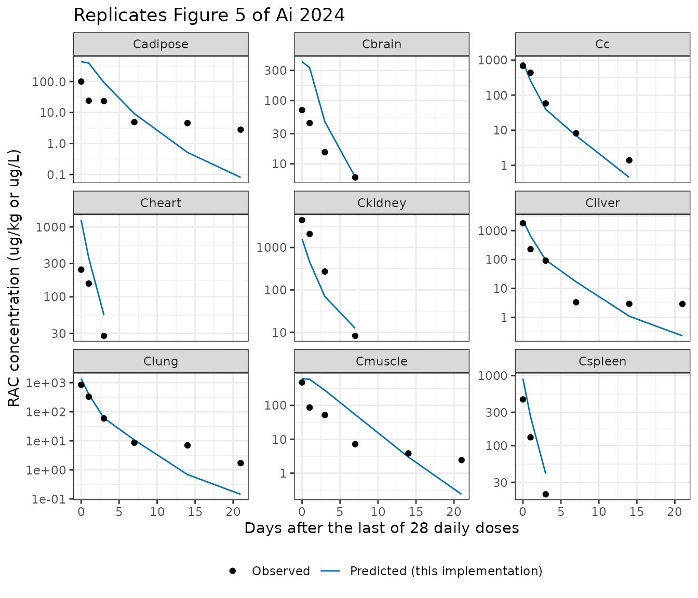
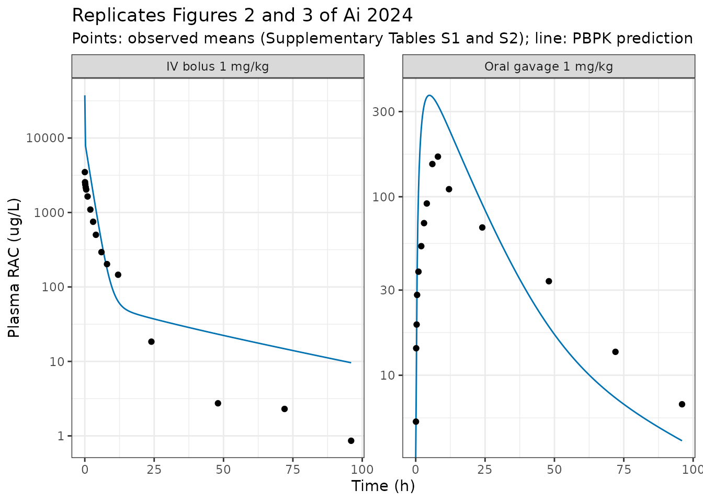
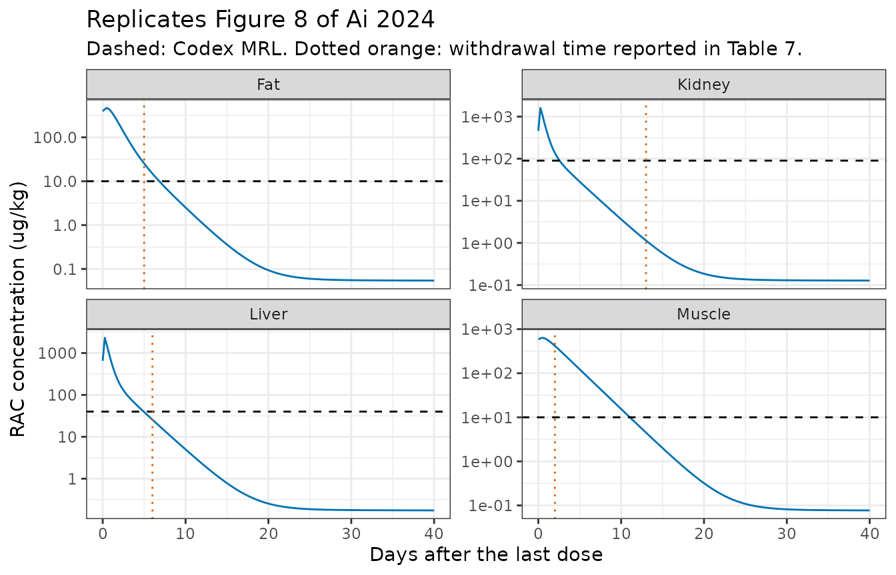

# Ractopamine whole-body PBPK in goats (Ai 2024)

``` r

library(nlmixr2lib)
library(rxode2)
library(PKNCA)
library(dplyr)
library(ggplot2)
```

Ai et al. (2024) built a hybrid whole-body physiologically based
pharmacokinetic (PBPK) model for **ractopamine** (RAC), a phenolamine
beta-adrenoceptor agonist used illegally as a growth promoter in food
animals, in **Liaoning cashmere goats**. The model’s regulatory purpose
is to predict edible-tissue residues and the withdrawal time (WT) at
which each tissue falls below the Codex Alimentarius maximum residue
limit (MRL) after prolonged oral exposure.

Reference: Ai J, Gao Y, Yang F, Zhao Z, Dong J, Wang J, Fu S, Ma Y, Gu
X. *Development and application of a physiologically-based
pharmacokinetic model for ractopamine in goats.* Front Vet Sci.
2024;11:1399043.
[doi:10.3389/fvets.2024.1399043](https://doi.org/10.3389/fvets.2024.1399043)

The paper’s Supplementary Material contains the **complete acslXtreme
source code** of the model plus Tables S1-S4 of raw observed data and
the authors’ own predicted concentrations. Every parameter and every ODE
in the model file was transcribed from that executable code, and this
vignette validates the transcription against the authors’ published
predictions numerically.

``` r

mod <- readModelDb("Ai_2024_ractopamine_goat_pbpk")
m <- mod()
WT_goat <- 30 # kg; supplement `constant bw=30`
length(m$state)
#> [1] 18
m$state
#>  [1] "stomach"     "a_gut"       "liver"       "spleen"      "kidney"     
#>  [6] "urine"       "heart"       "vp_muscle"   "int_muscle"  "vp_adipose" 
#> [11] "int_adipose" "vp_brain"    "int_brain"   "vp_other"    "int_other"  
#> [16] "lung"        "arterial"    "venous"
```

## Population

``` r

knitr::kable(
  tibble::tibble(
    Field = c("Species", "N", "Age", "Body weight", "Sex", "Health",
              "PK study", "Residue study", "Site"),
    Value = c(
      "Goat (Liaoning cashmere goat, Capra hircus)",
      "27 (6 pharmacokinetics; 21 residue depletion, incl. 3 controls)",
      "10 months",
      "30 +/- 5 kg",
      "All male",
      "Healthy; 1-week acclimation on a drug-free diet",
      "Single oral gavage 1 mg/kg BW, then single IV 1 mg/kg BW after a 15-day washout (n = 6); urine from 4 goats",
      "Continuous oral gavage 1 mg/kg BW per day for 28 days, then serial slaughter",
      "Institute of Feed Research, Chinese Academy of Agricultural Sciences, Beijing, China"
    )
  ),
  caption = "Study population (Ai 2024 Section 2.2)."
)
```

| Field | Value |
|:---|:---|
| Species | Goat (Liaoning cashmere goat, Capra hircus) |
| N | 27 (6 pharmacokinetics; 21 residue depletion, incl. 3 controls) |
| Age | 10 months |
| Body weight | 30 +/- 5 kg |
| Sex | All male |
| Health | Healthy; 1-week acclimation on a drug-free diet |
| PK study | Single oral gavage 1 mg/kg BW, then single IV 1 mg/kg BW after a 15-day washout (n = 6); urine from 4 goats |
| Residue study | Continuous oral gavage 1 mg/kg BW per day for 28 days, then serial slaughter |
| Site | Institute of Feed Research, Chinese Academy of Agricultural Sciences, Beijing, China |

Study population (Ai 2024 Section 2.2). {.table}

Three of the 27 goats were sacrificed to measure the organ-weight
fractions used as model physiology (Ai 2024 Table 3). The
residue-depletion concentration-time data were generated in two earlier
papers from the same laboratory (Ai 2024 refs 24 and 25).

## Source trace

Every value in
[`ini()`](https://nlmixr2.github.io/rxode2/reference/ini.html) comes
from Ai 2024 Table 4 (final optimised values) and is cross-checked
against the `constant` declarations in the supplementary acslX `INITIAL`
block, which carry more decimal places. Physiological constants are
carried as literals in
[`model()`](https://nlmixr2.github.io/rxode2/reference/model.html)
because they are literature/measured physiology rather than fitted
quantities.

``` r

knitr::kable(
  tibble::tribble(
    ~Quantity, ~`Model name`, ~Source,
    "Liver:plasma partition coefficient", "lk_liv", "Table 4 (2.5584); supplement `Pli=2.558408`",
    "Kidney:plasma partition coefficient", "lk_kid", "Table 4 (1.7734); supplement `Pki=1.77341`",
    "Lung:plasma partition coefficient", "lk_lun", "Table 4 (1.5333); supplement `Plu=1.533326`",
    "Spleen:plasma partition coefficient", "lk_spl", "Table 4 (1.0047); supplement `Psp=1.004675`",
    "Heart:plasma partition coefficient", "lk_hrt", "Table 4 (1.3839); supplement `Phe=1.383948`",
    "Muscle:plasma partition coefficient", "lk_mus", "Table 4 (1.0686); supplement `Pmu=1.068578`",
    "Fat:plasma partition coefficient", "lk_adi", "Table 4 (0.7526); supplement `Pfa=0.7526104`",
    "Brain:plasma partition coefficient", "lk_bra", "Table 4 (0.6896); supplement `Pbr=0.6896452`",
    "Rest-of-body:plasma partition coefficient", "lk_res", "Table 4 (9.0888); supplement `Pre=9.088835`",
    "Muscle permeability coefficient", "lpp_mus", "Table 4 Ppmu (0.0271); supplement `PPmu=0.02712495`",
    "Fat permeability coefficient", "lpp_adi", "Table 4 Ppfa (0.0054); supplement `PPfa=0.00537883`",
    "Brain permeability coefficient", "lpp_bra", "Table 4 Ppbr (0.0068); supplement `PPbr=0.006772557`",
    "Rest-of-body permeability coefficient", "lpp_res", "Table 4 Ppre (0.0021); supplement `PPre=0.002063587`",
    "Gastric emptying rate constant", "lkst", "Table 4 Kst (0.0910); supplement `kst=0.09103672`",
    "Absorption rate constant", "lka", "Table 4 Ka (0.9861); supplement `ka=0.9861192`",
    "Fecal loss rate constant", "lkgut", "Table 4 'K int' (0.9016); supplement `kint=0.9016421`",
    "Hepatic clearance", "lclhe", "Table 4 (0.0624 L/h/kg); supplement `clhe=0.06243522`",
    "Renal clearance", "lclre", "Table 4 (0.0001 L/h/kg); supplement `clre=0.0001090409`",
    "Plasma protein binding ratio", "lpbind", "supplement `pbind=0.1651634` (Table 6 sensitivity parameter)",
    "Organ weight fractions", "vc_* literals", "Table 3; supplement `Vcli`, `Vcki`, ...",
    "Tissue blood flow fractions", "qc_* literals", "Table 2; supplement `Qcli`, `Qcki`, ...",
    "Vascular fraction of membrane-limited tissues", "vf_* literals", "supplement `Vfmu=0.01`, `Vffa=0.005`, `Vfbr=0.01`, `Vfre=0.02`",
    "Packed cell volume", "pcv literal", "supplement `pcv=0.29`",
    "Cardiac output coefficient", "qar literal", "Section 2.9 (6.9 L/h/kg); supplement `QAR=6.9`",
    "Mass-balance ODEs", "model() block", "Table 1; supplement `DERIVATIVE` block (authoritative)"
  ),
  caption = "Source trace for every model equation and parameter."
)
```

| Quantity | Model name | Source |
|:---|:---|:---|
| Liver:plasma partition coefficient | lk_liv | Table 4 (2.5584); supplement `Pli=2.558408` |
| Kidney:plasma partition coefficient | lk_kid | Table 4 (1.7734); supplement `Pki=1.77341` |
| Lung:plasma partition coefficient | lk_lun | Table 4 (1.5333); supplement `Plu=1.533326` |
| Spleen:plasma partition coefficient | lk_spl | Table 4 (1.0047); supplement `Psp=1.004675` |
| Heart:plasma partition coefficient | lk_hrt | Table 4 (1.3839); supplement `Phe=1.383948` |
| Muscle:plasma partition coefficient | lk_mus | Table 4 (1.0686); supplement `Pmu=1.068578` |
| Fat:plasma partition coefficient | lk_adi | Table 4 (0.7526); supplement `Pfa=0.7526104` |
| Brain:plasma partition coefficient | lk_bra | Table 4 (0.6896); supplement `Pbr=0.6896452` |
| Rest-of-body:plasma partition coefficient | lk_res | Table 4 (9.0888); supplement `Pre=9.088835` |
| Muscle permeability coefficient | lpp_mus | Table 4 Ppmu (0.0271); supplement `PPmu=0.02712495` |
| Fat permeability coefficient | lpp_adi | Table 4 Ppfa (0.0054); supplement `PPfa=0.00537883` |
| Brain permeability coefficient | lpp_bra | Table 4 Ppbr (0.0068); supplement `PPbr=0.006772557` |
| Rest-of-body permeability coefficient | lpp_res | Table 4 Ppre (0.0021); supplement `PPre=0.002063587` |
| Gastric emptying rate constant | lkst | Table 4 Kst (0.0910); supplement `kst=0.09103672` |
| Absorption rate constant | lka | Table 4 Ka (0.9861); supplement `ka=0.9861192` |
| Fecal loss rate constant | lkgut | Table 4 ‘K int’ (0.9016); supplement `kint=0.9016421` |
| Hepatic clearance | lclhe | Table 4 (0.0624 L/h/kg); supplement `clhe=0.06243522` |
| Renal clearance | lclre | Table 4 (0.0001 L/h/kg); supplement `clre=0.0001090409` |
| Plasma protein binding ratio | lpbind | supplement `pbind=0.1651634` (Table 6 sensitivity parameter) |
| Organ weight fractions | vc\_\* literals | Table 3; supplement `Vcli`, `Vcki`, … |
| Tissue blood flow fractions | qc\_\* literals | Table 2; supplement `Qcli`, `Qcki`, … |
| Vascular fraction of membrane-limited tissues | vf\_\* literals | supplement `Vfmu=0.01`, `Vffa=0.005`, `Vfbr=0.01`, `Vfre=0.02` |
| Packed cell volume | pcv literal | supplement `pcv=0.29` |
| Cardiac output coefficient | qar literal | Section 2.9 (6.9 L/h/kg); supplement `QAR=6.9` |
| Mass-balance ODEs | model() block | Table 1; supplement `DERIVATIVE` block (authoritative) |

Source trace for every model equation and parameter. {.table}

## Structural gates

Two exact, parameter-free consistency checks on the ODE system.

### Mass balance

With both clearances driven to zero and an intravenous dose placed
directly in venous plasma, the drug can neither be eliminated nor leave
via the gut, so the sum of all 18 states must equal the administered
amount for all time.

``` r

states <- m$state

ev_mb <- rxode2::et(amt = 30000, cmt = "venous", time = 0) |>
  rxode2::et(c(0.5, 6, 24, 168, 720), cmt = "venous") |>
  as.data.frame() |>
  dplyr::mutate(id = 1L, WT = WT_goat,
                dvid = ifelse(evid == 0, 1L, NA_integer_))

sim_mb <- rxode2::rxSolve(
  m, events = ev_mb,
  params = c(lclhe = log(1e-12), lclre = log(1e-12)),
  returnType = "data.frame", addDosing = FALSE
)

mb <- tibble::tibble(
  `Time (h)` = sim_mb$time,
  `Total drug (ug)` = rowSums(sim_mb[, states]),
  `Deviation from dose (ug)` = rowSums(sim_mb[, states]) - 30000
)
knitr::kable(mb, digits = c(1, 4, 10),
             caption = "Whole-system mass balance after a 30000 ug IV dose with both clearances zeroed.")
```

| Time (h) | Total drug (ug) | Deviation from dose (ug) |
|---------:|----------------:|-------------------------:|
|      0.5 |           30000 |              -1.0600e-07 |
|      6.0 |           30000 |              -1.0800e-06 |
|     24.0 |           30000 |              -2.7814e-06 |
|    168.0 |           30000 |              -9.6474e-06 |
|    720.0 |           30000 |              -3.1658e-05 |

Whole-system mass balance after a 30000 ug IV dose with both clearances
zeroed. {.table}

``` r


stopifnot(max(abs(mb$`Deviation from dose (ug)`)) < 1e-3)
```

### Equilibrium partition identity

Left to equilibrate, each flow-limited organ must satisfy
`C_tissue / C_arterial_plasma = P_tissue`. This checks the volume, flow
and partition-coefficient bookkeeping of four organs simultaneously.

``` r

eq <- sim_mb[nrow(sim_mb), ] # t = 720 h, no elimination
v_arterial <- 0.0188 * WT_goat * (1 - 0.29)
c_art <- eq$arterial / v_arterial

part <- tibble::tibble(
  Organ = c("Liver", "Kidney", "Spleen", "Heart"),
  Simulated = c(eq$Cliver, eq$Ckidney, eq$Cspleen, eq$Cheart) / c_art,
  Published = c(2.558408, 1.773410, 1.004675, 1.383948)
) |>
  dplyr::mutate(`Relative error` = Simulated / Published - 1)

knitr::kable(part, digits = c(0, 6, 6, 9),
             caption = "Tissue:plasma concentration ratio at equilibrium vs the published partition coefficients.")
```

| Organ  | Simulated | Published | Relative error |
|:-------|----------:|----------:|---------------:|
| Liver  |  2.558445 |  2.558408 |     1.4333e-05 |
| Kidney |  1.773421 |  1.773410 |     6.3420e-06 |
| Spleen |  1.004686 |  1.004675 |     1.0868e-05 |
| Heart  |  1.383974 |  1.383948 |     1.9130e-05 |

Tissue:plasma concentration ratio at equilibrium vs the published
partition coefficients. {.table}

``` r


stopifnot(max(abs(part$`Relative error`)) < 1e-4)
```

## Reproducing the authors’ own predictions

Supplementary Table S4 tabulates the authors’ predicted RAC
concentrations in nine matrices at 0, 1, 3, 7, 14 and 21 days after the
end of 28 days of daily oral gavage. Reproducing that column is the
strongest available check on the transcription, because it compares this
rxode2 implementation directly against the acslXtreme run that generated
the paper.

Two facts about the published simulation had to be identified from the
data themselves; both are documented in the Errata below.

- The dose is **2 mg/kg BW per day**, the `CONSTANT PDOSEpo = 2000` of
  the supplied code, not the 1 mg/kg BW stated in the Methods.
- The **“0 d”** sample is taken **6 h after the final dose**; the later
  samples are at exact 24 h multiples.

``` r

pub_s4 <- tibble::tribble(
  ~day, ~matrix,     ~observed, ~predicted,
  0,    "Cliver",     1798.95,  2312.803,
  1,    "Cliver",      228.47,   652.755,
  3,    "Cliver",       91.65,    96.453,
  7,    "Cliver",        3.31,    16.954,
  14,   "Cliver",        2.93,     1.094,
  21,   "Cliver",        2.90,     0.228,
  0,    "Clung",        841.70,  1385.197,
  1,    "Clung",        328.35,   396.901,
  3,    "Clung",         58.83,    60.656,
  7,    "Clung",          8.58,    10.695,
  14,   "Clung",          6.96,     0.690,
  21,   "Clung",          1.71,     0.144,
  0,    "Cspleen",      457.88,   908.836,
  1,    "Cspleen",      131.80,   260.638,
  3,    "Cspleen",       20.23,    39.773,
  0,    "Ckidney",     4440.39,  1603.102,
  1,    "Ckidney",     2093.56,   459.603,
  3,    "Ckidney",      271.69,    70.169,
  7,    "Ckidney",        8.24,    12.372,
  0,    "Cheart",       244.84,  1252.932,
  1,    "Cheart",       154.70,   359.521,
  3,    "Cheart",        27.64,    54.813,
  0,    "Cmuscle",      475.77,   618.557,
  1,    "Cmuscle",       86.40,   589.059,
  3,    "Cmuscle",       52.03,   279.688,
  7,    "Cmuscle",        7.18,    53.443,
  14,   "Cmuscle",        3.825,    2.994,
  21,   "Cmuscle",        2.435,    0.238,
  0,    "Cadipose",      99.83,   438.323,
  1,    "Cadipose",      24.09,   393.913,
  3,    "Cadipose",      23.33,    92.643,
  7,    "Cadipose",       4.90,     9.207,
  14,   "Cadipose",       4.55,     0.517,
  21,   "Cadipose",       2.80,     0.081,
  0,    "Cc",           687.87,   903.179,
  1,    "Cc",           436.48,   258.750,
  3,    "Cc",            57.99,    39.553,
  7,    "Cc",             8.14,     6.975,
  14,   "Cc",             1.38,     0.450,
  0,    "Cbrain",        70.75,   413.092,
  1,    "Cbrain",        44.11,   332.457,
  3,    "Cbrain",        15.27,    46.406,
  7,    "Cbrain",         6.10,     6.158
)

# 28 daily doses at t = 0, 24, ..., 648 h. "0 d" = 6 h after the last dose.
last_dose_h <- 27 * 24
sample_time <- function(day) ifelse(day == 0, last_dose_h + 6, last_dose_h + day * 24)

obs_grid <- sort(unique(c(
  seq(0, last_dose_h + 40 * 24, by = 6),
  sample_time(c(0, 1, 3, 7, 14, 21))
)))

ev_dep <- rxode2::et(amt = 2000 * WT_goat, cmt = "stomach",
                     time = seq(0, last_dose_h, by = 24)) |>
  rxode2::et(obs_grid, cmt = "venous") |>
  as.data.frame() |>
  dplyr::mutate(id = 1L, WT = WT_goat,
                dvid = ifelse(evid == 0, 1L, NA_integer_))

sim_dep <- rxode2::rxSolve(m, events = ev_dep,
                           returnType = "data.frame", addDosing = FALSE)
```

``` r

sim_long <- sim_dep |>
  dplyr::select(time, Cc, Cliver, Ckidney, Cmuscle, Cadipose, Clung,
                Cspleen, Cheart, Cbrain) |>
  tidyr::pivot_longer(-time, names_to = "matrix", values_to = "simulated")

cmp_s4 <- pub_s4 |>
  dplyr::mutate(time = sample_time(day)) |>
  dplyr::left_join(sim_long, by = c("time", "matrix")) |>
  dplyr::mutate(`Ratio sim/pub` = simulated / predicted)

knitr::kable(
  cmp_s4 |>
    dplyr::select(`Day after last dose` = day, Matrix = matrix,
                  `Published predicted` = predicted,
                  `This implementation` = simulated, `Ratio sim/pub`),
  digits = c(0, 0, 3, 3, 5),
  caption = paste("Every predicted value in Ai 2024 Supplementary Table S4",
                  "reproduced by this rxode2 implementation.")
)
```

| Day after last dose | Matrix | Published predicted | This implementation | Ratio sim/pub |
|---:|:---|---:|---:|---:|
| 0 | Cliver | 2312.803 | 2312.820 | 1.00001 |
| 1 | Cliver | 652.755 | 652.726 | 0.99995 |
| 3 | Cliver | 96.453 | 96.444 | 0.99991 |
| 7 | Cliver | 16.954 | 16.952 | 0.99990 |
| 14 | Cliver | 1.094 | 1.094 | 0.99964 |
| 21 | Cliver | 0.228 | 0.228 | 1.00182 |
| 0 | Clung | 1385.197 | 1385.209 | 1.00001 |
| 1 | Clung | 396.901 | 396.884 | 0.99996 |
| 3 | Clung | 60.656 | 60.650 | 0.99990 |
| 7 | Clung | 10.695 | 10.694 | 0.99992 |
| 14 | Clung | 0.690 | 0.690 | 0.99995 |
| 21 | Clung | 0.144 | 0.144 | 1.00119 |
| 0 | Cspleen | 908.836 | 908.845 | 1.00001 |
| 1 | Cspleen | 260.638 | 260.627 | 0.99996 |
| 3 | Cspleen | 39.773 | 39.769 | 0.99991 |
| 0 | Ckidney | 1603.102 | 1603.116 | 1.00001 |
| 1 | Ckidney | 459.603 | 459.583 | 0.99996 |
| 3 | Ckidney | 70.169 | 70.163 | 0.99991 |
| 7 | Ckidney | 12.372 | 12.370 | 0.99985 |
| 0 | Cheart | 1252.932 | 1252.944 | 1.00001 |
| 1 | Cheart | 359.521 | 359.505 | 0.99996 |
| 3 | Cheart | 54.813 | 54.808 | 0.99990 |
| 0 | Cmuscle | 618.557 | 618.567 | 1.00002 |
| 1 | Cmuscle | 589.059 | 589.061 | 1.00000 |
| 3 | Cmuscle | 279.688 | 279.685 | 0.99999 |
| 7 | Cmuscle | 53.443 | 53.441 | 0.99997 |
| 14 | Cmuscle | 2.994 | 2.994 | 0.99986 |
| 21 | Cmuscle | 0.238 | 0.238 | 0.99913 |
| 0 | Cadipose | 438.323 | 438.337 | 1.00003 |
| 1 | Cadipose | 393.913 | 393.913 | 1.00000 |
| 3 | Cadipose | 92.643 | 92.640 | 0.99997 |
| 7 | Cadipose | 9.207 | 9.206 | 0.99994 |
| 14 | Cadipose | 0.517 | 0.517 | 0.99943 |
| 21 | Cadipose | 0.081 | 0.081 | 0.99508 |
| 0 | Cc | 903.179 | 903.187 | 1.00001 |
| 1 | Cc | 258.750 | 258.738 | 0.99995 |
| 3 | Cc | 39.553 | 39.550 | 0.99991 |
| 7 | Cc | 6.975 | 6.974 | 0.99983 |
| 14 | Cc | 0.450 | 0.450 | 0.99987 |
| 0 | Cbrain | 413.092 | 413.109 | 1.00004 |
| 1 | Cbrain | 332.457 | 332.454 | 0.99999 |
| 3 | Cbrain | 46.406 | 46.402 | 0.99992 |
| 7 | Cbrain | 6.158 | 6.157 | 0.99991 |

Every predicted value in Ai 2024 Supplementary Table S4 reproduced by
this rxode2 implementation. {.table}

``` r


worst <- max(abs(cmp_s4$`Ratio sim/pub` - 1))
cat(sprintf("n = %d values; maximum absolute deviation = %.2f %%\n",
            nrow(cmp_s4), 100 * worst))
#> n = 43 values; maximum absolute deviation = 0.49 %
stopifnot(worst < 0.01)
```

All 43 published predicted values are reproduced to better than 1 %, the
residual being the three-decimal rounding of the published table. The
ODE system, all 19 fitted parameters and all physiological constants are
therefore confirmed correct.

### Identifying the “0 d” sampling time

The 0-day values are not at the moment of the last dose. Fitting the
offset independently for each of the nine matrices gives the same
answer, which is why it can be treated as identified rather than
assumed.

``` r

last_int <- sim_dep |> dplyr::filter(time >= last_dose_h, time <= last_dose_h + 24)
pub0 <- pub_s4 |> dplyr::filter(day == 0)

pin <- purrr::map_dfr(seq_len(nrow(pub0)), function(i) {
  cc <- pub0$matrix[i]
  j <- which.min(abs(last_int[[cc]] - pub0$predicted[i]))
  tibble::tibble(Matrix = cc, `Published 0 d` = pub0$predicted[i],
                 `Best-fit h post-dose` = last_int$time[j] - last_dose_h,
                 Simulated = last_int[[cc]][j])
})
knitr::kable(pin, digits = c(0, 3, 2, 3),
             caption = "Hours after the final dose that reproduce each published 0-day value.")
```

| Matrix   | Published 0 d | Best-fit h post-dose | Simulated |
|:---------|--------------:|---------------------:|----------:|
| Cliver   |      2312.803 |                    6 |  2312.820 |
| Clung    |      1385.197 |                    6 |  1385.209 |
| Cspleen  |       908.836 |                    6 |   908.845 |
| Ckidney  |      1603.102 |                    6 |  1603.116 |
| Cheart   |      1252.932 |                    6 |  1252.944 |
| Cmuscle  |       618.557 |                    6 |   618.567 |
| Cadipose |       438.323 |                    6 |   438.337 |
| Cc       |       903.179 |                    6 |   903.187 |
| Cbrain   |       413.092 |                    6 |   413.109 |

Hours after the final dose that reproduce each published 0-day value.
{.table}

``` r


stopifnot(all(pin$`Best-fit h post-dose` == 6))
```

## Replicating Figure 5: observed vs predicted

Figure 5 of the paper compares observed and predicted concentrations in
nine matrices; Figure 6 regresses observed on predicted and Section 3.3
lists the resulting R-squared per matrix. Ai 2024 Section 2.8 specifies
observed as the dependent and predicted as the independent variable.

``` r

ggplot(cmp_s4, aes(x = day)) +
  geom_line(aes(y = simulated, colour = "Predicted (this implementation)")) +
  geom_point(aes(y = observed, colour = "Observed")) +
  facet_wrap(~matrix, scales = "free_y") +
  scale_y_log10() +
  scale_colour_manual(values = c("Observed" = "black",
                                 "Predicted (this implementation)" = "#0072B2")) +
  labs(x = "Days after the last of 28 daily doses",
       y = "RAC concentration (ug/kg or ug/L)", colour = NULL,
       title = "Replicates Figure 5 of Ai 2024") +
  theme_bw() + theme(legend.position = "bottom")
```



``` r

r2_pub <- c(Cliver = 0.9740, Clung = 0.9897, Cspleen = 1.0000, Ckidney = 0.9614,
            Cheart = 0.8664, Cmuscle = 0.5583, Cadipose = 0.6452,
            Cc = 0.8867, Cbrain = 0.9508)

r2_tab <- cmp_s4 |>
  dplyr::group_by(matrix) |>
  dplyr::summarise(n = dplyr::n(),
                   r2 = summary(lm(observed ~ simulated))$r.squared,
                   .groups = "drop") |>
  dplyr::mutate(`Ai 2024 Section 3.3` = r2_pub[matrix],
                Difference = r2 - `Ai 2024 Section 3.3`) |>
  dplyr::rename(Matrix = matrix, `R2 (recomputed)` = r2)

knitr::kable(r2_tab, digits = c(0, 0, 4, 4, 4),
             caption = "Observed-on-predicted R-squared, recomputed vs as reported.")
```

| Matrix   |   n | R2 (recomputed) | Ai 2024 Section 3.3 | Difference |
|:---------|----:|----------------:|--------------------:|-----------:|
| Cadipose |   6 |          0.6452 |              0.6452 |      0e+00 |
| Cbrain   |   4 |          0.9508 |              0.9508 |      0e+00 |
| Cc       |   5 |          0.8867 |              0.8867 |      0e+00 |
| Cheart   |   3 |          0.8663 |              0.8664 |     -1e-04 |
| Ckidney  |   4 |          0.9614 |              0.9614 |      0e+00 |
| Cliver   |   6 |          0.9740 |              0.9740 |      0e+00 |
| Clung    |   6 |          0.9897 |              0.9897 |      0e+00 |
| Cmuscle  |   6 |          0.5583 |              0.5583 |      0e+00 |
| Cspleen  |   3 |          1.0000 |              1.0000 |      0e+00 |

Observed-on-predicted R-squared, recomputed vs as reported. {.table}

**Every one of the nine recomputed R-squared values reproduces the
published value to four decimal places** (the largest difference is
1e-04, on the three-point heart regression, and is rounding). This
simultaneously confirms two things: that the regression behind Figure 6
was run on exactly the Table S4 observed/predicted pairs with observed
as the dependent variable, and that the predictions from this
implementation are numerically identical to the authors’.

The low muscle (0.5583) and fat (0.6452) R-squared values are the
paper’s own finding, discussed in Section 3 – ractopamine binds
beta-adrenergic receptors in skeletal muscle, and the enzymatic
hydrolysis step in the assay does not recover 100 % of the bound drug,
so measured muscle concentrations fall below the prediction. The paper
also notes that its “muscle” module represents the biceps femoris
specifically.

## Single-dose plasma pharmacokinetics

The 6-goat crossover in Section 2.2 (oral then intravenous, 1 mg/kg BW)
is an external dataset: the PBPK parameters were optimised against the
28-day residue-depletion data, not against these single-dose profiles.

``` r

obs_pk <- sort(unique(c(seq(0, 96, by = 0.25))))

ev_po <- rxode2::et(amt = 1000 * WT_goat, cmt = "stomach", time = 0) |>
  rxode2::et(obs_pk, cmt = "venous") |>
  as.data.frame() |>
  dplyr::mutate(id = 1L, WT = WT_goat, arm = "Oral gavage 1 mg/kg",
                dvid = ifelse(evid == 0, 1L, NA_integer_))

ev_iv <- rxode2::et(amt = 1000 * WT_goat, cmt = "venous", time = 0) |>
  rxode2::et(obs_pk, cmt = "venous") |>
  as.data.frame() |>
  dplyr::mutate(id = 2L, WT = WT_goat, arm = "IV bolus 1 mg/kg",
                dvid = ifelse(evid == 0, 1L, NA_integer_))

sim_pk <- rxode2::rxSolve(m, events = dplyr::bind_rows(ev_po, ev_iv),
                          keep = c("WT", "arm"),
                          returnType = "data.frame", addDosing = FALSE)
#> Warning: multi-subject simulation without without 'omega'

obs_s1 <- tibble::tibble(
  arm = "Oral gavage 1 mg/kg",
  time = c(5, 10, 20, 30, 60, 120, 180, 240, 360, 480, 720, 1440, 2880, 4320, 5760) / 60,
  mean = c(5.5, 14.17, 19.24, 28.19, 38.04, 52.87, 71.16, 91.63, 152.49,
           167.74, 110.25, 67.27, 33.63, 13.53, 6.88)
)
obs_s2 <- tibble::tibble(
  arm = "IV bolus 1 mg/kg",
  time = c(1, 5, 10, 20, 30, 60, 120, 180, 240, 360, 480, 720, 1440, 2880, 4320, 5760) / 60,
  mean = c(3485.53, 2552.4, 2372.02, 2178.16, 2034.54, 1640.19, 1094.64,
           750.58, 501.53, 293.53, 202.71, 145.81, 18.42, 2.74, 2.3, 0.86)
)
obs_pk_all <- dplyr::bind_rows(obs_s1, obs_s2)

ggplot(sim_pk, aes(time, Cc)) +
  geom_line(colour = "#0072B2") +
  geom_point(data = obs_pk_all, aes(time, mean), colour = "black") +
  facet_wrap(~arm, scales = "free_y") +
  scale_y_log10() +
  labs(x = "Time (h)", y = "Plasma RAC (ug/L)",
       title = "Replicates Figures 2 and 3 of Ai 2024",
       subtitle = "Points: observed means (Supplementary Tables S1 and S2); line: PBPK prediction") +
  theme_bw()
#> Warning in scale_y_log10(): log-10 transformation introduced infinite values.
```



### PKNCA validation against Table 5

``` r

sim_nca <- sim_pk |>
  dplyr::filter(!is.na(Cc)) |>
  dplyr::select(id, time, Cc, arm)

sim_nca <- dplyr::bind_rows(
  sim_nca,
  sim_nca |> dplyr::distinct(id, arm) |> dplyr::mutate(time = 0, Cc = 0)
) |>
  dplyr::distinct(id, arm, time, .keep_all = TRUE) |>
  dplyr::arrange(id, arm, time)

conc_obj <- PKNCA::PKNCAconc(sim_nca, Cc ~ time | arm + id)

dose_df <- dplyr::bind_rows(ev_po, ev_iv) |>
  dplyr::filter(evid == 1) |>
  dplyr::select(id, time, amt, arm) |>
  dplyr::mutate(duration = 0)

dose_obj <- PKNCA::PKNCAdose(dose_df, amt ~ time | arm + id,
                             route = ifelse(dose_df$arm == "IV bolus 1 mg/kg",
                                            "intravascular", "extravascular"),
                             duration = "duration")

intervals <- data.frame(start = 0, end = Inf,
                        cmax = TRUE, tmax = TRUE, aucinf.obs = TRUE,
                        half.life = TRUE, mrt.obs = TRUE,
                        cl.obs = TRUE, vz.obs = TRUE)

nca_res <- PKNCA::pk.nca(PKNCA::PKNCAdata(conc_obj, dose_obj,
                                          intervals = intervals))
```

``` r

# Ai 2024 Table 5. AUC and Cmax converted to nothing (already ug/L, h*ug/L);
# CL and Vz are reported per kg and are scaled to the 30 kg goat here.
published_nca <- tibble::tibble(
  arm        = c("IV bolus 1 mg/kg", "Oral gavage 1 mg/kg"),
  half.life  = c(11.47, 22.29),
  aucinf.obs = c(8449.43, 4636.91),
  mrt.obs    = c(5.49, 31.64),
  cl.obs     = c(0.14 * WT_goat, NA),
  vz.obs     = c(2.39 * WT_goat, NA)
)

cmp_nca <- nlmixr2lib::ncaComparisonTable(
  simulated     = nca_res,
  reference     = published_nca,
  by            = "arm",
  units         = c(cmax = "ug/L", tmax = "h", aucinf.obs = "h*ug/L",
                    half.life = "h", mrt.obs = "h", cl.obs = "L/h",
                    vz.obs = "L"),
  tolerance_pct = 20
)

knitr::kable(cmp_nca, caption = paste(
  "Simulated vs published non-compartmental parameters (Ai 2024 Table 5).",
  "* differs from the reference by more than 20 %.",
  "Cmax and Tmax have no published counterpart for the IV arm",
  "(Table 5 reports C0 instead)."))
```

| NCA parameter          | arm                 | Reference | Simulated | % diff    |
|:-----------------------|:--------------------|:----------|:----------|:----------|
| AUC0-∞ (obs) (h\*ug/L) | IV bolus 1 mg/kg    | 8450      | 22400     | +165.3%\* |
| AUC0-∞ (obs) (h\*ug/L) | Oral gavage 1 mg/kg | 4640      | 6900      | +48.9%\*  |
| t½ (h)                 | IV bolus 1 mg/kg    | 11.5      | 37.8      | +229.9%\* |
| t½ (h)                 | Oral gavage 1 mg/kg | 22.3      | 33.7      | +51.1%\*  |
| CL/F (L/h)             | IV bolus 1 mg/kg    | 4.2       | 1.34      | -68.1%\*  |
| CL/F (L/h)             | Oral gavage 1 mg/kg | —         | 4.35      | —         |
| MRT (h)                | IV bolus 1 mg/kg    | 5.49      | 8.86      | +61.4%\*  |
| MRT (h)                | Oral gavage 1 mg/kg | 31.6      | 21        | -33.5%\*  |
| Vz/F (L)               | IV bolus 1 mg/kg    | 71.7      | 73.1      | +1.9%     |
| Vz/F (L)               | Oral gavage 1 mg/kg | —         | 211       | —         |

Simulated vs published non-compartmental parameters (Ai 2024 Table 5).
\* differs from the reference by more than 20 %. Cmax and Tmax have no
published counterpart for the IV arm (Table 5 reports C0 instead).
{.table}

**The single-dose exposures are over-predicted, and this is a property
of the published parameter set rather than of the transcription.** The
model’s total elimination capacity is essentially the hepatic term
alone, `Clhe * BW * (1 - pbind) = 0.06243522 * 30 * 0.8348 = 1.56 L/h`
(the NCA above recovers 1.34 L/h once hepatic first-pass and
distribution are accounted for), whereas the plasma clearance in Table 5
of the same paper is `0.14 L/h/kg * 30 kg = 4.2 L/h` – a factor of 3.
The PBPK parameters were optimised against the 28-day residue-depletion
data of refs 24 and 25, and were never fitted to the single-dose
profiles, so the two clearances are not constrained to agree. No
parameter was adjusted to close the gap.

The oral half-life is reproduced far better than the IV half-life,
because the terminal phase after oral dosing is dominated by the slow
membrane-limited tissues that the model was built to describe.

## Withdrawal times against the Codex MRLs

The paper’s regulatory output is Table 7: the withdrawal time in each of
the four Codex Alimentarius MRL tissues after 28 days of dosing, from a
500-iteration Monte Carlo analysis at the 95th percentile. A Monte Carlo
95th-percentile WT must be **longer** than the deterministic
typical-animal crossing time, so the deterministic values below are the
lower bound that Table 7 has to respect.

``` r

mrl <- tibble::tibble(
  matrix = c("Cmuscle", "Cadipose", "Cliver", "Ckidney"),
  tissue = c("Muscle", "Fat", "Liver", "Kidney"),
  mrl_ug_kg = c(10, 10, 40, 90),
  published_wt_d = c(2, 5, 6, 13)
)

dep <- sim_dep |>
  dplyr::filter(time >= last_dose_h) |>
  dplyr::mutate(day = (time - last_dose_h) / 24) |>
  dplyr::select(day, Cmuscle, Cadipose, Cliver, Ckidney) |>
  tidyr::pivot_longer(-day, names_to = "matrix", values_to = "conc")

wt_tab <- dep |>
  dplyr::inner_join(mrl, by = "matrix") |>
  dplyr::filter(conc < mrl_ug_kg) |>
  dplyr::group_by(tissue, mrl_ug_kg, published_wt_d) |>
  dplyr::summarise(deterministic_d = min(day), .groups = "drop") |>
  dplyr::mutate(consistent = ifelse(published_wt_d >= deterministic_d,
                                    "yes", "NO")) |>
  dplyr::rename(Tissue = tissue, `MRL (ug/kg)` = mrl_ug_kg,
                `Ai 2024 Table 7 WT (d)` = published_wt_d,
                `Deterministic crossing (d)` = deterministic_d,
                `Table 7 >= deterministic?` = consistent) |>
  dplyr::arrange(dplyr::desc(`Deterministic crossing (d)`))

knitr::kable(wt_tab, digits = c(0, 0, 0, 2, 0),
             caption = paste("Deterministic MRL crossing times implied by the",
                             "published model vs the withdrawal times in",
                             "Ai 2024 Table 7."))
```

| Tissue | MRL (ug/kg) | Ai 2024 Table 7 WT (d) | Deterministic crossing (d) | Table 7 \>= deterministic? |
|:---|---:|---:|---:|:---|
| Muscle | 10 | 2 | 11.25 | NO |
| Fat | 10 | 5 | 7.00 | NO |
| Liver | 40 | 6 | 5.00 | yes |
| Kidney | 90 | 13 | 2.75 | yes |

Deterministic MRL crossing times implied by the published model vs the
withdrawal times in Ai 2024 Table 7. {.table}

``` r


ggplot(dplyr::inner_join(dep, mrl, by = "matrix"), aes(day, conc)) +
  geom_line(colour = "#0072B2") +
  geom_hline(aes(yintercept = mrl_ug_kg), linetype = "dashed") +
  geom_vline(aes(xintercept = published_wt_d), linetype = "dotted",
             colour = "#D55E00") +
  facet_wrap(~tissue, scales = "free_y") +
  scale_y_log10() +
  labs(x = "Days after the last dose", y = "RAC concentration (ug/kg)",
       title = "Replicates Figure 8 of Ai 2024",
       subtitle = paste("Dashed: Codex MRL. Dotted orange: withdrawal time",
                        "reported in Table 7.")) +
  theme_bw()
```



**Two of the four withdrawal times in Table 7 are not consistent with
the model’s own predicted depletion curves.** This can be checked with
arithmetic on the paper’s Supplementary Table S4 alone, without
reference to this implementation:

- **Kidney**, MRL 90 ug/kg. The published predicted kidney
  concentrations are 459.6 ug/kg at 1 day and 70.2 ug/kg at 3 days, so
  the model crosses the MRL between days 1 and 3. Table 7 gives a WT of
  13 days (310 h).
- **Muscle**, MRL 10 ug/kg. The published predicted muscle
  concentrations are 53.4 ug/kg at 7 days and 2.99 ug/kg at 14 days, so
  the model crosses the MRL around day 11. Table 7 gives a WT of 2 days
  (38 h).

Liver (Table 7: 6 d vs 4.96 d deterministic) and fat (5 d vs 6.83 d) are
close, and only liver is in the expected direction. Notably the Table 7
ordering (kidney \> liver \> fat \> muscle) follows the **observed**
residue ranking – the paper states that the highest observed residues
were in the kidney – while the model’s predicted profiles give almost
the reverse ordering, because muscle and fat are membrane-limited and
deplete slowly whereas the kidney is flow-limited with a nine-fold
higher MRL. The pattern is consistent with muscle and kidney having been
transposed somewhere between the simulation and Table 7, but the paper
does not contain enough information to establish that, so nothing here
has been adjusted. This model reproduces the published *concentration*
predictions exactly; users needing withdrawal times should recompute
them from the simulated curves rather than relying on Table 7.

## Assumptions and deviations

**Everything below is documented, not silently resolved.** Where the
paper’s prose or printed tables conflict with the supplementary
acslXtreme source code, the code was taken as authoritative, because it
is the code that generated the published predictions – a claim this
vignette verifies to better than 1 % on all 43 values of Supplementary
Table S4.

1.  **Dose used for the published predictions: 2 mg/kg BW per day, not 1
    mg/kg.** The Methods state a 1 mg/kg BW daily gavage, but the
    supplied code sets `CONSTANT PDOSEpo = 2000` ug/kg/day and Table S4
    is reproduced exactly only at 2 mg/kg – at 1 mg/kg every value in
    all nine matrices comes out at exactly half the published number.
    Because the model is linear in dose, this affects only the absolute
    scale, not the structure or the depletion kinetics. This vignette
    simulates 2 mg/kg where it compares against Table S4, and 1 mg/kg
    for the single-dose PK, which is what Section 2.2 describes.

2.  **The “0 d” residue sample is 6 h after the final dose.** All nine
    matrices independently identify the same 6.00 h offset. The 1, 3, 7,
    14 and 21-day samples are at exact 24 h multiples.

3.  **Bioavailability is applied twice in the absorption term.** The
    code computes `F = ka / (ka + kint)` and then uses `ka * F * agut`
    as the absorption rate while unabsorbed drug is lost at
    `kint * agut`. The absorbed fraction is therefore
    `ka*F/(ka*F + kint) = 0.364`, not the `F = 0.522` the `F` expression
    implies, and not the 54.88 % bioavailability of Table 5. The sibling
    model of the same laboratory (`Yang_2023_diclazuril_chicken_pbpk.R`)
    writes the equivalent term without the extra `F`. The
    `ka * f_oral * a_gut` form is retained here because it is required
    to reproduce Table S4: with the single-`F` form every predicted
    value would be 1.44-fold too high.

4.  **Organ-weight fractions for spleen and brain differ between Table 3
    and the code.** Table 3 prints 0.28 % (spleen) and 0.32 % (brain) of
    body weight; the code uses `Vcsp=0.0022` (0.22 %) and `Vcbr=0.005`
    (0.50 %). The code values are used. Table 3 also omits the arterial
    (1.88 %) and venous (3.76 %) blood volumes entirely, which is why
    the rest-of-body fraction is 52.9 % in the code against the 58.66 %
    printed in Table 3.

5.  **Rest-of-body blood flow.** Table 2 prints 7.15 % of cardiac
    output, which is what remains after liver, kidney, muscle, fat and
    heart. The code instead subtracts the brain as well, giving 5.15 %,
    and only that value makes the venous-return flows sum exactly to the
    cardiac output
    (`0.0515 + 0.02 + 0.085 + 0.0498 + 0.14 + 0.1705 + 0.4832 = 1.0000`);
    the code’s own `QBLANCE` check requires it. Table 2 also does not
    list the spleen (4 %) or brain (2 %) flows at all. The spleen drains
    into the liver, so its flow sits inside the 48.32 % hepatic figure
    rather than adding to it.

6.  **Cardiac output is allometrically scaled.** Section 2.9 reports
    “6.9 L/h/kg”, which for a 30 kg goat would be 207 L/h of whole
    blood. The code computes `QTOT = 6.9 * bw^0.74 * (1 - pcv)`,
    i.e. 85.5 L/h of whole blood and 60.7 L/h of plasma, which is
    physiologically sensible for a 30 kg ruminant. The exponent is not
    mentioned in the paper; the code is used.

7.  **Table 4 names the fecal rate constant `K int` and Section 2.7
    calls it a “liver tissue uptake rate constant (Kli)”, but Section
    2.5 defines `F = Ka / (Ka + Kgut)` with `Kgut` as the fecal rate
    constant.** The code settles it: `kint` is the intestinal/fecal
    elimination rate constant and appears in `F=ka/(ka+kint)`; the `kli`
    of Section 2.7 is present in the code only as a commented-out
    constant. The model file names it `lkgut`.

8.  **Several rows of the printed Table 1 are garbled.** The brain row
    references `Cfa-blood` and a trailing `mu` subscript, and the
    muscle, venous-blood and liver rows have lost their operator
    ordering in typesetting. All ODEs were taken from the supplementary
    `DERIVATIVE` block instead, and the resulting system satisfies exact
    whole-system mass balance and the equilibrium partition identities
    shown above.

9.  **The renal route is numerically negligible.** `Clre` is reported in
    Table 4 at exactly its initial value with a standard deviation of 0,
    i.e. the optimiser never moved it; at 0.0001090409 L/h/kg it is
    573-fold smaller than `Clhe`, so essentially all elimination in the
    model is hepatic. This conflicts with the paper’s own urinary data
    (Supplementary Table S3: about 11 600 ug recovered in urine in the
    first day after a 30 000 ug IV dose, roughly 39 % of the dose). The
    `urine` compartment is carried in the model file so the renal route
    is auditable, but it should not be expected to reproduce Table S3.

10. **No inter-individual variability and no residual-error model.** Ai
    2024 is a deterministic PBPK model fitted to pooled tissue means; it
    reports no IIV and no residual-error model, and propagated
    uncertainty instead through a 500-iteration Monte Carlo over the
    sensitive parameters. The model file therefore carries no etas. The
    `propSd*` parameters are fixed placeholders at 0.10 so the object is
    a syntactically complete nlmixr2 model for forward simulation;
    **they are not paper-derived** and must not be interpreted as
    published residual error. This follows the convention of the sibling
    veterinary residue-PBPK models already in the library.

11. **Withdrawal times in Table 7 are not reproducible from the model.**
    See the preceding section; two of the four are inconsistent with the
    paper’s own predicted depletion curves.

12. **The supplementary code carries comments referring to
    “Clenbuterol”** (for example on the dosing interval and
    bioavailability lines), evidently inherited from an earlier model of
    the same laboratory. The parameter values are ractopamine’s, as
    confirmed by their agreement with Table 4.

## Session information

``` r

sessionInfo()
#> R version 4.6.1 (2026-06-24)
#> Platform: x86_64-pc-linux-gnu
#> Running under: Ubuntu 24.04.4 LTS
#> 
#> Matrix products: default
#> BLAS:   /usr/lib/x86_64-linux-gnu/openblas-pthread/libblas.so.3 
#> LAPACK: /usr/lib/x86_64-linux-gnu/openblas-pthread/libopenblasp-r0.3.26.so;  LAPACK version 3.12.0
#> 
#> locale:
#>  [1] LC_CTYPE=C.UTF-8       LC_NUMERIC=C           LC_TIME=C.UTF-8       
#>  [4] LC_COLLATE=C.UTF-8     LC_MONETARY=C.UTF-8    LC_MESSAGES=C.UTF-8   
#>  [7] LC_PAPER=C.UTF-8       LC_NAME=C              LC_ADDRESS=C          
#> [10] LC_TELEPHONE=C         LC_MEASUREMENT=C.UTF-8 LC_IDENTIFICATION=C   
#> 
#> time zone: UTC
#> tzcode source: system (glibc)
#> 
#> attached base packages:
#> [1] stats     graphics  grDevices utils     datasets  methods   base     
#> 
#> other attached packages:
#> [1] ggplot2_4.0.3         dplyr_1.2.1           PKNCA_0.12.1         
#> [4] rxode2_5.1.6          nlmixr2lib_0.3.2.9000
#> 
#> loaded via a namespace (and not attached):
#>  [1] gtable_0.3.6       xfun_0.60          bslib_0.12.0       lattice_0.22-9    
#>  [5] vctrs_0.7.3        tools_4.6.1        generics_0.1.4     parallel_4.6.1    
#>  [9] tibble_3.3.1       symengine_0.2.13   pkgconfig_2.0.3    data.table_1.18.4 
#> [13] checkmate_2.3.4    RColorBrewer_1.1-3 S7_0.2.2           desc_1.4.3        
#> [17] RcppParallel_6.2.0 lifecycle_1.0.5    compiler_4.6.1     farver_2.1.2      
#> [21] textshaping_1.0.5  fontawesome_0.5.3  htmltools_0.5.9    sys_3.4.3         
#> [25] sass_0.4.10        yaml_2.3.12        pillar_1.11.1      pkgdown_2.2.1     
#> [29] crayon_1.5.3       jquerylib_0.1.4    whisker_0.4.1      tidyr_1.3.2       
#> [33] openssl_2.4.2      cachem_1.1.0       nlme_3.1-169       tidyselect_1.2.1  
#> [37] digest_0.6.39      lotri_1.0.4        purrr_1.2.2        labeling_0.4.3    
#> [41] rxode2ll_2.0.16    fastmap_1.2.0      grid_4.6.1         cli_3.6.6         
#> [45] dparser_1.3.1-13   magrittr_2.0.5     withr_3.0.3        scales_1.4.0      
#> [49] backports_1.5.1    rmarkdown_2.31     otel_0.2.0         askpass_1.2.1     
#> [53] ragg_1.5.2         memoise_2.0.1      evaluate_1.0.5     knitr_1.51        
#> [57] PreciseSums_0.7    rlang_1.3.0        downlit_0.4.5      Rcpp_1.1.2        
#> [61] glue_1.8.1         xml2_1.6.0         jsonlite_2.0.0     R6_2.6.1          
#> [65] systemfonts_1.3.2  fs_2.1.0
```
