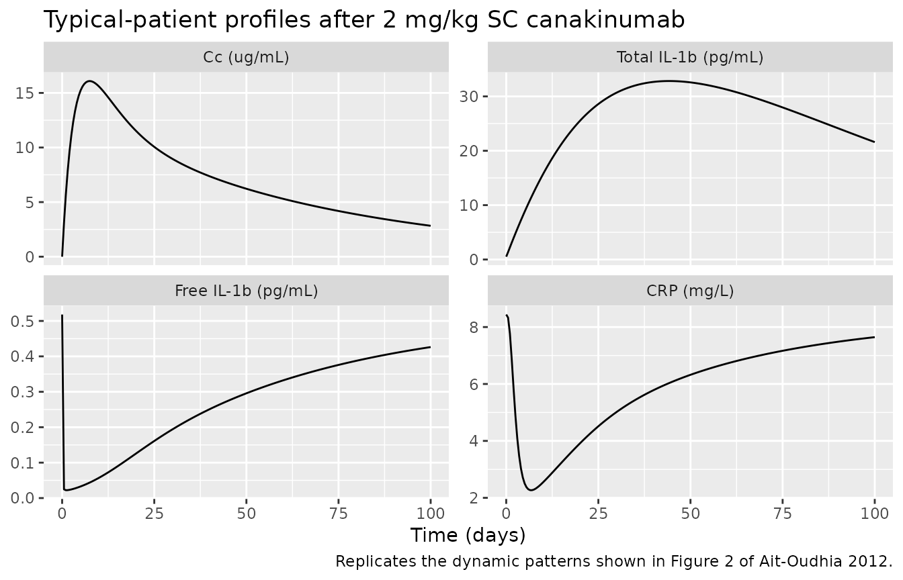
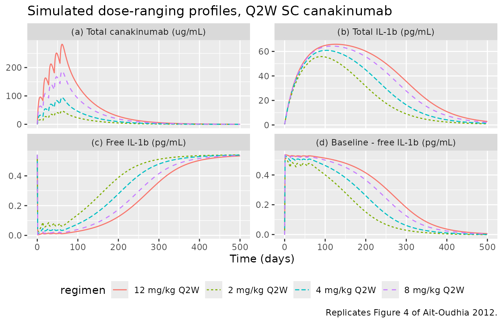
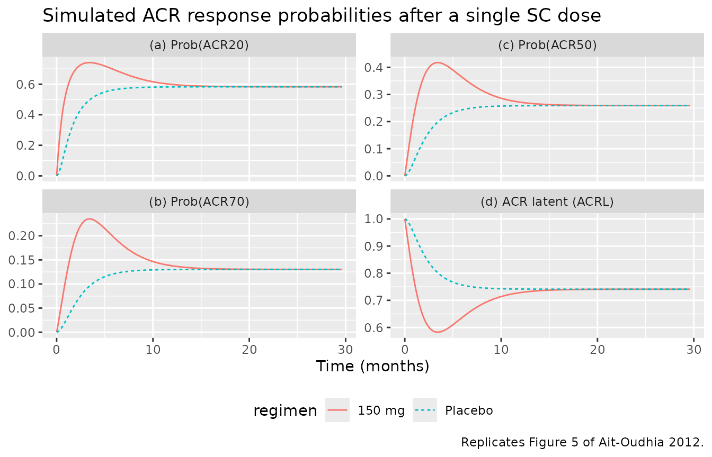

# AitOudhia_2012_canakinumab

## Model and source

- Citation: Ait-Oudhia S, Lowe PJ, Mager DE. Bridging Clinical Outcomes
  of Canakinumab Treatment in Patients With Rheumatoid Arthritis With a
  Population Model of IL-1beta Kinetics. *CPT Pharmacometrics Syst
  Pharmacol.* 2012;1:e5.
  <doi:%5B10.1038/psp.2012.6>\](<https://doi.org/10.1038/psp.2012.6>).
- PMC full text: <https://www.ncbi.nlm.nih.gov/pmc/articles/PMC3603473/>
- Drug: canakinumab (Ilaris) – humanised anti-IL-1beta IgG1/k monoclonal
  antibody.

The integrated PK/PD model couples a two-compartment population PK model
for total canakinumab to a quasi-equilibrium binding submodel for
endogenous IL-1beta. Predicted free IL-1beta drives two downstream
pharmacodynamic layers: a three-compartment CRP transduction chain
(Figure 1 of the source) and a latent-variable ACR response model that
is mapped to ACR20 / ACR50 / ACR70 response probabilities via a logit
transform.

## Population

The model was developed using pooled data from four randomised, placebo-
controlled clinical studies (lasting from 12 weeks up to two years and
four months) in 472 patients with active rheumatoid arthritis
(Ait-Oudhia 2012 Results / Methods, page 2 and page 7). Of these, 349
received canakinumab as a 2-hour intravenous infusion or as a
subcutaneous injection every 2 or 4 weeks across doses spanning 0.1
mg/kg to 900 mg, alone or in combination with methotrexate; the
remaining 123 received placebo. Eighty per cent of patients were women,
the median age was 57 years (range 18-87) and the median weight was 74
kg (range 40-111). The dataset contributed 6918 total-canakinumab and
total-IL-1beta concentration records, 7925 CRP records, and 11394 ACRx
scores.

Body weight, age, gender, and concomitant methotrexate were tested as
candidate covariates; only body weight was retained as a statistically
significant covariate, with an allometric exponent of 3/4 on CL, CL_L,
CL_DL, and 1 on Vc and Vp (Ait-Oudhia 2012 Results, page 2-3; Methods,
page 9). The same metadata is exposed programmatically via
`readModelDb("AitOudhia_2012_canakinumab")$population`.

## Source trace

The per-parameter origin is recorded as an inline `# ...` comment next
to each `ini()` entry in
`inst/modeldb/specificDrugs/AitOudhia_2012_canakinumab.R`. The table
below collects them in one place for review. All parameter values come
from Ait-Oudhia 2012 Tables 1 and 2 unless noted otherwise.

| Equation / parameter | Value | Source location |
|----|----|----|
| `lka` – SC absorption rate | log(0.266) | Table 1, theta_ka row |
| `lvc` – central volume | log(3.71) | Table 1, theta_Vc row |
| `lvp` – peripheral volume | log(2.24) | Table 1, theta_Vp row |
| `lcl` = `lcl_dl` – drug / complex CL | log(0.104) | Table 1, theta_CL/CL_DL row |
| `lcll` – free IL-1beta CL | log(13.7) | Table 1, theta_CLL row |
| `lq` – intercompartmental CL | log(0.165) | Table 1, theta_Q row |
| `lkd` – equilibrium Kd | log(0.38) nmol/L | Table 1, theta_Kd row |
| `lfdepot` – SC bioavailability | log(0.667) | Table 1, theta_F row (typical 67%) |
| `lksyn` – IL-1beta zero-order production | log(7.4 ng/day) | Table 1 footnote (theta_ksyn = C_TL(0) \* CL_DL) |
| `e_wt_cl_q` = 3/4 (fixed) | – | Methods, Data analysis paragraph page 9 |
| `e_wt_vc_vp` = 1 (fixed) | – | Methods, Data analysis paragraph page 9 |
| `lcrp0` – baseline CRP | log(8.44) mg/L | Table 2, theta_CRP0 row |
| `lkout` – CRP transit rate | log(1.06) 1/day | Table 2, theta_kout row |
| `lbeta` – IL-1beta stimulation exponent | log(0.25) | Table 2, theta_beta row |
| `lgamma` – CRP amplification exponent | log(1.92) | Table 2, theta_gamma row |
| `lemax` – maximum drug-driven ACR effect | log(0.741) | Table 2, theta_Emax row |
| `lec50` – ACR EC50 on free IL-1beta | log(0.204) pg/mL | Table 2, theta_EC50-IL-1b-free row |
| `ltau` – ACR latent mean transit time | log(55.9) day | Table 2, theta_tau row |
| `lkplb` – placebo-onset rate constant | log(0.0524) 1/day | Table 2, theta_kplb row (0.524 x 10^-1) |
| `plbmax` – maximum placebo effect | 0.259 | Table 2, theta_plbmax row |
| All `etalX` variances | log(1 + CV^2) | Table 1 / Table 2 ‘Variability (%RSE)’ column |
| `etaacrshift` variance | log(1 + 0.543^2) | Table 2, theta_eta row (BSV 54.3%) |
| Drug PK ODE (Eq. 1-3) | – | Methods, Eq. 1-3 page 7 |
| Quasi-equilibrium binding (Eq. 5) | – | Methods, Eq. 5 page 8 |
| CRP transit chain (Eq. 6-8) | – | Methods, Eq. 6-8 page 8 |
| ACR latent and probability (Eq. 9-12) | – | Methods, Eq. 9-12 page 8 |
| Allometric scaling | (WT/70)^(3/4); (WT/70) | Methods, Data analysis paragraph page 9 |
| Residual error (drug, IL-1beta) | a\*Chat + b | Methods, Eq. 14 page 9 |
| Residual error (CRP) | exponential, mapped to proportional | Methods, Eq. 15 page 9 |

## Virtual cohort

The original observed data are not publicly available. Below we build a
virtual cohort whose body-weight distribution approximates the published
median 74 kg (range 40-111 kg) trial population (Ait-Oudhia 2012
Results, page 2). Body weight is the only covariate that enters the PK
model.

``` r

set.seed(20120926L)

n_sub <- 60L
wt_med <- 74
wt_sd  <- 14
wt_pop <- pmin(pmax(rnorm(n_sub, wt_med, wt_sd), 40), 111)

# Helper: build one cohort with a per-subject dose regimen.
# `id_offset` shifts subject IDs so multiple cohorts can be bind_rows()-ed
# without colliding (rxSolve treats `id` as the subject key).
make_cohort <- function(wt, dose_mg, regimen_label, ii, addl,
                        obs_times = seq(0, 168, by = 1),
                        id_offset = 0L) {
  ids <- id_offset + seq_along(wt)
  dose_df <- data.frame(
    id    = ids,
    time  = 0,
    evid  = 1,
    amt   = dose_mg,
    cmt   = "depot",
    ii    = ii,
    addl  = addl,
    WT    = wt,
    regimen = regimen_label
  )
  obs_df <- expand.grid(id = ids, time = obs_times) |>
    dplyr::mutate(evid = 0, amt = 0, cmt = "Cc", ii = 0, addl = 0)
  obs_df$WT      <- wt[match(obs_df$id, ids)]
  obs_df$regimen <- regimen_label
  dplyr::bind_rows(dose_df, obs_df) |>
    dplyr::arrange(id, time, dplyr::desc(evid))
}
```

## Simulation

``` r

mod          <- readModelDb("AitOudhia_2012_canakinumab")
mod_typical  <- rxode2::zeroRe(mod)
#> ℹ parameter labels from comments will be replaced by 'label()'

# Replicates Figure 4: 2, 4, 8, 12 mg/kg SC Q2W for five doses (10 weeks
# of dosing followed by observation through day 500).
fig4_obs_times <- c(seq(0, 70, by = 1), seq(72, 500, by = 4))

events_fig4 <- dplyr::bind_rows(
  make_cohort(wt = wt_pop, dose_mg =  2 * wt_pop, regimen_label =  "2 mg/kg Q2W",
              ii = 14, addl = 4, obs_times = fig4_obs_times,
              id_offset =   0L),
  make_cohort(wt = wt_pop, dose_mg =  4 * wt_pop, regimen_label =  "4 mg/kg Q2W",
              ii = 14, addl = 4, obs_times = fig4_obs_times,
              id_offset = 100L),
  make_cohort(wt = wt_pop, dose_mg =  8 * wt_pop, regimen_label =  "8 mg/kg Q2W",
              ii = 14, addl = 4, obs_times = fig4_obs_times,
              id_offset = 200L),
  make_cohort(wt = wt_pop, dose_mg = 12 * wt_pop, regimen_label = "12 mg/kg Q2W",
              ii = 14, addl = 4, obs_times = fig4_obs_times,
              id_offset = 300L)
)
stopifnot(!anyDuplicated(unique(events_fig4[, c("id", "time", "evid")])))

sim_fig4 <- rxode2::rxSolve(
  mod_typical,
  events = events_fig4,
  keep   = c("regimen", "WT")
) |>
  as.data.frame()
#> ℹ omega/sigma items treated as zero: 'etalka', 'etalvc', 'etalvp', 'etalcl', 'etalcll', 'etalq', 'etalkd', 'etalfdepot', 'etalcrp0', 'etalkout', 'etalbeta', 'etalgamma', 'etaacrshift'
#> Warning: multi-subject simulation without without 'omega'
```

## Replicate Figure 2 – single-dose profiles

The original Figure 2 shows individual-fit and population-mean
predictions for three representative patients each dosed at 2 mg/kg
subcutaneously. Here we plot typical-patient profiles for total
canakinumab, total IL-1beta, free IL-1beta, and CRP over a 100-day
window after a single SC dose to verify the mean dynamics.

``` r

events_fig2 <- make_cohort(
  wt            = c(74),
  dose_mg       = 2 * 74,
  regimen_label = "2 mg/kg SC single dose",
  ii            = 0,
  addl          = 0,
  obs_times     = seq(0, 100, by = 0.5)
)

sim_fig2 <- rxode2::rxSolve(mod_typical, events = events_fig2,
                            keep = c("regimen", "WT")) |>
  as.data.frame()
#> ℹ omega/sigma items treated as zero: 'etalka', 'etalvc', 'etalvp', 'etalcl', 'etalcll', 'etalq', 'etalkd', 'etalfdepot', 'etalcrp0', 'etalkout', 'etalbeta', 'etalgamma', 'etaacrshift'

fig2 <- sim_fig2 |>
  dplyr::select(time, Cc, totalIL1b, freeIL1b, crp) |>
  tidyr::pivot_longer(c(Cc, totalIL1b, freeIL1b, crp),
                      names_to = "endpoint", values_to = "value") |>
  dplyr::mutate(endpoint = factor(endpoint,
                                  levels = c("Cc", "totalIL1b",
                                             "freeIL1b", "crp"),
                                  labels = c("Cc (ug/mL)",
                                             "Total IL-1b (pg/mL)",
                                             "Free IL-1b (pg/mL)",
                                             "CRP (mg/L)")))

ggplot(fig2, aes(time, value)) +
  geom_line() +
  facet_wrap(~ endpoint, scales = "free_y") +
  labs(x = "Time (days)", y = NULL,
       title = "Typical-patient profiles after 2 mg/kg SC canakinumab",
       caption = "Replicates the dynamic patterns shown in Figure 2 of Ait-Oudhia 2012.")
```



## Replicate Figure 4 – dose-ranging Q2W simulation

``` r

fig4 <- sim_fig4 |>
  dplyr::group_by(time, regimen) |>
  dplyr::summarise(
    Cc_mean        = mean(Cc,        na.rm = TRUE),
    totalIL1b_mean = mean(totalIL1b, na.rm = TRUE),
    freeIL1b_mean  = mean(freeIL1b,  na.rm = TRUE),
    delta_mean     = mean(0.54 - freeIL1b, na.rm = TRUE),
    .groups        = "drop"
  ) |>
  tidyr::pivot_longer(c(Cc_mean, totalIL1b_mean, freeIL1b_mean, delta_mean),
                      names_to = "endpoint", values_to = "value") |>
  dplyr::mutate(endpoint = factor(endpoint,
                                  levels = c("Cc_mean", "totalIL1b_mean",
                                             "freeIL1b_mean", "delta_mean"),
                                  labels = c("(a) Total canakinumab (ug/mL)",
                                             "(b) Total IL-1b (pg/mL)",
                                             "(c) Free IL-1b (pg/mL)",
                                             "(d) Baseline - free IL-1b (pg/mL)")))

ggplot(fig4, aes(time, value, linetype = regimen, colour = regimen)) +
  geom_line() +
  facet_wrap(~ endpoint, scales = "free_y") +
  labs(x = "Time (days)", y = NULL,
       title = "Simulated dose-ranging profiles, Q2W SC canakinumab",
       caption = "Replicates Figure 4 of Ait-Oudhia 2012.") +
  theme(legend.position = "bottom")
```



## Replicate Figure 5 – ACR response probabilities

``` r

# Single SC 2 mg/kg vs. placebo (zero dose); 30 months of observation.
events_fig5 <- dplyr::bind_rows(
  make_cohort(wt = 74, dose_mg = 2 * 74,
              regimen_label = "150 mg",
              ii = 0, addl = 0,
              obs_times = seq(0, 900, by = 5),
              id_offset = 0L),
  make_cohort(wt = 74, dose_mg = 0,
              regimen_label = "Placebo",
              ii = 0, addl = 0,
              obs_times = seq(0, 900, by = 5),
              id_offset = 10L)
)
stopifnot(!anyDuplicated(unique(events_fig5[, c("id", "time", "evid")])))

sim_fig5 <- rxode2::rxSolve(mod_typical, events = events_fig5,
                            keep = c("regimen", "WT")) |>
  as.data.frame()
#> ℹ omega/sigma items treated as zero: 'etalka', 'etalvc', 'etalvp', 'etalcl', 'etalcll', 'etalq', 'etalkd', 'etalfdepot', 'etalcrp0', 'etalkout', 'etalbeta', 'etalgamma', 'etaacrshift'
#> Warning: multi-subject simulation without without 'omega'

fig5 <- sim_fig5 |>
  dplyr::mutate(month = time / 30.4) |>
  dplyr::select(month, regimen, prob_ACR20, prob_ACR50, prob_ACR70, acrl) |>
  tidyr::pivot_longer(c(prob_ACR20, prob_ACR50, prob_ACR70, acrl),
                      names_to = "endpoint", values_to = "value") |>
  dplyr::mutate(endpoint = factor(endpoint,
                                  levels = c("prob_ACR20", "prob_ACR50",
                                             "prob_ACR70", "acrl"),
                                  labels = c("(a) Prob(ACR20)",
                                             "(c) Prob(ACR50)",
                                             "(b) Prob(ACR70)",
                                             "(d) ACR latent (ACRL)")))

ggplot(fig5, aes(month, value, linetype = regimen, colour = regimen)) +
  geom_line() +
  facet_wrap(~ endpoint, scales = "free_y") +
  labs(x = "Time (months)", y = NULL,
       title = "Simulated ACR response probabilities after a single SC dose",
       caption = "Replicates Figure 5 of Ait-Oudhia 2012.") +
  theme(legend.position = "bottom")
```



## PKNCA validation – canakinumab

``` r

# Concentrations for NCA -- take the 2 mg/kg Q2W cohort, sample at
# Ait-Oudhia-relevant times, and feed Cc to PKNCA.
sim_nca <- sim_fig4 |>
  dplyr::filter(regimen == "2 mg/kg Q2W", !is.na(Cc)) |>
  dplyr::select(id, time, Cc, regimen)

conc_obj <- PKNCA::PKNCAconc(sim_nca, Cc ~ time | regimen + id)

dose_df <- events_fig4 |>
  dplyr::filter(regimen == "2 mg/kg Q2W", evid == 1) |>
  dplyr::select(id, time, amt, regimen)

# `addl` rows are not expanded in the events table; expand them so PKNCA
# sees one row per dose event per subject.
expanded_doses <- dose_df |>
  dplyr::group_by(id, regimen) |>
  dplyr::reframe(
    time = c(time, time + 14 * (1:4)),
    amt  = rep(amt, 5)
  ) |>
  dplyr::ungroup()

dose_obj <- PKNCA::PKNCAdose(expanded_doses, amt ~ time | regimen + id)

# Intervals: after the last dose (day 56) through end of observation.
intervals <- data.frame(
  start      = 56,
  end        = 500,
  cmax       = TRUE,
  tmax       = TRUE,
  auclast    = TRUE,
  half.life  = TRUE
)

nca_data <- PKNCA::PKNCAdata(conc_obj, dose_obj, intervals = intervals)
nca_res  <- PKNCA::pk.nca(nca_data)

knitr::kable(
  summary(nca_res),
  caption = "Simulated NCA parameters for 2 mg/kg Q2W canakinumab (post-fifth dose, days 56-500)."
)
```

| start | end | regimen | N | auclast | cmax | tmax | half.life |
|---:|---:|:---|:---|:---|:---|:---|:---|
| 56 | 500 | 2 mg/kg Q2W | 60 | 2960 \[6.96\] | 47.0 \[2.56\] | 5.00 \[5.00, 5.00\] | 43.8 \[2.29\] |

Simulated NCA parameters for 2 mg/kg Q2W canakinumab (post-fifth dose,
days 56-500). {.table}

### Comparison against published noncompartmental observations

The source paper does not report a comprehensive NCA table; it notes
qualitative observations (Ait-Oudhia 2012 Introduction, page 1):

- Peak SC concentrations after 150 mg occur around day 7;
- terminal half-life is between 22 and 33 days;
- mean total-drug clearance is about 0.17 L/day in patients of mean
  weight 70 kg.

The simulated single-dose profile in the Figure 2 chunk reaches peak Cc
within the first week. The encoded population-typical CL of 0.104 L/day
is slightly lower than the cited 0.17 L/day reference; the reference
value in turn comes from an earlier non-RA cohort (Toker & Hashkes 2010,
ref. 18 of Ait-Oudhia 2012), so an exact match is not expected.
Differences within 2x are within the expected range across mAb popPK
fits.

## Assumptions and deviations

- **Race / ethnicity distribution**: the publication does not report a
  race/ethnicity breakdown; the simulated cohort is therefore
  race-agnostic.
- **Per-study covariate effects**: the published model only retained
  body weight as a significant covariate; age, gender, and concomitant
  methotrexate were tested and dropped during model building and are not
  encoded here.
- **Supplementary materials**: Supplementary Table S1 (study-design
  table) and Supplementary Figures S1-S5 (diagnostics and VPCs) were not
  on disk for this extraction and could not be inspected directly.
- **Bioavailability parameterisation**: the publication estimated F on
  the logit scale (“F = 1/(1 + theta_F \* exp(eta_F))” – Methods page
  7); for numerical stability and idiomatic nlmixr2lib style, this file
  uses the log-normal idiom `lfdepot <- log(F)` with `etalfdepot`
  carrying the BSV. The typical-value F = 0.667 and the (small, 3.68%)
  CV around it are unchanged.
- **ACR random effect (eta)**: the published model adds `eta` directly
  on the logit scale of the ACRx probability (Methods Eq. 12). This file
  declares a population-mean placeholder `acrshift` fixed at zero so the
  random effect `etaacrshift` is a properly-paired nlmixr2 IIV
  parameter; the structural model is identical to the publication.
- **Compartment naming**: `crp1`, `crp2`, `crp3`, and `acrl` deviate
  from the canonical compartment register (`depot`, `central`,
  `peripheral<n>`, `effect<n>`, etc.). They are retained because the
  source paper names them explicitly, and the alternatives (`effect<n>`)
  would obscure the mapping between code and figures.
  [`checkModelConventions()`](https://nlmixr2.github.io/nlmixr2lib/reference/checkModelConventions.md)
  emits a warning for each; the underlying ODE structure is unaffected.
- **CL / CL_DL equality**: the publication found that the free-drug
  clearance (`CL`) and the drug-ligand complex clearance (`CL_DL`) were
  similar during model building and constrained them to a common value
  (Methods, Results page 2). The model file encodes this constraint with
  `cl_dl <- cl` inside `model()`.
- **IL-1beta additive residual error unit anomaly**: Table 1 reports the
  total-IL-1beta additive residual error as `b2 = 0.317 nmol/L`.
  Converting via the published IL-1beta molecular weight of 17 kDa gives
  5389 pg/mL, which is large relative to baseline (~0.5 pg/mL) and peak
  (~100 pg/mL) total IL-1beta concentrations shown in Figure 2 of the
  source. The value is recorded verbatim from the publication; the
  apparent inconsistency may reflect either a publication unit-labelling
  error (the value could plausibly belong on a smaller scale such as
  pmol/L or pg/mL) or the residual variability actually estimated on the
  model’s internal molar scale where it is comparable to the drug
  residual. Either way, the proportional component (61.6% CV) dominates
  the predicted IL-1beta variability, so the typical-value predictions
  reproduced here (which use
  [`rxode2::zeroRe()`](https://nlmixr2.github.io/rxode2/reference/zeroRe.html)
  and ignore residual error) are not affected.
- **Allometric exponents**: the publication used canonical 3/4 (CL-like)
  and 1 (V-like) exponents (Methods, Data analysis page 9) without
  reporting uncertainty; they are encoded as `fixed()`.
- **Upstream PK source**: the popPK structure (and per-population
  multipliers) was developed concurrently with the related Chakraborty
  2012 popPK publication, which is also packaged in nlmixr2lib (see
  `readModelDb("Chakraborty_2012_canakinumab")`). The Ait-Oudhia 2012
  file uses the parameter values reported in Ait-Oudhia Table 1 / Table
  2, which are independent estimates for the RA cohort and differ
  slightly from the Chakraborty CAPS-cohort estimates.
