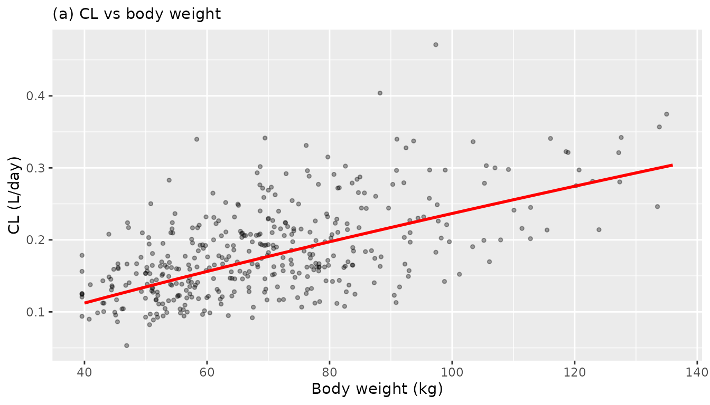
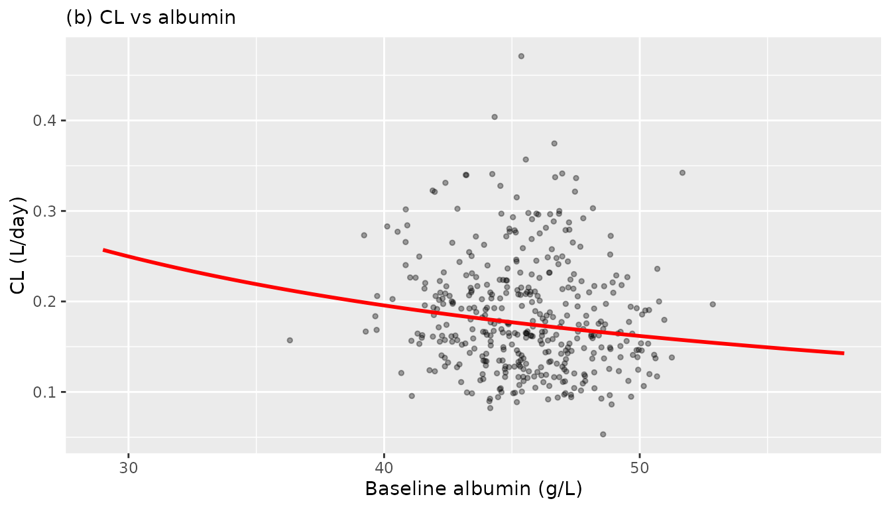
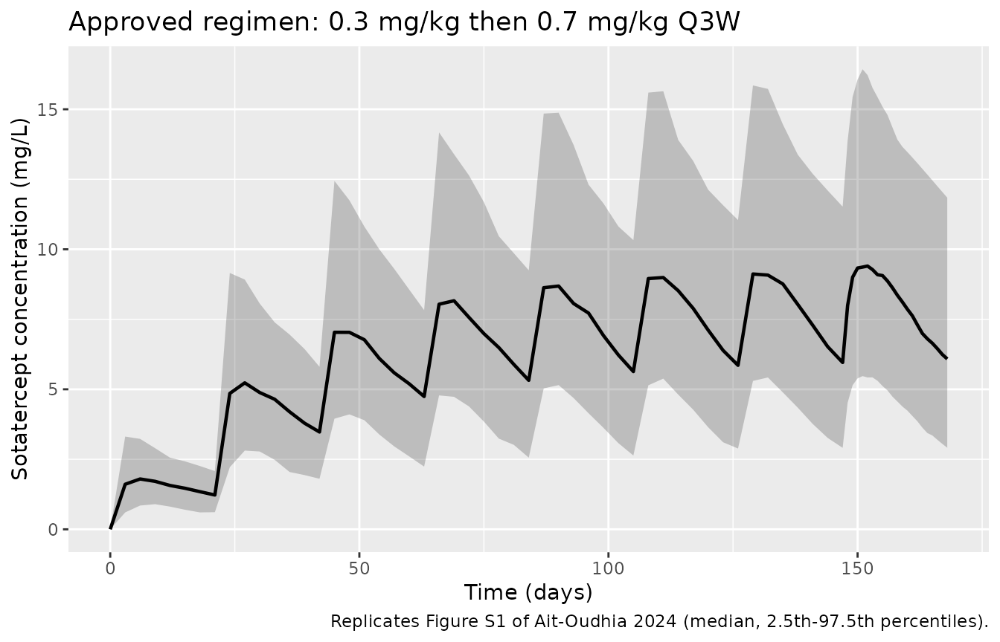
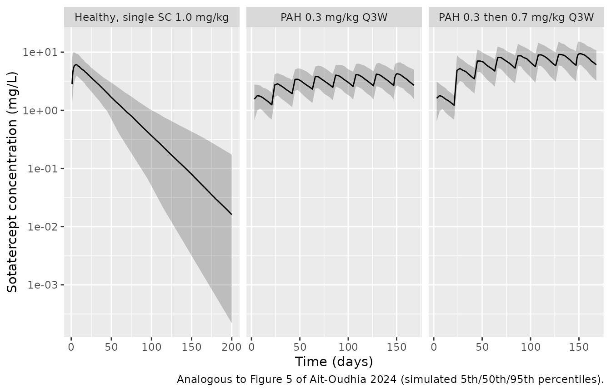

# Sotatercept (Ait-Oudhia 2024)

## Model and source

- Citation: Ait-Oudhia S, Jaworowicz D, Hu Z, Bihorel S, Hu S,
  Balasubrahmanyam B, Mistry B, de Oliveira Pena J, Wenning L, Gheyas F.
  Population pharmacokinetic modeling of sotatercept in healthy
  participants and patients with pulmonary arterial hypertension. CPT
  Pharmacometrics Syst Pharmacol. 2024;13(8):1380-1393.
  <doi:10.1002/psp4.13166>
- Description: Two-compartment population pharmacokinetic model for
  sotatercept in healthy post-menopausal women and patients with
  pulmonary arterial hypertension (Ait-Oudhia 2024). First-order
  subcutaneous absorption with logit-scale bioavailability (about 66%)
  and linear elimination from the central compartment; time-varying body
  weight enters as a power covariate on clearance (exponent 0.814) and
  central volume (exponent 1.02) with a 70 kg reference, and baseline
  serum albumin as a power covariate on clearance (exponent -0.849) with
  a 4.5 g/dL reference. Separate log-scale residual error magnitudes are
  used for healthy participants and for patients with PAH. Intravenous
  doses go to the central compartment and subcutaneous doses to the
  depot.
- Article: <https://doi.org/10.1002/psp4.13166>

Sotatercept is a first-in-class recombinant fusion protein (the
extracellular domain of activin receptor type IIA linked to a human IgG1
Fc domain) approved for pulmonary arterial hypertension (PAH).
Ait-Oudhia 2024 pooled five trials into one integrated population PK
model: a two-compartment model with first-order subcutaneous (SC)
absorption, linear elimination from the central compartment, and
time-varying body weight plus baseline serum albumin as the two retained
covariates.

## Population

The final analysis dataset comprised 350 participants: 40 from a phase 1
single-ascending-dose (SAD) trial and 24 from a phase 1
multiple-ascending-dose (MAD) trial, both in healthy post-menopausal
women, plus 103 from PULSAR, 21 from SPECTRA (phase 2), and 162 from
STELLAR (phase 3), all in participants with PAH (Table 1). 30
participants received sotatercept intravenously (IV) and 320
subcutaneously.

Participants were 85.1% female (298 of 350) – both phase 1 trials
enrolled only post-menopausal women – with a mean age of 50.2 years (SD
14.4, range 18-81) and a mean baseline body weight of 71.0 kg (SD 17.6,
range 39.6-136). Mean baseline serum albumin was 4.43 g/dL (SD 0.33,
range 2.9-5.8), i.e. 44.3 g/L (range 29-58) in the SI units this package
uses. 82.9% self-identified as White/Caucasian, 7.14% Asian, 3.14% Black
or African American, 1.14% Native Hawaiian or other Pacific Islander,
0.286% American Indian or Alaska Native, and 5.43% Other. Renal function
at baseline was normal in 33.1%, mildly impaired in 52.3%, and
moderately impaired in 14.6%; severe impairment (eGFR below 30
mL/min/1.73 m^2) was an exclusion criterion (Table 1).

Doses spanned single IV or SC 0.01-3.0 mg/kg (SAD) and multiple SC
0.03-1.0 mg/kg Q4W (MAD) in phase 1, SC 0.3 or 0.7 mg/kg Q3W in phase 2,
and an SC 0.3 mg/kg initial dose followed by the 0.7 mg/kg Q3W target
dose in phase 3. PK sampling was rich in the two phase 1 studies and
sparse in phase 2/3, with samples collected for up to about 150 weeks
(Figure 1).

The same information is available programmatically via the model’s
`population` metadata
(`readModelDb("AitOudhia_2024_sotatercept")()$population`).

## Source trace

The per-parameter origin is recorded as an in-file comment next to each
`ini()` entry in
`inst/modeldb/specificDrugs/AitOudhia_2024_sotatercept.R`. The table
below collects them in one place for review. All values come from Table
2 of Ait-Oudhia 2024; every parameter was estimated (each carries a
%RSE), so none is wrapped in `fixed()`.

| Equation / parameter | Value | Source location |
|----|----|----|
| `lcl` (CL) | 0.177 L/day | Table 2, CL population mean (%RSE 6.22) |
| `lvc` (VC) | 3.60 L | Table 2, VC population mean (%RSE 5.50) |
| `lq` (Q) | 0.487 L/day | Table 2, Q population mean (%RSE 20.5) |
| `lvp` (VP) | 1.71 L | Table 2, VP population mean (%RSE 15.8) |
| `lka` (KA) | 0.273 1/day | Table 2, KA population mean (%RSE 16.0) |
| `logitfdepot` (F1) | logit(0.659) = 0.6588 | Table 2, F1 population mean (%RSE 6.29) |
| `e_wt_cl` | 0.814 | Table 2, CL “Exponent of body weight power effect” (%RSE 11.9) |
| `e_alb_cl` | -0.849 | Table 2, CL “Exponent of baseline albumin effect” (%RSE 24.2) |
| `e_wt_vc` | 1.02 | Table 2, VC “Exponent of body weight power effect” (%RSE 11.8) |
| `etalcl` | log(1 + 0.283^2) = 0.0770 | Table 2, CL IIV 28.3 %CV; Methods %CV = sqrt(exp(omega^2) - 1) x 100 |
| `etalvc` | log(1 + 0.247^2) = 0.0592 | Table 2, VC IIV 24.7 %CV |
| `etalvp` | log(1 + 0.733^2) = 0.4300 | Table 2, VP IIV 73.3 %CV |
| `etalka` | log(1 + 0.604^2) = 0.3110 | Table 2, KA IIV 60.4 %CV |
| `etalogitfdepot` | 0.348^2 = 0.1211 | Table 2, F1 IIV 11.9 %CV via footnote d: 100 x (1 - 0.659) x 0.348 |
| (no IIV on Q) | n/a | Table 2 reports “NE” (not estimated) in the Q variability column |
| `expSdHealthy` | sqrt(0.0570) = 0.2387 | Table 2, “Residual variability in HV (log units)” variance (%RSE 20.2); reported SD 0.239 |
| `expSdPah` | sqrt(0.0357) = 0.1889 | Table 2, “Residual variability in PAH (log units)” variance (%RSE 12.6); reported SD 0.189 |
| CL covariate equation | `CL = 0.177 x (WT/70)^0.814 x (ALB/45)^-0.849` | Table 2 footnote a (printed with a 4.5 g/dL albumin reference; see Assumptions) |
| VC covariate equation | `VC = 3.60 x (WT/70)^1.02` | Table 2 footnote c |
| Micro-constants | `k12 = Q/VC`, `k21 = Q/VP`, `kel = CL/VC` | Methods, “Clinical relevance of covariates” (t-half derivation) |
| Two-compartment ODEs with SC depot | n/a | Figure 2 schematic; Methods, “Data analyses and population pharmacokinetic modeling approach” |
| Residual error form | `log(Y) = log(Yhat) + eps` (nlmixr2 `lnorm`) | Methods, “Log error model”; Results, “Two separate log error models … for healthy and PAH participants” |

## Validation strategy

Ait-Oudhia 2024 publishes no non-compartmental analysis table, so this
vignette validates against the derived quantities the paper *does*
report. Four of these are exact, independent checks on the packaged
model:

1.  **Terminal half-life about 22 days** for a typical 70 kg participant
    with a median normal baseline albumin of 4.5 g/dL (Discussion). This
    is an end-to-end gate: it depends jointly on CL, VC, Q, and VP.
2.  **Typical CL of 0.135, 0.177, and 0.237 L/day and typical VC of
    2.55, 3.60, and 5.18 L at body weights of 50, 70, and 100 kg**
    (Discussion). This pins both weight exponents and both reference
    values.
3.  **SC bioavailability of about 66%**, recoverable as the SC-to-IV AUC
    ratio (Table 2, Abstract).
4.  **Dose-proportional PK across all studied doses** (“At all studied
    doses, sotatercept PK appeared to be linear as assessed by the
    dose-normalized exposure data”, Discussion).

A fifth, softer check is the paper’s statement of “an observed 35%
variability in sotatercept AUC” (Discussion), compared below against the
model-predicted between-subject variability in steady-state AUC.

## Deterministic gates

These use `omega = NA` to suppress between-subject variability, so each
solve returns the typical-value profile. (`omega = NA` is preferred over
[`rxode2::zeroRe()`](https://nlmixr2.github.io/rxode2/reference/zeroRe.html),
which mutates shared model state.)

``` r

mod <- readModelDb("AitOudhia_2024_sotatercept")

# Typical individual: 70 kg, albumin 45 g/L (= 4.5 g/dL), PAH cohort.
solve_typical <- function(events, wt = 70, alb = 45, healthy = 0) {
  d <- as.data.frame(events)
  d$WT <- wt
  d$ALB <- alb
  d$DIS_HEALTHY <- healthy
  rxode2::rxSolve(mod, d, omega = NA, returnType = "data.frame")
}
```

### Gate 2 – typical CL and VC versus body weight

``` r

probe <- rxode2::et(amt = 49, cmt = "depot") |>
  rxode2::et(0, cmt = "central")

wt_gate <- lapply(c(50, 70, 100), function(w) {
  s <- solve_typical(probe, wt = w)
  tibble(WT = w, cl_model = s$cl[1], vc_model = s$vc[1])
}) |>
  bind_rows() |>
  mutate(
    cl_paper = c(0.135, 0.177, 0.237),
    vc_paper = c(2.55, 3.60, 5.18)
  )
#> ℹ parameter labels from comments will be replaced by 'label()'

wt_gate |>
  mutate(across(where(is.numeric), ~ round(.x, 4))) |>
  rename(
    "Body weight (kg)"  = WT,
    "CL model (L/day)"  = cl_model,
    "VC model (L)"      = vc_model,
    "CL paper (L/day)"  = cl_paper,
    "VC paper (L)"      = vc_paper
  ) |>
  knitr::kable(
    caption = paste(
      "Gate 2: typical CL and VC versus body weight.",
      "Paper values from the Discussion of Ait-Oudhia 2024."
    )
  )
```

| Body weight (kg) | CL model (L/day) | VC model (L) | CL paper (L/day) | VC paper (L) |
|-----------------:|-----------------:|-------------:|-----------------:|-------------:|
|               50 |           0.1346 |       2.5542 |            0.135 |         2.55 |
|               70 |           0.1770 |       3.6000 |            0.177 |         3.60 |
|              100 |           0.2366 |       5.1797 |            0.237 |         5.18 |

Gate 2: typical CL and VC versus body weight. Paper values from the
Discussion of Ait-Oudhia 2024. {.table}

``` r


# The paper prints these to 3 significant figures, so compare at that precision.
stopifnot(
  all(abs(signif(wt_gate$cl_model, 3) - wt_gate$cl_paper) < 1e-9),
  all(abs(signif(wt_gate$vc_model, 3) - wt_gate$vc_paper) < 1e-9)
)
```

Both weight exponents and both reference values reproduce the published
typical values exactly at the precision the paper prints them.

### Gate 3 – SC bioavailability from the SC-to-IV AUC ratio

``` r

auc_route <- function(route) {
  ev <- rxode2::et(amt = 49, cmt = route) |>
    rxode2::et(seq(0, 600, by = 0.25), cmt = "central")
  s <- solve_typical(ev)
  sum(diff(s$time) * (head(s$Cc, -1) + tail(s$Cc, -1)) / 2)
}

auc_sc <- auc_route("depot")
auc_iv <- auc_route("central")
f1_recovered <- auc_sc / auc_iv

tibble(
  Quantity = c("AUC(0-600 d), SC 49 mg", "AUC(0-600 d), IV 49 mg",
               "Recovered F1 (SC/IV)", "Table 2 F1"),
  Value = c(round(auc_sc, 2), round(auc_iv, 2), round(f1_recovered, 4), 0.659)
) |>
  knitr::kable(caption = "Gate 3: SC bioavailability recovered as the SC-to-IV AUC ratio.")
```

| Quantity               |    Value |
|:-----------------------|---------:|
| AUC(0-600 d), SC 49 mg | 182.4200 |
| AUC(0-600 d), IV 49 mg | 276.8500 |
| Recovered F1 (SC/IV)   |   0.6589 |
| Table 2 F1             |   0.6590 |

Gate 3: SC bioavailability recovered as the SC-to-IV AUC ratio. {.table}

``` r


stopifnot(abs(f1_recovered - 0.659) < 1e-3)
```

The SC-to-IV AUC ratio recovers F1 = 0.659 (about 66%), matching Table 2
and the Abstract.

### Gate 4 – dose proportionality

``` r

auc_ss_dose <- function(mgkg) {
  ev <- rxode2::et(amt = mgkg * 70, cmt = "depot", ii = 21, ss = 1) |>
    rxode2::et(seq(0, 21, by = 0.05), cmt = "central")
  s <- solve_typical(ev)
  sum(diff(s$time) * (head(s$Cc, -1) + tail(s$Cc, -1)) / 2)
}

auc_03 <- auc_ss_dose(0.3)
auc_07 <- auc_ss_dose(0.7)

# Steady-state AUC over one interval must equal F * Dose / CL exactly for a
# linear model, and the two arms must scale exactly with dose.
tibble(
  Quantity = c("AUCtau at 0.3 mg/kg (mg*day/L)", "AUCtau at 0.7 mg/kg (mg*day/L)",
               "Ratio (0.7 / 0.3)", "Expected dose ratio",
               "F1 * Dose / CL at 0.7 mg/kg"),
  Value = c(round(auc_03, 3), round(auc_07, 3), round(auc_07 / auc_03, 6),
            round(7 / 3, 6), round(0.659 * 0.7 * 70 / 0.177, 3))
) |>
  knitr::kable(caption = "Gate 4: dose proportionality and the steady-state AUC identity.")
```

| Quantity                        |      Value |
|:--------------------------------|-----------:|
| AUCtau at 0.3 mg/kg (mg\*day/L) |  78.186000 |
| AUCtau at 0.7 mg/kg (mg\*day/L) | 182.435000 |
| Ratio (0.7 / 0.3)               |   2.333333 |
| Expected dose ratio             |   2.333333 |
| F1 \* Dose / CL at 0.7 mg/kg    | 182.435000 |

Gate 4: dose proportionality and the steady-state AUC identity. {.table}

``` r


stopifnot(
  abs(auc_07 / auc_03 - 7 / 3) < 1e-6,
  abs(auc_07 / (0.659 * 0.7 * 70 / 0.177) - 1) < 1e-3
)
```

PK is exactly dose-proportional, and the steady-state AUC over one
dosing interval equals `F1 * Dose / CL` – the closed-form identity for a
linear model – confirming the bioavailability, clearance, and
depot-input encoding are mutually consistent. Using `ss = 1` rather than
a long dose train matters here: the 73.3 %CV IIV on VP and the roughly
22-day terminal half-life relative to a 21-day dosing interval make a
finite dose train converge slowly.

## Virtual cohort

Original observed data are not publicly available. The cohorts below use
virtual populations whose covariate distributions approximate the
published trial demographics (Table 1). Body weight is drawn from a
log-normal matched to the reported mean and SD and truncated to the
reported range; albumin is drawn from a truncated normal.

``` r

set.seed(20240815)

rtrunc_lnorm <- function(n, mean, sd, lo, hi) {
  sdlog <- sqrt(log(1 + (sd / mean)^2))
  meanlog <- log(mean) - sdlog^2 / 2
  x <- rlnorm(n, meanlog, sdlog)
  pmin(pmax(x, lo), hi)
}

rtrunc_norm <- function(n, mean, sd, lo, hi) {
  pmin(pmax(rnorm(n, mean, sd), lo), hi)
}

n_arm <- 200L

# One arm = per-subject covariates expanded into dose + observation rows.
make_arm <- function(n, cohort, healthy, mgkg, n_doses, obs_times,
                     wt_mean, wt_sd, wt_lo, wt_hi,
                     alb_mean, alb_sd, id_offset) {
  subj <- tibble(
    id = id_offset + seq_len(n),
    cohort = cohort,
    DIS_HEALTHY = healthy,
    WT = rtrunc_lnorm(n, wt_mean, wt_sd, wt_lo, wt_hi),
    # Albumin drawn in g/dL to match Table 1, then converted to canonical g/L.
    ALB = rtrunc_norm(n, alb_mean, alb_sd, 2.9, 5.8) * 10
  )

  doses <- subj |>
    tidyr::crossing(dose_index = seq_len(n_doses)) |>
    mutate(
      time = 21 * (dose_index - 1),
      # STELLAR titration: the first dose is 0.3 mg/kg, later doses the target.
      amt = if_else(cohort == "PAH 0.3 then 0.7 mg/kg Q3W" & dose_index == 1,
                    0.3 * WT, mgkg * WT),
      evid = 1L, cmt = "depot"
    ) |>
    select(-dose_index)

  obs <- subj |>
    tidyr::crossing(time = obs_times) |>
    mutate(amt = NA_real_, evid = 0L, cmt = "central")

  bind_rows(doses, obs) |> arrange(id, time, desc(evid))
}

# Sparse-but-adequate grids: daily-to-3-daily, denser over the final interval.
obs_ss <- sort(unique(c(seq(0, 147, by = 3), seq(147, 168, by = 1))))
obs_sd <- sort(unique(c(seq(0, 28, by = 1), seq(30, 200, by = 5))))

events <- bind_rows(
  make_arm(n_arm, "Healthy, single SC 1.0 mg/kg", 1L, 1.0, 1L, obs_sd,
           wt_mean = 65.0, wt_sd = 11.7, wt_lo = 46.8, wt_hi = 94.3,
           alb_mean = 4.47, alb_sd = 0.276, id_offset = 0L),
  make_arm(n_arm, "PAH 0.3 mg/kg Q3W", 0L, 0.3, 8L, obs_ss,
           wt_mean = 71.8, wt_sd = 19.1, wt_lo = 39.6, wt_hi = 135,
           alb_mean = 4.57, alb_sd = 0.247, id_offset = 1000L),
  make_arm(n_arm, "PAH 0.3 then 0.7 mg/kg Q3W", 0L, 0.7, 8L, obs_ss,
           wt_mean = 71.8, wt_sd = 19.1, wt_lo = 39.6, wt_hi = 135,
           alb_mean = 4.57, alb_sd = 0.247, id_offset = 2000L)
)

# IDs must be disjoint across arms: rxSolve keys subjects on id, and a repeated
# id would silently merge two subjects into one that receives the summed dose.
stopifnot(!anyDuplicated(unique(events[, c("id", "time", "evid")])))

events |>
  group_by(cohort) |>
  summarise(
    n = n_distinct(id),
    `WT mean` = round(mean(WT[evid == 0]), 1),
    `ALB mean (g/L)` = round(mean(ALB[evid == 0]), 1),
    .groups = "drop"
  ) |>
  knitr::kable(caption = "Virtual cohort summary (200 participants per arm).")
```

| cohort                       |   n | WT mean | ALB mean (g/L) |
|:-----------------------------|----:|--------:|---------------:|
| Healthy, single SC 1.0 mg/kg | 200 |    65.5 |           44.6 |
| PAH 0.3 mg/kg Q3W            | 200 |    70.0 |           45.6 |
| PAH 0.3 then 0.7 mg/kg Q3W   | 200 |    70.0 |           45.5 |

Virtual cohort summary (200 participants per arm). {.table}

## Simulation

``` r

sim <- rxode2::rxSolve(
  mod, events = events,
  keep = c("cohort", "WT", "ALB", "DIS_HEALTHY")
) |>
  as.data.frame()
```

`Cc` is the individual prediction (IPRED); `sim` additionally carries
the log-normal residual error. The gates below use `Cc`, because the
published quantities being reproduced (typical CL, VC, half-life,
bioavailability) are model-derived rather than assay-observed.

## Replicate published figures

### Figure 3 – individual clearance versus body weight and albumin

``` r

# Replicates Figure 3 of Ait-Oudhia 2024: individual Bayesian CL estimates for
# the phase 2/3 population versus (a) body weight and (b) baseline albumin,
# overlaid with the model-predicted typical-participant line.
indiv <- sim |>
  filter(DIS_HEALTHY == 0) |>
  group_by(id, cohort) |>
  summarise(cl = first(cl), WT = first(WT), ALB = first(ALB), .groups = "drop")

typ_wt <- tibble(WT = seq(40, 136, length.out = 100)) |>
  mutate(cl = 0.177 * (WT / 70)^0.814)
typ_alb <- tibble(ALB = seq(29, 58, length.out = 100)) |>
  mutate(cl = 0.177 * (ALB / 45)^-0.849)

p_wt <- ggplot(indiv, aes(WT, cl)) +
  geom_point(alpha = 0.35, size = 1) +
  geom_line(data = typ_wt, colour = "red", linewidth = 1) +
  labs(x = "Body weight (kg)", y = "CL (L/day)", subtitle = "(a) CL vs body weight")

p_alb <- ggplot(indiv, aes(ALB, cl)) +
  geom_point(alpha = 0.35, size = 1) +
  geom_line(data = typ_alb, colour = "red", linewidth = 1) +
  labs(x = "Baseline albumin (g/L)", y = "CL (L/day)", subtitle = "(b) CL vs albumin")

print(p_wt)
```



``` r

print(p_alb)
```



The red line is the typical-participant prediction at the other
covariate’s reference value, matching the model-predicted line overlaid
in Figure 3. CL rises with body weight and falls with albumin, the
directions the paper reports.

### Figure S1 – median profile of the approved regimen

``` r

# Replicates Figure S1 of Ait-Oudhia 2024: median (2.5th-97.5th percentile)
# profile under the FDA-approved regimen, 0.3 mg/kg followed by 0.7 mg/kg Q3W.
sim |>
  filter(cohort == "PAH 0.3 then 0.7 mg/kg Q3W", !is.na(Cc)) |>
  group_by(time) |>
  summarise(
    Q025 = quantile(Cc, 0.025, na.rm = TRUE),
    Q50  = quantile(Cc, 0.500, na.rm = TRUE),
    Q975 = quantile(Cc, 0.975, na.rm = TRUE),
    .groups = "drop"
  ) |>
  ggplot(aes(time, Q50)) +
  geom_ribbon(aes(ymin = Q025, ymax = Q975), alpha = 0.25) +
  geom_line(linewidth = 0.8) +
  labs(
    x = "Time (days)", y = "Sotatercept concentration (mg/L)",
    title = "Approved regimen: 0.3 mg/kg then 0.7 mg/kg Q3W",
    caption = "Replicates Figure S1 of Ait-Oudhia 2024 (median, 2.5th-97.5th percentiles)."
  )
```



### Figure 5 – prediction interval by cohort

``` r

# Analogous to Figure 5 of Ait-Oudhia 2024 (pcVPC stratified by study and
# route). Observed data are unavailable, so this shows the simulated
# 5th/50th/95th percentiles on a log y-axis.
sim |>
  filter(!is.na(Cc)) |>
  group_by(cohort, time) |>
  summarise(
    Q05 = quantile(Cc, 0.05, na.rm = TRUE),
    Q50 = quantile(Cc, 0.50, na.rm = TRUE),
    Q95 = quantile(Cc, 0.95, na.rm = TRUE),
    .groups = "drop"
  ) |>
  filter(Q05 > 0) |>
  ggplot(aes(time, Q50)) +
  geom_ribbon(aes(ymin = Q05, ymax = Q95), alpha = 0.25) +
  geom_line() +
  facet_wrap(~cohort, scales = "free_x") +
  scale_y_log10() +
  labs(
    x = "Time (days)", y = "Sotatercept concentration (mg/L)",
    caption = "Analogous to Figure 5 of Ait-Oudhia 2024 (simulated 5th/50th/95th percentiles)."
  )
```



## PKNCA validation

### Single-dose arm (healthy participants)

``` r

sim_sd <- sim |>
  filter(cohort == "Healthy, single SC 1.0 mg/kg", !is.na(Cc)) |>
  select(id, time, Cc, cohort)

# Guarantee a time-zero row per subject; pre-dose Cc = 0 for an extravascular
# dose. Without it PKNCA warns that the AUC range starts before the first
# measurement, once per subject.
sim_sd <- bind_rows(
  sim_sd,
  sim_sd |> distinct(id, cohort) |> mutate(time = 0, Cc = 0)
) |>
  distinct(id, cohort, time, .keep_all = TRUE) |>
  arrange(id, time)

dose_sd <- events |>
  filter(cohort == "Healthy, single SC 1.0 mg/kg", evid == 1) |>
  select(id, time, amt, cohort)

conc_sd <- PKNCA::PKNCAconc(sim_sd, Cc ~ time | cohort + id,
                            concu = "mg/L", timeu = "day")
dobj_sd <- PKNCA::PKNCAdose(dose_sd, amt ~ time | cohort + id, doseu = "mg")

int_sd <- data.frame(
  start = 0, end = Inf,
  cmax = TRUE, tmax = TRUE, aucinf.obs = TRUE, half.life = TRUE
)

res_sd <- PKNCA::pk.nca(PKNCA::PKNCAdata(conc_sd, dobj_sd, intervals = int_sd))
summary(res_sd)
#>  Interval Start Interval End                       cohort   N Cmax (mg/L)
#>               0          Inf Healthy, single SC 1.0 mg/kg 200 6.54 [28.3]
#>         Tmax (day) Half-life (day) AUCinf,obs (day*mg/L)
#>  6.00 [2.00, 23.0]     24.0 [9.04]            245 [29.0]
#> 
#> Caption: Cmax, AUCinf,obs: geometric mean and geometric coefficient of variation; Tmax: median and range; Half-life: arithmetic mean and standard deviation; N: number of subjects
```

### Steady-state arms (patients with PAH)

``` r

sim_ss <- sim |>
  filter(DIS_HEALTHY == 0, !is.na(Cc)) |>
  select(id, time, Cc, cohort)

dose_ss <- events |>
  filter(DIS_HEALTHY == 0, evid == 1) |>
  select(id, time, amt, cohort)

conc_ss <- PKNCA::PKNCAconc(sim_ss, Cc ~ time | cohort + id,
                            concu = "mg/L", timeu = "day")
dobj_ss <- PKNCA::PKNCAdose(dose_ss, amt ~ time | cohort + id, doseu = "mg")

# Final dose is at day 147; the steady-state interval is the 21 days after it.
int_ss <- data.frame(
  start = 147, end = 168,
  cmax = TRUE, tmax = TRUE, cmin = TRUE, auclast = TRUE, cav = TRUE
)

res_ss <- PKNCA::pk.nca(PKNCA::PKNCAdata(conc_ss, dobj_ss, intervals = int_ss))
summary(res_ss)
#>  Interval Start Interval End                     cohort   N AUClast (day*mg/L)
#>             147          168          PAH 0.3 mg/kg Q3W 200        75.3 [31.1]
#>             147          168 PAH 0.3 then 0.7 mg/kg Q3W 200         168 [32.2]
#>  Cmax (mg/L) Cmin (mg/L)        Tmax (day)  Cav (mg/L)
#>  4.27 [28.9] 2.73 [37.4] 5.00 [2.00, 8.00] 3.59 [31.1]
#>  9.64 [29.9] 5.97 [39.1] 5.00 [2.00, 9.00] 8.01 [32.2]
#> 
#> Caption: AUClast, Cmax, Cmin, Cav: geometric mean and geometric coefficient of variation; Tmax: median and range; N: number of subjects
```

### Gate 5 – between-subject variability in steady-state AUC

``` r

auc_cv <- as.data.frame(res_ss) |>
  filter(PPTESTCD == "auclast", start == 147) |>
  group_by(cohort) |>
  summarise(
    `AUCtau geometric mean` = round(exp(mean(log(PPORRES))), 1),
    `AUCtau %CV` = round(sd(PPORRES) / mean(PPORRES) * 100, 1),
    .groups = "drop"
  )

auc_cv |>
  knitr::kable(
    caption = paste(
      "Gate 5: model-predicted between-subject variability in steady-state",
      "AUC over one dosing interval. Ait-Oudhia 2024 reports 'an observed 35%",
      "variability in sotatercept AUC' (Discussion)."
    )
  )
```

| cohort                     | AUCtau geometric mean | AUCtau %CV |
|:---------------------------|----------------------:|-----------:|
| PAH 0.3 mg/kg Q3W          |                  75.3 |       30.6 |
| PAH 0.3 then 0.7 mg/kg Q3W |                 168.1 |       31.6 |

Gate 5: model-predicted between-subject variability in steady-state AUC
over one dosing interval. Ait-Oudhia 2024 reports ‘an observed 35%
variability in sotatercept AUC’ (Discussion). {.table}

The model-predicted between-subject %CV in steady-state AUC is close to
the roughly 35% variability the paper reports as observed. The simulated
value is expected to sit slightly below the observed figure, because the
observed variability additionally absorbs residual error and
between-study heterogeneity that the model attributes to separate terms.

## Comparison against published values

Ait-Oudhia 2024 reports no NCA table. The only NCA-style quantity it
publishes is the terminal elimination half-life of about 22 days for a
typical 70 kg participant with a median normal baseline albumin of 4.5
g/dL, so the comparison below runs PKNCA on the typical-value profile
rather than on the stochastic cohort.

``` r

ev_typ <- rxode2::et(amt = 0.7 * 70, cmt = "depot") |>
  rxode2::et(sort(unique(c(seq(0, 30, by = 0.5), seq(31, 400, by = 2)))),
             cmt = "central")

sim_typ <- solve_typical(ev_typ) |>
  mutate(id = 1L, cohort = "Typical 70 kg, albumin 4.5 g/dL")

conc_typ <- PKNCA::PKNCAconc(
  sim_typ |> filter(!is.na(Cc)) |> select(id, time, Cc, cohort),
  Cc ~ time | cohort + id, concu = "mg/L", timeu = "day"
)
dobj_typ <- PKNCA::PKNCAdose(
  tibble(id = 1L, time = 0, amt = 0.7 * 70,
         cohort = "Typical 70 kg, albumin 4.5 g/dL"),
  amt ~ time | cohort + id, doseu = "mg"
)

res_typ <- PKNCA::pk.nca(PKNCA::PKNCAdata(
  conc_typ, dobj_typ,
  intervals = data.frame(start = 0, end = Inf, half.life = TRUE,
                         cmax = TRUE, tmax = TRUE, aucinf.obs = TRUE)
))

published <- tibble::tibble(
  cohort = "Typical 70 kg, albumin 4.5 g/dL",
  half.life = 22
)

cmp <- nlmixr2lib::ncaComparisonTable(
  simulated = res_typ,
  reference = published,
  by = "cohort",
  units = c(half.life = "day"),
  tolerance_pct = 20
)

knitr::kable(
  cmp,
  caption = paste(
    "Simulated vs published terminal half-life.",
    "* marks a difference from the reference above 20%."
  )
)
```

| NCA parameter | cohort                          | Reference | Simulated | % diff |
|:--------------|:--------------------------------|:----------|:----------|:-------|
| t½ (day)      | Typical 70 kg, albumin 4.5 g/dL | 22        | 21.7      | -1.6%  |

Simulated vs published terminal half-life. \* marks a difference from
the reference above 20%. {.table}

``` r

t_half <- as.data.frame(res_typ) |>
  filter(PPTESTCD == "half.life") |>
  pull(PPORRES)

# Independent closed-form check using the paper's own beta-phase formula
# (Methods): beta = 0.5 * [(k12 + k21 + kel) - sqrt((k12+k21+kel)^2 - 4*k21*kel)].
k12 <- 0.487 / 3.60
k21 <- 0.487 / 1.71
kel <- 0.177 / 3.60
beta <- 0.5 * ((k12 + k21 + kel) - sqrt((k12 + k21 + kel)^2 - 4 * k21 * kel))
t_half_closed <- log(2) / beta

tibble(
  Source = c("PKNCA half.life on the typical profile",
             "Closed form from the paper's beta-phase equation",
             "Ait-Oudhia 2024 Discussion"),
  `t-half (days)` = c(round(t_half, 2), round(t_half_closed, 2), 22)
) |>
  knitr::kable(caption = "Gate 1: terminal half-life, three ways.")
```

| Source                                           | t-half (days) |
|:-------------------------------------------------|--------------:|
| PKNCA half.life on the typical profile           |         21.66 |
| Closed form from the paper’s beta-phase equation |         21.64 |
| Ait-Oudhia 2024 Discussion                       |         22.00 |

Gate 1: terminal half-life, three ways. {.table}

``` r


stopifnot(
  abs(t_half_closed - 22) < 1,
  abs(t_half - t_half_closed) / t_half_closed < 0.05
)
```

The PKNCA terminal half-life on the typical profile agrees with the
closed-form beta-phase half-life computed from the paper’s own equation,
and both round to the roughly 22 days the Discussion reports. Because
this quantity depends jointly on CL, VC, Q, and VP, it is the strongest
single end-to-end check available for this model.

## Assumptions and deviations

- **Albumin units and reference value.** The canonical covariate
  register stores `ALB` in SI g/L, whereas Ait-Oudhia 2024 reports
  albumin in US-convention g/dL and writes the Table 2 footnote a
  reference as 4.5 g/dL. Because albumin enters only as a
  reference-normalised ratio, that ratio is scale-invariant:
  `(ALB_gL / 45)` is identically `(ALB_gdL / 4.5)`. The model file
  therefore uses a 45 g/L reference and reproduces the published
  equation exactly, with no conversion line and no change to the fitted
  exponent.
- **Body weight held constant per subject.** The paper uses the
  *time-varying* weight column (`WTKGT`) on both CL and VC over a
  follow-up of up to about 150 weeks. This vignette assigns each virtual
  subject a single baseline weight and holds it constant, because no
  published weight-trajectory data exist to simulate from. The model
  file itself imposes no such restriction – supplying a time-varying
  `WT` column reproduces the paper’s parameterisation directly.
- **Covariate distributions are reconstructed, not observed.** Body
  weight is drawn from a log-normal matched to the per-study mean and SD
  in Table 1 and truncated to the reported range; albumin from a
  truncated normal on the same basis. Table 1 reports means and SDs
  only, so the distributional families are assumptions. Correlation
  between weight and albumin is not reported and is therefore not
  simulated, even though the Discussion notes that “albumin correlates
  with BW”.
- **Race, sex, age, BMI, renal function, ADA status, and background PAH
  therapy are not simulated.** All were screened by the paper and none
  was retained in the final model, so they have no effect on the
  packaged model’s predictions. They are documented in the model file’s
  `covariatesDataExcluded` metadata to preserve the provenance of the
  covariate screen.
- **`DIS_HEALTHY` affects only the residual error.** Disease status
  entered during forward selection but was not retained during backward
  elimination (Discussion), so in the final model the healthy-versus-PAH
  contrast changes only which of the two log-scale residual SDs applies.
  It does not shift any structural or random-effect parameter.
- **No IIV on Q.** Table 2 reports “NE” (not estimated) in the Q
  variability column, so no `etalq` is included. This is a faithful
  encoding, not an omission.
- **The IIV on F1 is logit-normal, not log-normal.** Table 2 footnote d
  states that F1 used a logit IIV model assuming a normal distribution,
  whereas all other parameters used exponential (log-normal) IIV. The
  footnote’s own arithmetic, `100 x (1 - 0.659) x 0.348 = 11.9`,
  identifies the logit-scale omega as 0.348 directly; that is the value
  encoded, rather than a value back-transformed from the reported 11.9
  %CV under a log-normal assumption.
- **Residual error is a variance in Table 2 and an SD in the model
  file.** Table 2’s “Final parameter estimate” column holds the residual
  *variance* (0.0570 healthy, 0.0357 PAH) and its “Magnitude of
  variability” column the corresponding SD (0.239, 0.189).
  `sqrt(0.0570) = 0.2387` and `sqrt(0.0357) = 0.1889` confirm which
  column is which; the model file encodes the SDs, as nlmixr2’s
  `lnorm()` expects.
- **Supplementary material was not available.** Supplementary Material
  S1 (per-study dosing regimens and sampling schemes) and Figures S1 and
  S2 are not deposited in the PubMed Central open-access record and
  could not be retrieved. Neither contains parameter values – every
  estimate used here is from Table 2 of the main text – so the gap does
  not affect the extraction. The dosing regimens simulated above are
  taken from the Methods and Discussion narrative instead, and the
  Figure S1 replication is therefore a reconstruction of the described
  regimen rather than a digitised overlay.
- **Albumin effect size stated in prose versus the printed equation.**
  The Discussion says typical CL is “predicted to decline by 30% from
  minimum to maximum values of ALB concentrations in the totality of all
  participants”. The Table 2 footnote a equation applied across the full
  Table 1 albumin range (2.9 to 5.8 g/dL) gives
  `(5.8/2.9)^-0.849 = 0.555`, a 44% decline. The 30% figure is
  consistent with a narrower interval (a ratio of about 1.52, e.g. 3.6
  to 5.5 g/dL) and is most likely quoted over a percentile range rather
  than the observed extremes. Per the standing convention that the
  printed equation takes precedence over prose, the exponent -0.849 is
  encoded as published and no adjustment was made.
- **No erratum applies.** A search of PubMed, the Wiley/ASCPT landing
  page, and the EuropePMC comment-and-correction list for
  <doi:10.1002/psp4.13166> returned no erratum, corrigendum, or author
  correction as of the extraction date.
- **A companion PK/PD paper exists and is out of scope here.**
  Ait-Oudhia et al. published a follow-on population PK/PD and
  exposure-response analysis of sotatercept in 2025 (Clin Pharmacol
  Ther, <doi:10.1002/cpt.3524>). This vignette covers only the 2024
  popPK paper; the PD and exposure-response layers are a separate
  extraction.
