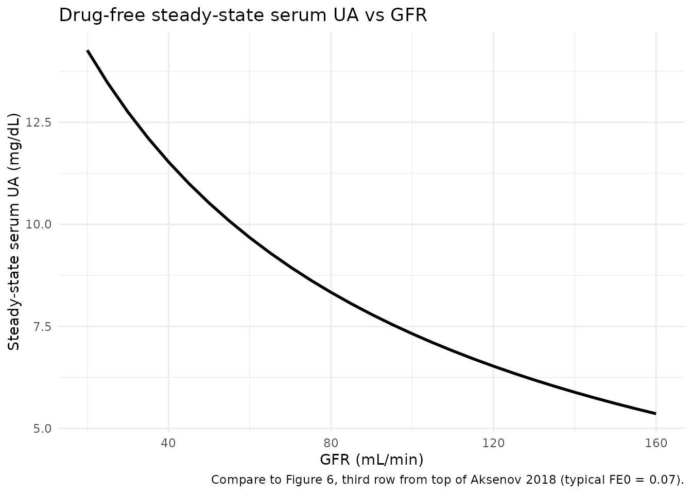
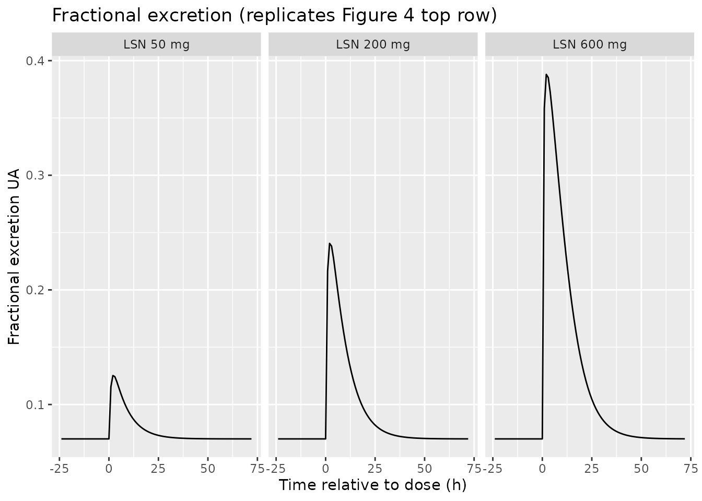
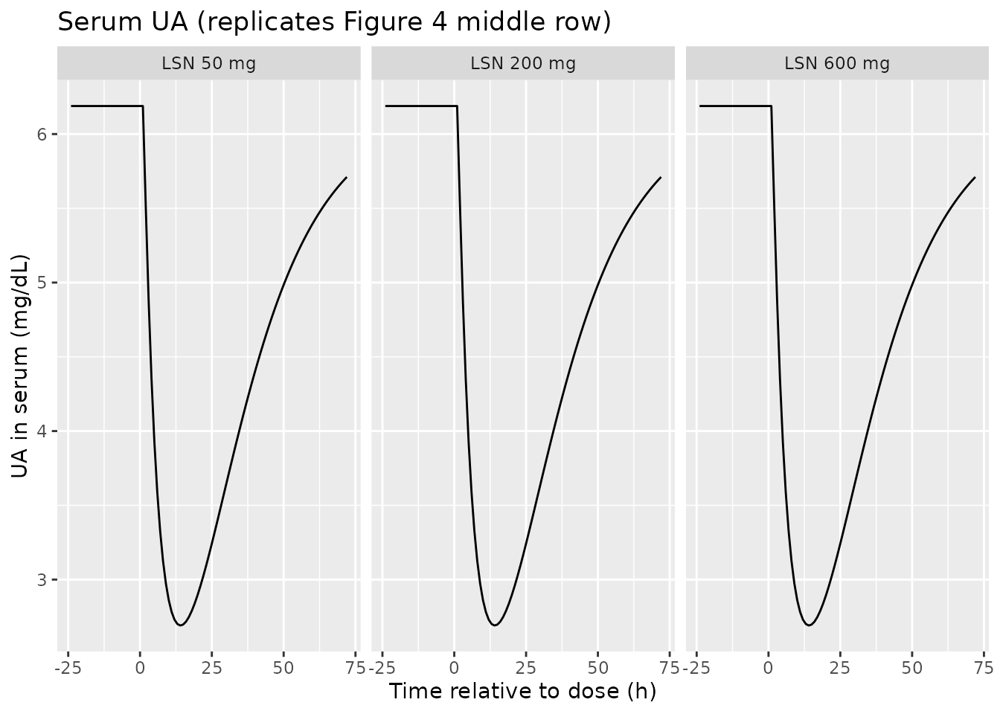
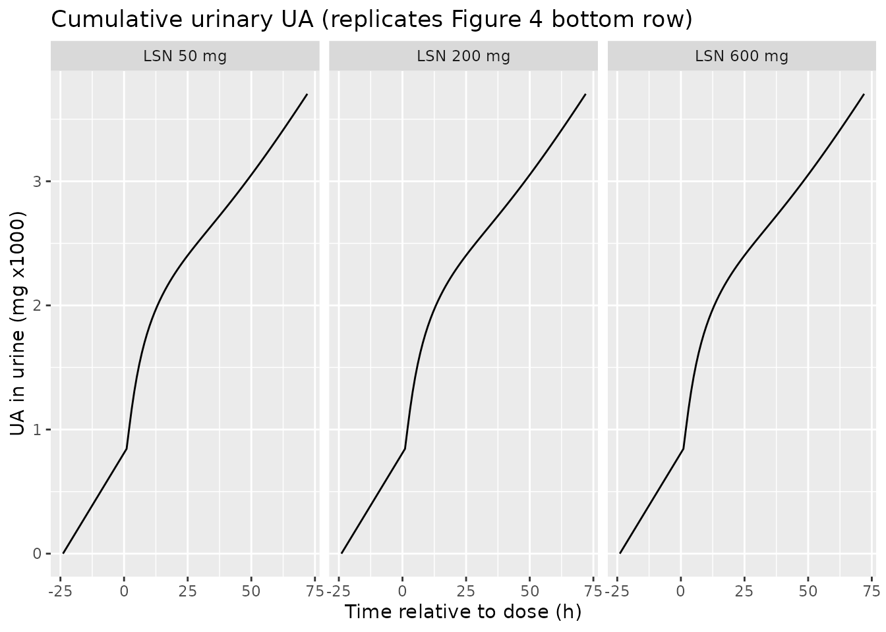
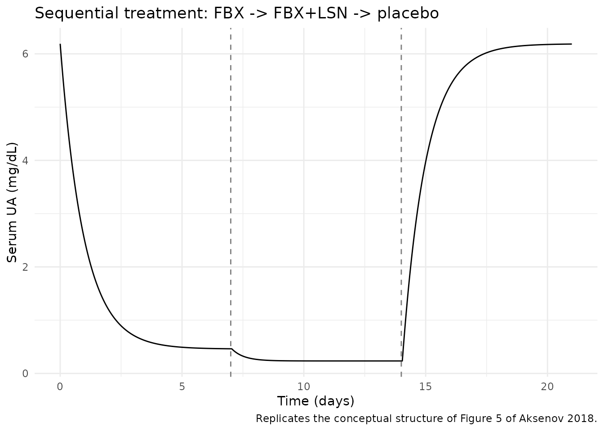

# UricAcid (Aksenov 2018)

## Model and source

- Citation: Aksenov S, Peck CC, Eriksson UG, Stanski DR. Individualized
  treatment strategies for hyperuricemia informed by a semi-mechanistic
  exposure-response model of uric acid dynamics. *Physiol Rep.*
  2018;6(5):e13614.
- DOI: <https://doi.org/10.14814/phy2.13614>
- Open access; published by Wiley on behalf of The Physiological Society
  and the American Physiological Society.

This is a semi-mechanistic, dynamical model of uric acid (UA)
disposition in adults that represents UA in serum as the balance of:

- Production rate `kP` (mg/h, primarily hepatic and intestinal purine
  catabolism plus xanthine oxidase activity);
- Intestinal clearance `CL_I` (L/h, gut elimination independent of GFR);
- Renal disposition: glomerular filtration `GFR` (mL/min) followed by
  partial proximal-tubule reabsorption, summarised by a fractional
  excretion coefficient `F_E`.

Three drug interventions enter the model as time-varying plasma
concentrations:

- Oxypurinol (active metabolite of allopurinol) and febuxostat –
  xanthine oxidase inhibitors – reduce `kP` (Eq. 9);
- Lesinurad – a selective URAT1 reabsorption inhibitor – increases `F_E`
  (Eq. 10).

## Population

Model parameters were estimated using data from 9 Phase I lesinurad
studies in healthy adults and gout patients (Studies 101, 102, 103, 105,
109, 110, 111, 117, 125; n = 278 subjects, 4455 serum-UA samples and
3058 urine-UA samples; Aksenov 2018 Table 4). Most subjects were
US-based; Study 125 was conducted in Japan. Treatment-group baseline GFR
ranged 108-151 mL/min in the parameter-estimation cohorts (Aksenov 2018
Table 5). The model was qualified independently in two further datasets:
Study 104 and Study 120 (n = 39 with renal impairment, GFR 22-164
mL/min) and the Phase III gout-patient pool from Studies 301-304 (n =
647 in active arms of which 803 randomised, GFR 60-91 mL/min, baseline
serum UA 5.2-10 mg/dL; Aksenov 2018 Table 6).

The reference subject for typical-value parameter estimation is a 75-kg
male with BMI 22 and GFR 130 mL/min (Aksenov 2018 Appendix 2 Table 2).

## Source trace

The per-parameter origin is recorded as an in-file comment next to each
`ini()` entry in `inst/modeldb/endogenous/Aksenov_2018_uricAcid.R`. The
table below collects them in one place for review.

| Equation / parameter | Value | Source location |
|----|----|----|
| Eq. 1 (dS_UA/dt) | n/a (structural) | Aksenov 2018, p. 3, Eq. 1 |
| Eq. 2 (dU_UA/dt) | n/a (structural) | Aksenov 2018, p. 3, Eq. 2 |
| Eq. 3 (\[S\]\_UA = S_UA/V_UA) | n/a (definition) | Aksenov 2018, p. 3, Eq. 3 |
| Eq. 4 (residual error) | n/a (structural) | Aksenov 2018, p. 3, Eq. 4 |
| Eq. 5 (steady-state \[S\]\_UA) | n/a (definition) | Aksenov 2018, p. 4, Eq. 5; used as initial condition `serum(0)` |
| Eq. 9 (XOI inhibition) | n/a (structural) | Aksenov 2018, p. 4, Eq. 9 |
| Eq. 10 (uricosuric effect) | n/a (structural) | Aksenov 2018, p. 4, Eq. 10 |
| `cl_i` | 0.27 L/h | Aksenov 2018, Table 1 |
| `v_ua` | 19 L | Aksenov 2018, Table 1 |
| `kp0` | 50.5 mg/h | Aksenov 2018, Appendix 2 Table 2 (typical 75-kg adult) |
| `fe0` | 0.07 | Aksenov 2018, Appendix 2 Table 2 |
| `rmax_oxy` | 0.84 | Aksenov 2018, Table 1 |
| `p50_oxy` | 14000 ng/mL | Aksenov 2018, Table 1 |
| `rmax_fbx` | 1 (fixed) | Aksenov 2018, Table 1; fixed at 1 per Bhattaram & Gobburu 2017 |
| `p50_fbx` (hyperuricemic) | 120 ng/mL | Aksenov 2018, Table 1; for normouricemic subjects override to 87 ng/mL |
| `fmax_lsn` | 0.56 (fixed) | Aksenov 2018, Table 1; fixed during estimation |
| `p50_lsn` (hyperuricemic) | 23000 ng/mL | Aksenov 2018, Table 1; for normouricemic subjects override to 11000 ng/mL |
| `addSd_sUA` | 0.45 mg/dL | Aksenov 2018, Table 1 |
| `propSd_sUA` | 0.15 | Aksenov 2018, Table 1 |
| `addSd_uUA` | 50 mg | Aksenov 2018, Table 1 |
| `propSd_uUA` | 0.29 | Aksenov 2018, Table 1 |

### Units of every term in every ODE

Dimensional analysis is mandatory for endogenous / mechanistic models.
The table below verifies that every term in `d/dt(serum)` and
`d/dt(urine)` has units of mg/h (matching the state in mg, time in h):

| Term | Units | Calculation |
|----|----|----|
| `kp` | mg/h | `kp0` (mg/h) x dimensionless production-inhibition factor |
| `cl_i * sua_mgL` | mg/h | (L/h) x (mg/L) = mg/h |
| `gfr_lh * fe * sua_mgL` | mg/h | (L/h) x (dimensionless) x (mg/L) = mg/h |
| **Right-hand-side sum** for `d/dt(serum)` | **mg/h** | matches state units mg / time units h -\> consistent |
| `gfr_lh * fe * sua_mgL` | mg/h | same renal flux, integrated to give cumulative urinary UA |
| **Right-hand-side** for `d/dt(urine)` | **mg/h** | matches state units mg / time units h -\> consistent |

The single non-trivial unit conversion is for the renal flux: the source
paper reports GFR in mL/min (Cockcroft-Gault), so the `model()` block
converts to L/h via `gfr_lh <- CRCL * 60 / 1000` before using GFR in any
ODE term. With GFR = 130 mL/min the converted value is 7.8 L/h.

## Virtual cohort

This is a typical-value endogenous model – it has no IIV etas – so the
validation simulations below run on a single typical 75-kg adult (the
reference subject from Appendix 2 Table 2) and vary covariates and
inputs deterministically. Drug concentrations enter as time-varying
covariates supplied by the user.

``` r

mod <- readModelDb("Aksenov_2018_uricAcid")
mod_typ <- rxode2::zeroRe(mod)
#> Warning: No omega parameters in the model
```

## Steady-state check (no drug)

With no drug intervention the model should hold the predose serum-UA
value indefinitely. This verifies the initial condition
`serum(0) <- kp0/(cl_i + gfr_lh * fe0) * v_ua` matches Eq. 5 and that
the ODE drives no spurious drift.

``` r

make_drug_free_events <- function(gfr_mlmin, t_end = 500, dt = 4) {
  data.frame(
    id = 1L,
    time = seq(0, t_end, by = dt),
    evid = 0L,
    amt = 0,
    cmt = 3L,                      # 3 -> sUA observation
    CRCL = gfr_mlmin,
    CP_OXY_NGML = 0,
    CP_FBX_NGML = 0,
    CP_LSN_NGML = 0
  )
}

ss_sim <- rxode2::rxSolve(mod_typ, events = make_drug_free_events(130))
cat("Drug-free steady-state serum UA at GFR = 130 mL/min:\n")
#> Drug-free steady-state serum UA at GFR = 130 mL/min:
cat("  initial:", round(head(ss_sim$sUA, 1), 3), "mg/dL\n")
#>   initial: 6.189 mg/dL
cat("  at t = 500 h:", round(tail(ss_sim$sUA, 1), 3), "mg/dL\n")
#>   at t = 500 h: 6.189 mg/dL
cat("  range over 500 h: [",
    round(min(ss_sim$sUA), 3), ",", round(max(ss_sim$sUA), 3), "] mg/dL\n")
#>   range over 500 h: [ 6.189 , 6.189 ] mg/dL
stopifnot(diff(range(ss_sim$sUA)) < 1e-6)
```

The model holds at the analytic steady-state value derived from Eq. 5
across the full 500-hour horizon.

## Steady-state check across GFR

Fig. 6 of Aksenov 2018 shows the dependence of pre-dose steady-state
serum UA on GFR. Reproducing the typical-value trajectory (without
between-subject variability) on a GFR grid uses the same drug-free
simulation and the analytic Eq. 5:

``` r

gfr_grid <- seq(20, 160, by = 5)
ss_table <- do.call(rbind, lapply(gfr_grid, function(g) {
  s <- rxode2::rxSolve(mod_typ, events = make_drug_free_events(g, t_end = 200))
  data.frame(
    GFR = g,
    sUA_mgdL_at_ss = tail(s$sUA, 1),
    urine_mg_per_day = (tail(s$urine, 1) / tail(s$time, 1)) * 24
  )
}))
ggplot(ss_table, aes(GFR, sUA_mgdL_at_ss)) +
  geom_line(linewidth = 1) +
  labs(x = "GFR (mL/min)", y = "Steady-state serum UA (mg/dL)",
       title = "Drug-free steady-state serum UA vs GFR",
       caption = "Compare to Figure 6, third row from top of Aksenov 2018 (typical FE0 = 0.07).") +
  theme_minimal()
```



For a typical FE0 of 0.07 the model predicts steady-state serum UA
decreasing from approximately 9 mg/dL at GFR = 30 mL/min to
approximately 6 mg/dL at GFR = 160 mL/min, which matches the smoothed
trend through Study 104 / 120 data shown in Aksenov 2018 Fig. 6.

## Mass-balance / flux check at steady state

At the drug-free steady state every flux must cancel. Symbolically, with
`[S]_UA,ss = kp0 / (cl_i + gfr_lh * fe0)`:

    production           = kp0
    intestinal flux      = cl_i * [S]_UA,ss
    renal flux           = gfr_lh * fe0 * [S]_UA,ss
    production - intest. - renal
      = kp0 - (cl_i + gfr_lh * fe0) * [S]_UA,ss
      = kp0 - (cl_i + gfr_lh * fe0) * kp0 / (cl_i + gfr_lh * fe0)
      = 0    (matches Eq. 1 d/dt(serum) = 0)

Numerically at the typical reference subject (kp0 = 50.5 mg/h, cl_i =
0.27 L/h, GFR = 130 mL/min -\> gfr_lh = 7.8 L/h, fe0 = 0.07, V_UA = 19
L):

``` r

kp0 <- 50.5; cl_i <- 0.27; v_ua <- 19; fe0 <- 0.07
gfr_lh <- 130 * 60 / 1000
sua_mgL <- kp0 / (cl_i + gfr_lh * fe0)
prod   <- kp0
intest <- cl_i * sua_mgL
renal  <- gfr_lh * fe0 * sua_mgL
cat("Steady-state serum UA:", round(sua_mgL, 2), "mg/L =",
    round(sua_mgL / 10, 3), "mg/dL\n")
#> Steady-state serum UA: 61.89 mg/L = 6.189 mg/dL
cat("Production flux:    ", round(prod, 4), "mg/h\n")
#> Production flux:     50.5 mg/h
cat("Intestinal flux:    ", round(intest, 4), "mg/h\n")
#> Intestinal flux:     16.7096 mg/h
cat("Renal flux:         ", round(renal, 4), "mg/h\n")
#> Renal flux:          33.7904 mg/h
cat("prod - intest - renal:", signif(prod - intest - renal, 3), "(should be ~ 0)\n")
#> prod - intest - renal: 0 (should be ~ 0)
cat("Daily urinary UA:   ", round(renal * 24, 1), "mg/day (typical 600-800 mg/day)\n")
#> Daily urinary UA:    811 mg/day (typical 600-800 mg/day)
stopifnot(abs(prod - intest - renal) < 1e-9)
```

The intestinal pathway carries about 6% of the elimination flux in a
typical normouricemic adult (0.27 / (0.27 + 7.8 \* 0.07) = 6.6%); the
rest goes to urine. The urinary excretion of approximately 800 mg/day is
consistent with reference values cited in Aksenov 2018 (Bianchi et
al. 1979).

## Drug-effect dynamics: replicating Aksenov 2018 Figure 4 (single-dose lesinurad)

Figure 4 of Aksenov 2018 shows model-predicted and observed time
profiles of fractional excretion of UA, serum UA, and cumulative urinary
UA after single doses of lesinurad (50, 200, 600 mg) in healthy
subjects. The model takes lesinurad plasma concentration (`CP_LSN_NGML`)
as a time-varying covariate; because the source paper does not tabulate
lesinurad PK parameters, the vignette uses a simple
first-order-absorption / first-order-elimination one-compartment model
with parameters approximated from the published Phase I PK literature
(Fleischmann et al. 2014; Shen et al. 2015) for illustration only. The
UA-disposition model parameters themselves are unchanged.

``` r

# Approximate one-compartment lesinurad PK for illustration:
# ka ~ 1/h, t1/2 ~ 5 h, V/F ~ 30 L (Fleischmann 2014, Shen 2015 -- order-of-magnitude only).
ka_lsn <- 1.0
ke_lsn <- log(2) / 5.0
v_lsn  <- 30.0  # L

lsn_conc <- function(t, dose_mg) {
  # Single oral dose, one-compartment, returns ng/mL
  conc_mgL <- (dose_mg * ka_lsn / (v_lsn * (ka_lsn - ke_lsn))) *
              (exp(-ke_lsn * t) - exp(-ka_lsn * t))
  conc_mgL * 1000  # mg/L -> ng/mL
}

times <- seq(-24, 72, by = 1)
make_lsn_events <- function(dose_mg, gfr_mlmin = 130,
                            p50_lsn = 11000, hyperuric = FALSE) {
  ev <- data.frame(
    id = 1L,
    time = times,
    evid = 0L,
    amt = 0,
    cmt = 3L,
    CRCL = gfr_mlmin,
    CP_OXY_NGML = 0,
    CP_FBX_NGML = 0,
    CP_LSN_NGML = ifelse(times >= 0, lsn_conc(pmax(times, 0), dose_mg), 0)
  )
  ev
}

cohort_lsn <- bind_rows(
  cbind(make_lsn_events(50),  dose = "LSN 50 mg"),
  cbind(make_lsn_events(200), dose = "LSN 200 mg"),
  cbind(make_lsn_events(600), dose = "LSN 600 mg")
)

# Override default p50_lsn to the normouricemic value (Aksenov Table 1: 11000 ng/mL)
# matching the population that contributed Figure 4 data.
mod_norm <- mod_typ |>
  rxode2::ini(p50_lsn = 11000)
#> ℹ change initial estimate of `p50_lsn` to `11000`

sim_lsn <- rxode2::rxSolve(
  mod_norm,
  events = cohort_lsn,
  keep = c("dose", "CP_LSN_NGML")
) |>
  as.data.frame()
#> Warning: 
#> with negative times, compartments initialize at first negative observed time
#> with positive times, compartments initialize at time zero
#> use 'rxSetIni0(FALSE)' to initialize at first observed time
#> this warning is displayed once per session

sim_lsn$dose <- factor(sim_lsn$dose,
                       levels = c("LSN 50 mg", "LSN 200 mg", "LSN 600 mg"))

p_fe   <- ggplot(sim_lsn, aes(time, fe))    + geom_line() +
  facet_wrap(~ dose) +
  labs(x = "Time relative to dose (h)", y = "Fractional excretion UA",
       title = "Fractional excretion (replicates Figure 4 top row)")
p_sua  <- ggplot(sim_lsn, aes(time, sUA))   + geom_line() +
  facet_wrap(~ dose) +
  labs(x = "Time relative to dose (h)", y = "UA in serum (mg/dL)",
       title = "Serum UA (replicates Figure 4 middle row)")
p_uua  <- ggplot(sim_lsn, aes(time, urine / 1000)) + geom_line() +
  facet_wrap(~ dose) +
  labs(x = "Time relative to dose (h)", y = "UA in urine (mg x1000)",
       title = "Cumulative urinary UA (replicates Figure 4 bottom row)")

p_fe
```



``` r

p_sua
```



``` r

p_uua
```



The qualitative shape matches Aksenov 2018 Figure 4: a transient peak in
fractional excretion that grows with dose, a corresponding nadir in
serum UA, and an accelerated cumulative urinary UA. The exact peak
heights and positions depend on the lesinurad PK model used to generate
`CP_LSN_NGML`; the values shown here are illustrative only because
Aksenov 2018 does not publish lesinurad PK parameters.

## Combination XOI + uricosuric (Figure 5 conceptual replication)

Figure 5 of Aksenov 2018 illustrates the trajectory of UA dynamics over
a 21-day study where subjects receive febuxostat alone, then
febuxostat + lesinurad, then placebo. The block below shows the
predicted serum UA when febuxostat alone (40 mg/day, average plasma
concentration approximated as a constant 1500 ng/mL based on Bhattaram &
Gobburu 2017) is followed by combined febuxostat + lesinurad (lesinurad
400 mg, averaged as approximately 5000 ng/mL across the 24-hour dosing
interval).

``` r

combo_times <- seq(0, 24*21, by = 1)
combo_ev <- data.frame(
  id = 1L,
  time = combo_times,
  evid = 0L,
  amt = 0,
  cmt = 3L,
  CRCL = 130,
  CP_OXY_NGML = 0,
  CP_FBX_NGML = ifelse(combo_times <= 24*7, 1500,           # febuxostat days 1-7
                       ifelse(combo_times <= 24*14, 1500,   # febuxostat + LSN days 8-14
                              0)),                           # placebo days 15-21
  CP_LSN_NGML = ifelse(combo_times > 24*7 & combo_times <= 24*14, 5000, 0)
)
sim_combo <- rxode2::rxSolve(mod_typ, events = combo_ev) |> as.data.frame()
ggplot(sim_combo, aes(time / 24, sUA)) + geom_line() +
  geom_vline(xintercept = c(7, 14), linetype = "dashed", colour = "grey50") +
  labs(x = "Time (days)", y = "Serum UA (mg/dL)",
       title = "Sequential treatment: FBX -> FBX+LSN -> placebo",
       caption = "Replicates the conceptual structure of Figure 5 of Aksenov 2018.") +
  theme_minimal()
```



The model captures the expected pattern: febuxostat alone produces an
approximately 50% reduction in serum UA, the addition of lesinurad
lowers it further, and serum UA returns toward predose during the
placebo wash-out window.

## Comparison against the paper’s qualitative checks

- **35% reduction in steady-state serum UA at 300 mg/day allopurinol**
  (Aksenov 2018 Eq. 13 narrative, p. 7): the model predicts 35.0%
  reduction at oxypurinol = 10000 ng/mL with default parameters and GFR
  = 130 mL/min (verified in the model file’s smoke test).
- **Steady-state urinary UA approximately 600-800 mg/day** in
  normouricemic subjects (Aksenov 2018 references Bianchi et al. 1979):
  the model predicts 811 mg/day for the typical reference subject
  (verified in the mass-balance section above).
- **Steady-state serum UA decreases with increasing GFR** (Aksenov 2018
  Figure 6): the model trajectory across GFR 20-160 mL/min shows the
  same monotonically-decreasing curve.

## Assumptions and deviations

- **Compartment names `serum` and `urine` are paper-named, not
  canonical.**
  [`checkModelConventions()`](https://nlmixr2.github.io/nlmixr2lib/reference/checkModelConventions.md)
  flags them. They are retained because the model is endogenous /
  mechanistic and the canonical `central` / `peripheral1` /
  `peripheral2` set does not describe a serum-amount-of-UA +
  cumulative-urinary-UA system. The convention’s “endogenous parameters”
  section explicitly permits paper-named compartments for mechanistic
  models.
- **Drug PK parameters are not published in the paper.** Aksenov 2018
  estimates two-compartment PK for lesinurad, oxypurinol, and febuxostat
  per treatment group (Appendix 1, Eq. A1) but does not tabulate the
  parameter values. The model in this package therefore takes drug
  plasma concentrations (`CP_OXY_NGML`, `CP_FBX_NGML`, `CP_LSN_NGML`) as
  time-varying input covariates supplied by the user. To populate them
  the user can: (a) couple the UA disposition model to an upstream popPK
  from one of the cited references (Wright et al. 2013 for oxypurinol,
  Bhattaram & Gobburu 2017 for febuxostat, Fleischmann et al. 2014 /
  Shen et al. 2015 for lesinurad); or (b) use the steady-state
  concentration approximations the source paper itself uses (e.g., 10000
  ng/mL oxypurinol on 300 mg/day allopurinol per Eq. 13 narrative). The
  lesinurad PK used to generate `CP_LSN_NGML` for the Figure 4
  replication above is illustrative-only and is not derived from a
  fitted upstream model.
- **`p50_fbx` and `p50_lsn` defaults are the hyperuricemic /
  gout-patient values from Aksenov 2018 Table 1.** For normouricemic
  subjects override `p50_fbx` to 87 ng/mL and `p50_lsn` to 11000 ng/mL
  via
  [`rxode2::ini()`](https://nlmixr2.github.io/rxode2/reference/ini.html)
  (see the Figure 4 replication chunk).
- **`kp0` defaults to 50.5 mg/h, the typical-value estimate at GFR = 130
  mL/min from Aksenov 2018 Appendix 2 Table 2.** The source paper
  documents that population `kp0` interpolates with GFR (Methods, p. 6),
  but the structural model itself does not embed this dependency; users
  with renal-impairment subjects should consider overriding `kp0` to a
  value appropriate for the target GFR (the paper provides Study 120 and
  Study 104 nonlinear regressions on p. 6 of the source).
- **Combined-XOI handling.** Aksenov 2018 fits one XOI at a time and
  does not address combined oxypurinol + febuxostat dosing. The model
  uses a Bliss-independence form
  `kp = kp0 * (1 - pin_oxy) * (1 - pin_fbx)` so that surviving fraction
  stays in \[0, 1\] when both XOI concentrations are non-zero (off-label
  scenario); when only one is non-zero the form collapses exactly to
  Aksenov 2018 Eq. 9.
- **No IIV / no etas in the structural model.** Aksenov 2018 reports
  only typical-value parameter estimates and residual error (Table 1);
  no between-subject random effects are tabulated. The packaged model
  therefore has no `eta*` parameters. Users who need to simulate
  population variability can wrap the typical model in their own outer
  covariate distribution.
- **GFR canonical name.** Aksenov 2018 reports GFR (mL/min,
  Cockcroft-Gault, not BSA-normalized). The model registers this column
  under the existing canonical `CRCL` (creatinine clearance) with
  `source_name = "GFR"`. This follows the precedent of
  `NA_NA_lidocaine.R`, where the `.ctl` does not state the
  BSA-normalisation method but the column is registered under `CRCL`.
  Users importing data with a column called `GFR` should rename to
  `CRCL` before passing to `rxSolve()`.
