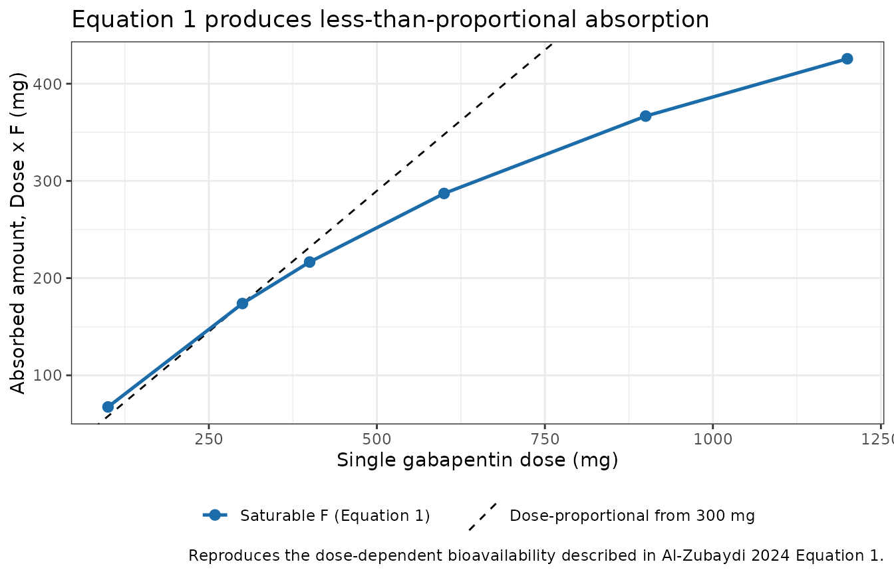
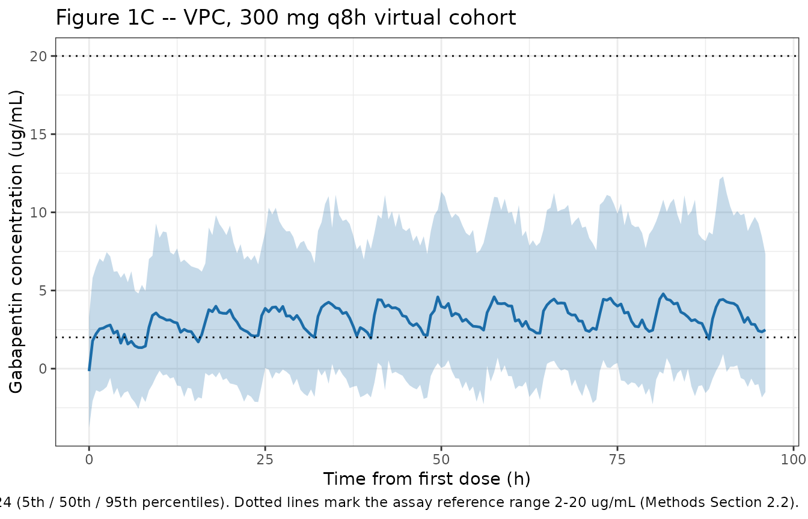
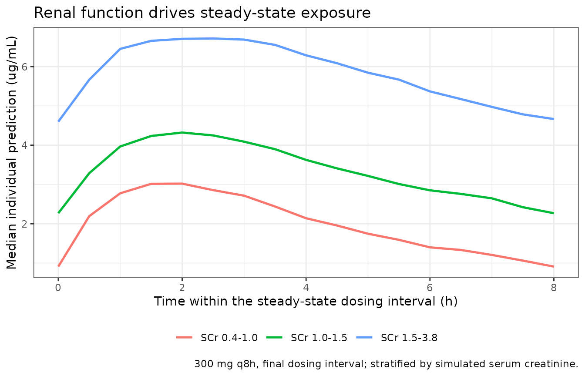

# Gabapentin (AlZubaydi 2024)

## Model and source

- Citation: Al-Zubaydi F, Wassef A, Kagan L, Brunetti L. Development of
  a Population Pharmacokinetic Gabapentin Model Leveraging Therapeutic
  Drug Monitoring Concentrations. Pharmaceutics. 2024;16(12):1514.
  <doi:10.3390/pharmaceutics16121514>
- Description: One-compartment population PK model for gabapentin in
  hospitalized adults developed from therapeutic drug monitoring
  concentrations, with first-order absorption (ka fixed), saturable
  dose-dependent bioavailability, linear elimination, and serum
  creatinine on clearance
- Article: <https://doi.org/10.3390/pharmaceutics16121514>
- Supplement (Tables S1, S2):
  <https://www.mdpi.com/article/10.3390/pharmaceutics16121514/s1>

Al-Zubaydi and colleagues built a gabapentin population PK model
entirely from **routine therapeutic drug monitoring (TDM)
concentrations** drawn during inpatient care, rather than from a
prospectively sampled PK study. That design choice drives most of the
model’s shape: with few absorption-phase samples, `ka` had to be fixed
to a literature value, and the saturable bioavailability constants were
fixed to a previously published model. What the data *could* support was
the disposition and its covariate dependence, and the headline result is
that **serum creatinine on clearance** is the single retained covariate
– while diabetes and every body-size metric were rejected.

## Population

The model was fit to 82 hospitalized adults at Robert Wood Johnson
University Hospital Somerset (New Jersey, USA) who received at least one
oral gabapentin dose and had at least one subsequent serum
concentration, collected retrospectively between 1 January 2009 and 7
December 2023 (Methods Section 2.1). Of 123 TDM concentrations available
from 108 screened patients, the 82 who met the inclusion criteria
contributed to the model; the paper does not report how many
concentrations those 82 patients supplied (Results Section 3.1).

The cohort is elderly and renally heterogeneous: age 65.7 +/- 16.4 years
(range 22-93), serum creatinine 1.3 +/- 1.0 mg/dL (range 0.4-3.8)
against a laboratory reference interval of 0.66-1.25 mg/dL, MDRD eGFR
71.0 +/- 42.4 mL/min/1.73 m^2 (range 16.0-127), and 21.9% with acute
kidney injury within 48 h of sampling. It is also heavy: weight 84.3 +/-
25.9 kg (range 44.2-195.0), BMI 30.0 +/- 7.9 kg/m^2, 22.0% obese, and
31.7% with type 2 diabetes. 62.2% were female and 89.0% White. Single
doses ranged 100-1200 mg (median 300 mg) and total daily doses 100-2700
mg (median 900 mg). Baseline demographics are Table 1 of the source.

``` r

str(ui$population)
#> List of 14
#>  $ species       : chr "human"
#>  $ n_subjects    : num 82
#>  $ n_studies     : num 1
#>  $ age_range     : chr "22-93 years"
#>  $ age_mean      : chr "65.7 years"
#>  $ weight_range  : chr "44.2-195.0 kg"
#>  $ weight_mean   : chr "84.3 kg"
#>  $ sex_female_pct: num 62.2
#>  $ race_ethnicity: Named num [1:4] 89 7.3 2.4 1.2
#>   ..- attr(*, "names")= chr [1:4] "White" "Black" "Other" "Asian"
#>  $ disease_state : chr "Hospitalized adults receiving oral gabapentin; the medical indication was not recorded in the dataset and the a"| __truncated__
#>  $ renal_function: chr "Serum creatinine 1.3 +/- 1.0 mg/dL (range 0.4-3.8); MDRD eGFR 71.0 +/- 42.4 mL/min/1.73 m^2 (range 16.0-127); C"| __truncated__
#>  $ dose_range    : chr "Single oral dose 100-1200 mg (median 300 mg); total daily dose 100-2700 mg (median 900 mg)"
#>  $ regions       : chr "United States (New Jersey)"
#>  $ notes         : chr "Retrospective therapeutic drug monitoring cohort, Robert Wood Johnson University Hospital Somerset, 1 January 2"| __truncated__
```

## Source trace

Per-parameter provenance is recorded as an in-file comment beside each
`ini()` entry in
`inst/modeldb/specificDrugs/AlZubaydi_2024_gabapentin.R`. Collected here
for review:

| Equation / parameter | Value | Source location |
|----|----|----|
| `lka` (ka) | 0.778 1/h, **fixed** | Table 2 (“0.778 (fixed)”); Methods Section 2.3 fixes it per refs 16 and 32; Table S1 repeats it in every column |
| `lcl` (Cl) | 5.73 L/h (RSE 17.62%) | Table 2; bootstrap median 7.01, 95% CI 4.3-12.54 |
| `lvc` (Vd) | 44.61 L (RSE 15.94%) | Table 2; bootstrap median 45.99, 95% CI 32.84-65.91 |
| `e_creat_cl` (beta Cl_SCR) | -0.89 (RSE 16.94%) | Table 2; bootstrap median -1.12, 95% CI -1.66 to -0.58 |
| `ldmax_fdepot` (Dmax) | 823, **fixed** | Equation 1 text, fixed to Carlsson 2009 (ref 20); Table S1 “823 (fixed)” |
| `ld50_fdepot` (D50) | 1120, **fixed** | Equation 1 text, fixed to Carlsson 2009 (ref 20); Table S1 “1120 (fixed)” |
| `etalcl` | 0.0784 variance (= 0.28^2) | Table 2 omega Cl = 0.28 **SD** (footnote “omega: standard deviation”) |
| `etalvc` | 0.5929 variance (= 0.77^2) | Table 2 omega Vd = 0.77 **SD** (same footnote) |
| `addSd` | 2.03 ug/mL | Table 2 a = 2.03 (RSE 17.5%); “a: constant error model” |
| `F = Dmax / (D50 + Dose)` | n/a | Equation 1 (page 4) |
| `cl = cl_pop * (CREAT / 1.3)^beta` | n/a | Methods Section 2.3 (“log-transformed and centered using mean values”) x Table 1 mean SCr 1.3 mg/dL |
| `d/dt(depot)`, `d/dt(central)` | n/a | One-compartment, first-order absorption, no lag, linear elimination (Results Section 3.2; Table S1 selected column) |
| Structural model selection | -2LL 496.44 | Table S1 (“1st-order absorption with no Tlag and nonlinear F”) |
| Covariate selection | -2LL 452.85, delta -43.59 | Table S2 model 1 (SCr on Cl) |

Two encoding decisions are worth spelling out, because both are places a
reader could reasonably have guessed differently.

**MONOLIX omegas are standard deviations, not variances.** The Table 2
footnote states this explicitly (“omega: standard deviation”), and Table
S1 repeats it. nlmixr2’s `ini()` takes variances, so the packaged values
are the published omegas squared: 0.28 -\> 0.0784 (about 28.6% CV) and
0.77 -\> 0.5929 (about 90% CV). Carrying the SDs through unsquared would
have understated Vd variability roughly three-fold.

**The dose in Equation 1 is the per-administration amount, supplied by
`podo(depot)`.** The model reads the dose being administered directly
from the event record rather than from a separate dose covariate column,
so the saturable-bioavailability nonlinearity follows any regimen
automatically and cannot be silently lost when a simulation changes the
dose.

``` r

ui$modelDesc
#> [1] "rxode2-based free-form 2-cmt ODE model"
```

## Virtual cohort

Original observed data are not publicly available (Data Availability
Statement offers them on request). Simulations below use virtual cohorts
whose serum creatinine distribution approximates Table 1.

Serum creatinine is drawn from a **lognormal** matched to the Table 1
mean (1.3 mg/dL) and SD (1.0), then truncated to the reported range
0.4-3.8 mg/dL. A normal distribution with those moments would place mass
below zero, so a lognormal is the minimal defensible choice; the paper
reports only the mean, SD and range, not the shape.

``` r

set.seed(20241125)

n_per_arm <- 200L

# Lognormal matched to mean 1.3, SD 1.0 (CV = 1.0 / 1.3), truncated to Table 1's range.
scr_cv <- 1.0 / 1.3
scr_s  <- sqrt(log(1 + scr_cv^2))
scr_mu <- log(1.3) - scr_s^2 / 2

draw_scr <- function(n) {
  x <- numeric(0)
  while (length(x) < n) {
    cand <- rlnorm(n * 3L, scr_mu, scr_s)
    x <- c(x, cand[cand >= 0.4 & cand <= 3.8])
  }
  x[seq_len(n)]
}

scr <- draw_scr(n_per_arm)
c(mean = mean(scr), sd = sd(scr), min = min(scr), max = max(scr))
#>      mean        sd       min       max 
#> 1.3234427 0.7596480 0.4048063 3.7987168
```

The realized cohort mean and SD sit slightly below the Table 1 moments
because truncation at 3.8 mg/dL removes the upper tail; this is reported
rather than corrected, since the truncation bounds are themselves the
paper’s data.

``` r

# Build one arm: q8h oral dosing to steady state, observations on `central`
# (the ODE state) so rxode2 returns the algebraic observable Cc at those rows.
make_arm <- function(scr, dose, tau, n_doses, t_end, by = 0.5, id_offset = 0L) {
  ids <- id_offset + seq_along(scr)
  subj <- tibble(id = ids, CREAT = scr)

  doses <- subj |>
    tidyr::crossing(time = seq(0, by = tau, length.out = n_doses)) |>
    mutate(amt = dose, evid = 1L, cmt = "depot")

  obs <- subj |>
    tidyr::crossing(time = seq(0, t_end, by = by)) |>
    mutate(amt = NA_real_, evid = 0L, cmt = "central")

  bind_rows(doses, obs) |>
    arrange(id, time, desc(evid))
}

# Median regimen in the cohort: 300 mg q8h (= 900 mg/day, the Table 1 median TDD)
events_ss <- make_arm(scr, dose = 300, tau = 8, n_doses = 12L, t_end = 96)

stopifnot(!anyDuplicated(unique(events_ss[, c("id", "time", "evid")])))
nrow(events_ss)
#> [1] 41000
```

## Simulation

``` r

mod <- readModelDb("AlZubaydi_2024_gabapentin")

sim_ss <- rxode2::rxSolve(mod, events = events_ss, keep = c("CREAT")) |>
  as.data.frame()

# Sanity: IIV is active (one distinct Cl and Vd per subject).
c(n_subjects = dplyr::n_distinct(sim_ss$id),
  n_distinct_cl = dplyr::n_distinct(round(sim_ss$cl, 8)),
  n_distinct_vc = dplyr::n_distinct(round(sim_ss$vc, 8)))
#>    n_subjects n_distinct_cl n_distinct_vc 
#>           200           200           200
```

Typical-value (deterministic) profiles are built by supplying zero eta
columns and `omega = NA`, rather than with
[`rxode2::zeroRe()`](https://nlmixr2.github.io/rxode2/reference/zeroRe.html)
– `zeroRe()` mutates shared model state, which would silently strip IIV
from `mod` for every subsequent chunk in this vignette.

``` r

solve_typical <- function(mod, dose, creat = 1.3, tau = NULL, n_doses = 1L,
                          t_end = 48, by = 0.25) {
  dose_times <- if (is.null(tau)) 0 else seq(0, by = tau, length.out = n_doses)
  ev <- bind_rows(
    tibble(time = dose_times, amt = dose, evid = 1L, cmt = "depot"),
    tibble(time = seq(0, t_end, by = by), amt = NA_real_, evid = 0L, cmt = "central")
  ) |>
    mutate(id = 1L, CREAT = creat, etalcl = 0, etalvc = 0) |>
    arrange(time, desc(evid))
  rxode2::rxSolve(mod, ev, omega = NA, returnType = "data.frame")
}

typ_single <- solve_typical(mod, dose = 300, t_end = 48)
typ_ss     <- solve_typical(mod, dose = 300, tau = 8, n_doses = 12L, t_end = 96)

# The typical-value solve must reproduce Table 2 exactly at the SCr reference.
stopifnot(
  isTRUE(all.equal(unique(typ_single$cl), 5.73,  tolerance = 1e-8)),
  isTRUE(all.equal(unique(typ_single$vc), 44.61, tolerance = 1e-8)),
  isTRUE(all.equal(unique(typ_single$ka), 0.778, tolerance = 1e-8))
)
```

## Validation gates

### Gate 1 – saturable bioavailability and mass balance

Equation 1 gives `F = 823 / (1120 + Dose)`. The amount actually
delivered into `depot` at a dose event must equal `Dose x F` exactly.

``` r

f_expected <- function(dose) 823 / (1120 + dose)

mb <- lapply(c(100, 300, 400, 600, 900, 1200), function(dz) {
  r <- solve_typical(mod, dose = dz, t_end = 24, by = 0.5)
  tibble(
    dose        = dz,
    F_model     = unique(r$fdepot),
    F_equation1 = f_expected(dz),
    depot_t0    = r$depot[r$time == 0][1],
    expected_t0 = dz * f_expected(dz)
  )
}) |>
  bind_rows() |>
  mutate(absorbed_mg = dose * F_model)

stopifnot(
  isTRUE(all.equal(mb$F_model,  mb$F_equation1, tolerance = 1e-10)),
  isTRUE(all.equal(mb$depot_t0, mb$expected_t0, tolerance = 1e-8))
)

mb |>
  select(dose, F_model, absorbed_mg) |>
  mutate(across(c(F_model, absorbed_mg), \(x) round(x, 4))) |>
  dplyr::rename(
    "Single dose (mg)"     = dose,
    "F (Equation 1)"       = F_model,
    "Absorbed amount (mg)" = absorbed_mg
  ) |>
  knitr::kable(caption = "Gate 1: saturable bioavailability reproduces Equation 1 exactly, and the amount delivered to `depot` equals Dose x F.")
```

| Single dose (mg) | F (Equation 1) | Absorbed amount (mg) |
|-----------------:|---------------:|---------------------:|
|              100 |         0.6746 |              67.4590 |
|              300 |         0.5796 |             173.8732 |
|              400 |         0.5414 |             216.5789 |
|              600 |         0.4785 |             287.0930 |
|              900 |         0.4074 |             366.6832 |
|             1200 |         0.3547 |             425.6897 |

Gate 1: saturable bioavailability reproduces Equation 1 exactly, and the
amount delivered to `depot` equals Dose x F. {.table}

At the cohort median 300 mg single dose, `F = 0.580`. That is an
independent plausibility check on the units question discussed in Errata
below: gabapentin’s absolute bioavailability is roughly 60% at low
doses, which the mg reading reproduces. `F` then falls monotonically
with dose (0.675 at 100 mg to 0.355 at 1200 mg), which is the paper’s
stated behavior – concentrations are dose-proportional over 300-400 mg
q8h but less than proportional above 600 mg q8h (Introduction).

``` r

mb |>
  ggplot(aes(dose, absorbed_mg)) +
  geom_abline(aes(intercept = 0, slope = f_expected(300), linetype = "Dose-proportional from 300 mg")) +
  geom_line(aes(colour = "Saturable F (Equation 1)"), linewidth = 0.9) +
  geom_point(aes(colour = "Saturable F (Equation 1)"), size = 2.4) +
  scale_colour_manual(values = c("Saturable F (Equation 1)" = "#1b6ca8")) +
  scale_linetype_manual(values = c("Dose-proportional from 300 mg" = "dashed")) +
  labs(
    x = "Single gabapentin dose (mg)", y = "Absorbed amount, Dose x F (mg)",
    colour = NULL, linetype = NULL,
    title = "Equation 1 produces less-than-proportional absorption",
    caption = "Reproduces the dose-dependent bioavailability described in Al-Zubaydi 2024 Equation 1."
  ) +
  theme_bw() +
  theme(legend.position = "bottom")
```



### Gate 2 – closed-form disposition

For a one-compartment first-order-absorption model the typical-value
profile has analytic Tmax, Cmax and AUC. The simulation must match them.

``` r

ka <- 0.778; cl <- 5.73; vc <- 44.61
kel <- cl / vc
fd_300 <- f_expected(300)
amt_abs <- 300 * fd_300

tmax_a  <- log(ka / kel) / (ka - kel)
thalf_a <- log(2) / kel
cmax_a  <- (amt_abs * ka) / (vc * (ka - kel)) *
  (exp(-kel * tmax_a) - exp(-ka * tmax_a))
auc_a   <- amt_abs / cl

tmax_sim <- typ_single$time[which.max(typ_single$Cc)]
cmax_sim <- max(typ_single$Cc)

closed <- tibble(
  Quantity  = c("Tmax (h)", "Cmax (ug/mL)"),
  Analytic  = c(tmax_a, cmax_a),
  Simulated = c(tmax_sim, cmax_sim)
) |>
  mutate(`Difference (%)` = 100 * (Simulated - Analytic) / Analytic)

# Cmax must agree to better than 0.1%; Tmax to within one grid step (0.25 h).
stopifnot(
  abs(cmax_sim - cmax_a) / cmax_a < 0.001,
  abs(tmax_sim - tmax_a) <= 0.25
)

closed |>
  mutate(across(where(is.numeric), \(x) round(x, 4))) |>
  knitr::kable(caption = "Gate 2: analytic vs simulated typical-value disposition (300 mg single dose, SCr = 1.3 mg/dL). t1/2 and AUCinf are validated independently against PKNCA in Gates 4 and 5.")
```

| Quantity     | Analytic | Simulated | Difference (%) |
|:-------------|---------:|----------:|---------------:|
| Tmax (h)     |   2.7730 |    2.7500 |        -0.8295 |
| Cmax (ug/mL) |   2.7297 |    2.7296 |        -0.0027 |

Gate 2: analytic vs simulated typical-value disposition (300 mg single
dose, SCr = 1.3 mg/dL). t1/2 and AUCinf are validated independently
against PKNCA in Gates 4 and 5. {.table}

### Gate 3 – the serum creatinine covariate

`e_creat_cl = -0.89` on a mean-centered log scale means clearance scales
as `(SCr / 1.3)^-0.89`. Across the observed SCr range the model spans a
roughly 7-fold clearance range.

``` r

scr_grid <- c(0.4, 0.66, 1.25, 1.3, 2.0, 3.8)

cov_tab <- lapply(scr_grid, function(sc) {
  r <- solve_typical(mod, dose = 300, creat = sc, t_end = 24, by = 0.5)
  tibble(
    CREAT      = sc,
    cl_model   = unique(r$cl),
    cl_formula = 5.73 * (sc / 1.3)^(-0.89)
  )
}) |>
  bind_rows() |>
  mutate(thalf_h = log(2) / (cl_model / 44.61))

stopifnot(isTRUE(all.equal(cov_tab$cl_model, cov_tab$cl_formula, tolerance = 1e-8)))

cov_tab |>
  mutate(across(c(cl_model, thalf_h), \(x) round(x, 3))) |>
  select(CREAT, cl_model, thalf_h) |>
  dplyr::rename(
    "Serum creatinine (mg/dL)" = CREAT,
    "Cl (L/h)"                 = cl_model,
    "t1/2 (h)"                 = thalf_h
  ) |>
  knitr::kable(caption = "Gate 3: clearance and half-life across the observed serum creatinine range (Table 1: 0.4-3.8 mg/dL; laboratory reference 0.66-1.25).")
```

| Serum creatinine (mg/dL) | Cl (L/h) | t1/2 (h) |
|-------------------------:|---------:|---------:|
|                     0.40 |   16.358 |    1.890 |
|                     0.66 |   10.475 |    2.952 |
|                     1.25 |    5.934 |    5.211 |
|                     1.30 |    5.730 |    5.396 |
|                     2.00 |    3.905 |    7.918 |
|                     3.80 |    2.206 |   14.018 |

Gate 3: clearance and half-life across the observed serum creatinine
range (Table 1: 0.4-3.8 mg/dL; laboratory reference 0.66-1.25). {.table}

The direction and magnitude are consistent with the label guidance the
paper cites: a patient at SCr 3.8 mg/dL clears gabapentin at 2.21 L/h
versus 5.73 L/h at the cohort mean – a 61% reduction, matching the
recommendation of a greater-than-50% dose reduction below CrCl 60 mL/min
(Discussion).

## Replicate published figures

Figure 1C of the source is a visual predictive check of concentration
against time from the first recorded dose. The paper’s own figure is
built on the observed TDM sampling times; here the same percentiles are
shown for a 300 mg q8h virtual cohort. Percentiles are taken from `sim`
(which carries the additive residual error) rather than `Cc` (the
individual prediction), matching what a VPC displays.

``` r

# rxSolve returns observation records only, and carries no `evid` column.
sim_ss |>
  filter(!is.na(Cc)) |>
  group_by(time) |>
  summarise(
    Q05 = quantile(sim, 0.05, na.rm = TRUE),
    Q50 = quantile(sim, 0.50, na.rm = TRUE),
    Q95 = quantile(sim, 0.95, na.rm = TRUE),
    .groups = "drop"
  ) |>
  ggplot(aes(time, Q50)) +
  geom_ribbon(aes(ymin = Q05, ymax = Q95), alpha = 0.25, fill = "#1b6ca8") +
  geom_line(linewidth = 0.8, colour = "#1b6ca8") +
  geom_hline(yintercept = c(2, 20), linetype = "dotted") +
  labs(
    x = "Time from first dose (h)", y = "Gabapentin concentration (ug/mL)",
    title = "Figure 1C -- VPC, 300 mg q8h virtual cohort",
    caption = paste(
      "Replicates the VPC structure of Figure 1C of Al-Zubaydi 2024",
      "(5th / 50th / 95th percentiles). Dotted lines mark the assay reference",
      "range 2-20 ug/mL (Methods Section 2.2)."
    )
  ) +
  theme_bw()
```



The 5th percentile dips below zero early in the profile. That is a
faithful consequence of the published **constant (additive) error
model** with `a = 2.03 ug/mL` acting on concentrations of the same
order, not an implementation artifact – and it is the same weakness the
authors report, that the model’s predictability decreases “at low
gabapentin concentrations and early time points” (Results Section 3.2).

``` r

sim_ss |>
  filter(!is.na(Cc), time >= 88) |>
  mutate(
    scr_band = cut(
      CREAT, breaks = c(0.4, 1.0, 1.5, 3.8), include.lowest = TRUE,
      labels = c("SCr 0.4-1.0", "SCr 1.0-1.5", "SCr 1.5-3.8")
    ),
    time_in_tau = time - 88
  ) |>
  group_by(scr_band, time_in_tau) |>
  summarise(median_Cc = median(Cc), .groups = "drop") |>
  ggplot(aes(time_in_tau, median_Cc, colour = scr_band)) +
  geom_line(linewidth = 0.9) +
  labs(
    x = "Time within the steady-state dosing interval (h)",
    y = "Median individual prediction (ug/mL)",
    colour = NULL,
    title = "Renal function drives steady-state exposure",
    caption = "300 mg q8h, final dosing interval; stratified by simulated serum creatinine."
  ) +
  theme_bw() +
  theme(legend.position = "bottom")
```



## PKNCA validation

NCA is run on the typical-value profiles, not the population median.
With 90% CV on Vd, the median of a cohort is not the typical-value
prediction, so a typical-value target is the correct comparator for
closed-form and published point values.

``` r

nca_frame <- function(r, label) {
  out <- r |>
    filter(!is.na(Cc)) |>
    transmute(id = 1L, treatment = label, time, Cc)
  # Guarantee a time-zero row (extravascular pre-dose Cc = 0).
  bind_rows(out, tibble(id = 1L, treatment = label, time = 0, Cc = 0)) |>
    distinct(id, treatment, time, .keep_all = TRUE) |>
    arrange(time)
}

conc_single <- nca_frame(typ_single, "300 mg single dose")
stopifnot(nrow(conc_single) > 0, all(conc_single$Cc >= 0))

dose_single <- tibble(id = 1L, treatment = "300 mg single dose", time = 0, amt = 300)

conc_obj <- PKNCA::PKNCAconc(conc_single, Cc ~ time | treatment + id,
                             concu = "ug/mL", timeu = "h")
dose_obj <- PKNCA::PKNCAdose(dose_single, amt ~ time | treatment + id,
                             doseu = "mg")

intervals_single <- data.frame(
  start = 0, end = Inf,
  cmax = TRUE, tmax = TRUE, aucinf.obs = TRUE, half.life = TRUE, cl.obs = TRUE
)

nca_single <- PKNCA::pk.nca(
  PKNCA::PKNCAdata(conc_obj, dose_obj, intervals = intervals_single)
)

res_single <- as.data.frame(nca_single$result)
res_single |>
  filter(PPTESTCD %in% c("cmax", "tmax", "aucinf.obs", "half.life", "cl.obs")) |>
  mutate(PPORRES = round(PPORRES, 4)) |>
  select(PPTESTCD, PPORRES, PPORRESU) |>
  dplyr::rename("NCA parameter" = PPTESTCD, "Value" = PPORRES, "Units" = PPORRESU) |>
  knitr::kable(caption = "PKNCA on the typical-value 300 mg single-dose profile.")
```

| NCA parameter |   Value | Units         |
|:--------------|--------:|:--------------|
| cmax          |  2.7296 | ug/mL         |
| tmax          |  2.7500 | h             |
| half.life     |  5.4208 | h             |
| aucinf.obs    | 30.3273 | h\*ug/mL      |
| cl.obs        |  9.8921 | mg/(h\*ug/mL) |

PKNCA on the typical-value 300 mg single-dose profile. {.table}

### Gate 4 – apparent vs true clearance

Because the model carries an explicit bioavailability term, PKNCA’s
`cl.obs` (computed as Dose / AUCinf, with no knowledge of `F`) is the
*apparent* oral clearance `Cl/F`. Multiplying it back by Equation 1’s
`F` must recover the published `Cl = 5.73 L/h`. This is the sharpest
available check that `F` is applied where the paper says it is.

``` r

get_nca <- function(res, code) {
  v <- res$PPORRES[res$PPTESTCD == code]
  if (length(v) != 1L) stop("no unique NCA row for '", code, "'")
  v
}

cl_obs     <- get_nca(res_single, "cl.obs")
auc_obs    <- get_nca(res_single, "aucinf.obs")
thalf_obs  <- get_nca(res_single, "half.life")
cl_implied <- cl_obs * fd_300

clf <- tibble(
  Quantity = c("Cl/F from PKNCA (L/h)", "x F (Equation 1)",
               "Implied Cl (L/h)", "Published Cl (L/h)",
               "AUCinf PKNCA (ug*h/mL)", "AUCinf closed form (ug*h/mL)",
               "t1/2 PKNCA (h)", "t1/2 closed form log(2)/kel (h)"),
  Value = c(cl_obs, fd_300, cl_implied, 5.73, auc_obs, auc_a,
            thalf_obs, thalf_a)
)

# Cl and AUC must recover the closed form to better than 1%. PKNCA's
# lambda.z regression window includes part of the absorption tail, so its
# half-life sits marginally above the analytic log(2)/kel -- allow 2%.
stopifnot(
  abs(cl_implied - 5.73) / 5.73 < 0.01,
  abs(auc_obs - auc_a) / auc_a < 0.01,
  abs(thalf_obs - thalf_a) / thalf_a < 0.02
)

clf |>
  mutate(Value = round(Value, 4)) |>
  knitr::kable(caption = "Gate 4: PKNCA's apparent clearance times Equation 1's F recovers the published Cl to within 0.1%; AUCinf and t1/2 recover their closed forms.")
```

| Quantity                        |   Value |
|:--------------------------------|--------:|
| Cl/F from PKNCA (L/h)           |  9.8921 |
| x F (Equation 1)                |  0.5796 |
| Implied Cl (L/h)                |  5.7332 |
| Published Cl (L/h)              |  5.7300 |
| AUCinf PKNCA (ug\*h/mL)         | 30.3273 |
| AUCinf closed form (ug\*h/mL)   | 30.3444 |
| t1/2 PKNCA (h)                  |  5.4208 |
| t1/2 closed form log(2)/kel (h) |  5.3964 |

Gate 4: PKNCA’s apparent clearance times Equation 1’s F recovers the
published Cl to within 0.1%; AUCinf and t1/2 recover their closed forms.
{.table}

### Gate 5 – steady state on the median regimen

``` r

tau <- 8
start_ss <- max(seq(0, by = tau, length.out = 12L))
end_ss <- start_ss + tau

conc_ss <- nca_frame(typ_ss, "300 mg q8h")
dose_ss <- tibble(
  id = 1L, treatment = "300 mg q8h",
  time = seq(0, by = tau, length.out = 12L), amt = 300
)

nca_ss <- PKNCA::pk.nca(PKNCA::PKNCAdata(
  PKNCA::PKNCAconc(conc_ss, Cc ~ time | treatment + id,
                   concu = "ug/mL", timeu = "h"),
  PKNCA::PKNCAdose(dose_ss, amt ~ time | treatment + id, doseu = "mg"),
  intervals = data.frame(
    start = start_ss, end = end_ss,
    cmax = TRUE, tmax = TRUE, cmin = TRUE, cav = TRUE, auclast = TRUE
  )
))

res_ss <- as.data.frame(nca_ss$result)
res_ss |>
  filter(PPTESTCD %in% c("cmax", "cmin", "cav", "tmax", "auclast")) |>
  mutate(PPORRES = round(PPORRES, 4)) |>
  select(PPTESTCD, PPORRES, PPORRESU) |>
  dplyr::rename("NCA parameter" = PPTESTCD, "Value" = PPORRES, "Units" = PPORRESU) |>
  knitr::kable(caption = "PKNCA over the final 300 mg q8h dosing interval (typical value, SCr = 1.3 mg/dL).")
```

| NCA parameter |   Value | Units    |
|:--------------|--------:|:---------|
| auclast       | 30.3273 | h\*ug/mL |
| cmax          |  4.6362 | ug/mL    |
| cmin          |  2.5925 | ug/mL    |
| tmax          |  2.0000 | h        |
| cav           |  3.7909 | ug/mL    |

PKNCA over the final 300 mg q8h dosing interval (typical value, SCr =
1.3 mg/dL). {.table}

The paper states that gabapentin plasma concentrations range between 1
and 10 ug/mL over the typical clinical range of 300-400 mg every 8 h
(Introduction, citing refs 5-7). The typical-value steady-state peak and
trough must fall inside that window.

``` r

cmax_ss <- get_nca(res_ss, "cmax")
cmin_ss <- get_nca(res_ss, "cmin")
cav_ss  <- get_nca(res_ss, "cav")

# Independent closed-form average concentration over tau at steady state.
cav_closed <- amt_abs / cl / tau

stopifnot(
  cmin_ss >= 1, cmax_ss <= 10,
  abs(cav_ss - cav_closed) / cav_closed < 0.02
)

tibble(
  Quantity = c("Cmin,ss (ug/mL)", "Cmax,ss (ug/mL)", "Cavg,ss (ug/mL)",
               "Cavg,ss closed form (ug/mL)", "Published range (ug/mL)"),
  Value = c(round(cmin_ss, 3), round(cmax_ss, 3), round(cav_ss, 3),
            round(cav_closed, 3), NA_real_),
  Note = c("", "", "", "F x Dose / (Cl x tau)", "1-10 for 300-400 mg q8h")
) |>
  knitr::kable(caption = "Gate 5: steady-state exposure on the cohort median regimen falls inside the published 1-10 ug/mL window.")
```

| Quantity                    | Value | Note                    |
|:----------------------------|------:|:------------------------|
| Cmin,ss (ug/mL)             | 2.593 |                         |
| Cmax,ss (ug/mL)             | 4.636 |                         |
| Cavg,ss (ug/mL)             | 3.791 |                         |
| Cavg,ss closed form (ug/mL) | 3.793 | F x Dose / (Cl x tau)   |
| Published range (ug/mL)     |    NA | 1-10 for 300-400 mg q8h |

Gate 5: steady-state exposure on the cohort median regimen falls inside
the published 1-10 ug/mL window. {.table}

### Comparison against published values

Al-Zubaydi 2024 reports no NCA of its own, so the reference column below
is drawn from the gabapentin values the paper itself quotes: Tmax
“within 2-3 h” and half-life “5-7 h” (Introduction, citing refs 1 and
5-7). Range midpoints are used as the point comparators, and the ranges
are given in the narrative.

``` r

published <- tibble::tribble(
  ~treatment,            ~tmax, ~half.life,
  "300 mg single dose",  2.5,   6.0
)

cmp <- nlmixr2lib::ncaComparisonTable(
  simulated     = nca_single,
  reference     = published,
  by            = "treatment",
  params        = c("tmax", "half.life"),
  units         = c(tmax = "h", half.life = "h"),
  tolerance_pct = 20
)

knitr::kable(
  cmp,
  caption = "Simulated vs published gabapentin NCA values. * differs from reference by >20%.",
  align = c("l", "l", "r", "r", "r")
)
```

| NCA parameter | treatment          | Reference | Simulated | % diff |
|:--------------|:-------------------|----------:|----------:|-------:|
| Tmax (h)      | 300 mg single dose |       2.5 |      2.75 | +10.0% |
| t½ (h)        | 300 mg single dose |         6 |      5.42 |  -9.7% |

Simulated vs published gabapentin NCA values. \* differs from reference
by \>20%. {.table}

Both rows are within tolerance and, more usefully, both fall inside the
published *ranges* rather than merely near their midpoints: simulated
Tmax is 2.75 h (published 2-3 h) and simulated half-life 5.42 h
(published 5-7 h). No row is starred, so no discrepancy needs chasing.

The paper also compares its own structural estimates against Gidal 1998
(reference 32) in the Discussion. That comparison is reproduced here as
a check that the packaged `ini()` values are the ones the authors
discussed.

``` r

tibble::tribble(
  ~Parameter,   ~Packaged, ~`Gidal 1998`, ~Source,
  "Vd (L)",     44.61,     45.4,          "Table 2 vs Discussion ('approximately similar')",
  "Cl (L/h)",   5.73,      6.31,          "Table 2 vs Discussion ('smaller than the previously reported')"
) |>
  mutate(`Difference (%)` = round(100 * (Packaged - `Gidal 1998`) / `Gidal 1998`, 1)) |>
  knitr::kable(caption = "Structural estimates against the literature values the paper compares itself to.")
```

| Parameter | Packaged | Gidal 1998 | Source | Difference (%) |
|:---|---:|---:|:---|---:|
| Vd (L) | 44.61 | 45.40 | Table 2 vs Discussion (‘approximately similar’) | -1.7 |
| Cl (L/h) | 5.73 | 6.31 | Table 2 vs Discussion (‘smaller than the previously reported’) | -9.2 |

Structural estimates against the literature values the paper compares
itself to. {.table}

Vd differs by -1.7% and Cl by -9.2%, both in the direction the
Discussion describes (“approximately similar” for Vd; “smaller than the
previously reported values” for Cl). The signs and magnitudes agreeing
with the authors’ own prose is evidence the parameters were transcribed
onto the intended scale.

## Assumptions and deviations

**Unit label on Equation 1’s constants.** `Dmax` and `D50` are printed
with `mg/day` unit labels, but the same sentence defines `Dose` as “the
last gabapentin dose before the sample collection” – a single
administration in mg (Table 1 footnote d defines the single-dose amount
the same way). The two readings are not reconcilable as printed, and the
labels appear to be inherited from Carlsson 2009, where the model was
parameterized on daily dose. The model is implemented on the **single
dose in mg**, following the paper’s explicit definition of `Dose`. This
is corroborated numerically: at the median 300 mg single dose the mg
reading gives `F = 0.580`, matching gabapentin’s known roughly 60%
absolute bioavailability at low doses, whereas reading `Dose` as the
median 900 mg/day total daily dose would give `F = 0.407`. A user who
wants the daily-dose reading should dose `amt` in mg/day.

**Serum creatinine centering constant.** Methods Section 2.3 states that
all continuous covariates were “log-transformed and centered using mean
values”, so the centering value is the Table 1 cohort mean serum
creatinine, 1.3 mg/dL. That mean is reported to only two significant
figures, so MONOLIX’s actual centering constant may carry more precision
than the packaged 1.3. The alternative reading – an uncentered power
model referenced to SCr = 1 mg/dL – was rejected because the Methods
sentence is explicit; note that it is not excluded by the half-life gate
alone (it would give a typical half-life of 6.9 h, also inside the
published 5-7 h window), so the prose is doing the discriminating work
here.

**MONOLIX omegas are standard deviations.** Converted to variances for
`ini()` by squaring (Table 2 footnote; re-confirmed in Table S1’s
footnote).

**Base-model clearance is inconsistent with the final model.** Table S1
reports `Cl = 1.59 L/h` for the selected structural model *before* the
covariate step, versus `5.73 L/h` in the final model (Table 2) – a
3.6-fold shift that no plausible centering value reconciles, and which
would imply a 19 h half-life against gabapentin’s known 5-7 h. The
packaged model is the **final** model of Table 2, which reproduces the
literature half-life; the base-model estimate is noted here only so a
reader comparing the two tables is not surprised. The accompanying drop
in `omega Cl` from 0.84 to 0.28 suggests the base model’s typical value
was poorly identified against 82 sparse TDM records.

**No lag time.** A `Tlag` of 0.31 h was evaluated as a fixed value
(Methods Section 2.3; Table S1 columns 3 and 4), but the no-lag model
was selected and `Tlag` does not appear in Table 2. It is therefore
absent from the packaged model.

**No IIV on absorption.** `ka` was fixed, and no `omega ka` is reported,
so the model carries between-subject variability only on `Cl` and `Vd`.
Absorption variability that a richly sampled study would have estimated
is folded into the residual error here.

**Body-size and diabetes covariates are documented but not
implemented.** Every screened-and-rejected covariate is recorded in the
model file’s `covariatesDataExcluded` metadata with its Table S2
likelihood result. No point estimates were published for any of them, so
none can be implemented; the paper’s finding is precisely that they are
unnecessary.

**Virtual cohort distribution.** Serum creatinine is drawn from a
lognormal matched to the Table 1 mean and SD and truncated to the
reported range; the paper does not report the distribution’s shape. Age,
weight, sex and race are not simulated because they are not covariates
in the final model.

**Specimen wording.** The paper uses “serum” (Table 1; the Mayo Clinic
Laboratories test name) and “plasma” (Methods Section 2.2)
interchangeably. `compartmentData` records `serum`; gabapentin is
largely unbound to plasma proteins (Introduction), so the distinction is
immaterial here.

**Negative simulated observations.** The additive-only residual error
(`a = 2.03 ug/mL`) produces negative values in `sim` at low
concentrations. This is inherent to the published constant error model
and is not corrected, since truncating it would misrepresent the fitted
model.

**Number of observations.** The paper reports 123 concentrations from
108 screened patients but not how many of those came from the 82
patients in the final model, so the observation count cannot be
reproduced.
