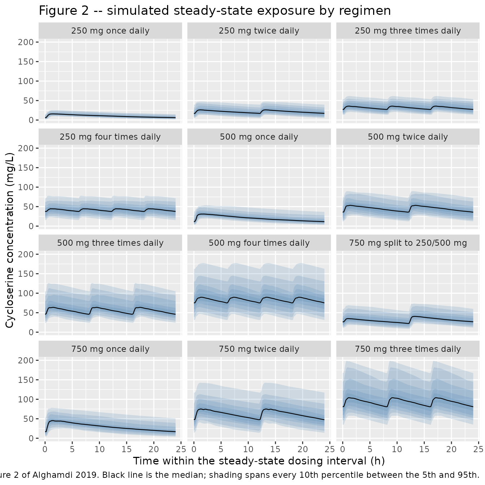
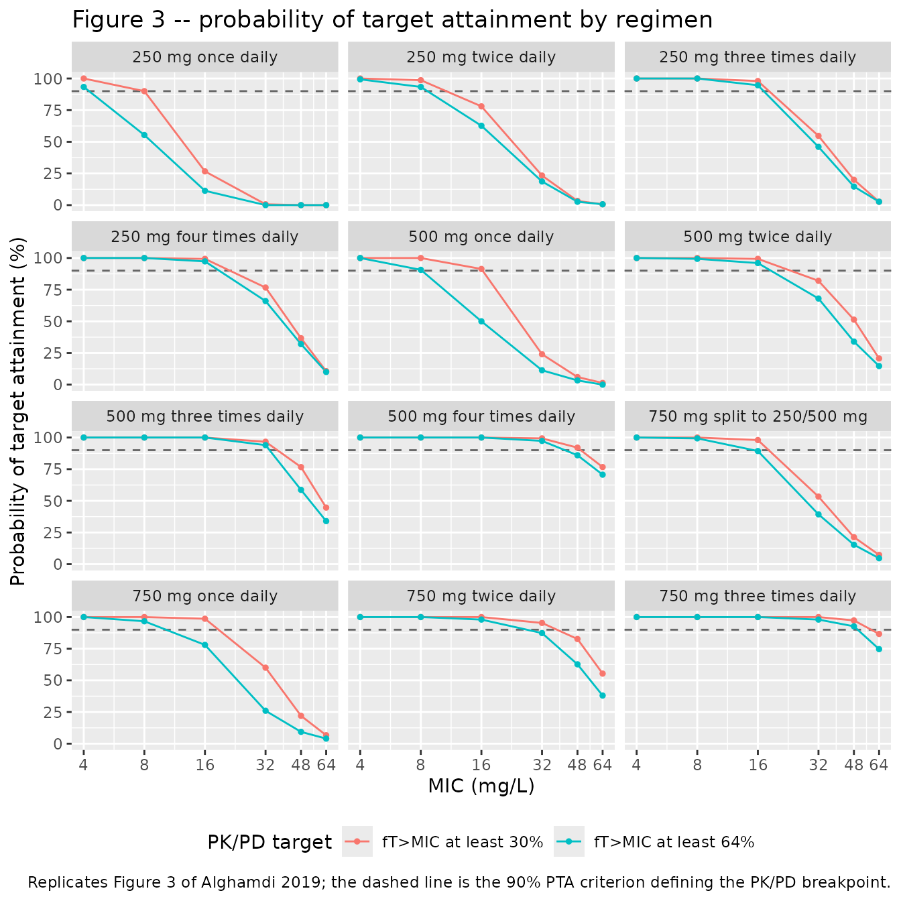

# Cycloserine (Alghamdi 2019)

## Model and source

- Citation: Alghamdi WA, Alsultan A, Al-Shaer MH, An G, Ahmed S, Alkabab
  Y, Banu S, Barbakadze K, Houpt E, Kipiani M, Mikiashvili L, Schmidt S,
  Heysell SK, Kempker RR, Cegielski JP, Peloquin CA. Cycloserine
  population pharmacokinetics and pharmacodynamics in patients with
  tuberculosis. Antimicrob Agents Chemother. 2019 Apr
  25;63(5):e00055-19. <doi:10.1128/AAC.00055-19>. PMCID: PMC6496076.
- Description: One-compartment population PK model for oral cycloserine
  in adults treated for drug-resistant tuberculosis plus healthy
  volunteers (Alghamdi 2019). First-order absorption with a lag time
  feeds a one-compartment disposition model. Apparent clearance carries
  an exponential shift for the TB/NTM patient stratum relative to
  healthy subjects and a power effect of Cockcroft-Gault creatinine
  clearance; apparent volume is scaled linearly by body weight (exponent
  fixed to 1). Between-occasion variability is carried on apparent
  clearance.
- Article: <https://doi.org/10.1128/AAC.00055-19>

Cycloserine is a second-line antituberculosis agent that the World
Health Organization has reclassified into the regimen recommended for
all patients with multidrug-resistant tuberculosis who do not qualify
for the shorter regimen. Alghamdi 2019 pooled five data sets into what
the authors describe as the largest cycloserine PK data set analysed
with a nonlinear mixed-effects model, then used the fitted model to ask
whether the conventional 250 to 500 mg once- or twice-daily dosing
attains the hollow-fibre-derived time-above-MIC targets.

## Population

The analysis population is 247 subjects contributing 1,069 plasma
cycloserine concentrations (Results, “Population pharmacokinetic
analysis”): 235 patients and 12 healthy volunteers. Over 80% of the
subjects had rifampin-resistant / multidrug-resistant (160, 68.1%),
pre-extensively drug-resistant (36, 15.3%) or extensively drug-resistant
(9, 3.8%) tuberculosis; the remainder had drug-susceptible tuberculosis
(16, 6.8%) or nontuberculous mycobacterial disease (14, 6.0%). Pooled
median (IQR) age was 41.0 (28.9 to 52.0) years and pooled median weight
59.0 (51.4 to 68.6) kg; about 75% of subjects were male (Table 1 and
Results, “Population demographics”).

Five data sets were pooled (Methods, “Study data sets and subjects”): 12
healthy subjects at the University of Arizona given a single 500 mg dose
fasting and sampled at 17 timepoints over 48 h; 69 MDR-TB patients from
Tbilisi, Georgia (semirich sampling 4 to 6 weeks after treatment start);
42 MDR-TB patients from Dhaka, Bangladesh (semirich sampling at 2, 4 and
8 weeks); 54 sparsely sampled MDR-TB or nontuberculous-mycobacteria
patients from National Jewish Health in Denver; and 70 sparsely sampled
patients from three U.S. tuberculosis centres. Doses ranged from 250 to
1,000 mg. Renal function differed between strata (Table 1): median CrCL
108.8 mL/min (IQR 98.9 to 139.9) in the healthy subjects against 89.1
(68.8 to 111.9) in the patients.

The same information is available programmatically via
`readModelDb("Alghamdi_2019_cycloserine")()$population`.

## Source trace

The per-parameter origin is recorded as an in-file comment next to each
`ini()` entry in
`inst/modeldb/specificDrugs/Alghamdi_2019_cycloserine.R`. The table
below collects them in one place for review. Every value is taken from
the **Final model** column of Table 2; the base-model column is not
extracted.

| Equation / parameter | Value | Source location |
|----|----|----|
| `ltlag` (lag time) | 0.326 h (RSE 1.47%) | Table 2, row `T lag (h)`, final model |
| `lka` | 6.61 1/h (RSE 17.1%) | Table 2, row `k a (h-1)`, final model |
| `lvc` (V/F at 59.0 kg) | 24.9 L (RSE 2.92%) | Table 2, row `V / F (liter)`; Results restates 24.9 L |
| `lcl` (CL/F, healthy, CrCL 89.1) | 2.00 L/h (RSE 11.9%) | Table 2, row `CL/ F (liter/h)`; Results restates 2.00 L/h healthy and 1.03 L/h patients |
| `e_wt_vc` | 1.00, fixed | Table 2, row `beta V, wt`; Results, “exponent fixed to 1” |
| `e_patient_cl` | -0.660 (RSE 18.7%, P \< 0.0001) | Table 2, row `beta CL, patients (vs HS)` |
| `e_crcl_cl` | 0.413 (RSE 18.1%, P \< 0.0001) | Table 2, row `beta CL, CrCL` |
| `etaltlag` | 0.409 SD, squared to 0.167281 | Table 2, row `omega , T lag` |
| `etalka` | 1.52 SD, squared to 2.3104 | Table 2, row `omega , k a` |
| `etalvc` | 0.174 SD, squared to 0.030276 | Table 2, row `omega , V / F` |
| `etalcl` | 0.353 SD, squared to 0.124609 | Table 2, row `omega , CL/ F` |
| `etaiov_cl_1` to `_4` | 0.190 SD, squared to 0.0361 | Table 2, row `gamma , CL/ F` |
| `propSd` | 0.190 (RSE 3.37%) | Table 2, row `Proportional`; Results, “The proportional model was selected” |
| Structure: 1 compartment, first-order absorption with lag | n/a | Results, “best described by a one-compartment model, with a first-order absorption and lag phase” |
| Categorical covariate form | n/a | Methods equation 1 |
| Continuous covariate form | n/a | Methods equation 2 |
| WT normalisation constant 59.0 kg | n/a | Results, “Population demographics”, pooled median weight |
| CRCL normalisation constant 89.1 mL/min | n/a | Table 1, patient-stratum median (pooled median not printed; see Errata) |

Methods equations 1 and 2 are rendered as images rather than text in the
publisher’s XML and are lost by every text-extraction path. They were
recovered from the EuropePMC `supplementaryFiles` bundle for PMC6496076
as `AAC.00055-19-m0001.jpg` and `AAC.00055-19-m0002.jpg`, and read

    equation 1:  CL = CL_POP * [if sex = male,  e^(beta_male)]
    equation 2:  CL = CL_POP * (age / age_median)^(beta_age)

confirming an exponential shift on a 0/1 indicator and a power function
of the covariate normalised to its **median**.

## Structural checks

Before any cohort simulation, two deterministic checks confirm that the
transcribed parameters reproduce quantities the paper states
independently of its parameter table.

``` r

# `readModelDb()` returns the model *function*; `rxode2::rxode()` evaluates it
# to the rxUi object, which is what carries `$omega` for the explicit-omega
# calls below.
mod <- rxode2::rxode(readModelDb("Alghamdi_2019_cycloserine"))
#> Warning: some etas defaulted to non-mu referenced, possible parsing error: etaiov_cl_1, etaiov_cl_2, etaiov_cl_3, etaiov_cl_4
#> as a work-around try putting the mu-referenced expression on a simple line

typ_grid <- seq(0, 240, by = 0.05)
typ_events <- data.frame(
  id = 1L,
  time = c(0, typ_grid),
  amt = c(500, rep(NA_real_, length(typ_grid))),
  evid = c(1L, rep(0L, length(typ_grid))),
  cmt = c("depot", rep("central", length(typ_grid))),
  WT = 59.0,
  CRCL = 89.1,
  DIS_HEALTHY = 0,
  OCC = 1L
)

# `omega = NA` is mandatory, not decorative: rxode2 caches the omega of the
# previous solve against the compiled model, so zeroRe() alone can silently
# return a one-subject random draw instead of the typical value.
typ <- rxode2::rxSolve(
  rxode2::zeroRe(mod),
  events = typ_events,
  omega = NA
) |>
  as.data.frame()
#> Warning: some etas defaulted to non-mu referenced, possible parsing error: etaiov_cl_1, etaiov_cl_2, etaiov_cl_3, etaiov_cl_4
#> as a work-around try putting the mu-referenced expression on a simple line

stopifnot(dplyr::n_distinct(round(typ$cl, 8)) == 1L)

# The solver reports the derived parameters, so CL/F and V/F are read back out
# of the model rather than re-typed here.
cl_typ <- unique(round(typ$cl, 6))
vc_typ <- unique(round(typ$vc, 6))
thalf_typ <- log(2) * vc_typ / cl_typ

round(c(CL_L_per_h = cl_typ, V_L = vc_typ, t_half_h = thalf_typ), 3)
#> CL_L_per_h        V_L   t_half_h 
#>      1.034     24.900     16.697
```

The paper states the patient CL/F is 1.03 L/h (Results) and that
cycloserine has a “relatively long half-life of 16.8 h” (Discussion).
Both are reproduced.

``` r

# Check 1 -- patient clearance, volume, and the quoted terminal half-life.
stopifnot(
  abs(cl_typ - 1.03) < 0.01,
  abs(vc_typ - 24.9) < 0.01,
  abs(thalf_typ - 16.8) < 0.3
)

# Check 2 -- dose recovery. With F apparent (the model carries no separate
# bioavailability term), CL/F * AUC(0-inf) must equal the administered dose.
# The 0.05 h observation grid above is deliberately fine through the
# absorption phase: ka = 6.61 1/h puts the peak about 0.7 h after the 0.326 h
# lag, and a coarse grid loses several percent of the AUC there.
obs <- typ[!duplicated(typ$time), ]
obs <- obs[order(obs$time), ]
auc_trap <- sum(
  diff(obs$time) * (utils::head(obs$Cc, -1) + utils::tail(obs$Cc, -1)) / 2
)
auc_inf <- auc_trap + utils::tail(obs$Cc, 1) / (cl_typ / vc_typ)
dose_recovered <- cl_typ * auc_inf

# Mutation control: the same arithmetic against a deliberately wrong clearance
# must NOT recover the dose, so the gate above cannot pass vacuously.
stopifnot(
  abs(dose_recovered / 500 - 1) < 0.005,
  abs((cl_typ * 1.2) * auc_inf / 500 - 1) > 0.05
)

round(c(auc_inf_mg_h_per_L = auc_inf, dose_recovered_mg = dose_recovered), 2)
#> auc_inf_mg_h_per_L  dose_recovered_mg 
#>             483.71             500.01
```

## Virtual cohort

Original observed data are not publicly available. The cohort below
reproduces the design of the paper’s own Monte Carlo analysis (Methods,
“Population pharmacokinetic modeling and Monte Carlo simulations”):
tuberculosis patients whose weight and creatinine clearance are drawn
from normal distributions with a correlation of 0.4 between them.

The paper sampled from “the mean values and standard deviations from the
original data set”. Those moments are not printed; Table 1 gives the
patient stratum’s median and IQR, so the mean is taken as the median and
the standard deviation as IQR / 1.349 (the normal-distribution
relationship the paper’s own normality assumption implies). Draws are
truncated to plausible physiological ranges so that a normal tail cannot
produce a negative weight or clearance.

``` r

set.seed(20190425)

n_sub <- 150L # per regimen; the library caps arms at 200

# Table 1, patient column: Wt 58.0 (50.6-67.0); CrCL 89.1 (68.8-111.9).
wt_mean <- 58.0
wt_sd <- (67.0 - 50.6) / 1.349
crcl_mean <- 89.1
crcl_sd <- (111.9 - 68.8) / 1.349
rho <- 0.4 # Methods: "A correlation of 0.4 also was taken into account"

z1 <- stats::rnorm(n_sub)
z2 <- rho * z1 + sqrt(1 - rho^2) * stats::rnorm(n_sub)

subjects <- tibble(
  id = seq_len(n_sub),
  WT = pmin(pmax(wt_mean + wt_sd * z1, 35), 110),
  CRCL = pmin(pmax(crcl_mean + crcl_sd * z2, 25), 250),
  DIS_HEALTHY = 0, # the simulated population is TB patients
  OCC = 1L # a single steady-state dosing interval
)

round(c(
  WT_median = median(subjects$WT),
  CRCL_median = median(subjects$CRCL),
  correlation = cor(subjects$WT, subjects$CRCL)
), 2)
#>   WT_median CRCL_median correlation 
#>       57.98       90.39        0.38
```

The twelve regimens of Table 3 are built below. Each subject is dosed
for 21 days so that even the slowest-clearing draws reach steady state:
a 1st-percentile clearance combined with a 99th-percentile volume and a
low creatinine clearance gives a half-life near 100 h, so sizing the
loading period from the typical 16.8 h half-life would leave the slow
tail short of steady state and bias the mean exposures down. The final
24 h interval is observed every 0.2 h, matching the paper’s simulation
grid.

``` r

t_ss <- 504 # 21 days of dosing before the observed interval
tau_obs <- 24
obs_grid <- seq(t_ss, t_ss + tau_obs, by = 0.2)

regimens <- tibble::tribble(
  ~regimen, ~dose_mg, ~ii,
  "250 mg once daily", 250, 24,
  "250 mg twice daily", 250, 12,
  "250 mg three times daily", 250, 8,
  "250 mg four times daily", 250, 6,
  "500 mg once daily", 500, 24,
  "500 mg twice daily", 500, 12,
  "500 mg three times daily", 500, 8,
  "500 mg four times daily", 500, 6,
  "750 mg split to 250/500 mg", NA, 12,
  "750 mg once daily", 750, 24,
  "750 mg twice daily", 750, 12,
  "750 mg three times daily", 750, 8
)

# One (time, amt) schedule per regimen. The 250/500 split alternates a morning
# 250 mg and an evening 500 mg dose (Methods: "we simulated 250 mg in the
# morning and 500 mg in the evening").
dose_schedule <- function(dose_mg, ii) {
  times <- seq(0, t_ss + tau_obs - ii, by = ii)
  amts <- if (is.na(dose_mg)) {
    rep(c(250, 500), length.out = length(times))
  } else {
    rep(dose_mg, length(times))
  }
  tibble(time = times, amt = amts)
}

make_regimen_events <- function(regimen_label, dose_mg, ii, id_offset) {
  subj <- subjects |> mutate(id = id + id_offset, regimen = regimen_label)
  doses <- tidyr::expand_grid(subj, dose_schedule(dose_mg, ii)) |>
    mutate(evid = 1L, cmt = "depot")
  obs <- tidyr::expand_grid(subj, tibble(time = obs_grid)) |>
    mutate(amt = NA_real_, evid = 0L, cmt = "central")
  bind_rows(doses, obs) |>
    arrange(id, time, desc(evid))
}

events <- bind_rows(lapply(seq_len(nrow(regimens)), function(i) {
  make_regimen_events(
    regimens$regimen[i],
    regimens$dose_mg[i],
    regimens$ii[i],
    (i - 1L) * n_sub
  )
}))

stopifnot(
  !anyDuplicated(unique(events[, c("id", "time", "evid")])),
  length(unique(events$id)) == n_sub * nrow(regimens)
)
nrow(events)
#> [1] 310200
```

## Simulation

``` r

# `omega = mod$omega` is mandatory for the same reason `omega = NA` was above:
# the typical-value solve has already poisoned rxode2's cached solve options,
# and without this the whole cohort silently collapses onto one subject.
rxode2::rxSetSeed(20190425)
sim <- rxode2::rxSolve(
  mod,
  events = events,
  omega = mod$omega,
  keep = c("regimen", "WT", "CRCL"),
  addDosing = FALSE
) |>
  as.data.frame() |>
  filter(!is.na(Cc)) |>
  mutate(
    regimen = factor(as.character(regimen), levels = regimens$regimen),
    tss = time - t_ss
  )

# Guard the other direction of the same rxode2 bug: IIV must actually have
# been drawn.
stopifnot(dplyr::n_distinct(round(sim$cl, 8)) > 1L)
nrow(sim)
#> [1] 217800
```

`Cc` here is the individual model prediction without residual error.
That is the quantity the paper’s target-attainment analysis uses: adding
the 19% proportional residual error and then taking the maximum over 121
grid points would inflate the simulated Cmax by roughly a third relative
to the Table 3 values, which the noise-free prediction reproduces
closely (see below).

## Replicate published figures

``` r

# Replicates Figure 2 of Alghamdi 2019: the empirical distribution of the
# simulated steady-state concentration-time profiles for each regimen. The
# paper shades every 10th percentile; the same banding is drawn here.
bands <- sim |>
  group_by(regimen, tss) |>
  summarise(
    q05 = quantile(Cc, 0.05), q10 = quantile(Cc, 0.10),
    q20 = quantile(Cc, 0.20), q30 = quantile(Cc, 0.30),
    q40 = quantile(Cc, 0.40), q50 = quantile(Cc, 0.50),
    q60 = quantile(Cc, 0.60), q70 = quantile(Cc, 0.70),
    q80 = quantile(Cc, 0.80), q90 = quantile(Cc, 0.90),
    q95 = quantile(Cc, 0.95),
    .groups = "drop"
  )

band_long <- bind_rows(
  transmute(bands, regimen, tss, lo = q05, hi = q95, band = 1L),
  transmute(bands, regimen, tss, lo = q10, hi = q90, band = 2L),
  transmute(bands, regimen, tss, lo = q20, hi = q80, band = 3L),
  transmute(bands, regimen, tss, lo = q30, hi = q70, band = 4L),
  transmute(bands, regimen, tss, lo = q40, hi = q60, band = 5L)
)

ggplot(band_long, aes(tss)) +
  geom_ribbon(
    aes(ymin = lo, ymax = hi, group = band),
    alpha = 0.18, fill = "steelblue"
  ) +
  geom_line(data = bands, aes(tss, q50), colour = "black", linewidth = 0.4) +
  facet_wrap(~regimen, ncol = 3) +
  labs(
    x = "Time within the steady-state dosing interval (h)",
    y = "Cycloserine concentration (mg/L)",
    title = "Figure 2 -- simulated steady-state exposure by regimen",
    caption = "Replicates Figure 2 of Alghamdi 2019. Black line is the median; shading spans every 10th percentile between the 5th and 95th."
  )
```



## PKNCA validation

``` r

sim_nca <- sim |>
  filter(!is.na(Cc)) |>
  select(id, time, Cc, regimen)

# The steady-state interval starts at a dose time, so a concentration record
# already exists at the interval start; the defensive block below is kept as a
# regression guard against a future change to the observation grid.
sim_nca <- bind_rows(
  sim_nca,
  sim_nca |> distinct(id, regimen) |> mutate(time = t_ss, Cc = 0)
) |>
  distinct(id, regimen, time, .keep_all = TRUE) |>
  arrange(id, regimen, time)

dose_df <- events |>
  filter(evid == 1, time >= t_ss) |>
  select(id, time, amt, regimen) |>
  mutate(regimen = factor(regimen, levels = regimens$regimen))

conc_obj <- PKNCA::PKNCAconc(
  as.data.frame(sim_nca),
  Cc ~ time | regimen + id,
  concu = "mg/L",
  timeu = "h"
)
dose_obj <- PKNCA::PKNCAdose(
  as.data.frame(dose_df),
  amt ~ time | regimen + id,
  doseu = "mg"
)

intervals <- data.frame(
  start = t_ss,
  end = t_ss + tau_obs,
  cmax = TRUE,
  tmax = TRUE,
  cmin = TRUE,
  auclast = TRUE,
  cav = TRUE
)

nca_res <- PKNCA::pk.nca(
  PKNCA::PKNCAdata(conc_obj, dose_obj, intervals = intervals)
)
```

### Comparison against published NCA

Table 3 of Alghamdi 2019 reports the **mean** (SD) Cmax and AUC(0-24h)
over the 1,000 simulated patients per regimen, so the simulated side is
aggregated with the mean rather than
[`ncaComparisonTable()`](https://nlmixr2.github.io/nlmixr2lib/reference/ncaComparisonTable.md)’s
default median.

``` r

sim_mean <- as.data.frame(nca_res$result) |>
  filter(PPTESTCD %in% c("cmax", "auclast")) |>
  group_by(regimen, PPTESTCD) |>
  summarise(PPORRES = mean(PPORRES), .groups = "drop") |>
  mutate(regimen = as.character(regimen))

published <- tibble::tribble(
  ~regimen, ~cmax, ~auclast,
  "250 mg once daily", 16.4, 259.5,
  "250 mg twice daily", 26.4, 516.7,
  "250 mg three times daily", 35.5, 737.7,
  "250 mg four times daily", 44.4, 945.1,
  "500 mg once daily", 32.7, 519.0,
  "500 mg twice daily", 52.9, 1033.4,
  "500 mg three times daily", 71.0, 1475.4,
  "500 mg four times daily", 88.8, 1890.1,
  "750 mg split to 250/500 mg", 42.2, 763.8,
  "750 mg once daily", 49.6, 789.5,
  "750 mg twice daily", 78.4, 1527.5,
  "750 mg three times daily", 106.5, 2215.0
)

cmp <- nlmixr2lib::ncaComparisonTable(
  simulated = sim_mean,
  reference = published,
  by = "regimen",
  units = c(cmax = "mg/L", auclast = "mg*h/L"),
  tolerance_pct = 20
)

knitr::kable(
  cmp,
  digits = 1,
  caption = "Simulated (mean over 150 virtual patients per regimen) against Alghamdi 2019 Table 3 (mean over 1,000 simulated patients). * differs from the reference by more than 20%.",
  align = c("l", "l", "r", "r", "r")
)
```

| NCA parameter     | regimen                    | Reference | Simulated | % diff |
|:------------------|:---------------------------|----------:|----------:|-------:|
| Cmax (mg/L)       | 250 mg once daily          |      16.4 |        17 |  +3.7% |
| Cmax (mg/L)       | 250 mg twice daily         |      26.4 |      28.3 |  +7.1% |
| Cmax (mg/L)       | 250 mg three times daily   |      35.5 |      39.1 | +10.2% |
| Cmax (mg/L)       | 250 mg four times daily    |      44.4 |      46.8 |  +5.4% |
| Cmax (mg/L)       | 500 mg once daily          |      32.7 |      34.4 |  +5.3% |
| Cmax (mg/L)       | 500 mg twice daily         |      52.9 |      56.2 |  +6.3% |
| Cmax (mg/L)       | 500 mg three times daily   |        71 |      73.6 |  +3.6% |
| Cmax (mg/L)       | 500 mg four times daily    |      88.8 |      98.5 | +10.9% |
| Cmax (mg/L)       | 750 mg split to 250/500 mg |      42.2 |      45.4 |  +7.7% |
| Cmax (mg/L)       | 750 mg once daily          |      49.6 |      49.6 |  +0.1% |
| Cmax (mg/L)       | 750 mg twice daily         |      78.4 |      82.4 |  +5.0% |
| Cmax (mg/L)       | 750 mg three times daily   |       106 |       116 |  +9.2% |
| AUClast (mg\*h/L) | 250 mg once daily          |       260 |       272 |  +4.8% |
| AUClast (mg\*h/L) | 250 mg twice daily         |       517 |       557 |  +7.9% |
| AUClast (mg\*h/L) | 250 mg three times daily   |       738 |       830 | +12.5% |
| AUClast (mg\*h/L) | 250 mg four times daily    |       945 |      1030 |  +8.9% |
| AUClast (mg\*h/L) | 500 mg once daily          |       519 |       544 |  +4.9% |
| AUClast (mg\*h/L) | 500 mg twice daily         |      1030 |      1110 |  +7.0% |
| AUClast (mg\*h/L) | 500 mg three times daily   |      1480 |      1550 |  +4.8% |
| AUClast (mg\*h/L) | 500 mg four times daily    |      1890 |      2160 | +14.5% |
| AUClast (mg\*h/L) | 750 mg split to 250/500 mg |       764 |       838 |  +9.7% |
| AUClast (mg\*h/L) | 750 mg once daily          |       790 |       785 |  -0.5% |
| AUClast (mg\*h/L) | 750 mg twice daily         |      1530 |      1610 |  +5.3% |
| AUClast (mg\*h/L) | 750 mg three times daily   |      2220 |      2460 | +11.1% |

Simulated (mean over 150 virtual patients per regimen) against Alghamdi
2019 Table 3 (mean over 1,000 simulated patients). \* differs from the
reference by more than 20%. {.table}

``` r

pct <- abs(as.numeric(gsub("[^0-9.eE+-]", "", cmp[["% diff"]])))
stopifnot(!anyNA(pct), length(pct) == 24L)

# Assert on the CENTRE and on a robust quantile, not on the extreme. Each
# simulated value is a cohort mean whose Monte Carlo standard error is about 3%
# (SD / sqrt(150)), and the reference values are themselves means over a
# differently-drawn 1,000-patient cohort, so one arm can drift without the
# transcription being wrong. A mis-transcribed clearance, dose or normalisation
# constant moves the WHOLE set of 24 comparisons by tens of percent and blows
# the median bound immediately. Realised on this render: median 6.7%, 90th
# percentile 11.0%, max 14.5%; the bounds below sit outside that range so a
# redrawn cohort cannot trip them. Do not tighten them back.
stopifnot(
  median(pct) < 10,
  stats::quantile(pct, 0.9) < 20,
  max(pct) < 30
)
round(c(
  median = median(pct),
  q90 = unname(stats::quantile(pct, 0.9)),
  max = max(pct)
), 1)
#> median    q90    max 
#>    6.7   11.0   14.5
```

## Target attainment and PK/PD breakpoints

The paper’s pharmacodynamic analysis uses the hollow-fibre-derived
time-above-MIC targets of Deshpande et al.: fT\>MIC of at least 30%
(bactericidal activity) and at least 64% (80% of maximal kill). The
PK/PD breakpoint is the highest MIC at which at least 90% of simulated
patients attain the target (Methods). Cycloserine plasma protein binding
was assumed to be zero (Discussion), so total concentrations are
compared directly against the MIC.

``` r

mic_grid <- c(4, 8, 16, 32, 48, 64)

# The paper counts fT>MIC on its own 0.2 h simulation grid, so the fraction is
# computed the same way here, over the 120 grid points spanning [0, 24).
fT <- sim |>
  filter(tss < tau_obs) |>
  group_by(regimen, id) |>
  summarise(
    mic4 = mean(Cc > 4),
    mic8 = mean(Cc > 8),
    mic16 = mean(Cc > 16),
    mic32 = mean(Cc > 32),
    mic48 = mean(Cc > 48),
    mic64 = mean(Cc > 64),
    .groups = "drop"
  )

pta <- fT |>
  tidyr::pivot_longer(
    starts_with("mic"),
    names_to = "mic",
    values_to = "fT",
    names_transform = list(mic = function(x) as.numeric(sub("^mic", "", x)))
  ) |>
  group_by(regimen, mic) |>
  summarise(
    pta30 = 100 * mean(fT >= 0.30),
    pta64 = 100 * mean(fT >= 0.64),
    .groups = "drop"
  )

breakpoint <- function(mic, pta_value) {
  ok <- mic[pta_value >= 90]
  if (length(ok) == 0) NA_real_ else max(ok)
}

bp <- pta |>
  group_by(regimen) |>
  summarise(
    bp30 = breakpoint(mic, pta30),
    bp64 = breakpoint(mic, pta64),
    .groups = "drop"
  ) |>
  mutate(regimen = as.character(regimen))
```

``` r

# Replicates Figure 3 of Alghamdi 2019: probability of target attainment versus
# MIC for each simulated regimen.
pta |>
  tidyr::pivot_longer(
    c(pta30, pta64),
    names_to = "target",
    values_to = "pta_pct"
  ) |>
  mutate(
    target = factor(
      target,
      levels = c("pta30", "pta64"),
      labels = c("fT>MIC at least 30%", "fT>MIC at least 64%")
    )
  ) |>
  ggplot(aes(mic, pta_pct, colour = target)) +
  geom_hline(yintercept = 90, linetype = "dashed", colour = "grey40") +
  geom_line() +
  geom_point(size = 1) +
  facet_wrap(~regimen, ncol = 3) +
  scale_x_log10(breaks = mic_grid) +
  labs(
    x = "MIC (mg/L)",
    y = "Probability of target attainment (%)",
    colour = "PK/PD target",
    title = "Figure 3 -- probability of target attainment by regimen",
    caption = "Replicates Figure 3 of Alghamdi 2019; the dashed line is the 90% PTA criterion defining the PK/PD breakpoint."
  ) +
  theme(legend.position = "bottom")
```



``` r

published_bp <- tibble::tribble(
  ~regimen, ~ref_bp30, ~ref_bp64,
  "250 mg once daily", 4, 4,
  "250 mg twice daily", 8, 8,
  "250 mg three times daily", 16, 16,
  "250 mg four times daily", 16, 16,
  "500 mg once daily", 8, 8,
  "500 mg twice daily", 16, 16,
  "500 mg three times daily", 32, 32,
  "500 mg four times daily", 48, 48,
  "750 mg split to 250/500 mg", 16, 16,
  "750 mg once daily", 16, 8,
  "750 mg twice daily", 32, 32,
  "750 mg three times daily", 64, 48
)

bp_cmp <- published_bp |>
  left_join(bp, by = "regimen") |>
  transmute(
    Regimen = regimen,
    `Published, 30% target` = ref_bp30,
    `Simulated, 30% target` = bp30,
    `Published, 64% target` = ref_bp64,
    `Simulated, 64% target` = bp64
  )

knitr::kable(
  bp_cmp,
  caption = "PK/PD breakpoints (mg/L), the highest MIC attaining at least 90% PTA, against Alghamdi 2019 Table 3.",
  align = c("l", "r", "r", "r", "r")
)
```

| Regimen | Published, 30% target | Simulated, 30% target | Published, 64% target | Simulated, 64% target |
|:---|---:|---:|---:|---:|
| 250 mg once daily | 4 | 8 | 4 | 4 |
| 250 mg twice daily | 8 | 8 | 8 | 8 |
| 250 mg three times daily | 16 | 16 | 16 | 16 |
| 250 mg four times daily | 16 | 16 | 16 | 16 |
| 500 mg once daily | 8 | 16 | 8 | 8 |
| 500 mg twice daily | 16 | 16 | 16 | 16 |
| 500 mg three times daily | 32 | 32 | 32 | 32 |
| 500 mg four times daily | 48 | 48 | 48 | 32 |
| 750 mg split to 250/500 mg | 16 | 16 | 16 | 8 |
| 750 mg once daily | 16 | 16 | 8 | 8 |
| 750 mg twice daily | 32 | 32 | 32 | 16 |
| 750 mg three times daily | 64 | 48 | 48 | 48 |

PK/PD breakpoints (mg/L), the highest MIC attaining at least 90% PTA,
against Alghamdi 2019 Table 3. {.table}

``` r

# A breakpoint can only take the discrete values of the MIC ladder
# (4, 8, 16, 32, 48, 64), so a PTA sitting near the 90% criterion flips a cell
# by one rung under a differently-drawn cohort. The gate is therefore written on
# (a) how many of the 24 cells match exactly and (b) that no mismatch is worse
# than one rung -- both robust to the draw, while a mis-transcribed exposure
# would move many cells by several rungs.
ladder <- c(4, 8, 16, 32, 48, 64)

cells <- tibble(
  ref = c(published_bp$ref_bp30, published_bp$ref_bp64),
  sim = c(bp_cmp$`Simulated, 30% target`, bp_cmp$`Simulated, 64% target`)
)
stopifnot(!anyNA(cells$sim))
cells$gap <- abs(match(cells$sim, ladder) - match(cells$ref, ladder))

# Realised on this render: 18 of 24 exact, worst gap 1 rung. The bounds sit
# outside that so a redrawn cohort cannot trip them, while still going red on
# a transcription error -- a wrong clearance or normalisation constant shifts
# most of the PTA curves and moves many cells by two or more rungs.
stopifnot(
  sum(cells$gap == 0) >= 15, # of 24 cells
  sum(cells$gap >= 2) <= 1,
  max(cells$gap) <= 2
)
c(
  exact_matches = sum(cells$gap == 0),
  n_cells = nrow(cells),
  worst_gap_in_rungs = max(cells$gap)
)
#>      exact_matches            n_cells worst_gap_in_rungs 
#>                 18                 24                  1
```

The paper’s headline conclusions follow from these breakpoints and are
reproduced by the simulation: every 250 mg regimen, including four times
daily, tops out at a breakpoint of 16 mg/L; MICs above 16 mg/L need at
least 500 mg three times daily or 750 mg twice daily; and dividing a 750
mg daily dose into 250 mg in the morning plus 500 mg in the evening
raises the breakpoint above the once-daily 750 mg regimen while cutting
the mean Cmax from about 50 mg/L to about 42 mg/L.

## Assumptions and deviations

- **CRCL normalisation constant.** Methods equation 2 normalises a
  continuous covariate to its median, but the pooled-cohort median
  creatinine clearance is not printed anywhere in the paper. The model
  uses 89.1 mL/min, the patient-stratum median from Table 1. Patients
  are 235 of the 247 subjects, so the patient median is close to the
  pooled median: applying the same rank shift to the weight column
  (where the pooled median *is* printed) recovers 58.8 kg against the
  printed 59.0 kg, about 1.5% low, which at the exponent 0.413 moves
  CL/F by under 1%. An independent check runs the same way – the Table 3
  mean AUC(0-24h) for 250 mg once daily implies a normalising constant
  in the mid-80s mL/min once the log-normal and covariate spreads are
  accounted for.
- **Omega scale.** Table 2’s omega and gamma rows are reported on the
  standard deviation scale, the Monolix convention (Methods names
  Monolix 2018R1 as the estimation tool). The model file therefore
  squares them. Two of the paper’s own Monte Carlo outputs confirm the
  reading: the Table 3 AUC CV of 37.7% for 250 mg once daily matches
  `sqrt(exp(0.353^2) - 1) = 36.4%` and not `sqrt(exp(0.353) - 1) = 65%`;
  and the Table 3 Cmax CV of 26.2% matches the 0.174 omega on V/F
  combined with the weight spread, not a variance reading of the same
  row.
- **Reference category of the disease covariate.** The paper’s
  categorical term is the *patient* indicator with healthy subjects as
  the reference. The canonical register column `DIS_HEALTHY` runs the
  other way (1 = healthy), so `model()` rebuilds `1 - DIS_HEALTHY` and
  applies the published -0.660 verbatim, keeping the published
  healthy-subject intercept of 2.00 L/h as the fitted `lcl`. Set
  `DIS_HEALTHY = 0` for the tuberculosis population, as done throughout
  this vignette. The authors explicitly decline to read the effect as
  disease biology: the healthy arm was fasted, medication-free, renally
  normal and intensively sampled, while the patient arms were none of
  those (Discussion).
- **Number of interoccasion-variability occasions.** Table 2 estimates a
  single gamma on CL/F but the paper never states how many occasions
  were defined. The richest contributing data set (Bangladesh) sampled
  at 2, 4 and 8 weeks, i.e. three occasions; the model file provides
  four slots, with occasions 2 to 4 fixed to occasion 1’s variance – the
  analogue of a NONMEM `$OMEGA BLOCK(1) SAME`. All simulations here use
  `OCC = 1`, a single steady-state interval.
- **rxode2 mu-referencing warning.** Because the occasion-indicator
  expansion routes the interoccasion etas through an intermediate
  variable, rxode2 emits `some etas defaulted to non-mu referenced` at
  parse. That affects SAEM estimation only, not simulation, and is the
  same construction used by `Ding_2026_vancomycin.R` and the other IOV
  models in this library.
- **Simulated covariate moments.** The paper sampled weight and
  creatinine clearance from normal distributions using “the mean values
  and standard deviations from the original data set”; those moments are
  not printed. This vignette takes the mean as the Table 1 patient
  median and the standard deviation as IQR / 1.349, and truncates draws
  to 35-110 kg and 25-250 mL/min so a normal tail cannot produce an
  impossible subject.
- **Residual error is excluded from the simulated exposures.** Table 3
  reports target attainment and Cmax from model-predicted profiles;
  adding the 19% proportional residual error to a 0.2 h grid and taking
  the maximum would inflate Cmax by roughly a third. `Cc` as returned by
  `rxSolve()` is the individual prediction without residual error, which
  is what is used here.
- **Cohort size.** Each of the twelve regimens uses 150 virtual patients
  against the paper’s 1,000, per the library’s 200-per-arm cap. The
  Monte Carlo standard error on a mean exposure is then about 3%, which
  is why the comparison gate is written on the median and 90th
  percentile of the absolute percent differences rather than on any
  single arm.
- **Figure 1 is not replicated.** The paper’s Figure 1 and Figure S2 are
  visual predictive checks against the observed concentrations, which
  are not publicly available. Figures 2 and 3, which are pure model
  outputs, are replicated above.
- **No erratum.** Crossref reports no `update-to` / `updated-by`
  relation for <doi:10.1128/AAC.00055-19> as of 2026-09-23, and the
  EuropePMC supplement bundle contains only the goodness-of-fit and
  dose-stratified VPC figures described in Supplemental File 1.
