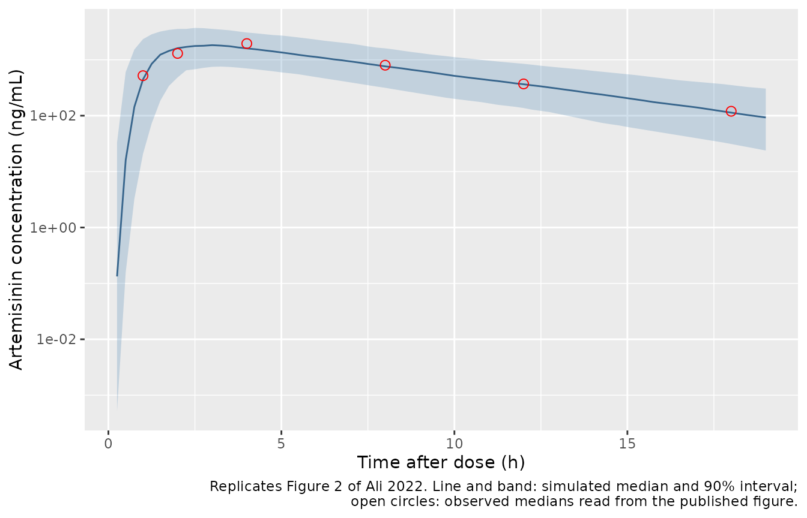
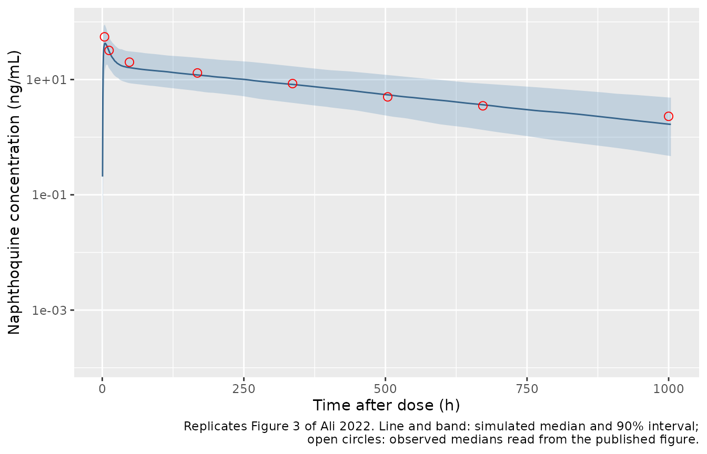
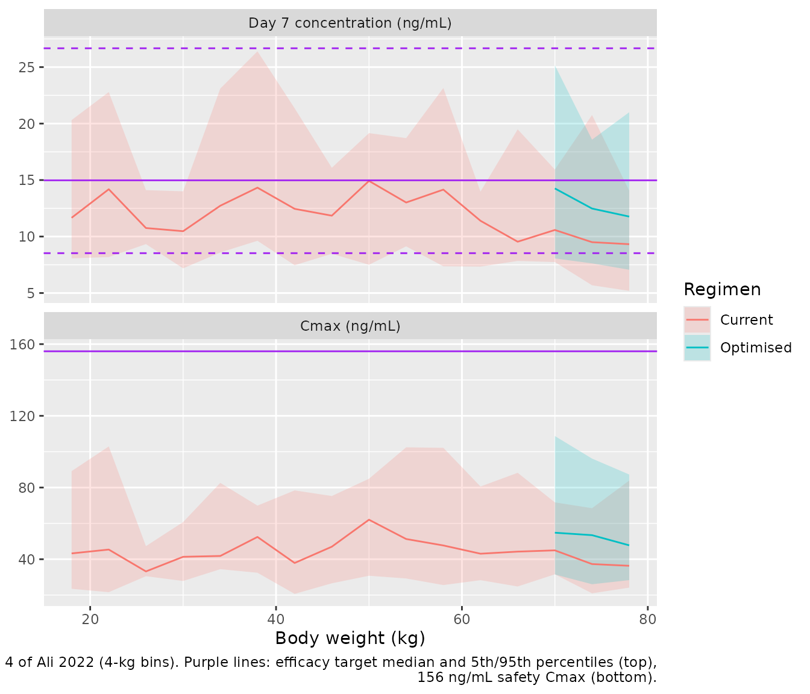

# Artemisinin + naphthoquine (Ali 2022)

## Model and source

Ali 2022 fitted two separate population PK models to the same patients,
one for each component of the single-dose artemisinin-naphthoquine
(ART-NQ) combination. Both are packaged:

- `Ali_2022_artemisinin`: One-compartment population PK model for oral
  artemisinin given as a single dose of the fixed-dose
  artemisinin-naphthoquine combination to Tanzanian children (6 years
  and older) and adults with uncomplicated Plasmodium falciparum malaria
  (Ali 2022). Savic transit-compartment absorption (non-integer NN
  transit compartments and a separate first-order absorption rate ka
  into the central compartment), relative bioavailability fixed to 1
  with between-subject variability, and allometric scaling by total body
  weight to a 55 kg reference (exponent 0.75 on CL/F, 1 on V/F).
  Naphthoquine from the same combination is a separately fitted model
  (Ali_2022_naphthoquine).
- `Ali_2022_naphthoquine`: Two-compartment population PK model for oral
  naphthoquine given as a single dose of the fixed-dose
  artemisinin-naphthoquine combination to Tanzanian children (6 years
  and older) and adults with uncomplicated Plasmodium falciparum malaria
  (Ali 2022). Savic transit-compartment absorption (non-integer NN
  transit compartments and a separate first-order absorption rate ka
  into the central compartment), relative bioavailability fixed to 1
  with between-subject variability, and allometric scaling of CL/F by
  fat-free mass to a 45 kg reference (exponent 0.75) and of Q/F
  (exponent 0.75), Vc/F and Vp/F (exponent 1) by total body weight to a
  55 kg reference. Artemisinin from the same combination is a separately
  fitted model (Ali_2022_artemisinin).
- Citation: Ali AM, Gausi K, Jongo SA, Kassim KR, Mkindi C, Simon B,
  Mtoro AT, Juma OA, Lweno ON, Gwandu CH, Bakari BM, Mbaga TA, Milando
  FA, Hamad A, Shekalaghe SA, Abdulla S, Denti P, Penny MA (2022).
  Population Pharmacokinetics of Antimalarial Naphthoquine in
  Combination with Artemisinin in Tanzanian Children and Adults: Dose
  Optimization. Antimicrobial Agents and Chemotherapy 66(5):e01696-21.
  <doi:10.1128/aac.01696-21>.
- Article: <https://doi.org/10.1128/aac.01696-21> (open access,
  PMC9112936)

## Population

Ali 2022 enrolled 29 Tanzanian patients with uncomplicated *Plasmodium
falciparum* malaria at the Bagamoyo Clinical Trial Unit in 2014, in the
ART-NQ arm of a phase IV randomised study (NCT01930331). Patients were
aged 6.0 to 56.0 years (median 13.1) and weighed 20 to 84 kg (median
32.0); 14 of 29 (48%) were female. Table 1 splits them into three age
groups: 6-10 years (n = 12, median 20.0 kg), 11-17 years (n = 6, median
37.5 kg) and 18 years and older (n = 11, median 55.0 kg). Every patient
received one oral dose of ART-NQ tablets (125 mg artemisinin + 50 mg
naphthoquine each), about 20 mg/kg artemisinin and 8 mg/kg naphthoquine,
rounded to whole tablets by weight band (Table 3). The achieved median
doses were 18.5 mg/kg artemisinin and 7.4 mg/kg naphthoquine.

Artemisinin was sampled at 1, 2, 4, 8, 12 and 18 h after the dose. One
slow absorber was excluded, leaving 28 patients and 174 samples.
Naphthoquine was sampled at the same times and also on days 4, 7, 14,
21, 28 and 42, giving 363 concentrations from 29 patients.

The same information is available programmatically via
`readModelDb("Ali_2022_naphthoquine")()$population`.

## Source trace

The per-parameter origin is recorded as an in-file comment next to each
`ini()` entry in `inst/modeldb/specificDrugs/Ali_2022_artemisinin.R` and
`inst/modeldb/specificDrugs/Ali_2022_naphthoquine.R`. The table below
collects them in one place.

| Equation / parameter | Artemisinin | Naphthoquine | Source location |
|----|----|----|----|
| `lcl` (CL/F, L/h) | log(66.7) | log(44.2) | Table 2 |
| `lvc` (V1/F, L) | log(395) | log(647) | Table 2 |
| `lq` (Q/F, L/h) | n/a | log(601) | Table 2 |
| `lvp` (Vp/F, L) | n/a | log(19100) | Table 2 |
| `lka` (1/h) | log(2.11) | log(0.108) | Table 2 |
| `lmtt` (h) | log(0.987) | log(1.23) | Table 2 |
| `lnn` (transit compartments) | log(7.53) | log(5.42) | Table 2 |
| `lfdepot` | fixed(log(1)) | fixed(log(1)) | Table 2; Methods |
| allometric exponents | `e_wt_cl` fixed 0.75, `e_wt_vc` fixed 1 | `e_ffm_cl` and `e_wt_q` fixed 0.75, `e_wt_vc` fixed 1 | Methods; Table 2 footnote a |
| CL size descriptor | (WT/55)^0.75 | (FFM/45)^0.75 | Table 2 footnote a equations |
| Q size descriptor | n/a | (WT/55)^0.75 | Table 2 footnote a (‘all clearance and volumes … scaled using the body weight’ except naphthoquine CL) |
| V1, Vp size descriptor | (WT/55) | (WT/55) | Table 2 footnote a |
| `etalcl` | 0.186^2 | 0.199^2 | Table 2 IIV; footnote d (%CV = sqrt(omega^2) x 100) |
| `etalka` | 0.457^2 | 0.370^2 | Table 2 IIV |
| `etalmtt` | 0.492^2 | 0.806^2 | Table 2 IIV |
| `etalfdepot` | 0.411^2 | 0.327^2 | Table 2 IIV |
| `addSd` (ng/mL) | fixed(0.20) | 0.594 | Table 2; footnote c |
| `propSd` | 0.307 | 0.251 | Table 2 |
| Transit absorption into absorption compartment, then `ka` to central | yes | yes | Figure 1; Methods (reference 52, Savic 2007) |
| `d/dt(central)`, `d/dt(peripheral1)` | 1-compartment | 2-compartment | Figure 1; Results |
| `Cc ~ add(addSd) + prop(propSd)` | yes | yes | Methods (‘combined additive and proportional error model’) |

## Virtual cohorts

The observed data are not public. Two virtual cohorts are used.

1.  A **study-like cohort** of three age groups, 100 patients each,
    whose body weight and body mass index are drawn log-normally around
    the Table 1 median and interquartile range of each group, with each
    group’s Table 1 sex ratio.
2.  A **weight-band cohort** for Figure 4, with body weight uniform over
    the 16-80 kg range plotted there, and a separate cohort reproducing
    the efficacy target population (400 mg naphthoquine in patients
    weighing 47.8 +/- 4.3 kg, Methods ‘Simulations’).

Naphthoquine clearance scales with fat-free mass, which Ali 2022 derived
“for males and females separately” without printing the equation. The
Janmahasatian 2005 equations are used here, computed from body weight,
body mass index and sex.

``` r

rxode2::rxSetSeed(20220425)
set.seed(20220425)

ffm_janmahasatian <- function(wt, bmi, sexf) {
  ifelse(sexf == 1, 9270 * wt / (8780 + 244 * bmi), 9270 * wt / (6680 + 216 * bmi))
}

# Table 3 'Current dose regimen' bands (naphthoquine / artemisinin in mg).
band_dose <- function(wt, optimised = FALSE) {
  nq <- dplyr::case_when(
    wt < 21 ~ 150,
    wt < 33 ~ 200,
    wt < 50 ~ 300,
    optimised & wt >= 70 ~ 500,
    TRUE ~ 400
  )
  list(nq = nq, art = nq * 2.5)
}

# Table 1 medians and IQRs per age group; sdlog = log(Q3 / Q1) / 1.349.
groups <- tibble::tribble(
  ~agegrp,     ~n,  ~wt_med, ~wt_q1, ~wt_q3, ~bmi_med, ~bmi_q1, ~bmi_q3, ~pfemale,
  "6-10 yr",   100, 20.0,    20.0,   24.5,   14.7,     14.1,    15.5,    9 / 12,
  "11-17 yr",  100, 37.5,    26.0,   48.0,   15.8,     14.1,    20.5,    2 / 6,
  ">= 18 yr",  100, 55.0,    51.0,   64.0,   20.4,     19.0,    25.3,    3 / 11
)

make_group <- function(g, id_offset) {
  n <- g$n
  tibble(
    id = id_offset + seq_len(n),
    agegrp = g$agegrp,
    WT = pmin(pmax(rlnorm(n, log(g$wt_med), log(g$wt_q3 / g$wt_q1) / 1.349), 18), 90),
    BMI = rlnorm(n, log(g$bmi_med), log(g$bmi_q3 / g$bmi_q1) / 1.349),
    SEXF = rbinom(n, 1, g$pfemale)
  )
}

study <- dplyr::bind_rows(lapply(seq_len(nrow(groups)), function(i) {
  make_group(groups[i, ], id_offset = (i - 1L) * 100L)
})) |>
  mutate(
    FFM = ffm_janmahasatian(WT, BMI, SEXF),
    nq_mg = band_dose(WT)$nq,
    art_mg = band_dose(WT)$art,
    agegrp = factor(agegrp, levels = groups$agegrp)
  )
stopifnot(!anyDuplicated(study$id))

study |>
  group_by(agegrp) |>
  summarise(
    n = n(),
    `median WT (kg)` = median(WT),
    `median FFM (kg)` = median(FFM),
    `median ART dose (mg/kg)` = median(art_mg / WT),
    `median NQ dose (mg/kg)` = median(nq_mg / WT)
  ) |>
  knitr::kable(digits = 1, caption = "Study-like virtual cohort.")
```

| agegrp | n | median WT (kg) | median FFM (kg) | median ART dose (mg/kg) | median NQ dose (mg/kg) |
|:---|---:|---:|---:|---:|---:|
| 6-10 yr | 100 | 20.0 | 16.5 | 20.8 | 8.3 |
| 11-17 yr | 100 | 37.3 | 30.8 | 18.2 | 7.3 |
| \>= 18 yr | 100 | 54.1 | 45.1 | 16.4 | 6.6 |

Study-like virtual cohort. {.table}

Table 1 reports median doses of 18.8 / 18.7 / 16.9 mg/kg artemisinin and
7.5 / 7.5 / 6.8 mg/kg naphthoquine by age group. The weight-band doses
of the virtual cohort are within about 11% of these, with the same fall
in mg/kg dose from children to adults.

``` r

make_events <- function(cohort, dose_col, obs_times) {
  dose <- cohort |>
    transmute(id, time = 0, amt = .data[[dose_col]], evid = 1L, cmt = "depot",
              WT, FFM, agegrp)
  obs <- tidyr::crossing(cohort |> select(id, WT, FFM, agegrp), time = obs_times) |>
    mutate(amt = 0, evid = 0L, cmt = "central")
  bind_rows(dose, obs) |> arrange(id, time, desc(evid)) |> as.data.frame()
}

times_art <- seq(0, 24, by = 0.25)
times_nq <- sort(unique(c(seq(0, 48, by = 0.5), seq(52, 1008, by = 8), 168, 336, 504, 672, 1000)))

ev_art <- make_events(study, "art_mg", times_art)
ev_nq <- make_events(study, "nq_mg", times_nq)
```

## Simulation

``` r

mod_art <- readModelDb("Ali_2022_artemisinin")
mod_nq <- readModelDb("Ali_2022_naphthoquine")

sim_art <- rxode2::rxSolve(mod_art, events = ev_art, keep = c("agegrp", "WT")) |>
  as.data.frame()
#> ℹ parameter labels from comments will be replaced by 'label()'
sim_nq <- rxode2::rxSolve(mod_nq, events = ev_nq, keep = c("agegrp", "WT", "FFM")) |>
  as.data.frame()
#> ℹ parameter labels from comments will be replaced by 'label()'

# An all-zero profile would mean the transit() input never fired.
stopifnot(max(sim_art$Cc) > 100, max(sim_nq$Cc) > 1)
```

### Mass balance of the transit absorption

With F = 1 (typical value), the whole dose must reach the systemic
circulation, so `AUC(0-inf) * CL / dose` must equal 1 for both drugs.

``` r

tv_ev <- function(amt, tmax, by) {
  rbind(
    data.frame(id = 1, time = 0, amt = amt, evid = 1L, cmt = "depot"),
    data.frame(id = 1, time = seq(0, tmax, by = by), amt = 0, evid = 0L, cmt = "central")
  ) |> mutate(WT = 55, FFM = 45)
}
trap <- function(t, y) sum(diff(t) * (head(y, -1) + tail(y, -1)) / 2)

tv_art <- rxode2::rxSolve(rxode2::zeroRe(mod_art), events = tv_ev(1000, 72, 0.01))
#> ℹ parameter labels from comments will be replaced by 'label()'
#> ℹ omega/sigma items treated as zero: 'etalcl', 'etalka', 'etalmtt', 'etalfdepot'
tv_nq <- rxode2::rxSolve(rxode2::zeroRe(mod_nq), events = tv_ev(400, 20000, 0.5))
#> ℹ parameter labels from comments will be replaced by 'label()'
#> ℹ omega/sigma items treated as zero: 'etalcl', 'etalka', 'etalmtt', 'etalfdepot'
mb <- c(
  artemisinin = trap(tv_art$time, tv_art$Cc) * 66.7 / (1000 * 1000),
  naphthoquine = trap(tv_nq$time, tv_nq$Cc) * 44.2 / (400 * 1000)
)
mb
#>  artemisinin naphthoquine 
#>    0.9999933    0.9999996
# Deterministic typical-value solve: only trapezoid and truncation error.
stopifnot(all(abs(mb - 1) < 0.01))
```

## Replicate published figures

### Figure 2: artemisinin VPC

``` r

# Observed medians read by the maintainers from Figure 2 of Ali 2022 (solid
# red line); approximate, for visual orientation only.
fig2_obs <- data.frame(time = c(1, 2, 4, 8, 12, 18),
                       Cc = c(520, 1300, 1950, 800, 370, 120))

vpc_art <- sim_art |>
  filter(time > 0, time <= 19) |>
  group_by(time) |>
  summarise(Q05 = quantile(Cc, 0.05), Q50 = median(Cc), Q95 = quantile(Cc, 0.95),
            .groups = "drop")

ggplot(vpc_art, aes(time, Q50)) +
  geom_ribbon(aes(ymin = Q05, ymax = Q95), fill = "steelblue", alpha = 0.25) +
  geom_line(colour = "steelblue4") +
  geom_point(data = fig2_obs, aes(time, Cc), colour = "red", shape = 1, size = 2.5) +
  scale_y_log10() +
  labs(x = "Time after dose (h)", y = "Artemisinin concentration (ng/mL)",
       caption = paste("Replicates Figure 2 of Ali 2022. Line and band: simulated",
                       "median and 90% interval;\nopen circles: observed medians",
                       "read from the published figure."))
```



### Figure 3: naphthoquine VPC

``` r

# Observed medians read by the maintainers from Figure 3 of Ali 2022.
fig3_obs <- data.frame(time = c(4, 12, 48, 168, 336, 504, 672, 1000),
                       Cc = c(55, 32, 20, 13, 8.5, 5, 3.5, 2.3))

vpc_nq <- sim_nq |>
  filter(time > 0) |>
  group_by(time) |>
  summarise(Q05 = quantile(Cc, 0.05), Q50 = median(Cc), Q95 = quantile(Cc, 0.95),
            .groups = "drop")

ggplot(vpc_nq, aes(time, Q50)) +
  geom_ribbon(aes(ymin = Q05, ymax = Q95), fill = "steelblue", alpha = 0.25) +
  geom_line(colour = "steelblue4") +
  geom_point(data = fig3_obs, aes(time, Cc), colour = "red", shape = 1, size = 2.5) +
  scale_y_log10() +
  labs(x = "Time after dose (h)", y = "Naphthoquine concentration (ng/mL)",
       caption = paste("Replicates Figure 3 of Ali 2022. Line and band: simulated",
                       "median and 90% interval;\nopen circles: observed medians",
                       "read from the published figure."))
```



``` r

bind_rows(
  fig2_obs |> mutate(drug = "artemisinin") |>
    left_join(vpc_art |> select(time, sim = Q50), by = "time"),
  fig3_obs |> mutate(drug = "naphthoquine") |>
    left_join(vpc_nq |> select(time, sim = Q50), by = "time")
) |>
  mutate(ratio = sim / Cc) |>
  dplyr::rename("Drug" = drug, "Time (h)" = time,
                "Observed median, read from figure (ng/mL)" = Cc,
                "Simulated median (ng/mL)" = sim, "Simulated / observed" = ratio) |>
  knitr::kable(digits = 2, caption = "Simulated median against the observed median of Figures 2 and 3.")
```

| Time (h) | Observed median, read from figure (ng/mL) | Drug | Simulated median (ng/mL) | Simulated / observed |
|---:|---:|:---|---:|---:|
| 1 | 520.0 | artemisinin | 445.65 | 0.86 |
| 2 | 1300.0 | artemisinin | 1613.25 | 1.24 |
| 4 | 1950.0 | artemisinin | 1599.25 | 0.82 |
| 8 | 800.0 | artemisinin | 762.94 | 0.95 |
| 12 | 370.0 | artemisinin | 364.88 | 0.99 |
| 18 | 120.0 | artemisinin | 113.40 | 0.94 |
| 4 | 55.0 | naphthoquine | 41.26 | 0.75 |
| 12 | 32.0 | naphthoquine | 30.96 | 0.97 |
| 48 | 20.0 | naphthoquine | 16.11 | 0.81 |
| 168 | 13.0 | naphthoquine | 12.01 | 0.92 |
| 336 | 8.5 | naphthoquine | 8.22 | 0.97 |
| 504 | 5.0 | naphthoquine | 5.43 | 1.09 |
| 672 | 3.5 | naphthoquine | 3.65 | 1.04 |
| 1000 | 2.3 | naphthoquine | 1.68 | 0.73 |

Simulated median against the observed median of Figures 2 and 3.
{.table}

The simulated medians track the observed medians of both VPCs across the
sampling window. The figure-read values are approximate and come from
28-29 patients, so this comparison is visual and is not used as a gate.

### Figure 4 and the dose-optimisation claims

Ali 2022 simulated the day-7 naphthoquine concentration (the efficacy
exposure) and Cmax (the safety exposure) across body weight under the
current regimen and an optimised regimen that raises the dose to 500 mg
naphthoquine from 70 kg. The efficacy target was the predicted day-7
concentration of patients weighing 47.8 +/- 4.3 kg given 400 mg: a
median of 14.5 (IQR 11.7-18.6) ng/mL (Results ‘Simulations’). Patients
of 70 kg or more on the current dose were reported to reach “on average
a 30% lower day 7 concentration compared to a 48-kg reference patient”
(Abstract).

The paper’s in silico population (1,333 African malaria patients) is not
public. Body mass index for the weight-band cohort is interpolated from
the Table 1 group medians (14.7, 15.8 and 20.4 kg/m^2 at 20, 37.5 and 55
kg), extended to 25 kg/m^2 at 80 kg, with half the patients female.

``` r

bmi_for_wt <- function(wt) {
  stats::approx(c(16, 20, 37.5, 55, 80), c(14.5, 14.7, 15.8, 20.4, 25), xout = wt, rule = 2)$y
}
make_wt_cohort <- function(n, wt, nq_mg, label, id_offset) {
  tibble(id = id_offset + seq_len(n), WT = wt, SEXF = rbinom(n, 1, 0.5)) |>
    mutate(BMI = bmi_for_wt(WT) * exp(rnorm(n, 0, 0.1)),
           FFM = ffm_janmahasatian(WT, BMI, SEXF),
           nq_mg = nq_mg, regimen = label)
}

wt_current <- runif(200, 16, 80)
wt_opt <- runif(200, 70, 80)
wt_target <- rnorm(200, 47.8, 4.3)
fig4 <- bind_rows(
  make_wt_cohort(200, wt_current, band_dose(wt_current)$nq, "Current", 0L),
  make_wt_cohort(200, wt_opt, band_dose(wt_opt, optimised = TRUE)$nq, "Optimised", 200L),
  make_wt_cohort(200, wt_target, 400, "Target (400 mg, 47.8 kg)", 400L)
)
stopifnot(!anyDuplicated(fig4$id))

ev_fig4 <- bind_rows(
  fig4 |> transmute(id, time = 0, amt = nq_mg, evid = 1L, cmt = "depot", WT, FFM, regimen),
  tidyr::crossing(fig4 |> select(id, WT, FFM, regimen),
                  time = c(seq(0, 24, by = 0.25), 168)) |>
    mutate(amt = 0, evid = 0L, cmt = "central")
) |> arrange(id, time, desc(evid)) |> as.data.frame()

sim4 <- rxode2::rxSolve(mod_nq, events = ev_fig4, keep = c("regimen", "WT")) |>
  as.data.frame()

expo <- sim4 |>
  group_by(id, regimen, WT) |>
  summarise(c7 = Cc[time == 168], cmax = max(Cc), .groups = "drop")
```

``` r

target <- expo |> filter(regimen == "Target (400 mg, 47.8 kg)")
target_q <- quantile(target$c7, c(0.05, 0.5, 0.95))

band_summary <- expo |>
  filter(regimen != "Target (400 mg, 47.8 kg)") |>
  mutate(wt_bin = floor(WT / 4) * 4 + 2) |>
  pivot_longer(c(c7, cmax), names_to = "metric", values_to = "value") |>
  group_by(regimen, metric, wt_bin) |>
  summarise(Q05 = quantile(value, 0.05), Q50 = median(value), Q95 = quantile(value, 0.95),
            .groups = "drop") |>
  mutate(metric = factor(metric, c("c7", "cmax"),
                         c("Day 7 concentration (ng/mL)", "Cmax (ng/mL)")))

hlines <- data.frame(
  metric = factor(c(rep("Day 7 concentration (ng/mL)", 3), "Cmax (ng/mL)"),
                  levels = levels(band_summary$metric)),
  y = c(unname(target_q), 156), lty = c("dashed", "solid", "dashed", "solid")
)

ggplot(band_summary, aes(wt_bin, Q50, colour = regimen, fill = regimen)) +
  geom_ribbon(aes(ymin = Q05, ymax = Q95), alpha = 0.2, colour = NA) +
  geom_line() +
  geom_hline(data = hlines, aes(yintercept = y, linetype = lty), colour = "purple") +
  scale_linetype_identity() +
  facet_wrap(~metric, ncol = 1, scales = "free_y") +
  labs(x = "Body weight (kg)", y = NULL, colour = "Regimen", fill = "Regimen",
       caption = paste("Replicates Figure 4 of Ali 2022 (4-kg bins). Purple lines:",
                       "efficacy target median and 5th/95th percentiles (top),\n",
                       "156 ng/mL safety Cmax (bottom)."))
```



``` r

c7_ref <- median(target$c7)
c7_heavy <- median(expo$c7[expo$regimen == "Current" & expo$WT >= 70])
c7_heavy_opt <- median(expo$c7[expo$regimen == "Optimised"])
cmax_current <- median(expo$cmax[expo$regimen == "Current"])

tibble::tribble(
  ~quantity, ~simulated, ~published,
  "Target cohort median day-7 concentration (ng/mL)", c7_ref, 14.5,
  "Target cohort day-7 25th percentile (ng/mL)", unname(quantile(target$c7, 0.25)), 11.7,
  "Target cohort day-7 75th percentile (ng/mL)", unname(quantile(target$c7, 0.75)), 18.6,
  ">= 70 kg (current dose) median day 7 / target median", c7_heavy / c7_ref, 0.70,
  ">= 70 kg (500 mg) median day 7 / target median", c7_heavy_opt / c7_ref, NA,
  "Median Cmax across 16-80 kg, current dose (ng/mL)", cmax_current, NA
) |>
  dplyr::rename("Quantity" = quantity, "Simulated" = simulated, "Ali 2022" = published) |>
  knitr::kable(digits = 2, caption = "Figure 4 claims: simulated against published.")
```

| Quantity                                              | Simulated | Ali 2022 |
|:------------------------------------------------------|----------:|---------:|
| Target cohort median day-7 concentration (ng/mL)      |     14.98 |     14.5 |
| Target cohort day-7 25th percentile (ng/mL)           |     11.85 |     11.7 |
| Target cohort day-7 75th percentile (ng/mL)           |     18.80 |     18.6 |
| \>= 70 kg (current dose) median day 7 / target median |      0.64 |      0.7 |
| \>= 70 kg (500 mg) median day 7 / target median       |      0.83 |       NA |
| Median Cmax across 16-80 kg, current dose (ng/mL)     |     45.63 |       NA |

Figure 4 claims: simulated against published. {.table}

``` r


stopifnot(
  # Paper-stated centre of the efficacy target. A mis-transcribed CL, V or
  # unit moves this by tens of percent.
  abs(c7_ref / 14.5 - 1) < 0.2,
  # 'on average a 30% lower day 7 concentration' for >= 70 kg.
  c7_heavy / c7_ref > 0.55, c7_heavy / c7_ref < 0.85,
  # Figure 4B: the median Cmax stays far below the 156 ng/mL safety cut-off.
  cmax_current > 25, cmax_current < 100
)
```

## PKNCA validation

Ali 2022 reports no non-compartmental results, so the NCA below
characterises the packaged models by age group for reference rather than
comparing them with published values. Artemisinin is evaluated over 0-24
h; naphthoquine over the 42-day sampling window with AUC extrapolated to
infinity.

``` r

run_nca <- function(sim, events, end) {
  conc <- sim[sim$time <= end, c("id", "time", "Cc", "agegrp")] |>
    filter(!is.na(Cc))
  conc <- bind_rows(conc, conc |> distinct(id, agegrp) |> mutate(time = 0, Cc = 0)) |>
    distinct(id, agegrp, time, .keep_all = TRUE) |>
    arrange(id, time)
  dose <- events |> filter(evid == 1) |> select(id, time, amt, agegrp)
  conc_obj <- PKNCA::PKNCAconc(conc, Cc ~ time | agegrp + id)
  dose_obj <- PKNCA::PKNCAdose(dose, amt ~ time | agegrp + id)
  intervals <- data.frame(start = 0, end = Inf, cmax = TRUE, tmax = TRUE,
                          aucinf.obs = TRUE, half.life = TRUE)
  PKNCA::pk.nca(PKNCA::PKNCAdata(conc_obj, dose_obj, intervals = intervals))
}

nca_art <- run_nca(sim_art, ev_art, 24)
nca_nq <- run_nca(sim_nq, ev_nq, 1008)

nca_tab <- function(res, drug) {
  as.data.frame(res$result) |>
    filter(PPTESTCD %in% c("cmax", "tmax", "aucinf.obs", "half.life")) |>
    group_by(agegrp, PPTESTCD) |>
    summarise(median = median(PPORRES, na.rm = TRUE), .groups = "drop") |>
    pivot_wider(names_from = PPTESTCD, values_from = median) |>
    mutate(drug = drug) |>
    select(drug, agegrp, cmax, tmax, aucinf.obs, half.life)
}

bind_rows(nca_tab(nca_art, "artemisinin"), nca_tab(nca_nq, "naphthoquine")) |>
  dplyr::rename("Drug" = drug, "Age group" = agegrp, "Cmax (ng/mL)" = cmax,
                "Tmax (h)" = tmax, "AUC0-inf (ng*h/mL)" = aucinf.obs,
                "t1/2 (h)" = half.life) |>
  knitr::kable(digits = 1, caption = "Median simulated NCA parameters by age group.")
```

| Drug         | Age group | Cmax (ng/mL) | Tmax (h) | AUC0-inf (ng\*h/mL) | t1/2 (h) |
|:-------------|:----------|-------------:|---------:|--------------------:|---------:|
| artemisinin  | 6-10 yr   |       2207.1 |      2.5 |             13970.4 |      3.2 |
| artemisinin  | 11-17 yr  |       1976.5 |      2.5 |             13988.8 |      3.8 |
| artemisinin  | \>= 18 yr |       1716.9 |      2.5 |             14210.3 |      4.2 |
| naphthoquine | 6-10 yr   |         44.3 |      4.0 |              8332.5 |    261.1 |
| naphthoquine | 11-17 yr  |         49.1 |      4.0 |              7939.4 |    292.8 |
| naphthoquine | \>= 18 yr |         47.7 |      4.5 |              8111.3 |    333.3 |

Median simulated NCA parameters by age group. {.table}

Median AUC is similar across the three age groups for both drugs: the
weight-band regimen gives adults a lower mg/kg dose than children (Table
1), which offsets their higher clearance. The exposure shortfall the
paper addresses appears only at the top of the weight range, above the
last band boundary at 50 kg (Figure 4).

## Assumptions and deviations

- **Fat-free mass equation.** Ali 2022 says fat-free mass was “derived
  for males and females separately” (Methods, reference 55) but does not
  print the equation. The vignette uses the Janmahasatian 2005 equations
  for all ages, computed from body weight, body mass index and sex.
  Users of `Ali_2022_naphthoquine` must supply an `FFM` column.
- **Fat-free-mass reference value.** The Table 2 footnote equation
  normalises naphthoquine CL/F to an FFM of 45 kg, while the Abstract
  and Results quote the typical clearance at an FFM of 44.3 kg. The
  model uses 45 kg, the printed equation. It also reproduces the paper’s
  own rescaling to a 70 kg adult with FFM 56.1 kg (CL = 52.0 L/h
  printed; 52.1 L/h with 45 kg, 52.8 L/h with 44.3 kg). The choice
  changes typical clearance by 1.2%.
- **Q/F at 70 kg.** The Table 2 footnote rescales Q to 744 L/h for a 70
  kg adult. Scaling 601 L/h by (70/55)^0.75, as the footnote’s statement
  that all clearances except naphthoquine CL are scaled by body weight
  implies, gives 720 L/h. No exponent or descriptor in the paper gives
  744 L/h exactly, so the model follows the stated rule. The rescaled CL
  (52.0 L/h), V1 (823 L) and Vp (24,300 L) are reproduced.
- **Transit-chain convention.** Both models use Savic’s transit
  absorption with a non-integer number of transit compartments and a
  separately estimated `ka` out of the absorption compartment. The
  packaged models use rxode2’s `transit()`, whose transit rate constant
  is (NN + 1) / MTT, the Savic form. The paper does not state the
  convention, and with no published Tmax the choice cannot be checked
  against the paper. The NN / MTT alternative would change only the
  timing of absorption, not the exposure (AUC = F x dose / CL either
  way).
- **IIV scale.** Table 2 footnote d defines the reported %CV as
  sqrt(omega^2) x 100, so omega^2 = (CV / 100)^2 is used rather than
  log(CV^2 + 1).
- **Residual error.** The paper describes a combined additive and
  proportional error model without saying whether the components are
  summed as variances or as standard deviations. The nlmixr2 default
  (variances summed) is used.
- **Body-weight / FFM figure.** The Results reports dOFV “-14.4 versus
  -23.2” for clearance scaled by fat-free mass versus body weight and
  calls FFM better, which is the reverse of what the printed numbers
  imply. This affects only the model-selection narrative; the final
  model’s descriptors are fixed by the Table 2 footnote equations.
- **Virtual cohorts.** The study cohorts draw weight and body mass index
  log-normally from the Table 1 medians and IQRs, with each age group’s
  sex ratio. The Figure 4 cohort uses a uniform 16-80 kg weight
  distribution and an interpolated body mass index, because the
  1,333-patient in silico population the paper used is not public. Doses
  follow the Table 3 weight bands.
- **Figure-read values.** The observed medians overlaid on the Figure 2
  and Figure 3 replications were read from the published figures by the
  maintainers and are approximate. They are not used in any assertion.
- **Excluded artemisinin subject.** The artemisinin model was fitted to
  28 of the 29 patients; the paper excluded one slow absorber and does
  not report its characteristics.
- **Errata.** No correction notice for Ali 2022 was found in Europe PMC
  as of 2026-10-01.
