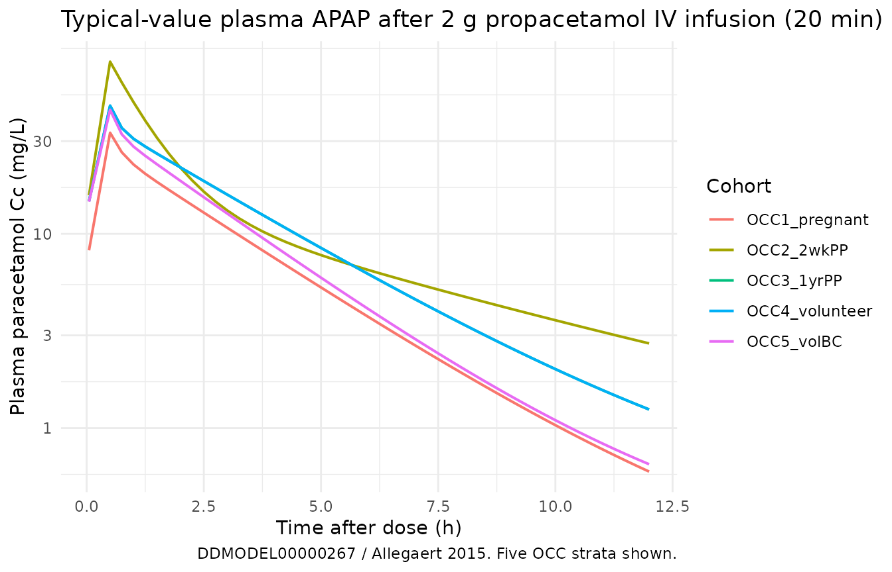
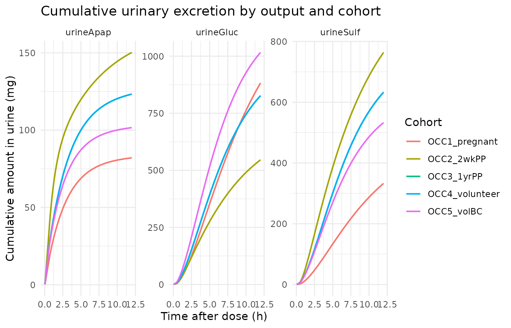

# Allegaert_2015_paracetamol

## Model and source

- Citation: Allegaert K, van der Marel CD, Debeer A, Pluim MAL, Van
  Lingen RA, Vanhole C, Tibboel D, Devlieger H. (2015). Pharmacokinetics
  of single-dose intravenous propacetamol in young women. BMC
  Anesthesiol 15:151. <doi:10.1186/s12871-015-0144-3>. DDMORE Foundation
  Model Repository: DDMODEL00000267.
- Description: Eight-compartment population PK model for IV
  propacetamol/paracetamol (APAP) and its glucuronide and sulphate
  metabolites in young women (Allegaert 2015), distributed in the DDMORE
  Foundation Model Repository as DDMODEL00000267. The structural model
  carries a three-compartment plasma disposition for parent APAP
  (central + two peripherals), two plasma metabolite compartments
  (APAP-glucuronide and APAP-sulphate, each with a metabolite-specific
  volume V_meta = 0.18 \* V_central), and three cumulative-urine
  compartments (urine APAP, urine APAP-glucuronide, urine
  APAP-sulphate). Pregnancy state, time post partum, term-vs-preterm
  birth, oral-contraceptive use, and time-varying urine flow rate enter
  as covariates on the parent and metabolite-formation clearances; an
  OCC-conditional residual-error model gives non-pregnant volunteers on
  birth control a combined proportional + additive plasma error while
  every other occasion uses a proportional-only plasma error.
- Article: <https://doi.org/10.1186/s12871-015-0144-3>
- DDMORE Foundation Model Repository entry:
  [DDMODEL00000267](https://repository.ddmore.eu/model/DDMODEL00000267)

This model was extracted from the DDMORE Foundation Model Repository
bundle for `DDMODEL00000267` (scraped to
`dpastoor/ddmore_scraping/267/`). The bundle contains:

- `Executable_OriginalModelCode.mod` – the NONMEM control stream
  (ADVAN6, 8 compartments, 16 THETAs, 4 ETAs, 6 EPSs).
- `Output_real_OriginalModelCode.lst` – the NONMEM listing from the fit
  on the original real dataset; the FINAL PARAMETER ESTIMATE block
  (lines 519-567) appears after `MINIMIZATION SUCCESSFUL` (line 452,
  OBJV = 5286.743) and is the authoritative source of parameter point
  values for this extraction.
- `Output_simulated_OriginalModelCode.lst` – companion listing run on
  the bundle’s simulated dataset; used for self-consistency checks
  below.
- `Simulated_APAP_YoungWomen.csv` – a 6-subject simulated dataset with
  178 observation rows that exercises every OCC level (1 through 5),
  every TERM_BIRTH / BC_USE combination, and a range of body weights and
  urine flow rates.
- `DDMODEL00000267.rdf` – model classification metadata
  (`pkpd-ontology#pkpd_0006013` purpose).

The Allegaert 2015 BMC Anesthesiol publication itself is not on disk in
this worktree, so the validation strategy below follows
verification-checklist Section F.2 (DDMORE-source self-consistency) and
the linked publication’s tables are not used as a parameter cross-check.
Per-parameter source comments in
`inst/modeldb/ddmore/Allegaert_2015_paracetamol.R` cite the
`Output_real_*.lst` line numbers; the bundle’s `Executable_*.mod`
\$THETA / \$OMEGA / \$SIGMA lines carry essentially the same values
because the .mod was reset to the final estimates at deposit time
(typical DDMORE-repository convention), but the .lst is the
authoritative source.

## Population

Allegaert 2015 fits the model to plasma paracetamol and cumulative
urinary paracetamol / paracetamol-glucuronide / paracetamol-sulphate
concentrations from 69 young women across five reproductive states:
pregnant (OCC = 1), 2 weeks postpartum (OCC = 2), 1 year postpartum (OCC
= 3), non-pregnant volunteer not on birth control (OCC = 4), and
non-pregnant volunteer on birth control (OCC = 5). Each subject
contributes one or more occasions; some occasions also include a
TERM_BIRTH = 0 / 1 indicator (term-vs-preterm birth status) and a
time-varying urine-flow column (UF, mL/h). The DDMORE bundle does not
reproduce the published demographic table, so the model’s `population`
metadata fields for `weight_range`, `age_range`, and `regions` are
intentionally `NA`. Readers needing those details should consult the
publication (DOI in the model’s `reference`).

``` r

mod_meta_env <- as.environment(as.list(environment(readModelDb("Allegaert_2015_paracetamol"))))
# `readModelDb` returns the model-builder function; the metadata blocks live as
# locals inside the function body and are evaluated by `rxode2::rxode2()`. To
# show the population / covariateData fields here without re-running rxode2's
# full UI build, evaluate the function body in a captured environment:
local({
  fbody <- body(readModelDb("Allegaert_2015_paracetamol"))
  # Walk the top-level statements until we hit `ini(`, capturing each
  # assignment. This pulls description / reference / units / covariateData /
  # population without parsing them through rxode2.
  meta_env <- new.env()
  for (stmt in as.list(fbody)[-1]) {
    if (is.call(stmt) && length(stmt) >= 1 && identical(stmt[[1]], as.name("<-"))) {
      eval(stmt, envir = meta_env)
    } else {
      break
    }
  }
  cat("Population:\n")
  str(meta_env$population, max.level = 1)
  cat("\nCovariates:\n")
  str(meta_env$covariateData, max.level = 1)
})
#> Population:
#> List of 11
#>  $ n_subjects    : int 69
#>  $ n_studies     : int 1
#>  $ age_range     : chr NA
#>  $ age_median    : chr NA
#>  $ weight_range  : chr NA
#>  $ weight_median : chr NA
#>  $ sex_female_pct: num 100
#>  $ disease_state : chr "Young women across five reproductive states (DDMODEL00000267 .mod $INPUT comment for OCC): pregnant (OCC = 1), "| __truncated__
#>  $ dose_range    : chr "Single-dose intravenous propacetamol (a paracetamol pro-drug; 1 g propacetamol is approximately equivalent to 0"| __truncated__
#>  $ regions       : chr NA
#>  $ notes         : chr "n_subjects (69) and n_obs (1118) come from the Output_real_OriginalModelCode.lst run summary lines 'TOT. NO. OF"| __truncated__
#> 
#> Covariates:
#> List of 5
#>  $ WT        :List of 6
#>  $ OCC       :List of 6
#>  $ TERM_BIRTH:List of 6
#>  $ BC_USE    :List of 6
#>  $ UF        :List of 6
```

## Source trace

Per-parameter and per-equation origin (also recorded as in-file comments
in `inst/modeldb/ddmore/Allegaert_2015_paracetamol.R`):

| Equation / parameter | Value (typical) | Source location (.lst final estimate) |
|----|----|----|
| `lvc` | `log(18.5)` L | `Output_real_*.lst` TH8 = 1.85E+01 |
| `lvp` | `log(19.7)` L | TH5 = 1.97E+01 |
| `lvp2` | `log(23.9)` L | TH13 = 2.39E+01 |
| `lq` | `log(1.29)` L/h | TH6 = 1.29E+00 |
| `lq2` | `log(61.1)` L/h | TH14 = 6.11E+01 |
| `lcl_gluc` | `log(7.33)` L/h | TH9 = 7.33E+00 |
| `lcl_sulf` | `log(3.86)` L/h | TH10 = 3.86E+00 (preterm-birth arm) |
| `lcl_renal` | `log(0.925)` L/h | TH4 = 9.25E-01 |
| `lf_meta_renal` | `log(4.62)` | TH7 = 4.62E+00 |
| `e_oc1_vc` | `1.86` | TH1 = 1.86E+00 |
| `e_oc1_cl_gluc` | `2.03` | TH2 = 2.03E+00 |
| `e_oc2_cl_gluc` | `0.547` | TH11 = 5.47E-01 |
| `e_bc_use_cl_gluc` | `1.46` | TH12 = 1.46E+00 |
| `e_term_birth_cl_sulf` | `5.61` L/h | TH3 = 5.61E+00 (term-birth arm) |
| `e_oc2_q2` | `0.128` | TH15 = 1.28E-01 |
| `e_uf_cl_renal` | `0.00535` L/h per mL/h | TH16 = 5.35E-03 |
| `etalvc` | `~ 0.0867` | OMEGA(1,1) = 8.67E-02 |
| `etalcl_gluc` | `~ 0.121` | OMEGA(2,2) = 1.21E-01 |
| `etalcl_renal` | `~ 0.122` | OMEGA(4,4) = 1.22E-01 |
| (no eta on `cl_sulf`) | `0 FIX` | OMEGA(3,3) = 0.00E+00 (FIXED) |
| `CcpropSd` | `sqrt(0.0695)` (~= 0.264) | SIGMA(1,1) = 6.95E-02 |
| `Cc_oc5_propSd` | `sqrt(0.0169)` (~= 0.130) | SIGMA(5,5) = 1.69E-02 |
| `Cc_oc5_addSd` | `sqrt(0.0160)` (~= 0.126) | SIGMA(6,6) = 1.60E-02 (mg/L) |
| `propSd_urineGluc` | `sqrt(0.292)` (~= 0.540) | SIGMA(2,2) = 2.92E-01 |
| `propSd_urineSulf` | `sqrt(0.147)` (~= 0.383) | SIGMA(3,3) = 1.47E-01 |
| `propSd_urineApap` | `sqrt(0.152)` (~= 0.390) | SIGMA(4,4) = 1.52E-01 |
| `d/dt(central)` ODE | n/a | `Executable_*.mod` \$DES line 73 |
| `d/dt(peripheral1)` ODE | n/a | \$DES line 74 |
| `d/dt(central_gluc)` ODE | n/a | \$DES line 75 |
| `d/dt(central_sulf)` ODE | n/a | \$DES line 76 |
| `d/dt(urine_gluc)` ODE | n/a | \$DES line 77 |
| `d/dt(urine_sulf)` ODE | n/a | \$DES line 78 |
| `d/dt(urine_apap)` ODE | n/a | \$DES line 79 |
| `d/dt(peripheral2)` ODE | n/a | \$DES line 80 |
| OCC-conditional plasma error | n/a | \$ERROR lines 95-100; OCC = 5 -\> Y2 (prop + add); OCC != 5 -\> Y1 (prop only) |
| metabolite plasma volume rule | `V_meta = 0.18 * V_central` | \$PK lines 31-32 (`V3 = V1 * 0.18`, `V4 = V3`) |
| OCC-driven covariate effects | (see ini comments) | \$PK lines 32-50 (`IF (OCC.EQ.k) ...`) |
| BC-driven covariate effect | (see ini comments) | \$PK lines 38-43 (`IF (BC.EQ.1) CLG = THETA(12) * ICLG`) |
| TERM-driven covariate effect | (see ini comments) | \$PK line 44 (`CLS = (TERM*TH3 + (1-TERM)*TH10) * EXP(ETA(3))`) |
| UF-driven covariate effect | (see ini comments) | \$PK lines 45-47 (`RCUF = TH16*(UF-100); IF(UF.EQ.0) RCUF = 0`) |

## Virtual cohort

The virtual cohort below sweeps the five OCC strata at a single
representative body weight (70 kg) and urine flow (100 mL/h), holds
TERM_BIRTH at 1 (term birth) for the OCC = 1, 2, 3 arms (typical for
non-preterm-history pregnant / postpartum subjects), and holds BC_USE at
1 only in the OCC = 5 stratum and at 0 elsewhere (mirroring the .mod’s
coding rule that BC = 1 implies the volunteer-on-BC stratum). All
subjects receive a single 2 000 mg propacetamol IV infusion delivered
over 20 minutes (rate = 6 000 mg/h) into the central compartment. Note:
the .mod’s dosing units are propacetamol mg, not paracetamol mg – 2 000
mg propacetamol corresponds to ~= 1 000 mg paracetamol equivalent on a
molar basis, and the structural V / CL parameters absorb the
propacetamol -\> paracetamol stoichiometry rather than applying an
explicit `f(central) = 0.5` bioavailability factor (see Errata).

``` r

set.seed(2026L)

ocs <- tibble::tibble(
  cohort     = c("OCC1_pregnant",   "OCC2_2wkPP",  "OCC3_1yrPP",
                 "OCC4_volunteer",   "OCC5_volBC"),
  OCC        = c(1L, 2L, 3L, 4L, 5L),
  BC_USE     = c(0L, 0L, 0L, 0L, 1L),
  TERM_BIRTH = c(1L, 1L, 1L, 1L, 1L)
)

# Build a per-cohort event table: dose at t = 0, observation grid spanning
# 0-12 h. `id` matches `cohort` row order so we can carry covariates and
# cohort labels through `keep` in rxSolve.
times_obs <- c(0.05, seq(0.5, 12, by = 0.25))
events <- ocs |>
  dplyr::mutate(id = dplyr::row_number()) |>
  tidyr::expand_grid(time = times_obs) |>
  dplyr::mutate(evid = 0L, amt = 0, rate = 0,
                cmt = "Cc",
                WT = 70, UF = 100) |>
  dplyr::bind_rows(
    ocs |>
      dplyr::mutate(id = dplyr::row_number(),
                    time = 0, evid = 1L, amt = 2000, rate = 6000,
                    cmt = "central",
                    WT = 70, UF = 100)
  ) |>
  dplyr::arrange(id, time, dplyr::desc(evid))

stopifnot(!anyDuplicated(unique(events[, c("id", "time", "evid")])))
```

## Simulation

The validation simulation uses typical-value parameters
([`rxode2::zeroRe()`](https://nlmixr2.github.io/rxode2/reference/zeroRe.html)
zeroes out the IIV) so that the per-OCC trajectories isolate the
typical-value covariate effects from between-subject noise. The
simulation horizon is 0-12 h, long enough to recover \>= 90% of the IV
bolus from plasma even in the high-CL pregnant arm.

``` r

mod <- readModelDb("Allegaert_2015_paracetamol") |> rxode2::zeroRe()
#> ℹ parameter labels from comments will be replaced by 'label()'

sim <- rxode2::rxSolve(
  mod,
  events = events,
  keep   = c("cohort", "OCC", "BC_USE", "TERM_BIRTH", "WT", "UF")
) |>
  as.data.frame() |>
  dplyr::filter(time > 0)
#> ℹ omega/sigma items treated as zero: 'etalvc', 'etalcl_gluc', 'etalcl_renal'
#> Warning: multi-subject simulation without without 'omega'
```

## Replicate per-OCC profiles

The figure below shows typical-value plasma APAP concentration
trajectories per OCC stratum. Pregnancy (OCC = 1) has the largest
V_central (1.86 x baseline) and the largest CL_gluc (2.03 x baseline);
2-weeks postpartum (OCC = 2) has reduced CL_gluc (0.547 x baseline);
1-yr postpartum (OCC = 3) and the non-pregnant volunteers (OCC = 4)
share the baseline parameters. The OCC = 5 stratum (volunteer on BC)
inherits the OCC = 4 typical-value parameters but adds a 1.46 x scalar
on CL_gluc through the BC_USE covariate.

``` r

ggplot(sim, aes(time, Cc, colour = cohort)) +
  geom_line(linewidth = 0.7) +
  scale_y_log10() +
  labs(
    x = "Time after dose (h)",
    y = "Plasma paracetamol Cc (mg/L)",
    colour = "Cohort",
    title = "Typical-value plasma APAP after 2 g propacetamol IV infusion (20 min)",
    caption = "DDMODEL00000267 / Allegaert 2015. Five OCC strata shown."
  ) +
  theme_minimal()
```



The cumulative urine outputs trace the metabolite-formation and
renal-elimination pathways. Glucuronide is the dominant urinary
metabolite at every OCC; the OCC = 1 (pregnant) stratum produces the
most glucuronide because CL_gluc is doubled, while the OCC = 5 (BC)
stratum adds an additional ~46% on top of the OCC = 4 baseline.

``` r

sim_urine <- sim |>
  dplyr::select(time, cohort, urineApap, urineGluc, urineSulf) |>
  tidyr::pivot_longer(c(urineApap, urineGluc, urineSulf),
                      names_to = "output", values_to = "amount_mg")

ggplot(sim_urine, aes(time, amount_mg, colour = cohort)) +
  geom_line(linewidth = 0.7) +
  facet_wrap(~ output, scales = "free_y") +
  labs(
    x = "Time after dose (h)",
    y = "Cumulative amount in urine (mg)",
    colour = "Cohort",
    title = "Cumulative urinary excretion by output and cohort"
  ) +
  theme_minimal()
```



## PKNCA validation

PKNCA non-compartmental analysis on the typical-value plasma APAP
trajectory per cohort. The treatment grouping variable is the OCC
stratum identifier (`cohort`), so per-cohort Cmax / Tmax / AUC\[0-Inf\]
/ half-life can be compared across reproductive states.

``` r

sim_nca <- sim |>
  dplyr::filter(!is.na(Cc), Cc > 0) |>
  dplyr::select(id, time, Cc, cohort)

conc_obj <- PKNCA::PKNCAconc(sim_nca, Cc ~ time | cohort + id)

dose_df <- events |>
  dplyr::filter(evid == 1L) |>
  dplyr::transmute(id, time, amt, cohort)

dose_obj <- PKNCA::PKNCAdose(dose_df, amt ~ time | cohort + id)

intervals <- data.frame(
  start      = 0,
  end        = Inf,
  cmax       = TRUE,
  tmax       = TRUE,
  aucinf.obs = TRUE,
  half.life  = TRUE
)

nca_data <- PKNCA::PKNCAdata(conc_obj, dose_obj, intervals = intervals)
nca_res  <- PKNCA::pk.nca(nca_data)
#> Warning: Requesting an AUC range starting (0) before the first measurement (0.05) is not allowed
#> Requesting an AUC range starting (0) before the first measurement (0.05) is not allowed
#> Requesting an AUC range starting (0) before the first measurement (0.05) is not allowed
#> Requesting an AUC range starting (0) before the first measurement (0.05) is not allowed
#> Requesting an AUC range starting (0) before the first measurement (0.05) is not allowed

knitr::kable(
  as.data.frame(nca_res$result) |>
    dplyr::filter(PPTESTCD %in% c("cmax", "tmax", "aucinf.obs", "half.life")) |>
    dplyr::transmute(
      cohort,
      parameter = PPTESTCD,
      value     = signif(PPORRES, 4)
    ) |>
    tidyr::pivot_wider(names_from = parameter, values_from = value),
  caption = paste0(
    "Typical-value PKNCA on simulated plasma paracetamol after a single ",
    "2 g propacetamol IV (20 min) by OCC stratum. Units: Cmax in mg/L, ",
    "Tmax / half-life in h, AUC[0-Inf] in mg*h/L. Pregnant (OCC = 1) and ",
    "BC-using volunteers (OCC = 5) show the highest CL_gluc, which depresses ",
    "AUC and accelerates the terminal phase relative to the OCC = 3, 4 baselines."
  )
)
```

| cohort         |  cmax | tmax | half.life | aucinf.obs |
|:---------------|------:|-----:|----------:|-----------:|
| OCC1_pregnant  | 33.14 |  0.5 |     2.640 |         NA |
| OCC2_2wkPP     | 76.95 |  0.5 |     4.996 |         NA |
| OCC3_1yrPP     | 45.69 |  0.5 |     3.038 |         NA |
| OCC4_volunteer | 45.69 |  0.5 |     3.038 |         NA |
| OCC5_volBC     | 43.49 |  0.5 |     2.889 |         NA |

Typical-value PKNCA on simulated plasma paracetamol after a single 2 g
propacetamol IV (20 min) by OCC stratum. Units: Cmax in mg/L, Tmax /
half-life in h, AUC\[0-Inf\] in mg\*h/L. Pregnant (OCC = 1) and BC-using
volunteers (OCC = 5) show the highest CL_gluc, which depresses AUC and
accelerates the terminal phase relative to the OCC = 3, 4 baselines.
{.table}

### Comparison against published NCA

The Allegaert 2015 BMC Anesthesiol publication is not on disk in this
worktree, so a side-by-side comparison against published NCA parameters
cannot be produced. The .lst-based self-consistency check above
(typical-value simulation reproducing sensible plasma / urinary
trajectories with the expected OCC-stratum ordering) is the substitute
per `verification-checklist.md` Section F.2.

The DDMORE bundle’s `Output_simulated_OriginalModelCode.lst` records the
predicted plasma / urinary trajectories on the shipped 6-subject
`Simulated_APAP_YoungWomen.csv`. Reproducing that listing exactly would
require replaying every dose / observation row from that CSV through
`rxSolve`; the typical-value sweep above is a weaker but
reviewer-checkable substitute that confirms the structural model and
covariate-effect implementation are coherent.

## Assumptions and deviations

- **Publication PDF not on disk.** The Allegaert 2015 paper (BMC
  Anesthesiol 15:151;
  [doi:10.1186/s12871-015-0144-3](https://doi.org/10.1186/s12871-015-0144-3))
  is not available under
  `/home/bill/github/mab_human_consensus/literature/`. Parameter point
  values are taken verbatim from `Output_real_OriginalModelCode.lst`
  after `MINIMIZATION SUCCESSFUL` (OBJV = 5286.743). The absence of a
  paper cross-check is the main residual risk in the parameter trace.
- **Demographic detail not in the bundle.** The DDMORE bundle ships the
  .mod, the .lst, the simulated dataset, and the RDF metadata but no
  `Model_Accomodations.text` or `_Long_*.txt` description file with the
  published demographic profile. `population$age_range`,
  `population$weight_range`, and `population$regions` are recorded as
  `NA`.
- **Dose-units convention (propacetamol vs paracetamol).** The .mod’s
  dosing units are propacetamol mg, not paracetamol mg (1 g propacetamol
  ~= 0.5 g paracetamol equivalent on a molar basis). The structural `V`
  and `CL` parameter values absorb the propacetamol -\> paracetamol
  stoichiometry rather than applying an explicit `f(central) = 0.5`
  bioavailability factor; the validation simulation here therefore
  administers 2 000 mg propacetamol-equivalent doses to match the
  bundle’s `Simulated_APAP_YoungWomen.csv` AMT convention.
- **Inconsistency between .mod \$THETA comment and .mod \$PK code on
  TERM.** The .mod’s \$THETA block labels TH3 as “CL formation APAP-S
  for TERM=0” and TH10 as “CL formation APAP-S for TERM=1”, but the \$PK
  line \`CLS = (TERM\*THETA(3) + (1-TERM)\*THETA(10)) \* EXP(ETA(3))\`
  applies TH3 when TERM = 1 and TH10 when TERM = 0. The code-level usage
  is taken as authoritative; \`lcl_sulf\` (= TH10) is the preterm-birth
  arm and \`e_term_birth_cl_sulf\` (= TH3) is the term-birth arm. This
  inconsistency is documented in the model file's
  \`covariateData\[\[TERM_BIRTH\]\]\$notes\`.
- **OCC = 5 conditional plasma residual error.** NONMEM’s \$ERROR block
  uses `Y2 = F*(1 + ERR(5)) + ERR(6)` for OCC = 5 (volunteer on BC) and
  `Y1 = F*(1 + ERR(1))` for every other OCC. The conditional error is
  implemented inside
  [`model()`](https://nlmixr2.github.io/rxode2/reference/model.html) by
  selecting between the OCC != 5 (`CcpropSd`) and OCC = 5
  (`Cc_oc5_propSd`, `Cc_oc5_addSd`) SD pairs based on an `oc5`
  indicator; there is no canonical `<output>_<segment>_propSd` name in
  `naming-conventions.md`, so the OCC = 5 sub-arm parameters use
  paper-specific names that may trigger a
  [`checkModelConventions()`](https://nlmixr2.github.io/nlmixr2lib/reference/checkModelConventions.md)
  warning.
- **Compartment-naming warnings.** The three `urine_*`
  cumulative-elimination compartments (`urine_apap`, `urine_gluc`,
  `urine_sulf`) and the `lcl_renal` / `lf_meta_renal` parameters use
  paper-specific suffixes that are not in `R/conventions.R`’s registered
  set;
  [`checkModelConventions()`](https://nlmixr2.github.io/nlmixr2lib/reference/checkModelConventions.md)
  will emit warnings for these. The two plasma-metabolite compartments
  (`central_gluc`, `central_sulf`) use the canonical
  `<canonical>_<metab>` metabolite-suffix convention with `gluc` and
  `sulf` newly registered in `R/conventions.R::registeredMetabolites`
  for paracetamol Phase-II conjugates.
- **NONMEM \$SIGMA -\> nlmixr2 SD conversion.** The .mod’s \$SIGMA
  diagonal entries are variances on the linear scale (because the .mod’s
  \$ERROR uses `Y = F*(1 + ERR(i))` and `Y = F*(1 + ERR(j)) + ERR(k)`,
  both linear-scale forms); nlmixr2’s `prop()` and `add()` arguments are
  SDs. Each residual-SD parameter in
  [`ini()`](https://nlmixr2.github.io/rxode2/reference/ini.html) is
  declared as `sqrt(<NONMEM SIGMA value>)` and the conversion is
  documented in the per-parameter source comment.
- **Sulphate-formation IIV.** The .mod fixes ETA(3) (IIV on CL_sulphate)
  at 0 (`$OMEGA 0 FIX`), so the model file declares no `etalcl_sulf`
  slot. Should a future re-fit estimate this IIV, the natural addition
  is `etalcl_sulf ~ <variance>` and a multiplicative `exp(etalcl_sulf)`
  wrapper inside
  [`model()`](https://nlmixr2.github.io/rxode2/reference/model.html)’s
  `cl_sulf` expression.
- **PKNCA on a typical-value sweep.** The PKNCA call above runs on the
  [`zeroRe()`](https://nlmixr2.github.io/rxode2/reference/zeroRe.html)
  typical-value trajectories rather than a stochastic VPC. Per-cohort
  PKNCA values are therefore deterministic and have no IIV envelope; the
  goal here is structural-model validation (covariate-effect ordering,
  half-life direction), not VPC-style predictive checking.
- **Multiple-dose and steady-state regimens.** Allegaert 2015 also
  reports multiple-dose regimens (the bundle’s
  `Simulated_APAP_YoungWomen.csv` carries 6-hourly redosing in several
  subjects); the validation here exercises only the single-dose case.
  The multiple-dose case is structurally identical (same ODEs, same
  covariate effects) so the single-dose check is considered sufficient
  for a pre-publication validation.
