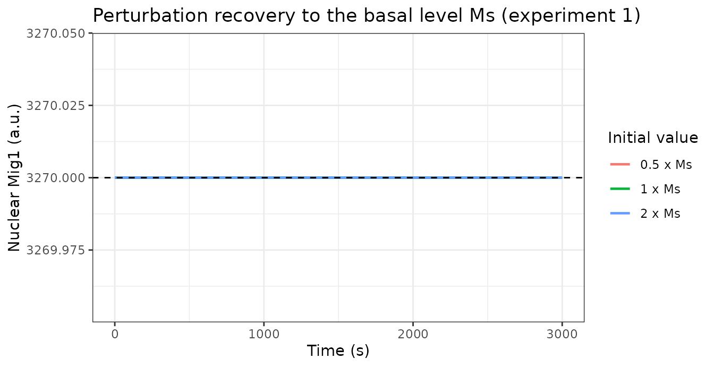
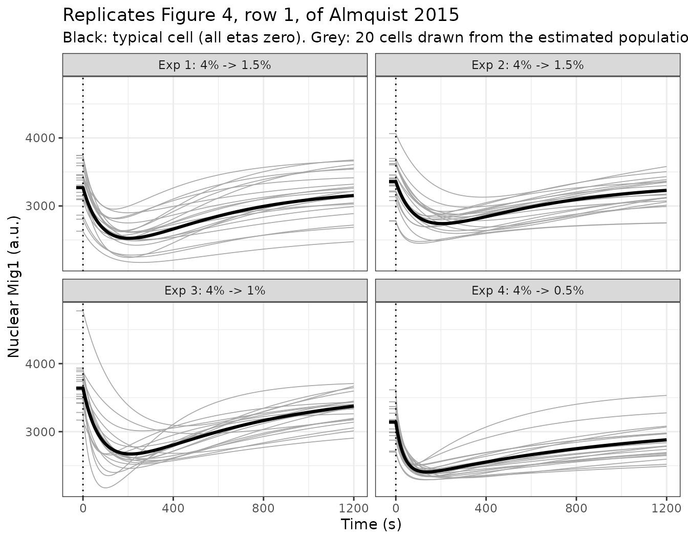
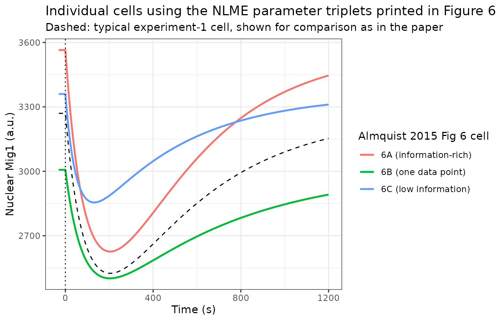
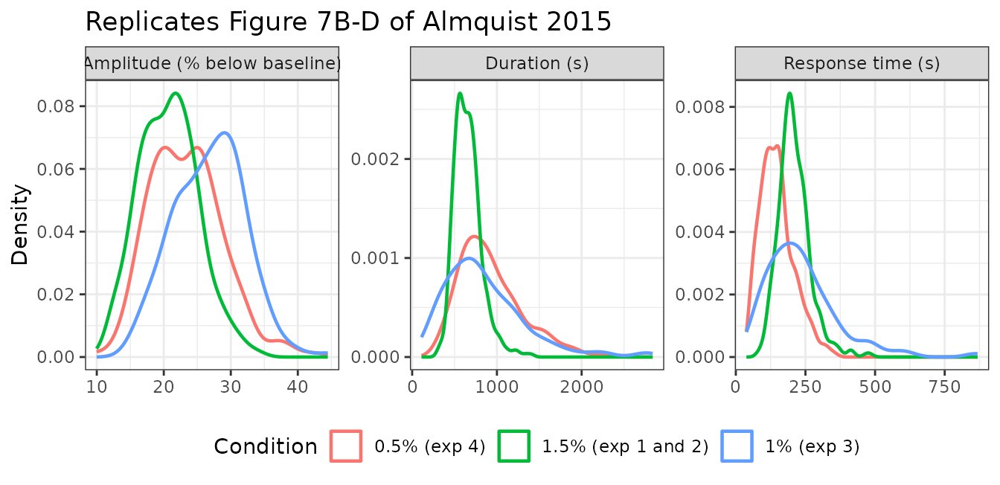

# Cell-to-cell variability of Mig1 dynamics in yeast (Almquist 2015)

## Model and source

- Citation: Almquist J, Bendrioua L, Adiels CB, Goksor M, Hohmann S,
  Jirstrand M. “A Nonlinear Mixed Effects Approach for Modeling the
  Cell-To-Cell Variability of Mig1 Dynamics in Yeast.” *PLoS ONE* (2015)
  10(4):e0124050.
- Article: <https://doi.org/10.1371/journal.pone.0124050>

This paper is unusual for `nlmixr2lib`: it is not a pharmacokinetic
study at all. It applies the population (nonlinear mixed effects)
machinery that pharmacometrics uses for between-*patient* variability to
between-*cell* variability in a single-cell molecular-biology
experiment. The “individual” is one yeast cell, the “dose” is an
instantaneous step down in extracellular glucose, and the
“concentration” is the fluorescent light intensity of nuclear Mig1-GFP.

Four models are packaged, one per experiment, because the authors fitted
each experiment separately and reported four separate parameter sets
(Tables 2 and 3):

``` r

mods <- list(
  exp1 = readModelDb("Almquist_2015_Mig1_exp1"),
  exp2 = readModelDb("Almquist_2015_Mig1_exp2"),
  exp3 = readModelDb("Almquist_2015_Mig1_exp3"),
  exp4 = readModelDb("Almquist_2015_Mig1_exp4")
)
ui <- lapply(mods, rxode2::rxode)

data.frame(
  Experiment = names(mods),
  Cells      = vapply(mods, function(f) as.integer(f()$population$n_subjects), integer(1)),
  Glucose    = c("4% -> 1.5%", "4% -> 1.5%", "4% -> 1%", "4% -> 0.5%"),
  row.names  = NULL
) |>
  knitr::kable(caption = "Almquist 2015 Table 1: the four experiments.")
```

| Experiment | Cells | Glucose     |
|:-----------|------:|:------------|
| exp1       |    56 | 4% -\> 1.5% |
| exp2       |    46 | 4% -\> 1.5% |
| exp3       |    46 | 4% -\> 1%   |
| exp4       |    46 | 4% -\> 0.5% |

Almquist 2015 Table 1: the four experiments. {.table}

## Population

The data are single-cell time-lapse fluorescence-microscopy recordings
from a Mig1-GFP expressing *Saccharomyces cerevisiae* strain, acquired
with a setup combining microfluidics, optical tweezers, fluorescence
microscopy and image processing (Almquist 2015 Methods; the experimental
system was published separately as reference 39 of the source paper).
Glucose-grown cells were subjected to an instantaneous shift in
extracellular glucose from 4% down to an intermediate level, and nuclear
Mig1 intensity was followed for 20 minutes with up to 15 observations
per cell.

In total 194 cells across four experiments were used (Table 1): 56 cells
at 4% -\> 1.5% (experiment 1), 46 cells at 4% -\> 1.5% (experiment 2, a
biological replicate), 46 cells at 4% -\> 1% (experiment 3), and 46
cells at 4% -\> 0.5% (experiment 4). The characteristic response is a
rapid exit of Mig1 from the nucleus followed by a slower re-entry back
towards the pre-shift baseline; both the depth of the exit and the
duration of the transient increase as the post-shift glucose level
falls. Below 0.5% glucose the transient disappears entirely, which is
why 0.5% is the lowest level studied.

The same information is available programmatically via
`readModelDb("Almquist_2015_Mig1_exp1")()$population`.

## Model structure

The authors deliberately chose a *phenomenological* model rather than a
mechanistic one, because the current understanding of the Snf1-Mig1
system does not explain the transient behaviour, and because there is
only one measured species from which to calibrate. The model is the
minimal perfect-adaptation motif with two states:

- `mig1` – nuclear Mig1, expressed in units of the observed fluorescent
  light intensity. The authors note that the scaling factor between
  light intensity and true Mig1 molar concentration is unknown, so the
  model is formulated directly in intensity units.
- `adapt` – the paper’s `X(t)`, a dimensionless lumped effect of one or
  more unknown components that mediate the adaptation.

As published (before reduction), the mass balances are

    dMig1/dt = r1 - r2,   r1 = k1 * Glu(t),   r2 = k2 * X(t) * Mig1(t)
    dX/dt    = r3 - r4,   r3 = k3 * Glu(t),   r4 = k4 * X(t)

with `Glu(t) = 4 - (4 - g) * H(t)`, `H` the Heaviside step at time 0 and
`g` in {1.5, 1, 0.5}. The initial time is -30 s.

Two published simplifications are carried into the model file.

**Identifiability reduction.** With `X(t)` unmeasured the model is
structurally unidentifiable: the substitution `X~ = alpha * X`,
`k2~ = k2 / alpha`, `k3~ = alpha * k3` leaves `Mig1(t)` unchanged.
Choosing `alpha = k4 / (k3 * Glu(-30))` removes `k3` entirely, which is
why `k4` ends up in *both* the production and the loss term of the `X`
equation.

**Steady-state reparameterization.** Requiring the system to sit at
steady state at `t = -30` forces `Xs = 1` and lets `k1` be written as
`k1 = k2 * Ms / Glu(-30)`, promoting the basal Mig1 level `Ms` to an
explicit parameter. The reduced system that the model file encodes is
therefore

    dMig1/dt = (k2 * Ms / Glu(-30)) * Glu(t) - k2 * X(t) * Mig1(t)
    dX/dt    = k4 * Glu(t) / Glu(-30)        - k4 * X(t)
    Mig1(-30) = Ms,   X(-30) = 1

Cell-to-cell variability enters as `Ms = Ms_hat * exp(eta1)`,
`k2 = k2_hat * exp(eta2)`, `k4 = k4_hat * exp(eta3)` with
`eta ~ N(0, Omega)` and `Omega` a full 3x3 block – exactly the
log-transformed typical value plus additive eta parameterization
`nlmixr2` uses.

``` r

ui$exp1$modelDesc
#> [1] "rxode2-based free-form 2-cmt ODE model"
```

## Source trace

Every `ini()` entry carries an in-file comment naming its source
location. The table below collects them.

| Model quantity | File parameter | Exp 1 | Exp 2 | Exp 3 | Exp 4 | Source |
|----|----|----|----|----|----|----|
| Basal nuclear Mig1 `Ms` (a.u.) | `lrbase` (log scale) | 3.27e3 | 3.36e3 | 3.64e3 | 3.14e3 | Table 2 |
| Mig1 loss rate `k2` (1/s) | `lkout_mig1` (log scale) | 0.00579 | 0.00473 | 0.00592 | 0.00815 | Table 2 |
| Adaptation rate `k4` (1/s) | `lkout_adapt` (log scale) | 0.00846 | 0.00971 | 0.00999 | 0.0229 | Table 2 |
| Measurement error **variance** `s` | `addSd_mig1` = `sqrt(s)` | 8.73e3 | 38.1e3 | 20.8e3 | 24.1e3 | Table 2 |
| Random-effect covariance `Omega` | `etalrbase + etalkout_mig1 + etalkout_adapt` | see below |  |  |  | Tables 2 and 3 |
| Pre-shift glucose `Glu(-30)` (%) | `glu_pre` = 4 | 4 | 4 | 4 | 4 | Table 1 |
| Post-shift glucose `g` (%) | `glu_post` | 1.5 | 1.5 | 1 | 0.5 | Table 1 |
| `Glu(t) = 4 - (4 - g) * H(t)` | `glu` in `model()` |  |  |  |  | Results, “Setting up a model” |
| `k1 = k2 * Ms / Glu(-30)` | `kin_mig1` in `model()` |  |  |  |  | Results, “Setting up a model” |
| `Mig1(-30) = Ms`, `X(-30) = Xs = 1` | `mig1(0)`, `adapt(0)` |  |  |  |  | Results, “Setting up a model” |
| `y_t = Mig1(t) + e_t`, `e_t ~ N(0, s)` | `mig1 ~ add(addSd_mig1)` |  |  |  |  | Results, “Setting up a model” |

Two source-reading decisions are worth stating explicitly.

**`s` is a variance, not a standard deviation.** The paper writes
“`e_t ~ N(0, s)`, with `s` denoting the **variance** of the measurement
error”, so the `nlmixr2` additive SD is `sqrt(s)`. The Methods section
corroborates this: “The measurement noise appear to be on the scale of a
hundred to a few hundreds and its variance, `s`, was set to 40 000” –
and `sqrt(40000) = 200`, which is indeed “a hundred to a few hundreds”.
Reading `s` as an SD would have made the starting value 40 000 intensity
units against a baseline of 3 300.

**`Omega` is reconstructed from Table 2, not transcribed from Table 3.**
Table 3 prints `Omega` to two significant figures; Table 2 gives the six
parameters `w11 ... w33` of the Cholesky-like decomposition to three.
The Methods section “Parameterization of the random effect covariance
matrix” defines `Omega = U %*% t(U)` with `U` upper triangular.
Rebuilding `Omega` from the Table 2 values gives full precision *and*
guarantees positive definiteness. The reconstruction reproduces every
printed entry of Table 3:

``` r

tab2_w <- list(
  exp1 = c(w11 = 0.0653, w12 = 0.0391, w13 = 47.5e-6, w22 = 0.231, w23 = 0.0398, w33 = 0.255),
  exp2 = c(w11 = 0.0712, w12 = 0.0447, w13 = -0.0377, w22 = 0.144, w23 = 0.193,  w33 = 0.439),
  exp3 = c(w11 = 0.0624, w12 = 0.0568, w13 = -0.0649, w22 = 0.313, w23 = 0.526,  w33 = 0.567),
  exp4 = c(w11 = 0.0228, w12 = 0.0691, w13 = -0.0322, w22 = 0.252, w23 = 0.281,  w33 = 0.432)
)
omega_from_tab2 <- function(p) {
  U <- matrix(c(p[["w11"]], p[["w12"]], p[["w13"]],
                0,          p[["w22"]], p[["w23"]],
                0,          0,          p[["w33"]]), nrow = 3, byrow = TRUE)
  U %*% t(U)
}
rebuilt <- lapply(tab2_w, omega_from_tab2)

# Table 3 as printed (lower triangle, 2 significant figures).
tab3_printed <- list(
  exp1 = c(0.0058, 0.009,     0.055, 12e-6,  0.01,  0.065),
  exp2 = c(0.0085, -840e-6,   0.058, -0.017, 0.085, 0.19),
  exp3 = c(0.011,  -0.016,    0.37,  -0.037, 0.3,   0.32),
  exp4 = c(0.0063, 0.0083,    0.14,  -0.014, 0.12,  0.19)
)
lower <- function(M) c(M[1, 1], M[2, 1], M[2, 2], M[3, 1], M[3, 2], M[3, 3])

# Both sides of this comparison are rounded, and neither rounding is
# negligible, so the check is an interval-overlap test rather than a
# digit-for-digit one:
#   * Table 2 prints w11 ... w33 to 3 significant figures, so each Omega entry
#     is only pinned to the range spanned by those rounding intervals. Every
#     entry is multilinear or separable-convex in the six w values and none of
#     the intervals straddles zero, so evaluating the 2^6 box corners gives the
#     exact attainable range.
#   * Table 3 itself prints Omega to 2 significant figures, so the printed value
#     stands for any number within half a unit in its last place.
# The reconstruction is confirmed when those two intervals overlap. This is a
# real gate, not a formality: swapping or sign-flipping any single w makes it
# fail.
half_ulp <- function(x, digits) 0.5 * 10^(floor(log10(abs(x))) - digits + 1)

omega_range <- function(w) {
  h <- half_ulp(w, 3)
  corners <- as.matrix(expand.grid(lapply(seq_along(w), function(i) c(w[i] - h[i], w[i] + h[i]))))
  vals <- t(apply(corners, 1, function(p) lower(omega_from_tab2(setNames(p, names(w))))))
  list(lo = apply(vals, 2, min), hi = apply(vals, 2, max))
}

omega_cmp <- bind_rows(lapply(names(rebuilt), function(nm) {
  rng <- omega_range(tab2_w[[nm]])
  pr  <- tab3_printed[[nm]]
  hp  <- half_ulp(pr, 2)
  data.frame(
    Experiment  = nm,
    Entry       = c("Omega11", "Omega21", "Omega22", "Omega31", "Omega32", "Omega33"),
    Rebuilt     = signif(lower(rebuilt[[nm]]), 6),
    `Rebuilt low`  = signif(rng$lo, 6),
    `Rebuilt high` = signif(rng$hi, 6),
    Table3      = pr,
    Agrees      = (pr + hp) >= rng$lo & (pr - hp) <= rng$hi,
    check.names = FALSE
  )
}))
knitr::kable(omega_cmp, caption = "Omega rebuilt from Table 2 vs. Omega as printed in Table 3. `Rebuilt low` / `Rebuilt high` span the 3-significant-figure rounding of the Table 2 inputs.")
```

| Experiment | Entry   |    Rebuilt | Rebuilt low | Rebuilt high |   Table3 | Agrees |
|:-----------|:--------|-----------:|------------:|-------------:|---------:|:-------|
| exp1       | Omega11 |  0.0057929 |   0.0057825 |    0.0058033 |  5.8e-03 | TRUE   |
| exp1       | Omega21 |  0.0090340 |   0.0090029 |    0.0090651 |  9.0e-03 | TRUE   |
| exp1       | Omega22 |  0.0549450 |   0.0547103 |    0.0551803 |  5.5e-02 | TRUE   |
| exp1       | Omega31 |  0.0000121 |   0.0000121 |    0.0000121 |  1.2e-05 | TRUE   |
| exp1       | Omega32 |  0.0101490 |   0.0101164 |    0.0101817 |  1.0e-02 | TRUE   |
| exp1       | Omega33 |  0.0650250 |   0.0647702 |    0.0652802 |  6.5e-02 | TRUE   |
| exp2       | Omega11 |  0.0084888 |   0.0084735 |    0.0085042 |  8.5e-03 | TRUE   |
| exp2       | Omega21 | -0.0008393 |  -0.0008974 |   -0.0007813 | -8.4e-04 | TRUE   |
| exp2       | Omega22 |  0.0579850 |   0.0576485 |    0.0583225 |  5.8e-02 | TRUE   |
| exp2       | Omega31 | -0.0165503 |  -0.0165911 |   -0.0165095 | -1.7e-02 | TRUE   |
| exp2       | Omega32 |  0.0847270 |   0.0844113 |    0.0850432 |  8.5e-02 | TRUE   |
| exp2       | Omega33 |  0.1927210 |   0.1922820 |    0.1931600 |  1.9e-01 | TRUE   |
| exp3       | Omega11 |  0.0113320 |   0.0113136 |    0.0113504 |  1.1e-02 | TRUE   |
| exp3       | Omega21 | -0.0163590 |  -0.0164618 |   -0.0162562 | -1.6e-02 | TRUE   |
| exp3       | Omega22 |  0.3746450 |   0.3738070 |    0.3754840 |  3.7e-01 | TRUE   |
| exp3       | Omega31 | -0.0367983 |  -0.0368591 |   -0.0367375 | -3.7e-02 | TRUE   |
| exp3       | Omega32 |  0.2982420 |   0.2976960 |    0.2987890 |  3.0e-01 | TRUE   |
| exp3       | Omega33 |  0.3214890 |   0.3209220 |    0.3220560 |  3.2e-01 | TRUE   |
| exp4       | Omega11 |  0.0063315 |   0.0063191 |    0.0063439 |  6.3e-03 | TRUE   |
| exp4       | Omega21 |  0.0083650 |   0.0082877 |    0.0084423 |  8.3e-03 | TRUE   |
| exp4       | Omega22 |  0.1424650 |   0.1419330 |    0.1429990 |  1.4e-01 | TRUE   |
| exp4       | Omega31 | -0.0139104 |  -0.0139481 |   -0.0138727 | -1.4e-02 | TRUE   |
| exp4       | Omega32 |  0.1213920 |   0.1210360 |    0.1217490 |  1.2e-01 | TRUE   |
| exp4       | Omega33 |  0.1866240 |   0.1861920 |    0.1870560 |  1.9e-01 | TRUE   |

Omega rebuilt from Table 2 vs. Omega as printed in Table 3.
`Rebuilt low` / `Rebuilt high` span the 3-significant-figure rounding of
the Table 2 inputs. {.table style="width:100%;"}

``` r


stopifnot(all(omega_cmp$Agrees))
```

Every entry overlaps. The single largest gap is `Omega21` of experiment
4, where the reconstruction gives 0.008365 but Table 3 prints 0.0083:
that entry is `w12 * w22 + w13 * w23`, a difference of two similar
products, so the 3-significant-figure inputs only pin it to roughly
0.00829 to 0.00844 and the printed 0.0083 sits inside that band. The
packaged files carry the point estimate.

The implied correlation matrices also match the Table 3 correlation
block, and every `Omega` is positive definite by construction:

``` r

tab3_corr <- list(
  exp1 = c(0.51,   0.00062, 0.17),
  exp2 = c(-0.038, -0.41,   0.80),
  exp3 = c(-0.25,  -0.61,   0.86),
  exp4 = c(0.28,   -0.41,   0.74)
)
corr3 <- function(w) {
  R <- cov2cor(omega_from_tab2(w))
  c(R[2, 1], R[3, 1], R[3, 2])
}

# Same interval-overlap logic as the covariance check above. A correlation is a
# smooth ratio rather than a multilinear function of the w values, so corner
# evaluation is strictly an approximation to the attainable range -- but the
# rounding box is only about 0.1% wide in each coordinate, over which the ratio
# is effectively linear, so the corner scan bounds it to well beyond the
# precision at issue here.
corr_cmp <- bind_rows(lapply(names(rebuilt), function(nm) {
  w  <- tab2_w[[nm]]
  h  <- half_ulp(w, 3)
  cn <- as.matrix(expand.grid(lapply(seq_along(w), function(i) c(w[i] - h[i], w[i] + h[i]))))
  v  <- t(apply(cn, 1, function(p) corr3(setNames(p, names(w)))))
  pr <- tab3_corr[[nm]]
  hp <- half_ulp(pr, 2)
  data.frame(
    Experiment     = nm,
    Pair           = c("corr(eta1, eta2)", "corr(eta1, eta3)", "corr(eta2, eta3)"),
    Rebuilt        = signif(corr3(w), 4),
    `Rebuilt low`  = signif(apply(v, 2, min), 4),
    `Rebuilt high` = signif(apply(v, 2, max), 4),
    Table3         = pr,
    Agrees         = (pr + hp) >= apply(v, 2, min) & (pr - hp) <= apply(v, 2, max),
    check.names    = FALSE
  )
}))
knitr::kable(corr_cmp, caption = "Correlation matrices rebuilt from Table 2 vs. Table 3.")
```

| Experiment | Pair | Rebuilt | Rebuilt low | Rebuilt high | Table3 | Agrees |
|:---|:---|---:|---:|---:|---:|:---|
| exp1 | corr(eta1, eta2) | 0.5064000 | 0.5056000 | 0.5072000 | 0.51000 | TRUE |
| exp1 | corr(eta1, eta3) | 0.0006241 | 0.0006229 | 0.0006253 | 0.00062 | TRUE |
| exp1 | corr(eta2, eta3) | 0.1698000 | 0.1692000 | 0.1704000 | 0.17000 | TRUE |
| exp2 | corr(eta1, eta2) | -0.0378300 | -0.0404500 | -0.0352100 | -0.03800 | TRUE |
| exp2 | corr(eta1, eta3) | -0.4092000 | -0.4099000 | -0.4085000 | -0.41000 | TRUE |
| exp2 | corr(eta2, eta3) | 0.8015000 | 0.7998000 | 0.8032000 | 0.80000 | TRUE |
| exp3 | corr(eta1, eta2) | -0.2511000 | -0.2526000 | -0.2495000 | -0.25000 | TRUE |
| exp3 | corr(eta1, eta3) | -0.6097000 | -0.6103000 | -0.6090000 | -0.61000 | TRUE |
| exp3 | corr(eta2, eta3) | 0.8594000 | 0.8588000 | 0.8599000 | 0.86000 | TRUE |
| exp4 | corr(eta1, eta2) | 0.2785000 | 0.2759000 | 0.2811000 | 0.28000 | TRUE |
| exp4 | corr(eta1, eta3) | -0.4047000 | -0.4055000 | -0.4039000 | -0.41000 | TRUE |
| exp4 | corr(eta2, eta3) | 0.7445000 | 0.7432000 | 0.7457000 | 0.74000 | TRUE |

Correlation matrices rebuilt from Table 2 vs. Table 3. {.table}

``` r


stopifnot(all(corr_cmp$Agrees))
stopifnot(all(vapply(rebuilt, function(M) all(eigen(M, only.values = TRUE)$values > 0), logical(1))))

# ... and the packaged model files carry exactly these matrices.
packaged <- lapply(ui, function(u) u$omega)
for (nm in names(packaged)) {
  stopifnot(isTRUE(all.equal(unname(packaged[[nm]]), unname(rebuilt[[nm]]), tolerance = 1e-6)))
}
```

Finally, the fixed effects and residual error in the packaged files are
checked against Table 2 directly:

``` r

tab2_theta <- data.frame(
  Experiment = c("exp1", "exp2", "exp3", "exp4"),
  Ms         = c(3.27e3, 3.36e3, 3.64e3, 3.14e3),
  k2         = c(0.00579, 0.00473, 0.00592, 0.00815),
  k4         = c(0.00846, 0.00971, 0.00999, 0.0229),
  s          = c(8.73e3, 38.1e3, 20.8e3, 24.1e3)
)
file_theta <- bind_rows(lapply(names(ui), function(nm) {
  th <- ui[[nm]]$theta
  data.frame(
    Experiment = nm,
    Ms         = exp(th[["lrbase"]]),
    k2         = exp(th[["lkout_mig1"]]),
    k4         = exp(th[["lkout_adapt"]]),
    s          = th[["addSd_mig1"]]^2
  )
}))
stopifnot(isTRUE(all.equal(tab2_theta, file_theta, tolerance = 1e-8)))
knitr::kable(file_theta, caption = "Fixed effects back-transformed from the packaged files; identical to Almquist 2015 Table 2.")
```

| Experiment |   Ms |      k2 |      k4 |     s |
|:-----------|-----:|--------:|--------:|------:|
| exp1       | 3270 | 0.00579 | 0.00846 |  8730 |
| exp2       | 3360 | 0.00473 | 0.00971 | 38100 |
| exp3       | 3640 | 0.00592 | 0.00999 | 20800 |
| exp4       | 3140 | 0.00815 | 0.02290 | 24100 |

Fixed effects back-transformed from the packaged files; identical to
Almquist 2015 Table 2. {.table}

## Units and dimensional analysis

| Symbol | Units | Note |
|----|----|----|
| `time` | s | Initial time -30 s; glucose shift at 0 s |
| `mig1` | fluorescence light intensity (a.u.) | The model is formulated in intensity, not molar, units |
| `adapt` | dimensionless | Constrained to `Xs = 1` before the shift |
| `glu`, `glu_pre`, `glu_post` | % (w/v) extracellular glucose | Experimentally controlled input |
| `rbase` (`Ms`) | a.u. | Basal nuclear Mig1 |
| `kout_mig1` (`k2`) | 1/s | `adapt` is dimensionless, so `k2 * X * Mig1` is a.u./s |
| `kout_adapt` (`k4`) | 1/s |  |
| `kin_mig1` (`k1`) | a.u. / (s \* %) | Derived: `k2 * Ms / Glu(-30)` |
| `addSd_mig1` | a.u. | `sqrt(s)`, `s` from Table 2 |

Term by term:

| ODE term                     | Units multiplied out            | Required |
|------------------------------|---------------------------------|----------|
| `kin_mig1 * glu`             | `[a.u./(s*%)] * [%]` = a.u./s   | a.u./s   |
| `kout_mig1 * adapt * mig1`   | `[1/s] * [-] * [a.u.]` = a.u./s | a.u./s   |
| `kout_adapt * glu / glu_pre` | `[1/s] * [%]/[%]` = 1/s         | 1/s      |
| `kout_adapt * adapt`         | `[1/s] * [-]` = 1/s             | 1/s      |

Both equations balance. Note the `%` unit on glucose does not cancel
within the `Mig1` production term alone – it cancels only because `k1`
carries a `1/%` through the reparameterization
`k1 = k2 * Ms / Glu(-30)`. This is the paper’s own construction, not an
added conversion.

## Mass-balance and steady-state checks

Because there is no dose and no absorption profile, the validations that
catch translation errors here are the steady-state,
perturbation-recovery and flux-balance checks described in the package’s
endogenous-model validation guidance – not NCA. PKNCA is deliberately
not used in this vignette.

### Symbolic check

Before the shift (`Glu = Glu(-30)`, `X = 1`, `Mig1 = Ms`):

    dMig1/dt = (k2 * Ms / Glu(-30)) * Glu(-30) - k2 * 1 * Ms = k2 * Ms - k2 * Ms = 0
    dX/dt    = k4 * Glu(-30)/Glu(-30)          - k4 * 1      = k4      - k4      = 0

Both fluxes cancel exactly, for any `Ms`, `k2`, `k4`. After the shift,
`X` relaxes to `Xss = g / Glu(-30)`, and the new `Mig1` steady state is

    Mig1ss = k1 * g / (k2 * Xss) = (k2 * Ms / Glu(-30)) * g / (k2 * g / Glu(-30)) = Ms

The post-shift steady state is `Ms` again, independent of `g`. This is
the “perfect adaptation” property the paper relies on, and it is also
the model’s main limitation: the authors point out that because the
steady state cannot depend on the input, the model can only describe
experiments in which the re-entry actually completes.

### Numerical check

``` r

grid_full <- rxode2::et(seq(-30, 6000, by = 2))

ss_check <- bind_rows(lapply(names(ui), function(nm) {
  s <- rxode2::rxSolve(rxode2::zeroRe(ui[[nm]]), grid_full, returnType = "data.frame")
  ms <- exp(ui[[nm]]$theta[["lrbase"]])
  g  <- ui[[nm]]$theta[["glu_post"]]
  data.frame(
    Experiment          = nm,
    Ms                  = ms,
    `Pre-shift drift`   = max(abs(s$mig1[s$time < 0] - ms)),
    `Mig1 at 6000 s`    = s$mig1[s$time == 6000],
    `X at 6000 s`       = s$adapt[s$time == 6000],
    `X expected (g/4)`  = g / 4,
    check.names         = FALSE
  )
}))
#> ℹ omega/sigma items treated as zero: 'etalrbase', 'etalkout_mig1', 'etalkout_adapt'
#> Warning: 
#> with negative times, compartments initialize at first negative observed time
#> with positive times, compartments initialize at time zero
#> use 'rxSetIni0(FALSE)' to initialize at first observed time
#> this warning is displayed once per session
#> ℹ omega/sigma items treated as zero: 'etalrbase', 'etalkout_mig1', 'etalkout_adapt'
#> ℹ omega/sigma items treated as zero: 'etalrbase', 'etalkout_mig1', 'etalkout_adapt'
#> ℹ omega/sigma items treated as zero: 'etalrbase', 'etalkout_mig1', 'etalkout_adapt'
knitr::kable(ss_check, digits = c(0, 1, 12, 3, 6, 6),
             caption = "Pre-shift steady state holds exactly; the post-shift state returns to Ms.")
```

| Experiment |   Ms | Pre-shift drift | Mig1 at 6000 s | X at 6000 s | X expected (g/4) |
|:-----------|-----:|----------------:|---------------:|------------:|-----------------:|
| exp1       | 3270 |         0.0e+00 |       3269.997 |       0.375 |            0.375 |
| exp2       | 3360 |         0.0e+00 |       3359.974 |       0.375 |            0.375 |
| exp3       | 3640 |         1.9e-11 |       3639.783 |       0.250 |            0.250 |
| exp4       | 3140 |         0.0e+00 |       3138.045 |       0.125 |            0.125 |

Pre-shift steady state holds exactly; the post-shift state returns to
Ms. {.table}

``` r


# Pre-shift the system must not move at all.
stopifnot(all(ss_check$`Pre-shift drift` < 1e-8))
# Perfect adaptation: Mig1 returns to Ms, X settles at g / Glu(-30).
stopifnot(all(abs(ss_check$`Mig1 at 6000 s` / ss_check$Ms - 1) < 1e-3))
stopifnot(all(abs(ss_check$`X at 6000 s` - ss_check$`X expected (g/4)`) < 1e-6))
```

### Perturbation recovery

Displacing nuclear Mig1 to half and to twice its basal level, with no
glucose shift at all, must bring it monotonically back to `Ms`:

``` r

u1  <- rxode2::zeroRe(ui$exp1)
ms1 <- exp(ui$exp1$theta[["lrbase"]])
# No glucose shift: hold the post-shift level equal to the pre-shift level.
noshift <- c(glu_post = 4)
grid_p  <- rxode2::et(seq(0, 3000, by = 5))

pert <- bind_rows(lapply(c(0.5, 1, 2), function(f) {
  s <- rxode2::rxSolve(u1, grid_p, params = noshift,
                       inits = c(mig1 = f * ms1, adapt = 1),
                       returnType = "data.frame")
  data.frame(time = s$time, mig1 = s$mig1, start = paste0(f, " x Ms"))
}))
#> ℹ omega/sigma items treated as zero: 'etalrbase', 'etalkout_mig1', 'etalkout_adapt'
#> ℹ omega/sigma items treated as zero: 'etalrbase', 'etalkout_mig1', 'etalkout_adapt'
#> ℹ omega/sigma items treated as zero: 'etalrbase', 'etalkout_mig1', 'etalkout_adapt'

ggplot(pert, aes(time, mig1, colour = start)) +
  geom_line(linewidth = 0.8) +
  geom_hline(yintercept = ms1, linetype = "dashed") +
  labs(x = "Time (s)", y = "Nuclear Mig1 (a.u.)", colour = "Initial value",
       title = "Perturbation recovery to the basal level Ms (experiment 1)") +
  theme_bw()
```



``` r


recovered <- pert |> group_by(start) |> summarise(final = last(mig1), .groups = "drop")
stopifnot(all(abs(recovered$final / ms1 - 1) < 1e-3))
```

## Replicating Figure 4: typical cell and individual cells

Figure 4 of the paper shows, in its first row, the simulated “typical
cell” (all random effects set to zero) for each experiment overlaid on
the observed single-cell data, and in rows two to five the
empirical-Bayes fits of representative individual cells. The raw
single-cell data are not redistributed with `nlmixr2lib`, so the panels
below overlay simulated cells drawn from the estimated population
distribution in place of the observed data.

``` r

glucose_label <- c(exp1 = "Exp 1: 4% -> 1.5%", exp2 = "Exp 2: 4% -> 1.5%",
                   exp3 = "Exp 3: 4% -> 1%",   exp4 = "Exp 4: 4% -> 0.5%")

# 20 simulated cells per experiment, plus the typical cell.
grid_20min <- rxode2::et(seq(-30, 1200, by = 5))

cells <- bind_rows(lapply(names(ui), function(nm) {
  ev <- rxode2::et(grid_20min) |> rxode2::et(id = 1:20)
  s  <- rxode2::rxSolve(ui[[nm]], ev, returnType = "data.frame")
  data.frame(Experiment = glucose_label[[nm]], id = s$id, time = s$time,
             mig1 = s$mig1, obs = s$sim)
}))

typical <- bind_rows(lapply(names(ui), function(nm) {
  s <- rxode2::rxSolve(rxode2::zeroRe(ui[[nm]]), grid_20min, returnType = "data.frame")
  data.frame(Experiment = glucose_label[[nm]], time = s$time, mig1 = s$mig1)
}))
#> ℹ omega/sigma items treated as zero: 'etalrbase', 'etalkout_mig1', 'etalkout_adapt'
#> ℹ omega/sigma items treated as zero: 'etalrbase', 'etalkout_mig1', 'etalkout_adapt'
#> ℹ omega/sigma items treated as zero: 'etalrbase', 'etalkout_mig1', 'etalkout_adapt'
#> ℹ omega/sigma items treated as zero: 'etalrbase', 'etalkout_mig1', 'etalkout_adapt'

ggplot(cells, aes(time, mig1)) +
  geom_line(aes(group = id), colour = "grey65", linewidth = 0.3) +
  geom_line(data = typical, colour = "black", linewidth = 1.1) +
  geom_vline(xintercept = 0, linetype = "dotted") +
  facet_wrap(~Experiment) +
  labs(x = "Time (s)", y = "Nuclear Mig1 (a.u.)",
       title = "Replicates Figure 4, row 1, of Almquist 2015",
       subtitle = "Black: typical cell (all etas zero). Grey: 20 cells drawn from the estimated population.") +
  theme_bw()
```



The transient is reproduced in every experiment: a rapid exit from the
nucleus, a minimum after roughly two to four minutes, and a slower
re-entry towards the pre-shift baseline. The paper reports that the
observed intensities recovered to an average of 96% of their pre-shift
value by 20 minutes; the typical-cell simulations recover to:

``` r

rec20 <- typical |>
  group_by(Experiment) |>
  summarise(`Recovery at 20 min (%)` = round(100 * last(mig1) / first(mig1), 1), .groups = "drop")
knitr::kable(rec20, caption = "Model-predicted recovery of the typical cell at 20 minutes.")
```

| Experiment         | Recovery at 20 min (%) |
|:-------------------|-----------------------:|
| Exp 1: 4% -\> 1.5% |                   96.4 |
| Exp 2: 4% -\> 1.5% |                   96.1 |
| Exp 3: 4% -\> 1%   |                   92.7 |
| Exp 4: 4% -\> 0.5% |                   91.7 |

Model-predicted recovery of the typical cell at 20 minutes. {.table}

The two 1.5% experiments land essentially on the reported 96%, while the
1% and 0.5% experiments recover less completely by 20 minutes. That
ordering is the expected consequence of the paper’s own finding that the
duration of the transient lengthens as post-shift glucose falls – the
slower experiments simply have not finished re-entering when the
recording stops. It is also consistent with the authors’ caveat that
“all cells might not fully have completed their re-entry during the
course of the experiment”, and with their decision not to model
fluorophore bleaching (which would have pushed the observed recovery the
other way). Weighted by the cell counts in Table 1, the model’s typical
cells average 94% recovery against the reported 96%.

### Individual-cell parameter values reported in Figure 6

Figure 6 of the paper compares NLME and standard-two-stage fits for
three specific cells, and prints the NLME `(Ms, k2, k4)` triplet used in
each panel. These are the only individual-cell parameter values given in
the main text, so they provide a direct check that the model file
accepts and reproduces published per-cell parameters:

``` r

fig6 <- data.frame(
  panel = c("6A (information-rich)", "6B (one data point)", "6C (low information)"),
  Ms    = c(3565,    3007,    3360),
  k2    = c(0.00667, 0.00442, 0.00619),
  k4    = c(0.00754, 0.0104,  0.0171)
)

fig6_sim <- bind_rows(lapply(seq_len(nrow(fig6)), function(i) {
  p <- c(lrbase     = log(fig6$Ms[i]),
         lkout_mig1 = log(fig6$k2[i]),
         lkout_adapt = log(fig6$k4[i]))
  s <- rxode2::rxSolve(rxode2::zeroRe(ui$exp1), grid_20min, params = p,
                       returnType = "data.frame")
  data.frame(panel = fig6$panel[i], time = s$time, mig1 = s$mig1,
             baseline = fig6$Ms[i])
}))
#> ℹ omega/sigma items treated as zero: 'etalrbase', 'etalkout_mig1', 'etalkout_adapt'
#> ℹ omega/sigma items treated as zero: 'etalrbase', 'etalkout_mig1', 'etalkout_adapt'
#> ℹ omega/sigma items treated as zero: 'etalrbase', 'etalkout_mig1', 'etalkout_adapt'

ggplot(fig6_sim, aes(time, mig1, colour = panel)) +
  geom_line(linewidth = 0.9) +
  geom_line(data = typical[typical$Experiment == glucose_label[["exp1"]], ],
            aes(time, mig1), colour = "black", linetype = "dashed", inherit.aes = FALSE) +
  geom_vline(xintercept = 0, linetype = "dotted") +
  labs(x = "Time (s)", y = "Nuclear Mig1 (a.u.)", colour = "Almquist 2015 Fig 6 cell",
       title = "Individual cells using the NLME parameter triplets printed in Figure 6",
       subtitle = "Dashed: typical experiment-1 cell, shown for comparison as in the paper") +
  theme_bw()
```



The paper does not state which experiment each Figure 6 cell belongs to,
so the 1.5% post-shift input of experiment 1 is used here; see
Assumptions below. The qualitative ordering the paper describes is
reproduced: the cell in panel 6A, with a `k4` below the typical value,
tracks the typical cell closely, while the panel 6C cell – with `k4`
roughly twice the typical value – adapts noticeably faster.

## Replicating Figure 7 and Table 5: the predicted distribution of response characteristics

The paper’s headline prediction is obtained by Monte Carlo simulation of
the inferred population model. Three characteristics of each simulated
cell’s transient are computed (Figure 7A):

- **Response time** – the time at which nuclear Mig1 reaches its
  minimum.
- **Amplitude** – the depth of the minimum, in % below that cell’s own
  baseline.
- **Duration** – the total time nuclear Mig1 spends below the
  half-maximal response level.

Table 5 reports the medians of these distributions, computed by the
authors from 100 000 in-silico cells per experiment. `nlmixr2lib`
vignettes cap simulated cohorts at 200 per arm, so the values below
carry a Monte Carlo error that the published values effectively do not;
the comparison is calibrated against that error rather than against an
arbitrary fixed tolerance (see the note after the table).

``` r

response_metrics <- function(tt, y) {
  baseline <- y[1]                       # pre-shift level = that cell's own Ms
  i        <- which.min(y)
  minimum  <- y[i]
  half     <- baseline - 0.5 * (baseline - minimum)
  below    <- y < half
  data.frame(
    response_time = tt[i],
    amplitude     = 100 * (baseline - minimum) / baseline,
    duration      = if (any(below)) diff(range(tt[below])) else 0
  )
}

grid_mc <- rxode2::et(seq(-30, 3000, by = 2))

percell <- bind_rows(lapply(names(ui), function(nm) {
  ev <- rxode2::et(grid_mc) |> rxode2::et(id = 1:200)
  s  <- rxode2::rxSolve(ui[[nm]], ev, returnType = "data.frame")
  s |>
    group_by(id) |>
    group_modify(~ response_metrics(.x$time, .x$mig1)) |>
    ungroup() |>
    mutate(Experiment = nm)
}))

# Table 5 groups experiments 1 and 2 into a single 1.5% column; pool them.
percell <- percell |>
  mutate(Condition = case_when(
    Experiment %in% c("exp1", "exp2") ~ "1.5% (exp 1 and 2)",
    Experiment == "exp3"              ~ "1% (exp 3)",
    Experiment == "exp4"              ~ "0.5% (exp 4)"
  ))
```

``` r

percell |>
  pivot_longer(c(response_time, amplitude, duration),
               names_to = "quantity", values_to = "value") |>
  mutate(quantity = recode(quantity,
                           response_time = "Response time (s)",
                           amplitude     = "Amplitude (% below baseline)",
                           duration      = "Duration (s)")) |>
  ggplot(aes(value, colour = Condition)) +
  geom_density(linewidth = 0.8) +
  facet_wrap(~quantity, scales = "free") +
  labs(x = NULL, y = "Density",
       title = "Replicates Figure 7B-D of Almquist 2015") +
  theme_bw() +
  theme(legend.position = "bottom")
```



``` r

published <- data.frame(
  Condition             = c("1.5% (exp 1 and 2)", "1% (exp 3)", "0.5% (exp 4)"),
  pub_response_time     = c(204, 211, 137),
  pub_amplitude         = c(21,  26,  23),
  pub_duration          = c(639, 758, 844),
  # Monte Carlo SD of the 200-cell (400-cell for the pooled 1.5% column) median,
  # measured across eight independent seeds while preparing this vignette.
  se_response_time      = c(3.1, 16.8, 6.8),
  se_amplitude          = c(0.28, 0.59, 0.56),
  se_duration           = c(7.8, 56.7, 37.0)
)

simulated <- percell |>
  group_by(Condition) |>
  summarise(sim_response_time = median(response_time),
            sim_amplitude     = median(amplitude),
            sim_duration      = median(duration),
            n_cells           = n(),
            .groups = "drop")

cmp <- published |>
  left_join(simulated, by = "Condition") |>
  mutate(across(where(is.numeric), ~ round(.x, 2)))

cmp |>
  transmute(
    Condition,
    `Cells simulated`        = n_cells,
    `Response time, published (s)` = pub_response_time,
    `Response time, simulated (s)` = sim_response_time,
    `Amplitude, published (%)`     = pub_amplitude,
    `Amplitude, simulated (%)`     = sim_amplitude,
    `Duration, published (s)`      = pub_duration,
    `Duration, simulated (s)`      = sim_duration
  ) |>
  knitr::kable(caption = "Almquist 2015 Table 5 (Model rows) vs. this implementation.")
```

| Condition | Cells simulated | Response time, published (s) | Response time, simulated (s) | Amplitude, published (%) | Amplitude, simulated (%) | Duration, published (s) | Duration, simulated (s) |
|:---|---:|---:|---:|---:|---:|---:|---:|
| 1.5% (exp 1 and 2) | 400 | 204 | 202 | 21 | 20.83 | 639 | 636 |
| 1% (exp 3) | 200 | 211 | 213 | 26 | 27.39 | 758 | 741 |
| 0.5% (exp 4) | 200 | 137 | 144 | 23 | 23.18 | 844 | 854 |

Almquist 2015 Table 5 (Model rows) vs. this implementation. {.table}

The agreement band is set at three Monte Carlo standard errors, where
the standard errors were measured empirically by repeating the whole
simulation across eight independent seeds. For the amplitude the
published value is reported as a whole percent, so half a percentage
point of rounding is added to the band.

``` r

within_band <- function(sim, pub, se, extra = 0) abs(sim - pub) <= 3 * se + extra

gate <- cmp |>
  transmute(
    Condition,
    response_time = within_band(sim_response_time, pub_response_time, se_response_time),
    amplitude     = within_band(sim_amplitude,     pub_amplitude,     se_amplitude, extra = 0.5),
    duration      = within_band(sim_duration,      pub_duration,      se_duration)
  )
knitr::kable(gate, caption = "Each simulated median within 3 Monte Carlo SE of the published value.")
```

| Condition          | response_time | amplitude | duration |
|:-------------------|:--------------|:----------|:---------|
| 1.5% (exp 1 and 2) | TRUE          | TRUE      | TRUE     |
| 1% (exp 3)         | TRUE          | TRUE      | TRUE     |
| 0.5% (exp 4)       | TRUE          | TRUE      | TRUE     |

Each simulated median within 3 Monte Carlo SE of the published value.
{.table}

``` r


stopifnot(all(gate$response_time), all(gate$amplitude), all(gate$duration))
```

The three qualitative conclusions the paper draws from Figure 7 also
hold in the reproduction: the median response time falls markedly at
0.5% glucose, the amplitude is largely independent of the glucose level,
and the duration increases steadily as glucose decreases.

``` r

trend <- simulated |>
  mutate(Condition = factor(Condition,
                            levels = c("1.5% (exp 1 and 2)", "1% (exp 3)", "0.5% (exp 4)"))) |>
  arrange(Condition)

# Duration increases monotonically as post-shift glucose decreases.
stopifnot(all(diff(trend$sim_duration) > 0))
# Response time at 0.5% is the fastest of the three conditions.
stopifnot(which.min(trend$sim_response_time) == 3L)
# Amplitude varies little across conditions (paper: "largely independent").
stopifnot(diff(range(trend$sim_amplitude)) < 10)
```

## Assumptions and deviations

- **Only the four per-experiment fits are packaged.** The paper also
  reports two variants: a simultaneous fit of all four data sets (S2
  Text, S4 and S5 Tables) and a fit with an added
  background-fluorescence parameter (S1 Text, S2 and S3 Tables). Neither
  is packaged. The simultaneous fit is not, because the authors
  themselves conclude that “the results from the separate analysis
  should be considered more trustworthy” – the experiment-4 empirical
  Bayes estimates form a separate cluster, violating the assumption that
  the random effects are identically distributed across experiments. The
  background-fluorescence variant is not, because the authors report
  that its “parameter estimation suffered from issues with practical
  identifiability and this model variant was therefore not considered
  further”. The numeric values for both variants live only in the
  supplementary tables, which are not on disk for this extraction.

- **`Omega` is reconstructed rather than transcribed.** The packaged
  covariance matrices are built from the Table 2 decomposition
  parameters via `Omega = U %*% t(U)`, not typed in from the
  two-significant-figure Table 3 print. The reconstruction is verified
  against Table 3 above (covariances and correlations both). This gains
  roughly one significant figure and guarantees positive definiteness.

- **`s` is treated as a variance.** See the Source trace section. The
  additive residual SD in the model file is `sqrt(s)`.

- **Figure 6 cells are simulated under the 1.5% input.** The paper
  prints the NLME `(Ms, k2, k4)` triplets for its three Figure 6 cells
  but does not say which experiment each came from, and the post-shift
  glucose level changes the trajectory. Experiment 1’s 1.5% input is
  used; the panel is illustrative of the individual-parameter mechanism,
  not a quantitative reproduction of Figure 6.

- **Observed single-cell data are not redistributed.** The paper’s
  Figures 1 and 4 overlay the raw fluorescence time series, which are
  not included in `nlmixr2lib`. The Figure 4 replication above
  substitutes cells simulated from the estimated population
  distribution.

- **Empirical Bayes estimates are not packaged.** Per-cell EBEs appear
  only in supplementary figures S1 to S4 (as plots, not tables) and are
  therefore not recoverable as numbers from the main text.

- **Monte Carlo cohort size.** The paper used 100 000 in-silico cells
  per experiment; this vignette uses 200 per experiment to respect the
  package’s cohort cap. The Table 5 comparison is therefore calibrated
  to the measured Monte Carlo standard error of the 200-cell median
  rather than to a fixed percentage tolerance.

- **Convention check.**
  [`checkModelConventions()`](https://nlmixr2.github.io/nlmixr2lib/reference/checkModelConventions.md)
  reports one warning per model file: the single-output observation
  variable `mig1` is not a registered canonical output name. It is
  deliberately retained. The observed quantity is nuclear Mig1-GFP light
  intensity, which is neither a plasma drug concentration (`Cc`) nor any
  currently registered PD-output compartment; `mig1` and `adapt` are
  declared through the `paper_specific_compartments` mechanism,
  following the precedent of the Bizzotto 2016 glucose-insulin phase
  states and the Denti 2010 `insulin_action` state. Registering `mig1`
  as a canonical PD-output compartment (as was done for `logfluor` in
  the Frohlich 2018 single-cell model) would clear the warning and is
  the natural follow-up if the maintainers want it silenced.

- **No errata.** No correction, corrigendum or expression of concern was
  found for this article on the PLOS ONE landing page or in PubMed.

## Session info

``` r

sessionInfo()
#> R version 4.6.1 (2026-06-24)
#> Platform: x86_64-pc-linux-gnu
#> Running under: Ubuntu 24.04.4 LTS
#> 
#> Matrix products: default
#> BLAS:   /usr/lib/x86_64-linux-gnu/openblas-pthread/libblas.so.3 
#> LAPACK: /usr/lib/x86_64-linux-gnu/openblas-pthread/libopenblasp-r0.3.26.so;  LAPACK version 3.12.0
#> 
#> locale:
#>  [1] LC_CTYPE=C.UTF-8       LC_NUMERIC=C           LC_TIME=C.UTF-8       
#>  [4] LC_COLLATE=C.UTF-8     LC_MONETARY=C.UTF-8    LC_MESSAGES=C.UTF-8   
#>  [7] LC_PAPER=C.UTF-8       LC_NAME=C              LC_ADDRESS=C          
#> [10] LC_TELEPHONE=C         LC_MEASUREMENT=C.UTF-8 LC_IDENTIFICATION=C   
#> 
#> time zone: UTC
#> tzcode source: system (glibc)
#> 
#> attached base packages:
#> [1] stats     graphics  grDevices utils     datasets  methods   base     
#> 
#> other attached packages:
#> [1] ggplot2_4.0.3         tidyr_1.3.2           dplyr_1.2.1          
#> [4] rxode2_5.1.6          nlmixr2lib_0.3.2.9000
#> 
#> loaded via a namespace (and not attached):
#>  [1] generics_0.1.4     sass_0.4.10        xml2_1.6.0         digest_0.6.39     
#>  [5] magrittr_2.0.5     RColorBrewer_1.1-3 evaluate_1.0.5     grid_4.6.1        
#>  [9] fastmap_1.2.0      lotri_1.0.4        jsonlite_2.0.0     whisker_0.4.1     
#> [13] rxode2ll_2.0.16    backports_1.5.1    purrr_1.2.2        scales_1.4.0      
#> [17] textshaping_1.0.5  jquerylib_0.1.4    cli_3.6.6          crayon_1.5.3      
#> [21] symengine_0.2.13   rlang_1.3.0        withr_3.0.3        cachem_1.1.0      
#> [25] yaml_2.3.12        otel_0.2.0         tools_4.6.1        parallel_4.6.1    
#> [29] memoise_2.0.1      checkmate_2.3.4    vctrs_0.7.3        R6_2.6.1          
#> [33] lifecycle_1.0.5    fs_2.1.0           ragg_1.5.2         PreciseSums_0.7   
#> [37] fontawesome_0.5.3  pkgconfig_2.0.3    desc_1.4.3         rex_1.2.2         
#> [41] pkgdown_2.2.1      RcppParallel_6.2.0 pillar_1.11.1      bslib_0.12.0      
#> [45] gtable_0.3.6       glue_1.8.1         data.table_1.18.4  Rcpp_1.1.2        
#> [49] systemfonts_1.3.2  tidyselect_1.2.1   xfun_0.60          tibble_3.3.1      
#> [53] sys_3.4.3          knitr_1.51         farver_2.1.2       dparser_1.3.1-13  
#> [57] htmltools_0.5.9    labeling_0.4.3     rmarkdown_2.31     compiler_4.6.1    
#> [61] S7_0.2.2           downlit_0.4.5      askpass_1.2.1      openssl_2.4.2
```
