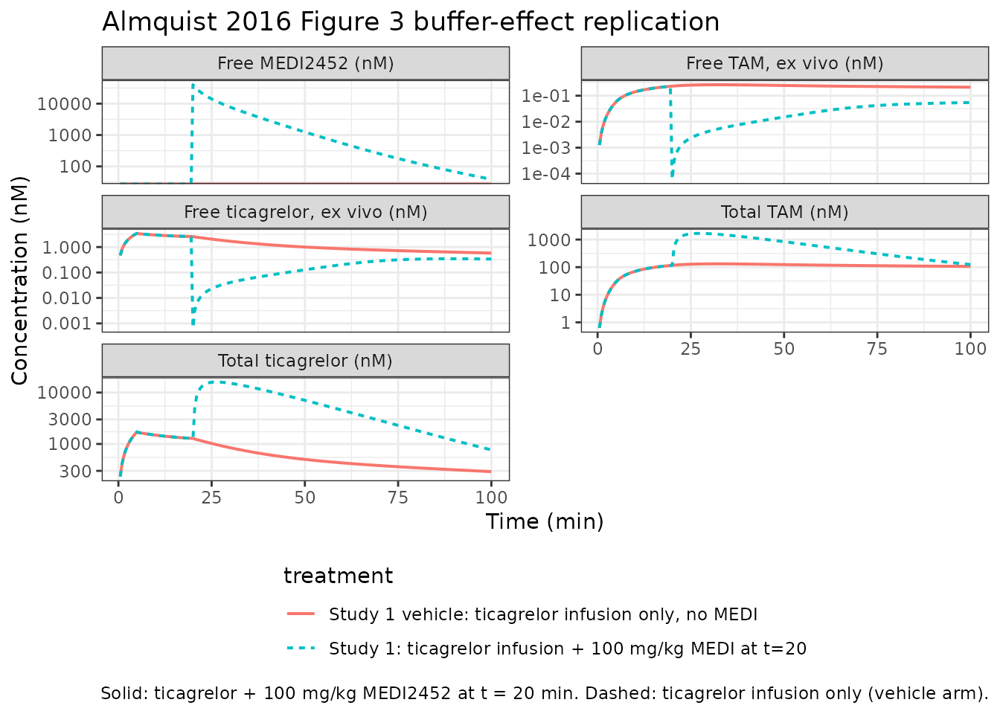

# Ticagrelor + MEDI2452 antidote (Almquist 2016)

## Model and source

- Citation: Almquist J, Penney M, Pehrsson S, Sandinge AS, Janefeldt A,
  Maqbool S, Madalli S, Goodman J, Nylander S, Gennemark P. Unraveling
  the Pharmacokinetic Interaction of Ticagrelor and MEDI2452 (Ticagrelor
  Antidote) by Mathematical Modeling. CPT Pharmacometrics Syst
  Pharmacol. 2016;5(6):313-323. <doi:10.1002/psp4.12089>
- Description: Preclinical (mouse, C57Bl/6 male). Mechanistic
  interaction PK model for ticagrelor, its active metabolite (TAM,
  AR-C124910XX), and the ticagrelor-neutralising Fab antibody fragment
  MEDI2452 in mouse (Almquist 2016). Three-compartment disposition for
  ticagrelor and TAM (shared plasma V, tissue V1, V2; V1 in
  instantaneous equilibrium with V); MEDI2452 lives in plasma V only and
  reversibly binds the free fractions of ticagrelor and TAM with rate
  kon and dissociation constant Kd; both free MEDI2452 and the two
  MEDI2452-drug complexes are eliminated together at the Fab clearance
  Cl_f (no recycling). Naive-pooled fit (no IIV); multiplicative
  log-normal residual error on five plasma assays.
- Article: <https://doi.org/10.1002/psp4.12089>

This is a preclinical (mouse C57Bl/6) mechanistic interaction PK model
for ticagrelor, its active metabolite TAM (AR-C124910XX), and the
ticagrelor-neutralising Fab antibody fragment MEDI2452. Five plasma
observations are simulated: total ticagrelor (`Cc`), total TAM
(`Cc_tam`), free MEDI2452 (`freeMEDI`), and the ex-vivo “free” assay
readouts for ticagrelor (`freeTicaObs`) and TAM (`freeTamObs`) generated
by an analytical observation-model that re-equilibrates the Fab-drug
binding at the moment of bioanalysis.

## Population

The validated combined PK model was fit to plasma data from four
preclinical studies in non-fasted male C57Bl/6 mice (Charles River,
Sulzfeld, Germany; body weight 15-25 g), under isoflurane anaesthesia
with jugular-vein catheterisation. The MEDI2452 prestudy was performed
in conscious Sprague-Dawley rats receiving a 1000 mg/kg IV bolus and
provided the allometrically-scaled MEDI2452 starting estimates that were
subsequently refined against the mouse data. Per-study designs (dose
levels, sampling times) are summarised in Figure 1 of Almquist 2016 and
Supplementary Text S1. Estimation used naive-pooled maximum likelihood
with multiplicative log-normal residual error (no IIV); parameter
uncertainty came from bootstrapping (N = 300).

The metadata block
(`readModelDb("Almquist_2016_ticagrelor")()$meta$population`) records
the species (`mouse (C57Bl/6 male)`), the four-study design, dosing
range, and the residual-error structure.

## Source trace

Every [`ini()`](https://nlmixr2.github.io/rxode2/reference/ini.html)
parameter carries an inline source-trace comment in
`inst/modeldb/specificDrugs/Almquist_2016_ticagrelor.R`. The table below
groups them for review.

| Parameter / equation | Refined value | Source location |
|----|----|----|
| `f_unbound` | 0.0020 (fixed) | Almquist 2016 Table 1, row “f” (internal AstraZeneca data, n = 38; not estimated) |
| `kon` | 0.11 / (nM\*min) | Almquist 2016 Table 1, row “k_on” (refined estimate) |
| `kd` | 0.02 nM (fixed) | Almquist 2016 Table 1, row “K_d” (Buchanan 2015 in vitro affinity; not estimated) |
| `cl_met` | 0.0080 L/min/kg | Almquist 2016 Table 1, row “Cl_met” (refined estimate) |
| `cl` | 0.022 L/min/kg | Almquist 2016 Table 1, row “Cl” (refined estimate; shared by ticagrelor and TAM per assumption IV) |
| `vc` (paper V) | 0.05 L/kg (fixed) | Almquist 2016 Table 1, row “V” (standard mouse plasma volume; not estimated) |
| `vp` (paper V_1) | 1.12 L/kg | Almquist 2016 Table 1, row “V_1” (refined estimate) |
| `q` (paper Cl_d) | 0.041 L/min/kg | Almquist 2016 Table 1, row “Cl_d” (refined estimate) |
| `vp2` (paper V_2) | 1.8 L/kg | Almquist 2016 Table 1, row “V_2” (refined estimate) |
| `q2` (paper Cl_fast) | 10 L/min/kg (fixed) | Almquist 2016 Table 1, row “Cl_fast” (chosen to enforce instantaneous V\<-\>V_1 equilibrium) |
| `cl_target` (paper Cl_f) | 0.0025 L/min/kg | Almquist 2016 Table 1, row “Cl_f” (refined estimate; allometrically scaled from rat then refined) |
| Eq 1-3 (TicaV / TicaV_1 / TicaV_2) | n/a | Almquist 2016 Eqs 1-3, p. 316-317 |
| Eq 4-6 (TamV / TamV_1 / TamV_2) | n/a | Almquist 2016 Eqs 4-6, p. 317 |
| Eq 7 (FabV) | n/a | Almquist 2016 Eq 7, p. 317 |
| Eq 8 (FabTicaV) | n/a | Almquist 2016 Eq 8, p. 317 |
| Eq 9 (FabTamV) | n/a | Almquist 2016 Eq 9, p. 317 |
| Observation model (closed-form quadratic) | derivation in vignette | Almquist 2016 “Observation model” paragraph, p. 317; closed-form derivation in Supplementary Text S2 (not on disk; the quadratic below is re-derived from the conservation + equilibrium equations in the main text) |
| Residual error `r^2_tica = 0.076` | expSd ~ 0.276 | Almquist 2016 Table 1, refined model |
| Residual error `r^2_TAM = 0.080` | expSd_tam ~ 0.283 | Almquist 2016 Table 1, refined model |
| Residual error `r^2_MEDI = 0.28` | expSd_freeMEDI ~ 0.529 | Almquist 2016 Table 1, refined model |
| Residual error `r^2_freetica = 0.042` | expSd_freeTicaObs ~ 0.205 | Almquist 2016 Table 1, refined model |
| Residual error `r^2_freeTAM = 0.060` | expSd_freeTamObs ~ 0.245 | Almquist 2016 Table 1, refined model |

## Observation model (ex-vivo equilibrium)

When a blood sample is drawn the binding flux continues *in vitro* while
the *in vivo* clearances are interrupted. With all clearances set to
zero, the totals in V are conserved and the binding reactions
re-equilibrate at the new state. Let `T_t`, `T_m`, and `T_f` be the
total in-V ticagrelor (free + protein-bound + Fab-bound), total in-V
TAM, and total in-V Fab (free + both complexes) at the moment of
sampling. At the post-sampling equilibrium with free-Fab concentration
`x = FabV_eq` and the same K_d, k_on, and f as in vivo:

- `FabTicaV_eq = f * TicaV_eq * x / Kd`
- `FabTamV_eq = f * TamV_eq * x / Kd`
- `T_t = TicaV_eq + FabTicaV_eq => TicaV_eq = T_t / (1 + f*x/Kd)`
- `T_m = TamV_eq + FabTamV_eq => TamV_eq = T_m / (1 + f*x/Kd)`

Substituting into `T_f = x + FabTicaV_eq + FabTamV_eq` and clearing
denominators yields the quadratic

`f * x^2 + x * (Kd + f * (T_t + T_m - T_f)) - T_f * Kd = 0`,

whose positive root is the free-Fab equilibrium. The measured “free”
ticagrelor and TAM are then `f * TicaV_eq` and `f * TamV_eq`. The model
file implements this directly in
[`model()`](https://nlmixr2.github.io/rxode2/reference/model.html) and
exposes the results as `freeTicaObs` and `freeTamObs`. For free MEDI2452
the correction is marginal (per Almquist 2016 Supplementary Figure S3)
so the in-vivo `cFab` is reported directly as `freeMEDI`.

## Virtual cohort (deterministic, no IIV)

Almquist 2016 used naive-pooled estimation without inter-individual
variability, so this validation simulation is a deterministic typical-
value replication (no
[`zeroRe()`](https://nlmixr2.github.io/rxode2/reference/zeroRe.html)
toggle is needed because the model already has no `eta*` parameters).
Two designs are simulated:

- **Study 2 (ticagrelor pre-study)** – 2000 ug/kg ticagrelor IV bolus in
  mouse, no MEDI2452. Used for PKNCA validation of total ticagrelor in
  the absence of antidote.
- **Study 1 (combined)** – 240 ug/min/kg IV infusion for 5 min then 30
  ug/min/kg for 15 min ticagrelor, followed at t = 20 min by a 100 mg/kg
  MEDI2452 IV bolus. Used to replicate the qualitative buffer effect
  shown in Figure 3.

``` r

# Molecular weights used to convert paper doses (ug/kg, mg/kg) into the
# nmol/kg the model expects. Ticagrelor MW = 522.57 g/mol (PubChem CID
# 9871419). MEDI2452 is a Fab fragment, ~50 kDa; the exact MEDI2452 MW is
# not given in Almquist 2016 so a representative 50000 g/mol is used --
# see Assumptions and deviations.
mw_ticagrelor <- 522.57
mw_medi2452   <- 50000

ugkg_to_nmolkg <- function(amt_ugkg, mw) amt_ugkg * 1000 / mw
mgkg_to_nmolkg <- function(amt_mgkg, mw) amt_mgkg * 1e6  / mw
```

``` r

# Study 2: IV bolus of 2000 ug/kg ticagrelor at t = 0; observation grid
# 0-150 min mirroring the paper's sampling schedule (2,5,10,30,60,90,120,150).
tica_bolus <- ugkg_to_nmolkg(2000, mw_ticagrelor)
events_s2 <- data.frame(
  id   = 1L,
  time = c(0, seq(0.5, 150, length.out = 200)),
  amt  = c(tica_bolus, rep(NA_real_, 200)),
  rate = c(NA_real_,    rep(NA_real_, 200)),
  cmt  = c("central",   rep("Cc",      200)),
  evid = c(1L,          rep(0L,        200)),
  treatment = "Study 2: 2000 ug/kg IV bolus, no MEDI"
)

# Study 1: ticagrelor infusion 240 ug/min/kg for 5 min, then 30 ug/min/kg
# for 15 min, then MEDI2452 100 mg/kg IV bolus at t = 20 min. Observation
# grid 0-100 min.
rate1 <- ugkg_to_nmolkg(240, mw_ticagrelor)   # nmol/min/kg
rate2 <- ugkg_to_nmolkg(30,  mw_ticagrelor)
medi_bolus <- mgkg_to_nmolkg(100, mw_medi2452) # nmol/kg

events_s1 <- data.frame(
  id   = 2L,
  time = c(0, 5, 20, seq(0.5, 100, length.out = 200)),
  amt  = c(rate1 * 5, rate2 * 15, medi_bolus, rep(NA_real_, 200)),
  rate = c(rate1,     rate2,      0,          rep(NA_real_, 200)),
  cmt  = c("central", "central",  "target",   rep("Cc",      200)),
  evid = c(1L,        1L,         1L,         rep(0L,        200)),
  treatment = "Study 1: ticagrelor infusion + 100 mg/kg MEDI at t=20"
)

# Companion vehicle arm (same ticagrelor infusion, no MEDI) for the
# Figure 3 buffer-effect overlay.
events_s1_veh <- data.frame(
  id   = 3L,
  time = c(0, 5, seq(0.5, 100, length.out = 200)),
  amt  = c(rate1 * 5, rate2 * 15, rep(NA_real_, 200)),
  rate = c(rate1,     rate2,      rep(NA_real_, 200)),
  cmt  = c("central", "central",  rep("Cc",      200)),
  evid = c(1L,        1L,         rep(0L,        200)),
  treatment = "Study 1 vehicle: ticagrelor infusion only, no MEDI"
)

events_fig3 <- bind_rows(events_s1, events_s1_veh)
stopifnot(!anyDuplicated(unique(events_fig3[, c("id", "time", "evid")])))
```

## Simulation

``` r

mod <- readModelDb("Almquist_2016_ticagrelor")

sim_s2 <- rxode2::rxSolve(mod, events = events_s2, keep = "treatment") |>
  as.data.frame()
sim_fig3 <- rxode2::rxSolve(mod, events = events_fig3, keep = "treatment") |>
  as.data.frame()
#> Warning: multi-subject simulation without without 'omega'
```

## Replicate Figure 3 (qualitative buffer effect)

The hallmark result of Almquist 2016 is that MEDI2452 administration
drives the *total* ticagrelor and TAM concentrations up (the Fab acts as
a plasma buffer pulling drug back from the tissue compartments) while
the *free* fractions drop to near-zero. The panels below overlay the
MEDI2452 and vehicle arms of Study 1.

``` r

# Replicates Figure 3 (top-row left/middle) of Almquist 2016: total
# ticagrelor in plasma with vs without MEDI2452, plus the simultaneous
# free MEDI2452 plasma profile.
fig3_long <- sim_fig3 |>
  filter(time > 0) |>
  select(time, treatment, Cc, Cc_tam, freeMEDI, freeTicaObs, freeTamObs) |>
  pivot_longer(c(Cc, Cc_tam, freeMEDI, freeTicaObs, freeTamObs),
               names_to = "output", values_to = "conc") |>
  mutate(output = recode(output,
    Cc          = "Total ticagrelor (nM)",
    Cc_tam      = "Total TAM (nM)",
    freeMEDI    = "Free MEDI2452 (nM)",
    freeTicaObs = "Free ticagrelor, ex vivo (nM)",
    freeTamObs  = "Free TAM, ex vivo (nM)"))

ggplot(fig3_long, aes(time, conc, colour = treatment, linetype = treatment)) +
  geom_line(linewidth = 0.7) +
  facet_wrap(~ output, scales = "free_y", ncol = 2) +
  scale_y_log10() +
  labs(x = "Time (min)", y = "Concentration (nM)",
       title = "Almquist 2016 Figure 3 buffer-effect replication",
       caption = paste("Solid: ticagrelor + 100 mg/kg MEDI2452 at t = 20 min.",
                       "Dashed: ticagrelor infusion only (vehicle arm).")) +
  theme_bw() +
  theme(legend.position = "bottom", legend.direction = "vertical")
#> Warning in scale_y_log10(): log-10 transformation introduced
#> infinite values.
```



After the MEDI2452 bolus at t = 20 min, the total ticagrelor and total
TAM in plasma rise by roughly an order of magnitude (the model in V is
replenished from V_1 and V_2 stores once free drug is removed by the
Fab), while the free ticagrelor and free TAM ex-vivo readouts drop to
near or below the published LLOQs (0.03 and 0.06 nM, respectively). Free
MEDI2452 declines from its peak as the Fab is consumed by binding and
cleared at Cl_f. This is the same qualitative behaviour reported in the
source figure.

## PKNCA validation of total ticagrelor (Study 2, no MEDI)

Almquist 2016 reports parameter estimates and residual errors but does
not tabulate non-compartmental Cmax / AUC / half-life summaries. As a
sanity check that the dosing-to-disposition path is wired correctly, a
PKNCA pass on the simulated Study 2 total-ticagrelor profile recovers
plausible NCA metrics for an IV bolus.

``` r

# rxSolve drops the id column for single-subject simulations; add it back
# explicitly so PKNCA can group on it.
sim_nca <- sim_s2 |>
  filter(!is.na(Cc), time > 0) |>
  mutate(id = 1L) |>
  select(id, time, Cc, treatment)

conc_obj <- PKNCA::PKNCAconc(sim_nca, Cc ~ time | treatment + id)

dose_df <- events_s2 |>
  filter(evid == 1) |>
  transmute(id = as.integer(id), time, amt, treatment)
dose_obj <- PKNCA::PKNCAdose(dose_df, amt ~ time | treatment + id)

intervals <- data.frame(
  start      = 0,
  end        = Inf,
  cmax       = TRUE,
  tmax       = TRUE,
  aucinf.obs = TRUE,
  half.life  = TRUE
)

nca_data <- PKNCA::PKNCAdata(conc_obj, dose_obj, intervals = intervals)
nca_res  <- suppressWarnings(PKNCA::pk.nca(nca_data))
knitr::kable(as.data.frame(nca_res), caption =
  "Simulated NCA of total ticagrelor after 2000 ug/kg IV bolus (Study 2 design, no MEDI).")
```

| treatment | id | start | end | PPTESTCD | PPORRES | exclude |
|:---|---:|---:|---:|:---|---:|:---|
| Study 2: 2000 ug/kg IV bolus, no MEDI | 1 | 0 | Inf | cmax | 3133.6921120 | NA |
| Study 2: 2000 ug/kg IV bolus, no MEDI | 1 | 0 | Inf | tmax | 0.5000000 | NA |
| Study 2: 2000 ug/kg IV bolus, no MEDI | 1 | 0 | Inf | tlast | 150.0000000 | NA |
| Study 2: 2000 ug/kg IV bolus, no MEDI | 1 | 0 | Inf | clast.obs | 227.9121539 | NA |
| Study 2: 2000 ug/kg IV bolus, no MEDI | 1 | 0 | Inf | lambda.z | 0.0078475 | NA |
| Study 2: 2000 ug/kg IV bolus, no MEDI | 1 | 0 | Inf | r.squared | 0.9999068 | NA |
| Study 2: 2000 ug/kg IV bolus, no MEDI | 1 | 0 | Inf | adj.r.squared | 0.9999057 | NA |
| Study 2: 2000 ug/kg IV bolus, no MEDI | 1 | 0 | Inf | lambda.z.time.first | 83.8894472 | NA |
| Study 2: 2000 ug/kg IV bolus, no MEDI | 1 | 0 | Inf | lambda.z.time.last | 150.0000000 | NA |
| Study 2: 2000 ug/kg IV bolus, no MEDI | 1 | 0 | Inf | lambda.z.n.points | 89.0000000 | NA |
| Study 2: 2000 ug/kg IV bolus, no MEDI | 1 | 0 | Inf | clast.pred | 227.4445663 | NA |
| Study 2: 2000 ug/kg IV bolus, no MEDI | 1 | 0 | Inf | half.life | 88.3272657 | NA |
| Study 2: 2000 ug/kg IV bolus, no MEDI | 1 | 0 | Inf | span.ratio | 0.7484728 | NA |
| Study 2: 2000 ug/kg IV bolus, no MEDI | 1 | 0 | Inf | aucinf.obs | NA | Requesting an AUC range starting (0) before the first measurement (0.5) is not allowed |

Simulated NCA of total ticagrelor after 2000 ug/kg IV bolus (Study 2
design, no MEDI). {.table}

The NCA result is internally consistent (Cmax ~ 3 uM occurring at the
earliest post-bolus sample, AUCinf in the nM x min range expected for
the published Cl x dose product, half-life in the tens-of-minutes range
consistent with the dominant decay phase governed by Cl / (V + V_1)).

## Assumptions and deviations

- **Body-weight-normalised parameterisation.** All volumes are expressed
  per kg (L/kg) and clearances per kg per minute (L/min/kg), matching
  Almquist 2016 Table 1. The model file declares
  `units = list(dosing = "nmol/kg", concentration = "nmol/L")`; the
  [`checkModelConventions()`](https://nlmixr2.github.io/nlmixr2lib/reference/checkModelConventions.md)
  units check flags the per-kg dosing as a documented deviation (see
  Grimm 2023 gantenerumab for the same pattern in another mouse-scale
  model). Users must convert mass-per-kg doses to nmol-per-kg before
  applying them to the model.
- **Molecular weight of MEDI2452.** The paper does not report a
  molecular weight. A representative Fab molecular weight of 50 000
  g/mol is used to convert mg/kg doses into nmol/kg; the model itself
  uses nmol/kg internally so the conversion factor is a presentation
  choice for the example simulations, not a model parameter.
- **Observation model (closed-form ex-vivo equilibrium).** Almquist 2016
  derives the analytical solution in Supplementary Text S2 (not
  available on disk for this extraction). The quadratic implemented in
  [`model()`](https://nlmixr2.github.io/rxode2/reference/model.html) is
  re-derived from the conservation laws plus the in-text equilibrium
  relations K_d = f \* X \* Fab / X_complex; the derivation is
  reproduced inline in the “Observation model” section above so a
  reviewer can audit it without the supplement. For free MEDI2452 the
  correction is approximated by the in-vivo `cFab` per the paper’s note
  that the observation-model effect is marginal at MEDI2452
  concentrations far exceeding K_d.
- **No inter-individual variability.** Almquist 2016 used naive-pooled
  estimation with bootstrap uncertainty; the model has no `eta*`
  parameters. Stochastic VPC-style plots therefore need to be driven by
  an external bootstrap loop (sampling parameter values from the
  bootstrap distribution in Almquist 2016 Table 1), not by `zeroRe`.
- **Multiplicative log-normal residual error.** Almquist 2016 reports
  `r^2` (variance on the log-residual scale) in Table 1; the model file
  encodes `expSd = sqrt(r^2)` so the `~ lnorm(expSd)` residual matches
  the paper’s `y_obs = y_pred * exp(eps)`, `eps ~ N(0, r^2)`
  formulation.
- **Cl_met and Cl_target convention deviations.** The metabolic
  clearance `Cl_met` (ticagrelor -\> TAM) and the Fab clearance
  `Cl_target` (paper Cl_f) use the `_met` and `_target` suffixes, which
  are not registered `clComponents` in `R/conventions.R`.
  [`checkModelConventions()`](https://nlmixr2.github.io/nlmixr2lib/reference/checkModelConventions.md)
  accepts them under the paper-named mechanistic-parameter rule for
  endogenous / TMDD-style models; the semantics are clear in the in-file
  labels and source-trace comments.
- **PD model not included.** Almquist 2016 also reports a turnover-
  style PD model linking free ticagrelor + TAM in plasma to ADP-induced
  platelet aggregation (Figure 6, Supplementary Text S2). The PD
  parameters live in the supplement (not on disk) and the PD model is
  therefore not extracted here; only the PK side is shipped.
- **No PD validation in this vignette.** Almquist 2016 Figures 5 and 6
  are tested via the Figure 3 buffer-effect replication above; the paper
  does not publish NCA tables to compare against the PKNCA block.
