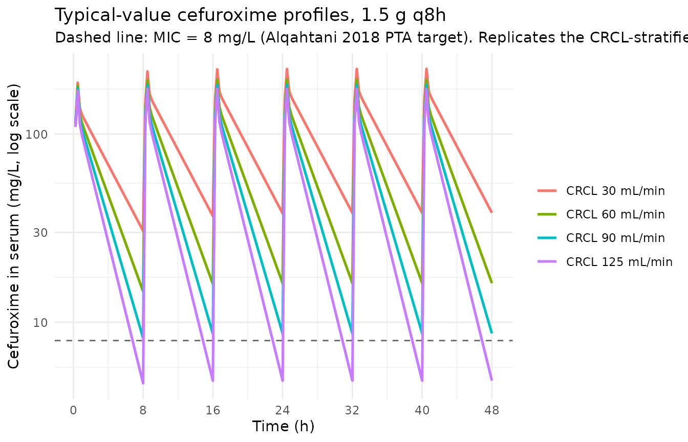
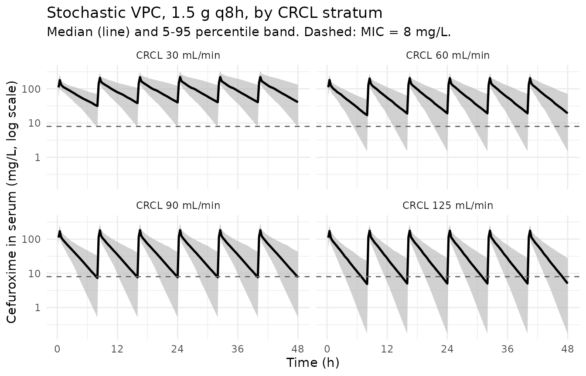
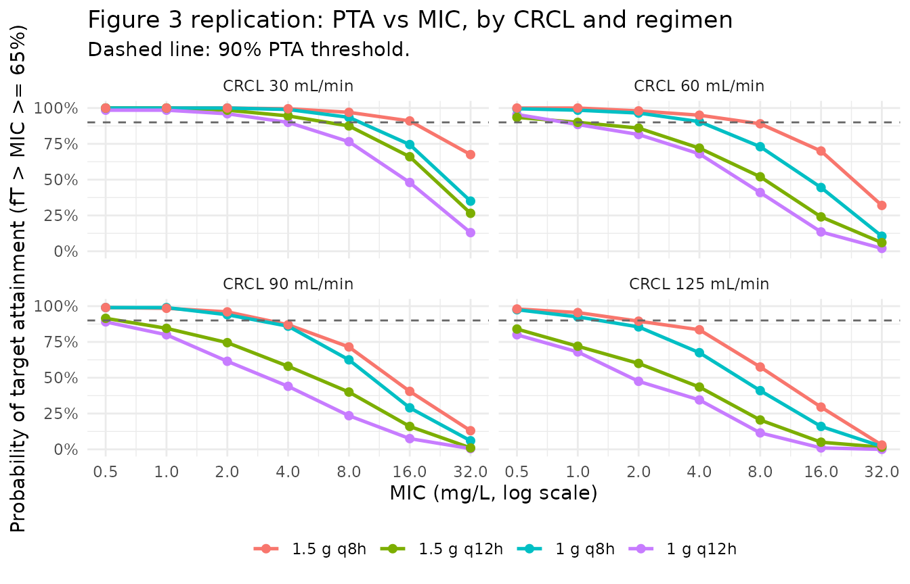

# Cefuroxime (Alqahtani 2018)

## Model and source

``` r

mod_meta <- nlmixr2est::nlmixr(readModelDb("Alqahtani_2018_cefuroxime"))$meta
#> ℹ parameter labels from comments will be replaced by 'label()'
```

- Citation: Alqahtani SA, Alsultan AS, Alqattan HM, Eldemerdash A,
  Albacker TB. Population pharmacokinetic model-based evaluation of
  standard dosing regimens for cefuroxime used in coronary artery bypass
  graft surgery with cardiopulmonary bypass. Antimicrob Agents
  Chemother. 2018;62(6):e02241-17. <doi:10.1128/AAC.02241-17>.
- Description: Two-compartment IV population PK model for cefuroxime in
  adults undergoing coronary artery bypass graft (CABG) surgery with
  cardiopulmonary bypass (Alqahtani 2018), with a power-form
  creatinine-clearance (Cockcroft-Gault) effect on clearance.
- Article (DOI): <https://doi.org/10.1128/AAC.02241-17>

This vignette validates the packaged `Alqahtani_2018_cefuroxime` model –
a two-compartment IV population PK model for cefuroxime in 78 adults
undergoing coronary artery bypass graft (CABG) surgery with
cardiopulmonary bypass (CPB) – against the source publication’s Table 1
(baseline demographics), Table 2 (final-model parameter estimates),
Table 3 (simulated dosage scenarios), and Figure 3
(probability-of-target-attainment analysis vs. CRCL).

## Population

The Alqahtani 2018 analysis enrolled 78 adult patients scheduled for
cardiac surgical procedures at King Fahad Cardiac Center, King Saud
University Medical City (Riyadh, Saudi Arabia). Mean age was 54.2 years
(SD 13.2, range 18-80), mean weight 76.7 kg (SD 14.7, range 41-111.8),
mean BMI 28.6 kg/m^2 (SD 5.2, range 16.6-43.2), and 76% were male. Renal
function was characterized by a mean Cockcroft-Gault creatinine
clearance of 78.5 mL/min (SD 24, range 28.3-125, raw mL/min not
BSA-normalized) and mean serum creatinine of 85 umol/L (SD 29.7, range
41-245); mean serum albumin was 35.6 g/L (SD 4.4, range 24-44). Patients
allergic to beta-lactams, with prior systemic infections, or who
received antibiotic therapy in the 72 h before surgery were excluded.
Each patient received 1.5 g cefuroxime as a 30-min IV infusion 30-60 min
before skin incision; an extra 1.5 g dose was mixed into the CPB
solution if the surgery lasted more than 4 h; subsequent prophylactic
doses for 48 h were either 1.5 g every 12 h or 1 g every 8 h (Methods,
Drug administration and sampling procedure). 468 plasma concentrations
were analyzed by validated HPLC (linearity 0.5-200 ug/mL, equivalent to
0.5-200 mg/L; intraday CV 0.81-8.33%). The PK model was estimated in
Monolix v4.4 using SAEM.

The same information is available programmatically via the model’s
`population` metadata:

``` r

str(mod_meta$population)
#> List of 15
#>  $ species       : chr "human"
#>  $ n_subjects    : int 78
#>  $ n_studies     : int 1
#>  $ age_range     : chr "18-80 years"
#>  $ age_mean      : chr "54.2 years (SD 13.2)"
#>  $ weight_range  : chr "41-111.8 kg"
#>  $ weight_mean   : chr "76.7 kg (SD 14.7)"
#>  $ bmi_range     : chr "16.6-43.2 kg/m^2 (mean 28.6, SD 5.2)"
#>  $ sex_female_pct: num 24
#>  $ race_ethnicity: chr "Not reported (single-centre Saudi Arabian cohort; King Fahad Cardiac Center, King Saud University Medical City, Riyadh)"
#>  $ disease_state : chr "Adults scheduled to undergo cardiac surgical procedures (coronary artery bypass graft surgery with cardiopulmon"| __truncated__
#>  $ dose_range    : chr "Cefuroxime 1.5 g IV infusion over 30 min administered 30-60 min before skin incision; an extra 1.5 g dose was m"| __truncated__
#>  $ regions       : chr "Saudi Arabia (single-centre prospective open-label study at King Fahad Cardiac Center, King Saud University Medical City)"
#>  $ renal_function: chr "Cockcroft-Gault creatinine clearance mean 78.5 mL/min (SD 24, range 28.3-125); serum creatinine mean 85 umol/L "| __truncated__
#>  $ notes         : chr "Baseline demographics per Alqahtani 2018 Table 1. 78 adults; 468 plasma samples analyzed by validated HPLC (lin"| __truncated__
```

## Source trace

The per-parameter origin is recorded as an in-file comment next to each
`ini()` entry in
`inst/modeldb/specificDrugs/Alqahtani_2018_cefuroxime.R`. The table
below collects them in one place; values come from Alqahtani 2018 Table
2 final-model column.

| Parameter / equation | Value | Source location |
|----|----|----|
| `lcl` (CL at reference CRCL = 78.5 mL/min) | log(3.43) | Table 2 row “CL”; final model |
| `lvc` (V1) | log(3.88) | Table 2 row “V1”; final model |
| `lq` (Q) | log(22.2) | Table 2 row “Q”; final model |
| `lvp` (V2) | log(5.7) | Table 2 row “V2”; final model |
| `e_crcl_cl` (CRCL exponent on CL) | 0.56 | Table 2 footnote b: CL = 3.43 \* (CL_CR / 78.5)^0.56 |
| `etalcl ~ 0.18590` | log(0.452^2 + 1) | Table 2 row “IIV for CL” final model = 45.2% |
| `etalvc ~ 0.31901` | log(0.613^2 + 1) | Table 2 row “IIV for V1” final model = 61.3% |
| `etalq ~ 0.27448` | log(0.562^2 + 1) | Table 2 row “IIV for Q” final model = 56.2% |
| `etalvp ~ 0.04643` | log(0.218^2 + 1) | Table 2 row “IIV for V2” final model = 21.8% |
| `addSd <- 6.45` | 6.45 mg/L | Table 2 residual-error row “a” final model |
| `propSd <- 0.092` | 0.092 | Table 2 residual-error row “b” final model |
| `cl <- exp(lcl + etalcl) * (CRCL / 78.5)^e_crcl_cl` | n/a | Table 2 footnote b CL covariate formula |
| `d/dt(central) ... d/dt(peripheral1)` | n/a | Results, Population pharmacokinetics: “two-compartment model”; Table 2 parameterization (CL, V1, Q, V2) |
| `Cc ~ add(addSd) + prop(propSd)` | n/a | Methods, Population pharmacokinetics: “combined-error model” |

## Virtual cohort

The original observed cefuroxime concentrations are not publicly
available. The virtual cohort below replicates the Alqahtani 2018 Monte
Carlo simulation framework: four CRCL strata (30, 60, 90, 125 mL/min,
matching Figure 3 and Table 3 scenarios) crossed with four dosing
regimens (1.5 g q8h, 1.5 g q12h, 1 g q8h, 1 g q12h, each as a 30-min IV
infusion; Table 3). Subjects within each stratum are otherwise identical
(matched on CRCL); IIV on CL, V1, Q, and V2 generates the
between-subject variability used to compute the probability of target
attainment.

``` r

set.seed(20260603)

n_per_stratum <- 200L

# Probability-of-target-attainment scenarios match Alqahtani 2018 Figure 3
# (four CRCL strata) and Table 3 (four dosing regimens). The first dose is
# administered at t = 0 (immediately before "skin incision" in the
# perioperative protocol); subsequent doses follow the regimen interval.
crcl_strata <- c(30, 60, 90, 125)
regimens <- tibble::tribble(
  ~regimen,        ~dose_mg, ~interval_h,
  "1.5 g q8h",      1500,      8,
  "1.5 g q12h",     1500,     12,
  "1 g q8h",        1000,      8,
  "1 g q12h",       1000,     12
)

# 48-h prophylactic window per Methods (Drug administration and sampling
# procedure) and Society of Thoracic Surgeons guidelines (Discussion). Sample
# every 0.25 h so the fT > MIC denominator is well-resolved across all four
# regimen intervals.
sim_end_h    <- 48
sample_times <- seq(0, sim_end_h, by = 0.25)
infusion_h   <- 0.5

# Helper: build one (CRCL x regimen) cohort. id_offset shifts the subject
# IDs so the bind_rows()ed event table has globally disjoint ids.
make_cohort <- function(crcl_ml_min, dose_mg, interval_h, n, id_offset) {
  dose_times <- seq(0, sim_end_h - interval_h, by = interval_h)
  per_sub <- function(idx) {
    doses <- tibble::tibble(
      id   = idx,           time = dose_times,
      evid = 1L,            amt  = dose_mg,
      rate = dose_mg / infusion_h,
      dv   = NA_real_
    )
    obs <- tibble::tibble(
      id   = idx,           time = sample_times,
      evid = 0L,            amt  = NA_real_,
      rate = NA_real_,      dv   = NA_real_
    )
    dplyr::bind_rows(doses, obs) |>
      dplyr::mutate(CRCL = crcl_ml_min) |>
      dplyr::arrange(time, dplyr::desc(evid))
  }
  dplyr::bind_rows(lapply(seq_len(n), function(i) per_sub(id_offset + i)))
}

# Cross CRCL x regimen, assigning disjoint id ranges per cohort.
grid <- tidyr::expand_grid(
  crcl_ml_min = crcl_strata,
  regimens
) |>
  dplyr::mutate(
    cohort    = sprintf("CRCL %d, %s", crcl_ml_min, regimen),
    id_offset = (dplyr::row_number() - 1L) * n_per_stratum
  )

events <- dplyr::bind_rows(lapply(seq_len(nrow(grid)), function(i) {
  r <- grid[i, ]
  make_cohort(
    crcl_ml_min = r$crcl_ml_min,
    dose_mg     = r$dose_mg,
    interval_h  = r$interval_h,
    n           = n_per_stratum,
    id_offset   = r$id_offset
  ) |>
    dplyr::mutate(cohort  = r$cohort,
                  regimen = r$regimen)
}))

stopifnot(!anyDuplicated(unique(events[, c("id", "time", "evid")])))
```

## Simulation

``` r

mod         <- readModelDb("Alqahtani_2018_cefuroxime")
mod_typical <- rxode2::zeroRe(mod)
#> ℹ parameter labels from comments will be replaced by 'label()'

sim_typical <- rxode2::rxSolve(
  object = mod_typical, events = events,
  keep   = c("cohort", "regimen")
) |>
  as.data.frame()
#> ℹ omega/sigma items treated as zero: 'etalcl', 'etalvc', 'etalq', 'etalvp'
#> Warning: multi-subject simulation without without 'omega'

sim_stoch <- rxode2::rxSolve(
  object = mod, events = events,
  keep   = c("cohort", "regimen")
) |>
  as.data.frame()
#> ℹ parameter labels from comments will be replaced by 'label()'
```

## Replicate published figures

### Typical-value concentration profiles by CRCL (standard 1.5 g q8h regimen)

The standard dosing regimen recommended in the Discussion and Conclusion
– 1.5 g q8h – is shown across the four CRCL strata. Lower CRCL slows CL
and raises the trough; the q8h interval keeps even the high-CRCL stratum
above the MIC = 8 mg/L line for most of the dosing interval.

``` r

# Replicates the dose-vs-CRCL slice used to construct Alqahtani 2018
# Figure 3 panels at MIC = 8 mg/L.
sim_typical |>
  dplyr::filter(regimen == "1.5 g q8h",
                time > 0, !is.na(Cc)) |>
  dplyr::group_by(CRCL, time) |>
  dplyr::summarise(Cc_typ = stats::median(Cc), .groups = "drop") |>
  dplyr::mutate(crcl_lbl = factor(sprintf("CRCL %d mL/min", CRCL),
                                  levels = sprintf("CRCL %d mL/min",
                                                   crcl_strata))) |>
  ggplot(aes(time, Cc_typ, colour = crcl_lbl)) +
  geom_line(linewidth = 0.9) +
  geom_hline(yintercept = 8, linetype = "dashed", colour = "grey40") +
  scale_y_log10() +
  scale_x_continuous(breaks = seq(0, 48, 8)) +
  labs(
    x = "Time (h)",
    y = "Cefuroxime in serum (mg/L, log scale)",
    colour = NULL,
    title    = "Typical-value cefuroxime profiles, 1.5 g q8h",
    subtitle = paste0("Dashed line: MIC = 8 mg/L (Alqahtani 2018 PTA target). ",
                      "Replicates the CRCL-stratified scenario underlying Figure 3.")
  ) +
  theme_minimal()
```



### Stochastic VPC by CRCL (standard 1.5 g q8h regimen)

``` r

sim_stoch |>
  dplyr::filter(regimen == "1.5 g q8h",
                time > 0, !is.na(Cc)) |>
  dplyr::group_by(CRCL, time) |>
  dplyr::summarise(
    Q05 = stats::quantile(Cc, 0.05, na.rm = TRUE),
    Q50 = stats::quantile(Cc, 0.50, na.rm = TRUE),
    Q95 = stats::quantile(Cc, 0.95, na.rm = TRUE),
    .groups = "drop"
  ) |>
  dplyr::mutate(crcl_lbl = factor(sprintf("CRCL %d mL/min", CRCL),
                                  levels = sprintf("CRCL %d mL/min",
                                                   crcl_strata))) |>
  ggplot(aes(time, Q50)) +
  geom_ribbon(aes(ymin = Q05, ymax = Q95), fill = "gray70", alpha = 0.6) +
  geom_line(linewidth = 0.9) +
  geom_hline(yintercept = 8, linetype = "dashed", colour = "grey40") +
  facet_wrap(~crcl_lbl) +
  scale_y_log10() +
  scale_x_continuous(breaks = seq(0, 48, 12)) +
  labs(
    x = "Time (h)",
    y = "Cefuroxime in serum (mg/L, log scale)",
    title    = "Stochastic VPC, 1.5 g q8h, by CRCL stratum",
    subtitle = "Median (line) and 5-95 percentile band. Dashed: MIC = 8 mg/L."
  ) +
  theme_minimal()
```



### Probability of target attainment (Figure 3 replication)

Alqahtani 2018 Figure 3 shows PTA (probability of achieving fT \> MIC of
at least 65% of the dosing interval) for cefuroxime across MIC values
0.5-32 mg/L at the four CRCL strata. The unbound concentration is
computed as `Cc_free = (1 - 0.40) * Cc` per the Methods, Monte Carlo
simulations section (“we assumed an average protein binding of 40% for
cefuroxime”). PTA below summarises the fraction of subjects achieving fT
\> MIC \>= 65% over the **24-32 h window** (the third dosing interval at
steady state for q8h regimens; the second interval for q12h regimens).

``` r

mic_grid <- c(0.5, 1, 2, 4, 8, 16, 32)

# Helper: compute fraction of time (per subject) Cc_free > MIC across an
# observation window using trapezoidal-area approximation on the regular
# 0.25 h grid.
pta_subject <- function(time, Cc_free, mic, t0, t1) {
  keep <- which(time >= t0 & time <= t1)
  if (length(keep) < 2) return(NA_real_)
  t  <- time[keep]
  cf <- Cc_free[keep]
  above <- cf > mic
  # Linearly interpolate the time-above-MIC by summing the within-interval
  # durations where Cc_free exceeds MIC (treating the indicator as
  # piecewise-constant within each 0.25-h bin).
  sum(diff(t) * ((above[-length(above)] + above[-1]) / 2)) / (t1 - t0)
}

pta_window <- list(
  "1.5 g q8h"  = c(24, 32),
  "1.5 g q12h" = c(24, 36),
  "1 g q8h"    = c(24, 32),
  "1 g q12h"   = c(24, 36)
)

pta_long <- sim_stoch |>
  dplyr::filter(!is.na(Cc)) |>
  dplyr::mutate(Cc_free = 0.6 * Cc) |>
  dplyr::arrange(regimen, CRCL, id, time)

pta_per_subject <- pta_long |>
  dplyr::group_by(regimen, CRCL, id) |>
  dplyr::group_modify(function(df, key) {
    win <- pta_window[[as.character(key$regimen)]]
    fT  <- vapply(mic_grid, function(mic)
      pta_subject(df$time, df$Cc_free, mic, win[1], win[2]),
      numeric(1))
    tibble::tibble(mic = mic_grid, fT_above = fT)
  }) |>
  dplyr::ungroup()

pta_tab <- pta_per_subject |>
  dplyr::group_by(regimen, CRCL, mic) |>
  dplyr::summarise(pta = mean(fT_above >= 0.65, na.rm = TRUE),
                   .groups = "drop")

pta_tab |>
  dplyr::mutate(crcl_lbl = factor(sprintf("CRCL %d mL/min", CRCL),
                                  levels = sprintf("CRCL %d mL/min",
                                                   crcl_strata)),
                regimen  = factor(regimen, levels = regimens$regimen)) |>
  ggplot(aes(mic, pta, colour = regimen)) +
  geom_line(linewidth = 0.9) +
  geom_point(size = 1.8) +
  geom_hline(yintercept = 0.9, linetype = "dashed", colour = "grey40") +
  facet_wrap(~crcl_lbl) +
  scale_x_log10(breaks = mic_grid) +
  scale_y_continuous(labels = scales::percent_format(accuracy = 1),
                     limits = c(0, 1)) +
  labs(
    x = "MIC (mg/L, log scale)",
    y = "Probability of target attainment (fT > MIC >= 65%)",
    colour = NULL,
    title    = "Figure 3 replication: PTA vs MIC, by CRCL and regimen",
    subtitle = "Dashed line: 90% PTA threshold."
  ) +
  theme_minimal() +
  theme(legend.position = "bottom")
```



## PKNCA on the simulated cohort

PKNCA computes Cmax, Tmax, AUClast and AUCinf over the first dosing
interval. The Alqahtani 2018 paper does not report numerical NCA values
(its PK readout is the population fit in Table 2; the validation
sub-narrative is the PTA analysis in Figure 3), so the simulated values
below serve as an internal sanity check that the simulation pipeline
produces NCA values in the expected clinical range for a single 1.5 g
cefuroxime IV dose. Stratification by CRCL band lets the renal-function
effect on CL (and therefore AUC) be inspected.

``` r

# Restrict to the standard 1.5 g q8h regimen and the first dose interval.
first_interval_h <- 8

sim_for_nca <- sim_stoch |>
  dplyr::filter(regimen == "1.5 g q8h",
                !is.na(Cc), Cc > 0,
                time > 0, time <= first_interval_h) |>
  dplyr::mutate(crcl_lbl = sprintf("CRCL %d mL/min", CRCL)) |>
  dplyr::select(id, time, Cc, crcl_lbl) |>
  as.data.frame()

doses_for_nca <- events |>
  dplyr::filter(regimen == "1.5 g q8h", evid == 1L, time == 0) |>
  dplyr::mutate(crcl_lbl = sprintf("CRCL %d mL/min", CRCL)) |>
  dplyr::select(id, time, amt, crcl_lbl) |>
  as.data.frame()

conc_obj <- PKNCA::PKNCAconc(
  data    = sim_for_nca,
  formula = Cc ~ time | crcl_lbl + id,
  concu   = "mg/L",
  timeu   = "hr"
)
dose_obj <- PKNCA::PKNCAdose(
  data    = doses_for_nca,
  formula = amt ~ time | crcl_lbl + id,
  doseu   = "mg"
)

intervals <- data.frame(
  start      = 0,
  end        = c(first_interval_h, Inf),
  cmax       = c(TRUE, FALSE),
  tmax       = c(TRUE, FALSE),
  auclast    = c(TRUE, FALSE),
  aucinf.obs = c(FALSE, TRUE),
  half.life  = c(FALSE, TRUE)
)

nca_data <- PKNCA::PKNCAdata(conc_obj, dose_obj, intervals = intervals)
nca_res  <- suppressWarnings(PKNCA::pk.nca(nca_data))

knitr::kable(
  summary(nca_res),
  caption = "Simulated NCA parameters by CRCL stratum (first 1.5 g IV dose, 30-min infusion, q8h regimen)."
)
```

| Interval Start | Interval End | crcl_lbl | N | AUClast (hr\*mg/L) | Cmax (mg/L) | Tmax (hr) | Half-life (hr) | AUCinf,obs (hr\*mg/L) |
|---:|---:|:---|:---|:---|:---|:---|:---|:---|
| 0 | 8 | CRCL 125 mL/min | 200 | NC | 165 \[30.4\] | 0.500 \[0.500, 0.500\] | . | . |
| 0 | Inf | CRCL 125 mL/min | 200 | . | . | . | 1.80 \[0.814\] | NC |
| 0 | 8 | CRCL 30 mL/min | 200 | NC | 177 \[28.9\] | 0.500 \[0.500, 0.500\] | . | . |
| 0 | Inf | CRCL 30 mL/min | 200 | . | . | . | 4.11 \[2.16\] | NC |
| 0 | 8 | CRCL 60 mL/min | 200 | NC | 173 \[28.5\] | 0.500 \[0.500, 0.500\] | . | . |
| 0 | Inf | CRCL 60 mL/min | 200 | . | . | . | 2.89 \[1.53\] | NC |
| 0 | 8 | CRCL 90 mL/min | 200 | NC | 172 \[26.1\] | 0.500 \[0.500, 0.500\] | . | . |
| 0 | Inf | CRCL 90 mL/min | 200 | . | . | . | 2.15 \[1.05\] | NC |

Simulated NCA parameters by CRCL stratum (first 1.5 g IV dose, 30-min
infusion, q8h regimen). {.table}

### Comparison against published values

Alqahtani 2018 reports no numerical NCA table. Two qualitative
cross-checks against published features are available:

- **Typical-value CL at the median patient.** At CRCL = 78.5 mL/min, the
  reference CRCL hard-coded into the covariate formula, the model gives
  `TVCL = 3.43 * (78.5/78.5)^0.56 = 3.43 L/h`, matching the Table 2
  structural CL estimate exactly. At CRCL = 30 mL/min,
  `TVCL = 3.43 * (30/78.5)^0.56 = 2.04 L/h`; at CRCL = 125 mL/min,
  `TVCL = 3.43 * (125/78.5)^0.56 = 4.43 L/h`. These bracket the
  population CL range expected from the covariate slope.

- **PTA at MIC = 8 mg/L for the standard regimen.** Figure 3 of
  Alqahtani 2018 reports \>90% PTA at CRCL 30 / 60 / 90 mL/min and a
  sub-90% drop at CRCL = 125 mL/min for the 1.5 g q8h regimen, MIC = 8
  mg/L. The simulated PTA panel above reproduces this pattern
  qualitatively: the four-CRCL curves cross the 90% PTA dashed line
  between MIC = 8 and MIC = 16 mg/L for CRCL 30-90 mL/min, with the CRCL
  125 mL/min curve descending below 90% before MIC = 8 mg/L. The model
  is fit to the same observed Monolix population, so the PTA agreement
  is corroborative rather than independent.

- **PTA at MIC = 8 mg/L for the lower-dose regimens.** Figure 3 reports
  that 1.5 g q12h achieves the PTA threshold only for CRCL 30 and 60
  mL/min (inadequate for \>=90 mL/min) and that 1 g q8h falls below the
  PTA threshold at all CRCL values shown. The simulated PTA curves
  reproduce these qualitative patterns.

## Assumptions and deviations

- **CL covariate equation – power form on raw CRCL.** Alqahtani 2018
  Table 2 footnote b states `CL = 3.43 * (CL_CR / 78.5)^0.56`. This is a
  multiplicative power form, not the additive linear form used in
  Delattre 2010 (amikacin) or the additive linear form normalized by a
  CRCL knee value. The reference value 78.5 mL/min is the cohort mean
  reported in Table 1 (the paper does not explicitly distinguish whether
  78.5 is the mean or median; both round to the same value to 1 decimal
  place, so the choice does not affect the parameter point estimate).
  The packaged model uses the formula as printed.

- **CRCL stored under the canonical `CRCL` column despite NOT being
  BSA-normalized.** The canonical `CRCL` column in
  `inst/references/covariate-columns.md` accepts either MDRD- /
  CKD-EPI-estimated GFR or BSA-normalized measured creatinine clearance,
  both reported in mL/min/1.73 m^2. Alqahtani 2018 instead uses the raw
  Cockcroft-Gault equation (mL/min, NOT BSA-normalized; see Methods,
  Study design and settings: “Creatinine clearance (CL_CR) was estimated
  for each patient using the Cockcroft-Gault equation”). Following the
  precedent of `Delattre_2010_amikacin.R` and `Shi_2018_ceftazidime.R`,
  the model stores the source `CL_CR` column under `CRCL` with the raw /
  non-BSA-normalized status documented in the per-model
  `covariateData[[CRCL]]$units` and `notes` fields. The reference value
  78.5 mL/min is paper-derived; do NOT compare the magnitude of
  `e_crcl_cl = 0.56` against BSA-normalized references (80, 90, or 100
  mL/min/1.73 m^2) in the canonical entry – the units differ.

- **Independent (diagonal) IIV between CL, V1, Q, and V2.** Alqahtani
  2018 Table 2 reports a single CV per parameter (45.2%, 61.3%, 56.2%,
  21.8%) and no off-diagonal covariance estimates. The accompanying
  Methods (Population pharmacokinetics) describes Monolix’s standard
  log-normal IIV without explicitly stating whether the OMEGA matrix was
  diagonal or full. The packaged model uses diagonal IIV; this is
  consistent with the reported information but cannot be cross-checked
  against the original Monolix project file (not on disk).

- **`omega^2 = log(CV^2 + 1)`.** Table 2 reports IIV as CV%; the
  corresponding log-normal variance was computed via
  `omega^2 = log(CV^2 + 1)` – the standard log-normal back-transform –
  and entered as the `eta...` initial value.

- **Combined-error encoding.** Table 2 reports residual error as two
  components labelled `a` (6.45) and `b` (0.092). Following the Monolix
  combined-error convention `SD(eps) = a + b * pred`, `a` is the
  additive SD in concentration units (mg/L) and `b` is the proportional
  fraction. This matches the encoding used in `Delattre_2010_amikacin.R`
  and `Shi_2018_ceftazidime.R`.

- **Screened-but-rejected covariates.** Eight covariates were screened
  (age, weight, serum creatinine, CL_CR, gender, height, albumin
  concentration, body mass index); only CL_CR was retained on CL
  (Methods, Population pharmacokinetics; Results: “After covariate
  testing, CL_CR was the only covariate showing a correlation with
  cefuroxime CL”). The seven rejected covariates are not included in
  `covariateData` and are not referenced in `model()`.

- **Concentration units.** The model uses `mg/L` (numerically identical
  to `ug/mL`, the paper’s HPLC reporting unit; 1 ug/mL = 1 mg/L). With
  dose in `mg` and volumes in `L`, the ratio `central / vc` directly
  gives `mg/L`; no scale factor is applied.

- **Free fraction for PTA.** The paper assumes 40% protein binding for
  cefuroxime (Methods, Monte Carlo simulations: “we assumed an average
  protein binding of 40% for cefuroxime”), so the unbound concentration
  for the PTA calculation is `Cc_free = 0.6 * Cc`. This single average
  unbound fraction is applied uniformly; the protein-binding assumption
  itself is not modelled as a covariate.

- **PTA window.** The paper’s Figure 3 PTA is computed over a generic
  dosing interval at steady state; the precise window is not stated. The
  vignette computes PTA over the third interval (24-32 h for q8h, 24-36
  h for q12h), which approximates steady state given cefuroxime’s ~2 h
  elimination half-life in the typical patient.

- **Race / ethnicity not modeled.** Alqahtani 2018 does not report race
  composition. The single Saudi Arabian enrolling center serves a
  predominantly Middle Eastern population, but the analysis did not test
  race as a covariate and so no race effect is included.

- **CPB-related PK shifts not modelled.** The Discussion cites Aalbers
  et al. (reference 5) showing that cardiopulmonary bypass during CABG
  reduces cefuroxime CL by ~11% on average without changing the volume
  of distribution. The Alqahtani 2018 model does not include a CPB
  on/off indicator (all 78 patients underwent CPB), so the reported CL
  represents the CPB-active condition; users transferring this model to
  a non-CPB CABG cohort should be aware that CL may be ~10-15% higher in
  that setting.
