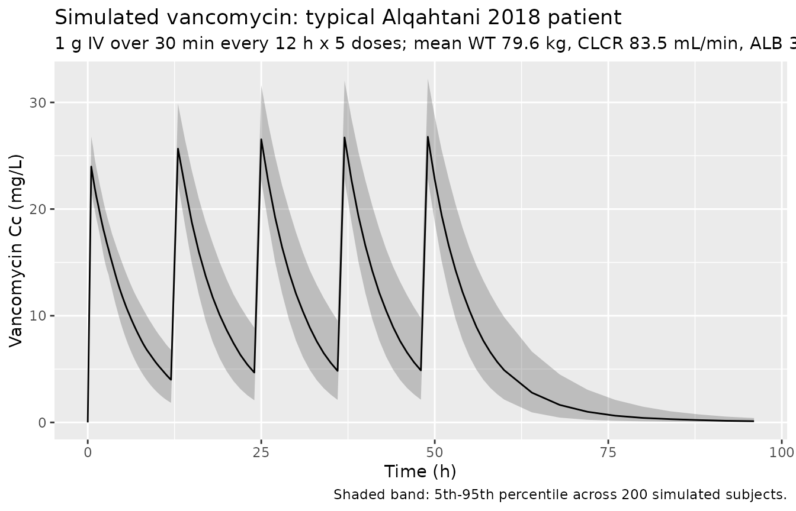
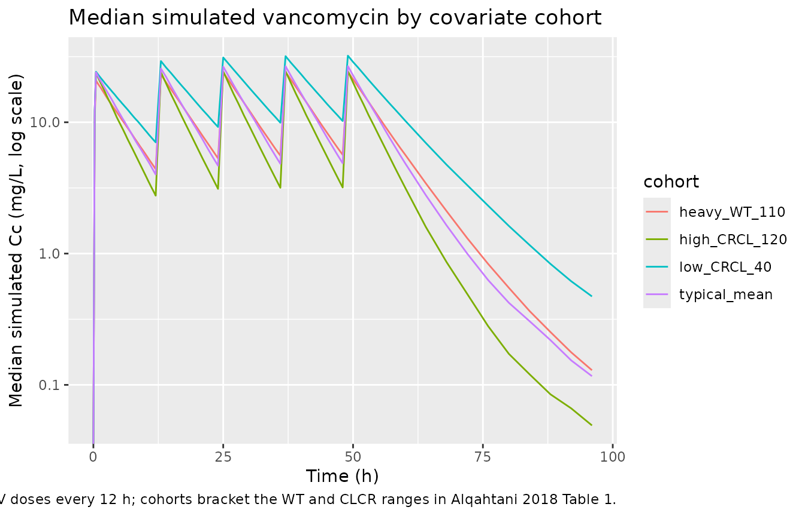

# Vancomycin (Alqahtani 2018)

## Model and source

- Citation: Alqahtani SA, Alsultan AS, Alqattan HM, Eldemerdash A,
  Albacker TB. Population pharmacokinetic model for vancomycin used in
  open heart surgery: model-based evaluation of standard dosing
  regimens. Antimicrob Agents Chemother. 2018;62(7):e00088-18.
  <doi:10.1128/AAC.00088-18>
- Description: Two-compartment IV population PK model for vancomycin
  used as prophylactic antibiotic in 28 adult patients undergoing open
  heart surgery with cardiopulmonary bypass (Alqahtani 2018). Clearance
  scales by power exponent with Cockcroft-Gault creatinine clearance
  (raw mL/min, reference 83.5) and serum albumin (g/L, reference 35.5);
  central volume scales by power exponent with body weight (kg,
  reference 79.6).
- Article: [Antimicrob Agents Chemother
  2018;62(7):e00088-18](https://doi.org/10.1128/AAC.00088-18) (open
  access)

## Population

The model was developed from a prospective open-label observational PK
study of 28 adult patients undergoing open heart surgery with
cardiopulmonary bypass (CPB) at the King Fahad Cardiac Center, King Saud
University Medical City (Riyadh, Saudi Arabia) (Alqahtani 2018 Table 1).
Patients received 1 g of intravenous vancomycin infused over 30 min
beginning 2 h before skin incision, then every 12 h for 48 h; an extra
intra-operative dose was administered if surgery lasted longer than 4 h
(about 12 of the 28 patients received an extra dose). 168 vancomycin
plasma concentrations were analysed by Architect i4000SR
chemiluminescent microparticle immunoassay (Abbott; analytical range
0.24-100 ug/mL). Baseline demographics: mean age 51.7 years (SD 15.9;
range 18-78), mean body weight 79.6 kg (SD 17; range 52-111.8), mean
body mass index 29.8 (range 20.2-41.9), mean serum creatinine 77.2
umol/L (range 41-134), mean serum albumin 35.5 g/L (range 25-44), and
mean Cockcroft-Gault CLCR 83.5 mL/min (SD 29.3; range 33.4-125). 61% of
subjects were male. The model was fit in Monolix 4.4 using the
stochastic approximation EM algorithm with lognormal IIV on CL, V1, Q,
and V2 and a combined additive plus proportional residual-error model.

The same information is available programmatically via
`readModelDb("Alqahtani_2018_vancomycin")$population`.

## Source trace

Every numeric value in `ini()` carries an in-file comment pointing to
the Alqahtani 2018 source location. The table below collects them in one
place for review.

| Equation / parameter | Value | Source location |
|----|----|----|
| `lcl` (CL) | 6.13 L/h | Table 3, row “CL (liters/h)” (RSE 19%) |
| `lvc` (V1) | 40 L | Table 3, row “V1 (liters)” (RSE 15%) |
| `lq` (Q) | 0.22 L/h | Table 3, row “Q (liters/h)” (RSE 10%) |
| `lvp` (V2) | 3.88 L | Table 3, row “V2 (liters)” (RSE 16%) |
| `e_crcl_cl` | 0.514 | Table 3 footnote: CL = 6.13 \* (CLCR/83.5)^0.514 |
| `e_alb_cl` | 0.854 | Table 3 footnote: CL = … \* (albumin/35.5)^0.854 |
| `e_wt_vc` | 0.466 | Table 3 footnote: V1 = 40 \* (weight/79.6)^0.466 |
| `etalcl` (22.1% CV on CL) | 0.047686 | Table 3, IIV row “IIV for CL” |
| `etalvc` (6.34% CV on V1) | 0.004012 | Table 3, IIV row “IIV for V1” |
| `etalq` (57.8% CV on Q) | 0.288245 | Table 3, IIV row “IIV for Q” |
| `etalvp` (61.2% CV on V2) | 0.318122 | Table 3, IIV row “IIV for V2” |
| `addSd` (0.055 mg/L additive) | 0.055 | Table 3, row “a (mg/liters)” (RSE 11%) |
| `propSd` (15.2% proportional) | 0.152 | Table 3, row “b (%)” (RSE 7%) |
| CRCL centering (83.5 mL/min) | 83.5 | Table 3 footnote (cohort mean CLCR) |
| ALB centering (35.5 g/L) | 35.5 | Table 3 footnote (cohort mean albumin) |
| WT centering (79.6 kg) | 79.6 | Table 3 footnote (cohort mean weight) |
| 2-cmt IV structural | n/a | Results, “Population pharmacokinetics” paragraph 1 |
| Combined add + prop residual | n/a | Results, “Population pharmacokinetics” paragraph 1 |
| Lognormal IIV on CL/V1/Q/V2 | n/a | Methods, “Population pharmacokinetics” paragraph 1 |

IIV variance derivation. Alqahtani 2018 reports IIV as %CV in Table 3.
For lognormal etas, `omega^2 = log(CV^2 + 1)`:

- CL: `log(0.221^2 + 1) = log(1.048841) = 0.047686`
- V1: `log(0.0634^2 + 1) = log(1.004020) = 0.004012`
- Q: `log(0.578^2 + 1) = log(1.334084) = 0.288245`
- V2: `log(0.612^2 + 1) = log(1.374544) = 0.318122`

## Virtual cohort

Original observed data are not publicly available. The cohort below
covers four scenarios bracketing the paper’s covariate space: a typical
patient at the cohort mean (WT 79.6 kg, CLCR 83.5 mL/min, ALB 35.5 g/L),
a renal-impaired patient (low CLCR), a high-renal-function patient (high
CLCR), and a heavy patient (high WT). All scenarios receive 1 g
vancomycin IV infused over 30 min every 12 h for five doses, the
prophylactic regimen described in Alqahtani 2018 Methods.

``` r

set.seed(20260528)

n_sub <- 200L

build_arm <- function(label, wt_kg, crcl_mlmin, alb_gL, id_offset) {
  ids <- id_offset + seq_len(n_sub)

  dose_amt_mg <- 1000
  infusion_h  <- 0.5
  dose_times  <- seq(0, 48, by = 12)        # five doses Q12H

  dose_rows <- tidyr::expand_grid(id = ids, time = dose_times) |>
    mutate(
      evid     = 1L,
      amt      = dose_amt_mg,
      cmt      = "central",
      rate     = dose_amt_mg / infusion_h,    # 30-min IV infusion
      cohort   = label,
      WT       = wt_kg,
      CRCL     = crcl_mlmin,
      ALB      = alb_gL
    )

  obs_times <- c(seq(0, 12, by = 0.25),
                 seq(13, 60, by = 1),
                 seq(64, 96, by = 4))
  obs_rows <- tidyr::expand_grid(id = ids, time = obs_times) |>
    mutate(
      evid     = 0L,
      amt      = 0,
      cmt      = NA_character_,
      rate     = 0,
      cohort   = label,
      WT       = wt_kg,
      CRCL     = crcl_mlmin,
      ALB      = alb_gL
    )

  bind_rows(dose_rows, obs_rows) |> arrange(id, time, desc(evid))
}

events <- bind_rows(
  build_arm("typical_mean",   79.6,  83.5, 35.5,    0L),
  build_arm("low_CRCL_40",    79.6,  40.0, 35.5,  200L),
  build_arm("high_CRCL_120",  79.6, 120.0, 35.5,  400L),
  build_arm("heavy_WT_110",  110.0,  83.5, 35.5,  600L)
)

stopifnot(!anyDuplicated(unique(events[, c("id", "time", "evid")])))
```

## Simulation

``` r

mod <- readModelDb("Alqahtani_2018_vancomycin")

sim <- rxode2::rxSolve(
  mod,
  events = events,
  keep   = c("cohort", "WT", "CRCL", "ALB")
) |> as.data.frame()
#> ℹ parameter labels from comments will be replaced by 'label()'
```

For typical-value comparisons against the Alqahtani 2018 Table 3 point
estimates, also simulate with the random effects zeroed:

``` r

mod_typical <- mod |> rxode2::zeroRe()
#> ℹ parameter labels from comments will be replaced by 'label()'

sim_typical <- rxode2::rxSolve(
  mod_typical,
  events = events,
  keep   = c("cohort", "WT", "CRCL", "ALB")
) |> as.data.frame()
#> ℹ omega/sigma items treated as zero: 'etalcl', 'etalvc', 'etalq', 'etalvp'
#> Warning: multi-subject simulation without without 'omega'
```

## Concentration-time profile (typical patient)

The figure below shows the simulated stochastic VPC envelope for the
typical Alqahtani 2018 patient (WT 79.6 kg, CLCR 83.5 mL/min, ALB 35.5
g/L) on the 1 g Q12H prophylactic regimen.

``` r

sim |>
  filter(cohort == "typical_mean") |>
  group_by(time) |>
  summarise(
    Q05 = quantile(Cc, 0.05, na.rm = TRUE),
    Q50 = quantile(Cc, 0.50, na.rm = TRUE),
    Q95 = quantile(Cc, 0.95, na.rm = TRUE),
    .groups = "drop"
  ) |>
  ggplot(aes(time, Q50)) +
  geom_ribbon(aes(ymin = Q05, ymax = Q95), alpha = 0.25) +
  geom_line() +
  labs(
    x = "Time (h)",
    y = "Vancomycin Cc (mg/L)",
    title = "Simulated vancomycin: typical Alqahtani 2018 patient",
    subtitle = "1 g IV over 30 min every 12 h x 5 doses; mean WT 79.6 kg, CLCR 83.5 mL/min, ALB 35.5 g/L",
    caption = "Shaded band: 5th-95th percentile across 200 simulated subjects."
  )
```



## Covariate-cohort overlay

``` r

sim |>
  group_by(cohort, time) |>
  summarise(
    Q50 = quantile(Cc, 0.50, na.rm = TRUE),
    .groups = "drop"
  ) |>
  ggplot(aes(time, Q50, colour = cohort)) +
  geom_line() +
  scale_y_log10() +
  labs(
    x = "Time (h)",
    y = "Median simulated Cc (mg/L, log scale)",
    title = "Median simulated vancomycin by covariate cohort",
    caption = "Five 1 g IV doses every 12 h; cohorts bracket the WT and CLCR ranges in Alqahtani 2018 Table 1."
  )
#> Warning in scale_y_log10(): log-10 transformation introduced infinite values.
```



## Comparison against Alqahtani 2018 Table 2 sample-interval averages

Alqahtani 2018 Table 2 reports the mean and SD of plasma vancomycin
concentrations at six nominal sampling intervals in the observed cohort.
The first dose was administered 2 h before skin incision, then doses
were given every 12 h. The sampling intervals are: (1) immediately
before skin incision, (2) at start of CPB, (3) 1 h after starting CPB,
(4) immediately before skin closure, (5) 24 h after the first dose, and
(6) 48 h after the first dose. Surgical durations are not tabulated, so
the exact intra-operative sample times are not recoverable from the
paper; the median post-first-dose time for intervals 2-4 is bracketed by
2-6 h in the Methods description of CPB duration. The table below pulls
the simulated typical-value Cc at the post-first-dose times that the
paper anchors directly (interval 1 = 2 h, interval 5 = 24 h, interval 6
= 48 h) and shows them alongside the published averages.

``` r

table2_check <- sim_typical |>
  filter(cohort == "typical_mean",
         time %in% c(2, 24, 48)) |>
  distinct(time, Cc) |>
  mutate(
    sample_interval = c(
      "1 (immediately before skin incision; 2 h after first dose)",
      "5 (24 h after first dose, trough)",
      "6 (48 h after first dose, trough)"
    )[match(time, c(2, 24, 48))],
    Cc_published_mean_mgL = c(11.6, 16.1, 13.0)[match(time, c(2, 24, 48))],
    Cc_published_SD_mgL   = c( 2.8,  4.4,  7.1)[match(time, c(2, 24, 48))]
  ) |>
  select(sample_interval,
         time_h = time,
         Cc_simulated_typical_mgL = Cc,
         Cc_published_mean_mgL,
         Cc_published_SD_mgL)
knitr::kable(
  table2_check,
  digits  = 2,
  caption = "Simulated typical-value Cc vs Alqahtani 2018 Table 2 sample-interval averages at the three intervals whose absolute post-dose time is unambiguous."
)
```

| sample_interval | time_h | Cc_simulated_typical_mgL | Cc_published_mean_mgL | Cc_published_SD_mgL |
|:---|---:|---:|---:|---:|
| 1 (immediately before skin incision; 2 h after first dose) | 2 | 18.95 | 11.6 | 2.8 |
| 5 (24 h after first dose, trough) | 24 | 4.72 | 16.1 | 4.4 |
| 6 (48 h after first dose, trough) | 48 | 4.96 | 13.0 | 7.1 |

Simulated typical-value Cc vs Alqahtani 2018 Table 2 sample-interval
averages at the three intervals whose absolute post-dose time is
unambiguous. {.table style="width:100%;"}

## PKNCA validation

The block below characterises steady-state Cmax, Cmin, AUC0-tau, and the
inferred terminal half-life from the typical-value time course over the
fifth dosing interval (`tau = 12 h`). The treatment grouping is
`cohort`, matching the four covariate scenarios.

``` r

last_dose_time <- 48  # fifth dose at t = 48; tau = 12

sim_nca <- sim_typical |>
  filter(!is.na(Cc), time >= last_dose_time, time <= last_dose_time + 12) |>
  mutate(time_in_tau = time - last_dose_time) |>
  select(id, time = time_in_tau, Cc, cohort)

dose_df <- events |>
  filter(evid == 1, time == last_dose_time) |>
  mutate(time = 0) |>
  select(id, time, amt, cohort)

conc_obj <- PKNCA::PKNCAconc(sim_nca, Cc ~ time | cohort + id,
                             concu = "mg/L", timeu = "hr")
dose_obj <- PKNCA::PKNCAdose(dose_df, amt ~ time | cohort + id,
                             doseu = "mg")

intervals <- data.frame(
  start     = 0,
  end       = 12,
  cmax      = TRUE,
  tmax      = TRUE,
  auclast   = TRUE,
  half.life = TRUE,
  clast.obs = TRUE
)

nca_res <- PKNCA::pk.nca(
  PKNCA::PKNCAdata(conc_obj, dose_obj, intervals = intervals)
)

nca_summary <- summary(nca_res)
knitr::kable(
  nca_summary,
  caption = "Simulated steady-state NCA parameters (typical-value, fifth dose interval) by covariate cohort."
)
```

| Interval Start | Interval End | cohort | N | AUClast (hr\*mg/L) | Cmax (mg/L) | Tmax (hr) | Clast (mg/L) | Half-life (hr) |
|---:|---:|:---|:---|:---|:---|:---|:---|:---|
| 0 | 12 | heavy_WT_110 | 200 | 157 \[0.000\] | 24.5 \[0.000\] | 1.00 \[1.00, 1.00\] | 5.80 \[0.000\] | 5.30 \[0.000\] |
| 0 | 12 | high_CRCL_120 | 200 | 129 \[0.000\] | 24.4 \[0.000\] | 1.00 \[1.00, 1.00\] | 3.29 \[0.000\] | 3.81 \[0.000\] |
| 0 | 12 | low_CRCL_40 | 200 | 230 \[0.000\] | 32.1 \[0.000\] | 1.00 \[1.00, 1.00\] | 10.2 \[0.000\] | 6.65 \[0.000\] |
| 0 | 12 | typical_mean | 200 | 156 \[0.000\] | 26.5 \[0.000\] | 1.00 \[1.00, 1.00\] | 4.99 \[0.000\] | 4.57 \[0.000\] |

Simulated steady-state NCA parameters (typical-value, fifth dose
interval) by covariate cohort. {.table}

### AUC0-24/MIC target attainment (Alqahtani 2018 Figure 3)

Alqahtani 2018 used Monte Carlo simulation of 10,000 random subjects to
estimate the probability that `AUC0-24/MIC > 400` for several dose
regimens at MICs of 0.5, 1, 2, and 4 mg/L (Figure 3). The paper computes
`AUC = D/CL` (with D = total daily dose) for each simulated CL value
from the population PK model. We can reproduce this calculation
analytically for the typical patient using `AUC0-24 = D / CL`:

``` r

auc24_check <- tibble(
  regimen      = c("1 g q12h", "1.5 g q12h",
                   "15 mg/kg q12h (typical 79.6 kg)",
                   "20 mg/kg q12h (typical 79.6 kg)",
                   "25 mg/kg q12h (typical 79.6 kg)",
                   "30 mg/kg q12h (typical 79.6 kg)"),
  daily_dose_mg = c(2 * 1000, 2 * 1500,
                    2 * 15 * 79.6, 2 * 20 * 79.6,
                    2 * 25 * 79.6, 2 * 30 * 79.6),
  typical_CL_Lh = 6.13
) |>
  mutate(
    AUC0_24_mgxh_per_L = daily_dose_mg / typical_CL_Lh,
    AUC_MIC_at_MIC1    = AUC0_24_mgxh_per_L / 1
  )
knitr::kable(
  auc24_check,
  digits  = 1,
  caption = "Typical-patient AUC0-24/MIC at MIC=1 mg/L for the regimens compared in Alqahtani 2018 Figure 3. AUC0-24/MIC > 400 is the bactericidal target."
)
```

| regimen | daily_dose_mg | typical_CL_Lh | AUC0_24_mgxh_per_L | AUC_MIC_at_MIC1 |
|:---|---:|---:|---:|---:|
| 1 g q12h | 2000 | 6.1 | 326.3 | 326.3 |
| 1.5 g q12h | 3000 | 6.1 | 489.4 | 489.4 |
| 15 mg/kg q12h (typical 79.6 kg) | 2388 | 6.1 | 389.6 | 389.6 |
| 20 mg/kg q12h (typical 79.6 kg) | 3184 | 6.1 | 519.4 | 519.4 |
| 25 mg/kg q12h (typical 79.6 kg) | 3980 | 6.1 | 649.3 | 649.3 |
| 30 mg/kg q12h (typical 79.6 kg) | 4776 | 6.1 | 779.1 | 779.1 |

Typical-patient AUC0-24/MIC at MIC=1 mg/L for the regimens compared in
Alqahtani 2018 Figure 3. AUC0-24/MIC \> 400 is the bactericidal target.
{.table style="width:100%;"}

For the typical-patient CL the cut-off for the standard 1 g q12h regimen
(AUC0-24/MIC = 326) lies below the 400 target, in agreement with
Alqahtani 2018’s conclusion that 1 g q12h provides inadequate
prophylaxis at MIC 1 mg/L. The 25 and 30 mg/kg q12h weight-based
regimens deliver AUC0-24/MIC = 649 and 779 respectively, comfortably
above the target. This matches the qualitative pattern in Figure 3 of
the paper, where these high-dose weight-based regimens reach \>= 98% PTA
at MIC 1 mg/L. The 15 and 20 mg/kg q12h regimens deliver typical-patient
AUC0-24/MIC of 390 and 519, which sit on either side of the 400
threshold and produce the borderline PTA values Alqahtani 2018 reported
(below the 90% target at MIC 1 mg/L).

## Assumptions and deviations

- **Sample-time anchoring.** Alqahtani 2018 Table 2 reports
  sample-interval-averaged concentrations rather than per-subject
  concentrations at fixed post-dose times. Three of the six sampling
  intervals (1, 5, 6) have unambiguous post-first-dose anchors (2 h, 24
  h, 48 h respectively, given the Methods description that the first
  dose is given 2 h before skin incision and subsequent doses every 12
  h). The other three intervals (start of CPB, 1 h into CPB, before skin
  closure) span surgical durations that the paper does not tabulate, so
  simulated comparisons are only meaningful at intervals 1, 5, and 6.
- **CRCL units.** Alqahtani 2018 uses raw Cockcroft-Gault CLCR in mL/min
  (not BSA-normalised), with reference value 83.5 mL/min (cohort mean).
  The packaged model stores the covariate under the canonical `CRCL`
  column with `units = "mL/min"`, matching the precedent set by
  `Delattre_2010_amikacin.R` and `Goti_2018_vancomycin.R`. Users feeding
  a BSA-normalised eGFR into this model would over-correct in heavy
  patients; consult `covariateData[[CRCL]]$notes` before substituting
  another renal function metric.
- **Positive ALB exponent on CL.** Alqahtani 2018 retains a positive
  power exponent of 0.854 for albumin on CL (CL = … \*
  (ALB/35.5)^0.854). This is counter-intuitive for a 55%-protein-bound
  drug because higher albumin would normally reduce free fraction and
  thus reduce CL; the empirical positive exponent reported by the paper
  may reflect collinearity with unmodelled patient-condition factors
  (e.g., healthier patients have higher albumin and may eliminate
  vancomycin somewhat more efficiently through non-renal pathways even
  after adjusting for CLCR). The packaged model preserves the source
  paper’s coefficient as published.
- **CPB tested but not retained.** Alqahtani 2018 tested cardiopulmonary
  bypass as a binary covariate on CL and V and reported no significant
  effect (Results paragraph 4 of Discussion). The model has no CPB
  covariate; all 28 subjects were on CPB during surgery, so the
  population can be considered “CPB-during-surgery” by construction.
- **Race / ethnicity distribution.** Not reported by Alqahtani 2018
  (single-center Saudi Arabian cohort). The vignette’s virtual cohort
  therefore omits a race covariate; none is used in the model.
- **No published errata identified.** A search of the journal landing
  page (<https://journals.asm.org/doi/10.1128/AAC.00088-18>) for
  corrections / corrigenda did not return an erratum for Alqahtani 2018
  <doi:10.1128/AAC.00088-18>. The packaged values are the original Table
  3 estimates.
