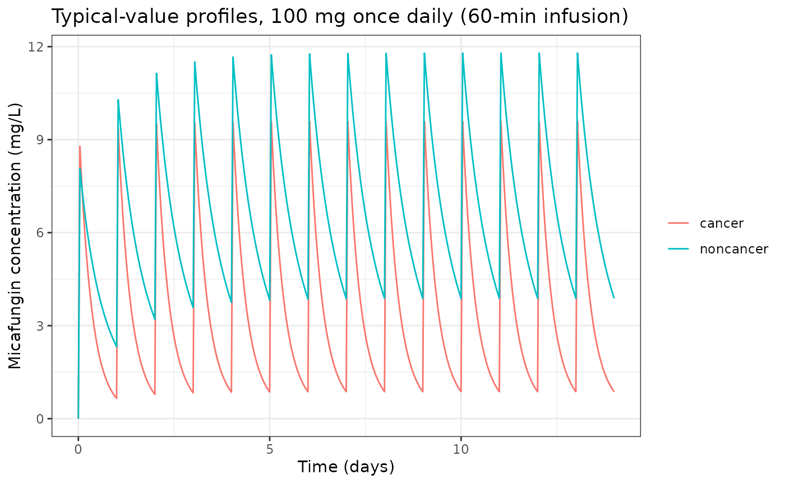
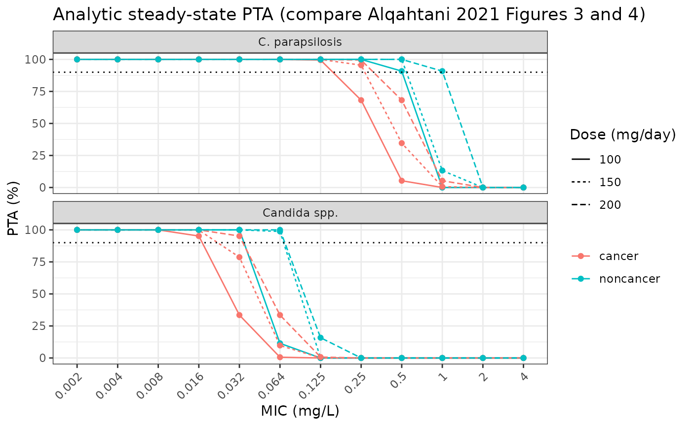

# Micafungin in patients with and without cancer (Alqahtani 2021)

## Model and source

Alqahtani 2021 fitted a two-compartment model to micafungin plasma
concentrations from hospitalised adults with and without cancer and
reported a complete parameter set for each group (Table 2). The library
ships the two columns of Table 2 as two model files:

- `Alqahtani_2021_micafungin_cancer`: patients with cancer (n = 10).
- `Alqahtani_2021_micafungin_noncancer`: patients without cancer (n =
  9).

``` r

mods <- c(
  cancer = "Alqahtani_2021_micafungin_cancer",
  noncancer = "Alqahtani_2021_micafungin_noncancer"
)
uis <- lapply(mods, function(nm) rxode2::rxode(readModelDb(nm)))
#> ℹ parameter labels from comments will be replaced by 'label()'
#> ℹ parameter labels from comments will be replaced by 'label()'
```

- Citation: Alqahtani S, Alfarhan A, Alsultan A, Alsarhani E, Alsubaie
  A, Asiri Y. Assessment of Micafungin Dosage Regimens in Patients with
  Cancer Using Pharmacokinetic/Pharmacodynamic Modeling and Monte Carlo
  Simulation. Antibiotics (Basel). 2021;10(11):1363.
  <doi:10.3390/antibiotics10111363>.
- Description (cancer): Two-compartment population PK model for IV
  micafungin in hospitalised adult patients with cancer (Alqahtani 2021,
  cancer-group parameter set). Linear elimination from the central
  compartment, log-normal IIV on CL, V1, Q and V2, and a combined
  additive + proportional residual error. The paper reports that AST,
  ALT and body weight influenced CL and that BMI, body weight, total
  bilirubin and albumin influenced V1, but prints no coefficient or
  functional form for any of them, so this file carries the cancer-group
  typical values of Table 2 without covariate effects. The companion
  file Alqahtani_2021_micafungin_noncancer holds the non-cancer group.
- Description (non-cancer): Two-compartment population PK model for IV
  micafungin in hospitalised adult patients without cancer (Alqahtani
  2021, non-cancer comparator-group parameter set). Linear elimination
  from the central compartment, log-normal IIV on CL, V1, Q and V2, and
  a combined additive + proportional residual error. The paper reports
  that AST, ALT and body weight influenced CL and that BMI, body weight,
  total bilirubin and albumin influenced V1, but prints no coefficient
  or functional form for any of them, so this file carries the
  non-cancer-group typical values of Table 2 without covariate effects.
  The companion file Alqahtani_2021_micafungin_cancer holds the cancer
  group.
- Article: <https://doi.org/10.3390/antibiotics10111363> (open access;
  Supplementary File S1 describes the error and random-effect model
  forms)

## Population

The prospective single-centre study at King Saud University Medical City
(Riyadh, Saudi Arabia) enrolled 19 hospitalised adults who received at
least two doses of micafungin, empirically or for a confirmed fungal
infection: 10 with cancer and 9 without (Alqahtani 2021 Section 3.1,
Table 1). Mean age was 47.3 and 51.1 years, mean body weight 63.4 and
69.8 kg, and 40% and 33% were female in the cancer and non-cancer groups
respectively. Mean SOFA scores were 7 and 8; AST, ALT, albumin,
bilirubin and creatinine clearance did not differ significantly between
the groups. All cancer patients received 100 mg/day; seven non-cancer
patients received 100 mg/day and two received 150 mg/day, as 60-min IV
infusions. Seven samples were drawn per patient at 1, 2, 4, 6, 8, 12 and
24 h after the start of the infusion (133 samples).

``` r

str(uis$cancer$population[c("n_subjects", "age_range", "weight_range", "sex_female_pct", "dose_range")])
#> List of 5
#>  $ n_subjects    : int 10
#>  $ age_range     : chr "mean 47.3 years (SD 12.3); adults >= 18 years"
#>  $ weight_range  : chr "mean 63.4 kg (SD 18.2)"
#>  $ sex_female_pct: num 40
#>  $ dose_range    : chr "100 mg micafungin once daily as a 60-min IV infusion (all 10 cancer patients); at least two doses before sampling."
str(uis$noncancer$population[c("n_subjects", "age_range", "weight_range", "sex_female_pct", "dose_range")])
#> List of 5
#>  $ n_subjects    : int 9
#>  $ age_range     : chr "mean 51.1 years (SD 19.1); adults >= 18 years"
#>  $ weight_range  : chr "mean 69.8 kg (SD 15.7)"
#>  $ sex_female_pct: num 33
#>  $ dose_range    : chr "100 mg (7 patients) or 150 mg (2 patients) micafungin once daily as a 60-min IV infusion; at least two doses before sampling."
```

## Source trace

| Equation / parameter | Cancer | Non-cancer | Source location |
|----|----|----|----|
| Two-compartment model, linear elimination from central | – | – | Section 3.2 |
| `lcl` (CL, L/h) | log(1.2) | log(0.6) | Table 2 |
| `lvc` (V1, L) | log(10.7) | log(12) | Table 2 |
| `lq` (Q, L/h) | log(0.144) | log(0.188) | Table 2 |
| `lvp` (V2, L) | log(3.5) | log(2.77) | Table 2 |
| `etalcl` (IIV CL) | 34.1% CV | 11.8% CV | Table 2; log-normal per Supplementary File S1 |
| `etalvc` (IIV V1) | 7.6% CV | 7.6% CV | Table 2 |
| `etalq` (IIV Q) | 32.2% CV | 20.4% CV | Table 2 |
| `etalvp` (IIV V2) | 36.8% CV | 32.1% CV | Table 2 |
| `addSd` (residual `a`, mg/L) | 0.21 | 0.15 | Table 2 |
| `propSd` (residual `b`) | 0.22 | 0.18 | Table 2 |
| `Cobs = Cpred (1 + eps_prop) + eps_const` (combined2) | – | – | Supplementary File S1 |
| 60-min infusion of 100-150 mg/day | – | – | Section 2.2 |

The IIV rows are coefficients of variation (Table 2 footnote), converted
to log-normal variances as `omega^2 = log(1 + CV^2)`.

## Typical-value profiles

``` r

ev_typ <- rxode2::et(amt = 100, dur = 1, ii = 24, addl = 13, cmt = "central") |>
  rxode2::et(seq(0, 336, by = 0.25), cmt = "central")

typ <- bind_rows(lapply(names(mods), function(g) {
  s <- rxode2::rxSolve(rxode2::zeroRe(uis[[g]]), ev_typ, returnType = "data.frame")
  s$group <- g
  s
}))
#> ℹ omega/sigma items treated as zero: 'etalcl', 'etalvc', 'etalq', 'etalvp'
#> ℹ omega/sigma items treated as zero: 'etalcl', 'etalvc', 'etalq', 'etalvp'

ggplot(typ, aes(time / 24, Cc, colour = group)) +
  geom_line() +
  labs(
    x = "Time (days)", y = "Micafungin concentration (mg/L)", colour = NULL,
    title = "Typical-value profiles, 100 mg once daily (60-min infusion)"
  ) +
  theme_bw()
```



With these parameters the terminal half-life is about 6 h in the cancer
group and about 14 h in the non-cancer group; nearly all of the
difference comes from CL (1.2 vs 0.6 L/h), which is the only parameter
Table 2 reports as differing significantly between the groups.

## Stochastic simulation and PKNCA

200 virtual patients per group receive 100 mg once daily for 14 days.
The last dosing interval (312-336 h) is sampled densely for NCA.

``` r

n_per_arm <- 200
obs_t <- c(seq(0, 312, by = 24), 312 + c(0.25, 0.5, 0.75, 1, 1.25, 1.5, 2, 3, 4, 6, 8, 10, 12, 16, 20, 24))
ev_sim <- rxode2::et(amt = 100, dur = 1, ii = 24, addl = 13, cmt = "central") |>
  rxode2::et(obs_t, cmt = "central") |>
  rxode2::et(id = seq_len(n_per_arm))

rxode2::rxSetSeed(20211108)
sim <- bind_rows(lapply(names(mods), function(g) {
  s <- rxode2::rxSolve(uis[[g]], ev_sim,
    returnType = "data.frame",
    rtol = 1e-10, atol = 1e-12
  )
  s$group <- g
  s
})) |>
  mutate(id = paste(group, id, sep = "-"))
stopifnot(nrow(sim) > 0, !anyNA(sim$Cc))
```

``` r

last_int <- sim |>
  filter(time >= 312) |>
  mutate(tad = time - 312) |>
  group_by(group, tad) |>
  summarise(
    q05 = quantile(ipredSim, 0.05), q50 = median(ipredSim), q95 = quantile(ipredSim, 0.95),
    .groups = "drop"
  )
ggplot(last_int, aes(tad, q50, colour = group, fill = group)) +
  geom_ribbon(aes(ymin = q05, ymax = q95), alpha = 0.2, colour = NA) +
  geom_line() +
  labs(x = "Time after start of infusion (h)", y = "Micafungin concentration (mg/L)", colour = NULL, fill = NULL) +
  theme_bw()
```


Simulated steady-state dosing interval (day 14), median and 5th-95th
percentiles of the typical-plus-IIV concentration. Compare with the
pooled prediction-corrected VPC of Alqahtani 2021 Figure 2.

PKNCA computes the steady-state AUC over the last interval, per subject
and grouped by population.

``` r

conc_nca <- sim |>
  filter(!is.na(Cc), time >= 312) |>
  mutate(tad = time - 312, Cc = pmax(ipredSim, 0)) |>
  select(id, group, tad, Cc)
dose_nca <- conc_nca |>
  distinct(id, group) |>
  mutate(tad = 0, amt = 100)

conc_obj <- PKNCA::PKNCAconc(conc_nca, Cc ~ tad | group + id)
dose_obj <- PKNCA::PKNCAdose(dose_nca, amt ~ tad | group + id)
intervals <- data.frame(start = 0, end = 24, auclast = TRUE, cmax = TRUE, tmax = TRUE, cmin = TRUE)
nca <- PKNCA::pk.nca(PKNCA::PKNCAdata(conc_obj, dose_obj, intervals = intervals))
nca_wide <- as.data.frame(nca$result) |>
  select(group, id, PPTESTCD, PPORRES) |>
  pivot_wider(names_from = PPTESTCD, values_from = PPORRES)

nca_wide |>
  group_by(group) |>
  summarise(
    across(c(cmax, cmin, auclast), ~ signif(median(.x), 3)),
    tmax = median(tmax)
  ) |>
  rename(
    "Group" = group, "Cmax,ss (mg/L)" = cmax, "Cmin,ss (mg/L)" = cmin,
    "AUC0-24,ss (mg*h/L)" = auclast, "Tmax (h)" = tmax
  ) |>
  knitr::kable(caption = "Simulated median steady-state NCA, 100 mg once daily.")
```

| Group     | Cmax,ss (mg/L) | Cmin,ss (mg/L) | AUC0-24,ss (mg\*h/L) | Tmax (h) |
|:----------|---------------:|---------------:|---------------------:|---------:|
| cancer    |           9.63 |          0.888 |                 84.6 |        1 |
| noncancer |          11.90 |          3.920 |                168.0 |        1 |

Simulated median steady-state NCA, 100 mg once daily. {.table}

The paper reports no NCA table, so there is no published row to place
beside these values. At steady state `AUC0-24 = Dose / CL` for each
simulated subject; checking it against each subject’s own drawn `cl`
tests dose, infusion, unit and volume handling together.

``` r

cl_i <- sim |>
  group_by(id) |>
  summarise(cl = first(cl), .groups = "drop")
chk <- nca_wide |>
  left_join(cl_i, by = "id") |>
  mutate(pct_diff = 100 * (auclast * cl / 100 - 1))
stopifnot(nrow(chk) == 2 * n_per_arm, !anyNA(chk$pct_diff))
chk |>
  group_by(group) |>
  summarise(median_pct = median(pct_diff), p90_abs_pct = quantile(abs(pct_diff), 0.9)) |>
  knitr::kable(digits = 3, caption = "Per-subject AUC0-24,ss x CL / Dose - 1 (%).")
```

| group     | median_pct | p90_abs_pct |
|:----------|-----------:|------------:|
| cancer    |      0.072 |       0.125 |
| noncancer |      0.033 |       0.049 |

Per-subject AUC0-24,ss x CL / Dose - 1 (%). {.table}

``` r

# The residual is trapezoid error across the infusion peak plus any subject not
# fully at steady state after 13 doses; a mis-scaled dose, volume or CL moves
# the whole distribution by tens of percent.
stopifnot(
  abs(median(chk$pct_diff)) < 1,
  quantile(abs(chk$pct_diff), 0.9) < 2
)
```

## Probability of target attainment

The paper’s targets are total-plasma `AUC0-24/MIC` of 3000 for
non-parapsilosis *Candida* spp. and 285 for *C. parapsilosis* (Section
2.7). With linear PK the steady-state AUC is `Dose / CL_i` and `CL_i` is
log-normal, so the PTA is deterministic:

`PTA = Phi( (log(Dose / (target * MIC)) - log(CL_pop)) / omega_CL )`.

``` r

mics <- c(0.002, 0.004, 0.008, 0.016, 0.032, 0.064, 0.125, 0.25, 0.5, 1, 2, 4)
pta_analytic <- function(ui, dose, target, mic) {
  th <- ui$theta
  om <- sqrt(ui$omega["etalcl", "etalcl"])
  100 * stats::pnorm((log(dose / (target * mic)) - th[["lcl"]]) / om)
}
pta <- expand.grid(
  group = names(mods), dose = c(100, 150, 200), mic = mics,
  organism = c("Candida spp.", "C. parapsilosis"), stringsAsFactors = FALSE
) |>
  mutate(
    target = ifelse(organism == "Candida spp.", 3000, 285),
    pta = mapply(function(g, d, t, m) pta_analytic(uis[[g]], d, t, m), group, dose, target, mic)
  )

ggplot(pta, aes(factor(mic), pta,
  colour = group, linetype = factor(dose),
  group = interaction(group, dose)
)) +
  geom_line() +
  geom_point() +
  geom_hline(yintercept = 90, linetype = "dotted") +
  facet_wrap(~organism, ncol = 1) +
  labs(
    x = "MIC (mg/L)", y = "PTA (%)", colour = NULL, linetype = "Dose (mg/day)",
    title = "Analytic steady-state PTA (compare Alqahtani 2021 Figures 3 and 4)"
  ) +
  theme_bw() +
  theme(axis.text.x = element_text(angle = 45, hjust = 1))
```



The simulated cohort gives the same PTA as the closed form, which checks
the formula against the model rather than against itself.

``` r

pta_cell <- function(g, d, org, m) {
  v <- pta$pta[pta$group == g & pta$dose == d & pta$organism == org & pta$mic == m]
  if (length(v) != 1L) stop("no unique PTA cell for ", g, " ", d, " ", org, " ", m)
  v
}
sim_pta <- 100 * mean(chk$auclast[chk$group == "cancer"] / 0.032 >= 3000)
ana_pta <- pta_cell("cancer", 100, "Candida spp.", 0.032)
c(simulated = sim_pta, analytic = ana_pta)
#>       simulated analytic.cancer 
#>        31.50000        33.48218
# Binomial SE at n = 200 and p = 0.33 is 3.3 points; 12 is > 3 SE.
stopifnot(abs(sim_pta - ana_pta) < 12)
```

### Comparison with the published anchors

The Discussion states that 100 mg/day in patients with cancer achieved
an approximate PTA of 30% at an MIC of 0.032 mg/L for non-parapsilosis
*Candida* spp.; Figure 4 shows 95% at 0.016 mg/L for the same arm.

``` r

anchor <- data.frame(
  Claim = c("Cancer, 100 mg, Candida spp., MIC 0.032", "Cancer, 100 mg, Candida spp., MIC 0.016"),
  Published = c(30, 95),
  Model = c(pta_cell("cancer", 100, "Candida spp.", 0.032), pta_cell("cancer", 100, "Candida spp.", 0.016))
)
knitr::kable(anchor, digits = 1, caption = "PTA (%): Discussion / Figure 4 vs the packaged cancer model.")
```

| Claim                                   | Published | Model |
|:----------------------------------------|----------:|------:|
| Cancer, 100 mg, Candida spp., MIC 0.032 |        30 |  33.5 |
| Cancer, 100 mg, Candida spp., MIC 0.016 |        95 |  95.2 |

PTA (%): Discussion / Figure 4 vs the packaged cancer model. {.table}

``` r

stopifnot(abs(anchor$Model - anchor$Published) < 6)
```

Table 3 reports, for each dose and a 70 kg patient, the highest MIC with
a PTA of at least 90%. The packaged files carry no body-weight effect
(see Assumptions), so the model breakpoint is compared with the 70 kg
rows.

``` r

bp <- pta |>
  group_by(group, dose, organism) |>
  summarise(model_bp = max(c(0, mic[pta >= 90])), .groups = "drop")
table3_70kg <- tribble(
  ~group, ~dose, ~organism, ~published_bp,
  "cancer", 100, "Candida spp.", 0.016,
  "cancer", 100, "C. parapsilosis", 0.125,
  "cancer", 150, "Candida spp.", 0.032,
  "cancer", 150, "C. parapsilosis", 0.25,
  "cancer", 200, "Candida spp.", 0.032,
  "cancer", 200, "C. parapsilosis", 0.25,
  "noncancer", 100, "Candida spp.", 0.032,
  "noncancer", 100, "C. parapsilosis", 0.25,
  "noncancer", 150, "Candida spp.", 0.032,
  "noncancer", 150, "C. parapsilosis", 0.25,
  "noncancer", 200, "Candida spp.", 0.032,
  "noncancer", 200, "C. parapsilosis", 0.5
)
bp_cmp <- table3_70kg |>
  left_join(bp, by = c("group", "dose", "organism")) |>
  mutate(match = model_bp == published_bp)
stopifnot(nrow(bp_cmp) == 12, !anyNA(bp_cmp$model_bp))
bp_cmp |>
  rename(
    "Group" = group, "Dose (mg/day)" = dose, "Organism" = organism,
    "Table 3, 70 kg (mg/L)" = published_bp, "Model (mg/L)" = model_bp, "Match" = match
  ) |>
  knitr::kable(caption = "90% PTA breakpoints: Alqahtani 2021 Table 3 (70 kg) vs the packaged models.")
```

| Group | Dose (mg/day) | Organism | Table 3, 70 kg (mg/L) | Model (mg/L) | Match |
|:---|---:|:---|---:|---:|:---|
| cancer | 100 | Candida spp. | 0.016 | 0.016 | TRUE |
| cancer | 100 | C. parapsilosis | 0.125 | 0.125 | TRUE |
| cancer | 150 | Candida spp. | 0.032 | 0.016 | FALSE |
| cancer | 150 | C. parapsilosis | 0.250 | 0.250 | TRUE |
| cancer | 200 | Candida spp. | 0.032 | 0.032 | TRUE |
| cancer | 200 | C. parapsilosis | 0.250 | 0.250 | TRUE |
| noncancer | 100 | Candida spp. | 0.032 | 0.032 | TRUE |
| noncancer | 100 | C. parapsilosis | 0.250 | 0.500 | FALSE |
| noncancer | 150 | Candida spp. | 0.032 | 0.064 | FALSE |
| noncancer | 150 | C. parapsilosis | 0.250 | 0.500 | FALSE |
| noncancer | 200 | Candida spp. | 0.032 | 0.064 | FALSE |
| noncancer | 200 | C. parapsilosis | 0.500 | 1.000 | FALSE |

90% PTA breakpoints: Alqahtani 2021 Table 3 (70 kg) vs the packaged
models. {.table style="width:100%;"}

``` r


# Deterministic: the cancer model reproduces 5 of 6 cells; the non-cancer
# model 1 of 6 (see the discussion below). A changed CL, IIV or target moves
# these counts.
stopifnot(
  sum(bp_cmp$match[bp_cmp$group == "cancer"]) == 5,
  sum(bp_cmp$match[bp_cmp$group == "noncancer"]) == 1
)
```

The cancer model reproduces the published breakpoints except at 150 mg
for *Candida* spp. (model 78.7% PTA at 0.032 mg/L; Figure 4 shows 92%).
The non-cancer model is consistently one doubling dilution more
optimistic than Table 3. Its Table 2 IIV on CL is only 11.8% CV, so the
model’s PTA curve drops steeply around the MIC at which
`Dose / (0.6 L/h)` crosses the target; the published non-cancer curves
in Figures 3 and 4 are much flatter (for example 60% and 65% at 0.064
mg/L for 100 and 150 mg), which implies considerably more
between-subject spread in AUC than the printed CL IIV alone. The
likeliest source is the retained covariate model (body weight, AST and
ALT on CL), whose coefficients and reference values are not printed and
are therefore not in the packaged files. The published figures are also
not fully consistent with each other: fitting a log-normal AUC
distribution to Figure 4’s cancer 100 mg points gives a median CL near
1.2 L/h, while Figure 3’s cancer 100 mg points give a median CL near 1.0
L/h, and the cancer 150 and 200 mg curves in Figure 4 are closer
together than linear PK allows. No parameter was adjusted to close these
gaps.

## Assumptions and deviations

- **Covariate effects not encoded.** The paper states that AST, ALT and
  body weight significantly influenced CL, and that BMI, body weight,
  total bilirubin and albumin affected V1 (Section 3.2), and Table 3
  varies body weight (50/70/100 kg). No coefficient, functional form, or
  reference value for any of these effects is printed in the article or
  in Supplementary File S1, which gives only the generic
  `CL_j = CL_pop x exp(eta_j)` form. The packaged files therefore carry
  the Table 2 typical values without covariate effects; the covariates
  are recorded under `covariatesDataExcluded` in each file. The
  covariate reference values to which the Table 2 typical values
  correspond are also not stated.
- **Two files for one analysis.** The Methods say the two groups were
  co-modelled, but Table 2 prints a separate estimate and RSE for every
  fixed effect, IIV and residual-error term in each group.
  Group-specific IIV and residual error cannot be expressed through a
  single covariate-switched model, so each column of Table 2 is a
  separate file.
- **IIV scale.** Table 2 gives IIV as a coefficient of variation; the
  variance is `log(1 + CV^2)`.
- **Residual error.** Supplementary File S1 writes
  `Cobs = Cpred (1 + eps_prop) + eps_const` with independent
  proportional and constant errors, i.e. the combined2 form. Table 2 `a`
  is taken as the additive SD in mg/L and `b` as the proportional SD.
- **PTA timing.** The paper does not say on which day `AUC0-24` was
  evaluated. The steady-state AUC is used here; it reproduces the
  Discussion’s 30% anchor. Residual error is not included in the PTA.
- **Units in Table 1.** Table 1 prints serum creatinine in mmol/L (means
  of 74.7 and 63.6), which is only plausible as umol/L, and gives no
  units for albumin, AST, ALT or bilirubin; the population metadata
  reproduces the values as printed.
