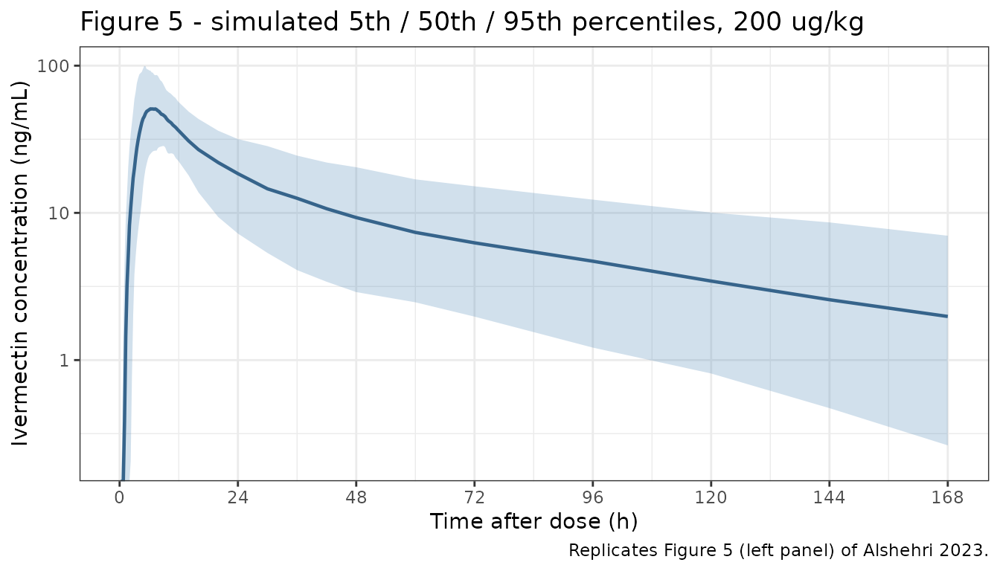
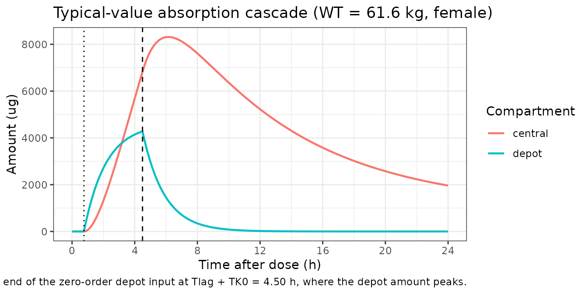
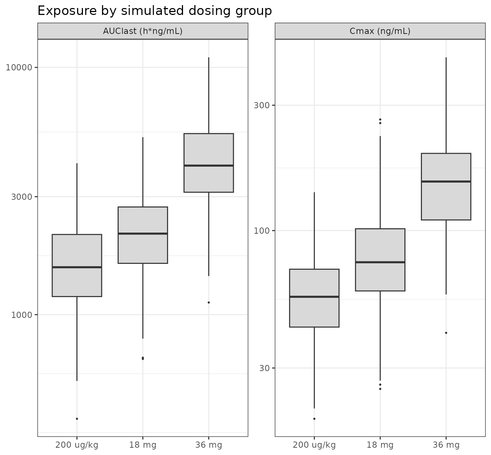
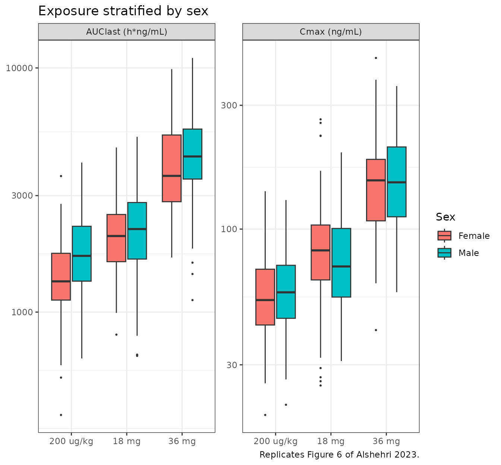

# Ivermectin (Alshehri 2023)

## Model and source

- Citation: Alshehri A, Chhonker YS, Bala V, Edi C, Bjerum CM, Koudou
  BG, John LN, Mitja O, Marks M, King CL, Murry DJ (2023). Population
  pharmacokinetic model of ivermectin in mass drug administration
  against lymphatic filariasis. PLoS Negl Trop Dis 17(6):e0011319.
  <doi:10.1371/journal.pntd.0011319>
- Description: Two-compartment population PK model for ivermectin (IVM)
  in 56 adults (32 Wuchereria bancrofti-infected, 24 uninfected) in Cote
  d’Ivoire given a single 200 ug/kg oral dose as part of ivermectin +
  diethylcarbamazine + albendazole (IDA) triple-drug therapy for
  lymphatic filariasis, taken after a high-fat breakfast (724 plasma
  samples). Absorption is a zero-order input into the depot compartment
  (TK0 = 3.74 h) preceded by a lag time (Tlag = 0.757 h), followed by
  first-order transfer into the central compartment (Ka = 0.718 1/h) and
  linear elimination. Body weight enters as allometric scaling with
  exponents fixed at 1 on Vc/F and Vp/F and 0.75 on CL/F and Q/F,
  centered on the study population’s body weight. Sex is the only
  covariate retained by the stepwise selection: Vp/F is 53% lower in men
  than in women (424.3 L in women, 201.8 L in men). Lymphatic filariasis
  infection status was screened and had no effect on any PK parameter.
  Residual variability is combined additive (0.461 ng/mL) plus
  proportional (22.8%).
- Article: <https://doi.org/10.1371/journal.pntd.0011319>
- Supplements (open access, same DOI landing page): S1 Table
  (tested-model comparison), S2 Table (external-validation
  demographics), S3 Table (simulated exposure by dosing group and sex),
  S1 Text (the Phoenix NLME PML control code for the final model).

Ivermectin (IVM) is a core component of mass drug administration (MDA)
against lymphatic filariasis (LF). Alshehri 2023 is, per its own
Conclusions, the first population PK study of ivermectin in patients
infected with *Wuchereria bancrofti*. The analysis was run in Phoenix
NLME 8.3 with FOCE-I; because the authors published the complete PML
control stream as S1 Text, every structural choice below is traceable to
source code rather than inferred from prose.

## Population

The index dataset comes from an open-label cohort study of single-dose
ivermectin + diethylcarbamazine + albendazole (IDA) triple-drug therapy
in the Agboville district of Cote d’Ivoire (NCT02845713, NCT03664063).
Fifty-six treatment-naive adults contributed 724 plasma ivermectin
concentrations: 32 (57%) infected with *W. bancrofti* (microfilaria
plasma level at or above 50 Mf/mL) and 24 (43%) uninfected community
controls. Thirty-two participants (57%) were male. Median age was 40
years (range 18-66) and median body weight 61.6 kg (range 51-135).
Median ALT was 25 U/L, AST 29 U/L, and serum creatinine 1.1 mg/dL
(Alshehri 2023 Table 1). Participants with renal or hepatic disease,
transaminases or creatinine above 1.5x ULN, haemoglobin below 7 g/dL, or
a positive pregnancy test were excluded.

Each participant received ivermectin 200 ug/kg together with
diethylcarbamazine 6 mg/kg and albendazole 400 mg after a high-fat
breakfast. Plasma was sampled pre-dose and at 1, 2, 3, 4, 6, 8, 12, 24,
36, 48 and 72 h and 7 days (168 h) post-dose; the 168 h sample was
missing for four participants. All measured concentrations were above
the 0.1 ng/mL LLOQ.

The final model was validated externally against 286 further
concentrations from 25 participants (12 male / 13 female, median age
27.5 years, median weight 62 kg) who received the same 200 ug/kg dose in
an azithromycin-IDA interaction trial (Alshehri 2023 S2 Table).

The same information is available programmatically via the model’s
`population` metadata
(`readModelDb("Alshehri_2023_ivermectin")()$population`).

## Model structure

Alshehri 2023 Fig 2 and S1 Text describe a two-compartment disposition
model fed by a distinctive absorption cascade: the dose enters an
absorption (depot) compartment as a **zero-order input of duration TK0 =
3.74 h**, delayed by a **lag time Tlag = 0.757 h**, and then transfers
into the central compartment by **first-order absorption Ka = 0.718/h**.
Elimination is linear. S1 Table shows this structure won on objective
function value by a wide margin (OFV 4269 versus 5314 for the best
one-compartment model and 4689 for a two-compartment model with a lag
time alone).

The authors attribute the zero-order-then-first-order shape to possible
intestinal lymphatic absorption of this highly lipophilic (log P \> 5)
drug, noting that several individual profiles showed a shoulder before
Cmax (Alshehri 2023 Discussion).

Body weight enters as allometric scaling on all four disposition
parameters with exponents **fixed** at 1 (Vc/F, Vp/F) and 0.75 (CL/F,
Q/F). After allometry, **sex on Vp/F was the only covariate retained**
by the stepwise forward-addition / backward-elimination procedure;
notably, LF infection status had no detectable effect on any PK
parameter, which is the paper’s headline finding.

``` r

mod <- readModelDb("Alshehri_2023_ivermectin")
mod
#> function() {
#>   description <- paste0(
#>     "Two-compartment population PK model for ivermectin (IVM) in 56 adults ",
#>     "(32 Wuchereria bancrofti-infected, 24 uninfected) in Cote d'Ivoire given a ",
#>     "single 200 ug/kg oral dose as part of ivermectin + diethylcarbamazine + ",
#>     "albendazole (IDA) triple-drug therapy for lymphatic filariasis, taken after ",
#>     "a high-fat breakfast (724 plasma samples). Absorption is a zero-order input ",
#>     "into the depot compartment (TK0 = 3.74 h) preceded by a lag time (Tlag = ",
#>     "0.757 h), followed by first-order transfer into the central compartment (Ka ",
#>     "= 0.718 1/h) and linear elimination. Body weight enters as allometric ",
#>     "scaling with exponents fixed at 1 on Vc/F and Vp/F and 0.75 on CL/F and ",
#>     "Q/F, centered on the study population's body weight. Sex is the only ",
#>     "covariate retained by the stepwise selection: Vp/F is 53% lower in men than ",
#>     "in women (424.3 L in women, 201.8 L in men). Lymphatic filariasis infection ",
#>     "status was screened and had no effect on any PK parameter. Residual ",
#>     "variability is combined additive (0.461 ng/mL) plus proportional (22.8%)."
#>   )
#>   reference <- paste(
#>     "Alshehri A, Chhonker YS, Bala V, Edi C, Bjerum CM, Koudou BG, John LN,",
#>     "Mitja O, Marks M, King CL, Murry DJ (2023). Population pharmacokinetic",
#>     "model of ivermectin in mass drug administration against lymphatic",
#>     "filariasis. PLoS Negl Trop Dis 17(6):e0011319.",
#>     "doi:10.1371/journal.pntd.0011319",
#>     sep = " "
#>   )
#>   vignette <- "Alshehri_2023_ivermectin"
#>   units <- list(
#>     time          = "h",
#>     dosing        = "ug",
#>     concentration = "ng/mL"
#>   )
#> 
#>   # Issue #482: what each ODE state holds, in what amount units, in what
#>   # biological matrix. Derived mechanically; verified = FALSE means it has
#>   # NOT been checked against the source paper.
#>   compartmentData <- list(
#>     depot       = list(analyte = "ivermectin", units = "ug", specimen = "administration site", verified = FALSE),
#>     central     = list(analyte = "ivermectin", units = "ug", specimen = "plasma", verified = FALSE),
#>     peripheral1 = list(analyte = "ivermectin", units = "ug", specimen = "plasma", verified = FALSE)
#>   )
#> 
#>   covariateData <- list(
#>     WT = list(
#>       description        = "Body weight",
#>       units              = "kg",
#>       type               = "continuous",
#>       reference_category = NULL,
#>       notes              = paste0(
#>         "Time-fixed (single-dose study). Allometric scaling is applied to all ",
#>         "four disposition parameters with exponents FIXED by the authors: 1 on ",
#>         "Vc/F and Vp/F, 0.75 on CL/F and Q/F (Alshehri 2023 Methods 'Covariate ",
#>         "analysis': 'Fixed exponent values of 1 and 0.75 were applied to the ",
#>         "apparent volume of distribution and clearance of central and ",
#>         "peripheral compartments, respectively'; S1 Text PML dVdWeight = 1, ",
#>         "dV2dWeight = 1, dCldWeight = 0.75, dQdWeight = 0.75). The S1 Text PML ",
#>         "centers on `mean(Weight)`, the arithmetic mean body weight of the ",
#>         "analysis dataset, which is NOT reported anywhere in the paper or its ",
#>         "supplements. This model file centers on 61.6 kg, the median body ",
#>         "weight reported in Alshehri 2023 Table 1 (range 51-135 kg); see the ",
#>         "vignette 'Assumptions and deviations' section."
#>       ),
#>       source_name        = "Weight"
#>     ),
#>     SEXF = list(
#>       description        = "Biological sex indicator, 1 = female, 0 = male.",
#>       units              = "(binary)",
#>       type               = "binary",
#>       reference_category = "0 (male)",
#>       notes              = paste0(
#>         "REFERENCE-CATEGORY INVERSION relative to the source. Alshehri 2023 ",
#>         "codes its `Sex` covariate as 1 = male / 0 = female (Methods ",
#>         "'Covariate analysis': 'categorical covariate value of 0 (female sex ",
#>         "or -ve infection status) or 1 (male sex or +ve infection status)'), ",
#>         "i.e. the source column is an SEXM-style indicator. The canonical ",
#>         "column is SEXF (1 = female), so the model file re-expresses the ",
#>         "effect against the male indicator SEXM = 1 - SEXF and keeps the ",
#>         "paper's coefficient sign unchanged: Vp/F = tvVp * exp(e_sexf_vp * (1 ",
#>         "- SEXF)) with e_sexf_vp = -0.74325 (S1 Text PML dV2dSex1). The ",
#>         "structural typical value `lvp` is therefore the WOMEN's value. ",
#>         "Arithmetic check against the paper's own reported endpoints: women ",
#>         "424.33 L (exponent term = 0) and men 424.334 * exp(-0.743251) = ",
#>         "201.8 L, vs the 424.3 L / 200.4 L pair quoted in Alshehri 2023 ",
#>         "Results; the 0.7% difference on the male value comes from the paper ",
#>         "quoting the rounded -0.74 coefficient. Sex is the only covariate ",
#>         "retained in the final model, and it acts only on Vp/F."
#>       ),
#>       source_name        = "Sex (1 = male, 0 = female)"
#>     )
#>   )
#> 
#>   covariatesDataExcluded <- list(
#>     AGE = list(
#>       description = "Age",
#>       units       = "years",
#>       type        = "continuous",
#>       notes       = paste0(
#>         "Screened in the ETA plots and in the stepwise forward-addition / ",
#>         "backward-elimination covariate selection, but not retained. Alshehri ",
#>         "2023 Results: 'Other tested covariates did not show any trend in the ",
#>         "ETA value distribution of PK parameters' and 'sex was the only ",
#>         "covariate from the tested covariates to decrease the OFV'. Median 40 ",
#>         "years (range 18-66), Table 1."
#>       ),
#>       source_name = "Age"
#>     ),
#>     CREAT = list(
#>       description = "Serum creatinine",
#>       units       = "mg/dL",
#>       type        = "continuous",
#>       notes       = paste0(
#>         "Screened but not retained (see AGE note). Median 1.1 mg/dL (range ",
#>         "0.6-1.6), Table 1. Creatinine clearance was deliberately NOT tested: ",
#>         "Alshehri 2023 Methods 'Covariate analysis' states 'Creatinine ",
#>         "clearance (CrCl) was not included in the covariate analysis since IVM ",
#>         "is mainly eliminated into feces with negligible renal excretion'."
#>       ),
#>       source_name = "Creatine level"
#>     ),
#>     ALT = list(
#>       description = "Alanine aminotransferase",
#>       units       = "U/L",
#>       type        = "continuous",
#>       notes       = paste0(
#>         "Screened but not retained (see AGE note). Median 25 U/L (range ",
#>         "14-67), Table 1."
#>       ),
#>       source_name = "ALT"
#>     ),
#>     AST = list(
#>       description = "Aspartate aminotransferase",
#>       units       = "U/L",
#>       type        = "continuous",
#>       notes       = paste0(
#>         "Screened but not retained (see AGE note). Median 29 U/L (range ",
#>         "15-53), Table 1."
#>       ),
#>       source_name = "AST"
#>     ),
#>     WBANCROFTI_POS = list(
#>       description = paste0(
#>         "1 = Wuchereria bancrofti-infected (lymphatic filariasis positive, ",
#>         "microfilaria plasma level >= 50 Mf/mL at screening), 0 = uninfected ",
#>         "community control."
#>       ),
#>       units              = "(binary)",
#>       type               = "binary",
#>       reference_category = "0 (uninfected)",
#>       notes       = paste0(
#>         "Screened but not retained -- this is the paper's headline negative ",
#>         "finding. Alshehri 2023 Abstract: 'The final model identifies that the ",
#>         "PK parameters of IVM are not affected by LF infection'; S2 Fig shows ",
#>         "the ETA box plots by infection status. 32 of 56 subjects (57%) were ",
#>         "infected (Table 1). DOCUMENTATION-ONLY NAME: because the covariate is ",
#>         "not referenced in model(), `WBANCROFTI_POS` is not ratified in ",
#>         "inst/references/covariate-columns.md; it is spelled to match the ",
#>         "existing <PATHOGEN>_POS canonical family (HIV_POS, TB_POS, HCV_POS) ",
#>         "so that a future model retaining a filarial-infection effect can ",
#>         "adopt it directly."
#>       ),
#>       source_name = "Infection status (1 = +ve, 0 = -ve)"
#>     )
#>   )
#> 
#>   population <- list(
#>     species        = "human",
#>     n_subjects     = 56L,
#>     n_studies      = 1L,
#>     age_range      = "18-66 years (eligibility 18-70 years)",
#>     age_median     = "40 years",
#>     weight_range   = "51-135 kg",
#>     weight_median  = "61.6 kg",
#>     sex_female_pct = 43,
#>     race_ethnicity = "not reported; participants resident in the Agboville district, Cote d'Ivoire",
#>     disease_state  = paste0(
#>       "32 (57%) treatment-naive Wuchereria bancrofti-infected adults ",
#>       "(microfilaria plasma level >= 50 Mf/mL) and 24 (43%) uninfected adults"
#>     ),
#>     dose_range     = paste0(
#>       "single oral dose of ivermectin 200 ug/kg co-administered with ",
#>       "diethylcarbamazine 6 mg/kg and albendazole 400 mg (IDA triple-drug ",
#>       "therapy), taken after a high-fat breakfast"
#>     ),
#>     regions        = "Agboville district, Cote d'Ivoire",
#>     n_observations = paste0(
#>       "724 plasma ivermectin concentrations (pre-dose and 1, 2, 3, 4, 6, 8, ",
#>       "12, 24, 36, 48, 72 h and 7 days post-dose); all above the 0.1 ng/mL ",
#>       "LLOQ; the 168 h sample was missing for 4 participants"
#>     ),
#>     exclusions     = paste0(
#>       "renal or hepatic disease; ALT, AST or creatinine > 1.5x ULN; ",
#>       "hemoglobin < 7 g/dL; positive pregnancy test; interacting concomitant ",
#>       "medication within one week; urinary tract infection; albendazole or ",
#>       "ivermectin within the past two years"
#>     ),
#>     external_validation = paste0(
#>       "286 additional ivermectin concentrations from 25 participants (12 male ",
#>       "/ 13 female, median age 27.5 years [18-59], median weight 62 kg ",
#>       "[46-93]) receiving the same 200 ug/kg dose in an azithromycin-IDA ",
#>       "drug-interaction trial (S2 Table); used for a VPC-based external ",
#>       "validation with structural and error parameters fixed"
#>     ),
#>     notes          = paste0(
#>       "Data are from the open-label IDA triple-drug therapy cohort study ",
#>       "registered as NCT02845713 and NCT03664063. Model built in Phoenix NLME ",
#>       "8.3 (Certara) using FOCE-I; the full PML control code for the final ",
#>       "model is reproduced in S1 Text. Baseline demographics are Alshehri 2023 ",
#>       "Table 1; final parameter estimates with bootstrap CIs are Table 2."
#>     )
#>   )
#> 
#>   ini({
#>     # ========================================================================
#>     # Structural PK. Alshehri 2023 Table 2 ('Final model estimations of
#>     # population PK parameters of IVM') and S1 Text (Phoenix PML of the final
#>     # model). Values below use the full precision reported in the S1 Text
#>     # `fixef()` statements; Table 2 quotes the same values rounded.
#>     #
#>     # UNIT CONVENTION: the S1 Text PML carries volumes in mL and clearances in
#>     # mL/h with the dose in ug, so that C = A1/V lands in ug/mL. This model
#>     # file instead carries volumes in L and clearances in L/h with the dose in
#>     # ug, so that Cc = central/vc lands in ug/L == ng/mL -- the unit the paper
#>     # reports throughout (LLOQ 0.1 ng/mL; Cmax ~59 ng/mL). Only the
#>     # volume/clearance values are rescaled by 1e-3; no structural change.
#>     # ========================================================================
#>     lka <- log(0.717722387163157)
#>     label("First-order absorption rate constant Ka (1/h)")
#>     # S1 Text PML: fixef(tvKa = 0.717722387163157).
#>     # Table 2: Ka = 0.71 1/h (CV 13.6%); bootstrap median 0.72 (0.53-0.99).
#> 
#>     ld1 <- log(3.73958407653678)
#>     label("Zero-order duration of the dose input into the depot compartment TK0 (h)")
#>     # S1 Text PML: fixef(tvTK0 = 3.73958407653678); dosepoint(Aa, duration = TK0).
#>     # Table 2: Tk0 = 3.73 h (CV 5.3%); bootstrap median 3.73 (3.33-4.11).
#> 
#>     ltlag <- log(0.756753148154855)
#>     label("Absorption lag time Tlag (h)")
#>     # S1 Text PML: fixef(tvTlag = 0.756753148154855); dosepoint(Aa, tlag = Tlag).
#>     # Table 2: Tlag = 0.75 h (CV 9.5%); bootstrap median 0.76 (0.63-0.93).
#> 
#>     lcl <- log(7.02663375480997)
#>     label("Apparent clearance CL/F (L/h) at the reference body weight")
#>     # S1 Text PML: fixef(tvCl = 7026.63375480997) mL/h = 7.0266 L/h.
#>     # Table 2: CL/F = 7.02 L/h (CV 6.7%); bootstrap median 7.01 (6.17-7.95).
#> 
#>     lvc <- log(138.07174209207)
#>     label("Apparent central volume of distribution Vc/F (L) at the reference body weight")
#>     # S1 Text PML: fixef(tvV = 138071.74209207) mL = 138.07 L.
#>     # Table 2: Vc/F = 138 L (CV 8.4%); bootstrap median 137.17 (117-159.50).
#> 
#>     lq <- log(9.11317023736889)
#>     label("Apparent intercompartmental clearance Q/F (L/h) at the reference body weight")
#>     # S1 Text PML: fixef(tvQ = 9113.17023736889) mL/h = 9.1132 L/h.
#>     # Table 2: Q/F = 9.11 L/h (CV 10.4%); bootstrap median 9.04 (7.43-10.88).
#> 
#>     lvp <- log(424.334354384267)
#>     label("Apparent peripheral volume of distribution Vp/F (L) in WOMEN at the reference body weight")
#>     # S1 Text PML: fixef(tvV2 = 424334.354384267) mL = 424.33 L.
#>     # Table 2: Vp/F = 424.33 L (CV 8.4%); bootstrap median 437.94 (368.45-530.87).
#>     # This is the FEMALE typical value: in the PML the sex term is
#>     # exp(dV2dSex1 * (Sex == 1)), which is exp(0) = 1 for women (Sex == 0).
#>     # Alshehri 2023 Results: "The model estimation of Vp/F was 424.3 liters in
#>     # women and 200.4 liters in men."
#> 
#>     # ========================================================================
#>     # Allometric scaling on body weight. All four exponents are FIXED by the
#>     # authors, not estimated. Alshehri 2023 Methods 'Covariate analysis':
#>     # "Fixed exponent values of 1 and 0.75 were applied to the apparent volume
#>     # of distribution and clearance of central and peripheral compartments,
#>     # respectively." Confirmed by S1 Text PML fixef() statements, none of which
#>     # carry bounds or standard errors for these four terms; Table 2 reports no
#>     # CV% for any of them.
#>     # ========================================================================
#>     e_wt_cl <- fixed(0.75)
#>     label("Allometric exponent of body weight on CL/F (unitless)")
#>     # S1 Text PML: fixef(dCldWeight = 0.75).
#> 
#>     e_wt_q <- fixed(0.75)
#>     label("Allometric exponent of body weight on Q/F (unitless)")
#>     # S1 Text PML: fixef(dQdWeight = 0.75).
#> 
#>     e_wt_vc <- fixed(1)
#>     label("Allometric exponent of body weight on Vc/F (unitless)")
#>     # S1 Text PML: fixef(dVdWeight = 1).
#> 
#>     e_wt_vp <- fixed(1)
#>     label("Allometric exponent of body weight on Vp/F (unitless)")
#>     # S1 Text PML: fixef(dV2dWeight = 1).
#> 
#>     # ========================================================================
#>     # Sex effect on Vp/F -- the only covariate retained by the stepwise
#>     # forward-addition / backward-elimination procedure.
#>     # ========================================================================
#>     e_sexf_vp <- -0.74325100598213
#>     label("Log-ratio of Vp/F for men vs women (unitless); multiplies the male indicator (1 - SEXF)")
#>     # S1 Text PML: fixef(dV2dSex1 = -0.74325100598213), entering as
#>     # exp(dV2dSex1 * (Sex == 1)) where the paper's Sex == 1 denotes MALE.
#>     # Table 2: "Sex (male) on Vp/F" = -0.74 (CV 12.4%); bootstrap median -0.77.
#>     # Re-expressed onto the canonical SEXF orientation (1 = female) as
#>     # exp(e_sexf_vp * (1 - SEXF)); the coefficient sign is unchanged because
#>     # (1 - SEXF) is exactly the paper's male indicator. Fold change in men
#>     # = exp(-0.743251) = 0.4756, i.e. Vp/F is 52.4% lower in men, matching the
#>     # Abstract's "53% lower in men than in women".
#> 
#>     # ========================================================================
#>     # Inter-individual variability. Alshehri 2023 Table 2 'Random-effect
#>     # parameters' block reports omega^2 directly (the CV% column is derived as
#>     # sqrt(exp(omega^2) - 1) * 100, per the Table 2 footnote), so the values
#>     # below are used as variances without a CV -> variance conversion. The same
#>     # seven variances appear in the S1 Text PML ranef() statement.
#>     #
#>     # DEVIATION: the published final model used a FULL BLOCK (non-diagonal)
#>     # omega -- Alshehri 2023 Results: "A model with non-diagonal covariance
#>     # improved the model fitting by minimizing OFV (dOFV = -144)". The
#>     # off-diagonal covariance estimates are not reported in Table 2, in S1
#>     # Table, or in the S1 Text PML (whose ranef(block(...)) line carries only
#>     # the seven diagonal entries). Per the standing "never invent variances"
#>     # policy the off-diagonals are left at zero here, giving a diagonal omega.
#>     # Marginal (per-parameter) IIV magnitudes are therefore exactly as
#>     # published; only the between-parameter correlation is absent. See the
#>     # vignette 'Assumptions and deviations' section.
#>     # ========================================================================
#>     etalvc ~ 0.23
#>     # Table 2: Vc/F omega^2 = 0.23 (50.8% CV), shrinkage 8.1%; bootstrap 0.22 (49.6%).
#>     # S1 Text PML ranef(block(nV, ...)) first entry = 0.23.
#> 
#>     etalcl ~ 0.25
#>     # Table 2: CL/F omega^2 = 0.25 (53.2% CV), shrinkage 2.9%; bootstrap 0.25 (53.2%).
#> 
#>     etalka ~ 0.55
#>     # Table 2: Ka omega^2 = 0.55 (85.6% CV), shrinkage 19.6%; bootstrap 0.51 (81.5%).
#> 
#>     etalvp ~ 0.17
#>     # Table 2: Vp/F omega^2 = 0.17 (43% CV), shrinkage 13.9%; bootstrap 0.18 (44.4%).
#>     # Alshehri 2023 Results: including sex on Vp/F "decreased IIV in Vp/F by 43%
#>     # from 0.30 to 0.17 compared to the base model".
#> 
#>     etalq ~ 0.19
#>     # Table 2: Q/F omega^2 = 0.19 (45.7% CV), shrinkage 11.1%; bootstrap 0.19 (45.7%).
#> 
#>     etaltlag ~ 0.35
#>     # Table 2: Tlag omega^2 = 0.35 (64.7% CV), shrinkage 7.7%; bootstrap 0.35 (64.7%).
#> 
#>     etald1 ~ 0.11
#>     # Table 2: Tk0 omega^2 = 0.11 (34% CV), shrinkage 23.7%; bootstrap 0.1 (32.4%).
#> 
#>     # ========================================================================
#>     # Residual variability -- combined additive plus proportional. Alshehri
#>     # 2023 Results: "The combined additive-proportional error model best
#>     # explained the residual variability." The S1 Text PML writes this in
#>     # Phoenix's scaled form
#>     #   observe(CObs = C + CEps * sqrt(1 + C^2 * (CMultStdev/sigma())^2))
#>     # with error(CEps = 0.46110892757607), i.e. sigma() = 0.46110892757607.
#>     # The residual variance is therefore
#>     #   Var = CEps^2 + C^2 * CMultStdev^2,
#>     # which is exactly nlmixr2's `add(addSd) + prop(propSd)` with
#>     # addSd = CEps and propSd = CMultStdev. Epsilon shrinkage was 18%.
#>     # ========================================================================
#>     addSd <- 0.46110892757607
#>     label("Additive residual error (ng/mL)")
#>     # S1 Text PML: error(CEps = 0.46110892757607).
#>     # Table 2: additive residual error = 0.46 ng/mL (CV 8.9%); bootstrap 0.45 (0.37-0.64).
#> 
#>     propSd <- 0.228212446759966
#>     label("Proportional residual error (fraction)")
#>     # S1 Text PML: fixef(tvCMultStdev = 0.228212446759966).
#>     # Table 2: proportional residual error = 0.22 (CV 5.4%); bootstrap 0.22 (0.19-0.24).
#>   })
#> 
#>   model({
#>     # ----------------------------------------------------------------------
#>     # 1. Reference body weight for the allometric terms.
#>     #
#>     #    The S1 Text PML centers every allometric term on `mean(Weight)`, the
#>     #    arithmetic mean body weight of the analysis dataset. That mean is not
#>     #    reported in the paper or in any supplement; Alshehri 2023 Table 1
#>     #    reports only the MEDIAN, 61.6 kg (range 51-135 kg), which is used
#>     #    here. At WT = 61.6 kg every allometric factor is exactly 1, so the
#>     #    ini() values above reproduce the Table 2 typical values verbatim.
#>     # ----------------------------------------------------------------------
#>     wtref <- 61.6  # kg; Alshehri 2023 Table 1 median body weight
#> 
#>     # ----------------------------------------------------------------------
#>     # 2. Individual parameters. IIV is exponential (log-normal) on every
#>     #    structural parameter, per Alshehri 2023 Methods 'Base model':
#>     #    "Interindividual variability (IIV) in estimated PK parameters was
#>     #    assumed to be log-normally distributed".
#>     # ----------------------------------------------------------------------
#>     ka   <- exp(lka + etalka)
#>     d1   <- exp(ld1 + etald1)
#>     tlag <- exp(ltlag + etaltlag)
#> 
#>     cl <- exp(lcl + etalcl) * (WT / wtref)^e_wt_cl
#>     vc <- exp(lvc + etalvc) * (WT / wtref)^e_wt_vc
#>     q  <- exp(lq  + etalq)  * (WT / wtref)^e_wt_q
#> 
#>     # Sex enters only Vp/F. (1 - SEXF) is the paper's male indicator, so the
#>     # PML coefficient dV2dSex1 carries over unchanged; lvp is the women's
#>     # typical value.
#>     vp <- exp(lvp + etalvp) * (WT / wtref)^e_wt_vp * exp(e_sexf_vp * (1 - SEXF))
#> 
#>     # ----------------------------------------------------------------------
#>     # 3. Micro-constants. The S1 Text PML uses
#>     #    cfMicro(A1, Cl/V, Cl2/V, Q/V2, first = (Aa = Ka)), i.e. Phoenix's
#>     #    cfMicro(A1, Ke, K12, K21, first = ...) macro. `Cl2` is never declared
#>     #    as an stparm() in the PML and `Q` is; the third argument is therefore
#>     #    the standard K12 = Q/V, matching K21 = Q/V2 in the fourth argument.
#>     # ----------------------------------------------------------------------
#>     kel <- cl / vc
#>     k12 <- q / vc
#>     k21 <- q / vp
#> 
#>     # ----------------------------------------------------------------------
#>     # 4. ODE system. Two-compartment disposition with a separate absorption
#>     #    (depot) compartment. Alshehri 2023 Fig 2 and Results: "A two-
#>     #    compartment model with zero-order dose input into the absorption
#>     #    compartment with a lag time function followed by first-order
#>     #    absorption and linear elimination best described the IVM disposition."
#>     #    S1 Text PML: dosepoint(Aa, tlag = Tlag, duration = TK0) with
#>     #    first = (Aa = Ka); `Aa` is the depot compartment here.
#>     # ----------------------------------------------------------------------
#>     d/dt(depot)       <- -ka * depot
#>     d/dt(central)     <-  ka * depot - kel * central - k12 * central +
#>                           k21 * peripheral1
#>     d/dt(peripheral1) <-  k12 * central - k21 * peripheral1
#> 
#>     # ----------------------------------------------------------------------
#>     # 5. Dosing modifiers on the depot compartment: the dose is delivered as a
#>     #    zero-order input over d1 hours, beginning tlag hours after the dose
#>     #    record. Requires rate = -2 (modeled duration) on the dose event.
#>     # ----------------------------------------------------------------------
#>     dur(depot)  <- d1
#>     alag(depot) <- tlag
#> 
#>     # ----------------------------------------------------------------------
#>     # 6. Observation. Dose in ug and vc in L give ug/L == ng/mL.
#>     # ----------------------------------------------------------------------
#>     Cc <- central / vc
#>     Cc ~ add(addSd) + prop(propSd)
#>   })
#> }
#> <environment: 0x559a443842f0>
```

## Source trace

The per-parameter origin is recorded as an in-file comment next to each
`ini()` entry in
`inst/modeldb/specificDrugs/Alshehri_2023_ivermectin.R`. The table below
collects them in one place for review. Values are taken at full
precision from the S1 Text `fixef()` / `ranef()` / `error()` statements,
which agree with the rounded values in Table 2.

| Equation / parameter | Value | Source location |
|----|----|----|
| `lka` (Ka) | 0.7177 1/h | S1 Text `fixef(tvKa)`; Table 2 “Ka” = 0.71 (CV 13.6%) |
| `ld1` (TK0) | 3.7396 h | S1 Text `fixef(tvTK0)`; Table 2 “Tk 0” = 3.73 (CV 5.3%) |
| `ltlag` (Tlag) | 0.7568 h | S1 Text `fixef(tvTlag)`; Table 2 “Tlag” = 0.75 (CV 9.5%) |
| `lcl` (CL/F) | 7.0266 L/h | S1 Text `fixef(tvCl)` = 7026.63 mL/h; Table 2 “CL/F” = 7.02 (CV 6.7%) |
| `lvc` (Vc/F) | 138.07 L | S1 Text `fixef(tvV)` = 138071.7 mL; Table 2 “Vc/F” = 138 (CV 8.4%) |
| `lq` (Q/F) | 9.1132 L/h | S1 Text `fixef(tvQ)` = 9113.17 mL/h; Table 2 “Q/F” = 9.11 (CV 10.4%) |
| `lvp` (Vp/F, women) | 424.33 L | S1 Text `fixef(tvV2)` = 424334.4 mL; Table 2 “Vp/F” = 424.33 (CV 8.4%) |
| `e_wt_cl` | 0.75 (fixed) | Methods “Covariate analysis”; S1 Text `fixef(dCldWeight = 0.75)` |
| `e_wt_q` | 0.75 (fixed) | Methods “Covariate analysis”; S1 Text `fixef(dQdWeight = 0.75)` |
| `e_wt_vc` | 1 (fixed) | Methods “Covariate analysis”; S1 Text `fixef(dVdWeight = 1)` |
| `e_wt_vp` | 1 (fixed) | Methods “Covariate analysis”; S1 Text `fixef(dV2dWeight = 1)` |
| `e_sexf_vp` | -0.74325 | S1 Text `fixef(dV2dSex1)`; Table 2 “Sex (male) on Vp/F” = -0.74 (CV 12.4%) |
| `etalvc` | 0.23 | Table 2 random-effects block (50.8% CV, 8.1% shrinkage); S1 Text `ranef()` |
| `etalcl` | 0.25 | Table 2 random-effects block (53.2% CV, 2.9% shrinkage) |
| `etalka` | 0.55 | Table 2 random-effects block (85.6% CV, 19.6% shrinkage) |
| `etalvp` | 0.17 | Table 2 random-effects block (43% CV, 13.9% shrinkage) |
| `etalq` | 0.19 | Table 2 random-effects block (45.7% CV, 11.1% shrinkage) |
| `etaltlag` | 0.35 | Table 2 random-effects block (64.7% CV, 7.7% shrinkage) |
| `etald1` | 0.11 | Table 2 random-effects block (34% CV, 23.7% shrinkage) |
| `addSd` | 0.4611 ng/mL | S1 Text `error(CEps = 0.46110893)`; Table 2 = 0.46 (CV 8.9%) |
| `propSd` | 0.22821 | S1 Text `fixef(tvCMultStdev)`; Table 2 = 0.22 (CV 5.4%) |
| Zero-order depot input + lag (`dur(depot)`, `alag(depot)`) | n/a | Fig 2 schematic; S1 Text `dosepoint(Aa, tlag = Tlag, duration = TK0)` |
| Two-compartment micro-constants (`kel`, `k12`, `k21`) | n/a | S1 Text `cfMicro(A1, Cl/V, Cl2/V, Q/V2, first = (Aa = Ka))` |
| Combined residual error | n/a | Results (“combined additive-proportional error model best explained the residual variability”); S1 Text `observe()` |
| Allometric centering weight (61.6 kg) | assumption | S1 Text uses `mean(Weight)`, unreported; Table 1 median substituted (see Assumptions) |

## Virtual cohort

Original observed data are not publicly available. The cohort below
mirrors the Monte Carlo simulation described in Alshehri 2023 Methods
“Simulation”: three single-dose regimens (200 ug/kg, 18 mg, 36 mg) with
body weights sampled from a normal distribution and a sex ratio matching
the parent clinical study (57% male / 43% female).

The paper simulated 1000 virtual subjects per dosing group; this
vignette uses 200 per arm, the nlmixr2lib cap, which is ample for the
median and 5th/95th percentile comparisons made below.

``` r

set.seed(20230601)

n_per_arm <- 200L

# Body-weight distribution: Alshehri 2023 reports a normal sampling
# distribution but not its mean or SD. Mean is set to the Table 1 median
# (61.6 kg, also the model's allometric centering weight) and the SD to 12 kg,
# with truncation to the Table 1 observed range (51-135 kg). See "Assumptions
# and deviations".
wt_mean <- 61.6
wt_sd   <- 12
wt_min  <- 51
wt_max  <- 135

sample_wt <- function(n) {
  out <- numeric(0)
  while (length(out) < n) {
    draw <- stats::rnorm(2 * n, mean = wt_mean, sd = wt_sd)
    out <- c(out, draw[draw >= wt_min & draw <= wt_max])
  }
  out[seq_len(n)]
}

# Observation grid: dense through the absorption/peak window, then the study's
# nominal sampling times out to 168 h (7 days).
obs_times <- sort(unique(c(
  seq(0, 12, by = 0.25),
  c(14, 16, 20, 24, 30, 36, 42, 48, 60, 72, 96, 120, 144, 168)
)))

# One arm as a self-contained event table. `id_offset` keeps subject IDs
# disjoint across arms (duplicate IDs would silently merge subjects in
# rxSolve and sum their doses).
make_arm <- function(n, treatment, dose_fun, id_offset = 0L) {
  subj <-
    tibble(
      id        = id_offset + seq_len(n),
      WT        = sample_wt(n),
      # 57% male / 43% female, matching Alshehri 2023 Table 1.
      SEXF      = stats::rbinom(n, size = 1, prob = 0.43),
      treatment = treatment
    ) |>
    mutate(sex = if_else(SEXF == 1, "Female", "Male"))

  doses <- subj |>
    mutate(
      time = 0,
      amt  = dose_fun(WT),
      evid = 1L,
      cmt  = "depot",
      # rate = -2 selects the model-defined zero-order duration dur(depot) <- d1
      rate = -2
    )

  obs <- subj |>
    tidyr::crossing(time = obs_times) |>
    mutate(
      amt  = NA_real_,
      evid = 0L,
      # Observation rows point at the ODE state, never at the observable "Cc".
      cmt  = "central",
      rate = 0
    )

  bind_rows(doses, obs) |>
    arrange(id, time, desc(evid))
}

events <- bind_rows(
  make_arm(n_per_arm, "200 ug/kg", function(wt) 200 * wt,     id_offset =   0L),
  make_arm(n_per_arm, "18 mg",     function(wt) rep(18000, length(wt)), id_offset = 200L),
  make_arm(n_per_arm, "36 mg",     function(wt) rep(36000, length(wt)), id_offset = 400L)
) |>
  mutate(treatment = factor(treatment, levels = c("200 ug/kg", "18 mg", "36 mg")))

stopifnot(!anyDuplicated(unique(events[, c("id", "time", "evid")])))

events |>
  filter(evid == 1) |>
  group_by(treatment) |>
  summarise(
    n            = n(),
    `Median WT`  = round(median(WT), 1),
    `Female (%)` = round(100 * mean(SEXF), 1),
    `Median dose (ug)` = round(median(amt)),
    .groups = "drop"
  ) |>
  knitr::kable(caption = "Virtual cohort by simulated dosing regimen.")
```

| treatment |   n | Median WT | Female (%) | Median dose (ug) |
|:----------|----:|----------:|-----------:|-----------------:|
| 200 ug/kg | 200 |      65.4 |         44 |            13086 |
| 18 mg     | 200 |      64.4 |         46 |            18000 |
| 36 mg     | 200 |      63.3 |         43 |            36000 |

Virtual cohort by simulated dosing regimen. {.table}

Doses are expressed in micrograms so that, with volumes in litres, the
model’s `Cc = central / vc` lands directly in ug/L = ng/mL, the unit the
paper reports throughout.

## Simulation

``` r

sim <- rxode2::rxSolve(
  mod,
  events = events,
  keep   = c("treatment", "sex", "WT", "SEXF")
) |>
  as.data.frame() |>
  mutate(treatment = factor(as.character(treatment),
                            levels = c("200 ug/kg", "18 mg", "36 mg")))

str(sim[, c("id", "time", "Cc", "sim", "treatment", "sex", "WT")])
#> 'data.frame':    37800 obs. of  7 variables:
#>  $ id       : int  1 1 1 1 1 1 1 1 1 1 ...
#>  $ time     : num  0 0.25 0.5 0.75 1 1.25 1.5 1.75 2 2.25 ...
#>  $ Cc       : num  0 0 0 0.486 2.646 ...
#>  $ sim      : num  0.1909 -0.2466 0.0226 -0.3077 1.2051 ...
#>  $ treatment: Factor w/ 3 levels "200 ug/kg","18 mg",..: 1 1 1 1 1 1 1 1 1 1 ...
#>  $ sex      : chr  "Male" "Male" "Male" "Male" ...
#>  $ WT       : num  64.8 64.8 64.8 64.8 64.8 ...
```

`Cc` is the individual prediction (structural model plus between-subject
variability) and `sim` additionally carries the combined additive plus
proportional residual error. The paper’s Monte Carlo exposure simulation
used “the final model parameters with IIV”, so the NCA below is computed
from `Cc`.

### Typical-value check against Table 2

Before simulating a population, confirm that the packaged model
reproduces the published typical values exactly at the reference body
weight.

``` r

tv_check <- tibble(
  WT   = 61.6,
  SEXF = c(1, 0),
  sex  = c("Female", "Male")
) |>
  mutate(
    id   = row_number(),
    time = 0, amt = 200 * WT, evid = 1L, cmt = "depot", rate = -2,
    treatment = "200 ug/kg"
  ) |>
  bind_rows(
    tibble(
      WT = 61.6, SEXF = c(1, 0), sex = c("Female", "Male")
    ) |>
      mutate(id = row_number(), treatment = "200 ug/kg") |>
      tidyr::crossing(time = c(0, 1, 6, 24)) |>
      mutate(amt = NA_real_, evid = 0L, cmt = "central", rate = 0)
  ) |>
  arrange(id, time, desc(evid))

tv_sim <- rxode2::rxSolve(
  rxode2::zeroRe(mod), events = tv_check,
  keep = c("sex"), omega = NA, sigma = NA
) |>
  as.data.frame()

tv_sim |>
  group_by(sex) |>
  slice(1) |>
  ungroup() |>
  transmute(
    Sex        = sex,
    `CL/F (L/h)` = round(cl, 3),
    `Vc/F (L)`   = round(vc, 2),
    `Q/F (L/h)`  = round(q, 3),
    `Vp/F (L)`   = round(vp, 2),
    `Ka (1/h)`   = round(ka, 4),
    `TK0 (h)`    = round(d1, 3),
    `Tlag (h)`   = round(tlag, 4)
  ) |>
  knitr::kable(
    caption = paste(
      "Typical values at WT = 61.6 kg (zeroRe). Compare with Alshehri 2023",
      "Table 2: CL/F 7.02 L/h, Vc/F 138 L, Q/F 9.11 L/h, Ka 0.71 1/h,",
      "Tk0 3.73 h, Tlag 0.75 h, and Vp/F 424.3 L in women / 200.4 L in men."
    )
  )
```

| Sex    | CL/F (L/h) | Vc/F (L) | Q/F (L/h) | Vp/F (L) | Ka (1/h) | TK0 (h) | Tlag (h) |
|:-------|-----------:|---------:|----------:|---------:|---------:|--------:|---------:|
| Female |      7.027 |   138.07 |     9.113 |   424.33 |   0.7177 |    3.74 |   0.7568 |
| Male   |      7.027 |   138.07 |     9.113 |   201.80 |   0.7177 |    3.74 |   0.7568 |

Typical values at WT = 61.6 kg (zeroRe). Compare with Alshehri 2023
Table 2: CL/F 7.02 L/h, Vc/F 138 L, Q/F 9.11 L/h, Ka 0.71 1/h, Tk0 3.73
h, Tlag 0.75 h, and Vp/F 424.3 L in women / 200.4 L in men. {.table}

The peripheral volume reproduces the paper’s sex contrast: 424.33 L in
women and 201.8 L in men, a 52.4% reduction matching the Abstract’s “53%
lower in men than in women”. The 1.4 L gap against the 200.4 L quoted in
the Results text is the effect of the paper quoting the rounded
coefficient -0.74 rather than the S1 Text value -0.74325.

## Replicate published figures

### Figure 5 - concentration-time profile with prediction interval

``` r

# Replicates the left panel of Figure 5 of Alshehri 2023 (VPC over 0-168 h,
# 200 ug/kg). The published panel overlays observed data on the simulated
# 5th / 50th / 95th percentiles; observed data are not available here, so only
# the simulated percentiles are drawn.
sim |>
  filter(treatment == "200 ug/kg") |>
  group_by(time) |>
  summarise(
    Q05 = quantile(Cc, 0.05),
    Q50 = quantile(Cc, 0.50),
    Q95 = quantile(Cc, 0.95),
    .groups = "drop"
  ) |>
  # Drop the pre-dose row only for display (log scale); the summary above is
  # computed on the full grid and no PKNCA input is filtered here.
  slice(-1L) |>
  ggplot(aes(time, Q50)) +
  geom_ribbon(aes(ymin = Q05, ymax = Q95), alpha = 0.25, fill = "steelblue") +
  geom_line(colour = "steelblue4", linewidth = 0.8) +
  scale_x_continuous(breaks = c(0, 24, 48, 72, 96, 120, 144, 168)) +
  scale_y_log10() +
  labs(
    x = "Time after dose (h)", y = "Ivermectin concentration (ng/mL)",
    title = "Figure 5 - simulated 5th / 50th / 95th percentiles, 200 ug/kg",
    caption = "Replicates Figure 5 (left panel) of Alshehri 2023."
  ) +
  theme_bw()
#> Warning in scale_y_log10(): log-10 transformation introduced infinite values.
#> log-10 transformation introduced infinite values.
#> log-10 transformation introduced infinite values.
#> log-10 transformation introduced infinite values.
```



``` r

# The absorption cascade is the distinctive feature of this model: no drug
# appears before Tlag = 0.757 h, then a zero-order input fills the depot over
# TK0 = 3.74 h before first-order transfer dominates.
tv_prof <- tibble(id = 1L, WT = 61.6, SEXF = 1) |>
  mutate(time = 0, amt = 200 * WT, evid = 1L, cmt = "depot", rate = -2) |>
  bind_rows(
    tibble(id = 1L, WT = 61.6, SEXF = 1) |>
      tidyr::crossing(time = seq(0, 24, by = 0.05)) |>
      mutate(amt = NA_real_, evid = 0L, cmt = "central", rate = 0)
  ) |>
  arrange(time, desc(evid))

rxode2::rxSolve(rxode2::zeroRe(mod), events = tv_prof,
                omega = NA, sigma = NA) |>
  as.data.frame() |>
  select(time, depot, central) |>
  tidyr::pivot_longer(c(depot, central), names_to = "state", values_to = "amount") |>
  ggplot(aes(time, amount, colour = state)) +
  geom_line(linewidth = 0.8) +
  geom_vline(xintercept = 0.757, linetype = "dotted") +
  geom_vline(xintercept = 0.757 + 3.740, linetype = "dashed") +
  scale_x_continuous(breaks = seq(0, 24, 4)) +
  labs(
    x = "Time after dose (h)", y = "Amount (ug)", colour = "Compartment",
    title = "Typical-value absorption cascade (WT = 61.6 kg, female)",
    caption = paste(
      "Dotted line: Tlag = 0.757 h. Dashed line: end of the zero-order depot",
      "input at Tlag + TK0 = 4.50 h, where the depot amount peaks."
    )
  ) +
  theme_bw()
```



## PKNCA validation

``` r

# PKNCA input: filter on !is.na(Cc) only -- adding `time > 0` or `Cc > 0` would
# drop the time-zero anchor row that AUC0-* integration requires.
sim_nca <- sim |>
  filter(!is.na(Cc)) |>
  select(id, time, Cc, treatment, sex)

# Guarantee a time = 0 row per subject; pre-dose Cc = 0 is correct for this
# extravascular model (absorption is additionally lagged by Tlag).
sim_nca <- bind_rows(
  sim_nca,
  sim_nca |> distinct(id, treatment, sex) |> mutate(time = 0, Cc = 0)
) |>
  distinct(id, treatment, sex, time, .keep_all = TRUE) |>
  arrange(id, treatment, time)

conc_obj <- PKNCA::PKNCAconc(
  sim_nca, Cc ~ time | treatment + sex + id,
  concu = "ng/mL", timeu = "h"
)

dose_df <- events |>
  filter(evid == 1) |>
  select(id, time, amt, treatment, sex)

dose_obj <- PKNCA::PKNCAdose(
  dose_df, amt ~ time | treatment + sex + id,
  doseu = "ug"
)

intervals <- data.frame(
  start     = 0,
  end       = 168,
  cmax      = TRUE,
  tmax      = TRUE,
  auclast   = TRUE,
  half.life = TRUE
)

nca_res <- PKNCA::pk.nca(
  PKNCA::PKNCAdata(conc_obj, dose_obj, intervals = intervals)
)

nca_tbl <- as.data.frame(nca_res$result) |>
  mutate(treatment = factor(as.character(treatment),
                            levels = c("200 ug/kg", "18 mg", "36 mg")))

nca_tbl |>
  filter(PPTESTCD %in% c("cmax", "tmax", "auclast", "half.life")) |>
  group_by(treatment, PPTESTCD) |>
  summarise(
    Median = median(PPORRES),
    `5th`  = quantile(PPORRES, 0.05),
    `95th` = quantile(PPORRES, 0.95),
    .groups = "drop"
  ) |>
  mutate(
    PPTESTCD = nlmixr2lib::ncaParamLabel(
      PPTESTCD,
      units = c(cmax = "ng/mL", auclast = "h*ng/mL",
                tmax = "h", half.life = "h")
    )
  ) |>
  rename("NCA parameter" = PPTESTCD, "Regimen" = treatment) |>
  knitr::kable(digits = 2,
               caption = "Simulated NCA (AUC0-168) by dosing regimen, all subjects.")
```

| Regimen   | NCA parameter      |  Median |     5th |    95th |
|:----------|:-------------------|--------:|--------:|--------:|
| 200 ug/kg | AUClast (h\*ng/mL) | 1555.05 |  841.77 | 2975.30 |
| 200 ug/kg | Cmax (ng/mL)       |   56.00 |   29.31 |  102.10 |
| 200 ug/kg | t½ (h)             |   61.64 |   27.79 |  154.81 |
| 200 ug/kg | Tmax (h)           |    6.50 |    4.50 |   10.01 |
| 18 mg     | AUClast (h\*ng/mL) | 2126.71 | 1065.54 | 3916.98 |
| 18 mg     | Cmax (ng/mL)       |   75.78 |   37.97 |  135.11 |
| 18 mg     | t½ (h)             |   59.92 |   24.16 |  194.04 |
| 18 mg     | Tmax (h)           |    6.50 |    4.49 |   10.25 |
| 36 mg     | AUClast (h\*ng/mL) | 4007.57 | 2046.78 | 8588.72 |
| 36 mg     | Cmax (ng/mL)       |  153.71 |   78.10 |  287.71 |
| 36 mg     | t½ (h)             |   66.19 |   25.47 |  165.31 |
| 36 mg     | Tmax (h)           |    6.75 |    4.49 |   10.75 |

Simulated NCA (AUC0-168) by dosing regimen, all subjects. {.table}

### Comparison against published NCA

Alshehri 2023 S3 Table reports median (range) AUC0-last and Cmax for
each simulated dosing group, overall and stratified by sex.

``` r

published_all <- tibble::tribble(
  ~treatment,  ~cmax,   ~auclast,
  "200 ug/kg", 58.94,   1759,
  "18 mg",     82.24,   2240,
  "36 mg",     164.47,  4881
)

cmp_all <- nlmixr2lib::ncaComparisonTable(
  simulated = nca_tbl |> select(-sex),
  reference = published_all,
  by        = "treatment",
  params    = c("cmax", "auclast"),
  units     = c(cmax = "ng/mL", auclast = "h*ng/mL"),
  tolerance_pct = 20
)

knitr::kable(
  cmp_all,
  caption = paste(
    "Simulated vs. Alshehri 2023 S3 Table (all subjects).",
    "* differs from reference by >20%."
  ),
  align = c("l", "l", "r", "r", "r")
)
```

| NCA parameter      | treatment | Reference | Simulated | % diff |
|:-------------------|:----------|----------:|----------:|-------:|
| Cmax (ng/mL)       | 200 ug/kg |      58.9 |        56 |  -5.0% |
| Cmax (ng/mL)       | 18 mg     |      82.2 |      75.8 |  -7.9% |
| Cmax (ng/mL)       | 36 mg     |       164 |       154 |  -6.5% |
| AUClast (h\*ng/mL) | 200 ug/kg |      1760 |      1560 | -11.6% |
| AUClast (h\*ng/mL) | 18 mg     |      2240 |      2130 |  -5.1% |
| AUClast (h\*ng/mL) | 36 mg     |      4880 |      4010 | -17.9% |

Simulated vs. Alshehri 2023 S3 Table (all subjects). \* differs from
reference by \>20%. {.table}

``` r

attr(cmp_all, "footnote")
#> NULL
```

``` r

published_sex <- tibble::tribble(
  ~treatment,  ~sex,     ~cmax,   ~auclast,
  "200 ug/kg", "Male",   58.73,   1834,
  "200 ug/kg", "Female", 59.23,   1612,
  "18 mg",     "Male",   81.86,   2563,
  "18 mg",     "Female", 82.88,   2272,
  "36 mg",     "Male",   163.72,  5126,
  "36 mg",     "Female", 165.76,  4545
)

cmp_sex <- nlmixr2lib::ncaComparisonTable(
  simulated = nca_tbl,
  reference = published_sex,
  by        = c("treatment", "sex"),
  params    = c("cmax", "auclast"),
  units     = c(cmax = "ng/mL", auclast = "h*ng/mL"),
  tolerance_pct = 20
)

knitr::kable(
  cmp_sex,
  caption = paste(
    "Simulated vs. Alshehri 2023 S3 Table, stratified by sex.",
    "* differs from reference by >20%."
  ),
  align = c("l", "l", "l", "r", "r", "r")
)
```

| NCA parameter      | treatment | sex    | Reference | Simulated |   % diff |
|:-------------------|:----------|:-------|----------:|----------:|---------:|
| Cmax (ng/mL)       | 200 ug/kg | Male   |      58.7 |      57.1 |    -2.8% |
| Cmax (ng/mL)       | 200 ug/kg | Female |      59.2 |      53.3 |   -10.0% |
| Cmax (ng/mL)       | 18 mg     | Male   |      81.9 |      71.8 |   -12.3% |
| Cmax (ng/mL)       | 18 mg     | Female |      82.9 |      82.8 |    -0.1% |
| Cmax (ng/mL)       | 36 mg     | Male   |       164 |       151 |    -7.5% |
| Cmax (ng/mL)       | 36 mg     | Female |       166 |       154 |    -7.0% |
| AUClast (h\*ng/mL) | 200 ug/kg | Male   |      1830 |      1700 |    -7.3% |
| AUClast (h\*ng/mL) | 200 ug/kg | Female |      1610 |      1340 |   -17.1% |
| AUClast (h\*ng/mL) | 18 mg     | Male   |      2560 |      2190 |   -14.6% |
| AUClast (h\*ng/mL) | 18 mg     | Female |      2270 |      2050 |    -9.8% |
| AUClast (h\*ng/mL) | 36 mg     | Male   |      5130 |      4340 |   -15.3% |
| AUClast (h\*ng/mL) | 36 mg     | Female |      4540 |      3610 | -20.5%\* |

Simulated vs. Alshehri 2023 S3 Table, stratified by sex. \* differs from
reference by \>20%. {.table}

``` r

attr(cmp_sex, "footnote")
#> [1] "* differs from reference by more than ±20%."
```

### Figure 6 - exposure across dosing groups and by sex

``` r

# Replicates Figure 6 of Alshehri 2023: Cmax and AUClast by simulated dosing
# group (upper panels) and stratified by sex (lower panels).
nca_box <- nca_tbl |>
  filter(PPTESTCD %in% c("cmax", "auclast")) |>
  mutate(
    param = if_else(PPTESTCD == "cmax",
                    "Cmax (ng/mL)", "AUClast (h*ng/mL)")
  )

p_upper <- ggplot(nca_box, aes(treatment, PPORRES)) +
  geom_boxplot(outlier.size = 0.4, fill = "grey85") +
  facet_wrap(~param, scales = "free_y") +
  scale_y_log10() +
  labs(x = NULL, y = NULL, title = "Exposure by simulated dosing group") +
  theme_bw()

p_lower <- ggplot(nca_box, aes(treatment, PPORRES, fill = sex)) +
  geom_boxplot(outlier.size = 0.4) +
  facet_wrap(~param, scales = "free_y") +
  scale_y_log10() +
  labs(x = NULL, y = NULL, fill = "Sex",
       title = "Exposure stratified by sex",
       caption = "Replicates Figure 6 of Alshehri 2023.") +
  theme_bw()

print(p_upper)
```



``` r

print(p_lower)
```



### Dose proportionality

Alshehri 2023 Discussion reports “a linear PK behavior across three
simulated dosing groups”. Because ivermectin clearance in this model is
dose-independent, exposure should scale exactly with the administered
amount.

``` r

nca_tbl |>
  filter(PPTESTCD == "auclast") |>
  left_join(
    events |> filter(evid == 1) |> select(id, amt),
    by = "id"
  ) |>
  group_by(treatment) |>
  summarise(
    `Median dose (ug)`        = round(median(amt)),
    `Median AUClast`          = round(median(PPORRES)),
    `Dose-normalised AUClast` = round(median(PPORRES / amt), 4),
    .groups = "drop"
  ) |>
  knitr::kable(
    caption = paste(
      "Dose-normalised AUC0-168 is constant across regimens, confirming the",
      "linear PK reported in Alshehri 2023."
    )
  )
```

| treatment | Median dose (ug) | Median AUClast | Dose-normalised AUClast |
|:----------|-----------------:|---------------:|------------------------:|
| 200 ug/kg |            13086 |           1555 |                  0.1185 |
| 18 mg     |            18000 |           2127 |                  0.1182 |
| 36 mg     |            36000 |           4008 |                  0.1113 |

Dose-normalised AUC0-168 is constant across regimens, confirming the
linear PK reported in Alshehri 2023. {.table}

## Assumptions and deviations

- **Allometric centering weight (61.6 kg).** The S1 Text PML centers
  every allometric term on `mean(Weight)` – the arithmetic mean body
  weight of the analysis dataset – but that mean is reported nowhere in
  the paper or its supplements. Alshehri 2023 Table 1 reports only the
  **median**, 61.6 kg (range 51-135 kg), which this model file uses. The
  consequence is self-consistent rather than arbitrary: at WT = 61.6 kg
  every allometric factor equals 1, so the `ini()` values reproduce the
  Table 2 typical values verbatim (confirmed in the typical-value table
  above). A reader who subsequently learns the true dataset mean can
  rescale `lcl`, `lvc`, `lq` and `lvp` by `(mean/61.6)^exponent` without
  touching anything else. Back-solving the S3 Table 200 ug/kg male
  median AUC0-last against Dose/CL suggests the true mean was nearer 64
  kg, consistent with a right-skewed weight distribution (median 61.6,
  max 135), which would raise typical CL/F by about 3%.
- **Off-diagonal IIV covariances are absent.** The published final model
  used a full-block (non-diagonal) omega, and that choice is
  load-bearing – it improved the fit by dOFV = -144 versus -28 for the
  diagonal model (Alshehri 2023 Results; S1 Table). However, the
  off-diagonal covariance estimates are not reported in Table 2, in S1
  Table, or in the S1 Text PML, whose `ranef(block(...))` line carries
  only the seven diagonal entries. Rather than invent correlations, this
  model file encodes a **diagonal** omega. Each parameter’s marginal IIV
  is therefore exactly as published, but simulated between-parameter
  correlation is absent; simulated exposure percentiles will be somewhat
  narrower or wider than the paper’s depending on the sign of the true
  correlations. This is the single largest deviation in the extraction.
- **Sex reference-category inversion.** Alshehri 2023 codes `Sex` as 1 =
  male / 0 = female (Methods “Covariate analysis”), i.e. an SEXM-style
  indicator. The canonical nlmixr2lib column is `SEXF` (1 = female), so
  the model applies the paper’s unmodified coefficient to the male
  indicator `(1 - SEXF)` and `lvp` carries the **women’s** typical
  value. The encoding is verified against the paper’s own two published
  endpoints (424.3 L women / 200.4 L men) rather than assumed.
- **Vp/F in men is 201.8 L here versus 200.4 L in the Results text.**
  The 0.7% gap arises because the Results narrative applies the rounded
  coefficient -0.74 while S1 Text reports -0.74325. The full-precision
  value is used.
- **Unit rescaling from the PML.** S1 Text carries volumes in mL and
  clearances in mL/h. This model file divides both by 1000 (L, L/h) and
  takes doses in ug, so that `Cc = central/vc` is directly in ng/mL, the
  unit the paper reports. No structural change is involved.
- **Simulated body-weight distribution.** Alshehri 2023 states only that
  weights were “sampled from a normal distribution”; neither mean nor SD
  is reported. This vignette uses mean 61.6 kg (the Table 1 median), SD
  12 kg, and truncation to the Table 1 observed range 51-135 kg. Sex was
  drawn at 43% female to match Table 1. Cohort size is 200 per arm (the
  nlmixr2lib cap) rather than the paper’s 1000.
- **AUC window.** The paper reports “AUC0-t” / “AUC0-last”; the index
  study’s last nominal sample is 168 h, so the NCA above integrates
  0-168 h.
- **Internal inconsistencies in the published S3 Table (not corrected
  here).** Two of the transcribed reference values cannot all be right,
  and both are flagged rather than silently adjusted:
  1.  For the 18 mg regimen, S3 Table reports an all-subjects median
      AUC0-last of 2240 h\*ng/mL while giving male 2563 and female 2272.
      An overall median cannot lie below both subgroup medians, so at
      least one of these three numbers is mistranscribed in the source.
      The same pattern does not occur for the 200 ug/kg row (1612 \<
      1759 \< 1834, consistent) or the 36 mg row (4545 \< 4881 \< 5126,
      consistent).
  2.  The Results text quotes a 36 mg median AUC0-last of “4481
      h\*ng/ml” whereas S3 Table reports 4881. The S3 Table value is the
      one used here because it is internally consistent with its own
      male/female columns; the Results figure looks like a digit
      transposition. No erratum or correction notice for this article
      was located on the PLOS landing page or in PubMed.
- **No residual error in the NCA.** Exposure metrics are computed from
  `Cc` (structural plus between-subject variability), matching the
  paper’s description of its Monte Carlo simulation as using “the final
  model parameters with IIV”. The `sim` column, which adds the combined
  residual error, is available in the simulation output for VPC-style
  use.
- **All parameter values come from the paper’s own text, tables, and S1
  Text PML control code.** No value was digitised from a figure,
  obtained by author correspondence, or carried from an upstream
  publication.
