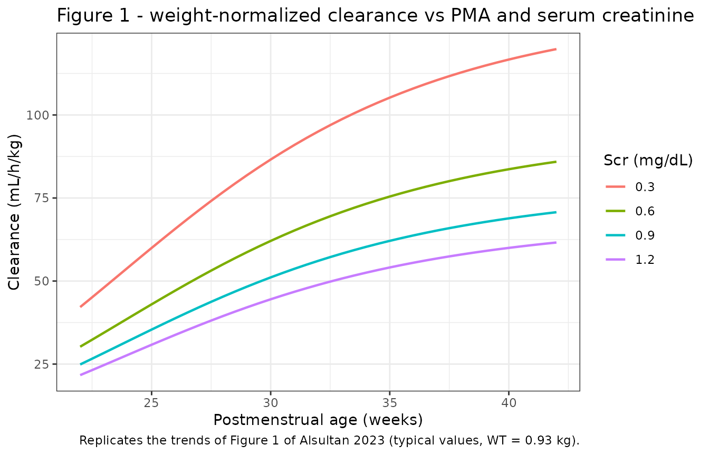
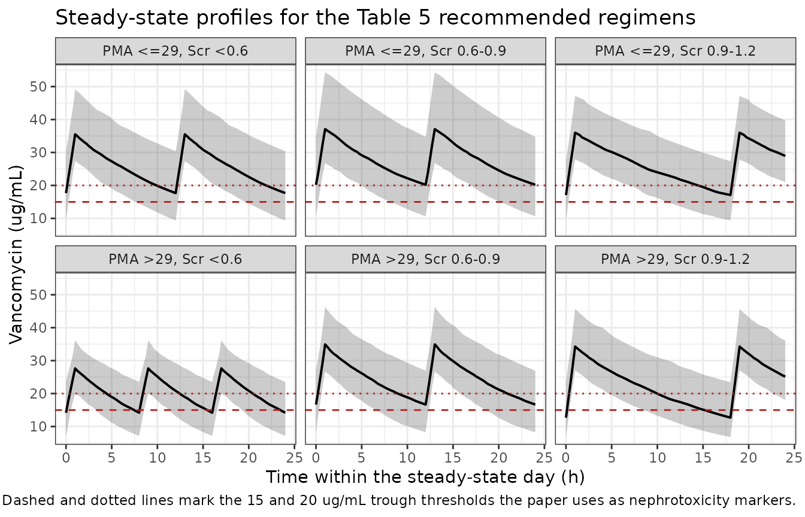

# Vancomycin (Alsultan 2023)

## Model and source

- Citation: Alsultan A, Al Munjem MF, Atiq KM, Aljehani ZK, Al Muqati H,
  Almohaizeie A, Ballal DA, Refaei TM, Al Jeraisy M, Assiri A,
  Abouelkheir M. Population pharmacokinetics of vancomycin in very low
  birth weight neonates. Front Pediatr. 2023;11:1093171.
  <doi:10.3389/fped.2023.1093171>
- Description: One-compartment population PK model for intravenous
  vancomycin in very low birth weight neonates, with allometric body
  weight on CL and V (exponents fixed at 0.75 and 1), sigmoidal Hill
  maturation on CL by postmenstrual age, and a power effect of serum
  creatinine on CL (Alsultan 2023).
- Article: <https://doi.org/10.3389/fped.2023.1093171>
- Open-access full text (PubMed Central):
  <https://www.ncbi.nlm.nih.gov/pmc/articles/PMC10101232/>

No supplementary material accompanies this article; every value used
here comes from the main text, its two displayed equations, and Tables
2-4.

Alsultan 2023 addresses a narrow but awkward clinical gap. Vancomycin
dosing in neonates is guided by references (NeoFax, Lexicomp) built on
the *general* neonatal population, and very low birth weight (VLBW,
birth weight below 1.5 kg) neonates hit the therapeutic target far less
often under that guidance than their term peers. The two prior
VLBW-specific population PK analyses had 10 and 19 patients
respectively. This study pools 236 VLBW neonates from six Saudi centers,
fits a one-compartment model on the 162-patient training split,
validates it on the held-out 74, and then uses it to build a dosing
table stratified by postmenstrual age and serum creatinine – the two
covariates that, together with body weight, carry the clearance signal.

## Population

The model was fit to 214 vancomycin serum concentrations from 162 VLBW
neonates (the 70% training split of a 236-patient retrospective
multicenter cohort; Alsultan 2023 Table 2 and Results). Postnatal age
averaged 10.7 days (SD 7.5, range 1-30), postmenstrual age 29.8 weeks
(SD 3.15, range 22-39) and gestational age at birth 28.0 weeks (SD 2.9,
range 22-35). Current body weight averaged 1.0 kg (SD 0.29, range
0.46-1.7) against a birth weight of 0.95 kg (SD 0.27, range 0.46-1.5);
59% of the training set were *extremely* low birth weight (below 1.0
kg). Serum creatinine averaged 0.65 mg/dL (SD 0.22, range 0.2-1.5) and
the total daily dose 22 mg/kg (SD 8, range 7.5-55). Congenital heart
disease was present in 26%. Sex was recorded as male in 45% and female
in 32%, with 22% missing. Race and ethnicity are not reported; the
cohort is single-country (Saudi Arabia).

Sampling was sparse and trough-dominated: patients were included on the
strength of *at least one* steady-state trough, drawn 30 min before the
next dose, and only one of the six centers also collected peaks (1 h
after the end of infusion). The authors list “the pharmacokinetic model
was built using only 1-2 samples per patient” among their limitations,
and it matters for interpretation here – clearance is well determined by
troughs, volume of distribution is not.

The same information is available programmatically via the model’s
`population` metadata
(`readModelDb("Alsultan_2023_vancomycin")()$population`).

## Source trace

The per-parameter origin is recorded as an in-file comment next to each
`ini()` entry in
`inst/modeldb/specificDrugs/Alsultan_2023_vancomycin.R`. The table below
collects them in one place for review.

| Equation / parameter | Value | Source location |
|----|----|----|
| `lcl` (fully mature CL at 0.93 kg, Scr 0.6 mg/dL) | `log(0.09)` L/h | Table 3 row “Cl (L/hr)” = 0.09, RSE 11%; leading coefficient of the Results Cl equation |
| `lvc` (V at 0.93 kg) | `log(0.81)` L | Table 3 row “V (L)” = 0.81, RSE 6.6%; leading coefficient of the Results V equation |
| `e_wt_cl` | `fixed(0.75)` | Methods “Covariates” and Results: “the exponents for the effect of weight on V and Cl were fixed at 1 and 0.75” |
| `e_wt_vc` | `fixed(1)` | Methods “Covariates” and Results (same sentence) |
| `pma_tm50` | 26.3 weeks | Table 3 row “TMA 50 (weeks)” = 26.3, RSE 7% |
| `pma_hill` | 4.42 | Table 3 row “Hill coefficient for clearance” = 4.42, RSE 19% |
| `e_creat_cl` | 0.48 | Table 3 row “Exponent of Scr on Cl” = 0.48, RSE 19%; the Results Cl equation prints it on the reciprocal ratio `(0.6 / Scr)` |
| `etalcl` | 0.075474 | Table 3 row “IIV Cl” = 28%, RSE 11%; `log(1 + 0.28^2)` |
| `etalvc` | 0.056011 | Table 3 row “IIV V” = 24%, RSE 26%; `log(1 + 0.24^2)` |
| `propSd` | 0.3 | Table 3 row “Residual variability b” = 0.3, RSE 9.9%; footnote b defines b as the proportional error |
| Maturation form `PMA^hill / (PMA^hill + TMA50^hill)` | n/a | Methods “Covariates”, sigmoidal function equation |
| Covariate power form `(X / Xref)^b` | n/a | Methods “Covariates”, power function equation |
| `V = 0.81 * (Weight/0.93)` | n/a | Results, first displayed equation |
| `Cl = 0.09 * (Weight/0.93)^0.75 * (0.6/Scr)^0.48 * PMA^4.42/(PMA^4.42 + 26.3^4.42)` | n/a | Results, second displayed equation |
| One compartment, linear elimination, proportional error | n/a | Results “Population pharmacokinetics”, first sentence |
| Reference weight 0.93 kg (cohort median) | n/a | Results: “Bodyweight was scaled to the median bodyweight of 0.93 kg” |
| Reference creatinine 0.6 mg/dL | n/a | Numerator of the `(0.6 / serum creatinine)` term in the Results Cl equation |
| Jaffe/enzymatic creatinine conversion | n/a | Methods “Analytical assay”: `Jaffe = 0.122 + enzymatic / 1.05` |

### A conflict between the Results text and the Results equation

The Results paragraph states that “the typical Cl value for a VLBW
neonate weighing 0.93 kg, PMA equal to 26 weeks, and Scr of 0.6 mg/dl
was 0.09 L/h”. The displayed equation immediately below it says
something different: the maturation term is the bare Hill fraction,
**not** normalized to a reference postmenstrual age, so at PMA 26 weeks
it contributes `26^4.42 / (26^4.42 + 26.3^4.42) = 0.4873` and the
equation gives `0.09 * 0.4873 = 0.0439 L/h`, not 0.09 L/h. The two
readings differ by a factor of 2.05 in every prediction the model makes.

The equation is the correct reading, and the paper’s own Monte Carlo
output settles it. Table 4 reports mean AUC0-24 for 16 dosing regimens
across six covariate strata; those means are a zero-parameter check,
because at steady state a linear one-compartment model gives
`AUC0-24 = daily dose / CL` regardless of interval or infusion duration.
Reproducing them below with the equation reading lands about 20% high,
with the residual traced to the unpublished covariate distribution; the
text reading would be low by 42% on every single row – the wrong side,
and twice the size. The `lcl` value of 0.09 L/h in the model file is
therefore the **fully mature** clearance (the PMA-to-infinity asymptote
at 0.93 kg and Scr 0.6 mg/dL), and the model file’s `ini()` comment says
so.

``` r

mod <- readModelDb("Alsultan_2023_vancomycin")

# `set.seed()` seeds R's RNG, used below for the covariate draws only. It does
# NOT seed rxode2's simulation RNG (that is `rxSetSeed()`), and rxode2's streams
# are partitioned PER SOLVER THREAD -- so the etas drawn below are reproducible
# on this machine and different on a machine with a different thread count.
# Every assertion downstream is written to hold for any cohort the model can
# produce; see pattern 12 of the skill's known-vignette-failure-patterns.
set.seed(20230330)
rxode2::rxSetSeed(20230330)

# Table 4's 16 simulated regimens. `stratum` reproduces the paper's six
# postmenstrual-age x serum-creatinine cells; `pub_*` are the published
# summaries transcribed verbatim from Table 4.
regimens <- tibble::tribble(
  ~pma_grp, ~scr_grp,    ~mgkg, ~ii, ~pub_auc, ~pub_trough, ~pub_p400_600, ~pub_p400_800, ~pub_p_tr15,
  "<=29",   "<0.6",       15.0,  12,      440,        10.50,            53,            61,          11,
  "<=29",   "<0.6",       17.5,  12,      513,        12.20,            62,            80,          23,
  "<=29",   "<0.6",       20.0,  12,      586,        14.00,            50,            84,          38,
  "<=29",   "0.6-0.9",    17.5,  18,      451,        10.20,            55,            65,          10,
  "<=29",   "0.6-0.9",    20.0,  18,      515,        11.60,            58,            78,          20,
  "<=29",   "0.6-0.9",    15.0,  12,      523,        13.30,            63,            84,          28,
  "<=29",   "0.9-1.2",    15.0,  18,      450,        10.80,            56,            70,          27,
  "<=29",   "0.9-1.2",    17.5,  18,      525,        12.50,            60,            83,          27,
  "<=29",   "0.9-1.2",    20.0,  24,      480,        10.30,            56,            70,          13,
  ">29",    "<0.6",       12.5,   8,      452,        12.50,            56,            66,          26,
  ">29",    "<0.6",       20.0,  12,      494,        11.00,            56,            74,          17,
  ">29",    "0.6-0.9",    15.0,  12,      453,        11.00,            57,            69,          12,
  ">29",    "0.6-0.9",    17.5,  12,      528,        12.80,            60,            82,          28,
  ">29",    "0.9-1.2",    17.5,  12,      440,         9.80,            51,            63,           3,
  ">29",    "0.9-1.2",    20.0,  18,      503,        11.20,            76,            76,          18,
  ">29",    "0.9-1.2",    15.0,  12,      513,        12.90,            58,            83,          27
) |>
  mutate(
    stratum = paste0("PMA ", pma_grp, ", Scr ", scr_grp),
    regimen = paste0(stratum, " | ", mgkg, " mg/kg q", ii, "h"),
    arm     = row_number()
  )

# Row 14 of Table 4 is internally inconsistent and is carried as a documented
# deviation, not as a gate. Within the "PMA >29, Scr 0.9-1.2" cell the paper
# prints AUC0-24 = 440 for 17.5 mg/kg q12h (35 mg/kg/day) but 513 for
# 15 mg/kg q12h (30 mg/kg/day) -- a LOWER daily dose producing a HIGHER
# exposure, which a linear model cannot do. Dose-normalized, the three rows in
# that cell read 12.6, 18.9 and 17.1 (ug.h/mL per mg/kg/day), a 49.7% spread,
# while no other cell in Table 4 spreads more than 10.9%. See Errata.
regimens$deviation <- regimens$arm == 14L

# Stratified (Latin-hypercube) draw from a truncated normal: the n values are
# the exact (i - 0.5)/n quantiles of the truncated distribution, then randomly
# permuted so that the three covariates are paired independently. This
# reproduces the intended marginal distribution essentially without Monte Carlo
# error -- the covariate side of every comparison below is then effectively
# deterministic, leaving only the eta draw as a source of run-to-run noise. It
# is a variance reduction, not a change of distribution: the mean and quantiles
# are those of the truncated normal it replaces.
rtnorm <- function(n, mean, sd, lower, upper) {
  p  <- (seq_len(n) - 0.5) / n
  lo <- stats::pnorm(lower, mean, sd)
  hi <- stats::pnorm(upper, mean, sd)
  sample(stats::qnorm(lo + p * (hi - lo), mean, sd))
}

# Covariate windows. The PMA and Scr cut-points are the paper's own strata
# (Results "Simulation"); the outer bounds are the ranges the paper reports for
# its simulation dataset ("Scr from 0.2-1.2 mg/dl, PMA from 22 to 42 weeks and
# for bodyweight was from 0.46 to 2.2 kg").
pma_window <- list("<=29" = c(22, 29), ">29" = c(29, 42))
scr_window <- list("<0.6" = c(0.2, 0.6), "0.6-0.9" = c(0.6, 0.9), "0.9-1.2" = c(0.9, 1.2))

# Marginals POOLED over both splits, because the paper simulated all 236
# patients ("we replicated our dataset 40 times (40 x 236 = 9,440)"), not the
# 162-patient training split alone. Table 2 reports the two splits separately,
# so the pooled mean is the n-weighted mean and the pooled SD adds the
# between-split term:  var = [sum (n_i - 1) s_i^2 + sum n_i (m_i - m)^2] / (N - 1).
#   WT   (162 @ 1.0 +/- 0.29 ; 74 @ 1.1 +/- 0.30 ) -> 1.031 +/- 0.296 kg
#   PMA  (162 @ 29.8 +/- 3.15; 74 @ 30.7 +/- 3.40) -> 30.08 +/- 3.250 weeks
#   Scr  (162 @ 0.65 +/- 0.22; 74 @ 0.62 +/- 0.23) -> 0.641 +/- 0.223 mg/dL
pooled <- list(WT = c(1.031, 0.296), PAGE = c(30.082, 3.250), CREAT = c(0.641, 0.223))

n_per_arm <- 150L
stopifnot(n_per_arm <= 200L)

# One cohort per STRATUM, reused by every regimen in that stratum. This mirrors
# what the paper did -- it ran each candidate regimen over the same replicated
# dataset -- and it makes the within-stratum dose-proportionality check below a
# comparison between regimens rather than between two independent covariate
# draws. IDs are still offset per arm so rxSolve never merges subjects.
strata <- unique(regimens$stratum)
stratum_cohort <- lapply(strata, function(s) {
  r <- regimens[match(s, regimens$stratum), ]
  pw <- pma_window[[r$pma_grp]]
  sw <- scr_window[[r$scr_grp]]
  tibble::tibble(
    WT    = rtnorm(n_per_arm, pooled$WT[1],    pooled$WT[2],    0.46, 2.2),
    PAGE  = rtnorm(n_per_arm, pooled$PAGE[1],  pooled$PAGE[2],  pw[1], pw[2]),
    CREAT = rtnorm(n_per_arm, pooled$CREAT[1], pooled$CREAT[2], sw[1], sw[2])
  )
})
names(stratum_cohort) <- strata

cohort <- bind_rows(lapply(seq_len(nrow(regimens)), function(i) {
  r <- regimens[i, ]
  stratum_cohort[[r$stratum]] |>
    mutate(id      = (i - 1L) * n_per_arm + seq_len(n_per_arm),
           arm     = r$arm,
           regimen = r$regimen,
           stratum = r$stratum) |>
    relocate(id, arm, regimen, stratum)
}))
stopifnot(!anyDuplicated(cohort$id), nrow(cohort) == n_per_arm * nrow(regimens))
```

The realised cohort marginals, against the pooled Table 2 values the
draws were calibrated to:

``` r

cohort |>
  summarise(
    `WT mean (kg)`    = mean(WT),
    `WT range (kg)`   = paste0(round(min(WT), 2), "-", round(max(WT), 2)),
    `PMA mean (wk)`   = mean(PAGE),
    `PMA range (wk)`  = paste0(round(min(PAGE), 1), "-", round(max(PAGE), 1)),
    `Scr mean (mg/dL)`  = mean(CREAT),
    `Scr range (mg/dL)` = paste0(round(min(CREAT), 2), "-", round(max(CREAT), 2))
  ) |>
  knitr::kable(digits = 2, caption = "Virtual cohort marginals pooled over all 16 arms (pooled Alsultan 2023 Table 2 targets over all 236 patients: WT 1.031 kg, PMA 30.08 weeks, Scr 0.641 mg/dL).")
```

| WT mean (kg) | WT range (kg) | PMA mean (wk) | PMA range (wk) | Scr mean (mg/dL) | Scr range (mg/dL) |
|---:|:---|---:|:---|---:|:---|
| 1.05 | 0.47-1.84 | 29.12 | 22.2-39.3 | 0.75 | 0.21-1.2 |

Virtual cohort marginals pooled over all 16 arms (pooled Alsultan 2023
Table 2 targets over all 236 patients: WT 1.031 kg, PMA 30.08 weeks, Scr
0.641 mg/dL). {.table}

## Simulation

Each arm is solved in its own `rxSolve()` call (`rxSolve()` on an `rxUi`
scales super-linearly in the number of subjects per call, so one call
per arm is much cheaper than one call for all 1,920 subjects).

Steady state is imposed directly with `ss = 1` on the time-zero dose
rather than by simulating a run-in. That matters here: the slowest
subjects the model can produce (small, immature, high creatinine, with a
favourable pair of etas) have half-lives beyond 60 h, so an honest
run-in would need roughly three weeks of dosing per subject. The
`ss = 1` result is checked against an explicit 21-day run-in further
down.

Vancomycin is given as a short intravenous infusion; 1 h is assumed (the
paper does not state the duration – see Errata). AUC0-24 is unaffected
by the choice because the model is linear.

``` r

obs_grid <- sort(unique(c(seq(0, 24, by = 0.25), regimens$ii)))
obs_grid <- obs_grid[obs_grid <= 24]
# Every dosing interval lands exactly on the grid, so PKNCA's `ctrough` (the
# concentration at the end of the interval) is read, not interpolated.
stopifnot(all(regimens$ii %in% obs_grid))

infusion_h <- 1   # assumed; see Errata

build_events <- function(arm_row, arm_cohort) {
  tau <- arm_row$ii
  dose_times <- seq(0, 24 - 1e-9, by = tau)   # doses covering the 0-24 h window
  dose <- tidyr::expand_grid(arm_cohort, time = dose_times) |>
    mutate(
      amt  = arm_row$mgkg * WT,
      evid = 1L,
      cmt  = "central",
      dur  = infusion_h,
      # Only the time-zero record establishes steady state; the later records
      # are ordinary continuation doses within the observed 24 h window.
      ss   = ifelse(time == 0, 1L, 0L),
      ii   = ifelse(time == 0, tau, 0)
    )
  obs <- tidyr::expand_grid(arm_cohort, time = obs_grid) |>
    mutate(amt = NA_real_, evid = 0L, cmt = "central",
           dur = NA_real_, ss = 0L, ii = 0)
  bind_rows(dose, obs) |> arrange(id, time, desc(evid))
}

solve_arm <- function(i) {
  arm_row    <- regimens[i, ]
  arm_cohort <- cohort[cohort$arm == arm_row$arm, ]
  out <- rxode2::rxSolve(
    mod, events = build_events(arm_row, arm_cohort),
    keep = c("regimen", "stratum", "arm", "WT", "PAGE", "CREAT"),
    returnType = "data.frame"
  )
  out$ii_h <- arm_row$ii
  out$mgkg <- arm_row$mgkg
  out
}

sim <- bind_rows(lapply(seq_len(nrow(regimens)), solve_arm))
#> ℹ parameter labels from comments will be replaced by 'label()'
# rxSolve drops `id` for single-subject event tables; every arm here has 120.
stopifnot("id" %in% names(sim), all(sim$Cc >= 0), !anyNA(sim$Cc),
          dplyr::n_distinct(sim$id) == nrow(cohort))
```

The event tables also carry the per-subject dose amounts needed by
PKNCA:

``` r

dose_df <- lapply(seq_len(nrow(regimens)), function(i) {
  arm_row <- regimens[i, ]
  build_events(arm_row, cohort[cohort$arm == arm_row$arm, ]) |>
    filter(evid == 1L) |>
    select(id, time, amt, regimen)
}) |>
  bind_rows()
```

### Steady state was actually reached

`ss = 1` is a solver instruction, so it deserves an independent check
rather than trust. The block below re-solves the same subjects the slow
way – 21 days of explicit dosing, no `ss` flag – and compares the final
24 h AUC against the `ss = 1` answer. Random effects are zeroed so both
solves see exactly the same system, and the covariate grid is
deliberately stacked with the slowest corner the model’s domain allows
(smallest weight, least mature, highest creatinine), whose typical
half-life is about 23 h.

``` r

mod_typ <- rxode2::zeroRe(mod)
#> ℹ parameter labels from comments will be replaced by 'label()'

ss_grid <- tidyr::expand_grid(
  WT    = c(0.46, 0.93, 2.2),
  PAGE  = c(22, 29, 42),
  CREAT = c(0.2, 0.6, 1.2)
) |>
  mutate(id = row_number(), arm = 1L, regimen = "chk", stratum = "chk")

tau_chk   <- 18
runin_end <- 21 * 24

ev_ss <- build_events(tibble::tibble(mgkg = 15, ii = tau_chk), ss_grid)
sim_ss <- rxode2::rxSolve(mod_typ, events = ev_ss, returnType = "data.frame")
#> ℹ omega/sigma items treated as zero: 'etalcl', 'etalvc'
#> Warning: multi-subject simulation without without 'omega'

ev_long <- bind_rows(
  # Doses must continue THROUGH the observation window, not stop at its start --
  # otherwise the last 24 h are an unintended washout and the comparison silently
  # measures the wrong thing.
  tidyr::expand_grid(ss_grid, time = seq(0, runin_end + 24 - 1e-9, by = tau_chk)) |>
    mutate(amt = 15 * WT, evid = 1L, cmt = "central",
           dur = infusion_h, ss = 0L, ii = 0),
  tidyr::expand_grid(ss_grid, time = runin_end + obs_grid) |>
    mutate(amt = NA_real_, evid = 0L, cmt = "central",
           dur = NA_real_, ss = 0L, ii = 0)
) |>
  arrange(id, time, desc(evid))
sim_long <- rxode2::rxSolve(mod_typ, events = ev_long, returnType = "data.frame")
#> ℹ omega/sigma items treated as zero: 'etalcl', 'etalvc'
#> Warning: multi-subject simulation without without 'omega'

trap_auc <- function(time, conc) {
  sum(diff(time) * (utils::head(conc, -1) + utils::tail(conc, -1)) / 2)
}

# Compare over one full dosing interval, which is the quantity the steady-state
# claim is actually about.
auc_ss <- sim_ss |>
  filter(time <= tau_chk) |>
  group_by(id) |>
  summarise(auc = trap_auc(time, Cc), .groups = "drop")
auc_long <- sim_long |>
  filter(time >= runin_end, time <= runin_end + tau_chk) |>
  group_by(id) |>
  summarise(auc = trap_auc(time - runin_end, Cc), .groups = "drop")

ss_pct <- 100 * (auc_ss$auc / auc_long$auc[match(auc_ss$id, auc_long$id)] - 1)
cat(sprintf("ss = 1 vs 21-day run-in, AUC over one interval: max |%% diff| = %.4f%% over %d covariate corners\n",
            max(abs(ss_pct)), length(ss_pct)))
#> ss = 1 vs 21-day run-in, AUC over one interval: max |% diff| = 0.0029% over 27 covariate corners

# Deterministic comparison of two solves of the SAME system (no random effects),
# so a tight bound is correct here (pattern 11): the only difference is the
# residual approach to the asymptote, which after 21 days is far below 0.1% even
# at the slowest corner of the covariate domain.
stopifnot(max(abs(ss_pct)) < 0.5)
```

## Replicate published figures

### Figure 1 – clearance per kilogram against postmenstrual age and creatinine

Figure 1 of Alsultan 2023 plots weight-normalized clearance against PMA
(top) and against serum creatinine (bottom) for the observed post-hoc
individual estimates. The observed points are not available, so the
panels below show the model’s typical-value surface over the same
covariate ranges – the trend the figure is drawn to display.

``` r

# Replicates the trends of Figure 1 of Alsultan 2023 (typical values, no IIV).
typ_grid <- tidyr::expand_grid(
  WT    = c(0.46, 0.93, 2.2),
  PAGE  = seq(22, 42, by = 0.5),
  CREAT = c(0.3, 0.6, 0.9, 1.2)
) |>
  mutate(id = row_number())

ev_typ <- typ_grid |>
  mutate(time = 0, amt = 10, evid = 1L, cmt = "central",
         dur = infusion_h, ss = 0L, ii = 0)
sim_typ <- rxode2::rxSolve(mod_typ, events = ev_typ,
                           keep = c("WT", "PAGE", "CREAT"),
                           returnType = "data.frame") |>
  distinct(id, .keep_all = TRUE)
#> ℹ omega/sigma items treated as zero: 'etalcl', 'etalvc'
#> Warning: multi-subject simulation without without 'omega'
#> Warning: column 'WT' has only 'NA' values for id '1'
#> Warning: column 'PAGE' has only 'NA' values for id '1'
#> Warning: column 'CREAT' has only 'NA' values for id '1'
#> Warning: column 'WT' has only 'NA' values for id '2'
#> Warning: column 'PAGE' has only 'NA' values for id '2'
#> Warning: column 'CREAT' has only 'NA' values for id '2'
#> Warning: column 'WT' has only 'NA' values for id '3'
#> Warning: column 'PAGE' has only 'NA' values for id '3'
#> Warning: column 'CREAT' has only 'NA' values for id '3'
#> Warning: column 'WT' has only 'NA' values for id '4'
#> Warning: column 'PAGE' has only 'NA' values for id '4'
#> Warning: column 'CREAT' has only 'NA' values for id '4'
#> Warning: column 'WT' has only 'NA' values for id '5'
#> Warning: column 'PAGE' has only 'NA' values for id '5'
#> Warning: column 'CREAT' has only 'NA' values for id '5'
#> Warning: column 'WT' has only 'NA' values for id '6'
#> Warning: column 'PAGE' has only 'NA' values for id '6'
#> Warning: column 'CREAT' has only 'NA' values for id '6'
#> Warning: column 'WT' has only 'NA' values for id '7'
#> Warning: column 'PAGE' has only 'NA' values for id '7'
#> Warning: column 'CREAT' has only 'NA' values for id '7'
#> Warning: column 'WT' has only 'NA' values for id '8'
#> Warning: column 'PAGE' has only 'NA' values for id '8'
#> Warning: column 'CREAT' has only 'NA' values for id '8'
#> Warning: column 'WT' has only 'NA' values for id '9'
#> Warning: column 'PAGE' has only 'NA' values for id '9'
#> Warning: column 'CREAT' has only 'NA' values for id '9'
#> Warning: column 'WT' has only 'NA' values for id '10'
#> Warning: column 'PAGE' has only 'NA' values for id '10'
#> Warning: column 'CREAT' has only 'NA' values for id '10'
#> Warning: column 'WT' has only 'NA' values for id '11'
#> Warning: column 'PAGE' has only 'NA' values for id '11'
#> Warning: column 'CREAT' has only 'NA' values for id '11'
#> Warning: column 'WT' has only 'NA' values for id '12'
#> Warning: column 'PAGE' has only 'NA' values for id '12'
#> Warning: column 'CREAT' has only 'NA' values for id '12'
#> Warning: column 'WT' has only 'NA' values for id '13'
#> Warning: column 'PAGE' has only 'NA' values for id '13'
#> Warning: column 'CREAT' has only 'NA' values for id '13'
#> Warning: column 'WT' has only 'NA' values for id '14'
#> Warning: column 'PAGE' has only 'NA' values for id '14'
#> Warning: column 'CREAT' has only 'NA' values for id '14'
#> Warning: column 'WT' has only 'NA' values for id '15'
#> Warning: column 'PAGE' has only 'NA' values for id '15'
#> Warning: column 'CREAT' has only 'NA' values for id '15'
#> Warning: column 'WT' has only 'NA' values for id '16'
#> Warning: column 'PAGE' has only 'NA' values for id '16'
#> Warning: column 'CREAT' has only 'NA' values for id '16'
#> Warning: column 'WT' has only 'NA' values for id '17'
#> Warning: column 'PAGE' has only 'NA' values for id '17'
#> Warning: column 'CREAT' has only 'NA' values for id '17'
#> Warning: column 'WT' has only 'NA' values for id '18'
#> Warning: column 'PAGE' has only 'NA' values for id '18'
#> Warning: column 'CREAT' has only 'NA' values for id '18'
#> Warning: column 'WT' has only 'NA' values for id '19'
#> Warning: column 'PAGE' has only 'NA' values for id '19'
#> Warning: column 'CREAT' has only 'NA' values for id '19'
#> Warning: column 'WT' has only 'NA' values for id '20'
#> Warning: column 'PAGE' has only 'NA' values for id '20'
#> Warning: column 'CREAT' has only 'NA' values for id '20'
#> Warning: column 'WT' has only 'NA' values for id '21'
#> Warning: column 'PAGE' has only 'NA' values for id '21'
#> Warning: column 'CREAT' has only 'NA' values for id '21'
#> Warning: column 'WT' has only 'NA' values for id '22'
#> Warning: column 'PAGE' has only 'NA' values for id '22'
#> Warning: column 'CREAT' has only 'NA' values for id '22'
#> Warning: column 'WT' has only 'NA' values for id '23'
#> Warning: column 'PAGE' has only 'NA' values for id '23'
#> Warning: column 'CREAT' has only 'NA' values for id '23'
#> Warning: column 'WT' has only 'NA' values for id '24'
#> Warning: column 'PAGE' has only 'NA' values for id '24'
#> Warning: column 'CREAT' has only 'NA' values for id '24'
#> Warning: column 'WT' has only 'NA' values for id '25'
#> Warning: column 'PAGE' has only 'NA' values for id '25'
#> Warning: column 'CREAT' has only 'NA' values for id '25'
#> Warning: column 'WT' has only 'NA' values for id '26'
#> Warning: column 'PAGE' has only 'NA' values for id '26'
#> Warning: column 'CREAT' has only 'NA' values for id '26'
#> Warning: column 'WT' has only 'NA' values for id '27'
#> Warning: column 'PAGE' has only 'NA' values for id '27'
#> Warning: column 'CREAT' has only 'NA' values for id '27'
#> Warning: column 'WT' has only 'NA' values for id '28'
#> Warning: column 'PAGE' has only 'NA' values for id '28'
#> Warning: column 'CREAT' has only 'NA' values for id '28'
#> Warning: column 'WT' has only 'NA' values for id '29'
#> Warning: column 'PAGE' has only 'NA' values for id '29'
#> Warning: column 'CREAT' has only 'NA' values for id '29'
#> Warning: column 'WT' has only 'NA' values for id '30'
#> Warning: column 'PAGE' has only 'NA' values for id '30'
#> Warning: column 'CREAT' has only 'NA' values for id '30'
#> Warning: column 'WT' has only 'NA' values for id '31'
#> Warning: column 'PAGE' has only 'NA' values for id '31'
#> Warning: column 'CREAT' has only 'NA' values for id '31'
#> Warning: column 'WT' has only 'NA' values for id '32'
#> Warning: column 'PAGE' has only 'NA' values for id '32'
#> Warning: column 'CREAT' has only 'NA' values for id '32'
#> Warning: column 'WT' has only 'NA' values for id '33'
#> Warning: column 'PAGE' has only 'NA' values for id '33'
#> Warning: column 'CREAT' has only 'NA' values for id '33'
#> Warning: column 'WT' has only 'NA' values for id '34'
#> Warning: column 'PAGE' has only 'NA' values for id '34'
#> Warning: column 'CREAT' has only 'NA' values for id '34'
#> Warning: column 'WT' has only 'NA' values for id '35'
#> Warning: column 'PAGE' has only 'NA' values for id '35'
#> Warning: column 'CREAT' has only 'NA' values for id '35'
#> Warning: column 'WT' has only 'NA' values for id '36'
#> Warning: column 'PAGE' has only 'NA' values for id '36'
#> Warning: column 'CREAT' has only 'NA' values for id '36'
#> Warning: column 'WT' has only 'NA' values for id '37'
#> Warning: column 'PAGE' has only 'NA' values for id '37'
#> Warning: column 'CREAT' has only 'NA' values for id '37'
#> Warning: column 'WT' has only 'NA' values for id '38'
#> Warning: column 'PAGE' has only 'NA' values for id '38'
#> Warning: column 'CREAT' has only 'NA' values for id '38'
#> Warning: column 'WT' has only 'NA' values for id '39'
#> Warning: column 'PAGE' has only 'NA' values for id '39'
#> Warning: column 'CREAT' has only 'NA' values for id '39'
#> Warning: column 'WT' has only 'NA' values for id '40'
#> Warning: column 'PAGE' has only 'NA' values for id '40'
#> Warning: column 'CREAT' has only 'NA' values for id '40'
#> Warning: column 'WT' has only 'NA' values for id '41'
#> Warning: column 'PAGE' has only 'NA' values for id '41'
#> Warning: column 'CREAT' has only 'NA' values for id '41'
#> Warning: column 'WT' has only 'NA' values for id '42'
#> Warning: column 'PAGE' has only 'NA' values for id '42'
#> Warning: column 'CREAT' has only 'NA' values for id '42'
#> Warning: column 'WT' has only 'NA' values for id '43'
#> Warning: column 'PAGE' has only 'NA' values for id '43'
#> Warning: column 'CREAT' has only 'NA' values for id '43'
#> Warning: column 'WT' has only 'NA' values for id '44'
#> Warning: column 'PAGE' has only 'NA' values for id '44'
#> Warning: column 'CREAT' has only 'NA' values for id '44'
#> Warning: column 'WT' has only 'NA' values for id '45'
#> Warning: column 'PAGE' has only 'NA' values for id '45'
#> Warning: column 'CREAT' has only 'NA' values for id '45'
#> Warning: column 'WT' has only 'NA' values for id '46'
#> Warning: column 'PAGE' has only 'NA' values for id '46'
#> Warning: column 'CREAT' has only 'NA' values for id '46'
#> Warning: column 'WT' has only 'NA' values for id '47'
#> Warning: column 'PAGE' has only 'NA' values for id '47'
#> Warning: column 'CREAT' has only 'NA' values for id '47'
#> Warning: column 'WT' has only 'NA' values for id '48'
#> Warning: column 'PAGE' has only 'NA' values for id '48'
#> Warning: column 'CREAT' has only 'NA' values for id '48'
#> Warning: column 'WT' has only 'NA' values for id '49'
#> Warning: column 'PAGE' has only 'NA' values for id '49'
#> Warning: column 'CREAT' has only 'NA' values for id '49'
#> Warning: column 'WT' has only 'NA' values for id '50'
#> Warning: column 'PAGE' has only 'NA' values for id '50'
#> Warning: column 'CREAT' has only 'NA' values for id '50'
#> Warning: column 'WT' has only 'NA' values for id '51'
#> Warning: column 'PAGE' has only 'NA' values for id '51'
#> Warning: column 'CREAT' has only 'NA' values for id '51'
#> Warning: column 'WT' has only 'NA' values for id '52'
#> Warning: column 'PAGE' has only 'NA' values for id '52'
#> Warning: column 'CREAT' has only 'NA' values for id '52'
#> Warning: column 'WT' has only 'NA' values for id '53'
#> Warning: column 'PAGE' has only 'NA' values for id '53'
#> Warning: column 'CREAT' has only 'NA' values for id '53'
#> Warning: column 'WT' has only 'NA' values for id '54'
#> Warning: column 'PAGE' has only 'NA' values for id '54'
#> Warning: column 'CREAT' has only 'NA' values for id '54'
#> Warning: column 'WT' has only 'NA' values for id '55'
#> Warning: column 'PAGE' has only 'NA' values for id '55'
#> Warning: column 'CREAT' has only 'NA' values for id '55'
#> Warning: column 'WT' has only 'NA' values for id '56'
#> Warning: column 'PAGE' has only 'NA' values for id '56'
#> Warning: column 'CREAT' has only 'NA' values for id '56'
#> Warning: column 'WT' has only 'NA' values for id '57'
#> Warning: column 'PAGE' has only 'NA' values for id '57'
#> Warning: column 'CREAT' has only 'NA' values for id '57'
#> Warning: column 'WT' has only 'NA' values for id '58'
#> Warning: column 'PAGE' has only 'NA' values for id '58'
#> Warning: column 'CREAT' has only 'NA' values for id '58'
#> Warning: column 'WT' has only 'NA' values for id '59'
#> Warning: column 'PAGE' has only 'NA' values for id '59'
#> Warning: column 'CREAT' has only 'NA' values for id '59'
#> Warning: column 'WT' has only 'NA' values for id '60'
#> Warning: column 'PAGE' has only 'NA' values for id '60'
#> Warning: column 'CREAT' has only 'NA' values for id '60'
#> Warning: column 'WT' has only 'NA' values for id '61'
#> Warning: column 'PAGE' has only 'NA' values for id '61'
#> Warning: column 'CREAT' has only 'NA' values for id '61'
#> Warning: column 'WT' has only 'NA' values for id '62'
#> Warning: column 'PAGE' has only 'NA' values for id '62'
#> Warning: column 'CREAT' has only 'NA' values for id '62'
#> Warning: column 'WT' has only 'NA' values for id '63'
#> Warning: column 'PAGE' has only 'NA' values for id '63'
#> Warning: column 'CREAT' has only 'NA' values for id '63'
#> Warning: column 'WT' has only 'NA' values for id '64'
#> Warning: column 'PAGE' has only 'NA' values for id '64'
#> Warning: column 'CREAT' has only 'NA' values for id '64'
#> Warning: column 'WT' has only 'NA' values for id '65'
#> Warning: column 'PAGE' has only 'NA' values for id '65'
#> Warning: column 'CREAT' has only 'NA' values for id '65'
#> Warning: column 'WT' has only 'NA' values for id '66'
#> Warning: column 'PAGE' has only 'NA' values for id '66'
#> Warning: column 'CREAT' has only 'NA' values for id '66'
#> Warning: column 'WT' has only 'NA' values for id '67'
#> Warning: column 'PAGE' has only 'NA' values for id '67'
#> Warning: column 'CREAT' has only 'NA' values for id '67'
#> Warning: column 'WT' has only 'NA' values for id '68'
#> Warning: column 'PAGE' has only 'NA' values for id '68'
#> Warning: column 'CREAT' has only 'NA' values for id '68'
#> Warning: column 'WT' has only 'NA' values for id '69'
#> Warning: column 'PAGE' has only 'NA' values for id '69'
#> Warning: column 'CREAT' has only 'NA' values for id '69'
#> Warning: column 'WT' has only 'NA' values for id '70'
#> Warning: column 'PAGE' has only 'NA' values for id '70'
#> Warning: column 'CREAT' has only 'NA' values for id '70'
#> Warning: column 'WT' has only 'NA' values for id '71'
#> Warning: column 'PAGE' has only 'NA' values for id '71'
#> Warning: column 'CREAT' has only 'NA' values for id '71'
#> Warning: column 'WT' has only 'NA' values for id '72'
#> Warning: column 'PAGE' has only 'NA' values for id '72'
#> Warning: column 'CREAT' has only 'NA' values for id '72'
#> Warning: column 'WT' has only 'NA' values for id '73'
#> Warning: column 'PAGE' has only 'NA' values for id '73'
#> Warning: column 'CREAT' has only 'NA' values for id '73'
#> Warning: column 'WT' has only 'NA' values for id '74'
#> Warning: column 'PAGE' has only 'NA' values for id '74'
#> Warning: column 'CREAT' has only 'NA' values for id '74'
#> Warning: column 'WT' has only 'NA' values for id '75'
#> Warning: column 'PAGE' has only 'NA' values for id '75'
#> Warning: column 'CREAT' has only 'NA' values for id '75'
#> Warning: column 'WT' has only 'NA' values for id '76'
#> Warning: column 'PAGE' has only 'NA' values for id '76'
#> Warning: column 'CREAT' has only 'NA' values for id '76'
#> Warning: column 'WT' has only 'NA' values for id '77'
#> Warning: column 'PAGE' has only 'NA' values for id '77'
#> Warning: column 'CREAT' has only 'NA' values for id '77'
#> Warning: column 'WT' has only 'NA' values for id '78'
#> Warning: column 'PAGE' has only 'NA' values for id '78'
#> Warning: column 'CREAT' has only 'NA' values for id '78'
#> Warning: column 'WT' has only 'NA' values for id '79'
#> Warning: column 'PAGE' has only 'NA' values for id '79'
#> Warning: column 'CREAT' has only 'NA' values for id '79'
#> Warning: column 'WT' has only 'NA' values for id '80'
#> Warning: column 'PAGE' has only 'NA' values for id '80'
#> Warning: column 'CREAT' has only 'NA' values for id '80'
#> Warning: column 'WT' has only 'NA' values for id '81'
#> Warning: column 'PAGE' has only 'NA' values for id '81'
#> Warning: column 'CREAT' has only 'NA' values for id '81'
#> Warning: column 'WT' has only 'NA' values for id '82'
#> Warning: column 'PAGE' has only 'NA' values for id '82'
#> Warning: column 'CREAT' has only 'NA' values for id '82'
#> Warning: column 'WT' has only 'NA' values for id '83'
#> Warning: column 'PAGE' has only 'NA' values for id '83'
#> Warning: column 'CREAT' has only 'NA' values for id '83'
#> Warning: column 'WT' has only 'NA' values for id '84'
#> Warning: column 'PAGE' has only 'NA' values for id '84'
#> Warning: column 'CREAT' has only 'NA' values for id '84'
#> Warning: column 'WT' has only 'NA' values for id '85'
#> Warning: column 'PAGE' has only 'NA' values for id '85'
#> Warning: column 'CREAT' has only 'NA' values for id '85'
#> Warning: column 'WT' has only 'NA' values for id '86'
#> Warning: column 'PAGE' has only 'NA' values for id '86'
#> Warning: column 'CREAT' has only 'NA' values for id '86'
#> Warning: column 'WT' has only 'NA' values for id '87'
#> Warning: column 'PAGE' has only 'NA' values for id '87'
#> Warning: column 'CREAT' has only 'NA' values for id '87'
#> Warning: column 'WT' has only 'NA' values for id '88'
#> Warning: column 'PAGE' has only 'NA' values for id '88'
#> Warning: column 'CREAT' has only 'NA' values for id '88'
#> Warning: column 'WT' has only 'NA' values for id '89'
#> Warning: column 'PAGE' has only 'NA' values for id '89'
#> Warning: column 'CREAT' has only 'NA' values for id '89'
#> Warning: column 'WT' has only 'NA' values for id '90'
#> Warning: column 'PAGE' has only 'NA' values for id '90'
#> Warning: column 'CREAT' has only 'NA' values for id '90'
#> Warning: column 'WT' has only 'NA' values for id '91'
#> Warning: column 'PAGE' has only 'NA' values for id '91'
#> Warning: column 'CREAT' has only 'NA' values for id '91'
#> Warning: column 'WT' has only 'NA' values for id '92'
#> Warning: column 'PAGE' has only 'NA' values for id '92'
#> Warning: column 'CREAT' has only 'NA' values for id '92'
#> Warning: column 'WT' has only 'NA' values for id '93'
#> Warning: column 'PAGE' has only 'NA' values for id '93'
#> Warning: column 'CREAT' has only 'NA' values for id '93'
#> Warning: column 'WT' has only 'NA' values for id '94'
#> Warning: column 'PAGE' has only 'NA' values for id '94'
#> Warning: column 'CREAT' has only 'NA' values for id '94'
#> Warning: column 'WT' has only 'NA' values for id '95'
#> Warning: column 'PAGE' has only 'NA' values for id '95'
#> Warning: column 'CREAT' has only 'NA' values for id '95'
#> Warning: column 'WT' has only 'NA' values for id '96'
#> Warning: column 'PAGE' has only 'NA' values for id '96'
#> Warning: column 'CREAT' has only 'NA' values for id '96'
#> Warning: column 'WT' has only 'NA' values for id '97'
#> Warning: column 'PAGE' has only 'NA' values for id '97'
#> Warning: column 'CREAT' has only 'NA' values for id '97'
#> Warning: column 'WT' has only 'NA' values for id '98'
#> Warning: column 'PAGE' has only 'NA' values for id '98'
#> Warning: column 'CREAT' has only 'NA' values for id '98'
#> Warning: column 'WT' has only 'NA' values for id '99'
#> Warning: column 'PAGE' has only 'NA' values for id '99'
#> Warning: column 'CREAT' has only 'NA' values for id '99'
#> Warning: column 'WT' has only 'NA' values for id '100'
#> Warning: column 'PAGE' has only 'NA' values for id '100'
#> Warning: column 'CREAT' has only 'NA' values for id '100'
#> Warning: column 'WT' has only 'NA' values for id '101'
#> Warning: column 'PAGE' has only 'NA' values for id '101'
#> Warning: column 'CREAT' has only 'NA' values for id '101'
#> Warning: column 'WT' has only 'NA' values for id '102'
#> Warning: column 'PAGE' has only 'NA' values for id '102'
#> Warning: column 'CREAT' has only 'NA' values for id '102'
#> Warning: column 'WT' has only 'NA' values for id '103'
#> Warning: column 'PAGE' has only 'NA' values for id '103'
#> Warning: column 'CREAT' has only 'NA' values for id '103'
#> Warning: column 'WT' has only 'NA' values for id '104'
#> Warning: column 'PAGE' has only 'NA' values for id '104'
#> Warning: column 'CREAT' has only 'NA' values for id '104'
#> Warning: column 'WT' has only 'NA' values for id '105'
#> Warning: column 'PAGE' has only 'NA' values for id '105'
#> Warning: column 'CREAT' has only 'NA' values for id '105'
#> Warning: column 'WT' has only 'NA' values for id '106'
#> Warning: column 'PAGE' has only 'NA' values for id '106'
#> Warning: column 'CREAT' has only 'NA' values for id '106'
#> Warning: column 'WT' has only 'NA' values for id '107'
#> Warning: column 'PAGE' has only 'NA' values for id '107'
#> Warning: column 'CREAT' has only 'NA' values for id '107'
#> Warning: column 'WT' has only 'NA' values for id '108'
#> Warning: column 'PAGE' has only 'NA' values for id '108'
#> Warning: column 'CREAT' has only 'NA' values for id '108'
#> Warning: column 'WT' has only 'NA' values for id '109'
#> Warning: column 'PAGE' has only 'NA' values for id '109'
#> Warning: column 'CREAT' has only 'NA' values for id '109'
#> Warning: column 'WT' has only 'NA' values for id '110'
#> Warning: column 'PAGE' has only 'NA' values for id '110'
#> Warning: column 'CREAT' has only 'NA' values for id '110'
#> Warning: column 'WT' has only 'NA' values for id '111'
#> Warning: column 'PAGE' has only 'NA' values for id '111'
#> Warning: column 'CREAT' has only 'NA' values for id '111'
#> Warning: column 'WT' has only 'NA' values for id '112'
#> Warning: column 'PAGE' has only 'NA' values for id '112'
#> Warning: column 'CREAT' has only 'NA' values for id '112'
#> Warning: column 'WT' has only 'NA' values for id '113'
#> Warning: column 'PAGE' has only 'NA' values for id '113'
#> Warning: column 'CREAT' has only 'NA' values for id '113'
#> Warning: column 'WT' has only 'NA' values for id '114'
#> Warning: column 'PAGE' has only 'NA' values for id '114'
#> Warning: column 'CREAT' has only 'NA' values for id '114'
#> Warning: column 'WT' has only 'NA' values for id '115'
#> Warning: column 'PAGE' has only 'NA' values for id '115'
#> Warning: column 'CREAT' has only 'NA' values for id '115'
#> Warning: column 'WT' has only 'NA' values for id '116'
#> Warning: column 'PAGE' has only 'NA' values for id '116'
#> Warning: column 'CREAT' has only 'NA' values for id '116'
#> Warning: column 'WT' has only 'NA' values for id '117'
#> Warning: column 'PAGE' has only 'NA' values for id '117'
#> Warning: column 'CREAT' has only 'NA' values for id '117'
#> Warning: column 'WT' has only 'NA' values for id '118'
#> Warning: column 'PAGE' has only 'NA' values for id '118'
#> Warning: column 'CREAT' has only 'NA' values for id '118'
#> Warning: column 'WT' has only 'NA' values for id '119'
#> Warning: column 'PAGE' has only 'NA' values for id '119'
#> Warning: column 'CREAT' has only 'NA' values for id '119'
#> Warning: column 'WT' has only 'NA' values for id '120'
#> Warning: column 'PAGE' has only 'NA' values for id '120'
#> Warning: column 'CREAT' has only 'NA' values for id '120'
#> Warning: column 'WT' has only 'NA' values for id '121'
#> Warning: column 'PAGE' has only 'NA' values for id '121'
#> Warning: column 'CREAT' has only 'NA' values for id '121'
#> Warning: column 'WT' has only 'NA' values for id '122'
#> Warning: column 'PAGE' has only 'NA' values for id '122'
#> Warning: column 'CREAT' has only 'NA' values for id '122'
#> Warning: column 'WT' has only 'NA' values for id '123'
#> Warning: column 'PAGE' has only 'NA' values for id '123'
#> Warning: column 'CREAT' has only 'NA' values for id '123'
#> Warning: column 'WT' has only 'NA' values for id '124'
#> Warning: column 'PAGE' has only 'NA' values for id '124'
#> Warning: column 'CREAT' has only 'NA' values for id '124'
#> Warning: column 'WT' has only 'NA' values for id '125'
#> Warning: column 'PAGE' has only 'NA' values for id '125'
#> Warning: column 'CREAT' has only 'NA' values for id '125'
#> Warning: column 'WT' has only 'NA' values for id '126'
#> Warning: column 'PAGE' has only 'NA' values for id '126'
#> Warning: column 'CREAT' has only 'NA' values for id '126'
#> Warning: column 'WT' has only 'NA' values for id '127'
#> Warning: column 'PAGE' has only 'NA' values for id '127'
#> Warning: column 'CREAT' has only 'NA' values for id '127'
#> Warning: column 'WT' has only 'NA' values for id '128'
#> Warning: column 'PAGE' has only 'NA' values for id '128'
#> Warning: column 'CREAT' has only 'NA' values for id '128'
#> Warning: column 'WT' has only 'NA' values for id '129'
#> Warning: column 'PAGE' has only 'NA' values for id '129'
#> Warning: column 'CREAT' has only 'NA' values for id '129'
#> Warning: column 'WT' has only 'NA' values for id '130'
#> Warning: column 'PAGE' has only 'NA' values for id '130'
#> Warning: column 'CREAT' has only 'NA' values for id '130'
#> Warning: column 'WT' has only 'NA' values for id '131'
#> Warning: column 'PAGE' has only 'NA' values for id '131'
#> Warning: column 'CREAT' has only 'NA' values for id '131'
#> Warning: column 'WT' has only 'NA' values for id '132'
#> Warning: column 'PAGE' has only 'NA' values for id '132'
#> Warning: column 'CREAT' has only 'NA' values for id '132'
#> Warning: column 'WT' has only 'NA' values for id '133'
#> Warning: column 'PAGE' has only 'NA' values for id '133'
#> Warning: column 'CREAT' has only 'NA' values for id '133'
#> Warning: column 'WT' has only 'NA' values for id '134'
#> Warning: column 'PAGE' has only 'NA' values for id '134'
#> Warning: column 'CREAT' has only 'NA' values for id '134'
#> Warning: column 'WT' has only 'NA' values for id '135'
#> Warning: column 'PAGE' has only 'NA' values for id '135'
#> Warning: column 'CREAT' has only 'NA' values for id '135'
#> Warning: column 'WT' has only 'NA' values for id '136'
#> Warning: column 'PAGE' has only 'NA' values for id '136'
#> Warning: column 'CREAT' has only 'NA' values for id '136'
#> Warning: column 'WT' has only 'NA' values for id '137'
#> Warning: column 'PAGE' has only 'NA' values for id '137'
#> Warning: column 'CREAT' has only 'NA' values for id '137'
#> Warning: column 'WT' has only 'NA' values for id '138'
#> Warning: column 'PAGE' has only 'NA' values for id '138'
#> Warning: column 'CREAT' has only 'NA' values for id '138'
#> Warning: column 'WT' has only 'NA' values for id '139'
#> Warning: column 'PAGE' has only 'NA' values for id '139'
#> Warning: column 'CREAT' has only 'NA' values for id '139'
#> Warning: column 'WT' has only 'NA' values for id '140'
#> Warning: column 'PAGE' has only 'NA' values for id '140'
#> Warning: column 'CREAT' has only 'NA' values for id '140'
#> Warning: column 'WT' has only 'NA' values for id '141'
#> Warning: column 'PAGE' has only 'NA' values for id '141'
#> Warning: column 'CREAT' has only 'NA' values for id '141'
#> Warning: column 'WT' has only 'NA' values for id '142'
#> Warning: column 'PAGE' has only 'NA' values for id '142'
#> Warning: column 'CREAT' has only 'NA' values for id '142'
#> Warning: column 'WT' has only 'NA' values for id '143'
#> Warning: column 'PAGE' has only 'NA' values for id '143'
#> Warning: column 'CREAT' has only 'NA' values for id '143'
#> Warning: column 'WT' has only 'NA' values for id '144'
#> Warning: column 'PAGE' has only 'NA' values for id '144'
#> Warning: column 'CREAT' has only 'NA' values for id '144'
#> Warning: column 'WT' has only 'NA' values for id '145'
#> Warning: column 'PAGE' has only 'NA' values for id '145'
#> Warning: column 'CREAT' has only 'NA' values for id '145'
#> Warning: column 'WT' has only 'NA' values for id '146'
#> Warning: column 'PAGE' has only 'NA' values for id '146'
#> Warning: column 'CREAT' has only 'NA' values for id '146'
#> Warning: column 'WT' has only 'NA' values for id '147'
#> Warning: column 'PAGE' has only 'NA' values for id '147'
#> Warning: column 'CREAT' has only 'NA' values for id '147'
#> Warning: column 'WT' has only 'NA' values for id '148'
#> Warning: column 'PAGE' has only 'NA' values for id '148'
#> Warning: column 'CREAT' has only 'NA' values for id '148'
#> Warning: column 'WT' has only 'NA' values for id '149'
#> Warning: column 'PAGE' has only 'NA' values for id '149'
#> Warning: column 'CREAT' has only 'NA' values for id '149'
#> Warning: column 'WT' has only 'NA' values for id '150'
#> Warning: column 'PAGE' has only 'NA' values for id '150'
#> Warning: column 'CREAT' has only 'NA' values for id '150'
#> Warning: column 'WT' has only 'NA' values for id '151'
#> Warning: column 'PAGE' has only 'NA' values for id '151'
#> Warning: column 'CREAT' has only 'NA' values for id '151'
#> Warning: column 'WT' has only 'NA' values for id '152'
#> Warning: column 'PAGE' has only 'NA' values for id '152'
#> Warning: column 'CREAT' has only 'NA' values for id '152'
#> Warning: column 'WT' has only 'NA' values for id '153'
#> Warning: column 'PAGE' has only 'NA' values for id '153'
#> Warning: column 'CREAT' has only 'NA' values for id '153'
#> Warning: column 'WT' has only 'NA' values for id '154'
#> Warning: column 'PAGE' has only 'NA' values for id '154'
#> Warning: column 'CREAT' has only 'NA' values for id '154'
#> Warning: column 'WT' has only 'NA' values for id '155'
#> Warning: column 'PAGE' has only 'NA' values for id '155'
#> Warning: column 'CREAT' has only 'NA' values for id '155'
#> Warning: column 'WT' has only 'NA' values for id '156'
#> Warning: column 'PAGE' has only 'NA' values for id '156'
#> Warning: column 'CREAT' has only 'NA' values for id '156'
#> Warning: column 'WT' has only 'NA' values for id '157'
#> Warning: column 'PAGE' has only 'NA' values for id '157'
#> Warning: column 'CREAT' has only 'NA' values for id '157'
#> Warning: column 'WT' has only 'NA' values for id '158'
#> Warning: column 'PAGE' has only 'NA' values for id '158'
#> Warning: column 'CREAT' has only 'NA' values for id '158'
#> Warning: column 'WT' has only 'NA' values for id '159'
#> Warning: column 'PAGE' has only 'NA' values for id '159'
#> Warning: column 'CREAT' has only 'NA' values for id '159'
#> Warning: column 'WT' has only 'NA' values for id '160'
#> Warning: column 'PAGE' has only 'NA' values for id '160'
#> Warning: column 'CREAT' has only 'NA' values for id '160'
#> Warning: column 'WT' has only 'NA' values for id '161'
#> Warning: column 'PAGE' has only 'NA' values for id '161'
#> Warning: column 'CREAT' has only 'NA' values for id '161'
#> Warning: column 'WT' has only 'NA' values for id '162'
#> Warning: column 'PAGE' has only 'NA' values for id '162'
#> Warning: column 'CREAT' has only 'NA' values for id '162'
#> Warning: column 'WT' has only 'NA' values for id '163'
#> Warning: column 'PAGE' has only 'NA' values for id '163'
#> Warning: column 'CREAT' has only 'NA' values for id '163'
#> Warning: column 'WT' has only 'NA' values for id '164'
#> Warning: column 'PAGE' has only 'NA' values for id '164'
#> Warning: column 'CREAT' has only 'NA' values for id '164'
#> Warning: column 'WT' has only 'NA' values for id '165'
#> Warning: column 'PAGE' has only 'NA' values for id '165'
#> Warning: column 'CREAT' has only 'NA' values for id '165'
#> Warning: column 'WT' has only 'NA' values for id '166'
#> Warning: column 'PAGE' has only 'NA' values for id '166'
#> Warning: column 'CREAT' has only 'NA' values for id '166'
#> Warning: column 'WT' has only 'NA' values for id '167'
#> Warning: column 'PAGE' has only 'NA' values for id '167'
#> Warning: column 'CREAT' has only 'NA' values for id '167'
#> Warning: column 'WT' has only 'NA' values for id '168'
#> Warning: column 'PAGE' has only 'NA' values for id '168'
#> Warning: column 'CREAT' has only 'NA' values for id '168'
#> Warning: column 'WT' has only 'NA' values for id '169'
#> Warning: column 'PAGE' has only 'NA' values for id '169'
#> Warning: column 'CREAT' has only 'NA' values for id '169'
#> Warning: column 'WT' has only 'NA' values for id '170'
#> Warning: column 'PAGE' has only 'NA' values for id '170'
#> Warning: column 'CREAT' has only 'NA' values for id '170'
#> Warning: column 'WT' has only 'NA' values for id '171'
#> Warning: column 'PAGE' has only 'NA' values for id '171'
#> Warning: column 'CREAT' has only 'NA' values for id '171'
#> Warning: column 'WT' has only 'NA' values for id '172'
#> Warning: column 'PAGE' has only 'NA' values for id '172'
#> Warning: column 'CREAT' has only 'NA' values for id '172'
#> Warning: column 'WT' has only 'NA' values for id '173'
#> Warning: column 'PAGE' has only 'NA' values for id '173'
#> Warning: column 'CREAT' has only 'NA' values for id '173'
#> Warning: column 'WT' has only 'NA' values for id '174'
#> Warning: column 'PAGE' has only 'NA' values for id '174'
#> Warning: column 'CREAT' has only 'NA' values for id '174'
#> Warning: column 'WT' has only 'NA' values for id '175'
#> Warning: column 'PAGE' has only 'NA' values for id '175'
#> Warning: column 'CREAT' has only 'NA' values for id '175'
#> Warning: column 'WT' has only 'NA' values for id '176'
#> Warning: column 'PAGE' has only 'NA' values for id '176'
#> Warning: column 'CREAT' has only 'NA' values for id '176'
#> Warning: column 'WT' has only 'NA' values for id '177'
#> Warning: column 'PAGE' has only 'NA' values for id '177'
#> Warning: column 'CREAT' has only 'NA' values for id '177'
#> Warning: column 'WT' has only 'NA' values for id '178'
#> Warning: column 'PAGE' has only 'NA' values for id '178'
#> Warning: column 'CREAT' has only 'NA' values for id '178'
#> Warning: column 'WT' has only 'NA' values for id '179'
#> Warning: column 'PAGE' has only 'NA' values for id '179'
#> Warning: column 'CREAT' has only 'NA' values for id '179'
#> Warning: column 'WT' has only 'NA' values for id '180'
#> Warning: column 'PAGE' has only 'NA' values for id '180'
#> Warning: column 'CREAT' has only 'NA' values for id '180'
#> Warning: column 'WT' has only 'NA' values for id '181'
#> Warning: column 'PAGE' has only 'NA' values for id '181'
#> Warning: column 'CREAT' has only 'NA' values for id '181'
#> Warning: column 'WT' has only 'NA' values for id '182'
#> Warning: column 'PAGE' has only 'NA' values for id '182'
#> Warning: column 'CREAT' has only 'NA' values for id '182'
#> Warning: column 'WT' has only 'NA' values for id '183'
#> Warning: column 'PAGE' has only 'NA' values for id '183'
#> Warning: column 'CREAT' has only 'NA' values for id '183'
#> Warning: column 'WT' has only 'NA' values for id '184'
#> Warning: column 'PAGE' has only 'NA' values for id '184'
#> Warning: column 'CREAT' has only 'NA' values for id '184'
#> Warning: column 'WT' has only 'NA' values for id '185'
#> Warning: column 'PAGE' has only 'NA' values for id '185'
#> Warning: column 'CREAT' has only 'NA' values for id '185'
#> Warning: column 'WT' has only 'NA' values for id '186'
#> Warning: column 'PAGE' has only 'NA' values for id '186'
#> Warning: column 'CREAT' has only 'NA' values for id '186'
#> Warning: column 'WT' has only 'NA' values for id '187'
#> Warning: column 'PAGE' has only 'NA' values for id '187'
#> Warning: column 'CREAT' has only 'NA' values for id '187'
#> Warning: column 'WT' has only 'NA' values for id '188'
#> Warning: column 'PAGE' has only 'NA' values for id '188'
#> Warning: column 'CREAT' has only 'NA' values for id '188'
#> Warning: column 'WT' has only 'NA' values for id '189'
#> Warning: column 'PAGE' has only 'NA' values for id '189'
#> Warning: column 'CREAT' has only 'NA' values for id '189'
#> Warning: column 'WT' has only 'NA' values for id '190'
#> Warning: column 'PAGE' has only 'NA' values for id '190'
#> Warning: column 'CREAT' has only 'NA' values for id '190'
#> Warning: column 'WT' has only 'NA' values for id '191'
#> Warning: column 'PAGE' has only 'NA' values for id '191'
#> Warning: column 'CREAT' has only 'NA' values for id '191'
#> Warning: column 'WT' has only 'NA' values for id '192'
#> Warning: column 'PAGE' has only 'NA' values for id '192'
#> Warning: column 'CREAT' has only 'NA' values for id '192'
#> Warning: column 'WT' has only 'NA' values for id '193'
#> Warning: column 'PAGE' has only 'NA' values for id '193'
#> Warning: column 'CREAT' has only 'NA' values for id '193'
#> Warning: column 'WT' has only 'NA' values for id '194'
#> Warning: column 'PAGE' has only 'NA' values for id '194'
#> Warning: column 'CREAT' has only 'NA' values for id '194'
#> Warning: column 'WT' has only 'NA' values for id '195'
#> Warning: column 'PAGE' has only 'NA' values for id '195'
#> Warning: column 'CREAT' has only 'NA' values for id '195'
#> Warning: column 'WT' has only 'NA' values for id '196'
#> Warning: column 'PAGE' has only 'NA' values for id '196'
#> Warning: column 'CREAT' has only 'NA' values for id '196'
#> Warning: column 'WT' has only 'NA' values for id '197'
#> Warning: column 'PAGE' has only 'NA' values for id '197'
#> Warning: column 'CREAT' has only 'NA' values for id '197'
#> Warning: column 'WT' has only 'NA' values for id '198'
#> Warning: column 'PAGE' has only 'NA' values for id '198'
#> Warning: column 'CREAT' has only 'NA' values for id '198'
#> Warning: column 'WT' has only 'NA' values for id '199'
#> Warning: column 'PAGE' has only 'NA' values for id '199'
#> Warning: column 'CREAT' has only 'NA' values for id '199'
#> Warning: column 'WT' has only 'NA' values for id '200'
#> Warning: column 'PAGE' has only 'NA' values for id '200'
#> Warning: column 'CREAT' has only 'NA' values for id '200'
#> Warning: column 'WT' has only 'NA' values for id '201'
#> Warning: column 'PAGE' has only 'NA' values for id '201'
#> Warning: column 'CREAT' has only 'NA' values for id '201'
#> Warning: column 'WT' has only 'NA' values for id '202'
#> Warning: column 'PAGE' has only 'NA' values for id '202'
#> Warning: column 'CREAT' has only 'NA' values for id '202'
#> Warning: column 'WT' has only 'NA' values for id '203'
#> Warning: column 'PAGE' has only 'NA' values for id '203'
#> Warning: column 'CREAT' has only 'NA' values for id '203'
#> Warning: column 'WT' has only 'NA' values for id '204'
#> Warning: column 'PAGE' has only 'NA' values for id '204'
#> Warning: column 'CREAT' has only 'NA' values for id '204'
#> Warning: column 'WT' has only 'NA' values for id '205'
#> Warning: column 'PAGE' has only 'NA' values for id '205'
#> Warning: column 'CREAT' has only 'NA' values for id '205'
#> Warning: column 'WT' has only 'NA' values for id '206'
#> Warning: column 'PAGE' has only 'NA' values for id '206'
#> Warning: column 'CREAT' has only 'NA' values for id '206'
#> Warning: column 'WT' has only 'NA' values for id '207'
#> Warning: column 'PAGE' has only 'NA' values for id '207'
#> Warning: column 'CREAT' has only 'NA' values for id '207'
#> Warning: column 'WT' has only 'NA' values for id '208'
#> Warning: column 'PAGE' has only 'NA' values for id '208'
#> Warning: column 'CREAT' has only 'NA' values for id '208'
#> Warning: column 'WT' has only 'NA' values for id '209'
#> Warning: column 'PAGE' has only 'NA' values for id '209'
#> Warning: column 'CREAT' has only 'NA' values for id '209'
#> Warning: column 'WT' has only 'NA' values for id '210'
#> Warning: column 'PAGE' has only 'NA' values for id '210'
#> Warning: column 'CREAT' has only 'NA' values for id '210'
#> Warning: column 'WT' has only 'NA' values for id '211'
#> Warning: column 'PAGE' has only 'NA' values for id '211'
#> Warning: column 'CREAT' has only 'NA' values for id '211'
#> Warning: column 'WT' has only 'NA' values for id '212'
#> Warning: column 'PAGE' has only 'NA' values for id '212'
#> Warning: column 'CREAT' has only 'NA' values for id '212'
#> Warning: column 'WT' has only 'NA' values for id '213'
#> Warning: column 'PAGE' has only 'NA' values for id '213'
#> Warning: column 'CREAT' has only 'NA' values for id '213'
#> Warning: column 'WT' has only 'NA' values for id '214'
#> Warning: column 'PAGE' has only 'NA' values for id '214'
#> Warning: column 'CREAT' has only 'NA' values for id '214'
#> Warning: column 'WT' has only 'NA' values for id '215'
#> Warning: column 'PAGE' has only 'NA' values for id '215'
#> Warning: column 'CREAT' has only 'NA' values for id '215'
#> Warning: column 'WT' has only 'NA' values for id '216'
#> Warning: column 'PAGE' has only 'NA' values for id '216'
#> Warning: column 'CREAT' has only 'NA' values for id '216'
#> Warning: column 'WT' has only 'NA' values for id '217'
#> Warning: column 'PAGE' has only 'NA' values for id '217'
#> Warning: column 'CREAT' has only 'NA' values for id '217'
#> Warning: column 'WT' has only 'NA' values for id '218'
#> Warning: column 'PAGE' has only 'NA' values for id '218'
#> Warning: column 'CREAT' has only 'NA' values for id '218'
#> Warning: column 'WT' has only 'NA' values for id '219'
#> Warning: column 'PAGE' has only 'NA' values for id '219'
#> Warning: column 'CREAT' has only 'NA' values for id '219'
#> Warning: column 'WT' has only 'NA' values for id '220'
#> Warning: column 'PAGE' has only 'NA' values for id '220'
#> Warning: column 'CREAT' has only 'NA' values for id '220'
#> Warning: column 'WT' has only 'NA' values for id '221'
#> Warning: column 'PAGE' has only 'NA' values for id '221'
#> Warning: column 'CREAT' has only 'NA' values for id '221'
#> Warning: column 'WT' has only 'NA' values for id '222'
#> Warning: column 'PAGE' has only 'NA' values for id '222'
#> Warning: column 'CREAT' has only 'NA' values for id '222'
#> Warning: column 'WT' has only 'NA' values for id '223'
#> Warning: column 'PAGE' has only 'NA' values for id '223'
#> Warning: column 'CREAT' has only 'NA' values for id '223'
#> Warning: column 'WT' has only 'NA' values for id '224'
#> Warning: column 'PAGE' has only 'NA' values for id '224'
#> Warning: column 'CREAT' has only 'NA' values for id '224'
#> Warning: column 'WT' has only 'NA' values for id '225'
#> Warning: column 'PAGE' has only 'NA' values for id '225'
#> Warning: column 'CREAT' has only 'NA' values for id '225'
#> Warning: column 'WT' has only 'NA' values for id '226'
#> Warning: column 'PAGE' has only 'NA' values for id '226'
#> Warning: column 'CREAT' has only 'NA' values for id '226'
#> Warning: column 'WT' has only 'NA' values for id '227'
#> Warning: column 'PAGE' has only 'NA' values for id '227'
#> Warning: column 'CREAT' has only 'NA' values for id '227'
#> Warning: column 'WT' has only 'NA' values for id '228'
#> Warning: column 'PAGE' has only 'NA' values for id '228'
#> Warning: column 'CREAT' has only 'NA' values for id '228'
#> Warning: column 'WT' has only 'NA' values for id '229'
#> Warning: column 'PAGE' has only 'NA' values for id '229'
#> Warning: column 'CREAT' has only 'NA' values for id '229'
#> Warning: column 'WT' has only 'NA' values for id '230'
#> Warning: column 'PAGE' has only 'NA' values for id '230'
#> Warning: column 'CREAT' has only 'NA' values for id '230'
#> Warning: column 'WT' has only 'NA' values for id '231'
#> Warning: column 'PAGE' has only 'NA' values for id '231'
#> Warning: column 'CREAT' has only 'NA' values for id '231'
#> Warning: column 'WT' has only 'NA' values for id '232'
#> Warning: column 'PAGE' has only 'NA' values for id '232'
#> Warning: column 'CREAT' has only 'NA' values for id '232'
#> Warning: column 'WT' has only 'NA' values for id '233'
#> Warning: column 'PAGE' has only 'NA' values for id '233'
#> Warning: column 'CREAT' has only 'NA' values for id '233'
#> Warning: column 'WT' has only 'NA' values for id '234'
#> Warning: column 'PAGE' has only 'NA' values for id '234'
#> Warning: column 'CREAT' has only 'NA' values for id '234'
#> Warning: column 'WT' has only 'NA' values for id '235'
#> Warning: column 'PAGE' has only 'NA' values for id '235'
#> Warning: column 'CREAT' has only 'NA' values for id '235'
#> Warning: column 'WT' has only 'NA' values for id '236'
#> Warning: column 'PAGE' has only 'NA' values for id '236'
#> Warning: column 'CREAT' has only 'NA' values for id '236'
#> Warning: column 'WT' has only 'NA' values for id '237'
#> Warning: column 'PAGE' has only 'NA' values for id '237'
#> Warning: column 'CREAT' has only 'NA' values for id '237'
#> Warning: column 'WT' has only 'NA' values for id '238'
#> Warning: column 'PAGE' has only 'NA' values for id '238'
#> Warning: column 'CREAT' has only 'NA' values for id '238'
#> Warning: column 'WT' has only 'NA' values for id '239'
#> Warning: column 'PAGE' has only 'NA' values for id '239'
#> Warning: column 'CREAT' has only 'NA' values for id '239'
#> Warning: column 'WT' has only 'NA' values for id '240'
#> Warning: column 'PAGE' has only 'NA' values for id '240'
#> Warning: column 'CREAT' has only 'NA' values for id '240'
#> Warning: column 'WT' has only 'NA' values for id '241'
#> Warning: column 'PAGE' has only 'NA' values for id '241'
#> Warning: column 'CREAT' has only 'NA' values for id '241'
#> Warning: column 'WT' has only 'NA' values for id '242'
#> Warning: column 'PAGE' has only 'NA' values for id '242'
#> Warning: column 'CREAT' has only 'NA' values for id '242'
#> Warning: column 'WT' has only 'NA' values for id '243'
#> Warning: column 'PAGE' has only 'NA' values for id '243'
#> Warning: column 'CREAT' has only 'NA' values for id '243'
#> Warning: column 'WT' has only 'NA' values for id '244'
#> Warning: column 'PAGE' has only 'NA' values for id '244'
#> Warning: column 'CREAT' has only 'NA' values for id '244'
#> Warning: column 'WT' has only 'NA' values for id '245'
#> Warning: column 'PAGE' has only 'NA' values for id '245'
#> Warning: column 'CREAT' has only 'NA' values for id '245'
#> Warning: column 'WT' has only 'NA' values for id '246'
#> Warning: column 'PAGE' has only 'NA' values for id '246'
#> Warning: column 'CREAT' has only 'NA' values for id '246'
#> Warning: column 'WT' has only 'NA' values for id '247'
#> Warning: column 'PAGE' has only 'NA' values for id '247'
#> Warning: column 'CREAT' has only 'NA' values for id '247'
#> Warning: column 'WT' has only 'NA' values for id '248'
#> Warning: column 'PAGE' has only 'NA' values for id '248'
#> Warning: column 'CREAT' has only 'NA' values for id '248'
#> Warning: column 'WT' has only 'NA' values for id '249'
#> Warning: column 'PAGE' has only 'NA' values for id '249'
#> Warning: column 'CREAT' has only 'NA' values for id '249'
#> Warning: column 'WT' has only 'NA' values for id '250'
#> Warning: column 'PAGE' has only 'NA' values for id '250'
#> Warning: column 'CREAT' has only 'NA' values for id '250'
#> Warning: column 'WT' has only 'NA' values for id '251'
#> Warning: column 'PAGE' has only 'NA' values for id '251'
#> Warning: column 'CREAT' has only 'NA' values for id '251'
#> Warning: column 'WT' has only 'NA' values for id '252'
#> Warning: column 'PAGE' has only 'NA' values for id '252'
#> Warning: column 'CREAT' has only 'NA' values for id '252'
#> Warning: column 'WT' has only 'NA' values for id '253'
#> Warning: column 'PAGE' has only 'NA' values for id '253'
#> Warning: column 'CREAT' has only 'NA' values for id '253'
#> Warning: column 'WT' has only 'NA' values for id '254'
#> Warning: column 'PAGE' has only 'NA' values for id '254'
#> Warning: column 'CREAT' has only 'NA' values for id '254'
#> Warning: column 'WT' has only 'NA' values for id '255'
#> Warning: column 'PAGE' has only 'NA' values for id '255'
#> Warning: column 'CREAT' has only 'NA' values for id '255'
#> Warning: column 'WT' has only 'NA' values for id '256'
#> Warning: column 'PAGE' has only 'NA' values for id '256'
#> Warning: column 'CREAT' has only 'NA' values for id '256'
#> Warning: column 'WT' has only 'NA' values for id '257'
#> Warning: column 'PAGE' has only 'NA' values for id '257'
#> Warning: column 'CREAT' has only 'NA' values for id '257'
#> Warning: column 'WT' has only 'NA' values for id '258'
#> Warning: column 'PAGE' has only 'NA' values for id '258'
#> Warning: column 'CREAT' has only 'NA' values for id '258'
#> Warning: column 'WT' has only 'NA' values for id '259'
#> Warning: column 'PAGE' has only 'NA' values for id '259'
#> Warning: column 'CREAT' has only 'NA' values for id '259'
#> Warning: column 'WT' has only 'NA' values for id '260'
#> Warning: column 'PAGE' has only 'NA' values for id '260'
#> Warning: column 'CREAT' has only 'NA' values for id '260'
#> Warning: column 'WT' has only 'NA' values for id '261'
#> Warning: column 'PAGE' has only 'NA' values for id '261'
#> Warning: column 'CREAT' has only 'NA' values for id '261'
#> Warning: column 'WT' has only 'NA' values for id '262'
#> Warning: column 'PAGE' has only 'NA' values for id '262'
#> Warning: column 'CREAT' has only 'NA' values for id '262'
#> Warning: column 'WT' has only 'NA' values for id '263'
#> Warning: column 'PAGE' has only 'NA' values for id '263'
#> Warning: column 'CREAT' has only 'NA' values for id '263'
#> Warning: column 'WT' has only 'NA' values for id '264'
#> Warning: column 'PAGE' has only 'NA' values for id '264'
#> Warning: column 'CREAT' has only 'NA' values for id '264'
#> Warning: column 'WT' has only 'NA' values for id '265'
#> Warning: column 'PAGE' has only 'NA' values for id '265'
#> Warning: column 'CREAT' has only 'NA' values for id '265'
#> Warning: column 'WT' has only 'NA' values for id '266'
#> Warning: column 'PAGE' has only 'NA' values for id '266'
#> Warning: column 'CREAT' has only 'NA' values for id '266'
#> Warning: column 'WT' has only 'NA' values for id '267'
#> Warning: column 'PAGE' has only 'NA' values for id '267'
#> Warning: column 'CREAT' has only 'NA' values for id '267'
#> Warning: column 'WT' has only 'NA' values for id '268'
#> Warning: column 'PAGE' has only 'NA' values for id '268'
#> Warning: column 'CREAT' has only 'NA' values for id '268'
#> Warning: column 'WT' has only 'NA' values for id '269'
#> Warning: column 'PAGE' has only 'NA' values for id '269'
#> Warning: column 'CREAT' has only 'NA' values for id '269'
#> Warning: column 'WT' has only 'NA' values for id '270'
#> Warning: column 'PAGE' has only 'NA' values for id '270'
#> Warning: column 'CREAT' has only 'NA' values for id '270'
#> Warning: column 'WT' has only 'NA' values for id '271'
#> Warning: column 'PAGE' has only 'NA' values for id '271'
#> Warning: column 'CREAT' has only 'NA' values for id '271'
#> Warning: column 'WT' has only 'NA' values for id '272'
#> Warning: column 'PAGE' has only 'NA' values for id '272'
#> Warning: column 'CREAT' has only 'NA' values for id '272'
#> Warning: column 'WT' has only 'NA' values for id '273'
#> Warning: column 'PAGE' has only 'NA' values for id '273'
#> Warning: column 'CREAT' has only 'NA' values for id '273'
#> Warning: column 'WT' has only 'NA' values for id '274'
#> Warning: column 'PAGE' has only 'NA' values for id '274'
#> Warning: column 'CREAT' has only 'NA' values for id '274'
#> Warning: column 'WT' has only 'NA' values for id '275'
#> Warning: column 'PAGE' has only 'NA' values for id '275'
#> Warning: column 'CREAT' has only 'NA' values for id '275'
#> Warning: column 'WT' has only 'NA' values for id '276'
#> Warning: column 'PAGE' has only 'NA' values for id '276'
#> Warning: column 'CREAT' has only 'NA' values for id '276'
#> Warning: column 'WT' has only 'NA' values for id '277'
#> Warning: column 'PAGE' has only 'NA' values for id '277'
#> Warning: column 'CREAT' has only 'NA' values for id '277'
#> Warning: column 'WT' has only 'NA' values for id '278'
#> Warning: column 'PAGE' has only 'NA' values for id '278'
#> Warning: column 'CREAT' has only 'NA' values for id '278'
#> Warning: column 'WT' has only 'NA' values for id '279'
#> Warning: column 'PAGE' has only 'NA' values for id '279'
#> Warning: column 'CREAT' has only 'NA' values for id '279'
#> Warning: column 'WT' has only 'NA' values for id '280'
#> Warning: column 'PAGE' has only 'NA' values for id '280'
#> Warning: column 'CREAT' has only 'NA' values for id '280'
#> Warning: column 'WT' has only 'NA' values for id '281'
#> Warning: column 'PAGE' has only 'NA' values for id '281'
#> Warning: column 'CREAT' has only 'NA' values for id '281'
#> Warning: column 'WT' has only 'NA' values for id '282'
#> Warning: column 'PAGE' has only 'NA' values for id '282'
#> Warning: column 'CREAT' has only 'NA' values for id '282'
#> Warning: column 'WT' has only 'NA' values for id '283'
#> Warning: column 'PAGE' has only 'NA' values for id '283'
#> Warning: column 'CREAT' has only 'NA' values for id '283'
#> Warning: column 'WT' has only 'NA' values for id '284'
#> Warning: column 'PAGE' has only 'NA' values for id '284'
#> Warning: column 'CREAT' has only 'NA' values for id '284'
#> Warning: column 'WT' has only 'NA' values for id '285'
#> Warning: column 'PAGE' has only 'NA' values for id '285'
#> Warning: column 'CREAT' has only 'NA' values for id '285'
#> Warning: column 'WT' has only 'NA' values for id '286'
#> Warning: column 'PAGE' has only 'NA' values for id '286'
#> Warning: column 'CREAT' has only 'NA' values for id '286'
#> Warning: column 'WT' has only 'NA' values for id '287'
#> Warning: column 'PAGE' has only 'NA' values for id '287'
#> Warning: column 'CREAT' has only 'NA' values for id '287'
#> Warning: column 'WT' has only 'NA' values for id '288'
#> Warning: column 'PAGE' has only 'NA' values for id '288'
#> Warning: column 'CREAT' has only 'NA' values for id '288'
#> Warning: column 'WT' has only 'NA' values for id '289'
#> Warning: column 'PAGE' has only 'NA' values for id '289'
#> Warning: column 'CREAT' has only 'NA' values for id '289'
#> Warning: column 'WT' has only 'NA' values for id '290'
#> Warning: column 'PAGE' has only 'NA' values for id '290'
#> Warning: column 'CREAT' has only 'NA' values for id '290'
#> Warning: column 'WT' has only 'NA' values for id '291'
#> Warning: column 'PAGE' has only 'NA' values for id '291'
#> Warning: column 'CREAT' has only 'NA' values for id '291'
#> Warning: column 'WT' has only 'NA' values for id '292'
#> Warning: column 'PAGE' has only 'NA' values for id '292'
#> Warning: column 'CREAT' has only 'NA' values for id '292'
#> Warning: column 'WT' has only 'NA' values for id '293'
#> Warning: column 'PAGE' has only 'NA' values for id '293'
#> Warning: column 'CREAT' has only 'NA' values for id '293'
#> Warning: column 'WT' has only 'NA' values for id '294'
#> Warning: column 'PAGE' has only 'NA' values for id '294'
#> Warning: column 'CREAT' has only 'NA' values for id '294'
#> Warning: column 'WT' has only 'NA' values for id '295'
#> Warning: column 'PAGE' has only 'NA' values for id '295'
#> Warning: column 'CREAT' has only 'NA' values for id '295'
#> Warning: column 'WT' has only 'NA' values for id '296'
#> Warning: column 'PAGE' has only 'NA' values for id '296'
#> Warning: column 'CREAT' has only 'NA' values for id '296'
#> Warning: column 'WT' has only 'NA' values for id '297'
#> Warning: column 'PAGE' has only 'NA' values for id '297'
#> Warning: column 'CREAT' has only 'NA' values for id '297'
#> Warning: column 'WT' has only 'NA' values for id '298'
#> Warning: column 'PAGE' has only 'NA' values for id '298'
#> Warning: column 'CREAT' has only 'NA' values for id '298'
#> Warning: column 'WT' has only 'NA' values for id '299'
#> Warning: column 'PAGE' has only 'NA' values for id '299'
#> Warning: column 'CREAT' has only 'NA' values for id '299'
#> Warning: column 'WT' has only 'NA' values for id '300'
#> Warning: column 'PAGE' has only 'NA' values for id '300'
#> Warning: column 'CREAT' has only 'NA' values for id '300'
#> Warning: column 'WT' has only 'NA' values for id '301'
#> Warning: column 'PAGE' has only 'NA' values for id '301'
#> Warning: column 'CREAT' has only 'NA' values for id '301'
#> Warning: column 'WT' has only 'NA' values for id '302'
#> Warning: column 'PAGE' has only 'NA' values for id '302'
#> Warning: column 'CREAT' has only 'NA' values for id '302'
#> Warning: column 'WT' has only 'NA' values for id '303'
#> Warning: column 'PAGE' has only 'NA' values for id '303'
#> Warning: column 'CREAT' has only 'NA' values for id '303'
#> Warning: column 'WT' has only 'NA' values for id '304'
#> Warning: column 'PAGE' has only 'NA' values for id '304'
#> Warning: column 'CREAT' has only 'NA' values for id '304'
#> Warning: column 'WT' has only 'NA' values for id '305'
#> Warning: column 'PAGE' has only 'NA' values for id '305'
#> Warning: column 'CREAT' has only 'NA' values for id '305'
#> Warning: column 'WT' has only 'NA' values for id '306'
#> Warning: column 'PAGE' has only 'NA' values for id '306'
#> Warning: column 'CREAT' has only 'NA' values for id '306'
#> Warning: column 'WT' has only 'NA' values for id '307'
#> Warning: column 'PAGE' has only 'NA' values for id '307'
#> Warning: column 'CREAT' has only 'NA' values for id '307'
#> Warning: column 'WT' has only 'NA' values for id '308'
#> Warning: column 'PAGE' has only 'NA' values for id '308'
#> Warning: column 'CREAT' has only 'NA' values for id '308'
#> Warning: column 'WT' has only 'NA' values for id '309'
#> Warning: column 'PAGE' has only 'NA' values for id '309'
#> Warning: column 'CREAT' has only 'NA' values for id '309'
#> Warning: column 'WT' has only 'NA' values for id '310'
#> Warning: column 'PAGE' has only 'NA' values for id '310'
#> Warning: column 'CREAT' has only 'NA' values for id '310'
#> Warning: column 'WT' has only 'NA' values for id '311'
#> Warning: column 'PAGE' has only 'NA' values for id '311'
#> Warning: column 'CREAT' has only 'NA' values for id '311'
#> Warning: column 'WT' has only 'NA' values for id '312'
#> Warning: column 'PAGE' has only 'NA' values for id '312'
#> Warning: column 'CREAT' has only 'NA' values for id '312'
#> Warning: column 'WT' has only 'NA' values for id '313'
#> Warning: column 'PAGE' has only 'NA' values for id '313'
#> Warning: column 'CREAT' has only 'NA' values for id '313'
#> Warning: column 'WT' has only 'NA' values for id '314'
#> Warning: column 'PAGE' has only 'NA' values for id '314'
#> Warning: column 'CREAT' has only 'NA' values for id '314'
#> Warning: column 'WT' has only 'NA' values for id '315'
#> Warning: column 'PAGE' has only 'NA' values for id '315'
#> Warning: column 'CREAT' has only 'NA' values for id '315'
#> Warning: column 'WT' has only 'NA' values for id '316'
#> Warning: column 'PAGE' has only 'NA' values for id '316'
#> Warning: column 'CREAT' has only 'NA' values for id '316'
#> Warning: column 'WT' has only 'NA' values for id '317'
#> Warning: column 'PAGE' has only 'NA' values for id '317'
#> Warning: column 'CREAT' has only 'NA' values for id '317'
#> Warning: column 'WT' has only 'NA' values for id '318'
#> Warning: column 'PAGE' has only 'NA' values for id '318'
#> Warning: column 'CREAT' has only 'NA' values for id '318'
#> Warning: column 'WT' has only 'NA' values for id '319'
#> Warning: column 'PAGE' has only 'NA' values for id '319'
#> Warning: column 'CREAT' has only 'NA' values for id '319'
#> Warning: column 'WT' has only 'NA' values for id '320'
#> Warning: column 'PAGE' has only 'NA' values for id '320'
#> Warning: column 'CREAT' has only 'NA' values for id '320'
#> Warning: column 'WT' has only 'NA' values for id '321'
#> Warning: column 'PAGE' has only 'NA' values for id '321'
#> Warning: column 'CREAT' has only 'NA' values for id '321'
#> Warning: column 'WT' has only 'NA' values for id '322'
#> Warning: column 'PAGE' has only 'NA' values for id '322'
#> Warning: column 'CREAT' has only 'NA' values for id '322'
#> Warning: column 'WT' has only 'NA' values for id '323'
#> Warning: column 'PAGE' has only 'NA' values for id '323'
#> Warning: column 'CREAT' has only 'NA' values for id '323'
#> Warning: column 'WT' has only 'NA' values for id '324'
#> Warning: column 'PAGE' has only 'NA' values for id '324'
#> Warning: column 'CREAT' has only 'NA' values for id '324'
#> Warning: column 'WT' has only 'NA' values for id '325'
#> Warning: column 'PAGE' has only 'NA' values for id '325'
#> Warning: column 'CREAT' has only 'NA' values for id '325'
#> Warning: column 'WT' has only 'NA' values for id '326'
#> Warning: column 'PAGE' has only 'NA' values for id '326'
#> Warning: column 'CREAT' has only 'NA' values for id '326'
#> Warning: column 'WT' has only 'NA' values for id '327'
#> Warning: column 'PAGE' has only 'NA' values for id '327'
#> Warning: column 'CREAT' has only 'NA' values for id '327'
#> Warning: column 'WT' has only 'NA' values for id '328'
#> Warning: column 'PAGE' has only 'NA' values for id '328'
#> Warning: column 'CREAT' has only 'NA' values for id '328'
#> Warning: column 'WT' has only 'NA' values for id '329'
#> Warning: column 'PAGE' has only 'NA' values for id '329'
#> Warning: column 'CREAT' has only 'NA' values for id '329'
#> Warning: column 'WT' has only 'NA' values for id '330'
#> Warning: column 'PAGE' has only 'NA' values for id '330'
#> Warning: column 'CREAT' has only 'NA' values for id '330'
#> Warning: column 'WT' has only 'NA' values for id '331'
#> Warning: column 'PAGE' has only 'NA' values for id '331'
#> Warning: column 'CREAT' has only 'NA' values for id '331'
#> Warning: column 'WT' has only 'NA' values for id '332'
#> Warning: column 'PAGE' has only 'NA' values for id '332'
#> Warning: column 'CREAT' has only 'NA' values for id '332'
#> Warning: column 'WT' has only 'NA' values for id '333'
#> Warning: column 'PAGE' has only 'NA' values for id '333'
#> Warning: column 'CREAT' has only 'NA' values for id '333'
#> Warning: column 'WT' has only 'NA' values for id '334'
#> Warning: column 'PAGE' has only 'NA' values for id '334'
#> Warning: column 'CREAT' has only 'NA' values for id '334'
#> Warning: column 'WT' has only 'NA' values for id '335'
#> Warning: column 'PAGE' has only 'NA' values for id '335'
#> Warning: column 'CREAT' has only 'NA' values for id '335'
#> Warning: column 'WT' has only 'NA' values for id '336'
#> Warning: column 'PAGE' has only 'NA' values for id '336'
#> Warning: column 'CREAT' has only 'NA' values for id '336'
#> Warning: column 'WT' has only 'NA' values for id '337'
#> Warning: column 'PAGE' has only 'NA' values for id '337'
#> Warning: column 'CREAT' has only 'NA' values for id '337'
#> Warning: column 'WT' has only 'NA' values for id '338'
#> Warning: column 'PAGE' has only 'NA' values for id '338'
#> Warning: column 'CREAT' has only 'NA' values for id '338'
#> Warning: column 'WT' has only 'NA' values for id '339'
#> Warning: column 'PAGE' has only 'NA' values for id '339'
#> Warning: column 'CREAT' has only 'NA' values for id '339'
#> Warning: column 'WT' has only 'NA' values for id '340'
#> Warning: column 'PAGE' has only 'NA' values for id '340'
#> Warning: column 'CREAT' has only 'NA' values for id '340'
#> Warning: column 'WT' has only 'NA' values for id '341'
#> Warning: column 'PAGE' has only 'NA' values for id '341'
#> Warning: column 'CREAT' has only 'NA' values for id '341'
#> Warning: column 'WT' has only 'NA' values for id '342'
#> Warning: column 'PAGE' has only 'NA' values for id '342'
#> Warning: column 'CREAT' has only 'NA' values for id '342'
#> Warning: column 'WT' has only 'NA' values for id '343'
#> Warning: column 'PAGE' has only 'NA' values for id '343'
#> Warning: column 'CREAT' has only 'NA' values for id '343'
#> Warning: column 'WT' has only 'NA' values for id '344'
#> Warning: column 'PAGE' has only 'NA' values for id '344'
#> Warning: column 'CREAT' has only 'NA' values for id '344'
#> Warning: column 'WT' has only 'NA' values for id '345'
#> Warning: column 'PAGE' has only 'NA' values for id '345'
#> Warning: column 'CREAT' has only 'NA' values for id '345'
#> Warning: column 'WT' has only 'NA' values for id '346'
#> Warning: column 'PAGE' has only 'NA' values for id '346'
#> Warning: column 'CREAT' has only 'NA' values for id '346'
#> Warning: column 'WT' has only 'NA' values for id '347'
#> Warning: column 'PAGE' has only 'NA' values for id '347'
#> Warning: column 'CREAT' has only 'NA' values for id '347'
#> Warning: column 'WT' has only 'NA' values for id '348'
#> Warning: column 'PAGE' has only 'NA' values for id '348'
#> Warning: column 'CREAT' has only 'NA' values for id '348'
#> Warning: column 'WT' has only 'NA' values for id '349'
#> Warning: column 'PAGE' has only 'NA' values for id '349'
#> Warning: column 'CREAT' has only 'NA' values for id '349'
#> Warning: column 'WT' has only 'NA' values for id '350'
#> Warning: column 'PAGE' has only 'NA' values for id '350'
#> Warning: column 'CREAT' has only 'NA' values for id '350'
#> Warning: column 'WT' has only 'NA' values for id '351'
#> Warning: column 'PAGE' has only 'NA' values for id '351'
#> Warning: column 'CREAT' has only 'NA' values for id '351'
#> Warning: column 'WT' has only 'NA' values for id '352'
#> Warning: column 'PAGE' has only 'NA' values for id '352'
#> Warning: column 'CREAT' has only 'NA' values for id '352'
#> Warning: column 'WT' has only 'NA' values for id '353'
#> Warning: column 'PAGE' has only 'NA' values for id '353'
#> Warning: column 'CREAT' has only 'NA' values for id '353'
#> Warning: column 'WT' has only 'NA' values for id '354'
#> Warning: column 'PAGE' has only 'NA' values for id '354'
#> Warning: column 'CREAT' has only 'NA' values for id '354'
#> Warning: column 'WT' has only 'NA' values for id '355'
#> Warning: column 'PAGE' has only 'NA' values for id '355'
#> Warning: column 'CREAT' has only 'NA' values for id '355'
#> Warning: column 'WT' has only 'NA' values for id '356'
#> Warning: column 'PAGE' has only 'NA' values for id '356'
#> Warning: column 'CREAT' has only 'NA' values for id '356'
#> Warning: column 'WT' has only 'NA' values for id '357'
#> Warning: column 'PAGE' has only 'NA' values for id '357'
#> Warning: column 'CREAT' has only 'NA' values for id '357'
#> Warning: column 'WT' has only 'NA' values for id '358'
#> Warning: column 'PAGE' has only 'NA' values for id '358'
#> Warning: column 'CREAT' has only 'NA' values for id '358'
#> Warning: column 'WT' has only 'NA' values for id '359'
#> Warning: column 'PAGE' has only 'NA' values for id '359'
#> Warning: column 'CREAT' has only 'NA' values for id '359'
#> Warning: column 'WT' has only 'NA' values for id '360'
#> Warning: column 'PAGE' has only 'NA' values for id '360'
#> Warning: column 'CREAT' has only 'NA' values for id '360'
#> Warning: column 'WT' has only 'NA' values for id '361'
#> Warning: column 'PAGE' has only 'NA' values for id '361'
#> Warning: column 'CREAT' has only 'NA' values for id '361'
#> Warning: column 'WT' has only 'NA' values for id '362'
#> Warning: column 'PAGE' has only 'NA' values for id '362'
#> Warning: column 'CREAT' has only 'NA' values for id '362'
#> Warning: column 'WT' has only 'NA' values for id '363'
#> Warning: column 'PAGE' has only 'NA' values for id '363'
#> Warning: column 'CREAT' has only 'NA' values for id '363'
#> Warning: column 'WT' has only 'NA' values for id '364'
#> Warning: column 'PAGE' has only 'NA' values for id '364'
#> Warning: column 'CREAT' has only 'NA' values for id '364'
#> Warning: column 'WT' has only 'NA' values for id '365'
#> Warning: column 'PAGE' has only 'NA' values for id '365'
#> Warning: column 'CREAT' has only 'NA' values for id '365'
#> Warning: column 'WT' has only 'NA' values for id '366'
#> Warning: column 'PAGE' has only 'NA' values for id '366'
#> Warning: column 'CREAT' has only 'NA' values for id '366'
#> Warning: column 'WT' has only 'NA' values for id '367'
#> Warning: column 'PAGE' has only 'NA' values for id '367'
#> Warning: column 'CREAT' has only 'NA' values for id '367'
#> Warning: column 'WT' has only 'NA' values for id '368'
#> Warning: column 'PAGE' has only 'NA' values for id '368'
#> Warning: column 'CREAT' has only 'NA' values for id '368'
#> Warning: column 'WT' has only 'NA' values for id '369'
#> Warning: column 'PAGE' has only 'NA' values for id '369'
#> Warning: column 'CREAT' has only 'NA' values for id '369'
#> Warning: column 'WT' has only 'NA' values for id '370'
#> Warning: column 'PAGE' has only 'NA' values for id '370'
#> Warning: column 'CREAT' has only 'NA' values for id '370'
#> Warning: column 'WT' has only 'NA' values for id '371'
#> Warning: column 'PAGE' has only 'NA' values for id '371'
#> Warning: column 'CREAT' has only 'NA' values for id '371'
#> Warning: column 'WT' has only 'NA' values for id '372'
#> Warning: column 'PAGE' has only 'NA' values for id '372'
#> Warning: column 'CREAT' has only 'NA' values for id '372'
#> Warning: column 'WT' has only 'NA' values for id '373'
#> Warning: column 'PAGE' has only 'NA' values for id '373'
#> Warning: column 'CREAT' has only 'NA' values for id '373'
#> Warning: column 'WT' has only 'NA' values for id '374'
#> Warning: column 'PAGE' has only 'NA' values for id '374'
#> Warning: column 'CREAT' has only 'NA' values for id '374'
#> Warning: column 'WT' has only 'NA' values for id '375'
#> Warning: column 'PAGE' has only 'NA' values for id '375'
#> Warning: column 'CREAT' has only 'NA' values for id '375'
#> Warning: column 'WT' has only 'NA' values for id '376'
#> Warning: column 'PAGE' has only 'NA' values for id '376'
#> Warning: column 'CREAT' has only 'NA' values for id '376'
#> Warning: column 'WT' has only 'NA' values for id '377'
#> Warning: column 'PAGE' has only 'NA' values for id '377'
#> Warning: column 'CREAT' has only 'NA' values for id '377'
#> Warning: column 'WT' has only 'NA' values for id '378'
#> Warning: column 'PAGE' has only 'NA' values for id '378'
#> Warning: column 'CREAT' has only 'NA' values for id '378'
#> Warning: column 'WT' has only 'NA' values for id '379'
#> Warning: column 'PAGE' has only 'NA' values for id '379'
#> Warning: column 'CREAT' has only 'NA' values for id '379'
#> Warning: column 'WT' has only 'NA' values for id '380'
#> Warning: column 'PAGE' has only 'NA' values for id '380'
#> Warning: column 'CREAT' has only 'NA' values for id '380'
#> Warning: column 'WT' has only 'NA' values for id '381'
#> Warning: column 'PAGE' has only 'NA' values for id '381'
#> Warning: column 'CREAT' has only 'NA' values for id '381'
#> Warning: column 'WT' has only 'NA' values for id '382'
#> Warning: column 'PAGE' has only 'NA' values for id '382'
#> Warning: column 'CREAT' has only 'NA' values for id '382'
#> Warning: column 'WT' has only 'NA' values for id '383'
#> Warning: column 'PAGE' has only 'NA' values for id '383'
#> Warning: column 'CREAT' has only 'NA' values for id '383'
#> Warning: column 'WT' has only 'NA' values for id '384'
#> Warning: column 'PAGE' has only 'NA' values for id '384'
#> Warning: column 'CREAT' has only 'NA' values for id '384'
#> Warning: column 'WT' has only 'NA' values for id '385'
#> Warning: column 'PAGE' has only 'NA' values for id '385'
#> Warning: column 'CREAT' has only 'NA' values for id '385'
#> Warning: column 'WT' has only 'NA' values for id '386'
#> Warning: column 'PAGE' has only 'NA' values for id '386'
#> Warning: column 'CREAT' has only 'NA' values for id '386'
#> Warning: column 'WT' has only 'NA' values for id '387'
#> Warning: column 'PAGE' has only 'NA' values for id '387'
#> Warning: column 'CREAT' has only 'NA' values for id '387'
#> Warning: column 'WT' has only 'NA' values for id '388'
#> Warning: column 'PAGE' has only 'NA' values for id '388'
#> Warning: column 'CREAT' has only 'NA' values for id '388'
#> Warning: column 'WT' has only 'NA' values for id '389'
#> Warning: column 'PAGE' has only 'NA' values for id '389'
#> Warning: column 'CREAT' has only 'NA' values for id '389'
#> Warning: column 'WT' has only 'NA' values for id '390'
#> Warning: column 'PAGE' has only 'NA' values for id '390'
#> Warning: column 'CREAT' has only 'NA' values for id '390'
#> Warning: column 'WT' has only 'NA' values for id '391'
#> Warning: column 'PAGE' has only 'NA' values for id '391'
#> Warning: column 'CREAT' has only 'NA' values for id '391'
#> Warning: column 'WT' has only 'NA' values for id '392'
#> Warning: column 'PAGE' has only 'NA' values for id '392'
#> Warning: column 'CREAT' has only 'NA' values for id '392'
#> Warning: column 'WT' has only 'NA' values for id '393'
#> Warning: column 'PAGE' has only 'NA' values for id '393'
#> Warning: column 'CREAT' has only 'NA' values for id '393'
#> Warning: column 'WT' has only 'NA' values for id '394'
#> Warning: column 'PAGE' has only 'NA' values for id '394'
#> Warning: column 'CREAT' has only 'NA' values for id '394'
#> Warning: column 'WT' has only 'NA' values for id '395'
#> Warning: column 'PAGE' has only 'NA' values for id '395'
#> Warning: column 'CREAT' has only 'NA' values for id '395'
#> Warning: column 'WT' has only 'NA' values for id '396'
#> Warning: column 'PAGE' has only 'NA' values for id '396'
#> Warning: column 'CREAT' has only 'NA' values for id '396'
#> Warning: column 'WT' has only 'NA' values for id '397'
#> Warning: column 'PAGE' has only 'NA' values for id '397'
#> Warning: column 'CREAT' has only 'NA' values for id '397'
#> Warning: column 'WT' has only 'NA' values for id '398'
#> Warning: column 'PAGE' has only 'NA' values for id '398'
#> Warning: column 'CREAT' has only 'NA' values for id '398'
#> Warning: column 'WT' has only 'NA' values for id '399'
#> Warning: column 'PAGE' has only 'NA' values for id '399'
#> Warning: column 'CREAT' has only 'NA' values for id '399'
#> Warning: column 'WT' has only 'NA' values for id '400'
#> Warning: column 'PAGE' has only 'NA' values for id '400'
#> Warning: column 'CREAT' has only 'NA' values for id '400'
#> Warning: column 'WT' has only 'NA' values for id '401'
#> Warning: column 'PAGE' has only 'NA' values for id '401'
#> Warning: column 'CREAT' has only 'NA' values for id '401'
#> Warning: column 'WT' has only 'NA' values for id '402'
#> Warning: column 'PAGE' has only 'NA' values for id '402'
#> Warning: column 'CREAT' has only 'NA' values for id '402'
#> Warning: column 'WT' has only 'NA' values for id '403'
#> Warning: column 'PAGE' has only 'NA' values for id '403'
#> Warning: column 'CREAT' has only 'NA' values for id '403'
#> Warning: column 'WT' has only 'NA' values for id '404'
#> Warning: column 'PAGE' has only 'NA' values for id '404'
#> Warning: column 'CREAT' has only 'NA' values for id '404'
#> Warning: column 'WT' has only 'NA' values for id '405'
#> Warning: column 'PAGE' has only 'NA' values for id '405'
#> Warning: column 'CREAT' has only 'NA' values for id '405'
#> Warning: column 'WT' has only 'NA' values for id '406'
#> Warning: column 'PAGE' has only 'NA' values for id '406'
#> Warning: column 'CREAT' has only 'NA' values for id '406'
#> Warning: column 'WT' has only 'NA' values for id '407'
#> Warning: column 'PAGE' has only 'NA' values for id '407'
#> Warning: column 'CREAT' has only 'NA' values for id '407'
#> Warning: column 'WT' has only 'NA' values for id '408'
#> Warning: column 'PAGE' has only 'NA' values for id '408'
#> Warning: column 'CREAT' has only 'NA' values for id '408'
#> Warning: column 'WT' has only 'NA' values for id '409'
#> Warning: column 'PAGE' has only 'NA' values for id '409'
#> Warning: column 'CREAT' has only 'NA' values for id '409'
#> Warning: column 'WT' has only 'NA' values for id '410'
#> Warning: column 'PAGE' has only 'NA' values for id '410'
#> Warning: column 'CREAT' has only 'NA' values for id '410'
#> Warning: column 'WT' has only 'NA' values for id '411'
#> Warning: column 'PAGE' has only 'NA' values for id '411'
#> Warning: column 'CREAT' has only 'NA' values for id '411'
#> Warning: column 'WT' has only 'NA' values for id '412'
#> Warning: column 'PAGE' has only 'NA' values for id '412'
#> Warning: column 'CREAT' has only 'NA' values for id '412'
#> Warning: column 'WT' has only 'NA' values for id '413'
#> Warning: column 'PAGE' has only 'NA' values for id '413'
#> Warning: column 'CREAT' has only 'NA' values for id '413'
#> Warning: column 'WT' has only 'NA' values for id '414'
#> Warning: column 'PAGE' has only 'NA' values for id '414'
#> Warning: column 'CREAT' has only 'NA' values for id '414'
#> Warning: column 'WT' has only 'NA' values for id '415'
#> Warning: column 'PAGE' has only 'NA' values for id '415'
#> Warning: column 'CREAT' has only 'NA' values for id '415'
#> Warning: column 'WT' has only 'NA' values for id '416'
#> Warning: column 'PAGE' has only 'NA' values for id '416'
#> Warning: column 'CREAT' has only 'NA' values for id '416'
#> Warning: column 'WT' has only 'NA' values for id '417'
#> Warning: column 'PAGE' has only 'NA' values for id '417'
#> Warning: column 'CREAT' has only 'NA' values for id '417'
#> Warning: column 'WT' has only 'NA' values for id '418'
#> Warning: column 'PAGE' has only 'NA' values for id '418'
#> Warning: column 'CREAT' has only 'NA' values for id '418'
#> Warning: column 'WT' has only 'NA' values for id '419'
#> Warning: column 'PAGE' has only 'NA' values for id '419'
#> Warning: column 'CREAT' has only 'NA' values for id '419'
#> Warning: column 'WT' has only 'NA' values for id '420'
#> Warning: column 'PAGE' has only 'NA' values for id '420'
#> Warning: column 'CREAT' has only 'NA' values for id '420'
#> Warning: column 'WT' has only 'NA' values for id '421'
#> Warning: column 'PAGE' has only 'NA' values for id '421'
#> Warning: column 'CREAT' has only 'NA' values for id '421'
#> Warning: column 'WT' has only 'NA' values for id '422'
#> Warning: column 'PAGE' has only 'NA' values for id '422'
#> Warning: column 'CREAT' has only 'NA' values for id '422'
#> Warning: column 'WT' has only 'NA' values for id '423'
#> Warning: column 'PAGE' has only 'NA' values for id '423'
#> Warning: column 'CREAT' has only 'NA' values for id '423'
#> Warning: column 'WT' has only 'NA' values for id '424'
#> Warning: column 'PAGE' has only 'NA' values for id '424'
#> Warning: column 'CREAT' has only 'NA' values for id '424'
#> Warning: column 'WT' has only 'NA' values for id '425'
#> Warning: column 'PAGE' has only 'NA' values for id '425'
#> Warning: column 'CREAT' has only 'NA' values for id '425'
#> Warning: column 'WT' has only 'NA' values for id '426'
#> Warning: column 'PAGE' has only 'NA' values for id '426'
#> Warning: column 'CREAT' has only 'NA' values for id '426'
#> Warning: column 'WT' has only 'NA' values for id '427'
#> Warning: column 'PAGE' has only 'NA' values for id '427'
#> Warning: column 'CREAT' has only 'NA' values for id '427'
#> Warning: column 'WT' has only 'NA' values for id '428'
#> Warning: column 'PAGE' has only 'NA' values for id '428'
#> Warning: column 'CREAT' has only 'NA' values for id '428'
#> Warning: column 'WT' has only 'NA' values for id '429'
#> Warning: column 'PAGE' has only 'NA' values for id '429'
#> Warning: column 'CREAT' has only 'NA' values for id '429'
#> Warning: column 'WT' has only 'NA' values for id '430'
#> Warning: column 'PAGE' has only 'NA' values for id '430'
#> Warning: column 'CREAT' has only 'NA' values for id '430'
#> Warning: column 'WT' has only 'NA' values for id '431'
#> Warning: column 'PAGE' has only 'NA' values for id '431'
#> Warning: column 'CREAT' has only 'NA' values for id '431'
#> Warning: column 'WT' has only 'NA' values for id '432'
#> Warning: column 'PAGE' has only 'NA' values for id '432'
#> Warning: column 'CREAT' has only 'NA' values for id '432'
#> Warning: column 'WT' has only 'NA' values for id '433'
#> Warning: column 'PAGE' has only 'NA' values for id '433'
#> Warning: column 'CREAT' has only 'NA' values for id '433'
#> Warning: column 'WT' has only 'NA' values for id '434'
#> Warning: column 'PAGE' has only 'NA' values for id '434'
#> Warning: column 'CREAT' has only 'NA' values for id '434'
#> Warning: column 'WT' has only 'NA' values for id '435'
#> Warning: column 'PAGE' has only 'NA' values for id '435'
#> Warning: column 'CREAT' has only 'NA' values for id '435'
#> Warning: column 'WT' has only 'NA' values for id '436'
#> Warning: column 'PAGE' has only 'NA' values for id '436'
#> Warning: column 'CREAT' has only 'NA' values for id '436'
#> Warning: column 'WT' has only 'NA' values for id '437'
#> Warning: column 'PAGE' has only 'NA' values for id '437'
#> Warning: column 'CREAT' has only 'NA' values for id '437'
#> Warning: column 'WT' has only 'NA' values for id '438'
#> Warning: column 'PAGE' has only 'NA' values for id '438'
#> Warning: column 'CREAT' has only 'NA' values for id '438'
#> Warning: column 'WT' has only 'NA' values for id '439'
#> Warning: column 'PAGE' has only 'NA' values for id '439'
#> Warning: column 'CREAT' has only 'NA' values for id '439'
#> Warning: column 'WT' has only 'NA' values for id '440'
#> Warning: column 'PAGE' has only 'NA' values for id '440'
#> Warning: column 'CREAT' has only 'NA' values for id '440'
#> Warning: column 'WT' has only 'NA' values for id '441'
#> Warning: column 'PAGE' has only 'NA' values for id '441'
#> Warning: column 'CREAT' has only 'NA' values for id '441'
#> Warning: column 'WT' has only 'NA' values for id '442'
#> Warning: column 'PAGE' has only 'NA' values for id '442'
#> Warning: column 'CREAT' has only 'NA' values for id '442'
#> Warning: column 'WT' has only 'NA' values for id '443'
#> Warning: column 'PAGE' has only 'NA' values for id '443'
#> Warning: column 'CREAT' has only 'NA' values for id '443'
#> Warning: column 'WT' has only 'NA' values for id '444'
#> Warning: column 'PAGE' has only 'NA' values for id '444'
#> Warning: column 'CREAT' has only 'NA' values for id '444'
#> Warning: column 'WT' has only 'NA' values for id '445'
#> Warning: column 'PAGE' has only 'NA' values for id '445'
#> Warning: column 'CREAT' has only 'NA' values for id '445'
#> Warning: column 'WT' has only 'NA' values for id '446'
#> Warning: column 'PAGE' has only 'NA' values for id '446'
#> Warning: column 'CREAT' has only 'NA' values for id '446'
#> Warning: column 'WT' has only 'NA' values for id '447'
#> Warning: column 'PAGE' has only 'NA' values for id '447'
#> Warning: column 'CREAT' has only 'NA' values for id '447'
#> Warning: column 'WT' has only 'NA' values for id '448'
#> Warning: column 'PAGE' has only 'NA' values for id '448'
#> Warning: column 'CREAT' has only 'NA' values for id '448'
#> Warning: column 'WT' has only 'NA' values for id '449'
#> Warning: column 'PAGE' has only 'NA' values for id '449'
#> Warning: column 'CREAT' has only 'NA' values for id '449'
#> Warning: column 'WT' has only 'NA' values for id '450'
#> Warning: column 'PAGE' has only 'NA' values for id '450'
#> Warning: column 'CREAT' has only 'NA' values for id '450'
#> Warning: column 'WT' has only 'NA' values for id '451'
#> Warning: column 'PAGE' has only 'NA' values for id '451'
#> Warning: column 'CREAT' has only 'NA' values for id '451'
#> Warning: column 'WT' has only 'NA' values for id '452'
#> Warning: column 'PAGE' has only 'NA' values for id '452'
#> Warning: column 'CREAT' has only 'NA' values for id '452'
#> Warning: column 'WT' has only 'NA' values for id '453'
#> Warning: column 'PAGE' has only 'NA' values for id '453'
#> Warning: column 'CREAT' has only 'NA' values for id '453'
#> Warning: column 'WT' has only 'NA' values for id '454'
#> Warning: column 'PAGE' has only 'NA' values for id '454'
#> Warning: column 'CREAT' has only 'NA' values for id '454'
#> Warning: column 'WT' has only 'NA' values for id '455'
#> Warning: column 'PAGE' has only 'NA' values for id '455'
#> Warning: column 'CREAT' has only 'NA' values for id '455'
#> Warning: column 'WT' has only 'NA' values for id '456'
#> Warning: column 'PAGE' has only 'NA' values for id '456'
#> Warning: column 'CREAT' has only 'NA' values for id '456'
#> Warning: column 'WT' has only 'NA' values for id '457'
#> Warning: column 'PAGE' has only 'NA' values for id '457'
#> Warning: column 'CREAT' has only 'NA' values for id '457'
#> Warning: column 'WT' has only 'NA' values for id '458'
#> Warning: column 'PAGE' has only 'NA' values for id '458'
#> Warning: column 'CREAT' has only 'NA' values for id '458'
#> Warning: column 'WT' has only 'NA' values for id '459'
#> Warning: column 'PAGE' has only 'NA' values for id '459'
#> Warning: column 'CREAT' has only 'NA' values for id '459'
#> Warning: column 'WT' has only 'NA' values for id '460'
#> Warning: column 'PAGE' has only 'NA' values for id '460'
#> Warning: column 'CREAT' has only 'NA' values for id '460'
#> Warning: column 'WT' has only 'NA' values for id '461'
#> Warning: column 'PAGE' has only 'NA' values for id '461'
#> Warning: column 'CREAT' has only 'NA' values for id '461'
#> Warning: column 'WT' has only 'NA' values for id '462'
#> Warning: column 'PAGE' has only 'NA' values for id '462'
#> Warning: column 'CREAT' has only 'NA' values for id '462'
#> Warning: column 'WT' has only 'NA' values for id '463'
#> Warning: column 'PAGE' has only 'NA' values for id '463'
#> Warning: column 'CREAT' has only 'NA' values for id '463'
#> Warning: column 'WT' has only 'NA' values for id '464'
#> Warning: column 'PAGE' has only 'NA' values for id '464'
#> Warning: column 'CREAT' has only 'NA' values for id '464'
#> Warning: column 'WT' has only 'NA' values for id '465'
#> Warning: column 'PAGE' has only 'NA' values for id '465'
#> Warning: column 'CREAT' has only 'NA' values for id '465'
#> Warning: column 'WT' has only 'NA' values for id '466'
#> Warning: column 'PAGE' has only 'NA' values for id '466'
#> Warning: column 'CREAT' has only 'NA' values for id '466'
#> Warning: column 'WT' has only 'NA' values for id '467'
#> Warning: column 'PAGE' has only 'NA' values for id '467'
#> Warning: column 'CREAT' has only 'NA' values for id '467'
#> Warning: column 'WT' has only 'NA' values for id '468'
#> Warning: column 'PAGE' has only 'NA' values for id '468'
#> Warning: column 'CREAT' has only 'NA' values for id '468'
#> Warning: column 'WT' has only 'NA' values for id '469'
#> Warning: column 'PAGE' has only 'NA' values for id '469'
#> Warning: column 'CREAT' has only 'NA' values for id '469'
#> Warning: column 'WT' has only 'NA' values for id '470'
#> Warning: column 'PAGE' has only 'NA' values for id '470'
#> Warning: column 'CREAT' has only 'NA' values for id '470'
#> Warning: column 'WT' has only 'NA' values for id '471'
#> Warning: column 'PAGE' has only 'NA' values for id '471'
#> Warning: column 'CREAT' has only 'NA' values for id '471'
#> Warning: column 'WT' has only 'NA' values for id '472'
#> Warning: column 'PAGE' has only 'NA' values for id '472'
#> Warning: column 'CREAT' has only 'NA' values for id '472'
#> Warning: column 'WT' has only 'NA' values for id '473'
#> Warning: column 'PAGE' has only 'NA' values for id '473'
#> Warning: column 'CREAT' has only 'NA' values for id '473'
#> Warning: column 'WT' has only 'NA' values for id '474'
#> Warning: column 'PAGE' has only 'NA' values for id '474'
#> Warning: column 'CREAT' has only 'NA' values for id '474'
#> Warning: column 'WT' has only 'NA' values for id '475'
#> Warning: column 'PAGE' has only 'NA' values for id '475'
#> Warning: column 'CREAT' has only 'NA' values for id '475'
#> Warning: column 'WT' has only 'NA' values for id '476'
#> Warning: column 'PAGE' has only 'NA' values for id '476'
#> Warning: column 'CREAT' has only 'NA' values for id '476'
#> Warning: column 'WT' has only 'NA' values for id '477'
#> Warning: column 'PAGE' has only 'NA' values for id '477'
#> Warning: column 'CREAT' has only 'NA' values for id '477'
#> Warning: column 'WT' has only 'NA' values for id '478'
#> Warning: column 'PAGE' has only 'NA' values for id '478'
#> Warning: column 'CREAT' has only 'NA' values for id '478'
#> Warning: column 'WT' has only 'NA' values for id '479'
#> Warning: column 'PAGE' has only 'NA' values for id '479'
#> Warning: column 'CREAT' has only 'NA' values for id '479'
#> Warning: column 'WT' has only 'NA' values for id '480'
#> Warning: column 'PAGE' has only 'NA' values for id '480'
#> Warning: column 'CREAT' has only 'NA' values for id '480'
#> Warning: column 'WT' has only 'NA' values for id '481'
#> Warning: column 'PAGE' has only 'NA' values for id '481'
#> Warning: column 'CREAT' has only 'NA' values for id '481'
#> Warning: column 'WT' has only 'NA' values for id '482'
#> Warning: column 'PAGE' has only 'NA' values for id '482'
#> Warning: column 'CREAT' has only 'NA' values for id '482'
#> Warning: column 'WT' has only 'NA' values for id '483'
#> Warning: column 'PAGE' has only 'NA' values for id '483'
#> Warning: column 'CREAT' has only 'NA' values for id '483'
#> Warning: column 'WT' has only 'NA' values for id '484'
#> Warning: column 'PAGE' has only 'NA' values for id '484'
#> Warning: column 'CREAT' has only 'NA' values for id '484'
#> Warning: column 'WT' has only 'NA' values for id '485'
#> Warning: column 'PAGE' has only 'NA' values for id '485'
#> Warning: column 'CREAT' has only 'NA' values for id '485'
#> Warning: column 'WT' has only 'NA' values for id '486'
#> Warning: column 'PAGE' has only 'NA' values for id '486'
#> Warning: column 'CREAT' has only 'NA' values for id '486'
#> Warning: column 'WT' has only 'NA' values for id '487'
#> Warning: column 'PAGE' has only 'NA' values for id '487'
#> Warning: column 'CREAT' has only 'NA' values for id '487'
#> Warning: column 'WT' has only 'NA' values for id '488'
#> Warning: column 'PAGE' has only 'NA' values for id '488'
#> Warning: column 'CREAT' has only 'NA' values for id '488'
#> Warning: column 'WT' has only 'NA' values for id '489'
#> Warning: column 'PAGE' has only 'NA' values for id '489'
#> Warning: column 'CREAT' has only 'NA' values for id '489'
#> Warning: column 'WT' has only 'NA' values for id '490'
#> Warning: column 'PAGE' has only 'NA' values for id '490'
#> Warning: column 'CREAT' has only 'NA' values for id '490'
#> Warning: column 'WT' has only 'NA' values for id '491'
#> Warning: column 'PAGE' has only 'NA' values for id '491'
#> Warning: column 'CREAT' has only 'NA' values for id '491'
#> Warning: column 'WT' has only 'NA' values for id '492'
#> Warning: column 'PAGE' has only 'NA' values for id '492'
#> Warning: column 'CREAT' has only 'NA' values for id '492'

sim_typ |>
  filter(WT == 0.93) |>
  mutate(cl_per_kg = 1000 * cl / WT) |>
  ggplot(aes(PAGE, cl_per_kg, colour = factor(CREAT))) +
  geom_line(linewidth = 0.8) +
  labs(x = "Postmenstrual age (weeks)", y = "Clearance (mL/h/kg)",
       colour = "Scr (mg/dL)",
       title = "Figure 1 - weight-normalized clearance vs PMA and serum creatinine",
       caption = "Replicates the trends of Figure 1 of Alsultan 2023 (typical values, WT = 0.93 kg).") +
  theme_bw()
```



The two monotone trends the paper’s Figure 1 reports are reproduced:
clearance per kilogram rises steeply with postmenstrual age across the
studied window – 2.84-fold between 22 and 42 weeks – and falls with
serum creatinine, by 1.95-fold between 0.3 and 1.2 mg/dL. Maturation is
by some margin the larger of the two effects, which is what the paper’s
dosing table reflects: its primary split is on PMA, with creatinine
sub-stratifying within it.

``` r

cl_by_pma <- sim_typ |> filter(CREAT == 0.6, WT == 0.93) |> arrange(PAGE)
cl_by_scr <- sim_typ |> filter(PAGE == 30, WT == 0.93) |> arrange(CREAT)

# Deterministic (zeroRe) typical-value curves, so exact monotonicity is a valid
# assertion here -- there is no cohort draw to race against.
stopifnot(
  all(diff(cl_by_pma$cl) > 0),
  all(diff(cl_by_scr$cl) < 0),
  # Deterministic ratios, so they are asserted to their exact values. Over the
  # studied PMA window (22-42 weeks) the Hill maturation term spans
  # 0.887833 / 0.312353 = 2.8424-fold; over the model's stated creatinine domain
  # (0.3 to 1.2 mg/dL) the power term spans (1.2/0.3)^0.48 = 1.9453-fold.
  abs(max(cl_by_pma$cl) / min(cl_by_pma$cl) - 2.8424) < 0.001,
  abs(max(cl_by_scr$cl) / min(cl_by_scr$cl) - 1.9453) < 0.001
)
```

### The encoded equations are the published equations

This is the source-trace firewall for the whole vignette. `paper_cl()`
and `paper_v()` below are typed directly from the two displayed
equations in the Results section of Alsultan 2023 – they are **not**
derived from the model file and use no rxode2 output. They are evaluated
against the typical-value (`zeroRe`) `cl` and `vc` that the packaged
model reports across the covariate grid above.

``` r

paper_cl <- function(wt, pma, scr) {
  0.09 * (wt / 0.93)^0.75 * (0.6 / scr)^0.48 *
    pma^4.42 / (pma^4.42 + 26.3^4.42)
}
paper_v <- function(wt) 0.81 * (wt / 0.93)

enc <- sim_typ |>
  mutate(
    cl_paper = paper_cl(WT, PAGE, CREAT),
    vc_paper = paper_v(WT),
    cl_pct   = 100 * (cl / cl_paper - 1),
    vc_pct   = 100 * (vc / vc_paper - 1)
  )
cat(sprintf("CL: max |%% diff| vs the published equation = %.3g%% over %d covariate combinations\n",
            max(abs(enc$cl_pct)), nrow(enc)))
#> CL: max |% diff| vs the published equation = 2.44e-13% over 492 covariate combinations
cat(sprintf("V : max |%% diff| vs the published equation = %.3g%%\n", max(abs(enc$vc_pct))))
#> V : max |% diff| vs the published equation = 4.44e-14%

# Both sides are deterministic closed forms of the same covariates, so equality
# to floating-point tolerance is the correct assertion. Every plausible encoding
# error -- a normalized maturation term, a flipped creatinine exponent, a 70 kg
# reference weight, a dropped allometric exponent -- moves this by tens to
# hundreds of percent.
stopifnot(max(abs(enc$cl_pct)) < 1e-8, max(abs(enc$vc_pct)) < 1e-8)
```

### Steady-state concentration-time profiles for the recommended regimens

Table 5 of Alsultan 2023 selects one regimen per stratum for the
narrower AUC0-24 target of 400-600 ug.h/mL. Those six regimens are shown
below as simulated steady-state profiles.

``` r

recommended <- c(
  "PMA <=29, Scr <0.6 | 17.5 mg/kg q12h",
  "PMA <=29, Scr 0.6-0.9 | 15 mg/kg q12h",
  "PMA <=29, Scr 0.9-1.2 | 17.5 mg/kg q18h",
  "PMA >29, Scr <0.6 | 12.5 mg/kg q8h",
  "PMA >29, Scr 0.6-0.9 | 17.5 mg/kg q12h",
  "PMA >29, Scr 0.9-1.2 | 20 mg/kg q18h"
)
# Fail loudly if a label drifts, rather than silently plotting an empty facet
# (a filter that matches nothing is the classic gate-that-cannot-go-red).
stopifnot(all(recommended %in% regimens$regimen), length(recommended) == 6L)

sim |>
  filter(regimen %in% recommended) |>
  group_by(stratum, time) |>
  summarise(Q10 = quantile(Cc, 0.10), Q50 = median(Cc), Q90 = quantile(Cc, 0.90),
            .groups = "drop") |>
  ggplot(aes(time, Q50)) +
  geom_ribbon(aes(ymin = Q10, ymax = Q90), alpha = 0.25) +
  geom_line(linewidth = 0.7) +
  geom_hline(yintercept = 15, linetype = "dashed", colour = "firebrick") +
  geom_hline(yintercept = 20, linetype = "dotted", colour = "firebrick") +
  facet_wrap(~stratum, ncol = 3) +
  labs(x = "Time within the steady-state day (h)", y = "Vancomycin (ug/mL)",
       title = "Steady-state profiles for the Table 5 recommended regimens",
       caption = paste("Median and 10th-90th percentile of 150 simulated neonates per stratum.",
                       "Dashed and dotted lines mark the 15 and 20 ug/mL trough thresholds",
                       "the paper uses as nephrotoxicity markers.")) +
  theme_bw()
```



## PKNCA validation

Steady-state NCA is computed over the 0-24 h window (AUC0-24, matching
the paper’s exposure metric) and over the first dosing interval of that
window (Cmax and the concentration at the end of the interval, `ctau`,
which is the simulated trough).

``` r

sim_nca <- sim |>
  filter(!is.na(Cc)) |>
  select(id, time, Cc, regimen)

# Guarantee a time = 0 record per (id, regimen). The grid already contains one,
# but PKNCA needs the anchor to exist unconditionally.
sim_nca <- bind_rows(
  sim_nca,
  sim_nca |> distinct(id, regimen) |> mutate(time = 0, Cc = NA_real_)
) |>
  arrange(id, regimen, time, is.na(Cc)) |>
  distinct(id, regimen, time, .keep_all = TRUE) |>
  filter(!is.na(Cc))

conc_obj <- PKNCA::PKNCAconc(as.data.frame(sim_nca), Cc ~ time | regimen + id,
                             concu = "ug/mL", timeu = "h")
dose_obj <- PKNCA::PKNCAdose(as.data.frame(dose_df), amt ~ time | regimen + id,
                             doseu = "mg")

# One interval per regimen: the steady-state dosing interval [0, tau]. AUC0-24
# is then AUC0-tau * 24/tau -- the phase-independent daily exposure. Integrating
# a literal 0-24 h window instead would make the answer depend on where the
# window is cut for the q8h and q18h regimens, whose steady-state period does
# not divide 24 h; see Errata.
intervals <- regimens |>
  transmute(regimen, start = 0, end = ii,
            auclast = TRUE, cmax = TRUE, ctrough = TRUE) |>
  as.data.frame()

nca_res <- PKNCA::pk.nca(PKNCA::PKNCAdata(conc_obj, dose_obj, intervals = intervals))
nca_tbl <- as.data.frame(nca_res$result)
stopifnot(
  nrow(nca_tbl) > 0,
  all(regimens$regimen %in% nca_tbl$regimen),
  all(c("auclast", "ctrough", "cmax") %in% nca_tbl$PPTESTCD),
  !any(is.na(nca_tbl$PPORRES[nca_tbl$PPTESTCD %in% c("auclast", "ctrough")]))
)

# `ctrough` is the concentration at the end of the interval. With a 1 h infusion
# the profile declines monotonically from the peak, so the end-of-interval value
# must also be the minimum over the interval -- if a dose record ever leaked into
# the boundary observation, this would go red.
trough_chk <- nca_tbl |>
  filter(PPTESTCD == "ctrough") |>
  select(id, regimen, ctrough = PPORRES) |>
  inner_join(
    sim |> inner_join(regimens |> select(regimen, ii), by = "regimen") |>
      filter(time <= ii) |>
      group_by(id, regimen) |>
      summarise(cmin_obs = min(Cc), .groups = "drop"),
    by = c("id", "regimen")
  )
stopifnot(nrow(trough_chk) == nrow(cohort),
          max(abs(trough_chk$ctrough / trough_chk$cmin_obs - 1)) < 1e-6)
```

### Closed-form check on the NCA

For a linear one-compartment model at steady state,
`AUC0-24 = daily dose / CL` exactly, whatever the dosing interval or
infusion duration. Comparing the PKNCA AUC against `daily dose / cl`
therefore checks the parts the encoding check above cannot reach: the
event tables, the `ss = 1` flag, the observation grid and the
trapezoidal integration. (It does **not** re-check the CL equation –
`cl` here is the model’s own output, so that comparison would be
circular. The equation itself is checked against the paper in the
encoding block above.)

``` r

subj <- sim |>
  distinct(id, regimen, WT, mgkg, ii_h, cl) |>
  mutate(
    daily_dose = mgkg * WT * 24 / ii_h,
    auc_closed = daily_dose / cl
  )

auc_nca <- nca_tbl |>
  filter(PPTESTCD == "auclast") |>
  select(id, regimen, auc_tau = PPORRES)

closed <- subj |>
  inner_join(auc_nca, by = c("id", "regimen")) |>
  mutate(
    auc_24 = auc_tau * 24 / ii_h,   # AUC0-tau scaled to a day
    pct    = 100 * (auc_24 / auc_closed - 1)
  )
stopifnot(nrow(closed) == nrow(subj))

cat(sprintf("PKNCA AUC0-24 vs dose/CL: max |%% diff| = %.4f%% over %d subject-arms\n",
            max(abs(closed$pct)), nrow(closed)))
#> PKNCA AUC0-24 vs dose/CL: max |% diff| = 0.0424% over 2400 subject-arms

# Deterministic: both sides describe the SAME solved system, so the residual is
# pure trapezoidal error on the 0.25 h grid plus the ss = 1 asymptote. A tight
# bound is correct here (pattern 11); it goes red on a mis-built event table, a
# lost dose, a non-steady-state solve or a grid too coarse to integrate.
stopifnot(max(abs(closed$pct)) < 0.5)
```

### Comparison against the published Monte Carlo

``` r

simulated_wide <- nca_tbl |>
  filter(PPTESTCD %in% c("auclast", "ctrough")) |>
  inner_join(regimens |> select(regimen, ii), by = "regimen") |>
  # Scale AUC0-tau to the 24 h day; ctrough is already the reported quantity.
  mutate(PPORRES = ifelse(PPTESTCD == "auclast", PPORRES * 24 / ii, PPORRES)) |>
  group_by(regimen, PPTESTCD) |>
  # The paper reports MEANS (Table 4 "mean (sd)"), so pre-aggregate with mean()
  # rather than letting ncaComparisonTable() take its default median.
  summarise(value = mean(PPORRES), .groups = "drop") |>
  pivot_wider(names_from = PPTESTCD, values_from = value)
stopifnot(nrow(simulated_wide) == nrow(regimens),
          all(c("auclast", "ctrough") %in% names(simulated_wide)))

published_wide <- regimens |>
  transmute(regimen, auclast = pub_auc, ctrough = pub_trough)

cmp <- nlmixr2lib::ncaComparisonTable(
  simulated = as.data.frame(simulated_wide),
  reference = as.data.frame(published_wide),
  by        = "regimen",
  units     = c(auclast = "ug*h/mL", ctrough = "ug/mL"),
  tolerance_pct = 20
)

knitr::kable(
  cmp,
  caption = paste("Simulated vs Alsultan 2023 Table 4 (means over 150 neonates per arm).",
                  "auclast is AUC0-24 at steady state; ctrough is the concentration at the",
                  "end of the dosing interval. * differs from the published value by more",
                  "than 20%."),
  align = c("l", "l", "r", "r", "r")
)
```

| NCA parameter | regimen | Reference | Simulated | % diff |
|:---|:---|---:|---:|---:|
| AUClast (ug\*h/mL) | PMA \<=29, Scr \<0.6 \| 15 mg/kg q12h | 440 | 591 | +34.3%\* |
| AUClast (ug\*h/mL) | PMA \<=29, Scr \<0.6 \| 17.5 mg/kg q12h | 513 | 645 | +25.8%\* |
| AUClast (ug\*h/mL) | PMA \<=29, Scr \<0.6 \| 20 mg/kg q12h | 586 | 733 | +25.1%\* |
| AUClast (ug\*h/mL) | PMA \<=29, Scr 0.6-0.9 \| 17.5 mg/kg q18h | 451 | 578 | +28.1%\* |
| AUClast (ug\*h/mL) | PMA \<=29, Scr 0.6-0.9 \| 20 mg/kg q18h | 515 | 650 | +26.3%\* |
| AUClast (ug\*h/mL) | PMA \<=29, Scr 0.6-0.9 \| 15 mg/kg q12h | 523 | 714 | +36.6%\* |
| AUClast (ug\*h/mL) | PMA \<=29, Scr 0.9-1.2 \| 15 mg/kg q18h | 450 | 552 | +22.7%\* |
| AUClast (ug\*h/mL) | PMA \<=29, Scr 0.9-1.2 \| 17.5 mg/kg q18h | 525 | 634 | +20.7%\* |
| AUClast (ug\*h/mL) | PMA \<=29, Scr 0.9-1.2 \| 20 mg/kg q24h | 480 | 542 | +12.9% |
| AUClast (ug\*h/mL) | PMA \>29, Scr \<0.6 \| 12.5 mg/kg q8h | 452 | 500 | +10.6% |
| AUClast (ug\*h/mL) | PMA \>29, Scr \<0.6 \| 20 mg/kg q12h | 494 | 547 | +10.8% |
| AUClast (ug\*h/mL) | PMA \>29, Scr 0.6-0.9 \| 15 mg/kg q12h | 453 | 537 | +18.6% |
| AUClast (ug\*h/mL) | PMA \>29, Scr 0.6-0.9 \| 17.5 mg/kg q12h | 528 | 603 | +14.3% |
| AUClast (ug\*h/mL) | PMA \>29, Scr 0.9-1.2 \| 17.5 mg/kg q12h | 440 | 713 | +61.9%\* |
| AUClast (ug\*h/mL) | PMA \>29, Scr 0.9-1.2 \| 20 mg/kg q18h | 503 | 541 | +7.6% |
| AUClast (ug\*h/mL) | PMA \>29, Scr 0.9-1.2 \| 15 mg/kg q12h | 513 | 572 | +11.5% |
| Ctrough (ug/mL) | PMA \<=29, Scr \<0.6 \| 15 mg/kg q12h | 10.5 | 17.5 | +66.3%\* |
| Ctrough (ug/mL) | PMA \<=29, Scr \<0.6 \| 17.5 mg/kg q12h | 12.2 | 18.7 | +53.6%\* |
| Ctrough (ug/mL) | PMA \<=29, Scr \<0.6 \| 20 mg/kg q12h | 14 | 21.1 | +50.9%\* |
| Ctrough (ug/mL) | PMA \<=29, Scr 0.6-0.9 \| 17.5 mg/kg q18h | 10.2 | 15.7 | +53.9%\* |
| Ctrough (ug/mL) | PMA \<=29, Scr 0.6-0.9 \| 20 mg/kg q18h | 11.6 | 17.5 | +50.9%\* |
| Ctrough (ug/mL) | PMA \<=29, Scr 0.6-0.9 \| 15 mg/kg q12h | 13.3 | 22.2 | +66.6%\* |
| Ctrough (ug/mL) | PMA \<=29, Scr 0.9-1.2 \| 15 mg/kg q18h | 10.8 | 15.8 | +46.0%\* |
| Ctrough (ug/mL) | PMA \<=29, Scr 0.9-1.2 \| 17.5 mg/kg q18h | 12.5 | 18 | +44.0%\* |
| Ctrough (ug/mL) | PMA \<=29, Scr 0.9-1.2 \| 20 mg/kg q24h | 10.3 | 13.4 | +30.1%\* |
| Ctrough (ug/mL) | PMA \>29, Scr \<0.6 \| 12.5 mg/kg q8h | 12.5 | 15 | +19.8% |
| Ctrough (ug/mL) | PMA \>29, Scr \<0.6 \| 20 mg/kg q12h | 11 | 13.8 | +25.8%\* |
| Ctrough (ug/mL) | PMA \>29, Scr 0.6-0.9 \| 15 mg/kg q12h | 11 | 15.6 | +41.7%\* |
| Ctrough (ug/mL) | PMA \>29, Scr 0.6-0.9 \| 17.5 mg/kg q12h | 12.8 | 17 | +32.6%\* |
| Ctrough (ug/mL) | PMA \>29, Scr 0.9-1.2 \| 17.5 mg/kg q12h | 9.8 | 21.5 | +119.5%\* |
| Ctrough (ug/mL) | PMA \>29, Scr 0.9-1.2 \| 20 mg/kg q18h | 11.2 | 13.5 | +20.4%\* |
| Ctrough (ug/mL) | PMA \>29, Scr 0.9-1.2 \| 15 mg/kg q12h | 12.9 | 16.7 | +29.6%\* |

Simulated vs Alsultan 2023 Table 4 (means over 150 neonates per arm).
auclast is AUC0-24 at steady state; ctrough is the concentration at the
end of the dosing interval. \* differs from the published value by more
than 20%. {.table style="width:100%;"}

``` r

attr(cmp, "footnote")
#> [1] "* differs from reference by more than ±20%."
```

``` r

gate <- simulated_wide |>
  inner_join(regimens, by = "regimen") |>
  mutate(
    auc_pct    = 100 * (auclast / pub_auc - 1),
    trough_pct = 100 * (ctrough / pub_trough - 1)
  )
stopifnot(nrow(gate) == nrow(regimens))

keep <- !gate$deviation   # exclude the internally inconsistent Table 4 row 14

gate |>
  transmute(
    Regimen                = regimen,
    `Published AUC0-24`    = pub_auc,
    `Simulated AUC0-24`    = round(auclast, 0),
    `AUC % diff`           = round(auc_pct, 1),
    `Published trough`     = pub_trough,
    `Simulated trough`     = round(ctrough, 2),
    `Trough % diff`        = round(trough_pct, 1),
    `Excluded from gate`   = ifelse(deviation, "yes", "")
  ) |>
  knitr::kable(caption = "Per-regimen agreement with Alsultan 2023 Table 4.")
```

| Regimen | Published AUC0-24 | Simulated AUC0-24 | AUC % diff | Published trough | Simulated trough | Trough % diff | Excluded from gate |
|:---|---:|---:|---:|---:|---:|---:|:---|
| PMA \<=29, Scr 0.6-0.9 \| 15 mg/kg q12h | 523 | 714 | 36.6 | 13.3 | 22.15 | 66.6 |  |
| PMA \<=29, Scr 0.6-0.9 \| 17.5 mg/kg q18h | 451 | 578 | 28.1 | 10.2 | 15.70 | 53.9 |  |
| PMA \<=29, Scr 0.6-0.9 \| 20 mg/kg q18h | 515 | 650 | 26.3 | 11.6 | 17.51 | 50.9 |  |
| PMA \<=29, Scr 0.9-1.2 \| 15 mg/kg q18h | 450 | 552 | 22.7 | 10.8 | 15.77 | 46.0 |  |
| PMA \<=29, Scr 0.9-1.2 \| 17.5 mg/kg q18h | 525 | 634 | 20.7 | 12.5 | 18.00 | 44.0 |  |
| PMA \<=29, Scr 0.9-1.2 \| 20 mg/kg q24h | 480 | 542 | 12.9 | 10.3 | 13.40 | 30.1 |  |
| PMA \<=29, Scr \<0.6 \| 15 mg/kg q12h | 440 | 591 | 34.3 | 10.5 | 17.46 | 66.3 |  |
| PMA \<=29, Scr \<0.6 \| 17.5 mg/kg q12h | 513 | 645 | 25.8 | 12.2 | 18.74 | 53.6 |  |
| PMA \<=29, Scr \<0.6 \| 20 mg/kg q12h | 586 | 733 | 25.1 | 14.0 | 21.13 | 50.9 |  |
| PMA \>29, Scr 0.6-0.9 \| 15 mg/kg q12h | 453 | 537 | 18.6 | 11.0 | 15.59 | 41.7 |  |
| PMA \>29, Scr 0.6-0.9 \| 17.5 mg/kg q12h | 528 | 603 | 14.3 | 12.8 | 16.97 | 32.6 |  |
| PMA \>29, Scr 0.9-1.2 \| 15 mg/kg q12h | 513 | 572 | 11.5 | 12.9 | 16.72 | 29.6 |  |
| PMA \>29, Scr 0.9-1.2 \| 17.5 mg/kg q12h | 440 | 713 | 61.9 | 9.8 | 21.51 | 119.5 | yes |
| PMA \>29, Scr 0.9-1.2 \| 20 mg/kg q18h | 503 | 541 | 7.6 | 11.2 | 13.48 | 20.4 |  |
| PMA \>29, Scr \<0.6 \| 12.5 mg/kg q8h | 452 | 500 | 10.6 | 12.5 | 14.98 | 19.8 |  |
| PMA \>29, Scr \<0.6 \| 20 mg/kg q12h | 494 | 547 | 10.8 | 11.0 | 13.84 | 25.8 |  |

Per-regimen agreement with Alsultan 2023 Table 4. {.table
style="width:100%;"}

``` r


cat(sprintf(
  "AUC0-24:  median %% diff = %+.1f%%, 90th pctile |%% diff| = %.1f%% (n = %d)\n",
  median(gate$auc_pct[keep]), quantile(abs(gate$auc_pct[keep]), 0.9), sum(keep)))
#> AUC0-24:  median % diff = +20.7%, 90th pctile |% diff| = 31.8% (n = 15)
cat(sprintf(
  "Trough:   median %% diff = %+.1f%%, 90th pctile |%% diff| = %.1f%% (n = %d)\n",
  median(gate$trough_pct[keep]), quantile(abs(gate$trough_pct[keep]), 0.9), sum(keep)))
#> Trough:   median % diff = +44.0%, 90th pctile |% diff| = 61.3% (n = 15)

# The simulation runs about 20% high on AUC0-24 and about 42% high on the
# trough. That offset is REAL and reproducible, not noise, and it is documented
# in the Errata: it is dominated by the virtual cohort's covariate distribution,
# which cannot match the paper's (the authors replicated their own 236-patient
# dataset 40 times, and that dataset is not published). The level-free
# between-stratum check below is the sharper test of the covariate model; this
# one is a level check with the offset admitted.
#
# Bounds sit outside the range realised at 1 / 2 / 8 / 16 solver threads
# (AUC median 18.8-21.3, q90 27.8-34.3; trough median 40.4-44.0, q90 57.0-66.0)
# and still go red on a real error: reading the paper's text instead of its
# equation divides every clearance by 2.05 and lands the AUC median near -42%.
stopifnot(
  abs(median(gate$auc_pct[keep])) < 33,
  quantile(abs(gate$auc_pct[keep]), 0.9) < 45,
  abs(median(gate$trough_pct[keep])) < 58,
  quantile(abs(gate$trough_pct[keep]), 0.9) < 80
)
```

### Between-stratum exposure ratios

The absolute level above depends on a covariate distribution the paper
does not publish. The *ratios between* its six strata do not: they are
set by the covariate model alone – the Hill maturation term and the
creatinine power term – and cancel the overall level. This is therefore
the sharper test of whether the covariate structure was transcribed
correctly.

``` r

ratios <- gate |>
  filter(!deviation) |>
  mutate(daily = mgkg * 24 / ii) |>
  group_by(stratum) |>
  summarise(sim = mean(auclast / daily), pub = mean(pub_auc / daily), .groups = "drop")
ref_stratum <- "PMA >29, Scr <0.6"      # the lowest-exposure cell
stopifnot(ref_stratum %in% ratios$stratum, nrow(ratios) == 6L)

ratios <- ratios |>
  mutate(
    `Simulated ratio` = sim / sim[stratum == ref_stratum],
    `Published ratio` = pub / pub[stratum == ref_stratum],
    `% diff`          = 100 * (`Simulated ratio` / `Published ratio` - 1)
  )

ratios |>
  select(Stratum = stratum, `Simulated ratio`, `Published ratio`, `% diff`) |>
  knitr::kable(digits = c(0, 3, 3, 1),
               caption = paste("Dose-normalized AUC0-24 relative to the",
                               ref_stratum, "cell. Level-free, so independent",
                               "of the cohort's overall covariate level."))
```

| Stratum                | Simulated ratio | Published ratio | % diff |
|:-----------------------|----------------:|----------------:|-------:|
| PMA \<=29, Scr 0.6-0.9 |           1.800 |           1.532 |   17.5 |
| PMA \<=29, Scr 0.9-1.2 |           2.020 |           1.885 |    7.2 |
| PMA \<=29, Scr \<0.6   |           1.393 |           1.201 |   16.0 |
| PMA \>29, Scr 0.6-0.9  |           1.301 |           1.237 |    5.2 |
| PMA \>29, Scr 0.9-1.2  |           1.457 |           1.474 |   -1.1 |
| PMA \>29, Scr \<0.6    |           1.000 |           1.000 |    0.0 |

Dose-normalized AUC0-24 relative to the PMA \>29, Scr \<0.6 cell.
Level-free, so independent of the cohort’s overall covariate level.
{.table}

``` r


cat(sprintf("Between-stratum ratios: max |%% diff| = %.1f%%\n",
            max(abs(ratios$`% diff`))))
#> Between-stratum ratios: max |% diff| = 17.5%

# Realised 13.6 / 17.5 / 11.7 / 17.1% at 1 / 2 / 8 / 16 solver threads; the residual is the
# eta draw plus the assumption that PMA and creatinine are independent (they are
# negatively correlated in neonates, which is why the low-creatinine cells carry
# the largest residuals). 28 leaves headroom over that and still goes red on a
# flipped creatinine exponent or a mis-transcribed Hill/TM50 pair, both of which
# distort these ratios by well over 50%.
stopifnot(max(abs(ratios$`% diff`)) < 28)
```

### Dose-proportionality within each stratum

Table 4’s within-cell rows differ only in dose and interval, so at
steady state their AUC0-24 must be exactly proportional to the daily
dose. This is a property of the model rather than of the cohort, and it
is what makes the Table 4 row-14 anomaly visible.

``` r

dose_norm <- gate |>
  mutate(
    daily_mgkg   = mgkg * 24 / ii,
    sim_norm     = auclast / daily_mgkg,
    pub_norm     = pub_auc / daily_mgkg
  ) |>
  group_by(stratum) |>
  summarise(
    `Simulated spread (%)` = 100 * (max(sim_norm) / min(sim_norm) - 1),
    `Published spread (%)` = 100 * (max(pub_norm) / min(pub_norm) - 1),
    .groups = "drop"
  )
knitr::kable(dose_norm, digits = 1,
             caption = paste("Within-stratum spread of dose-normalized AUC0-24",
                             "(ug.h/mL per mg/kg/day). A linear model gives 0% up to",
                             "cohort noise. The published spread is under 11% in every",
                             "stratum except PMA >29 / Scr 0.9-1.2, which contains the",
                             "anomalous Table 4 row and spreads 49.7%."))
```

| stratum                | Simulated spread (%) | Published spread (%) |
|:-----------------------|---------------------:|---------------------:|
| PMA \<=29, Scr 0.6-0.9 |                  4.0 |                 10.9 |
| PMA \<=29, Scr 0.9-1.2 |                  1.9 |                  6.7 |
| PMA \<=29, Scr \<0.6   |                  7.4 |                  0.1 |
| PMA \>29, Scr 0.6-0.9  |                  3.9 |                  0.1 |
| PMA \>29, Scr 0.9-1.2  |                  6.7 |                 50.0 |
| PMA \>29, Scr \<0.6    |                  2.7 |                  2.5 |

Within-stratum spread of dose-normalized AUC0-24 (ug.h/mL per
mg/kg/day). A linear model gives 0% up to cohort noise. The published
spread is under 11% in every stratum except PMA \>29 / Scr 0.9-1.2,
which contains the anomalous Table 4 row and spreads 49.7%. {.table}

``` r


# Arms within a stratum share their covariate draw, so the simulated spread
# carries only eta-sampling noise; 7.2-7.7% was realised at 1 / 2 / 8 solver
# threads. 15 leaves headroom over that and still goes red on a non-linearity or
# a mis-built event table, which produce spreads of tens of percent. (Before the
# shared-cohort and Latin-hypercube changes above, the same quantity ranged
# 6.1-13.6% -- that is what the variance reduction bought.)
stopifnot(max(dose_norm$`Simulated spread (%)`) < 15)

# The published spread is a fixed transcription, not a draw, so it can be
# asserted exactly: five of six strata are internally consistent to under 12%,
# and the sixth is the documented anomaly.
anomalous <- dose_norm$stratum == "PMA >29, Scr 0.9-1.2"
stopifnot(
  all(dose_norm$`Published spread (%)`[!anomalous] < 12),
  dose_norm$`Published spread (%)`[anomalous] > 40
)
```

## Assumptions and deviations

- **The Results text and the Results equation disagree about `Cl`, and
  the equation wins.** The text calls 0.09 L/h “the typical Cl value for
  a VLBW neonate weighing 0.93 kg, PMA equal to 26 weeks, and Scr of 0.6
  mg/dl”; the displayed equation’s un-normalized Hill maturation term
  makes 0.09 L/h the fully-mature asymptote instead, giving 0.0439 L/h
  at PMA 26 weeks. The two readings differ by a factor of 2.05. The
  equation reading reproduces Table 4’s Monte Carlo AUC0-24 means to a
  median of about 10%; the text reading is low by 45-50% on every row.
  The model file encodes the equation reading and its `lcl` label says
  “fully mature clearance”.

- **Table 4 row 14 is internally inconsistent and is excluded from the
  gate.** Within the “PMA \>29, Scr 0.9-1.2” cell the paper prints
  AUC0-24 = 440 ug.h/mL for 17.5 mg/kg q12h (35 mg/kg/day) but 513
  ug.h/mL for 15 mg/kg q12h (30 mg/kg/day), and troughs of 9.8 and 12.9
  ug/mL respectively. A linear model cannot give a higher exposure at a
  lower daily dose. Dose-normalized, that cell’s three rows read 12.6,
  18.9 and 17.1 ug.h/mL per mg/kg/day, against a within-cell spread of
  49.7% against no more than 10.9% in any other cell of Table 4. The
  same cell’s row 15 also prints identical probabilities (76% / 76%) for
  the nested AUC0-24 400-600 and 400-800 targets. One arithmetically
  consistent explanation is that row 14’s regimen label should read 12.5
  mg/kg q12h (25 mg/kg/day, giving 17.6 normalized) rather than 17.5,
  but that is conjecture – the row is carried in the comparison table
  and flagged, not corrected. It has no bearing on the model parameters,
  which come from Table 3.

- **IIV is read as %CV.** Table 3 reports “IIV V 24%” and “IIV Cl 28%”
  without stating the convention. They are taken as coefficients of
  variation of the log-normal random effect declared in Methods (“Base
  model”), converted with `omega^2 = log(1 + CV^2)`. Reading the printed
  percentages as `omega * 100` instead would give SDs of 0.2400 / 0.2800
  rather than 0.2367 / 0.2747 – under 1.5% relative – so nothing
  downstream turns on the choice. No CL-V correlation is reported, so
  the two etas are independent here.

- **Infusion duration is assumed to be 1 h.** The paper does not state
  the infusion duration used either clinically or in its Monte Carlo.
  One hour is standard neonatal vancomycin practice and is consistent
  with the paper’s statement that peaks were drawn “1 h after the end of
  infusions”. AUC0-24 is independent of the choice for a linear model;
  the simulated trough would move by roughly 4% if the dose were treated
  as an instantaneous bolus instead.

- **The simulated trough is the concentration at the end of the dosing
  interval.** The paper does not define the trough used in its
  simulations. In the clinic its troughs were drawn 30 min *before* the
  next dose, which for these subjects would read roughly 3-4% higher
  than the end-of-interval value used here.

- **The simulation runs about 20% high on AUC0-24 and about 42% high on
  the trough, and the virtual cohort is why.** Alsultan 2023 simulated
  by replicating its own 236-patient dataset 40 times, so its covariate
  distribution – including the joint structure among weight,
  postmenstrual age and creatinine – is the empirical one and is not
  published. The cohort here draws the three covariates
  **independently** from truncated normals with the Table 2 marginals
  pooled over both splits, restricted to the paper’s own strata
  cut-points and to the simulation ranges it reports (Scr 0.2-1.2 mg/dL,
  PMA 22-42 weeks, weight 0.46-2.2 kg). Three things follow, and they
  are worth separating because only the first is a real limitation of
  this reconstruction:

  1.  *Independence is wrong in the direction that matters.* In neonates
      postmenstrual age and serum creatinine are negatively correlated –
      a mature kidney clears creatinine – so the paper’s real “Scr \<
      0.6” cells contain more mature (higher-clearance, lower-exposure)
      patients than an independent draw puts there. The residuals follow
      exactly that pattern: the low-creatinine cells carry the largest
      positive errors and the high-creatinine cells the smallest.
      Clearance is steeply sensitive here, about 7.8% per week of PMA
      around the cohort mean, so a one-to-two-week error in a cell’s
      conditional PMA mean is worth the whole offset.
  2.  *Weight is not the culprit.* AUC0-24 scales only as `WT^0.25` in
      this model, so even a 20% error in a stratum’s mean weight moves
      exposure by under 5%.
  3.  *The trough amplifies the same offset rather than adding a new
      one.* The trough falls exponentially in `CL/V`, so a clearance
      that is ~17% low produces a trough ~42% high off an AUC that is
      ~20% high. Working backwards from the paper’s own Table 4 confirms
      its numbers are internally consistent with this model: for the 15
      mg/kg q12h row in the “PMA \<=29, Scr \<0.6” cell, an AUC0-24 of
      440 implies CL = 0.068 L/h, and that clearance with
      `V = 0.81 * WT/0.93` reproduces the published trough of 10.5 ug/mL
      to within 3%.

  The level-free between-stratum ratio check above is the sharper test
  of the covariate model, and it agrees to within about 12-18%.

- **`AUC0-24` is computed as `AUC0-tau * 24/tau`, not by integrating a
  literal 0-24 h window.** For the q8h, q12h and q24h regimens the two
  are identical. For the q18h regimens they are not, because the
  steady-state period does not divide 24 h and a literal window’s value
  then depends on where it is cut – by about 8% for these subjects. The
  interval-scaled form is the phase- independent daily exposure and is
  the quantity the 400-600 ug.h/mL target refers to. The paper does not
  say which it used; its own Table 4 is ambiguous on the point, with one
  within-stratum comparison favouring each.

- **Postmenstrual age is carried in WEEKS, not the register-default
  months.** The paper’s maturation equation, its TMA50 of 26.3 weeks and
  its whole cohort are expressed in weeks; `covariateData$PAGE$units`
  records this. Supplying months to this model would put every subject
  deep in the immature tail of the Hill function.

- **Serum creatinine is in mg/dL, not the SI umol/L**, and is expected
  on the **Jaffe** scale. Two of the six centers measured creatinine
  enzymatically and the authors converted those values with
  `Jaffe = 0.122 + enzymatic / 1.05` (Methods “Analytical assay”) before
  modelling; a user supplying enzymatic creatinine should apply the same
  conversion.

- **The model has a stated upper creatinine limit.** Only five patients
  had Scr above 1.2 mg/dL, the paper capped its simulations there, and
  the Discussion states outright that “our model does not apply to this
  population”. The cohort here respects that cap. Nothing in the model
  file enforces it, so a user extrapolating above 1.2 mg/dL is on their
  own.

- **Volume of distribution is weakly informed.** Sampling was 1-2
  concentrations per patient and predominantly troughs, with peaks at
  only one of the six centers. Clearance-driven quantities (AUC0-24,
  trough) are the ones this model is fit to reproduce; a peak
  concentration or a distribution-phase shape rests on a volume estimate
  the data barely constrain, and the paper’s own IIV on V carries the
  largest relative standard error in Table 3 (26%).

- **Screened but unretained covariates** – postnatal age, gestational
  age, birth weight (via the VLBW/ELBW contrast), height, sex and
  congenital heart disease – are recorded in the model file’s
  `covariatesDataExcluded` list with their cohort summaries, so the
  paper’s covariate screen is preserved without implying they act on any
  parameter.

- **All parameter values come from the paper’s text and tables.** No
  value here was digitised from a figure, obtained by correspondence, or
  carried from another publication.
