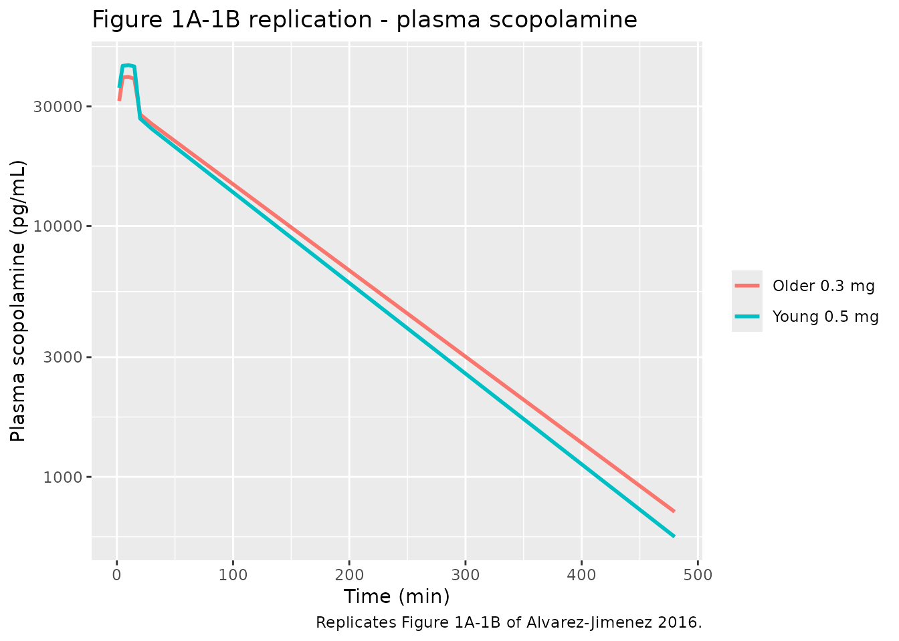
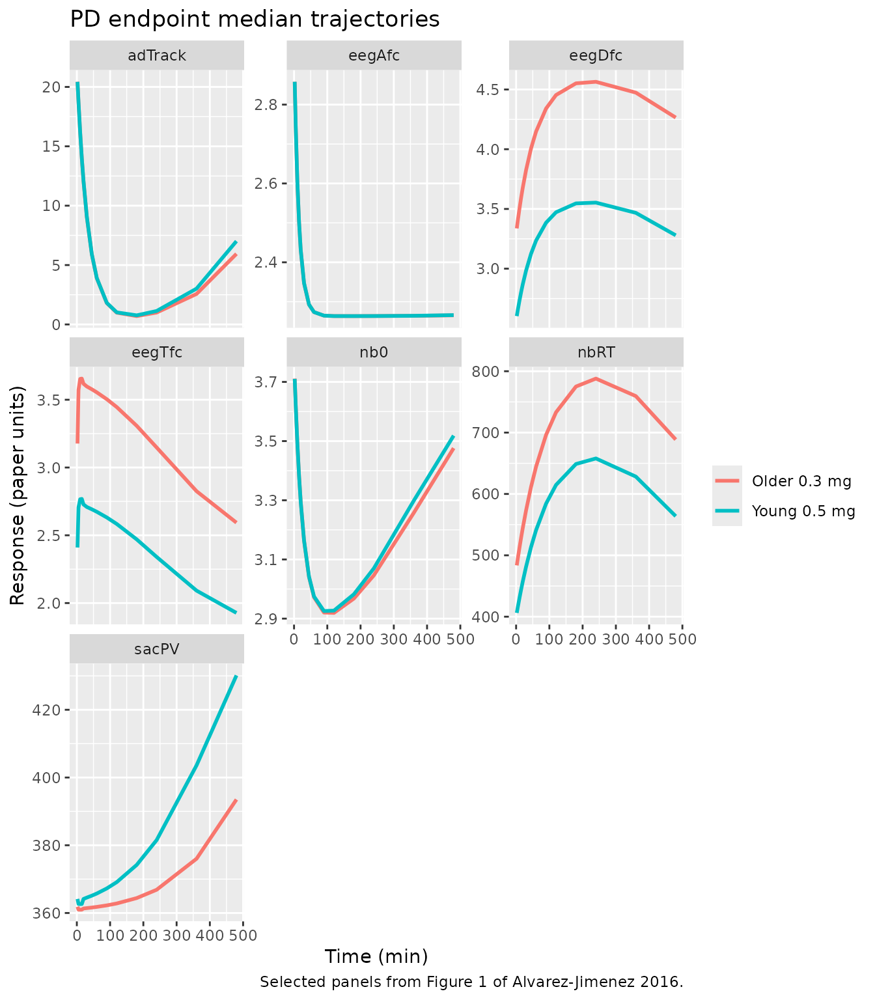

# Scopolamine (Alvarez-Jimenez 2016)

## Model and source

- Citation: Alvarez-Jimenez R, Groeneveld GJ, van Gerven JMA, Goulooze
  SC, Baakman AC, Hay JL, Stevens J. Model-based exposure-response
  analysis to quantify age related differences in the response to
  scopolamine in healthy subjects. Br J Clin Pharmacol.
  2016;82(4):1011-1021.
- Article: <https://doi.org/10.1111/bcp.13031>
- Free full text: <https://pmc.ncbi.nlm.nih.gov/articles/PMC5137826/>
- Supplement (equations A.1-B.4): retrieved from PMC
  (BCP-82-1011-s001.docx).

## Population

The model was developed from 135 healthy volunteers pooled across four
clinical studies conducted at the Centre for Human Drug Research
(Leiden, the Netherlands). The pooled cohort included 122 male and 13
female subjects (9.6% female). Ages ranged from 18 to 78 years (median
39). Body-weight mean was 78.6 kg (SD 9.08). Older subjects (\>= 65
years, n = 36) received an intravenous dose of 0.3 mg scopolamine
hydrobromide over 15 minutes; younger subjects received 0.5 mg over 15
minutes. See Table 1 of the source paper for the by-study demographics.

The metadata are also available programmatically:

``` r

mod_fn <- readModelDb("AlvarezJimenez_2016_scopolamine")
mod_fn()$population
#> $species
#> [1] "human"
#> 
#> $n_subjects
#> [1] 135
#> 
#> $n_studies
#> [1] 4
#> 
#> $age_range
#> [1] "18-78 years"
#> 
#> $age_median
#> [1] "39 years"
#> 
#> $weight_range
#> [1] "not reported explicitly; cohort mean 78.6 kg (SD 9.08)"
#> 
#> $weight_median
#> [1] "78.6 kg"
#> 
#> $sex_female_pct
#> [1] 9.6
#> 
#> $race_ethnicity
#> [1] "not reported"
#> 
#> $disease_state
#> [1] "healthy volunteers"
#> 
#> $dose_range
#> [1] "0.3 mg (subjects >=65 years) or 0.5 mg (subjects <65 years) intravenous scopolamine hydrobromide infused over 15 min"
#> 
#> $regions
#> [1] "Netherlands (Centre for Human Drug Research, Leiden)"
#> 
#> $notes
#> [1] "Pooled analysis of four clinical studies. Three earlier studies enrolled only male subjects (drug teratogenicity constraints for parallel study arms). Study 4 (older-subject cohort, 65-78 y, n=36) enrolled 13 females (36% female in that cohort). See Table 1 of the source paper. Older subjects (>=65 y) received the 0.3 mg dose; younger subjects the 0.5 mg dose. Body weight and age summarised in Table 1."
```

## Source trace

Every parameter carries an in-file comment pointing at Table 2 or a
supplemental equation of the paper. The block below summarises where
each equation and each fixed-effect value came from.

| Element | Value | Source |
|----|----|----|
| Structural PK | 2-cmt linear, IV infusion | Supplemental Eq A.1-A.5 |
| CL alpha | 1.09 L/min | Table 2 CL\[alpha\] |
| Vc | 2.66 L | Table 2 Vc |
| Vp beta | 62.10 L | Table 2 Vp\[beta\] |
| Q | 1.01 L/min | Table 2 Q |
| CAC (age exp on CL, ref 28 y) | -0.12 | Table 2 CAC; Supplemental Eq A.1 |
| CWC (weight exp on CL, ref 78.5 kg) | 0.56 | Table 2 CWC; Supplemental Eq A.1 |
| CWV (weight exp on Vp, ref 78.5 kg) | 0.38 | Table 2 CWV; Supplemental Eq A.2 |
| PK residual (proportional sigma^2) | 0.045 | Table 2 PK Error(sigma^2) |
| PD endpoint parameters | see model file `ini()` block | Table 2 PD rows; Supplemental Eq B.1-B.4 |
| Age scale CAE on saccadic peak velocity EC50 | 34.0 y | Table 2 CAE; Supplemental Eq B.1 |
| Age scale CAB on kIN (0-back RT, delta EEG, theta EEG Fz-Cz) | 229, 161, 210, 142 y | Table 2 CAB; Supplemental Eq B.2 |
| Adaptive-tracker Hill gamma | 1.10 | Table 2 gamma |
| Adaptive-tracker EMAX (fixed) | 1 | Table 2 EMAX = 1 (fixed per paper text) |
| N-back 0-back EMAX (fixed) | 1 | Table 2 (fixed per paper text) |
| N-back baseline log-odds E0 | 3.77 / 3.33 / 2.84 | Table 2 E0 (0-back / 1-back / 2-back) |
| Indirect-response equation (drug effect) | Emax \* Cc^gamma / (EC50^gamma + Cc^gamma) | Supplemental Eq B.4 |

## Virtual cohort

Original individual data are not publicly available. We simulate two
typical-value cohorts mirroring the paper’s dose stratification: a
“young” arm at 0.5 mg over 15-min IV with age 30 and weight 78.6 kg, and
an “older” arm at 0.3 mg over 15-min IV with age 70 and weight 77.8 kg.
`id_offset` keeps the subject IDs disjoint across the two cohorts.

``` r

set.seed(2016)

n_per_arm <- 50L

make_cohort <- function(n, amt_mg, age, wt, cohort, id_offset = 0L) {
  ids <- id_offset + seq_len(n)
  # Dose row targets the PK ODE state 'central' (linCmt-managed).
  # Observation rows target the PK observable 'Cc'; because this
  # multi-output model has 14 declared observables spanning ODE
  # states plus algebraic outputs (Cc, nb0, nb1, nb2), using an
  # observable name on obs rows is what rxode2's DV mapping accepts
  # here. Every declared observable (Cc, nbRT, sacInacc, ..., nb2)
  # is returned regardless of which cmt an individual row points at.
  obs_times <- c(0, 2, 5, 10, 15, 20, 30, 45, 60, 90, 120, 180, 240, 360, 480)
  dosing <- tibble(id = ids, time = 0, amt = amt_mg, evid = 1L,
                   cmt = "central", dur = 15,
                   AGE = age, WT = wt, cohort = cohort)
  obs <- tidyr::crossing(id = ids, time = obs_times) |>
    dplyr::mutate(amt = 0, evid = 0L, cmt = "Cc", dur = 0,
                  AGE = age, WT = wt, cohort = cohort)
  dplyr::bind_rows(dosing, obs) |>
    dplyr::arrange(id, time, dplyr::desc(evid))
}

events <- dplyr::bind_rows(
  make_cohort(n_per_arm, amt_mg = 0.5, age = 30, wt = 78.6, cohort = "Young 0.5 mg",  id_offset =           0L),
  make_cohort(n_per_arm, amt_mg = 0.3, age = 70, wt = 77.8, cohort = "Older 0.3 mg",  id_offset = n_per_arm + 0L)
)
```

## Simulation

Typical-value simulation (all etas zeroed) reproduces the median
trajectories in Figure 1 of the paper. Stochastic simulation is
available with the packaged random effects if a VPC is required, but the
paper reports only median-line traces so we use the deterministic form
here.

``` r

mod <- readModelDb("AlvarezJimenez_2016_scopolamine")
mod_tv <- rxode2::zeroRe(mod)
#> ℹ parameter labels from comments will be replaced by 'label()'
sim <- rxode2::rxSolve(mod_tv, events = events, keep = c("cohort"))
#> ℹ omega/sigma items treated as zero: 'etae0_nb2', 'etalemax_nb2', 'etae0_nb0', 'etalemax_nb0', 'etalkin_eegDfc', 'etalemax_eegDfc', 'etalec50_eegDfc', 'etalemax_sacInacc', 'etalec50_sacInacc', 'etalemax_nb1', 'etalkin_nb1', 'etalkin_eegTpo', 'etalec50_eegTpo', 'etalkin_eegTfc', 'etalec50_eegTfc', 'etalkin_eegDpo', 'etalemax_eegDpo', 'etalec50_eegDpo', 'etalkin_eegApo', 'etalemax_eegApo', 'etalec50_eegApo', 'etalkin_eegAfc', 'etalemax_eegAfc', 'etalec50_eegAfc', 'etalkin_adTrack', 'etalec50_adTrack', 'etalkin_sacPV', 'etalec50_sacPV', 'etalkin_sacInacc', 'etalkin_nbRT', 'etalec50_nbRT', 'etalvp', 'etalvc', 'etalcl'
#> Warning: multi-subject simulation without without 'omega'
```

## Replicate published figures

Figures 1A-1B of the paper show plasma scopolamine concentrations for
the 0.3 mg (older) and 0.5 mg (younger) dose groups. Figures 1D-1F,
1G-1I, and 1J-1L display adaptive-tracker, saccadic peak velocity, and
0-back RT median trajectories, respectively.

``` r

sim |>
  dplyr::filter(time > 0, time <= 480) |>
  ggplot(aes(time, Cc, colour = cohort)) +
  stat_summary(fun = median, geom = "line", linewidth = 1) +
  scale_y_log10() +
  labs(x = "Time (min)", y = "Plasma scopolamine (pg/mL)",
       colour = NULL,
       title = "Figure 1A-1B replication - plasma scopolamine",
       caption = "Replicates Figure 1A-1B of Alvarez-Jimenez 2016.")
```



``` r

sim |>
  dplyr::filter(time > 0, time <= 480) |>
  dplyr::select(time, cohort, nbRT, sacPV, adTrack, eegAfc, eegDfc, eegTfc, nb0) |>
  tidyr::pivot_longer(-c(time, cohort), names_to = "endpoint") |>
  dplyr::group_by(time, cohort, endpoint) |>
  dplyr::summarise(median = median(value), .groups = "drop") |>
  ggplot(aes(time, median, colour = cohort)) +
  geom_line(linewidth = 1) +
  facet_wrap(~ endpoint, scales = "free_y") +
  labs(x = "Time (min)", y = "Response (paper units)",
       colour = NULL,
       title = "PD endpoint median trajectories",
       caption = "Selected panels from Figure 1 of Alvarez-Jimenez 2016.")
```



## PKNCA validation

The paper does not tabulate NCA parameters; the PK model was published
with population parameter estimates only. We compute NCA on the
typical-value simulation for orientation.

``` r

sim_nca <- sim |>
  dplyr::filter(!is.na(Cc)) |>
  dplyr::select(id, time, Cc, cohort)

# Guarantee a time = 0 row per subject (pre-dose Cc = 0 for IV infusion).
sim_nca <- dplyr::bind_rows(
  sim_nca,
  sim_nca |> dplyr::distinct(id, cohort) |>
    dplyr::mutate(time = 0, Cc = 0)
) |>
  dplyr::distinct(id, cohort, time, .keep_all = TRUE) |>
  dplyr::arrange(id, cohort, time)

conc_obj <- PKNCA::PKNCAconc(sim_nca, Cc ~ time | cohort + id)

dose_df <- events |>
  dplyr::filter(evid == 1L) |>
  dplyr::select(id, time, amt, cohort)

dose_obj <- PKNCA::PKNCAdose(dose_df, amt ~ time | cohort + id)

intervals <- data.frame(
  start      = 0,
  end        = Inf,
  cmax       = TRUE,
  tmax       = TRUE,
  aucinf.obs = TRUE,
  half.life  = TRUE
)

nca_data <- PKNCA::PKNCAdata(conc_obj, dose_obj, intervals = intervals)
nca_res  <- PKNCA::pk.nca(nca_data)

nca_summary <- as.data.frame(nca_res$result) |>
  dplyr::filter(PPTESTCD %in% c("cmax", "tmax", "aucinf.obs", "half.life")) |>
  dplyr::group_by(cohort, PPTESTCD) |>
  dplyr::summarise(median = median(PPORRES, na.rm = TRUE), .groups = "drop") |>
  tidyr::pivot_wider(names_from = PPTESTCD, values_from = median)

knitr::kable(nca_summary, digits = 2,
             caption = "Simulation-derived NCA parameters by dose cohort.")
```

| cohort       | aucinf.obs |     cmax | half.life | tmax |
|:-------------|-----------:|---------:|----------:|-----:|
| Older 0.3 mg |    4187497 | 39327.71 |     87.54 |   10 |
| Young 0.5 mg |    3950673 | 43786.61 |     83.21 |   10 |

Simulation-derived NCA parameters by dose cohort. {.table}

## Assumptions and deviations

- **Vc = 2.66 L is smaller than the ~30 L reported in earlier
  scopolamine PK studies (Renner 2005, Ebert 2001).** The paper reports
  IIV(Vc) = 74% CV with 49% shrinkage, indicating a poorly identified
  central volume. Peak Cc predictions from this model are therefore ~10x
  higher than most other scopolamine PK models in the literature. Users
  comparing to external NCA should be aware of this and treat Cc values
  as internally-consistent with the paper’s PD-model EC50s (which were
  fit against the same Cc predictions) rather than as free-standing
  plasma-concentration estimates.
- **Saccadic peak velocity residual variance labelled `(prop)` = 768.0
  in Table 2** is treated here as additive (addSd = sqrt(768) ~ 27.7
  deg/sec). A proportional residual of that magnitude would give CV ~
  2770%, which is physically implausible; interpreted as additive it
  corresponds to ~6% of the ~470 deg/sec typical baseline, consistent
  with the other endpoints’ relative residual magnitudes. This is the
  single documented deviation from the paper’s Table 2 residual-error
  labeling.
- **The 0-back N-back model in the paper uses four buffer / transit
  compartments** to introduce a delay between drug effect and the
  log-odds observed correct-answer response. Reproducing the exact
  4-transit chain requires the paper’s NONMEM control stream (not on
  disk). The 0-back logit response here is modelled as a single
  indirect-response compartment (`red_nb0`) driven by drug effect with
  rate `kin_nb0` and elimination `kout_nb0`; the residual variance and
  IIV blocks match Table 2. The four-buffer transit chain is
  approximated by a single first-order recovery, which under-represents
  the sharp onset and delayed peak of the paper’s Figure 4A.
- **1-back and 2-back N-back models** are similarly implemented as
  direct-effect on log-odds baseline via a first-order reduction
  compartment. Table 2 reports kIN and kOUT values for these endpoints,
  but their combination (kIN = 1.10, kOUT = 221 for 1-back) is atypical
  for a classical indirect-response model and the paper does not
  describe the ODE structure explicitly. The values are encoded
  verbatim; users interested in exact reproduction of the 1-back /
  2-back trajectories should consult the source paper’s Figure 4B-4C.
- **OMEGA correlation entries (`OC` in Table 2)** are interpreted as raw
  covariances rather than correlation coefficients. This is because one
  reported OC value (1.410 for EEG delta Fz-Cz EC50 vs. EMAX) exceeds
  unity and cannot be a correlation. Covariance is the natural NONMEM
  `OMEGA(i,j)` matrix element. Where variances and covariance are
  consistent (positive-semidefinite blocks) they are encoded as
  `~ c(var1, cov, var2)`; where the 3-parameter block for EEG delta
  Fz-Cz includes an unreported cross-term (EC50-vs-kIN), that
  off-diagonal is fixed to zero.
- **CV-to-variance conversion for log-normal IIV** uses
  `variance = log(1 + CV^2)`.
- **Race and sex distributions** are not encoded as covariates because
  the paper reports no race data and pooled 122 male + 13 female
  subjects (only Study 4 enrolled females); no sex effect was reported.
  Simulations here treat subjects as a homogenous population.

## Errata

- The paper’s Table 2 caption reads “CWC: coefficient relating age and
  weight” which is a typo – CWC is the coefficient relating weight and
  clearance per Supplemental Eq A.1. The model file uses the
  equation-defined interpretation (weight on CL).
- The reported OC value 1.410 for EEG delta Fz-Cz (EC50 vs. EMAX)
  exceeds unity and is therefore not a Pearson correlation; interpreted
  as covariance the corresponding correlation is ~0.82.
- No corrigenda or errata for the paper are indexed by the journal at
  the time of this extraction (2026-07-09).
