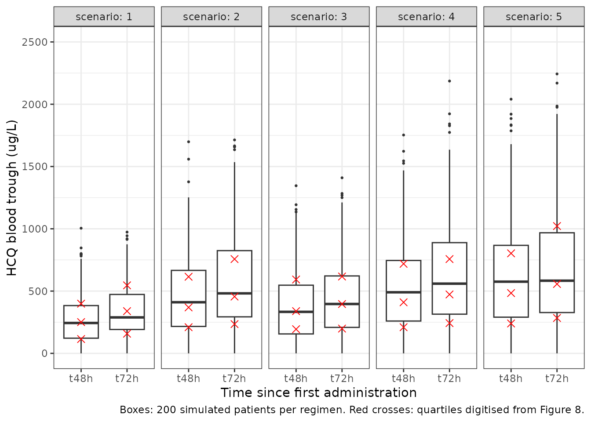
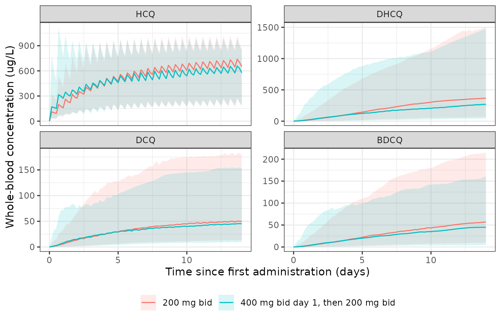

# Hydroxychloroquine and three metabolites (Alvarez 2022)

## Model and source

``` r

mod <- rxode2::rxode(readModelDb("Alvarez_2022_hydroxychloroquine"))
#> ℹ parameter labels from comments will be replaced by 'label()'
th <- mod$theta
```

- Citation: Alvarez JC, Davido B, Moine P, Etting I, Annane D, Larabi
  IA, Simon N (2022). Population Pharmacokinetics of Hydroxychloroquine
  and 3 Metabolites in COVID-19 Patients and
  Pharmacokinetic/Pharmacodynamic Application. Pharmaceuticals
  15(2):256. <doi:10.3390/ph15020256>.
- Article: <https://doi.org/10.3390/ph15020256>
- PMCID:
  [PMC8877570](https://www.ncbi.nlm.nih.gov/pmc/articles/PMC8877570/)

Joint parent + three-metabolite population PK model for oral
hydroxychloroquine in whole blood of 100 adults hospitalised with
COVID-19 (medicine wards and ICU) (Alvarez 2022). One-compartment
hydroxychloroquine disposition with first-order absorption and a lag
time (both fixed to published values), a non-metabolic apparent
clearance, and three parallel first-order formation clearances into
one-compartment desethylhydroxychloroquine, desethylchloroquine and
bisdesethylchloroquine (didesethylchloroquine) compartments whose
volumes equal the individual hydroxychloroquine volume. Formation fluxes
carry a molar correction so each metabolite state holds mg of that
metabolite. No covariates were retained (age, weight, height, BMI, sex,
azithromycin co-treatment and ICU stay were screened). Proportional plus
additive residual error on every analyte.

## Population

| Field | Value |
|:---|:---|
| species | human |
| n_subjects | 100 |
| n_studies | 1 |
| n_observations | 333 whole-blood samples, each assayed for hydroxychloroquine and the three metabolites; 1 to 9 samples per patient (Section 2.1.1) |
| age_range | 20-94 years (mean 60.7, SD 15.9; median 62.5) |
| weight_range | 37.5-190 kg (mean 83.6, SD 20.1; median 82) |
| sex_female_pct | 34 |
| disease_state | Hospitalised COVID-19 confirmed by SARS-CoV-2 RT-PCR and/or compatible chest CT; 75 on medicine wards, 25 in the ICU |
| dose_range | Plaquenil 200 mg bid or tid orally, preceded in 42 patients by a 400 mg bid loading dose on day 1 |
| regions | France (Raymond Poincare Hospital, Garches) |
| co_medication | Azithromycin in 78 patients |
| notes | Retrospective therapeutic drug monitoring cohort; samples roughly every two days over the first two weeks of treatment (Figure 2). |

Study population (Alvarez 2022, Table 1 and Sections 2.1 and 4.1).
{.table}

One hundred adults hospitalised with COVID-19 at Raymond Poincare
Hospital (Garches, France), 75 on medicine wards and 25 in the intensive
care unit, were treated with oral hydroxychloroquine (Plaquenil 200 mg)
at 200 mg twice or three times daily, in 42 patients after a 400 mg
twice-daily loading day, and 78 also received azithromycin (Table 1,
Section 4.1). Whole-blood hydroxychloroquine (HCQ),
desethylhydroxychloroquine (DHCQ; the paper’s DesHCQ or DesOHCQ),
desethylchloroquine (DCQ; DesCQ) and bisdesethylchloroquine (BDCQ;
DiDesCQ) were measured by LC-MS/MS in 333 samples, 1 to 9 per patient,
collected roughly every two days as therapeutic drug monitoring.

## Model structure

Figure 3 of the paper: hydroxychloroquine is absorbed first-order after
a lag into a single central compartment (VP/F) and leaves it by four
parallel clearances – its own apparent clearance CL/F and three
formation clearances, one into each metabolite compartment. Each
metabolite has its own first-order elimination clearance and a volume
fixed to the individual parent volume. The model was fitted in NONMEM
(ADVAN5, FOCE-I) on molar concentrations, so each metabolite is formed
1:1 in moles; the packaged model keeps doses in mg and multiplies each
formation flux by the metabolite-to-parent molecular-weight ratio, so
every compartment holds mg of its own analyte and every output is in
ug/L.

The paper reports that 75% of hydroxychloroquine is converted to the
metabolites, computed as the sum of formation clearances over the total
(Section 2.1.1). The packaged values reproduce it:

``` r

cl_form <- exp(th[c("lcl_form_dhcq", "lcl_form_dcq", "lcl_form_bdcq")])
cl_tot <- exp(th[["lcl"]]) + sum(cl_form)
fm <- sum(cl_form) / cl_tot
fm
#> [1] 0.7461469
# Deterministic arithmetic on the ini() values; the paper prints 75%.
stopifnot(abs(fm - 0.75) < 0.005)
```

## Source trace

| Item | Value | Source |
|:---|:---|:---|
| Structure: 1-cmt HCQ, 3 parallel 1-cmt metabolites | \- | Figure 3; Section 2.1.1 |
| Metabolite volume = parent volume VP/F | \- | Section 2.1.1 |
| Molar concentrations in the fit | \- | Section 4.3 |
| tlag (fixed) | 0.389 h | Table 2 (from Lim 2009, reference 16) |
| ka (fixed) | 1.15 1/h | Table 2 (from Lim 2009, reference 16) |
| cl (CL/F HCQ) | 5.60 L/h | Table 2 |
| vc (VP/F HCQ) | 1850 L | Table 2 |
| cl_form_dhcq (CL HCQ_DesHCQ) | 9.63 L/h | Table 2 |
| cl_form_dcq (CL HCQ_DesCQ) | 4.99 L/h | Table 2 |
| cl_form_bdcq (CL HCQ_DiDesCQ) | 1.84 L/h | Table 2 |
| cl_dhcq (CL DesHCQ) | 8.89 L/h | Table 2 |
| cl_dcq (CL DesCQ) | 49.8 L/h | Table 2 |
| cl_bdcq (CL DiDesCQ) | 11.6 L/h | Table 2 |
| IIV CL, VP, CL DesHCQ, CL DesCQ, CL DiDesCQ | 1.327, 0.889, 0.860, 0.362, 0.953 | Table 2 (entered as variances; see below) |
| Proportional residual HCQ / DHCQ / DCQ / BDCQ | 0.448 / 0.428 / 0.322 / 0.0574 | Table 2 |
| Additive residual HCQ / DHCQ / DCQ / BDCQ | 86.9 / 6.69 / 5.78 / 2.49 ug/L | Table 2 |
| Fraction metabolised | 75% | Section 2.1.1 |

Source location of every structural element and parameter. {.table}

## Deterministic checks

A single 200 mg dose is solved with the random effects zeroed over 3000
h, long enough for the slowest analyte (desethylhydroxychloroquine,
elimination half-life `log(2) * 1850 / 8.89` = 144 h) to fall more than
twenty half-lives.

``` r

mod_typ <- rxode2::zeroRe(mod)
tgrid <- sort(unique(c(seq(0, 12, by = 0.25), seq(12, 96, by = 1), seq(96, 3000, by = 6))))
ev_single <- dplyr::bind_rows(
  data.frame(id = 1, time = 0, evid = 1, amt = 200, cmt = "depot", dvid = NA_integer_),
  data.frame(id = 1, time = tgrid, evid = 0, amt = 0, cmt = "central", dvid = 1L)
) |>
  dplyr::mutate(treatment = "200 mg single dose")
sim_single <- rxode2::rxSolve(mod_typ, events = ev_single, rtol = 1e-10, atol = 1e-12,
                              maxsteps = 1e6, keep = "treatment") |>
  as.data.frame() |>
  # A single-subject solve returns no id column.
  dplyr::mutate(id = 1L)
#> ℹ omega/sigma items treated as zero: 'etalcl', 'etalvc', 'etalcl_dhcq', 'etalcl_dcq', 'etalcl_bdcq'
```

### Mass balance (PKNCA)

At infinite time the amount cleared equals the amount that entered. For
the parent, `(CL/F + sum CL_form) * AUCinf = Dose`; for each metabolite,
`CL_m * AUCinf_m = Dose * CL_form_m / CL_total * MW_m / MW_HCQ`. These
close only if every clearance, the shared volume and each molar
correction are wired correctly.

``` r

analytes <- c(Cc = "HCQ", Cc_dhcq = "DHCQ", Cc_dcq = "DCQ", Cc_bdcq = "BDCQ")
peak <- vapply(names(analytes), function(v) max(sim_single[[v]]), numeric(1))
# The numeric (ODE) path can undershoot zero by about atol in the far tail.
for (v in names(analytes)) {
  stopifnot(all(sim_single[[v]] >= -1e-6 * peak[[v]]))
}

conc_long <- sim_single |>
  dplyr::select(id, time, treatment, dplyr::all_of(names(analytes))) |>
  tidyr::pivot_longer(dplyr::all_of(names(analytes)), names_to = "var", values_to = "Cc") |>
  dplyr::mutate(analyte = unname(analytes[var]), Cc = pmax(Cc, 0)) |>
  dplyr::filter(!is.na(Cc))
# Guarantee a time-zero record per analyte; any existing time-zero row wins.
conc_long <- dplyr::bind_rows(
  conc_long,
  conc_long |> dplyr::distinct(id, treatment, analyte) |> dplyr::mutate(time = 0, Cc = 0)
) |>
  dplyr::distinct(id, treatment, analyte, time, .keep_all = TRUE) |>
  dplyr::arrange(analyte, id, time)

dose_long <- ev_single |>
  dplyr::filter(evid == 1) |>
  dplyr::select(id, time, amt, treatment) |>
  tidyr::crossing(analyte = unname(analytes))

conc_obj <- PKNCA::PKNCAconc(as.data.frame(conc_long), Cc ~ time | treatment + analyte + id,
                             concu = "ug/L", timeu = "h")
dose_obj <- PKNCA::PKNCAdose(as.data.frame(dose_long), amt ~ time | treatment + analyte + id,
                             doseu = "mg")
intervals <- data.frame(start = 0, end = Inf, cmax = TRUE, tmax = TRUE,
                        aucinf.obs = TRUE, half.life = TRUE)
nca_res <- PKNCA::pk.nca(PKNCA::PKNCAdata(conc_obj, dose_obj, intervals = intervals))
nca_tab <- as.data.frame(nca_res$result)
```

``` r

mw <- c(HCQ = 335.87, DHCQ = 307.82, DCQ = 291.82, BDCQ = 263.77)
cl_out <- c(HCQ = cl_tot, DHCQ = exp(th[["lcl_dhcq"]]), DCQ = exp(th[["lcl_dcq"]]),
            BDCQ = exp(th[["lcl_bdcq"]]))
frac_in <- c(HCQ = 1, DHCQ = cl_form[["lcl_form_dhcq"]] / cl_tot,
             DCQ = cl_form[["lcl_form_dcq"]] / cl_tot, BDCQ = cl_form[["lcl_form_bdcq"]] / cl_tot)

mb <- nca_tab |>
  dplyr::filter(PPTESTCD == "aucinf.obs") |>
  dplyr::select(analyte, auc = PPORRES) |>
  dplyr::mutate(
    cleared_mg = cl_out[analyte] * auc / 1000,
    expected_mg = 200 * frac_in[analyte] * mw[analyte] / mw[["HCQ"]],
    ratio = cleared_mg / expected_mg
  )
stopifnot(nrow(mb) == 4L, setequal(mb$analyte, unname(analytes)))
mb |>
  dplyr::rename("Analyte" = analyte, "AUCinf (ug*h/L)" = auc, "CL x AUCinf (mg)" = cleared_mg,
                "Expected (mg)" = expected_mg, "Ratio" = ratio) |>
  knitr::kable(digits = c(0, 0, 3, 3, 4),
               caption = "Mass balance after a single 200 mg dose (typical values).")
```

| Analyte | AUCinf (ug\*h/L) | CL x AUCinf (mg) | Expected (mg) |  Ratio |
|:--------|-----------------:|-----------------:|--------------:|-------:|
| BDCQ    |             1129 |           13.100 |        13.101 | 0.9999 |
| DCQ     |              789 |           39.304 |        39.307 | 0.9999 |
| DHCQ    |             9000 |           80.012 |        80.016 | 0.9999 |
| HCQ     |             9066 |          200.007 |       200.000 | 1.0000 |

Mass balance after a single 200 mg dose (typical values). {.table}

``` r

# Deterministic solve at rtol 1e-10; the only slack is the trapezoidal AUC and
# its extrapolation. A missing molar correction moves a ratio by 8-21%, a wrong
# shared volume or clearance by far more.
stopifnot(all(abs(mb$ratio - 1) < 0.01))
```

### Terminal half-lives

The parent’s terminal half-life is `log(2) * VP / CL_total`. A
metabolite whose elimination is slower than the parent’s shows its own
half-life (`log(2) * VP / CL_m`); desethylchloroquine is eliminated
faster than it is formed, so its terminal phase follows the parent
(formation-rate-limited).

``` r

vc_typ <- exp(th[["lvc"]])
t12_parent <- log(2) * vc_typ / cl_tot
t12_expected <- c(
  HCQ = t12_parent,
  DHCQ = max(t12_parent, log(2) * vc_typ / cl_out[["DHCQ"]]),
  DCQ = max(t12_parent, log(2) * vc_typ / cl_out[["DCQ"]]),
  BDCQ = max(t12_parent, log(2) * vc_typ / cl_out[["BDCQ"]])
)
hl <- nca_tab |>
  dplyr::filter(PPTESTCD == "half.life") |>
  dplyr::select(analyte, half_life = PPORRES) |>
  dplyr::mutate(expected = t12_expected[analyte], pct_diff = 100 * (half_life / expected - 1))
stopifnot(nrow(hl) == 4L)
hl |>
  dplyr::rename("Analyte" = analyte, "PKNCA t1/2 (h)" = half_life,
                "Closed-form t1/2 (h)" = expected, "Difference (%)" = pct_diff) |>
  knitr::kable(digits = c(0, 1, 1, 2), caption = "Terminal half-life after a single dose.")
```

| Analyte | PKNCA t1/2 (h) | Closed-form t1/2 (h) | Difference (%) |
|:--------|---------------:|---------------------:|---------------:|
| BDCQ    |          111.3 |                110.5 |           0.65 |
| DCQ     |           58.4 |                 58.1 |           0.51 |
| DHCQ    |          145.1 |                144.2 |           0.57 |
| HCQ     |           58.1 |                 58.1 |           0.00 |

Terminal half-life after a single dose. {.table}

``` r

# Deterministic. PKNCA picks its own lambda-z window, which for the
# formation-limited DCQ and the slow metabolites may still carry a trace of the
# faster exponential; 3% separates that from a wrong clearance or volume.
stopifnot(all(abs(hl$pct_diff) < 3))
```

The paper’s parent volume of 1850 L gives a parent half-life of about 58
h (2.4 days) within this model. The Discussion’s “more than 40 days”
terminal half-life is quoted from the literature on long-term treatment
and is not a property of the fitted one-compartment model, which was
estimated on the first two weeks of therapy.

## Replication of Figure 8 (trough concentrations at 48 h and 72 h)

Figure 8 simulated 500 patients per regimen “with between subject
variability” and shows boxplots of the hydroxychloroquine whole-blood
trough at 48 h and 72 h after the first dose for five regimens. The
maintainers digitised the quartiles of each box from the published
raster (the pixel scale was read from the 0, 600, 800, 1000 and 2000
ug/L gridlines). The trough is taken just before the dose due at that
time.

To compare quartiles without Monte Carlo noise, the model’s trough
distribution is computed on a fixed lattice rather than a random cohort.
Only two random effects move the parent trough (CL/F and VP/F; the
metabolite etas do not act on the parent), so 14 equally probable
quantiles of each give 196 lattice patients per regimen, and each of
their predictions is crossed with a 20 x 20 lattice of the proportional
and additive residual draws. Every number in the tables of this section
is therefore deterministic.

``` r

fig8 <- tibble::tribble(
  ~scenario, ~time, ~q25, ~q50, ~q75,
  "1: 200 mg bid", 48, 115, 251, 399,
  "1: 200 mg bid", 72, 158, 339, 546,
  "2: 200 mg tid", 48, 210, 369, 615,
  "2: 200 mg tid", 72, 235, 456, 757,
  "3: 400 mg bid day 1, then 200 mg bid", 48, 194, 339, 593,
  "3: 400 mg bid day 1, then 200 mg bid", 72, 199, 396, 617,
  "4: 400 mg bid day 1, then 200 mg tid", 48, 210, 410, 719,
  "4: 400 mg bid day 1, then 200 mg tid", 72, 243, 473, 757,
  "5: 400 mg bid", 48, 240, 484, 803,
  "5: 400 mg bid", 72, 284, 557, 1022
)

bid <- seq(0, 60, by = 12)
tid <- seq(0, 64, by = 8)
regimens <- list(
  "1: 200 mg bid" = data.frame(time = bid, amt = 200),
  "2: 200 mg tid" = data.frame(time = tid, amt = 200),
  "3: 400 mg bid day 1, then 200 mg bid" = data.frame(time = bid, amt = ifelse(bid < 24, 400, 200)),
  "4: 400 mg bid day 1, then 200 mg tid" = data.frame(time = c(0, 12, seq(24, 64, by = 8)),
                                                      amt = c(400, 400, rep(200, 6))),
  "5: 400 mg bid" = data.frame(time = bid, amt = 400)
)
trough_events <- function(n_per_arm) {
  dplyr::bind_rows(lapply(seq_along(regimens), function(i) {
    ids <- (i - 1) * n_per_arm + seq_len(n_per_arm)
    dplyr::bind_rows(
      tidyr::crossing(id = ids, regimens[[i]]) |>
        dplyr::mutate(evid = 1, cmt = "depot", dvid = NA_integer_),
      tidyr::crossing(id = ids, time = c(48, 72)) |>
        dplyr::mutate(evid = 0, amt = 0, cmt = "central", dvid = 1L)
    ) |>
      dplyr::mutate(scenario = names(regimens)[i], lattice = seq_len(n_per_arm)[match(id, ids)])
  })) |>
    dplyr::arrange(id, time, dplyr::desc(evid))
}

# Equally probable standard-normal quantiles, rescaled to unit variance so the
# lattice does not understate the spread.
lattice_z <- function(n) {
  z <- stats::qnorm((seq_len(n) - 0.5) / n)
  z / sqrt(mean(z^2))
}
eta_grid <- expand.grid(z_cl = lattice_z(14), z_v = lattice_z(14))
eps_grid <- expand.grid(e_prop = lattice_z(20), e_add = lattice_z(20))
ev_lat <- trough_events(nrow(eta_grid))
stopifnot(dplyr::n_distinct(ev_lat$id) == 5 * nrow(eta_grid))
```

``` r

# Typical-value model; the lattice supplies the individual CL/F and VP/F.
solve_lattice <- function(omega_cl, omega_v) {
  ids <- dplyr::distinct(ev_lat, id, lattice)
  prm <- data.frame(
    id = ids$id,
    lcl = th[["lcl"]] + sqrt(omega_cl) * eta_grid$z_cl[ids$lattice],
    lvc = th[["lvc"]] + sqrt(omega_v) * eta_grid$z_v[ids$lattice]
  )
  rxode2::rxSolve(mod_typ, params = prm, events = ev_lat, keep = "scenario") |>
    as.data.frame() |>
    dplyr::select(id, scenario, time, Cc)
}
with_ruv <- function(pred, prop_sd, add_sd = th[["addSd"]]) {
  tidyr::crossing(pred, eps_grid) |>
    dplyr::mutate(Cobs = Cc * (1 + prop_sd * e_prop) + add_sd * e_add)
}
quartiles <- function(d, conc) {
  d |>
    dplyr::group_by(scenario, time) |>
    dplyr::summarise(
      sim_q25 = stats::quantile(.data[[conc]], 0.25),
      sim_q50 = stats::quantile(.data[[conc]], 0.50),
      sim_q75 = stats::quantile(.data[[conc]], 0.75),
      pct_below_200 = 100 * mean(.data[[conc]] < 200),
      .groups = "drop"
    ) |>
    dplyr::inner_join(fig8, by = c("scenario", "time"))
}

# Packaged reading: the Table 2 values are the omega variances.
om_cl <- mod$omega["etalcl", "etalcl"]
om_v <- mod$omega["etalvc", "etalvc"]
stopifnot(om_cl == 1.327, om_v == 0.889)
pred_var <- solve_lattice(om_cl, om_v)
#> ℹ omega/sigma items treated as zero: 'etalcl', 'etalvc', 'etalcl_dhcq', 'etalcl_dcq', 'etalcl_bdcq'
#> Warning: multi-subject simulation without without 'omega'
stopifnot(nrow(pred_var) == 2 * 5 * nrow(eta_grid), all(is.finite(pred_var$Cc)))
cmp <- quartiles(with_ruv(pred_var, th[["propSd"]]), "Cobs") |>
  dplyr::mutate(log_ratio_median = log(sim_q50 / q50))
stopifnot(nrow(cmp) == 10L)

cmp |>
  dplyr::select(scenario, time, sim_q25, q25, sim_q50, q50, sim_q75, q75, pct_below_200) |>
  dplyr::rename("Scenario" = scenario, "Time (h)" = time,
                "Model Q1" = sim_q25, "Fig 8 Q1" = q25, "Model median" = sim_q50,
                "Fig 8 median" = q50, "Model Q3" = sim_q75, "Fig 8 Q3" = q75,
                "Model % < 200 ug/L" = pct_below_200) |>
  knitr::kable(digits = 0, caption = "Model HCQ trough quartiles (ug/L, lattice) against the digitised Figure 8 quartiles.")
```

| Scenario | Time (h) | Model Q1 | Fig 8 Q1 | Model median | Fig 8 median | Model Q3 | Fig 8 Q3 | Model % \< 200 ug/L |
|:---|---:|---:|---:|---:|---:|---:|---:|---:|
| 1: 200 mg bid | 48 | 126 | 115 | 253 | 251 | 422 | 399 | 40 |
| 1: 200 mg bid | 72 | 169 | 158 | 319 | 339 | 516 | 546 | 30 |
| 2: 200 mg tid | 48 | 203 | 210 | 388 | 369 | 656 | 615 | 25 |
| 2: 200 mg tid | 72 | 269 | 235 | 493 | 456 | 804 | 757 | 17 |
| 3: 400 mg bid day 1, then 200 mg bid | 48 | 182 | 194 | 344 | 339 | 566 | 593 | 28 |
| 3: 400 mg bid day 1, then 200 mg bid | 72 | 209 | 199 | 382 | 396 | 609 | 617 | 24 |
| 4: 400 mg bid day 1, then 200 mg tid | 48 | 228 | 210 | 431 | 410 | 720 | 719 | 21 |
| 4: 400 mg bid day 1, then 200 mg tid | 72 | 288 | 243 | 523 | 473 | 847 | 757 | 16 |
| 5: 400 mg bid | 48 | 261 | 240 | 492 | 484 | 824 | 803 | 18 |
| 5: 400 mg bid | 72 | 344 | 284 | 626 | 557 | 1015 | 1022 | 12 |

Model HCQ trough quartiles (ug/L, lattice) against the digitised Figure
8 quartiles. {.table}

``` r

# Deterministic (lattice, no random draw). Entering the dose as mg of the
# sulfate salt converted to base (x 0.774) moves every median by -0.26 on the
# log scale, a mis-scaled volume or a lost dose by more, so a 0.1 bound on the
# centre separates the packaged model from each of those.
stopifnot(
  abs(median(cmp$log_ratio_median)) < 0.1,
  median(abs(cmp$log_ratio_median)) < 0.1
)
```

The median absolute log-ratio between the model and the published
medians is 0.05 across the ten boxes. The paper states that every
regimen except 200 mg twice daily leaves fewer than 25% of patients
below 200 ug/L. The model percentages are in the last column: scenarios
2 and 3 at 48 h sit at or just above 25%, and the published boxes
themselves put scenario 3 at 48 h on that line (lower quartile 194
ug/L).

A random 200-patient cohort per regimen, with residual error, shown
against the digitised quartiles:

``` r

rxode2::rxSetSeed(2022)
set.seed(2022)
sim_fig8 <- rxode2::rxSolve(mod, events = trough_events(200), keep = "scenario") |>
  as.data.frame()
sim_fig8$Cobs <- sim_fig8$Cc * (1 + th[["propSd"]] * stats::rnorm(nrow(sim_fig8))) +
  th[["addSd"]] * stats::rnorm(nrow(sim_fig8))

sim_fig8 |>
  dplyr::mutate(label = paste0("t", time, "h"), scenario = sub(":.*", "", scenario)) |>
  ggplot(aes(label, pmax(Cobs, 0))) +
  geom_boxplot(outlier.size = 0.5) +
  geom_point(data = fig8 |>
               tidyr::pivot_longer(c(q25, q50, q75), values_to = "conc") |>
               dplyr::mutate(label = paste0("t", time, "h"), scenario = sub(":.*", "", scenario)),
             aes(y = conc), colour = "red", shape = 4, size = 2.5) +
  facet_wrap(~scenario, nrow = 1, labeller = label_both) +
  coord_cartesian(ylim = c(0, 2500)) +
  labs(x = "Time since first administration", y = "HCQ blood trough (ug/L)",
       caption = "Boxes: 200 simulated patients per regimen. Red crosses: quartiles digitised from Figure 8.") +
  theme_bw()
```



Replicates Figure 8 of Alvarez 2022.

### What Figure 8 says about the dose unit and the variability scales

The paper leaves three things unstated: the molecular weight used to
turn the dose into moles, and whether the Table 2 “omega” and “sigma”
values are standard deviations or variances. Each reading is scored
against Figure 8 on the same lattice:

``` r

score <- function(d, conc) {
  quartiles(d, conc) |>
    dplyr::summarise(
      q25 = mean(abs(log(pmax(sim_q25, 1) / q25))),
      q50 = mean(abs(log(sim_q50 / q50))),
      q75 = mean(abs(log(sim_q75 / q75)))
    )
}
# Alternative: the Table 2 values are SDs, so the variances are their squares.
pred_sd <- solve_lattice(om_cl^2, om_v^2)
#> ℹ omega/sigma items treated as zero: 'etalcl', 'etalvc', 'etalcl_dhcq', 'etalcl_dcq', 'etalcl_bdcq'
#> Warning: multi-subject simulation without without 'omega'
# The model is linear in dose, so a dose entered as sulfate salt (200 mg of
# salt = 200 * 335.87 / 433.95 mg of base) scales every prediction.
pred_salt <- dplyr::mutate(pred_var, Cc = Cc * 335.87 / 433.95)

scales <- dplyr::bind_rows(
  packaged = score(with_ruv(pred_var, th[["propSd"]]), "Cobs"),
  omega_sd = score(with_ruv(pred_sd, th[["propSd"]]), "Cobs"),
  sigma_var = score(with_ruv(pred_var, sqrt(th[["propSd"]])), "Cobs"),
  no_ruv = score(pred_var, "Cc"),
  salt = score(with_ruv(pred_salt, th[["propSd"]]), "Cobs"),
  .id = "reading"
)
reading_labels <- c(
  packaged = "Packaged: labelled mg, omega variances, sigma SDs",
  omega_sd = "Omega read as SDs",
  sigma_var = "Proportional sigma read as a variance",
  no_ruv = "No residual error",
  salt = "Dose read as mg of sulfate salt"
)
scales |>
  dplyr::mutate(reading = reading_labels[reading]) |>
  dplyr::rename("Reading" = reading, "Mean |log ratio| Q1" = q25,
                "Mean |log ratio| median" = q50, "Mean |log ratio| Q3" = q75) |>
  knitr::kable(digits = 3, caption = "Distance of the model trough quartiles from Figure 8 under each reading (lattice).")
```

| Reading | Mean \|log ratio\| Q1 | Mean \|log ratio\| median | Mean \|log ratio\| Q3 |
|:---|---:|---:|---:|
| Packaged: labelled mg, omega variances, sigma SDs | 0.097 | 0.053 | 0.045 |
| Omega read as SDs | 0.083 | 0.045 | 0.042 |
| Proportional sigma read as a variance | 0.181 | 0.046 | 0.072 |
| No residual error | 0.332 | 0.129 | 0.048 |
| Dose read as mg of sulfate salt | 0.193 | 0.213 | 0.227 |

Distance of the model trough quartiles from Figure 8 under each reading
(lattice). {.table}

``` r

sc <- function(r, q) {
  v <- scales[[q]][scales$reading == r]
  if (length(v) != 1L) stop("no unique score for ", r)
  v
}
# Deterministic. Each assertion is the claim written in the bullets below.
stopifnot(
  # The dose-unit reading separates by far more than any scale reading.
  sc("salt", "q50") > sc("packaged", "q50") + 0.1,
  # Figure 8 includes residual error: without it the lower quartiles miss badly.
  sc("no_ruv", "q25") > 2 * sc("packaged", "q25"),
  # The two omega readings are indistinguishable at 48-72 h.
  abs(sc("omega_sd", "q50") - sc("packaged", "q50")) < 0.02,
  abs(sc("omega_sd", "q25") - sc("packaged", "q25")) < 0.02,
  # A proportional SD of 0.448 fits the box widths better than 0.669.
  sc("sigma_var", "q25") + sc("sigma_var", "q75") > sc("packaged", "q25") + sc("packaged", "q75")
)
```

- **Dose unit.** Plaquenil 200 mg tablets contain 200 mg of
  hydroxychloroquine sulfate. Converting the labelled 200 mg to moles
  with the free-base molecular weight reproduces the Figure 8 medians;
  treating it as sulfate salt (x 0.774 in moles) lowers every median by
  23% and moves them away from the figure. The model therefore takes the
  labelled tablet strength in mg as the dose.
- **Omega.** At 48 h and 72 h the trough is governed by the volume
  (0.889 read as a variance is an SD of 0.943; read as an SD it is
  0.889) and hardly at all by the eta on the non-metabolic clearance.
  The two readings’ scores differ by less than 0.02 on every quartile
  (the SD reading is marginally closer), which is smaller than the
  uncertainty from digitising the figure and from the unstated clock
  times of the doses, so Figure 8 does not separate them. The values are
  entered as variances because the same group’s companion lopinavir
  analysis (Alvarez 2021, identical table layout and “omega” labelling)
  was shown from its own below-target percentages to report variances.
  The RSE column does not decide it either: 9.2% on the CL row is below
  the floor a variance estimated from 100 patients can reach
  (`sqrt(2/100)` = 14%), but the lopinavir table’s variance rows sat
  below that floor too. The only row where the choice matters much is
  desethylchloroquine clearance (SD 0.60 versus 0.36).
- **Sigma.** The additive terms carry concentration units (ug/L), so
  they are standard deviations. The proportional HCQ term read as an SD
  (0.448) fits the Figure 8 box widths better than read as a variance
  (SD 0.669), and without any residual error the lower quartiles are far
  too high, which shows that the figure includes residual error.

## Four-analyte profiles over the first two weeks

Figure 2 of the paper shows the observed concentrations over the first
14 days. Two of the prescribed regimens are simulated for 200 patients
each.

``` r

t_obs <- seq(0, 336, by = 4)
make_arm <- function(ids, doses, label) {
  dplyr::bind_rows(
    tidyr::crossing(id = ids, doses) |> dplyr::mutate(evid = 1, cmt = "depot", dvid = NA_integer_),
    tidyr::crossing(id = ids, time = t_obs) |>
      dplyr::mutate(evid = 0, amt = 0, cmt = "central", dvid = 1L)
  ) |>
    dplyr::mutate(treatment = label)
}
bid14 <- seq(0, 324, by = 12)
ev_prof <- dplyr::bind_rows(
  make_arm(1:200, data.frame(time = bid14, amt = 200), "200 mg bid"),
  make_arm(201:400, data.frame(time = bid14, amt = ifelse(bid14 < 24, 400, 200)),
           "400 mg bid day 1, then 200 mg bid")
) |>
  dplyr::arrange(id, time, dplyr::desc(evid))
rxode2::rxSetSeed(2025)
sim_prof <- rxode2::rxSolve(mod, events = ev_prof, keep = "treatment") |> as.data.frame()

prof_long <- sim_prof |>
  dplyr::select(id, time, treatment, dplyr::all_of(names(analytes))) |>
  tidyr::pivot_longer(dplyr::all_of(names(analytes)), names_to = "var", values_to = "conc") |>
  dplyr::mutate(analyte = factor(analytes[var], levels = unname(analytes)))
prof_summ <- prof_long |>
  dplyr::group_by(treatment, analyte, time) |>
  dplyr::summarise(
    p05 = stats::quantile(conc, 0.05), p50 = stats::median(conc), p95 = stats::quantile(conc, 0.95),
    .groups = "drop"
  )
ggplot(prof_summ, aes(time / 24, p50, colour = treatment, fill = treatment)) +
  geom_ribbon(aes(ymin = p05, ymax = p95), alpha = 0.15, colour = NA) +
  geom_line() +
  facet_wrap(~analyte, scales = "free_y") +
  labs(x = "Time since first administration (days)", y = "Whole-blood concentration (ug/L)",
       colour = NULL, fill = NULL) +
  theme_bw() +
  theme(legend.position = "bottom")
```



Simulated medians and 90% prediction intervals (without residual error);
compare with the observed concentrations of Figure 2 of Alvarez 2022.

The Discussion describes the observed concentrations as roughly 500-1000
ug/L for hydroxychloroquine, around 500 ug/L for
desethylhydroxychloroquine and 50-100 ug/L for desethylchloroquine and
bisdesethylchloroquine, pooled over patients on different regimens and
days. The typical-patient predictions on day 10 (just before the morning
dose) for the two maintenance regimens are:

``` r

ev_typ10 <- dplyr::bind_rows(
  make_arm(1, data.frame(time = bid14, amt = 200), "200 mg bid"),
  make_arm(2, data.frame(time = seq(0, 328, by = 8), amt = 200), "200 mg tid")
) |>
  dplyr::arrange(id, time, dplyr::desc(evid))
day10 <- rxode2::rxSolve(mod_typ, events = ev_typ10, keep = "treatment") |>
  as.data.frame() |>
  dplyr::filter(time == 240) |>
  dplyr::select(treatment, dplyr::all_of(names(analytes))) |>
  tidyr::pivot_longer(dplyr::all_of(names(analytes)), names_to = "var", values_to = "conc") |>
  dplyr::mutate(analyte = unname(analytes[var]))
#> ℹ omega/sigma items treated as zero: 'etalcl', 'etalvc', 'etalcl_dhcq', 'etalcl_dcq', 'etalcl_bdcq'
#> Warning: multi-subject simulation without without 'omega'
stopifnot(nrow(day10) == 8L)
day10 |>
  dplyr::select(treatment, analyte, conc) |>
  tidyr::pivot_wider(names_from = analyte, values_from = conc) |>
  dplyr::rename("Regimen" = treatment) |>
  knitr::kable(digits = 0, caption = "Typical-patient whole-blood concentrations (ug/L) on day 10.")
```

| Regimen    |  HCQ | DHCQ | DCQ | BDCQ |
|:-----------|-----:|-----:|----:|-----:|
| 200 mg bid |  673 |  390 |  59 |   57 |
| 200 mg tid | 1034 |  580 |  89 |   85 |

Typical-patient whole-blood concentrations (ug/L) on day 10. {.table}

``` r

c10 <- function(reg, a) {
  v <- day10$conc[day10$treatment == reg & day10$analyte == a]
  if (length(v) != 1L) stop("no unique day-10 row for ", reg, " / ", a)
  v
}
# Deterministic typical values. The Discussion's ranges are loose descriptions
# of pooled observations, so each is allowed a factor of 2 either way; a unit or
# molar-factor error, or a metabolite fed from the wrong compartment, moves a
# value by 8% to 1000-fold and the mass-balance gate above catches the small
# ones.
for (reg in c("200 mg bid", "200 mg tid")) {
  stopifnot(
    c10(reg, "HCQ") > 500 / 2, c10(reg, "HCQ") < 1000 * 2,
    c10(reg, "DHCQ") > 500 / 2, c10(reg, "DHCQ") < 500 * 2,
    c10(reg, "DCQ") > 50 / 2, c10(reg, "DCQ") < 100 * 2,
    c10(reg, "BDCQ") > 50 / 2, c10(reg, "BDCQ") < 100 * 2
  )
}
```

All four analytes fall inside the Discussion’s ranges for both regimens.
The slower metabolites (desethylhydroxychloroquine and
bisdesethylchloroquine, elimination half-lives of about 6 and 5 days)
are still accumulating at day 10, as in Figure 2B.

## Comparison against published NCA

The paper reports no non-compartmental parameters, so there is no
published NCA table to compare with; the PKNCA analysis above is used
for the mass-balance and half-life checks.

## Assumptions and deviations

- **Dose unit.** Plaquenil 200 mg tablets contain 200 mg of
  hydroxychloroquine sulfate (about 155 mg of base). The fit used molar
  concentrations but does not say which molecular weight turned the dose
  into moles. Converting the labelled 200 mg with the free-base
  molecular weight reproduces the Figure 8 medians; treating it as
  sulfate salt (x 0.774 in moles) does not (Figure 8 section). The model
  therefore takes the labelled tablet strength in mg as the dose, and
  the apparent CL/F and VP/F are relative to that.
- **Omega scale.** Table 2 does not state whether the “omega” values are
  standard deviations or variances. They are entered as variances,
  following the same group’s lopinavir analysis; Figure 8 cannot
  separate the two readings (section above).
- **Residual error.** Proportional and additive terms are entered as
  standard deviations and combined in the nlmixr2 default (combined2)
  form; the paper states only “proportional plus additive”. The additive
  terms are used in the ug/L units printed in Table 2, although the fit
  itself was on umol/L.
- **Metabolite volumes.** Each metabolite volume equals the individual
  parent volume, including its eta, as the paper fixed VM/F to VP/F.
- **Formation clearances** carry no between-subject variability; Table 2
  reports it only on CL/F, VP/F and the three metabolite elimination
  clearances.
- **Molecular weights** of the free bases (HCQ 335.87, DHCQ 307.82, DCQ
  291.82, BDCQ 263.77 g/mol) come from their molecular formulas; the
  paper does not print them.
- **Figure 4 panel labels.** The first VPC panel is headed “DesOHCQ
  concentration” although the caption calls panel A hydroxychloroquine,
  and the second is headed “HCQ”; the figure panels, not the caption,
  were used for reading.
- **Pharmacodynamic analysis not packaged.** The length of stay was
  related to the model-predicted 48 h and 72 h troughs by linear
  regression (r^2 = 0.12 and 0.16) and clinical outcome by analysis of
  variance. These are statistical associations on the individual
  predictions, and the regression coefficients are not printed, so no PD
  model is included.
