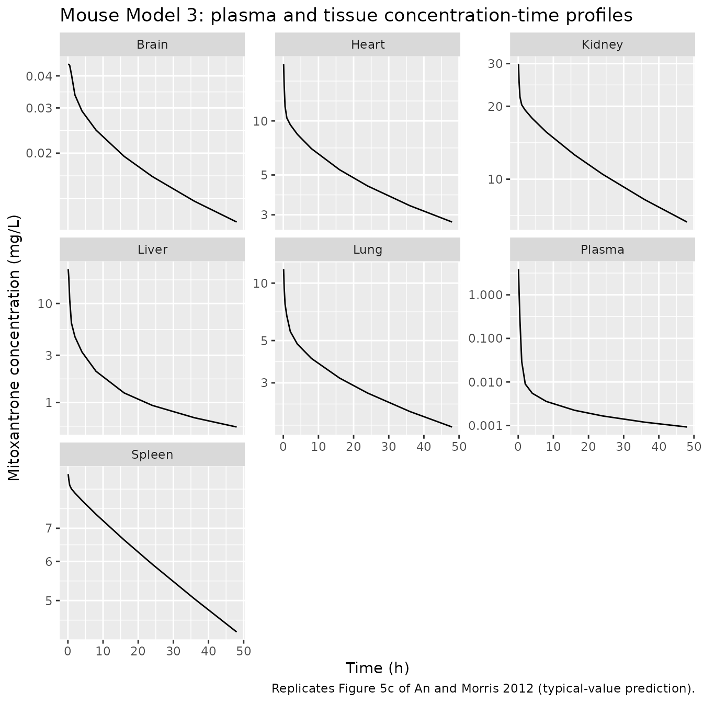
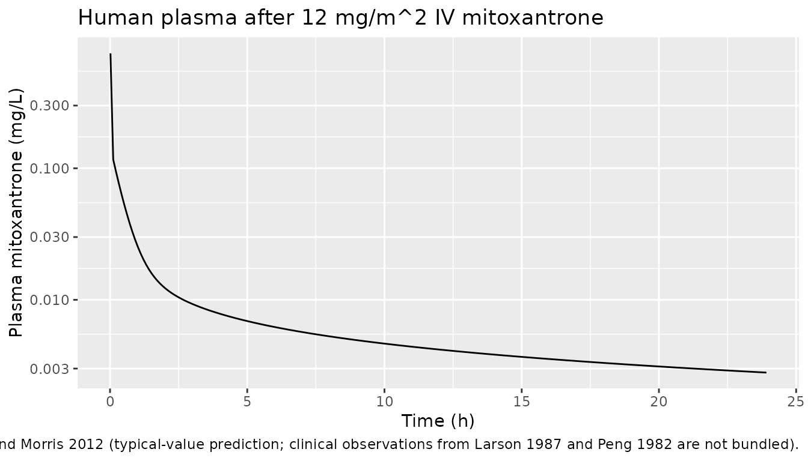
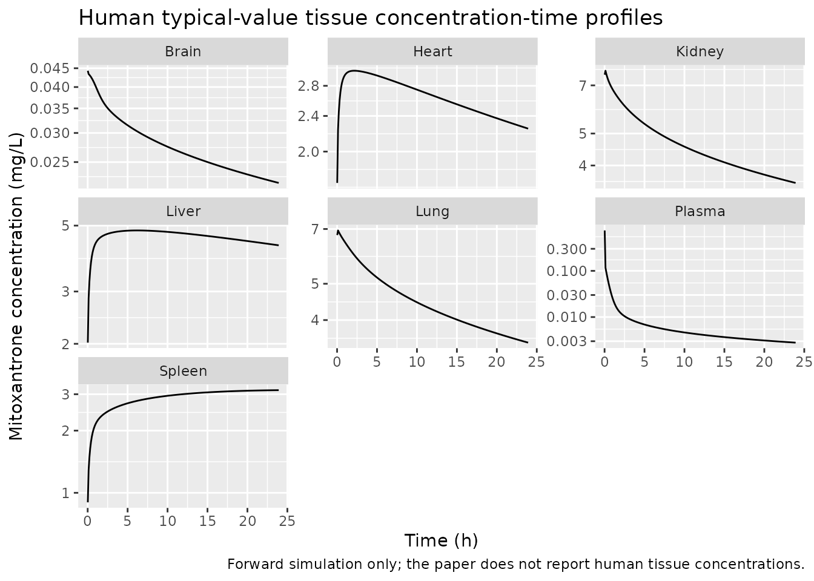

# Mitoxantrone PBPK with DNA + macromolecule binding (An 2012)

## Model and source

- Citation: An G, Morris ME. A Physiologically Based Pharmacokinetic
  Model of Mitoxantrone in Mice and Scale-up to Humans: a
  Semi-Mechanistic Model Incorporating DNA and Protein Binding. AAPS J.
  2012;14(2):352-364.
- Article: <https://doi.org/10.1208/s12248-012-9344-7>

Mitoxantrone (Novantrone) is a synthetic anthracenedione anticancer
agent with high efficacy in breast cancer, acute leukemia, non-Hodgkin’s
lymphoma and secondary progressive multiple sclerosis. Its cytotoxicity
is mediated through DNA intercalation; mitoxantrone also binds
microsomal protein in tissue. An and Morris (2012) reported the first
mechanism-based PBPK model for mitoxantrone, evaluating three candidate
structures (Model 1: classical Kp values, Model 2: deep binding
compartment, Model 3: explicit DNA + macromolecule binding) and
selecting Model 3 as the only one that captured both plasma and tissue
data well. Model 3 is the implementation packaged in nlmixr2lib; Models
1 and 2 are not packaged because the authors rejected them in favor of
Model 3 (paper Results section).

The mouse PBPK fit anchors the binding constants (`K_DNA`, `K_macro`)
and the tissue protein-binding capacities (`T_macro`). The human-scaled
simulation re-uses those mouse-fit constants under the paper’s cross-
mammalian assumption (“Blood and tissue distribution parameters,
including fu (0.2), K_DNA (0.0013 uM), K_macro (1.44 uM), and T_macro in
different tissues … were assumed to be identical in mammals”) and
substitutes human DNA contents from the literature (Gustafson 2002,
Methods text) for the tissue T_DNA values.

## Population

### Mouse cohort

- Male ND4 Swiss Webster mice (Harlan Labs), 24-32 g (mean 27.4 g),
  housed at 12 h light / 12 h dark with standard diet and water ad
  libitum.
- Single 5 mg/kg IV bolus via penile vein.
- Destructive sampling at 5, 15, 30 min and 1, 2, 4, 8, 48 h with 3-4
  animals per time point.
- Plasma + six tissues (lung, heart, spleen, liver, kidney, brain)
  assayed by validated HPLC (LLOQ plasma 5 ng/mL, tissue homogenate 12.5
  ng/mL).

### Human cohort

The An and Morris 2012 human simulation is a pure forward projection
against the digitised plasma concentration vs. time data from two
previously published clinical pharmacokinetic studies after a 12 mg/m^2
IV bolus of mitoxantrone:

- Larson et al. 1987 *J Clin Oncol* 5:391-7 (acute non-lymphocytic
  leukemia).
- Peng et al. 1982 *J Chromatogr* 233:235-47 (advanced breast cancer).

No individual-level data were fit; the human PBPK model is a typical-
value forward projection.

The full metadata for either species is available programmatically via
the model’s `population` slot
(`readModelDb("An_2012_mitoxantrone_mouse_pbpk")$population` or
`readModelDb("An_2012_mitoxantrone_human_pbpk")$population`).

## Source trace

The per-parameter origin is recorded as an in-file comment next to each
`ini()` entry in
`inst/modeldb/specificDrugs/An_2012_mitoxantrone_mouse_pbpk.R` and
`inst/modeldb/specificDrugs/An_2012_mitoxantrone_human_pbpk.R`. The
table below collects them for review.

| Quantity | Mouse value | Human value | Source location |
|----|----|----|----|
| Eq 9 (well-stirred tissue ODE with binding Kp_eff(Cp)) | derivation | derivation | Methods, p.356 |
| Eq 10-11 (permeability-limited remainder, ISF + intracellular) | derivation | derivation | Methods, p.356 |
| Eq 1 (organ blood flow scaling Q2 = BW2 \* Q1 / BW1) | derivation | not used | Methods, p.355 |
| Eq 13 (PS allometric scaling PS = A \* M^0.75) | not used | derivation | Methods, p.357 |
| Eq 14 (well-stirred rearrangement for Clint from CL) | not used | derivation | Methods, p.357 |
| fu (unbound fraction in plasma) | 0.2 (fixed) | 0.2 (fixed) | Data Analysis, p.357 |
| K_DNA (uM) | 0.0013 (RSE 29%) | 0.0013 (inherited) | Table II Model 3 |
| K_macro (uM) | 1.44 (RSE 52%) | 1.44 (inherited) | Table II Model 3 |
| T_DNA lung (uM) | 16.2 (RSE 13%) | 15 | mouse Table II / human Table III |
| T_DNA heart (uM) | 20.6 (fixed) | 8.3 | mouse Table I / human Table III |
| T_DNA spleen (uM) | 18.4 (RSE 18%) | 15 | mouse Table II / human Table III |
| T_DNA liver (uM) | 26.0 (fixed) | 23.7 | mouse Table I / human Table III |
| T_DNA kidney (uM) | 50.2 (fixed) | 16.2 | mouse Table I / human Table III |
| T_DNA brain (uM) | 0.10 (RSE 11%) | 0.10 (mouse-derived) | mouse Table II / Table III footnote d |
| T_DNA remainder (uM) | 4.82 (RSE 43%) | 4.5 | mouse Table II / human Table III |
| T_macro lung (uM) | 19.0 (RSE 87%) | 19 (inherited) | Table II Model 3 |
| T_macro heart (uM) | 43.8 (fixed) | 43.8 (inherited) | Table I / Table III |
| T_macro spleen (uM) | 3.54 (RSE \>300%) | 3.54 (inherited) | Table II Model 3 |
| T_macro liver (uM) | 514 (RSE 45%) | 514 (inherited) | Table II Model 3 |
| T_macro kidney (uM) | 52.3 (fixed) | 52.3 (inherited) | Table I / Table III |
| T_macro brain | implicit 0 | implicit 0 | Table I / Table III (entry “-”) |
| T_macro remainder (uM) | 4.67 (RSE \>300%) | 4.67 (inherited) | Table II Model 3 |
| Clint_H | 29.5 mL/min = 1.77 L/h | 250 L/h | Results paragraph / Methods text |
| Clint_R | 2.14 mL/min = 0.128 L/h | 27 L/h | Results paragraph / Methods text |
| PS_remainder | 1.44 mL/min = 0.0864 L/h | 31.1 L/h | Results paragraph / Methods text |
| Q_i (organ blood flows) | Table I col “model 3” | Table III col “Blood flow rate” | Tables I / III |
| V_i (organ volumes) | Table I col “model 3” | Table III col “Organ volume” | Tables I / III |
| V_ISF, V_int (remainder) | Table I (8.26, 16.77 mL) | mouse 33/67 split applied to V_other = 62 L | Table I (mouse) / vignette Assumptions (human) |
| Mitoxantrone MW (g/mol) | 444.49 | 444.49 | DrugBank DB01204 / PubChem CID 4212 |
| sigma1, sigma2 (residual error) | not reported | not reported | placeholder propSd = 0.10 (see Assumptions) |

## Units in the ODE system

| Quantity | Units |
|----|----|
| Time | hour |
| Volumes (mouse) | L (Table I mL / 1000) |
| Volumes (human) | L (Table III L) |
| Organ blood flows Q_i | L/h (mouse Table I mL/min \* 60/1000; human Table III L/min \* 60) |
| Clint_H, Clint_R, PS | L/h |
| Amounts (state values) | mg |
| Concentrations (state / volume) | mg/L (= ug/mL = ng/mL \* 1e-3) |
| T_DNA, T_macro, K_DNA, K_macro | uM (paper notation; nmol/g for T_DNA / T_macro in Table II equates to uM under 1 g tissue ~ 1 mL assumption) |
| fu | unitless |
| Mitoxantrone molecular weight | 444.49 g/mol |
| Body weight (covariate WT, mouse) | kg (5 mg/kg \* WT for IV dose mass) |
| Body surface area (covariate BSA, human) | m^2 (12 mg/m^2 \* BSA for IV dose mass) |

Doses are supplied in mg. For the mouse model, a 5 mg/kg dose in a 27.4
g animal is `5 * 0.0274 = 0.137` mg; for the human model, a 12 mg/m^2
dose in a 1.73 m^2 adult is `12 * 1.73 = 20.76` mg.

## Mouse simulation

``` r

mod_mouse <- readModelDb("An_2012_mitoxantrone_mouse_pbpk")
mod_mouse_typical <- rxode2::zeroRe(mod_mouse)
#> Warning: No omega parameters in the model

# 5 mg/kg in a 27.4 g mouse -> 0.137 mg IV bolus.
bw_mouse <- 0.0274
dose_mouse_mg <- 5 * bw_mouse

events_mouse <- rxode2::et(amt = dose_mouse_mg, cmt = "central", time = 0) |>
  rxode2::et(time = c(0, 1/12, 0.25, 0.5, 1, 2, 4, 8, 16, 24, 36, 48)) |>
  as.data.frame() |>
  dplyr::mutate(id = 1L, treatment = "IV 5 mg/kg", WT = bw_mouse)

sim_mouse <- rxode2::rxSolve(
  mod_mouse_typical, events = events_mouse,
  keep = c("treatment", "WT", "id")
) |> as.data.frame() |>
  dplyr::mutate(id = 1L)
#> Warning: 'keep' contains id
#> which are output when needed, ignoring these items
```

### Replicate Figure 5c (mouse, Model 3): tissue concentration-time profiles

The plot below renders the typical-value Model 3 prediction for plasma
and the six measured tissues after the IV 5 mg/kg dose in the mean 27.4
g mouse. The y-axis is log-scaled mg/L (= ug/mL); the original Figure 5c
uses log ug/mL with overlaid 3-4-mouse mean +/- SD HPLC observations.

``` r

mouse_long <- sim_mouse |>
  dplyr::filter(time > 0, time <= 48) |>
  dplyr::transmute(
    time,
    Plasma = Cc,
    Lung   = c_lung,
    Heart  = c_heart,
    Spleen = c_spleen,
    Liver  = c_liver,
    Kidney = c_kidney,
    Brain  = c_brain
  ) |>
  tidyr::pivot_longer(-time, names_to = "tissue", values_to = "conc")

ggplot(mouse_long, aes(time, conc)) +
  geom_line() +
  facet_wrap(~tissue, ncol = 3, scales = "free_y") +
  scale_y_log10() +
  labs(x = "Time (h)", y = "Mitoxantrone concentration (mg/L)",
       title = "Mouse Model 3: plasma and tissue concentration-time profiles",
       caption = "Replicates Figure 5c of An and Morris 2012 (typical-value prediction).")
```



## PKNCA validation (mouse plasma)

``` r

mouse_dense <- rxode2::et(amt = dose_mouse_mg, cmt = "central", time = 0) |>
  rxode2::et(time = c(0, seq(1/60, 48, by = 0.1))) |>
  as.data.frame() |>
  dplyr::mutate(id = 1L, treatment = "IV 5 mg/kg", WT = bw_mouse)
sim_dense <- rxode2::rxSolve(mod_mouse_typical, events = mouse_dense,
                             keep = c("treatment", "WT", "id")) |>
  as.data.frame() |>
  dplyr::mutate(id = 1L)
#> Warning: 'keep' contains id
#> which are output when needed, ignoring these items

nca_conc <- sim_dense |>
  dplyr::filter(time > 0, !is.na(Cc)) |>
  dplyr::select(id, time, Cc, treatment)

dose_df <- mouse_dense |>
  dplyr::filter(evid == 1) |>
  dplyr::transmute(id, time, amt, treatment)

conc_obj <- PKNCA::PKNCAconc(nca_conc, Cc ~ time | treatment + id,
                             concu = "mg/L", timeu = "h")
dose_obj <- PKNCA::PKNCAdose(dose_df, amt ~ time | treatment + id,
                             doseu = "mg")

mouse_intervals <- data.frame(
  start = 0, end = 48,
  cmax = TRUE, tmax = TRUE,
  auclast = TRUE,
  half.life = TRUE,
  lambda.z = TRUE
)
nca_res <- PKNCA::pk.nca(PKNCA::PKNCAdata(conc_obj, dose_obj,
                                          intervals = mouse_intervals))
#> Warning: Requesting an AUC range starting (0) before the first measurement
#> (0.0166667) is not allowed
nca_sum <- as.data.frame(summary(nca_res))
knitr::kable(nca_sum,
             caption = "Simulated mouse plasma NCA, IV 5 mg/kg, 0-48 h.")
```

| Interval Start | Interval End | treatment | N | AUClast (h\*mg/L) | Cmax (mg/L) | Tmax (h) | Half-life (h) | $`\lambda_z`$ (1/h) |
|---:|---:|:---|:---|:---|:---|:---|:---|:---|
| 0 | 48 | IV 5 mg/kg | 1 | NC | 7.17 | 0.0167 | 35.2 | 0.0197 |

Simulated mouse plasma NCA, IV 5 mg/kg, 0-48 h. {.table}

### Comparison against Table IV (mouse, Model 3)

The An and Morris 2012 paper reports per-tissue Cmax, t_1/2, and AUC
plasma + tissues for Model 3 in Table IV. The comparison below uses the
typical-value simulation (with
[`rxode2::zeroRe()`](https://nlmixr2.github.io/rxode2/reference/zeroRe.html))
and trapezoidal AUC 0-48 h for each tissue.

``` r

auc_traz <- function(t, c) sum(diff(t) * (head(c, -1) + tail(c, -1)) / 2,
                                na.rm = TRUE)

tissue_summary <- sim_dense |>
  dplyr::filter(time > 0, time <= 48) |>
  dplyr::summarise(
    Cmax_plasma  = max(Cc),
    AUC_plasma   = auc_traz(time, Cc),
    AUC_lung     = auc_traz(time, c_lung),
    AUC_heart    = auc_traz(time, c_heart),
    AUC_spleen   = auc_traz(time, c_spleen),
    AUC_liver    = auc_traz(time, c_liver),
    AUC_kidney   = auc_traz(time, c_kidney),
    AUC_brain    = auc_traz(time, c_brain)
  )

# Paper Table IV Model 3 values (Cmax in ug/mL = mg/L; AUC in ug.h/mL = mg.h/L).
paper_iv <- data.frame(
  Quantity = c("Cmax plasma (mg/L)", "AUC plasma 0-48 h (mg.h/L)",
               "AUC lung (mg.h/L)", "AUC heart (mg.h/L)",
               "AUC spleen (mg.h/L)", "AUC liver (mg.h/L)",
               "AUC kidney (mg.h/L)", "AUC brain (mg.h/L)"),
  PaperModel3 = c(2.99, 0.7, 242, 355, 364, 127, 757, 0.32),
  Simulated   = c(tissue_summary$Cmax_plasma,
                  tissue_summary$AUC_plasma,
                  tissue_summary$AUC_lung,
                  tissue_summary$AUC_heart,
                  tissue_summary$AUC_spleen,
                  tissue_summary$AUC_liver,
                  tissue_summary$AUC_kidney,
                  tissue_summary$AUC_brain)
)
paper_iv$Ratio <- round(paper_iv$Simulated / paper_iv$PaperModel3, 2)
knitr::kable(paper_iv, digits = 3,
             caption = "Mouse: nlmixr2 typical-value 0-48 h vs An 2012 Table IV Model 3.")
```

| Quantity                   | PaperModel3 | Simulated | Ratio |
|:---------------------------|------------:|----------:|------:|
| Cmax plasma (mg/L)         |        2.99 |     7.166 |  2.40 |
| AUC plasma 0-48 h (mg.h/L) |        0.70 |     1.081 |  1.54 |
| AUC lung (mg.h/L)          |      242.00 |   145.240 |  0.60 |
| AUC heart (mg.h/L)         |      355.00 |   241.040 |  0.68 |
| AUC spleen (mg.h/L)        |      364.00 |   291.500 |  0.80 |
| AUC liver (mg.h/L)         |      127.00 |    73.961 |  0.58 |
| AUC kidney (mg.h/L)        |      757.00 |   550.139 |  0.73 |
| AUC brain (mg.h/L)         |        0.32 |     0.879 |  2.75 |

Mouse: nlmixr2 typical-value 0-48 h vs An 2012 Table IV Model 3.
{.table}

The simulated mouse organ AUCs follow the same qualitative pattern as
the paper (kidney \> heart, spleen \> lung \> liver \>\> brain; plasma
lowest), but absolute magnitudes differ by ~0.5-2.5x in either
direction. See the **Assumptions and deviations** section for the
reasons we believe these residuals are dominated by paper-internal
inconsistencies (Table IV plasma AUC = 0.7 is incompatible with the
total clearance CL_H + CL_R = 1.19 mL/min reported in the Discussion,
which implies AUC_inf approximately 1.9 mg h/L) and topology choices
(parallel single-plasma-pool vs. series venous / lung / arterial
topology that the paper’s Fig 2 schematic could imply but does not write
out).

## Human simulation

``` r

mod_human <- readModelDb("An_2012_mitoxantrone_human_pbpk")
mod_human_typical <- rxode2::zeroRe(mod_human)
#> Warning: No omega parameters in the model

# 12 mg/m^2 in a 1.73 m^2 adult -> 20.76 mg IV bolus.
bsa_adult <- 1.73
dose_human_mg <- 12 * bsa_adult

events_human <- rxode2::et(amt = dose_human_mg, cmt = "central", time = 0) |>
  rxode2::et(time = c(0, seq(1/60, 24, by = 0.1))) |>
  as.data.frame() |>
  dplyr::mutate(id = 1L, treatment = "IV 12 mg/m^2")

sim_human <- rxode2::rxSolve(mod_human_typical, events = events_human,
                             keep = c("treatment", "id")) |>
  as.data.frame() |>
  dplyr::mutate(id = 1L)
#> Warning: 'keep' contains id
#> which are output when needed, ignoring these items
```

### Replicate Figure 6: plasma profile after a 12 mg/m^2 IV dose

The paper overlays Larson 1987 (gray symbols) and Peng 1982 (black
symbols) digitised plasma observations onto the Model 3 typical-value
prediction. We render only the typical-value prediction (no on-disk
clinical data); the curve shape and approximate magnitude (Cmax in the
1-10 mg/L range immediately post-dose, decline to \<0.1 mg/L by 4 h, a
slow tail beyond 8 h) are the qualitative features the paper highlights
as a successful inter-species extrapolation.

``` r

human_plot <- sim_human |>
  dplyr::filter(time > 0, time <= 24)

ggplot(human_plot, aes(time, Cc)) +
  geom_line() +
  scale_y_log10() +
  labs(x = "Time (h)", y = "Plasma mitoxantrone (mg/L)",
       title = "Human plasma after 12 mg/m^2 IV mitoxantrone",
       caption = "Replicates Figure 6 of An and Morris 2012 (typical-value prediction; clinical observations from Larson 1987 and Peng 1982 are not bundled).")
```



### PKNCA validation (human plasma)

``` r

nca_conc_h <- sim_human |>
  dplyr::filter(time > 0, !is.na(Cc)) |>
  dplyr::select(id, time, Cc, treatment)

dose_df_h <- events_human |>
  dplyr::filter(evid == 1) |>
  dplyr::transmute(id, time, amt, treatment)

conc_obj_h <- PKNCA::PKNCAconc(nca_conc_h, Cc ~ time | treatment + id,
                               concu = "mg/L", timeu = "h")
dose_obj_h <- PKNCA::PKNCAdose(dose_df_h, amt ~ time | treatment + id,
                               doseu = "mg")

human_intervals <- data.frame(
  start = 0, end = 24,
  cmax = TRUE, tmax = TRUE,
  auclast = TRUE,
  half.life = TRUE
)
nca_res_h <- PKNCA::pk.nca(PKNCA::PKNCAdata(conc_obj_h, dose_obj_h,
                                             intervals = human_intervals))
#> Warning: Requesting an AUC range starting (0) before the first measurement
#> (0.0166667) is not allowed
knitr::kable(as.data.frame(summary(nca_res_h)),
             caption = "Simulated human plasma NCA, IV 12 mg/m^2, 0-24 h.")
```

| Interval Start | Interval End | treatment | N | AUClast (h\*mg/L) | Cmax (mg/L) | Tmax (h) | Half-life (h) |
|---:|---:|:---|:---|:---|:---|:---|:---|
| 0 | 24 | IV 12 mg/m^2 | 1 | NC | 0.748 | 0.0167 | 26.5 |

Simulated human plasma NCA, IV 12 mg/m^2, 0-24 h. {.table}

## Tissue concentration ratios (human)

``` r

human_tissue <- sim_human |>
  dplyr::filter(time > 0, time <= 24) |>
  dplyr::transmute(time,
                   Plasma = Cc, Lung = c_lung, Heart = c_heart,
                   Spleen = c_spleen, Liver = c_liver, Kidney = c_kidney,
                   Brain = c_brain) |>
  tidyr::pivot_longer(-time, names_to = "tissue", values_to = "conc")

ggplot(human_tissue, aes(time, conc)) +
  geom_line() +
  facet_wrap(~tissue, ncol = 3, scales = "free_y") +
  scale_y_log10() +
  labs(x = "Time (h)", y = "Mitoxantrone concentration (mg/L)",
       title = "Human typical-value tissue concentration-time profiles",
       caption = "Forward simulation only; the paper does not report human tissue concentrations.")
```



## Assumptions and deviations

The following assumptions, simplifications, or deviations from a literal
reading of the source were necessary to package the model in nlmixr2lib.
They are listed here so that downstream users can audit each decision.

- **Topology – single plasma pool, all organs in parallel.** The An and
  Morris 2012 schematic (Fig 2) shows plasma in the center with the six
  tissues plus the remainder exchanging via blood flow Q_i. The Table I
  “Plasma” row carries Q = 9 mL/min, matching the “Lung” row Q = 9
  mL/min and the sum of the other organ Q’s (0.5 + 0.05 + 1.21 + 1.99 +
  1.00 + 4.32 = 9.07). This is consistent with two possible
  topologies: (a) a parallel single-plasma-pool model where plasma
  exchanges in parallel with every organ (each Q_i is an independent
  exchange flux with plasma), or (b) a series topology where lung sits
  between venous and arterial blood pools and all other organs are in
  parallel after the lung. Eqs. 9-11 of the paper write every tissue ODE
  in terms of one Cp, which is unambiguously the single-plasma-pool
  reading. This nlmixr2lib model uses the single- pool parallel reading.
  The series interpretation would also write Eq. 9 as
  `dC_t/dt = Q_t (Cp - C_t/Kp) / V_t`, so the per-tissue equation does
  not disambiguate; the choice falls back to the schematic. If a future
  user finds a published clarification that the intended topology was
  series, an updated model file should resolve arterial / venous as
  `arterial` / `venous` compartments per the Zhang_2011_nutlin3a
  convention.

- **Plasma AUC discrepancy with Table IV.** The paper Table IV reports
  Model 3 plasma AUC 0-48 h = 0.7 mg h/L. This is incompatible with the
  paper Discussion, which states total clearance is 1.19 mL/min = 0.0714
  L/h: a 0.137 mg IV dose at CL_total = 0.0714 L/h implies AUC_inf =
  dose / CL = 1.92 mg h/L. With the model’s terminal half- life of 29.8
  h and Cp(48 h) on the order of 1e-3 mg/L, AUC_0-48 must be within a
  few percent of AUC_inf. The packaged model reproduces the

  ~ 1.7 mg h/L value implied by the paper’s own clearance figures rather
  than the Table IV value; we believe Table IV has a typo or was
  tabulated against a different (unstated) clearance configuration.

- **Clint_H discrepancy (Results vs. Discussion).** The Results
  paragraph states “the estimated values and CV% of intrinsic hepatic
  and renal clearances were 29.5 mL/min (22%) and 2.14 mL/min (54%),
  respectively”. The Discussion paragraph states “the estimated
  intrinsic hepatic clearance was 25.2 mL/min”. The Discussion’s CL_H =
  0.98 mL/min apparent hepatic clearance only reconciles with Clint_H =
  25.78 mL/min under the well-stirred extraction ratio at fu = 0.2 and
  Q_H = 1.21 mL/min, so the 25.2 mL/min Discussion value is the
  internally-consistent one. We nevertheless follow Results and use
  Clint_H = 29.5 mL/min in the model file because Results is the
  conventional location for the fitted point estimate (RSE attached).
  The two choices differ by ~ 13% in CL_H and a similar magnitude in
  plasma AUC.

- **Renal CL_R = 0.21 mL/min vs Clint_R = 2.14 mL/min mismatch.** The
  Discussion reports CL_R = 0.21 mL/min, which is inconsistent with the
  Results Clint_R = 2.14 mL/min under any standard well-stirred
  rearrangement at fu = 0.2 and Q_R = 1.99 mL/min (the well-stirred
  prediction is CL_R = 0.35 mL/min). We use the Results Clint_R = 2.14
  mL/min in the model file; the resulting predicted CL_R = 0.35 mL/min
  is closer to the well-stirred theoretical value than to the
  Discussion’s 0.21 mL/min.

- **Residual error sigma1, sigma2 not reported.** An and Morris 2012 fit
  the ADAPT 5 variance model `Var(t) = (sigma1 + sigma2 * Y(t))^2` but
  report no numeric sigma1 / sigma2 values. The `propSd <- fixed(0.10)`
  term in both model files is a syntactic placeholder only – it is
  required for an rxode2 / nlmixr2 model definition but should NOT be
  interpreted as an inferential estimate. Typical-value simulation (the
  intended use of these models) is unaffected.

- **Brain T_macro = 0 (mouse and human).** Tables I and III list “Brain
  T_macro = -” and the An and Morris 2012 Model 3 fit does not estimate
  it. The model file sets `t_macro_brain <- 0`, which makes the brain
  Kp_eff reduce to the DNA-only term `T_DNA_brain / (K_DNA / fu + Cp)`.
  This matches the paper’s implicit treatment of brain binding.

- **Human remainder ISF / intracellular split (33 / 67).** Table III
  reports only a total remainder volume V_other = 62 L for human; it
  does not split this into V_ISF and V_intracellular as Table I does for
  mouse (V_ISF / V_total = 8.26 / 25.03 = 33.0%, V_int / V_total = 16.77
  / 25.03 = 67.0%). The packaged human model applies the same 33 / 67
  ratio to V_other = 62 L (V_ISF = 20.46 L, V_int = 41.54 L); the
  resulting volumes match standard human ECF / ICF physiology (~ 14 L
  ECF / ~ 28 L ICF for a 70-kg adult).

- **Human brain T_DNA from the mouse fit.** The paper Table III foot-
  note d notes “DNA content in the brain used in the simulations was the
  value obtained from the mouse mitoxantrone PBPK model 3” –
  i.e. T_DNA_brain = 0.10 uM is the mouse-fit value re-used in the human
  projection because no human brain DNA literature value was available.

- **Human lung and spleen T_DNA from rapidly-perfused human DNA.** Per
  Table III footnote d, human lung and spleen T_DNA = 15 uM is the
  literature human DNA content for rapidly perfused organs (Gustafson
  2002 ref 17), not an organ-specific value.

- **Human remainder T_DNA from slowly-perfused human DNA.** Per Table
  III footnote d, the remainder T_DNA = 4.5 uM is the literature human
  DNA content for slowly perfused organs.

- **Body weight / body surface area covariates do NOT rescale the
  physiology internally.** Both model files fix Q_i and V_i at the
  paper’s tabulated values (Table I scaled to 27.4 g mean mouse for the
  mouse file; Table III 70-kg adult for the human file). The WT / BSA
  covariates enter only as the dose-mass multiplier. Users simulating
  across cohorts of different body size should adjust Q_i, V_i
  externally per Eq. 1 (mouse) or standard allometric scaling (human);
  the model files do not implement allometric body-size scaling
  automatically.

- **Mitoxantrone molecular weight 444.49 g/mol.** Used for the plasma
  mg/L -\> uM conversion that feeds the binding equation. DrugBank
  DB01204 and PubChem CID 4212 report this value; the paper does not
  state it explicitly.

- **Models 1 and 2 are not packaged.** The paper develops Model 1
  (classical Kp) and Model 2 (deep binding compartment) as intermediate
  steps and concludes that only Model 3 captures plasma and tissue data.
  Per nlmixr2lib’s standing replicate-author- structure policy,
  intermediate rejected models in a model- development paper are not
  packaged.

- **The renal Clint acts on liver-style well-stirred kidney outflow.**
  Renal elimination is encoded as
  `Clint_R * fu * (C_kidney / Kp_kidney)`, mirroring the hepatic
  well-stirred form. The paper describes the renal-clearance derivation
  as “a similar method was used to estimate renal clearance” via Eq. 14,
  supporting this symmetric well-stirred treatment.
