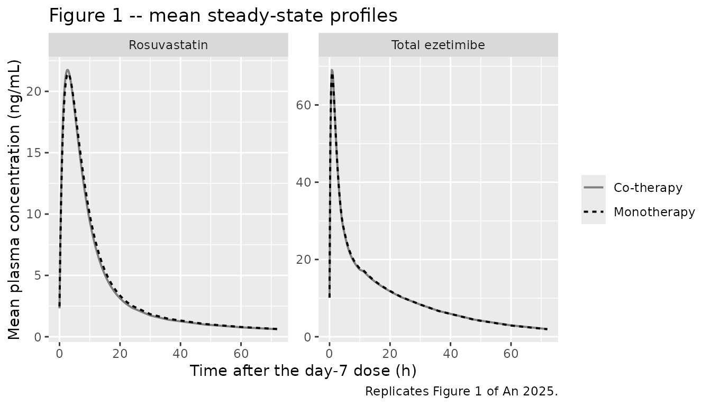
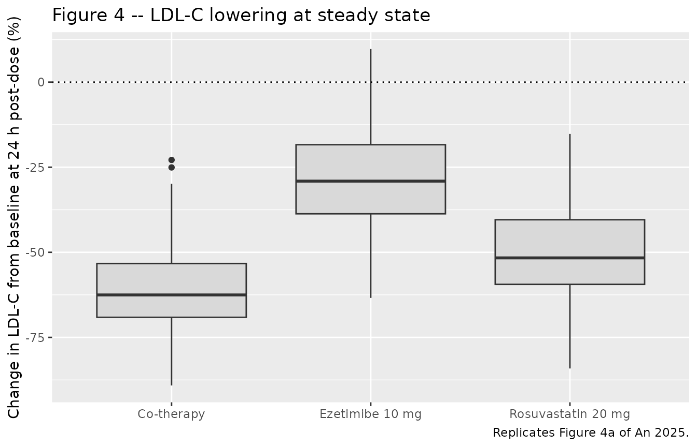

# Rosuvastatin + ezetimibe with enterohepatic recirculation (An 2025)

## Model and source

``` r

ui <- rxode2::rxode(readModelDb("An_2025_rosuvastatin_ezetimibe"))
```

- Citation: An H, Shin D. Population pharmacokinetics and
  pharmacodynamics with enterohepatic recirculation of co-medication of
  rosuvastatin and ezetimibe. Drug Des Devel Ther. 2025;19:4775-4787.
  <doi:10.2147/DDDT.S522863>.
- Article: <https://doi.org/10.2147/DDDT.S522863>
- Description: Joint population PK/PD model of co-administered
  rosuvastatin and ezetimibe with enterohepatic recirculation, fitted to
  a two-part open-label multiple-dose crossover drug-interaction study
  in 50 healthy Korean male volunteers (An 2025 Table 2). Rosuvastatin
  has first-order absorption and two-compartment disposition. Total
  ezetimibe (unchanged ezetimibe plus its phenolic glucuronide, which
  together are the measured analyte) has a four-compartment structure: a
  gastrointestinal / absorption compartment, central and peripheral
  compartments, and a gallbladder reservoir. Drug moves from the
  ezetimibe central compartment into the gallbladder continuously at
  kbm, and is released back into the GASTROINTESTINAL compartment (not
  the central compartment) during three 0.75 h post-prandial windows,
  from which it is re-absorbed at ka - this GI-linked return is the
  structure the authors found superior on goodness-of-fit. The two PK
  models drive one shared LDL-cholesterol indirect-response compartment
  through independent, multiplicative (Bliss-independent) inhibition of
  LDL-C production, with Imax fixed at 1 and the Hill coefficient fixed
  at 1; there is no PK or PD interaction term. The meal gate is anchored
  to TIME AFTER DOSE, matching the protocol’s standard meals 4, 10 and
  24 h after an administration, so a single-dose event table reproduces
  the paper’s Equations 3-6 indicator exactly. No covariate was
  significant on any PK or PD parameter; the screened covariates are
  recorded in covariatesDataExcluded. Concentrations are in ng/mL and
  LDL-C in mg/dL, so model() scales amount/volume by 1000 to convert
  mg/L to ng/mL.

An 2025 fits one joint system to three endpoints measured in the same
subjects: rosuvastatin plasma concentration, total ezetimibe plasma
concentration, and serum LDL-cholesterol. Because the LDL-C compartment
is driven by both drugs at once, the paper’s structure is a single
model, and it is packaged as a single `.R` file rather than split per
drug.

## Population

The analysis dataset comes from a two-part, open-label, multiple-dose,
two-treatment, two-period, two-sequence crossover drug-interaction study
(ClinicalTrials.gov NCT02289430) in healthy Korean male volunteers.
Fifty-six subjects were enrolled, 28 in each part, and 50 (25 per part)
contributed to the population analysis, giving 25
rosuvastatin-monotherapy, 25 ezetimibe-monotherapy and 50 co-therapy
concentration-time profiles. Part A compared rosuvastatin 20 mg once
daily with rosuvastatin 20 mg + ezetimibe 10 mg once daily; Part B
compared ezetimibe 10 mg once daily with the same combination. Each
treatment ran for 7 days, separated by a 14-day washout.

Subjects were 19-45 years old and within 20% of ideal body weight, with
creatinine clearance at or above 80 mL/min. An 2025 Table 1 reports
medians (ranges) of 24 years (19-33 / 19-37), 69.1 and 68.8 kg, 173 and
174 cm, serum creatinine 0.7 and 0.8 mg/dL, albumin 4.5 g/dL, and
baseline LDL-C 91 (43-137) and 99 (53-175) mg/dL across Parts A and B.
The cohort’s homogeneity is the paper’s own explanation for finding no
significant covariate on any PK or PD parameter, so the packaged model
has an empty `covariateData` and records the eight screened covariates
under `covariatesDataExcluded`.

Steady-state PK sampling ran on day 7 at 0, 0.5, 1, 1.5, 2, 2.5, 3, 3.5,
4, 5, 6, 8, 12, 24, 48 and 72 h post-dose. Standard meals were given 4,
10 and 24 h after the final dose; these define the gallbladder-emptying
windows in the model. LDL-C was measured pre-dose on day 1 and 24 h
after the final dose.

The same information is available programmatically via `ui$population`.

## Source trace

Every `ini()` entry in
`inst/modeldb/specificDrugs/An_2025_rosuvastatin_ezetimibe.R` carries an
in-file comment naming its source location. They are collected here for
review. All display equations were read from the typeset PDF: the
publisher renders them as vector artwork, so both `pdftotext` and the
preprocessed markdown drop them.

| Equation / parameter | Value | Source location |
|----|----|----|
| `d/dt(depot_rosuvastatin)`, `d/dt(central_rosuvastatin)`, `d/dt(peripheral1_rosuvastatin)` | n/a | Figure 2 (left half), p. 4781 – first-order absorption into two-compartment disposition |
| `d/dt(depot_ezetimibe)` | n/a | Equation 3, p. 4782 |
| `d/dt(central_ezetimibe)` | n/a | Equation 4, p. 4782 |
| `d/dt(peripheral1_ezetimibe)` | n/a | Equation 5, p. 4782 |
| `d/dt(gallbladder_ezetimibe)` | n/a | Equation 6, p. 4782 |
| `d/dt(ldl)` | n/a | Equation 1, p. 4779 (repeated in Figure 2) |
| residual-error form | n/a | Equation 2, p. 4781: `C = f + (a + b * f) * e` |
| `lka_rosuvastatin` | 0.21 1/h | Table 2, ka,R (RSE 9.3%) |
| `lcl_rosuvastatin` | 92.27 L/h | Table 2, Cl,R (RSE 8.5%) |
| `lvc_rosuvastatin` | 222.23 L | Table 2, Vc,R (RSE 13.0%) |
| `lq_rosuvastatin` | 24.16 L/h | Table 2, Q,R (RSE 12.9%) |
| `lvp_rosuvastatin` | 650.71 L | Table 2, Vp,R (RSE 24.1%) |
| `lka_ezetimibe` | 0.64 1/h | Table 2, ka,E (RSE 6.5%) |
| `lcl_ezetimibe` | 20.04 L/h | Table 2, Cl,E (RSE 6.7%) |
| `lvc_ezetimibe` | 31.98 L | Table 2, Vc,E (RSE 9.8%) |
| `lq_ezetimibe` | 44.53 L/h | Table 2, Q,E (RSE 8.9%) |
| `lvp_ezetimibe` | 363.06 L | Table 2, Vp,E (RSE 9.5%) |
| `lkbm_ezetimibe` | 0.013 1/h | Table 2, kb,E (RSE 5.3%) |
| `lkehc_ezetimibe` | 1.33 1/h, fixed | Table 2, ke,E (“Fix”); Results p. 4782, “fixed as the inverse of duration” |
| `tmeal1`, `tmeal2`, `tmeal3` | 4, 10, 24 h, fixed | Methods p. 4778, “A standard meal was provided at 4, 10, and 24 h after the final dose”; Results p. 4783, “Three intermittent bile release periods (at 4, 10, and 24 h post-dose)” |
| `dge` | 0.75 h, fixed | Results p. 4782, “the duration of bile release in each EHC cycle was set to 0.75 h” |
| `lbase` | 92.2 mg/dL | Table 2, Baseline LDL (RSE 3.9%) |
| `lkin` | 1.9 mg/dL/h | Table 2, kin (RSE 22.2%) |
| `kout` | derived | Not tabulated; recovered as `kin / base` from the drug-free steady state of Equation 1 |
| `lic50_rosuvastatin` | 4.6 ng/mL | Table 2, IC50,R (RSE 7.8%) |
| `lic50_ezetimibe` | 36.9 ng/mL | Table 2, IC50,E (RSE 11.8%) |
| Imax, Hill coefficient | 1, fixed | Methods p. 4779 (“The model assumes Imax = 1 … fixed rather than estimated”); Discussion p. 4784 (“Hill coefficient … is simply fixed at 1”) |
| all `eta` variances | see model file | Table 2 IIV block, read as CV% and converted by `omega^2 = log(1 + CV^2)` |
| eta correlations | -0.87; 0.74 / 0.58 / 0.74 | Table 2 Correlation block |
| `addSd_rosuvastatin`, `propSd_rosuvastatin` | 0.17 ng/mL, 0.20 | Table 2, a,R and b,R |
| `addSd_ezetimibe` | 0.33 ng/mL | Table 2, a,E; b,E is zero per Results p. 4783 |
| `addSd_ldl`, `propSd_ldl` | 0.73 mg/dL, 0.12 | Table 2, a,LDL and b,LDL |

## Virtual cohort

Original observed data are not publicly available. The cohort below
reproduces the trial’s three treatment arms at the published doses and
schedule: 7 once-daily doses, with the day-7 dose at 144 h. PK is read
over the 72 h following that dose, matching the paper’s day-7 sampling
window; LDL-C is read pre-dose (0 h, the day-1 baseline) and 24 h after
the final dose (168 h), matching the paper’s PD sampling.

The model has no covariates, so the arms differ only in which drugs are
dosed.

``` r

# `set.seed()` seeds R's RNG, not rxode2's. rxode2 partitions its streams per
# solver thread, so this cohort is reproducible on this machine and different on
# a machine with a different thread count. Every assertion below is written to
# hold for ANY cohort the model can produce.
set.seed(20250908)

n_arm      <- 200L                          # per-arm cap; 200 is the skill's maximum
dose_times <- seq(0, 144, by = 24)          # 7 once-daily doses; day-7 dose at 144 h
pk_times   <- 144 + c(seq(0, 8, by = 0.25), seq(8.5, 12, by = 0.5),
                      seq(13, 24, by = 1), 30, 36, 48, 60, 72)
ldl_times  <- c(0, 168)                     # day-1 pre-dose baseline, and 24 h after the last dose

make_arm <- function(arm, rosuvastatin, ezetimibe, id_offset) {
  ids <- id_offset + seq_len(n_arm)
  doses <- dplyr::bind_rows(
    if (rosuvastatin) {
      tidyr::expand_grid(id = ids, time = dose_times) |>
        dplyr::mutate(amt = 20, evid = 1L, cmt = "depot_rosuvastatin")
    },
    if (ezetimibe) {
      tidyr::expand_grid(id = ids, time = dose_times) |>
        dplyr::mutate(amt = 10, evid = 1L, cmt = "depot_ezetimibe")
    }
  )
  obs <- dplyr::bind_rows(
    tidyr::expand_grid(id = ids, time = pk_times)  |> dplyr::mutate(cmt = "Cc_rosuvastatin"),
    tidyr::expand_grid(id = ids, time = pk_times)  |> dplyr::mutate(cmt = "Cc_ezetimibe"),
    tidyr::expand_grid(id = ids, time = ldl_times) |> dplyr::mutate(cmt = "ldl")
  ) |>
    dplyr::mutate(amt = NA_real_, evid = 0L)
  dplyr::bind_rows(doses, obs) |>
    dplyr::mutate(arm = arm) |>
    dplyr::arrange(id, time, dplyr::desc(evid))
}

events <- dplyr::bind_rows(
  make_arm("Rosuvastatin 20 mg", TRUE,  FALSE, id_offset =   0L),
  make_arm("Ezetimibe 10 mg",    FALSE, TRUE,  id_offset = 200L),
  make_arm("Co-therapy",         TRUE,  TRUE,  id_offset = 400L)
)

# Disjoint IDs across arms: duplicate ids would silently merge into one subject
# receiving the summed dose.
stopifnot(
  length(unique(events$id)) == 3L * n_arm,
  !anyDuplicated(unique(events[, c("id", "time", "evid", "cmt")]))
)
```

The observation rows above set `cmt` to an **endpoint** name
(`Cc_rosuvastatin`, `Cc_ezetimibe`, `ldl`) rather than to an ODE state.
That is required here: with three declared endpoints rxode2 rejects
`cmt = "<ODE state>"` and rejects `dvid`-only rows, and asks the
observation to name which endpoint it belongs to. Because each of these
names is a declared endpoint (it appears on the left of a `~` residual
line), rxode2 already owns a compartment slot for it and nothing is
injected or renumbered. The guard chunk after the simulation proves
that.

## Simulation

``` r

mod <- readModelDb("An_2025_rosuvastatin_ezetimibe")

sim <- rxode2::rxSolve(
  mod,
  events      = events,
  keep        = "arm",
  useLinCmt   = FALSE,   # ODE->linCmt auto-conversion corrupts multi-endpoint dvid mapping
  addDosing   = FALSE,
  returnType  = "data.frame"
)

# rxode2 returns `CMT` as the NUMERIC compartment slot, not the endpoint name it
# was given in the event table. Derive the mapping from the model rather than
# hardcoding it, so this cannot silently go stale (and so a mismatch fails here
# instead of producing a zero-row filter downstream).
endpoint_map  <- setNames(ui$predDf$var, as.character(ui$predDf$cmt))
sim$endpoint  <- unname(endpoint_map[as.character(sim$CMT)])
stopifnot(!anyNA(sim$endpoint), setequal(unique(sim$endpoint), ui$predDf$var))
```

``` r

# Proof that naming endpoints on the observation rows did NOT renumber the ODE
# compartment slots. `ui$predDf` shows the two purely-algebraic observables
# taking slots 9 and 10 -- ABOVE all 8 declared states -- while `ldl`, which is
# itself an ODE state, keeps its own slot 8. Nothing was inserted among the
# states, so no state reference shifted.
knitr::kable(ui$predDf[, c("var", "dvid", "cmt")],
             caption = "Endpoint-to-compartment-slot mapping; 8 ODE states occupy slots 1-8.")
```

| var             | dvid | cmt |
|:----------------|-----:|----:|
| Cc_rosuvastatin |    1 |   9 |
| Cc_ezetimibe    |    2 |  10 |
| ldl             |    3 |   8 |

Endpoint-to-compartment-slot mapping; 8 ODE states occupy slots 1-8.
{.table}

``` r


stopifnot(
  # The 8 declared states occupy slots 1-8 and `ldl` (state 8) is unmoved.
  length(ui$state) == 8L,
  ui$predDf$cmt[ui$predDf$var == "ldl"] == which(ui$state == "ldl"),
  all(ui$predDf$cmt[ui$predDf$var != "ldl"] > length(ui$state)),
  all(ui$state %in% names(sim)),
  all(c("Cc_rosuvastatin", "Cc_ezetimibe", "ldl") %in% names(sim)),
  # The rosuvastatin arms receive drug in depot_rosuvastatin and none in the
  # ezetimibe depot; the ezetimibe arm is the mirror image.
  max(sim$depot_rosuvastatin[sim$arm == "Rosuvastatin 20 mg"]) > 0,
  max(sim$depot_ezetimibe[sim$arm == "Rosuvastatin 20 mg"]) == 0,
  max(sim$depot_ezetimibe[sim$arm == "Ezetimibe 10 mg"]) > 0,
  max(sim$depot_rosuvastatin[sim$arm == "Ezetimibe 10 mg"]) == 0
)

# `Cc_*` and `ldl` are individual predictions WITHOUT residual error; the column
# that carries residual error is `sim`. Confirm rather than assume, because the
# LDL-C comparison below depends on using the right one.
ldl_rows <- sim[sim$endpoint == "ldl", ]
stopifnot(nrow(ldl_rows) == 2L * 3L * n_arm)   # a zero-row filter would make every all.equal() below vacuous
stopifnot(isTRUE(all.equal(ldl_rows$ldl, ldl_rows$ipredSim)))
stopifnot(!isTRUE(all.equal(ldl_rows$ldl, ldl_rows$sim)))
```

## Replicate published figures

### Figure 1 – steady-state concentration-time profiles

``` r

pk <- sim |>
  dplyr::filter(endpoint %in% c("Cc_rosuvastatin", "Cc_ezetimibe")) |>
  dplyr::mutate(
    tad     = time - 144,
    analyte = ifelse(endpoint == "Cc_rosuvastatin", "Rosuvastatin", "Total ezetimibe"),
    conc    = ifelse(endpoint == "Cc_rosuvastatin", Cc_rosuvastatin, Cc_ezetimibe)
  ) |>
  dplyr::filter(
    (analyte == "Rosuvastatin"    & arm %in% c("Rosuvastatin 20 mg", "Co-therapy")) |
    (analyte == "Total ezetimibe" & arm %in% c("Ezetimibe 10 mg",    "Co-therapy"))
  ) |>
  dplyr::mutate(therapy = ifelse(arm == "Co-therapy", "Co-therapy", "Monotherapy"))

pk |>
  dplyr::group_by(analyte, therapy, tad) |>
  dplyr::summarise(mean_conc = mean(conc), .groups = "drop") |>
  ggplot(aes(tad, mean_conc, colour = therapy, linetype = therapy)) +
  geom_line(linewidth = 0.7) +
  facet_wrap(~analyte, scales = "free_y") +
  scale_colour_manual(values = c("Monotherapy" = "black", "Co-therapy" = "grey50")) +
  labs(x = "Time after the day-7 dose (h)", y = "Mean plasma concentration (ng/mL)",
       colour = NULL, linetype = NULL,
       title = "Figure 1 -- mean steady-state profiles",
       caption = "Replicates Figure 1 of An 2025.")
```



The monotherapy and co-therapy curves overlie each other, which is the
paper’s headline PK result: neither drug’s disposition parameters depend
on the other, so the model carries no interaction term and the two arms
are identical by construction.

An 2025 describes ezetimibe’s enterohepatic second peak as occurring
“around 5 h post-dose”, but is explicit that in this study it was not
visible: “the second peak at approximately 5 h was modest and not
clearly observed in the present study” and “the secondary peak was less
visually prominent in the mean profile (Figure 1)”. The packaged model
reproduces exactly that. With kb,E = 0.013 1/h only 2.1% of the central
compartment’s outflow is diverted to bile, so bile release does not
create a local maximum – the profile declines monotonically – but it
does lift the post-prandial concentrations measurably above what the
same model gives with the recirculation loop removed.

The two chunks below check the mechanism directly rather than looking
for a peak that the paper says is not there: first that the meal gate
opens exactly where the protocol puts the meals, then that bile release
raises the 5-6 h concentrations.

``` r

eze_grid <- seq(144, 169, by = 0.05)
eze_typ <- rxode2::rxSolve(
  rxode2::zeroRe(mod),
  rxode2::et(amt = 10, cmt = "depot_ezetimibe", time = dose_times) |>
    rxode2::et(eze_grid, cmt = "Cc_ezetimibe"),
  useLinCmt = FALSE, addDosing = FALSE, omega = NA, returnType = "data.frame"
) |>
  dplyr::filter(!is.na(Cc_ezetimibe)) |>
  dplyr::mutate(tad = time - 144)

# The gate is a deterministic function of tmeal1/2/3 and dge, so this is an
# exact test of the meal-window encoding, not a cohort-dependent one. It goes
# red on any change to the meal times or the 0.75 h release duration.
expected_open <- with(eze_typ,
  (tad >= 4  & tad < 4  + 0.75) |
  (tad >= 10 & tad < 10 + 0.75) |
  (tad >= 24 & tad < 24 + 0.75))
stopifnot(identical(as.logical(eze_typ$gbe == 1), expected_open))
range(eze_typ$tad[eze_typ$gbe == 1])
#> [1]  4.0 24.7
```

``` r

eze_no_ehc <- rxode2::rxSolve(
  rxode2::zeroRe(rxode2::ini(rxode2::rxode(mod), lkehc_ezetimibe = log(1e-8))),
  rxode2::et(amt = 10, cmt = "depot_ezetimibe", time = dose_times) |>
    rxode2::et(eze_grid, cmt = "Cc_ezetimibe"),
  useLinCmt = FALSE, addDosing = FALSE, omega = NA, returnType = "data.frame"
) |>
  dplyr::filter(!is.na(Cc_ezetimibe)) |>
  dplyr::mutate(tad = time - 144)
#> ℹ change initial estimate of `lkehc_ezetimibe` to `-18.4206807439524`

at <- function(df, tt) df$Cc_ezetimibe[which.min(abs(df$tad - tt))]
lift_times <- c(3, 5, 6, 12)
lift <- vapply(lift_times, function(tt) at(eze_typ, tt) / at(eze_no_ehc, tt),
               numeric(1))
names(lift) <- paste0(lift_times, " h")

# Deterministic (zeroRe) quantities, so these are not a cohort draw. At 3 h --
# before the day-7 meal -- the recirculating model is only 0.6% higher, and that
# residue is carry-over from the previous days' meals; the lift then rises to
# ~4% once the 4 h window has released bile. Setting kb,E to zero collapses
# every lift to exactly 1.000, and setting it to 0.13 (a decimal slip) pushes
# them past 1.3, so this band can go red in both directions.
stopifnot(
  all(lift > 1.000), all(lift < 1.15),
  lift[["3 h"]] < 1.02,                 # pre-meal: only prior-day carry-over
  lift[["5 h"]] > lift[["3 h"]],        # the 4 h bile release adds to it
  lift[["6 h"]] > 1.01,
  # No local maximum forms, matching the paper's own account of Figure 1.
  all(diff(eze_typ$Cc_ezetimibe[eze_typ$tad >= 2 & eze_typ$tad <= 20]) < 0)
)
round(lift, 4)
#>    3 h    5 h    6 h   12 h 
#> 1.0058 1.0380 1.0390 1.0458
```

### Figure 4 – LDL-C lowering by treatment

This is the paper’s headline validation. An 2025 simulated 1,000
individuals from the final PK/PD model and reported the mean percentage
change in LDL-C from the pre-dose baseline to 24 h after the last dose
as -51.0 +/- 15.0% (rosuvastatin), -25.3 +/- 16.2% (ezetimibe) and -60.7
+/- 13.9% (co-therapy).

Those are *simulated observations*, so the comparison uses the `sim`
column (individual prediction plus residual error), not `ldl`.

``` r

ldl_change <- sim |>
  dplyr::filter(endpoint == "ldl") |>
  dplyr::select(id, arm, time, sim) |>
  tidyr::pivot_wider(names_from = time, values_from = sim,
                     names_prefix = "t") |>
  dplyr::mutate(pct_change = 100 * (t168 - t0) / t0)

stopifnot(nrow(ldl_change) == 3L * n_arm, !anyNA(ldl_change$pct_change))

ldl_change |>
  ggplot(aes(arm, pct_change)) +
  geom_boxplot(fill = "grey85") +
  geom_hline(yintercept = 0, linetype = "dotted") +
  labs(x = NULL, y = "Change in LDL-C from baseline at 24 h post-dose (%)",
       title = "Figure 4 -- LDL-C lowering at steady state",
       caption = "Replicates Figure 4a of An 2025.")
```



``` r

published_ldl <- tibble::tribble(
  ~arm,                 ~ref_mean, ~ref_sd,
  "Rosuvastatin 20 mg",     -51.0,    15.0,
  "Ezetimibe 10 mg",        -25.3,    16.2,
  "Co-therapy",             -60.7,    13.9
)

ldl_cmp <- ldl_change |>
  dplyr::group_by(arm) |>
  dplyr::summarise(sim_mean = mean(pct_change), sim_sd = sd(pct_change),
                   .groups = "drop") |>
  dplyr::left_join(published_ldl, by = "arm") |>
  dplyr::mutate(diff_pp = sim_mean - ref_mean)

ldl_cmp |>
  dplyr::rename("Treatment"           = arm,
                "Simulated mean (%)"  = sim_mean,
                "Simulated SD (%)"    = sim_sd,
                "An 2025 mean (%)"    = ref_mean,
                "An 2025 SD (%)"      = ref_sd,
                "Difference (pp)"     = diff_pp) |>
  knitr::kable(digits = 1,
               caption = "Change in LDL-C from baseline to 24 h after the last dose, simulated vs An 2025.")
```

| Treatment | Simulated mean (%) | Simulated SD (%) | An 2025 mean (%) | An 2025 SD (%) | Difference (pp) |
|:---|---:|---:|---:|---:|---:|
| Co-therapy | -60.9 | 12.0 | -60.7 | 13.9 | -0.2 |
| Ezetimibe 10 mg | -28.4 | 15.5 | -25.3 | 16.2 | -3.1 |
| Rosuvastatin 20 mg | -50.2 | 13.8 | -51.0 | 15.0 | 0.8 |

Change in LDL-C from baseline to 24 h after the last dose, simulated vs
An 2025. {.table}

``` r

# Assert on the CENTRE of each arm, not on cohort extremes. A mis-transcribed
# IC50, kin, baseline, dose or concentration-unit scaling moves these means by
# tens of percentage points, so an 8 pp band still goes red on any of those
# while absorbing the Monte-Carlo spread of a 200-subject arm. Largest realised
# |difference| was 4.55 / 4.06 / 3.70 / 4.36 pp at 1 / 2 / 4 / 16 solver
# threads, so 8 leaves roughly a factor of two of headroom. An 2025's own three
# numbers are
# internally inconsistent by ~2.7 pp under Bliss independence
# (1 - (1 - 0.510)(1 - 0.253) = 63.4% against a reported 60.7%), which sets the
# floor on how tightly this can be reproduced at all.
stopifnot(all(abs(ldl_cmp$diff_pp) < 8))

# Direction and ordering are structural, not noise-limited: co-therapy must
# lower LDL-C more than either monotherapy, and every arm must lower it.
mean_by <- setNames(ldl_cmp$sim_mean, ldl_cmp$arm)
stopifnot(
  all(mean_by < -15),
  mean_by[["Co-therapy"]] < mean_by[["Rosuvastatin 20 mg"]],
  mean_by[["Co-therapy"]] < mean_by[["Ezetimibe 10 mg"]]
)
```

``` r

# The simulated drug-free baseline must reproduce Table 2's typical value of
# 92.2 mg/dL and sit inside the observed spread of An 2025 Table 1 (medians 91
# and 99 mg/dL, overall range 43-175).
baseline_median <- median(ldl_change$t0)
stopifnot(baseline_median > 80, baseline_median < 105)
c(simulated_baseline_median = baseline_median, published_typical = 92.2)
#> simulated_baseline_median         published_typical 
#>                  93.04169                  92.20000
```

## PKNCA validation

An 2025 reports no NCA table of its own – it cites the companion
clinical report for that – so the NCA below is used for the one
quantitative PK claim the paper does state in text, the roughly 20 h
mean half-life of total ezetimibe, and to document the steady-state
exposures the model implies.

One PKNCA block is run per analyte, each restricted to the arms in which
that drug was actually given, with a treatment grouping so the
monotherapy and co-therapy arms can be compared.

``` r

nca_frame <- function(analyte_cmt, conc_col, keep_arms) {
  out <- sim |>
    dplyr::filter(endpoint == analyte_cmt, arm %in% keep_arms) |>
    dplyr::transmute(id, arm, time = time - 144, Cc = .data[[conc_col]]) |>
    dplyr::filter(!is.na(Cc))
  # Guarantee a time-zero record per (id, arm). Without it PKNCA warns
  # "Requesting an AUC range starting (0) before the first measurement" once
  # per subject. The 144 h grid already contains it; this is a defensive
  # no-op that keeps the gate honest if the grid ever changes.
  dplyr::bind_rows(
    out,
    out |> dplyr::distinct(id, arm) |> dplyr::mutate(time = 0, Cc = 0)
  ) |>
    dplyr::distinct(id, arm, time, .keep_all = TRUE) |>
    dplyr::arrange(id, arm, time)
}

dose_frame <- function(dose_cmt, keep_arms) {
  events |>
    dplyr::filter(evid == 1L, cmt == dose_cmt, arm %in% keep_arms, time == 144) |>
    dplyr::transmute(id, arm, time = 0, amt)
}

run_nca <- function(conc_df, dose_df) {
  conc_obj <- PKNCA::PKNCAconc(conc_df, Cc ~ time | arm + id)
  dose_obj <- PKNCA::PKNCAdose(dose_df, amt ~ time | arm + id)
  intervals <- data.frame(
    start = 0, end = c(24, 72),
    cmax = c(TRUE, FALSE), tmax = c(TRUE, FALSE),
    auclast = c(TRUE, FALSE), ctrough = c(TRUE, FALSE),
    half.life = c(FALSE, TRUE)
  )
  PKNCA::pk.nca(PKNCA::PKNCAdata(conc_obj, dose_obj, intervals = intervals))
}

nca_ros <- run_nca(
  nca_frame("Cc_rosuvastatin", "Cc_rosuvastatin", c("Rosuvastatin 20 mg", "Co-therapy")),
  dose_frame("depot_rosuvastatin", c("Rosuvastatin 20 mg", "Co-therapy"))
)
nca_eze <- run_nca(
  nca_frame("Cc_ezetimibe", "Cc_ezetimibe", c("Ezetimibe 10 mg", "Co-therapy")),
  dose_frame("depot_ezetimibe", c("Ezetimibe 10 mg", "Co-therapy"))
)
```

``` r

summarise_nca <- function(res, analyte) {
  as.data.frame(res$result) |>
    dplyr::filter(PPTESTCD %in% c("cmax", "tmax", "auclast", "ctrough", "half.life")) |>
    dplyr::group_by(analyte = analyte, arm, PPTESTCD) |>
    dplyr::summarise(median = median(PPORRES, na.rm = TRUE), .groups = "drop")
}

nca_tab <- dplyr::bind_rows(
  summarise_nca(nca_ros, "Rosuvastatin"),
  summarise_nca(nca_eze, "Total ezetimibe")
) |>
  tidyr::pivot_wider(names_from = PPTESTCD, values_from = median)

# Guard against a silently-empty table (a lookup that matches nothing makes
# every downstream all() vacuously TRUE).
stopifnot(nrow(nca_tab) == 4L, all(c("cmax", "auclast", "half.life") %in% names(nca_tab)))

nca_tab |>
  dplyr::select(analyte, arm, cmax, tmax, auclast, ctrough, half.life) |>
  dplyr::rename("Analyte"                = analyte,
                "Treatment"              = arm,
                "Cmax (ng/mL)"           = cmax,
                "Tmax (h)"               = tmax,
                "AUC0-24 (ng*h/mL)"      = auclast,
                "Ctrough at 24 h (ng/mL)" = ctrough,
                "t1/2 (h)"               = half.life) |>
  knitr::kable(digits = c(0, 0, 1, 2, 0, 2, 1),
               caption = "Median simulated steady-state NCA by analyte and treatment arm.")
```

| Analyte | Treatment | Cmax (ng/mL) | Tmax (h) | AUC0-24 (ng\*h/mL) | Ctrough at 24 h (ng/mL) | t1/2 (h) |
|:---|:---|---:|---:|---:|---:|---:|
| Rosuvastatin | Co-therapy | 20.3 | 2.75 | 203 | 1.86 | 26.7 |
| Rosuvastatin | Rosuvastatin 20 mg | 19.2 | 3.00 | 203 | 1.80 | 21.9 |
| Total ezetimibe | Co-therapy | 68.5 | 1.00 | 494 | 9.53 | 18.6 |
| Total ezetimibe | Ezetimibe 10 mg | 68.1 | 0.75 | 499 | 9.67 | 18.3 |

Median simulated steady-state NCA by analyte and treatment arm. {.table}

``` r

med <- function(tab, an, param) {
  v <- tab[[param]][tab$analyte == an]
  if (length(v) < 1L) stop("no rows for ", an, " / ", param)
  median(v)
}

# 1. An 2025 Methods, p. 4778: sampling ran to 72 h "considering the longer mean
#    half-life of total ezetimibe with approximately 20 h". Deterministic
#    typical-value half-life is 18.6 h; the cohort median sits near it. The band
#    is wide enough to absorb the cohort draw and still red on a
#    mis-transcribed Cl,E or Vp,E, which move it by more than a factor of 1.5.
eze_thalf <- med(nca_tab, "Total ezetimibe", "half.life")
stopifnot(eze_thalf > 13, eze_thalf < 28)

# 2. No PK interaction: An 2025's central conclusion is that co-therapy leaves
#    both drugs' exposure unchanged. The model has no interaction term, so this
#    is a structural identity and can be asserted tightly -- the two arms share
#    parameters and differ only in the RNG draw.
ratio <- function(tab, an, param) {
  v <- tab[[param]][tab$analyte == an]
  a <- tab$arm[tab$analyte == an]
  v[a == "Co-therapy"] / v[a != "Co-therapy"]
}
stopifnot(
  abs(ratio(nca_tab, "Rosuvastatin",    "auclast") - 1) < 0.15,
  abs(ratio(nca_tab, "Total ezetimibe", "auclast") - 1) < 0.15
)

# 3. Rosuvastatin steady-state AUC0-24 must equal Dose / Cl to within the
#    accumulation the two-compartment tail carries past 24 h. Dose / Cl =
#    20 mg / 92.27 L/h = 0.2168 mg*h/L = 216.8 ng*h/mL. This is the closed-form
#    check that a mis-transcribed clearance or unit scaling cannot survive.
ros_auc <- med(nca_tab, "Rosuvastatin", "auclast")
stopifnot(abs(ros_auc / (1000 * 20 / 92.27) - 1) < 0.15)
c(rosuvastatin_auc0_24 = ros_auc, dose_over_cl = 1000 * 20 / 92.27,
  ezetimibe_half_life = eze_thalf)
#> rosuvastatin_auc0_24         dose_over_cl  ezetimibe_half_life 
#>            203.26253            216.75518             18.46045
```

## Enterohepatic recirculation: effect on exposure

An 2025 quantifies the EHC contribution as an AUC ratio: “The AUC ratio
in the absence of EHC was estimated assuming that reabsorption was
incorporated into the elimination process. In the present study, the AUC
ratio was estimated to be 0.94.” Removing EHC therefore lowers total
ezetimibe exposure by about 6% in the paper’s own accounting.

That scenario is reproduced by driving `kehc_ezetimibe` to zero: biliary
transfer at `kb,E` still removes drug from the central compartment, but
nothing ever returns, which is exactly “reabsorption incorporated into
the elimination process”. Everything here is a typical-value (`zeroRe`)
solve, so the numbers are deterministic rather than a cohort draw.

``` r

auc_traps <- function(m, lo, hi) {
  d <- rxode2::rxSolve(
    rxode2::zeroRe(m),
    rxode2::et(amt = 10, cmt = "depot_ezetimibe", time = dose_times) |>
      rxode2::et(seq(144, 216, by = 0.05), cmt = "Cc_ezetimibe"),
    useLinCmt = FALSE, addDosing = FALSE, omega = NA, returnType = "data.frame"
  ) |>
    dplyr::filter(!is.na(Cc_ezetimibe), time >= lo, time <= hi)
  sum(diff(d$time) * (head(d$Cc_ezetimibe, -1) + tail(d$Cc_ezetimibe, -1)) / 2)
}

mod_no_ehc <- rxode2::rxode(mod) |> rxode2::ini(lkehc_ezetimibe = log(1e-8))
#> ℹ change initial estimate of `lkehc_ezetimibe` to `-18.4206807439524`

ehc_tab <- tibble::tibble(
  window     = c("AUC0-24 (dosing interval)", "AUC0-72 after the last dose"),
  with_ehc   = c(auc_traps(mod, 144, 168), auc_traps(mod, 144, 216)),
  without_ehc = c(auc_traps(mod_no_ehc, 144, 168), auc_traps(mod_no_ehc, 144, 216))
) |>
  dplyr::mutate(ratio = without_ehc / with_ehc)

ehc_tab |>
  dplyr::rename("Window"                     = window,
                "With EHC (ng*h/mL)"         = with_ehc,
                "Without EHC (ng*h/mL)"      = without_ehc,
                "Ratio (without / with)"     = ratio) |>
  knitr::kable(digits = c(0, 1, 1, 3),
               caption = "Effect of enterohepatic recirculation on total ezetimibe exposure. An 2025 reports 0.94.")
```

| Window | With EHC (ng\*h/mL) | Without EHC (ng\*h/mL) | Ratio (without / with) |
|:---|---:|---:|---:|
| AUC0-24 (dosing interval) | 498.1 | 488.1 | 0.980 |
| AUC0-72 after the last dose | 720.2 | 701.4 | 0.974 |

Effect of enterohepatic recirculation on total ezetimibe exposure. An
2025 reports 0.94. {.table}

``` r

# Reproduced qualitatively, not numerically -- see Assumptions and deviations.
# The gate holds the direction and the order of magnitude of the effect: EHC
# raises exposure, and by well under a factor of two. Raising kb,E by 10x
# (a plausible decimal-point transcription error) drives the ratio below 0.85
# and turns this red.
stopifnot(all(ehc_tab$ratio < 1), all(ehc_tab$ratio > 0.85))
```

## Assumptions and deviations

- **IIV scale.** An 2025 Table 2 heads the random-effect block “CV%” and
  the table’s own abbreviation footnote defines “CV, coefficient of
  variation”, so each entry is read as a coefficient of variation and
  converted with `omega^2 = log(1 + CV^2)`. The competing reading – that
  the printed number is `100 * omega`, the log-scale SD, which is how
  Monolix names the parameter `omega_ka` itself – cannot be excluded
  from the paper’s own numbers. It was tested and found not to matter:
  the two readings differ by under 5% for every parameter except
  `omega Vp,R` (0.776 as a CV against 1.083 as an SD), and the LDL-C
  simulation above is not sensitive enough to separate them. The literal
  reading of the column header is used; the alternative is recorded
  here.
- **Table 2 row labels.** The fifth rosuvastatin IIV row and the fifth
  ezetimibe IIV row are both printed as “omega Vc” a second time. They
  are read as the peripheral-volume random effects: the central-volume
  rows appear immediately above them, the parameter blocks run Vc then Q
  then Vp in that order, and the ezetimibe correlation block names
  `Vp,E` as a correlated random effect, which requires an `omega Vp,E`
  to exist.
- **`kout` is derived, not published.** Table 2 reports the baseline and
  `kin` but not `kout`. It is recovered per individual as `kin / base`
  from the drug-free steady state of Equation 1, giving a typical `kout`
  of 0.0206 1/h (LDL-C turnover half-life 33.6 h), which is consistent
  with published LDL fractional catabolic rates.
- **Ezetimibe residual error.** Table 2 lists only `a,E` = 0.33, and the
  Results text states the model used “an additive error model with zero
  proportional error (b = 0)”. That literal reading is encoded. It is
  worth flagging that an additive-only SD of 0.33 ng/mL is very small
  for an analyte whose observed concentrations reach ~200 ng/mL; the
  Methods for the same model instead say residual variability was
  “described using an exponential model”, under which 0.33 would be a
  log-scale SD (about 33% CV) and far more plausible. The paper is
  self-contradictory here and nothing in it settles the question, so the
  explicitly stated form and the explicitly tabulated value are used.
- **EHC AUC ratio not reproduced numerically.** An 2025 reports 0.94;
  the packaged model gives 0.97-0.99 depending on the window, under four
  different definitions of the ratio (steady-state AUC0-24, steady-state
  AUC0-72, single-dose AUC0-72, single-dose AUC0-inf). The published
  parameters imply that only `kb,E / (Cl,E / Vc,E)` = 0.013 / 0.627 =
  2.1% of the central compartment’s outflow is diverted to bile, which
  cannot produce a 6% exposure effect. The paper’s qualitative
  conclusion – that EHC raised total ezetimibe exposure only slightly,
  and “less affected by EHC compared to previous studies” – is
  reproduced; the exact 0.94 is not. The gate above holds the direction
  and magnitude rather than the published number.
- **Meal-time origin.** An 2025 places the three bile-release windows 4,
  10 and 24 h after an administration. The model reads them against
  `tad()`, so a single-dose event table reproduces the paper’s literal
  Equations 3-6 indicator exactly, and a once-daily multiple-dose table
  repeats the 4 h and 10 h meals after every dose while opening the 24 h
  window only after the final one. The paper only ever specifies the
  pattern for the final dose, so the days-1-to-6 recurrence is an
  assumption; it changes total ezetimibe exposure by the same 2-3% the
  EHC check above quantifies.
- **Apparent parameters.** The study has no intravenous arm, so every
  clearance and volume is apparent (relative to oral bioavailability).
  An 2025 writes them without an explicit `/F`; the model labels record
  the distinction.
- **No covariates.** An 2025 screened age, weight, serum creatinine,
  albumin, ALP, ALT, AST and GGT on both the PK and PD parameters and
  retained none. They are recorded in `covariatesDataExcluded` for
  provenance, not in `covariateData`, because the final model does not
  reference them.
- **Cohort composition.** The trial enrolled only young healthy Korean
  males, so the virtual cohort carries no demographic variation; the
  model has no covariates to vary. Extrapolation to women, older adults
  or patients with dyslipidaemia is outside what these data support, as
  the paper’s own Discussion states.
