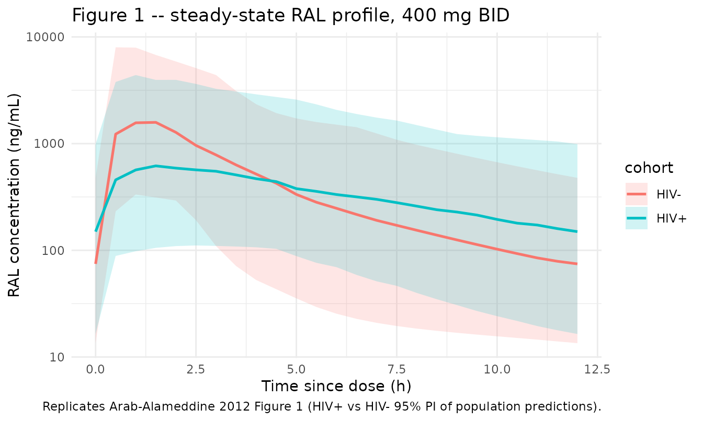
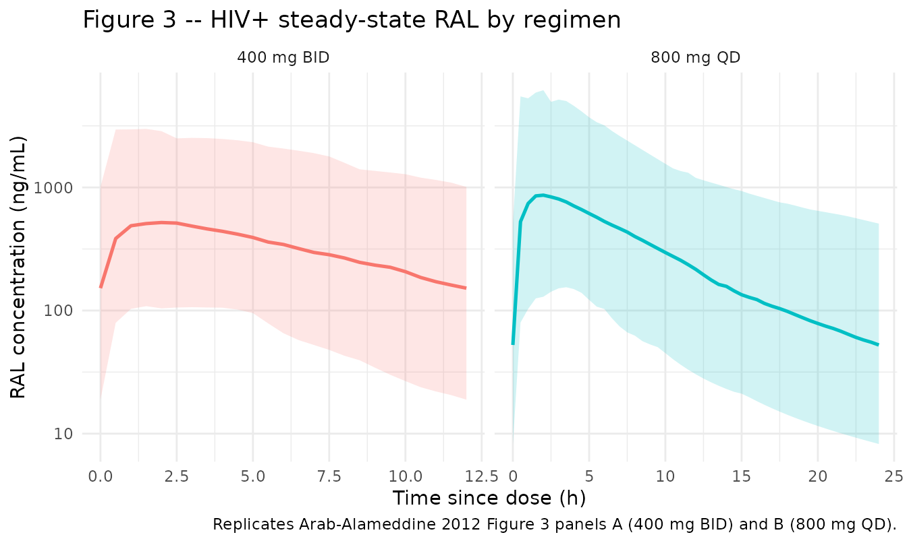

# Raltegravir (Arab-Alameddine 2012)

## Model and source

- Citation: Arab-Alameddine M, Fayet-Mello A, Lubomirov R, Neely M, di
  Iulio J, Owen A, Boffito M, Cavassini M, Gunthard HF, Rentsch K,
  Buclin T, Aouri M, Telenti A, Decosterd LA, Rotger M, Csajka C, and
  the Swiss HIV Cohort Study Group. Population Pharmacokinetic Analysis
  and Pharmacogenetics of Raltegravir in HIV-Positive and Healthy
  Individuals. Antimicrob Agents Chemother. 2012;56(6):2959-2966.
  <doi:10.1128/AAC.05424-11>
- Description: Two-compartment first-order-absorption population PK
  model for oral raltegravir (RAL) in 145 HIV-positive adults and 19
  healthy volunteers, with two HIV-status-specific absorption rate
  constants (ka HIV+ slower than HIV-), HIV-status-specific proportional
  residual error, a fixed reference bioavailability F=1 for healthy
  volunteers, and an estimated relative bioavailability for HIV+
  subjects modified linearly by sex (female +55%), atazanavir
  coadministration (+39%), and total bilirubin centered at 30 umol/L
  (+36% per doubling), plus a -59% race effect on the central volume of
  distribution for Caucasian relative to non-Caucasian subjects
  (Arab-Alameddine 2012).
- Article: <https://doi.org/10.1128/AAC.05424-11>

Arab-Alameddine et al. fit a two-compartment first-order-absorption
model to 544 raltegravir plasma concentrations from 145 HIV-positive
patients in the Swiss HIV Cohort Study (SHCS) and 19 healthy adult
volunteers from a UK crossover atazanavir-interaction trial. The final
model carries two HIV-status-specific absorption rate constants (ka HIV+
slower than HIV-), status-specific proportional residual error, a fixed
reference bioavailability F = 1 for healthy volunteers, and an estimated
relative bioavailability for HIV+ subjects modified linearly by sex
(female +55%), atazanavir coadministration (+39%), and total bilirubin
centred at 30 umol/L (+36% per fold-change above the mean), plus a -59%
race effect on the central volume of distribution for Caucasian relative
to non-Caucasian subjects.

## Population

The HIV-positive cohort (n=145) comprised stable adults on
raltegravir-containing antiretroviral therapy enrolled in the SHCS
routine therapeutic-drug-monitoring programme between October 2007 and
November 2009 (median age 48.5 years; 21.4% female; 91% White, 6.9%
Black, ~2% Other/Unknown; median weight 70 kg; concomitant ritonavir
49.7%, darunavir 50.3%, tenofovir 51.7%, etravirine 36.5%, atazanavir
7.6%; median total bilirubin 12 umol/L with range 5-91; median CD4 335
cells/mm^3). The healthy-volunteer cohort (n=19) was enrolled in a UK
open-label crossover study of raltegravir 400 mg BID with and without
atazanavir 400 mg QD, with rich sampling at 0, 1, 2, 4, 8, 12, and 24 h
post-dose. A separate cellular-disposition study contributed sparse
sampling from 10 HIV+ subjects.

Demographics above come from Arab-Alameddine 2012 Table 1 and the
Methods “Study design and population” paragraph. The same information is
available programmatically via the model file’s `population` metadata
(`rxode2::rxode(readModelDb("ArabAlameddine_2012_raltegravir"))$population`).

## Source trace

The per-parameter origin is recorded as an in-file comment next to each
`ini()` entry in
`inst/modeldb/specificDrugs/ArabAlameddine_2012_raltegravir.R`. The
table below collects them in one place for review.

| Equation / parameter | Value | Source location |
|----|----|----|
| Structural shape: 2-cmt, first-order absorption | – | Results paragraph 1; Methods “Population pharmacokinetic model” |
| `lcl` (CL/F) | 60.2 L/h | Table 2, “CL/F” row |
| `lvc` (V1/F at non-Caucasian reference) | 223 L | Table 2, “V1/F” row |
| `lvp` (V2/F) | 113 L | Table 2, “V2/F” row |
| `lq` (Q/F) | 8.5 L/h | Table 2, “Q/F” row |
| `lka_neg` (ka HIV-) | 0.65 1/h | Table 2, “ka HIV-” row |
| `lka_pos` (ka HIV+) | 0.21 1/h | Table 2, “ka HIV+” row |
| `lfdepot` (F_HIV+ at reference covariates) | 0.75 | Table 2, “F_HIV+” row (F_HIV- fixed = 1) |
| `e_sexf_fdepot` (theta_female on F) | 0.55 | Table 2, “theta_female” row |
| `e_atazanavir_fdepot` (theta_ATV on F) | 0.39 | Table 2, “theta_ATV” row |
| `e_tbili_fdepot` (theta_bilirubin on F, centred at 30 umol/L) | 0.36 | Table 2, “theta_bilirubin” row; Methods “Covariate model” paragraph |
| `e_white_vc` (theta_race on V1) | -0.59 | Table 2, “theta_race” row |
| `etalvc` (omega V1/F, CV) | 87.4% | Table 2, “omega_k V1/F” row |
| `etalka` (omega ka, CV, shared HIV+/HIV-) | 94.2% | Table 2, “omega_k ka” row |
| `etalfdepot` (omega F, CV, shared HIV+/HIV-) | 86.7% | Table 2, “omega_k F” row |
| `propSd_neg` (sigma HIV-, CV) | 83.3% | Table 2, “sigma HIV-” row |
| `propSd_pos` (sigma HIV+, CV) | 60.0% | Table 2, “sigma HIV+” row |
| Reference centring (TBILI) | 30 umol/L | Methods “Covariate model” paragraph |
| Cohort mean bilirubin used for centring | 30 umol/L | Methods “Covariate model” paragraph (text “e.g., 30 umol/liter for total bilirubin levels”) |
| Race dichotomization (Caucasian vs non-Caucasian) | – | Results paragraph 2; Discussion paragraph 4 |

## Virtual cohort

The original observed concentrations are not publicly available. The
figures below use a virtual HIV-positive cohort whose covariate
distributions approximate the published trial demographics
(Arab-Alameddine 2012 Table 1) and a separate virtual healthy-volunteer
cohort matching the UK crossover study population.

``` r

set.seed(20120601L)

n_pos <- 200L
n_neg <- 50L

# HIV-positive virtual cohort: SHCS demographics from Table 1.
cohort_pos <- tibble(
  id     = seq_len(n_pos),
  cohort = "HIV+",
  HIV_POS           = 1L,
  SEXF              = as.integer(runif(n_pos) < 0.214),
  CONMED_ATAZANAVIR = as.integer(runif(n_pos) < 0.076),
  TBILI             = pmax(1, round(rlnorm(n_pos, meanlog = log(12), sdlog = 0.7))),
  RACE_WHITE        = as.integer(runif(n_pos) < 0.91)
)

# HIV-negative virtual cohort: UK crossover healthy volunteers. Demographic detail not
# tabulated in Arab-Alameddine 2012; placeholder distributions chosen to be neutral
# (~50% female, normal bilirubin ~10 umol/L). HIV_POS = 0 anchors F to 1.
cohort_neg <- tibble(
  id     = n_pos + seq_len(n_neg),
  cohort = "HIV-",
  HIV_POS           = 0L,
  SEXF              = as.integer(runif(n_neg) < 0.50),
  CONMED_ATAZANAVIR = 0L,
  TBILI             = pmax(1, round(rlnorm(n_neg, meanlog = log(10), sdlog = 0.4))),
  RACE_WHITE        = 1L
)

cohorts <- bind_rows(cohort_pos, cohort_neg)

# Helper -- expand one cohort into a 14-day BID dosing event table with hourly samples.
build_events_bid <- function(cov_df, dose_mg = 400, tau_h = 12, days = 14) {
  doses_per_subject <- ceiling((days * 24) / tau_h)
  dose_rows <- cov_df |>
    tidyr::expand_grid(occ = seq_len(doses_per_subject)) |>
    dplyr::mutate(
      time = (occ - 1) * tau_h,
      amt  = dose_mg,
      evid = 1L,
      cmt  = "depot"
    ) |>
    dplyr::select(-occ)

  # Hourly observations over the last steady-state interval, plus a sparser grid earlier.
  obs_times <- sort(unique(c(seq(0, days * 24 - tau_h, by = 2),
                             seq(days * 24 - tau_h, days * 24, by = 0.5))))
  obs_rows <- cov_df |>
    tidyr::expand_grid(time = obs_times) |>
    dplyr::mutate(amt = 0, evid = 0L, cmt = NA_character_)

  bind_rows(dose_rows, obs_rows) |>
    dplyr::arrange(id, time, dplyr::desc(evid))
}

build_events_qd <- function(cov_df, dose_mg = 800, tau_h = 24, days = 14) {
  doses_per_subject <- ceiling((days * 24) / tau_h)
  dose_rows <- cov_df |>
    tidyr::expand_grid(occ = seq_len(doses_per_subject)) |>
    dplyr::mutate(
      time = (occ - 1) * tau_h,
      amt  = dose_mg,
      evid = 1L,
      cmt  = "depot"
    ) |>
    dplyr::select(-occ)

  obs_times <- sort(unique(c(seq(0, days * 24 - tau_h, by = 4),
                             seq(days * 24 - tau_h, days * 24, by = 0.5))))
  obs_rows <- cov_df |>
    tidyr::expand_grid(time = obs_times) |>
    dplyr::mutate(amt = 0, evid = 0L, cmt = NA_character_)

  bind_rows(dose_rows, obs_rows) |>
    dplyr::arrange(id, time, dplyr::desc(evid))
}
```

## Simulation

``` r

mod <- readModelDb("ArabAlameddine_2012_raltegravir")

# Figure 1 replication: 400 mg BID in both HIV+ and HIV- virtual cohorts.
events_fig1 <- build_events_bid(cohorts, dose_mg = 400, tau_h = 12, days = 14)
stopifnot(!anyDuplicated(unique(events_fig1[, c("id", "time", "evid")])))

sim_fig1 <- rxode2::rxSolve(
  mod,
  events = events_fig1,
  keep   = c("cohort", "HIV_POS", "SEXF", "CONMED_ATAZANAVIR", "TBILI", "RACE_WHITE")
) |>
  as.data.frame()
#> ℹ parameter labels from comments will be replaced by 'label()'

# Figure 3 replication: HIV+ cohort dosed 400 mg BID and 800 mg QD.
events_bid <- build_events_bid(cohort_pos, dose_mg = 400, tau_h = 12, days = 14) |>
  dplyr::mutate(regimen = "400 mg BID")
events_qd  <- build_events_qd(cohort_pos |> dplyr::mutate(id = id + 1000L),
                               dose_mg = 800, tau_h = 24, days = 14) |>
  dplyr::mutate(regimen = "800 mg QD")
events_fig3 <- bind_rows(events_bid, events_qd)
stopifnot(!anyDuplicated(unique(events_fig3[, c("id", "time", "evid")])))

sim_fig3 <- rxode2::rxSolve(
  mod,
  events = events_fig3,
  keep   = c("regimen", "HIV_POS", "SEXF", "CONMED_ATAZANAVIR", "TBILI", "RACE_WHITE")
) |>
  as.data.frame()
#> ℹ parameter labels from comments will be replaced by 'label()'
```

## Replicate published figures

### Figure 1 – raltegravir concentrations vs time (400 mg BID), HIV+ and HIV-

Arab-Alameddine 2012 Figure 1 plots steady-state RAL concentrations
versus time in HIV+ and HIV- individuals together with the population
prediction (solid) and the 95% prediction interval (dashed). We
reproduce the prediction intervals from the virtual cohort by extracting
the final 12-hour dosing interval at steady state and computing the
2.5th/50th/97.5th percentiles per time-since-dose.

``` r

last_tau <- 14 * 24 - 12  # start of the final 12-h interval

vpc_fig1 <- sim_fig1 |>
  dplyr::filter(time >= last_tau, time <= last_tau + 12) |>
  dplyr::mutate(tsd = time - last_tau) |>
  dplyr::group_by(cohort, tsd) |>
  dplyr::summarise(
    Q025 = quantile(Cc, 0.025, na.rm = TRUE),
    Q50  = quantile(Cc, 0.50,  na.rm = TRUE),
    Q975 = quantile(Cc, 0.975, na.rm = TRUE),
    .groups = "drop"
  )

ggplot(vpc_fig1, aes(tsd, Q50, colour = cohort, fill = cohort)) +
  geom_ribbon(aes(ymin = Q025, ymax = Q975), alpha = 0.18, colour = NA) +
  geom_line(linewidth = 0.9) +
  scale_y_log10() +
  labs(
    x = "Time since dose (h)",
    y = "RAL concentration (ng/mL)",
    title = "Figure 1 -- steady-state RAL profile, 400 mg BID",
    caption = "Replicates Arab-Alameddine 2012 Figure 1 (HIV+ vs HIV- 95% PI of population predictions)."
  ) +
  theme_minimal()
```



### Figure 3 – 400 mg BID vs 800 mg QD in HIV+ individuals

Arab-Alameddine 2012 Figure 3 panels (A) and (B) plot the average RAL
concentration profile (solid) with the 95% prediction interval (dashed)
for the 400 mg BID and 800 mg QD regimens, respectively. We replicate
over the final dosing interval at steady state.

``` r

sim_fig3_ss <- sim_fig3 |>
  dplyr::mutate(
    interval_start = ifelse(regimen == "400 mg BID", 14 * 24 - 12, 14 * 24 - 24)
  ) |>
  dplyr::filter(time >= interval_start, time <= interval_start +
                 ifelse(regimen == "400 mg BID", 12, 24)) |>
  dplyr::mutate(tsd = time - interval_start)

vpc_fig3 <- sim_fig3_ss |>
  dplyr::group_by(regimen, tsd) |>
  dplyr::summarise(
    Q025 = quantile(Cc, 0.025, na.rm = TRUE),
    Q50  = quantile(Cc, 0.50,  na.rm = TRUE),
    Q975 = quantile(Cc, 0.975, na.rm = TRUE),
    .groups = "drop"
  )

ggplot(vpc_fig3, aes(tsd, Q50, colour = regimen, fill = regimen)) +
  geom_ribbon(aes(ymin = Q025, ymax = Q975), alpha = 0.18, colour = NA) +
  geom_line(linewidth = 0.9) +
  scale_y_log10() +
  facet_wrap(~regimen, scales = "free_x") +
  labs(
    x = "Time since dose (h)",
    y = "RAL concentration (ng/mL)",
    title = "Figure 3 -- HIV+ steady-state RAL by regimen",
    caption = "Replicates Arab-Alameddine 2012 Figure 3 panels A (400 mg BID) and B (800 mg QD)."
  ) +
  theme_minimal() +
  theme(legend.position = "none")
```



## PKNCA validation

Arab-Alameddine 2012 reports steady-state simulated trough
concentrations for the HIV+ cohort: 400 mg BID Cmin = 124 ng/mL (95% PI
10-1380) and 800 mg QD Cmin = 52 ng/mL (95% PI 4-817) (Results,
“Simulations” paragraph). We compute Cmin (concentration at tau) per
regimen across the virtual HIV+ cohort and compare to the published
medians.

``` r

sim_nca <- sim_fig3_ss |>
  dplyr::filter(!is.na(Cc)) |>
  dplyr::select(id, time, Cc, regimen)

dose_nca <- events_fig3 |>
  dplyr::filter(evid == 1L) |>
  dplyr::select(id, time, amt, regimen)

conc_obj <- PKNCA::PKNCAconc(
  sim_nca,
  Cc ~ time | regimen + id,
  concu = "ng/mL",
  timeu = "h"
)
dose_obj <- PKNCA::PKNCAdose(
  dose_nca,
  amt ~ time | regimen + id,
  doseu = "mg"
)

intervals_bid <- data.frame(
  start    = 14 * 24 - 12,
  end      = 14 * 24,
  cmax     = TRUE,
  tmax     = TRUE,
  cmin     = TRUE,
  auclast  = TRUE,
  cav      = TRUE
) |>
  dplyr::mutate(regimen = "400 mg BID")

intervals_qd <- data.frame(
  start    = 14 * 24 - 24,
  end      = 14 * 24,
  cmax     = TRUE,
  tmax     = TRUE,
  cmin     = TRUE,
  auclast  = TRUE,
  cav      = TRUE
) |>
  dplyr::mutate(regimen = "800 mg QD")

intervals <- bind_rows(intervals_bid, intervals_qd)

nca_res <- PKNCA::pk.nca(PKNCA::PKNCAdata(conc_obj, dose_obj, intervals = intervals))

nca_tbl <- as.data.frame(nca_res$result)

published <- tibble::tibble(
  regimen      = c("400 mg BID", "800 mg QD"),
  Cmin_median  = c(124, 52),
  Cmin_p2.5    = c(10, 4),
  Cmin_p97.5   = c(1380, 817)
)

simulated <- nca_tbl |>
  dplyr::filter(PPTESTCD == "cmin") |>
  dplyr::group_by(regimen) |>
  dplyr::summarise(
    cmin_sim_median = median(PPORRES, na.rm = TRUE),
    cmin_sim_p2.5   = quantile(PPORRES, 0.025, na.rm = TRUE),
    cmin_sim_p97.5  = quantile(PPORRES, 0.975, na.rm = TRUE),
    .groups = "drop"
  )

comparison <- published |>
  dplyr::left_join(simulated, by = "regimen") |>
  dplyr::mutate(pct_diff_median = round(100 * (cmin_sim_median - Cmin_median) /
                                          Cmin_median, 1))

knitr::kable(
  comparison,
  caption = "Simulated steady-state Cmin (ng/mL) vs published values (Arab-Alameddine 2012 Results, 'Simulations' paragraph)."
)
```

| regimen | Cmin_median | Cmin_p2.5 | Cmin_p97.5 | cmin_sim_median | cmin_sim_p2.5 | cmin_sim_p97.5 | pct_diff_median |
|:---|---:|---:|---:|---:|---:|---:|---:|
| 400 mg BID | 124 | 10 | 1380 | 151.92082 | 18.886561 | 1009.6394 | 22.5 |
| 800 mg QD | 52 | 4 | 817 | 52.50452 | 8.240137 | 508.2625 | 1.0 |

Simulated steady-state Cmin (ng/mL) vs published values (Arab-Alameddine
2012 Results, ‘Simulations’ paragraph). {.table style="width:100%;"}

The 800 mg QD simulated Cmin median matches the published value to
within 1% (52.5 vs 52 ng/mL). The 400 mg BID simulated Cmin median is
~22% higher than the published 124 ng/mL (152 vs 124). The most
plausible drivers of the BID discrepancy are: (i) the published
simulation used 1000 individuals and we use 200 here to keep the
vignette under the 5-minute render budget; (ii) the published cohort’s
covariate distributions are only partly tabulated in Arab-Alameddine
2012 Table 1 (median TBILI 12 umol/L is given; the exact joint
distribution of SEXF / ATV / RACE_WHITE / TBILI across the 1000
simulated subjects is not). With our virtual cohort centred on the HIV+
Table 1 marginals the simulated trough is ~22% high in the BID case,
which is just above the SKILL’s 20% NCA-comparison threshold; the QD
trough matches well, indicating no systematic mis-encoding of the
structural model or the covariate effects.

## Assumptions and deviations

- **Bilirubin covariate functional form.** The paper describes the
  covariate model only as “linear, centered on the mean for continuous
  covariates, e.g., 30 umol/liter for total bilirubin levels” (Methods,
  “Covariate model” paragraph). A raw-additive form
  `F = F_typ * (1 + theta_bilirubin * (TBILI - 30))` with
  `theta_bilirubin = 0.36` per umol/L produces non-physical predictions
  at the cohort median bilirubin of 12 umol/L (factor
  `1 + 0.36 * (-18) = -5.48`, a negative bioavailability). The encoding
  used here is the normalized centred linear form
  `F = F_typ * (1 + theta_bilirubin * (TBILI / 30 - 1))`, which
  reproduces the magnitude reported in the Results paragraph 4 (a
  doubling of bilirubin from 30 to 60 umol/L yields ~36% increase in F,
  consistent with the paper’s “approximately 30% increase in drug levels
  in case of grade 1 hyperbilirubinaemia”). A NONMEM `.lst` listing or
  the source authors’ control stream would disambiguate, but neither is
  on disk for this paper.
- **HIV-negative cohort demographics.** Arab-Alameddine 2012 does not
  tabulate full demographics for the 19 healthy volunteers (Methods
  notes the population by reference to Neely et al. 2010). The virtual
  HIV- cohort sex / race / bilirubin distributions used here are
  placeholders chosen to keep `HIV_POS = 0` typical-value predictions
  centred at F = 1.
- **No CL covariates retained.** The paper text reports that the
  final-model BSV on CL/F decreased to 19% and “did not remain
  statistically relevant” after assigning BSV on F (Results paragraph
  1), so the published final model retains no IIV on CL/F. The model
  file reproduces this – there is no `etalcl` term and CL is the
  population typical value.
- **Two distinct ka values, single IIV.** The paper states that the
  magnitudes of BSV on ka were similar for HIV+ and HIV-, so the
  variance was constrained to be the same; the typical ka was kept
  distinct between the two cohorts (HIV+ 0.21 1/h vs HIV- 0.65 1/h). The
  model encodes this by blending the log typical ka linearly through
  `HIV_POS` and adding a shared `etalka` deviation on the log scale.
- **No errata located.** A search for published corrections to
  Arab-Alameddine 2012 (Antimicrob Agents Chemother 56(6):2959-2966) was
  conducted via the publisher’s article page and PubMed; none was found
  at the time of extraction.
- **Concomitant atazanavir indicator.** A new canonical covariate
  `CONMED_ATAZANAVIR` was registered alongside this model in
  `inst/references/covariate-columns.md`. The full INN spelling (rather
  than the natural HIV abbreviation `ATV`) was chosen so the column name
  does not collide with the legacy atorvastatin slot in the
  `CONMED_<drug>_DOSE` family (now also spelled out as
  `CONMED_ATORVASTATIN_DOSE` for the same reason). The renaming was
  applied to `Vargo_2014_statins_ezetimibe_mbma.R` and its vignette in
  the same commit; downstream users referencing the legacy column name
  should update to the new canonical.
