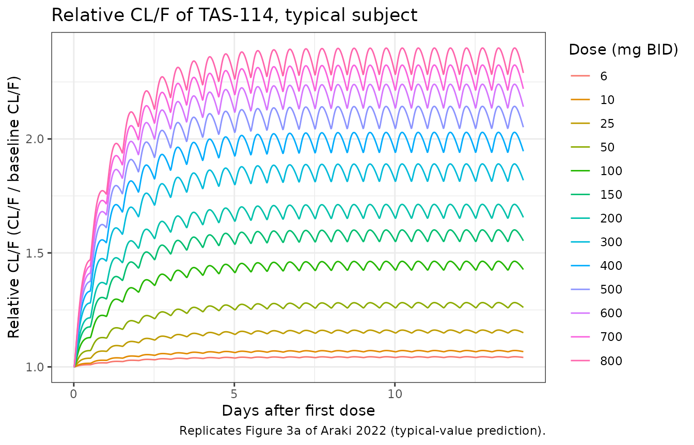
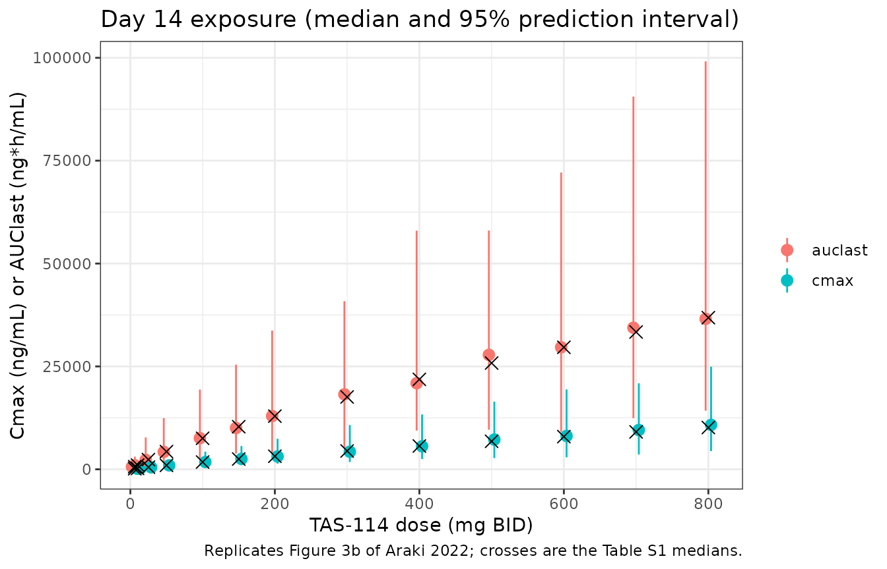
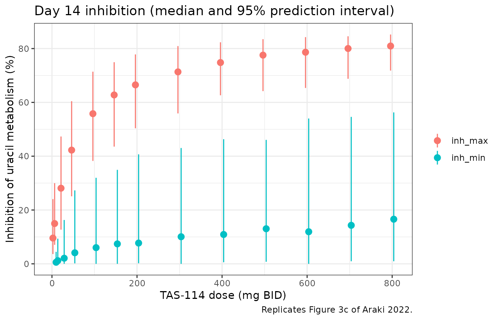

# TAS-114 (Araki 2022)

## Model and source

- Citation: Araki H, Takenaka T, Takahashi K, Yamashita F, Matsuoka K,
  Yoshisue K, Ieiri I. A semimechanistic population pharmacokinetic and
  pharmacodynamic model incorporating autoinduction for the dose
  justification of TAS-114. CPT Pharmacometrics Syst Pharmacol.
  2022;11(5):604-615. <doi:10.1002/psp4.12747>
- Description: Semimechanistic population PK/PD model of oral TAS-114
  (dual dUTPase / dihydropyrimidine dehydrogenase inhibitor) in healthy
  adult men and adults with advanced solid tumours (Araki 2022). TAS-114
  follows a two-compartment model with first-order absorption and an
  absorption lag; clearance is scaled by the relative amount of a
  metabolising enzyme (CYP3A) whose zero-order synthesis is stimulated
  by the central TAS-114 concentration through an Emax function
  (enzyme-turnover autoinduction). Age (power) and AST (exponential) act
  on CL/F and body surface area (exponential) on Vc/F. Plasma uracil,
  the endogenous DPD substrate, follows an indirect-response model in
  which TAS-114 inhibits the first-order uracil elimination (Imax model)
  with the elimination rate fixed from the literature uracil half-life.
- Article: <https://doi.org/10.1002/psp4.12747> (open access; the
  supporting information holds the NONMEM code of the final PK model,
  Text S1, and of the PK/PD model, Text S2, plus the simulated
  dose-exposure summary, Table S1)

TAS-114 is an oral dual inhibitor of deoxyuridine triphosphatase
(dUTPase) and dihydropyrimidine dehydrogenase (DPD), developed to widen
the therapeutic index of capecitabine. It is metabolised mainly by
CYP3A4 and induces CYP3A, so its exposure falls over repeated dosing.
Araki et al. described this autoinduction with an enzyme-turnover model
and linked TAS-114 to the plasma concentration of uracil, the endogenous
DPD substrate, through an indirect-response model.

## Population

The PK model was fit to 2661 plasma TAS-114 concentrations from 185
subjects in four studies (Table 1): healthy Japanese men given single
doses or 14 days of twice-daily dosing (study 10057010, n = 28), and
adults with advanced solid tumours given TAS-114 twice daily for 14 days
of a 21-day cycle with S-1 (10057020, n = 68; TPU-TAS-114-102, n = 48)
or capecitabine (TPU-TAS-114-101, n = 41). Doses ranged from 6 to 800 mg
(median 270 mg). Table 2 gives the demographics: median age 59 years
(20-81), weight 62 kg (36-119), body surface area 1.70 m^2 (1.25-2.35),
AST 24 U/L (7-140); 106 men and 79 women; 96 Japanese, 77 Caucasian, 7
African American and 5 other. The uracil PD model was fit to 240 plasma
uracil concentrations from the 24 healthy men of study 10057010 who had
uracil sampled.

The same information is available programmatically via
`readModelDb("Araki_2022_TAS114")()$population`.

## Source trace

| Equation / parameter | Value | Source location |
|----|----|----|
| `lka` | log(0.508) 1/h | Table 3 |
| `lvc` | log(17.0) L | Table 3 |
| `lvp` | log(10.5) L | Table 3 |
| `lq` | log(4.02) L/h | Table 3 |
| `lcl` | log(8.74) L/h | Table 3 |
| `ltlag` | log(0.217) h | Table 3 |
| `lemax` | log(4.69) | Table 3 |
| `lec50` | log(5870) ng/mL | Table 3 |
| `lkenz` | log(0.0230) 1/h | Table 3 |
| `e_bsa_vc` | 1.52 | Table 3; exponential form `EXP(THETA(1)*(BSA - 1.7))` from Text S1 |
| `e_ast_cl` | -0.00753 | Table 3; exponential form `EXP(THETA(2)*(AST - 24))` from Text S1 |
| `e_age_cl` | -0.983 | Table 3; power form `(AGE/59)**THETA(3)` from Text S1 |
| `etalka`, `etalvc`, `etalcl` | 0.04316, 0.39692, 0.35882 | Table 3 CV% 21.0 / 69.8 / 65.7 as log(1 + CV^2); match Text S1 `$OMEGA` |
| `propSd` | 0.37177 | Text S1 `$THETA` 13 (see Assumptions) |
| `lkout` | log(2.67) 1/h, not estimated | Table 4 |
| `lic50` | log(1046) ng/mL | Table 4 |
| `limax` | log(0.888) | Table 4 |
| `lrbase` | log(9.27) ng/mL | Table 4 |
| `etalrbase` | 0.02344 | Table 4 CV% 15.4 as log(1 + CV^2) |
| `propSd_uracil` | 0.159 | Table 4, 0.399^2 (see Assumptions) |
| `d/dt(enzyme) = kenz * (1 + Emax*Cc/(EC50 + Cc)) - kenz * enzyme` | n/a | Methods enzyme-turnover equations; Text S1 `$DES` |
| `d/dt(central)`: elimination `kel * enzyme * central` | n/a | Text S1 `$DES` (`K20*A(2)*A(4)`); Results (“linear relationship”) |
| `d/dt(uracil) = kin - kout * (1 - Imax*Cc/(IC50 + Cc)) * uracil` | n/a | Text S2 `$DES`; Figure 1 |
| `enzyme(0) = 1`, `uracil(0) = rbase`, `kin = kout * rbase` | n/a | Text S1 / S2 `A_0(4)`, `A_0(5)`, `KIN` |

## Typical-value reproduction of Table S1 (relative CL/F)

The relative CL/F (CL/F divided by its pre-dose value) equals the
relative enzyme amount, which depends only on the TAS-114 concentration
through the induction parameters. Table S1 reports its median minimum
and maximum over Day 14 after 14 days of twice-daily dosing at 13 doses.
A typical subject at the covariate medians reproduces them closely.

``` r

mod <- readModelDb("Araki_2022_TAS114")

doses <- c(6, 10, 25, 50, 100, 150, 200, 300, 400, 500, 600, 700, 800)
cov_median <- c(AGE = 59, AST = 24, BSA = 1.7)

# Observation rows go on the `uracil` state: it is both an ODE state and a
# declared endpoint, so the two-endpoint model accepts it, and Cc and
# `enzyme` come back at every row.
make_bid_events <- function(dose, obs_times) {
  rxode2::et(amt = dose, ii = 12, addl = 27, cmt = "depot") |>
    rxode2::et(obs_times, cmt = "uracil")
}

typ <- lapply(doses, function(d) {
  s <- rxode2::rxSolve(
    mod, make_bid_events(d, seq(0, 336, by = 0.25)),
    params = cov_median, omega = NA, sigma = NA, useLinCmt = FALSE,
    returnType = "data.frame"
  )
  s$dose <- d
  s
}) |>
  dplyr::bind_rows()
#> ℹ parameter labels from comments will be replaced by 'label()'

table_s1 <- tibble::tribble(
  ~dose, ~rel_min, ~rel_max, ~cmax, ~auclast, ~inh_min, ~inh_max,
  6, 1.041, 1.044, 132, 627, 0.7, 11.0,
  10, 1.066, 1.071, 216, 1018, 1.1, 16.7,
  25, 1.148, 1.159, 513, 2361, 2.4, 31.6,
  50, 1.258, 1.278, 962, 4301, 3.9, 45.2,
  100, 1.423, 1.457, 1763, 7534, 5.8, 58.2,
  150, 1.552, 1.593, 2494, 10353, 7.2, 65.0,
  200, 1.654, 1.705, 3175, 12919, 8.2, 69.1,
  300, 1.816, 1.883, 4454, 17577, 9.9, 73.9,
  400, 1.944, 2.020, 5663, 21854, 11.3, 76.7,
  500, 2.051, 2.137, 6805, 25820, 12.4, 78.5,
  600, 2.144, 2.234, 7942, 29649, 13.5, 79.9,
  700, 2.226, 2.319, 9087, 33367, 14.4, 80.8,
  800, 2.297, 2.394, 10146, 36848, 15.2, 81.6
)

rel_cl <- typ |>
  dplyr::filter(time >= 312, time <= 324) |>
  dplyr::group_by(dose) |>
  dplyr::summarise(sim_min = min(enzyme), sim_max = max(enzyme), .groups = "drop") |>
  dplyr::left_join(table_s1 |> dplyr::select(dose, rel_min, rel_max), by = "dose") |>
  dplyr::mutate(
    pct_min = 100 * (sim_min / rel_min - 1),
    pct_max = 100 * (sim_max / rel_max - 1)
  )

rel_cl |>
  dplyr::rename(
    "Dose (mg)" = dose,
    "Simulated min" = sim_min, "Simulated max" = sim_max,
    "Table S1 min" = rel_min, "Table S1 max" = rel_max,
    "Diff min (%)" = pct_min, "Diff max (%)" = pct_max
  ) |>
  knitr::kable(digits = 3, caption = "Relative CL/F on Day 14: typical subject vs. Table S1 medians.")
```

| Dose (mg) | Simulated min | Simulated max | Table S1 min | Table S1 max | Diff min (%) | Diff max (%) |
|---:|---:|---:|---:|---:|---:|---:|
| 6 | 1.041 | 1.045 | 1.041 | 1.044 | 0.020 | 0.051 |
| 10 | 1.066 | 1.072 | 1.066 | 1.071 | 0.037 | 0.077 |
| 25 | 1.149 | 1.162 | 1.148 | 1.159 | 0.087 | 0.224 |
| 50 | 1.259 | 1.282 | 1.258 | 1.278 | 0.107 | 0.316 |
| 100 | 1.425 | 1.463 | 1.423 | 1.457 | 0.128 | 0.432 |
| 150 | 1.550 | 1.601 | 1.552 | 1.593 | -0.107 | 0.499 |
| 200 | 1.653 | 1.713 | 1.654 | 1.705 | -0.084 | 0.469 |
| 300 | 1.815 | 1.890 | 1.816 | 1.883 | -0.076 | 0.391 |
| 400 | 1.942 | 2.029 | 1.944 | 2.020 | -0.126 | 0.443 |
| 500 | 2.046 | 2.143 | 2.051 | 2.137 | -0.226 | 0.279 |
| 600 | 2.136 | 2.240 | 2.144 | 2.234 | -0.380 | 0.265 |
| 700 | 2.214 | 2.324 | 2.226 | 2.319 | -0.539 | 0.228 |
| 800 | 2.283 | 2.399 | 2.297 | 2.394 | -0.591 | 0.207 |

Relative CL/F on Day 14: typical subject vs. Table S1 medians. {.table
style="width:100%;"}

``` r


# Deterministic solve, so a tight bound is appropriate. Measured maximum
# absolute difference is about 0.7%; a mis-transcribed Emax, EC50 or kenz,deg
# moves these values by several percent.
stopifnot(nrow(rel_cl) == length(doses))
stopifnot(max(abs(c(rel_cl$pct_min, rel_cl$pct_max))) < 2)
```

### Figure 3a: relative CL/F over 14 days

``` r

typ |>
  dplyr::filter(time <= 336) |>
  ggplot(aes(time / 24, enzyme, group = dose, colour = factor(dose))) +
  geom_line() +
  labs(
    x = "Days after first dose", y = "Relative CL/F (CL/F / baseline CL/F)",
    colour = "Dose (mg BID)",
    title = "Relative CL/F of TAS-114, typical subject",
    caption = "Replicates Figure 3a of Araki 2022 (typical-value prediction)."
  ) +
  theme_bw()
```



## Virtual cohort

Observed data are not public. The stochastic simulations use 200 virtual
subjects per dose, with age, AST and body surface area drawn to
approximate Table 2 (median and range); the covariates are independent
of one another, which the paper does not report.

Table S1 was generated the way NONMEM’s `$SIMULATION` generates data: as
simulated *observations*, residual error included, at the planned
sampling times. The Day 14 grid below is the clinical one of Table 1
(pre-dose, 0.5, 1, 2, 4, 6, 8 and 12 h). Cmax taken from noisy samples
sits above the Cmax of the noise-free profile and the minimum inhibition
sits below it, while AUClast is almost unaffected; with that design the
model reproduces all of Table S1 (the noise-free comparison
underestimates Cmax by about 12% and overestimates the minimum
inhibition by about 3 percentage points).

``` r

rxode2::rxSetSeed(20220511)
set.seed(20220511)
n_per_dose <- 200

draw_trunc <- function(n, draw, lo, hi) {
  x <- draw(n)
  while (any(bad <- x < lo | x > hi)) x[bad] <- draw(sum(bad))
  x
}

covs <- tibble::tibble(
  id = seq_len(n_per_dose * length(doses)),
  dose_mg = rep(doses, each = n_per_dose),
  AGE = draw_trunc(length(id), function(n) rnorm(n, 59, 11), 20, 81),
  AST = draw_trunc(length(id), function(n) rlnorm(n, log(24), 0.4), 7, 140),
  BSA = draw_trunc(length(id), function(n) rnorm(n, 1.70, 0.20), 1.25, 2.35)
)

day14_grid <- 312 + c(0, 0.5, 1, 2, 4, 6, 8, 12)
obs_times <- c(seq(0, 12, by = 0.5), day14_grid)
dose_rows <- covs |>
  tidyr::crossing(time = seq(0, 324, by = 12)) |>
  dplyr::mutate(evid = 1L, amt = dose_mg, cmt = "depot")
obs_rows <- covs |>
  tidyr::crossing(time = obs_times) |>
  dplyr::mutate(evid = 0L, amt = NA_real_, cmt = "uracil")
events <- dplyr::bind_rows(dose_rows, obs_rows) |>
  dplyr::arrange(id, time, dplyr::desc(evid))

stopifnot(!anyDuplicated(events[, c("id", "time", "evid")]))
stopifnot(all(table(covs$dose_mg) == n_per_dose))
```

## Simulation

``` r

sim <- rxode2::rxSolve(
  mod, events = events, keep = c("dose_mg"), useLinCmt = FALSE,
  returnType = "data.frame"
) |>
  dplyr::mutate(treatment = paste(dose_mg, "mg"))

# Simulated TAS-114 observations: proportional residual error added in base R
# (seeded above), so the same draws serve both residual-error readings
# compared later. An error draw below -1/SD would give a negative
# concentration; such values are floored at zero.
prop_sd <- rxode2::rxode(mod)$iniDf
#> ℹ parameter labels from comments will be replaced by 'label()'
prop_sd <- prop_sd$est[prop_sd$name == "propSd"]
eps <- rnorm(nrow(sim))
sim <- sim |>
  dplyr::mutate(
    dv = pmax(Cc * (1 + prop_sd * eps), 0),
    dv_table = pmax(Cc * (1 + 0.610 * eps), 0)
  )
```

## PKNCA validation (Day 14, Figure 3b)

Table S1 reports the median Cmax and AUClast over the Day 14 dosing
interval (Days 14 to 14.5) after twice-daily dosing.

``` r

sim_nca <- sim |>
  dplyr::filter(!is.na(dv), time >= 312) |>
  dplyr::select(id, time, dv, treatment)

dose_df <- events |>
  dplyr::filter(evid == 1) |>
  dplyr::mutate(treatment = paste(dose_mg, "mg")) |>
  dplyr::select(id, time, amt, treatment)

conc_obj <- PKNCA::PKNCAconc(sim_nca, dv ~ time | treatment + id)
dose_obj <- PKNCA::PKNCAdose(dose_df, amt ~ time | treatment + id)
intervals <- data.frame(start = 312, end = 324, cmax = TRUE, auclast = TRUE)
nca_res <- PKNCA::pk.nca(PKNCA::PKNCAdata(conc_obj, dose_obj, intervals = intervals))

published <- table_s1 |>
  dplyr::transmute(treatment = paste(dose, "mg"), cmax, auclast)

cmp <- nlmixr2lib::ncaComparisonTable(
  simulated = nca_res,
  reference = published,
  by = "treatment",
  units = c(cmax = "ng/mL", auclast = "ng*h/mL"),
  tolerance_pct = 20
)
knitr::kable(
  cmp,
  caption = "Day 14 simulated median vs. Table S1 median. * differs by >20%."
)
```

| NCA parameter      | treatment | Reference | Simulated | % diff |
|:-------------------|:----------|:----------|:----------|:-------|
| Cmax (ng/mL)       | 6 mg      | 132       | 126       | -4.3%  |
| Cmax (ng/mL)       | 10 mg     | 216       | 212       | -1.8%  |
| Cmax (ng/mL)       | 25 mg     | 513       | 484       | -5.6%  |
| Cmax (ng/mL)       | 50 mg     | 962       | 950       | -1.2%  |
| Cmax (ng/mL)       | 100 mg    | 1760      | 1770      | +0.3%  |
| Cmax (ng/mL)       | 150 mg    | 2490      | 2520      | +1.1%  |
| Cmax (ng/mL)       | 200 mg    | 3180      | 3120      | -1.7%  |
| Cmax (ng/mL)       | 300 mg    | 4450      | 4270      | -4.1%  |
| Cmax (ng/mL)       | 400 mg    | 5660      | 5590      | -1.3%  |
| Cmax (ng/mL)       | 500 mg    | 6800      | 7220      | +6.1%  |
| Cmax (ng/mL)       | 600 mg    | 7940      | 8100      | +2.0%  |
| Cmax (ng/mL)       | 700 mg    | 9090      | 9540      | +5.0%  |
| Cmax (ng/mL)       | 800 mg    | 10100     | 10800     | +6.3%  |
| AUClast (ng\*h/mL) | 6 mg      | 627       | 614       | -2.0%  |
| AUClast (ng\*h/mL) | 10 mg     | 1020      | 981       | -3.6%  |
| AUClast (ng\*h/mL) | 25 mg     | 2360      | 2290      | -3.1%  |
| AUClast (ng\*h/mL) | 50 mg     | 4300      | 4220      | -1.8%  |
| AUClast (ng\*h/mL) | 100 mg    | 7530      | 7570      | +0.5%  |
| AUClast (ng\*h/mL) | 150 mg    | 10400     | 10000     | -3.1%  |
| AUClast (ng\*h/mL) | 200 mg    | 12900     | 12900     | +0.2%  |
| AUClast (ng\*h/mL) | 300 mg    | 17600     | 18200     | +3.6%  |
| AUClast (ng\*h/mL) | 400 mg    | 21900     | 20900     | -4.2%  |
| AUClast (ng\*h/mL) | 500 mg    | 25800     | 27800     | +7.7%  |
| AUClast (ng\*h/mL) | 600 mg    | 29600     | 29700     | +0.0%  |
| AUClast (ng\*h/mL) | 700 mg    | 33400     | 34400     | +3.1%  |
| AUClast (ng\*h/mL) | 800 mg    | 36800     | 36600     | -0.8%  |

Day 14 simulated median vs. Table S1 median. \* differs by \>20%.
{.table}

``` r

nca_med <- as.data.frame(nca_res) |>
  dplyr::filter(PPTESTCD %in% c("cmax", "auclast")) |>
  dplyr::group_by(treatment, PPTESTCD) |>
  dplyr::summarise(sim = median(PPORRES), .groups = "drop") |>
  tidyr::pivot_wider(names_from = PPTESTCD, values_from = sim) |>
  dplyr::left_join(published, by = "treatment", suffix = c("_sim", "_pub")) |>
  dplyr::mutate(
    pct_cmax = 100 * (cmax_sim / cmax_pub - 1),
    pct_auc = 100 * (auclast_sim / auclast_pub - 1)
  )
stopifnot(nrow(nca_med) == length(doses))
# Medians of 200 subjects with ~66% CV on CL/F carry a ~6% standard error.
# Centre: a mis-transcribed CL/F, volume or the mg -> ng/mL factor moves every
# dose by tens of percent. Envelope: robust to which dose lands in the tail.
stopifnot(
  abs(median(c(nca_med$pct_cmax, nca_med$pct_auc))) < 10,
  quantile(abs(c(nca_med$pct_cmax, nca_med$pct_auc)), 0.9) < 20
)
```

``` r

as.data.frame(nca_res) |>
  dplyr::filter(PPTESTCD %in% c("cmax", "auclast")) |>
  dplyr::mutate(dose = as.numeric(sub(" mg", "", treatment))) |>
  dplyr::group_by(dose, PPTESTCD) |>
  dplyr::summarise(
    Q50 = median(PPORRES), Q025 = quantile(PPORRES, 0.025),
    Q975 = quantile(PPORRES, 0.975), .groups = "drop"
  ) |>
  ggplot(aes(dose, Q50, colour = PPTESTCD)) +
  geom_pointrange(aes(ymin = Q025, ymax = Q975), position = position_dodge(width = 15)) +
  geom_point(
    data = table_s1 |>
      tidyr::pivot_longer(c(cmax, auclast), names_to = "PPTESTCD", values_to = "Q50"),
    shape = 4, size = 3, colour = "black"
  ) +
  labs(
    x = "TAS-114 dose (mg BID)", y = "Cmax (ng/mL) or AUClast (ng*h/mL)",
    colour = NULL,
    title = "Day 14 exposure (median and 95% prediction interval)",
    caption = "Replicates Figure 3b of Araki 2022; crosses are the Table S1 medians."
  ) +
  theme_bw()
#> Warning: `position_dodge()` requires non-overlapping x intervals.
```



## DPD inhibition on Day 14 (Figure 3c)

The inhibition percentage of TAS-114-mediated uracil metabolism is
`100 * Imax * C / (IC50 + C)`, the fractional reduction of the uracil
elimination rate, here evaluated at the simulated Day 14 TAS-114
observations. Its minimum and maximum per subject are summarised by
dose.

``` r

inhib_pct <- function(conc, imax, ic50) 100 * imax * conc / (ic50 + conc)
day14 <- sim |> dplyr::filter(time %in% day14_grid)

inh <- day14 |>
  dplyr::mutate(inh = inhib_pct(dv, imax, ic50)) |>
  dplyr::group_by(id, dose_mg) |>
  dplyr::summarise(inh_min = min(inh), inh_max = max(inh), .groups = "drop")

inh_sum <- inh |>
  tidyr::pivot_longer(c(inh_min, inh_max), names_to = "stat", values_to = "inh") |>
  dplyr::group_by(dose_mg, stat) |>
  dplyr::summarise(
    Q50 = median(inh), Q025 = quantile(inh, 0.025), Q975 = quantile(inh, 0.975),
    .groups = "drop"
  )

inh_cmp <- inh_sum |>
  dplyr::select(dose = dose_mg, stat, Q50) |>
  tidyr::pivot_wider(names_from = stat, values_from = Q50) |>
  dplyr::left_join(table_s1 |> dplyr::select(dose, pub_min = inh_min, pub_max = inh_max), by = "dose")

inh_cmp |>
  dplyr::select(dose, inh_min, inh_max, pub_min, pub_max) |>
  dplyr::rename(
    "Dose (mg)" = dose, "Simulated min (%)" = inh_min, "Simulated max (%)" = inh_max,
    "Table S1 min (%)" = pub_min, "Table S1 max (%)" = pub_max
  ) |>
  knitr::kable(digits = 1, caption = "Median Day 14 inhibition of uracil metabolism vs. Table S1.")
```

| Dose (mg) | Simulated min (%) | Simulated max (%) | Table S1 min (%) | Table S1 max (%) |
|---:|---:|---:|---:|---:|
| 6 | 0.6 | 9.6 | 0.7 | 11.0 |
| 10 | 1.2 | 15.0 | 1.1 | 16.7 |
| 25 | 2.1 | 28.1 | 2.4 | 31.6 |
| 50 | 4.1 | 42.3 | 3.9 | 45.2 |
| 100 | 6.0 | 55.8 | 5.8 | 58.2 |
| 150 | 7.4 | 62.8 | 7.2 | 65.0 |
| 200 | 7.7 | 66.5 | 8.2 | 69.1 |
| 300 | 10.1 | 71.3 | 9.9 | 73.9 |
| 400 | 10.9 | 74.8 | 11.3 | 76.7 |
| 500 | 13.0 | 77.6 | 12.4 | 78.5 |
| 600 | 11.9 | 78.6 | 13.5 | 79.9 |
| 700 | 14.3 | 80.0 | 14.4 | 80.8 |
| 800 | 16.6 | 81.0 | 15.2 | 81.6 |

Median Day 14 inhibition of uracil metabolism vs. Table S1. {.table}

``` r


# Absolute percentage-point differences (the minimum is small at low doses,
# where a relative difference would be meaningless). A mis-transcribed IC50
# or Imax shifts every dose by many points.
stopifnot(
  nrow(inh_cmp) == length(doses),
  abs(median(inh_cmp$inh_max - inh_cmp$pub_max)) < 4,
  abs(median(inh_cmp$inh_min - inh_cmp$pub_min)) < 2.5,
  quantile(abs(c(inh_cmp$inh_max - inh_cmp$pub_max, inh_cmp$inh_min - inh_cmp$pub_min)), 0.9) < 6
)

ggplot(inh_sum, aes(dose_mg, Q50, colour = stat)) +
  geom_pointrange(aes(ymin = Q025, ymax = Q975), position = position_dodge(width = 15)) +
  labs(
    x = "TAS-114 dose (mg BID)", y = "Inhibition of uracil metabolism (%)", colour = NULL,
    title = "Day 14 inhibition (median and 95% prediction interval)",
    caption = "Replicates Figure 3c of Araki 2022."
  ) +
  theme_bw()
#> Warning: `position_dodge()` requires non-overlapping x intervals.
```



The simulated maximum inhibition flattens near 80% from about 600 mg,
the maximum tolerated dose, while Cmax and AUClast keep rising, which is
the dose justification the paper draws.

## Residual-error scale (Figure 2)

Tables 3 and 4 print the proportional residual errors as “CV%” values of
61.0 and 39.9. The NONMEM code in Text S1 and S2 writes the error as
`W = THETA*IPRED` with `$SIGMA 1 FIX`, so the THETA is itself the
standard deviation, and the Text S1 value of that THETA, 0.37177, is the
square of 0.610. The tables therefore report the square root of the
THETA. The prediction-corrected VPCs of Figure 2 and the simulated
summary of Table S1 decide between the two readings. The Figure 2 rows
below use a 200-subject single-dose solve with IIV, with the residual
error added in base R under each candidate SD; the Table S1 rows reuse
the Day 14 cohort above.

``` r

rxode2::rxSetSeed(7)
set.seed(7)
tt <- c(1, 2, 4, 48)
ev1 <- rxode2::et(amt = 300, cmt = "depot") |>
  rxode2::et(tt, cmt = "uracil") |>
  rxode2::et(id = 1:200)
s1 <- rxode2::rxSolve(mod, ev1, params = cov_median, sigma = NA, useLinCmt = FALSE,
                      returnType = "data.frame")
p1 <- rxode2::rxSolve(mod, rxode2::et(amt = 300, cmt = "depot") |> rxode2::et(tt, cmt = "uracil"),
                      params = cov_median, omega = NA, sigma = NA, useLinCmt = FALSE,
                      returnType = "data.frame")
s1$pred <- p1$Cc[match(s1$time, p1$time)]

# 50 residual draws per subject and time point.
ruv_quant <- function(x, sd, p) {
  y <- rep(x, each = 50) * (1 + sd * rnorm(50 * length(x)))
  unname(quantile(y, p))
}
pk <- s1 |> dplyr::filter(time <= 4)
base <- s1 |> dplyr::filter(time == 48)

# Table S1: median over the 13 doses of the difference between the simulated
# and published Day 14 medians, from the noisy observations of the cohort above.
table_s1_check <- function(col) {
  d <- day14 |>
    dplyr::mutate(y = .data[[col]], inh = inhib_pct(y, imax, ic50)) |>
    dplyr::group_by(id, dose_mg) |>
    dplyr::summarise(sim_cmax = max(y), sim_imin = min(inh), .groups = "drop") |>
    dplyr::group_by(dose_mg) |>
    dplyr::summarise(sim_cmax = median(sim_cmax), sim_imin = median(sim_imin), .groups = "drop") |>
    dplyr::left_join(table_s1, by = c(dose_mg = "dose"))
  stopifnot(nrow(d) == length(doses))
  c(median(100 * (d$sim_cmax / d$cmax - 1)), median(d$sim_imin - d$inh_min))
}
ts_ctrl <- table_s1_check("dv")
ts_tab <- table_s1_check("dv_table")

ruv_tab <- tibble::tibble(
  Quantity = c(
    "TAS-114 pcVPC 5th percentile / median, 1-4 h",
    "Uracil baseline 5th percentile (ng/mL), 48 h",
    "Uracil baseline 95th percentile (ng/mL), 48 h",
    "Table S1 Cmax: median difference over doses (%)",
    "Table S1 minimum inhibition: median difference (points)"
  ),
  `Published (Figure 2 read by eye; Table S1)` = c("about 0.15-0.2", "about 5.8", "about 13.9", "0", "0"),
  `Control-stream SD (0.372 / 0.159)` = c(
    ruv_quant(pk$Cc / pk$pred, 0.37177, 0.05) / ruv_quant(pk$Cc / pk$pred, 0.37177, 0.5),
    ruv_quant(base$uracil, 0.159, 0.05), ruv_quant(base$uracil, 0.159, 0.95),
    ts_ctrl
  ),
  `Table CV% as SD (0.610 / 0.399)` = c(
    ruv_quant(pk$Cc / pk$pred, 0.610, 0.05) / ruv_quant(pk$Cc / pk$pred, 0.610, 0.5),
    ruv_quant(base$uracil, 0.399, 0.05), ruv_quant(base$uracil, 0.399, 0.95),
    ts_tab
  )
)
knitr::kable(ruv_tab, digits = 2, caption = "Residual-error readings against Figure 2 and Table S1.")
```

| Quantity | Published (Figure 2 read by eye; Table S1) | Control-stream SD (0.372 / 0.159) | Table CV% as SD (0.610 / 0.399) |
|:---|:---|---:|---:|
| TAS-114 pcVPC 5th percentile / median, 1-4 h | about 0.15-0.2 | 0.26 | -0.01 |
| Uracil baseline 5th percentile (ng/mL), 48 h | about 5.8 | 6.32 | 3.05 |
| Uracil baseline 95th percentile (ng/mL), 48 h | about 13.9 | 13.52 | 16.99 |
| Table S1 Cmax: median difference over doses (%) | 0 | -1.24 | 13.05 |
| Table S1 minimum inhibition: median difference (points) | 0 | 0.08 | -6.32 |

Residual-error readings against Figure 2 and Table S1. {.table}

``` r


# The two readings are far apart: the table-as-SD reading drives the TAS-114
# lower band to about zero (Figure 2a stays well above it), the uracil
# baseline 5th percentile to about 3 ng/mL (Figure 2e: about 5.8), and the
# Table S1 Cmax about 15% too high. The Table S1 rows share their IIV and
# error draws, so the gap between the readings is systematic, not noise.
stopifnot(
  ruv_tab[[3]][1] > 0.12, ruv_tab[[4]][1] < 0.08,
  abs(ruv_tab[[3]][2] - 5.8) < 1, ruv_tab[[4]][2] < 4.2,
  abs(ts_ctrl[1]) < 7, ts_tab[1] - ts_ctrl[1] > 7,
  abs(ts_ctrl[2]) < 2.5, ts_ctrl[2] - ts_tab[2] > 3
)
```

## Assumptions and deviations

- **Residual-error scale.** The proportional residual SDs are the
  control-stream values: 0.37177 for TAS-114 (Text S1 `$THETA` 13) and
  0.399^2 = 0.159 for uracil. Tables 3 and 4 print the square roots of
  these THETAs (61.0% and 39.9%) as if they were CVs. Text S2 lists only
  initial estimates, so the uracil value assumes the same convention as
  the PK table, and the Figure 2e baseline band supports it. The Figure
  2a lower band and the Table S1 Cmax and minimum inhibition support the
  TAS-114 value (see the check above). Users who prefer the tables as
  printed can set `propSd = 0.610` and `propSd_uracil = 0.399` in
  `ini()`.
- **Values from Table 3 rather than Text S1.** The Text S1 `$THETA`
  block mixes final and initial estimates (for example Vc/F 18 vs. the
  final 17.0). All structural and covariate values come from Tables 3
  and 4. The IIV variances are log(1 + CV^2) of the Table 3 CVs, which
  agree with the Text S1 `$OMEGA` values to the printed precision.
- **Units.** The NONMEM data set dosed in micrograms, so `A(2)/V2` was
  already in ng/mL. The packaged model doses in mg and computes
  `Cc = 1000 * central / vc`.
- **Imax cap.** Text S2 caps Imax at 1. The estimate is 0.888 with no
  IIV, so the cap never applies and is omitted.
- **Sequential PK/PD fit.** The uracil model was fit with the individual
  PK parameters fixed at their posterior estimates; the packaged model
  carries the PK IIV through to the PD, which is the usual way to
  simulate such a model.
- **Virtual cohort.** Covariates were drawn independently from truncated
  normal (age, BSA) and log-normal (AST) distributions matched to the
  Table 2 median and range; the paper’s simulations used its own data
  set. The paper does not state the body surface area formula.
- **No IIV on induction or PD parameters other than baseline uracil.**
  The paper reports that these could not be estimated.
- **Errata.** No correction notice was found for this article as of
  2026-10-01.
