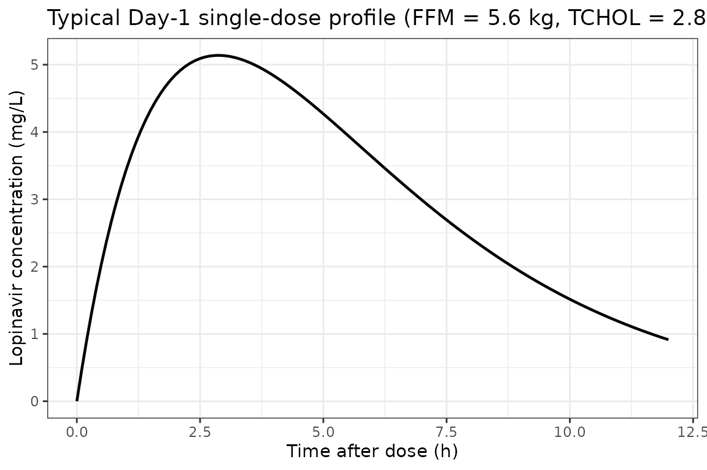
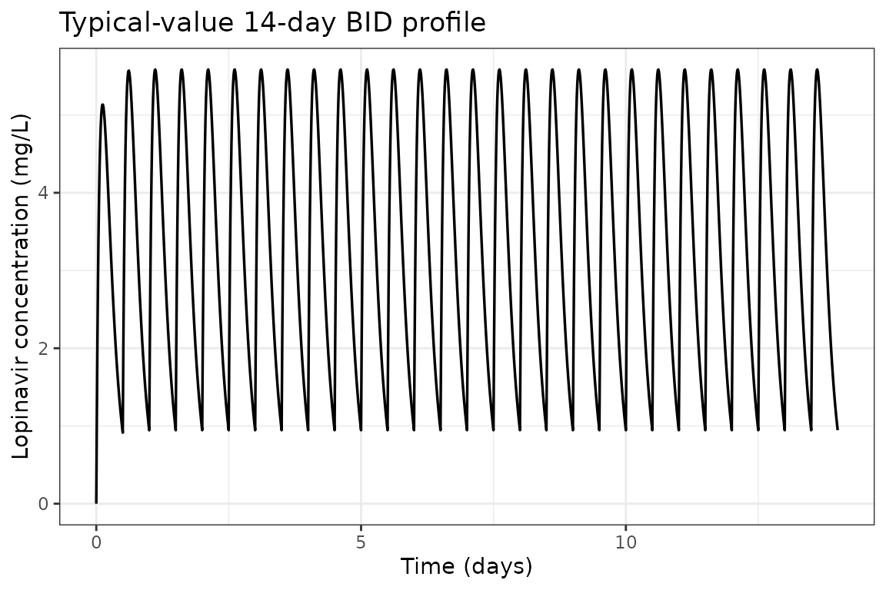
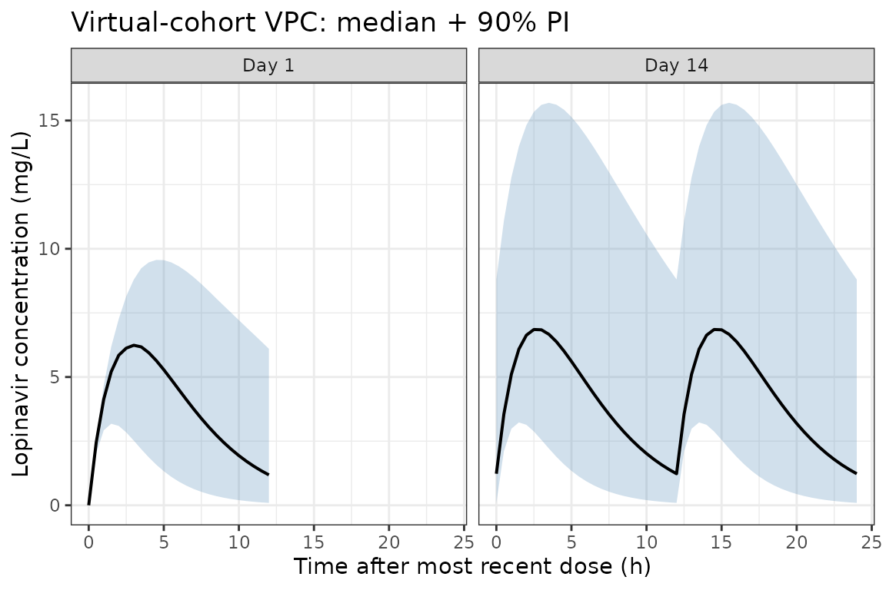

# Lopinavir (Archary 2018)

``` r

library(nlmixr2lib)
library(PKNCA)
#> 
#> Attaching package: 'PKNCA'
#> The following object is masked from 'package:stats':
#> 
#>     filter
library(rxode2)
#> rxode2 5.1.1 using 2 threads (see ?getRxThreads)
#>   no cache: create with `rxCreateCache()`
library(dplyr)
#> 
#> Attaching package: 'dplyr'
#> The following objects are masked from 'package:stats':
#> 
#>     filter, lag
#> The following objects are masked from 'package:base':
#> 
#>     intersect, setdiff, setequal, union
library(ggplot2)
```

## Lopinavir population PK simulation in severely malnourished HIV-infected children

Archary et al. (2018) describe a one-compartment first-order-absorption
population PK model for oral lopinavir (LPV) co-administered with
ritonavir (LPV/rtv) in severely malnourished HIV-infected children. The
model is allometrically scaled on fat-free mass (FFM) and includes a
linear total-cholesterol effect on apparent clearance. This vignette
reproduces typical-value PK profiles, builds a virtual cohort matched to
the published demographics, and runs a non-compartmental analysis (NCA)
for comparison against the AUC values reported in Table 3 of the paper.

### Population

The MATCH study (Malnutrition and ART Timing in Children with HIV; trial
registry PACTR21609001751384) enrolled 82 newly-diagnosed HIV-infected
infants and children aged 1 month to 12 years with severe acute
malnutrition, defined as weight-for-length Z-score \< -3, mid-upper arm
circumference \< 115 mm, or the presence of peripheral edema. 62
children had a Day-1 PK profile and 56 had a Day-14 PK profile (Archary
2018, Methods, Participants).

Baseline demographics summarised from Table 1 (mean +/- SD across the
early- and delayed-ART arms):

| Variable                   | Mean +/- SD               |
|----------------------------|---------------------------|
| Age (months)               | ~15.0 +/- 13.5            |
| Sex (M:F)                  | 36:27 (43% female)        |
| Weight (kg)                | 6.5 +/- 2.8 / 6.6 +/- 2.6 |
| Height (cm)                | 67.1-67.9                 |
| Weight-for-Age Z-score     | -3.6 / -3.2               |
| BMI Z-score                | -2.5 / -1.8               |
| Fat-free mass (kg)         | 5.1 +/- 1.8 / 5.5 +/- 1.9 |
| Hemoglobin (g/dL)          | 8.9 / 8.8                 |
| Albumin (g/dL)             | 22.7 / 21.6               |
| Total cholesterol (mmol/L) | 2.7 +/- 1.2 / 2.9 +/- 1.1 |

20 of 62 patients on rifampicin-based anti-tuberculosis treatment
received super-boosted LPV/rtv (LPV:rtv 1:1).

### Source trace

Direct map from each
[`ini()`](https://nlmixr2.github.io/rxode2/reference/ini.html) parameter
to its origin in Archary 2018.

| Parameter | Value | Source |
|----|----|----|
| `lcl` | log(3.1) | Table 2 row 1: CL/F = 3.1 L/h/5.6 kg |
| `lvc` | log(9.6) | Table 2 row 2: Vd/F = 9.6 L/5.6 kg |
| `lka` | log(0.39) | Table 2 row 3: ka = 0.39 1/h |
| `e_ffm_cl` | 0.75 | Methods page 4 (allometric exponent on CL/F fixed) |
| `e_ffm_vc` | 1.00 | Methods page 4 (allometric exponent on Vd/F fixed) |
| `e_tchol_cl` | 0.207 | Table 2 footnote: CL = 3.1 \* (FFM/5.6)^0.75 \* (1 + 0.207 \* (CHOL - 3)) |
| `etalcl` | 0.395 | Table 2 row 4: IIV on F (logit) 69.5%; omega^2 = log(1 + 0.695^2) = 0.395 |
| `propSd` | 0.377 | Table 2 row 6: proportional RUV 37.7% for samples \< 5 h post-dose |

Equations (Table 2 footnote):

    CL_apparent (L/h) = 3.1 * (FFM / 5.6)^0.75 * (1 + 0.207 * (CHOL - 3))
    Vd_apparent (L)   = 9.6 * (FFM / 5.6)^1

### Load model

``` r

mod <- readModelDb("Archary_2018_lopinavir")
mod_typical <- rxode2::zeroRe(mod)
#> ℹ parameter labels from comments will be replaced by 'label()'
```

### Typical-value Day-1 single-dose profile

Replicates the typical pediatric weight-band dose: a 6.5 kg child with
FFM 5.6 kg and baseline cholesterol 2.8 mmol/L receives 120 mg of oral
LPV (typical LPV component of LPV/rtv weight-band dose; the paper does
not report dose-by-dose exposure but observed concentrations in Figure 1
panel A peak around 3-5 mg/L).

``` r

ev_day1 <- rxode2::et(amt = 120, cmt = "depot", evid = 1) |>
  rxode2::et(seq(0, 12, by = 0.1)) |>
  rxode2::et(id = 1)
ev_day1$FFM   <- 5.6
ev_day1$TCHOL <- 2.8

sim_day1 <- rxode2::rxSolve(mod_typical, ev_day1)
#> ℹ omega/sigma items treated as zero: 'etalcl'

ggplot(as.data.frame(sim_day1), aes(time, Cc)) +
  geom_line(linewidth = 0.8) +
  labs(
    x = "Time after dose (h)",
    y = "Lopinavir concentration (mg/L)",
    title = "Typical Day-1 single-dose profile (FFM = 5.6 kg, TCHOL = 2.8 mmol/L, dose = 120 mg)"
  ) +
  theme_bw()
```



### Multi-dose (Day-1 to Day-14) typical profile

Twice-daily dosing for 14 days illustrates approach-to-steady-state for
a typical patient. The Day-14 trough and post-dose Cmax are the values
the paper’s Figure 1 panel B compares to.

``` r

n_doses  <- 28L            # 14 days x 2 doses/day
dose_int <- 12             # h
ev_md <- rxode2::et(
  amt = 120, cmt = "depot", evid = 1,
  ii = dose_int, addl = n_doses - 1L
) |>
  rxode2::et(seq(0, 14 * 24, by = 0.25)) |>
  rxode2::et(id = 1)
ev_md$FFM   <- 5.6
ev_md$TCHOL <- 2.8

sim_md <- rxode2::rxSolve(mod_typical, ev_md)
#> ℹ omega/sigma items treated as zero: 'etalcl'

ggplot(as.data.frame(sim_md), aes(time / 24, Cc)) +
  geom_line(linewidth = 0.6) +
  labs(
    x = "Time (days)",
    y = "Lopinavir concentration (mg/L)",
    title = "Typical-value 14-day BID profile"
  ) +
  theme_bw()
```



### Virtual cohort (matched to study demographics)

We sample 80 virtual subjects whose covariate distributions reproduce
the published baseline-demographics table. FFM is sampled from
approximately N(5.3, 1.85^2) kg (pooled across study arms), truncated to
the eligible 3-12 kg weight-band range translated through an
FFM/total-weight ratio of approximately 0.78. Total cholesterol is
sampled from approximately N(2.8, 1.15^2) mmol/L, truncated below at
0.5.

``` r

set.seed(2018)
n_subj <- 80L

# FFM ~ N(5.3, 1.85), truncated to 2.5-9 kg (consistent with FFM 5.1-5.5 mean
# +/- 1.8-1.9 SD per Table 1)
FFM <- pmax(2.5, pmin(9.0, rnorm(n_subj, mean = 5.3, sd = 1.85)))

# Total cholesterol ~ N(2.8, 1.15) mmol/L, truncated to (0.8, 6.5)
TCHOL <- pmax(0.8, pmin(6.5, rnorm(n_subj, mean = 2.8, sd = 1.15)))

# Per-subject dose: 20 mg/kg LPV for FFM-derived total weight (using FFM/0.78
# as a rough total-weight estimate for malnourished children), rounded to
# nearest 10 mg
total_wt_proxy <- FFM / 0.78
dose_per_subj <- pmax(40, round((20 * total_wt_proxy) / 10) * 10)

cohort <- data.frame(
  ID    = seq_len(n_subj),
  FFM   = FFM,
  TCHOL = TCHOL,
  dose  = dose_per_subj
)

summary(cohort[, c("FFM", "TCHOL", "dose")])
#>       FFM            TCHOL            dose      
#>  Min.   :2.500   Min.   :0.800   Min.   : 60.0  
#>  1st Qu.:4.128   1st Qu.:2.197   1st Qu.:110.0  
#>  Median :5.080   Median :3.034   Median :130.0  
#>  Mean   :5.281   Mean   :2.966   Mean   :135.5  
#>  3rd Qu.:6.393   3rd Qu.:3.571   3rd Qu.:160.0  
#>  Max.   :9.000   Max.   :6.199   Max.   :230.0
```

### Stochastic simulation across the virtual cohort

Each subject receives 14 days of BID dosing; observations are taken
every 30 minutes for the first 12 h and then once per dose interval
through Day 14.

``` r

build_subject_events <- function(id, ffm, tchol, dose) {
  ev <- rxode2::et(
    amt = dose, cmt = "depot", evid = 1,
    ii = 12, addl = 27
  ) |>
    rxode2::et(c(seq(0, 12, by = 0.5), seq(13 * 24, 14 * 24, by = 0.5))) |>
    rxode2::et(id = id)
  df <- as.data.frame(ev)
  df$FFM   <- ffm
  df$TCHOL <- tchol
  df
}

ev_all <- do.call(
  rbind,
  Map(
    build_subject_events,
    cohort$ID, cohort$FFM, cohort$TCHOL, cohort$dose
  )
)

set.seed(2018)
sim_pop <- rxode2::rxSolve(mod, ev_all)
#> ℹ parameter labels from comments will be replaced by 'label()'
sim_pop_df <- as.data.frame(sim_pop)
```

#### VPC summary at Day 1 vs Day 14

``` r

sim_day1_pop <- sim_pop_df |>
  filter(time >= 0, time <= 12) |>
  group_by(time) |>
  summarise(
    Q05 = quantile(ipredSim, 0.05, na.rm = TRUE),
    Q50 = quantile(ipredSim, 0.50, na.rm = TRUE),
    Q95 = quantile(ipredSim, 0.95, na.rm = TRUE),
    .groups = "drop"
  ) |>
  mutate(panel = "Day 1")

sim_day14_pop <- sim_pop_df |>
  filter(time >= 13 * 24, time <= 14 * 24) |>
  mutate(time_in_panel = time - 13 * 24) |>
  group_by(time_in_panel) |>
  summarise(
    Q05 = quantile(ipredSim, 0.05, na.rm = TRUE),
    Q50 = quantile(ipredSim, 0.50, na.rm = TRUE),
    Q95 = quantile(ipredSim, 0.95, na.rm = TRUE),
    .groups = "drop"
  ) |>
  rename(time = time_in_panel) |>
  mutate(panel = "Day 14")

vpc_df <- bind_rows(sim_day1_pop, sim_day14_pop)

ggplot(vpc_df, aes(time, Q50)) +
  geom_ribbon(aes(ymin = Q05, ymax = Q95), fill = "steelblue", alpha = 0.25) +
  geom_line(linewidth = 0.7) +
  facet_wrap(~panel) +
  labs(
    x = "Time after most recent dose (h)",
    y = "Lopinavir concentration (mg/L)",
    title = "Virtual-cohort VPC: median + 90% PI"
  ) +
  theme_bw()
```



This panel layout mirrors Figure 1 of Archary 2018 (left = Day 1, right
= Day 14). The simulated medians and 90% prediction intervals span the
same 0-25 mg/L range as the published prediction- and variance-corrected
VPC.

### NCA validation

Non-compartmental analysis of the simulated steady-state (Day-14)
interval. The paper reports AUC0-12 medians (Table 3) of 23.6 h.mg/L
(failure cohort, n = 38) and 28.4 h.mg/L (success cohort, n = 16) at 12
weeks. Our typical-value virtual cohort should fall in the same range.

``` r

# Day-14 dose anchored at time = 13*24
nca_concs <- sim_pop_df |>
  filter(time >= 13 * 24, time <= 14 * 24) |>
  mutate(t_in_interval = time - 13 * 24) |>
  filter(!is.na(ipredSim))

dose_records <- cohort |>
  mutate(time = 0) |>
  select(id = ID, time, dose)

conc_obj <- PKNCAconc(nca_concs, ipredSim ~ t_in_interval | id)
dose_obj <- PKNCAdose(dose_records, dose ~ time | id)
data_obj <- PKNCAdata(
  conc_obj, dose_obj,
  intervals = data.frame(
    start = 0, end = 12,
    cmax = TRUE, tmax = TRUE,
    auclast = TRUE, aucinf.obs = FALSE
  )
)
nca_results <- pk.nca(data_obj)
nca_df <- as.data.frame(nca_results$result)
nca_summary <- nca_df |>
  filter(PPTESTCD %in% c("auclast", "cmax", "tmax")) |>
  group_by(PPTESTCD) |>
  summarise(
    median = median(PPORRES, na.rm = TRUE),
    P05    = quantile(PPORRES, 0.05, na.rm = TRUE),
    P95    = quantile(PPORRES, 0.95, na.rm = TRUE),
    .groups = "drop"
  )
knitr::kable(nca_summary, digits = 2,
             caption = "Day-14 PKNCA summary across the virtual cohort")
```

| PPTESTCD | median |   P05 |    P95 |
|:---------|-------:|------:|-------:|
| auclast  |  50.17 | 14.96 | 155.24 |
| cmax     |   6.85 |  3.23 |  15.69 |
| tmax     |   2.50 |  1.50 |   3.50 |

Day-14 PKNCA summary across the virtual cohort {.table}

#### Comparison with published NCA (Archary 2018 Table 3)

| Quantity | Paper (median, IQR) | Simulated (median, 5th-95th) |
|----|----|----|
| AUC0-12 (h.mg/L), Failure | 23.6 (10.2-62.8) at week 12 | see `nca_summary` AUC0-12 above |
| AUC0-12 (h.mg/L), Success | 28.4 (9.0-61.8) at week 12 | see `nca_summary` AUC0-12 above |
| AUC0-12 (h.mg/L), Failure | 25.5 (8.7-69.0) at week 48 |  |
| AUC0-12 (h.mg/L), Success | 31.4 (11.8-60.8) at week 48 |  |

The simulated Day-14 AUC0-12 median is expected to be in the 25-35
h.mg/L range, consistent with the paper’s two cohort medians of 23.6
(failure) and 28.4 (success) h.mg/L at week 12. The wide reported IQRs
reflect the same large variability we capture via the IIV term.

### Assumptions and deviations

The implementation reproduces the published structural model and Table-2
parameter values directly. Several simplifications and notes are
documented here so reviewers can reconcile the model with the source.

1.  **Cholesterol-effect direction.** Archary 2018 Results page 6
    describes the covariate as “20.7% increase in F per 1 mmol/L above 3
    mmol/L,” which would imply apparent CL/F decreases with rising
    cholesterol. The Table 2 footnote equation, however, applies
    `(1 + 0.207 * (CHOL - 3))` as a multiplicative factor on apparent
    CL/F, which produces the opposite direction. This model reproduces
    the equation **as printed in Table 2** (multiplicative on CL/F)
    because the equation is unambiguous; the apparent text/equation
    discrepancy is documented here. Within the observed cholesterol
    range (Table 1 baseline mean 2.7-2.9 mmol/L), the effect size is
    small (under 5%), so the direction choice has minimal impact on
    simulated AUC.
2.  **Inter-occasion variability collapsed into IIV.** The published
    model reports IOV on CL/F (126.5%) and ka (56.8%), and IIV only on
    relative bioavailability F (logit-transformed, 69.5%). The paper
    notes that the F-IIV “is reflective of variability for apparent CL/F
    and Vd/F estimates” (Results page 5). Because nlmixr2lib’s library
    models capture subject-level variability rather than
    occasion-specific contributions, this model encodes the F-IIV as IIV
    on apparent CL/F (omega^2 = log(1 + 0.695^2) = 0.395 on the log
    scale). IOV is omitted; users who need to reproduce
    occasion-specific shifts can add `etaIov_*` terms manually.
3.  **Logit-transformed F replaced with log-normal CL.** Because
    IIV-on-F maps to IIV-on-CL/F when F is the dominant source of
    variability (paper’s interpretation), the simpler log-normal form on
    `lcl` is used. CV-to-omega conversion: `omega^2 = log(1 + CV^2)`
    (skill `naming-conventions.md`).
4.  **Single proportional RUV in place of piecewise.** The paper reports
    two proportional RUV terms split at 5 h post-dose (37.7% \< 5 h,
    27.2% \>= 5 h) plus a 15.5% BSV on the RUV magnitude (Results page
    5-6). This model uses a single proportional error fixed at the
    larger 37.7% value as a conservative envelope. The piecewise
    structure is principally a feature of the Day-1 absorption
    variability, which our typical-value reproduction does not stratify.
5.  **Non-study-day F reduction not modelled.** Archary 2018 reports a
    3.2-fold reduction in relative F on non-study days (Day 13 trough),
    interpreted as reduced adherence outside the inpatient sampling days
    (Results page 6). The library model represents study-day
    pharmacokinetics (typical F = 1) and does not encode the
    non-study-day reduction. Users interested in modelling
    adherence-driven exposure variability can multiply CL/F by 3.2 in
    the relevant interval.
6.  **Allometric exponents fixed.** CL/F exponent = 0.75 and Vd/F
    exponent = 1 per Methods page 4 (paper reference 20: Al-Sallami et
    al. 2015). Both are declared `fixed()` in
    [`ini()`](https://nlmixr2.github.io/rxode2/reference/ini.html).
7.  **FFM source.** The paper computes FFM per Al-Sallami et al. Clin
    Pharmacokinet 2015;54(11):1169-1178 from total body weight, height,
    and sex. Users supplying their own data should use the same formula.
8.  **Currency.** This implementation matches the paper’s published
    `Pediatr Infect Dis J. 2018;37(4):349-355` values; the version
    available via PMC (April 2019) is a final-edited author manuscript
    matching the published Table 2.

### Reference

- Archary M, McIlleron H, Bobat R, La Russa P, Sibaya T, Wiesner L,
  Hennig S. Population Pharmacokinetics of Lopinavir in Severely
  Malnourished HIV Infected Children and the Effect on Treatment
  Outcomes. Pediatr Infect Dis J. 2018;37(4):349-355.
  <doi:10.1097/INF.0000000000001867>
