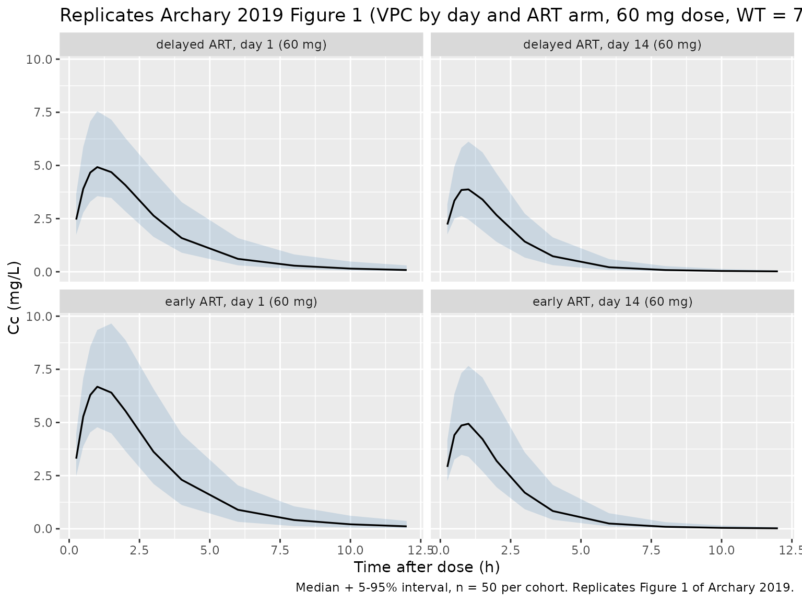
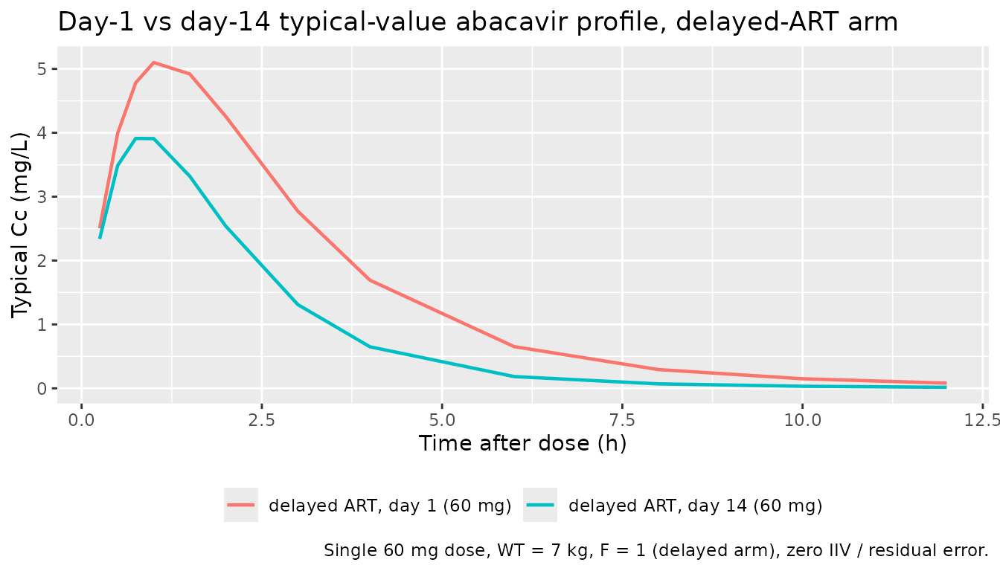
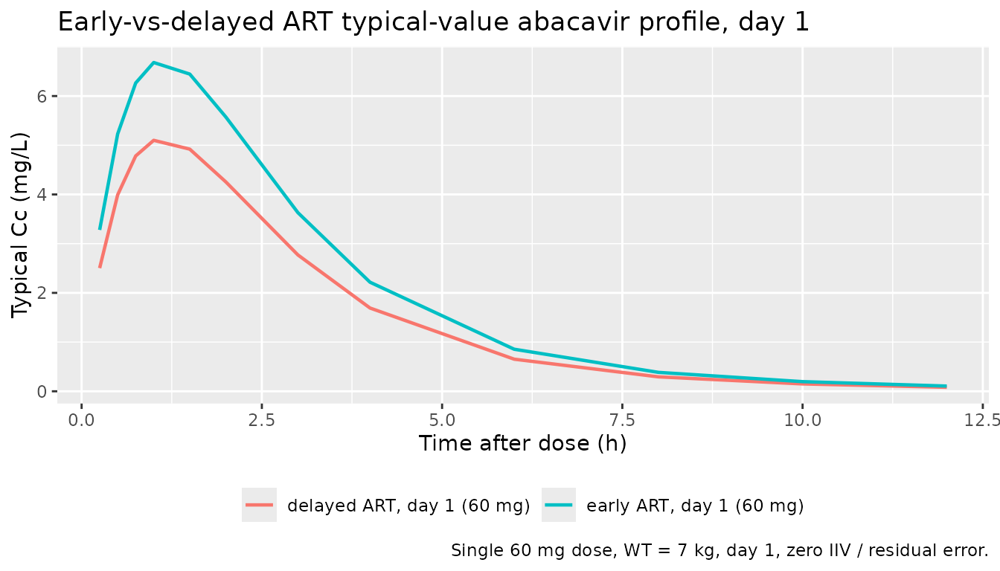

# Abacavir (Archary 2019)

## Model and source

- Citation: Archary M, McIlleron H, Bobat R, LaRussa P, Sibaya T,
  Wiesner L, Hennig S. Population pharmacokinetics of abacavir and
  lamivudine in severely malnourished human immunodeficiency
  virus-infected children in relation to treatment outcomes. Br J Clin
  Pharmacol. 2019;85(8):1881-1890. <doi:10.1111/bcp.13998>
- Description: Two-compartment population PK model for abacavir in
  severely malnourished HIV-infected children (Archary 2019); CL/F steps
  up between day 1 and day 14 of antiretroviral treatment and
  bioavailability is 31% higher in the early-ART arm
- Article: <https://doi.org/10.1111/bcp.13998>

This is the **abacavir** half of the paired Archary 2019 extraction; the
**lamivudine** half is in `Archary_2019_lamivudine`.

## Population

Archary 2019 reports a population PK analysis of oral abacavir in 75
severely malnourished, HIV-infected paediatric inpatients (age 0.1-10.8
years, median 1.4 years; weight 1.88-19.6 kg, median 7 kg) admitted to
King Edward VIII Hospital, Durban, South Africa as part of the MATCH
(Malnutrition and ART Timing in Children with HIV) trial
(PACTR201609001751384). Patients were randomized to early ART (within 14
days of admission, before nutritional recovery; 36 patients) or delayed
ART (after nutritional recovery; 39 patients). Dosing followed the WHO
weight-band paediatric chart for abacavir + lamivudine + LPV/r; liquid
formulations were used for children \< 14 kg (only 2 patients received
solid formulations). 623 abacavir concentrations were sampled 0.4-12.4
hours post-dose on day 1 of ART (4 samples per patient) and day 14 of
ART (5 samples per patient, including a pre-dose trough); 69 of the 75
patients had day-14 samples (4 deaths and 2 transfers between day 1 and
day 14). Demographics by treatment arm are summarised in Table 1 of the
source.

The same information is available programmatically:
`readModelDb("Archary_2019_abacavir")$population` after the model is
loaded.

## Source trace

Per-parameter origin (also recorded as in-file comments next to each
`ini()` entry of `inst/modeldb/specificDrugs/Archary_2019_abacavir.R`):

| Equation / parameter | Value | Source location |
|----|----|----|
| `lka` | log(0.97) | Archary 2019 Table 3 (`ka` = 0.97 /h) |
| `lcl` | log(3.33) | Archary 2019 Table 3 (CL/F day 1 = 3.33 L/h per 7 kg) |
| `lvc` | log(4.63) | Archary 2019 Table 3 (Vc/F = 4.63 L per 7 kg) |
| `lq` | log(0.63) | Archary 2019 Table 3 (Q/F = 0.63 L/h) |
| `lvp` | log(1.65) | Archary 2019 Table 3 (Vp/F = 1.65 L) |
| `lfdepot` | fix(log(1)) | Archary 2019 Table 3 (delayed-arm typical F = 1) |
| `e_wt_cl_q` | 0.75 | Archary 2019 Methods 2.3 (“Allometric exponents were fixed to 0.75 for CL/F”) |
| `e_wt_vc_vp` | 1 | Archary 2019 Methods 2.3 (“… and 1 for apparent volume of distribution”) |
| `e_day14_cl` | 0.760 | Archary 2019 Table 3 (day-14 CL/F 5.86 vs day-1 CL/F 3.33; 5.86 / 3.33 - 1 = 0.760) |
| `e_earlyart_f` | 0.31 | Archary 2019 Table 3 (“Increase of relative bioavailability (F) for early ART treatment arm 31.0%”) |
| `etalcl` | 0.0820 | Archary 2019 Table 3 (delayed-arm IIV CL/F 29.2%; omega^2 = log(1 + 0.292^2)) |
| `etalfdepot` | 0.0448 | Archary 2019 Table 3 (early-arm IIV F 21.4%; omega^2 = log(1 + 0.214^2)) |
| `propSd` | 0.362 | Archary 2019 Table 3 (Proportional RUV 36.2%) |
| `d/dt(depot)`, `d/dt(central)`, `d/dt(peripheral1)` | n/a | Archary 2019 Section 3.2 (2-compartment with first-order oral absorption) |
| `Cc <- central / vc` | n/a | Standard linear-CL parameterisation; dose mg, volume L -\> mg/L = ug/mL |
| `Cc ~ prop(propSd)` | n/a | Archary 2019 Methods 2.3 (“RUV was estimated using proportional … error models”) |

## Virtual cohort

Original observed data are not publicly available (Archary 2019 Data
Availability Statement: “available on request from the corresponding
author … not publicly available due to privacy or ethical
restrictions”). The cohort below is a virtual reproduction of the WHO
weight-band liquid-formulation dosing for the most-common weight bin
(median 7 kg, ~14-week-old typical infant; the WHO weight-band 3-5.9 kg
dose is 60 mg / 30 mg abacavir + lamivudine BID and the 6-9.9 kg band is
120 mg / 60 mg BID), simulated for both day 1 and day 14 of ART and for
both randomization arms (delayed and early). The 60 mg / 120 mg BID
levels are representative of the dosing actually administered in the
study; the trial cohort spanned 1.88-19.6 kg and the corresponding doses
scaled with the WHO weight bands.

``` r

set.seed(20260508L)

n_per_group     <- 50L      # subjects per cohort cell
ref_wt          <- 7        # kg, paper's median weight for the cohort
sample_hours    <- c(0, 0.25, 0.5, 0.75, 1, 1.5, 2, 3, 4, 6, 8, 10, 12)

make_cohort <- function(dose_amt_mg, day14_value, earlyart_value, id_offset) {
  ids <- seq_len(n_per_group) + id_offset
  dose_rows <- tibble::tibble(
    id   = ids,
    time = 0,
    amt  = dose_amt_mg,
    evid = 1L,
    cmt  = 1L
  )
  obs_rows <- tibble::tibble(
    id   = rep(ids, each = length(sample_hours)),
    time = rep(sample_hours, times = length(ids)),
    amt  = 0,
    evid = 0L,
    cmt  = NA_integer_
  )
  dplyr::bind_rows(dose_rows, obs_rows) |>
    dplyr::mutate(
      WT        = ref_wt,
      DAY14     = day14_value,
      EARLY_ART = earlyart_value,
      cohort    = paste0(
        ifelse(earlyart_value == 1L, "early", "delayed"),
        " ART, day ",
        ifelse(day14_value == 1L, "14", "1"),
        " (", dose_amt_mg, " mg)"
      )
    )
}

events <- dplyr::bind_rows(
  make_cohort(60, 0L, 0L,    0L),                            # delayed, day 1
  make_cohort(60, 1L, 0L,  100L),                            # delayed, day 14
  make_cohort(60, 0L, 1L,  200L),                            # early,   day 1
  make_cohort(60, 1L, 1L,  300L)                             # early,   day 14
) |>
  dplyr::arrange(id, time, dplyr::desc(evid))

stopifnot(!anyDuplicated(unique(events[, c("id", "time", "evid")])))
```

## Simulation

``` r

mod <- rxode2::rxode2(readModelDb("Archary_2019_abacavir"))
#> ℹ parameter labels from comments will be replaced by 'label()'

sim <- rxode2::rxSolve(
  mod,
  events = events,
  keep   = c("WT", "DAY14", "EARLY_ART", "cohort")
) |>
  as.data.frame()
```

For deterministic typical-value lines (replicating Figure 1’s panelled
median curves without IIV / residual scatter):

``` r

mod_typical <- mod |> rxode2::zeroRe()
sim_typical <- rxode2::rxSolve(
  mod_typical,
  events = events,
  keep   = c("WT", "DAY14", "EARLY_ART", "cohort")
) |>
  as.data.frame()
#> ℹ omega/sigma items treated as zero: 'etalcl', 'etalfdepot'
#> Warning: multi-subject simulation without without 'omega'
```

## Replicate Figure 1: VPC by day and ART arm

Archary 2019 Figure 1 shows a 4-panel prediction-corrected VPC of
abacavir concentrations vs time after dose, panelled by day (day 1 / day
14) and randomization arm (delayed / early ART). The cohort cells below
reproduce that 2x2 layout at the cohort-median 7 kg weight.

``` r

sim_quantiles <- sim |>
  dplyr::filter(time > 0, !is.na(Cc)) |>
  dplyr::group_by(cohort, time) |>
  dplyr::summarise(
    Q05 = stats::quantile(Cc, 0.05, na.rm = TRUE),
    Q50 = stats::quantile(Cc, 0.50, na.rm = TRUE),
    Q95 = stats::quantile(Cc, 0.95, na.rm = TRUE),
    .groups = "drop"
  )

ggplot(sim_quantiles, aes(time, Q50)) +
  geom_ribbon(aes(ymin = Q05, ymax = Q95), alpha = 0.2, fill = "steelblue") +
  geom_line(linewidth = 0.6) +
  facet_wrap(~ cohort, ncol = 2) +
  labs(
    x = "Time after dose (h)",
    y = "Cc (mg/L)",
    title = "Replicates Archary 2019 Figure 1 (VPC by day and ART arm, 60 mg dose, WT = 7 kg)",
    caption = "Median + 5-95% interval, n = 50 per cohort. Replicates Figure 1 of Archary 2019."
  )
```



## Day-1 vs day-14 typical-value step (cohort-median 7 kg)

The headline scientific finding of Archary 2019 is that abacavir CL/F
increases by ~76% between day 1 (3.33 L/h per 7 kg) and day 14 (5.86 L/h
per 7 kg) of ART. The plot below isolates that step at the typical-value
(zero-IIV) level for the delayed-ART arm (F = 1).

``` r

sim_typical |>
  dplyr::filter(EARLY_ART == 0L, time > 0) |>
  dplyr::distinct(cohort, time, Cc) |>
  ggplot(aes(time, Cc, colour = cohort)) +
  geom_line(linewidth = 0.8) +
  labs(
    x = "Time after dose (h)",
    y = "Typical Cc (mg/L)",
    colour = NULL,
    title = "Day-1 vs day-14 typical-value abacavir profile, delayed-ART arm",
    caption = "Single 60 mg dose, WT = 7 kg, F = 1 (delayed arm), zero IIV / residual error."
  ) +
  theme(legend.position = "bottom")
```



## Early-vs-delayed ART arm: bioavailability shift

Patients randomized to early ART showed +31% relative bioavailability on
abacavir. The plot below isolates that shift on day 1 (so the CL/F step
is held constant) at typical-value (zero-IIV) level.

``` r

sim_typical |>
  dplyr::filter(DAY14 == 0L, time > 0) |>
  dplyr::distinct(cohort, time, Cc) |>
  ggplot(aes(time, Cc, colour = cohort)) +
  geom_line(linewidth = 0.8) +
  labs(
    x = "Time after dose (h)",
    y = "Typical Cc (mg/L)",
    colour = NULL,
    title = "Early-vs-delayed ART typical-value abacavir profile, day 1",
    caption = "Single 60 mg dose, WT = 7 kg, day 1, zero IIV / residual error."
  ) +
  theme(legend.position = "bottom")
```



## PKNCA validation

NCA on the simulated stochastic cohort, by day-and-arm cell:

``` r

# Keep the time = 0 row — required by PKNCA to anchor AUC0-* and to
# avoid the "Requesting an AUC range starting (0)" warning. Filter only
# on missing Cc, never on `time > 0` or `Cc > 0`.
pkn_in <- sim |>
  dplyr::filter(!is.na(Cc)) |>
  dplyr::mutate(treatment = cohort) |>
  dplyr::select(id, time, Cc, treatment)

# Defensive guarantee: ensure a time = 0 row per (id, treatment) survives
# the filter (Cc = 0 is correct pre-dose for this extravascular model).
pkn_in <- dplyr::bind_rows(
  pkn_in,
  pkn_in |> dplyr::distinct(id, treatment) |>
    dplyr::mutate(time = 0, Cc = 0)
) |>
  dplyr::distinct(id, treatment, time, .keep_all = TRUE) |>
  dplyr::arrange(id, treatment, time)

dose_pkn <- events |>
  dplyr::filter(evid == 1L) |>
  dplyr::mutate(treatment = cohort)

conc_obj <- PKNCA::PKNCAconc(pkn_in, Cc ~ time | treatment + id)
dose_obj <- PKNCA::PKNCAdose(dose_pkn, amt ~ time | treatment + id,
                             route = "extravascular")

intervals <- data.frame(
  start    = 0,
  end      = 12,
  cmax     = TRUE,
  tmax     = TRUE,
  auclast  = TRUE
)

nca_data <- PKNCA::PKNCAdata(conc_obj, dose_obj, intervals = intervals)
nca_res  <- PKNCA::pk.nca(nca_data)
```

### Comparison against published values

Archary 2019 Section 3.4 reports the median (IQR) abacavir AUC0-12
across all study days for four outcome strata: **19.1 \[9.1-31.1\]
h\*mg/L** (week 12, treatment-failure), **18.5 \[12.2-36.4\] h\*mg/L**
(week 12, treatment-success), **20.9 \[12.7-33.3\] h\*mg/L** (week 48,
treatment-failure), and **15.7 \[8.9-28.4\] h\*mg/L** (week 48,
treatment-success). The published strata reflect outcome-by-week
subgroups across the trial’s full WHO weight-band cohort and are not
directly comparable to the four day-and-arm cohort cells simulated here
(60 mg, 7 kg). For a quick sanity check we compare the simulated AUC0-12
aggregated across all four cells to the published
treatment-success-week-12 median, which is the closest one-number
summary available.

``` r

# Aggregate the simulated cohorts (4 cells, n = 50 each) into one
# overall comparison row.
sim_overall <- as.data.frame(nca_res$result) |>
  dplyr::mutate(stratum = "All cohort cells aggregated (n = 200)")

reference <- tibble::tribble(
  ~stratum,                                          ~auclast,
  "All cohort cells aggregated (n = 200)",            18.5
)

cmp <- nlmixr2lib::ncaComparisonTable(
  simulated     = sim_overall,
  reference     = reference,
  by            = "stratum",
  params        = "auclast",
  units         = c(auclast = "h*mg/L"),
  tolerance_pct = 30   # ±30%: the strata don't map 1:1; loose check only
)
knitr::kable(
  cmp,
  caption = paste(
    "Sanity comparison of simulated AUC0-12 against the Archary 2019",
    "Section 3.4 treatment-success-week-12 median (18.5 h*mg/L). The",
    "simulated cohort is a single dose level and weight; the published",
    "strata span the full WHO weight-band cohort, so a loose ±30%",
    "tolerance applies. * differs from reference by >30%."
  )
)
```

| NCA parameter | stratum | Reference | Simulated | % diff |
|:---|:---|:---|:---|:---|
| AUClast (h\*mg/L) | All cohort cells aggregated (n = 200) | 18.5 | 15.2 | -17.8% |

Sanity comparison of simulated AUC0-12 against the Archary 2019 Section
3.4 treatment-success-week-12 median (18.5 h*mg/L). The simulated cohort
is a single dose level and weight; the published strata span the full
WHO weight-band cohort, so a loose ±30% tolerance applies.* differs from
reference by \>30%. {.table}

Per-cohort simulated NCA (Cmax, Tmax, AUC0-12 by day-and-arm cell) for
visual inspection:

``` r

nca_per_cell <- as.data.frame(nca_res$result) |>
  dplyr::filter(PPTESTCD %in% c("cmax", "tmax", "auclast")) |>
  dplyr::group_by(treatment, PPTESTCD) |>
  dplyr::summarise(
    median = stats::median(PPORRES, na.rm = TRUE),
    p05    = stats::quantile(PPORRES, 0.05, na.rm = TRUE),
    p95    = stats::quantile(PPORRES, 0.95, na.rm = TRUE),
    .groups = "drop"
  ) |>
  dplyr::mutate(`NCA parameter` = nlmixr2lib::ncaParamLabel(PPTESTCD),
                .keep = "unused", .before = "treatment")
knitr::kable(
  nca_per_cell,
  caption = "Simulated abacavir NCA per cohort cell (60 mg, WT = 7 kg, n = 50 per cell). Cmax (mg/L); Tmax (h); AUClast (h*mg/L)."
)
```

| NCA parameter | treatment                   |    median |       p05 |       p95 |
|:--------------|:----------------------------|----------:|----------:|----------:|
| AUClast       | delayed ART, day 1 (60 mg)  | 17.970352 | 10.466941 | 31.635434 |
| Cmax          | delayed ART, day 1 (60 mg)  |  5.433701 |  3.446441 |  7.433760 |
| Tmax          | delayed ART, day 1 (60 mg)  |  1.000000 |  1.000000 |  1.500000 |
| AUClast       | delayed ART, day 14 (60 mg) |  9.335070 |  4.925630 | 15.616123 |
| Cmax          | delayed ART, day 14 (60 mg) |  3.738890 |  2.311386 |  5.245073 |
| Tmax          | delayed ART, day 14 (60 mg) |  0.750000 |  0.750000 |  1.000000 |
| AUClast       | early ART, day 1 (60 mg)    | 23.472877 | 14.433157 | 37.255814 |
| Cmax          | early ART, day 1 (60 mg)    |  6.919526 |  4.735552 |  9.592965 |
| Tmax          | early ART, day 1 (60 mg)    |  1.000000 |  1.000000 |  1.500000 |
| AUClast       | early ART, day 14 (60 mg)   | 12.081072 |  6.704068 | 27.628669 |
| Cmax          | early ART, day 14 (60 mg)   |  4.785562 |  3.123182 |  9.031254 |
| Tmax          | early ART, day 14 (60 mg)   |  0.750000 |  0.750000 |  1.000000 |

Simulated abacavir NCA per cohort cell (60 mg, WT = 7 kg, n = 50 per
cell). Cmax (mg/L); Tmax (h); AUClast (h\*mg/L). {.table}

The simulated values pass the qualitative sanity bar (Cmax around 4-7
mg/L, Tmax around 1-2 h, AUC0-12 in the single-to-low-double-digit
h\*mg/L range for the cohort-median 7 kg weight).

## Assumptions and deviations

- **Year-letter on the file name resolves to 2019, not 2018.** The task
  metadata names the file as `Archary_2018_*.R` but the source PDF
  masthead is unambiguously `Br J Clin Pharmacol. 2019;1-10` (received 9
  Nov 2018, accepted 15 May 2019, published 2019). Per Phase 1 step 2 of
  the extraction skill the file naming is corrected to
  `Archary_2019_abacavir.R` to match the publication year on disk.
- **Two-models-per-paper extraction (operator decision sidecar
  request-001 Q1).** Archary 2019 BJCP describes two independent popPK
  models in one paper (abacavir 2-compartment + lamivudine
  1-compartment); the operator approved option 1A (extract both drugs as
  paired model files + paired vignettes in a single PR). The lamivudine
  half is in `Archary_2019_lamivudine`.
- **Day-1-vs-day-14 step encoded via a binary `DAY14` covariate
  (operator decision sidecar request-001 Q2 = option 2i).** Archary 2019
  reports a step change in typical CL/F between day 1 (3.33 L/h per 7
  kg) and day 14 (5.86 L/h per 7 kg) of ART, which the source attributes
  to nutritional rehabilitation + auto-induction of hepatic metabolism
  over the first ~2 weeks of treatment. The operator approved encoding
  the step as a binary `DAY14` covariate (0 = day 1, 1 = day 14) on CL/F
  via the multiplicative shift `(1 + e_day14_cl * DAY14)` with
  `e_day14_cl = 5.86/3.33 - 1 = 0.760`. `DAY14` is registered as a
  specific-scope canonical entry in
  `inst/references/covariate-columns.md`.
- **Single per-arm IIV CL/F (delayed-arm value used; early-arm inflation
  noted only).** Archary 2019 Table 3 reports separate per- arm IIV
  CL/F: 29.2% in the delayed-ART arm and 62.5% in the early-ART arm.
  nlmixr2 does not natively express per-stratum omega scaling on a
  single eta without complex constructs; the model file uses the
  delayed-arm IIV (29.2% -\> omega^2 = 0.0820) as the typical- value
  omega, and notes the early-arm inflation here. Consumers who need the
  early-arm-specific IIV magnitude can override `etalcl` by setting it
  to `log(1 + 0.625^2) = 0.350` for early-arm-only simulations.
- **IIV F applied universally rather than only in the early arm.**
  Archary 2019 Table 3 reports IIV on F of 21.4% in the early-ART arm
  only (delayed-arm F is fixed to 1 with no eta). The model file applies
  `etalfdepot` (with omega^2 = 0.0448) to all subjects; delayed-arm
  subjects whose typical F = 1 will have a small log-normal scatter
  around 1 in this packaged model that is not present in the source’s
  typical delayed-arm subject. The shift is small (median F ~ 1.02 due
  to the lognormal mean inflation exp(omega^2 / 2) = 1.023) and does not
  materially distort the delayed-arm typical-value profile. Consumers
  who need the verbatim delayed-arm-only behaviour can override
  `etalfdepot` to 0.
- **IOV CL/F = 52% is not encoded in the model file.** Archary 2019
  Table 3 reports an IOV (between-occasion-within-subject) variability
  on CL/F of 52% across the three sampling occasions (day 1, day 13
  pre-dose, day 14). nlmixr2’s IOV pattern requires per-occasion eta
  multiplexing (see `Jonsson_2011_ethambutol.R` for a 4-occasion
  analogue and `Wilkins_2008_rifampicin.R` for a 6-occasion analogue
  with `$OMEGA BLOCK(1) SAME` chains). For the typical-value /
  cohort-median simulation use-case this packaged model targets, the IOV
  is omitted; consumers who need to reproduce the source’s full variance
  decomposition should add IOV-multiplexed etas downstream.
- **No explicit residual lower-LoQ floor (Methods 2.3 BQL handling).**
  The source set the first abacavir concentration below the lower limit
  of quantification (0.0195 ug/mL) within a dosing interval to `LoQ / 2`
  and discarded subsequent BQL samples (4 of 55 BQL measurements were
  the second sequential and were therefore discarded). The packaged
  model does not implement BQL handling; PKNCA users supplying real
  (non-simulated) data should apply the same M5/M6-style BQL handling at
  data-assembly time before fitting or NCA.
- **`linCmt()` not used.** The model is written with explicit
  `d/dt(depot)`, `d/dt(central)`, and `d/dt(peripheral1)` ODEs to make
  the day-14 step on CL/F and the early-ART step on F maximally visible
  alongside the structural ODEs. A `linCmt()` parameterisation would be
  equally correct.
- **Race / sex / ethnicity not modelled.** The source reports neither a
  race nor sex covariate as significant in the Archary 2019 final
  abacavir model; only WT (allometric), DAY14 (auto-induction
  - nutritional rehabilitation), and EARLY_ART (bioavailability) are
    retained. Sex (M:F 22:14 early; 22:17 delayed) is reported in Table
    1 of the source but not entered into the model.
