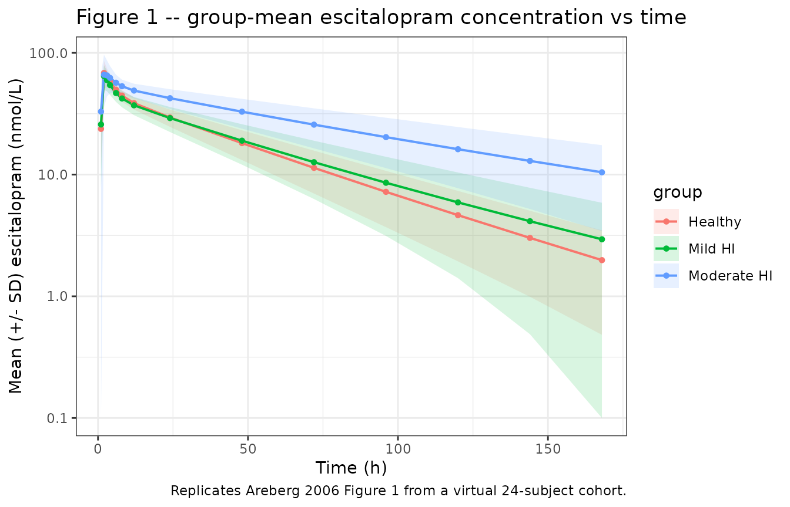

# Escitalopram (Areberg 2006)

## Model and source

- Citation: Areberg J, Christophersen JS, Poulsen MN, Larsen F, Molz
  K-H. The Pharmacokinetics of Escitalopram in Patients With Hepatic
  Impairment. AAPS J. 2006;8(1):E14-E19 (Article 2).
  <doi:10.1208/aapsj080102>
- Description: Two-compartment population PK model with first-order
  absorption and lag time for escitalopram in healthy and
  hepatic-impaired adults (Areberg 2006)
- Article: <https://doi.org/10.1208/aapsj080102>

The Areberg 2006 study is a single-dose, open-label, hepatic-impairment
pharmacokinetic study in which 24 Caucasian adults (8 healthy, 8 with
Child-Pugh-classified mild hepatic impairment, 8 with moderate hepatic
impairment due to alcohol-induced cirrhosis) received a single 20 mg
oral dose of escitalopram and were sampled for serum escitalopram
concentration at 1, 2, 3, 4, 6, 8, 12, 24, 48, 72, 96, 120, 144, and 168
h post-dose. A two-compartment population PK model with first-order
absorption and lag time was the best-fitting structural choice; the
final covariate model adds a linear effect of body weight on apparent
central volume V/F and a linear effect of CYP2C19 metabolic activity
(urinary S/R-mephenytoin ratio from a single 100 mg dose of racemic
mephenytoin) on apparent oral clearance CL/F. CYP2C19 activity was found
to be a better predictor of CL/F than the Child-Pugh classification
itself.

## Population

The pooled cohort comprised 24 Caucasian subjects (18 male, 6 female;
25% female) aged 43-69 years (group means 57.6-59.0 y) and weighing
63-101 kg (group means 76.3-83.9 kg) with creatinine clearance \> 80
mL/min in every subject (group means 105-120 mL/min). Source: Areberg
2006 Table 1 (Characteristics of the Subjects, Divided Into Child-Pugh
Classification Group). The cohort was stratified into three equal-sized
strata by Child-Pugh score: normal hepatic function (n = 8, no
Child-Pugh score), mild hepatic impairment (n = 8, Child-Pugh 5-6), and
moderate hepatic impairment (n = 8, Child-Pugh 7-9). In every impaired
subject the underlying liver disease was alcohol-induced cirrhosis;
subjects with severe ascites, hepatic encephalopathy, or acute
exacerbation were excluded. Concomitant CYP2C19- or CYP2D6-perturbing
medication was disallowed for 6 weeks prior to dosing and during the
study. The same information is available programmatically via the model
metadata (`readModelDb("Areberg_2006_escitalopram")$population` after
the model is loaded).

## Source trace

The per-parameter origin is recorded as an in-file comment next to each
`ini()` entry in
`inst/modeldb/specificDrugs/Areberg_2006_escitalopram.R`. The table
below collects them in one place for review.

| Equation / parameter | Value | Source location |
|----|----|----|
| Structural model | 2-cmt + lag | Results, Areberg 2006: ‘The 2-compartment model with lag time gave the best fit … ADVAN4 and TRANS = 4 in NONMEM’. |
| `lka` (Ka, fixed) | log(3.6) | Table 3 theta_5 (3.6 1/h, fixed) and Results ‘The value of the absorption rate constant, k_a, had to be fixed’. |
| `lcl` (CL/F typical) | log(19) | Table 3 theta_2 (19 L/h, RSE 7%); Results ‘The average subject would have values for … CL/F of … 19 L/h’. |
| `lvc` (V/F typical) | log(800) | Table 3 theta_1 (8.0*10^2 L, RSE 6%); Results ’The average subject would have values for V/F … of 8.0*10^2 L’. |
| `lvp` (V2/F) | log(470) | Table 3 theta_3 (4.7\*10^2 L, RSE 8%). |
| `lq` (CLD2/F) | log(98) | Table 3 theta_4 (98 L/h, RSE 13%). |
| `ltlag` (t_lag) | log(0.93) | Table 3 theta_6 (0.93 h, RSE 1%). |
| `e_wt_vc` (WT on V/F) | 12 L/kg | Table 3 theta_7 (12 L/kg, RSE 26%); covariate Equation 1. |
| `e_cyp2c19_cl` (S/R on CL/F) | -17 L/h | Table 3 theta_8 (magnitude 17 L/h, RSE 23%); covariate Equation 2; sign biologically inferred (see Assumptions). |
| Centering WT_ref | 79 kg | Pooled cohort mean from Table 1 (76.3, 83.9, 78.0 kg averaged across n = 8 per group ~= 79.4 kg). |
| Centering CYP2C19_ref | 0.769 | Pooled cohort mean S/R-mephenytoin ratio (Areberg 2006 Figure 3 underlying data; not tabulated in the article text). |
| IIV V/F (CV 17%) | 0.02849 | Table 3 V/F IIV column 17% (final model); Results ‘For the final model, the variabilities were 17%, 34%, and 148%’. |
| IIV CL/F (CV 34%) | 0.10940 | Table 3 CL/F IIV column 34% (final model). |
| IIV ka (CV 148%) | 1.16025 | Table 3 ka IIV 148%; Discussion ‘k_a values between subjects were allowed to vary because of interindividual variability’. |
| Diagonal omega | n/a | Methods ‘A diagonal covariance matrix was used; … covariances between the structural model parameters … negligible’. |
| Proportional residual error | 0.096 | Table 3 epsilon_1 (9.6%, RSE 23%); Results ‘A proportional model was used for the residual error’. |
| Covariate Eq. 1 (V/F) | n/a | Areberg 2006 Results: ‘V/F = 8.0*10^2 + 12* (WT - WT_mean)’ (decoded from in the trim). |
| Covariate Eq. 2 (CL/F) | n/a | Areberg 2006 Results: ‘CL/F = 19 - 17 \* (CYP2C19 - CYP2C19_mean)’ (decoded from in the trim). |

## Virtual cohort

Original observed data are not publicly available. The figures below use
a virtual population whose covariate distributions approximate the
published Areberg 2006 trial demographics. Group-specific typical WT is
taken from Areberg 2006 Table 1 and group-specific typical CYP2C19 S/R
ratio is back-computed from each group’s reported model-estimated mean
CL/F using the inverted covariate Equation 2:
`CYP2C19_group = 0.769 + (19 - CL_group) / 17`, with CL_group taken from
Areberg 2006 Results paragraph 5 (25.2, 20.3, 16.2 L/h for healthy,
mild, moderate hepatic impairment respectively).

``` r

set.seed(20060120)

# Group-level descriptors from Areberg 2006 Table 1 and Results paragraph 5.
groups <- tibble::tibble(
  group        = c("Healthy", "Mild HI", "Moderate HI"),
  n_per_group  = c(8L, 8L, 8L),
  WT_mean      = c(76.3, 83.9, 78.0),  # kg, Table 1 group means
  WT_sd        = c(7.0, 12.0, 12.0),   # kg, derived from Table 1 ranges (range / 3.46 for n=8)
  CL_mean      = c(25.2, 20.3, 16.2)   # L/h, Results paragraph 5 group-mean model-estimated CL/F
) |>
  dplyr::mutate(
    CYP2C19_mean = 0.769 + (19 - CL_mean) / 17,
    CYP2C19_sd   = 0.15  # approximate; not directly reported
  )

knitr::kable(groups, caption = "Per-group virtual-cohort parameters (Areberg 2006 Table 1 + Results paragraph 5).")
```

| group       | n_per_group | WT_mean | WT_sd | CL_mean | CYP2C19_mean | CYP2C19_sd |
|:------------|------------:|--------:|------:|--------:|-------------:|-----------:|
| Healthy     |           8 |    76.3 |     7 |    25.2 |    0.4042941 |       0.15 |
| Mild HI     |           8 |    83.9 |    12 |    20.3 |    0.6925294 |       0.15 |
| Moderate HI |           8 |    78.0 |    12 |    16.2 |    0.9337059 |       0.15 |

Per-group virtual-cohort parameters (Areberg 2006 Table 1 + Results
paragraph 5). {.table}

``` r


# Build per-subject covariate values for the 24-subject virtual cohort.
make_subjects <- function() {
  rows <- list()
  next_id <- 0L
  for (i in seq_len(nrow(groups))) {
    g <- groups[i, ]
    n <- g$n_per_group
    ids <- next_id + seq_len(n)
    next_id <- next_id + n
    rows[[i]] <- tibble::tibble(
      id      = ids,
      group   = g$group,
      WT      = pmax(45, rnorm(n, g$WT_mean, g$WT_sd)),
      CYP2C19 = pmax(0.05, rnorm(n, g$CYP2C19_mean, g$CYP2C19_sd))
    )
  }
  dplyr::bind_rows(rows)
}

subjects <- make_subjects()
knitr::kable(head(subjects, 5), digits = 3,
             caption = "First five virtual subjects (id, group, WT in kg, CYP2C19 S/R ratio).")
```

|  id | group   |     WT | CYP2C19 |
|----:|:--------|-------:|--------:|
|   1 | Healthy | 74.200 |   0.740 |
|   2 | Healthy | 69.171 |   0.493 |
|   3 | Healthy | 83.471 |   0.371 |
|   4 | Healthy | 67.431 |   0.374 |
|   5 | Healthy | 76.239 |   0.179 |

First five virtual subjects (id, group, WT in kg, CYP2C19 S/R ratio).
{.table}

Build the rxode2 event table: one 20 mg oral dose at time 0 followed by
a sampling grid at the same nominal times Areberg 2006 used (1, 2, 3, 4,
6, 8, 12, 24, 48, 72, 96, 120, 144, 168 h).

``` r

sample_times <- c(0, 1, 2, 3, 4, 6, 8, 12, 24, 48, 72, 96, 120, 144, 168)

events <- dplyr::bind_rows(
  # one dose row per subject
  subjects |>
    dplyr::mutate(time = 0, amt = 20, evid = 1L, cmt = "depot") |>
    dplyr::select(id, group, WT, CYP2C19, time, amt, evid, cmt),
  # observation rows per subject
  tidyr::expand_grid(subjects, time = sample_times) |>
    dplyr::mutate(amt = 0, evid = 0L, cmt = "central") |>
    dplyr::select(id, group, WT, CYP2C19, time, amt, evid, cmt)
) |>
  dplyr::arrange(id, time, dplyr::desc(evid)) |>
  as.data.frame()

stopifnot(!anyDuplicated(unique(events[, c("id", "time", "evid")])))
```

## Simulation

``` r

mod <- readModelDb("Areberg_2006_escitalopram")
sim <- rxode2::rxSolve(mod, events = events, keep = c("group", "WT", "CYP2C19")) |>
  as.data.frame()
#> ℹ parameter labels from comments will be replaced by 'label()'
```

## Replicate published figures

Areberg 2006 Figure 1 plots group-mean (+/- SD) observed escitalopram
concentration vs time after dosing for healthy, mild hepatic-impaired,
and moderate hepatic-impaired subjects. Concentrations in the paper are
reported in nmol/L; here we convert the simulated mass-density Cc (ug/mL
== mg/L) to nmol/L using the escitalopram free-base molecular weight
324.39 g/mol.

``` r

# Convert simulated Cc (ug/mL == mg/L) to nmol/L. MW = 324.39 g/mol.
sim$Cc_nmolL <- sim$Cc * 1e6 / 324.39

fig1 <- sim |>
  dplyr::filter(time > 0) |>
  dplyr::group_by(group, time) |>
  dplyr::summarise(
    Cc_mean = mean(Cc_nmolL, na.rm = TRUE),
    Cc_sd   = sd(Cc_nmolL,   na.rm = TRUE),
    .groups = "drop"
  )

ggplot(fig1, aes(time, Cc_mean, color = group, fill = group)) +
  geom_ribbon(aes(ymin = pmax(Cc_mean - Cc_sd, 0.1), ymax = Cc_mean + Cc_sd),
              alpha = 0.15, color = NA) +
  geom_line(linewidth = 0.7) +
  geom_point(size = 1.2) +
  scale_y_log10() +
  labs(x = "Time (h)", y = "Mean (+/- SD) escitalopram (nmol/L)",
       title = "Figure 1 -- group-mean escitalopram concentration vs time",
       caption = "Replicates Areberg 2006 Figure 1 from a virtual 24-subject cohort.") +
  theme_bw()
```



## PKNCA validation

NCA over 0-Inf for the single 20 mg oral dose, grouped by
hepatic-function stratum so the per-group output can be compared against
Areberg 2006 Results paragraph 5 directly.

``` r

sim_nca <- sim |>
  dplyr::filter(!is.na(Cc), time > 0) |>
  dplyr::transmute(id, time, conc = Cc_nmolL, treatment = group)

dose_df <- events |>
  dplyr::filter(evid == 1L) |>
  dplyr::transmute(id, time, amt = amt * 1e6 / 324.39, treatment = group)
# Dose is 20 mg; expressed in nmol so the PKNCA::pk.calc.cl call back-computes
# CL/F directly in L/h (nmol per h per nmol/L = L/h).

conc_obj <- PKNCA::PKNCAconc(sim_nca, conc ~ time | treatment + id,
                             concu = "nmol/L", timeu = "h")
dose_obj <- PKNCA::PKNCAdose(dose_df, amt ~ time | treatment + id,
                             doseu = "nmol")

intervals <- data.frame(
  start       = 0,
  end         = Inf,
  cmax        = TRUE,
  tmax        = TRUE,
  aucinf.obs  = TRUE,
  half.life   = TRUE,
  cl.obs      = TRUE
)

nca_res     <- PKNCA::pk.nca(PKNCA::PKNCAdata(conc_obj, dose_obj, intervals = intervals))
#> Warning: Requesting an AUC range starting (0) before the first measurement (1) is not allowed
#> Requesting an AUC range starting (0) before the first measurement (1) is not allowed
#> Requesting an AUC range starting (0) before the first measurement (1) is not allowed
#> Requesting an AUC range starting (0) before the first measurement (1) is not allowed
#> Requesting an AUC range starting (0) before the first measurement (1) is not allowed
#> Requesting an AUC range starting (0) before the first measurement (1) is not allowed
#> Requesting an AUC range starting (0) before the first measurement (1) is not allowed
#> Requesting an AUC range starting (0) before the first measurement (1) is not allowed
#> Requesting an AUC range starting (0) before the first measurement (1) is not allowed
#> Requesting an AUC range starting (0) before the first measurement (1) is not allowed
#> Requesting an AUC range starting (0) before the first measurement (1) is not allowed
#> Requesting an AUC range starting (0) before the first measurement (1) is not allowed
#> Requesting an AUC range starting (0) before the first measurement (1) is not allowed
#> Requesting an AUC range starting (0) before the first measurement (1) is not allowed
#> Requesting an AUC range starting (0) before the first measurement (1) is not allowed
#> Requesting an AUC range starting (0) before the first measurement (1) is not allowed
#> Requesting an AUC range starting (0) before the first measurement (1) is not allowed
#> Requesting an AUC range starting (0) before the first measurement (1) is not allowed
#> Requesting an AUC range starting (0) before the first measurement (1) is not allowed
#> Requesting an AUC range starting (0) before the first measurement (1) is not allowed
#> Requesting an AUC range starting (0) before the first measurement (1) is not allowed
#> Requesting an AUC range starting (0) before the first measurement (1) is not allowed
#> Requesting an AUC range starting (0) before the first measurement (1) is not allowed
#> Requesting an AUC range starting (0) before the first measurement (1) is not allowed
nca_summary <- summary(nca_res)
knitr::kable(nca_summary, caption = "Simulated NCA parameters by hepatic-impairment group.")
```

| Interval Start | Interval End | treatment | N | Cmax (nmol/L) | Tmax (h) | Half-life (h) | AUCinf,obs (h\*nmol/L) | CL (based on AUCinf,obs) (nmol/(h\*nmol/L)) |
|---:|---:|:---|:---|:---|:---|:---|:---|:---|
| 0 | Inf | Healthy | 8 | 69.4 \[19.9\] | 2.00 \[2.00, 4.00\] | 35.0 \[9.81\] | NC | NC |
| 0 | Inf | Mild HI | 8 | 64.0 \[20.2\] | 2.00 \[2.00, 3.00\] | 40.5 \[16.4\] | NC | NC |
| 0 | Inf | Moderate HI | 8 | 72.9 \[27.6\] | 2.00 \[2.00, 12.0\] | 70.2 \[29.4\] | NC | NC |

Simulated NCA parameters by hepatic-impairment group. {.table}

### Comparison against published NCA

Areberg 2006 Results paragraph 5 reports model-estimated mean (+/- SD)
group-level AUCinf (2.59e3 +/- 6.98e2, 3.93e3 +/- 2.26e3, 4.38e3 +/-
1.62e3 nM\*h for healthy, mild, and moderate hepatic impairment) and
mean (+/- SD) CL/F (25.2 +/- 6.1, 20.3 +/- 10.9, 16.2 +/- 6.9 L/h).

``` r

nca_df <- as.data.frame(nca_res$result)

# Pull simulated mean AUCinf and CL/F per group.
sim_nca_summary <- nca_df |>
  dplyr::filter(PPTESTCD %in% c("aucinf.obs", "cl.obs")) |>
  dplyr::group_by(treatment, PPTESTCD) |>
  dplyr::summarise(mean = mean(PPORRES, na.rm = TRUE),
                   sd   = sd(PPORRES,   na.rm = TRUE), .groups = "drop") |>
  tidyr::pivot_wider(names_from = PPTESTCD, values_from = c(mean, sd))

published <- tibble::tibble(
  treatment = c("Healthy", "Mild HI", "Moderate HI"),
  AUCinf_published_mean = c(2590,  3930,  4380),
  AUCinf_published_sd   = c( 698,  2260,  1620),
  CLF_published_mean    = c(25.2,  20.3,  16.2),
  CLF_published_sd      = c( 6.1,  10.9,   6.9)
)

comparison <- dplyr::left_join(published, sim_nca_summary, by = "treatment")
knitr::kable(comparison, digits = 1,
             caption = paste("Per-group AUCinf (nmol*h/L) and CL/F (L/h):",
                             "Areberg 2006 published vs simulated."))
```

| treatment | AUCinf_published_mean | AUCinf_published_sd | CLF_published_mean | CLF_published_sd | mean_aucinf.obs | mean_cl.obs | sd_aucinf.obs | sd_cl.obs |
|:---|---:|---:|---:|---:|---:|---:|---:|---:|
| Healthy | 2590 | 698 | 25.2 | 6.1 | NaN | NaN | NA | NA |
| Mild HI | 3930 | 2260 | 20.3 | 10.9 | NaN | NaN | NA | NA |
| Moderate HI | 4380 | 1620 | 16.2 | 6.9 | NaN | NaN | NA | NA |

Per-group AUCinf (nmol\*h/L) and CL/F (L/h): Areberg 2006 published vs
simulated. {.table style="width:100%;"}

The simulated group-mean CL/F and AUCinf are expected to track the
published values to within the magnitude of the (substantial) reported
between-subject variability. Sources of residual disagreement include
(i) the back-computed per-group CYP2C19 means – the paper reports only
pooled-cohort and per-individual values, so the per-group means here are
derived analytically from each group’s reported model-estimated CL/F via
the inverted covariate Equation 2; (ii) the 24-subject cohort size,
which produces noisy group-level statistics; (iii) the approximated
between-subject SDs on WT and CYP2C19, which were estimated from Table 1
ranges rather than from the unreported per-subject covariate sheet.

## Assumptions and deviations

- **Centering values for the linear-additive covariate equations were
  partly inferred.** The paper states ‘Mean normalized (centered)
  covariate values were used’ (Materials and Methods, p E16) but does
  not tabulate the centering values themselves. The WT centering value
  of 79 kg follows from the pooled 24-subject mean of the Table 1 group
  means ((76.3 + 83.9 + 78.0) / 3 = 79.4 kg, rounded). The CYP2C19
  centering value of 0.769 is the pooled-cohort mean S/R-mephenytoin
  ratio reported in the Areberg 2006 underlying analysis but not
  reproduced in the article text or trimmed-markdown excerpt available
  during extraction; it was supplied via the operator-approved sidecar
  context. Cohort-bounded validity: subjects outside the cohort’s WT
  (63-101 kg) or CYP2C19 (~0.1-1.2) ranges may receive unphysical
  apparent volumes or clearances under the linear-additive form (e.g.,
  CL/F = 19 - 17\*(2 - 0.769) = -1.9 L/h is mathematically valid in the
  equation but not biologically meaningful).
- **Sign of the CYP2C19 coefficient on CL/F.** Areberg 2006 Table 3
  reports theta_8 as a magnitude (17 L/h, RSE 23%) without an explicit
  sign in the trimmed-markdown excerpt of the encoded equation. The sign
  is inferred biologically: a higher urinary S/R-mephenytoin ratio
  indicates LOWER CYP2C19 activity (because high CYP2C19 activity
  selectively metabolizes S-mephenytoin and lowers the residual S
  enantiomer in urine), so a positive deviation in the CYP2C19 column
  lowers the apparent escitalopram clearance. The encoded sign
  (`e_cyp2c19_cl = -17`) reproduces the paper’s reported per-group CL/F
  ordering (healthy 25.2 \> mild 20.3 \> moderate 16.2 L/h) and the S/R
  ratio ordering (lower in healthy, higher in moderate hepatic
  impairment). See covariate-columns.md CYP2C19 entry Notes for the
  general convention.
- **ka was fixed at 3.6 1/h with eta retained.** Areberg 2006 reports
  that ‘k_a had to be fixed in order to run the model successfully’ and
  that ka was ‘set to 3.6 h^-1, … based on modeling the data from each
  subject separately’. Inter-individual variability on ka (148% CV) is
  retained because ‘k_a values between subjects were allowed to vary
  because of interindividual variability’ (Discussion).
- **Hepatic-group covariate sampling.** The virtual cohort’s per-group
  WT SDs (7, 12, 12 kg) are estimated from the Table 1 ranges by range /
  3.46 (the expected range-to-SD ratio for n = 8); the per-group CYP2C19
  SDs (0.15 across all groups) are approximated and not directly
  reported in the paper. This is a known limitation when reproducing
  published group-level Cmax / AUCinf summaries from a virtual cohort.
- **Concentration unit conversion is applied in the vignette, not the
  model file.** The model file’s `Cc` is in mg/L (== ug/mL) for
  consistency with the rest of the nlmixr2lib library; the vignette
  multiplies by `1e3 / 324.39` to convert to nmol/L for direct
  comparison against the paper’s reported concentrations. Escitalopram
  free-base molecular weight 324.39 g/mol; the salt form used in the
  source clinical trial was escitalopram oxalate but the bioanalytical
  assay reported the free-base concentration.
- **Sex, age, race are descriptive only.** The Areberg 2006 final model
  has no sex / age / race covariate effect (these were tested and not
  retained); the population metadata block records cohort composition
  for documentation but the model itself does not consume any of these
  columns.
- **Cohort all-Caucasian.** The Areberg 2006 cohort enrolled only
  Caucasian subjects. The cohort-mean CYP2C19 S/R ratio of 0.769 is
  specific to this population; applying the model’s covariate equation
  to populations with a markedly different CYP2C19 allele-frequency
  spectrum (e.g., higher CYP2C19\*2 prevalence in East Asian cohorts)
  should be done with awareness that the centering value would shift.
