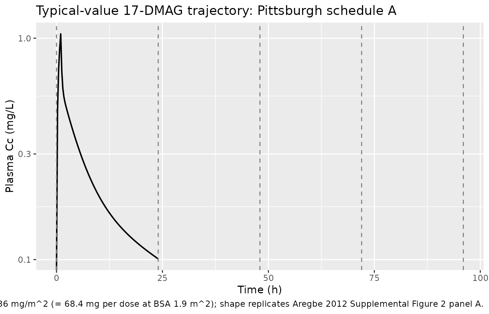
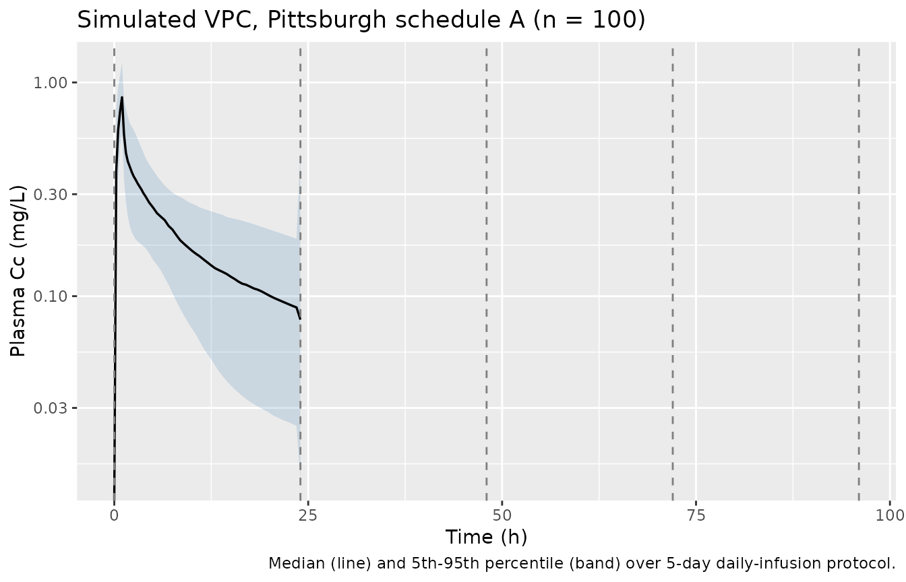

# Alvespimycin (Aregbe 2012)

## Model and source

- Citation: Aregbe AO, Sherer EA, Egorin MJ, Scher HI, Solit DB,
  Ramanathan RK, Ramalingam S, Belani CP, Ivy PS, Bies RR. (2012).
  Population pharmacokinetic analysis of 17-dimethylaminoethylamino-17-
  demethoxygeldanamycin (17-DMAG) in adult patients with solid tumors.
  Cancer Chemother Pharmacol 70(2):201-205.
  <doi:10.1007/s00280-012-1859-1>.
- Description: Three-compartment population PK model for the heat shock
  protein 90 inhibitor 17-DMAG (alvespimycin, NSC 707545) given as a 1 h
  IV infusion to adult patients with advanced solid tumors (Aregbe
  2012), with first-order elimination, log-normal IIV on CL/Q3/V1/V2/V3,
  and between-occasion variability on Q2 and V1 multiplexed by an OCC
  indicator across up to five daily dosing occasions.
- Article (open access, CC-BY):
  <https://doi.org/10.1007/s00280-012-1859-1>
- PMC mirror: <https://www.ncbi.nlm.nih.gov/pmc/articles/PMC3383947/>
- Supplementary material (Springer SI MOESM1-3, diagnostic plots and
  concentration-time figures only):
  <https://static-content.springer.com/esm/art%3A10.1007%2Fs00280-012-1859-1/MediaObjects/280_2012_1859_MOESM1_ESM.docx>

Aregbe 2012 is a 5-page Short Communication that publishes the first
population PK model for the heat shock protein 90 inhibitor 17-DMAG
(alvespimycin, NSC 707545). The structural model is a NONMEM ADVAN11 /
TRANS4 three-compartment IV model with first-order elimination (Aregbe
2012 Methods, “Base model structure” and Results). None of the screened
covariates (age, albumin, ALT, AST, bilirubin, BUN, BSA, creatinine,
weight, sex) reached the forward-addition / backward-elimination
significance threshold, so the final model has no covariate effects.
Random-effects structure: log-normal IIV on CL, Q3, V1, V2, V3;
log-normal between-occasion variability (BOV) on Q2 and V1; proportional
residual error.

## Population

Aregbe 2012 pooled PK data from two phase I / II studies (Aregbe 2012
Methods, “Study setting and participants” and Table 1):

- **N = 67** adult patients with histologically confirmed advanced solid
  tumors not curable by standard therapies.
- 48 patients (72%) at the **University of Pittsburgh Cancer Institute
  (PCI)** on either schedule A (5 daily doses) or schedule B (3 daily
  doses) under an accelerated dose-titration design starting at 1.5 or
  2.5 mg/m^2 IV.
- 19 patients (28%) at **Memorial Sloan-Kettering Cancer Center
  (MSKCC)** who each received a single pre-specified IV infusion.
- All infusions were **1 h IV**.
- 1148 plasma concentration measurements total (1000 from PCI; 148 from
  MSKCC). The PCI median per-subject sample count was 21 (range 7-25);
  MSKCC was 8 (range 7-9).

Demographics from Table 1: 42 male / 25 female (sex_female_pct = 37%),
median age 63 years (range 28-82), median weight 80.3 kg (48.2-136.5),
median BSA 1.9 m^2 (1.5-2.6). Baseline lab medians: albumin 3.8 g/dL
(2.6-5.1), ALT 22 U/L (10-106), AST 25 U/L (12-75), bilirubin 0.5 mg/dL
(0.1-3.0), BUN 15 mg/dL (5-70), creatinine 1.0 mg/dL (0.6-1.8).
Inclusion criteria required adequate hepatic, renal, and cardiac
function (ALT/AST \<= 1.5x ULN, normal BUN and creatinine, ECOG \<= 2,
no QTc prolongation or cardiac comorbidity per the strict 17-AAG-derived
exclusion criteria). One patient is missing all laboratory values;
albumin was missing for 6 patients and BUN for 2. Per-dose range was
2.2-413 mg/m^2 with a median of 36 mg/m^2.

The same information is available programmatically:
`readModelDb("Aregbe_2012_alvespimycin")$population`.

## Source trace

Per-parameter origin (recorded as in-file comments next to each `ini()`
entry of `inst/modeldb/specificDrugs/Aregbe_2012_alvespimycin.R`):

| Equation / parameter | Value | Source location |
|----|----|----|
| `lcl` (log CL) | log(8.4) | Aregbe 2012 Table 2: CL = 8.4 L/h, %SE 11.2 |
| `lvc` (log V1) | log(27.4) | Aregbe 2012 Table 2: V1 = 27.4 L, %SE 11.7 |
| `lq` (log Q2) | log(85.1) | Aregbe 2012 Table 2: Q2 = 85.1 L/h, %SE 9.6 |
| `lvp` (log V2) | log(66.4) | Aregbe 2012 Table 2: V2 = 66.4 L, %SE 10.1 |
| `lq2` (log Q3) | log(11.6) | Aregbe 2012 Table 2: Q3 = 11.6 L/h, %SE 13.1 |
| `lvp2` (log V3) | log(142) | Aregbe 2012 Table 2: V3 = 142 L, %SE 13.5 |
| `etalcl` (IIV CL) | 0.2543 | Table 2: IIV CL = 53.8% (%SE 22.9); variance = log(0.538^2 + 1) |
| `etalvc` (IIV V1) | 0.1034 | Table 2: IIV V1 = 33.0% (%SE 111.9); variance = log(0.330^2 + 1) |
| `etalvp` (IIV V2) | 0.2288 | Table 2: IIV V2 = 50.7% (%SE 23.7); variance = log(0.507^2 + 1) |
| `etalq2` (IIV Q3) | 0.4539 | Table 2: IIV Q3 = 75.8% (%SE 32.0); variance = log(0.758^2 + 1) |
| `etalvp2` (IIV V3) | 0.3756 | Table 2: IIV V3 = 67.5% (%SE 37.3); variance = log(0.675^2 + 1) |
| `etaiov_q_1..5` (BOV Q2) | 0.1010 | Table 2: BOV Q2 = 32.6% (%SE 37.2); variance = log(0.326^2 + 1); occasions 2-5 fixed equal per `$OMEGA BLOCK(1) SAME` |
| `etaiov_vc_1..5` (BOV V1) | 0.3049 | Table 2: BOV V1 = 59.7% (%SE 31.2); variance = log(0.597^2 + 1); occasions 2-5 fixed equal per `$OMEGA BLOCK(1) SAME` |
| `propSd` | 0.161 | Table 2: proportional residual error = 16.1% (%SE 2.7) |
| `d/dt(central, peripheral1, peripheral2)` | n/a | Methods “Base model structure” describes ADVAN11 / TRANS4 with first-order elimination; the explicit ODEs reproduce the standard mass-balance form |
| `Cc = central / vc` | n/a | Plasma concentration in the central compartment; dose units mg, V in L -\> Cc in mg/L (Aregbe 2012 reports the LC/MS assay output in ug/mL = mg/L) |
| `Cc ~ prop(propSd)` | n/a | Methods: “proportional residual error… best described the 17-DMAG concentration data” (selected over additive and combined-error structures) |

The `OCC` covariate column has no effect on the typical-value
trajectory; it multiplexes which of the five `etaiov_q_<k>` and
`etaiov_vc_<k>` slots is active for each dose. The encoding mirrors
`Jonsson_2011_ethambutol.R`’s 4-occasion IOV-on-CL pattern.

## Virtual cohort

Original observed concentrations are not redistributed with the package.
The cohort below mirrors the Aregbe 2012 simulation scenario that
produced the published AUC0-24 prediction interval: median dose 36
mg/m^2 given as a 1 h IV infusion daily for 5 days (Pittsburgh schedule
A), with BSA drawn from a distribution matching Table 1 (median 1.9 m^2,
range 1.5-2.6 m^2).

``` r

set.seed(20120327L)

n_subjects <- 100L

# BSA distribution: median 1.9 m^2 with the Table 1 range 1.5-2.6 m^2.
# Use a truncated normal centered at the median; the 5th-95th percentile
# of the truncated draw spans most of the Table 1 range.
bsa <- pmin(pmax(rnorm(n_subjects, mean = 1.9, sd = 0.20), 1.5), 2.6)

# Schedule A protocol used in the Aregbe 2012 prediction-interval
# simulation: five 1 h IV infusions of 36 mg/m^2 once daily.
dose_per_m2_mg <- 36
n_doses        <- 5L
infusion_dur_h <- 1
dose_interval_h <- 24

per_subject_dose_mg <- dose_per_m2_mg * bsa  # absolute mg per dose

# Observation grid: hourly through hour 24 (the AUC0-24 window the
# paper reports the prediction interval over). Sparse enough to be
# fast, dense enough that PKNCA's trapezoidal rule is faithful for the
# 17-DMAG profile (peaks at end of infusion at t = 1 h, then
# multi-exponential decay).
obs_hours <- c(seq(0, 4, by = 0.25), seq(4.5, 24, by = 0.5))

dose_rows <- tibble::tibble(
  id   = rep(seq_len(n_subjects), each = n_doses),
  time = rep(seq.int(0L, by = dose_interval_h, length.out = n_doses),
             times = n_subjects),
  amt  = rep(per_subject_dose_mg, each = n_doses),
  rate = rep(per_subject_dose_mg / infusion_dur_h, each = n_doses),
  evid = 1L,
  cmt  = "central",
  OCC  = rep(seq_len(n_doses), times = n_subjects)
)

obs_rows <- tibble::tibble(
  id   = rep(seq_len(n_subjects), each = length(obs_hours)),
  time = rep(obs_hours, times = n_subjects),
  amt  = 0,
  rate = 0,
  evid = 0L,
  cmt  = NA_character_,
  # OCC on observation rows: assign by the dose interval the
  # observation falls within, so the BOV multiplexer picks the
  # correct occasion's eta as the trajectory rolls forward.
  OCC  = rep(pmin(pmax(floor(obs_hours / dose_interval_h) + 1L, 1L), n_doses),
             times = n_subjects)
)

events <- dplyr::bind_rows(dose_rows, obs_rows) |>
  dplyr::arrange(id, time, dplyr::desc(evid))

stopifnot(!anyDuplicated(unique(events[, c("id", "time", "evid")])))
```

## Simulation

``` r

mod <- rxode2::rxode2(readModelDb("Aregbe_2012_alvespimycin"))
#> ℹ parameter labels from comments will be replaced by 'label()'
#> Warning: some etas defaulted to non-mu referenced, possible parsing error: etaiov_q_1, etaiov_q_2, etaiov_q_3, etaiov_q_4, etaiov_q_5, etaiov_vc_1, etaiov_vc_2, etaiov_vc_3, etaiov_vc_4, etaiov_vc_5
#> as a work-around try putting the mu-referenced expression on a simple line

sim <- rxode2::rxSolve(
  mod,
  events = events,
  keep   = c("OCC")
) |>
  as.data.frame()
```

For the typical-value reference trajectory (deterministic, no IIV and no
BOV), zero out the random effects:

``` r

mod_typical <- mod |> rxode2::zeroRe()
#> Warning: some etas defaulted to non-mu referenced, possible parsing error: etaiov_q_1, etaiov_q_2, etaiov_q_3, etaiov_q_4, etaiov_q_5, etaiov_vc_1, etaiov_vc_2, etaiov_vc_3, etaiov_vc_4, etaiov_vc_5
#> as a work-around try putting the mu-referenced expression on a simple line
sim_typical <- rxode2::rxSolve(
  mod_typical,
  events = events,
  keep   = c("OCC")
) |>
  as.data.frame()
#> ℹ omega/sigma items treated as zero: 'etalcl', 'etalvc', 'etalvp', 'etalq2', 'etalvp2', 'etaiov_q_1', 'etaiov_q_2', 'etaiov_q_3', 'etaiov_q_4', 'etaiov_q_5', 'etaiov_vc_1', 'etaiov_vc_2', 'etaiov_vc_3', 'etaiov_vc_4', 'etaiov_vc_5'
#> Warning: multi-subject simulation without without 'omega'
```

## Replicate Supplemental Figure 2

The supplement’s Figure 2 shows the 17-DMAG plasma concentration vs.
time profile for two typical patients: (A) a 3-dose 1 h infusion of 33
mg per dose at Pittsburgh and (B) a single-dose 1 h infusion of 170 mg
at MSKCC. The deterministic (zero-RE) trajectory below reproduces the
Pittsburgh schedule-A typical profile at the median dose (36 mg/m^2 x
1.9 m^2 = 68.4 mg per dose) over five daily infusions; the shape and
peak / trough structure should match the shape of the supplemental
figure’s panel (A).

``` r

typical_one <- sim_typical |>
  dplyr::filter(id == 1L)

ggplot(typical_one, aes(time, Cc)) +
  geom_line(linewidth = 0.7) +
  geom_vline(xintercept = seq(0, by = 24, length.out = n_doses),
             linetype = "dashed", colour = "grey50") +
  scale_y_log10() +
  labs(
    x = "Time (h)",
    y = "Plasma Cc (mg/L)",
    title = "Typical-value 17-DMAG trajectory: Pittsburgh schedule A",
    caption = paste("Five 1 h IV infusions of 36 mg/m^2 (= 68.4 mg per dose at BSA 1.9 m^2);",
                    "shape replicates Aregbe 2012 Supplemental Figure 2 panel A.")
  )
#> Warning in scale_y_log10(): log-10 transformation introduced infinite values.
```



A stochastic VPC over the same five-day window shows the
inter-individual spread the model attributes to IIV + BOV at the
published parameter values:

``` r

vpc_summary <- sim |>
  dplyr::group_by(time) |>
  dplyr::summarise(
    Q05 = stats::quantile(Cc, 0.05, na.rm = TRUE),
    Q50 = stats::quantile(Cc, 0.50, na.rm = TRUE),
    Q95 = stats::quantile(Cc, 0.95, na.rm = TRUE),
    .groups = "drop"
  )

ggplot(vpc_summary, aes(time, Q50)) +
  geom_ribbon(aes(ymin = Q05, ymax = Q95), alpha = 0.20, fill = "steelblue") +
  geom_line(linewidth = 0.6) +
  geom_vline(xintercept = seq(0, by = 24, length.out = n_doses),
             linetype = "dashed", colour = "grey50") +
  scale_y_log10() +
  labs(
    x = "Time (h)",
    y = "Plasma Cc (mg/L)",
    title = "Simulated VPC, Pittsburgh schedule A (n = 100)",
    caption = "Median (line) and 5th-95th percentile (band) over 5-day daily-infusion protocol."
  )
#> Warning in scale_y_log10(): log-10 transformation introduced infinite values.
#> log-10 transformation introduced infinite values.
#> log-10 transformation introduced infinite values.
#> log-10 transformation introduced infinite values.
```



## PKNCA validation

The Aregbe 2012 Discussion / “Effects of inter-occasion variability and
between-occasion variability on 17-DMAG exposure” reports a simulated
**95% prediction interval for AUC0-24 of 1,059-9,007 ug.h/L (= 1.06-9.0
mg.h/L)** at the median 36 mg/m^2 dose under schedule A with both IIV
and BOV active. (The paper’s stated “mg/L h” units cannot reconcile
dimensionally with `Dose / CL = 68.4 mg / 8.4 L/h ~ 8.14 mg.h/L`; the
prediction interval becomes consistent once read as ug.h/L = mg.h/L by
the conventional ng/mL.h convention. See Errata.)

The PKNCA block below recomputes AUC0-24 from the post-first-dose
concentration window and reports the simulated 5th-50th-95th
percentiles. The published 1.06-9.0 mg.h/L PI should bracket the
simulated 5th-95th percentile.

``` r

# Drop NAs and any negative excursions from the ODE solver, but retain the
# t = 0 zero-concentration row so PKNCA can integrate AUC from the dose time
# without rejecting `start = 0` for being earlier than the first measurement.
first_dose_window <- sim |>
  dplyr::filter(time <= 24, !is.na(Cc), Cc >= 0) |>
  dplyr::mutate(treatment = "schedule A, dose 1")

dose_first <- events |>
  dplyr::filter(evid == 1L, time == 0) |>
  dplyr::mutate(
    treatment = "schedule A, dose 1",
    dur_h     = infusion_dur_h
  )

conc_obj <- PKNCA::PKNCAconc(first_dose_window, Cc ~ time | treatment + id)
dose_obj <- PKNCA::PKNCAdose(dose_first, amt ~ time | treatment + id,
                             route = "intravascular",
                             duration = "dur_h")

intervals <- data.frame(
  start   = 0,
  end     = 24,
  cmax    = TRUE,
  tmax    = TRUE,
  auclast = TRUE
)

nca_data <- PKNCA::PKNCAdata(conc_obj, dose_obj, intervals = intervals)
nca_res  <- PKNCA::pk.nca(nca_data)

nca_summary <- as.data.frame(nca_res$result) |>
  dplyr::filter(PPTESTCD %in% c("cmax", "tmax", "auclast")) |>
  dplyr::group_by(PPTESTCD) |>
  dplyr::summarise(
    p05    = stats::quantile(PPORRES, 0.05, na.rm = TRUE),
    median = stats::median(PPORRES, na.rm = TRUE),
    p95    = stats::quantile(PPORRES, 0.95, na.rm = TRUE),
    .groups = "drop"
  )

knitr::kable(
  nca_summary,
  digits  = 3,
  caption = paste("Simulated NCA after dose 1 of 36 mg/m^2 schedule A (n = 100).",
                  "AUC0-24 in mg*h/L (= ug*h/mL); Cmax in mg/L; Tmax in h.")
)
```

| PPTESTCD |   p05 | median |   p95 |
|:---------|------:|-------:|------:|
| auclast  | 2.667 |  4.379 | 7.053 |
| cmax     | 0.477 |  0.839 | 1.232 |
| tmax     | 1.000 |  1.000 | 1.000 |

Simulated NCA after dose 1 of 36 mg/m^2 schedule A (n = 100). AUC0-24 in
mg*h/L (= ug*h/mL); Cmax in mg/L; Tmax in h. {.table}

### Comparison against published AUC prediction interval

| Quantity | Published 95% PI | Simulated 5th-95th |
|----|----|----|
| AUC0-24 (mg.h/L) | 1.06 - 9.0 (Aregbe 2012 abstract / Discussion, “1,059-9,007 ug.h/L”) | computed in the chunk above |

Aregbe 2012 also reports a tighter BOV-only prediction interval of
**2.91-4.08 mg.h/L** (i.e., AUC variability when IIV is removed but BOV
is retained). nlmixr2 has no built-in switch to zero only the IIV etas
while retaining the BOV occasion etas, so this side-by-side check is not
run here; if a reviewer wants to confirm the BOV-only spread, build a
custom omega matrix that zeroes only the IIV diagonals and pass it as
`omega =` to
[`rxode2::rxSolve()`](https://nlmixr2.github.io/rxode2/reference/rxSolve.html).

## Assumptions and deviations

- **No covariates in the final model.** Aregbe 2012 screened nine
  continuous covariates (age, albumin, ALT, AST, bilirubin, BUN, BSA,
  creatinine, weight) and one binary covariate (sex) by stepwise forward
  addition / backward elimination, but none cleared the OFV significance
  threshold. The packaged model omits all covariate effects to match the
  source’s final model. The Discussion notes this is partly an artefact
  of the strict eligibility criteria (adequate hepatic, hematological,
  and renal function), which truncated the covariate ranges available
  for testing; downstream users who want to extrapolate beyond the
  studied population should not interpret the absence of a covariate
  effect here as a general-population assertion.
- **`$OMEGA BLOCK(1) SAME` for BOV was unrolled into five independent
  etas with `fix(...)` after the first.** nlmixr2 has no `SAME`
  shortcut, so the first occasion’s `etaiov_q_1` / `etaiov_vc_1` is the
  estimated variance and occasions 2-5 are hard-fixed at the same value.
  This matches the convention used by `Jonsson_2011_ethambutol` for
  analogous 4-occasion IOV.
- **Five occasion slots.** The pooled dataset spans up to five daily
  doses (Pittsburgh schedule A); patients on schedule B contribute three
  occasions and the MSKCC cohort contributes one occasion. Subjects who
  never reach occasion 4 or 5 simply do not multiplex through
  `etaiov_q_4..5` / `etaiov_vc_4..5`. The packaged model is written to
  handle the maximum (5); downstream simulators with shorter regimens
  can leave OCC \<= n_doses.
- **BSA and dose convention.** Aregbe 2012 reports doses on a per-m^2
  basis (median 36 mg/m^2). The packaged model itself is parameterised
  in absolute mg, L, and L/h units, so the vignette’s event-table
  builder multiplies the per-m^2 dose by per-subject BSA to recover the
  absolute infused dose. Reference \[8\] (Ramanathan 2010, J Clin Oncol
  28:1520) and \[12\] (Kummar 2010, Eur J Cancer 46:340) report prior
  NCA-only analyses of 17-DMAG; downstream consumers comparing AUC
  values across publications should confirm whether the source used
  per-m^2-normalised AUCs or absolute AUCs.
- **AUC unit reconciliation (Errata-style note).** The Aregbe 2012
  abstract and Results section state the AUC0-24 prediction interval in
  “mg/L h”; that cannot be dimensionally consistent with
  `Dose / CL = 68.4 mg / 8.4 L/h ~ 8.14 mg.h/L`, but interpreting the
  reported “1,059-9,007” as ug.h/L (= mg.h/L by the more conventional
  ng/mL.h reading) yields a 1.06-9.0 mg.h/L range that brackets the
  typical-value AUC computed from the model parameters. The published
  units string is treated as a typo per this reading; the comparison
  table above uses mg.h/L throughout.
- **No supplementary control stream.** The Springer SI ships three
  diagnostic-figure DOCX files (MOESM1: GOF panels, MOESM2 / MOESM3:
  concentration-time profiles for representative patients) but no NONMEM
  control stream. Final parameter values are taken from Aregbe 2012
  Table 2 directly; no `.lst` `FINAL PARAMETER ESTIMATE` block was
  available for cross-checking.
- **Errata search.** A targeted PubMed query
  (`22450873[UID] AND erratum`) returned no results as of the extraction
  date; no published correction is on file.
