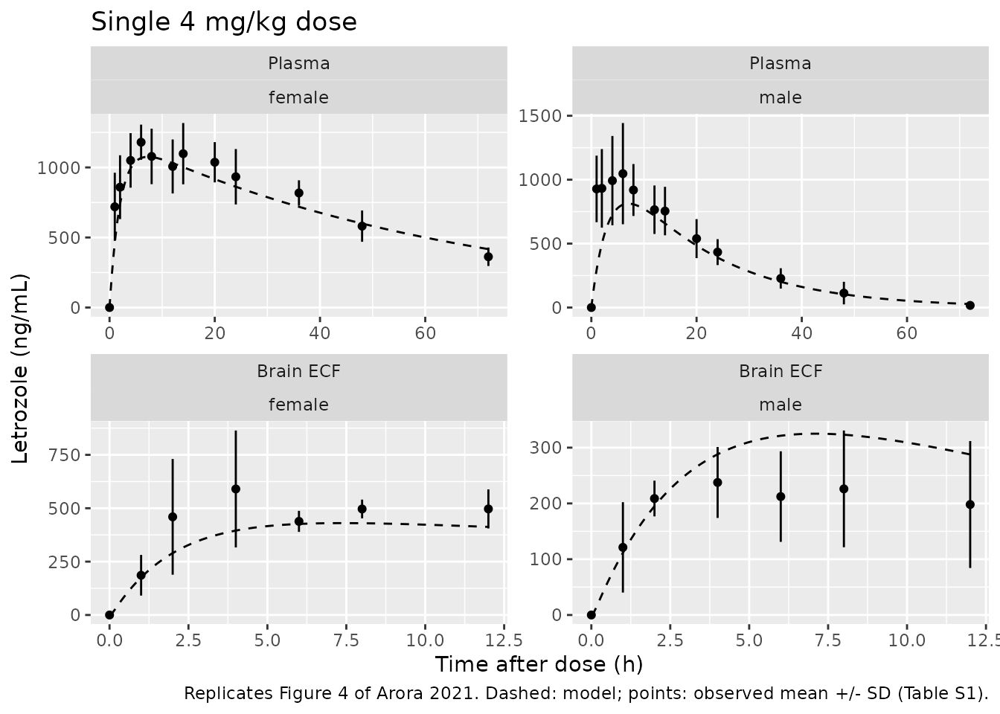
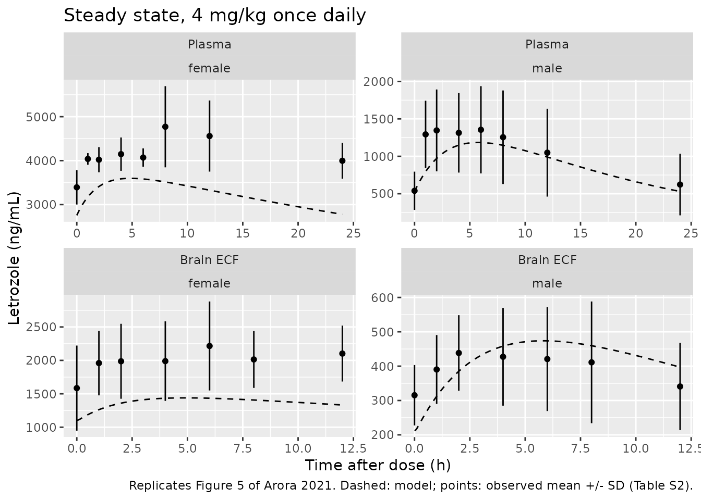

# Letrozole in rat plasma and brain (Arora 2021)

## Model and source

- Citation: Arora P, Gudelsky G, Desai PB. Gender-based differences in
  brain and plasma pharmacokinetics of letrozole in sprague-dawley rats:
  Application of physiologically-based pharmacokinetic modeling to gain
  quantitative insights. PLoS ONE. 2021;16(4):e0248579.
  <doi:10.1371/journal.pone.0248579>. PMCID PMC8018653. Drug-specific
  PBPK inputs are Table 1 (with footnotes a and b giving the per-kg
  clearance and per-gram PSB they were derived from) and Eq 3
  (Crone-Renkin PSB). PBPK-predicted versus observed NCA metrics are
  Table 4 (single dose) and Table 5 (steady state); observed NCA is
  Tables 2 and 3; individual observed concentrations are Supporting
  Information Tables S1 and S2 (figshare
  <doi:10.6084/m9.figshare.14184959.v1>).
- Description: Preclinical (rat). PBPK-derived reduced model (Simcyp
  Animal Simulator V17) for letrozole in plasma and brain extracellular
  fluid (ECF) of male and female Sprague-Dawley rats after single and
  once-daily 4 mg/kg extravascular doses. The source paper built a
  bottom-up whole-body PBPK model with the Simcyp multi-compartment
  brain model (brain blood, brain mass, CSF); the rat organ volumes,
  blood flows, tissue compositions and the Rodgers-Rowland tissue
  partition coefficients are Simcyp library values that are not printed,
  so the whole-body structure is not reproduced. What the paper does
  print (Table 1) is a complete systemic card – first-order absorption
  rate and fraction absorbed, the in vivo oral clearance entered as the
  clearance input, and the predicted steady-state volume of distribution
  – plus the brain permeability-surface area product across the
  blood-brain barrier and the unbound fractions in plasma and brain.
  This file encodes a one-compartment first-order-absorption plasma
  model with V = Vss and CL/F = CLpo, and a brain-mass compartment
  exchanging unbound drug with plasma across the blood-brain barrier at
  the printed PSB; brain ECF concentration is the unbound brain
  concentration fu,brain times total brain concentration, exactly as the
  paper derives it. The CSF compartment (printed PSC and PSE, but
  unprinted CSF volume, bulk flow and CSF sink flow) and the brain blood
  compartment (unprinted volume and cerebral blood flow) are omitted.
  Clearance and absorption rate differ by sex (females clear letrozole
  about 3.7-fold more slowly); volume and brain parameters are shared.
  With zero fitted parameters, the reduction reproduces all 18
  PBPK-predicted plasma and brain ECF exposure metrics of Tables 4 and 5
  within 12% (14 within 5%). Typical-value model: the paper reports no
  interindividual or residual variability, so no etas are declared and
  all residual error terms are fixed at zero.
- Article: <https://doi.org/10.1371/journal.pone.0248579>
- Supporting information (individual concentrations):
  <https://doi.org/10.6084/m9.figshare.14184959.v1>

Arora 2021 measured letrozole in plasma and in brain extracellular fluid
(ECF, by striatal microdialysis) of male and female Sprague-Dawley rats
after a single 4 mg/kg intraperitoneal dose and at steady state (once
daily for 5 days in males, 11 days in females). Female rats cleared
letrozole several-fold more slowly than males, so plasma and brain
exposure were much higher in females. The authors then built a bottom-up
whole-body PBPK model in the Simcyp Animal Simulator V17, with the
Simcyp multi-compartment brain model (brain blood, brain mass and CSF),
and compared its predictions with the observed exposures (Tables 4 and
5).

### Why a reduced model

The Simcyp rat physiology (organ volumes, blood flows, tissue
composition) and the Rodgers-Rowland tissue partition coefficients it
computes are Simcyp library values that are not printed in the paper, so
the whole-body structure cannot be rebuilt. The paper does print the
complete drug card (Table 1):

- first-order absorption rate `Ka` and fraction absorbed `Fa`,
- the *in vivo* oral clearance `CLpo` that was entered as the clearance
  input,
- the predicted steady-state volume of distribution `Vss`, and
- for the brain, the blood-brain barrier permeability-surface area
  product `PSB` and the unbound fractions in plasma and brain.

This file therefore encodes a one-compartment first-order-absorption
plasma model with `V = Vss` and `CL/F = CLpo`, plus a brain compartment
that exchanges unbound drug with plasma across the blood-brain barrier
at `PSB`. Brain ECF is `fu,brain` times the total brain concentration,
which is how the paper itself converts simulated brain tissue to ECF
(Figure 4 and 5 captions). No parameter was fitted. The comparison
section below shows that the reduction reproduces all 18 PBPK-predicted
exposure metrics in Tables 4 and 5 within 12%.

## Population

The observed study used 10 female (201-225 g) and 10 male (301-325 g)
age-matched (7-9 weeks) jugular-vein-cannulated Sprague-Dawley rats
(Methods, “Animals”); 3-6 rats per group contributed data (Tables 2 and
3). The PBPK model was not fitted to these rats. Its absorption and
clearance came from an earlier oral-gavage study in rats (Liu 2000,
reference 16 of the paper), its volume from the Rodgers-Rowland
prediction, and its brain parameters from an *in situ* brain perfusion
`Kin` and an *in vivo* `fu,brain` measurement. Doses are per kg, and
clearance and volume scale linearly with body weight, so plasma and
brain ECF concentrations do not depend on the weight chosen for the
simulation.

The same information is available programmatically via
`readModelDb("Arora_2021_letrozole_rat")()$population`.

## Source trace

| Equation / parameter | Value | Source location |
|----|----|----|
| `lka` (males) | log(0.29) 1/h | Table 1, Ka 0.29 (males) |
| `e_sexf_ka` | log(0.49) - log(0.29) | Table 1, Ka 0.49 (females) |
| `lfdepot` | log(0.99) | Table 1, Fa 0.99 |
| `lcl` (males, per kg) | log(0.77 x 0.06 / 0.25) = log(0.1848) L/h/kg | Table 1, CLpo 0.77 mL/min; footnote a (0.185 L/h/kg at 250 g) |
| `e_sexf_cl` | log(0.21) - log(0.77) | Table 1, CLpo 0.21 mL/min (females); footnote a (0.051 L/h/kg) |
| `lvc` (per kg) | log(3.29) L/kg | Table 1, Vss 3.29 L/kg (Rodgers-Rowland, Kp scalar 1) |
| `lps_bbb` | log(0.84 x 0.06) L/h | Table 1, PSB 0.84 mL/min; Eq 3 (Crone-Renkin); footnote b |
| `lvbrain` | log(0.0018) L | Table 1 footnote b, 1800 mg brain weight |
| `fu_plasma` | 0.4 | Table 1, fraction unbound in plasma |
| `fu_brain` | 0.58 | Table 1, fraction unbound in brain; Methods (0.58 +/- 0.19) |
| `kel = CLpo x F / V` | – | Reduction: systemic CL = F x CLpo, so AUC = Dose / CLpo |
| `d/dt(brain) = PSB (fu_p Cp - fu_brain Cbrain)` | – | Figure 1 (passive PSB at the BBB) |
| `Cecf = fu_brain x Cbrain` | – | Methods “PBPK modeling and simulation”; Figure 4 and 5 captions |
| Residual error | fixed 0 | Not reported |

`PSC` (0.42 mL/min) and `PSE` (80 mL/min) in Table 1 belong to the CSF
compartment, which is omitted (see Assumptions).

## Simulation

The model has no between-subject variability, so each arm is a single
typical rat. Weight is set to 0.25 kg, the body weight Table 1 footnote
a assumes.

``` r

mod <- readModelDb("Arora_2021_letrozole_rat")
wt <- 0.25
dose_mg <- 4 * wt

arms <- tibble::tribble(
  ~arm,                  ~SEXF, ~n_doses, ~regimen, ~sex,
  "Male, single dose",   0,     1,        "single", "male",
  "Female, single dose", 1,     1,        "single", "female",
  "Male, day 5",         0,     5,        "ss",     "male",
  "Female, day 11",      1,     11,       "ss",     "female"
) |>
  mutate(id = seq_len(n()), t_last = (n_doses - 1) * 24)

make_events <- function(a) {
  dose_times <- (seq_len(a$n_doses) - 1) * 24
  obs_end <- a$t_last + ifelse(a$regimen == "single", 72, 24)
  obs_times <- sort(unique(c(seq(0, obs_end, by = 0.5),
                             seq(a$t_last, a$t_last + 24, by = 0.05))))
  bind_rows(
    tibble(time = dose_times, amt = dose_mg, evid = 1L, cmt = "depot",
           dvid = NA_integer_),
    # Observe on the ODE state `central` with dvid = 1: the model has two
    # endpoints (Cc, Cecf), and rxSolve returns both columns on every row.
    tibble(time = obs_times, amt = 0, evid = 0L, cmt = "central", dvid = 1L)
  ) |>
    mutate(id = a$id, SEXF = a$SEXF, WT = wt)
}
events <- bind_rows(lapply(split(arms, arms$id), make_events)) |>
  arrange(id, time, desc(evid))

sim <- rxode2::rxSolve(mod, events = events, returnType = "data.frame",
                       atol = 1e-10, rtol = 1e-10) |>
  left_join(arms |> select(id, arm, regimen, sex, t_last), by = "id") |>
  mutate(tad = time - t_last)
#> Warning: multi-subject simulation without without 'omega'
```

### Mass balance

Elimination is only from the central compartment, so the plasma AUC to
infinity after a single dose must equal `F x Dose / CL_systemic` =
`Dose / CLpo`. A long single-dose solve checks it for both sexes.

``` r

mb_events <- bind_rows(
  tibble(id = 1:2, time = 0, amt = dose_mg, evid = 1L, cmt = "depot",
         dvid = NA_integer_),
  tidyr::expand_grid(id = 1:2, time = c(seq(0, 48, by = 0.02),
                                        seq(48.5, 3000, by = 0.5))) |>
    mutate(amt = 0, evid = 0L, cmt = "central", dvid = 1L)
) |>
  mutate(SEXF = id - 1, WT = wt) |>
  arrange(id, time, desc(evid))
mb <- rxode2::rxSolve(mod, events = mb_events, returnType = "data.frame",
                      atol = 1e-12, rtol = 1e-12)
#> Warning: multi-subject simulation without without 'omega'
auc_trap <- mb |>
  group_by(id) |>
  summarise(auc = sum(diff(time) * (head(Cc, -1) + tail(Cc, -1)) / 2)) |>
  mutate(
    clpo_L_h = c(0.77, 0.21) * 0.06,          # Table 1 CLpo at 250 g
    expected = dose_mg / clpo_L_h * 1000,     # ng*h/mL
    pct_diff = 100 * (auc / expected - 1)
  )
knitr::kable(auc_trap, digits = 3,
             caption = "Plasma AUC0-inf vs Dose / CLpo (typical 250 g rat).")
```

|  id |      auc | clpo_L_h | expected | pct_diff |
|----:|---------:|---------:|---------:|---------:|
|   1 | 21645.13 |    0.046 | 21645.02 |        0 |
|   2 | 79365.25 |    0.013 | 79365.08 |        0 |

Plasma AUC0-inf vs Dose / CLpo (typical 250 g rat). {.table}

``` r

stopifnot(all(abs(auc_trap$pct_diff) < 0.5))
```

## Replicate published figures

The observed individual concentrations are Supporting Information Tables
S1 (single dose) and S2 (steady state). Brain ECF values there are
already corrected for the 7.2% *in vitro* probe recovery. The
steady-state time 0 is the pre-dose trough on the last dosing day.

``` r

obs_list <- list(
  data.frame(
    regimen = "single", sex = "male", matrix = "plasma",
    time = c(
      0, 0, 0, 0, 1, 1, 1, 1, 2, 2, 2, 2, 4, 4, 4, 4, 6, 6, 6, 6, 8, 8, 8,
      8, 12, 12, 12, 12, 14, 14, 14, 14, 20, 20, 20, 20, 24, 24, 24, 24, 36,
      36, 36, 36, 48, 48, 48, 48, 72, 72, 72
    ),
    conc = c(
      0, 0, 0, 0, 1044.393, 876.391, 591.211, 1199.197, 1063.636, 925.246,
      510.069, 1228.875, 984.805, 1012.029, 559.271, 1414.03, 1091.724,
      1023.698, 553.350, 1520.244, 1055.773, 1001.363, 617.079, 1002.802,
      929.884, 870.730, 501.609, 758.094, 844.281, 888.179, 474.035,
      811.867, 587.719, 730.852, 389.702, 447.428, 478.275, 554.283,
      365.418, 335.743, 218.882, 312.336, 256.352, 123.051, 59.396, 130.541,
      229.735, 31.813, 9.323, 36.685, 3.422
    )
  ),
  data.frame(
    regimen = "single", sex = "female", matrix = "plasma",
    time = c(
      0, 0, 0, 0, 1, 1, 1, 1, 2, 2, 2, 2, 4, 4, 4, 4, 6, 6, 6, 6, 8, 8, 8,
      8, 12, 12, 12, 12, 14, 14, 14, 14, 20, 20, 20, 20, 24, 24, 24, 24, 36,
      36, 36, 36, 48, 48, 48, 48, 72, 72, 72, 72
    ),
    conc = c(
      0, 0, 0, 0, 720.571, 623.175, 1052.091, 480.031, 856.193, 838.972,
      1148.68, 591.951, 1051.717, 1043.124, 1290.945, 814.589, 1183.064,
      1079.904, 1355.867, 1100.971, 1075.217, 1084.742, 1319.881, 834.645,
      1003.936, 1015.505, 1239.973, 768.096, 1096.256, 1136.607, 1345.730,
      813.860, 1040.732, 984.403, 1231.618, 891.091, 931.895, 955.263,
      1164.917, 681.496, 820.211, 769.045, 943.573, 738.413, 579.921,
      563.092, 726.495, 454.573, 364.006, 328.232, 454.143, 303.522
    )
  ),
  data.frame(
    regimen = "single", sex = "male", matrix = "ecf",
    time = c(
      0, 0, 0, 1, 1, 1, 2, 2, 2, 4, 4, 4, 6, 6, 6, 8, 8, 8, 12, 12, 12
    ),
    conc = c(
      0, 0, 0, 210.327, 52.067, 101.302, 244.195, 200.338, 181.835, 305.393,
      179.345, 227.999, 293.519, 131.230, 212.045, 340.403, 135.092,
      202.727, 323.880, 102.487, 167.753
    )
  ),
  data.frame(
    regimen = "single", sex = "female", matrix = "ecf",
    time = c(
      0, 0, 0, 0, 1, 1, 1, 1, 2, 2, 2, 2, 4, 4, 4, 4, 6, 6, 6, 8, 8, 8, 12,
      12, 12
    ),
    conc = c(
      0, 0, 0, 0, 85.949, 187.391, 313.810, 157.184, 216.717, 461.903,
      837.136, 322.733, 369.765, 610.928, 969.232, 410.723, 392.790,
      431.902, 490.683, 450.539, 501.163, 537.898, 459.484, 429.908, 600.978
    )
  ),
  data.frame(
    regimen = "ss", sex = "male", matrix = "plasma",
    time = c(
      0, 0, 0, 0, 0, 0, 1, 1, 1, 1, 1, 1, 2, 2, 2, 2, 2, 2, 4, 4, 4, 4, 4,
      4, 6, 6, 6, 6, 6, 6, 8, 8, 8, 8, 8, 8, 12, 12, 12, 12, 12, 12, 24, 24,
      24, 24, 24, 24
    ),
    conc = c(
      708.371, 914.583, 306.278, 249.293, 626.040, 430.870, 1380.867,
      2091.997, 840.374, 905.873, 1335.739, 1202.517, 1546.278, 2302.436,
      890.533, 784.141, 1215.889, 1336.560, 1717.487, 2138.971, 911.896,
      712.757, 1107.499, 1292.113, 1940.414, 2169.134, 1018.459, 655.777,
      1067.159, 1276.933, 2010.057, 2035.74, 839.752, 549.749, 958.455,
      1134.681, 1702.384, 1827.786, 557.692, 431.903, 808.769, 960.670,
      1056.352, 1182.492, 262.335, 189.933, 460.088, 584.849
    )
  ),
  data.frame(
    regimen = "ss", sex = "female", matrix = "plasma",
    time = c(
      0, 0, 0, 0, 1, 1, 1, 1, 2, 2, 2, 2, 4, 4, 4, 4, 6, 6, 6, 6, 8, 8, 8,
      8, 12, 12, 12, 12, 24, 24, 24, 24
    ),
    conc = c(
      3939.162, 3106.762, 3409.916, 3114.453, 4171.520, 3948.940, 4129.197,
      3903.636, 4393.729, 4036.905, 3952.161, 3702.467, 4616.463, 3909.576,
      4286.518, 3778.609, 4255.196, 4134.814, 4119.688, 3771.741, 5657.767,
      5464.587, 4128.687, 3833.352, 5016.707, 5421.316, 4165.648, 3633.862,
      4176.895, 4381.714, 3995.076, 3434.456
    )
  ),
  data.frame(
    regimen = "ss", sex = "male", matrix = "ecf",
    time = c(
      0, 0, 0, 0, 0, 1, 1, 1, 1, 1, 1, 2, 2, 2, 2, 2, 2, 4, 4, 4, 4, 4, 4,
      6, 6, 6, 6, 6, 6, 8, 8, 8, 8, 8, 8, 12, 12, 12, 12, 12, 12
    ),
    conc = c(
      309.891, 323.454, 454.744, 269.963, 218.834, 376.201, 401.986,
      496.912, 486.570, 357.648, 222.341, 425.834, 442.384, 640.105,
      412.280, 404.770, 304.824, 419.456, 432.772, 689.791, 356.564,
      400.349, 264.563, 412.894, 421.338, 708.967, 337.511, 371.685,
      271.920, 399.034, 403.237, 752.531, 289.348, 363.384, 259.305,
      320.956, 327.492, 583.700, 266.138, 330.116, 216.533
    )
  ),
  data.frame(
    regimen = "ss", sex = "female", matrix = "ecf",
    time = c(
      0, 0, 0, 1, 1, 1, 1, 1, 1, 2, 2, 2, 2, 2, 2, 4, 4, 4, 4, 4, 4, 6, 6,
      6, 6, 6, 6, 8, 8, 8, 8, 8, 8, 12, 12, 12, 12, 12, 12
    ),
    conc = c(
      2247.026, 976.794, 1531.236, 2186.254, 1935.792, 2191.154, 2567.958,
      1165.727, 1711.756, 2704.617, 1604.792, 2211.754, 2453.834, 1234.575,
      1710.061, 2745.388, 1512.549, 2017.898, 2664.161, 1371.678, 1621.921,
      3117.949, 1719.762, 2053.278, 2865.700, 1376.413, 2161.965, 2227.750,
      1875.563, 2146.324, 2595.646, 1324.437, 1914.079, 2258.556, 1910.011,
      2178.404, 2642.540, 1394.720, 2228.501
    )
  )
)
obs <- do.call(rbind, obs_list)
obs_summary <- obs |>
  group_by(regimen, sex, matrix, time) |>
  summarise(mean = mean(conc), sd = sd(conc), n = n(), .groups = "drop")
```

``` r

# Replicates Figure 4 of Arora 2021: single dose, plasma (A, B) and brain ECF
# (C, D), male and female.
pred_long <- sim |>
  select(arm, regimen, sex, tad, Cc, Cecf) |>
  pivot_longer(c(Cc, Cecf), names_to = "matrix", values_to = "conc") |>
  mutate(matrix = ifelse(matrix == "Cc", "plasma", "ecf"))

plot_arm <- function(reg, xmax_plasma) {
  p <- pred_long |>
    filter(regimen == reg, tad >= 0,
           (matrix == "plasma" & tad <= xmax_plasma) |
             (matrix == "ecf" & tad <= 12))
  o <- obs_summary |> filter(regimen == reg)
  ggplot() +
    geom_line(data = p, aes(tad, conc), linetype = "dashed") +
    geom_pointrange(data = o,
                    aes(time, mean, ymin = pmax(mean - sd, 0), ymax = mean + sd),
                    size = 0.2) +
    facet_wrap(~ factor(matrix, c("plasma", "ecf"),
                        c("Plasma", "Brain ECF")) + sex,
               scales = "free") +
    labs(x = "Time after dose (h)", y = "Letrozole (ng/mL)")
}
plot_arm("single", 72) +
  labs(title = "Single 4 mg/kg dose",
       caption = paste("Replicates Figure 4 of Arora 2021. Dashed: model;",
                       "points: observed mean +/- SD (Table S1)."))
```



``` r

# Replicates Figure 5 of Arora 2021: last dose at steady state (day 5 males,
# day 11 females).
plot_arm("ss", 24) +
  labs(title = "Steady state, 4 mg/kg once daily",
       caption = paste("Replicates Figure 5 of Arora 2021. Dashed: model;",
                       "points: observed mean +/- SD (Table S2)."))
```



## PKNCA validation

Plasma and brain ECF are analysed as separate groups over the windows
the paper used: plasma 0-72 h and brain ECF 0-12 h after a single dose;
plasma 0-24 h and brain ECF 0-12 h after the last steady-state dose.

``` r

nca_conc <- sim |>
  select(arm, regimen, t_last, time, Cc, Cecf) |>
  pivot_longer(c(Cc, Cecf), names_to = "analyte", values_to = "conc") |>
  mutate(matrix = ifelse(analyte == "Cc", "Plasma", "Brain ECF")) |>
  filter(!is.na(conc)) |>
  mutate(group = paste(arm, matrix, sep = " | "),
         id = as.integer(factor(group))) |>
  select(id, group, arm, matrix, regimen, t_last, time, conc)

nca_groups <- nca_conc |> distinct(id, group, arm)
nca_dose <- events |>
  filter(evid == 1) |>
  select(sim_id = id, time, amt) |>
  left_join(arms |> select(sim_id = id, arm), by = "sim_id") |>
  inner_join(nca_groups, by = "arm", relationship = "many-to-many") |>
  select(id, group, time, amt)

intervals <- nca_conc |>
  distinct(id, group, matrix, regimen, t_last) |>
  mutate(
    start = t_last,
    end = t_last + case_when(
      matrix == "Brain ECF" ~ 12,
      regimen == "single" ~ 72,
      TRUE ~ 24
    ),
    cmax = TRUE,
    auclast = TRUE,
    half.life = regimen == "single" & matrix == "Plasma"
  ) |>
  select(id, group, start, end, cmax, auclast, half.life)

conc_obj <- PKNCA::PKNCAconc(nca_conc, conc ~ time | group + id,
                             concu = "ng/mL", timeu = "h")
dose_obj <- PKNCA::PKNCAdose(nca_dose, amt ~ time | group + id, doseu = "mg")
nca_res <- PKNCA::pk.nca(PKNCA::PKNCAdata(conc_obj, dose_obj,
                                          intervals = as.data.frame(intervals)))
```

### Comparison against the paper’s PBPK predictions

The reduction’s job is to reproduce what the Simcyp model predicted, so
the reference is the *Predicted* column of Tables 4 (single dose) and 5
(steady state). `auclast` is AUC0-72 (single-dose plasma), AUC0-24
(steady-state plasma) or AUC0-12 (brain ECF).

``` r

published <- tibble::tribble(
  ~group,                             ~cmax, ~auclast, ~half.life,
  "Male, single dose | Plasma",        790,   21050,   13.34,
  "Female, single dose | Plasma",     1080,   51870,   43.77,
  "Male, single dose | Brain ECF",     310,    3120,      NA,
  "Female, single dose | Brain ECF",   470,    4640,      NA,
  "Male, day 5 | Plasma",             1190,   21640,      NA,
  "Female, day 11 | Plasma",          3650,   79310,      NA,
  "Male, day 5 | Brain ECF",           470,    5140,      NA,
  "Female, day 11 | Brain ECF",       1510,   18730,      NA
)

sim_nca <- as.data.frame(nca_res$result) |>
  filter(PPTESTCD %in% c("cmax", "auclast", "half.life")) |>
  select(group, PPTESTCD, PPORRES)

cmp <- nlmixr2lib::ncaComparisonTable(
  simulated = sim_nca,
  reference = published,
  by = "group",
  units = c(cmax = "ng/mL", auclast = "ng*h/mL", half.life = "h"),
  tolerance_pct = 20
)
knitr::kable(cmp, caption = paste(
  "Reduced model vs the Simcyp PBPK predictions of Arora 2021 Tables 4-5.",
  "* differs from the reference by more than 20%."
))
```

| NCA parameter | group | Reference | Simulated | % diff |
|:---|:---|:---|:---|:---|
| Cmax (ng/mL) | Male, single dose \| Plasma | 790 | 813 | +2.9% |
| Cmax (ng/mL) | Female, single dose \| Plasma | 1080 | 1080 | -0.4% |
| Cmax (ng/mL) | Male, single dose \| Brain ECF | 310 | 325 | +4.8% |
| Cmax (ng/mL) | Female, single dose \| Brain ECF | 470 | 430 | -8.5% |
| Cmax (ng/mL) | Male, day 5 \| Plasma | 1190 | 1180 | -0.5% |
| Cmax (ng/mL) | Female, day 11 \| Plasma | 3650 | 3600 | -1.4% |
| Cmax (ng/mL) | Male, day 5 \| Brain ECF | 470 | 474 | +0.8% |
| Cmax (ng/mL) | Female, day 11 \| Brain ECF | 1510 | 1440 | -4.7% |
| AUClast (ng\*h/mL) | Male, single dose \| Plasma | 21000 | 21200 | +0.5% |
| AUClast (ng\*h/mL) | Female, single dose \| Plasma | 51900 | 51800 | -0.1% |
| AUClast (ng\*h/mL) | Male, single dose \| Brain ECF | 3120 | 3200 | +2.7% |
| AUClast (ng\*h/mL) | Female, single dose \| Brain ECF | 4640 | 4410 | -5.0% |
| AUClast (ng\*h/mL) | Male, day 5 \| Plasma | 21600 | 21600 | -0.1% |
| AUClast (ng\*h/mL) | Female, day 11 \| Plasma | 79300 | 77900 | -1.8% |
| AUClast (ng\*h/mL) | Male, day 5 \| Brain ECF | 5140 | 5070 | -1.5% |
| AUClast (ng\*h/mL) | Female, day 11 \| Brain ECF | 18700 | 16500 | -11.8% |
| t½ (h) | Male, single dose \| Plasma | 13.3 | 12.6 | -5.6% |
| t½ (h) | Female, single dose \| Plasma | 43.8 | 46 | +5.1% |

Reduced model vs the Simcyp PBPK predictions of Arora 2021 Tables 4-5.
\* differs from the reference by more than 20%. {.table}

``` r


pct <- suppressWarnings(as.numeric(gsub("[^0-9.+-]", "", cmp[["% diff"]])))
pct <- pct[!is.na(pct)]
stopifnot(
  # The model is deterministic (no random effects), so these are fixed
  # numbers: a mis-transcribed clearance, volume, dose or unit moves every
  # row by tens of percent.
  length(pct) == 18,
  all(abs(pct) < 15),
  abs(median(pct)) < 5
)
```

Every metric lands within 15% of the Simcyp prediction, and 14 of 18
within 5%. The largest gaps are in the female brain ECF (single-dose
Cmax about 9% low, steady-state AUC0-12 about 12% low). In the reduced
model the ECF/plasma peak ratio is 0.40 in both sexes, the plasma
unbound fraction that a purely passive blood-brain barrier gives at
equilibrium. The Simcyp predictions give 0.39-0.40 in males but
0.41-0.44 in females. The difference must come from the omitted
brain-blood and CSF compartments or other unprinted Simcyp internals,
and the printed parameters cannot resolve it. The simulated single-dose
plasma half-lives come from PKNCA’s terminal fit over 0-72 h and sit
about 6% below (males) and 5% above (females) the Simcyp values,
consistent with `ln2 x Vss / (F x CLpo)` = 12.5 h and 45.7 h.

### Comparison against the observed data

For context, the observed exposures of Tables 2 and 3 are listed next to
the same simulated values. These rats were not used to build the model;
the paper reports the predicted/observed ratios as 0.66-1.45 (Tables 4
and 5).

``` r

observed <- tibble::tribble(
  ~group,                             ~cmax, ~auclast,
  "Male, single dose | Plasma",       1060,   24860,
  "Female, single dose | Plasma",     1200,   54390,
  "Male, single dose | Brain ECF",     260,    2410,
  "Female, single dose | Brain ECF",   660,    5750,
  "Male, day 5 | Plasma",             1490,   24800,
  "Female, day 11 | Plasma",          4830,  102970,
  "Male, day 5 | Brain ECF",           490,    4820,
  "Female, day 11 | Brain ECF",       2290,   23990
)
cmp_obs <- nlmixr2lib::ncaComparisonTable(
  simulated = sim_nca,
  reference = observed,
  by = "group",
  params = c("cmax", "auclast"),
  units = c(cmax = "ng/mL", auclast = "ng*h/mL"),
  tolerance_pct = 30
)
knitr::kable(cmp_obs, caption = paste(
  "Reduced model vs observed means of Arora 2021 Tables 2-3.",
  "* differs from the observed mean by more than 30%."
))
```

| NCA parameter | group | Reference | Simulated | % diff |
|:---|:---|:---|:---|:---|
| Cmax (ng/mL) | Male, single dose \| Plasma | 1060 | 813 | -23.3% |
| Cmax (ng/mL) | Female, single dose \| Plasma | 1200 | 1080 | -10.4% |
| Cmax (ng/mL) | Male, single dose \| Brain ECF | 260 | 325 | +25.0% |
| Cmax (ng/mL) | Female, single dose \| Brain ECF | 660 | 430 | -34.8%\* |
| Cmax (ng/mL) | Male, day 5 \| Plasma | 1490 | 1180 | -20.5% |
| Cmax (ng/mL) | Female, day 11 \| Plasma | 4830 | 3600 | -25.5% |
| Cmax (ng/mL) | Male, day 5 \| Brain ECF | 490 | 474 | -3.3% |
| Cmax (ng/mL) | Female, day 11 \| Brain ECF | 2290 | 1440 | -37.2%\* |
| AUClast (ng\*h/mL) | Male, single dose \| Plasma | 24900 | 21200 | -14.9% |
| AUClast (ng\*h/mL) | Female, single dose \| Plasma | 54400 | 51800 | -4.7% |
| AUClast (ng\*h/mL) | Male, single dose \| Brain ECF | 2410 | 3200 | +32.9%\* |
| AUClast (ng\*h/mL) | Female, single dose \| Brain ECF | 5750 | 4410 | -23.3% |
| AUClast (ng\*h/mL) | Male, day 5 \| Plasma | 24800 | 21600 | -12.9% |
| AUClast (ng\*h/mL) | Female, day 11 \| Plasma | 103000 | 77900 | -24.4% |
| AUClast (ng\*h/mL) | Male, day 5 \| Brain ECF | 4820 | 5070 | +5.1% |
| AUClast (ng\*h/mL) | Female, day 11 \| Brain ECF | 24000 | 16500 | -31.2%\* |

Reduced model vs observed means of Arora 2021 Tables 2-3. \* differs
from the observed mean by more than 30%. {.table style="width:100%;"}

The female steady-state exposures are under-predicted by about 24-37%,
as they are by the Simcyp model itself (predicted/observed 0.66-0.78,
Table 5). The male single-dose brain ECF is over-predicted by 25-33%,
again in line with the Simcyp model (predicted/observed 1.19-1.29, Table
4). The paper attributes the extra accumulation in females (observed
4-fold versus a predicted 2.6-fold) to possible saturation of hepatic
metabolism, which a linear model cannot represent.

## Assumptions and deviations

- **Whole-body structure reduced to one compartment.** The Simcyp rat
  organ volumes, blood flows, tissue compositions and Rodgers-Rowland
  partition coefficients are not printed. The plasma layer uses the
  printed `Vss` as the single volume. The reduction is checked against
  the paper’s own predicted exposures above rather than assumed.
- **Bioavailability is `Fa`.** Table 1 prints `Fa` = 0.99 but not the
  gut or hepatic first-pass fractions, which Simcyp derives internally.
  The model takes `F = Fa` and systemic clearance `F x CLpo`, which
  keeps `AUC = Dose / CLpo` exact (the definition of the entered *in
  vivo* oral clearance). A hepatic extraction below 1 would lower the
  predicted Cmax by a few percent.
- **Dosing route.** The rats were dosed intraperitoneally, but the paper
  simulated “extravascular” first-order absorption with the oral-gavage
  `Ka` of reference 16. The model follows the simulation (`depot` with
  first-order absorption).
- **Per-kg scaling.** Clearance and volume are scaled linearly by body
  weight, following Table 1 (Vss in L/kg; CLpo derived from a per-kg
  clearance at an assumed 250 g). With per-kg doses, concentrations do
  not depend on weight. The brain parameters are absolute (PSB for an
  assumed 1.8 g brain) and are not scaled.
- **Brain model reduced to a single brain-mass compartment.** The Simcyp
  multi-compartment brain model also has a brain-blood compartment (fed
  by cerebral blood flow) and a CSF compartment (exchanging via `PSC`
  0.42 mL/min and `PSE` 80 mL/min, with bulk flow and a CSF sink flow).
  The brain-blood volume, cerebral blood flow, CSF volume, bulk flow and
  CSF sink flow are Simcyp library values that are not printed, so those
  two compartments are omitted, and the printed `PSC` and `PSE` are not
  used. The brain-mass compartment exchanges directly with unbound
  plasma drug at the printed `PSB`, with a volume equal to the assumed
  1.8 g brain weight. Because this exchange equilibrates within minutes,
  brain ECF closely tracks `fu_plasma x Cc`.
- **Brain compartment is mass-conserving.** Drug taken up by the brain
  leaves the central compartment. Since `Vss` already includes the
  brain, this counts the brain volume twice; the brain holds about 0.15%
  of the distribution volume, so the effect is negligible.
- **Unbound fractions.** Table 1 gives `fu_plasma` = 0.4, while the
  Table 2 and 3 footnotes and the Methods use 0.38 for the observed
  unbound plasma concentrations. The model uses the PBPK input, 0.4.
- **No variability.** The Simcyp simulations used virtual rat
  populations, but no variance is reported. No etas are declared and the
  residual-error terms are fixed at zero.
- **Brain ECF recovery.** The observed brain ECF values in Tables S1 and
  S2 are already corrected for the 7.2% *in vitro* probe recovery. The
  model predicts ECF directly and needs no recovery correction.
