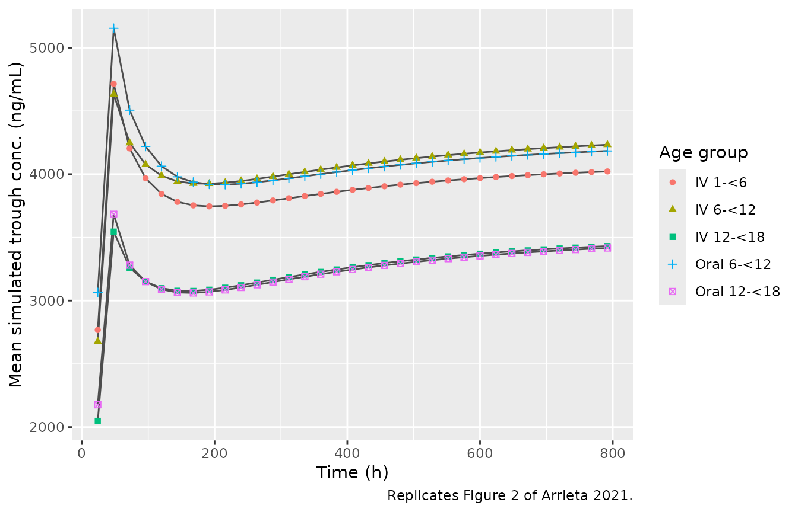
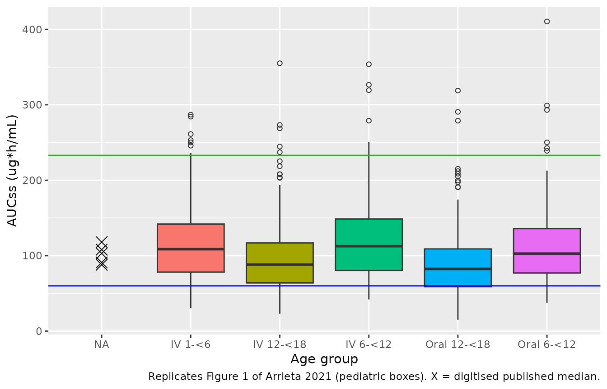

# Isavuconazole (Arrieta 2021)

## Model and source

- Citation: Arrieta AC, Neely M, Day JC, Rheingold SR, Sue PK, Muller
  WJ, Danziger-Isakov LA, Chu J, Yildirim I, McComsey GA, Frangoul HA,
  Chen TK, Statler VA, Steinbach WJ, Yin DE, Hamed K, Jones ME,
  Lademacher C, Desai A, Micklus K, Phillips DL, Kovanda LL, Walsh TJ.
  Safety, Tolerability, and Population Pharmacokinetics of Intravenous
  and Oral Isavuconazonium Sulfate in Pediatric Patients. Antimicrobial
  Agents and Chemotherapy. 2021;65(8):e00290-21.
  <doi:10.1128/AAC.00290-21>
- Description: Three-compartment population PK model for isavuconazole
  (administered as the prodrug isavuconazonium sulfate) in
  immunocompromised children aged 1 to \<18 years pooled with adults
  from a phase 1 intravenous study (Arrieta 2021). Zero-order (1-h
  intravenous infusion) and first-order (oral capsule) input into the
  central compartment, linear elimination, and allometric body-weight
  scaling (reference 70 kg) on all clearances and volumes; no other
  covariates retained.
- Article: <https://doi.org/10.1128/AAC.00290-21> (open access, CC BY
  4.0)
- Supplement (Table S2 parameter estimates, Figure S2 goodness of fit):
  available from the article landing page.

Arrieta 2021 is the first pediatric study of isavuconazole, given as the
water-soluble prodrug isavuconazonium sulfate. The population PK model
pooled the pediatric intravenous and oral data with intravenous data
from an adult phase 1 study. It was then used to simulate steady-state
exposure (AUCss) for each age cohort and route and to estimate the
proportion of children within the adult-derived target range of 60 to
233 ug\*h/mL.

## Population

Of 49 enrolled patients, 46 received study drug (safety analysis set)
and 45 contributed at least one plasma concentration (PK analysis set;
551 samples: 333 intravenous, 218 oral). The intravenous cohorts were
aged 1 to \<6 (n = 9), 6 to \<12 (n = 8) and 12 to \<18 years (n = 10).
The oral cohorts were aged 6 to \<12 (n = 9) and 12 to \<18 years (n =
10); children under 6 were excluded from the oral cohorts because of the
capsule size. Across the safety set, 37% of patients were female and 72%
were White. Median weight was 15.6 kg (range 10.9-19.1), 32.7 kg
(18.6-67.4) and 65.9 kg (42.4-103.5) in the three intravenous cohorts,
and 26.8 kg (18.3-50.1) and 50.4 kg (37.9-92.8) in the two oral cohorts
(Arrieta 2021 Table 1). Patients were immunocompromised, mostly with
acute leukemia, neuroblastoma or aplastic anemia, and were receiving
antifungal prophylaxis. The adult data came from the phase 1
renal-impairment study of Townsend 2017 (Eur J Clin Pharmacol
73:669-678); the paper does not report how many adults were included.

All patients received isavuconazonium sulfate 10 mg/kg (maximum 372 mg)
every 8 h for 6 doses, then once daily. The 372-mg cap applied above 37
kg for the 1-h intravenous infusion and above 32 kg for the 74.5-mg oral
capsule (Methods, ‘Dose selection and treatment’).

|  | field | value |
|:---|:---|:---|
| species | species | human |
| n_subjects | n_subjects | 45 |
| n_studies | n_studies | 2 |
| age_range | age_range | 1-17 years (pediatric cohorts); adults from a phase 1 intravenous study (demographics not reported in this paper) |
| age_median | age_median | 10.0 years (i.v. cohort), 12.0 years (oral cohort) |
| weight_range | weight_range | 10.9-103.5 kg (pediatric) |
| weight_median | weight_median | 33.7 kg (i.v. cohort), 42.6 kg (oral cohort) |
| sex_female_pct | sex_female_pct | 37 |
| race_ethnicity | race_ethnicity | White 71.7; Black 10.9; Asian 6.5; American Indian or Alaska native 2.2; Pacific Islander 2.2; Other 6.5 |
| disease_state | disease_state | Immunocompromised children at risk for invasive mycoses (mainly acute myeloid / lymphoblastic leukemia, neuroblastoma and other solid tumors, aplastic anemia; 15% prior hematopoietic stem cell transplant) receiving antifungal prophylaxis. |
| dose_range | dose_range | Isavuconazonium sulfate 10 mg/kg (maximum 372 mg; = 5.38 mg/kg or maximum 200 mg isavuconazole) q8h for 6 doses then once daily for up to 26 days; i.v. as a 1-h infusion (1 to \<18 years; 372 mg above 37 kg) or orally as 74.5-mg capsules (6 to \<18 years; 372 mg above 32 kg). |
| regions | regions | United States (11 i.v. and 12 oral centers) |
| n_observations | n_observations | 551 pediatric plasma samples (333 i.v., 218 oral) plus adult i.v. data |
| notes | notes | Pediatric PK analysis set: 26 i.v. (9 aged 1 to \<6, 8 aged 6 to \<12, 9 aged 12 to \<18 years) and 19 oral (9 aged 6 to \<12, 10 aged 12 to \<18 years) patients (Arrieta 2021 Table 1, Table 2; NCT03241550). Pooled with i.v. data from the adult phase 1 renal-impairment study of Townsend 2017 (Eur J Clin Pharmacol 73:669-678); adult numbers are not reported in this paper. Sex and race percentages are over the 46-patient safety analysis set (Table 1). Estimation in NONMEM with PsN 4.7.0; LLOQ 100 ng/mL. |

Population metadata exposed via readModelDb()\$population. {.table}

## Source trace

Every `ini()` value carries an in-file comment pointing to its source.
The table collects them in one place.

| Equation / parameter | Value | Source location |
|----|----|----|
| Structure: 3 compartments, zero-order + first-order input, linear elimination | n/a | Abstract; Results, ‘Population PK model analysis’ |
| `lcl` (CL) | log(2.55 L/h) | Table S2 |
| `lvc` (V2) | log(17.80 L) | Table S2 |
| `lq` (Q3) | log(30.30 L/h) | Table S2 |
| `lvp` (V3) | log(26.00 L) | Table S2 |
| `lq2` (Q4) | log(24.50 L/h) | Table S2 |
| `lvp2` (V4) | log(254.0 L) | Table S2 |
| `lka` (Ka) | log(0.162 1/h) | Table S2 (unit printed as ‘h’) |
| `lfdepot` (F1) | log(0.95) | Table S2 |
| `e_wt_cl_q` | 0.75 (fixed) | Methods allometric equation `P_ped = P_adult * (WT/70)^x`; x not printed, conventional value assumed |
| `e_wt_vc_vp` | 1 (fixed) | As above |
| `etalcl` | 0.4516^2 = 0.20394 | Table S2, Variability CL = 45.16% |
| `etalvp` | 0.4324^2 = 0.18697 | Table S2, Variability V3 = 43.24% |
| `etalq2` | 0.4571^2 = 0.20894 | Table S2, Variability Q4 = 45.71% |
| `etalvp2` | 0.6811^2 = 0.46390 | Table S2, Variability V4 = 68.11% |
| `propSd` | 0.4086 | Table S2, Residual error = 40.86% |
| `d/dt(depot)`, `f(depot)` | n/a | Oral capsule absorption (first-order input, F1) |
| `d/dt(central)` and peripheral ODEs | n/a | Standard 3-compartment mammillary model; i.v. doses are 1-h infusions (Methods) |
| `Cc <- central / vc` | n/a | Dose in mg isavuconazole, concentration in mg/L = ug/mL |

## Virtual cohort

The paper ran 1,000 Monte Carlo subjects per age cohort and route but
does not describe how it generated their body weights. Here each of the
five cohort-route combinations has 200 subjects. Weight is a
deterministic log-normal grid clamped to the observed range for the age
band, pooling the intravenous and oral patients of the same age. The
grid is centred on the geometric mean of the two cohort medians: 29.6 kg
for 6 to \<12 years and 57.6 kg for 12 to \<18 years. Its log-SD is one
third of the log range (see Assumptions). Doses follow the protocol: 10
mg/kg isavuconazonium sulfate, capped at 372 mg above 37 kg (i.v.) or 32
kg (oral). The model works in isavuconazole mass, so each prodrug dose
is multiplied by 200/372. Loading doses are given at 0, 8, 16, 24, 32
and 40 h, and once-daily maintenance runs from 48 h to day 33 (Figure 2
spans 0 to about 800 h).

``` r

cohort_def <- tibble::tribble(
  ~cohort,       ~route, ~age_band,   ~wt_med, ~wt_lo, ~wt_hi,
  "IV 1-<6",     "iv",   "1 to <6",     15.6,   10.9,   19.1,
  "IV 6-<12",    "iv",   "6 to <12",    29.6,   18.3,   67.4,
  "IV 12-<18",   "iv",   "12 to <18",   57.6,   37.9,  103.5,
  "Oral 6-<12",  "oral", "6 to <12",    29.6,   18.3,   67.4,
  "Oral 12-<18", "oral", "12 to <18",   57.6,   37.9,  103.5
) |>
  mutate(
    cohort = factor(cohort, levels = cohort),
    cap_wt = ifelse(route == "iv", 37, 32)
  )

n_per <- 200L
prodrug_to_isav <- 200 / 372

subjects <- cohort_def |>
  mutate(k = seq_len(n())) |>
  rowwise() |>
  reframe(
    cohort = cohort, route = route, cap_wt = cap_wt,
    id = (k - 1L) * n_per + seq_len(n_per),
    WT = pmin(
      pmax(wt_med * exp(log(wt_hi / wt_lo) / 3 * qnorm(ppoints(n_per))), wt_lo),
      wt_hi
    )
  ) |>
  mutate(
    prodrug_mg = ifelse(WT > cap_wt, 372, 10 * WT),
    dose_mg = prodrug_mg * prodrug_to_isav
  )
stopifnot(!anyDuplicated(subjects$id), nrow(subjects) == 5L * n_per)

dose_times <- c(0, 8, 16, 24, 32, 40, seq(48, 768, by = 24))
# Rounded to 2 decimals so the same nominal time is one double everywhere
# (troughs sit 0.01 h before each dose).
day7_grid <- round(143.99 + c(0, 0.51, 1.01, 1.08, 1.5, 2.01, 3, 4.01, 6.01, 8.01, 12.01, 16.01, 20.01, 24), 2)
ss_grid <- round(day7_grid + (767.99 - 143.99), 2)
trough_grid <- round(seq(24, 792, by = 24) - 0.01, 2)
obs_times <- sort(unique(c(0, trough_grid, day7_grid, ss_grid)))

dose_rows <- subjects |>
  tidyr::crossing(time = dose_times) |>
  mutate(
    evid = 1L,
    amt = dose_mg,
    cmt = ifelse(route == "iv", "central", "depot"),
    # 1-h zero-order infusion for i.v.; rate 0 is a bolus into the depot
    rate = ifelse(route == "iv", dose_mg / 1, 0)
  )
obs_rows <- subjects |>
  tidyr::crossing(time = obs_times) |>
  mutate(evid = 0L, amt = 0, cmt = "central", rate = 0)

events <- bind_rows(dose_rows, obs_rows) |>
  arrange(id, time, desc(evid)) |>
  mutate(cohort = as.character(cohort)) |>
  select(id, time, evid, amt, cmt, rate, WT, cohort, route, dose_mg)
stopifnot(!anyDuplicated(events[, c("id", "time", "evid")]))
```

## Simulation

``` r

mod <- readModelDb("Arrieta_2021_isavuconazole")
rxode2::rxSetSeed(2021)
sim <- rxode2::rxSolve(
  mod,
  events = events,
  keep = c("cohort", "route", "WT", "dose_mg"),
  returnType = "data.frame"
)
#> ℹ parameter labels from comments will be replaced by 'label()'
sim$cohort <- factor(sim$cohort, levels = levels(cohort_def$cohort))
```

## Replicate published figures

### Figure 2: mean simulated trough concentration over time

``` r

troughs <- sim |>
  filter(time %in% trough_grid) |>
  group_by(cohort, time) |>
  summarise(mean_trough_ngml = 1000 * mean(Cc), .groups = "drop")

ggplot(troughs, aes(time, mean_trough_ngml, colour = cohort, shape = cohort)) +
  geom_line(colour = "grey30") +
  geom_point() +
  labs(
    x = "Time (h)", y = "Mean simulated trough conc. (ng/mL)", colour = "Age group",
    shape = "Age group",
    caption = "Replicates Figure 2 of Arrieta 2021."
  )
```



The maintainers digitised Figure 2 of the paper at two points: the 48-h
trough after the loading phase (its peak) and the last plotted point
(about 792 h, day 33). The table compares those values with the
simulated mean troughs.

``` r

fig2_digitised <- tibble::tribble(
  ~cohort,       ~time,  ~paper_ngml,
  "IV 1-<6",      47.99,  4852,
  "IV 6-<12",     47.99,  5083,
  "IV 12-<18",    47.99,  3653,
  "Oral 6-<12",   47.99,  5187,
  "Oral 12-<18",  47.99,  3904,
  "IV 1-<6",     791.99,  3850,
  "IV 6-<12",    791.99,  4440,
  "IV 12-<18",   791.99,  3540,
  "Oral 6-<12",  791.99,  4350,
  "Oral 12-<18", 791.99,  3600
)
fig2_cmp <- troughs |>
  mutate(cohort = as.character(cohort)) |>
  inner_join(fig2_digitised, by = c("cohort", "time")) |>
  mutate(pct_diff = 100 * (mean_trough_ngml / paper_ngml - 1))
stopifnot(nrow(fig2_cmp) == 10L)

fig2_cmp |>
  select(cohort, time, paper_ngml, mean_trough_ngml, pct_diff) |>
  rename(
    "Cohort" = cohort,
    "Time (h)" = time,
    "Figure 2 (ng/mL, digitised)" = paper_ngml,
    "Simulated mean (ng/mL)" = mean_trough_ngml,
    "% diff" = pct_diff
  ) |>
  knitr::kable(digits = 1, caption = "Mean trough after the loading phase (48 h) and near day 33 (792 h).")
```

| Cohort | Time (h) | Figure 2 (ng/mL, digitised) | Simulated mean (ng/mL) | % diff |
|:---|---:|---:|---:|---:|
| IV 1-\<6 | 48 | 4852 | 4714.0 | -2.8 |
| IV 1-\<6 | 792 | 3850 | 4021.5 | 4.5 |
| IV 6-\<12 | 48 | 5083 | 4631.8 | -8.9 |
| IV 6-\<12 | 792 | 4440 | 4232.6 | -4.7 |
| IV 12-\<18 | 48 | 3653 | 3545.8 | -2.9 |
| IV 12-\<18 | 792 | 3540 | 3431.0 | -3.1 |
| Oral 6-\<12 | 48 | 5187 | 5153.5 | -0.6 |
| Oral 6-\<12 | 792 | 4350 | 4183.5 | -3.8 |
| Oral 12-\<18 | 48 | 3904 | 3682.7 | -5.7 |
| Oral 12-\<18 | 792 | 3600 | 3416.0 | -5.1 |

Mean trough after the loading phase (48 h) and near day 33 (792 h).
{.table}

``` r


stopifnot(
  # Structural: a wrong CL, dose conversion or allometric exponent shifts
  # every cohort by tens of percent. Observed: median about -4%, largest
  # about 9% (i.v. 6 to <12 at 48 h). A 200-subject mean at this IIV carries
  # about 4% sampling error, and the cohort weight distribution behind
  # Figure 2 is unpublished, hence the headroom.
  abs(median(fig2_cmp$pct_diff)) < 10,
  max(abs(fig2_cmp$pct_diff)) < 20
)
```

### Figure 1 and Table 3: steady-state AUC and target attainment

At true steady state, the AUC over one dosing interval equals
`F * dose / CL`. The table checks the PKNCA AUC over the day-33 interval
against that identity for every simulated subject (`fdepot = 1` for
i.v., 0.95 oral). The two sides share the drawn parameters, so any gap
is residual accumulation into the deep compartment plus numerical error.

``` r

sim_nca <- sim |>
  filter(!is.na(Cc)) |>
  select(id, time, Cc, cohort)
sim_nca <- bind_rows(
  sim_nca,
  sim_nca |> distinct(id, cohort) |> mutate(time = 0, Cc = 0)
) |>
  distinct(id, cohort, time, .keep_all = TRUE) |>
  arrange(id, cohort, time)

conc_obj <- PKNCA::PKNCAconc(sim_nca, Cc ~ time | cohort + id)
dose_df <- events |>
  filter(evid == 1) |>
  select(id, time, amt, cohort)
dose_obj <- PKNCA::PKNCAdose(dose_df, amt ~ time | cohort + id)

intervals <- data.frame(
  start = c(143.99, 767.99),
  end = c(167.99, 791.99),
  cmax = TRUE,
  tmax = TRUE,
  auclast = TRUE
)
nca_res <- PKNCA::pk.nca(PKNCA::PKNCAdata(conc_obj, dose_obj, intervals = intervals))
nca_df <- as.data.frame(nca_res$result)

auc_ss <- nca_df |>
  filter(start == 767.99, PPTESTCD == "auclast") |>
  select(id, cohort, auc_ss = PPORRES) |>
  left_join(
    sim |>
      filter(time == max(ss_grid)) |>
      select(id, cl, dose_mg, route),
    by = "id"
  ) |>
  mutate(
    auc_closed = ifelse(route == "oral", 0.95, 1) * dose_mg / cl,
    pct_ss = 100 * (auc_ss / auc_closed - 1)
  )

stopifnot(
  # The simulated day-33 interval is essentially at steady state. Subjects
  # with a large deep volume (68% CV on V4) are still accumulating slightly,
  # so the tail is a little wider than the centre.
  abs(median(auc_ss$pct_ss)) < 2,
  quantile(abs(auc_ss$pct_ss), 0.9) < 5
)
summary(auc_ss$pct_ss)
#>      Min.   1st Qu.    Median      Mean   3rd Qu.      Max. 
#> -62.13083  -0.45268  -0.11426  -1.51278  -0.04957   0.34525
```

``` r

fig1_digitised <- tibble::tribble(
  ~cohort,       ~paper_median,
  "IV 1-<6",     103,
  "IV 6-<12",    118,
  "IV 12-<18",    91,
  "Oral 6-<12",  108,
  "Oral 12-<18",  88
)

ggplot(auc_ss, aes(cohort, auc_ss, fill = cohort)) +
  geom_boxplot(outlier.shape = 1, show.legend = FALSE) +
  geom_hline(yintercept = c(60, 233), colour = c("blue", "green3")) +
  geom_point(
    data = fig1_digitised |> mutate(cohort = factor(cohort, levels = levels(auc_ss$cohort))),
    aes(cohort, paper_median), inherit.aes = FALSE, shape = 4, size = 4
  ) +
  labs(
    x = "Age group", y = "AUCss (ug*h/mL)",
    caption = "Replicates Figure 1 of Arrieta 2021 (pediatric boxes). X = digitised published median."
  )
```



``` r


fig1_cmp <- auc_ss |>
  group_by(cohort) |>
  summarise(sim_median = median(auc_ss), .groups = "drop") |>
  mutate(cohort = as.character(cohort)) |>
  inner_join(fig1_digitised, by = "cohort") |>
  mutate(pct_diff = 100 * (sim_median / paper_median - 1))
fig1_cmp |>
  rename(
    "Cohort" = cohort,
    "Simulated median AUCss" = sim_median,
    "Figure 1 median (digitised)" = paper_median,
    "% diff" = pct_diff
  ) |>
  knitr::kable(digits = 1, caption = "Median AUCss (ug*h/mL) by cohort.")
```

| Cohort       | Simulated median AUCss | Figure 1 median (digitised) | % diff |
|:-------------|-----------------------:|----------------------------:|-------:|
| IV 1-\<6     |                  108.6 |                         103 |    5.5 |
| IV 12-\<18   |                   88.2 |                          91 |   -3.1 |
| IV 6-\<12    |                  112.6 |                         118 |   -4.6 |
| Oral 12-\<18 |                   82.4 |                          88 |   -6.4 |
| Oral 6-\<12  |                  102.8 |                         108 |   -4.8 |

Median AUCss (ug\*h/mL) by cohort. {.table}

``` r


stopifnot(
  # Standard error of a 200-subject median at 45% CV is about 4%.
  abs(median(fig1_cmp$pct_diff)) < 10,
  max(abs(fig1_cmp$pct_diff)) < 20
)
```

Table 3 reports the percentage of simulated children below 60 and within
60 to 233 ug*h/mL. Two estimates are shown for comparison. One uses the
stochastic cohort above. The other is a semi-analytic value: with CL
log-normal and AUCss = F* dose / CL, the probability for each subject in
the weight grid is a normal CDF on log CL, averaged over the grid. The
semi-analytic value involves no random draws and is the one gated.

``` r

omega_cl <- sqrt(0.20394)
semi <- subjects |>
  mutate(
    auc_typ = ifelse(route == "oral", 0.95, 1) * dose_mg / (2.55 * (WT / 70)^0.75),
    p_below = pnorm((log(60) - log(auc_typ)) / omega_cl),
    p_within = pnorm((log(233) - log(auc_typ)) / omega_cl) - p_below
  ) |>
  group_by(cohort) |>
  summarise(semi_below = 100 * mean(p_below), semi_within = 100 * mean(p_within), .groups = "drop")

stoch <- auc_ss |>
  group_by(cohort) |>
  summarise(
    sim_below = 100 * mean(auc_ss < 60),
    sim_within = 100 * mean(auc_ss >= 60 & auc_ss <= 233),
    .groups = "drop"
  )

table3 <- tibble::tribble(
  ~cohort,       ~paper_below, ~paper_within,
  "IV 1-<6",       11.4,         85.7,
  "IV 6-<12",       7.2,         86.8,
  "IV 12-<18",     18.0,         80.2,
  "Oral 6-<12",     9.3,         87.1,
  "Oral 12-<18",   21.6,         76.5
)

t3 <- table3 |>
  inner_join(semi |> mutate(cohort = as.character(cohort)), by = "cohort") |>
  inner_join(stoch |> mutate(cohort = as.character(cohort)), by = "cohort")

t3 |>
  rename(
    "Cohort" = cohort,
    "Below 60, paper (%)" = paper_below,
    "Below 60, semi-analytic (%)" = semi_below,
    "Below 60, simulated (%)" = sim_below,
    "60-233, paper (%)" = paper_within,
    "60-233, semi-analytic (%)" = semi_within,
    "60-233, simulated (%)" = sim_within
  ) |>
  select(1, 2, 4, 6, 3, 5, 7) |>
  knitr::kable(digits = 1, caption = "Replicates Table 3 of Arrieta 2021.")
```

| Cohort | Below 60, paper (%) | Below 60, semi-analytic (%) | Below 60, simulated (%) | 60-233, paper (%) | 60-233, semi-analytic (%) | 60-233, simulated (%) |
|:---|---:|---:|---:|---:|---:|---:|
| IV 1-\<6 | 11.4 | 12.5 | 10.0 | 85.7 | 84.2 | 86.5 |
| IV 6-\<12 | 7.2 | 9.3 | 11.0 | 86.8 | 85.4 | 86.0 |
| IV 12-\<18 | 18.0 | 21.0 | 22.5 | 80.2 | 76.1 | 75.0 |
| Oral 6-\<12 | 9.3 | 11.0 | 8.0 | 87.1 | 84.5 | 89.0 |
| Oral 12-\<18 | 21.6 | 24.1 | 26.0 | 76.5 | 73.7 | 72.5 |

Replicates Table 3 of Arrieta 2021. {.table}

``` r


stopifnot(
  # Deterministic (no random draws). Observed gaps are at most about 4
  # percentage points and come from the unpublished simulated weight
  # distribution. A 10-fold IIV or a wrong allometric exponent moves these by
  # 10+ points.
  max(abs(t3$semi_below - t3$paper_below)) < 6,
  max(abs(t3$semi_within - t3$paper_within)) < 6
)
```

## PKNCA validation against observed day-7 NCA

Table 2 of the paper reports noncompartmental Cmax, AUCtau and Tmax from
the observed day-7 profiles. These come from 5 to 9 patients per cohort,
whose weights differ from the virtual cohort above, so the comparison is
descriptive. The day-7 interval here runs from the 144-h dose to the
next dose.

``` r

published_day7 <- tibble::tribble(
  ~cohort,       ~cmax, ~auclast, ~tmax,
  "IV 1-<6",      7.31,  102.0,   1.08,
  "IV 6-<12",     6.97,   78.2,   1.08,
  "IV 12-<18",    5.65,   77.8,   1.07,
  "Oral 6-<12",   5.78,  121.0,   4.00,
  "Oral 12-<18",  5.43,   76.7,   3.98
)

day7 <- nca_df |>
  filter(start == 143.99) |>
  mutate(
    cohort = as.character(cohort),
    # report tmax relative to the day-7 dose
    PPORRES = ifelse(PPTESTCD == "tmax", PPORRES - (144 - 143.99), PPORRES)
  )

cmp <- nlmixr2lib::ncaComparisonTable(
  simulated = day7,
  reference = published_day7,
  by = "cohort",
  units = c(cmax = "ug/mL", auclast = "ug*h/mL", tmax = "h"),
  tolerance_pct = 20
)
knitr::kable(
  cmp,
  caption = "Day 7: simulated median vs. observed median NCA (Arrieta 2021 Table 2). * differs by >20%."
)
```

| NCA parameter      | cohort       | Reference | Simulated | % diff   |
|:-------------------|:-------------|:----------|:----------|:---------|
| Cmax (ug/mL)       | IV 1-\<6     | 7.31      | 9.84      | +34.7%\* |
| Cmax (ug/mL)       | IV 6-\<12    | 6.97      | 9.9       | +42.1%\* |
| Cmax (ug/mL)       | IV 12-\<18   | 5.65      | 7.63      | +35.0%\* |
| Cmax (ug/mL)       | Oral 6-\<12  | 5.78      | 4.58      | -20.8%\* |
| Cmax (ug/mL)       | Oral 12-\<18 | 5.43      | 3.58      | -34.0%\* |
| Tmax (h)           | IV 1-\<6     | 1.08      | 1         | -7.4%    |
| Tmax (h)           | IV 6-\<12    | 1.08      | 1         | -7.4%    |
| Tmax (h)           | IV 12-\<18   | 1.07      | 1         | -6.5%    |
| Tmax (h)           | Oral 6-\<12  | 4         | 2.99      | -25.2%\* |
| Tmax (h)           | Oral 12-\<18 | 3.98      | 2.99      | -24.9%\* |
| AUClast (ug\*h/mL) | IV 1-\<6     | 102       | 107       | +4.6%    |
| AUClast (ug\*h/mL) | IV 6-\<12    | 78.2      | 105       | +33.7%\* |
| AUClast (ug\*h/mL) | IV 12-\<18   | 77.8      | 81.6      | +4.9%    |
| AUClast (ug\*h/mL) | Oral 6-\<12  | 121       | 96.3      | -20.4%\* |
| AUClast (ug\*h/mL) | Oral 12-\<18 | 76.7      | 77.5      | +1.0%    |

Day 7: simulated median vs. observed median NCA (Arrieta 2021 Table 2).
\* differs by \>20%. {.table}

Day-7 AUCtau agrees within 5% for three cohorts. It is 34% high for the
i.v. 6 to \<12 cohort and 20% low for the oral 6 to \<12 cohort. Both
simulated values fall inside the observed ranges (56.0-144.0 and
48.6-185.0 ug\*h/mL). In Table 2 the i.v. 6 to \<12 median (78.2) is
below the i.v. 1 to \<6 median (102), whereas the model, like the
paper’s own Figure 1 simulation, puts the 6 to \<12 cohort slightly
higher. The oral 6 to \<12 median (121) is the highest in Table 2, from
7 patients.

The largest discrepancy is Cmax, which is starred in every cohort. For
the i.v. cohorts the simulated Cmax is taken at the exact end of the 1-h
infusion. The rapid first distribution phase (Q3/V2 about 1.7 1/h) makes
that value very sensitive to sampling time. The protocol sample was
drawn within 5 min after the infusion ended, and the observed median
Tmax was 1.07-1.08 h. The table below gives the simulated concentration
at 1.08 h after the start of the infusion. It narrows the gap from
35-42% to about 20-27% but does not close it. The i.v. peak is therefore
the part of the profile this model reproduces least well; AUC and trough
exposure, which the paper used for dosing, are reproduced closely. The
simulated oral peak is lower and earlier (about 3 h rather than 4 h)
than observed, which is consistent with the single first-order Ka.

``` r

iv_peak <- sim |>
  filter(route == "iv", time == round(143.99 + 1.08, 2)) |>
  group_by(cohort) |>
  summarise(sim_c108 = median(Cc), .groups = "drop") |>
  mutate(cohort = as.character(cohort)) |>
  inner_join(published_day7 |> select(cohort, cmax), by = "cohort") |>
  mutate(pct_diff = 100 * (sim_c108 / cmax - 1))

iv_peak |>
  rename(
    "Cohort" = cohort,
    "Simulated median Cc at 1.08 h (ug/mL)" = sim_c108,
    "Observed median Cmax (ug/mL)" = cmax,
    "% diff" = pct_diff
  ) |>
  knitr::kable(digits = 2, caption = "Day-7 i.v. peak at the protocol sampling time.")
```

| Cohort | Simulated median Cc at 1.08 h (ug/mL) | Observed median Cmax (ug/mL) | % diff |
|:---|---:|---:|---:|
| IV 1-\<6 | 8.76 | 7.31 | 19.82 |
| IV 6-\<12 | 8.82 | 6.97 | 26.50 |
| IV 12-\<18 | 6.87 | 5.65 | 21.62 |

Day-7 i.v. peak at the protocol sampling time. {.table}

## Assumptions and deviations

- **Zero-order input = the i.v. infusion.** The paper describes “a
  3-compartment model with combined zero-order and first-order input”.
  Table S2 lists no zero-order duration (D1) or lag time. The only
  reading consistent with the published estimates is that the i.v. doses
  are 1-h zero-order infusions and the oral doses are first-order
  absorption (Ka, F1), so the model encodes that.
- **Allometric exponents.** The Methods give
  `P_pediatric = P_adults * (WT/70)^x` but never print x. No exponent
  appears among the estimates in Table S2, so the conventional fixed
  values were used: 0.75 on CL, Q3 and Q4, and 1 on V2, V3 and V4. The
  good agreement with Figure 1 and Table 3 supports this. The paper
  labels the equation as pediatric scaling. In this implementation the
  same (WT/70) scaling applies to adults too, which changes an adult
  near 70 kg only slightly.
- **IIV scale.** Table S2 reports each IIV as a CV%. The printed SE and
  %RSE columns are consistent with omega^2 = (CV/100)^2 (CL, Q4, V4).
  The V3 row’s RSE (61%) matches neither reading and looks like a
  transcription slip in the table. No covariances are reported, so the
  omega matrix is diagonal.
- **Residual error.** The table’s “sigma^2 = 40.86” sits under the
  Variability (%) heading. Its SE (0.00934) and RSE (6%) show that 40.86
  is the SD in percent. Figure S2 is on log-concentration axes, so the
  error model is log-transform-both-sides additive, encoded as
  proportional in linear space (`propSd = 0.4086`).
- **Dose units.** Doses are in mg of isavuconazole. 372 mg
  isavuconazonium sulfate = 200 mg isavuconazole (Results, ‘ISAV
  exposure’), so 10 mg/kg of prodrug = 5.38 mg/kg of isavuconazole. Oral
  doses were not rounded to whole 74.5-mg capsules.
- **Virtual cohort.** The paper does not describe how weights were
  generated for its 1,000-subject simulations. Pooling the i.v. and oral
  patients of an age band (geometric mean of the two cohort medians,
  clamped to the pooled observed range) reproduced the Figure 1 medians
  better than cohort-specific weights did. With cohort-specific weights,
  the i.v. 12 to \<18 median was 82 rather than 91 ug\*h/mL. The
  maintenance phase starts 8 h after the last loading dose. The paper
  allowed the loading phase to end on day 2 or day 3 (Table S1
  footnote).
- **Adult cohort.** The adult phase 1 data (Townsend 2017) were part of
  the fit, but this paper reports no adult demographics or adult
  simulations. The model’s `population` metadata therefore describes the
  pediatric cohorts.
- **Errata.** No correction notice for this article was found in
  Crossref as of 2026-09-28.
