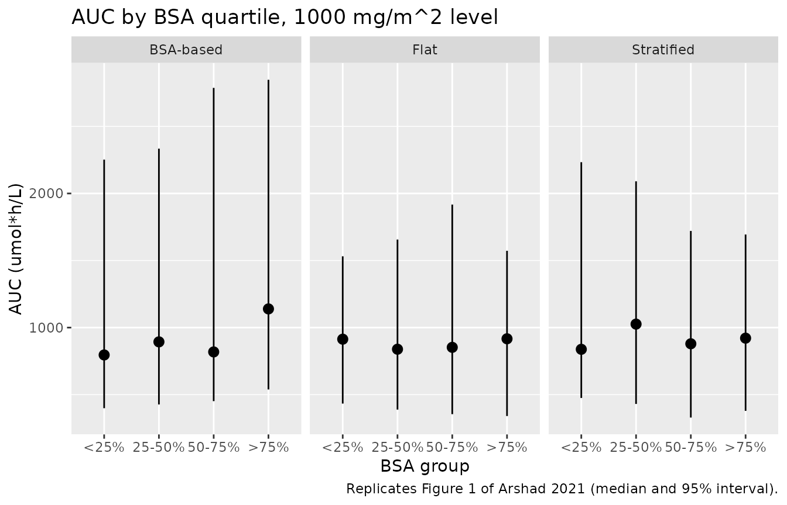
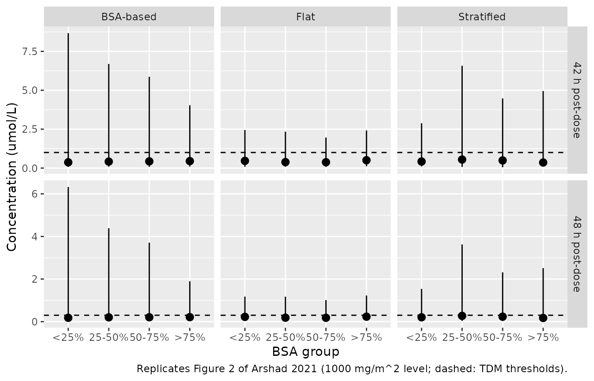
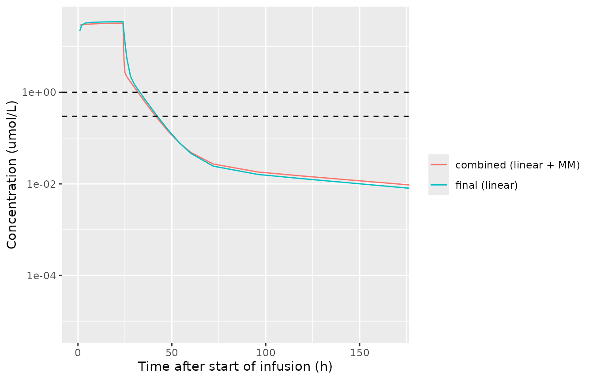

# High-dose methotrexate (Arshad 2021)

## Model and source

Arshad et al. (2021) analysed routine therapeutic-drug-monitoring (TDM)
concentrations of high-dose methotrexate (MTX) from adults treated at
the University Hospital of Cologne and used the model to compare
BSA-based, flat and BSA-stratified dosing. The paper contributes two
models:

- `Arshad_2021_methotrexate` – the final model: three compartments,
  linear elimination, covariates on CL, used by the authors for every
  simulation.

- `Arshad_2021_methotrexate_nonlinear` – the combined linear +
  Michaelis-Menten elimination model of the Supplementary Table, which
  fitted better (OFV -70) but was unstable and slow, so the authors did
  not carry it forward.

- Citation: Arshad U, Taubert M, Seeger-Nukpezah T, Ullah S,
  Spindeldreier KC, Jaehde U, Hallek M, Fuhr U, Vehreschild JJ, Jakob C.
  Evaluation of body-surface-area adjusted dosing of high-dose
  methotrexate by population pharmacokinetics in a large cohort of
  cancer patients. BMC Cancer. 2021;21:719.
  <doi:10.1186/s12885-021-08443-x>

- Description (final model): Three-compartment population PK model for
  high-dose intravenous methotrexate (4 h or 24 h infusion) in adults
  with haematological malignancies or solid tumours (Arshad 2021), with
  linear elimination. Clearance carries power effects of baseline serum
  creatinine (centred at 0.74 mg/dL), age (58 years) and body surface
  area (1.73 m^2) and a fractional decrease in women; correlated
  inter-individual variability on CL and central volume and
  inter-occasion (per treatment cycle) variability on CL; combined
  additive and exponential residual error.

- Description (combined model): Three-compartment population PK model
  for high-dose intravenous methotrexate in adults with haematological
  malignancies or solid tumours (Arshad 2021, supplementary combined
  model), with parallel linear and Michaelis-Menten elimination from the
  central compartment. The linear clearance carries power effects of
  baseline serum creatinine (centred at 0.74 mg/dL) and age (58 years)
  and a fractional decrease in women; correlated inter-individual
  variability on linear CL and central volume; combined additive and
  exponential residual error. The authors preferred the
  linear-elimination model (Arshad_2021_methotrexate) for covariate and
  dosing work because this model’s estimation was unstable.

- Article: <https://doi.org/10.1186/s12885-021-08443-x> (BMC Cancer
  2021;21:719, open access)

- Supplement: Additional file 1 (Supplementary Table, GOF and NPC
  figures) on the article page.

Both models work in amounts of **umol** and concentrations of
**umol/L**, the units of the paper’s TDM thresholds, assay LLOQ and
Figures 1-2. Convert a mg dose with the molecular weight of methotrexate
(454.44 g/mol).

``` r

mw_mtx <- 454.44 # g/mol
mg_to_umol <- function(mg) mg / mw_mtx * 1000
```

## Population

229 adults (83 women, 36%) with haematological malignancies or solid
tumours treated with high-dose MTX between 2005 and 2018 contributed
2182 concentrations (1-65 per patient, median 7) over a median of 3
treatment cycles (range 1-9). Most infusions ran over 4 h or 24 h.
Median (range) age was 58 (19-82) years, weight 78.4 (41.5-227) kg, BSA
1.96 (1.34-3.42) m^2 and serum creatinine 0.74 (0.36-1.66) mg/dL; women
were older (median 66 vs 51 years), smaller (BSA 1.80 vs 2.06 m^2) and
had lower creatinine (0.67 vs 0.84 mg/dL) than men (Arshad 2021 Table
1). Low-aggressive non-Hodgkin lymphoma (101) and acute lymphoblastic
leukaemia (64) were the commonest diagnoses (Table 2).

The same information is available programmatically via
`readModelDb("Arshad_2021_methotrexate")()$population`.

## Source trace

Every `ini()` value carries an in-file comment naming its source; the
table collects them. Table 3 of the paper prints **bootstrap medians**
for the final model; the Supplementary Table prints **bootstrap means**
for the combined model.

| Parameter | Final model | Combined model | Source |
|----|----|----|----|
| CL / linear CL (L/h) | 4.52 | 4.77 | Eq. 4 typical value (Table 3 bootstrap median 4.33) / Suppl. Table LCL |
| Vmax (umol/h) | – | 2.46 | Suppl. Table |
| Km (umol/L) | – | 1.02 | Suppl. Table |
| V1 (L) | 4.29 | 1.12 | Table 3 / Suppl. Table |
| V2 (L) | 2.51 | 3.87 | Table 3 / Suppl. Table |
| V3 (L) | 2.36 | 5.08 | Table 3 / Suppl. Table |
| Q1 (L/h) | 0.37 | 0.52 | Table 3 / Suppl. Table |
| Q2 (L/h) | 0.02 | 0.04 | Table 3 / Suppl. Table |
| SCr exponent (ref 0.74 mg/dL) | -0.49 | -0.91 | Eq. 4 and Table 3 / Suppl. Table |
| Age exponent (ref 58 y) | -0.18 | -0.23 | Eq. 4 and Table 3 / Suppl. Table |
| Female fractional change | -0.16 | -0.28 | Eq. 4 and Table 3 / Suppl. Table |
| BSA exponent (ref 1.73 m^2) | +0.23 | not included | Table 3 (Eq. 4 prints -0.23; see below) |
| omega^2 CL, V1, cov | 0.11, 1.34, 0.29 | 0.07, 2.127, 0.10 | Table 3 / Suppl. Table |
| IOV omega^2 CL (per cycle) | 0.09 | not encoded | Table 3 / see below |
| Additive sigma^2 | 0.02 | 0.02 | Table 3 / Suppl. Table |
| Exponential sigma^2 | 0.26 | 0.22 | Table 3 / Suppl. Table |
| `CL = 4.52 (SCr/0.74)^-0.49 (Age/58)^-0.18 (BSA/1.73)^0.23 (1 - 0.16 Sex)` |  |  | Eq. 4 (BSA sign from Table 3) |
| Three-compartment linear disposition |  |  | Results, ‘PK model’ |
| Linear + Michaelis-Menten elimination |  |  | Results, ‘PK model’; Suppl. Table |

## Typical-value clearance (Eq. 4)

A deterministic check that the model reproduces Eq. 4: the reference
patient (man, 58 years, SCr 0.74 mg/dL, BSA 1.73 m^2) has CL = 4.52 L/h,
and each covariate moves CL by exactly its printed factor.

``` r

mod <- readModelDb("Arshad_2021_methotrexate")
mod_typ <- rxode2::zeroRe(mod)
#> Warning: some etas defaulted to non-mu referenced, possible parsing error: etaiov_cl_1, etaiov_cl_2, etaiov_cl_3, etaiov_cl_4, etaiov_cl_5, etaiov_cl_6, etaiov_cl_7, etaiov_cl_8, etaiov_cl_9
#> as a work-around try putting the mu-referenced expression on a simple line
#> Warning: some etas defaulted to non-mu referenced, possible parsing error: etaiov_cl_1, etaiov_cl_2, etaiov_cl_3, etaiov_cl_4, etaiov_cl_5, etaiov_cl_6, etaiov_cl_7, etaiov_cl_8, etaiov_cl_9
#> as a work-around try putting the mu-referenced expression on a simple line

eq4_pat <- tibble::tribble(
  ~case,                 ~SEXF, ~AGE, ~CREAT, ~BSA,
  "reference man",           0,   58,   0.74, 1.73,
  "woman",                   1,   58,   0.74, 1.73,
  "SCr 1.48 mg/dL",          0,   58,   1.48, 1.73,
  "age 29 years",            0,   29,   0.74, 1.73,
  "BSA 2.30 m^2",            0,   58,   0.74, 2.30
) |>
  mutate(id = row_number(), OCC = 1)

eq4_ev <- eq4_pat |>
  mutate(time = 0, amt = 1000, rate = 1000 / 24, evid = 1, cmt = "central") |>
  bind_rows(eq4_pat |> mutate(time = 12, amt = 0, rate = 0, evid = 0, cmt = "central")) |>
  arrange(id, time, desc(evid))

eq4_sim <- rxode2::rxSolve(mod_typ, events = eq4_ev, keep = "case") |>
  as.data.frame() |>
  distinct(case, cl)
#> Warning: multi-subject simulation without without 'omega'

eq4_expected <- 4.52 * c(1, 1 - 0.16, 2^-0.49, 0.5^-0.18, (2.30 / 1.73)^0.23)
eq4_sim$expected <- eq4_expected
knitr::kable(eq4_sim, digits = 4, caption = "Clearance (L/h) from the model vs Eq. 4.")
```

| case           |     cl | expected |
|:---------------|-------:|---------:|
| reference man  | 4.5200 |   4.5200 |
| woman          | 3.7968 |   3.7968 |
| SCr 1.48 mg/dL | 3.2184 |   3.2184 |
| age 29 years   | 5.1206 |   5.1206 |
| BSA 2.30 m^2   | 4.8260 |   4.8260 |

Clearance (L/h) from the model vs Eq. 4. {.table}

``` r

stopifnot(
  nrow(eq4_sim) == 5,
  max(abs(eq4_sim$cl / eq4_sim$expected - 1)) < 1e-10
)
```

## Virtual cohort

The paper does not describe how its virtual patients were generated
beyond their stratification by BSA quartile. The cohort below is drawn
in base R (so it is identical on every machine) from sex-specific
distributions matching Table 1: 36% women; BSA log-normal around the
sex-specific medians, truncated to the observed ranges by redrawing; age
and serum creatinine likewise by sex. The spreads were chosen so the
cohort’s BSA quartiles sit near the 1.7 and 2.12 m^2 cut-offs of Table
4.

``` r

set.seed(20210618)
n_sub <- 200
rtrunc <- function(n, draw, lo, hi) {
  x <- draw(n)
  while (any(bad <- x < lo | x > hi)) x[bad] <- draw(sum(bad))
  x
}
sexf <- rbinom(n_sub, 1, 83 / 229)
nf <- sum(sexf)
nm <- n_sub - nf
cohort <- tibble(id = seq_len(n_sub), SEXF = sexf, BSA = NA_real_, AGE = NA_real_, CREAT = NA_real_)
cohort$BSA[sexf == 1] <- rtrunc(nf, function(k) exp(rnorm(k, log(1.78), 0.12)), 1.34, 2.11)
cohort$BSA[sexf == 0] <- rtrunc(nm, function(k) exp(rnorm(k, log(2.06), 0.13)), 1.54, 3.42)
cohort$AGE[sexf == 1] <- rtrunc(nf, function(k) rnorm(k, 66, 12), 19, 77)
cohort$AGE[sexf == 0] <- rtrunc(nm, function(k) rnorm(k, 51, 15), 19, 82)
cohort$CREAT[sexf == 1] <- rtrunc(nf, function(k) exp(rnorm(k, log(0.67), 0.25)), 0.38, 1.34)
cohort$CREAT[sexf == 0] <- rtrunc(nm, function(k) exp(rnorm(k, log(0.84), 0.25)), 0.36, 1.66)
bsa_q <- quantile(cohort$BSA, c(0, 0.25, 0.5, 0.75, 1))
cohort <- cohort |>
  mutate(
    bsa_group = cut(BSA, bsa_q, include.lowest = TRUE, labels = c("<25%", "25-50%", "50-75%", ">75%")),
    OCC = 1
  )
round(bsa_q, 2)
#>   0%  25%  50%  75% 100% 
#> 1.39 1.77 1.94 2.10 3.19
cohort |>
  group_by(SEXF) |>
  summarise(n = n(), BSA = median(BSA), AGE = median(AGE), CREAT = median(CREAT)) |>
  knitr::kable(digits = 2, caption = "Virtual cohort medians by sex (SEXF = 1 women); compare Table 1.")
```

| SEXF |   n |  BSA |   AGE | CREAT |
|-----:|----:|-----:|------:|------:|
|    0 | 122 | 2.04 | 51.14 |  0.86 |
|    1 |  78 | 1.77 | 65.10 |  0.69 |

Virtual cohort medians by sex (SEXF = 1 women); compare Table 1.
{.table}

## Dosing regimens (Table 4)

Each virtual patient receives each of the three 24-h infusion regimens
of Table 4 at a reference level of 2000 mg/m^2: BSA-based 2000 mg/m^2,
flat 3400 mg, and stratified 3000 / 3400 / 3800 mg for BSA \< 1.7,
1.7-2.12 and \> 2.12 m^2. Subject identifiers are offset per regimen so
the three arms stay disjoint.

``` r

obs_times <- c(0, 1, 2, 4, 8, 12, 16, 20, 24, 24.5, 25, 26, 28, 30, 36, 42, 48, 54, 60, 72, 96, 120, 168, 240, 336, 504, 672, 1008)

make_regimen <- function(cohort, regimen, dose_mg, id_offset) {
  subj <- cohort |>
    mutate(regimen = regimen, dose_mg = dose_mg, id = id + id_offset)
  dose <- subj |>
    mutate(time = 0, amt = mg_to_umol(dose_mg), rate = amt / 24, evid = 1, cmt = "central")
  obs <- subj |>
    tidyr::crossing(time = obs_times) |>
    mutate(amt = 0, rate = 0, evid = 0, cmt = "central")
  bind_rows(dose, obs) |> arrange(id, time, desc(evid))
}

strat_dose <- function(bsa, doses) {
  ifelse(bsa < 1.7, doses[1], ifelse(bsa <= 2.12, doses[2], doses[3]))
}

regimen_events <- function(level_mg_m2, flat_mg, strat_mg) {
  bind_rows(
    make_regimen(cohort, "BSA-based", level_mg_m2 * cohort$BSA, 0L),
    make_regimen(cohort, "Flat", flat_mg, 1000L),
    make_regimen(cohort, "Stratified", strat_dose(cohort$BSA, strat_mg), 2000L)
  )
}

ev_2000 <- regimen_events(2000, 3400, c(3000, 3400, 3800))
stopifnot(!anyDuplicated(unique(ev_2000[, c("id", "time", "evid")])))
```

## Replicate Figure 1: AUC by BSA quartile (typical values)

Figure 1 plots the median simulated AUC per BSA quartile for each
regimen. Because MTX is linear in this model, the median AUC of a
quartile is driven by the covariates; the typical-value solve below
(random effects zeroed) gives it deterministically, and PKNCA computes
the AUC from the simulated profiles.

``` r

sim_typ <- rxode2::rxSolve(
  mod_typ,
  events = ev_2000,
  keep = c("regimen", "bsa_group", "dose_mg", "BSA"),
  rtol = 1e-8, atol = 1e-10
) |>
  as.data.frame()
#> Warning: multi-subject simulation without without 'omega'

conc_df <- sim_typ |>
  filter(!is.na(Cc)) |>
  mutate(Cc = pmax(Cc, 0)) |>
  select(id, time, Cc, regimen, bsa_group)
dose_df <- ev_2000 |>
  filter(evid == 1) |>
  select(id, time, amt, regimen, bsa_group)

conc_obj <- PKNCA::PKNCAconc(conc_df, Cc ~ time | regimen + bsa_group + id)
dose_obj <- PKNCA::PKNCAdose(dose_df, amt ~ time | regimen + bsa_group + id)
intervals <- data.frame(start = 0, end = Inf, cmax = TRUE, aucinf.obs = TRUE, half.life = TRUE)
nca_res <- PKNCA::pk.nca(PKNCA::PKNCAdata(conc_obj, dose_obj, intervals = intervals))

# Structural identity: for linear elimination AUC(0-inf) = Dose / CL exactly.
auc_chk <- as.data.frame(nca_res$result) |>
  filter(PPTESTCD == "aucinf.obs") |>
  left_join(sim_typ |> distinct(id, cl), by = "id") |>
  left_join(dose_df |> select(id, amt), by = "id") |>
  mutate(pct_diff = 100 * (PPORRES / (amt / cl) - 1))
summary(auc_chk$pct_diff)
#>    Min. 1st Qu.  Median    Mean 3rd Qu.    Max. 
#> -0.4858 -0.4200 -0.4101 -0.4122 -0.3999 -0.3887
stopifnot(
  nrow(auc_chk) == 3 * n_sub,
  max(abs(auc_chk$pct_diff)) < 2
)
```

The AUC medians per quartile, digitised from Figure 1 (2000 mg/m^2 dose
level), against the model:

``` r

fig1_ref <- tibble::tribble(
  ~regimen,     ~bsa_group, ~aucinf.obs,
  "BSA-based",  "<25%",     1720,
  "BSA-based",  "25-50%",   1896,
  "BSA-based",  "50-75%",   2044,
  "BSA-based",  ">75%",     2176,
  "Flat",       "<25%",     2115,
  "Flat",       "25-50%",   1929,
  "Flat",       "50-75%",   1786,
  "Flat",       ">75%",     1676,
  "Stratified", "<25%",     1995,
  "Stratified", "25-50%",   1978,
  "Stratified", "50-75%",   1835,
  "Stratified", ">75%",     1819
)
nca_auc <- as.data.frame(nca_res$result) |>
  filter(PPTESTCD == "aucinf.obs") |>
  mutate(bsa_group = as.character(bsa_group))
cmp <- nlmixr2lib::ncaComparisonTable(
  simulated = nca_auc,
  reference = fig1_ref,
  by = c("regimen", "bsa_group"),
  units = c(aucinf.obs = "umol*h/L"),
  tolerance_pct = 20
)
knitr::kable(cmp, caption = "Median AUC(0-inf) per BSA quartile: digitised Figure 1 (2000 mg/m^2 level) vs typical-value simulation. * differs by >20%.")
```

| NCA parameter            | regimen    | bsa_group | Reference | Simulated | % diff |
|:-------------------------|:-----------|:----------|:----------|:----------|:-------|
| AUC0-∞ (obs) (umol\*h/L) | BSA-based  | \<25%     | 1720      | 1800      | +4.8%  |
| AUC0-∞ (obs) (umol\*h/L) | BSA-based  | 25-50%    | 1900      | 1870      | -1.4%  |
| AUC0-∞ (obs) (umol\*h/L) | BSA-based  | 50-75%    | 2040      | 1970      | -3.7%  |
| AUC0-∞ (obs) (umol\*h/L) | BSA-based  | \>75%     | 2180      | 2280      | +4.9%  |
| AUC0-∞ (obs) (umol\*h/L) | Flat       | \<25%     | 2120      | 1910      | -9.6%  |
| AUC0-∞ (obs) (umol\*h/L) | Flat       | 25-50%    | 1930      | 1720      | -10.8% |
| AUC0-∞ (obs) (umol\*h/L) | Flat       | 50-75%    | 1790      | 1650      | -7.5%  |
| AUC0-∞ (obs) (umol\*h/L) | Flat       | \>75%     | 1680      | 1670      | -0.2%  |
| AUC0-∞ (obs) (umol\*h/L) | Stratified | \<25%     | 2000      | 1790      | -10.4% |
| AUC0-∞ (obs) (umol\*h/L) | Stratified | 25-50%    | 1980      | 1720      | -13.0% |
| AUC0-∞ (obs) (umol\*h/L) | Stratified | 50-75%    | 1840      | 1650      | -9.9%  |
| AUC0-∞ (obs) (umol\*h/L) | Stratified | \>75%     | 1820      | 1860      | +2.3%  |

Median AUC(0-inf) per BSA quartile: digitised Figure 1 (2000 mg/m^2
level) vs typical-value simulation. \* differs by \>20%. {.table
style="width:100%;"}

``` r

pct <- as.numeric(gsub("[*%+]", "", cmp[["% diff"]]))
stopifnot(length(pct) == 12, all(!is.na(pct)), max(abs(pct)) < 20)
```

All twelve cells agree within 20%, although the paper’s virtual
population is not described and cannot be matched exactly.

### BSA exponent: Table 3 (+0.23) against Eq. 4 (-0.23)

Eq. 4 prints the BSA exponent as -0.23, whereas Table 3 prints +0.23,
the Results state that ‘the higher clearance for higher BSA values more
than compensated’ for the higher BSA-based doses, and Figure 1 shows the
flat-dose AUC **falling** with BSA while the stratified doses of Table 4
rise with BSA. The packaged model uses +0.23. The check below regresses
the flat-dose AUC on BSA across the cohort under both signs. The slope
includes the effect of the covariates that travel with BSA (sex, age,
creatinine), so it is not simply the exponent. The quartile medians of
Figure 1 imply a slope near log(2115 / 1676) / log(1.38 / 2.21) = -0.49,
where 1.38 and 2.21 m^2 are the quartile BSAs implied by the BSA-based /
flat AUC ratios of the same figure.

``` r

flat_auc_slope <- function(m) {
  s <- rxode2::rxSolve(
    rxode2::zeroRe(m),
    events = make_regimen(cohort, "Flat", 3400, 0L) |> filter(evid == 1 | time == 0),
    keep = "BSA"
  ) |>
    as.data.frame() |>
    distinct(id, BSA, cl)
  unname(coef(lm(log(1 / cl) ~ log(BSA), data = s))[2])
}
slope_table3 <- flat_auc_slope(mod)
#> Warning: some etas defaulted to non-mu referenced, possible parsing error: etaiov_cl_1, etaiov_cl_2, etaiov_cl_3, etaiov_cl_4, etaiov_cl_5, etaiov_cl_6, etaiov_cl_7, etaiov_cl_8, etaiov_cl_9
#> as a work-around try putting the mu-referenced expression on a simple line
#> Warning: some etas defaulted to non-mu referenced, possible parsing error: etaiov_cl_1, etaiov_cl_2, etaiov_cl_3, etaiov_cl_4, etaiov_cl_5, etaiov_cl_6, etaiov_cl_7, etaiov_cl_8, etaiov_cl_9
#> as a work-around try putting the mu-referenced expression on a simple line
#> Warning: multi-subject simulation without without 'omega'
slope_eq4 <- flat_auc_slope(mod |> rxode2::ini(e_bsa_cl = -0.23))
#> Warning: some etas defaulted to non-mu referenced, possible parsing error: etaiov_cl_1, etaiov_cl_2, etaiov_cl_3, etaiov_cl_4, etaiov_cl_5, etaiov_cl_6, etaiov_cl_7, etaiov_cl_8, etaiov_cl_9
#> as a work-around try putting the mu-referenced expression on a simple line
#> Warning: some etas defaulted to non-mu referenced, possible parsing error: etaiov_cl_1, etaiov_cl_2, etaiov_cl_3, etaiov_cl_4, etaiov_cl_5, etaiov_cl_6, etaiov_cl_7, etaiov_cl_8, etaiov_cl_9
#> as a work-around try putting the mu-referenced expression on a simple line
#> Warning: multi-subject simulation without without 'omega'
c(table3_sign = slope_table3, eq4_sign = slope_eq4)
#> table3_sign    eq4_sign 
#>  -0.3124529   0.1475471
# Table 3 sign: about -0.31 on this cohort; Eq. 4 sign: about +0.15. Figure 1
# needs a clearly negative slope. The bounds are deterministic (base-R cohort,
# typical-value solve) and the second one is the mutation control: it fails if
# the sign in the model file is flipped back to Eq. 4.
stopifnot(slope_table3 < -0.15, slope_eq4 > 0)
```

## Replicate Figures 1 and 2 with variability

A stochastic simulation at the 1000 mg/m^2 level (flat 1700 mg;
stratified 1550 / 1700 / 1900 mg) with between-subject and
inter-occasion variability (one cycle, `OCC = 1`). AUC per subject is
`Dose / CL`, exact for this linear model; concentrations at 42 and 48 h
after the start of the infusion are read from the solve and compared
with the TDM thresholds (1 and 0.3 umol/L).

``` r

rxode2::rxSetSeed(20210618)
ev_1000 <- regimen_events(1000, 1700, c(1550, 1700, 1900)) |>
  filter(evid == 1 | time %in% c(24, 42, 48))
sim_st <- rxode2::rxSolve(mod, events = ev_1000, keep = c("regimen", "bsa_group", "dose_mg")) |>
  as.data.frame()
#> Warning: some etas defaulted to non-mu referenced, possible parsing error: etaiov_cl_1, etaiov_cl_2, etaiov_cl_3, etaiov_cl_4, etaiov_cl_5, etaiov_cl_6, etaiov_cl_7, etaiov_cl_8, etaiov_cl_9
#> as a work-around try putting the mu-referenced expression on a simple line

auc_st <- sim_st |>
  distinct(id, regimen, bsa_group, dose_mg, cl) |>
  mutate(auc = mg_to_umol(dose_mg) / cl)

auc_st |>
  group_by(regimen, bsa_group) |>
  summarise(
    median = median(auc), lo = quantile(auc, 0.025), hi = quantile(auc, 0.975),
    .groups = "drop"
  ) |>
  ggplot(aes(bsa_group, median)) +
  geom_pointrange(aes(ymin = lo, ymax = hi)) +
  facet_wrap(~regimen) +
  labs(
    x = "BSA group", y = "AUC (umol*h/L)",
    title = "AUC by BSA quartile, 1000 mg/m^2 level",
    caption = "Replicates Figure 1 of Arshad 2021 (median and 95% interval)."
  )
```



``` r


# Centre check, robust to the cohort draw: the stochastic median AUC per
# regimen sits near the typical-value median (half the 2000 mg/m^2 values).
# Realised within about 7%; a mis-transcribed CL, dose or unit moves it by
# tens of percent.
typ_med <- nca_auc |> group_by(regimen) |> summarise(typ = median(PPORRES) / 2)
st_med <- auc_st |> group_by(regimen) |> summarise(st = median(auc)) |> left_join(typ_med, by = "regimen")
st_med
#> # A tibble: 3 × 3
#>   regimen       st   typ
#>   <chr>      <dbl> <dbl>
#> 1 BSA-based   925.  993.
#> 2 Flat        882.  859.
#> 3 Stratified  909.  881.
stopifnot(nrow(st_med) == 3, all(abs(st_med$st / st_med$typ - 1) < 0.25))
```

``` r

sim_st |>
  filter(time %in% c(42, 48)) |>
  group_by(time, regimen, bsa_group) |>
  summarise(
    median = median(Cc), lo = quantile(Cc, 0.025), hi = quantile(Cc, 0.975),
    .groups = "drop"
  ) |>
  mutate(
    time = paste(time, "h post-dose"),
    threshold = ifelse(time == "42 h post-dose", 1, 0.3)
  ) |>
  ggplot(aes(bsa_group, median)) +
  geom_pointrange(aes(ymin = lo, ymax = hi)) +
  geom_hline(aes(yintercept = threshold), linetype = "dashed") +
  facet_grid(time ~ regimen, scales = "free_y") +
  labs(
    x = "BSA group", y = "Concentration (umol/L)",
    caption = "Replicates Figure 2 of Arshad 2021 (1000 mg/m^2 level; dashed: TDM thresholds)."
  )
```



The medians of Figure 2 at the 1000 mg/m^2 level, digitised by the
maintainers, against the stochastic medians and the typical-value
medians (the 2000 mg/m^2 typical-value solve halved, exact for this
linear model):

``` r

fig2_ref <- tibble::tribble(
  ~regimen,     ~bsa_group, ~C42,  ~C48,
  "BSA-based",  "<25%",     0.50,  0.242,
  "BSA-based",  "25-50%",   0.47,  0.226,
  "BSA-based",  "50-75%",   0.45,  0.215,
  "BSA-based",  ">75%",     0.43,  0.207,
  "Flat",       "<25%",     0.59,  0.285,
  "Flat",       "25-50%",   0.46,  0.223,
  "Flat",       "50-75%",   0.38,  0.183,
  "Flat",       ">75%",     0.32,  0.156,
  "Stratified", "<25%",     0.54,  0.261,
  "Stratified", "25-50%",   0.46,  0.223,
  "Stratified", "50-75%",   0.38,  0.183,
  "Stratified", ">75%",     0.37,  0.177
) |>
  pivot_longer(c(C42, C48), names_to = "time", values_to = "figure2") |>
  mutate(time = as.numeric(sub("C", "", time)))

fig2_st <- sim_st |>
  filter(time %in% c(42, 48)) |>
  mutate(bsa_group = as.character(bsa_group)) |>
  group_by(regimen, bsa_group, time) |>
  summarise(stochastic = median(Cc), .groups = "drop")
fig2_typ <- sim_typ |>
  filter(time %in% c(42, 48)) |>
  mutate(bsa_group = as.character(bsa_group)) |>
  group_by(regimen, bsa_group, time) |>
  summarise(typical = median(Cc) / 2, .groups = "drop")
fig2_cmp <- fig2_ref |>
  left_join(fig2_st, by = c("regimen", "bsa_group", "time")) |>
  left_join(fig2_typ, by = c("regimen", "bsa_group", "time")) |>
  mutate(
    pct_stochastic = 100 * (stochastic / figure2 - 1),
    pct_typical = 100 * (typical / figure2 - 1)
  )
fig2_cmp |>
  dplyr::rename(
    "Regimen" = regimen, "BSA group" = bsa_group, "Time (h)" = time,
    "Figure 2 (umol/L)" = figure2, "Stochastic median" = stochastic,
    "Typical-value median" = typical, "% diff stochastic" = pct_stochastic,
    "% diff typical" = pct_typical
  ) |>
  knitr::kable(digits = 3, caption = "Median concentration at 42 and 48 h after the start of a 24-h infusion, 1000 mg/m^2 level.")
```

| Regimen | BSA group | Time (h) | Figure 2 (umol/L) | Stochastic median | Typical-value median | % diff stochastic | % diff typical |
|:---|:---|---:|---:|---:|---:|---:|---:|
| BSA-based | \<25% | 42 | 0.500 | 0.371 | 0.423 | -25.858 | -15.480 |
| BSA-based | \<25% | 48 | 0.242 | 0.180 | 0.207 | -25.427 | -14.513 |
| BSA-based | 25-50% | 42 | 0.470 | 0.416 | 0.365 | -11.461 | -22.415 |
| BSA-based | 25-50% | 48 | 0.226 | 0.202 | 0.177 | -10.512 | -21.482 |
| BSA-based | 50-75% | 42 | 0.450 | 0.432 | 0.372 | -4.086 | -17.367 |
| BSA-based | 50-75% | 48 | 0.215 | 0.207 | 0.181 | -3.758 | -15.982 |
| BSA-based | \>75% | 42 | 0.430 | 0.449 | 0.432 | 4.424 | 0.567 |
| BSA-based | \>75% | 48 | 0.207 | 0.212 | 0.211 | 2.375 | 1.703 |
| Flat | \<25% | 42 | 0.590 | 0.464 | 0.433 | -21.309 | -26.605 |
| Flat | \<25% | 48 | 0.285 | 0.224 | 0.212 | -21.498 | -25.683 |
| Flat | 25-50% | 42 | 0.460 | 0.385 | 0.338 | -16.394 | -26.488 |
| Flat | 25-50% | 48 | 0.223 | 0.186 | 0.165 | -16.745 | -26.189 |
| Flat | 50-75% | 42 | 0.380 | 0.376 | 0.308 | -1.180 | -18.978 |
| Flat | 50-75% | 48 | 0.183 | 0.180 | 0.150 | -1.563 | -18.247 |
| Flat | \>75% | 42 | 0.320 | 0.504 | 0.316 | 57.649 | -1.129 |
| Flat | \>75% | 48 | 0.156 | 0.233 | 0.154 | 49.523 | -1.401 |
| Stratified | \<25% | 42 | 0.540 | 0.422 | 0.408 | -21.849 | -24.482 |
| Stratified | \<25% | 48 | 0.261 | 0.205 | 0.199 | -21.335 | -23.672 |
| Stratified | 25-50% | 42 | 0.460 | 0.548 | 0.338 | 19.136 | -26.488 |
| Stratified | 25-50% | 48 | 0.223 | 0.270 | 0.165 | 21.179 | -26.189 |
| Stratified | 50-75% | 42 | 0.380 | 0.492 | 0.308 | 29.475 | -18.978 |
| Stratified | 50-75% | 48 | 0.183 | 0.234 | 0.150 | 27.673 | -18.247 |
| Stratified | \>75% | 42 | 0.370 | 0.358 | 0.351 | -3.358 | -5.245 |
| Stratified | \>75% | 48 | 0.177 | 0.173 | 0.171 | -2.070 | -3.621 |

Median concentration at 42 and 48 h after the start of a 24-h infusion,
1000 mg/m^2 level. {.table}

``` r

stopifnot(nrow(fig2_cmp) == 24, !anyNA(fig2_cmp$typical), !anyNA(fig2_cmp$stochastic))

# Deterministic: the typical-value medians run 0-27% below Figure 2 (median
# about -19%). A mis-transcribed volume or intercompartmental clearance moves
# the 42-48 h concentrations by far more than this band.
stopifnot(all(fig2_cmp$pct_typical > -35 & fig2_cmp$pct_typical < 10))
# Stochastic: individual cells scatter widely (50 subjects per quartile and a
# V1 variance of 1.34), so only the centre across all 24 cells is asserted.
# Realised about -4%; the bound is about three standard errors of that centre.
stopifnot(abs(median(fig2_cmp$pct_stochastic)) < 20)
```

Across the 24 cells the stochastic medians are centred on Figure 2,
while the typical-value medians sit about 19% lower. That gap is
expected: with a large V1 variance, subjects with a large central volume
eliminate slowly, which lifts the median concentration 18-24 h after the
end of the infusion above the typical-value prediction. Individual cells
of the stochastic simulation scatter by up to about +/-50% at this
cohort size.

## The combined linear + Michaelis-Menten model

The Results state that in the combined model ‘the fraction of CL
contributed by the linear component … was 4.77 L/h, whereas nonlinear CL
solely contributed 0.42 L/h at median MTX concentrations (2.20 umol/L)’.
With the Supplementary Table’s Vmax and Km, `Vmax / (Km + C)` is 0.76
L/h at 2.20 umol/L and 0.42 L/h at 4.84 umol/L, which is 2.20 mg/L: the
quoted median concentration appears to be in mg/L.

``` r

mod_nl <- readModelDb("Arshad_2021_methotrexate_nonlinear")
ini_nl <- rxode2::rxode(mod_nl)$iniDf
vmax <- exp(ini_nl$est[ini_nl$name == "lvmax"])
km <- exp(ini_nl$est[ini_nl$name == "lkm"])
cl_nl <- function(conc) vmax / (km + conc)
c(at_2.20_umol_L = cl_nl(2.20), at_2.20_mg_L = cl_nl(2.20 / mw_mtx * 1000))
#> at_2.20_umol_L   at_2.20_mg_L 
#>      0.7639752      0.4197148
stopifnot(abs(cl_nl(2.20 / mw_mtx * 1000) - 0.42) < 0.005)
```

The authors judged that the nonlinear component had a negligible impact
on exposure and on exceeding the TDM thresholds. A typical-value
comparison of the two models for the reference man (58 years, SCr 0.74
mg/dL, BSA 1.73 m^2) after 1000 mg/m^2 over 24 h:

``` r

ref_pat <- tibble(id = 1L, SEXF = 0, AGE = 58, CREAT = 0.74, BSA = 1.73, OCC = 1, bsa_group = "ref")
ev_ref <- make_regimen(ref_pat, "reference", 1000 * 1.73, 0L)
cmp_models <- bind_rows(
  rxode2::rxSolve(mod_typ, events = ev_ref) |> as.data.frame() |> mutate(model = "final (linear)"),
  rxode2::rxSolve(rxode2::zeroRe(mod_nl), events = ev_ref) |> as.data.frame() |> mutate(model = "combined (linear + MM)")
)
ggplot(cmp_models |> filter(time > 0), aes(time, Cc, colour = model)) +
  geom_line() +
  geom_hline(yintercept = c(1, 0.3), linetype = "dashed") +
  scale_y_log10() +
  coord_cartesian(xlim = c(0, 168)) +
  labs(x = "Time after start of infusion (h)", y = "Concentration (umol/L)", colour = NULL)
```



``` r


cmp_tab <- cmp_models |>
  group_by(model) |>
  summarise(
    C24 = Cc[time == 24], C42 = Cc[time == 42], C48 = Cc[time == 48],
    AUC_0_1008 = sum(diff(time) * (head(Cc, -1) + tail(Cc, -1)) / 2)
  )
knitr::kable(cmp_tab, digits = 3, caption = "Typical-value comparison of the two models (concentrations umol/L, AUC umol*h/L, linear trapezoid).")
```

| model                  |    C24 |   C42 |   C48 | AUC_0_1008 |
|:-----------------------|-------:|------:|------:|-----------:|
| combined (linear + MM) | 32.341 | 0.280 | 0.142 |    773.528 |
| final (linear)         | 34.831 | 0.311 | 0.151 |    840.910 |

Typical-value comparison of the two models (concentrations umol/L, AUC
umol\*h/L, linear trapezoid). {.table}

``` r

ratio_nl <- unlist(cmp_tab[cmp_tab$model == "combined (linear + MM)", c("C42", "C48", "AUC_0_1008")]) /
  unlist(cmp_tab[cmp_tab$model == "final (linear)", c("C42", "C48", "AUC_0_1008")])
ratio_nl
#>        C42        C48 AUC_0_1008 
#>  0.8984665  0.9379713  0.9198705
# Deterministic; realised 0.90-0.94. The paper's claim is qualitative
# ('negligible'), so the bound is a 20% band around agreement.
stopifnot(nrow(cmp_tab) == 2, all(abs(ratio_nl - 1) < 0.2))
```

Despite very different structural values (a central volume of 1.12 vs
4.29 L and larger peripheral volumes), the two models predict AUC and
the 42- and 48-h concentrations within about 10% of each other for the
reference patient, consistent with the authors’ statement that the
nonlinear component changes exposure and threshold exceedance
negligibly. No figure or table in the paper reports predictions from the
combined model, so it cannot be compared with the source directly.

## Assumptions and deviations

- **BSA exponent sign.** Eq. 4 prints `(BSA/1.73)^-0.23`; Table 3 prints
  +0.23. The Results text (‘higher clearance for higher BSA values’),
  the falling flat-dose AUC of Figure 1 and the rising stratified doses
  of Table 4 all require a positive exponent, and the check above shows
  that only the positive sign reproduces Figure 1’s direction. The model
  uses +0.23.
- **Final estimates vs bootstrap medians.** The paper prints a final
  point estimate only for CL (4.52 L/h, Eq. 4). All other final-model
  values are the bootstrap medians of Table 3, the only parameter table
  (the abstract quotes the bootstrap median CL of 4.33 L/h). The
  abstract’s IIV and IOV on CL (29.7% and 23.1% CV) do not correspond to
  the Table 3 variances (0.11 and 0.09); the Table 3 variances are used
  so that the CL-V1 covariance, which is reported on the same scale,
  stays consistent.
- **Concentration units.** The Supplementary Figure 1 caption says mg/L,
  but the low observations in that figure fall on exact multiples of
  0.01, the reporting step of an assay with LLOQ 0.009 umol/L, and the
  TDM thresholds, Figures 1-2, Vmax and Km are all in umol. The models
  therefore work in umol and umol/L, and the additive residual SD
  (sqrt(0.02) = 0.141) is in umol/L.
- **Residual error.** The combined additive + exponential error is
  encoded as additive + proportional, with the proportional SD equal to
  the exponential (log-scale) SD, because rxode2 cannot simulate
  `lnorm() + add()`. With an exponential SD of 0.51 the first-order
  approximation is coarse: the linear-scale CV implied by the
  exponential arm is sqrt(exp(0.26) - 1) = 0.54.
- **Covariate forms.** Table 3’s unit labels (‘mg^-1 dL’, ‘year^-1’)
  suggest linear effects, but Eq. 4 gives power forms centred at the
  medians; Eq. 4 is followed. For the combined model the Supplementary
  Table gives only the coefficients; the Eq. 4 forms and centring values
  are assumed, applied to the linear clearance.
- **Occasions.** IOV is per treatment cycle. Nine occasions are encoded
  (the maximum number of cycles per patient); occasions 2-9 share the
  occasion-1 variance.
- **Combined model IOV.** The Supplementary Table’s IOV block (LCL 0.07,
  V1 2.13, Vmax 0.10) repeats the IIV block digit for digit, including
  the RSEs and confidence intervals, and its ‘Vmax’ row equals the IIV
  covariance row. It is a copy of the IIV rows, so the combined model’s
  IOV variances are not recoverable and IOV is not encoded in
  `Arshad_2021_methotrexate_nonlinear`.
- **Combined model: bootstrap means.** Its values are bootstrap means,
  the only values printed, and BSA is not included (printed as ‘-’).
- **Virtual cohort.** The paper’s virtual population is not described;
  the cohort here is drawn from sex-specific distributions matching
  Table 1, and Figures 1 and 2 were digitised by the maintainers. No
  correction notice for the article was found as of 2026-09-28.
