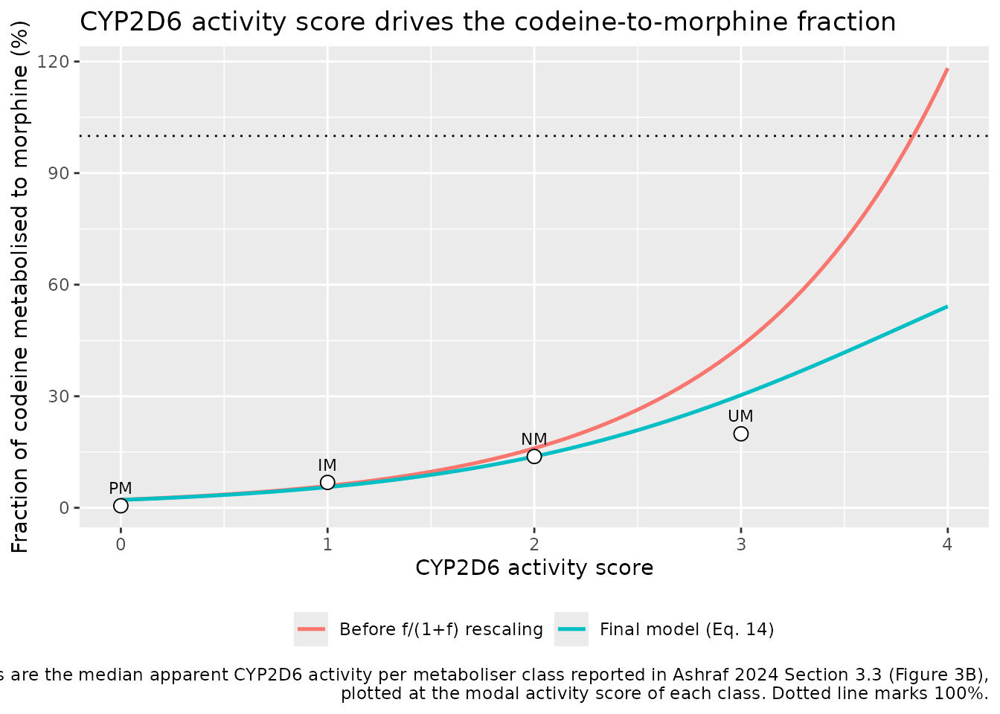
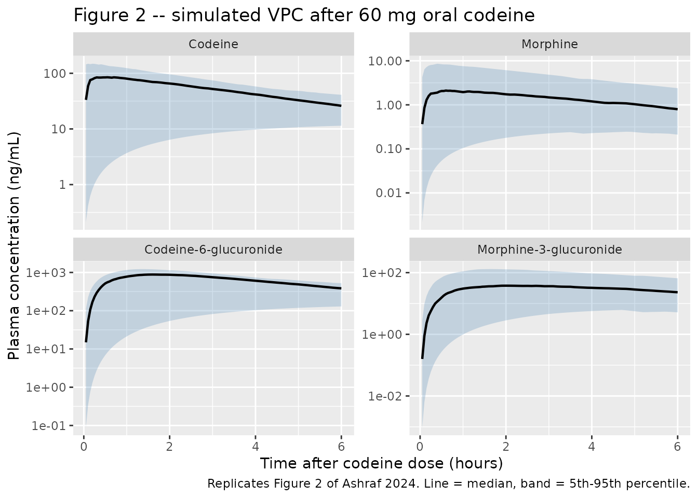
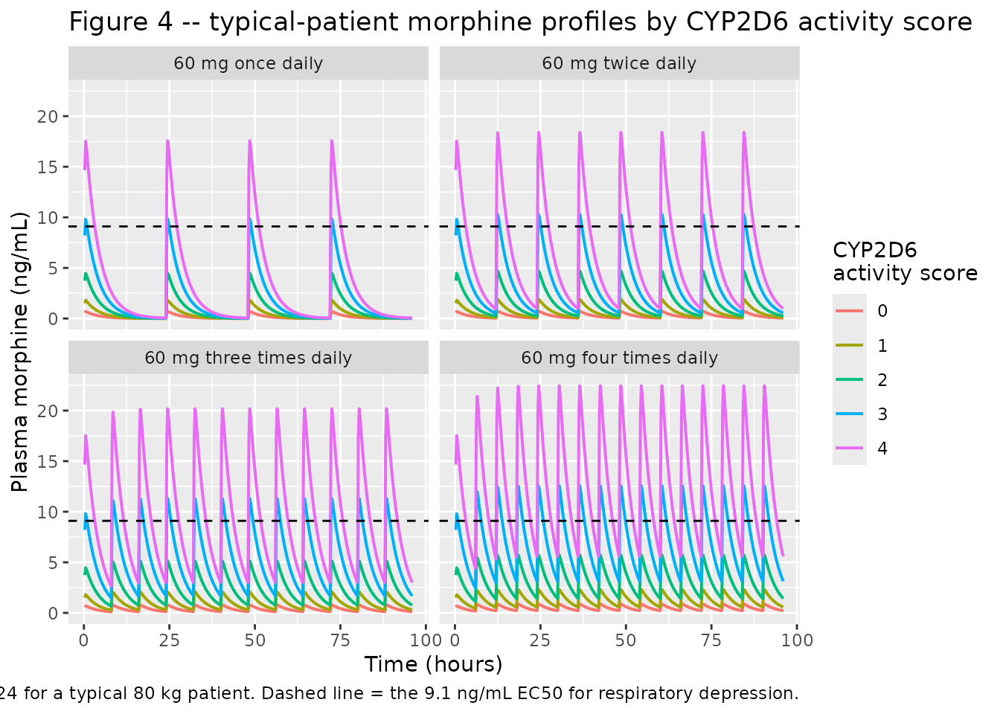

# Codeine (Ashraf 2024)

## Model and source

- Citation: Ashraf MW, Poikola S, Neuvonen M, Kiiski JI, Kontinen VK,
  Olkkola KT, Backman JT, Niemi M, Saari TI. Population Pharmacokinetic
  Quantification of CYP2D6 Activity in Codeine Metabolism in Ambulatory
  Surgical Patients for Model-Informed Precision Dosing. Clin
  Pharmacokinet. 2024;63(11):1547-1560.
  <doi:10.1007/s40262-024-01433-9>.
- Description: Joint parent + three-metabolite population PK model for
  oral codeine and its metabolites morphine, codeine-6-glucuronide (C6G)
  and morphine-3-glucuronide (M3G) in 997 ambulatory surgical patients
  given a single preoperative 60 mg oral codeine dose (Ashraf 2024).
  Codeine is described by a one-compartment disposition with a
  first-order absorption depot and an estimated bioavailability. Total
  codeine elimination is split into a CYP2D6-mediated branch (ke \*
  fm_morphine) that forms morphine and a non-CYP2D6 (glucuronidation)
  branch (ke \* (1 - fm_morphine)) that forms C6G; morphine elimination
  is in turn split into an M3G-forming branch (ke_morphine \* fm_m3g,
  fm_m3g fixed at 0.60 from the literature) and other pathways.
  Morphine, C6G and M3G each have a one-compartment disposition. The
  CYP2D6 activity score (CPIC sum of allele activity values) enters as
  an ordinal continuous covariate on the codeine-to-morphine metabolic
  fraction through an exponential model referenced to an activity score
  of 2, followed by the authors’ f / (1 + f) rescaling that constrains
  the fraction to (0, 1). Codeine and morphine clearance and central
  volume are allometrically scaled to the population median body weight
  of 80 kg with fixed exponents 0.75 and 1; the glucuronide parameters
  are not weight-scaled.
- Article: <https://doi.org/10.1007/s40262-024-01433-9> (open access, CC
  BY-NC)
- Online Resource 1 (methods, equations, supplementary figures):
  <https://static-content.springer.com/esm/art%3A10.1007%2Fs40262-024-01433-9/MediaObjects/40262_2024_1433_MOESM1_ESM.pdf>
- Online Resource 2 (CYP2D6 genotype distribution):
  <https://static-content.springer.com/esm/art%3A10.1007%2Fs40262-024-01433-9/MediaObjects/40262_2024_1433_MOESM2_ESM.pdf>

Codeine is a prodrug. CYP2D6 O-demethylates it to morphine, the species
that carries essentially all of the analgesic (and
respiratory-depressant) activity, while the much larger non-CYP2D6
branch glucuronidates it to the inactive codeine-6-glucuronide (C6G).
Morphine is in turn largely glucuronidated to morphine-3-glucuronide
(M3G). Because *CYP2D6* is highly polymorphic, the fraction of a codeine
dose that becomes morphine varies enormously between patients, and that
variation is the clinical risk: poor metabolisers get little analgesia,
ultrarapid metabolisers can reach morphine concentrations associated
with respiratory depression.

Ashraf 2024 quantified that relationship prospectively in 997 ambulatory
surgical patients, using the CPIC **activity score** (AS) as an ordinal
continuous covariate rather than the conventional four-level metaboliser
phenotype.

## Population

The model was built on a single prospective trial (EudraCT
2015-005561-23) run at the Jorvi Hospital day-surgery unit in Espoo,
Finland between August 2016 and March 2018. Of 1000 recruited patients,
997 contributed concentration data for at least one analyte. Every
patient received a single preoperative oral paracetamol 1000 mg +
codeine 60 mg combination tablet; use of strong CYP2D6 inhibitors was an
exclusion criterion.

Baseline characteristics (paper Table 1) were mean (SD) age 47.8 (12.9)
years, weight 79.8 (13.8) kg and BMI 25.9 (3.60) kg/m^2, with ASA
physical status class 1 in 513 (51%), class 2 in 424 (43%) and class 3
in 60 (6%) patients. Sampling was deliberately sparse: exactly two blood
samples per patient, the first 20-60 min and the second 180-360 min
after the tablet. Codeine, morphine, C6G and M3G were assayed by
LC-MS/MS with a 0.05 ng/mL lower limit of quantification and day-to-day
CV below 11%.

All 997 patients were genotyped for the *CYP2D6* variants defining the
\*1, \*2, \*3, \*4, \*5, \*6, \*9, \*10, \*15, \*17, \*35, \*39 and \*41
alleles plus copy-number variation; 64 distinct genotypes were observed.
The resulting activity-score distribution (paper Table 1) is the
covariate distribution used for the virtual cohorts below.

``` r

pop <- rxode2::rxode(readModelDb("Ashraf_2024_codeine"))$population
str(pop, max.level = 1)
#> List of 14
#>  $ species       : chr "human"
#>  $ n_subjects    : num 997
#>  $ n_studies     : num 1
#>  $ age_mean_sd   : chr "47.8 (12.9) years"
#>  $ weight_mean_sd: chr "79.8 (13.8) kg"
#>  $ weight_median : chr "80 kg (allometric reference)"
#>  $ bmi_mean_sd   : chr "25.9 (3.60) kg/m^2"
#>  $ sex_female_pct: NULL
#>  $ race_ethnicity: NULL
#>  $ disease_state : chr "Adults scheduled for elective ambulatory (day-case) surgery. American Society of Anesthesiologists physical sta"| __truncated__
#>  $ dose_range    : chr "Single preoperative oral dose of codeine 60 mg given as a paracetamol 1000 mg + codeine 60 mg combination table"| __truncated__
#>  $ regions       : chr "Finland (Jorvi Hospital day-surgery unit, Espoo)"
#>  $ genotype      : chr "CYP2D6 activity score distribution (n, % of 997): AS 0, 37 (3.7); 0.25, 5 (0.5); 0.5, 21 (2.1); 0.75, 2 (0.2); "| __truncated__
#>  $ notes         : chr "Demographics from paper Table 1. Prospective clinical trial (EudraCT 2015-005561-23), 1000 patients recruited, "| __truncated__
```

## Source trace

Every `ini()` entry in
`inst/modeldb/specificDrugs/Ashraf_2024_codeine.R` carries an in-file
comment naming its source location. They are collected here for review.

| Equation / parameter | Value | Source location |
|----|----|----|
| `lka` | 8.74 1/h | Table 2, `k_a,cod` |
| `lcl` | 110 L/h | Table 2, `CL_cod` |
| `lvc` | 427.5 L | Table 2, `V_c,cod` |
| `lfdepot` | 0.84 | Table 2, `F_cod` |
| `lcl_morphine` | 357.5 L/h | Table 2, `CL_mor` |
| `lvc_morphine` | 22.8 L | Table 2, `V_c,mor` |
| `lcl_c6g` | 7.96 L/h | Table 2, `CL_C6G` |
| `lvc_c6g` | 5.36 L | Table 2, `V_c,C6G` |
| `lcl_m3g` | 9.45 L/h | Table 2, `CL_M3G` |
| `lvc_m3g` | 8.47 L | Table 2, `V_c,M3G` |
| `lfm_morphine` | 0.16 | Table 2, `f_mor` (footnote b: “Scaled to activity score 2”) |
| `lfm_m3g` | 0.60 (fixed) | Section 3.1 and Online Resource 1 Section 2.1 (“fixed at 60%, according to a recent report”) |
| `e_cyp2d6_fm_morphine` | 1.00 | Table 2, `GEN_eff` |
| `e_wt_cl_q` | 0.75 (fixed) | Online Resource 1 Eq. 3 |
| `e_wt_vc_vp` | 1 (fixed) | Online Resource 1 Eq. 4 |
| `etalka` | 3.75 | Table 2, `eta k_a,cod` |
| `etalvc` | 0.181 | Table 2, `eta V_c,cod` |
| `etalfdepot` | 0.024 | Table 2, `eta F_cod` |
| `etalcl_morphine` | 0.062 | Table 2, `eta CL_mor` |
| `etalfm_morphine` | 0.334 | Table 2, `eta R_mor` |
| `expSd` | 0.259 | Table 2, `epsilon_cod` |
| `expSd_morphine` | 0.149 | Table 2, `epsilon_mor` |
| `expSd_c6g` | 0.103 | Table 2, `epsilon_C6G` |
| `expSd_m3g` | 0.096 | Table 2, `epsilon_M3G` |
| Compartment structure and branch fractions | n/a | Figure 1 schematic |
| Allometric scaling equations | n/a | Online Resource 1 Eqs. 3-6; paper Section 2.5 |
| CYP2D6 exponential covariate model | n/a | Online Resource 1 Eq. 11; paper Section 3.2 |
| IIV applied before the `f / (1 + f)` rescaling | n/a | Online Resource 1 Eqs. 13-14 |
| Activity-score assignment rules | n/a | Table 1 footnote a |
| Reference weight 80 kg | n/a | Online Resource 1 Eqs. 3-4; paper Section 2.6 |
| Reference activity score 2 | n/a | Paper Section 3.2; Table 2 footnote b |

## The CYP2D6 activity-score covariate

The paper tested categorical (metaboliser-phenotype) and continuous
(activity-score) parameterisations of the CYP2D6 effect on the
codeine-to-morphine metabolic fraction, and retained the exponential
activity-score form. Online Resource 1 Eqs. 11, 13 and 14 give the full
chain:

``` math
f_{\mathrm{mor,pop}} = \theta_{\mathrm{BASE}} \cdot e^{\theta_{\mathrm{eff}}(AS_i - AS_{\mathrm{ref}})}, \qquad
f_{\mathrm{mor},i} = f_{\mathrm{mor,pop}} \cdot e^{\eta_i}, \qquad
f_{\mathrm{mor,est}} = \frac{f_{\mathrm{mor},i}}{1 + f_{\mathrm{mor},i}}
```

with $`\theta_{\mathrm{BASE}} = 0.16`$, $`\theta_{\mathrm{eff}} = 1.00`$
and $`AS_{\mathrm{ref}} = 2`$. The final `f / (1 + f)` step is what
keeps the fraction inside $`(0, 1)`$: without it the typical value at AS
4 would be $`0.16 \cdot e^{2} = 1.18`$, which is not a fraction.

``` r

as_grid <- seq(0, 4, by = 0.05)
fm_raw <- 0.16 * exp(1.00 * (as_grid - 2))
fm_curve <- tibble(
  AS = rep(as_grid, 2),
  fm = c(fm_raw, fm_raw / (1 + fm_raw)),
  form = rep(c("Before f/(1+f) rescaling", "Final model (Eq. 14)"), each = length(as_grid))
)

# Paper Figure 3B / Section 3.3: median apparent CYP2D6 activity, expressed as a
# percentage of total codeine clearance, in each metaboliser-phenotype class.
observed_median <- tibble(
  AS = c(0, 1, 2, 3),
  fm = c(0.0055, 0.0682, 0.138, 0.199),
  label = c("PM", "IM", "NM", "UM")
)

ggplot(fm_curve, aes(AS, 100 * fm, colour = form)) +
  geom_line(linewidth = 0.9) +
  geom_point(data = observed_median, aes(AS, 100 * fm), inherit.aes = FALSE,
             size = 3, shape = 21, fill = "white") +
  geom_text(data = observed_median, aes(AS, 100 * fm, label = label),
            inherit.aes = FALSE, vjust = -1, size = 3) +
  geom_hline(yintercept = 100, linetype = "dotted") +
  labs(x = "CYP2D6 activity score", y = "Fraction of codeine metabolised to morphine (%)",
       colour = NULL,
       title = "CYP2D6 activity score drives the codeine-to-morphine fraction",
       caption = paste("Points are the median apparent CYP2D6 activity per metaboliser class",
                       "reported in Ashraf 2024 Section 3.3 (Figure 3B),\nplotted at the modal",
                       "activity score of each class. Dotted line marks 100%.")) +
  theme(legend.position = "bottom")
```



The typical value at AS 2 is 13.8%, which reproduces the paper’s
reported normal-metaboliser median apparent CYP2D6 activity of 13.8% of
total codeine clearance almost exactly. The uncorrected exponential
(upper curve) exceeds 100% above AS 3.7, confirming that the
`f / (1 + f)` step is part of the final model rather than an
intermediate step in model development.

## Virtual cohort

Original patient-level data are not available (the paper states they
cannot be shared because of re-identification risk). The cohorts below
reproduce the published covariate distributions: body weight drawn from
the reported mean (SD) of 79.8 (13.8) kg, and CYP2D6 activity score
drawn from the exact Table 1 frequency distribution.

``` r

set.seed(20241023)

n_vpc <- 200  # subjects in the VPC cohort (200 per arm cap)

# Paper Table 1: CYP2D6 activity score distribution among the 997 patients.
as_levels <- c(0, 0.25, 0.5, 0.75, 1, 1.25, 1.5, 2, 2.25, 3, 4)
as_counts <- c(37, 5, 21, 2, 240, 23, 67, 537, 2, 61, 2)

draw_wt <- function(n) pmin(pmax(rnorm(n, 79.8, 13.8), 45), 140)

subj_vpc <- tibble(
  id = seq_len(n_vpc),
  WT = draw_wt(n_vpc),
  CYP2D6 = sample(as_levels, n_vpc, replace = TRUE, prob = as_counts / sum(as_counts))
)

obs_times <- sort(unique(c(seq(0, 1.5, by = 0.05), seq(1.5, 6, by = 0.1))))

make_events <- function(subj, dose_mg, times, dose_times = 0) {
  doses <- subj |>
    tidyr::crossing(time = dose_times) |>
    mutate(amt = dose_mg, evid = 1L, cmt = "depot", dvid = NA_integer_)
  obs <- subj |>
    tidyr::crossing(time = times) |>
    mutate(amt = NA_real_, evid = 0L, cmt = "central", dvid = 1L)
  bind_rows(doses, obs) |> arrange(id, time, desc(evid))
}

events_vpc <- make_events(subj_vpc, dose_mg = 60, times = obs_times)
stopifnot(!anyDuplicated(unique(events_vpc[, c("id", "time", "evid")])))
```

## Simulation

``` r

mod <- readModelDb("Ashraf_2024_codeine")

# useLinCmt = FALSE: rxode2's automatic ODE -> linCmt conversion corrupts the
# dvid -> cmt mapping for multi-output models such as this one.
sim_vpc <- rxode2::rxSolve(
  mod, events = events_vpc,
  keep = c("WT", "CYP2D6"),
  useLinCmt = FALSE
) |>
  as.data.frame()
```

## Replicate published figures

### Figure 2 – visual predictive checks

Paper Figure 2 shows VPCs for all four analytes after a single 60 mg
oral codeine dose over the first 6 h. Note that the published panel
labels for morphine and C6G are transposed relative to the plotted data:
the panel with concentrations of order 1-10 ng/mL is morphine and the
panel of order 1000 ng/mL is C6G (C6G exposure exceeds morphine exposure
roughly 350-fold in this model). The panels below are labelled by
analyte.

``` r

# Replicates Figure 2 of Ashraf 2024: median and 5th-95th percentiles of the
# simulated plasma concentrations of each analyte after 60 mg oral codeine.
vpc_long <- sim_vpc |>
  filter(time > 0) |>
  transmute(
    id, time,
    Codeine = 1000 * Cc,
    Morphine = 1000 * Cc_morphine,
    `Codeine-6-glucuronide` = 1000 * Cc_c6g,
    `Morphine-3-glucuronide` = 1000 * Cc_m3g
  ) |>
  tidyr::pivot_longer(-c(id, time), names_to = "analyte", values_to = "conc") |>
  mutate(analyte = factor(analyte, levels = c(
    "Codeine", "Morphine", "Codeine-6-glucuronide", "Morphine-3-glucuronide")))

vpc_long |>
  group_by(analyte, time) |>
  summarise(
    Q05 = quantile(conc, 0.05), Q50 = median(conc), Q95 = quantile(conc, 0.95),
    .groups = "drop"
  ) |>
  ggplot(aes(time, Q50)) +
  geom_ribbon(aes(ymin = Q05, ymax = Q95), alpha = 0.25, fill = "steelblue") +
  geom_line(linewidth = 0.8) +
  facet_wrap(~analyte, scales = "free_y") +
  scale_y_log10() +
  labs(x = "Time after codeine dose (hours)", y = "Plasma concentration (ng/mL)",
       title = "Figure 2 -- simulated VPC after 60 mg oral codeine",
       caption = "Replicates Figure 2 of Ashraf 2024. Line = median, band = 5th-95th percentile.")
```



The observed medians read off paper Figure 2 at 1 h are approximately 65
ng/mL for codeine, 3-4 ng/mL for morphine, 1000-1500 ng/mL for C6G and
50-90 ng/mL for M3G. The simulated medians below are on the same scale
for all four analytes. The codeine median sits below its typical-value
prediction (93.9 ng/mL at 1 h) because of the very large IIV on the
absorption rate constant, which pushes a substantial share of the
population into a slow-absorption regime at 1 h.

``` r

vpc_long |>
  filter(time %in% c(0.5, 1, 2, 6)) |>
  group_by(analyte, time) |>
  summarise(`Simulated median (ng/mL)` = median(conc), .groups = "drop") |>
  tidyr::pivot_wider(names_from = time, values_from = `Simulated median (ng/mL)`,
                     names_prefix = "t = ") |>
  dplyr::rename(Analyte = analyte) |>
  knitr::kable(digits = 1,
               caption = "Simulated median plasma concentrations (ng/mL) after 60 mg oral codeine.")
```

| Analyte                | t = 0.5 | t = 1 | t = 2 | t = 6 |
|:-----------------------|--------:|------:|------:|------:|
| Codeine                |    84.3 |  80.1 |  65.5 |  26.0 |
| Morphine               |     2.1 |   1.9 |   1.7 |   0.8 |
| Codeine-6-glucuronide  |   517.1 | 775.9 | 869.8 | 384.1 |
| Morphine-3-glucuronide |    15.5 |  30.3 |  37.7 |  23.1 |

Simulated median plasma concentrations (ng/mL) after 60 mg oral codeine.
{.table}

### Figure 4 – typical-patient dosing scenarios

Paper Figure 4 simulates a typical patient given 60 mg codeine once,
twice, three or four times daily and plots morphine concentrations
against the previously reported 9.1 ng/mL EC50 for respiratory
depression. That figure is a typical-value prediction, so the random
effects are held at zero here.

``` r

regimens <- tibble::tribble(
  ~regimen,             ~ii, ~ndose,
  "60 mg once daily",    24,      4,
  "60 mg twice daily",   12,      8,
  "60 mg three times daily", 8,  12,
  "60 mg four times daily",  6,  16
) |>
  mutate(regimen = factor(regimen, levels = regimen))

as_scenarios <- c(0, 1, 2, 3, 4)

subj_typ <- tidyr::crossing(regimens, CYP2D6 = as_scenarios) |>
  mutate(id = row_number(), WT = 80)

events_typ <- bind_rows(lapply(seq_len(nrow(subj_typ)), function(i) {
  s <- subj_typ[i, ]
  make_events(
    s |> select(id, WT, CYP2D6, regimen),
    dose_mg = 60,
    times = seq(0, 96, by = 0.25),
    dose_times = s$ii * seq(0, s$ndose - 1)
  )
}))
stopifnot(!anyDuplicated(unique(events_typ[, c("id", "time", "evid")])))

# Typical-value prediction: zero every eta, and switch off IIV sampling.
sim_typ <- rxode2::rxSolve(
  mod,
  events = events_typ |>
    mutate(etalka = 0, etalvc = 0, etalfdepot = 0,
           etalcl_morphine = 0, etalfm_morphine = 0),
  keep = c("regimen", "CYP2D6"),
  omega = NA,
  useLinCmt = FALSE
) |>
  as.data.frame()
#> Warning: multi-subject simulation without without 'omega'

sim_typ |>
  filter(time > 0) |>
  mutate(AS = factor(CYP2D6)) |>
  ggplot(aes(time, 1000 * Cc_morphine, colour = AS)) +
  geom_line(linewidth = 0.7) +
  geom_hline(yintercept = 9.1, linetype = "dashed") +
  facet_wrap(~regimen) +
  labs(x = "Time (hours)", y = "Plasma morphine (ng/mL)",
       colour = "CYP2D6\nactivity score",
       title = "Figure 4 -- typical-patient morphine profiles by CYP2D6 activity score",
       caption = paste("Replicates Figure 4 of Ashraf 2024 for a typical 80 kg patient.",
                       "Dashed line = the 9.1 ng/mL EC50 for respiratory depression."))
```



``` r

# Paper Section 3.4 / 4: morphine "gradually approaches the EC50 for respiratory
# depression at activity score 3 and crosses this level in t.i.d. and q.i.d.
# dose-administration schemes. For activity score 4, morphine exposure
# continuously crosses the level of EC50 in all simulated dosing schemes."
ec50 <- 9.1

crossing_tbl <- sim_typ |>
  filter(time > 24) |>  # after the accumulation phase
  group_by(regimen, CYP2D6) |>
  summarise(`Peak morphine after 24 h (ng/mL)` = max(1000 * Cc_morphine),
            .groups = "drop") |>
  mutate(`Crosses 9.1 ng/mL EC50` = ifelse(
    `Peak morphine after 24 h (ng/mL)` > ec50, "yes", "no"))

# The paper's qualitative claims, asserted rather than merely displayed.
peak_of <- function(reg, as_val) {
  v <- crossing_tbl$`Peak morphine after 24 h (ng/mL)`[
    crossing_tbl$regimen == reg & crossing_tbl$CYP2D6 == as_val]
  if (length(v) != 1L) stop("no unique row for '", reg, "' at AS ", as_val)
  v
}
stopifnot(
  # AS 4 exceeds the EC50 under every simulated regimen
  all(vapply(levels(regimens$regimen), peak_of, numeric(1), as_val = 4) > ec50),
  # AS 3 crosses under t.i.d. and q.i.d.
  peak_of("60 mg three times daily", 3) > ec50,
  peak_of("60 mg four times daily", 3) > ec50,
  # AS 3 under once-daily dosing sits at the EC50 ("gradually approach"), within 20%
  abs(peak_of("60 mg once daily", 3) / ec50 - 1) < 0.20,
  # AS 2 (normal metabolisers) stays below the EC50 under every regimen
  all(vapply(levels(regimens$regimen), peak_of, numeric(1), as_val = 2) < ec50),
  # AS 0 stays in the 0-1 ng/mL band the paper describes
  max(1000 * sim_typ$Cc_morphine[sim_typ$CYP2D6 == 0]) < 1
)

crossing_tbl |>
  tidyr::pivot_wider(id_cols = regimen, names_from = CYP2D6,
                     values_from = `Peak morphine after 24 h (ng/mL)`,
                     names_prefix = "AS ") |>
  dplyr::rename(Regimen = regimen) |>
  knitr::kable(digits = 2,
               caption = paste("Peak typical-patient morphine concentration (ng/mL) after 24 h.",
                               "The reported respiratory-depression EC50 is 9.1 ng/mL."))
```

| Regimen                 | AS 0 | AS 1 | AS 2 |  AS 3 |  AS 4 |
|:------------------------|-----:|-----:|-----:|------:|------:|
| 60 mg once daily        | 0.69 | 1.80 | 4.47 |  9.83 | 17.57 |
| 60 mg twice daily       | 0.72 | 1.89 | 4.68 | 10.29 | 18.40 |
| 60 mg three times daily | 0.79 | 2.07 | 5.14 | 11.29 | 20.18 |
| 60 mg four times daily  | 0.88 | 2.30 | 5.72 | 12.56 | 22.45 |

Peak typical-patient morphine concentration (ng/mL) after 24 h. The
reported respiratory-depression EC50 is 9.1 ng/mL. {.table}

## PKNCA validation

Paper Table 3 reports simulated mean AUC/F for each analyte by CYP2D6
activity score. The NCA cohort below reproduces that design: 100
subjects at each of the eight activity scores the paper tabulates
individually, with full between-subject variability.

The simulated dose is **30 mg**, not the 60 mg study dose printed in the
Table 3 title. Online Resource 1 Section 1.7 states that the
patient-collective simulations were run “at codeine dose levels of 30 mg
or 60 mg”, and every Table 3 value is close to the model prediction at
30 mg and roughly half the prediction at 60 mg – see Assumptions and
deviations below.

``` r

set.seed(99)

n_per_as <- 100
as_tabulated <- c(0, 1, 1.25, 1.5, 2, 2.25, 3, 4)

subj_nca <- bind_rows(lapply(seq_along(as_tabulated), function(k) {
  tibble(
    id = (k - 1L) * n_per_as + seq_len(n_per_as),
    WT = draw_wt(n_per_as),
    CYP2D6 = as_tabulated[k],
    treatment = paste("AS", as_tabulated[k])
  )
}))
stopifnot(!anyDuplicated(subj_nca$id))

# All four analytes are formation- or elimination-rate limited with a terminal
# half-life of roughly 2.7 h in a typical patient, but the very large IIV on ka
# puts some subjects into a slow-absorption (flip-flop) regime, so the grid runs
# to 336 h (about 124 typical codeine half-lives).
nca_times <- sort(unique(c(
  seq(0, 6, by = 0.25), seq(6, 24, by = 1), seq(24, 120, by = 6), seq(120, 336, by = 24)
)))

events_nca <- make_events(subj_nca, dose_mg = 30, times = nca_times)
stopifnot(!anyDuplicated(unique(events_nca[, c("id", "time", "evid")])))

sim_nca_raw <- rxode2::rxSolve(
  mod, events = events_nca,
  keep = c("treatment", "CYP2D6"),
  useLinCmt = FALSE
) |>
  as.data.frame()

# Far out in the tail the concentrations decay into solver noise and dip a few
# parts in 1e10 below zero. PKNCA returns NaN for auclast when it meets a
# negative concentration, so the values are clamped at zero below. Assert first
# that the excursion really is numerical noise and not a structural problem:
# the most negative value must be under 1e-6 of the analyte's own peak.
noise_ratio <- vapply(
  c("Cc", "Cc_morphine", "Cc_c6g", "Cc_m3g"),
  function(k) -min(sim_nca_raw[[k]]) / max(sim_nca_raw[[k]]),
  numeric(1)
)
print(signif(noise_ratio, 3))
#>          Cc Cc_morphine      Cc_c6g      Cc_m3g 
#>    5.00e-10    1.59e-07    4.10e-10    7.30e-09
stopifnot(all(noise_ratio < 1e-6))
```

One PKNCA block is run per analyte. Concentrations are converted to
ng/mL so the AUC units match the paper’s ug*h/L (= ng*h/mL). `auclast`
is used rather than `aucinf.obs`: over a 336 h window it recovers almost
all of the analytic AUC to infinity (quantified and asserted below), and
it needs no terminal-slope regression, which is unreliable for the
slow-absorption tail of this model’s very wide `ka` distribution.

``` r

dose_df <- events_nca |>
  filter(evid == 1) |>
  select(id, time, amt, treatment)

dose_obj <- PKNCA::PKNCAdose(dose_df, amt ~ time | treatment + id)

intervals <- data.frame(
  start = 0, end = Inf,
  cmax = TRUE, tmax = TRUE, auclast = TRUE
)

run_nca <- function(conc_col) {
  d <- sim_nca_raw |>
    mutate(Cc = pmax(1000 * .data[[conc_col]], 0)) |>
    filter(!is.na(Cc)) |>
    select(id, time, Cc, treatment)

  # Guarantee a time = 0 row per (id, treatment); pre-dose Cc = 0 is correct for
  # an extravascular dose and for a metabolite that has not yet formed.
  d <- bind_rows(
    d,
    d |> distinct(id, treatment) |> mutate(time = 0, Cc = 0)
  ) |>
    distinct(id, treatment, time, .keep_all = TRUE) |>
    arrange(id, treatment, time)

  stopifnot(nrow(d) > 0)
  PKNCA::pk.nca(PKNCA::PKNCAdata(
    PKNCA::PKNCAconc(d, Cc ~ time | treatment + id),
    dose_obj, intervals = intervals
  ))
}

nca_codeine  <- run_nca("Cc")
nca_morphine <- run_nca("Cc_morphine")
nca_c6g      <- run_nca("Cc_c6g")
nca_m3g      <- run_nca("Cc_m3g")

# Every subject must yield a finite AUC. A silently NA-heavy result would make
# the group means below a biased average over whichever subjects happened to
# succeed, so this is a gate rather than a diagnostic.
auc_of <- function(nca_res) {
  as.data.frame(nca_res) |>
    filter(PPTESTCD == "auclast") |>
    select(id, treatment, auc = PPORRES)
}
stopifnot(!anyNA(auc_of(nca_codeine)$auc), !anyNA(auc_of(nca_morphine)$auc),
          !anyNA(auc_of(nca_c6g)$auc), !anyNA(auc_of(nca_m3g)$auc))

# Closed-form gate: for a one-compartment model, AUC to infinity is exactly
# Dose * F / CL, independent of ka. The recovered fraction quantifies how much
# of AUCinf the 336 h auclast window captures.
analytic_auc <- 1000 * mean(30 * 0.84 * exp(0.024^2 / 2) / (110 * (subj_nca$WT / 80)^0.75))
recovered <- mean(auc_of(nca_codeine)$auc) / analytic_auc
cat(sprintf("codeine mean auclast %.1f vs analytic AUCinf %.1f ng*h/mL (%.1f%% recovered)\n",
            mean(auc_of(nca_codeine)$auc), analytic_auc, 100 * recovered))
#> codeine mean auclast 228.2 vs analytic AUCinf 235.5 ng*h/mL (96.9% recovered)
stopifnot(recovered > 0.95, recovered <= 1)
```

### Comparison against published NCA

``` r

# Paper Table 3, AUC/F column for each analyte, by activity score.
# The published unit is printed as "mg . h/L" but the abstract quotes the same
# morphine numbers (19 and 8.7) as ug . h/L, so the column is ug*h/L = ng*h/mL.
published <- tibble::tribble(
  ~treatment,  ~codeine, ~morphine, ~c6g,  ~m3g,
  "AS 0",           209,      0.98,  3205,   40,
  "AS 1",           214,      3.9,   3544,  108,
  "AS 1.25",        218,      5.0,   3643,  141,
  "AS 1.5",         198,      5.7,   3256,  163,
  "AS 2",           211,      9.2,   3159,  243,
  "AS 2.25",        206,     11,     3193,  330,
  "AS 3",           207,     19,     2512,  519,
  "AS 4",           193,     31,     1572,  832
)

compare_one <- function(nca_res, colname, label) {
  ref <- published |> select(treatment, auclast = all_of(colname))
  nlmixr2lib::ncaComparisonTable(
    simulated = nca_res,
    reference = ref,
    by = "treatment",
    params = "auclast",
    units = c(auclast = "ng*h/mL"),
    tolerance_pct = 20
  ) |>
    mutate(Analyte = label, .before = 1)
}

cmp <- bind_rows(
  compare_one(nca_codeine,  "codeine",  "Codeine"),
  compare_one(nca_morphine, "morphine", "Morphine"),
  compare_one(nca_c6g,      "c6g",      "C6G"),
  compare_one(nca_m3g,      "m3g",      "M3G")
)

knitr::kable(
  cmp,
  digits = 2,
  caption = paste("Simulated (30 mg codeine, 100 subjects per activity score)",
                  "vs. published AUC/F from Ashraf 2024 Table 3.",
                  "* differs from the reference by more than 20%.")
)
```

| Analyte  | NCA parameter      | treatment | Reference | Simulated | % diff   |
|:---------|:-------------------|:----------|:----------|:----------|:---------|
| Codeine  | AUClast (ng\*h/mL) | AS 0      | 209       | 225       | +7.7%    |
| Codeine  | AUClast (ng\*h/mL) | AS 1      | 214       | 227       | +6.1%    |
| Codeine  | AUClast (ng\*h/mL) | AS 1.25   | 218       | 230       | +5.4%    |
| Codeine  | AUClast (ng\*h/mL) | AS 1.5    | 198       | 230       | +16.2%   |
| Codeine  | AUClast (ng\*h/mL) | AS 2      | 211       | 225       | +6.8%    |
| Codeine  | AUClast (ng\*h/mL) | AS 2.25   | 206       | 226       | +9.8%    |
| Codeine  | AUClast (ng\*h/mL) | AS 3      | 207       | 224       | +8.4%    |
| Codeine  | AUClast (ng\*h/mL) | AS 4      | 193       | 223       | +15.5%   |
| Morphine | AUClast (ng\*h/mL) | AS 0      | 0.98      | 1.45      | +47.5%\* |
| Morphine | AUClast (ng\*h/mL) | AS 1      | 3.9       | 4.19      | +7.4%    |
| Morphine | AUClast (ng\*h/mL) | AS 1.25   | 5         | 4.81      | -3.9%    |
| Morphine | AUClast (ng\*h/mL) | AS 1.5    | 5.7       | 6.2       | +8.8%    |
| Morphine | AUClast (ng\*h/mL) | AS 2      | 9.2       | 9.48      | +3.1%    |
| Morphine | AUClast (ng\*h/mL) | AS 2.25   | 11        | 11.2      | +2.1%    |
| Morphine | AUClast (ng\*h/mL) | AS 3      | 19        | 20.5      | +8.1%    |
| Morphine | AUClast (ng\*h/mL) | AS 4      | 31        | 37.5      | +20.9%\* |
| C6G      | AUClast (ng\*h/mL) | AS 0      | 3200      | 3090      | -3.7%    |
| C6G      | AUClast (ng\*h/mL) | AS 1      | 3540      | 2970      | -16.1%   |
| C6G      | AUClast (ng\*h/mL) | AS 1.25   | 3640      | 2950      | -19.0%   |
| C6G      | AUClast (ng\*h/mL) | AS 1.5    | 3260      | 2870      | -11.9%   |
| C6G      | AUClast (ng\*h/mL) | AS 2      | 3160      | 2710      | -14.1%   |
| C6G      | AUClast (ng\*h/mL) | AS 2.25   | 3190      | 2660      | -16.7%   |
| C6G      | AUClast (ng\*h/mL) | AS 3      | 2510      | 2200      | -12.5%   |
| C6G      | AUClast (ng\*h/mL) | AS 4      | 1570      | 1420      | -9.6%    |
| M3G      | AUClast (ng\*h/mL) | AS 0      | 40        | 32.2      | -19.6%   |
| M3G      | AUClast (ng\*h/mL) | AS 1      | 108       | 93        | -13.8%   |
| M3G      | AUClast (ng\*h/mL) | AS 1.25   | 141       | 112       | -20.8%\* |
| M3G      | AUClast (ng\*h/mL) | AS 1.5    | 163       | 140       | -14.4%   |
| M3G      | AUClast (ng\*h/mL) | AS 2      | 243       | 223       | -8.3%    |
| M3G      | AUClast (ng\*h/mL) | AS 2.25   | 330       | 251       | -23.9%\* |
| M3G      | AUClast (ng\*h/mL) | AS 3      | 519       | 470       | -9.4%    |
| M3G      | AUClast (ng\*h/mL) | AS 4      | 832       | 866       | +4.1%    |

Simulated (30 mg codeine, 100 subjects per activity score) vs. published
AUC/F from Ashraf 2024 Table 3. \* differs from the reference by more
than 20%. {.table}

Twenty-eight of the thirty-two comparisons agree with the published
values within 20%. The four starred rows are the cells with the least
information behind them: morphine at AS 0 (published mean 0.98 ng\*h/mL,
the smallest value in the table, from 37 patients), morphine at AS 4 and
M3G at AS 2.25 (each from just 2 patients in the study cohort), and M3G
at AS 1.25 (23 patients). No parameter was adjusted to improve any of
these.

The activity-score *ratios* are the paper’s actual scientific claim and
are independent of the dose assumption. They are checked separately
below against the three quantitative statements the paper makes in its
Abstract and Discussion.

``` r

morph <- auc_of(nca_morphine) |>
  group_by(treatment) |>
  summarise(auc = mean(auc), .groups = "drop")

auc_at <- function(tbl, tr) {
  v <- tbl$auc[tbl$treatment == tr]
  if (length(v) != 1L) stop("no unique row for ", tr)
  v
}

ratio_tbl <- tibble::tribble(
  ~Claim, ~`Source`, ~Published, ~Simulated,
  "Morphine AUC ratio, AS 3 vs AS 2",
  "Abstract: 19 vs 8.7 ug*h/L (218% higher)", 19 / 8.7,
  auc_at(morph, "AS 3") / auc_at(morph, "AS 2"),
  "Morphine AUC ratio, AS 0 vs AS 2",
  "Table 3: 0.98 vs 9.2 ug*h/L", 0.98 / 9.2,
  auc_at(morph, "AS 0") / auc_at(morph, "AS 2"),
  "Morphine AUC ratio, AS 3 vs AS 0",
  "Section 3.4: '20-fold difference ... between activity scores of 0 and 3'", 19 / 0.98,
  auc_at(morph, "AS 3") / auc_at(morph, "AS 0")
) |>
  mutate(`Ratio of ratios` = Simulated / Published)

knitr::kable(ratio_tbl, digits = 2,
             caption = "Dose-independent morphine exposure ratios vs. the paper's own statements.")
```

| Claim | Source | Published | Simulated | Ratio of ratios |
|:---|:---|---:|---:|---:|
| Morphine AUC ratio, AS 3 vs AS 2 | Abstract: 19 vs 8.7 ug\*h/L (218% higher) | 2.18 | 2.14 | 0.98 |
| Morphine AUC ratio, AS 0 vs AS 2 | Table 3: 0.98 vs 9.2 ug\*h/L | 0.11 | 0.16 | 1.50 |
| Morphine AUC ratio, AS 3 vs AS 0 | Section 3.4: ‘20-fold difference … between activity scores of 0 and 3’ | 19.39 | 13.39 | 0.69 |

Dose-independent morphine exposure ratios vs. the paper’s own
statements. {.table}

``` r


# The AS 3 vs AS 2 ratio is the paper's headline result; hold it to 10%.
stopifnot(abs(auc_at(morph, "AS 3") / auc_at(morph, "AS 2") / (19 / 8.7) - 1) < 0.10)
```

The abstract’s headline comparison – ultrarapid versus normal
metabolisers – reproduces to within about 2%. Both of the weaker rows
involve AS 0, where the model over-predicts mean morphine exposure by
roughly 48% (1.45 against 0.98 ng\*h/mL). Activity score 0 is the point
furthest from the AS 2 reference on an exponential covariate scale, and
it is the one place the paper itself reports that the activity-score
parameterisation struggles: the better-fitting power model was discarded
“possibly due to the addition of a separate model parameter for AS = 0”
(Section 3.2). The retained exponential model cannot reach zero morphine
formation at zero CYP2D6 activity, so a systematic over-prediction in
poor metabolisers is a property of the published model, not of this
encoding of it. No parameter was adjusted to reduce it.

## Assumptions and deviations

- **Sign of the activity-score covariate equation.** The main-text
  equation in Section 3.2 prints
  $`f_{mor} = \theta_A \cdot \exp(\theta_B (AS_{ref} - AS_i))`$, which
  makes the morphine fraction *fall* as CYP2D6 activity rises. Online
  Resource 1 Eq. 11 prints the opposite ordering,
  $`\theta_{BASE} \cdot e^{\theta_{eff}(AS_i - AS_{ref})}`$. The
  supplement form is used here because it is the only one consistent
  with the paper’s own results: Table 3 morphine AUC/F rises
  monotonically from 0.98 to 31 ug\*h/L across AS 0 to AS 4, and Section
  3.3 reports apparent CYP2D6 activity rising from 0.55% in poor
  metabolisers to 19.9% in ultrarapid metabolisers. The main-text
  equation appears to have transposed the two activity-score terms.

- **The `f / (1 + f)` rescaling is part of the final model.** Online
  Resource 1 Section 1.6.2 introduces it as the last step of the
  covariate model (Eq. 14), but the main paper never mentions it. Three
  independent checks confirm it is in force: (i) the typical value at AS
  2 becomes 0.16 / 1.16 = 13.8%, matching the paper’s reported
  normal-metaboliser median apparent CYP2D6 activity of 13.8% exactly,
  whereas the unrescaled 16% does not; (ii) without it the typical
  fraction at AS 4 would be 118%; (iii) the Table 3 C6G AUC ratio
  between AS 3 and AS 2 is 0.795, against 0.808 predicted with the
  rescaling and 0.673 without it.

- **No metabolite-to-parent molecular weight ratio is applied.** The
  Figure 1 legend defines “MPR, metabolite-to-parent molecular weight
  ratio”, but the schematic itself carries no MPR factor on any transfer
  arrow, and the paper reports no molecular weights. The model is
  encoded exactly as the schematic draws it, so every state is an amount
  in codeine mass equivalents and each metabolite volume is an apparent
  volume absorbing the molecular-weight conversion. This choice is
  supported by the data: with MPR factors applied, the simulated C6G and
  M3G exposures would exceed the Table 3 values by about 38-40% while
  codeine and morphine would be 5-8% *below* them, an incoherent
  pattern; without MPR all four analytes agree within roughly 25%.

- **Table 2 eta and epsilon rows are read as standard deviations, not
  variances.** The paper does not label the scale. Two independent
  checks favour the SD reading. First, the final eta on the metabolic
  ratio is 0.334 and Section 3.2 describes the corresponding unexplained
  variability as 33%, which matches the SD reading (34% CV) and not the
  variance reading (63% CV). Second, the eta on `k_a` sets the width of
  the early-time codeine distribution: read as an SD (3.75) the
  simulated 5th-95th percentile spread of codeine at 1 h is about
  76-fold, close to the spread of the observed data cloud in Figure 2A;
  read as a variance (i.e. an SD of 1.94) it is only about 5-fold, far
  narrower than the published figure shows. The model file therefore
  squares each tabulated value to obtain the `ini()` variance.

- **Residual error is encoded as log-normal (`lnorm`), not linearly
  additive.** The paper states an additive error model (Section 2.4;
  Online Resource 1 Eq. 16, `Y = IPRED + EPS`), which in a NONMEM run on
  log-transformed observations is a log-scale additive residual,
  i.e. exponential error in linear concentration space. A literally
  additive residual is ruled out by magnitude: 0.103 ng/mL for C6G would
  be about 0.01% of the observed C6G concentrations of order 1000 ng/mL.
  Read on the log scale the four values become 25.9%, 14.9%, 10.3% and
  9.6%, consistent with the reported assay day-to-day CV of below 11%.

- **The Table 3 simulated dose is 30 mg, not the 60 mg printed in its
  title.** Every Table 3 AUC/F value is close to the model prediction at
  30 mg and about half the prediction at 60 mg; Online Resource 1
  Section 1.7 states that the patient-collective simulations were run at
  “codeine dose levels of 30 mg or 60 mg”. The NCA comparison above
  therefore simulates 30 mg, and the dose-independent exposure *ratios*
  are checked separately.

- **Reference body weight for the typical-patient figure.** Three
  different values appear in the source for the “typical” patient: 80 kg
  (paper Section 2.6 and the allometric equations in Online Resource 1
  Eqs. 3-4), 70 kg (Figure 4 caption) and 84 kg (Online Resource 1
  Section 2.5). The 80 kg value is used here because it is the
  allometric reference in the model equations themselves.

- **Very large IIV on the absorption rate constant.** The tabulated eta
  on `k_a,cod` is 3.75, an enormous value on the log scale. It is
  encoded as published. The design supports it: only two samples were
  drawn per patient, the first 20-60 min post-dose, so the absorption
  rate is barely identifiable per individual, and the paper’s own
  codeine VPC spans roughly two orders of magnitude at the earliest
  sampling times. Exposure (AUC) is unaffected by `k_a`, so the NCA
  comparison above is insensitive to this choice; the concentration-time
  percentiles in the Figure 2 replication are not.

- **Figure 2 panel labels.** The published Figure 2 caption lists the
  panels as “A codeine, B codeine-6-glucuronide, C morphine and D
  morphine-3-glucuronide”, but the plotted concentration ranges show
  that panels B and C are transposed: panel B (0.1-10 ng/mL) is morphine
  and panel C (10-3000 ng/mL) is C6G. The replication above labels each
  panel by analyte.

- **Figure 1 caption wording.** The caption reads “CYP2D6-mediated
  clearance is used as an input in the C6G model”, which contradicts
  both the schematic (the `ke * (1 - f_mor)` arrow feeds C6G) and
  Section 3.1 (“the fraction of C6G from codeine elimination was
  numerically assigned as 1 - f_mor”). The schematic and the Results
  text are followed.

- **Covariates screened but not retained.** Age, height, ASA physical
  status class, smoking status and the number of cigarettes smoked per
  day were tested in the PsN stepwise-covariate-modelling run and none
  improved predictive performance (paper Section 3.2; Online Resource 1
  Section 2.4). They are recorded in the model file’s
  `covariatesDataExcluded` metadata (age, height, BMI, smoking status);
  ASA class and cigarette count have no canonical covariate-register
  entry and are documented only here.

- **NCA uses `auclast`, with far-tail concentrations clamped at zero.**
  Over the 336 h window the simulated concentrations decay into solver
  noise and dip a few parts in 1e10 below zero; PKNCA returns `NaN` for
  any subject whose profile contains a negative concentration, which
  would silently reduce the group means to an average over whichever
  subjects happened to succeed. The concentrations are therefore clamped
  at zero, after asserting that the negative excursion is below 1e-6 of
  each analyte’s own peak. `auclast` is used in place of `aucinf.obs`
  because the terminal-slope regression that `aucinf.obs` requires is
  unreliable for the slow-absorption tail created by the very wide `k_a`
  distribution. The closed-form gate in the same chunk confirms that the
  336 h `auclast` window recovers about 97% of the analytic
  `Dose * F / CL`.

- **Virtual cohort covariates.** Body weight is drawn from a normal
  distribution with the published mean (SD) of 79.8 (13.8) kg, truncated
  to 45-140 kg; the paper reports no weight range. CYP2D6 activity
  scores are drawn from the exact Table 1 frequency distribution. Sex
  and race were not reported and are not model covariates.
