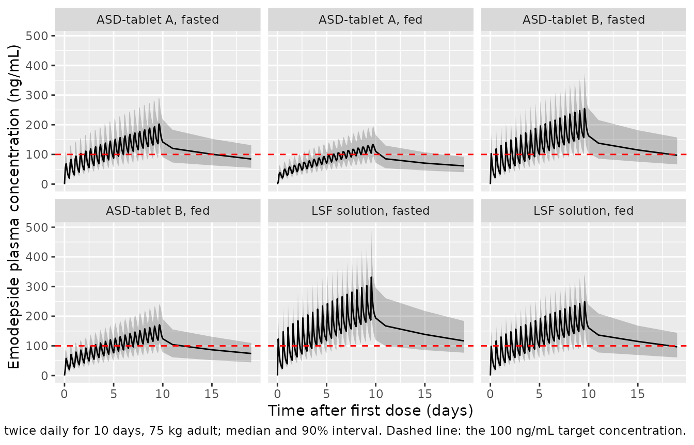
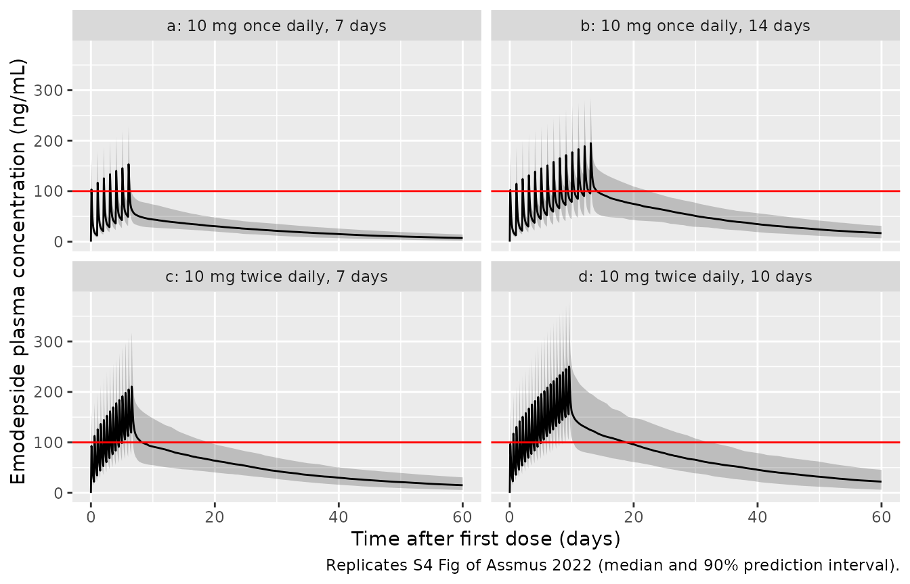
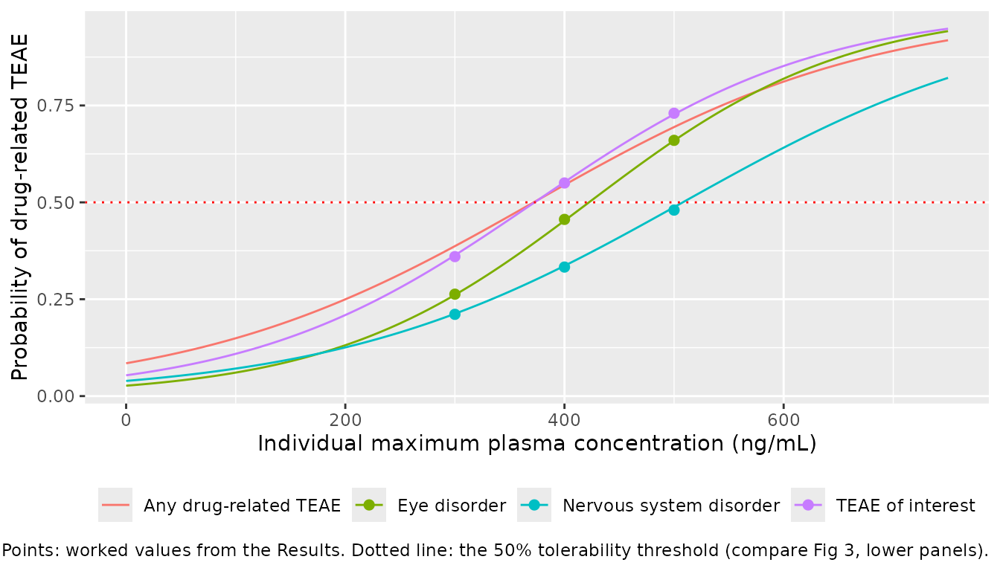

# Emodepside (Assmus 2022)

## Model and source

- Citation: Assmus F, Hoglund RM, Monnot F, Specht S, Scandale I,
  Tarning J. Drug development for the treatment of onchocerciasis:
  Population pharmacokinetic and adverse events modeling of emodepside.
  PLoS Negl Trop Dis. 2022;16(3):e0010219.
  <doi:10.1371/journal.pntd.0010219>. PMCID: PMC8912909. Parameter
  values from Table 3 and the S1 Code NONMEM control stream (supporting
  information).
- Description: Three-compartment population PK model with a
  four-transit-compartment absorption chain (ka = ktr = 5/MTT) and
  linear elimination for oral emodepside in healthy male volunteers
  pooled from three phase I studies (single ascending dose, multiple
  ascending dose and relative bioavailability; Assmus 2022). CL/F, Q/F
  and Q2/F scale allometrically with body weight (exponent 0.75,
  reference 75 kg) and every volume linearly. Formulation (ASD-tablet A
  or B versus the oral liquid service formulation solution) and food act
  on both the mean transit time and the relative bioavailability, and
  the daily dose per kg body weight lengthens the mean transit time
  linearly. Inter-occasion variability on the mean transit time applies
  only to the two occasions of the multiple ascending dose study. Venous
  plasma (Cc) and dried-blood-spot (Cb) concentrations are linked by an
  estimated scaling factor of 0.618 and carry separate log-scale
  residual errors.
- Article: <https://doi.org/10.1371/journal.pntd.0010219> (open access,
  PLoS Neglected Tropical Diseases 16(3):e0010219)

Assmus 2022 developed the first population PK model of emodepside, an
anthelmintic in development as a macrofilaricide for onchocerciasis
(river blindness), and linked the model-predicted peak concentration to
drug-related treatment-emergent adverse events (TEAEs) by binary
logistic regression. The paper contributes five models to nlmixr2lib:

| Model | What it predicts | Source |
|----|----|----|
| `Assmus_2022_emodepside` | Venous plasma (`Cc`) and dried-blood-spot (`Cb`) emodepside concentrations | Table 3; S1 Code |
| `Assmus_2022_emodepside_teae_interest` | Probability of a drug-related eye or nervous system disorder TEAE (the “TEAE of interest”) | S6 Table |
| `Assmus_2022_emodepside_eye_disorder` | Probability of a drug-related eye disorder TEAE | S6 Table |
| `Assmus_2022_emodepside_nervous_system_disorder` | Probability of a drug-related nervous system disorder TEAE | S6 Table |
| `Assmus_2022_emodepside_teae_drug_related` | Probability of any drug-related TEAE | S7 Table |

The four logistic models take the individual maximum plasma
concentration as a data column (`CMAX`, ng/mL). They were fitted
sequentially after the PK model, so they are separate files; compute
`CMAX` from `Assmus_2022_emodepside`.

## Population

The PK analysis pooled 142 healthy White men from three phase I studies
run at one UK site between 2016 and 2018 (Table 1): a single ascending
dose study (n = 47; 1-40 mg of the oral liquid service formulation, LSF,
1 mg/mL solution, fasted or fed), a multiple ascending dose study (n =
18; 5 mg once daily, 10 mg once daily or 10 mg twice daily for 10 days,
LSF, fasted) and a relative bioavailability study (n = 77; 5 or 10 mg of
the LSF solution or of amorphous-solid-dispersion tablets A or B, fasted
or fed). Median age was 32 years (18-54) and median body weight 79.1 kg
(53.2-105) (Table 2). Eleven subjects given the crystalline tablet X,
which was not carried forward, were excluded. In total 3,123
concentrations were analysed: 2,892 venous plasma and 231 dried blood
spot (DBS) samples. The adverse-event analysis used the same 142
subjects; 27 (19.0%) had a drug-related TEAE of interest, 20 an eye
disorder and 18 a nervous system disorder, and 31 (21.8%) any
drug-related TEAE.

The same information is available programmatically:

``` r

str(readModelDb("Assmus_2022_emodepside")()$population)
#> Warning: some etas defaulted to non-mu referenced, possible parsing error: etaiov_mtt_1, etaiov_mtt_2
#> as a work-around try putting the mu-referenced expression on a simple line
#> List of 14
#>  $ species       : chr "human"
#>  $ n_subjects    : int 142
#>  $ n_studies     : int 3
#>  $ n_observations: chr "3,123 concentrations (2,892 venous plasma, 231 dried blood spot)"
#>  $ age_range     : chr "18-54 years"
#>  $ age_median    : chr "32 years"
#>  $ weight_range  : chr "53.2-105 kg"
#>  $ weight_median : chr "79.1 kg"
#>  $ sex_female_pct: num 0
#>  $ race_ethnicity: Named num 100
#>   ..- attr(*, "names")= chr "White"
#>  $ disease_state : chr "healthy male volunteers"
#>  $ dose_range    : chr "single oral doses of 1-40 mg (LSF solution) or 5-10 mg (ASD-tablet A or B), and 5 mg once daily, 10 mg once dai"| __truncated__
#>  $ regions       : chr "United Kingdom (single phase I site, Hammersmith Medicines Research, London)"
#>  $ notes         : chr "Pooled from the single ascending dose (NCT02661178, n = 47 after excluding 11 subjects on the discontinued crys"| __truncated__
```

## Source trace

Every `ini()` value carries an in-file comment naming its source. The S1
Code supplement is the NONMEM control stream of the final model; its
`$THETA` initial values equal the Table 3 final estimates, and its
`$OMEGA` and `$SIGMA` blocks hold the variances whose %CV Table 3
prints.

| Equation / parameter | Value | Source location |
|----|----|----|
| Structure: depot, 4 transit compartments, 3-compartment disposition | n/a | Results; Fig 1; S1 Code `$MODEL` (ADVAN5) |
| `ktr = (NN + 1) / MTT`, NN = 4, ka = ktr | n/a | Methods Eq 1; Results; S1 Code `KTR = (NN+1)/MT` |
| `lmtt` | log(0.488 h) | Table 3; S1 Code THETA(3) |
| `lcl` | log(1.29 L/h) | Table 3; S1 Code THETA(1) |
| `lvc` | log(52.4 L) | Table 3; S1 Code THETA(2) |
| `lq`, `lvp` (shallow peripheral) | log(4.60 L/h), log(44.4 L) | Table 3 Q1/F, Vp1/F; S1 Code THETA(6), THETA(7) |
| `lq2`, `lvp2` (deep peripheral) | log(8.45 L/h), log(647 L) | Table 3 Q2/F, Vp2/F; S1 Code THETA(4), THETA(5) |
| `lfdepot` | fixed(log(1)) | Table 3 ‘F 1 fixed’; S1 Code THETA(8) FIX |
| `bpr` (DBS / plasma) | 0.618 | Table 3 scaling factor 61.8%; S1 Code THETA(9) |
| `e_wt_cl`, `e_wt_vc` | fixed 0.75, fixed 1 (reference 75 kg) | Methods Eq 4; S1 Code |
| `e_form_emodepside_asda_fdepot`, `..._asdb_fdepot` | -0.314, -0.200 | Table 3; S1 Code THETA(10), THETA(11) |
| `e_form_emodepside_asda_mtt`, `..._asdb_mtt` | 2.43, 1.24 | Table 3; S1 Code THETA(12), THETA(13) |
| `e_fed_fdepot`, `e_fed_mtt` | -0.244, 1.14 | Table 3; S1 Code THETA(15), THETA(14) |
| `e_dose_emodepside_mgkgd_mtt` (centred at 0.08 mg/kg/day) | 1.05 | Table 3; S1 Code THETA(16), `COV4` |
| IIV variances (F, MTT, CL, Vc, Q1, Q2, Vp2) | 0.0351, 0.135, 0.044, 0.0926, 0.0843, 0.017, 0.0908 | S1 Code `$OMEGA`; Table 3 %CV |
| `etaiov_mtt_1`, `etaiov_mtt_2` | 0.0692 (second fixed, SAME) | S1 Code `$OMEGA BLOCK(1)`; Table 3 IOV 26.8% |
| `expSd`, `expSd_Cb` | sqrt(0.0203) = 0.1425, sqrt(0.0366) = 0.1913 | Table 3 sigma rows; S1 Code `$SIGMA` |
| Logistic intercepts (TEAE of interest, eye, nervous) | -2.87, -3.59, -3.20 | S6 Table, Cmax columns |
| Logistic Cmax slopes (TEAE of interest, eye, nervous) | 0.0077, 0.0085, 0.0063 per ng/mL | S6 Table, Cmax columns |
| Logistic intercept and slope, any drug-related TEAE | -2.38, 0.0064 per ng/mL | S7 Table, Cmax column |

Parameter relationships in `model()`, all from S1 Code `$PK`:

- `cl = CL * (WT/75)^0.75`, likewise `q` and `q2`; `vc = Vc * (WT/75)`,
  likewise `vp` and `vp2`.
- `mtt = MTT * exp(eta + iov) * (1 + 2.43 ASDA) * (1 + 1.24 ASDB) * (1 + 1.14 FED) * (1 + 1.05 (DOSE_KG - 0.08))`.
- `F = exp(eta) * (1 - 0.314 ASDA) * (1 - 0.200 ASDB) * (1 - 0.244 FED)`,
  applied to the dosing compartment.
- `Cb = 0.618 * Cc`; each matrix has its own additive error on log
  concentrations.

## PK validation: S3 Table

S3 Table reports stochastic-simulation medians (5th-95th percentiles) of
the last-dose Cmax, Tmax, AUC from the first dose to infinity and the
terminal half-life for 10 mg twice daily for 10 days in a 75 kg adult,
for each formulation dosed fasted or fed. That regimen is reproduced
here with 200 virtual subjects per arm.

``` r

set.seed(20220310)
rxode2::rxSetSeed(20220310)

n_per_arm <- 200L
arms <- tidyr::expand_grid(
  formulation = c("LSF solution", "ASD-tablet A", "ASD-tablet B"),
  food = c("fasted", "fed")
) |>
  mutate(
    arm = paste(formulation, food, sep = ", "),
    arm_index = dplyr::row_number()
  )

# 20 doses: 10 mg every 12 h from 0 to 228 h. The last-dose interval is
# densely sampled; the tail runs to 4,400 h (~10 half-lives after the last
# dose) so AUC to infinity is essentially observed. The tail is sampled
# every 4 days: ample for an 18-day half-life, and it keeps PKNCA's
# terminal-slope search fast.
dose_times <- seq(0, 228, by = 12)
obs_times <- sort(unique(c(
  seq(0, 228, by = 2),
  228 + c(0.25, 0.5, 0.75, 1, 1.25, 1.5, 1.75, 2, 2.5, 3, 3.5, 4, 5, 6, 8, 10, 12),
  seq(264, 4400, by = 96)
)))

make_arm <- function(arm_row, n) {
  ids <- (arm_row$arm_index - 1L) * n + seq_len(n)
  subj <- tibble(
    id = ids,
    arm = arm_row$arm,
    WT = 75,
    FED = as.integer(arm_row$food == "fed"),
    FORM_EMODEPSIDE_ASDA = as.integer(arm_row$formulation == "ASD-tablet A"),
    FORM_EMODEPSIDE_ASDB = as.integer(arm_row$formulation == "ASD-tablet B"),
    DOSE_EMODEPSIDE_MGKGD = 20 / 75,
    OCC = 0L
  )
  doses <- tidyr::crossing(subj, time = dose_times) |>
    mutate(amt = 10, evid = 1L, cmt = "depot", dvid = NA_integer_)
  obs <- tidyr::crossing(subj, time = obs_times) |>
    mutate(amt = NA_real_, evid = 0L, cmt = NA_character_, dvid = 1L)
  dplyr::bind_rows(doses, obs)
}

events_s3 <- dplyr::bind_rows(lapply(
  seq_len(nrow(arms)),
  function(i) make_arm(arms[i, ], n_per_arm)
)) |>
  dplyr::arrange(id, time, dplyr::desc(evid))
stopifnot(!anyDuplicated(unique(events_s3[, c("id", "time", "evid")])))
```

``` r

mod_pk <- readModelDb("Assmus_2022_emodepside")
sim_s3 <- rxode2::rxSolve(
  mod_pk,
  events = events_s3,
  keep = c("arm"),
  sigma = NA,
  returnType = "data.frame"
)
#> ℹ parameter labels from comments will be replaced by 'label()'
#> Warning: some etas defaulted to non-mu referenced, possible parsing error: etaiov_mtt_1, etaiov_mtt_2
#> as a work-around try putting the mu-referenced expression on a simple line
```

``` r

sim_s3 |>
  filter(time <= 480) |>
  group_by(arm, time) |>
  summarise(
    Q05 = quantile(Cc, 0.05),
    Q50 = median(Cc),
    Q95 = quantile(Cc, 0.95),
    .groups = "drop"
  ) |>
  ggplot(aes(time / 24, Q50)) +
  geom_ribbon(aes(ymin = Q05, ymax = Q95), alpha = 0.25) +
  geom_line() +
  geom_hline(yintercept = 100, linetype = "dashed", colour = "red") +
  facet_wrap(~arm, ncol = 3) +
  labs(
    x = "Time after first dose (days)",
    y = "Emodepside plasma concentration (ng/mL)",
    caption = paste(
      "10 mg twice daily for 10 days, 75 kg adult; median and 90% interval.",
      "Dashed line: the 100 ng/mL target concentration."
    )
  )
```



PKNCA computes Cmax and Tmax over the last dosing interval (228-240 h)
and AUC and half-life over the whole profile from the first dose.

``` r

conc_s3 <- sim_s3 |>
  filter(!is.na(Cc)) |>
  select(id, time, Cc, arm)
conc_s3 <- dplyr::bind_rows(
  conc_s3,
  conc_s3 |> distinct(id, arm) |> mutate(time = 0, Cc = 0)
) |>
  distinct(id, arm, time, .keep_all = TRUE) |>
  arrange(id, arm, time)

dose_s3 <- events_s3 |>
  filter(evid == 1) |>
  select(id, time, amt, arm)

intervals_s3 <- data.frame(
  start = c(228, 0),
  end = c(240, Inf),
  cmax = c(TRUE, FALSE),
  tmax = c(TRUE, FALSE),
  aucinf.obs = c(FALSE, TRUE),
  half.life = c(FALSE, TRUE)
)

# One pk.nca() call per arm: a single call over all 1,200 subjects is slow
# (its run time grows faster than linearly with the number of groups).
nca_one_arm <- function(a) {
  res <- PKNCA::pk.nca(PKNCA::PKNCAdata(
    PKNCA::PKNCAconc(filter(conc_s3, arm == a), Cc ~ time | arm + id),
    PKNCA::PKNCAdose(filter(dose_s3, arm == a), amt ~ time | arm + id),
    intervals = intervals_s3
  ))
  as.data.frame(res)
}
# The half-life calculation over 0-Inf also reports the whole-profile Cmax
# and Tmax as dependencies; keep only the last-dose-interval values so the
# per-arm medians below are not pooled across the two intervals.
nca_s3 <- dplyr::bind_rows(lapply(unique(conc_s3$arm), nca_one_arm)) |>
  filter(!(PPTESTCD %in% c("cmax", "tmax") & start != 228))
```

``` r

# S3 Table medians. AUC converted from ug*h/mL to ng*h/mL; half-life from
# days to hours (18.4 days = 441.6 h, identical for every arm).
published_s3 <- tibble::tribble(
  ~arm,                     ~cmax, ~tmax, ~aucinf.obs, ~half.life,
  "LSF solution, fasted",   348,   1.11,  155000,      441.6,
  "LSF solution, fed",      245,   2.09,  117000,      441.6,
  "ASD-tablet A, fasted",   211,   3.09,  106000,      441.6,
  "ASD-tablet A, fed",      145,   5.67,   80000,      441.6,
  "ASD-tablet B, fasted",   258,   2.38,  124000,      441.6,
  "ASD-tablet B, fed",      179,   4.40,   94000,      441.6
)

cmp_s3 <- nlmixr2lib::ncaComparisonTable(
  simulated = nca_s3,
  reference = published_s3,
  by = "arm",
  units = c(
    cmax = "ng/mL", tmax = "h",
    aucinf.obs = "ng*h/mL", half.life = "h"
  ),
  tolerance_pct = 20
)
knitr::kable(
  cmp_s3,
  caption = paste(
    "Simulated (median of 200 subjects per arm) vs. S3 Table medians.",
    "* differs from the reference by >20%."
  )
)
```

| NCA parameter           | arm                  | Reference | Simulated | % diff |
|:------------------------|:---------------------|:----------|:----------|:-------|
| Cmax (ng/mL)            | LSF solution, fasted | 348       | 344       | -1.2%  |
| Cmax (ng/mL)            | LSF solution, fed    | 245       | 263       | +7.5%  |
| Cmax (ng/mL)            | ASD-tablet A, fasted | 211       | 210       | -0.6%  |
| Cmax (ng/mL)            | ASD-tablet A, fed    | 145       | 140       | -3.5%  |
| Cmax (ng/mL)            | ASD-tablet B, fasted | 258       | 262       | +1.6%  |
| Cmax (ng/mL)            | ASD-tablet B, fed    | 179       | 176       | -1.8%  |
| Tmax (h)                | LSF solution, fasted | 1.11      | 1         | -9.9%  |
| Tmax (h)                | LSF solution, fed    | 2.09      | 2         | -4.3%  |
| Tmax (h)                | ASD-tablet A, fasted | 3.09      | 3         | -2.9%  |
| Tmax (h)                | ASD-tablet A, fed    | 5.67      | 6         | +5.8%  |
| Tmax (h)                | ASD-tablet B, fasted | 2.38      | 2         | -16.0% |
| Tmax (h)                | ASD-tablet B, fed    | 4.4       | 4         | -9.1%  |
| AUC0-∞ (obs) (ng\*h/mL) | LSF solution, fasted | 155000    | 151000    | -2.8%  |
| AUC0-∞ (obs) (ng\*h/mL) | LSF solution, fed    | 117000    | 118000    | +1.1%  |
| AUC0-∞ (obs) (ng\*h/mL) | ASD-tablet A, fasted | 106000    | 108000    | +2.2%  |
| AUC0-∞ (obs) (ng\*h/mL) | ASD-tablet A, fed    | 80000     | 78600     | -1.7%  |
| AUC0-∞ (obs) (ng\*h/mL) | ASD-tablet B, fasted | 124000    | 124000    | +0.3%  |
| AUC0-∞ (obs) (ng\*h/mL) | ASD-tablet B, fed    | 94000     | 93300     | -0.7%  |
| t½ (h)                  | LSF solution, fasted | 442       | 459       | +4.0%  |
| t½ (h)                  | LSF solution, fed    | 442       | 462       | +4.6%  |
| t½ (h)                  | ASD-tablet A, fasted | 442       | 453       | +2.5%  |
| t½ (h)                  | ASD-tablet A, fed    | 442       | 463       | +4.8%  |
| t½ (h)                  | ASD-tablet B, fasted | 442       | 455       | +3.0%  |
| t½ (h)                  | ASD-tablet B, fed    | 442       | 471       | +6.6%  |

Simulated (median of 200 subjects per arm) vs. S3 Table medians. \*
differs from the reference by \>20%. {.table style="width:100%;"}

Simulated Tmax is read off the sampling grid (0.25-1 h steps in the
last-dose interval), whereas S3 Table reports the median over all dosing
events, so its agreement is only to within one grid step and it is not
gated. Cmax, AUC and half-life are.

``` r

# Median-based gate. Every arm shares the same disposition parameters, so a
# transcription error in CL, a volume, F or a formulation / food effect moves
# the corresponding medians by 20% or more. The observed differences are
# within +/- 8% (the largest, LSF fed Cmax, is +7.5% although its typical
# value matches S3 Table within 1%: it is sampling noise in a 200-subject
# median), so the 12% bound keeps headroom for a different cohort draw.
sim_medians <- nca_s3 |>
  filter(PPTESTCD %in% c("cmax", "aucinf.obs", "half.life")) |>
  group_by(arm, PPTESTCD) |>
  summarise(sim = median(PPORRES, na.rm = TRUE), .groups = "drop") |>
  left_join(
    published_s3 |>
      select(arm, cmax, aucinf.obs, half.life) |>
      pivot_longer(-arm, names_to = "PPTESTCD", values_to = "pub"),
    by = c("arm", "PPTESTCD")
  ) |>
  mutate(pct_diff = 100 * (sim - pub) / pub)
knitr::kable(sim_medians, digits = 1)
```

| arm                  | PPTESTCD   |      sim |      pub | pct_diff |
|:---------------------|:-----------|---------:|---------:|---------:|
| ASD-tablet A, fasted | aucinf.obs | 108317.5 | 106000.0 |      2.2 |
| ASD-tablet A, fasted | cmax       |    209.7 |    211.0 |     -0.6 |
| ASD-tablet A, fasted | half.life  |    452.5 |    441.6 |      2.5 |
| ASD-tablet A, fed    | aucinf.obs |  78641.4 |  80000.0 |     -1.7 |
| ASD-tablet A, fed    | cmax       |    139.9 |    145.0 |     -3.5 |
| ASD-tablet A, fed    | half.life  |    462.9 |    441.6 |      4.8 |
| ASD-tablet B, fasted | aucinf.obs | 124409.1 | 124000.0 |      0.3 |
| ASD-tablet B, fasted | cmax       |    262.2 |    258.0 |      1.6 |
| ASD-tablet B, fasted | half.life  |    455.0 |    441.6 |      3.0 |
| ASD-tablet B, fed    | aucinf.obs |  93346.5 |  94000.0 |     -0.7 |
| ASD-tablet B, fed    | cmax       |    175.8 |    179.0 |     -1.8 |
| ASD-tablet B, fed    | half.life  |    470.9 |    441.6 |      6.6 |
| LSF solution, fasted | aucinf.obs | 150682.1 | 155000.0 |     -2.8 |
| LSF solution, fasted | cmax       |    344.0 |    348.0 |     -1.2 |
| LSF solution, fasted | half.life  |    459.1 |    441.6 |      4.0 |
| LSF solution, fed    | aucinf.obs | 118294.6 | 117000.0 |      1.1 |
| LSF solution, fed    | cmax       |    263.4 |    245.0 |      7.5 |
| LSF solution, fed    | half.life  |    461.9 |    441.6 |      4.6 |

``` r

stopifnot(
  all(abs(sim_medians$pct_diff[sim_medians$PPTESTCD == "cmax"]) < 12),
  all(abs(sim_medians$pct_diff[sim_medians$PPTESTCD == "aucinf.obs"]) < 12),
  all(abs(sim_medians$pct_diff[sim_medians$PPTESTCD == "half.life"]) < 15)
)
```

The venous-plasma-to-DBS scaling is a fixed ratio, so the DBS prediction
is 0.618 times the plasma prediction at every time point:

``` r

positive <- sim_s3$Cc > 0
ratio <- sim_s3$Cb[positive] / sim_s3$Cc[positive]
stopifnot(all(abs(ratio - 0.618) < 1e-8))
range(ratio)
#> [1] 0.618 0.618
```

## Dose-finding simulations: S4 Fig

S4 Fig simulates ASD-tablet B, fasted, in a 75 kg adult for four
candidate regimens and reports the median (5th-95th percentile) total
time above the 100 ng/mL target. The same regimens are simulated here.

``` r

regimens <- tibble::tribble(
  ~regimen,                      ~interval, ~n_doses, ~daily_mg,
  "a: 10 mg once daily, 7 days",  24,        7,        10,
  "b: 10 mg once daily, 14 days", 24,        14,       10,
  "c: 10 mg twice daily, 7 days", 12,        14,       20,
  "d: 10 mg twice daily, 10 days", 12,       20,       20
) |>
  mutate(reg_index = dplyr::row_number())

grid_s4 <- seq(0, 60 * 24, by = 1)

make_regimen <- function(r, n) {
  ids <- 10000L + (r$reg_index - 1L) * n + seq_len(n)
  subj <- tibble(
    id = ids,
    regimen = r$regimen,
    WT = 75,
    FED = 0L,
    FORM_EMODEPSIDE_ASDA = 0L,
    FORM_EMODEPSIDE_ASDB = 1L,
    DOSE_EMODEPSIDE_MGKGD = r$daily_mg / 75,
    OCC = 0L
  )
  doses <- tidyr::crossing(
    subj,
    time = seq(0, by = r$interval, length.out = r$n_doses)
  ) |>
    mutate(amt = 10, evid = 1L, cmt = "depot", dvid = NA_integer_)
  obs <- tidyr::crossing(subj, time = grid_s4) |>
    mutate(amt = NA_real_, evid = 0L, cmt = NA_character_, dvid = 1L)
  dplyr::bind_rows(doses, obs)
}

events_s4 <- dplyr::bind_rows(lapply(
  seq_len(nrow(regimens)),
  function(i) make_regimen(regimens[i, ], n_per_arm)
)) |>
  dplyr::arrange(id, time, dplyr::desc(evid))
stopifnot(!anyDuplicated(unique(events_s4[, c("id", "time", "evid")])))

sim_s4 <- rxode2::rxSolve(
  mod_pk,
  events = events_s4,
  keep = c("regimen"),
  sigma = NA,
  returnType = "data.frame"
)
```

``` r

time_above <- sim_s4 |>
  group_by(regimen, id) |>
  summarise(days_above = sum(Cc > 100) / 24, .groups = "drop") |>
  group_by(regimen) |>
  summarise(
    median = median(days_above),
    p05 = quantile(days_above, 0.05),
    p95 = quantile(days_above, 0.95),
    .groups = "drop"
  ) |>
  mutate(
    published_median = c(0.9, 3.6, 5.4, 15.9),
    published_interval = c("0.0-2.0", "1.0-16.5", "1.6-17.2", "3.9-30.1")
  )
time_above |>
  dplyr::rename(
    "Regimen" = regimen,
    "Simulated median (days)" = median,
    "Simulated 5th pct" = p05,
    "Simulated 95th pct" = p95,
    "S4 Fig median (days)" = published_median,
    "S4 Fig 5th-95th pct" = published_interval
  ) |>
  knitr::kable(digits = 1, caption = "Total time above 100 ng/mL, ASD-tablet B fasted, 75 kg.")
```

| Regimen | Simulated median (days) | Simulated 5th pct | Simulated 95th pct | S4 Fig median (days) | S4 Fig 5th-95th pct |
|:---|---:|---:|---:|---:|:---|
| a: 10 mg once daily, 7 days | 0.9 | 0.1 | 1.8 | 0.9 | 0.0-2.0 |
| b: 10 mg once daily, 14 days | 4.4 | 1.0 | 17.0 | 3.6 | 1.0-16.5 |
| c: 10 mg twice daily, 7 days | 5.6 | 1.8 | 17.3 | 5.4 | 1.6-17.2 |
| d: 10 mg twice daily, 10 days | 15.8 | 4.7 | 30.5 | 15.9 | 3.9-30.1 |

Total time above 100 ng/mL, ASD-tablet B fasted, 75 kg. {.table
style="width:100%;"}

``` r

# Gate on the medians of the two regimens that were carried forward, whose
# published values sit well away from the 0-day floor. The tolerance is
# absolute (days) because a CL or F transcription error shifts these
# medians by several days.
stopifnot(
  abs(time_above$median[3] - 5.4) < 1.5,
  abs(time_above$median[4] - 15.9) < 3
)
```

``` r

sim_s4 |>
  group_by(regimen, time) |>
  summarise(
    Q05 = quantile(Cc, 0.05),
    Q50 = median(Cc),
    Q95 = quantile(Cc, 0.95),
    .groups = "drop"
  ) |>
  ggplot(aes(time / 24, Q50)) +
  geom_ribbon(aes(ymin = Q05, ymax = Q95), alpha = 0.25) +
  geom_line() +
  geom_hline(yintercept = 100, colour = "red") +
  facet_wrap(~regimen) +
  labs(
    x = "Time after first dose (days)",
    y = "Emodepside plasma concentration (ng/mL)",
    caption = "Replicates S4 Fig of Assmus 2022 (median and 90% prediction interval)."
  )
```



## Exposure-adverse event models

The four logistic regressions are static: each maps one individual Cmax
to an event probability. The Results give worked probabilities at 300,
400 and 500 ng/mL for three of them, which the packaged models
reproduce.

``` r

er_models <- c(
  "TEAE of interest" = "Assmus_2022_emodepside_teae_interest",
  "Eye disorder" = "Assmus_2022_emodepside_eye_disorder",
  "Nervous system disorder" = "Assmus_2022_emodepside_nervous_system_disorder",
  "Any drug-related TEAE" = "Assmus_2022_emodepside_teae_drug_related"
)
cmax_grid <- data.frame(id = seq_len(151), time = 0, CMAX = seq(0, 750, by = 5))

er_pred <- dplyr::bind_rows(lapply(names(er_models), function(nm) {
  m <- readModelDb(er_models[[nm]])
  out <- rxode2::rxSolve(m, events = cmax_grid, omega = NA, sigma = NA,
                         returnType = "data.frame")
  prob_col <- grep("^prob_", names(out), value = TRUE)
  data.frame(endpoint = nm, CMAX = cmax_grid$CMAX, prob = out[[prob_col]])
}))
```

``` r

published_prob <- tibble::tribble(
  ~endpoint,                 ~CMAX, ~published,
  "TEAE of interest",        300,   0.36,
  "TEAE of interest",        400,   0.55,
  "TEAE of interest",        500,   0.73,
  "Eye disorder",            300,   0.263,
  "Eye disorder",            400,   0.456,
  "Eye disorder",            500,   0.66,
  "Nervous system disorder", 300,   0.211,
  "Nervous system disorder", 400,   0.333,
  "Nervous system disorder", 500,   0.48
)
er_check <- published_prob |>
  left_join(er_pred, by = c("endpoint", "CMAX")) |>
  mutate(diff_pct_points = 100 * (prob - published))
knitr::kable(er_check, digits = 3,
             caption = "Predicted vs. published probabilities (Results, 'Exposure-adverse events analysis').")
```

| endpoint                | CMAX | published |  prob | diff_pct_points |
|:------------------------|-----:|----------:|------:|----------------:|
| TEAE of interest        |  300 |     0.360 | 0.364 |           0.355 |
| TEAE of interest        |  400 |     0.550 | 0.552 |           0.231 |
| TEAE of interest        |  500 |     0.730 | 0.727 |          -0.289 |
| Eye disorder            |  300 |     0.263 | 0.261 |          -0.185 |
| Eye disorder            |  400 |     0.456 | 0.453 |          -0.336 |
| Eye disorder            |  500 |     0.660 | 0.659 |          -0.074 |
| Nervous system disorder |  300 |     0.211 | 0.212 |           0.149 |
| Nervous system disorder |  400 |     0.333 | 0.336 |           0.326 |
| Nervous system disorder |  500 |     0.480 | 0.488 |           0.750 |

Predicted vs. published probabilities (Results, ‘Exposure-adverse events
analysis’). {.table}

``` r

# Deterministic: the published values were computed from the same
# coefficients, rounded. The residual differences are rounding only.
stopifnot(all(abs(er_check$diff_pct_points) < 1.5))
```

``` r

ggplot(er_pred, aes(CMAX, prob, colour = endpoint)) +
  geom_line() +
  geom_hline(yintercept = 0.5, linetype = "dotted", colour = "red") +
  geom_point(data = published_prob, aes(y = published), size = 2) +
  labs(
    x = "Individual maximum plasma concentration (ng/mL)",
    y = "Probability of drug-related TEAE",
    colour = NULL,
    caption = paste(
      "Lines: packaged models. Points: worked values from the Results.",
      "Dotted line: the 50% tolerability threshold (compare Fig 3, lower panels)."
    )
  ) +
  theme(legend.position = "bottom")
```



Chaining the two layers: the per-subject Cmax from the S3 simulation
above (last-dose peak of 10 mg twice daily for 10 days, 75 kg) feeds the
TEAE-of-interest model. The paper’s regimen choice required the median
probability to stay below 50%.

``` r

cmax_subj <- nca_s3 |>
  filter(PPTESTCD == "cmax") |>
  select(id, arm, CMAX = PPORRES) |>
  mutate(time = 0)
chain <- rxode2::rxSolve(
  readModelDb("Assmus_2022_emodepside_teae_interest"),
  events = cmax_subj |> select(id, time, CMAX),
  omega = NA, sigma = NA, returnType = "data.frame"
) |>
  select(id, prob_teae_interest) |>
  left_join(cmax_subj |> select(id, arm), by = "id")
chain |>
  group_by(arm) |>
  summarise(
    median_prob = median(prob_teae_interest),
    p05 = quantile(prob_teae_interest, 0.05),
    p95 = quantile(prob_teae_interest, 0.95),
    .groups = "drop"
  ) |>
  knitr::kable(digits = 3,
               caption = "Predicted probability of a drug-related TEAE of interest, 10 mg twice daily for 10 days, 75 kg.")
```

| arm                  | median_prob |   p05 |   p95 |
|:---------------------|------------:|------:|------:|
| ASD-tablet A, fasted |       0.222 | 0.144 | 0.378 |
| ASD-tablet A, fed    |       0.143 | 0.108 | 0.209 |
| ASD-tablet B, fasted |       0.299 | 0.180 | 0.531 |
| ASD-tablet B, fed    |       0.180 | 0.122 | 0.278 |
| LSF solution, fasted |       0.445 | 0.251 | 0.729 |
| LSF solution, fed    |       0.301 | 0.171 | 0.455 |

Predicted probability of a drug-related TEAE of interest, 10 mg twice
daily for 10 days, 75 kg. {.table}

## Assumptions and deviations

- **Peripheral compartment numbering.** The S1 Code labels the deep
  peripheral compartment (Q = 8.45 L/h, V = 647 L) as compartment 1 and
  the shallow one (Q = 4.6 L/h, V = 44.4 L) as compartment 2, while
  Table 3 and the Discussion number them the other way round. The Q-V
  pairings and the IIV assignments agree between the two sources (the
  Table 3 %CVs reproduce exactly from the S1 Code variances on the
  matching parameters), so only the labels differ. The model follows
  Table 3: `peripheral1` is the shallow compartment.
- **ASD-tablet B effect on MTT.** The Results prose says tablets A and B
  lengthened absorption by “243% and 114%”; Table 3 and the S1 Code
  (THETA(13) = 1.24) give 124% for tablet B. The model uses 124%; the
  114% in the prose repeats the food effect on MTT.
- **Inter-occasion variability** is carried only for the multiple
  ascending dose study, as in the S1 Code (`IF(STUDY_ID.EQ.2)`). Supply
  `OCC = 1` for days 0-6 of dosing and `OCC = 2` from day 7 to reproduce
  it; every other record takes `OCC = 0`. The simulations in this
  article use `OCC = 0`. The paper does not say whether its S3 Table and
  dose-finding simulations included IOV; with ~75% shrinkage its
  influence on the medians compared here is small.
- **Shrinkage text.** The Results quote an eta shrinkage for ‘Vp1/F’,
  which carries no IIV in the final model; it presumably refers to
  Vp2/F. This does not affect any value in the model.
- **Dose covariate.** `DOSE_EMODEPSIDE_MGKGD` is the total daily dose
  divided by body weight, centred at 0.08 mg/kg/day in the S1 Code. It
  must be set for every subject, including single-dose ones (the single
  dose divided by weight).
- **Residual error in the S3 and S4 comparisons.** The published tables
  and figure summarise individual predictions; residual error is
  switched off (`sigma = NA`) here. `Cc` is the individual prediction in
  either case.
- **Logistic models.** The four models have no random effect and no
  residual error (Bernoulli likelihood, fitted in R). The fixed additive
  residual SD of 0.001 on each probability is a placeholder so rxode2
  has an error model and is not a published quantity. Only the Cmax
  models, selected by the authors over AUC to infinity, daily dose and
  cumulative dose, are packaged. The Results prose gives the
  nervous-system odds increase as 0.62% per ng/mL; S6 Table prints 0.63%
  and the log-odds 0.0063 used here.
- **CMAX definition.** The paper derived Cmax per subject from the final
  PK model; for the multiple ascending dose study this is the peak over
  the 10-day regimen. Most events occurred 1-3 h after a dose, shortly
  after Tmax.
- **Body-weight-based phase II regimens (Fig 4 and Fig 5)** are given
  only as a figure; their dose bands were not transcribed and they are
  not reproduced here.
- **Erratum check.** No correction notice for this article was found on
  the PLoS landing page or in Europe PMC as of 2026-09-30.
