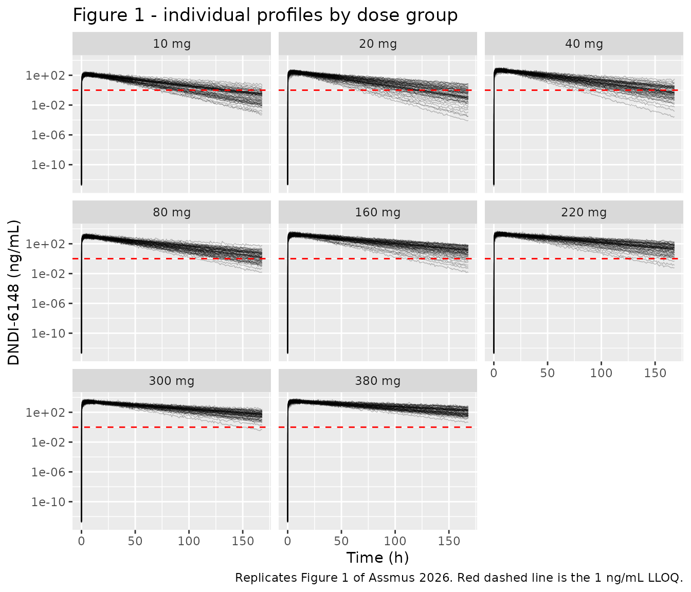
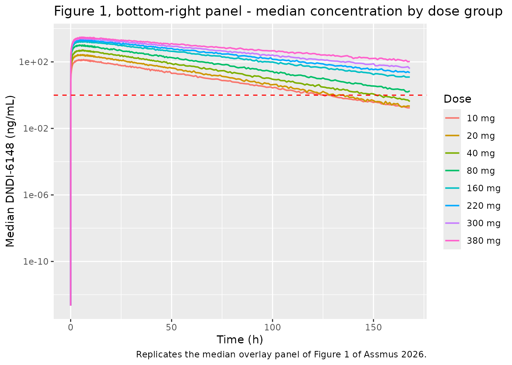
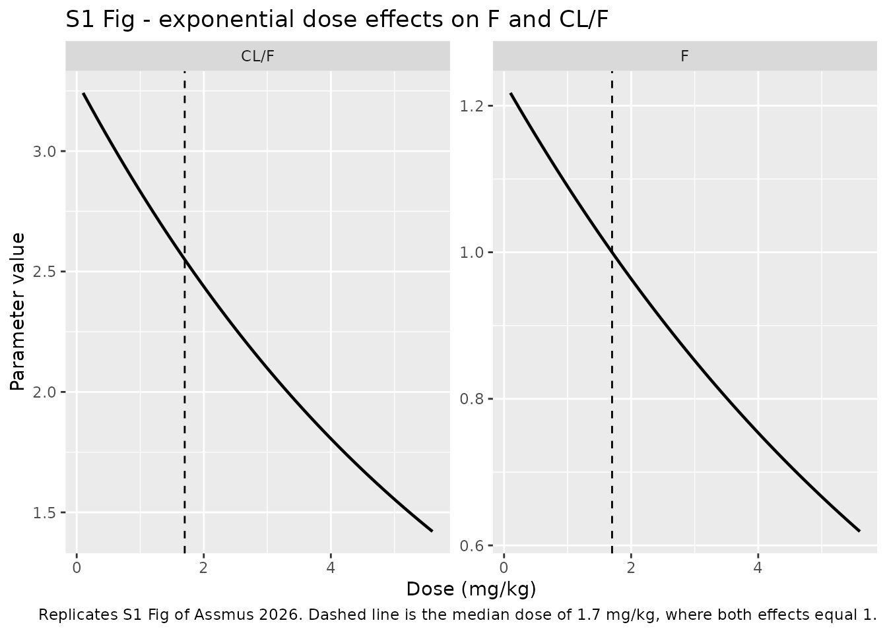
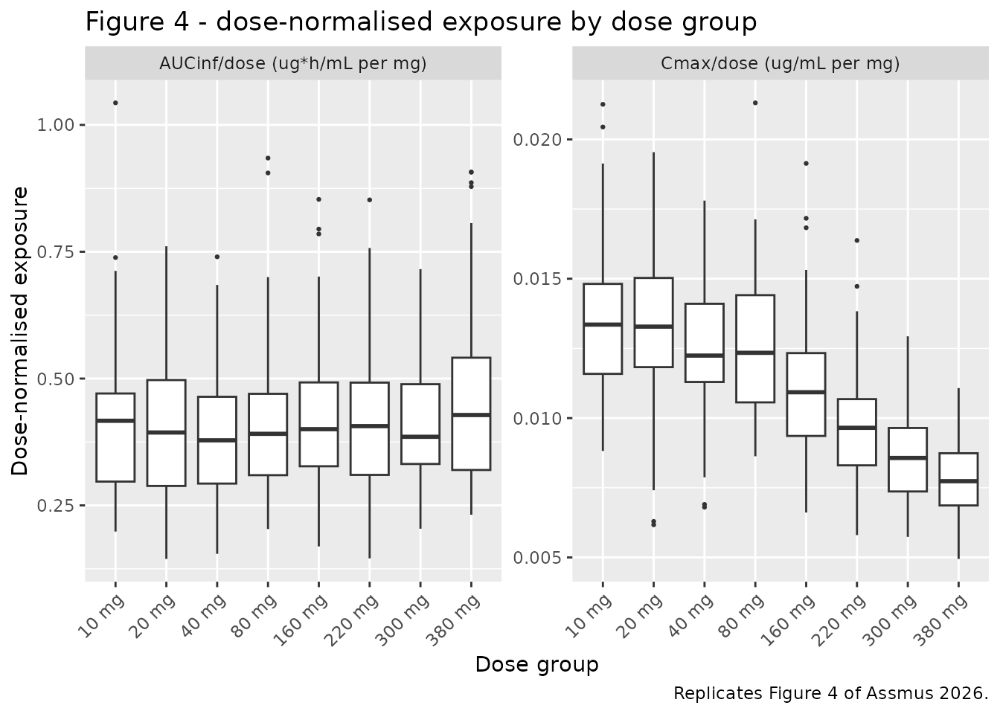

# DNDI-6148 (Assmus 2026)

## Model and source

- Citation: Assmus F, Adehin A, Hoglund RM, Mowbray CE, Gillon JY,
  Blesson S, Braillard S, Chatelain E, Scandale I, Tarning J. (2026).
  Population pharmacokinetics of DNDI-6148 in healthy adults. PLoS Negl
  Trop Dis 20(4):e0014220. <doi:10.1371/journal.pntd.0014220>. Final
  NONMEM control stream: S1 Code of that paper.
- Description: One-compartment population PK model with first-order oral
  absorption for the benzoxaborole antileishmanial / antichagasic
  DNDI-6148 in healthy adult men, fitted to the first-in-human
  single-ascending-dose study (10-380 mg, eight cohorts, 48 subjects).
  The drug’s non-linear pharmacokinetics are carried by two exponential
  effects of the weight-normalised dose, centred on the study median of
  1.7 mg/kg: one on relative oral bioavailability and one on apparent
  clearance. The two act in opposite directions on exposure, which is
  why Cmax rises less than dose-proportionally while AUCinf stays
  approximately dose-linear. Allometric body-weight scaling (0.75 on
  clearance, 1 on volume, both fixed) sits underneath. Inter-individual
  variability on apparent volume was estimated near zero and fixed to
  zero by the authors, so no eta is carried on it here. See
  modellib(‘Henninger_2026_dndi6148_mouse’) and
  modellib(‘Henninger_2026_dndi6148_human’) for the independent murine
  target-site PK/PD model of the same molecule and its allometric human
  projection; this model is the first fit to actual human data.
- Article: <https://doi.org/10.1371/journal.pntd.0014220>
- Supplement (S1 Code, the final NONMEM control stream):
  <https://doi.org/10.1371/journal.pntd.0014220>

DNDI-6148 is a benzoxaborole under development by the Drugs for
Neglected Diseases initiative for visceral / cutaneous leishmaniasis and
Chagas disease. This model is the first population PK analysis fitted to
human data, using the first-in-human single-ascending-dose study. The
package also carries an independent murine target-site PK/PD model of
the same molecule (`modellib("Henninger_2026_dndi6148_mouse")`) and that
paper’s own allometric human projection
(`modellib("Henninger_2026_dndi6148_human")`); the three are separate
fits and their parameters are not interconvertible.

## Population

The analysis pooled the 48 participants who received active drug in a
randomised, double-blind, placebo-controlled, single-centre Phase 1
single ascending dose study (EudraCT 2018-004023-37; ISRCTN54981564) run
at Eurofins-Optimed, Gieres, France between 2018 and 2022. Sixty-four
healthy White men aged 18-50 were enrolled across eight cohorts of eight
(six active, two placebo); all completed. Single oral doses of 10, 20,
40, 80, 160, 220, 300 and 380 mg (free acid equivalent) were given under
fasting conditions as DNDI-6148 arginine monohydrate powder for
suspension reconstituted in ORA-Sweet.

Baseline characteristics are in Table 1 of the paper: median body weight
72.3 kg (range 56.9-96.5), median age 35 years (18-50), median
weight-normalised dose 1.70 mg/kg (0.12-5.56), median creatinine
clearance 113 mL/min (81.5-161). All participants were male and of White
ethnicity, so sex and race could not be examined as covariates. The 48
subjects contributed 684 plasma samples, every post-dose sample above
the 1 ng/mL LLOQ.

The same information is available programmatically via the model’s
`population` metadata
(`readModelDb("Assmus_2026_dndi6148")()$population`).

``` r

pop <- rxode2::rxode(readModelDb("Assmus_2026_dndi6148"))$population
#> ℹ parameter labels from comments will be replaced by 'label()'
str(pop)
#> List of 14
#>  $ species       : chr "human"
#>  $ n_subjects    : num 48
#>  $ n_studies     : num 1
#>  $ age_range     : chr "18-50 years"
#>  $ age_median    : chr "35 years"
#>  $ weight_range  : chr "56.9-96.5 kg"
#>  $ weight_median : chr "72.3 kg"
#>  $ sex_female_pct: num 0
#>  $ race_ethnicity: Named num 100
#>   ..- attr(*, "names")= chr "White"
#>  $ disease_state : chr "healthy volunteers"
#>  $ dose_range    : chr "10-380 mg single oral dose (free acid equivalent), eight ascending cohorts of 6 active subjects each: 10, 20, 4"| __truncated__
#>  $ regions       : chr "France (single centre, Gieres)"
#>  $ formulation   : chr "DNDI-6148 arginine monohydrate powder for suspension, reconstituted in ORA-Sweet vehicle, administered under fa"| __truncated__
#>  $ notes         : chr "Phase 1 first-in-human single ascending dose study (EudraCT 2018-004023-37; ISRCTN54981564), 2018-2022. 64 heal"| __truncated__
```

## Source trace

The per-parameter origin is recorded as an in-file comment next to each
`ini()` entry in `inst/modeldb/specificDrugs/Assmus_2026_dndi6148.R`.
The table below collects them in one place for review. “S1 Code” is the
final NONMEM control stream published as Supporting Information; its
`$THETA` block carries the same numbers as Table 2, so it reproduces the
**final** estimates rather than initial values.

| Equation / parameter | Value | Source location |
|----|----|----|
| `lka` | `log(0.576)` | Table 2, row ‘Absorption rate constant, K A (h-1)’ = 0.576 (7.7% RSE); S1 Code `$THETA` 3 |
| `lcl` | `log(2.55)` | Table 2, row ‘Apparent clearance, CL/F (L/h)’ = 2.55 (5.9% RSE); S1 Code `$THETA` 1 |
| `lvc` | `log(69.9)` | Table 2, row ‘Apparent volume of distribution, V/F (L)’ = 69.9 (2.8% RSE); S1 Code `$THETA` 2 |
| `lfdepot` | `fixed(log(1))` | Table 2, row ‘Relative oral bioavailability, F’ = ‘1 fixed’; S1 Code `$THETA` 4 `(1) FIX` |
| `e_wt_cl` | `fixed(0.75)` | Methods, ‘(iii) Covariate model’; S1 Code `$PK` `((WT/70)**0.75)` |
| `e_wt_vc` | `fixed(1)` | Methods, ‘(iii) Covariate model’; S1 Code `$PK` `((WT/70)**1.00)` |
| `e_dose_fdepot` | `-0.123` | Table 2, row ‘theta Dose_F’ = -0.123 (13.5% RSE); S1 Code `$THETA` 5 |
| `e_dose_cl` | `-0.150` | Table 2, row ‘theta Dose_CL’ = -0.150 (12.8% RSE); S1 Code `$THETA` 6 |
| `etalcl` | `0.0905` | S1 Code `$OMEGA` 1; Table 2 reports the same as 30.8% CV (12.8% RSE) |
| `etalka` | `0.274` | S1 Code `$OMEGA` 3; Table 2 reports the same as 56.1% CV (10.9% RSE) |
| `etalfdepot` | `0.0284` | S1 Code `$OMEGA` 4; Table 2 reports the same as 17.0% CV (13.6% RSE) |
| *(no `etalvc`)* | omitted | S1 Code `$OMEGA` 2 is `0 FIX`; Results: IIV on V/F ‘was estimated to be close to zero and was therefore fixed to zero’ |
| `expSd` | `0.19` | Table 2, row ‘Variance of residual error, sigma’ = 0.0361 (13.4% RSE); S1 Code `$SIGMA`. `sqrt(0.0361) = 0.19` |
| Dose effect on F: `F_i = F * exp(e_dose_fdepot * (Dose_i - 1.7))` | n/a | Table 2 footnote c; Results, ‘Exponential functions centered on the median dose (Dose_median = 1.7 mg/kg)’; S1 Code `$PK` `COV` |
| Dose effect on CL: `CL_i/F_i = CL/F * exp(e_dose_cl * (Dose_i - 1.7))` | n/a | Table 2 footnote c; S1 Code `$PK` `COV2` |
| ODE structure (depot -\> central, first-order in and out) | n/a | Results, ‘best described by a one-compartment disposition model with first-order absorption’; S1 Code `$SUBROUTINE ADVAN5 TRANS1`, `$MODEL` COMP=(1)/COMP=(2), `K12 = KA`, `K20 = CL/V2` |
| `Cc <- central / vc` | n/a | S1 Code `$ERROR`, `CP = A(2)/S2` with `S2 = V2` |
| `Cc ~ lnorm(expSd)` | n/a | Methods ‘(ii)’, ‘additive error on log-transformed concentrations, equivalent to an exponential error on the arithmetic scale’; S1 Code `$ERROR`, `IPRED = LOG(CP)`, `Y = IPRED + EPS(1)` |
| `f(depot) <- fdepot` | n/a | S1 Code `$PK`, `F1 = TVF1 * EXP(ETA(4))`; F1 scales the dose into the absorption compartment |

### IIV reported as %CV, stored as variance

Table 2 footnote a defines `%CV = 100 * sqrt(exp(omega^2) - 1)`. The
variances taken from the S1 Code `$OMEGA` block must reproduce the
printed CVs exactly; this is the check that the omega scale was read
correctly.

``` r

omega_var <- c(`CL/F` = 0.0905, `K A` = 0.274, F = 0.0284)
iiv <- tibble::tibble(
  Parameter  = names(omega_var),
  `$OMEGA`   = unname(omega_var),
  `%CV`      = 100 * sqrt(exp(unname(omega_var)) - 1),
  `Table 2`  = c(30.8, 56.1, 17.0)
)
knitr::kable(iiv, digits = 4, caption = "S1 Code $OMEGA variances vs the %CV printed in Table 2.")
```

| Parameter | \$OMEGA |     %CV | Table 2 |
|:----------|--------:|--------:|--------:|
| CL/F      |  0.0905 | 30.7769 |    30.8 |
| K A       |  0.2740 | 56.1440 |    56.1 |
| F         |  0.0284 | 16.9727 |    17.0 |

S1 Code \$OMEGA variances vs the %CV printed in Table 2. {.table}

``` r


# Deterministic, closed-form: a mis-read omega scale (SD stored as variance, or
# a CV pasted in as a variance) moves these by tens of percent.
stopifnot(max(abs(iiv$`%CV` - iiv$`Table 2`)) < 0.1)
```

## Virtual cohort

Original observed data are not publicly available (the paper directs
requests to Vivli). The simulations below use a virtual population whose
body-weight distribution approximates Table 1: a log-normal centred on
the pooled median 72.3 kg, truncated to the observed 56.9-96.5 kg range.
Each subject’s `DOSE_DNDI6148_MGKG` is that subject’s own
weight-normalised dose, exactly as the analysis dataset would carry it.

``` r

# `set.seed()` seeds R's RNG. It does NOT seed rxode2's simulation RNG, and
# rxode2's streams are partitioned PER SOLVER THREAD -- so the cohort below is
# reproducible on this machine and different on a machine with a different
# thread count. Every assertion downstream is written so it holds for ANY
# cohort the model can produce.
set.seed(20260420)

dose_levels <- c(10, 20, 40, 80, 160, 220, 300, 380)
dose_labels <- paste(dose_levels, "mg")
n_per_arm   <- 60L   # cap is 200/arm; 60 is ample for an 8-arm VPC

# Table 1: pooled median weight 72.3 kg, range 56.9-96.5 kg. A log-normal with
# a ~13% CV spans that range at roughly the +/- 2 SD points; truncation makes
# the match exact at the edges.
sample_wt <- function(n) {
  wt <- numeric(0)
  while (length(wt) < n) {
    draw <- 72.3 * exp(stats::rnorm(n * 2, 0, 0.13))
    wt <- c(wt, draw[draw >= 56.9 & draw <= 96.5])
  }
  wt[seq_len(n)]
}

# Observation grid. Dense through absorption and the first day (the protocol
# sampled 0.5-12 h densely) and out to 240 h, which is at least five terminal
# half-lives even for the 380 mg cohort (median t1/2 33.7 h). A coarse grid
# biases trapezoidal AUC downward, so the absorption peak is resolved finely.
obs_times <- sort(unique(c(
  seq(0, 12, by = 0.1),
  seq(12.5, 48, by = 0.5),
  seq(49, 240, by = 1)
)))

make_cohort <- function(dose_mg, label, n, id_offset = 0L) {
  subj <- tibble::tibble(
    id        = id_offset + seq_len(n),
    WT        = sample_wt(n),
    cohort    = label,
    dose_mg   = dose_mg
  ) |>
    dplyr::mutate(DOSE_DNDI6148_MGKG = dose_mg / WT)

  dosing <- subj |>
    dplyr::mutate(time = 0, amt = dose_mg, evid = 1L, cmt = "depot")

  # Observation rows point at the ODE state `central`, never at the algebraic
  # observable `Cc` -- rxode2 returns Cc as a column at these rows anyway, and
  # naming the observable as a compartment would renumber the ODE slots.
  obs <- subj |>
    tidyr::crossing(time = obs_times) |>
    dplyr::mutate(amt = NA_real_, evid = 0L, cmt = "central")

  dplyr::bind_rows(dosing, obs) |>
    dplyr::arrange(id, time, dplyr::desc(evid))
}

events <- dplyr::bind_rows(lapply(seq_along(dose_levels), function(i) {
  make_cohort(dose_levels[i], dose_labels[i], n_per_arm,
              id_offset = (i - 1L) * n_per_arm)
})) |>
  dplyr::mutate(cohort = factor(cohort, levels = dose_labels))

# Duplicate IDs across cohorts silently merge into one subject receiving the
# summed dose; this guard makes that impossible to ship. Assert on the events
# frame itself -- `anyDuplicated(unique(x))` is 0 by construction and would
# pass vacuously.
stopifnot(anyDuplicated(events[, c("id", "time", "evid")]) == 0L)
stopifnot(nlevels(events$cohort) == 8L,
          dplyr::n_distinct(events$id) == 8L * n_per_arm)

events |>
  dplyr::filter(evid == 1) |>
  dplyr::group_by(cohort) |>
  dplyr::summarise(
    n = dplyr::n(),
    `median WT (kg)`    = median(WT),
    `median mg/kg`      = median(DOSE_DNDI6148_MGKG),
    .groups = "drop"
  ) |>
  knitr::kable(digits = 2, caption = "Simulated cohort. Compare the mg/kg column against Table 1.")
```

| cohort |   n | median WT (kg) | median mg/kg |
|:-------|----:|---------------:|-------------:|
| 10 mg  |  60 |          71.19 |         0.14 |
| 20 mg  |  60 |          72.81 |         0.27 |
| 40 mg  |  60 |          75.23 |         0.53 |
| 80 mg  |  60 |          73.57 |         1.09 |
| 160 mg |  60 |          74.78 |         2.14 |
| 220 mg |  60 |          73.43 |         3.00 |
| 300 mg |  60 |          71.61 |         4.19 |
| 380 mg |  60 |          71.77 |         5.29 |

Simulated cohort. Compare the mg/kg column against Table 1. {.table}

## Simulation

``` r

mod <- readModelDb("Assmus_2026_dndi6148")

sim <- rxode2::rxSolve(
  mod, events = events,
  keep = c("cohort", "WT", "DOSE_DNDI6148_MGKG", "dose_mg")
) |>
  as.data.frame() |>
  dplyr::mutate(cohort = factor(as.character(cohort), levels = dose_labels))
#> ℹ parameter labels from comments will be replaced by 'label()'

# Cc is the individual prediction (no residual error); `sim` carries the
# log-normal residual on top. The paper's Table 3 secondary parameters are
# "derived from the population PK model", i.e. from individual predictions, so
# the NCA below runs on Cc. Cmax taken from `sim` would be upward-biased.
stopifnot(all(c("Cc", "sim", "cl", "vc", "ka", "fdepot") %in% names(sim)))
stopifnot(!anyNA(sim$Cc), all(sim$Cc >= 0))
```

A typical-value solve (random effects zeroed) is used for the
deterministic gates below.

``` r

mod_typical <- rxode2::zeroRe(mod)
#> ℹ parameter labels from comments will be replaced by 'label()'

sim_typical <- rxode2::rxSolve(
  mod_typical, events = events,
  keep = c("cohort", "WT", "DOSE_DNDI6148_MGKG", "dose_mg")
) |>
  as.data.frame() |>
  dplyr::mutate(cohort = factor(as.character(cohort), levels = dose_labels))
#> ℹ omega/sigma items treated as zero: 'etalcl', 'etalka', 'etalfdepot'
#> Warning: multi-subject simulation without without 'omega'
```

## Structural gates

These three checks are deterministic – they compare a closed-form
consequence of the published equations against the typical-value solve,
so they do not depend on which cohort was drawn and are asserted
tightly.

### Mass balance: `CL_i * AUCinf = Dose * F_i`

For a one-compartment model with first-order absorption this identity is
exact whatever `ka` is. It is the check that `f(depot)` actually scales
the dose and that `DOSE_DNDI6148_MGKG` actually reaches `model()` – both
dose effects enter this equation, `F_i` in the numerator and `CL_i` on
the left.

``` r

trap_auc <- function(time, conc) {
  sum(diff(time) * (utils::head(conc, -1) + utils::tail(conc, -1)) / 2)
}

mass_balance <- sim_typical |>
  dplyr::group_by(cohort, id) |>
  dplyr::summarise(
    dose_mg = dplyr::first(dose_mg),
    cl      = dplyr::first(cl),
    fdepot  = dplyr::first(fdepot),
    kel     = dplyr::first(kel),
    # observed trapezoid + analytic extrapolation of the terminal tail
    auc     = trap_auc(time, Cc) + dplyr::last(Cc) / dplyr::first(kel),
    .groups = "drop"
  ) |>
  dplyr::mutate(
    target  = dose_mg * fdepot / cl,
    pct     = 100 * (auc - target) / target
  )

mass_balance |>
  dplyr::group_by(cohort) |>
  dplyr::summarise(
    `AUCinf (ug*h/mL)`      = median(auc),
    `Dose * F / CL`         = median(target),
    `max |% difference|`    = max(abs(pct)),
    .groups = "drop"
  ) |>
  knitr::kable(digits = c(0, 3, 3, 4),
               caption = "Mass balance on the typical individual, by dose cohort.")
```

| cohort | AUCinf (ug\*h/mL) | Dose \* F / CL | max \|% difference\| |
|:-------|------------------:|---------------:|---------------------:|
| 10 mg  |             3.713 |          3.713 |               0.0020 |
| 20 mg  |             7.328 |          7.328 |               0.0020 |
| 40 mg  |            14.400 |         14.400 |               0.0019 |
| 80 mg  |            29.729 |         29.729 |               0.0017 |
| 160 mg |            60.428 |         60.427 |               0.0015 |
| 220 mg |            86.206 |         86.205 |               0.0013 |
| 300 mg |           123.699 |        123.698 |               0.0011 |
| 380 mg |           161.171 |        161.169 |               0.0009 |

Mass balance on the typical individual, by dose cohort. {.table}

``` r


# Deterministic identity: only numerical quadrature error separates the two
# sides. A dropped f(depot), a covariate column that never reached model(), or
# an rxode2 auto-linCmt conversion that discarded the ODEs all break this by
# tens of percent, not hundredths.
stopifnot(max(abs(mass_balance$pct)) < 0.5)
```

### `V/F` reproduces Table 3 exactly

Because the paper fixed IIV on apparent volume to zero and fixed the
weight exponent at exactly 1, Table 3’s `V/F` row is a deterministic
function of each cohort’s median weight: `69.9 * (WT / 70)`. Reproducing
it pins `lvc`, the 70 kg reference weight, the exponent, and the absence
of an eta on volume all at once.

``` r

# Table 1 median weights and Table 3 median V/F, in cohort order.
table1_wt <- c(69.4, 65.3, 70.5, 78.0, 70.7, 69.6, 84.4, 84.0)
table3_vf <- c(69.3, 65.3, 70.5, 77.9, 70.6, 69.6, 84.4, 84.0)

vf_ev <- tibble::tibble(
  id = seq_along(table1_wt), WT = table1_wt,
  DOSE_DNDI6148_MGKG = 1.7, time = 0, amt = 100, evid = 1L, cmt = "depot"
) |>
  dplyr::bind_rows(
    tibble::tibble(
      id = seq_along(table1_wt), WT = table1_wt,
      DOSE_DNDI6148_MGKG = 1.7, time = 1, amt = NA_real_, evid = 0L,
      cmt = "central"
    )
  ) |>
  dplyr::arrange(id, time, dplyr::desc(evid))

vf_model <- rxode2::rxSolve(mod_typical, events = vf_ev) |>
  as.data.frame() |>
  dplyr::group_by(id) |>
  dplyr::summarise(vc = dplyr::first(vc), .groups = "drop")
#> ℹ omega/sigma items treated as zero: 'etalcl', 'etalka', 'etalfdepot'
#> Warning: multi-subject simulation without without 'omega'

vf_cmp <- tibble::tibble(
  cohort     = dose_labels,
  `WT (kg)`  = table1_wt,
  `Model V/F (L)`   = vf_model$vc,
  `Table 3 V/F (L)` = table3_vf
) |>
  dplyr::mutate(`% diff` = 100 * (`Model V/F (L)` - `Table 3 V/F (L)`) / `Table 3 V/F (L)`)

knitr::kable(vf_cmp, digits = c(0, 1, 2, 1, 3),
             caption = "Apparent volume: model typical value vs Table 3, at each cohort's median weight.")
```

| cohort | WT (kg) | Model V/F (L) | Table 3 V/F (L) | % diff |
|:-------|--------:|--------------:|----------------:|-------:|
| 10 mg  |    69.4 |         69.30 |            69.3 |  0.001 |
| 20 mg  |    65.3 |         65.21 |            65.3 | -0.143 |
| 40 mg  |    70.5 |         70.40 |            70.5 | -0.143 |
| 80 mg  |    78.0 |         77.89 |            77.9 | -0.015 |
| 160 mg |    70.7 |         70.60 |            70.6 | -0.001 |
| 220 mg |    69.6 |         69.50 |            69.6 | -0.143 |
| 300 mg |    84.4 |         84.28 |            84.4 | -0.143 |
| 380 mg |    84.0 |         83.88 |            84.0 | -0.143 |

Apparent volume: model typical value vs Table 3, at each cohort’s median
weight. {.table}

``` r


# Table 3 is printed to three significant figures, so rounding alone allows
# ~0.1%. Anything larger means the reference weight, the exponent, or lvc
# itself is wrong.
stopifnot(max(abs(vf_cmp$`% diff`)) < 0.5)
```

### Dose effects reproduce the Results prose

The Results state F falls from 121% at 0.12 mg/kg to 100% at the median
and 62% at 5.56 mg/kg, and CL/F from 3.2 L/h to 2.55 to 1.4 L/h over the
same range.

``` r

probe <- c(0.12, 1.7, 5.56)
dose_cmp <- tibble::tibble(
  `Dose (mg/kg)` = probe,
  `Model F`      = exp(-0.123 * (probe - 1.7)),
  `Paper F`      = c(1.21, 1.00, 0.62),
  `Model CL/F (L/h)` = 2.55 * exp(-0.150 * (probe - 1.7)),
  `Paper CL/F (L/h)` = c(3.2, 2.55, 1.4)
)
knitr::kable(dose_cmp, digits = 3,
             caption = "Centred exponential dose effects vs the values quoted in the Results.")
```

| Dose (mg/kg) | Model F | Paper F | Model CL/F (L/h) | Paper CL/F (L/h) |
|-------------:|--------:|--------:|-----------------:|-----------------:|
|         0.12 |   1.215 |    1.21 |            3.232 |             3.20 |
|         1.70 |   1.000 |    1.00 |            2.550 |             2.55 |
|         5.56 |   0.622 |    0.62 |            1.429 |             1.40 |

Centred exponential dose effects vs the values quoted in the Results.
{.table}

``` r


stopifnot(max(abs(dose_cmp$`Model F` - dose_cmp$`Paper F`)) < 0.01)
stopifnot(max(abs(dose_cmp$`Model CL/F (L/h)` - dose_cmp$`Paper CL/F (L/h)`)) < 0.05)
```

## Replicate published figures

``` r

# Replicates Figure 1 of Assmus 2026: individual plasma concentration-time
# profiles by dose group, with the 1 ng/mL LLOQ marked. Concentrations are shown
# in ng/mL to match the published axis.
sim |>
  dplyr::filter(time <= 168) |>
  dplyr::mutate(conc_ng = sim * 1000) |>
  dplyr::filter(conc_ng > 0) |>
  ggplot(aes(time, conc_ng, group = id)) +
  geom_line(alpha = 0.25, linewidth = 0.25) +
  geom_hline(yintercept = 1, colour = "red", linetype = "dashed") +
  facet_wrap(~cohort, ncol = 3) +
  scale_y_log10() +
  labs(x = "Time (h)", y = "DNDI-6148 (ng/mL)",
       title = "Figure 1 - individual profiles by dose group",
       caption = "Replicates Figure 1 of Assmus 2026. Red dashed line is the 1 ng/mL LLOQ.")
```



``` r

# Bottom-right panel of Figure 1: median concentration by dose group.
sim |>
  dplyr::filter(time <= 168) |>
  dplyr::group_by(cohort, time) |>
  dplyr::summarise(median_ng = median(sim) * 1000, .groups = "drop") |>
  dplyr::filter(median_ng > 0) |>
  ggplot(aes(time, median_ng, colour = cohort)) +
  geom_line(linewidth = 0.7) +
  geom_hline(yintercept = 1, colour = "red", linetype = "dashed") +
  scale_y_log10() +
  labs(x = "Time (h)", y = "Median DNDI-6148 (ng/mL)", colour = "Dose",
       title = "Figure 1, bottom-right panel - median concentration by dose group",
       caption = "Replicates the median overlay panel of Figure 1 of Assmus 2026.")
```



``` r

# Replicates S1 Fig: the exponential dose effects used in the final model, with
# the median dose of 1.7 mg/kg marked.
tibble::tibble(mgkg = seq(0.1, 5.6, by = 0.02)) |>
  dplyr::mutate(
    F          = exp(-0.123 * (mgkg - 1.7)),
    `CL/F`     = 2.55 * exp(-0.150 * (mgkg - 1.7))
  ) |>
  tidyr::pivot_longer(c(F, `CL/F`), names_to = "parameter", values_to = "value") |>
  ggplot(aes(mgkg, value)) +
  geom_line(linewidth = 0.8) +
  geom_vline(xintercept = 1.7, linetype = "dashed") +
  facet_wrap(~parameter, scales = "free_y") +
  labs(x = "Dose (mg/kg)", y = "Parameter value",
       title = "S1 Fig - exponential dose effects on F and CL/F",
       caption = paste("Replicates S1 Fig of Assmus 2026. Dashed line is the",
                       "median dose of 1.7 mg/kg, where both effects equal 1."))
```



## PKNCA validation

Table 3 reports secondary PK parameters derived from the population PK
model, so the NCA runs on `Cc` (the individual prediction) rather than
on `sim`.

``` r

sim_nca <- sim |>
  dplyr::filter(!is.na(Cc)) |>
  dplyr::select(id, time, Cc, cohort)

# Guarantee a time = 0 row per (id, cohort); for extravascular dosing a
# pre-dose concentration of zero is the correct anchor for AUC0-*.
sim_nca <- dplyr::bind_rows(
  sim_nca,
  sim_nca |> dplyr::distinct(id, cohort) |> dplyr::mutate(time = 0, Cc = 0)
) |>
  dplyr::distinct(id, cohort, time, .keep_all = TRUE) |>
  dplyr::arrange(id, cohort, time)

stopifnot(nrow(sim_nca) > 0, !anyNA(sim_nca$Cc))

conc_obj <- PKNCA::PKNCAconc(as.data.frame(sim_nca), Cc ~ time | cohort + id)

dose_df <- events |>
  dplyr::filter(evid == 1) |>
  dplyr::select(id, time, amt, cohort) |>
  as.data.frame()

dose_obj <- PKNCA::PKNCAdose(dose_df, amt ~ time | cohort + id)

intervals <- data.frame(
  start      = 0,
  end        = Inf,
  cmax       = TRUE,
  tmax       = TRUE,
  aucinf.obs = TRUE,
  half.life  = TRUE
)

nca_res <- PKNCA::pk.nca(PKNCA::PKNCAdata(conc_obj, dose_obj, intervals = intervals))

nca_wide <- as.data.frame(nca_res) |>
  dplyr::filter(PPTESTCD %in% c("cmax", "tmax", "aucinf.obs", "half.life")) |>
  dplyr::select(cohort, id, PPTESTCD, PPORRES) |>
  tidyr::pivot_wider(names_from = PPTESTCD, values_from = PPORRES)

stopifnot(nrow(nca_wide) == 8L * n_per_arm, !anyNA(nca_wide$aucinf.obs))
```

### Comparison against published NCA

Table 3 gives medians (5th-95th percentile) per dose group. `Cmax` is
printed in ng/mL there and is converted to the model’s ug/mL below so
the whole table sits in one unit system; `AUCinf` is already in
ug\*h/mL.

``` r

published <- tibble::tibble(
  cohort      = dose_labels,
  cmax        = c(138, 265, 590, 1007, 1792, 2184, 2459, 3088) / 1000,  # ng/mL -> ug/mL
  tmax        = c(4.23, 5.23, 5.54, 5.34, 6.13, 5.69, 3.50, 5.91),
  aucinf.obs  = c(3.05, 7.15, 21.4, 34.4, 61.7, 86.9, 113, 159),
  half.life   = c(12.6, 13.2, 20.7, 19.8, 19.9, 22.5, 26.6, 33.7)
)

cmp <- nlmixr2lib::ncaComparisonTable(
  simulated = nca_res,
  reference = published,
  by        = "cohort",
  units     = c(cmax = "ug/mL", aucinf.obs = "ug*h/mL",
                tmax = "h", half.life = "h"),
  tolerance_pct = 20
)

knitr::kable(
  cmp,
  caption = paste("Simulated vs published NCA (Table 3 of Assmus 2026).",
                  "* differs from the reference by more than 20%."),
  align = c("l", "l", "r", "r", "r")
)
```

| NCA parameter           | cohort | Reference | Simulated |   % diff |
|:------------------------|:-------|----------:|----------:|---------:|
| Cmax (ug/mL)            | 10 mg  |     0.138 |     0.134 |    -3.2% |
| Cmax (ug/mL)            | 20 mg  |     0.265 |     0.266 |    +0.2% |
| Cmax (ug/mL)            | 40 mg  |      0.59 |      0.49 |   -17.0% |
| Cmax (ug/mL)            | 80 mg  |      1.01 |     0.987 |    -1.9% |
| Cmax (ug/mL)            | 160 mg |      1.79 |      1.75 |    -2.4% |
| Cmax (ug/mL)            | 220 mg |      2.18 |      2.12 |    -2.8% |
| Cmax (ug/mL)            | 300 mg |      2.46 |      2.57 |    +4.5% |
| Cmax (ug/mL)            | 380 mg |      3.09 |      2.94 |    -4.8% |
| Tmax (h)                | 10 mg  |      4.23 |         5 |   +18.2% |
| Tmax (h)                | 20 mg  |      5.23 |       4.9 |    -6.3% |
| Tmax (h)                | 40 mg  |      5.54 |       5.4 |    -2.5% |
| Tmax (h)                | 80 mg  |      5.34 |       4.6 |   -13.9% |
| Tmax (h)                | 160 mg |      6.13 |       4.9 | -20.1%\* |
| Tmax (h)                | 220 mg |      5.69 |      4.95 |   -13.0% |
| Tmax (h)                | 300 mg |       3.5 |       6.2 | +77.1%\* |
| Tmax (h)                | 380 mg |      5.91 |       5.7 |    -3.6% |
| AUC0-∞ (obs) (ug\*h/mL) | 10 mg  |      3.05 |      4.17 | +36.7%\* |
| AUC0-∞ (obs) (ug\*h/mL) | 20 mg  |      7.15 |      7.87 |   +10.1% |
| AUC0-∞ (obs) (ug\*h/mL) | 40 mg  |      21.4 |      15.1 | -29.3%\* |
| AUC0-∞ (obs) (ug\*h/mL) | 80 mg  |      34.4 |      31.3 |    -9.1% |
| AUC0-∞ (obs) (ug\*h/mL) | 160 mg |      61.7 |        64 |    +3.8% |
| AUC0-∞ (obs) (ug\*h/mL) | 220 mg |      86.9 |      89.4 |    +2.9% |
| AUC0-∞ (obs) (ug\*h/mL) | 300 mg |       113 |       116 |    +2.3% |
| AUC0-∞ (obs) (ug\*h/mL) | 380 mg |       159 |       163 |    +2.3% |
| t½ (h)                  | 10 mg  |      12.6 |        17 | +34.6%\* |
| t½ (h)                  | 20 mg  |      13.2 |      15.9 | +20.1%\* |
| t½ (h)                  | 40 mg  |      20.7 |      16.1 | -22.0%\* |
| t½ (h)                  | 80 mg  |      19.8 |      17.8 |    -9.9% |
| t½ (h)                  | 160 mg |      19.9 |      22.7 |   +14.0% |
| t½ (h)                  | 220 mg |      22.5 |      24.6 |    +9.5% |
| t½ (h)                  | 300 mg |      26.6 |      27.5 |    +3.5% |
| t½ (h)                  | 380 mg |      33.7 |      36.6 |    +8.6% |

Simulated vs published NCA (Table 3 of Assmus 2026). \* differs from the
reference by more than 20%. {.table}

``` r

# Per-cohort percentage differences, recomputed so they can be asserted on.
nca_med <- nca_wide |>
  dplyr::group_by(cohort) |>
  dplyr::summarise(dplyr::across(c(cmax, tmax, aucinf.obs, half.life), median),
                   .groups = "drop")

pct <- nca_med |>
  dplyr::inner_join(published, by = "cohort", suffix = c("_sim", "_ref")) |>
  dplyr::mutate(
    cmax       = 100 * (cmax_sim       - cmax_ref)       / cmax_ref,
    tmax       = 100 * (tmax_sim       - tmax_ref)       / tmax_ref,
    aucinf.obs = 100 * (aucinf.obs_sim - aucinf.obs_ref) / aucinf.obs_ref,
    half.life  = 100 * (half.life_sim  - half.life_ref)  / half.life_ref
  ) |>
  dplyr::select(cohort, cmax, tmax, aucinf.obs, half.life)

knitr::kable(pct, digits = 1,
             caption = "Percentage difference from Table 3, per dose cohort and parameter.")
```

| cohort |  cmax |  tmax | aucinf.obs | half.life |
|:-------|------:|------:|-----------:|----------:|
| 10 mg  |  -3.2 |  18.2 |       36.7 |      34.6 |
| 20 mg  |   0.2 |  -6.3 |       10.1 |      20.1 |
| 40 mg  | -17.0 |  -2.5 |      -29.3 |     -22.0 |
| 80 mg  |  -1.9 | -13.9 |       -9.1 |      -9.9 |
| 160 mg |  -2.4 | -20.1 |        3.8 |      14.0 |
| 220 mg |  -2.8 | -13.0 |        2.9 |       9.5 |
| 300 mg |   4.5 |  77.1 |        2.3 |       3.5 |
| 380 mg |  -4.8 |  -3.6 |        2.3 |       8.6 |

Percentage difference from Table 3, per dose cohort and parameter.
{.table}

``` r


# The published values are medians of six post-hoc individual estimates per
# cohort, so per-cohort scatter of this size is expected and is NOT a model
# defect -- the median of six draws with a 31% CV on clearance moves around a
# lot. Assert on the CENTRE across cohorts and on a robust quantile, never on
# the worst cohort: the extreme of a random cohort is not reproducible across
# rxode2 builds or thread counts.
#
# Cmax and AUCinf are the structural checks: a mis-transcribed clearance,
# volume, dose or unit moves the whole distribution by tens of percent.
stopifnot(abs(median(pct$cmax)) < 15)
stopifnot(abs(median(pct$aucinf.obs)) < 20)
stopifnot(quantile(abs(pct$cmax), 0.9) < 35)

# Tmax is driven by ka alone, which is shared across cohorts, so its centre is
# the meaningful statistic; the published per-cohort Tmax medians swing from
# 3.50 to 6.13 h on six subjects each.
stopifnot(abs(median(pct$tmax)) < 30)

# Half-life is log(2) * vc / cl in this model; it must track the published
# dose-dependent increase rather than any single cohort's value.
stopifnot(abs(median(pct$half.life)) < 25)
```

## Non-linearity claims

The paper’s central quantitative claims about non-linearity are checked
here against the simulated cohort, with bounds wide enough to survive a
different draw but narrow enough that a mis-encoded dose effect breaks
them.

``` r

fold <- nca_med |>
  dplyr::filter(cohort %in% c("10 mg", "380 mg")) |>
  dplyr::arrange(match(cohort, dose_labels))

cmax_fold <- fold$cmax[2] / fold$cmax[1]
auc_fold  <- fold$aucinf.obs[2] / fold$aucinf.obs[1]

tibble::tibble(
  Claim = c(
    "38-fold dose increase gives ~22-fold Cmax increase (Results)",
    "AUCinf increases approximately dose-linearly, i.e. ~38-fold (Results)",
    "Median t1/2 rises from ~13 h (10-20 mg) to ~34 h (380 mg) (Results)"
  ),
  Simulated = c(
    sprintf("%.1f-fold", cmax_fold),
    sprintf("%.1f-fold", auc_fold),
    sprintf("%.1f h -> %.1f h",
            nca_med$half.life[nca_med$cohort == "10 mg"],
            nca_med$half.life[nca_med$cohort == "380 mg"])
  )
) |>
  knitr::kable(caption = "Published non-linearity claims vs the simulated cohort.")
```

| Claim | Simulated |
|:---|:---|
| 38-fold dose increase gives ~22-fold Cmax increase (Results) | 22.0-fold |
| AUCinf increases approximately dose-linearly, i.e. ~38-fold (Results) | 39.0-fold |
| Median t1/2 rises from ~13 h (10-20 mg) to ~34 h (380 mg) (Results) | 17.0 h -\> 36.6 h |

Published non-linearity claims vs the simulated cohort. {.table}

``` r


# Dose ratio is 38. If BOTH dose effects were dropped the model would be linear
# and both folds would sit at 38; if only the F effect were dropped, Cmax would
# also be ~38. The Cmax bound therefore goes red on either mis-encoding while
# admitting cohort-to-cohort noise.
stopifnot(cmax_fold > 15, cmax_fold < 30)
stopifnot(auc_fold  > 30, auc_fold  < 55)

# Half-life must increase with dose, because the CL effect is negative while
# volume is dose-independent. This is a large, structural difference (roughly
# 2.5-fold), not a near-zero effect whose sign could flip on a redraw.
hl_lo <- nca_med$half.life[nca_med$cohort == "10 mg"]
hl_hi <- nca_med$half.life[nca_med$cohort == "380 mg"]
stopifnot(hl_hi / hl_lo > 1.8, hl_hi / hl_lo < 3.5)
```

``` r

# Replicates Figure 4 of Assmus 2026: dose-normalised Cmax and AUCinf by dose
# group. A flat series would mean dose proportionality; Cmax/dose declines while
# AUCinf/dose is approximately flat.
nca_wide |>
  dplyr::left_join(
    tibble::tibble(cohort = dose_labels, dose_mg = dose_levels), by = "cohort"
  ) |>
  dplyr::mutate(
    `Cmax/dose (ug/mL per mg)`      = cmax / dose_mg,
    `AUCinf/dose (ug*h/mL per mg)`  = aucinf.obs / dose_mg,
    cohort = factor(cohort, levels = dose_labels)
  ) |>
  tidyr::pivot_longer(
    c(`Cmax/dose (ug/mL per mg)`, `AUCinf/dose (ug*h/mL per mg)`),
    names_to = "parameter", values_to = "value"
  ) |>
  ggplot(aes(cohort, value)) +
  geom_boxplot(outlier.size = 0.5) +
  facet_wrap(~parameter, scales = "free_y") +
  labs(x = "Dose group", y = "Dose-normalised exposure",
       title = "Figure 4 - dose-normalised exposure by dose group",
       caption = "Replicates Figure 4 of Assmus 2026.") +
  theme(axis.text.x = element_text(angle = 45, hjust = 1))
```



## Assumptions and deviations

- **Body-weight distribution.** Table 1 reports only median and range
  per cohort, not a distribution. A log-normal centred on the pooled
  median 72.3 kg with a 13% CV, truncated to the observed 56.9-96.5 kg
  range, is used throughout. The paper’s per-cohort median weights
  differ (65.3 kg at 20 mg, 84.4 kg at 300 mg) but the pooled
  distribution is used for every arm, so the simulated mg/kg values
  differ slightly from Table 1’s per-cohort medians. The `V/F` gate
  above sidesteps this by probing the model at Table 1’s own median
  weights.
- **IIV on apparent volume is omitted, not written as `fixed(0)`.** The
  S1 Code `$OMEGA` 2 is `0 FIX` and Table 2 reports no IIV row for
  `V/F`. Encoding it as `etalvc ~ fixed(0)` would put a zero on the
  OMEGA diagonal, making the matrix singular and breaking the Cholesky
  sampler `rxSolve` uses. Dropping the eta is numerically identical and
  the reason is recorded in the model file.
- **Residual error.** The paper reports `sigma` as a **variance** on the
  log-transformed concentration scale (0.0361). This is encoded as
  `Cc ~ lnorm(expSd)` with `expSd = sqrt(0.0361) = 0.19`, the log-scale
  SD, which is the form nlmixr2 expects. The paper’s own wording –
  “additive error on log-transformed concentrations, equivalent to an
  exponential error on the arithmetic scale” – and the S1 Code `$ERROR`
  block (`IPRED = LOG(CP)`; `Y = IPRED + EPS(1)`) both confirm the
  scale.
- **A transcription slip in the published S1 Code.** The control stream
  reads `CL = TVCL_P * EXP(ETA(1))` and `F1 = TVF1 * EXP(ETA(4))`, but
  `TVCL_P` is never defined – the line immediately above assigns `TVCL`.
  The intended `TVCL` is used here. The stream would not run as printed;
  nothing about the model structure is ambiguous as a result, and Table
  2’s estimates are unaffected.
- **No LLOQ censoring.** The assay LLOQ was 1 ng/mL and the paper states
  every post-dose sample was above it, so no censoring is applied to the
  simulated concentrations. Figure 1 marks the LLOQ for reference only.
- **Emax dose effects not implemented.** The authors tested Emax-type
  saturation models for the dose effects on F and CL/F, which fit
  marginally better (`dOFV = -3.24`) but estimated `D50` with more than
  120% RSE. They retained the exponential form for parsimony, and that
  is what is packaged here. No Emax parameter values are reported, so
  the alternative could not be encoded even as a variant.
- **Covariates screened but not retained.** Age, AST, ALT, ALP, total
  bilirubin, GGT, creatinine clearance and hematocrit were all examined
  in the stepwise covariate model and none survived backward
  elimination. They are recorded in the model’s `covariatesDataExcluded`
  metadata for provenance and carry no coefficients. Sex and race could
  not be examined at all: every participant was a White man.
- **Extrapolation outside 0.12-5.56 mg/kg.** Both dose effects are
  exponential in the *difference* from 1.7 mg/kg, so they diverge
  without bound outside the studied range. The authors warn about this
  explicitly in the Discussion. The simulations here stay inside the
  studied doses.
- **Per-cohort NCA scatter.** Table 3’s values are medians of six
  post-hoc individual estimates per dose group. With a 31% CV on
  clearance and a 56% CV on absorption, the median of six draws is
  itself noisy, so per-cohort differences of 10-30% between the
  simulated cohort and Table 3 are expected. The gates above therefore
  assert on the centre across cohorts and on a robust quantile, never on
  the worst cohort.
