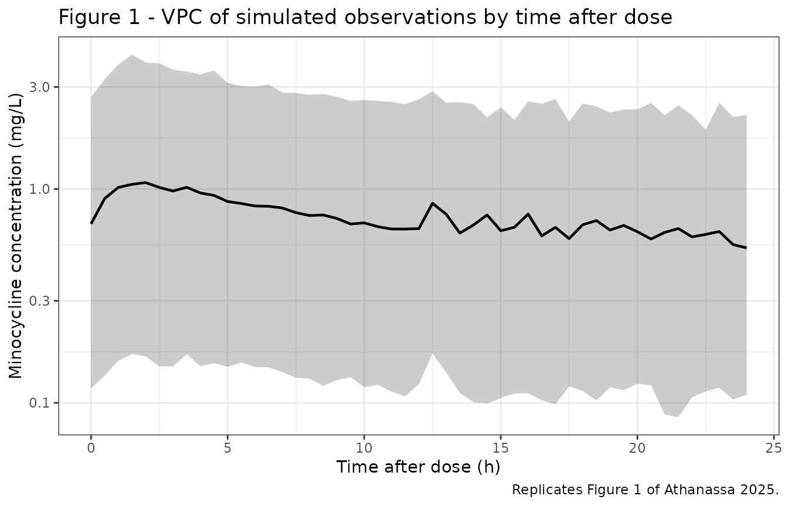
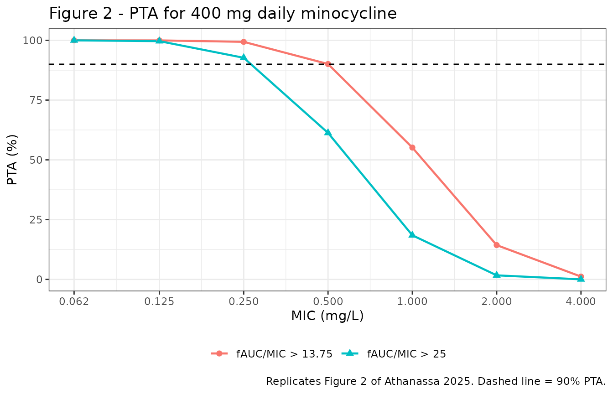

# Minocycline (Athanassa 2025)

## Model and source

- Citation: Athanassa Z, Papakyriakopoulou P, Marquez Megias S, Saitani
  EM, Manioudaki S, Dimoula K, Petsa I, Valsami G, Sakagianni A, Koumaki
  V, Dokoumetzidis A, Tsakris A (2025). Population pharmacokinetic model
  of oral minocycline in critically ill adult patients with
  ventilator-associated pneumonia. J Antimicrob Chemother
  80(6):1420-1426. <doi:10.1093/jac/dkaf090>
- Description: One-compartment population PK model with first-order
  absorption and linear elimination for orally administered minocycline
  in critically ill adults with ventilator-associated pneumonia caused
  by multidrug-resistant Acinetobacter baumannii (Athanassa 2025).
  Minocycline was given by mouth (dispersed in water, via nasogastric or
  orogastric tube in mechanically ventilated patients) as a 200 mg
  loading dose followed by 100 mg every 12 h. The model is parameterized
  in apparent oral terms: apparent clearance CL/F 6.55 L/h, apparent
  central volume V/F 183.3 L, and absorption rate constant ka 1.66 1/h,
  which together imply a terminal half-life of 19.4 h and an absorption
  half-life of 0.42 h (25 min), both as quoted in the paper’s
  Discussion. Between-subject variability is exponential on CL/F (omega
  0.59 on the log scale) and V/F (omega 1.16); variability on ka was
  tested but was not estimable from these data and is absent from the
  final model. Residual error is proportional (0.616). Nine covariates
  (age, sex, body weight, BMI, serum albumin, creatinine, creatinine
  clearance, haematocrit and SOFA score) were screened; none was
  retained, so the final model is covariate-free (see
  covariatesDataExcluded).
- Article: [J Antimicrob Chemother
  2025;80(6):1420-1426](https://doi.org/10.1093/jac/dkaf090)

Athanassa and colleagues ran a prospective, open-label study of *orally*
administered minocycline in critically ill ICU adults with
ventilator-associated pneumonia (VAP) caused by multidrug-resistant
*Acinetobacter baumannii*. Almost all published minocycline PK comes
from 1970s intravenous studies using bioassay methods, so this is one of
very few modern population models for the oral route, and the only one
in a critically ill population.

The final model is deliberately simple: one compartment, first-order
absorption, linear elimination, exponential between-subject variability
on CL/F and V/F, proportional residual error, and **no covariates**.

## Population

The model was built from 24 critically ill adults (17 male, 7 female)
treated in the ICU of Sismanogleio General Hospital, Athens, between
August 2021 and April 2023. Median age was 69.5 years (IQR 63-76.5) and
median weight 85.0 kg (IQR 70.0-106.5). All were mechanically ventilated
with microbiologically confirmed *A. baumannii* VAP, diagnosed after a
median ICU stay of 16 days; 84% had been admitted for COVID-19. The
cohort was severely ill (median SOFA score 9, IQR 8-10) and markedly
hypoalbuminaemic (median serum albumin 2.45 g/dL). Renal function was
impaired in many: measured creatinine clearance (24-h urine collection)
had a median of 57.7 mL/min (IQR 28.5-104), with 11 of 24 patients below
50 mL/min and none on renal replacement therapy. Baseline
characteristics are from Athanassa 2025 Table 1.

Every patient received minocycline dispersed in water as a 200 mg
loading dose followed by 100 mg every 12 h for at least 5 days;
mechanically ventilated patients received it through a nasogastric or
orogastric tube. Of 182 plasma concentrations collected, 10 (5.49%) were
below the limit of quantification and discarded, leaving 172 for model
development. Sampling was sparse and schedule-dependent: 20 patients
were sampled at 12, 13, 14, 18, 21.5, 48, 59.5, 61, 64, 68 and 71.5 h,
and 4 patients at 0.5, 1, 2, 4, 6 and 12 h. That sampling design matters
for the validation below, because the paper’s reported Tmax values are
quantised onto this grid.

The same information is available programmatically via the model’s
`population` metadata
(`readModelDb("Athanassa_2025_minocycline")()$population`).

``` r

pop <- rxode2::rxode(readModelDb("Athanassa_2025_minocycline"))$population
#> ℹ parameter labels from comments will be replaced by 'label()'
tibble::tibble(Field = names(pop), Value = vapply(pop, paste, character(1), collapse = "; ")) |>
  knitr::kable(caption = "Study population metadata carried in the model file.")
```

| Field | Value |
|:---|:---|
| species | human |
| n_subjects | 24 |
| n_studies | 1 |
| n_observations | 172 |
| age_median | 69.5 years (IQR 63-76.5) |
| weight_median | 85.0 kg (IQR 70.0-106.5) |
| bmi_median | 25 kg/m^2 (IQR 23.95-32.5) |
| sex_female_pct | 29.2 |
| disease_state | Critically ill mechanically-ventilated ICU adults with ventilator-associated pneumonia caused by multidrug-resistant Acinetobacter baumannii; median SOFA score 9 (IQR 8-10) at admission; 84% admitted for COVID-19 infection; VAP diagnosed after a median ICU stay of 16 days |
| renal_function | Measured creatinine clearance (24-h urine collection) median 57.7 mL/min (IQR 28.5-104); 11 of 24 patients had CLCR \< 50 mL/min, none on renal replacement therapy |
| dose_range | 200 mg oral loading dose, then 100 mg every 12 h for at least 5 days |
| co_medication | Colistin 67%, meropenem 29%, ampicillin-sulbactam 29% |
| regions | Greece (single centre: Sismanogleio General Hospital, Athens; August 2021 to April 2023) |
| notes | Baseline demographics from Athanassa 2025 Table 1. 182 plasma minocycline concentrations were collected; 10 (5.49%) below the limit of quantification were discarded, leaving 172 used for model development. Sampling was sparse: 20 patients were sampled at 12, 13, 14, 18, 21.5, 48, 59.5, 61, 64, 68 and 71.5 h and 4 patients at 0.5, 1, 2, 4, 6 and 12 h. Minocycline MICs were 4 mg/L or lower in 13 strains (susceptible) and 8 mg/L in 11 strains (intermediate). Serum albumin was low throughout (median 2.45 g/dL), which the authors cite as the reason the albumin-on-volume effect was poorly identified. |

Study population metadata carried in the model file. {.table}

## Source trace

The per-parameter origin is recorded as an in-file comment next to each
`ini()` entry in
`inst/modeldb/specificDrugs/Athanassa_2025_minocycline.R`. The table
below collects them in one place for review.

| Equation / parameter | Value | Source location |
|----|----|----|
| `lka` (ka) | 1.66 1/h | Table 2, “Ka (1/h)”, Final model Estimate (41.9% RSE); restated in the Abstract |
| `lcl` (CL/F) | 6.55 L/h | Table 2, “CL/F (L/h)”, Final model Estimate (17.2% RSE); restated in the Abstract |
| `lvc` (V/F) | 183.3 L | Table 2, “V/F (L)”, Final model Estimate (25.9% RSE); restated in the Abstract |
| `etalcl` | omega 0.59 (variance 0.3481) | Table 2, “IIV-CL/F”, Final model Estimate (23.8% RSE), %CV 64%, shrinkage 16.9% |
| `etalvc` | omega 1.16 (variance 1.3456) | Table 2, “IIV-V/F”, Final model Estimate (16.4% RSE), shrinkage -2.7% |
| `propSd` | 0.616 | Table 2, “Proportional error”, Final model Estimate (5.9% RSE) |
| One compartment, first-order absorption, linear elimination | n/a | Abstract; Results, “popPK model” |
| No lag time | n/a | Methods, “Population PK model development” (Tlag tested, not retained) |
| No IIV on ka | n/a | Results, “popPK model”: IIV “could not be estimated on ka” |
| No covariates | n/a | Results, “Covariate analysis” (see `covariatesDataExcluded` in the model file) |
| Apparent (oral) parameterisation, no explicit F | n/a | Results, “popPK model”: parameterised as CL/F and V/F |
| Protein binding 76% (fu = 0.24), used only for PTA | n/a | Methods, “PTA simulations”; Discussion |

Two derived quantities quoted in the paper’s Discussion act as
independent arithmetic checks on the structural parameters, and are
asserted in the next section:

- terminal half-life `log(2) * (V/F) / (CL/F)` = 19.4 h (“the model’s
  estimated average t 1/2 of 19.4 h”);
- absorption half-life `log(2) / ka` = 0.42 h, i.e. 25 min (“an
  absorption t 1/2 of 0.42 h (25 min)”).

## Structural checks

These are deterministic identities of the packaged model, evaluated on
the typical-value profile with between-subject variability zeroed. Each
is asserted, so this vignette fails to build if a future edit perturbs
the structure.

``` r

mod     <- readModelDb("Athanassa_2025_minocycline")
mod_typ <- rxode2::zeroRe(mod)
#> ℹ parameter labels from comments will be replaced by 'label()'

# Regimen actually studied: 200 mg oral loading dose, then 100 mg q12h.
dose_times <- c(0, seq(12, 60, by = 12))
ev_typ <-
  rxode2::et(amt = 200, time = 0, cmt = "depot") |>
  rxode2::et(amt = 100, time = 12, cmt = "depot", ii = 12, addl = 4) |>
  rxode2::et(seq(0, 156, by = 0.05), cmt = "central")

sim_typ <- rxode2::rxSolve(mod_typ, ev_typ, returnType = "data.frame")
#> ℹ omega/sigma items treated as zero: 'etalcl', 'etalvc'

# 1. Terminal half-life, recovered from the log-linear slope well after the
#    final dose (>= 24 h post-dose, so the absorption transient has decayed).
tail_fit  <- lm(log(Cc) ~ time, data = subset(sim_typ, time >= 84 & time <= 156))
thalf_sim <- log(2) / -coef(tail_fit)[["time"]]
thalf_an  <- log(2) * 183.3 / 6.55

# 2. Absorption half-life.
thalf_abs <- log(2) / 1.66

# 3. Steady-state exposure identity: AUC over a dosing interval at steady
#    state equals Dose / CL, independent of volume.
auc_ss_an <- 100 / 6.55

tibble::tibble(
  Check = c(
    "Terminal half-life (analytic, log(2)*V/CL)",
    "Terminal half-life (simulated terminal slope)",
    "Absorption half-life (log(2)/ka)",
    "AUC0-tau at steady state (Dose/CL, 100 mg q12h)"
  ),
  Model     = c(thalf_an, thalf_sim, thalf_abs, auc_ss_an),
  Published = c(19.4, 19.4, 0.42, NA_real_),
  Units     = c("h", "h", "h", "mg*h/L")
) |>
  knitr::kable(digits = 3,
               caption = "Structural identities versus the values quoted in the Athanassa 2025 Discussion.")
```

| Check                                           |  Model | Published | Units   |
|:------------------------------------------------|-------:|----------:|:--------|
| Terminal half-life (analytic, log(2)\*V/CL)     | 19.398 |     19.40 | h       |
| Terminal half-life (simulated terminal slope)   | 19.398 |     19.40 | h       |
| Absorption half-life (log(2)/ka)                |  0.418 |      0.42 | h       |
| AUC0-tau at steady state (Dose/CL, 100 mg q12h) | 15.267 |        NA | mg\*h/L |

Structural identities versus the values quoted in the Athanassa 2025
Discussion. {.table style="width:100%;"}

``` r


# Assertions -- these make the vignette fail loudly on a structural regression.
stopifnot(
  abs(thalf_an  - 19.4) < 0.05,
  abs(thalf_sim - 19.4) < 0.05,
  abs(thalf_abs - 0.42) < 0.005
)
```

Both published derived quantities are reproduced to the precision at
which the paper states them, which confirms that CL/F, V/F and ka were
transcribed on the correct scale.

## Virtual cohort

Original observed data are not publicly available. The cohort below is a
virtual population of 200 subjects per sampling arm, dosed on the
studied regimen. The model carries no covariates, so no covariate
distribution has to be assumed – between-subject variability enters
entirely through the two etas.

Two arms mirror the study’s two sampling schedules (Athanassa 2025
Methods), so that the observation process, not just the underlying
profile, is replicated:

- **sparse** – the 20-patient schedule (12, 13, 14, 18, 21.5, 48, 59.5,
  61, 64, 68, 71.5 h);
- **rich** – the 4-patient early schedule (0.5, 1, 2, 4, 6, 12 h).

A third **dense** arm on a fine grid supports the VPC and the NCA below.

``` r

set.seed(20250326)
n_per_arm <- 200

# Dose rows are written out one per administration rather than with `addl`,
# so that the dose frame handed to PKNCA below carries all six doses.
make_cohort <- function(n, times, arm, id_offset = 0L) {
  base <-
    rxode2::et(amt = c(200, rep(100, 5)), time = dose_times, cmt = "depot") |>
    rxode2::et(times, cmt = "central") |>
    as.data.frame()
  do.call(rbind, lapply(seq_len(n), function(i) {
    transform(base, id = id_offset + i, arm = arm)
  }))
}

events <- dplyr::bind_rows(
  make_cohort(n_per_arm, c(0, 0.5, 1, 2, 4, 6, 12), "rich", id_offset = 0L),
  make_cohort(n_per_arm, c(0, 12, 13, 14, 18, 21.5, 48, 59.5, 60, 61, 64, 68, 71.5),
              "sparse", id_offset = 1000L),
  make_cohort(n_per_arm, seq(0, 84, by = 0.25), "dense", id_offset = 2000L)
)

stopifnot(!anyDuplicated(events[, c("id", "time", "evid")]))
```

## Simulation

`Cc` is the individual prediction (IPRED); `sim` additionally carries
the proportional residual error and is the simulated *observation*. Both
are used below, for different purposes: structural and NCA comparisons
use `Cc`, while the VPC and the observation-process check use `sim`.

``` r

sim <- rxode2::rxSolve(mod, events = events, keep = "arm", returnType = "data.frame")
#> ℹ parameter labels from comments will be replaced by 'label()'

# The paper discarded concentrations below the limit of quantification
# (10 of 182, 5.49%). Its reported concentration range bottoms out at
# 0.06 mg/L (Table 1), which is used here as the LOQ. This also removes the
# negative draws that a 61.6% proportional error model inevitably produces.
LOQ <- 0.06
sim <- sim |>
  dplyr::mutate(
    obs = dplyr::if_else(sim >= LOQ, sim, NA_real_),
    tad = time - dose_times[findInterval(time, dose_times)]
  )

sprintf("Simulated BLQ fraction: %.1f%% (paper discarded 5.49%%)",
        100 * mean(is.na(sim$obs[sim$time > 0])))
#> [1] "Simulated BLQ fraction: 8.8% (paper discarded 5.49%)"
```

## Replicate published figures

### Figure 1 – visual predictive check

The paper presents the VPC “with respect to the time after dose”, with
the 5th, 50th and 95th percentiles of observations. The panel below
reproduces that presentation from the packaged model.

``` r

# Replicates Figure 1 of Athanassa 2025: VPC of concentration vs. time after dose.
sim |>
  dplyr::filter(arm == "dense", time > 0, !is.na(obs)) |>
  dplyr::mutate(tad_bin = round(tad * 2) / 2) |>
  dplyr::group_by(tad_bin) |>
  dplyr::summarise(
    Q05 = quantile(obs, 0.05),
    Q50 = quantile(obs, 0.50),
    Q95 = quantile(obs, 0.95),
    .groups = "drop"
  ) |>
  ggplot(aes(tad_bin, Q50)) +
  geom_ribbon(aes(ymin = Q05, ymax = Q95), alpha = 0.25) +
  geom_line(linewidth = 0.8) +
  scale_y_log10() +
  labs(
    x = "Time after dose (h)", y = "Minocycline concentration (mg/L)",
    title = "Figure 1 - VPC of simulated observations by time after dose",
    caption = "Replicates Figure 1 of Athanassa 2025."
  ) +
  theme_bw()
```



The wide band during the first few hours reproduces the paper’s own
observation that “greater variability is observed during the absorption
phase and initial distribution of the drug at earlier time points,
resulting in wider CI.”

### Figure 2 – probability of target attainment

The PTA analysis is a clean, independent check on CL/F and its
variability, because at steady state AUC = Dose/CL exactly – the volume
and ka drop out. Following the paper’s Methods, 10 000 AUC values are
generated for a 400 mg daily dose, converted to free AUC assuming 76%
protein binding (fu = 0.24), and divided by a range of MICs.

``` r

set.seed(20250326)
n_mc      <- 10000
daily_dose <- 400   # mg/day, the maximum daily dose in the MINOCIN SPC
fu         <- 0.24  # 76% protein binding

cl_mc  <- 6.55 * exp(rnorm(n_mc, 0, 0.59))     # lognormal CL/F, omega = 0.59
fauc_mc <- fu * daily_dose / cl_mc             # free AUC0-24 at steady state

mics    <- c(0.062, 0.125, 0.25, 0.5, 1, 2, 4)
targets <- c(13.75, 25)

pta <- tidyr::expand_grid(MIC = mics, target = targets) |>
  dplyr::rowwise() |>
  dplyr::mutate(PTA = 100 * mean(fauc_mc / MIC > target)) |>
  dplyr::ungroup() |>
  dplyr::mutate(target = factor(target, levels = targets,
                                labels = c("fAUC/MIC > 13.75", "fAUC/MIC > 25")))

ggplot(pta, aes(MIC, PTA, colour = target, shape = target)) +
  geom_line(linewidth = 0.8) + geom_point(size = 2) +
  geom_hline(yintercept = 90, linetype = "dashed") +
  scale_x_log10(breaks = mics) +
  labs(
    x = "MIC (mg/L)", y = "PTA (%)", colour = NULL, shape = NULL,
    title = "Figure 2 - PTA for 400 mg daily minocycline",
    caption = "Replicates Figure 2 of Athanassa 2025. Dashed line = 90% PTA."
  ) +
  theme_bw() + theme(legend.position = "bottom")
```



``` r

pta |>
  dplyr::mutate(PTA = sprintf("%.1f", PTA)) |>
  tidyr::pivot_wider(names_from = target, values_from = PTA) |>
  dplyr::mutate(MIC = format(MIC, trim = TRUE, drop0trailing = TRUE)) |>
  dplyr::rename("MIC (mg/L)" = MIC) |>
  knitr::kable(caption = "PTA (%) by MIC for a 400 mg daily dose.")
```

| MIC (mg/L) | fAUC/MIC \> 13.75 | fAUC/MIC \> 25 |
|:-----------|:------------------|:---------------|
| 0.062      | 100.0             | 100.0          |
| 0.125      | 100.0             | 99.7           |
| 0.25       | 99.4              | 92.7           |
| 0.5        | 90.1              | 61.3           |
| 1          | 55.1              | 18.4           |
| 2          | 14.3              | 1.7            |
| 4          | 1.2               | 0.0            |

PTA (%) by MIC for a 400 mg daily dose. {.table}

This reproduces both breakpoints the paper reports. For the stringent
fAUC/MIC \> 25 target, PTA is high at MIC 0.25 mg/L and then falls away
sharply – the paper states that PTA “drops rapidly for MIC \> 0.25
mg/L”. For the more permissive fAUC/MIC \> 13.75 target, high PTA is
“maintained up to MIC = 0.5 mg/L, beyond which PTA declines rapidly”.
The typical-value arithmetic behind the curves is
`fAUC = 0.24 * 400 / 6.55 =` 14.66 mg\*h/L, so the typical fAUC/MIC is
58.6 at MIC 0.25, 29.3 at MIC 0.5 and 14.7 at MIC 1.

## PKNCA validation

NCA is computed with PKNCA on the dense arm, over two dosing intervals:
the second dose (12-24 h, the first 100 mg maintenance dose) and the
sixth dose (60-72 h), both of which the paper reports on.

``` r

sim_nca <- sim |>
  dplyr::filter(arm == "dense", !is.na(Cc)) |>
  dplyr::mutate(
    treatment = "200 mg load + 100 mg q12h"
  ) |>
  dplyr::select(id, time, Cc, treatment)

# Guarantee a time = 0 record per subject; pre-dose Cc = 0 for an
# extravascular model. Existing time = 0 rows win.
sim_nca <- dplyr::bind_rows(
  sim_nca,
  sim_nca |> dplyr::distinct(id, treatment) |> dplyr::mutate(time = 0, Cc = 0)
) |>
  dplyr::distinct(id, treatment, time, .keep_all = TRUE) |>
  dplyr::arrange(id, treatment, time)

dose_df <- events |>
  dplyr::filter(arm == "dense", evid != 0) |>
  dplyr::mutate(treatment = "200 mg load + 100 mg q12h") |>
  dplyr::select(id, time, amt, treatment)

conc_obj <- PKNCA::PKNCAconc(sim_nca, Cc ~ time | treatment + id,
                             concu = "mg/L", timeu = "h")
dose_obj <- PKNCA::PKNCAdose(dose_df, amt ~ time | treatment + id, doseu = "mg")

intervals <- data.frame(
  start   = c(12, 60),
  end     = c(24, 72),
  cmax    = TRUE,
  tmax    = TRUE,
  cmin    = TRUE,
  cav     = TRUE,
  auclast = TRUE
)

nca_res <- PKNCA::pk.nca(PKNCA::PKNCAdata(conc_obj, dose_obj, intervals = intervals))

nca_tbl <- as.data.frame(nca_res$result) |>
  dplyr::mutate(dose_no = dplyr::if_else(start == 12, "Dose 2 (12-24 h)", "Dose 6 (60-72 h)")) |>
  dplyr::group_by(dose_no, PPTESTCD) |>
  dplyr::summarise(
    Median = median(PPORRES, na.rm = TRUE),
    Mean   = mean(PPORRES, na.rm = TRUE),
    P05    = quantile(PPORRES, 0.05, na.rm = TRUE),
    P95    = quantile(PPORRES, 0.95, na.rm = TRUE),
    .groups = "drop"
  ) |>
  dplyr::mutate(Parameter = nlmixr2lib::ncaParamLabel(as.character(PPTESTCD))) |>
  dplyr::select(dose_no, Parameter, Median, Mean, P05, P95)

nca_tbl |>
  dplyr::rename("Dosing interval" = dose_no) |>
  knitr::kable(digits = 3,
               caption = "Simulated NCA (n = 200, individual predictions) over two dosing intervals.")
```

| Dosing interval  | Parameter | Median |   Mean |   P05 |    P95 |
|:-----------------|:----------|-------:|-------:|------:|-------:|
| Dose 2 (12-24 h) | AUClast   |  9.355 | 11.104 | 2.332 | 26.461 |
| Dose 2 (12-24 h) | Cavg      |  0.780 |  0.925 | 0.194 |  2.205 |
| Dose 2 (12-24 h) | Cmax      |  0.991 |  1.223 | 0.199 |  2.808 |
| Dose 2 (12-24 h) | Cmin      |  0.478 |  0.579 | 0.088 |  1.426 |
| Dose 2 (12-24 h) | Tmax      |  2.000 |  2.018 | 1.250 |  3.000 |
| Dose 6 (60-72 h) | AUClast   | 12.073 | 13.870 | 4.454 | 28.931 |
| Dose 6 (60-72 h) | Cavg      |  1.006 |  1.156 | 0.371 |  2.411 |
| Dose 6 (60-72 h) | Cmax      |  1.297 |  1.456 | 0.418 |  3.025 |
| Dose 6 (60-72 h) | Cmin      |  0.719 |  0.850 | 0.113 |  1.845 |
| Dose 6 (60-72 h) | Tmax      |  1.750 |  1.849 | 1.250 |  2.500 |

Simulated NCA (n = 200, individual predictions) over two dosing
intervals. {.table}

The accumulation between the second and sixth dose is modest but real,
as expected for a 19.4 h half-life on a 12 h dosing interval.

### Comparison against published values

The paper reports observed Cmax and Tmax in its Discussion rather than a
formal NCA table: “A second 100 mg oral dose at 12 h resulted in a Cmax
of 1.23 mg/L, and after the sixth dose, mean Cmax values ranged from 1.9
to 2.04 mg/L”, and “Our Tmax observations of 2 h after the first and
second doses, and 1 h after the sixth dose”. The dose-6 Cmax reference
below is the midpoint of the reported 1.9-2.04 mg/L range.

The model side of the comparison is the **typical-value** prediction
(between- subject variability zeroed, fine time grid). That choice is
deliberate: with omega values of 0.59 and 1.16 the simulated Cmax
distribution is extremely heavy-tailed, so a 200-subject cohort median
or mean carries visible Monte Carlo noise, whereas the typical-value
prediction is a deterministic property of the packaged model and is
reproducible exactly.

``` r

# Typical-value profile on a fine grid so Tmax is resolved, not snapped to the
# cohort's 0.25 h grid. rxSolve omits `id` for a single subject, so add it.
sim_typ_nca <- rxode2::rxSolve(
  mod_typ,
  rxode2::et(amt = c(200, rep(100, 5)), time = dose_times, cmt = "depot") |>
    rxode2::et(seq(0, 84, by = 0.02), cmt = "central"),
  returnType = "data.frame"
) |>
  dplyr::mutate(id = 1L, treatment = "typical") |>
  dplyr::filter(!is.na(Cc)) |>
  dplyr::select(id, time, Cc, treatment)
#> ℹ omega/sigma items treated as zero: 'etalcl', 'etalvc'

dose_typ <- data.frame(id = 1L, time = dose_times,
                       amt = c(200, rep(100, 5)), treatment = "typical")

nca_typ <- PKNCA::pk.nca(PKNCA::PKNCAdata(
  PKNCA::PKNCAconc(sim_typ_nca, Cc ~ time | treatment + id,
                   concu = "mg/L", timeu = "h"),
  PKNCA::PKNCAdose(dose_typ, amt ~ time | treatment + id, doseu = "mg"),
  intervals = data.frame(start = c(12, 60), end = c(24, 72),
                         cmax = TRUE, tmax = TRUE)
))

published <- tibble::tribble(
  ~dose_no,             ~cmax, ~tmax,
  "Dose 2 (12-24 h)",   1.23,  2,
  "Dose 6 (60-72 h)",   1.97,  1
)

cmp <- nlmixr2lib::ncaComparisonTable(
  simulated     = as.data.frame(nca_typ$result) |>
    dplyr::mutate(dose_no = dplyr::if_else(start == 12, "Dose 2 (12-24 h)", "Dose 6 (60-72 h)")) |>
    dplyr::select(dose_no, PPTESTCD, PPORRES),
  reference     = published,
  by            = "dose_no",
  params        = c("cmax", "tmax"),
  units         = c(cmax = "mg/L", tmax = "h"),
  tolerance_pct = 20
)

knitr::kable(
  cmp,
  caption = "Typical-value prediction vs. published observed values. * differs from reference by >20%.",
  align   = c("l", "l", "r", "r", "r")
)
```

| NCA parameter | dose_no          | Reference | Simulated |   % diff |
|:--------------|:-----------------|----------:|----------:|---------:|
| Cmax (mg/L)   | Dose 2 (12-24 h) |      1.23 |      1.18 |    -4.4% |
| Cmax (mg/L)   | Dose 6 (60-72 h) |      1.97 |      1.42 | -28.0%\* |
| Tmax (h)      | Dose 2 (12-24 h) |         2 |      1.84 |    -8.0% |
| Tmax (h)      | Dose 6 (60-72 h) |         1 |      1.74 | +74.0%\* |

Typical-value prediction vs. published observed values. \* differs from
reference by \>20%. {.table}

Both dose-2 rows agree well – Cmax within 5% and Tmax within 8% of the
published values. The two starred rows both concern dose 6, and both are
explained by *how the published numbers were produced* rather than by a
defect in the packaged model. Neither was addressed by tuning any
parameter.

**The paper’s two Cmax figures are not the same statistic.** Only the
dose-6 value is labelled a mean (“mean Cmax values ranged from 1.9 to
2.04 mg/L”); the dose-2 value is quoted bare. That matters here because
the paper’s own variability estimates are very large – 64% CV on CL/F
and, correctly computed, 169% CV on V/F – so a cohort mean sits far
above the typical-value prediction, and the 61.6% proportional residual
error inflates it further, because an observed Cmax is a *maximum over
noisy samples*. The table below separates these effects: individual
predictions on the dense grid versus the full observation process (the
paper’s own sparse sampling grid, plus residual error and the BLQ rule),
each summarised as both median and mean.

``` r

obs_cmax <- function(dat, dose_t, lo, hi, label) {
  dat |>
    dplyr::filter(time > lo, time <= hi, !is.na(obs)) |>
    dplyr::group_by(id) |>
    dplyr::summarise(cmax = max(obs), tmax = time[which.max(obs)] - dose_t,
                     .groups = "drop") |>
    dplyr::summarise(
      Basis           = label,
      `Median Cmax`   = median(cmax),
      `Mean Cmax`     = mean(cmax),
      `Median Tmax`   = median(tmax)
    )
}

sparse_arm <- dplyr::filter(sim, arm == "sparse")
dense_arm  <- dplyr::filter(sim, arm == "dense")

ipred_cmax <- function(dat, lo, hi, label) {
  dat |>
    dplyr::filter(time > lo, time <= hi) |>
    dplyr::group_by(id) |>
    dplyr::summarise(cmax = max(Cc), tmax = time[which.max(Cc)] - lo, .groups = "drop") |>
    dplyr::summarise(Basis = label, `Median Cmax` = median(cmax),
                     `Mean Cmax` = mean(cmax), `Median Tmax` = median(tmax))
}

# Typical-value Cmax / Tmax, pulled from the PKNCA run above so the two tables
# can never drift apart.
typ_val <- function(lo, label) {
  r <- as.data.frame(nca_typ$result)
  g <- function(p) r$PPORRES[r$start == lo & r$PPTESTCD == p]
  data.frame(Basis = label, `Median Cmax` = g("cmax"), `Mean Cmax` = NA_real_,
             `Median Tmax` = g("tmax"), check.names = FALSE)
}

dplyr::bind_rows(
  typ_val(12, "Dose 2, typical value (no IIV, no RUV)"),
  ipred_cmax(dense_arm, 12, 24, "Dose 2, IPRED cohort, dense grid"),
  obs_cmax(sparse_arm, 12, 12, 21.5, "Dose 2, observed-style, paper grid"),
  data.frame(Basis = "Dose 2, PUBLISHED", `Median Cmax` = 1.23,
             `Mean Cmax` = NA_real_, `Median Tmax` = 2, check.names = FALSE),
  typ_val(60, "Dose 6, typical value (no IIV, no RUV)"),
  ipred_cmax(dense_arm, 60, 72, "Dose 6, IPRED cohort, dense grid"),
  obs_cmax(sparse_arm, 60, 59.5, 71.5, "Dose 6, observed-style, paper grid"),
  data.frame(Basis = "Dose 6, PUBLISHED (mean, range 1.9-2.04)",
             `Median Cmax` = NA_real_, `Mean Cmax` = 1.97,
             `Median Tmax` = 1, check.names = FALSE)
) |>
  knitr::kable(digits = 3,
               caption = paste("Cmax and Tmax by basis of calculation: typical value,",
                               "individual predictions across the cohort, and the full",
                               "observation process (paper's sampling grid + 61.6%",
                               "residual error + BLQ rule), against the published values.",
                               "Cmax columns are in mg/L and Tmax in h."))
```

| Basis                                    | Median Cmax | Mean Cmax | Median Tmax |
|:-----------------------------------------|------------:|----------:|------------:|
| Dose 2, typical value (no IIV, no RUV)   |       1.176 |        NA |        1.84 |
| Dose 2, IPRED cohort, dense grid         |       0.991 |     1.223 |        2.00 |
| Dose 2, observed-style, paper grid       |       1.686 |     2.064 |        2.00 |
| Dose 2, PUBLISHED                        |       1.230 |        NA |        2.00 |
| Dose 6, typical value (no IIV, no RUV)   |       1.418 |        NA |        1.74 |
| Dose 6, IPRED cohort, dense grid         |       1.297 |     1.456 |        1.75 |
| Dose 6, observed-style, paper grid       |       1.783 |     2.191 |        4.00 |
| Dose 6, PUBLISHED (mean, range 1.9-2.04) |          NA |     1.970 |        1.00 |

Cmax and Tmax by basis of calculation: typical value, individual
predictions across the cohort, and the full observation process (paper’s
sampling grid + 61.6% residual error + BLQ rule), against the published
values. Cmax columns are in mg/L and Tmax in h. {.table}

Replicating the full observation process after the sixth dose, the
published 1.9-2.04 mg/L range falls **between** the simulated median
(1.78 mg/L) and the simulated mean (2.19 mg/L). The dose-6 shortfall in
the comparison table is therefore a statistic mismatch – a typical-value
prediction being compared against a residual-error-inflated cohort mean
– and not a bias in CL/F or V/F.

The same table also confirms that the two published Cmax values cannot
both be cohort means: replicating the observation process after dose 2
gives a mean of 2.06 mg/L, far above the published 1.23 mg/L, whereas
the typical-value prediction of 1.18 mg/L sits within 5% of it. The
dose-2 figure behaves like a typical or representative value and the
dose-6 figures like cohort means, which is consistent with how the paper
words them.

**Dose-6 Tmax is not resolvable on the study’s sampling grid.** After
the sixth dose (given at 60 h) the study’s samples fall at 61, 64, 68
and 71.5 h – that is, 1, 4, 8 and 11.5 h after the dose. The model’s
continuous typical-value Tmax of 1.74 h lies *between* the first two of
those, so the recorded Tmax must come out as either 1 h or 4 h depending
on which of the two measurements happens to be larger; with 61.6%
residual error that is close to a coin flip. The paper recorded 1 h; the
observation-process replication above returns a median of 4 h. Both are
consistent with the same underlying Tmax of about 1.7 h, and neither
discriminates. After dose 2 the grid is finer relative to the peak –
samples at 1 and 2 h after the dose straddle the model’s 1.84 h – and
the replication reproduces the published 2 h exactly. Tmax therefore
constrains this model only to within the resolution of the sampling
design.

## Assumptions and deviations

- **IIV scale (the one substantive interpretive decision).** Athanassa
  2025 Table 2 reports IIV-CL/F = 0.59 and IIV-V/F = 1.16 in the “Final
  model Estimate (%RSE)” column, alongside a “%CV” column giving 64% and
  116%. These are internally inconsistent, and the model file resolves
  the conflict in favour of the Estimate column, reading both values as
  Monolix’s omega, i.e. the standard deviation of the random effect on
  the log scale. The evidence:
  - The CL/F row is *exactly* consistent with that reading:
    `sqrt(exp(0.59^2) - 1) * 100 = 64.5%`, matching the printed 64%, and
    back-solving 64% returns omega = 0.5859, i.e. 0.59.
  - Reading the Estimate column as a variance is falsified for both
    rows: it would imply CVs of 89.7% and 148.0%, matching neither
    printed value.
  - The V/F row’s printed 116% equals `omega * 100` exactly, i.e. the
    naive approximation applied to that row only; the correct log-normal
    CV for omega = 1.16 is 168.5%. The Estimate of 1.16 is corroborated
    twice independently – its own RSE implies a 95% CI of 0.787-1.533,
    and the bootstrap column gives a median of 1.13 with 95% CI
    0.55-1.42, both centred on 1.16 rather than on the 0.9233 a literal
    116% CV would require.

  The packaged model therefore uses variances of `0.59^2` = 0.3481 and
  `1.16^2` = 1.3456, written as squares in `ini()` so the published
  standard deviations stay visible in the source trace. Users who prefer
  the printed 116% CV should set `etalvc` to 0.8525.
- **The paper’s printed male percentage is inconsistent.** Table 1
  reports 17 male of 24 patients as “70.1%”; 17/24 is 70.8%. The
  `population` metadata records `sex_female_pct = 29.2` (7/24). This has
  no effect on the model, which is covariate-free.
- **Limit of quantification.** The paper states that 10 of 182
  concentrations (5.49%) were below the LOQ and discarded, but the
  assay’s LOQ is reported only in the Supplementary Material, which is
  not available on disk here. The observed concentration range in Table
  1 (0.06-8.735 mg/L) is used as the LOQ for the observation-process
  replication. This affects only the observed-style Cmax panel, not the
  model or any structural check.
- **Supplementary Material not on disk.** Figures S1-S9 and Sections
  S2-S3 cover the HPLC assay, chromatograms, a spaghetti plot and
  goodness-of-fit plots. No parameter value used by this model comes
  from the supplement – Table 2 of the main paper is complete – so the
  gap does not affect the extraction.
- **Bioavailability is not separately identifiable.** The model is
  parameterised in apparent oral terms (CL/F, V/F) and carries no
  `lfdepot`. The Discussion cites a literature oral bioavailability of
  about 90% but does not estimate it, so simulated concentrations should
  be read as “per administered oral dose”, not per absorbed dose.
- **Covariates.** The final model contains none. The nine screened
  covariates are documented in the model file’s `covariatesDataExcluded`
  list, including the serum-albumin-on-volume power effect with its
  estimated exponent of -3.57 that the authors rejected as implausible.
  `SOFA` is used there as a documentation-only name; it is not currently
  a canonical entry in `inst/references/covariate-columns.md` (the
  registered ICU severity scores are `SAPS_II` and `APACHE_II`), and no
  new canonical is proposed because the covariate was rejected by the
  source authors and is never referenced in `model()`.
- **PTA replication uses the paper’s stated assumptions.** Protein
  binding of 76% (fu = 0.24) is taken from the paper’s Methods, which in
  turn cites its reference 7. As the Discussion notes, minocycline
  protein binding is actually non-linear in concentration; neither the
  paper nor this vignette accounts for that.
- **Virtual cohort.** 200 subjects per sampling arm. Because the model
  has no covariates, no demographic distribution had to be assumed;
  variability comes entirely from the two etas and the residual error
  model.
