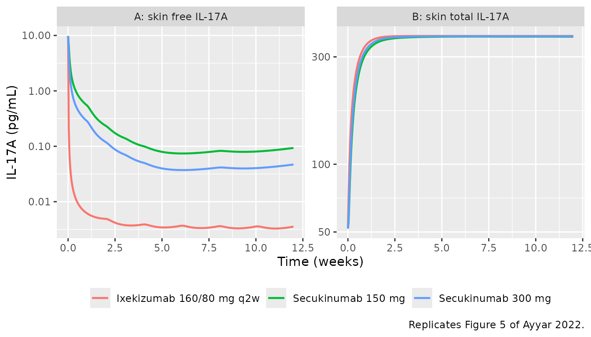
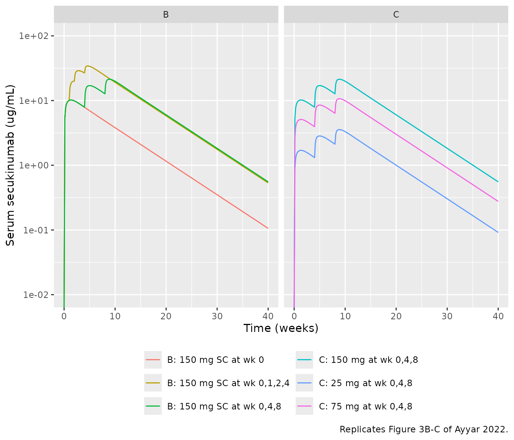
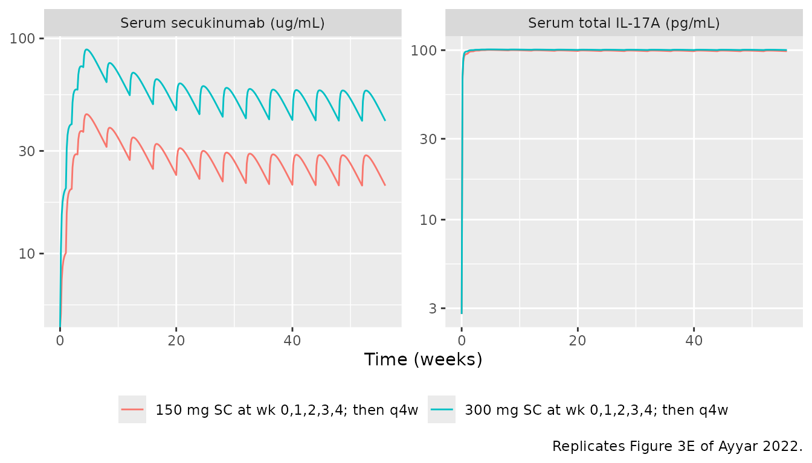
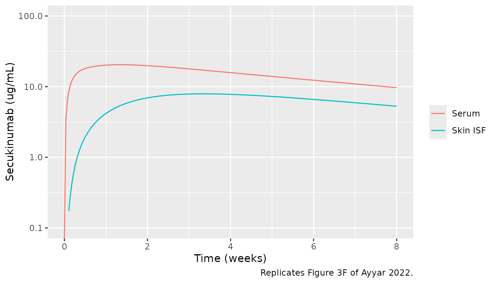
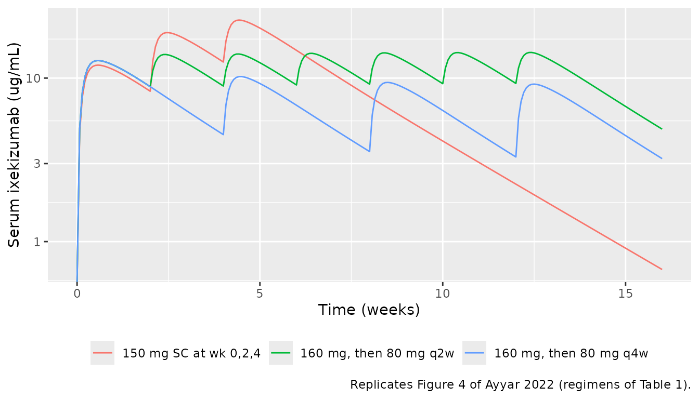
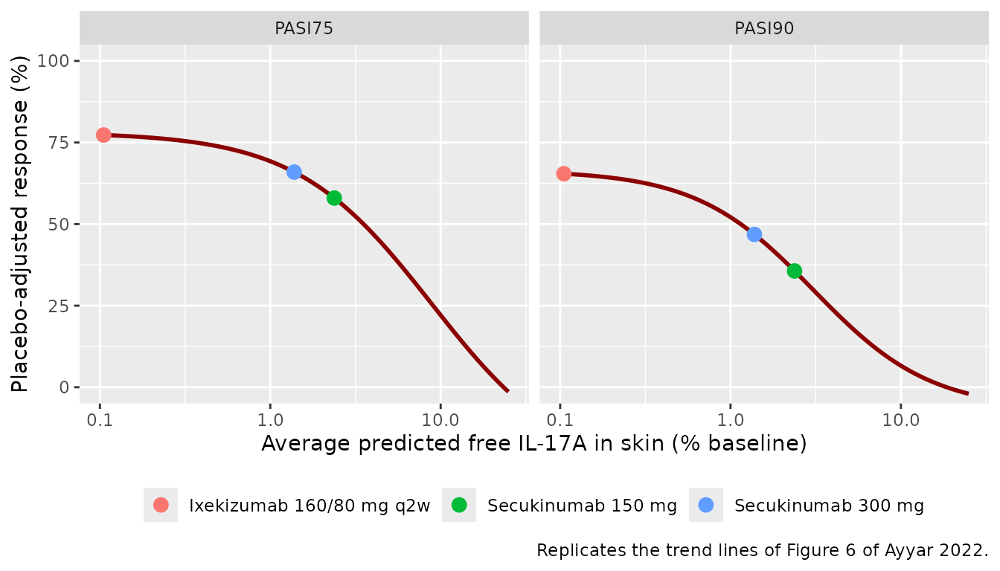
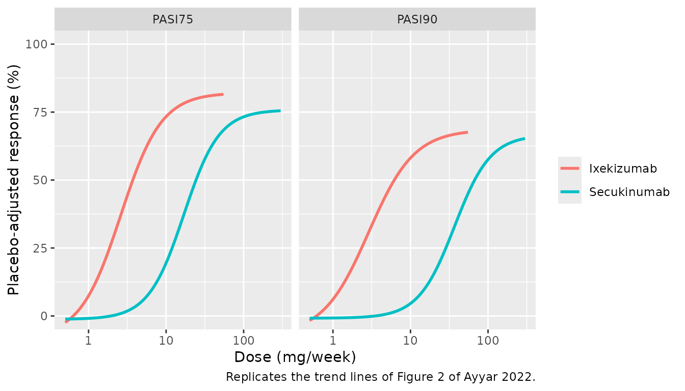

# Secukinumab + ixekizumab skin IL-17A target engagement (Ayyar 2022)

## Model and source

Ayyar et al. (2022) combined a minimal physiologically based PK (mPBPK)
model with model-based meta-analyses (MBMA) for the two marketed
anti-IL-17A antibodies, secukinumab and ixekizumab. The aim was to
predict free IL-17A suppression (target engagement, TE) in psoriatic
skin and relate it to clinical response. The paper contributes four
model files to the library:

| Model | Content |
|----|----|
| `Ayyar_2022_secukinumab_mpbpk` | mPBPK + quasi-equilibrium TMDD in serum and skin for secukinumab, plus the TE-based PASI75 / PASI90 MBMA |
| `Ayyar_2022_ixekizumab_mpbpk` | the same structure with the ixekizumab drug parameters |
| `Ayyar_2022_secukinumab_mbma` | dose-based PASI75 / PASI90 MBMA for secukinumab (Figure 2) |
| `Ayyar_2022_ixekizumab_mbma` | dose-based PASI75 / PASI90 MBMA for ixekizumab (Figure 2) |

- Citation: Ayyar VS, Lee JB, Wang W, Pryor M, Zhuang Y, Wilde T,
  Vermeulen A. Minimal Physiologically-Based Pharmacokinetic (mPBPK)
  Metamodeling of Target Engagement in Skin Informs Anti-IL17A Drug
  Development in Psoriasis. Front Pharmacol. 2022;13:862291.
  <doi:10.3389/fphar.2022.862291>
- Article: <https://doi.org/10.3389/fphar.2022.862291> (open access)
- Supplementary Material: DataSheet1 (model equations) and DataSheet2
  (NONMEM control stream for secukinumab), linked from the article page.

``` r

mod_sec <- rxode2::rxode2(readModelDb("Ayyar_2022_secukinumab_mpbpk"))
mod_ixe <- rxode2::rxode2(readModelDb("Ayyar_2022_ixekizumab_mpbpk"))
mbma_sec <- rxode2::rxode2(readModelDb("Ayyar_2022_secukinumab_mbma"))
mbma_ixe <- rxode2::rxode2(readModelDb("Ayyar_2022_ixekizumab_mbma"))
```

## Population

All data came from published reports and regulatory reviews, extracted
as group means (Table 1 of the paper). Secukinumab data came from the
Phase 2 proof-of-concept study (FDA 2015, N = 36), the low dose-ranging
study (Papp 2013, N = 125), the high dose-ranging and regimen-finding
studies (Rich 2013, N = 100 and 404), the Phase 3 ERASURE, FIXTURE and
FEATURE studies (N = 734, 974, 176), and the open-flow microperfusion
skin biodistribution study (Dragatin 2016). Ixekizumab data came from
the Phase 1 dose-escalation study (FDA 2016, N = 46), the Phase 2
dose-ranging study (Leonardi 2012, N = 141) and the Phase 3
UNCOVER-1/2/3 studies (Papp 2018). All participants were adults with
moderate-to-severe plaque psoriasis. Individual demographics were not
available. The mPBPK model was fitted in NONMEM 7.4 (FOCE-I) to mean
data (naive pooling) with the omega matrix fixed to zero, so the models
have no between-subject variability. The MBMAs were fitted by `nls` to
placebo-adjusted week-12 response rates. The same information is in each
model’s `population` metadata.

## Model structure and units

The model follows Supplementary Eq. 1-12 and the `$DES` block of the
secukinumab control stream:

- An SC depot drains into plasma at `ka`, with bioavailability `F`.
- Free drug leaves plasma by convection into three interstitial spaces:
  skin (`is_skin`), muscle (`is_muscle`) and lumped leaky tissues
  (`leaky`). The flows are `L * (1 - sigma)`. Drug returns through
  `lymph` at `L * (1 - sigma_L)`.
- Free drug is cleared from plasma at the linear clearance `CL`.
- IL-17A binds drug under quasi-equilibrium (QE) in plasma and in skin
  ISF, with the drug’s `KD`. Total IL-17A follows
  `dRtot/dt = ksyn - kdeg * (Rtot - AR) - kint * AR`, where `AR` is the
  complex. The complex is eliminated at `kint`, so the total-drug states
  lose `kint * AR * V`.

The paper reports KD and the IL-17A baselines in pM, and its QE
equations mix them with drug concentrations. The NONMEM model must
therefore have run in molar units. **The models here take doses in pmol
and report every concentration in pM.** The paper does not state the
antibody molecular weight. This vignette uses a nominal 150 kDa IgG
(`1 mg = 6667 pmol`), the same convention as
`Zheng_2020_CNTO5048_mouse_mpbpk`, which comes from the same group. Drug
concentrations are converted back to ug/mL with the same factor. With
this factor the model reproduces the paper’s printed TE values to the
printed precision (below).

``` r

mw_mab <- 150000 # g/mol, nominal IgG (not stated in the paper)
mg_to_pmol <- function(mg) mg * 1e9 / mw_mab
pM_to_ugmL <- function(pM) pM * mw_mab / 1e9
# Empirical display factors for IL-17A, read from the paper's own figures.
# TOTAL IL-17A: the serum line of Figure 3E runs from about 2.8 pg/mL (baseline
# 0.015 pM) to about 100 pg/mL (plateau 0.54 pM), and the skin line of Figure
# 5B from about 50 to about 360 pg/mL (0.28 to 2.0 pM): about 185 pg/mL per pM.
# FREE IL-17A: the skin line of Figure 5A starts at about 10 pg/mL (0.28 pM)
# and the secukinumab 300 mg line sits at about 0.04 pg/mL at week 8 (0.0012
# pM): about 35 pg/mL per pM.
il17_total_pgmL_per_pM <- 185
il17_free_pgmL_per_pM <- 35
```

The two factors are used only to put IL-17A on the same pg/mL axes as
the paper’s figures. They are not part of any model. 35 pg/mL per pM is
the mass of the ~35 kDa IL-17A homodimer. 185 pg/mL per pM equals the
mass of a 150 kDa antibody bound to IL-17A, as if total IL-17A (almost
all of it complexed) had been converted with the complex mass.

## Source trace

| Equation / parameter | Secukinumab | Ixekizumab | Source location |
|----|----|----|----|
| ODE system | – | – | Supplementary DataSheet1 Eq. 1-8; DataSheet2 `$DES` |
| QE free drug, complex | – | – | DataSheet1 Eq. 9-12; DataSheet2 `$DES` |
| `lcl` (CL) | 0.154 L/day | 0.379 L/day | Table 2 (estimated) |
| `lfdepot` (F) | 0.729 | 0.81 | Table 2 (fixed; popPK) |
| `lka` (ka) | 0.18 1/day | 0.24 1/day | Table 2 (fixed; popPK) |
| `llymphflow` (L) | 2.9 L/day | shared | Table 2 |
| `llymphflow_skin` / `_muscle` / `_leaky` | 0.247 / 0.71 / 1.943 L/day | shared | Table 2 |
| `lvc` (Vp) | 2.6 L | shared | Table 2 |
| `lvleaky` (V2) | 4.368 L | shared | DataSheet2 THETA(9); Table 2 prints 4.37 |
| `lvskin` / `lvmuscle` / `lvlymph` | 1.81 / 6.3 / 2.6 L | shared | Table 2 |
| `sigma_skin` | 0.630 | 0.63 (fixed to secukinumab) | Table 2, footnote b |
| `sigma_muscle` / `sigma_l` | 0.95 / 0.2 | shared | Table 2 |
| `sigma_leaky` | 0.363 | 0.524 | Table 2 (estimated for each drug) |
| `lkdeg` / `lkdeg_skin` | 45.5 / 2.44 1/day | shared | Table 2 |
| `lkint` | 1.24 1/day | 1.24 (fixed to secukinumab) | Table 2, footnote b |
| `lkint_skin` | 0.34 1/day | shared | Table 2 (= 2.5 x Ls / Vs) |
| `lr0` / `lr0_skin` | 0.015 / 0.28 pM | shared | Table 2 |
| `ksyn` (derived) | 0.683 pM/day | shared | Table 2; DataSheet2 `$PK` |
| `lkd` (KD) | 129 pM | 1.8 pM | Table 2 |
| TE-MBMA PASI75 `e0`, `emax`, `ec50`, `hill` | 78.11, -26.94, 8.851 %, 1.094 | shared | Eq. 1; digitised Figure 6 |
| TE-MBMA PASI90 `e0`, `emax`, `ec50`, `hill` | 66.46, -6.839, 3.062 %, 1.262 | shared | Eq. 1; digitised Figure 6 |
| Dose-MBMA PASI75 `e0`, `emax`, `ed50`, `hill` | -1.245, 75.82, 16.94 mg/wk, 1.898 | -7.944, 82.12, 2.605 mg/wk, 1.653 | Eq. 1; digitised Figure 2 |
| Dose-MBMA PASI90 `e0`, `emax`, `ed50`, `hill` | -0.821, 66.61, 36.91 mg/wk, 1.868 | -6.973, 68.56, 2.888 mg/wk, 1.474 | Eq. 1; digitised Figure 2 |
| Residual errors | not reported | not reported | Methods (proportional, on log concentrations) |

The paper prints none of the MBMA parameter values. The maintainers
digitised each trend line from the figure images in the article PDF and
refitted Eq. 1,
`Response = E0 + x^hill * (Emax - E0) / (x^hill + E50^hill)`, by `nls`
to the digitised points. The refits reproduce the digitised lines to
within 1 percentage point (residual SD 0.14-0.9 points). The MBMA
outputs are fractions on a 0-1 scale (the paper uses percent).

## Helpers

``` r

# One-subject event table: SC doses into the depot (pmol) and an observation
# grid. Observation rows carry no compartment; with several declared
# endpoints rxode2 then returns every output on each row.
make_events <- function(dose_mg, dose_day, obs_days, cmt = "depot", id = 1L) {
  doses <- data.frame(
    id = id, time = dose_day, amt = mg_to_pmol(dose_mg), cmt = cmt,
    evid = 1L, dvid = NA_integer_
  )
  obs <- data.frame(
    id = id, time = obs_days, amt = 0, cmt = NA_character_,
    evid = 0L, dvid = 1L
  )
  out <- rbind(doses, obs)
  out[order(out$time, -out$evid), ]
}

solve_regimen <- function(mod, dose_mg, dose_day, obs_days, label) {
  ev <- make_events(dose_mg, dose_day, obs_days)
  rxode2::rxSolve(mod, ev, returnType = "data.frame") |>
    dplyr::mutate(regimen = label)
}

# Approved-regimen dosing up to (not including) the week-12 read-out
sec_days <- c(0, 7, 14, 21, 28, 56) # weeks 0, 1, 2, 3, 4, then q4w
ixe_days <- c(0, 14, 28, 42, 56, 70) # 160 mg at week 0, then 80 mg q2w
grid12 <- seq(0, 84, by = 0.25)
```

## Baseline steady state

Without drug, total IL-17A must stay at its baseline in both serum and
skin: `ksyn = kdeg * R0` in each space.

``` r

nodose <- data.frame(
  id = 1L, time = c(0, 28, 84), amt = 0, cmt = NA_character_,
  evid = 0L, dvid = 1L
)
bl <- rxode2::rxSolve(mod_sec, nodose, returnType = "data.frame")
bl[, c("time", "Ctotal_target", "Ctotal_target_skin", "Cfree_target_skin")]
#>   time Ctotal_target Ctotal_target_skin Cfree_target_skin
#> 1    0         0.015               0.28              0.28
#> 2   28         0.015               0.28              0.28
#> 3   84         0.015               0.28              0.28
stopifnot(
  all(abs(bl$Ctotal_target / 0.015 - 1) < 1e-6),
  all(abs(bl$Ctotal_target_skin / 0.28 - 1) < 1e-6)
)
```

## Target engagement at the approved regimens (Results, Figure 6)

The paper’s headline numbers are the 12-week average skin TE: **98.6%**
for secukinumab 300 mg at weeks 0, 1, 2, 3, 4 then q4w, and **99.9%**
for ixekizumab 160 mg then 80 mg q2w (Results and Discussion). In other
words, free skin IL-17A averaged 1.4% and 0.1% of baseline. Figure 6
also marks secukinumab 150 mg at about 2.4% of baseline. Each model
carries the running average as `free_target_skin_avg_pct`, defined as
the cumulative free skin IL-17A divided by elapsed time. Its value at
day 84 is the paper’s metric.

``` r

sims12 <- dplyr::bind_rows(
  solve_regimen(mod_sec, rep(300, 6), sec_days, grid12, "Secukinumab 300 mg"),
  solve_regimen(mod_sec, rep(150, 6), sec_days, grid12, "Secukinumab 150 mg"),
  solve_regimen(mod_ixe, c(160, rep(80, 5)), ixe_days, grid12, "Ixekizumab 160/80 mg q2w")
)
te <- sims12 |>
  dplyr::filter(time == 84) |>
  dplyr::transmute(
    regimen,
    `Average free skin IL-17A (% baseline)` = round(free_target_skin_avg_pct, 3),
    `Average TE (%)` = round(te_skin_avg_pct, 2),
    `Published` = c("98.6% TE", "about 2.4% free (Figure 6 arrow)", "99.9% TE"),
    `PASI75 (placebo-adjusted)` = round(prob_pasi75_pbo_adj, 3),
    `PASI90 (placebo-adjusted)` = round(prob_pasi90_pbo_adj, 3)
  )
knitr::kable(te)
```

| regimen | Average free skin IL-17A (% baseline) | Average TE (%) | Published | PASI75 (placebo-adjusted) | PASI90 (placebo-adjusted) |
|:---|---:|---:|:---|---:|---:|
| Secukinumab 300 mg | 1.381 | 98.62 | 98.6% TE | 0.659 | 0.468 |
| Secukinumab 150 mg | 2.376 | 97.62 | about 2.4% free (Figure 6 arrow) | 0.580 | 0.356 |
| Ixekizumab 160/80 mg q2w | 0.105 | 99.89 | 99.9% TE | 0.773 | 0.654 |

``` r


# The solve is deterministic (no random effects), so these bounds can be tight;
# they still leave room for the nominal 150 kDa molecular weight.
stopifnot(
  abs(te$`Average TE (%)`[1] - 98.6) < 0.1,
  abs(te$`Average free skin IL-17A (% baseline)`[2] - 2.4) < 0.25,
  abs(te$`Average TE (%)`[3] - 99.9) < 0.05
)
```

All three reproduce the paper. The TE result depends only weakly on the
assumed molecular weight:

``` r

mw_sens <- lapply(c(140000, 150000, 160000), function(mw) {
  ev <- make_events(rep(300, 6), sec_days, 84)
  ev$amt[ev$evid == 1] <- 300 * 1e9 / mw
  s <- rxode2::rxSolve(mod_sec, ev, returnType = "data.frame")
  data.frame(`MW (kDa)` = mw / 1000, `Secukinumab 300 mg average TE (%)` = round(s$te_skin_avg_pct, 3), check.names = FALSE)
})
knitr::kable(do.call(rbind, mw_sens))
```

| MW (kDa) | Secukinumab 300 mg average TE (%) |
|---------:|----------------------------------:|
|      140 |                            98.691 |
|      150 |                            98.619 |
|      160 |                            98.547 |

## Figure 5: skin IL-17A for the approved regimens

``` r

sims12 |>
  dplyr::select(time, regimen, Cfree_target_skin, Ctotal_target_skin) |>
  tidyr::pivot_longer(c(Cfree_target_skin, Ctotal_target_skin), names_to = "species", values_to = "pM") |>
  dplyr::mutate(
    species = dplyr::recode(species, Cfree_target_skin = "A: skin free IL-17A", Ctotal_target_skin = "B: skin total IL-17A"),
    pgmL = pM * ifelse(grepl("free", species), il17_free_pgmL_per_pM, il17_total_pgmL_per_pM)
  ) |>
  ggplot(aes(time / 7, pgmL, colour = regimen)) +
  geom_line(linewidth = 0.8) +
  facet_wrap(~species, scales = "free_y") +
  scale_y_log10() +
  labs(
    x = "Time (weeks)", y = "IL-17A (pg/mL)", colour = NULL,
    caption = "Replicates Figure 5 of Ayyar 2022."
  ) +
  theme(legend.position = "bottom")
```



In Figure 5A at week 8, free skin IL-17A is about 0.08 pg/mL for
secukinumab 150 mg, 0.04 pg/mL for 300 mg and 0.0035 pg/mL for
ixekizumab. In Figure 5B, total skin IL-17A plateaus within 2-3 weeks,
at about 360 / 50 times its baseline. These ratios do not depend on any
unit conversion, so they are checked here.

``` r

wk8 <- sims12 |>
  dplyr::filter(time == 56) |>
  dplyr::select(regimen, Cfree_target_skin, Ctotal_target_skin)
wk8
#>                    regimen Cfree_target_skin Ctotal_target_skin
#> 1       Secukinumab 300 mg      0.0011797405           2.002353
#> 2       Secukinumab 150 mg      0.0023499601           1.995349
#> 3 Ixekizumab 160/80 mg q2w      0.0001029483           2.008799
free_300 <- wk8$Cfree_target_skin[wk8$regimen == "Secukinumab 300 mg"]
ratio_150 <- wk8$Cfree_target_skin[wk8$regimen == "Secukinumab 150 mg"] / free_300
ratio_ixe <- wk8$Cfree_target_skin[wk8$regimen == "Ixekizumab 160/80 mg q2w"] / free_300
c(ratio_150 = ratio_150, ratio_ixe = ratio_ixe)
#>  ratio_150  ratio_ixe 
#> 1.99192969 0.08726354
stopifnot(
  abs(log(ratio_150 / (0.08 / 0.04))) < log(1.3),
  abs(log(ratio_ixe / (0.0035 / 0.04))) < log(1.3),
  all(abs(wk8$Ctotal_target_skin / 0.28 / (360 / 50) - 1) < 0.15)
)
```

## Figure 3: secukinumab serum PK, serum total IL-17A and skin PK

The SC panels need no body weight, so they are reproduced here: the
regimen-finding study (Figure 3B), the low dose-ranging study (Figure
3C), the Phase 3 regimens (Figure 3E) and the biodistribution study
(Figure 3F). The IV panels (Figure 3A, 3D) are dosed in mg/kg, and the
paper does not state the body weight it used, so they are not
reproduced.

``` r

g40 <- seq(0, 280, by = 1)
fig3 <- dplyr::bind_rows(
  solve_regimen(mod_sec, 150, 0, g40, "B: 150 mg SC at wk 0"),
  solve_regimen(mod_sec, rep(150, 3), c(0, 28, 56), g40, "B: 150 mg SC at wk 0,4,8"),
  solve_regimen(mod_sec, rep(150, 4), c(0, 7, 14, 28), g40, "B: 150 mg SC at wk 0,1,2,4"),
  solve_regimen(mod_sec, rep(25, 3), c(0, 28, 56), g40, "C: 25 mg at wk 0,4,8"),
  solve_regimen(mod_sec, rep(75, 3), c(0, 28, 56), g40, "C: 75 mg at wk 0,4,8"),
  solve_regimen(mod_sec, rep(150, 3), c(0, 28, 56), g40, "C: 150 mg at wk 0,4,8")
) |>
  dplyr::mutate(panel = substr(regimen, 1, 1), Cc_ugmL = pM_to_ugmL(Cc))
ggplot(fig3, aes(time / 7, Cc_ugmL, colour = regimen)) +
  geom_line() +
  facet_wrap(~panel, ncol = 2) +
  scale_y_log10(limits = c(0.01, 100)) +
  labs(
    x = "Time (weeks)", y = "Serum secukinumab (ug/mL)", colour = NULL,
    caption = "Replicates Figure 3B-C of Ayyar 2022."
  ) +
  theme(legend.position = "bottom") +
  guides(colour = guide_legend(ncol = 2))
#> Warning in scale_y_log10(limits = c(0.01, 100)): log-10 transformation
#> introduced infinite values.
```



``` r

sec_p3_days <- c(0, 7, 14, 21, seq(28, 364, by = 28))
g56 <- seq(0, 392, by = 1)
fig3e <- dplyr::bind_rows(
  solve_regimen(mod_sec, rep(150, length(sec_p3_days)), sec_p3_days, g56, "150 mg SC at wk 0,1,2,3,4; then q4w"),
  solve_regimen(mod_sec, rep(300, length(sec_p3_days)), sec_p3_days, g56, "300 mg SC at wk 0,1,2,3,4; then q4w")
)
fig3e |>
  dplyr::transmute(
    time, regimen,
    `Serum secukinumab (ug/mL)` = pM_to_ugmL(Cc),
    `Serum total IL-17A (pg/mL)` = Ctotal_target * il17_total_pgmL_per_pM
  ) |>
  tidyr::pivot_longer(-c(time, regimen)) |>
  ggplot(aes(time / 7, value, colour = regimen)) +
  geom_line() +
  facet_wrap(~name, scales = "free_y") +
  scale_y_log10() +
  labs(x = "Time (weeks)", y = NULL, colour = NULL, caption = "Replicates Figure 3E of Ayyar 2022.") +
  theme(legend.position = "bottom")
#> Warning in scale_y_log10(): log-10 transformation introduced infinite values.
```



In Figure 3E, the 300 mg troughs run at about 30-40 ug/mL and the 150 mg
troughs at about 15-20 ug/mL, and serum total IL-17A rises from about
2.8 to about 100 pg/mL. The conversion-free check is the IL-17A
plateau/baseline ratio (about 100 / 2.8) and the trough concentrations:

``` r

e_chk <- fig3e |>
  dplyr::filter(time == 364) |>
  dplyr::mutate(trough_ugmL = pM_to_ugmL(Cc), il17_ratio = Ctotal_target / 0.015)
e_chk[, c("regimen", "trough_ugmL", "il17_ratio")]
#>                               regimen trough_ugmL il17_ratio
#> 1 150 mg SC at wk 0,1,2,3,4; then q4w    20.69945   35.52510
#> 2 300 mg SC at wk 0,1,2,3,4; then q4w    41.40166   36.09977
stopifnot(
  all(abs(e_chk$il17_ratio / (100 / 2.8) - 1) < 0.15),
  e_chk$trough_ugmL[1] > 12, e_chk$trough_ugmL[1] < 25,
  e_chk$trough_ugmL[2] > 25, e_chk$trough_ugmL[2] < 50
)
```

``` r

fig3f <- solve_regimen(mod_sec, 300, 0, seq(0, 56, by = 0.25), "300 mg SC")
fig3f |>
  dplyr::transmute(time, `Serum` = pM_to_ugmL(Cc), `Skin ISF` = pM_to_ugmL(Cis_skin)) |>
  tidyr::pivot_longer(-time) |>
  ggplot(aes(time / 7, value, colour = name)) +
  geom_line() +
  scale_y_log10(limits = c(0.1, 100)) +
  labs(x = "Time (weeks)", y = "Secukinumab (ug/mL)", colour = NULL, caption = "Replicates Figure 3F of Ayyar 2022.")
#> Warning in scale_y_log10(limits = c(0.1, 100)): log-10 transformation
#> introduced infinite values.
```



Figure 3F shows serum secukinumab at about 20 ug/mL over weeks 1-2. Skin
rises to about 8 ug/mL by week 3 and then declines in parallel with
serum.

## Figure 4: ixekizumab serum PK

``` r

ixe_q2w <- c(0, seq(14, 84, by = 14))
ixe_q4w <- c(0, seq(28, 84, by = 28))
g12 <- seq(0, 112, by = 0.5)
fig4 <- dplyr::bind_rows(
  solve_regimen(mod_ixe, c(160, rep(80, length(ixe_q2w) - 1)), ixe_q2w, g12, "160 mg, then 80 mg q2w"),
  solve_regimen(mod_ixe, c(160, rep(80, length(ixe_q4w) - 1)), ixe_q4w, g12, "160 mg, then 80 mg q4w"),
  solve_regimen(mod_ixe, rep(150, 3), c(0, 14, 28), g12, "150 mg SC at wk 0,2,4")
)
ggplot(fig4, aes(time / 7, pM_to_ugmL(Cc), colour = regimen)) +
  geom_line() +
  scale_y_log10() +
  labs(x = "Time (weeks)", y = "Serum ixekizumab (ug/mL)", colour = NULL, caption = "Replicates Figure 4 of Ayyar 2022 (regimens of Table 1).") +
  theme(legend.position = "bottom")
#> Warning in scale_y_log10(): log-10 transformation introduced infinite values.
```



## Figure 6: TE-based MBMA

The TE-MBMA trend line is shared by the two drugs. Here it is evaluated
directly from the model parameters over the plotted range of free skin
IL-17A, and the three approved regimens are placed on it at their
simulated TE.

``` r

p <- as.list(mod_sec$theta)
te_curve <- function(x, e0, emax, ec50, h) e0 + x^h * (emax - e0) / (x^h + ec50^h)
xx <- 10^seq(-1, log10(25), length.out = 200)
curves <- dplyr::bind_rows(
  data.frame(endpoint = "PASI75", x = xx, y = te_curve(xx, p$e0_pasi75, p$emax_pasi75, exp(p$lec50_pasi75), p$hill_pasi75)),
  data.frame(endpoint = "PASI90", x = xx, y = te_curve(xx, p$e0_pasi90, p$emax_pasi90, exp(p$lec50_pasi90), p$hill_pasi90))
)
pts <- sims12 |>
  dplyr::filter(time == 84) |>
  dplyr::select(regimen, x = free_target_skin_avg_pct, PASI75 = prob_pasi75_pbo_adj, PASI90 = prob_pasi90_pbo_adj) |>
  tidyr::pivot_longer(c(PASI75, PASI90), names_to = "endpoint", values_to = "y") |>
  dplyr::mutate(y = 100 * y)
ggplot(curves, aes(x, y)) +
  geom_line(colour = "darkred", linewidth = 1) +
  geom_point(data = pts, aes(colour = regimen), size = 3) +
  facet_wrap(~endpoint) +
  scale_x_log10() +
  coord_cartesian(ylim = c(0, 100)) +
  labs(
    x = "Average predicted free IL-17A in skin (% baseline)",
    y = "Placebo-adjusted response (%)", colour = NULL,
    caption = "Replicates the trend lines of Figure 6 of Ayyar 2022."
  ) +
  theme(legend.position = "bottom")
```



Figure 6 shows the trend line at about 77% (PASI75) and 66% (PASI90)
near 0.1% free IL-17A, and crossing 0 at about 23% (PASI75) and 18%
(PASI90). The digitised parameters reproduce this:

``` r

chk6 <- c(
  p75_at_0.1 = te_curve(0.1, p$e0_pasi75, p$emax_pasi75, exp(p$lec50_pasi75), p$hill_pasi75),
  p90_at_0.1 = te_curve(0.1, p$e0_pasi90, p$emax_pasi90, exp(p$lec50_pasi90), p$hill_pasi90),
  p75_at_23 = te_curve(23, p$e0_pasi75, p$emax_pasi75, exp(p$lec50_pasi75), p$hill_pasi75),
  p90_at_18 = te_curve(18, p$e0_pasi90, p$emax_pasi90, exp(p$lec50_pasi90), p$hill_pasi90)
)
round(chk6, 1)
#> p75_at_0.1 p90_at_0.1  p75_at_23  p90_at_18 
#>       77.3       65.5        0.4        0.2
stopifnot(
  abs(chk6[["p75_at_0.1"]] - 77) < 2, abs(chk6[["p90_at_0.1"]] - 66) < 2,
  abs(chk6[["p75_at_23"]]) < 3, abs(chk6[["p90_at_18"]]) < 3
)
```

## Figure 2: dose-based MBMA

The dose-based models are purely algebraic. They take the arm’s average
weekly dose over 12 weeks as the covariate `DOSE_<drug>_MGWK` and need
no dose events.

``` r

dose_grid <- function(drug, xmax) {
  x <- 10^seq(log10(0.5), log10(xmax), length.out = 100)
  d <- data.frame(id = seq_along(x), time = 0, evid = 0L, amt = 0, x = x)
  if (drug == "Secukinumab") d$DOSE_SECUKINUMAB_MGWK <- x else d$DOSE_IXEKIZUMAB_MGWK <- x
  d
}
fig2 <- dplyr::bind_rows(
  rxode2::rxSolve(mbma_sec, dose_grid("Secukinumab", 300), keep = "x", returnType = "data.frame") |> dplyr::mutate(drug = "Secukinumab"),
  rxode2::rxSolve(mbma_ixe, dose_grid("Ixekizumab", 55), keep = "x", returnType = "data.frame") |> dplyr::mutate(drug = "Ixekizumab")
) |>
  dplyr::select(drug, x, PASI75 = prob_pasi75_pbo_adj, PASI90 = prob_pasi90_pbo_adj) |>
  tidyr::pivot_longer(c(PASI75, PASI90), names_to = "endpoint", values_to = "y")
#> Warning: multi-subject simulation without without 'omega'
#> Warning: multi-subject simulation without without 'omega'
ggplot(fig2, aes(x, 100 * y, colour = drug)) +
  geom_line(linewidth = 1) +
  facet_wrap(~endpoint) +
  scale_x_log10() +
  coord_cartesian(ylim = c(0, 100)) +
  labs(
    x = "Dose (mg/week)", y = "Placebo-adjusted response (%)", colour = NULL,
    caption = "Replicates the trend lines of Figure 2 of Ayyar 2022."
  )
```



``` r

# Figure 2 trend lines read at 10 and 100 mg/week (secukinumab) and at 2 and
# 20 mg/week (ixekizumab).
f2 <- fig2 |>
  dplyr::group_by(drug, endpoint) |>
  dplyr::summarise(
    lo = approx(log(x), 100 * y, xout = log(ifelse(drug[1] == "Secukinumab", 10, 2)))$y,
    hi = approx(log(x), 100 * y, xout = log(ifelse(drug[1] == "Secukinumab", 100, 20)))$y,
    .groups = "drop"
  )
knitr::kable(f2, digits = 1)
```

| drug        | endpoint |   lo |   hi |
|:------------|:---------|-----:|-----:|
| Ixekizumab  | PASI75   | 27.4 | 79.1 |
| Ixekizumab  | PASI90   | 20.8 | 64.4 |
| Secukinumab | PASI75   | 19.5 | 73.3 |
| Secukinumab | PASI90   |  4.6 | 57.5 |

``` r

# Digitised Figure 2 trend-line values at the same doses
fig2_read <- c(
  "Ixekizumab.PASI75" = 25.5, "Ixekizumab.PASI90" = 20.2,
  "Secukinumab.PASI75" = 19.8, "Secukinumab.PASI90" = 3.8
)
fig2_read_hi <- c(
  "Ixekizumab.PASI75" = 78.9, "Ixekizumab.PASI90" = 64.6,
  "Secukinumab.PASI75" = 72.7, "Secukinumab.PASI90" = 56.8
)
key <- paste(f2$drug, f2$endpoint, sep = ".")
stopifnot(
  all(abs(f2$lo - fig2_read[key]) < 3),
  all(abs(f2$hi - fig2_read_hi[key]) < 3)
)
```

Read off Figure 2, the secukinumab PASI75 line is at about 20% at 10
mg/week and 73% at 100 mg/week. The ixekizumab line is at about 26% at 2
mg/week and 79% at 20 mg/week.

The Methods define the dose regressor as the total dose given over the
first 12 weeks divided by 12 weeks. The trial arms in Figure 2 are
plotted below that definition. The Phase 3 secukinumab 150 mg and 300 mg
arms sit at about 55 and 110 mg/week rather than 900 / 12 = 75 and 1800
/ 12 = 150. The Phase 3 ixekizumab 80 mg q4w and q2w arms sit at about
22 and 38 mg/week rather than 320 / 12 = 27 and 560 / 12 = 47. The paper
does not explain the difference. The trend lines are reproduced as
plotted, so a user who computes the regressor from the stated definition
will place a regimen to the right of where the paper plotted it.

## PKNCA: single-dose serum PK

The paper reports no NCA. The table below gives the single-dose serum
NCA of the typical-value model for each drug’s SC doses, for reference.
The model clearances (0.154 and 0.379 L/day) are close to the popPK
total clearances the paper cites (0.19 and 0.29 L/day).

``` r

nca_days <- seq(0, 168, by = 1)
nca_sim <- dplyr::bind_rows(
  solve_regimen(mod_sec, 150, 0, nca_days, "Secukinumab 150 mg SC"),
  solve_regimen(mod_sec, 300, 0, nca_days, "Secukinumab 300 mg SC"),
  solve_regimen(mod_ixe, 80, 0, nca_days, "Ixekizumab 80 mg SC"),
  solve_regimen(mod_ixe, 160, 0, nca_days, "Ixekizumab 160 mg SC")
) |>
  dplyr::mutate(id = as.integer(factor(regimen)), Cc = pM_to_ugmL(Cc)) |>
  dplyr::filter(!is.na(Cc)) |>
  dplyr::select(id, time, Cc, treatment = regimen)
dose_df <- nca_sim |>
  dplyr::distinct(id, treatment) |>
  dplyr::mutate(time = 0, dose = as.numeric(sub(".* ([0-9]+) mg SC", "\\1", treatment)))

conc_obj <- PKNCA::PKNCAconc(nca_sim, Cc ~ time | treatment + id)
dose_obj <- PKNCA::PKNCAdose(dose_df, dose ~ time | treatment + id)
intervals <- data.frame(start = 0, end = Inf, cmax = TRUE, tmax = TRUE, aucinf.obs = TRUE, half.life = TRUE)
nca_res <- PKNCA::pk.nca(PKNCA::PKNCAdata(conc_obj, dose_obj, intervals = intervals))
nca_tab <- as.data.frame(nca_res$result) |>
  dplyr::filter(PPTESTCD %in% c("cmax", "tmax", "aucinf.obs", "half.life")) |>
  dplyr::select(treatment, PPTESTCD, PPORRES) |>
  tidyr::pivot_wider(names_from = PPTESTCD, values_from = PPORRES) |>
  dplyr::rename(
    Regimen = treatment,
    `Cmax (ug/mL)` = cmax,
    `Tmax (day)` = tmax,
    `AUC0-inf (ug*day/mL)` = aucinf.obs,
    `t1/2 (day)` = half.life
  )
knitr::kable(nca_tab, digits = 2)
```

| Regimen | Cmax (ug/mL) | Tmax (day) | t1/2 (day) | AUC0-inf (ug\*day/mL) |
|:---|---:|---:|---:|---:|
| Ixekizumab 160 mg SC | 12.80 | 4 | 15.89 | 340.74 |
| Ixekizumab 80 mg SC | 6.40 | 4 | 15.80 | 170.29 |
| Secukinumab 150 mg SC | 10.20 | 9 | 40.58 | 708.87 |
| Secukinumab 300 mg SC | 20.41 | 9 | 40.60 | 1418.13 |

## Assumptions and deviations

- **Molar units and molecular weight.** The models take doses in pmol
  and report pM. The paper does not state the antibody molecular weight;
  this vignette uses a nominal 150 kDa (`1 mg = 6667 pmol`). With it,
  the printed TE values (98.6% and 99.9%) are reproduced to the printed
  precision, and a +/- 10 kDa change moves them by less than 0.1
  percentage point.
- **IL-17A pg/mL axes.** The paper’s figures report IL-17A in pg/mL but
  do not state the conversion from the model’s pM, and the panels are
  not consistent. The free IL-17A of Figure 5A corresponds to about 35
  pg/mL per pM, the mass of the IL-17A homodimer. The total IL-17A of
  Figures 3E and 5B corresponds to about 185 pg/mL per pM, the mass of
  an antibody-IL-17A complex. The models reproduce the paper’s pM values
  (Table 2 baselines). The two factors are used here only for display,
  and the checks above use conversion-free ratios. A user comparing
  total IL-17A with assay data in pg/mL of IL-17A should note that the
  fitted serum total IL-17A data appear to have been converted with the
  complex mass.
- **Ixekizumab parameters fixed to secukinumab.** Table 2 footnote b
  states that the ixekizumab serum complex elimination rate `kint` and
  skin reflection coefficient `sigma_skin` were “assumed to be the same
  as for secukinumab”. They are coded as `fixed()` in the ixekizumab
  model.
- **Leaky-tissue volume.** The control stream fixes V2 = 4.368 L; Table
  2 prints the rounded 4.37 L. The unrounded value is used.
- **Lymph equation.** DataSheet1 Eq. 6 writes the lymph inflows with the
  vascular reflection coefficients `(1 - sigma_sk)`, `(1 - sigma_1)` and
  `(1 - sigma_2)`. The tissue equations (Eq. 3-5) and the control stream
  use the lymphatic coefficient `(1 - sigma_L)` for the same flows. The
  control stream form is used because it conserves mass between tissue
  and lymph.
- **IIV.** The Methods state that IIV was not considered and the
  variance-covariance matrix was fixed to zero. The supplementary
  control stream nevertheless carries two estimable omegas (CL and Vp)
  with initial value 0.1. The models follow the Methods and have no
  random effects.
- **Residual error.** Each fitted output had an additive error on log
  concentrations, which the paper calls proportional. The magnitudes are
  not reported, so they are `lnorm()` with standard deviation
  `fixed(0)`.
- **QE free-drug formula.** The printed
  `0.5 * (a + sqrt(a^2 + 4 KD C))`, with `a = C - KD - Rtot`, loses
  precision at low drug concentration. The models use the algebraically
  identical `2 KD C / (sqrt(a^2 + 4 KD C) - a)` when `a < 0`.
- **SC bioavailability.** The control stream multiplies the absorption
  rate by F. The models put F on the depot dose instead (`f(depot)`),
  which gives the same plasma input.
- **MBMA parameters digitised.** None of the MBMA parameters are
  printed. They were digitised from the Figure 2 and Figure 6 trend
  lines and refitted. The dose-based E0 values are slightly negative
  because the plotted lines start at 0.5 mg/week and do not identify E0.
  Below 3 mg/week the ixekizumab line is a polyline through a coarse
  simulation grid, so only its vertices were used. The TE-based PASI75
  `emax` (-26.9) lies below zero because the authors’ fit reaches 0%
  response at about 23% free IL-17A without leveling off. Use the MBMAs
  only over the plotted ranges.
- **IV panels not reproduced.** Figures 3A and 3D use mg/kg IV doses,
  and the paper gives no body weight to convert them.
